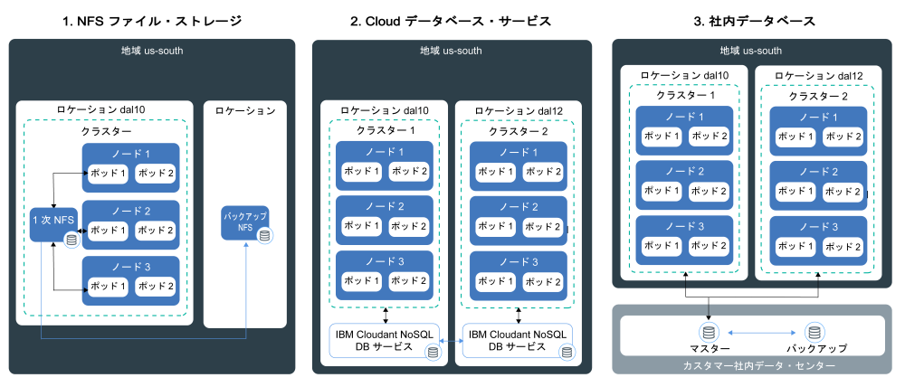
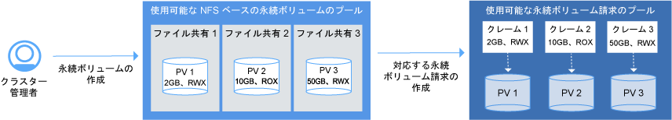

---

copyright:
  years: 2014, 2018
lastupdated: "2018-03-15"

---

{:new_window: target="_blank"}
{:shortdesc: .shortdesc}
{:screen: .screen}
{:pre: .pre}
{:table: .aria-labeledby="caption"}
{:codeblock: .codeblock}
{:tip: .tip}
{:download: .download}


# クラスター内でのデータの保存
{: #storage}
{{site.data.keyword.containerlong}} 内のデータを永続化して、アプリ・インスタンス間でデータを共有し、Kubernetes クラスター内のコンポーネントに障害が発生した場合にデータが失われないようにすることができます。

## 可用性の高いストレージの計画
{: #planning}

{{site.data.keyword.containerlong_notm}} では、アプリ・データを保管してクラスター内のポッド間でデータを共有する方法として、複数の選択肢 (オプション) の中から選択することができます。 ただし、どのストレージ・オプションでも、クラスター内のコンポーネントの障害またはサイト全体の障害が起きた場合に同じレベルの永続性と可用性が得られるというわけではありません。
{: shortdesc}

### 非永続のデータ・ストレージ・オプション
{: #non_persistent}

クラスター内のコンポーネントの障害時にデータをリカバリーできるように、データを永続的に保管する必要がない場合、または、アプリ・インスタンス間でデータを共有する必要がない場合は、非永続ストレージ・オプションを使用できます。 アプリ・コンポーネントの単体テストを行う場合や新機能を試す場合にも非永続ストレージ・オプションを使用できます。
{: shortdesc}

以下のイメージは、{{site.data.keyword.containerlong_notm}} で使用可能な非永続データ・ストレージ・オプションを示しています。 これらの方法は、フリー・クラスターと標準クラスターで使用可能です。
<p>
</p>

<table summary="この表は非永続ストレージ・オプションを示しています。行は左から右に読みます。1 列目はオプションの番号、2 列目はオプションの名称、3 列目は説明です。" style="width: 100%">
<caption>表。 非永続のストレージ・オプション</caption>
  <thead>
  <th>オプション</th>
  <th>説明</th>
  </thead>
  <tbody>
    <tr>
      <td>1. コンテナーまたはポッドの内部</td>
      <td>設計上、コンテナーやポッドの存続期間は短く、予期せぬ障害が起こることがあります。 ただし、コンテナーのローカル・ファイル・システムにデータを書き込み、コンテナーのライフサイクルにわたってデータを保管することはできます。 コンテナー内部のデータは、他のコンテナーやポッドと共有できず、コンテナーがクラッシュしたり削除されたりすると失われます。 詳しくは、[Storing data in a container](https://docs.docker.com/storage/) を参照してください。</td>
    </tr>
  <tr>
    <td>2. ワーカー・ノード上</td>
    <td>すべてのワーカー・ノードには 1 次ストレージと 2 次ストレージがセットアップされています。これはワーカー・ノードとして選択したマシン・タイプによって決まります。 1 次ストレージは、オペレーティング・システムのデータの保管に使用され、[Kubernetes <code>hostPath</code> ボリューム ](https://kubernetes.io/docs/concepts/storage/volumes/#hostpath) を使用してアクセスできます。2 次ストレージは、すべてのコンテナー・データが書き込まれる <code>/var/lib/docker</code> ディレクトリー内のデータの保管に使用されます。 2 次ストレージには、[Kubernetes <code>emptyDir</code> ボリューム ](https://kubernetes.io/docs/concepts/storage/volumes/#emptydir) を使用してアクセスできます。<br/><br/><code>hostPath</code> ボリュームは、ワーカー・ノード・ファイル・システムからポッドにファイルをマウントするために使用されますが、<code>emptyDir</code> は、クラスター内のポッドに割り当てられる空のディレクトリーを作成します。そのポッド内のすべてのコンテナーは、そのボリュームに対する読み取りと書き込みを行うことができます。 ボリュームは特定の 1 つのポッドに割り当てられるので、レプリカ・セット内の他のポッドとデータを共有することはできません。<br/><br/><p><code>hostPath</code> または <code>emptyDir</code> ボリュームとそのデータは、以下の場合に削除されます。 <ul><li>ワーカー・ノードが削除された場合。</li><li>ワーカー・ノードが再ロードされた、または更新された場合。</li><li>クラスターが削除された場合。</li><li>{{site.data.keyword.Bluemix_notm}} アカウントが一時停止状態になった場合。 </li></ul></p><p>さらに、<code>emptyDir</code> ボリューム内のデータは以下の場合に削除されます。<ul><li>割り当てられたポッドはワーカー・ノードから永久に削除されます。</li><li>割り当てられたポッドが別のワーカー・ノード上にスケジュールされた場合。</li></ul></p><p><strong>注:</strong> ポッド内のコンテナーがクラッシュした場合でも、ボリューム内のデータはワーカー・ノードで引き続き使用できます。</p></td>
    </tr>
    </tbody>
    </table>

### 高可用性のための永続データ・ストレージ・オプション
{: persistent}

可用性の高いステートフル・アプリを作成するための主要な課題は、複数の場所にある複数のアプリ・インスタンスの間でデータを保持し、常にデータの同期を保つことです。 データの高可用性を実現するためには、マスター・データベースの複数のインスタンスを複数のデータ・センターあるいは複数の地域に分散させ、さらにそのマスターのデータを継続的に複製することが必要です。 クラスター内のすべてのインスタンスが、このマスター・データベースに対して読み取りと書き込みを行う必要があります。 マスターのいずれかのインスタンスがダウンした場合は、その他のインスタンスがワークロードを引き継げるので、アプリのダウン時間は発生しません。
{: shortdesc}

以下のイメージは、標準クラスター内のデータの可用性を高めるために {{site.data.keyword.containerlong_notm}} で選択できるオプションを示しています。 どのオプションが適切かは、以下の要因に応じて決まります。
  * **所有しているアプリのタイプ:** 例えば、データをデータベース内ではなくファイル・ベースで保管しなければならないアプリがある場合があります。
  * **データの保管と転送の場所に関する法的要件:** 例えば、法律によってデータの保管と転送が米国内だけに制限されているために、欧州にあるサービスを使用できない場合があります。
  * **バックアップとリストアのオプション:** すべてのストレージ・オプションに、データをバックアップ/リストアするための機能が用意されています。 利用可能なバックアップとリストアのオプションが、バックアップの頻度や、1 次データ・センター外にデータを保管できることなどの、お客様の災害復旧計画の要件を満たしていることを確認してください。
  * **グローバルな複製:** 高可用性を実現するためには、ストレージの複数のインスタンスを、世界中のデータ・センターの間に分散させ、複製するようにセットアップすることが推奨されます。

<br/>


<table summary="この表は永続ストレージ・オプションを示しています。行は左から右に読みます。1 列目はオプションの番号、2 列目はオプションの名称、3 列目は説明です。">
<caption>表。 永続ストレージ・オプション</caption>
  <thead>
  <th>オプション</th>
  <th>説明</th>
  </thead>
  <tbody>
  <tr>
  <td>1. NFS ファイル・ストレージ</td>
  <td>このオプションでは、Kubernetes 永続ボリュームを使用して、アプリやコンテナーのデータを保持できます。 ボリュームは、[NFS ベースのエンデュランスとパフォーマンスのファイル・ストレージ ](https://www.ibm.com/cloud/file-storage/details) でホストされます。このファイル・ストレージは、データをデータベース内ではなくファイル・ベースで保管するアプリの場合に使用できます。 ファイル・ストレージは REST で暗号化されています。<p>{{site.data.keyword.containershort_notm}} には、ストレージのサイズ範囲、IOPS、削除ポリシー、ボリュームに対する読み取りと書き込みの許可を定義する、事前定義されたストレージ・クラスが用意されています。 NFS ベースのファイル・ストレージに関する要求を開始するには、[永続ボリューム請求 (PVC)](cs_storage.html#create)を作成する必要があります。 PVC をサブミットすると、NFS ベースのファイル・ストレージでホストされる永続ボリュームが {{site.data.keyword.containershort_notm}} によって動的にプロビジョンされます。 [PVC をデプロイメントのボリュームとしてマウント](cs_storage.html#app_volume_mount)すると、コンテナーがそのボリュームに対して読み取りと書き込みを行えるようになります。 </p><p>永続ボリュームは、ワーカー・ノードがあるデータ・センター内でプロビジョンされます。 同じレプリカ・セットと、または同じクラスター内の他のデプロイメントとデータを共有できます。 別のデータ・センターまたは地域にあるクラスターとデータを共有することはできません。 </p><p>デフォルトでは、NFS ストレージは自動的にバックアップされません。 用意されている[バックアップとリストアのメカニズム](cs_storage.html#backup_restore)を使用して、クラスターの定期的なバックアップをセットアップできます。 コンテナーがクラッシュしたとき、またはポッドがワーカー・ノードから削除されたときでも、データは削除されないので、ボリュームをマウントした他のデプロイメントから引き続きアクセスできます。 </p><p><strong>注:</strong> 永続 NFS ファイル共有ストレージは、月単位で課金されます。 クラスター用に永続ストレージをプロビジョンして即時にそれを削除したときは、短時間しか使用しない場合でも、永続ストレージの月額課金を支払います。</p></td>
  </tr>
  <tr>
    <td>2. Cloud データベース・サービス</td>
    <td>このオプションでは、[IBM Cloudant NoSQL DB](/docs/services/Cloudant/getting-started.html#getting-started-with-cloudant) などの {{site.data.keyword.Bluemix_notm}} データベース・クラウド・サービスを使用して、データを保持できます。 このオプションを使用して保管されたデータには、すべてのクラスター、場所、地域からアクセスできます。 <p> すべてのアプリから単一のデータベース・インスタンスにアクセスするように構成するか、[複数のインスタンスを複数のデータ・センターに分散させ、インスタンス間の複製をセットアップ](/docs/services/Cloudant/guides/active-active.html#configuring-cloudant-nosql-db-for-cross-region-disaster-recovery)して可用性を高めるかを選択できます。 IBM Cloudant NoSQL データベースでは、データは自動的にバックアップされません。 用意されている[バックアップとリストアのメカニズム](/docs/services/Cloudant/guides/backup-cookbook.html#cloudant-nosql-db-backup-and-recovery)を使用して、サイトの障害からデータを保護できます。</p> <p> クラスター内のサービスを使用するには、クラスター内の名前空間に [{{site.data.keyword.Bluemix_notm}} サービスをバインド](cs_integrations.html#adding_app)する必要があります。 サービスをクラスターにバインドすると、Kubernetes シークレットが作成されます。 Kubernetes シークレットは、サービスへの URL、ユーザー名、およびパスワードなど、サービスに関する機密情報を保持します。 シークレットをシークレット・ボリュームとしてポッドにマウントして、シークレット内の資格情報を使用することによりサービスにアクセスできます。 シークレット・ボリュームを他のポッドにマウントすることにより、ポッド間でデータを共有することもできます。 コンテナーがクラッシュしたとき、またはポッドがワーカー・ノードから削除されたときでも、データは削除されないので、シークレット・ボリュームをマウントした他のポッドから引き続きアクセスできます。 <p>{{site.data.keyword.Bluemix_notm}} のデータベース・サービスのほとんどは、少量のデータ用のディスク・スペースを無料で提供しているため、機能をテストすることができます。</p></td>
  </tr>
  <tr>
    <td>3. 社内データベース</td>
    <td>法的な理由でデータをオンサイトに保管しなければならない場合は、オンプレミス・データベースへの [VPN 接続をセットアップ](cs_vpn.html#vpn)し、データ・センター内の既存のストレージ、バックアップと複製のメカニズムを使用できます。</td>
  </tr>
  </tbody>
  </table>

{: caption="表。 Kubernetes クラスターでのデプロイメントのための永続データ・ストレージのオプション" caption-side="top"}

<br />


## クラスターでの既存の NFS ファイル共有の使用
{: #existing}

IBM Cloud インフラストラクチャー (SoftLayer) アカウントにある既存の NFS ファイル共有を Kubernetes で使用するには、その既存のストレージ上に永続ボリューム (PV) を作成します。
{:shortdesc}

永続ボリューム (PV) は、データ・センター内にプロビジョンされている実際のストレージ・デバイスを表す Kubernetes リソースです。永続ボリュームは、特定のストレージ・タイプを IBM Cloud Storage がプロビジョンする詳細な方法を概念化したものです。PV をクラスターにマウントするには、永続ボリューム請求 (PVC) を作成して、ポッドの永続ストレージを要求する必要があります。次の図は、PV と PVC の間の関係を示しています。



 図に示すように、既存の NFS ファイル共有を Kubernetes で使用できるようにするには、特定のサイズとアクセス・モードを持つ PV を作成し、その PV の仕様と一致する PVC を作成する必要があります。 PV と PVC が一致すると、それらは相互にバインドされます。 クラスター・ユーザーがデプロイメントへのボリュームのマウントに使用できるのは、バインドされた PVC だけです。 この処理は永続ストレージの静的プロビジョニングと呼ばれます。

始める前に、PV の作成に使用できる既存の NFS ファイル共有があることを確認します。 例えば、過去に [`retain` ストレージ・クラス・ポリシーを使用して PVC を作成](#create)していた場合は、既存の NFS ファイル共有に保存されているデータを、この新しい PVC に使用できます。

**注:** 永続ストレージの静的プロビジョニングは既存の NFS ファイル共有にのみ適用されます。 既存の NFS ファイル共有がない場合、クラスター・ユーザーは[動的プロビジョニング](cs_storage.html#create)処理を使用して PV を追加できます。

PV および一致する PVC を作成するには、以下の手順を実行します。

1.  IBM Cloud インフラストラクチャー (SoftLayer) アカウントで、PV オブジェクトを作成する NFS ファイル共有の ID とパスを検索します。 さらに、クラスター内のサブネットに対する許可をファイル・ストレージに付与します。 この許可により、クラスターにストレージへのアクセス権限が付与されます。
    1.  IBM Cloud インフラストラクチャー (SoftLayer) アカウントにログインします。
    2.  **「ストレージ」**をクリックします。
    3.  **「ファイル・ストレージ」**をクリックして、**「アクション」**メニューから**「ホストの許可」**を選択します。
    4.  **「サブネット」**を選択します。
    5.  ドロップダウン・リストから、ワーカー・ノードが接続されているプライベート VLAN サブネットを選択します。ワーカー・ノードのサブネットを見つけるには、`bx cs workers <cluster_name>` を実行して、ワーカー・ノードの `Private IP` をドロップダウン・リストにあるサブネットと比較します。
    6.  **「送信」**をクリックします。
    6.  ファイル・ストレージの名前をクリックします。
    7.  **「マウント・ポイント」**フィールドをメモします。 フィールドは `<server>:/<path>` の形式で表示されます。
2.  PV のストレージ構成ファイルを作成します。 ファイル・ストレージの**「マウント・ポイント」**フィールドにあるサーバーとパスを含めます。

    ```
    apiVersion: v1
    kind: PersistentVolume
    metadata:
     name: mypv
    spec:
     capacity:
       storage: "20Gi"
     accessModes:
       - ReadWriteMany
     nfs:
       server: "nfslon0410b-fz.service.networklayer.com"
       path: "/IBM01SEV8491247_0908/data01"
    ```
    {: codeblock}

    <table>
    <caption>表。 YAML ファイルの構成要素について</caption>
    <thead>
    <th colspan=2> YAML ファイルの構成要素について</th>
    </thead>
    <tbody>
    <tr>
    <td><code>name</code></td>
    <td>作成する PV オブジェクトの名前を入力します。</td>
    </tr>
    <tr>
    <td><code>spec/capacity/storage</code></td>
    <td>既存の NFS ファイル共有のストレージ・サイズを入力します。 このストレージ・サイズはギガバイト単位 (例えば、20Gi (20 GB) や 1000Gi (1 TB) など) で入力する必要があり、そのサイズは既存のファイル共有のサイズと一致している必要があります。</td>
    </tr>
    <tr>
    <td><code>accessMode</code></td>
    <td>アクセス・モードは、PVC をワーカー・ノードにマウントする方法を定義します。<ul><li>ReadWriteOnce (RWO): PV は、単一のワーカー・ノードのデプロイメントにのみマウントできます。 この PV にマウントされているデプロイメントのコンテナーは、当該ボリュームに対する読み取り/書き込みを行うことができます。</li><li>ReadOnlyMany (ROX): PV は、複数のワーカー・ノードでホストされているデプロイメントにマウントできます。 この PV にマウントされているデプロイメントは、当該ボリュームで読み取りだけを行うことができます。</li><li>ReadWriteMany (RWX): この PV は、複数のワーカー・ノードでホストされているデプロイメントにマウントできます。 この PV にマウントされているデプロイメントは、当該ボリュームに対する読み取り/書き込みを行うことができます。</li></ul></td>
    </tr>
    <tr>
    <td><code>spec/nfs/server</code></td>
    <td>NFS ファイル共有サーバーの ID を入力します。</td>
    </tr>
    <tr>
    <td><code>path</code></td>
    <td>PV オブジェクトを作成する NFS ファイル共有のパスを入力します。</td>
    </tr>
    </tbody></table>

3.  クラスターに PV オブジェクトを作成します。

    ```
    kubectl apply -f <yaml_path>
    ```
    {: pre}

    例

    ```
    kubectl apply -f deploy/kube-config/pv.yaml
    ```
    {: pre}

4.  PV が作成されたことを確認します。

    ```
    kubectl get pv
    ```
    {: pre}

5.  PVC を作成するために、別の構成ファイルを作成します。 PVC が、前の手順で作成した PV オブジェクトと一致するようにするには、`storage` および
`accessMode` に同じ値を選択する必要があります。 `storage-class` フィールドは空である必要があります。 これらのいずれかのフィールドが PV と一致しない場合、代わりに新しい PV が自動的に作成されます。

    ```
    kind: PersistentVolumeClaim
    apiVersion: v1
    metadata:
     name: mypvc
     annotations:
       volume.beta.kubernetes.io/storage-class: ""
    spec:
     accessModes:
       - ReadWriteMany
     resources:
       requests:
         storage: "20Gi"
    ```
    {: codeblock}

6.  PVC を作成します。

    ```
    kubectl apply -f deploy/kube-config/mypvc.yaml
    ```
    {: pre}

7.  PVC が作成され、PV オブジェクトにバインドされたことを確認します。この処理には数分かかる場合があります。

    ```
    kubectl describe pvc mypvc
    ```
    {: pre}

    出力は、以下のようになります。

    ```
    Name: mypvc
    Namespace: default
    StorageClass: ""
    Status: Bound
    Volume: pvc-0d787071-3a67-11e7-aafc-eef80dd2dea2
    Labels: <none>
    Capacity: 20Gi
    Access Modes: RWX
    Events:
      FirstSeen LastSeen Count From        SubObjectPath Type Reason Message
      --------- -------- ----- ----        ------------- -------- ------ -------
      3m 3m 1 {ibm.io/ibmc-file 31898035-3011-11e7-a6a4-7a08779efd33 } Normal Provisioning External provisioner is provisioning volume for claim "default/my-persistent-volume-claim"
      3m 1m  10 {persistentvolume-controller } Normal ExternalProvisioning cannot find provisioner "ibm.io/ibmc-file", expecting that a volume for the claim is provisioned either manually or via external software
      1m 1m 1 {ibm.io/ibmc-file 31898035-3011-11e7-a6a4-7a08779efd33 } Normal ProvisioningSucceeded Successfully provisioned volume pvc-0d787071-3a67-11e7-aafc-eef80dd2dea2
    ```
    {: screen}


PV オブジェクトが正常に作成され、PVC にバインドされました。 これで、クラスター・ユーザーがデプロイメントに[PVC をマウント](#app_volume_mount)して、PV オブジェクトへの読み書きを開始できるようになりました。

<br />


## アプリへの NFS ファイル・ストレージの追加
{: #create}

NFS ファイル・ストレージをクラスターにプロビジョンするために、永続ボリューム請求 (PVC) を作成します。 その後、この請求を永続ボリューム (PV) にマウントすることで、ポッドがクラッシュしたりシャットダウンしたりしてもデータを利用できるようにします。
{:shortdesc}

PV の基礎の NFS ファイル・ストレージは、データの高可用性を実現するために IBM がクラスター化しています。 ストレージ・クラスとは、提供されているストレージ・オファリングのタイプを表し、PV の作成時にデータ保存ポリシー、サイズ (GB)、IOPS などの特性を定義するものです。


**始める前に**: ファイアウォールがある場合は、クラスターのあるロケーション (データ・センター) の IBM Cloud インフラストラクチャー (SoftLayer) の IP 範囲に[発信アクセスを許可](cs_firewall.html#pvc)し、PVC を作成できるようにします。

永続ストレージを追加するには、以下のようにします。

1.  使用可能なストレージ・クラスを確認します。 {{site.data.keyword.containerlong}} には NFS ファイル・ストレージ用に事前定義されたストレージ・クラスがあるので、クラスター管理者がストレージ・クラスを作成する必要はありません。`ibmc-file-bronze` ストレージ・クラスは `default` ストレージ・クラスと同じです。

    ```
    kubectl get storageclasses
    ```
    {: pre}

    ```
    $ kubectl get storageclasses
    NAME                         TYPE
    default                      ibm.io/ibmc-file   
    ibmc-file-bronze (default)   ibm.io/ibmc-file   
    ibmc-file-custom             ibm.io/ibmc-file
    ibmc-file-gold               ibm.io/ibmc-file   
    ibmc-file-retain-bronze      ibm.io/ibmc-file   
    ibmc-file-retain-custom      ibm.io/ibmc-file   
    ibmc-file-retain-gold        ibm.io/ibmc-file   
    ibmc-file-retain-silver      ibm.io/ibmc-file   
    ibmc-file-silver             ibm.io/ibmc-file
    ```
    {: screen}

    **ヒント:** デフォルトのストレージ・クラスを変更する場合は、`kubectl patch storageclass <storageclass> -p '{"metadata": {"annotations":{"storageclass.kubernetes.io/is-default-class":"true"}}}'` を実行して、`<storageclass>` をストレージ・クラスの名前に置き換えます。

2.  PVC を削除した後にデータと NFS ファイル共有を保持するかどうかを決めます。
    - データを保持する場合、`retain` ストレージ・クラスを選択します。 PVC を削除すると、PV は除去されますが、NFS ファイルとデータは IBM Cloud インフラストラクチャー (SoftLayer) アカウントにまだ存在します。後でクラスターでこのデータにアクセスするには、既存の [NFS ファイル](#existing)を参照する PVC および一致 PV を作成します。
    - PVC を削除するときにデータと NFS ファイル共有も削除する場合、`retain` のないストレージ・クラスを選択します。

3.  **ブロンズ、シルバー、ゴールドのストレージ・クラスを選択した場合**: クラスごとに IOPS/GB が定義された[エンデュランス・ストレージ ](https://knowledgelayer.softlayer.com/topic/endurance-storage) が割り当てられます。しかし、使用可能な範囲内のサイズを選択して、合計 IOPS を決めることができます。 使用可能なサイズの範囲内で、任意の整数のギガバイト・サイズ (20 Gi、256 Gi、11854 Gi など) を選択できます。例えば、4 IOPS/GB のシルバー・ストレージ・クラスで 1000Gi のファイル共有サイズを選択すると、ボリュームの合計 IOPS は 4000 になります。 PV の IOPS が多いほど、入出力操作の処理が高速になります。 次の表に、各ストレージ・クラスの IOPS/GB とサイズの範囲を示します。

    <table>
         <caption>ストレージ・クラスのサイズの範囲と IOPS/GB を示す表</caption>
         <thead>
         <th>ストレージ・クラス</th>
         <th>IOPS/GB</th>
         <th>サイズの範囲 (ギガバイト単位)</th>
         </thead>
         <tbody>
         <tr>
         <td>ブロンズ (デフォルト)</td>
         <td>2 IOPS/GB</td>
         <td>20 から 12000 Gi</td>
         </tr>
         <tr>
         <td>シルバー</td>
         <td>4 IOPS/GB</td>
         <td>20 から 12000 Gi</td>
         </tr>
         <tr>
         <td>ゴールド</td>
         <td>10 IOPS/GB</td>
         <td>20 から 4000 Gi</td>
         </tr>
         </tbody></table>

    <p>**ストレージ・クラスの詳細を表示するコマンドの例**:</p>

    <pre class="pre">kubectl describe storageclasses ibmc-file-silver</pre>

4.  ** カスタム・ストレージ・クラスを選択した場合**: [パフォーマンス・ストレージ ](https://knowledgelayer.softlayer.com/topic/performance-storage) が割り当てられるので、IOPS とサイズの組み合わせを、より細かく選択できます。例えば、PVC で 40Gi のサイズを選択した場合、100 から 2000 までの範囲にある 100 の倍数を IOPS として選択できます。次の表に、選択したサイズに応じて選択可能な IOPS の範囲を示します。

    <table>
         <caption>カスタム・ストレージ・クラスのサイズ範囲と IOPS を示す表</caption>
         <thead>
         <th>サイズの範囲 (ギガバイト単位)</th>
         <th>IOPS の範囲 (100 の倍数)</th>
         </thead>
         <tbody>
         <tr>
         <td>20 から 39 Gi</td>
         <td>100 から 1000 IOPS</td>
         </tr>
         <tr>
         <td>40 から 79 Gi</td>
         <td>100 から 2000 IOPS</td>
         </tr>
         <tr>
         <td>80 から 99 Gi</td>
         <td>100 から 4000 IOPS</td>
         </tr>
         <tr>
         <td>100 から 499 Gi</td>
         <td>100 から 6000 IOPS</td>
         </tr>
         <tr>
         <td>500 から 999 Gi</td>
         <td>100 から 10000 IOPS</td>
         </tr>
         <tr>
         <td>1000 から 1999 Gi</td>
         <td>100 から 20000 IOPS</td>
         </tr>
         <tr>
         <td>2000 から 2999 Gi</td>
         <td>200 から 40000 IOPS</td>
         </tr>
         <tr>
         <td>3000 から 3999 Gi</td>
         <td>200 から 48000 IOPS</td>
         </tr>
         <tr>
         <td>4000 から 7999 Gi</td>
         <td>300 から 48000 IOPS</td>
         </tr>
         <tr>
         <td>8000 から 9999 Gi</td>
         <td>500 から 48000 IOPS</td>
         </tr>
         <tr>
         <td>10000 から 12000 Gi</td>
         <td>1000 から 48000 IOPS</td>
         </tr>
         </tbody></table>

    <p>**カスタム・ストレージ・クラスの詳細を表示するコマンドの例**:</p>

    <pre class="pre">kubectl describe storageclasses ibmc-file-retain-custom</pre>

5.  時間単位と月単位のどちらの課金方法にするかを決定します。デフォルトでは、月単位で課金されます。

6.  PVC を定義した構成ファイルを作成し、`.yaml` ファイルとして構成を保存します。

    -  **ブロンズ、シルバー、ゴールドのストレージ・クラスの例**:
       以下の `.yaml` ファイルは、名前が `mypvc`、ストレージ・クラスが `"ibmc-file-silver"`、課金が `"hourly"`、ギガバイト・サイズが `24Gi` の請求を作成します。 

       ```
       apiVersion: v1
       kind: PersistentVolumeClaim
       metadata:
         name: mypvc
         annotations:
           volume.beta.kubernetes.io/storage-class: "ibmc-file-silver"
         labels:
           billingType: "hourly"
       spec:
         accessModes:
           - ReadWriteMany
         resources:
           requests:
             storage: 24Gi
        ```
        {: codeblock}

    -  **カスタム・ストレージ・クラスの例**:
       以下の `.yaml` ファイルは、名前が `mypvc`、ストレージ・クラスが `ibmc-file-retain-custom`、課金がデフォルトの `"monthly"`、ギガバイト・サイズが `45Gi`、IOPS が `"300"` の請求を作成します。

       ```
       apiVersion: v1
       kind: PersistentVolumeClaim
       metadata:
         name: mypvc
         annotations:
           volume.beta.kubernetes.io/storage-class: "ibmc-file-retain-custom"
         labels:
           billingType: "monthly"
       spec:
         accessModes:
           - ReadWriteMany
         resources:
           requests:
             storage: 45Gi
             iops: "300"
        ```
        {: codeblock}

        <table>
	      <caption>表。 YAML ファイルの構成要素について</caption>
        <thead>
        <th colspan=2> YAML ファイルの構成要素について</th>
        </thead>
        <tbody>
        <tr>
        <td><code>metadata/name</code></td>
        <td>PVC の名前を入力します。</td>
        </tr>
        <tr>
        <td><code>metadata/annotations</code></td>
        <td>PV のためのストレージ・クラスを指定します。
          <ul>
          <li>ibmc-file-bronze / ibmc-file-retain-bronze: 2 IOPS/GB。</li>
          <li>ibmc-file-silver / ibmc-file-retain-silver: 4 IOPS/GB。</li>
          <li>ibmc-file-gold / ibmc-file-retain-gold: 10 IOPS/GB。</li>
          <li>ibmc-file-custom / ibmc-file-retain-custom: 複数の IOPS の値を使用できます。</li></ul>
          <p>ストレージ・クラスを指定しなかった場合は、デフォルト・ストレージ・クラスを使用して PV が作成されます。</p><p>**ヒント:** デフォルトのストレージ・クラスを変更する場合は、<code>kubectl patch storageclass &lt;storageclass&gt; -p '{"metadata": {"annotations":{"storageclass.kubernetes.io/is-default-class":"true"}}}'</code> を実行して、<code>&lt;storageclass&gt;</code> をストレージ・クラスの名前に置き換えます。</p></td>
        </tr>
        <tr>
          <td><code>metadata/labels/billingType</code></td>
          <td>ストレージの課金額を計算する頻度として「monthly」または「hourly」を指定します。デフォルトは「monthly」です。</td>
        </tr>
        <tr>
        <td><code>spec/resources/requests/storage</code></td>
        <td>ファイル・ストレージのサイズをギガバイト (Gi) 単位で入力します。使用可能なサイズ範囲内の整数を選択してください。</br></br><strong>注:</strong> ストレージがプロビジョンされた後は、NFS ファイル共有のサイズを変更できません。保管するデータの量に一致するサイズを指定してください。</td>
        </tr>
        <tr>
        <td><code>spec/resources/requests/iops</code></td>
        <td>このオプションは、カスタム・ストレージ・クラス (`ibmc-file-custom / ibmc-file-retain-custom`) でのみ使用できます。 許容範囲内で 100 の倍数を選択して、ストレージの合計 IOPS を指定します。すべてのオプションを表示するには、`kubectl describe storageclasses <storageclass>` を実行します。 リストされているもの以外の IOPS を選択した場合、その IOPS は切り上げられます。</td>
        </tr>
        </tbody></table>

7.  PVC を作成します。

    ```
    kubectl apply -f <local_file_path>
    ```
    {: pre}

8.  PVC が作成され、PV にバインドされたことを確認します。この処理には数分かかる場合があります。

    ```
    kubectl describe pvc mypvc
    ```
    {: pre}

    出力例:

    ```
    Name:		mypvc
    Namespace:	default
    StorageClass:	""
    Status: Bound
    Volume: pvc-0d787071-3a67-11e7-aafc-eef80dd2dea2
    Labels: <none>
    Capacity: 20Gi
    Access Modes: RWX
    Events:
      FirstSeen LastSeen Count From        SubObjectPath Type Reason Message
      --------- -------- ----- ----        ------------- -------- ------ -------
      3m 3m 1 {ibm.io/ibmc-file 31898035-3011-11e7-a6a4-7a08779efd33 } Normal Provisioning External provisioner is provisioning volume for claim "default/my-persistent-volume-claim"
      3m 1m  10 {persistentvolume-controller } Normal ExternalProvisioning cannot find provisioner "ibm.io/ibmc-file", expecting that a volume for the claim is provisioned either manually or via external software
      1m 1m 1 {ibm.io/ibmc-file 31898035-3011-11e7-a6a4-7a08779efd33 } Normal ProvisioningSucceeded Successfully provisioned volume pvc-0d787071-3a67-11e7-aafc-eef80dd2dea2

    ```
    {: screen}

9.  {: #app_volume_mount}PVC をデプロイメントにマウントするには、構成 `.yaml` ファイルを作成します。

    ```
    apiVersion: apps/v1beta1
    kind: Deployment
    metadata:
      name: <deployment_name>
      labels:
        app: <deployment_label>
    spec:
      selector:
        matchLabels:
          app: <app_name>
      template:
        metadata:
          labels:
            app: <app_name>
        spec:
          containers:
          - image: <image_name>
            name: <container_name>
            volumeMounts:
            - name: <volume_name>
              mountPath: /<file_path>
          volumes:
          - name: <volume_name>
            persistentVolumeClaim:
              claimName: <pvc_name>
    ```
    {: codeblock}

    <table>
    <caption>表。 YAML ファイルの構成要素について</caption>
    <thead>
    <th colspan=2> YAML ファイルの構成要素について</th>
    </thead>
    <tbody>
        <tr>
    <td><code>metadata/labels/app</code></td>
    <td>デプロイメントのラベル。</td>
      </tr>
      <tr>
        <td><code>spec/selector/matchLabels/app</code> <br/> <code>spec/template/metadata/labels/app</code></td>
        <td>アプリのラベル。</td>
      </tr>
    <tr>
    <td><code>template/metadata/labels/app</code></td>
    <td>デプロイメントのラベル。</td>
      </tr>
    <tr>
    <td><code>spec/containers/image</code></td>
    <td>使用するイメージの名前。 {{site.data.keyword.registryshort_notm}} アカウント内の使用可能なイメージをリストするには、`bx cr image-list` を実行します。</td>
    </tr>
    <tr>
    <td><code>spec/containers/name</code></td>
    <td>クラスターにデプロイするコンテナーの名前。</td>
    </tr>
    <tr>
    <td><code>spec/containers/volumeMounts/mountPath</code></td>
    <td>コンテナー内でボリュームがマウントされるディレクトリーの絶対パス。</td>
    </tr>
    <tr>
    <td><code>spec/containers/volumeMounts/name</code></td>
    <td>ポッドにマウントするボリュームの名前。</td>
    </tr>
    <tr>
    <td><code>volumes/name</code></td>
    <td>ポッドにマウントするボリュームの名前。 通常、この名前は <code>volumeMounts/name</code> と同じです。</td>
    </tr>
    <tr>
    <td><code>volumes/persistentVolumeClaim/claimName</code></td>
    <td>ボリュームとして使用する PVC の名前。 ボリュームをポッドにマウントすると、Kubernetes は PVC にバインドされた PV を識別して、その PV でユーザーが読み取り/書き込みを行えるようにします。</td>
    </tr>
    </tbody></table>

10.  デプロイメントを作成して、PVC をマウントします。
     ```
     kubectl apply -f <local_yaml_path>
     ```
     {: pre}

11.  ボリュームが正常にマウントされたことを確認します。

     ```
     kubectl describe deployment <deployment_name>
     ```
     {: pre}

     マウント・ポイントは **Volume Mounts** フィールドにあり、ボリュームは **Volumes** フィールドにあります。

     ```
      Volume Mounts:
          /var/run/secrets/kubernetes.io/serviceaccount from default-token-tqp61 (ro)
          /volumemount from myvol (rw)
     ...
     Volumes:
       myvol:
         Type:	PersistentVolumeClaim (a reference to a PersistentVolumeClaim in the same namespace)
         ClaimName:	mypvc
         ReadOnly:	false
     ```
     {: screen}

<br />


## NFS ファイル共有のためのバックアップとリストアのソリューションのセットアップ
{: #backup_restore}

ファイル共有は、クラスターと同じロケーション (データ・センター) にプロビジョンされ、高可用性を実現するために {{site.data.keyword.IBM_notm}} によってクラスター化されます。ただし、ファイル共有は自動的にはバックアップされないので、ロケーション全体で障害が発生した場合はアクセス不能になる可能性があります。データの損失や損傷を防止するために、NFS ファイル共有の定期バックアップをセットアップすると、必要時にバックアップを使用してデータをリストアできます。
{: shortdesc}

NFS ファイル共有のための以下のバックアップとリストアのオプションについて検討してください。

<dl>
  <dt>NFS ファイル共有に定期的なスナップショットをセットアップする</dt>
  <dd>NFS ファイル共有には[定期的なスナップショット](/docs/infrastructure/FileStorage/snapshots.html#working-with-snapshots)をセットアップできます。スナップショットとは、特定の時点のボリュームの状態をキャプチャーした読み取り専用の NFS ファイル共有のイメージです。スナップショットは、同じロケーションにある同じファイル共有に保管されます。ユーザーが誤って重要なデータをボリュームから削除した場合に、スナップショットからデータをリストアできます。</dd>
  <dt>別のロケーション (データ・センター) にある NFS ファイル共有にスナップショットを複製する</dt>
 <dd>ロケーション障害からデータを保護するために、別のロケーションにセットアップした NFS ファイル共有に[スナップショットを複製](/docs/infrastructure/FileStorage/replication.html#working-with-replication)できます。データは、1 次 NFS ファイル共有からバックアップ NFS ファイル共有にのみ複製できます。複製された NFS ファイル共有をクラスターにマウントすることはできません。1 次 NFS ファイル共有に障害が発生した場合には、バックアップ NFS ファイル共有を 1 次 NFS ファイル共有として手動で設定できます。すると、そのファイル共有をクラスターにマウントできます。1 次 NFS ファイル共有がリストアされたら、バックアップ NFS ファイル共有からデータをリストアできます。</dd>
  <dt>オブジェクト・ストレージにデータをバックアップする</dt>
  <dd>[**ibm-backup-restore image**](/docs/services/RegistryImages/ibm-backup-restore/index.html#ibmbackup_restore_starter) を使用して、クラスター内にバックアップとリストアのポッドをスピンアップできます。このポッドには、クラスター内の任意の永続ボリューム請求 (PVC) のために 1 回限りのバックアップまたは定期バックアップを実行するスクリプトが含まれています。データは、ロケーションにセットアップした {{site.data.keyword.objectstoragefull}} インスタンスに保管されます。データを可用性をさらに高め、アプリをロケーション障害から保護するには、2 つ目の {{site.data.keyword.objectstoragefull}} インスタンスをセットアップして、ロケーション間でデータを複製します。{{site.data.keyword.objectstoragefull}} インスタンスからデータをリストアする必要がある場合は、イメージに付属するリストア・スクリプトを使用します。</dd>
  </dl>

## NFS ファイル・ストレージに対する非 root ユーザーのアクセス権限の追加
{: #nonroot}

デフォルトでは、非 root ユーザーには、NFS ベースのストレージのボリューム・マウント・パスに対する書き込み権限がありません。 一部の一般的なイメージ (Jenkins や Nexus3 など) は、Dockerfile 内にマウント・パスを所有する非 root ユーザーを指定しています。この Dockerfile からコンテナーを作成すると、マウント・パスに対する非 root ユーザーの権限が不十分なために、コンテナーの作成は失敗します。書き込み権限を付与するには、Dockerfile を変更して非 root ユーザーをルート・ユーザー・グループに一時的に追加してからマウント・パスの権限を変更するか、または init コンテナーを使用します。
{:shortdesc}

Helm チャートを使用して、NFS ファイル共有に対する書き込み権限を持つ非 root ユーザーでイメージをデプロイする場合は、まず init コンテナーを使用するように Helm デプロイメントを編集します。
{:tip}


デプロイメントに [init コンテナー ](https://kubernetes.io/docs/concepts/workloads/pods/init-containers/) を指定すると、Dockerfile に指定された非 root ユーザーに、NFS ファイル共有を指すコンテナー内のボリューム・マウント・パスに対する書き込み権限を付与できます。init コンテナーは、アプリ・コンテナーが開始される前に開始されます。init コンテナーは、コンテナーの内部にボリューム・マウント・パスを作成し、そのマウント・パスを正しい (非 root) ユーザーが所有するように変更してから、クローズします。その後、アプリ・コンテナーが開始されます。これには、マウント・パスに書き込む必要がある非 root ユーザーが含まれます。パスは既に非 root ユーザーによって所有されているため、マウント・パスへの書き込みは成功します。init コンテナーを使用したくない場合は、Dockerfile を変更して、非 root ユーザーに NFS ファイル・ストレージへのアクセス権限を追加できます。

始めに、[CLI のターゲット](cs_cli_install.html#cs_cli_configure)を自分のクラスターに設定してください。

1.  アプリの Dockerfile を開き、ボリューム・マウント・パスに対する書き込み権限を付与するユーザーのユーザー ID (UID) とグループ ID (GID) を取得します。Jenkins Dockerfile の例では、情報は以下のとおりです。
    - UID: `1000`
    - GID: `1000`

    **例**:

    ```
    FROM openjdk:8-jdk

    RUN apt-get update && apt-get install -y git curl && rm -rf /var/lib/apt/lists/*

    ARG user=jenkins
    ARG group=jenkins
    ARG uid=1000
    ARG gid=1000
    ARG http_port=8080
    ARG agent_port=50000

    ENV JENKINS_HOME /var/jenkins_home
    ENV JENKINS_SLAVE_AGENT_PORT ${agent_port}
    ...
    ```
    {:screen}

2.  永続ボリューム請求 (PVC) を作成して、アプリに永続ストレージを追加します。この例では、`ibmc-file-bronze` ストレージ・クラスを使用します。使用可能なストレージ・クラスを確認するには、`kubectl get storageclasses` を実行します。

    ```
    apiVersion: v1
    kind: PersistentVolumeClaim
    metadata:
      name: mypvc
      annotations:
        volume.beta.kubernetes.io/storage-class: "ibmc-file-bronze"
    spec:
      accessModes:
        - ReadWriteMany
      resources:
        requests:
          storage: 20Gi
    ```
    {: codeblock}

3.  PVC を作成します。

    ```
    kubectl apply -f <local_file_path>
    ```
    {: pre}

4.  デプロイメント `.yaml` ファイルに、init コンテナーを追加します。先ほど取得した UID と GID を指定します。

    ```
    initContainers:
    - name: initContainer # Or you can replace with any name
      image: alpine:latest
      command: ["/bin/sh", "-c"]
      args:
        - chown <UID>:<GID> /mount; # Replace UID and GID with values from the Dockerfile
      volumeMounts:
      - name: volume # Or you can replace with any name
        mountPath: /mount # Must match the mount path in the args line
    ```
    {: codeblock}

    Jenkins デプロイメントの**例**:

    ```
    apiVersion: apps/v1
    kind: Deployment
    metadata:
      name: my_pod
    spec:
      replicas: 1
      template:
        metadata:
          labels:
            app: jenkins
        spec:
          containers:
          - name: jenkins
            image: jenkins
            volumeMounts:
            - mountPath: /var/jenkins_home
              name: volume
          volumes:
          - name: volume
            persistentVolumeClaim:
              claimName: mypvc
          initContainers:
          - name: permissionsfix
            image: alpine:latest
            command: ["/bin/sh", "-c"]
            args:
              - chown 1000:1000 /mount;
            volumeMounts:
            - name: volume
              mountPath: /mount
    ```
    {: codeblock}

5.  ポッドを作成して、PVC をポッドにマウントします。

    ```
    kubectl apply -f <local_yaml_path>
    ```
    {: pre}

6. ボリュームがポッドに正常にマウントされたことを確認します。 ポッド名と **Containers/Mounts** パスをメモします。

    ```
    kubectl describe pod <my_pod>
    ```
    {: pre}

    **出力例**:

    ```
    Name:		    mypod-123456789
    Namespace:	default
    ...
    Init Containers:
    ...
    Mounts:
      /mount from volume (rw)
      /var/run/secrets/kubernetes.io/serviceaccount from default-token-cp9f0 (ro)
    ...
    Containers:
      jenkins:
        Container ID:
        Image:		jenkins
        Image ID:
        Port:		  <none>
        State:		Waiting
          Reason:		PodInitializing
        Ready:		False
        Restart Count:	0
        Environment:	<none>
        Mounts:
          /var/jenkins_home from volume (rw)
          /var/run/secrets/kubernetes.io/serviceaccount from default-token-cp9f0 (ro)
    ...
    Volumes:
      myvol:
        Type:	PersistentVolumeClaim (a reference to a PersistentVolumeClaim in the same namespace)
        ClaimName:	mypvc
        ReadOnly:	  false

    ```
    {: screen}

7.  前にメモしたポッド名を使用して、ポッドにログインします。

    ```
    kubectl exec -it <my_pod-123456789> /bin/bash
    ```
    {: pre}

8. コンテナーのマウント・パスの権限を確認します。この例では、マウント・パスは `/var/jenkins_home` です。

    ```
    ls -ln /var/jenkins_home
    ```
    {: pre}

    **出力例**:

    ```
    jenkins@mypod-123456789:/$ ls -ln /var/jenkins_home
    total 12
    -rw-r--r-- 1 1000 1000  102 Mar  9 19:58 copy_reference_file.log
    drwxr-xr-x 2 1000 1000 4096 Mar  9 19:58 init.groovy.d
    drwxr-xr-x 9 1000 1000 4096 Mar  9 20:16 war
    ```
    {: screen}

    この出力は、Dockerfile の GID と UID (この例では `1000` と `1000`) がコンテナー内部のマウント・パスを所有していることを示しています。


