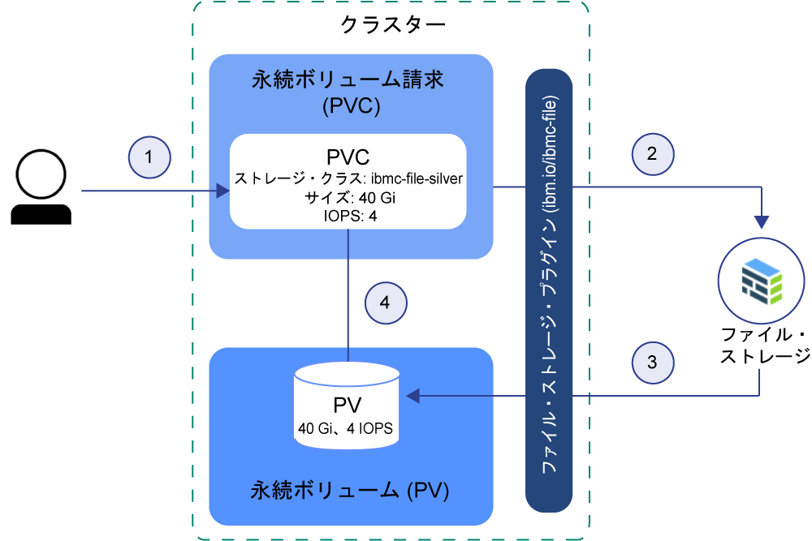
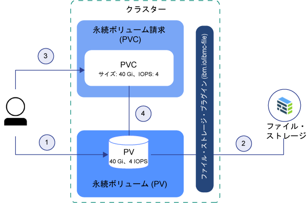

---

copyright:
  years: 2014, 2019
lastupdated: "2019-05-31"

keywords: kubernetes, iks

subcollection: containers

---

{:new_window: target="_blank"}
{:shortdesc: .shortdesc}
{:screen: .screen}
{:pre: .pre}
{:table: .aria-labeledby="caption"} 
{:codeblock: .codeblock}
{:tip: .tip}
{:note: .note}
{:important: .important}
{:deprecated: .deprecated}
{:download: .download}
{:preview: .preview}


# Kubernetes ストレージの基本について
{: #kube_concepts}

## 永続ボリュームと永続ボリューム請求
{: #pvc_pv}

ストレージのプロビジョニングを開始する前に、Kubernetes の永続ボリュームと永続ボリューム請求という概念と、それらのクラスター内での機能を理解することが重要です。
{: shortdesc}

Kubernetes クラスターのストレージ構成要素を以下の図に示しています。


- **クラスター**</br> デフォルトで、[ファイル・ストレージをプロビジョン](/docs/containers?topic=containers-file_storage#add_file)するためのプラグインが、どのクラスターにもセットアップされます。 他のアドオン ([ブロック・ストレージ](/docs/containers?topic=containers-block_storage)用のものなど) をインストールすることも可能です。 クラスターでストレージを使用するには、永続ボリューム請求、永続ボリューム、物理ストレージ・インスタンスを作成する必要があります。 クラスターを削除するときには、関連するストレージ・インスタンスを削除することを選択できます。
- **アプリ**</br> ストレージ・インスタンスとの間で読み書きを行うには、永続ボリューム請求 (PVC) をアプリにマウントする必要があります。 ストレージ・タイプごとに読み取り/書き込みのルールがあります。 例えば、ファイル・ストレージの場合は、同じ PVC に複数のポッドをマウントできます。 ブロック・ストレージは、RWO (ReadWriteOnce) アクセス・モードであるため、1 つのポッドにしかマウントできません。
- **永続ボリューム請求 (PVC)** </br> PVC は、特定のタイプや構成で永続ストレージをプロビジョンするための要求です。 永続ストレージのフレーバーを指定するには、[Kubernetes ストレージ・クラス](#storageclasses)を使用します。 クラスター管理者がストレージ・クラスを定義することも、{{site.data.keyword.containerlong_notm}} の事前定義ストレージ・クラスの中から選択することも可能です。 PVC を作成すると、要求が {{site.data.keyword.Bluemix}} ストレージ・プロバイダーに送信されます。 ストレージ・クラスで定義されている構成に応じて、物理ストレージ・デバイスが注文され、IBM Cloud インフラストラクチャー (SoftLayer) アカウントにプロビジョンされます。 要求対象の構成が存在しなければ、ストレージは作成されません。
- **永続ボリューム (PV)** </br> PV は、クラスターにボリュームとして追加される仮想ストレージ・インスタンスです。 PV は、IBM Cloud インフラストラクチャー (SoftLayer) アカウントの物理ストレージ・デバイスを参照し、そのストレージ・デバイスとの通信のために使用する API を抽象化します。 PV をアプリにマウントするには、対応する PVC が必要です。 マウントした PV は、コンテナーのファイル・システム内でフォルダーとして表示されます。
- **物理ストレージ** </br> データを永続化するために使用できる物理ストレージ・インスタンス。 {{site.data.keyword.Bluemix_notm}} 内の物理ストレージの例としては、[ファイル・ストレージ](/docs/containers?topic=containers-file_storage#file_storage)、[ブロック・ストレージ](/docs/containers?topic=containers-block_storage#block_storage)、[オブジェクト・ストレージ](/docs/containers?topic=containers-object_storage#object_storage)、[Portworx](/docs/containers?topic=containers-portworx#portworx) で SDS ストレージとして使用できるローカル・ワーカー・ノード・ストレージなどがあります。 {{site.data.keyword.Bluemix_notm}} には、物理ストレージ・インスタンスの高可用性機能が用意されています。 ただし、物理ストレージ・インスタンスに保管したデータの自動バックアップ機能はありません。 バックアップ/リストア・ソリューションをセットアップする方法は、使用するストレージのタイプによって異なります。

PVC、PV、物理ストレージ・デバイスを作成して使用する方法の詳細については、以下を参照してください。
- [動的プロビジョニング](#dynamic_provisioning)
- [静的プロビジョニング](#static_provisioning)

## 動的プロビジョニング
{: #dynamic_provisioning}

開発者にストレージを自由にプロビジョンさせる場合は、動的プロビジョニングを使用します。
{: shortdesc}

**機能**</br>

動的プロビジョニングは、Kubernetes のネイティブ機能です。この機能を使用すれば、クラスター開発者は、物理ストレージ・デバイスをプロビジョニングする方法を詳しく知らなくても、タイプや構成が事前定義されたストレージを注文できます。 特定のストレージ・タイプの詳細情報を抽象化するには、クラスター管理者が、開発者が使用できる[ストレージ・クラス](#storageclasses)を作成するか、{{site.data.keyword.Bluemix}} ストレージ・プラグインに用意されているストレージ・クラスを使用する必要があります。

ストレージを注文するには、PVC を作成する必要があります。 PVC では、プロビジョンしたいストレージの仕様を指定します。 PVC を作成すると、ストレージ・デバイスと PV が自動的に作成されます。  

クラスターでのファイル・ストレージの動的プロビジョンを以下の図にまとめています。 このサンプル・フローは、他のストレージ・タイプ (ブロック・ストレージなど) にも同じように当てはまります。

**事前定義のシルバー・ストレージ・クラスを使用したファイル・ストレージの動的プロビジョニングのサンプル・フロー**



1. ユーザーが、ストレージ・タイプ、ストレージ・クラス、サイズ (ギガバイト)、IOPS 数、課金タイプを指定した永続ボリューム請求 (PVC) を作成します。 ストレージ・クラスによって、プロビジョンするストレージのタイプと、サイズや IOPS の対応範囲が決まります。 クラスターに PVC を作成すると、要求したストレージ・タイプのストレージ・プラグインによって、指定したストレージのプロビジョンが自動的に開始されます。
2. ストレージ・デバイスが自動的に注文され、IBM Cloud インフラストラクチャー (SoftLayer) アカウントにプロビジョンされます。 ストレージ・デバイスの課金サイクルが開始されます。
3. ストレージ・プラグインによって、自動的にクラスターに永続ボリューム (PV) が作成され、IBM Cloud インフラストラクチャー (SoftLayer) アカウントの実際のストレージ・デバイスを参照する仮想ストレージ・デバイスが作成されます。
4. PVC と PV の相互接続が自動的に確立されます。 PVC と PV の状況が `Bound` に変わります。 PVC を使用して永続ストレージをアプリにマウントできるようになります。 PVC を削除すると、PV と関連ストレージ・インスタンスも削除されます。 </br>

**動的プロビジョニングの使用例**</br>

動的プロビジョニングの一般的なユース・ケースを次に示します。
1. **必要に応じてストレージをプロビジョンする:** 開発者に永続ストレージを事前に提供して未使用のストレージのために料金を払うのではなく、開発者に必要に応じて自由にストレージをプロビジョンさせます。 開発者にプロビジョンを許可するストレージのタイプを指定するために、[ストレージ・クラス](#storageclasses)を定義できます。
2. **PVC、PV、ストレージ・デバイスの作成を自動化する:** クラスター管理者の手操作による介入なしで、ストレージのプロビジョニングとプロビジョン解除を自動的に実行できます。
3. **ストレージの作成と削除を頻繁に実行する:** 永続ストレージを定期的に作成/削除するアプリがあったり、そのような継続的デリバリーのパイプラインをセットアップしたりする場合に便利です。 非保存ストレージ・クラスで動的にプロビジョンされた永続ストレージは、PVC を削除することで削除できます。

永続ストレージの動的プロビジョンの詳細については、以下を参照してください。
- [ファイル・ストレージ](/docs/containers?topic=containers-file_storage#add_file)
- [ブロック・ストレージ](/docs/containers?topic=containers-block_storage#add_block)

## 静的プロビジョニング
{: #static_provisioning}

IBM Cloud インフラストラクチャー (SoftLayer) アカウントに既存の永続ストレージ・デバイスがある場合は、静的プロビジョニングを使用してクラスターでストレージ・インスタンスを使用可能にすることができます。
{: shortdesc}

**機能**</br>

静的プロビジョニングは、Kubernetes のネイティブ機能です。この機能を使用すれば、クラスター管理者は、既存のストレージ・デバイスをクラスター内で使用可能にすることができます。 クラスター管理者は、そのストレージ・デバイスの詳細、サポートされている構成、マウント・オプションを把握しておく必要があります。  

既存のストレージをクラスター・ユーザーが使用できるようにするには、ストレージ・デバイス、PV、PVC を手動で作成する必要があります。  

クラスター内でのファイル・ストレージの静的プロビジョンを以下の図にまとめています。 このサンプル・フローは、他のストレージ・タイプ (ブロック・ストレージなど) にも同じように当てはまります。

**ファイル・ストレージの静的プロビジョニングのサンプル・フロー**



1. クラスター管理者が、既存のストレージ・デバイスに関するすべての情報を集め、クラスターに永続ボリューム (PV) を作成します。
2. ストレージ・プラグインが、PV のストレージ詳細情報に基づいて、IBM Cloud インフラストラクチャー (SoftLayer) アカウントのストレージ・デバイスに PV を接続します。
3. クラスター管理者または開発者が PVC を作成します。 PV とストレージ・デバイスが既に存在するので、ストレージ・クラスは PVC に指定しません。
4. PVC を作成すると、ストレージ・プラグインによって、PVC と既存の PV のマッチングが試みられます。 PVC と PV の両方でサイズ、IOPS、アクセス・モードの値が同じであれば、マッチングが成立します。 マッチングが成立すると、PVC と PV の状況が `Bound` に変わります。 PVC を使用して永続ストレージをアプリにマウントできるようになります。 PVC を削除しても、PV と物理ストレージ・インスタンスは削除されません。 PVC、PV、物理ストレージ・インスタンスを個々に削除する必要があります。  </br>

**静的プロビジョニングの使用例**</br>

永続ストレージの静的プロビジョニングの一般的なユース・ケースを次に示します。
1. **保存データをクラスター内で使用できるようにする:** 動的プロビジョニングで、保存ストレージ・クラスを使用して永続ストレージをプロビジョンしました。 PVC を削除しましたが、PV、IBM Cloud インフラストラクチャー (SoftLayer) 内の物理ストレージ、データはまだ存在しています。 この機能を使用すれば、その保存データにクラスター内のアプリからアクセスできます。
2. **既存のストレージ・デバイスを使用する:** IBM Cloud インフラストラクチャー (SoftLayer) アカウントに永続ストレージを直接プロビジョンしている場合に、この機能を使用すれば、そのストレージ・デバイスをクラスター内で使用できます。
3. **同じゾーン内のクラスター間で永続ストレージを共有する:** クラスターの永続ストレージをプロビジョンしました。 同じゾーン内の他のクラスターとの間でその永続ストレージ・インスタンスを共有するには、他のクラスターで PV とそれに対応する PVC を手動で作成する必要があります。 **注:** クラスター間で永続ストレージを共有できるのは、クラスターとストレージ・インスタンスが同じゾーン内にある場合に限られます。
4. **同じクラスター内の名前空間の間で永続ストレージを共有する:** クラスターの名前空間に永続ストレージをプロビジョンしました。 この機能を使用すれば、クラスター内の別の名前空間にデプロイしたアプリ・ポッドで同じストレージ・インスタンスを使用できます。

ストレージの静的プロビジョンの詳細については、以下を参照してください。
- [ファイル・ストレージ](/docs/containers?topic=containers-file_storage#file_predefined_storageclass)
- [ブロック・ストレージ](/docs/containers?topic=containers-block_storage#block_predefined_storageclass)

## ストレージ・クラス
{: #storageclasses}

永続ストレージを動的にプロビジョンするには、ストレージのタイプと構成を定義する必要があります。
{: shortdesc}

[Kubernetes ストレージ・クラス ](https://kubernetes.io/docs/concepts/storage/storage-classes/) を使用して、{{site.data.keyword.Bluemix_notm}} でサポートされる基礎のストレージ・プラットフォームを抽象化しておけば、サポートされるサイズ、IOPS、保存ポリシーについて詳しく知らなくても、永続ストレージをクラスターに正常にプロビジョンできます。 {{site.data.keyword.containerlong_notm}} には、サポートされるストレージ・タイプごとに、事前定義のストレージ・クラスが用意されています。 各ストレージ・クラスは、サポートされているストレージ層を抽象化した設計になっていますが、サイズや IOPS や保存ポリシーを選択することも可能です。

事前定義ストレージ・クラスの仕様については、以下を参照してください。
- [ファイル・ストレージ](/docs/containers?topic=containers-file_storage#file_storageclass_reference)
- [ブロック・ストレージ](/docs/containers?topic=containers-block_storage#block_storageclass_reference)

求めているストレージ・クラスが見つからない場合は、 独自のカスタマイズ・ストレージ・クラスを作成して、必要なタイプのストレージをプロビジョンできます。
{: tip}

### ストレージ・クラスのカスタマイズ
{: #customized_storageclass}

事前定義のストレージ・クラスを使用できない場合は、独自のカスタマイズ・ストレージ・クラスを作成できます。 希望に応じて、各種の構成を指定するようにストレージ・クラスをカスタマイズできます。これらの構成としては、ゾーン、ファイル・システム・タイプ、サーバー・タイプ、[ボリューム・バインディング・モード ](https://kubernetes.io/docs/concepts/storage/storage-classes/#volume-binding-mode) のオプション (ブロック・ストレージのみ) などが挙げられます。
{: shortdesc}

1. カスタマイズしたストレージ・クラスを作成します。 いずれかの事前定義ストレージ・クラスを基に作成したり、ストレージ・クラスのカスタマイズ例を参考にしたりできます。
   - 事前定義ストレージ・クラス:
     - [ファイル・ストレージ](/docs/containers?topic=containers-file_storage#file_storageclass_reference)
     - [ブロック・ストレージ](/docs/containers?topic=containers-block_storage#block_storageclass_reference)
   - ストレージ・クラスのカスタマイズ例:
     - [ファイル・ストレージ](/docs/containers?topic=containers-file_storage#file_custom_storageclass)
     - [ブロック・ストレージ](/docs/containers?topic=containers-block_storage#block_custom_storageclass)

2. カスタマイズしたストレージ・クラスを作成します。
   ```
   kubectl apply -f <local_file_path>
   ```
   {: pre}

3.  カスタマイズしたストレージ・クラスが作成されたことを確認します。
    ```
    kubectl get storageclasses                                                        
    ```
    {: pre}

4. カスタマイズしたストレージ・クラスを使用してストレージを動的にプロビジョンするための永続ボリューム請求 (PVC) を作成します。
   - [ファイル・ストレージ](/docs/containers?topic=containers-file_storage#add_file)
   - [ブロック・ストレージ](/docs/containers?topic=containers-block_storage#add_block)

5. PVC が作成されて永続ボリューム (PV) にバインドされていることを確認します。 このプロセスは、完了まで数分かかることがあります。
   ```
   kubectl get pvc
   ```
   {: pre}

### 別のストレージ・クラスへの変更または更新
{: #update_storageclass}

ストレージ・クラスを使用して永続ストレージを動的にプロビジョンする場合は、特定の構成で永続ストレージをプロビジョンすることになります。 ストレージ・クラスの名前やプロビジョンしたストレージのタイプは変更できません。 ただし、次の表に示すように、ストレージをスケーリングすることはできます。
{: shortdesc}

<table>
<caption>{{site.data.keyword.containerlong_notm}} ストレージ・ソリューションのスケーリング方法の概要</caption>
<thead>
<th>ストレージ・ソリューション</th>
<th>スケーリング方法</th>
</thead>
<tbody>
<tr>
<td>ファイル・ストレージ</td>
<td>[既存のボリュームを変更](/docs/containers?topic=containers-file_storage#file_change_storage_configuration)することで、ストレージ・サイズおよび IOPS の割り当てを増やすことができます。 </td>
</tr>
<tr>
<td>ブロック・ストレージ</td>
<td>[既存のボリュームを変更](/docs/containers?topic=containers-block_storage#block_change_storage_configuration)することで、ストレージ・サイズおよび IOPS の割り当てを増やすことができます。 </td>
</tr>
<tr>
<td>オブジェクト・ストレージ</td>
<td>ボリュームのサイズは自動的に拡大/縮小され、実際の使用量に基づいて課金されます。 ただし、ボリュームのパフォーマンス属性は、{{site.data.keyword.cos_full_notm}} でバケットを作成するために使用したストレージ・クラスで定義されるため、変更できません。 別のストレージ・クラスに変更するには、必要とするストレージ・クラスを使用して新しいバケットをプロビジョンする必要があります。 次に、古いバケットから新しいバケットにデータをコピーします。 </td>
</tr>
</tbody>
</table>


## Kubernetes ラベルを付けた既存のストレージを複数ゾーンで使用するための準備
{: #storage_multizone}

単一ゾーン・クラスターを複数ゾーン・クラスターに更新した場合に、既存の永続ボリューム (PV) があれば、Kubernetes のゾーンと地域のラベルをその PV に追加します。 ラベルを付けることによって、このストレージをマウントするポッドが、永続ストレージが存在するゾーンに確実にデプロイされるようになります。
{:shortdesc}

この手順が必要になるのは、複数ゾーン機能を有効にする前に作成した既存の PV がある場合に限られます。 複数ゾーンを有効にした後に作成した PV には、Kubernetes の地域とゾーンのラベルが既に含まれています。
{: note}

スクリプトを使用して、クラスター内のすべての PV を検索し、Kubernetes の `failure-domain.beta.kubernetes.io/region` ラベルと `failure-domain.beta.kubernetes.io/zone` ラベルを適用します。 PV に既にラベルがあれば、スクリプトが既存の値を上書きすることはありません。

開始前に、以下のことを行います。
- [クラスターを Kubernetes CLI のターゲットとして設定](/docs/containers?topic=containers-cs_cli_install#cs_cli_configure)します。
- 1 つのクラスターに複数の VLAN がある場合、同じ VLAN 上に複数のサブネットがある場合、または複数ゾーン・クラスターがある場合は、IBM Cloud インフラストラクチャー (SoftLayer) アカウントに対して[仮想ルーター機能 (VRF)](/docs/infrastructure/direct-link?topic=direct-link-overview-of-virtual-routing-and-forwarding-vrf-on-ibm-cloud#overview-of-virtual-routing-and-forwarding-vrf-on-ibm-cloud) を有効にして、ワーカー・ノードがプライベート・ネットワーク上で相互に通信できるようにする必要があります。 VRF を有効にするには、[IBM Cloud インフラストラクチャー (SoftLayer) のアカウント担当者に連絡してください](/docs/infrastructure/direct-link?topic=direct-link-overview-of-virtual-routing-and-forwarding-vrf-on-ibm-cloud#how-you-can-initiate-the-conversion)。 VRF の有効化が不可能または不要な場合は、[VLAN スパンニング](/docs/infrastructure/vlans?topic=vlans-vlan-spanning#vlan-spanning)を有効にしてください。 この操作を実行するには、**「ネットワーク」>「ネットワーク VLAN スパンニングの管理」**で設定する[インフラストラクチャー権限](/docs/containers?topic=containers-users#infra_access)が必要です。ない場合は、アカウント所有者に対応を依頼してください。 VLAN スパンニングが既に有効になっているかどうかを確認するには、`ibmcloud ks vlan-spanning-get<region>` [コマンド](/docs/containers?topic=containers-cs_cli_reference#cs_vlan_spanning_get)を使用します。

既存の PV を更新するには、以下のようにします。

1.  スクリプトを実行して、複数ゾーンのラベルを PV に適用します。  <mycluster> をクラスターの名前に置き換えてください。 PV の更新を確認するためのプロンプトが表示されたら、更新を確定させます。

    ```
    bash <(curl -Ls https://raw.githubusercontent.com/IBM-Cloud/kube-samples/master/file-pv-labels/apply_pv_labels.sh) <mycluster>
    ```
    {: pre}

    **出力例**:

    ```
    Retrieving cluster storage...
    OK

    Name:			mycluster
    ID:			  myclusterID1234
    State:			normal
    ...
    Addons
    Name                   Enabled
    storage-watcher-pod    true
    basic-ingress-v2       true
    customer-storage-pod   true
    us-south
    kube-config-dal10-storage.yml
    storage.yml
    dal10\n
    The persistent volumes which do not have region and zone labels will be updated with REGION=
    us-south and ZONE=dal10. Are you sure to continue (y/n)?y
    persistentvolume "pvc-ID-123456" labeled
    persistentvolume "pvc-ID-789101" labeled
    ['failure-domain.beta.kubernetes.io/region' already has a value (us-south), and --overwrite is false, 'failure-domain.beta.kubernetes.io/zone' already has a value (dal10), and --overwrite is false]
    ['failure-domain.beta.kubernetes.io/region' already has a value (us-south), and --overwrite is false, 'failure-domain.beta.kubernetes.io/zone' already has a value (dal10), and --overwrite is false]
    \nSuccessfully applied labels to persistent volumes which did not have region and zone labels.
    ```
    {: screen}

2.  ラベルが PV に適用されたことを確認します。

    1.  前のコマンドの出力を調べて、ラベルの付いた PV の ID を確認します。

        ```
        persistentvolume "pvc-ID-123456" labeled
        persistentvolume "pvc-ID-789101" labeled
        ```
        {: screen}

    2.  PV の地域とゾーンのラベルを確認します。

        ```
        kubectl describe pv pvc-ID-123456
        ```
        {: pre}

        **出力例**:
        ```
        Name:		pvc-ID-123456
        Labels:		CapacityGb=4
        		Datacenter=dal10
            ...
        		failure-domain.beta.kubernetes.io/region=us-south
        		failure-domain.beta.kubernetes.io/zone=dal10
            ...
        ```
        {: screen}

**次の作業**

既存の PV にラベルを付けたので、その PV を複数ゾーン・クラスターにマウントできるようになりました。 詳細については、以下のリンクを参照してください。
- [既存の NFS ファイル・ストレージ](/docs/containers?topic=containers-file_storage#existing_file)の使用
- [既存のブロック・ストレージ](/docs/containers?topic=containers-block_storage#existing_block)の使用
