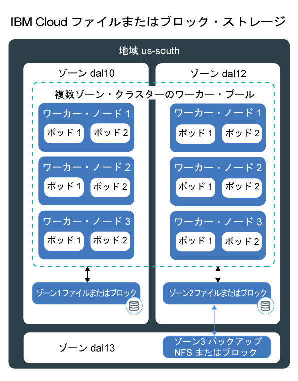
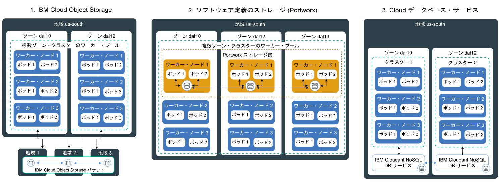

---

copyright:
  years: 2014, 2019
lastupdated: "2019-06-11"

keywords: kubernetes, iks

subcollection: containers

---

{:new_window: target="_blank"}
{:shortdesc: .shortdesc}
{:screen: .screen}
{:pre: .pre}
{:table: .aria-labeledby="caption"}
{:codeblock: .codeblock}
{:tip: .tip}
{:note: .note}
{:important: .important}
{:deprecated: .deprecated}
{:download: .download}
{:preview: .preview}

# 可用性の高い永続ストレージの計画
{: #storage_planning}

## ストレージ・ソリューションの選択
{: #choose_storage_solution}

どのタイプのストレージが適切なソリューションであるかを判断する前に、アプリの要件、保管するデータのタイプ、およびこのデータにアクセスする頻度を理解しておく必要があります。
{: shortdesc}

1. データを永久に保管する必要があるかどうか、またはいつでもデータを削除できるかどうかを決定します。
   - **永続ストレージ:** コンテナー、ワーカー・ノード、またはクラスターが削除されても、引き続きデータが使用可能です。 永続ストレージは、以下のシナリオで使用します。
       - ステートフルなアプリ
       - コア・ビジネス・データ
       - 法的要件 (定義された保存期間など) のために使用可能でなければならないデータ
       - 監査
       - アプリ・インスタンス間でアクセスおよび共有される必要があるデータ
   - **非永続ストレージ:** コンテナー、ワーカー・ノード、またはクラスターが削除されるときに、データを削除できます。 非永続ストレージは、通常、ロギング情報 (システム・ログやコンテナー・ログなど)、開発テスト、またはホストのファイル・システムからデータにアクセスする場合に使用されます。 使用可能な非永続ストレージ・オプションの概要については、[非永続ストレージ・オプションの比較](#non_persistent_overview)を参照してください。

2. データを保持する必要がある場合は、アプリが特定のタイプのストレージを必要とするかどうかを分析します。 既存のアプリを使用する場合、以下のいずれかの方法でデータを保管するようにアプリが設計されている場合があります。  
   - **ファイル・システムの場合:** データは、ディレクトリーにファイルとして保管できます。 例えば、このファイルをローカルのハード・ディスクに保管することができます。 一部のアプリでは、データ・ストアを最適化し、パフォーマンス目標を達成するために、`nfs` や `ext4` などの特定のファイル・システムにデータを保管する必要があります。
   - **データベースの場合:** データは、特定のスキーマに従うデータベースに保管する必要があります。 一部のアプリには、データを保管するために使用できるデータベース・インターフェースが用意されています。 例えば、WordPress は MySQL データベースにデータを保管するために最適化されています。 このような場合は、ストレージのタイプが選択されます。

3. ご使用のアプリに、使用する必要があるストレージのタイプに制限がない場合は、保管するデータのタイプを決定します。
   - **構造化データ:** 列と行がある表を含むリレーショナル・データベースに保管できるデータ。 表内のデータは、キーを使用して接続することができます。また、事前定義のデータ・モデルにより、通常は簡単にアクセスできます。 例として、電話番号、アカウント番号、社会保障番号、郵便番号などがあります。
   - **準構造化データ:** リレーショナル・データベースに適合しないデータ。ただし、このデータをより簡単に読み取って分析するために使用できるいくつかの組織プロパティーが含まれています。 例として、CSV、XML、または JSON などのマークアップ言語ファイルがあります。  
   - **非構造化データ:** 組織パターンに従っておらず、事前定義のデータ・モデルのリレーショナル・データベースに保管できないほど複雑なデータ。 このデータにアクセスするには、高度なツールとソフトウェアが必要です。 例として、E メール・メッセージ、ビデオ、写真、音声ファイル、プレゼンテーション、ソーシャル・メディア・データ、Web ページなどがあります。

   構造化データと非構造化データがある場合は、各データ・タイプを、そのデータ・タイプ用に設計されたストレージ・ソリューションに個別に保管してみてください。 データ・タイプに適したストレージ・ソリューションを使用すると、データへのアクセスが容易になり、パフォーマンス、スケーラビリティー、耐久性、および整合性の利点が得られます。
   {: tip}

4. データへの希望するアクセス方法を分析します。 ストレージ・ソリューションは、通常、読み取り操作または書き込み操作をサポートするように設計および最適化されています。  
   - **読み取り専用:** データは読み取り専用です。 ユーザーは、データの書き込みや変更を行う必要はないと考えています。
   - **読み取り/書き込み:** ユーザーは、データの読み取り、書き込み、および変更を行いたいと考えています。 読み取りおよび書き込みが行われるデータについて、操作は読み取りが多いか、書き込みが多いか、またはバランスが取れているかを理解することが重要です。

4. データがアクセスされる頻度を判別します。 データ・アクセスの頻度について理解しておくと、ストレージに必要なパフォーマンスを理解するのに役立ちます。 例えば、頻繁にアクセスされるデータは、通常は高速ストレージに常駐します。
   - **ホット・データ:** 頻繁にアクセスされるデータ。 Web アプリやモバイル・アプリが一般的なユース・ケースです。
   - **クール・データまたはウォーム・データ:** アクセス頻度の低い (月 1 回以下程度) データ。 アーカイブ、短期データ保存、および災害復旧が一般的なユース・ケースです。
   - **コールド・データ:** めったにアクセスされないデータ。 アーカイブ、長期バックアップ、履歴データが一般的なユース・ケースです。
   - **凍結データ:** アクセスされないが、法的理由により保持する必要があるデータ。

   頻度を予測できない場合や頻度が厳密なパターンに従わない場合、ワークロードは読み取りが多いか、書き込みが多いか、またはバランスが取れているかを判別してください。 次に、ワークロードに適合するストレージ・オプションを調べ、必要な柔軟性をもたらすストレージ層について調査してください。 例えば、{{site.data.keyword.cos_full_notm}} には、1 カ月のデータへのアクセス頻度を考慮し、月単位の課金を最適化するためにこの測定値を考慮する `flex` ストレージ・クラスが用意されています。
   {: tip}

5. 複数のアプリ・インスタンス、ゾーン、または地域にわたってデータを共有する必要があるかどうかを調査します。
   - **複数のポッドによるアクセス:** ストレージにアクセスするために Kubernetes 永続ボリュームを使用する場合、ボリュームを同時にマウントすることができるポッドの数を決定できます。 ブロック・ストレージなどの一部のストレージ・ソリューションには、一度に 1 つのポッドのみがアクセスできます。 他のストレージ・ソリューションでは、複数のポッド間でボリュームを共有できます。
   - **複数のゾーンおよび地域でのアクセス:** 複数のゾーンまたは地域でデータをアクセス可能にする必要がある場合があります。 ファイル・ストレージやブロック・ストレージなどの一部のストレージ・ソリューションは、データ・センター固有のものであり、複数ゾーン・クラスター・セットアップを使用して複数のゾーンで共有することはできません。

   データを複数のゾーンや地域で利用できるようにする場合は、社内の法務部門に相談して、データを複数のゾーンや国外に保管できることを確認してください。
   {: note}

6. 選択に影響を与えるその他のストレージ特性を理解します。
   - **整合性:** 読み取り操作で最新バージョンのファイルが返されるという保証。 ストレージ・ソリューションは、ユーザーが常に最新バージョンのファイルを受け取ることが保証されている場合は `strong consistency` を示し、読み取り操作で最新バージョンが返されない場合があるときは `eventual consistency` を示すことができます。 eventual consistency は、書き込み操作が最初にすべてのインスタンスにわたって複製される必要がある、地理的に分散されたシステムで見られることが多いです。
   - **パフォーマンス:** 読み取り操作または書き込み操作を完了するために要する時間。
   - **耐久性:** ギガバイトやテラバイトのデータが同時にストレージに書き込まれる場合でも、ストレージにコミットされた書き込み操作が永久に存続し、破損も損失もしない保証。
   - **回復力:** ハードウェア・コンポーネントまたはソフトウェア・コンポーネントで障害が発生した場合でも、障害からリカバリーし、操作を続行する機能。 障害には、物理ストレージに電源異常やネットワーク障害が発生することや、自然災害で物理ストレージが損傷することなどがあります。
   - **可用性:** データ・センターまたは地域が使用不可になっている場合でもデータへのアクセスを提供する機能。 通常、データの可用性は、冗長性の追加とフェイルオーバー・メカニズムのセットアップによって実現されます。
   - **スケーラビリティー:** ニーズに応じて容量を拡張し、パフォーマンスをカスタマイズする機能。
   - **暗号化:** 無許可ユーザーがデータにアクセスしたときに表示されなくなるデータのマスキング。

7. [使用可能な永続ストレージ・ソリューションを確認](#persistent_storage_overview)し、アプリおよびデータ要件に最適なソリューションを選択します。

## 非永続ストレージ・オプションの比較
{: #non_persistent_overview}

データが永久に保管される必要がない場合、またはアプリ・コンポーネントに単体テストを実行する場合は、非永続ストレージ・オプションを使用できます。
{: shortdesc}

以下のイメージは、{{site.data.keyword.containerlong_notm}} で使用可能な非永続データ・ストレージ・オプションを示しています。 これらの方法は、フリー・クラスターと標準クラスターで使用可能です。

<table>
<thead>
<th style="text-align:left">特性</th>
<th style="text-align:left">コンテナー内</th>
<th style="text-align:left">ワーカー・ノードの 1 次ディスクまたは 2 次ディスク上</th>
</thead>
<tbody>
<tr>
<td style="text-align:left">複数ゾーンに対応</td>
<td style="text-align:left">いいえ</td>
<td style="text-align:left">いいえ</td>
</tr>
<tr>
<td style="text-align:left">データ型</td>
<td style="text-align:left">すべて</td>
<td style="text-align:left">すべて</td>
</tr>
<tr>
<td style="text-align:left">容量</td>
<td style="text-align:left">ワーカー・ノードの使用可能な 2 次ディスクに制限されます。 ポッドによって消費される 2 次ストレージの量を制限するには、[一時ストレージ ](https://kubernetes.io/docs/concepts/configuration/manage-compute-resources-container/#local-ephemeral-storage) のリソース要求と制限を使用します。</td>
<td style="text-align:left">ワーカー・ノードの 1 次ディスク (`hostPath`) または 2 次ディスク (`emptyDir`) の使用可能なスペースに制限されます。 ポッドによって消費される 2 次ストレージの量を制限するには、[一時ストレージ ](https://kubernetes.io/docs/concepts/configuration/manage-compute-resources-container/#local-ephemeral-storage) のリソース要求と制限を使用します。</td>
</tr>
<tr>
<td style="text-align:left">データ・アクセス・パターン</td>
<td style="text-align:left">任意の頻度の読み取り操作と書き込み操作</td>
<td style="text-align:left">任意の頻度の読み取り操作と書き込み操作</td>
</tr>
<tr>
<td style="text-align:left">アクセス</td>
<td style="text-align:left">コンテナーのローカル・ファイル・システム経由</td>
<td style="text-align:left"><ul style="margin:0px 0px 0px 20px; padding:0px"><li style="margin:0px; padding:0px">ワーカー・ノードの 1 次ストレージにアクセスする場合は [Kubernetes <code>hostPath</code> ボリューム ](https://kubernetes.io/docs/concepts/storage/volumes/#hostpath) 経由 </li><li style="margin:0px; padding:0px">ワーカー・ノードの 2 次ストレージにアクセスする場合は [Kubernetes <code>emptyDir</code> ボリューム ](https://kubernetes.io/docs/concepts/storage/volumes/#emptydir) 経由</li></ul></td>
</tr>
<tr>
<td style="text-align:left">パフォーマンス</td>
<td style="text-align:left">ハイ</td>
<td style="text-align:left">ハイ (SSD を使用する場合の待ち時間が短い)</td>
</tr>
<tr>
<td style="text-align:left">整合性</td>
<td style="text-align:left">強</td>
<td style="text-align:left">強</td>
</tr>
<tr>
<td style="text-align:left">回復力</td>
<td style="text-align:left">低</td>
<td style="text-align:left">低</td>
</tr>
<tr>
<td style="text-align:left">可用性</td>
<td style="text-align:left">コンテナーに固有</td>
<td style="text-align:left">ワーカー・ノードに固有</td>
</tr>
<tr>
<td style="text-align:left">スケーラビリティー</td>
<td style="text-align:left">ワーカー・ノードの 2 次ディスクの容量に制限されるため拡張は難しい</td>
<td style="text-align:left">ワーカー・ノードの 1 次ディスクと 2 次ディスクの容量に制限されるため拡張は難しい</td>
</tr>
<tr>
<td style="text-align:left">耐久性</td>
<td style="text-align:left">コンテナーがクラッシュするか削除されるとデータは失われます。 </td>
<td style="text-align:left"><code>hostPath</code> または <code>emptyDir</code> のボリュームのデータは次の場合に失われます。 <ul><li>ワーカー・ノードが削除された場合。</li><li>ワーカー・ノードが再ロードされた、または更新された場合。</li><li>クラスターが削除された場合。</li><li>{{site.data.keyword.Bluemix_notm}} アカウントが一時停止状態になった場合。 </li></ul>

さらに、<code>emptyDir</code> ボリューム内のデータは以下の場合に削除されます。 <ul><li>割り当てられたポッドはワーカー・ノードから永久に削除されます。</li><li>割り当てられたポッドが別のワーカー・ノード上にスケジュールされた場合。</li></ul>
</tr>
<tr>
<td style="text-align:left">一般的なユース・ケース</td>
<td style="text-align:left"><ul style="margin:0px 0px 0px 20px; padding:0px"><li style="margin:0px; padding:0px">ローカル・イメージ・キャッシュ</li><li style="margin:0px; padding:0px">コンテナー・ログ</li></ul></td>
<td style="text-align:left"><ul style="margin:0px 0px 0px 20px; padding:0px"><li style="margin:0px; padding:0px">ハイパフォーマンス・ローカル・キャッシュ</li><li style="margin:0px; padding:0px">ワーカー・ノードのファイル・システムからのファイルへのアクセス</li><li style="margin:0px; padding:0px">単体テスト</li></ul></td>
</tr>
<tr>
<td style="text-align:left">推奨されないユース・ケース</td>
<td style="text-align:left"><ul style="margin:0px 0px 0px 20px; padding:0px"><li style="margin:0px; padding:0px">永続データ・ストレージ</li><li style="margin:0px; padding:0px">コンテナー間でのデータの共有</li></ul></td>
<td style="text-align:left"><ul style="margin:0px 0px 0px 20px; padding:0px"><li style="margin:0px; padding:0px">永続データ・ストレージ</li></ul></td>
</tr>
</tbody>
</table>

## 単一ゾーン・クラスター用の永続ストレージ・オプションの比較
{: #single_zone_persistent_storage}

単一ゾーン・クラスターを使用している場合は、{{site.data.keyword.containerlong_notm}} で高速なデータ・アクセスを実現する以下のオプションの中から選択できます。 より高い可用性を希望する場合は、[地理的に分散されたデータ](#persistent_storage_overview)向けに設計されたストレージ・オプションを使用し、要件と照らし合わせて可能な場合は、複数ゾーン・クラスターを作成してください。
{: shortdesc}

永続データ・ストレージ・オプションは、標準クラスターでのみ使用可能です。
{: note}

次の図は、単一クラスター内にデータを永続的に保管するために {{site.data.keyword.containerlong_notm}} で使用できるオプションを示しています。

<table>
<thead>
<th style="text-align:left">特性</th>
<th style="text-align:left">ファイル</th>
<th style="text-align:left">ブロック</th>
</thead>
<tbody>
<tr>
<td style="text-align:left">複数ゾーン対応</td>
<td style="text-align:left">いいえ (データ・センターに固有であるため)。 独自のデータ複製を実装していない場合は、ゾーン間でデータを共有することはできません。</td>
<td style="text-align:left">いいえ (データ・センターに固有であるため)。 独自のデータ複製を実装していない場合は、ゾーン間でデータを共有することはできません。</td>
</tr>
<tr>
<td style="text-align:left">理想的なデータ型</td>
<td style="text-align:left">すべて</td>
<td style="text-align:left">すべて</td>
</tr>
<tr>
<td style="text-align:left">データの使用パターン</td>
<td style="text-align:left"><ul style="margin:0px 0px 0px 20px; padding:0px"><li style="margin:0px; padding:0px">ランダム読み取り/書き込み操作</li><li style="margin:0px; padding:0px">順次読み取り/書き込み操作</li></ul></td>
<td style="text-align:left"><ul style="margin:0px 0px 0px 20px; padding:0px"><li style="margin:0px; padding:0px">ランダム読み取り/書き込み操作</li><li style="margin:0px; padding:0px">書き込み主体のワークロード</li></ul></td>
</tr>
<tr>
<td style="text-align:left">アクセス</td>
<td style="text-align:left">マウントされたボリューム上のファイル・システム経由</td>
<td style="text-align:left">マウントされたボリューム上のファイル・システム経由</td>
</tr>
<tr>
<td style="text-align:left">サポートされる Kubernetes アクセス書き込み</td>
<td style="text-align:left"><ul style="margin:0px 0px 0px 20px; padding:0px"><li style="margin:0px; padding:0px">ReadWriteMany (RWX)</li><li style="margin:0px; padding:0px"> ReadOnlyMany (ROX)</li><li style="margin:0px; padding:0px">ReadWriteOnce (RWO)</li></ul></td>
<td style="text-align:left"><ul style="margin:0px 0px 0px 20px; padding:0px"><li style="margin:0px; padding:0px">ReadWriteOnce (RWO)</li></ul></td>
</tr>
<tr>
<td style="text-align:left">パフォーマンス</td>
<td style="text-align:left">IOPS とサイズが割り当てられるため、予測可能です。 IOPS はボリュームにアクセスするポッド間で共有されます。</td>
<td style="text-align:left">IOPS とサイズが割り当てられるため、予測可能です。 IOPS はポッド間で共有されません。 </td>
</tr>
<tr>
<td style="text-align:left">整合性</td>
<td style="text-align:left">強</td>
<td style="text-align:left">強</td>
</tr>
<tr>
<td style="text-align:left">耐久性</td>
<td style="text-align:left">ハイ</td>
<td style="text-align:left">ハイ</td>
</tr>
<tr>
<td style="text-align:left">回復力</td>
<td style="text-align:left">ミディアム (データ・センターに固有であるため)。 ファイル・ストレージ・サーバーは、冗長ネットワーキングで IBM によってクラスター化されます。</td>
<td style="text-align:left">ミディアム (データ・センターに固有であるため)。 ブロック・ストレージ・サーバーは、冗長ネットワーキングで IBM によってクラスター化されます。</td>
</tr>
<tr>
<td style="text-align:left">可用性</td>
<td style="text-align:left">ミディアム (データ・センターに固有であるため)。</td>
<td style="text-align:left">ミディアム (データ・センターに固有であるため)。</td>
</tr>
<tr>
<td style="text-align:left">スケーラビリティー</td>
<td style="text-align:left">データ・センターを超える拡張は難しい。 既存のストレージ層は変更できません。 </td>
<td style="text-align:left">データ・センターを超える拡張は難しい。 既存のストレージ層は変更できません。</td>
</tr>
<tr>
<td style="text-align:left">暗号化</td>
<td style="text-align:left">静止</td>
<td style="text-align:left">静止</td>
</tr>
<tr>
<td style="text-align:left">一般的なユース・ケース</td>
<td style="text-align:left"><ul style="margin:0px 0px 0px 20px; padding:0px"><li style="margin:0px; padding:0px">大規模または単一のファイル・ストレージ</li><li style="margin:0px; padding:0px">単一のゾーン・クラスター内でのファイル共有</li></ul></td>
<td style="text-align:left"><ul style="margin:0px 0px 0px 20px; padding:0px"><li style="margin:0px; padding:0px">ステートフル・セット</li><li style="margin:0px; padding:0px">独自のデータベースを実行する場合のバッキング・ストレージ</li><li style="margin:0px; padding:0px">単一のポッドのハイパフォーマンス・アクセス</li></ul></td>
</tr>
<tr>
<td style="text-align:left">推奨されないユース・ケース</td>
<td style="text-align:left"><ul style="margin:0px 0px 0px 20px; padding:0px"><li style="margin:0px; padding:0px">複数ゾーン・クラスター</li><li style="margin:0px; padding:0px">地理的分散データ</li></ul></td>
<td style="text-align:left"><ul style="margin:0px 0px 0px 20px; padding:0px"><li style="margin:0px; padding:0px">複数ゾーン・クラスター</li><li style="margin:0px; padding:0px">地理的分散データ</li><li style="margin:0px; padding:0px">複数のアプリ・インスタンスでのデータの共有</li></ul></td>
</tr>
</tbody>
</table>

## 複数ゾーン・クラスター用の永続ストレージ・オプションの比較
{: #persistent_storage_overview}

複数ゾーン・クラスターを使用している場合は、複数のゾーンにまたがって分散されている複数のワーカー・ノードからデータにアクセスするための永続ストレージ・オプションを以下の中から選択してください。
{: shortdesc}

永続データ・ストレージ・オプションは、標準クラスターでのみ使用可能です。

代わりに、クラスターをオンプレミス・データベースに接続する方法をお探しですか? [クラスターへの VPN 接続のセットアップ](/docs/containers?topic=containers-vpn#vpn)を参照してください。
{: tip}

次の図は、複数ゾーン・クラスターにデータを永続的に保管してデータの高可用性を確保するために {{site.data.keyword.containerlong_notm}} で使用できるオプションを示しています。 これらのオプションを単一ゾーン・クラスター内で使用することもできますが、ご使用のアプリで要求される高可用性の利点は得られない可能性があります。

<table>
<thead>
<th style="text-align:left">特性</th>
<th style="text-align:left">オブジェクト</th>
<th style="text-align:left">SDS (Portworx)</th>
<th style="text-align:left">{{site.data.keyword.Bluemix_notm}} データベース</th>
</thead>
<tbody>
<tr>
<td style="text-align:left">複数ゾーン対応</td>
<td style="text-align:left">はい</td>
<td style="text-align:left">はい</td>
<td style="text-align:left">はい</td>
</tr>
<tr>
<td style="text-align:left">理想的なデータ型</td>
<td style="text-align:left">準構造化データと非構造化データ</td>
<td style="text-align:left">すべて</td>
<td style="text-align:left">DBaaS によって異なる</td>
</tr>
<tr>
<td style="text-align:left">データの使用パターン</td>
<td style="text-align:left"><ul style="margin:0px 0px 0px 20px; padding:0px"><li style="margin:0px; padding:0px">読み取り主体のワークロード</li><li style="margin:0px; padding:0px">書き込み操作は少ないか、行われない</li></ul></td>
<td style="text-align:left"><ul style="margin:0px 0px 0px 20px; padding:0px"><li style="margin:0px; padding:0px">書き込み主体のワークロード</li><li style="margin:0px; padding:0px">ランダム読み取り/書き込み操作</li><li style="margin:0px; padding:0px">順次読み取り/書き込み操作</li></ul></td>
<td style="text-align:left"><ul style="margin:0px 0px 0px 20px; padding:0px"><li style="margin:0px; padding:0px">読み取り/書き込み主体のワークロード</li></ul></td>
</tr>
<tr>
<td style="text-align:left">アクセス</td>
<td style="text-align:left">マウントされたボリューム上のファイル・システム経由 (プラグイン) またはアプリからの REST API 経由</td>
<td style="text-align:left">マウントされたボリューム上のファイル・システム経由、またはボリュームへの NFS クライアント・アクセス経由</td>
<td style="text-align:left">アプリからの REST API 経由</td>
</tr>
<tr>
<td style="text-align:left">サポートされる Kubernetes アクセス書き込み</td>
<td style="text-align:left"><ul style="margin:0px 0px 0px 20px; padding:0px"><li style="margin:0px; padding:0px">ReadWriteMany (RWX)</li><li style="margin:0px; padding:0px"> ReadOnlyMany (ROX)</li><li style="margin:0px; padding:0px">ReadWriteOnce (RWO)</li></ul></td>
<td style="text-align:left">すべて</td>
<td style="text-align:left"><ul style="margin:0px 0px 0px 20px; padding:0px"><li style="margin:0px; padding:0px">アプリから直接アクセスされるため該当なし</li></ul></td>
</tr>
<tr>
<td style="text-align:left">パフォーマンス</td>
<td style="text-align:left">読み取り操作の場合はハイ。 非 SDS マシンの使用時は、割り当てられる IOPS とサイズのために予測可能です。</td>
<td style="text-align:left"><ul style="margin:0px 0px 0px 20px; padding:0px"><li style="margin:0px; padding:0px">SDS マシンの使用時は、順次読み取り/書き込み操作についてはベア・メタル・パフォーマンスに近い。 </li><li style="margin:0px; padding:0px">高性能データベースを実行するための[プロファイル ](https://docs.portworx.com/portworx-install-with-kubernetes/storage-operations/create-pvcs/dynamic-provisioning/#using-dynamic-provisioning) を提供。</li><li style="margin:0px; padding:0px">ご使用のアプリで選択できる各種のパフォーマンス・プロファイルを使用してストレージ層を作成可能。</li></ul> </td>
<td style="text-align:left">アプリと同じデータ・センターにデプロイされた場合はハイ。</td>
</tr>
<tr>
<td style="text-align:left">整合性</td>
<td style="text-align:left">結果</td>
<td style="text-align:left">強</td>
<td style="text-align:left">DBaaS によって異なる</td>
</tr>
<tr>
<td style="text-align:left">耐久性</td>
<td style="text-align:left">非常にハイ (ストレージ・ノードのクラスター全体にデータ・スライスが分散するため)。 どのノードもデータの一部のみ保管します。 </td>
<td style="text-align:left">データの 3 つのコピーが常に保持されるため非常にハイ。</td>
<td style="text-align:left">ハイ</td>
</tr>
<tr>
<td style="text-align:left">回復力</td>
<td style="text-align:left">ハイ (3 つのゾーンまたは地域にわたってデータ・スライスが分散するため)。 単一ゾーンのみにセットアップされた場合はミディアム。</td>
<td style="text-align:left">3 つのゾーンにまたがるレプリケーションをサポートするようにセットアップされた場合はハイ。 単一ゾーンにのみデータを保管する場合はミディアム。</td>
<td style="text-align:left">DBaaS およびセットアップによって異なります。 </td>
</tr>
<tr>
<td style="text-align:left">可用性</td>
<td style="text-align:left">ハイ (複数のゾーンまたは地域への分散のため)。 </td>
<td style="text-align:left">別々のゾーンにある 3 つのワーカー・ノードにまたがってデータを複製する場合はハイ。</td>
<td style="text-align:left">ハイ (複数のインスタンスをセットアップした場合)。 </td>
</tr>
<tr>
<td style="text-align:left">スケーラビリティー</td>
<td style="text-align:left">自動的にスケーリングします</td>
<td style="text-align:left">ボリュームのサイズ変更によってボリューム容量を増やします。 全体的なストレージ層容量を増やすには、ワーカー・ノードまたはリモート・ブロック・ストレージを追加する必要があります。 どちらの場合でも、ユーザーによる容量の監視が必要です。 </td>
<td style="text-align:left">自動的にスケーリングします</td>
</tr>
<tr>
<td style="text-align:left">暗号化</td>
<td style="text-align:left">転送中および静止</td>
<td style="text-align:left">{{site.data.keyword.keymanagementservicelong_notm}} を使用して転送中および保存中のデータを保護するための独自のキーを用意してください。 </td>
<td style="text-align:left">静止</td>
</tr>
<tr>
<td style="text-align:left">一般的なユース・ケース</td>
<td style="text-align:left"><ul style="margin:0px 0px 0px 20px; padding:0px"><li style="margin:0px; padding:0px">複数ゾーン・クラスター</li><li style="margin:0px; padding:0px">地理的分散データ</li><li style="margin:0px; padding:0px">静的ビッグデータ</li><li style="margin:0px; padding:0px">静的マルチメディア・コンテンツ</li><li style="margin:0px; padding:0px">Web アプリ</li><li style="margin:0px; padding:0px">バックアップ</li><li style="margin:0px; padding:0px">アーカイブ</li></ul></td>
<td style="text-align:left"><ul style="margin:0px 0px 0px 20px; padding:0px"><li style="margin:0px; padding:0px">ステートフル・セット</li><li style="margin:0px; padding:0px">地理的分散データ</li><li style="margin:0px; padding:0px">複数のクラウド・プロバイダーにまたがってアプリを実行している場合の一般的なストレージ・ソリューション</li><li style="margin:0px; padding:0px">独自のデータベースを実行する場合のバッキング・ストレージ</li><li style="margin:0px; padding:0px">単一のポッドのハイパフォーマンス・アクセス</li><li style="margin:0px; padding:0px">複数のポッドとワーカー・ノードにまたがる共有ストレージ・アクセス</li></ul></td>
<td style="text-align:left"><ul style="margin:0px 0px 0px 20px; padding:0px"><li style="margin:0px; padding:0px">複数ゾーン・クラスター</li><li style="margin:0px; padding:0px">リレーショナル・データベースおよび非リレーショナル・データベース</li><li style="margin:0px; padding:0px">地理的分散データ</li></ul></td>
</tr>
<tr>
<td style="text-align:left">推奨されないユース・ケース</td>
<td style="text-align:left"><ul style="margin:0px 0px 0px 20px; padding:0px"><li style="margin:0px; padding:0px">書き込み主体のワークロード</li><li style="margin:0px; padding:0px">ランダム書き込み操作</li><li style="margin:0px; padding:0px">増分データ更新</li><li style="margin:0px; padding:0px">トランザクション・データベース</li></ul></td>
<td style="text-align:left">該当なし</td>
<td style="text-align:left"><ul style="margin:0px 0px 0px 20px; padding:0px"><li style="margin:0px; padding:0px">ファイル・システムに書き込むように設計されたアプリ</li></ul></td>
</tr>
</tbody>
</table>
