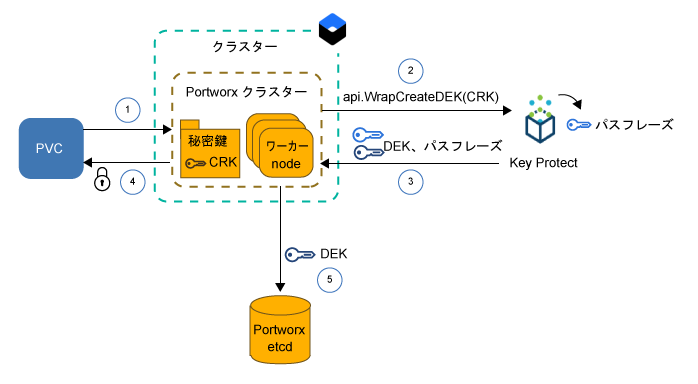
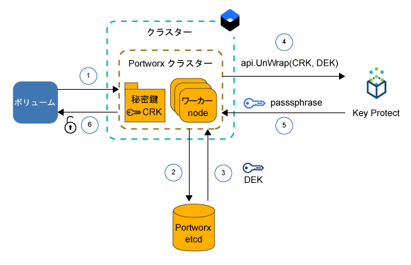

---

copyright:
  years: 2014, 2019
lastupdated: "2019-05-31"

keywords: kubernetes, iks, local persistent storage

subcollection: containers

---

{:new_window: target="_blank"}
{:shortdesc: .shortdesc}
{:screen: .screen}
{:pre: .pre}
{:table: .aria-labeledby="caption"}
{:codeblock: .codeblock}
{:tip: .tip}
{:note: .note}
{:important: .important}
{:deprecated: .deprecated}
{:download: .download}
{:preview: .preview}


# Portworx を使用したソフトウェア定義ストレージ (SDS) へのデータの保管
{: #portworx}

[Portworx ](https://portworx.com/products/introduction/) は、可用性の高いソフトウェア定義のストレージ・ソリューションです。これを使用して、コンテナー化データベースなどのステートフル・アプリ用のローカル永続ストレージを管理したり、複数のゾーンにわたってポッド間でデータを共有したりすることができます。
{: shortdesc}

**ソフトウェア定義ストレージ (SDS) とは何ですか?** </br>
SDS ソリューションは、クラスター内のワーカー・ノードに接続されたさまざまなタイプ、サイズ、またはベンダーのストレージ・デバイスを抽象化します。 ハード・ディスク上に使用可能なストレージを持つワーカー・ノードは、ノードとしてストレージ・クラスターに追加されます。 このクラスター内では、物理ストレージは仮想化されて、仮想ストレージ・プールとしてユーザーに表示されます。 このストレージ・クラスターは SDS ソフトウェアによって管理されます。 このストレージ・クラスターにデータを保管する必要がある場合は、SDS ソフトウェアによって最も高い可用性を確保できるデータ保管場所が決定されます。 仮想ストレージには、実際の基盤ストレージ・アーキテクチャーについて意識することなく利用できる一連の共通の機能とサービスが付属しています。

**Portworx はどのように機能しますか?** </br>
Portworx は、ワーカー・ノードに接続された使用可能なストレージを集約して、クラスター内で実行することを希望するコンテナー化されたデータベースなどのステートフル・アプリ用の統一された永続ストレージ層を作成します。 複数のワーカー・ノードの間でコンテナー・レベルの各ボリュームを複製することで、Portworx はデータの永続性とデータ・アクセシビリティーをゾーンをまたいで確保します。

Portworx は、ステートフル・アプリ用に使用できる追加機能も備えています。これらの機能としては、ボリューム・スナップショット、ボリューム暗号化、分離、クラスター内の最適なボリューム配置を実現する統合された Storage Orchestrator for Kubernetes (Stork) などが挙げられます。 詳しくは、[Portworx の資料 ](https://docs.portworx.com/) を参照してください。

**Portworx にとって適切な {{site.data.keyword.containerlong_notm}} 内のワーカー・ノード・フレーバーはどれですか?** </br>
{{site.data.keyword.containerlong_notm}} で提供されるベア・メタル・ワーカー・ノード・フレーバーには、[ソフトウェア定義ストレージ (SDS) の使用](/docs/containers?topic=containers-planning_worker_nodes#sds)向けに最適化されているものと、Portworx ストレージ層用に使用できる 1 台以上の未フォーマットおよび未マウントのロー・ローカル・ディスクを備えているものがあります。 Portworx が最高のパフォーマンスを発揮するのは、10 Gbps のネットワーク速度に対応した SDS ワーカー・ノード・マシンを使用している場合です。

**非 SDS ワーカー・ノード上で Portworx を実行した場合はどうなりますか?** </br>
Portworx を非 SDS ワーカー・ノード・フレーバーにインストールできますが、ご使用のアプリで要求されるパフォーマンス上の利点は得られない可能性があります。 非 SDS ワーカー・ノードは仮想であってもベア・メタルであってもかまいません。 仮想マシンを使用する場合は、`b2c.16x64` 以上のワーカー・ノード・フレーバーを使用してください。 `b3c.4x16` または `u3c.2x4` というフレーバーを使用した仮想マシンでは、Portworx が適切に機能するために必要なリソースが提供されません。 仮想マシンでサポートされている 1000 Mbps というネットワーク速度は、Portworx の理想的なパフォーマンスを発揮するためには不十分であることに留意してください。 ベア・メタル・マシンは Portworx にとって十分なコンピュート・リソースとネットワーク速度を提供できますが、これらのマシンを使用するには、まず[未フォーマットおよび未マウントのロー・ブロック・ストレージを追加](#create_block_storage)する必要があります。

**保管データの高可用性をどのようにして確保できますか?** </br>
Portworx がノード間でデータを複製できるようにするために、Portworx クラスター内に少なくとも 3 つのワーカー・ノードが必要です。 ワーカー・ノード間でデータを複製することで、Portworx は、障害が発生した場合にデータを失うことなく、ステートフル・アプリを異なるワーカー・ノードにスケジュール変更できることを保証できます。 さらに高い可用性を実現するには、[マルチゾーン・クラスター](/docs/containers?topic=containers-ha_clusters#multizone)を使用して、3 つ以上のゾーン内の SDS ワーカー・ノードの間でボリュームを複製してください。

**ポッドにとって最高のパフォーマンスを発揮するのはどのボリューム・トポロジーですか?** </br>
クラスター内でステートフル・アプリを実行する際の最大の課題の 1 つは、ご使用のコンテナーまたはホスト全体で障害が発生した場合に、そのコンテナーを別のホストにスケジュール変更できるようにすることです。 Docker 内では、コンテナーを異なるホストにスケジュール変更する必要がある場合は、該当ボリュームはその新しいホストに移動されません。 Portworx で `hyper-converged` が実行されるように構成することで、コンピュート・リソースとストレージを常に同じワーカー・ノードに配置できます。 アプリのスケジュールを変更する必要がある場合は、Portworx は、いずれかのボリューム・レプリカが配置されているワーカー・ノードにそのアプリを移動することで、ステートフル・アプリでローカル・ディスク並のアクセス速度と最高のパフォーマンスを実現します。 `hyper-converged` を実行すると、ポッドのパフォーマンスが最大化されますが、そのためにはクラスター内のすべてのワーカー・ノード上でストレージが使用可能である必要があります。

ワーカー・ノードのサブセットのみを Portworx ストレージ層用に使用することを選択することもできます。 例えば、ローカルのロー・ブロック・ストレージを持つ SDS ワーカー・ノードが含まれたワーカー・プールと、ローカル・ストレージを持たない仮想ワーカー・ノードが含まれた別のワーカー・プールがあるとします。 Portworx をインストールすると、Portworx ポッドがデーモン・セットの一部としてクラスター内のすべてのワーカー・ノードにスケジュールされます。 SDS ワーカー・ノードはローカル・ストレージを備えているため、これらのワーカー・ノードは Portworx ストレージ層のみに含まれます。 仮想ワーカー・ノードは、ローカル・ストレージを備えていないため、ストレージ・ノードとしては含まれません。 ただし、アプリ・ポッドを仮想ワーカー・ノードにデプロイした場合は、このポッドは Portworx デーモン・セット・ポッドを使用することで、SDS ワーカー・ノードに物理的に保管されているデータに従来どおりアクセスできます。 `storage-heavy` と呼ばれるこのセットアップでは、仮想ワーカー・ノードはデータにアクセスするためにプライベート・ネットワークを介して SDS ワーカー・ノードと通信する必要があるため、`hyper-converged` セットアップと比べてパフォーマンスがやや低下します。

**Portworx をプロビジョンするために必要なものは何ですか?** </br>
{{site.data.keyword.containerlong}} で提供されるワーカー・ノード・フレーバーには、SDS の使用向けに最適化されているものと、データ保管用に使用できる 1 台以上の未フォーマットおよび未マウントのロー・ローカル・ディスクを備えているものがあります。 Portworx が最高のパフォーマンスを発揮するのは、10 Gbps のネットワーク速度に対応した [SDS ワーカー・ノード・マシン](/docs/containers?topic=containers-planning_worker_nodes#sds)を使用している場合です。 ただし、Portworx を非 SDS ワーカー・ノード・フレーバーにインストールできますが、ご使用のアプリで要求されるパフォーマンス上の利点は得られない可能性があります。 Portworx を正常に実行するためのワーカー・ノードの最小要件は次のとおりです。
- 4 個の CPU コア
- 4 GB のメモリー
- 128 GB のフォーマットされていないロー・ストレージ
- 10 Gbps のネットワーク速度

**どのような制限事項に備えて計画する必要がありますか?** </br>
Portworx は、パブリック・ネットワークに接続できるようにセットアップされた標準クラスターで使用できます。 ご使用のクラスターがパブリック・ネットワークにアクセスできない場合は (ファイアウォール保護下のプライベート・クラスターや、プライベート・サービス・エンドポイントのみが有効化されているクラスターなど)、クラスター内で Portworx を使用するためには、TCP ポート 443 上のすべての egress ネットワーク・トラフィックを開放するか、パブリック・サービス・エンドポイントを有効にする必要があります。


準備がすべて整ったら、 [3 つ以上のワーカー・ノードからなる SDS ワーカー・プールが含まれたクラスターの作成](/docs/containers?topic=containers-clusters#clusters_ui)から始めましょう。 非 SDS ワーカー・ノードを Portworx クラスターに含める場合は、各ワーカー・ノードに[ロー・ブロック・ストレージを追加](#create_block_storage)します。 クラスターの準備ができたら、クラスターに [Portworx Helm チャートをインストール](#install_portworx)して、最初のハイパー・コンバージド・ストレージ・クラスターを作成します。  

## 非 SDS ワーカー・ノード用の未フォーマットおよび未マウントのロー・ブロック・ストレージの作成
{: #create_block_storage}

Portworx の実行が最適化されるのは、[ソフトウェア定義ストレージ (SDS) の使用](/docs/containers?topic=containers-planning_worker_nodes#sds)向けに最適化されたワーカー・ノード・フレーバーを使用している場合です。 ただし、SDS ワーカー・ノードを使用できない場合や使用しない場合は、非 SDS ワーカー・ノード・フレーバーに Portworx をインストールできます。 ただし、非 SDS ワーカー・ノードは Portworx 向けに最適化されていないため、ご使用のアプリで要求されるパフォーマンス上の利点を提供できない可能性があります。
{: shortdesc}

非 SDS ワーカー・ノードを Portworx クラスターに含めるには、{{site.data.keyword.Bluemix_notm}} Block Volume Attacher プラグインを使用して、未フォーマットおよび未マウントのロー・ブロック・ストレージ・デバイスをワーカー・ノードに追加する必要があります。 Kubernetes 永続ボリューム請求 (PVC) を使用してロー・ブロック・ストレージをプロビジョンすることはできません。このブロック・ストレージ・デバイスは {{site.data.keyword.containerlong_notm}} によって自動的にフォーマットされるからです。 Portworx はブロック・ストレージのみをサポートしています。 ファイル・ストレージまたはオブジェクト・ストレージをマウントする非 SDS ワーカー・ノードを Portworx データ層向けに使用することはできません。

SDS ワーカー・ノード・フレーバーがクラスター内にある場合に、Portworx ストレージ層を作成するためだけにこれらのワーカー・ノードを使用する場合は、このステップ全体をスキップして、[Portworx データベースのセットアップ](#portworx_database)に進むことができます。
{: note}

1. [{{site.data.keyword.Bluemix_notm}} Block Volume Attacher プラグインをインストールします](/docs/containers?topic=containers-utilities#block_storage_attacher)。
2. 同じ構成のブロック・ストレージをすべてのワーカー・ノードに追加する場合は、{{site.data.keyword.Bluemix_notm}} Block Volume Attacher プラグインを使用して[ブロック・ストレージを自動的に追加](/docs/containers?topic=containers-utilities#automatic_block)してください。 異なる構成のブロック・ストレージを追加するには、ワーカー・ノードのサブセットのみにブロック・ストレージを追加します。または、プロビジョニング・プロセスをより細かく制御するには、[ブロック・ストレージを手動で追加](/docs/containers?topic=containers-utilities#manual_block)します。
3. ワーカー・ノードに[ブロック・ストレージを接続](/docs/containers?topic=containers-utilities#attach_block)します。

## Portworx ライセンスの取得
{: #portworx_license}

[Helm チャートを使用して Portworx をインストール](#install_portworx)すると、Portworx `px-enterprise` エディションを評価版として使用可能になります。 この評価版では、Portworx の全機能を 30 日間にわたって試用できます。 評価版の有効期限が切れた後も Portworx クラスターの使用を継続するには、Portworx ライセンスを購入する必要があります。
{: shortdesc}

使用可能なライセンス・タイプと評価版ライセンスのアップグレード方法について詳しくは、[Portworx Licensing ](https://docs.portworx.com/reference/knowledge-base/px-licensing/) を参照してください。 IBM の社員は、[こちらのプロセス](https://github.ibm.com/alchemy-containers/armada-storage/blob/master/portworx/px-license.md)に従って Portworx ライセンスを注文する必要があります。

## Portworx メタデータ用のデータベースのセットアップ
{: #portworx_database}

{{site.data.keyword.Bluemix_notm}} のデータベース・サービス ([Databases for etcd](#databaseetcd) や [{{site.data.keyword.composeForEtcd}}](#compose) など) をセットアップして、Portworx クラスター・メタデータ用のキー/値ストアを作成します。
{: shortdesc}

Portworx のキー/値ストアは、Portworx クラスターの実態に関する唯一の情報源です。 このキー/値ストアを使用できない場合は、Portworx クラスターを操作してデータにアクセスしたりデータを保管したりすることはできません。 Portworx データベースを使用できない場合は、既存のデータは変更も削除もされません。

### Databases for etcd サービス・インスタンスのセットアップ
{: #databaseetcd}

Databases for etcd は、3 つのストレージ・インスタンスにまたがってデータを安全に保管および複製することで、データの高可用性と回復力を実現する管理対象 etcd サービスです。 詳しくは、[Databases for etcd の入門チュートリアル](/docs/services/databases-for-etcd?topic=databases-for-etcd-getting-started#getting-started)を参照してください。

以下のステップでは、Portworx 用の Databases for etcd サービス・インスタンスをプロビジョンおよびセットアップする方法を示しています。

1. Databases for etcd サービスに対する [{{site.data.keyword.Bluemix_notm}} Identity and Access Management (IAM) 内の `Administrator` プラットフォーム・アクセス役割](/docs/iam?topic=iam-iammanidaccser#iammanidaccser)を持っていることを確認します。  

2. Databases for etcd サービス・インスタンスをプロビジョンします。
   1. [Databases for etcd カタログ・ページ](https://cloud.ibm.com/catalog/services/databases-for-etcd)を開きます。
   2. サービス・インスタンスの名前 (`px-etcd` など) を入力します。
   3. サービス・インスタンスをデプロイする地域を選択します。 最適なパフォーマンスのためには、クラスターが配置されている地域を選択します。
   4. ご使用のクラスターが含まれているのと同じリソース・グループを選択します。
   5. メモリーとディスクの初期割り振りに関するデフォルト設定を使用します。
   6. デフォルトの {{site.data.keyword.keymanagementserviceshort}} サービス・インスタンスを使用するのか、独自のサービス・インスタンスを使用するのかを選択します。
   5. 価格プランを確認します。
   6. **「作成」**をクリックしてサービス・インスタンスのセットアップを開始します。 このセットアップが完了するまで数分かかる場合があります。
3. Databases for etcd サービス・インスタンスのサービス資格情報を作成します。
   1. サービス詳細ページのナビゲーションで、**「サービス資格情報」**をクリックします。
   2. **「新規資格情報」**をクリックします。
   3. サービス資格情報の名前を入力して、**「追加」**をクリックします。
4. {: #databases_credentials}サービス資格情報および証明書を取得します。
   1. サービス資格情報テーブルの**「アクション」**列で、**「資格情報の表示」**をクリックします。
   2. サービス資格情報の `grp.authentication` セクションを参照して、**`username`** と **`password`** を書き留めます。
      ユーザー名とパスワードの出力例:
      ```
      "grpc": {
      "authentication": {
        "method": "direct",
        "password": "123a4567ab89cde09876vaa543a2bc2a10a123456bcd123456f0a7895aab1de",
        "username": "ibm_cloud_1abd2e3f_g12h_3bc4_1234_5a6bc7890ab"
      }
      ```
      {: screen}
   3. サービス資格情報の `composed` セクションを参照して、etcd の **`--endpoints`** を書き留めます。  
      `--endpoints` の出力例:
      ```
      --endpoints=https://1ab234c5-12a1-1234-a123-123abc45cde1.123456ab78cd9ab1234a456740ab123c.databases.appdomain.cloud:32059
      ```
      {: screen}

   4. サービス資格情報の `certificate` セクションを参照して、**`certificate_base64`** を書き留めます。
      `certificate` の出力例
      ```
      "certificate": {
        "certificate_base64": "AB0cAB1CDEaABcCEFABCDEF1ACB3ABCD1ab2AB0cAB1CDEaABcCEFABCDEF1ACB3ABCD1ab2AB0cAB1CDEaABcCEFABCDEF1ACB3ABCD1ab2..."
      ```
      {: screen}

5. 証明書の Kubernetes シークレットを作成します。
   1. シークレットの構成ファイルを作成します。
      ```
      apiVersion: v1
      kind: Secret
      metadata:
        name: px-etcd-certs
        namespace: kube-system
      type: Opaque
      data:
        ca.pem: <certificate_base64>
        client-key.pem: ""
        client.pem: ""
      ```
      {: codeblock}

   2. クラスター内にシークレットを作成します。
      ```
      kubectl apply -f secret.yaml
      ```

6. [Portworx をクラスターにインストールします](#install_portworx)。


### Compose for etcd サービス・インスタンスのセットアップ
{: #compose}

{{site.data.keyword.composeForEtcd}} には、ゾーンで障害が発生した場合に高可用性と回復力を実現するクラウド・ストレージ・クラスターの一部としてデータベースをセットアップするオプションが用意されています。 詳しくは、{{site.data.keyword.composeForEtcd}} の[入門チュートリアル](/docs/services/ComposeForEtcd?topic=compose-for-etcd-getting-started-tutorial#getting-started-tutorial)を参照してください。
{: shortdesc}

以下のステップでは、Portworx 用の {{site.data.keyword.composeForEtcd}} データベース・サービスをプロビジョンおよびセットアップする方法を示しています。

1. {{site.data.keyword.composeForEtcd}} データベース・サービスを作成する場所となる[スペースに対する `Developer` という Cloud Foundry 役割](/docs/iam?topic=iam-mngcf#mngcf)を持っていることを確認します。

2. {{site.data.keyword.composeForEtcd}} サービス・インスタンスをプロビジョンします。
   1. [{{site.data.keyword.composeForEtcd}} カタログ・ページ](https://cloud.ibm.com/catalog/services/compose-for-etcd)を開きます。
   2. サービス・インスタンスの名前 (`px-etcd` など) を入力します。
   3. サービス・インスタンスをデプロイする地域を選択します。 最適なパフォーマンスのためには、クラスターが配置されている地域を選択します。
   4. Cloud Foundry の組織およびスペースを選択します。
   5. 価格プランを確認して、希望の価格プランを選択します。
   6. **「作成」**をクリックしてサービス・インスタンスのセットアップを開始します。 セットアップが完了すると、サービス詳細ページが開かれます。
3. {: #etcd_credentials}{{site.data.keyword.composeForEtcd}} サービス資格情報を取得します。
   1. サービス詳細ページのナビゲーションで、**「管理」**をクリックします。
   2. **「概要」**タブに移動します。
   3. **「接続ストリング (Connection Strings)」**セクションで、**「コマンド・ライン (Command Line)」**を選択します。
   4. `--endpoints` および `--user` パラメーターの値を確認します。
      `--endpoints` の出力例:
      ```
      --endpoints=https://portal-ssl123-34.bmix-dal-yp-12a23b5c-123a-12ab-a1b2-1a2bc3d34567.1234567890.composedb.com:12345,https://portal-ssl123-35.bmix-dal-yp-12a23b5c-123a-12ab-a1b2-1a2bc3d34567.1234567890.composedb.com:12345
      ```
      {: screen}

      `--user` の出力例:
      ```
      --user=root:ABCDEFGHIJKLMNOP
      ```
      {: screen}
   5. [Portworx をクラスターにインストール](#install_portworx)する際は、これらのサービス資格情報を使用します。


## クラスターへの Portworx のインストール
{: #install_portworx}

Helm チャートを使用して Portworx をインストールします。 この Helm チャートによって、30 日間使用できる Portworx エンタープライズ・エディション `px-enterprise` の評価版がデプロイされます。 さらに、[Stork ](https://docs.portworx.com/portworx-install-with-kubernetes/storage-operations/stork/) も Kubernetes クラスターにインストールされます。 Portworx ストレージ・スケジューラーである Stork を使用すると、ポッドをそのポッドのデータと同じ場所に配置できるとともに、Portworx ボリュームのスナップショットを作成およびリストアできます。
{: shortdesc}

Portworx の更新方法と削除方法については、 [Portworx の更新](#update_portworx)および [Portworx の削除](#remove_portworx)を参照してください。
{: tip}

開始前に、以下のことを行います。
- [クラスターを作成するか、既存のクラスターを使用します](/docs/containers?topic=containers-clusters#clusters_ui)。
- Portworx ストレージ層用に非 SDS ワーカー・ノードを使用する場合は、[フォーマットされていないブロック・ストレージ・デバイスを非 SDS ワーカー・ノードに追加します](#create_block_storage)。
- [{{site.data.keyword.composeForEtcd}} サービス・インスタンス](#portworx_database)を作成して、Portworx の構成とメタデータを保管します。
- {{site.data.keyword.keymanagementservicelong_notm}} を使用して Portworx ボリュームを暗号化するかどうかを決定します。 ボリュームを暗号化するには、[{{site.data.keyword.keymanagementservicelong_notm}} サービス・インスタンスをセットアップして、サービス情報を Kubernetes シークレットに保管](#encrypt_volumes)する必要があります。
- [アカウントにログインします。 該当する場合は、適切なリソース・グループをターゲットにします。 クラスターのコンテキストを設定します。](/docs/containers?topic=containers-cs_cli_install#cs_cli_configure)

Portworx をインストールするには、次のようにします。

1.  [こちらの手順に従って](/docs/containers?topic=containers-helm#public_helm_install)、Helm クライアントをローカル・マシンにインストールして、サービス・アカウントを使用して Helm サーバー (tiller) をクラスター内にインストールします。

2.  tiller がサービス・アカウントでインストールされていることを確認します。

    ```
    kubectl get serviceaccount -n kube-system tiller
    ```
    {: pre}

    出力例:

    ```
    NAME                                 SECRETS   AGE
    tiller                               1         2m
    ```
    {: screen}

3. 既にセットアップした Portworx データベースのユーザー名とパスワード、および etcd エンドポイントを取得します。 使用したデータベース・サービスのタイプに応じて、[{{site.data.keyword.composeForEtcd}}](#etcd_credentials) または [Databases for etcd](#databases_credentials) を参照してください。

4. Portworx Helm チャートをダウンロードします。
   ```
   git clone https://github.com/portworx/helm.git
   ```
   {: pre}

5. 希望のエディターで `values.yaml` ファイルを開きます。 この例では、`nano` エディターを使用しています。
   ```
   nano helm/charts/portworx/values.yaml
   ```
   {: pre}

6. 次の値を更新して、変更内容を保存します。
   - **`etcdEndPoint`**: 既に取得した {{site.data.keyword.composeForEtcd}} サービス・インスタンスのエンドポイントを `"etcd:<etcd_endpoint1>;etcd:<etcd_endpoint2>"` という形式で追加します。 複数のエンドポイントがある場合は、すべてのエンドポイントを追加して、それらをセミコロン (`;`) で区切ります。
    - **`imageVersion`**: Portworx Helm チャートの最新バージョンを入力します。 最新バージョンを確認するには、Portworx の[リリース・ノート ](https://docs.portworx.com/reference/release-notes/) を参照してください。
   - **`clusterName`**: Portworx をインストールするクラスターの名前を入力します。
   - **`usedrivesAndPartitions`**: `true` を入力して、マウントされていないハード・ディスクとパーティションを Portworx が検出できるようにします。
   - **`usefileSystemDrive`**: `true` を入力して、マウントされていないハード・ディスク (フォーマットされているものを含む) を Portworx が検出できるようにします。
   - **`drives`**: `none` を入力して、マウントもフォーマットもされていないハード・ディスクを Portworx が検出できるようにします。
   - **`etcd.credentials`**: 既に取得した {{site.data.keyword.composeForEtcd}} サービス・インスタンスのユーザー名とパスワードを `<user_name>:<password>` という形式で入力します。
   - **`etcd.certPath`**: ご使用のデータベース・サービス・インスタンスの証明書の保管場所のパスを入力します。 Databases for etcd サービス・インスタンスをセットアップした場合は、`/etc/pwx/etcdcerts` と入力します。 {{site.data.keyword.composeForEtcd}} の場合は、`none` と入力します。
   - **`etcd.ca`**: 認証局 (CA) ファイルのパスを入力します。 Databases for etcd サービス・インスタンスをセットアップした場合は、`/etc/pwx/etcdcerts/ca.pem` と入力します。 {{site.data.keyword.composeForEtcd}} の場合は、`none` と入力します。

   サポートされている全パラメーターのリストについては、[Portworx Helm チャートの資料 ](https://github.com/portworx/helm/blob/master/charts/portworx/README.md#configuration) を参照してください。

   Databases for etcd 用の `values.yaml` ファイルの例:
   ```
   # Please uncomment and specify values for these options as per your requirements.

   deploymentType: oci                     # accepts "oci" or "docker"
   imageType: none                         #
   imageVersion: 2.0.2                   # Version of the PX Image.

   openshiftInstall: false                 # Defaults to false for installing Portworx on Openshift .
   isTargetOSCoreOS: false                 # Is your target OS CoreOS? Defaults to false.
   pksInstall: false                       # installation on PKS (Pivotal Container Service)
   AKSorEKSInstall: false                  # installation on AKS or EKS.
   etcdEndPoint: "etcd:<etcd_endpoint1>;etcd:<etcd_endpoint2>"
                                         # the default value is empty since it requires to be explicity set using either the --set option of -f values.yaml.
   clusterName: <cluster_name>                # This is the default. please change it to your cluster name.
   usefileSystemDrive: true             # true/false Instructs PX to use an unmounted Drive even if it has a file system.
   usedrivesAndPartitions: true          # Defaults to false. Change to true and PX will use unmounted drives and partitions.
   secretType: none                      # Defaults to None, but can be AWS / KVDB / Vault.
   drives: none                          # NOTE: This is a ";" seperated list of drives. For eg: "/dev/sda;/dev/sdb;/dev/sdc" Defaults to use -A switch.
   dataInterface: none                   # Name of the interface <ethX>
   managementInterface: none             # Name of the interface <ethX>
   envVars: none                         # NOTE: This is a ";" seperated list of environment variables. For eg: MYENV1=myvalue1;MYENV2=myvalue2

   stork: true                           # Use Stork https://docs.portworx.com/portworx-install-with-kubernetes/storage-operations/stork/ for hyperconvergence.
   storkVersion: 1.1.3

   customRegistryURL:
   registrySecret:

   lighthouse: false
   lighthouseVersion: 1.4.0

   journalDevice:

   deployOnMaster:  false                # For POC only
   csi: false                            # Enable CSI

   internalKVDB: false                   # internal KVDB
   etcd:
     credentials: <username>:<password>  # Username and password for ETCD authentication in the form user:password
     certPath: /etc/pwx/etcdcerts                      # Base path where the certificates are placed. (example: if the certificates ca,crt and the key are in /etc/pwx/etcdcerts the value should be provided as /etc/pwx/$
     ca: /etc/pwx/etcdcerts/ca.pem                            # Location of CA file for ETCD authentication. Should be /path/to/server.ca
     cert: none                          # Location of certificate for ETCD authentication. Should be /path/to/server.crt
     key: none                           # Location of certificate key for ETCD authentication Should be /path/to/servery.key
   consul:
     token: none                           # ACL token value used for Consul authentication. (example: 398073a8-5091-4d9c-871a-bbbeb030d1f6)

   serviceAccount:
     hook:
       create: true
       name:
   ```
   {: codeblock}

7. Portworx Helm チャートをインストールします。
   ```
   helm install ./helm/charts/portworx/ --debug --name portworx
   ```
   {: pre}

   出力例:
   ```
   LAST DEPLOYED: Mon Sep 17 16:33:01 2018
   NAMESPACE: default
   STATUS: DEPLOYED

   RESOURCES:
   ==> v1/Pod(related)
   NAME                             READY  STATUS             RESTARTS  AGE
   portworx-594rw                   0/1    ContainerCreating  0         1s
   portworx-rn6wk                   0/1    ContainerCreating  0         1s
   portworx-rx9vf                   0/1    ContainerCreating  0         1s
   stork-6b99cf5579-5q6x4           0/1    ContainerCreating  0         1s
   stork-6b99cf5579-slqlr           0/1    ContainerCreating  0         1s
   stork-6b99cf5579-vz9j4           0/1    ContainerCreating  0         1s
   stork-scheduler-7dd8799cc-bl75b  0/1    ContainerCreating  0         1s
   stork-scheduler-7dd8799cc-j4rc9  0/1    ContainerCreating  0         1s
   stork-scheduler-7dd8799cc-knjwt  0/1    ContainerCreating  0         1s

   ==> v1/ConfigMap
   NAME          DATA  AGE
   stork-config  1     1s

   ==> v1/ClusterRoleBinding
   NAME                          AGE
   node-role-binding             1s
   stork-scheduler-role-binding  1s
   stork-role-binding            1s

   ==> v1/ServiceAccount
   NAME                     SECRETS  AGE
   px-account               1        1s
   stork-account            1        1s
   stork-scheduler-account  1        1s

   ==> v1/ClusterRole
   NAME                    AGE
   node-get-put-list-role  1s
   stork-scheduler-role    1s
   stork-role              1s

   ==> v1/Service
   NAME              TYPE       CLUSTER-IP     EXTERNAL-IP  PORT(S)   AGE
   portworx-service  ClusterIP  172.21.50.26   <none>       9001/TCP  1s
   stork-service     ClusterIP  172.21.132.84  <none>       8099/TCP  1s

   ==> v1beta1/DaemonSet
   NAME      DESIRED  CURRENT  READY  UP-TO-DATE  AVAILABLE  NODE SELECTOR  AGE
   portworx  3        3        0      3           0          <none>         1s

   ==> v1beta1/Deployment
   NAME             DESIRED  CURRENT  UP-TO-DATE  AVAILABLE  AGE
   stork            3        3        3           0          1s
   stork-scheduler  3        3        3           0          1s

   ==> v1/StorageClass
   NAME                                    PROVISIONER                    AGE
   px-sc-repl3-iodb-512blk-snap60-15snaps  kubernetes.io/portworx-volume  1s
   px-sc-repl3-iodb-snap60-15snaps         kubernetes.io/portworx-volume  1s

   ==> v1/StorageClass
   stork-snapshot-sc  stork-snapshot  1s

   NOTES:

   Your Release is named "portworx"
   Portworx Pods should be running on each node in your cluster.

   Portworx would create a unified pool of the disks attached to your Kubernetes nodes.
   No further action should be required and you are ready to consume Portworx Volumes as part of your application data requirements.

   For further information on usage of the Portworx in creating Volumes please refer
       https://docs.portworx.com/scheduler/kubernetes/preprovisioned-volumes.html

   For dynamically provisioning volumes for your Stateful applications as they run on Kubernetes please refer
       https://docs.portworx.com/scheduler/kubernetes/dynamic-provisioning.html

   Want to use Storage Orchestration for hyperconvergence, Please look at STork here. (NOTE: This isnt currently deployed as part of the Helm chart)
       https://docs.portworx.com/portworx-install-with-kubernetes/storage-operations/stork/

   Refer application solutions such as Cassandra, Kafka etcetera.
       https://docs.portworx.com/portworx-install-with-kubernetes/application-install-with-kubernetes/cassandra/
       https://docs.portworx.com/portworx-install-with-kubernetes/application-install-with-kubernetes/kafka-with-zookeeper/

   For options that you could provide while installing Portworx on your cluster head over to the README.md
   ```
   {: screen}

8. Portworx が正常にインストールされたことを確認します。
   1. `kube-system` 名前空間内の Portworx ポッドをリスト表示します。
      ```
      kubectl get pods -n kube-system | grep 'portworx\|stork'
      ```
      {: pre}

      出力例:
      ```
      portworx-594rw                          1/1       Running     0          20h
      portworx-rn6wk                          1/1       Running     0          20h
      portworx-rx9vf                          1/1       Running     0          20h
      stork-6b99cf5579-5q6x4                  1/1       Running     0          20h
      stork-6b99cf5579-slqlr                  1/1       Running     0          20h
      stork-6b99cf5579-vz9j4                  1/1       Running     0          20h
      stork-scheduler-7dd8799cc-bl75b         1/1       Running     0          20h
      stork-scheduler-7dd8799cc-j4rc9         1/1       Running     0          20h
      stork-scheduler-7dd8799cc-knjwt         1/1       Running     0          20h
      ```
      {: screen}

      インストールが正常に実行された場合は、`portworx`、`stork`、および `stork-scheduler` というポッドがそれぞれ 1 つ以上表示されます。 `portworx`、`stork`、および `stork-scheduler` というポッドの数は、Portworx クラスターに含まれているワーカー・ノードの数と同じです。 すべてのポッドが **Running** 状態である必要があります。

9. Portworx クラスターが正常にセットアップされていることを確認します。      
   1. いずれかの `portworx` ポッドにログインして、Portworx クラスターのステータスをリスト表示します。
      ```
      kubectl exec <portworx_pod> -it -n kube-system -- /opt/pwx/bin/pxctl status
      ```
      {: pre}

      出力例:
      ```
      Status: PX is operational
      License: Trial (expires in 30 days)
      Node ID: 10.176.48.67
	      IP: 10.176.48.67
 	      Local Storage Pool: 1 pool
	      POOL	IO_PRIORITY	RAID_LEVEL	USABLE	USED	STATUS	ZONE	REGION
      	0	LOW		raid0		20 GiB	3.0 GiB	Online	dal10	us-south
      	Local Storage Devices: 1 device
      	Device	Path						Media Type		Size		Last-Scan
       	0:1	/dev/mapper/3600a09803830445455244c4a38754c66	STORAGE_MEDIUM_MAGNETIC	20 GiB		17 Sep 18 20:36 UTC
      	total							-			20 GiB
      Cluster Summary
	      Cluster ID: multizone
	      Cluster UUID: a0d287ba-be82-4aac-b81c-7e22ac49faf5
	      Scheduler: kubernetes
	      Nodes: 2 node(s) with storage (2 online), 1 node(s) without storage (1 online)
	      IP		ID		StorageNode	Used	Capacity	Status	StorageStatus	Version		Kernel			OS
	      10.184.58.11	10.184.58.11	Yes		3.0 GiB	20 GiB		Online	Up		1.5.0.0-bc1c580	4.4.0-133-generic	Ubuntu 16.04.5 LTS
	      10.176.48.67	10.176.48.67	Yes		3.0 GiB	20 GiB		Online	Up (This node)	1.5.0.0-bc1c580	4.4.0-133-generic	Ubuntu 16.04.5 LTS
	      10.176.48.83	10.176.48.83	No		0 B	0 B		Online	No Storage	1.5.0.0-bc1c580	4.4.0-133-generic	Ubuntu 16.04.5 LTS
      Global Storage Pool
	      Total Used    	:  6.0 GiB
	      Total Capacity	:  40 GiB
      ```
      {: screen}

   2. Portworx クラスターに含めようとしていたすべてのワーカー・ノードが含まれていることを確認します。そのためには、CLI 出力の **Cluster Summary** セクションの **`StorageNode`** 列を確認します。 いずれかのワーカー・ノードがストレージ・ノードとして Portworx クラスターに含まれている場合、このワーカー・ノードについては **`StorageNode`** 列に **Yes** と表示されます。 いずれかのワーカー・ノードが Portworx クラスターに含まれていない場合は、Portworx はそのワーカー・ノードに接続されたフォーマットされていないロー・ブロック・ストレージ・デバイスを検出できませんでした。

      Portworx はクラスター内でデーモン・セットとして実行されているため、クラスターに追加する新しいワーカー・ノードは、ロー・ブロック・ストレージを備えていないか自動的に検査されて、Portworx データ層に追加されます。
      {: note}

   3. リスト表示されている各ストレージ・ノードについて、ロー・ブロック・ストレージの正しい容量が表示されていることを確認します。そのためには、CLI 出力の **Cluster Summary** セクションの **Capacity** 列を確認します。

   4. Portworx クラスターの一部であるディスクに割り当てられた Portworx 入出力分類を確認します。 Portworx クラスターのセットアップ時に、すべてのディスクが検査されて、そのデバイスのパフォーマンス・プロファイルが決定されます。 このプロファイル分類は、ワーカー・ノードが接続されているネットワークの速度と、使用しているストレージ・デバイスのタイプによって決まります。 SDS ワーカー・ノードのディスクは、`high` として分類されます。 ディスクを仮想ワーカー・ノードに手動で接続した場合は、これらのディスクは `low` として分類されます。仮想ワーカー・ノードは低いネットワーク速度にしか対応していないからです。

      ```
      kubectl exec -it <portworx_pod> -n kube-system -- /opt/pwx/bin/pxctl cluster provision-status
      ```
      {: pre}

      出力例:
      ```
      NODE		NODE STATUS	POOL	POOL STATUS	IO_PRIORITY	SIZE	AVAILABLE	USED	PROVISIONED	RESERVEFACTOR	ZONE	REGION		RACK
      10.184.58.11	Up		0	Online		LOW		20 GiB	17 GiB		3.0 GiB	0 B		0		dal12	us-south	default
      10.176.48.67	Up		0	Online		LOW		20 GiB	17 GiB		3.0 GiB	0 B		0		dal10	us-south	default
      10.176.48.83	Up		0	Online		HIGH		3.5 TiB	3.5 TiB		10 GiB	0 B		0		dal10	us-south	default
      ```
      {: screen}

Portworx クラスターをセットアップしたので、[クラスター内のストレージをアプリに追加](#add_portworx_storage)できるようになりました。

### クラスター内の Portworx の更新
{: #update_portworx}

Portworx を最新バージョンにアップグレードできます。
{: shortdesc}

1. [クラスターへの Portworx のインストール](#install_portworx)のステップ 2 から 5 を実行します。

2. Portworx Helm チャートのインストール名を検索します。
   ```
   helm list | grep portworx
   ```
   {: pre}

   出力例:
   ```
   <helm_chart_name>            1       	Mon Sep 17 16:33:01 2018	DEPLOYED	portworx-1.0.0     default     
   ```
   {: screen}

3. Portworx Helm チャートを更新します。
   ```
   helm upgrade <helm_chart_name> ./helm/charts/portworx/
   ```
   {: pre}

### クラスターからの Portworx の削除
{: #remove_portworx}

クラスター内で Portworx を使用しない場合は、Helm チャートをアンインストールできます。
{: shortdesc}

1. Portworx Helm チャートのインストール名を検索します。
   ```
   helm list | grep portworx
   ```
   {: pre}

   出力例:
   ```
   <helm_chart_name>            1       	Mon Sep 17 16:33:01 2018	DEPLOYED	portworx-1.0.0     default     
   ```
   {: screen}

2. Helm チャートを削除することによって、Portworx を削除します。
   ```
   helm delete --purge <helm_chart_name>
   ```
   {: pre}

3. Portworx ポッドが削除されたことを確認します。
   ```
   kubectl get pod -n kube-system | grep 'portworx\|stork'
   ```
   {: pre}

   CLI 出力にポッドが表示されていなければ、ポッドは正常に削除されています。

## {{site.data.keyword.keymanagementservicelong_notm}} を使用した Portworx ボリュームの暗号化
{: #encrypt_volumes}

Portworx ボリューム内のデータを保護するには、{{site.data.keyword.keymanagementservicelong_notm}} を使用してそれらのボリュームを保護できます。
{: shortdesc}

{{site.data.keyword.keymanagementservicelong_notm}} は、FIPS 140-2 レベル 2 認証済みのクラウド・ベースのハードウェア・セキュリティー・モジュール (HSM) によって保護された暗号化された鍵をプロビジョンすることを支援します。 これらの鍵を使用して、無許可ユーザーからデータを安全に保護できます。 クラスター内のすべてのボリュームを同じ暗号鍵を使用して暗号化するのか、ボリュームごとに異なる暗号鍵を使用するのかを選択できます。 Portworx はこの鍵を使用して、保存中のデータを暗号化するとともに、異なるワーカー・ノードに転送中のデータを暗号化します。 詳しくは、[Volume encryption ](https://docs.portworx.com/portworx-install-with-kubernetes/storage-operations/create-pvcs/create-encrypted-pvcs/#volume-encryption) を参照してください。 セキュリティーを強化するには、ボリューム単位の暗号化をセットアップしてください。

以下の情報を参照してください。
- ボリューム単位の暗号化のための {{site.data.keyword.keymanagementservicelong_notm}} を使用した [Portworx ボリューム暗号化ワークフロー](#px_encryption)
- ボリューム単位の暗号化のための {{site.data.keyword.keymanagementservicelong_notm}} を使用した [Portworx ボリューム復号ワークフロー](#decryption)
- Portworx ボリュームの[ボリューム単位暗号化のセットアップ](#setup_encryption)

### Portworx によるボリューム単位暗号化のワークフロー
{: #px_encryption}

次の図は、ボリューム単位の暗号化をセットアップする際の {{site.data.keyword.keymanagementservicelong_notm}} を使用した Portworx での暗号化ワークフローを示しています。
{: shortdesc}



1. ユーザーは、Portworx ストレージ・クラスを使用して PVC を作成して、このストレージの暗号化を要求します。
2. Portworx は {{site.data.keyword.keymanagementservicelong_notm}} API `WrapCreateDEK` を呼び出して、Portworx シークレットに保管されているカスタマー・ルート鍵 (CRK) を使用してパスフレーズを作成します。
3. {{site.data.keyword.keymanagementservicelong_notm}} サービス・インスタンスは、256 ビットのパスフレーズを生成して、このパスフレーズを DEK 内にラップします。 この DEK は Portworx クラスターに返されます。
4. Portworx クラスターはこのパスフレーズを使用してボリュームを暗号化します。
5. Portworx クラスターは、この DEK をプレーン・テキストとして Portworx etcd データベースに保管して、この DEK にボリューム ID を関連付けて、パスフレーズをメモリーから削除します。

### Portworx によるボリューム単位復号のワークフロー
{: #decryption}

次の図は、ボリューム単位の暗号化をセットアップする際の {{site.data.keyword.keymanagementservicelong_notm}} を使用した Portworx での復号ワークフローを示しています。



1. Kubernetes は、暗号化されたボリュームを復号するための要求を送信します。
2. Portworx は、Portworx etcd データベースに対してこのボリュームの DEK を要求します。
3. Portworx etcd は、この DEK を検索して Portworx クラスターに返します。
4. Portworx クラスターは、この DEK および Portworx シークレットに保管されているルート鍵 (CRK) を渡すことで、{{site.data.keyword.keymanagementservicelong_notm}} API `UnWrapDEK` を呼び出します。
5. {{site.data.keyword.keymanagementservicelong_notm}} はこの DEK をアンラップしてパスフレーズを抽出して、パスフレーズを Portworx クラスターに返します。
6. Portworx クラスターはこのパスフレーズを使用してボリュームを復号します。 ボリュームが復号された後に、パスフレーズが Portworx クラスターから削除されます。  

### Portworx ボリュームのボリューム単位暗号化のセットアップ
{: #setup_encryption}

以下のステップに従って、{{site.data.keyword.keymanagementservicelong_notm}} を使用した Portworx ボリュームの暗号化をセットアップします。
{: shortdesc}

1. {{site.data.keyword.Bluemix_notm}} Identity and Access Management 内で {{site.data.keyword.keymanagementservicelong_notm}} に対する [`Editor` プラットフォーム・アクセス役割と `Writer` サービス・アクセス役割が自身に割り当てられている](/docs/services/key-protect?topic=key-protect-manage-access#manage-access)ことを確認します。

2. {{site.data.keyword.keymanagementservicelong_notm}} サービス・インスタンスを作成します。
   1. [{{site.data.keyword.keymanagementservicelong_notm}} カタログ・ページ](https://cloud.ibm.com/catalog/services/key-protect)を開きます。
   2. **「サービス名」**フィールドで、サービス・インスタンスの名前を入力します。
   3. サービス・インスタンスをデプロイする地域を選択します。 最適なパフォーマンスのためには、クラスターが配置されている地域を選択します。
   4. ご使用のクラスターが含まれているリソース・グループを選択します。
   5. 価格プランを確認します。
   6. **「作成」**をクリックしてサービス・インスタンスを作成します。 作成が完了すると、サービス詳細ページが開かれます。

3. {{site.data.keyword.keymanagementservicelong_notm}} ルート鍵を作成します。
   1. サービス詳細ページで、**「管理」**を選択します。
   2. **「キーの追加」**をクリックします。
   3. 鍵の**名前**を入力して、**「鍵タイプ」**ドロップダウン・リストから**「ルート鍵」**を選択します。
   4. **「鍵の作成 (Create key)」**をクリックします。
   5. 作成したルート鍵の ID を書き留めます。

4. サービス・インスタンスの **GUID** を取得します。
   ```
   ibmcloud resource service-instance <service_instance_name_or_ID>
   ```
   {: pre}

   出力例:
   ```
   Retrieving service instance portworx in resource group default under account IBM as nspies@us.ibm.com...
   OK

   Name:                  portworx   
   ID:                    crn:v1:bluemix:public:kms:us-south:a/1ab123ab3c456789cde1f1234ab1cd123:a1a2b345-1d12-12ab-a12a-1abc2d3e1234::   
   GUID:                  a1a2b345-1d12-12ab-a12a-1abc2d3e1234  
   Location:              us-south   
   Service Name:          kms   
   Service Plan Name:     tiered-pricing   
   Resource Group Name:   default   
   State:                 active   
   Type:                  service_instance   
   Sub Type:                 
   Tags:                     
   Created at:            2018-10-30T20:24:54Z   
   Updated at:            2018-10-30T20:24:54Z  
   ```
   {: screen}

5. [ご使用のアカウントのサービス ID を作成します](/docs/iam?topic=iam-serviceids#serviceids)。  

6. {{site.data.keyword.keymanagementservicelong_notm}} サービス・インスタンスに[自身のサービス ID 許可を割り当てます](/docs/iam?topic=iam-serviceidpolicy#serviceidpolicy)。

7. [サービス ID の API キーを作成します](/docs/iam?topic=iam-serviceidapikeys#serviceidapikeys)。 Portworx はこの API  キーを使用して {{site.data.keyword.keymanagementservicelong_notm}} API にアクセスします。

8. サービス・インスタンスを作成した地域の [{{site.data.keyword.keymanagementservicelong_notm}} API エンドポイントを取得します](/docs/services/key-protect?topic=key-protect-regions#regions)。 この API エンドポイントを `https://<api_endpoint>` という形式で書き留めます。

9. {{site.data.keyword.keymanagementservicelong_notm}} の GUID、API キー、ルート鍵、および {{site.data.keyword.keymanagementservicelong_notm}} API エンドポイントを base64 にエンコードして、すべての base64 エンコード値を書き留めます。 パラメーターごとにこのコマンドを繰り返して、base64 エンコード値を取得します。
   ```
   echo -n "<value>" | base64
   ```
   {: pre}

10. クラスター内に `portworx` という名前空間を作成して、この名前空間に保管されているすべての Kubernetes シークレットに Portworx がアクセスできるようにします。
    ```
    apiVersion: v1
    kind: Namespace
    metadata:
      name: portworx
    ---
    # Role to access Kubernetes secrets in the portworx namespace only
    kind: Role
    apiVersion: rbac.authorization.k8s.io/v1
    metadata:
      name: px-role
      namespace: portworx
    rules:
    - apiGroups: [""]
      resources: ["secrets"]
      verbs: ["get", "list", "create", "update", "patch"]
    ---
    # Allow portworx service account to access the secrets in the portworx namespace
    kind: RoleBinding
    apiVersion: rbac.authorization.k8s.io/v1
    metadata:
      name: px-role-binding
      namespace: portworx
    subjects:
    - kind: ServiceAccount
      name: px-account
      namespace: kube-system
    roleRef:
      kind: Role
      name: px-role
      apiGroup: rbac.authorization.k8s.io
    ```
    {: codeblock}

11. クラスターの `portworx` 名前空間内に `px-ibm` という名前の Kubernetes シークレットを作成します。このシークレットには {{site.data.keyword.keymanagementservicelong_notm}} の情報を保管します。
   1. 次の内容からなる Kubernetes シークレットの構成ファイルを作成します。
      ```
      apiVersion: v1
      kind: Secret
      metadata:
        name: px-ibm
        namespace: portworx
      type: Opaque
      data:
        IBM_SERVICE_API_KEY: <base64_apikey>
        IBM_INSTANCE_ID: <base64_guid>
        IBM_CUSTOMER_ROOT_KEY: <base64_rootkey>
	    IBM_BASE_URL: <base64_kp_api_endpoint>
      ```
      {: codeblock}

      <table>
      <caption>YAML ファイルの構成要素について</caption>
      <thead>
      <th colspan=2> YAML ファイルの構成要素について</th>
      </thead>
      <tbody>
      <tr>
      <td><code>metadata.name</code></td>
      <td>Kubernetes シークレットの名前として <code>px-ibm</code> を入力します。 異なる名前を使用した場合は、インストール時にこのシークレットが Portworx によって認識されません。 </td>
      </tr>
      <tr>
      <td><code>data.IBM_SERVICE_API_KEY</code></td>
      <td>既に取得した base64 エンコードされた {{site.data.keyword.keymanagementservicelong_notm}} API  キーを入力します。 </td>
      </tr>
      <tr>
      <td><code>data.IBM_INSTANCE_ID</code></td>
      <td>既に取得した base64 エンコードされた {{site.data.keyword.keymanagementservicelong_notm}} GUID を入力します。 </td>
      </tr>
      <tr>
      <td><code>data.IBM_CUSTOMER_ROOT_KEY</code></td>
      <td>既に取得した base64 エンコードされた {{site.data.keyword.keymanagementservicelong_notm}} ルート鍵を入力します。 </td>
      </tr>
      <tr>
      <td><code>data.IBM_BASE_URL</code></td>
      <td>{{site.data.keyword.keymanagementservicelong_notm}} サービス・インスタンスの base64 エンコードされた API エンドポイントを入力します。 </td>
      </tr>
      </tbody>
      </table>

   2. クラスターの `portworx` 名前空間内にシークレットを作成します。
      ```
      kubectl apply -f secret.yaml
      ```
      {: pre}

   3. このシークレットが正常に作成されたことを確認します。
      ```
      kubectl get secrets -n portworx
      ```
      {: pre}

12. Portworx をインストールする前に暗号化をセットアップした場合は、この時点で [Portworx をクラスターにインストール](#add_portworx_storage)できます。 Portworx のインストール後にクラスターに暗号化を追加するには、Portworx デーモン・セットを更新して、`"-secret_type"` と `"ibm-kp"` を新たな引数として Portworx コンテナー定義に追加します。
   1. Portworx デーモン・セットを更新します。
      ```
      kubectl edit daemonset portworx -n kube-system
      ```
      {: pre}

      更新されたデーモン・セットの例:
      ```
      containers:
       - args:
       - -c
       - testclusterid
       - -s
       - /dev/sdb
       - -x
       - kubernetes
       - -secret_type
       - ibm-kp
       name: portworx
      ```
      {: codeblock}

      デーモン・セットを編集した後、Portworx ポッドが再始動し、ワーカー・ノード上の `config.json` ファイルが自動的に更新されてその編集内容が反映されます。

   2. `kube-system` 名前空間内の Portworx ポッドをリスト表示します。
      ```
      kubectl get pods -n kube-system | grep portworx
      ```
      {: pre}

   3. いずれかの Portworx ポッドにログインします。
      ```
      kubectl exec -it <pod_name> -it -n kube-system
      ```
      {: pre}

   4. `pwx` ディレクトリーに移動します。
      ```
      cd etc/pwx
      ```
      {: pre}

   5. `config.json` ファイルを参照して、`"secret_type": "ibm-kp"` が CLI 出力の **secret** セクションに追加されていることを確認します。
      ```
      cat config.json
      ```
      {: pre}

      出力例:
      ```
      {
      "alertingurl": "",
      "clusterid": "px-kp-test",
      "dataiface": "",
      "kvdb": [
          "etcd:https://portal-ssl748-34.bmix-dal-yp-12a2312v5-123a-44ac-b8f7-5d8ce1d123456.123456789.composedb.com:56963",
          "etcd:https://portal-ssl735-35.bmix-dal-yp-12a2312v5-123a-44ac-b8f7-5d8ce1d123456.12345678.composedb.com:56963"
      ],
      "mgtiface": "",
      "password": "ABCDEFGHIJK",
      "scheduler": "kubernetes",
      "secret": {
         "cluster_secret_key": "",
         "secret_type": "ibm-kp"
      },
      "storage": {
        "devices": [
         "/dev/sdc1"
        ],
        "journal_dev": "",
        "max_storage_nodes_per_zone": 0,
        "system_metadata_dev": ""
      },
      "username": "root",
      "version": "1.0"
      }
      ```
      {: screen}

   6. ポッドを終了します。

[Kubernetes クラスター内のシークレットを暗号化](/docs/containers?topic=containers-encryption#keyprotect)する方法を確認してください (Portworx ストレージ・クラスター用の {{site.data.keyword.keymanagementserviceshort}} CRK を保管したシークレットを含む)。
{: tip}

## Portworx クラスターからアプリへのストレージの追加
{: #add_portworx_storage}

Portworx クラスターの準備が完了したので、[Kubernetes の動的プロビジョニング](/docs/containers?topic=containers-kube_concepts#dynamic_provisioning)を使用して Portworx ボリュームの作成を開始できます。
{: shortdesc}

### ステップ 1: PVC 用のストレージ・クラスの作成または既存のストレージ・クラスの使用
{: #create_storageclass}

Portworx クラスターに対してストレージを要求してアプリで使用するには、まず、Portworx ボリュームをプロビジョンするために使用できるストレージ・クラスを作成または検索する必要があります。
{: shortdesc}

1. クラスター内の使用可能なストレージ・クラスをリスト表示して、既存の Portworx ストレージ・クラスを使用できるかどうかを確認します。 Portworx には、ポッド間でデータを共有するためのデータベース使用向けに最適化された一連のデフォルト・ストレージ・クラスが用意されています。
   ```
   kubectl get storageclasses | grep portworx
   ```
   {: pre}

   ストレージ・クラスの詳細を表示するには、`kubectl describe storageclass <storageclass_name>` を実行します。
   {: tip}

2. 既存のストレージ・クラスを使用しない場合は、新しいストレージ・クラスの構成ファイルを作成します。

   ストレージ・クラス内で指定できるすべてのサポート対象オプションのリストについては、[Using Dynamic Provisioning ](https://docs.portworx.com/portworx-install-with-kubernetes/storage-operations/create-pvcs/dynamic-provisioning/#using-dynamic-provisioning) を参照してください。

   ```
   kind: StorageClass
   apiVersion: storage.k8s.io/v1
   metadata:
       name: <storageclass_name>
   provisioner: kubernetes.io/portworx-volume
   parameters:
      repl: "<replication_factor>"
      secure: "<true_or_false>"
      priority_io: "<io_priority>"
      shared: "<true_or_false>"
   ```
   {: codeblock}

   <table>
   <caption>YAML ファイルの構成要素について</caption>
   <thead>
   <th colspan=2> YAML ファイルの構成要素について</th>
   </thead>
   <tbody>
   <tr>
   <td><code>metadata.name</code></td>
   <td>ストレージ・クラスの名前を入力します。 </td>
   </tr>
   <tr>
   <td><code>parameters.repl</code></td>
   <td>複数のワーカー・ノードにまたがって保管するデータのレプリカの数を入力します。 指定可能な数は、`1`、`2`、または `3` です。例えば、`3` を入力した場合は、Portworx クラスター内の 3 つのワーカー・ノードにまたがってデータが複製されます。 保管するデータの高可用性を確保するには、複数ゾーン・クラスターを使用して、別々のゾーン内にある 3 つのワーカー・ノードにまたがってデータを複製してください。 <strong>注: </strong>レプリケーション要件を満たすのに十分な数のワーカー・ノードが必要です。 例えば、2 つのワーカー・ノードしかない場合に、3 つのレプリカを指定した場合は、このストレージ・クラスを使用して PVC を作成できません。 </td>
   </tr>
   <tr>
   <td><code>parameters.secure</code></td>
   <td>{{site.data.keyword.keymanagementservicelong_notm}} を使用してボリューム内のデータを暗号化するかどうかを指定します。 次のいずれかのオプションを選択します。 <ul><li><strong>true</strong>: <code>true</code> を入力すると、Portworx ボリュームの暗号化が有効になります。 ボリュームを暗号化するには、{{site.data.keyword.keymanagementservicelong_notm}} サービス・インスタンスと、カスタマー・ルート鍵を保管する Kubernetes シークレットが必要です。 Portworx ボリュームの暗号化をセットアップする方法について詳しくは、[Portworx ボリュームの暗号化](#encrypt_volumes)を参照してください。 </li><li><strong>false</strong>: <code>false</code> を入力すると、Portworx ボリュームは暗号化されません。 </li></ul> このオプションを指定しない場合は、Portworx ボリュームはデフォルトで暗号化されません。 <strong>注:</strong> ストレージ・クラス内で暗号化を無効にした場合でも、PVC 内でボリュームの暗号化を有効にすることができます。 PVC 内の設定は、ストレージ・クラス内の設定よりも優先されます。  </td>
   </tr>
   <tr>
   <td><code>parameters.priority_io</code></td>
   <td>データについて要求する Portworx の入出力優先度を入力します。 指定可能な値は、`high`、`medium`、および `low` です。 Portworx クラスターのセットアップ時に、すべてのディスクが検査されて、そのデバイスのパフォーマンス・プロファイルが決定されます。 このプロファイル分類は、ワーカー・ノードのネットワーク帯域幅と、使用しているストレージ・デバイスのタイプによって決まります。 SDS ワーカー・ノードのディスクは、`high` として分類されます。 ディスクを仮想ワーカー・ノードに手動で接続した場合は、これらのディスクは `low` として分類されます。仮想ワーカー・ノードは低いネットワーク速度にしか対応していないからです。 </br><br> ストレージ・クラスを使用して PVC を作成する場合は、<code>parameters/repl</code> で指定するレプリカの数は入出力優先度より優先されます。 例えば、高速ディスクに保管するレプリカの数として 3 を指定した場合に、高速ディスクを備えたワーカー・ノードがクラスター内に 1 つしかない場合でも、PVC は正常に作成されます。 データは高速ディスクと低速ディスクの両方にまたがって複製されます。 </td>
   </tr>
   <tr>
   <td><code>parameters.shared</code></td>
   <td>複数のポッドが同じボリュームにアクセスすることを許可するかどうかを定義します。 次のいずれかのオプションを選択します。 <ul><li><strong>true: </strong>このオプションを <code>true</code> に設定した場合は、別々のゾーン内にある複数のワーカー・ノードにまたがって分散された複数のポッドから同じボリュームにアクセスできます。 </li><li><strong>false: </strong>このオプションを <code>false</code> に設定した場合は、複数のポッドから同じボリュームにアクセス可能にするためには、そのボリュームの領域を提供している物理ディスクが接続されたワーカー・ノードに、それらのポッドがデプロイされている必要があります。 ポッドが異なるワーカー・ノードにデプロイされている場合は、そのポッドはこのボリュームにアクセスできません。</li></ul></td>
   </tr>
   </tbody>
   </table>

3. ストレージ・クラスを作成します。
   ```
   kubectl apply -f storageclass.yaml
   ```
   {: pre}

4. ストレージ・クラスが作成されていることを確認します。
   ```
   kubectl get storageclasses
   ```
   {: pre}

### ステップ 2: 永続ボリューム請求 (PVC) の作成
{: #create_dynamic_pvc}

既に作成したストレージ・クラスを指定することで PVC を作成する場合は、Portworx クラスターのディスク上のスペースをブロックする Portworx ボリュームおよび永続ボリューム (PV) を動的にプロビジョンすることになります。
{: shortdesc}

1. PVC の構成ファイルを作成します。
   ```
   kind: PersistentVolumeClaim
   apiVersion: v1
   metadata:
      name: mypvc
   spec:
      accessModes:
        - <access_mode>
      resources:
        requests:
          storage: <size>
      storageClassName: portworx-shared-sc
    ```
    {: codeblock}

    <table>
    <caption>YAML ファイルの構成要素について</caption>
    <thead>
    <th colspan=2> YAML ファイルの構成要素について</th>
    </thead>
    <tbody>
    <tr>
    <td><code>metadata.name</code></td>
    <td>PVC の名前 (<code>mypvc</code> など) を入力します。 </td>
    </tr>
    <tr>
    <td><code>spec.accessModes</code></td>
    <td>使用する [Kubernetes アクセス・モード ](https://kubernetes.io/docs/concepts/storage/persistent-volumes/#access-modes) を入力します。 </td>
    </tr>
    <tr>
    <td><code>resources.requests.storage</code></td>
    <td>Portworx クラスターから割り当てるストレージの容量 (GB 単位) を入力します。 例えば、Portworx クラスターから 2 GB を割り当てるには、`2Gi` と入力します。 指定できるストレージの容量は、Portworx クラスター内で使用できるストレージの容量によって制限されます。 [ストレージ・クラス](#create_storageclass)で 1 より大きいレプリケーション係数を指定した場合は、PVC で指定するストレージの容量は複数のワーカー・ノード上で予約されます。   </td>
    </tr>
    <tr>
    <td><code>spec.storageClassName</code></td>
    <td>PV をプロビジョンするために使用する、既に選択または作成したストレージ・クラスの名前を入力します。 サンプルの YAML ファイルでは、<code>portworx-shared-sc</code> というストレージ・クラスを使用しています。 </td>
    </tr>
    </tbody>
    </table>

2. PVC を作成します。
   ```
   kubectl apply -f pvc.yaml
   ```
   {: pre}

3. PVC が作成されて永続ボリューム (PV) にバインドされていることを確認します。 このプロセスには数分かかる場合があります。
   ```
   kubectl get pvc
   ```
   {: pre}

### ステップ 3: アプリへの PVC のマウント
{: #mount_pvc}

アプリからストレージにアクセスするには、PVC をアプリにマウントする必要があります。
{: shortdesc}

1. PVC をマウントするデプロイメントの構成ファイルを作成します。

   Portworx を使用してステートフル・セットをデプロイする方法に関するヒントについては、[StatefulSets ](https://docs.portworx.com/portworx-install-with-kubernetes/application-install-with-kubernetes/cassandra/) を参照してください。 Portworx の資料には、[Cassandra ](https://docs.portworx.com/portworx-install-with-kubernetes/application-install-with-kubernetes/cassandra/)、[Kafka ](https://docs.portworx.com/portworx-install-with-kubernetes/application-install-with-kubernetes/kafka-with-zookeeper/)、[ElasticSearch with Kibana ](https://docs.portworx.com/portworx-install-with-kubernetes/application-install-with-kubernetes/elastic-search-and-kibana/)、および [WordPress with MySQL ](https://docs.portworx.com/portworx-install-with-kubernetes/application-install-with-kubernetes/wordpress/) をデプロイする方法の例も記載されています。
   {: tip}

   ```
   apiVersion: apps/v1
   kind: Deployment
   metadata:
     name: <deployment_name>
     labels:
       app: <deployment_label>
   spec:
     selector:
       matchLabels:
         app: <app_name>
     template:
       metadata:
         labels:
           app: <app_name>
       spec:
         schedulerName: stork
         containers:
         - image: <image_name>
           name: <container_name>
	   securityContext:
             fsGroup: <group_ID>
           volumeMounts:
           - name: <volume_name>
             mountPath: /<file_path>
         volumes:
         - name: <volume_name>
           persistentVolumeClaim:
             claimName: <pvc_name>
   ```
   {: codeblock}

   <table>
    <caption>YAML ファイルの構成要素について</caption>
    <thead>
    <th colspan=2> YAML ファイルの構成要素について</th>
    </thead>
    <tbody>
        <tr>
    <td><code>metadata.labels.app</code></td>
    <td>デプロイメントのラベル。</td>
      </tr>
      <tr>
        <td><code>spec.selector.matchLabels.app</code> <br/> <code>spec.template.metadata.labels.app</code></td>
        <td>アプリのラベル。</td>
      </tr>
    <tr>
    <td><code>template.metadata.labels.app</code></td>
    <td>デプロイメントのラベル。</td>
      </tr>
    <tr>
    <td><code>spec.schedulerName</code></td>
    <td>Portworx クラスター用のスケジューラーとして [Stork ](https://docs.portworx.com/portworx-install-with-kubernetes/storage-operations/stork/) を使用します。 Stork を使用すると、ポッドとそのポッドのデータを同じ場所に配置でき、ストレージのエラーが発生した場合にポッドをシームレスにマイグレーションでき、Portworx ボリュームのスナップショットを簡単に作成およびリストアできます。 </td>
    </tr>
    <tr>
    <td><code>spec.containers.image</code></td>
    <td>使用するイメージの名前。 {{site.data.keyword.registryshort_notm}} アカウント内の使用可能なイメージをリストするには、<code>ibmcloud cr image-list</code> を実行します。</td>
    </tr>
    <tr>
    <td><code>spec.containers.name</code></td>
    <td>クラスターにデプロイするコンテナーの名前。</td>
    </tr>
    <tr>
    <td><code>spec.containers.securityContext.fsGroup</code></td>
    <td>オプション: 非 root ユーザーとしてストレージにアクセスするには、ポッドの[セキュリティー・コンテキスト ](https://kubernetes.io/docs/tasks/configure-pod-container/security-context/) を指定して、デプロイメント YAML の `fsGroup` セクションでアクセスを許可する一連のユーザーを指定します。 詳しくは、[Accessing Portworx volumes with a non-root user ](https://docs.portworx.com/portworx-install-with-kubernetes/storage-operations/create-pvcs/access-via-non-root-users/) を参照してください。 </td>
    </tr>
    <tr>
    <td><code>spec.containers.volumeMounts.mountPath</code></td>
    <td>コンテナー内でボリュームがマウントされるディレクトリーの絶対パス。 複数のアプリ間で 1 つのボリュームを共有する場合は、アプリごとに[ボリューム・サブパス ](https://kubernetes.io/docs/concepts/storage/volumes/#using-subpath) を指定できます。</td>
    </tr>
    <tr>
    <td><code>spec.containers.volumeMounts.name</code></td>
    <td>ポッドにマウントするボリュームの名前。</td>
    </tr>
    <tr>
    <td><code>volumes.name</code></td>
    <td>ポッドにマウントするボリュームの名前。 通常、この名前は <code>volumeMounts/name</code> と同じです。</td>
    </tr>
    <tr>
    <td><code>volumes.persistentVolumeClaim.claimName</code></td>
    <td>使用する PV をバインドする PVC の名前。 </td>
    </tr>
    </tbody></table>

2. デプロイメントを作成します。
   ```
   kubectl apply -f deployment.yaml
   ```
   {: pre}

3. PV がアプリに正常にマウントされていることを確認します。

   ```
   kubectl describe deployment <deployment_name>
   ```
   {: pre}

   マウント・ポイントは **Volume Mounts** フィールドにあり、ボリュームは **Volumes** フィールドにあります。

   ```
    Volume Mounts:
           /var/run/secrets/kubernetes.io/serviceaccount from default-token-tqp61 (ro)
           /volumemount from myvol (rw)
   ...
   Volumes:
     myvol:
       Type:	PersistentVolumeClaim (a reference to a PersistentVolumeClaim in the same namespace)
       ClaimName:	mypvc
       ReadOnly:	false
   ```
   {: screen}

4. Portworx クラスターにデータを書き込めることを確認します。
   1. PV をマウントするポッドにログインします。
      ```
      kubectl exec <pod_name> -it bash
      ```
      {: pre}

   2. アプリ・デプロイメントで定義したボリューム・マウント・パスにナビゲートします。
   3. テキスト・ファイルを作成します。
      ```
      echo "This is a test" > test.txt
      ```
      {: pre}

   4. 作成したファイルを参照します。
      ```
      cat test.txt
      ```
      {: pre}


## Portworx の他の機能の紹介
{: #features}

<dl>
<dt>既存の Portworx ボリュームの使用</dt>
<dd>手動で作成した既存の Portworx ボリュームがある場合や、PVC を削除したときに自動的に削除されなかった既存の Portworx ボリュームがある場合は、対応する PV と PVC を静的にプロビジョンして、このボリュームをアプリで使用できます。 詳しくは、[Using existing volumes ](https://docs.portworx.com/portworx-install-with-kubernetes/storage-operations/create-pvcs/using-preprovisioned-volumes/#using-the-portworx-volume) を参照してください。 </dd>
<dt>Portworx 上でのステートフル・セットの実行</dt>
<dd>ステートフル・セットとしてクラスターにデプロイしようとしているステートフル・アプリがある場合は、Portworx クラスター内のストレージを使用するようにステートフル・セットをセットアップできます。 詳しくは、[Create a MySQL StatefulSet ](https://docs.portworx.com/portworx-install-with-kubernetes/application-install-with-kubernetes/cassandra/#create-a-mysql-statefulset) を参照してください。 </dd>
<dt>ポッドのハイパーコンバージド実行</dt>
<dd>ポッドのボリュームが配置されているのと同じワーカー・ノード上でそのポッドをスケジュールするように Portworx クラスターを構成できます。 このセットアップは `hyperconverged` と呼ばれ、データ・ストレージのパフォーマンスを高めることができます。 詳しくは、[Run pods on same host as a volume  ](https://docs.portworx.com/portworx-install-with-kubernetes/storage-operations/hyperconvergence/) を参照してください。</dd>
<dt>Portworx ボリュームのスナップショットの作成</dt>
<dd>Portworx スナップショットを作成することで、ボリュームとそのデータの現在の状態を保存できます。 スナップショットは、ローカル Portworx クラスターまたはクラウドに保管できます。 詳しくは、[Create and use local snapshots ](https://docs.portworx.com/portworx-install-with-kubernetes/storage-operations/create-snapshots/) を参照してください。 </dd>
	<dt>Lighthouse を使用した Portworx クラスターのモニタリングと管理</dt>
	<dd>[Lighthouse ](https://docs.portworx.com/reference/lighthouse/) は、Portworx クラスターとボリューム・スナップショットを管理およびモニターするのに役立つ直感的なグラフィカル・ツールです。 Lighthouse を使用すると、Portworx クラスターの正常性 (使用可能なストレージ・ノードの数、ボリューム、使用可能な容量など) を表示できるとともに、Prometheus、Grafana、または Kibana でデータを分析できます。 </dd>
</dl>

## Portworx のボリュームとクラスターのクリーンアップ
{: #portworx_cleanup}

不要になった [Portworx ボリューム](#remove_pvc)、[ストレージ・ノード](#remove_storage_node_cluster)、または [Portworx クラスター全体](#remove_storage_node_cluster)を削除してください。
{: shortdesc}

### アプリからの Portworx ボリュームの削除
{: #remove_pvc}

Portworx クラスターからアプリにストレージを追加した場合は、3 つの主要なコンポーネントが存在します。これらのコンポーネントは、そのストレージを要求した Kubernetes 永続ボリューム請求 (PVC)、ポッドにマウントされて PVC 内で記述されている Kubernetes 永続ボリューム (PV)、および Portworx クラスターの物理ディスク上のスペースをブロックする Portworx ボリュームです。 アプリからストレージを削除するには、すべてのコンポーネントを削除する必要があります。
{: shortdesc}

1. クラスターの PVC をリストし、PVC の **NAME**、および PVC にバインドされていて **VOLUME** として表示されている PV の名前をメモします。
    ```
    kubectl get pvc
    ```
    {: pre}

    出力例:
    ```
    NAME                  STATUS    VOLUME                                     CAPACITY   ACCESSMODES   STORAGECLASS            AGE
    px-pvc		  Bound     pvc-06886b77-102b-11e8-968a-f6612bb731fb   20Gi       RWO           px-high                 78d
    ```
    {: screen}

2. ストレージ・クラスの **`ReclaimPolicy`** を確認します。
   ```
   kubectl describe storageclass <storageclass_name>
   ```
   {: pre}

   回収ポリシーが `Delete` の場合は、PVC を削除すると、Portworx クラスター内の物理ストレージ上のデータと PV も削除されます。 回収ポリシーが `Retain` の場合、またはストレージ・クラスを指定せずにストレージをプロビジョンした場合は、PVC を削除しても、PV とデータは削除されません。 PVC、PV、およびデータを個別に削除する必要があります。

3. PVC をマウントするすべてのポッドを削除します。
   1. PVC をマウントするポッドをリストします。
      ```
      kubectl get pods --all-namespaces -o=jsonpath='{range .items[*]}{"\n"}{.metadata.name}{":\t"}{range .spec.volumes[*]}{.persistentVolumeClaim.claimName}{" "}{end}{end}' | grep "<pvc_name>"
      ```
      {: pre}

      出力例:
      ```
      blockdepl-12345-prz7b:	claim1-block-bronze  
      ```
      {: screen}

      CLI 出力にポッドが返されない場合は、PVC を使用するポッドはありません。

   2. PVC を使用するポッドを削除します。

      ポッドがデプロイメントの一部である場合は、デプロイメントを削除します。
      {: tip}

      ```
      kubectl delete pod <pod_name>
      ```
      {: pre}

   3. ポッドが削除されたことを確認します。
      ```
      kubectl get pods
      ```
      {: pre}

4. PVC を削除します。
   ```
   kubectl delete pvc <pvc_name>
   ```
   {: pre}

5. PV の状況を確認します。 先ほど取得した PV の名前を、**VOLUME** として使用します。
   ```
   kubectl get pv <pv_name>
   ```
   {: pre}

   PVC を削除すると、PVC にバインドされている PV はリリースされます。 PV の状態は、ストレージをプロビジョンした方法に応じて、PV が自動的に削除された場合は `Deleting` 状態になり、PV を手動で削除する必要がある場合は `Released` 状態になります。 **注**: 自動的に削除される PV の場合、削除が終わる前に一時的に状況が `Released` と表示されることがあります。 数分後にコマンドを再実行し、PV が削除されたことを確認してください。

6. PV が削除されていない場合は、手動で PV を削除します。
   ```
   kubectl delete pv <pv_name>
   ```
   {: pre}

7. PV が削除されたことを確認します。
   ```
   kubectl get pv
   ```
   {: pre}

8. Portworx ボリュームが削除されたことを確認します。 クラスター内のいずれかの Portworx ポッドにログインして、ボリュームをリスト表示します。 使用可能な Portworx ポッドを確認するには、`kubectl get pods -n kube-system | grep portworx` を実行します。
   ```
   kubectl exec <portworx-pod>  -it -n kube-system -- /opt/pwx/bin/pxctl volume list
   ```
   {: pre}

9. Portworx ボリュームが削除されていない場合は、このボリュームを手動で削除します。
   ```
   kubectl exec <portworx-pod>  -it -n kube-system -- /opt/pwx/bin/pxctl volume delete <volume_ID>
   ```
   {: pre}

### Portworx クラスターからのワーカー・ノードの削除、または Portworx クラスター全体の削除
{: #remove_storage_node_cluster}

Portworx クラスターからワーカー・ノードを削除できるとともに、Portworx を使用しなくなった場合は Portworx クラスター全体を削除することもできます。
{: shortdesc}

Portworx クラスターを削除すると、Portworx クラスター内のすべてのデータが削除されます。 必ず[データのスナップショットを作成して、このスナップショットをクラウドに保存してください ](https://docs.portworx.com/portworx-install-with-kubernetes/storage-operations/create-snapshots/)。
{: important}

- **Portworx クラスターからワーカー・ノードを削除する:** Portworx を実行しておりデータを Portworx クラスターに保管しているワーカー・ノードを削除する場合は、既存のポッドを残りのワーカー・ノードにマイグレーションしてから、そのノードから Portworx をアンインストールする必要があります。 詳しくは、[Decommission a Portworx node in Kubernetes ](https://docs.portworx.com/portworx-install-with-kubernetes/operate-and-maintain-on-kubernetes/uninstall/decommission-a-node/) を参照してください。
- **Portworx クラスター全体を削除する:** Portworx クラスターを削除するには、[`kubectl exec <portworx-pod>  -it -n kube-system -- /opt/pwx/bin/pxctl cluster-delete` コマンドを使用するか ](https://docs.portworx.com/reference/cli/#pxctl-cluster-delete)、[Portworx Helm チャートをアンインストールします](#remove_portworx)。

## ヘルプとサポートの取得
{: #portworx_help}

Portworx の使用に関する問題が発生した場合や、特定のユース・ケースでの Portworx 構成についてチャットを希望する場合は、[{{site.data.keyword.containerlong_notm}} Slack ](https://ibm-container-service.slack.com/) で `portworx-on-iks` チャネルに質問を投稿してください。 IBM ID を使用して Slack にログインします。 自身の {{site.data.keyword.Bluemix_notm}} アカウントで IBM ID を使用していない場合は、[この Slack への招待を要請してください ](https://bxcs-slack-invite.mybluemix.net/)。
