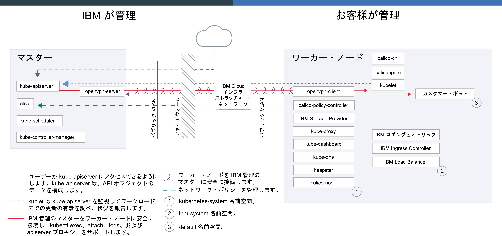

---

copyright:
  years: 2014, 2018
lastupdated: "2018-01-11"

---

{:new_window: target="_blank"}
{:shortdesc: .shortdesc}
{:screen: .screen}
{:pre: .pre}
{:table: .aria-labeledby="caption"}
{:codeblock: .codeblock}
{:tip: .tip}
{:download: .download}

# {{site.data.keyword.containerlong_notm}} テクノロジー

## Docker コンテナー
{: #docker_containers}

Docker は 2013 年に dotCloud によってリリースされたオープン・ソース・プロジェクトです。 既存の Linux コンテナー (LXC) テクノロジーのフィーチャーに基づき構築された Docker は、アプリを素早く作成、テスト、デプロイ、拡張するために使用できるソフトウェア・プラットフォームとなっています。 Docker は、アプリの実行に必要なすべてのエレメントを含んだコンテナーと呼ばれる標準化されたユニットに、ソフトウェアをパッケージします。
{:shortdesc}

Docker の基本概念についての説明:

<dl>
<dt>イメージ</dt>
<dd>Docker イメージは Dockerfile から構築されます。Dockerfile は、イメージを構築する方法や、どのビルド成果物 (アプリ、アプリの構成、その従属関係など) を含めるかを定義するテキスト・ファイルです。 イメージは必ず他のイメージから構築されるので、迅速に構成できます。 イメージの処理の大部分の作業は他の人にまかせ、そのイメージを自分の用途に合わせて微調整します。</dd>
<dt>レジストリー</dt>
<dd>イメージ・レジストリーは Docker イメージを格納、取得、共有する場所です。 レジストリーに格納されたイメージは、だれでもアクセスできるものもありますし (パブリック・レジストリー)、小さなグループのユーザーにアクセスを限定したものもあります (プライベート・レジストリー)。 {{site.data.keyword.containershort_notm}} では、最初のコンテナー化アプリを作成するために使用できる ibmliberty などのパブリック・イメージを提供しています。 エンタープライズ・アプリケーションを作成する場合は、無許可ユーザーが勝手にイメージを使用することがないように、{{site.data.keyword.Bluemix_notm}} で提供されているものなどのプライベート・レジストリーを使用してください。
</dd>
<dt>コンテナー</dt>
<dd>すべてのコンテナーはイメージから作成されます。 コンテナーはアプリとそのすべての従属物をパッケージ化しているので、アプリを変更せずに環境間で移動して実行できます。 仮想マシンとは異なり、コンテナーはデバイス、そのオペレーティング・システム、およびその基礎となるハードウェアを仮想化しません。 アプリのコード、ランタイム、システム・ツール、ライブラリー、設定値のみがコンテナー内にパッケージ化されます。 コンテナーは、コンピュート・ホスト上で分離したプロセスとして実行され、ホストのオペレーティング・システムとそのハードウェア・リソースを共有します。 このため、コンテナーは仮想マシンより軽量で移植しやすく、効率的です。</dd>
</dl>

### コンテナーを使用する主な利点
{: #container_benefits}

<dl>
<dt>コンテナーは迅速</dt>
<dd>コンテナーは、開発デプロイメントおよび実動デプロイメントのための、標準化された環境を提供することにより、システム管理を簡素化します。 軽量ランタイムにより、デプロイメントの素早いスケールアップやスケールダウンが可能です。 コンテナーを使用すると、どのインフラストラクチャーでもすべてのアプリを素早く確実にデプロイして実行できるので、さまざまなオペレーティング・システム・プラットフォームとその基礎となるインフラストラクチャーを管理するという複雑さがなくなります。</dd>
<dt>コンテナーは小さい</dt>
<dd>1 つの仮想マシンで必要とされる量のスペースに、多数のコンテナーを入れることができます。</dd>
<dt>コンテナーはポータブル</dt>
<dd><ul>
  <li>イメージの断片を再利用してコンテナーを構築します。 </li>
  <li>ステージング環境から実稼働環境に素早くアプリのコードを移動します。</li>
  <li>継続的デリバリー・ツールでプロセスを自動化します。</li> </ul></dd>
</dl>

 

## Kubernetes の基本
{: #kubernetes_basics}

Kubernetes は Google によって Borg プロジェクトの一部として開発され、2014 年にオープン・ソース・コミュニティーに引き渡されました。 Kubernetes は、Google が 15 年以上にわたって続けてきた、コンテナー化されたインフラストラクチャーを実動ワークロード、オープン・ソース・コントリビューション、Docker コンテナー管理ツールと結合させて実行するための調査活動の結果として生まれました。これはコンテナーを管理するための、機密保護機能のある分離したアプリ・プラットフォームであり、ポータブルで拡張可能性に優れ、フェイルオーバー時の自己修復機能を備えています。
{:shortdesc}

以下の図に示されている、Kubernetes の基本概念の一部について説明します。

<dl>
<dt>アカウント</dt>
<dd>アカウントとは、ご使用の {{site.data.keyword.Bluemix_notm}} アカウントを指します。</dd>

<dt>クラスター</dt>
<dd>Kubernetes クラスターは、ワーカー・ノードと呼ばれる 1 つ以上のコンピュート・ホストからなります。 ワーカー・ノードは、クラスター内のすべての Kubernetes リソースを一元的に制御してモニターする Kubernetes マスターによって管理されます。 それで、コンテナー化アプリのリソースをデプロイする際には、Kubernetes マスターが、デプロイメント要件とクラスターで使用できるキャパシティーを考慮して、これらのリソースをデプロイするワーカー・ノードを決定します。 Kubernetes リソースには、サービス、デプロイメント、ポッドが含まれます。</dd>

<dt>サービス</dt>
<dd>サービスとは、ポッドのセットをグループ化し、各ポッドの実際のプライベート IP アドレスを公開せずにそれらのポッドへのネットワーク接続を提供する Kubernetes リソースのことです。 サービスを使用することにより、アプリをクラスター内または公開インターネットで使用可能にできます。
</dd>

<dt>デプロイメント</dt>
<dd>デプロイメントとは、アプリの実行に必要なその他のリソースや機能 (サービス、永続ストレージ、アノテーションなど) に関する情報を指定できる Kubernetes リソースです。 構成 YAML ファイルでデプロイメントを文書化し、それをクラスターに適用します。 Kubernetes マスターがリソースを構成し、使用可能な容量を持つワーカー・ノード上のポッドにコンテナーをデプロイします。
  
ローリング更新中に追加するポッドの数や、一度に使用不可にできるポッドの数など、アプリの更新戦略を定義します。 ローリング更新の実行時には、デプロイメントによって、更新が動作しているかどうかが確認され、障害が検出されるとロールアウトが停止されます。</dd>

<dt>ポッド</dt>
<dd>クラスターにデプロイされるすべてのコンテナー化アプリは、ポッドと呼ばれる Kubernetes リソースによってデプロイ、実行、管理されます。 ポッドは Kubernetes クラスター内のデプロイ可能な小さいユニットを表し、単一のユニットとして処理される必要があるコンテナーをグループ化するために使用します。 ほとんどの場合、各コンテナーはその独自のポッドにデプロイされます。 ただしアプリでは、コンテナーとその他のヘルパー・コンテナーを 1 つのポッドにデプロイすることによって、同じプライベート IP アドレスを使用してそれらのコンテナーをアドレス指定できるようにする必要がある場合もあります。</dd>

<dt>アプリ</dt>
<dd>アプリとは、完全に機能する 1 つのアプリ全体を指す場合もありますし、アプリのコンポーネントを指す場合もあります。 アプリのコンポーネントは、別々のポッドまたは別々のワーカー・ノードにデプロイできます。
  
Kubernetes の用語について詳しく学習する場合は、<a href="cs_tutorials.html#cs_cluster_tutorial" target="_blank">チュートリアルを試してください</a>。</dd>

</dl>

 

## サービス・アーキテクチャー
{: #architecture}

各ワーカー・ノードのセットアップ時には、{{site.data.keyword.IBM_notm}} 管理の Docker エンジン、別個のコンピュート・リソース、ネットワーキング、ボリューム・サービスが用意されます。さらに、分離機能、リソース管理機能、そしてワーカー・ノードのセキュリティー・コンプライアンスを提供する標準装備のセキュリティー機能もあります。 ワーカー・ノードは、機密保護機能のある TLS 証明書と openVPN 接続を使用してマスターと通信します。
{:shortdesc}

この図は、お客様が保守する内容と IBM がクラスター内で保守する内容の概要を示しています。 これらの保守タスクの詳細については、[クラスター管理の責任](cs_why.html#responsibilities)を参照してください。

 

