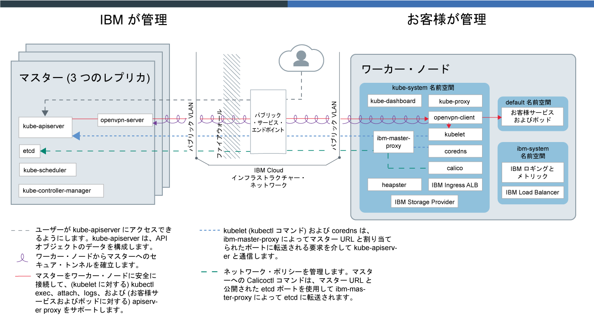
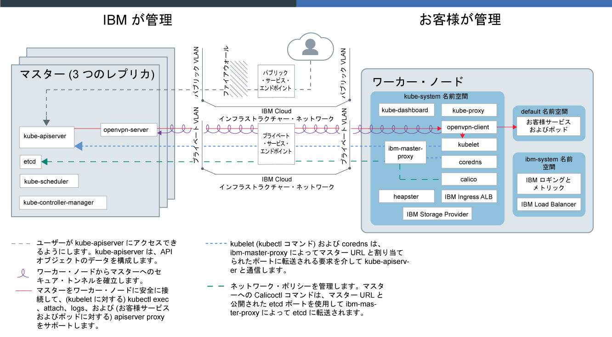

---

copyright:
  years: 2014, 2019
lastupdated: "2019-06-12"

keywords: kubernetes, iks, docker

subcollection: containers

---

{:new_window: target="_blank"}
{:shortdesc: .shortdesc}
{:screen: .screen}
{:pre: .pre}
{:table: .aria-labeledby="caption"}
{:codeblock: .codeblock}
{:tip: .tip}
{:note: .note}
{:important: .important}
{:deprecated: .deprecated}
{:download: .download}
{:preview: .preview}

# {{site.data.keyword.containerlong_notm}} テクノロジー

{{site.data.keyword.containerlong}} を支えるテクノロジーについて詳しく説明します。
{:shortdesc}

## Docker コンテナー
{: #docker_containers}

既存の Linux コンテナー (LXC) テクノロジーに基づき構築された、Docker というオープン・ソース・プロジェクトでは、アプリが実行する必要があるすべての要素が含まれたコンテナーと呼ばれる標準化されたユニットに、ソフトウェアをパッケージする方法についてのテンプレートが定義されました。 {{site.data.keyword.containerlong_notm}} は、Docker コンテナー・イメージからクラスターにコンテナーをデプロイするために、コンテナー・ランタイムとして `containerd` を使用します。
{:shortdesc}

Docker の基本概念についての説明:

<dl>
<dt>イメージ</dt>
<dd>コンテナー・イメージは、実行するコンテナーごとのベースです。 コンテナー・イメージは Dockerfile から構築されます。Dockerfile とは、イメージを構築する方法と、どのビルド成果物 (アプリ、アプリの構成、その従属関係など) を Dockerfile に含めるかを定義するテキスト・ファイルです。 イメージは必ず他のイメージから構築されるので、迅速に構成できます。 イメージの処理の大部分の作業は他の人にまかせ、そのイメージを自分の用途に合わせて微調整します。</dd>
<dt>レジストリー</dt>
<dd>イメージ・レジストリーはコンテナー・イメージを格納、取得、共有する場所です。 レジストリーに格納されたイメージは、だれでもアクセスできるものもありますし (パブリック・レジストリー)、小さなグループのユーザーにアクセスを限定したものもあります (プライベート・レジストリー)。 {{site.data.keyword.containerlong_notm}} では、最初のコンテナー化アプリを作成するために使用できる ibmliberty などのパブリック・イメージを提供しています。 エンタープライズ・アプリケーションを作成する場合は、無許可ユーザーが勝手にイメージを使用することがないように、{{site.data.keyword.Bluemix_notm}} で提供されているものなどのプライベート・レジストリーを使用してください。
</dd>
<dt>コンテナー</dt>
<dd>すべてのコンテナーはイメージから作成されます。 コンテナーはアプリとそのすべての従属物をパッケージ化しているので、アプリを変更せずに環境間で移動して実行できます。 仮想マシンとは異なり、コンテナーはデバイス、そのオペレーティング・システム、およびその基礎となるハードウェアを仮想化しません。 アプリのコード、ランタイム、システム・ツール、ライブラリー、設定値のみがコンテナー内にパッケージ化されます。 コンテナーは、Ubuntu コンピュート・ホスト上で分離したプロセスとして実行され、ホストのオペレーティング・システムとそのハードウェア・リソースを共有します。 このため、コンテナーは仮想マシンより軽量で移植しやすく、効率的です。</dd>
</dl>

### コンテナーを使用する主な利点
{: #container_benefits}

<dl>
<dt>コンテナーは迅速</dt>
<dd>コンテナーは、開発デプロイメントおよび実動デプロイメントのための、標準化された環境を提供することにより、システム管理を簡素化します。 軽量ランタイムにより、デプロイメントの素早いスケールアップやスケールダウンが可能です。 コンテナーを使用すると、どのインフラストラクチャーでもすべてのアプリを素早く確実にデプロイして実行できるので、さまざまなオペレーティング・システム・プラットフォームとその基礎となるインフラストラクチャーを管理するという複雑さがなくなります。</dd>
<dt>コンテナーは小さい</dt>
<dd>1 つの仮想マシンで必要とされる量のスペースに、多数のコンテナーを入れることができます。</dd>
<dt>コンテナーはポータブル</dt>
<dd>
<ul>
  <li>イメージの断片を再利用してコンテナーを構築します。 </li>
  <li>ステージング環境から実稼働環境に素早くアプリのコードを移動します。</li>
  <li>継続的デリバリー・ツールでプロセスを自動化します。</li>
  </ul>
  </dd>

コンテナー・イメージを使用する際の[個人情報の保護](/docs/containers?topic=containers-security#pi)の詳細を確認してください。

Docker に関する知識をさらに深める準備ができましたか? <a href="https://developer.ibm.com/courses/all/docker-essentials-a-developer-introduction/" target="_blank">このコースを受講して、Docker と {{site.data.keyword.containerlong_notm}} が連携する仕組みを学習しましょう。</a>

</dl>

 

## Kubernetes クラスター
{: #kubernetes_basics}

Kubernetes というオープン・ソース・プロジェクトでは、コンテナー化されたインフラストラクチャーの実行と、実動ワークロード、オープン・ソース・コントリビューション、Docker コンテナー管理ツールが組み合わされています。 Kubernetes インフラストラクチャーは、コンテナーを管理するための分離された安全なアプリ・プラットフォームです。ポータブルで拡張性に優れ、フェイルオーバー時の自己修復機能も備えています。
{:shortdesc}

以下の図に示されている、Kubernetes の基本概念の一部について説明します。

<dl>
<dt>アカウント</dt>
<dd>アカウントとは、ご使用の {{site.data.keyword.Bluemix_notm}} アカウントを指します。</dd>

<dt>クラスター</dt>
<dd>Kubernetes クラスターは、ワーカー・ノードと呼ばれる 1 つ以上のコンピュート・ホストからなります。 ワーカー・ノードは、クラスター内のすべての Kubernetes リソースを一元的に制御してモニターする Kubernetes マスターによって管理されます。 それで、コンテナー化アプリのリソースをデプロイする際には、Kubernetes マスターが、デプロイメント要件とクラスターで使用できるキャパシティーを考慮して、これらのリソースをデプロイするワーカー・ノードを決定します。 Kubernetes リソースには、サービス、デプロイメント、ポッドが含まれます。</dd>

<dt>サービス</dt>
<dd>サービスとは、ポッドのセットをグループ化し、各ポッドの実際のプライベート IP アドレスを公開せずにそれらのポッドへのネットワーク接続を提供する Kubernetes リソースのことです。 サービスを使用することにより、アプリをクラスター内または公開インターネットで使用可能にできます。
</dd>

<dt>デプロイメント</dt>
<dd>デプロイメントとは、アプリの実行に必要なその他のリソースや機能 (サービス、永続ストレージ、アノテーションなど) に関する情報を指定できる Kubernetes リソースです。 構成 YAML ファイルでデプロイメントを文書化し、それをクラスターに適用します。 Kubernetes マスターがリソースを構成し、使用可能な容量を持つワーカー・ノード上のポッドにコンテナーをデプロイします。
  
ローリング更新中に追加するポッドの数や、一度に使用不可にできるポッドの数など、アプリの更新戦略を定義します。 ローリング更新の実行時には、デプロイメントによって、更新が動作しているかどうかが確認され、障害が検出されるとロールアウトが停止されます。</dd>

<dt>ポッド</dt>
<dd>クラスターにデプロイされるすべてのコンテナー化アプリは、ポッドと呼ばれる Kubernetes リソースによってデプロイ、実行、管理されます。 ポッドは Kubernetes クラスター内のデプロイ可能な小さいユニットを表し、単一のユニットとして処理される必要があるコンテナーをグループ化するために使用します。 ほとんどの場合、各コンテナーはその独自のポッドにデプロイされます。 ただしアプリでは、コンテナーとその他のヘルパー・コンテナーを 1 つのポッドにデプロイすることによって、同じプライベート IP アドレスを使用してそれらのコンテナーをアドレス指定できるようにする必要がある場合もあります。</dd>

<dt>アプリ</dt>
<dd>アプリとは、完全に機能する 1 つのアプリ全体を指す場合もありますし、アプリのコンポーネントを指す場合もあります。 アプリのコンポーネントは、別々のポッドまたは別々のワーカー・ノードにデプロイできます。</dd>

Kubernetes リソースを処理する際の[個人情報の保護](/docs/containers?topic=containers-security#pi)の詳細を確認してください。

Kubernetes に関する知識をさらに深める準備ができましたか?

<ul><li><a href="/docs/containers?topic=containers-cs_cluster_tutorial#cs_cluster_tutorial" target="_blank">クラスターの作成チュートリアルを利用して、用語の理解をさらに深めてください</a>。</li>
<li><a href="https://developer.ibm.com/courses/all/container-kubernetes-essentials-with-ibm-cloud/" target="_blank">このコースを受講して、Kubernetes と {{site.data.keyword.containerlong_notm}} が連携する仕組みを学習しましょう。</a></li></ul>

</dl>

 

## サービス・アーキテクチャー
{: #architecture}

{{site.data.keyword.containerlong_notm}} 上で実行される Kubernetes クラスターでは、コンテナー化アプリは、ワーカー・ノードと呼ばれるコンピュート・ホスト上でホストされます。 これらのアプリはポッド内で実行され、ポッドがワーカー・ノード上でホストされます。 ワーカー・ノードは Kubernetes マスターによって管理されます。 Kubernetes マスターとワーカー・ノードの間の通信セットアップは、IBM Cloud インフラストラクチャー (SoftLayer) ネットワークのセットアップ方法に依存します。つまり、パブリック・サービス・エンドポイントを使用したアカウントなのか、パブリックおよびプライベート・サービス・エンドポイントを使用した VRF 対応アカウントなのかによって異なります。
{: shortdesc}

次の図は、[パブリック・サービス・エンドポイントのみが有効化](/docs/containers?topic=containers-plan_clusters#workeruser-master)されている場合のアカウントで、クラスターの各コンポーネントがどのように相互作用するのかを示しています。

<figure>
 
 <figcaption>パブリック・サービス・エンドポイントのみが有効化されている場合の {{site.data.keyword.containerlong_notm}} アーキテクチャー</figcaption>
</figure>

次の図は、[パブリックおよびプライベート・サービス・エンドポイントが有効化](/docs/containers?topic=containers-plan_clusters#workeruser-master)されている場合の VRF 対応アカウントで、クラスターの各コンポーネントがどのように相互作用するのかを示しています。

<figure>
 
 <figcaption>パブリックおよびプライベート・サービス・エンドポイントが有効化されている場合の {{site.data.keyword.containerlong_notm}} アーキテクチャー</figcaption>
</figure>

Kubernetes マスターとワーカー・ノードの違いは何ですか? これは良い質問です。

<dl>
  <dt>Kubernetes マスター</dt>
    <dd>Kubernetes マスターは、クラスター内のすべてのコンピュート・リソース、ネットワーク・リソース、ストレージ・リソースを管理します。 Kubernetes マスターは、コンテナー化されたアプリとサービスがクラスター内のワーカー・ノードに均等にデプロイされるようにします。 マスターは、アプリとサービスの構成方法に応じて、アプリの要件を満たせるだけのリソースがあるワーカー・ノードを決定します。  次の表に、Kubernetes マスターの各コンポーネントについての説明を記載しています。
    <table>
    <caption>Kubernetes マスターのコンポーネント</caption>
    <thead>
    <th>マスターのコンポーネント</th>
    <th>説明</th>
    </thead>
    <tbody>
    <tr>
    <td>kube-apiserver</td>
    <td>Kubernetes API サーバーは、ワーカー・ノードから Kubernetes マスターへのすべてのクラスター管理要求のメインエントリー・ポイントとして機能します。 Kubernetes API サーバーは、ポッドやサービスなどの Kubernetes リソースの状態を変更する要求を検証および処理してから、この状態を etcd に保管します。</td>
    </tr>
    <tr>
    <td>openvpn-server</td>
    <td>OpenVPN サーバーは、マスターをワーカー・ノードに安全に接続するために OpenVPN クライアントと連携します。 この接続は、ポッドやサービスに対する `apiserver proxy` 呼び出しと、kubelet に対する `kubectl exec`、`attach`、`logs` 呼び出しをサポートしています。</td>
    </tr>
    <tr>
    <td>etcd</td>
    <td>etcd は、クラスターのすべての Kubernetes リソース (サービス、デプロイメント、ポッドなど) の状態を保管する、可用性の高いキー値ストアです。 etcd 内のデータは、IBM が管理する暗号化ストレージ・インスタンスにバックアップされます。</td>
    </tr>
    <tr>
    <td>kube-scheduler</td>
    <td>Kubernetes スケジューラーは、新しく作成されたポッドを監視し、容量、パフォーマンスのニーズ、ポリシー制約、アンチアフィニティー仕様、およびワークロード要件に基づいて、それらのポッドをデプロイする場所を決定します。 要件に合致するワーカー・ノードが見つからなければ、ポッドはクラスターにデプロイされません。</td>
    </tr>
    <tr>
    <td>kube-controller-manager</td>
    <td>Kubernetes コントローラー・マネージャーは、レプリカ・セットなどのクラスター・リソースの状態を監視するデーモンです。 リソースの状態が変化する (例えば、レプリカ・セット内のポッドがダウンする) と、コントローラー・マネージャーは、必要な状態を実現するための修正アクションを開始します。</td>
    </tr>
    </tbody></table></dd>
  <dt>ワーカー・ノード</dt>
    <dd>各ワーカー・ノードは、物理マシン (ベア・メタル) であるか、クラウド環境内の物理ハードウェアで実行される仮想マシンです。 ワーカー・ノードをプロビジョンする際に、そのワーカー・ノード上でホストされるコンテナーで使用できるリソースを決定します。 すぐに使用できるように、ワーカー・ノードには、{{site.data.keyword.IBM_notm}} 管理の Docker エンジン、別個のコンピュート・リソース、ネットワーキング、ボリューム・サービスがセットアップされます。 標準装備のセキュリティー機能は、分離機能、リソース管理機能、そしてワーカー・ノードのセキュリティー・コンプライアンスを提供します。  
デフォルト・ワーカー・ノード・コンポーネント (`kubelet` など) の変更はサポートされていないため、これらのコンポーネントを変更すると予期せぬ結果が生じる可能性があります。
次の表に、ワーカー・ノードの各コンポーネントについての説明を記載しています。
    <table>
    <caption>ワーカー・ノードのコンポーネント</caption>
    <thead>
    <th>ワーカーのコンポーネント</th>
    <th>名前空間</th>
    <th>説明</th>
    </thead>
    <tbody>
    <tr>
    <td>`ibm-master-proxy`</td>
    <td>kube-system</td>
    <td>`ibm-master-proxy` が、ワーカー・ノードからの要求を、可用性の高い複数のマスター・レプリカの各 IP アドレスに転送します。 単一ゾーン・クラスターのマスターの場合は、別々のホスト上に 3 つのレプリカが存在しますが、マスターの IP アドレスとドメイン名は 1 つです。 複数ゾーン対応ゾーンにあるクラスターの場合、マスターの 3 つのレプリカがゾーン間に分散されます。 そのため、ドメイン・ネームはクラスター・マスター全体で 1 つですが、IP アドレスはマスターごとに独自のものが登録されます。</td>
    </tr>
    <tr>
    <td>`openvpn-client`</td>
    <td>kube-system</td>
    <td>OpenVPN クライアントは、マスターをワーカー・ノードに安全に接続するために OpenVPN サーバーと連携します。 この接続は、ポッドやサービスに対する `apiserver proxy` 呼び出しと、kubelet に対する `kubectl exec`、`attach`、`logs` 呼び出しをサポートしています。</td>
    </tr>
    <tr>
    <td>`kubelet`</td>
    <td>kube-system</td>
    <td>kubelet は、ワーカー・ノードごとに実行されるポッドで、ワーカー・ノードで実行される各ポッドの正常性のモニタリングと、Kubernetes API サーバーが送信するイベントの監視を行うポッドです。 イベントに基づいて、kubelet は、ポッドを作成または削除し、Liveness Probe と Readiness Probe を確保し、Kubernetes API サーバーに応答としてポッドの状況を報告します。</td>
    </tr>
    <tr>
    <td>`coredns`</td>
    <td>kube-system</td>
    <td>デフォルトでは、Kubernetes は CoreDNS のポッド (またはバージョン 1.12 以前の KubeDNS ポッド) とサービスをクラスター上でスケジュールします。 コンテナーは、DNS サービスの IP を自動的に使用して、そのコンテナーによる他のポッドとサービスの検索で DNS 名を解決します。</td>
    </tr>
    <tr>
    <td>`calico`</td>
    <td>kube-system</td>
    <td>Calico はクラスターのネットワーク・ポリシーを管理し、以下のようないくつかのコンポーネントで構成されています。
    <ul>
    <li>**`calico-cni`**: Calico コンテナー・ネットワーク・インターフェース (CNI) では、コンテナーのネットワーク接続を管理し、コンテナーが削除される際に割り振られているリソースを削除します。</li>
    <li>**`calico-ipam`**: Calico IPAM は、コンテナーの IP アドレス割り当てを管理します。</li>
    <li>**`calico-node`**: Calico ノードは、Calico が含まれたネットワーキング・コンテナーに必要な各種コンポーネントをバンドルしてまとめるコンテナーです。</li>
    <li>**`calico-policy-controller`**: Calico ポリシー・コントローラーは、インバウンドとアウトバウンドのネットワーク・トラフィックが設定されたネットワーク・ポリシーに準拠しているか監視します。 トラフィックがクラスター内で許可されていない場合は、クラスターへのアクセスはブロックされます。 Calico ポリシー・コントローラーは、クラスターのネットワーク・ポリシーを作成および設定するためにも使用されます。</li></ul></td>
    </tr>
    <tr>
    <td>`kube-proxy`</td>
    <td>kube-system</td>
    <td>Kubernetes ネットワーク・プロキシーは、ワーカー・ノードごとに実行され、クラスター内で実行される各サービスの TCP および UDP のネットワーク・トラフィックの転送やロード・バランシングを行うデーモンです。</td>
    </tr>
    <tr>
    <td>`kube-dashboard`</td>
    <td>kube-system</td>
    <td>Kubernetes ダッシュボードは、クラスター内で実行中のアプリケーションとクラスターをユーザーが管理およびトラブルシューティングできるようにする Web ベースの GUI です。</td>
    </tr>
    <tr>
    <td>`heapster`</td>
    <td>kube-system</td>
    <td>Heapster は、モニタリングとイベント・データのクラスター全体の統合機能です。 Heapster ポッドは、クラスター内のすべてのノードを検出し、各ノードの kubelet から使用量情報を照会します。 Kubernetes ダッシュボードに各種使用状況グラフがあります。</td>
    </tr>
    <tr>
    <td>Ingress ALB</td>
    <td>kube-system</td>
    <td>Ingress は、パブリック要求またはプライベート要求をクラスター内の複数のアプリに転送することで、クラスター内のネットワーク・トラフィックのワークロードのバランスを取るために使用できる Kubernetes サービスです。 パブリック・ネットワークまたはプライベート・ネットワークを介してアプリを公開するには、Ingress リソースを作成して、Ingress アプリケーション・ロード・バランサー (ALB) にアプリを登録する必要があります。 これにより、単一の URL または IP アドレスを使用して、複数のアプリケーションへのアクセスが可能になります。</td>
    </tr>
    <tr>
    <td>ストレージ・プロバイダー</td>
    <td>kube-system</td>
    <td>すべてのクラスターは、ファイル・ストレージをプロビジョンするために、それぞれプラグインを使用してセットアップされます。 ブロック・ストレージなどの他のアドオンのインストールを選択できます。</td>
    </tr>
    <tr>
    <td>ロギングおよびメトリック</td>
    <td>ibm-system</td>
    <td>統合された {{site.data.keyword.loganalysislong_notm}} サービスと {{site.data.keyword.monitoringlong_notm}} サービスを使用して、ログとメトリックを処理する際に収集および保存の機能を拡張できます。</td>
    </tr>
    <tr>
    <td>ロード・バランサー</td>
    <td>ibm-system</td>
    <td>ロード・バランサーは、パブリック要求またはプライベート要求をアプリに転送することで、クラスター内のネットワーク・トラフィックのワークロードのバランスを取るために使用できる Kubernetes サービスです。</td>
    </tr>
    <tr>
    <td>アプリ・ポッドとアプリ・サービス</td>
    <td>default</td>
    <td><code>default</code> 名前空間または作成した名前空間では、ポッドおよびサービスにアプリをデプロイして、それらのポッドと通信することができます。</td>
    </tr>
    </tbody></table></dd>
</dl>

{{site.data.keyword.containerlong_notm}} を他の製品やサービスと一緒に使用する方法をご覧になりたいですか? こちらで[統合](/docs/containers?topic=containers-supported_integrations#supported_integrations)についていくつか紹介しています。
{: tip}

## サービスの制限
{: #tech_limits}

{{site.data.keyword.containerlong_notm}} と Kubernetes オープン・ソース・プロジェクトは、セキュリティー、利便性、および基本的な機能を確保するためのデフォルトのサービス設定と制限を備えています。一部の制限は変更でき、その場合はそのように注記されています。{{site.data.keyword.containerlong_notm}} の以下の制限に達することが予想される場合は、[内部 ](https://ibm-argonauts.slack.com/messages/C4S4NUCB1) または[外部の Slack ](https://ibm-container-service.slack.com) で IBM チームにお問い合わせください。
{: shortdesc}

<table summary="この表には、{{site.data.keyword.containerlong_notm}} の制限に関する情報が含まれています。列は左から右に読みます。1 列目は制限のタイプ、2 列目はその制限の説明です。">
<caption>{{site.data.keyword.containerlong_notm}} の制限</caption>
<thead>
  <tr>
    <th>タイプ</th>
    <th>説明</th>
  </tr>
</thead>
<tbody>
  <tr>
    <td>API の速度制限</td>
    <td>固有のソース IP アドレスごとに、{{site.data.keyword.containerlong_notm}} API に対して 10 秒ごとに 100 個の要求。</td>
  </tr>
  <tr>
    <td>ワーカー・ノードの容量</td>
    <td>ワーカー・ノードは、コンピュート・リソースの[フレーバーの選択](/docs/containers?topic=containers-planning_worker_nodes#shared_dedicated_node)で使用可能です。</td>
  </tr>
  <tr>
    <td>ワーカー・ノードのホスト・アクセス</td>
    <td>セキュリティーのため、ワーカー・ノードのコンピュート・ホストに SSH で接続することはできません。</td>
  </tr>
  <tr>
    <td>ワーカー・ノードの最大数</td>
    <td>クラスターごとに 900 個を超える予定の場合は、まず[内部 ](https://ibm-argonauts.slack.com/messages/C4S4NUCB1) または[外部の Slack ](https://ibm-container-service.slack.com) で IBM チームにお問い合わせください。  データ・センターあたりのインスタンス数または毎月のインスタンスの注文数に対する IBM Cloud インフラストラクチャー (SoftLayer) の容量の制限を確認する場合は、IBM Cloud インフラストラクチャー (SoftLayer) の担当者にお問い合わせください。</td>
  </tr>
  <tr>
    <td>ポッドの最大数</td>
    <td>ワーカー・ノードごとに 110 個。  ポッドの数には、ワーカー・ノードで実行される `kube-system` ポッドと `ibm-system` ポッドが含まれます。パフォーマンスを高めるために、コンピュート・コアごとに実行するポッドの数を制限して、ワーカー・ノードを過剰に使用しないようにすることを検討してください。例えば、`b3c.4x16` フレーバーのワーカー・ノードでは、ワーカー・ノードの合計容量の 75% 以下を使用する、コアあたり 10 個のポッドを実行できます。</td>
  </tr>
  <tr>
    <td>Kubernetes サービスの最大数</td>
    <td>クラスター内の Kubernetes サービスに割り当てることができる、172.21.0.0/16 の範囲のクラスターあたり 65,000 個の IP。</td>
  </tr>
  <tr>
    <td>Ingress アプリケーション・ロード・バランサー (ALB) トラフィック</td>
    <td>1 秒あたり 32,768 件の接続数。  受信トラフィックがこの数を超える場合、増加したワークロードを処理するために、クラスターの [ALB レプリカの数をスケールアップ](/docs/containers?topic=containers-ingress#scale_albs)します。</td>
  </tr>
  <tr>
    <td>ストレージ・ボリューム</td>
    <td>アカウントあたりの IBM Cloud インフラストラクチャー (SoftLayer) のファイル・ストレージ・インスタンスおよびブロック・ストレージ・インスタンスのボリュームの合計が 250 個。  この数量を超える数をマウントすると、永続ボリュームをプロビジョンするときに「容量不足」のメッセージが表示されるため、IBM Cloud インフラストラクチャー (SoftLayer) の担当者に問い合わせる必要があります。その他の FAQ については、[ファイル・ストレージ](/docs/infrastructure/FileStorage?topic=FileStorage-file-storage-faqs#how-many-volumes-can-i-provision-)と[ブロック・ストレージ](/docs/infrastructure/BlockStorage?topic=BlockStorage-block-storage-faqs#how-many-instances-can-share-the-use-of-a-block-storage-volume-)の資料を参照してください。</td>
  </tr>
</tbody>
</table>
