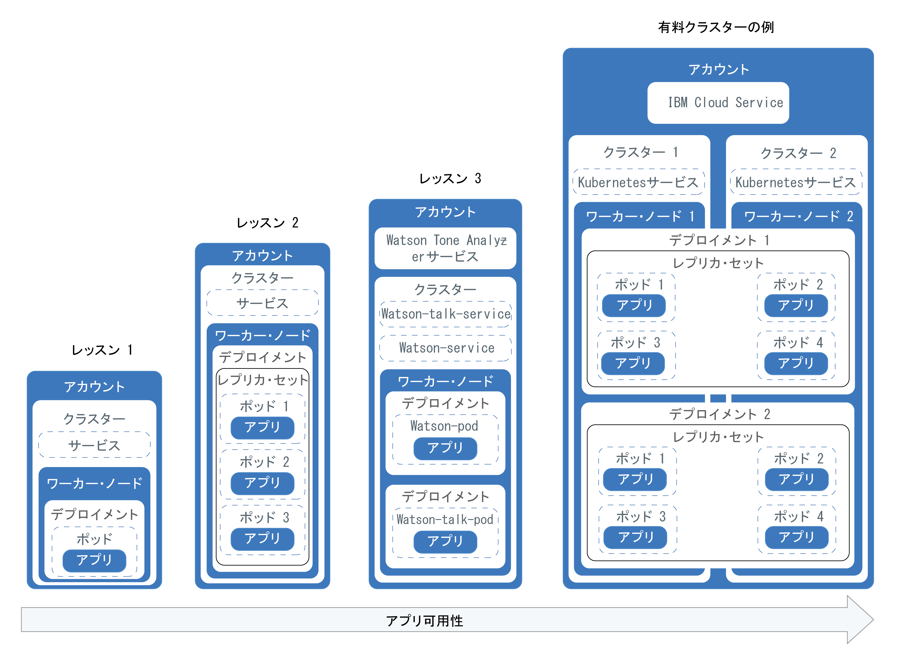
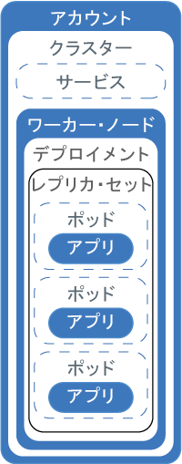
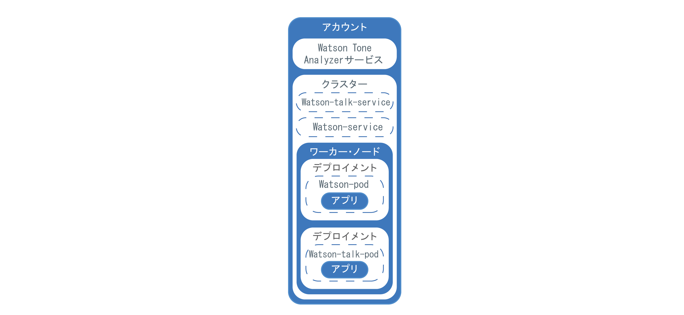

---

copyright:
  years: 2014, 2017
lastupdated: "2017-08-17"

---

{:new_window: target="_blank"}
{:shortdesc: .shortdesc}
{:screen: .screen}
{:pre: .pre}
{:table: .aria-labeledby="caption"}
{:codeblock: .codeblock}
{:tip: .tip}
{:download: .download}


# クラスターのためのチュートリアル
{: #cs_tutorials}

これらのチュートリアルや他のリソースをサービスの入門編として試してみてください。
{:shortdesc}

## チュートリアル: クラスターの作成
{: #cs_cluster_tutorial}

独自の Kubernetes クラスターをクラウドにデプロイして管理することができます。
ワーカー・ノードという独立したコンピュート・ホストで構成されるクラスター上で、コンテナー化したアプリのデプロイメント、操作、スケーリング、モニタリングを自動化することができます。
{:shortdesc}

このチュートリアル・シリーズでは、架空の PR 会社が Kubernetes を使用して、Watson Tone Analyzer を活用するコンテナー化アプリを {{site.data.keyword.Bluemix_short}} にデプロイする方法を実例で示します。
この PR 会社が Watson Tone Analyzer を使用して自社のプレス・リリースを分析し、自社のメッセージのトーンに関するフィードバックを受け取る、というシナリオです。
この最初のチュートリアルでは、PR 会社のネットワーキング管理者が、会社の Watson Tone Analyzer アプリのコンピュート・インフラストラクチャーであるカスタム Kubernetes クラスターをセットアップします。
このクラスターは、PR 会社のアプリの Hello World バージョンをデプロイしてテストするために使用されます。


### 達成目標

-   1 つのワーカー・ノードがある Kubernetes クラスターを作成する
-   Kubernetes API を使用し Docker イメージを管理するための CLI をインストールする
-   イメージを格納するためのプライベート・イメージ・リポジトリーを IBM {{site.data.keyword.Bluemix_notm}} Container Registry で作成する
-   Watson Tone Analyzer {{site.data.keyword.Bluemix_notm}} サービスをクラスターに追加して、そのサービスをクラスター内のアプリで使用できるようにする

### 所要時間

25 分

### 対象読者

このチュートリアルは、Kubernetes クラスターを作成したことがないソフトウェア開発者やネットワーク管理者を対象にしています。


### レッスン 1: CLI をセットアップする
{: #cs_cluster_tutorial_lesson1}

{{site.data.keyword.containershort_notm}} CLI、{{site.data.keyword.registryshort_notm}} CLI、そしてそれらの前提条件をインストールします。
これらの CLI は後のレッスンで使用され、ローカル・マシンから Kubernetes クラスターを管理するため、コンテナーとしてデプロイするイメージを作成するため、そして後のチュートリアルでアプリをクラスターにデプロイするために必要となります。


このレッスンには、以下の CLI をインストールするための情報が含まれています。


-   {{site.data.keyword.Bluemix_notm}} CLI
-   {{site.data.keyword.containershort_notm}} プラグイン
-   Kubernetes CLI
-   {{site.data.keyword.registryshort_notm}} プラグイン
-   Docker CLI


CLI をインストールするには、以下のことを行います。
1.  [{{site.data.keyword.Bluemix_notm}} アカウント](https://console.ng.bluemix.net/registration/) がまだなければ作成します。ユーザー名とパスワードをメモしておいてください。
後でその情報が必要になります。

2.  {{site.data.keyword.containershort_notm}} プラグインの前提条件として、[{{site.data.keyword.Bluemix_notm}} CLI ](https://clis.ng.bluemix.net/ui/home.html) をインストールします。{{site.data.keyword.Bluemix_notm}} CLI を使用してコマンドを実行するための接頭部は、`bx` です。
3.  プロンプトに従ってアカウントと {{site.data.keyword.Bluemix_notm}} 組織を選択します。
クラスターはアカウントに固有のものですが、{{site.data.keyword.Bluemix_notm}} 組織またはスペースからは独立しています。

5.  Kubernetes クラスターを作成し、ワーカー・ノードを管理するには、{{site.data.keyword.containershort_notm}} プラグインをインストールします。{{site.data.keyword.containershort_notm}} プラグインを使用してコマンドを実行するための接頭部は、`bx cs` です。

    ```
    bx plugin install container-service -r {{site.data.keyword.Bluemix_notm}}
    ```
    {: pre}
6.  {{site.data.keyword.Bluemix_notm}} CLI にログインします。プロンプトが出されたら、{{site.data.keyword.Bluemix_notm}} 資格情報を入力します。


    ```
bx login```
    {: pre}

    特定の {{site.data.keyword.Bluemix_notm}} 地域を指定するには、API エンドポイントを含めます。特定の
{{site.data.keyword.Bluemix_notm}} 地域のコンテナー・レジストリーに保管されているプライベート Dockerイメージがある場合、またはすでに作成した {{site.data.keyword.Bluemix_notm}} サービス・インスタンスがある場合、この地域にログインして、イメージと {{site.data.keyword.Bluemix_notm}} サービスにログインします。


    ログインする {{site.data.keyword.Bluemix_notm}} 地域により、使用可能なデータ・センターなど、Kubernetes クラスターを作成できる地域も決まります。地域を指定しない場合、最も近い地域に自動的にログインします。

       -  米国南部

           ```
bx login -a api.ng.bluemix.net```
           {: pre}
     
       -  シドニー

           ```
bx login -a api.au-syd.bluemix.net```
           {: pre}

       -  ドイツ


           ```
          bx login -a api.eu-de.bluemix.net
          ```
           {: pre}

       -  英国

           ```
bx login -a api.eu-gb.bluemix.net```
           {: pre}

    **注:** フェデレーテッド ID がある場合は、`bx login --sso` を使用して、{{site.data.keyword.Bluemix_notm}} CLI にログインします。ユーザー名を入力し、CLI 出力に示された URL を使用して、ワンタイム・パスコードを取得してください。
`--sso` なしではログインに失敗し、`--sso` オプションを指定すると成功する場合、フェデレーテッド ID があることがわかります。

7.  前に選択した {{site.data.keyword.Bluemix_notm}} 地域とは別の地域で Kubernetes クラスターを作成する場合は、その地域を指定します。例えば、ある地域で作成した {{site.data.keyword.Bluemix_notm}} サービスまたはプライベート Docker イメージを別の地域の {{site.data.keyword.containershort_notm}} で使用したい場合があります。

    以下の API エンドポイントの中から選択します。

    * 米国南部:

        ```
bx cs init --host https://us-south.containers.bluemix.net```
        {: pre}

    * 英国南部:

        ```
        bx cs init --host https://uk-south.containers.bluemix.net
        ```
        {: pre}

    * 中欧:

        ```
        bx cs init --host https://eu-central.containers.bluemix.net
        ```
        {: pre}

    * 南アジア太平洋地域:

        ```
        bx cs init --host https://ap-south.containers.bluemix.net
        ```
        {: pre}

8.  Kubernetes ダッシュボードのローカル・バージョンを表示して、アプリをクラスター内にデプロイするには、[Kubernetes CLI をインストールします](https://kubernetes.io/docs/tasks/tools/install-kubectl/)。Kubernetes CLI を使用してコマンドを実行するための接頭部は、`kubectl` です。

    1.  Kubernetes CLI をダウンロードします。

        OS X:   [https://storage.googleapis.com/kubernetes-release/release/v1.5.6/bin/darwin/amd64/kubectl ](https://storage.googleapis.com/kubernetes-release/release/v1.5.6/bin/darwin/amd64/kubectl)

        Linux:   [https://storage.googleapis.com/kubernetes-release/release/v1.5.6/bin/linux/amd64/kubectl ](https://storage.googleapis.com/kubernetes-release/release/v1.5.6/bin/linux/amd64/kubectl)

        Windows:   [https://storage.googleapis.com/kubernetes-release/release/v1.5.6/bin/windows/amd64/kubectl.exe ](https://storage.googleapis.com/kubernetes-release/release/v1.5.6/bin/windows/amd64/kubectl.exe)

          **ヒント:** Windows を使用している場合、Kubernetes CLI を {{site.data.keyword.Bluemix_notm}} CLI と同じディレクトリーにインストールします。このようにセットアップすると、後でコマンドを実行するとき、ファイル・パスの変更を行う手間がいくらか少なくなります。


    2.  OSX と Linux のユーザーは、以下の手順を実行してください。

        1.  実行可能ファイルを `/usr/local/bin` ディレクトリーに移動します。


            ```
mv /<path_to_file>/kubectl /usr/local/bin/kubectl```
            {: pre}

        2.  /usr/local/bin が `PATH` システム変数にリストされていることを確認します。`PATH` 変数には、オペレーティング・システムが実行可能ファイルを見つけることのできるすべてのディレクトリーが含まれています。
`PATH` 変数にリストされた複数のディレクトリーには、それぞれ異なる目的があります。
/usr/local/bin は実行可能ファイルを保管するために使用されますが、保管対象となるのは、オペレーティング・システムの一部ではなく、システム管理者によって手動でインストールされたソフトウェアです。

            ```
echo $PATH```
            {: pre}

            CLI 出力は、以下のようになります。

            ```
/usr/local/bin:/usr/bin:/bin:/usr/sbin:/sbin```
            {: screen}

        3.  バイナリー・ファイルを実行可能ファイルに変換します。

            ```
chmod +x /usr/local/bin/kubectl```
            {: pre}

9. {{site.data.keyword.registryshort_notm}} でプライベート・イメージ・リポジトリーをセットアップして管理するには、{{site.data.keyword.registryshort_notm}} プラグインをインストールします。レジストリー・コマンドを実行するための接頭部は、`bx cr` です。

    ```
    bx plugin install container-registry -r {{site.data.keyword.Bluemix_notm}}
    ```
    {: pre}

    container-service プラグインと container-registry プラグインが正常にインストールされたことを検証するには、以下のコマンドを実行します。

    ```
bx plugin list```
    {: pre}

10. ローカルにイメージを作成して、それらをプライベート・イメージ・リポジトリーにプッシュするには、[Docker CE CLI をインストールします](https://www.docker.com/community-edition#/download)。Windows 8 以前を使用している場合、代わりに [Docker Toolbox ](https://www.docker.com/products/docker-toolbox) をインストールしてください。


{{site.data.keyword.Bluemix_notm}} アカウントの作成と CLI のインストールを正常に行うことができたので、次のレッスンとチュートリアルに進むことができます。
次に、CLI を使用してクラスターにアクセスし、{{site.data.keyword.Bluemix_notm}} サービスの追加を開始します。


### レッスン 2: クラスター環境をセットアップする
{: #cs_cluster_tutorial_lesson2}

Kubernetes クラスターを作成し、{{site.data.keyword.registryshort_notm}} でプライベート・イメージ・リポジトリーをセットアップし、シークレットをクラスターに追加して、アプリが {{site.data.keyword.watson}} {{site.data.keyword.toneanalyzerfull}} サービスにアクセスできるようにします。

1.  ライト Kubernetes クラスターを作成します。

    ```
    bx cs cluster-create --name <pr_firm_cluster>
    ```
    {: pre}

    ライト・クラスターでは、コンテナー・ポッドをデプロイするための 1 つのワーカー・ノードが提供されます。ワーカー・ノードは、アプリを実行するコンピュート・ホストで、通常は仮想マシンです。
アプリを実稼働環境実動で実行するときには、複数のワーカー・ノードにアプリのレプリカを複数配置して、アプリの可用性を高めます。


    **注:** ワーカー・ノード・マシンが配列され、クラスターがセットアップされて自分のプロビジョンされるまでに、最大 15 分かかります。

2.  独自のプライベート・イメージ・リポジトリーを {{site.data.keyword.registryshort_notm}} にセットアップすることによって、Docker イメージを安全に保管し、すべてのクラスター・ユーザーと共有します。{{site.data.keyword.Bluemix_notm}} 内のプライベート・イメージ・リポジトリーは、このステップで設定する名前空間によって識別されます。イメージ・リポジトリーの固有の URL を作成するために名前空間が使用されます。開発者はこれを使用してプライベート Dockerイメージにアクセスできます。各アカウントは複数の名前空間を作成して、イメージをグループ化したり編成したりできます。例えば、部門ごと、環境ごと、またはアプリごとに名前空間を作成できます。


    この例で PR 会社はイメージ・リポジトリーを {{site.data.keyword.registryshort_notm}} に 1 つだけを作成するので、アカウント内のすべてのイメージをグループする名前空間として _pr_firm_ を選択します。_&lt;your_namespace&gt;_ を任意の名前空間に置き換えてください。チュートリアルに関係する名前空間にする必要はありません。


    ```
    bx cr namespace-add <your_namespace>
    ```
    {: pre}

3.  次のステップに進む前に、ワーカー・ノードのデプロイメントが完了したことを確認します。


    ```
        bx cs workers <pr_firm_cluster>
        ```
     {: pre}

    ワーカー・ノードのプロビジョニングが完了すると、状況が **Ready** に変わり、今後のチュートリアルで使用する {{site.data.keyword.Bluemix_notm}} サービスのバインドを開始できます。

    ```
    ID                                                 Public IP       Private IP       Machine Type   State    Status   
    kube-dal10-pafe24f557f070463caf9e31ecf2d96625-w1   169.48.131.37   10.177.161.132   free           normal    Ready   
    ```
    {: screen}

4.  CLI でクラスターのコンテキストを設定します。クラスターの作業を行うためにコンテナー CLI にログインするたびに、これらのコマンドを実行して、クラスターの構成ファイルのパスをセッション変数として設定する必要があります。
Kubernetes CLI はこの変数を使用して、{{site.data.keyword.Bluemix_notm}} 内のクラスターと接続するために必要なローカル構成ファイルと証明書を検索します。


    1.  環境変数を設定して Kubernetes 構成ファイルをダウンロードするためのコマンドを取得します。


        ```
        bx cs cluster-config pr_firm_cluster
        ```
        {: pre}

        構成ファイルのダウンロードが完了すると、そのローカルの Kubernetes 構成ファイルのパスを環境変数として設定するために使用できるコマンドが表示されます。


        OS X の場合の例:


        ```
        export KUBECONFIG=/Users/<user_name>/.bluemix/plugins/container-service/clusters/pr_firm_cluster/kube-config-prod-dal10-pr_firm_cluster.yml
        ```
        {: screen}

    2.  `KUBECONFIG` 環境変数を設定するためのコマンドとしてターミナルに表示されたものを、コピーして貼り付けます。


    3.  `KUBECONFIG` 環境変数が適切に設定されたことを確認します。


        OS X の場合の例:


        ```
echo $KUBECONFIG```
        {: pre}

        出力:


        ```
        /Users/<user_name>/.bluemix/plugins/container-service/clusters/pr_firm_cluster/kube-config-prod-dal10-pr_firm_cluster.yml
        ```
        {: screen}

    4.  Kubernetes CLI サーバーのバージョンを調べて、ご使用のクラスターで `kubectl` コマンドが正常に実行することを確認します。

        ```
kubectl version  --short```
        {: pre}

        出力例:


        ```
        Client Version: v1.5.6
        Server Version: v1.5.6
        ```
        {: screen}

5.  {{site.data.keyword.watson}} {{site.data.keyword.toneanalyzershort}} {{site.data.keyword.Bluemix_notm}} サービスをクラスターに追加します。{{site.data.keyword.watson}} {{site.data.keyword.toneanalyzershort}} などの {{site.data.keyword.Bluemix_notm}} サービスを使用すると、既に開発された機能をアプリで活用できます。クラスターにバインドされているすべての {{site.data.keyword.Bluemix_notm}} サービスは、そのクラスターにデプロイされたアプリで使用できます。
アプリで使用する {{site.data.keyword.Bluemix_notm}} サービスごとに、以下の手順を繰り返してください。

    1.  {{site.data.keyword.watson}} {{site.data.keyword.toneanalyzershort}} サービスを {{site.data.keyword.Bluemix_notm}} アカウントに追加します。

        **注:** {{site.data.keyword.watson}} {{site.data.keyword.toneanalyzershort}} サービスをアカウントに追加すると、そのサービスが無料ではないことを示すメッセージが表示されます。API 呼び出しを制限している場合には、このチュートリアルによって {{site.data.keyword.watson}} サービスからの課金は発生しません。[{{site.data.keyword.watson}} {{site.data.keyword.toneanalyzershort}} の料金情報を確認](https://www.ibm.com/watson/developercloud/tone-analyzer.html#pricing-block)できます。

        ```
        bx service create tone_analyzer standard <mytoneanalyzer>
        ```
        {: pre}

    2.  {{site.data.keyword.watson}} {{site.data.keyword.toneanalyzershort}} インスタンスをクラスターの `default` の Kubernetes 名前空間にバインドします。あとで独自の名前空間を作成して Kubernetes リソースへのユーザー・アクセスを管理できますが、現時点では `default` 名前空間を使用します。Kubernetes 名前空間は、以前に作成したレジストリー名前空間とは異なります。

        ```
        bx cs cluster-service-bind <pr_firm_cluster> default <mytoneanalyzer>
        ```
        {: pre}

        出力:


        ```
        bx cs cluster-service-bind <pr_firm_cluster> default <mytoneanalyzer>
        Binding service instance to namespace...
        OK
        Namespace: default
        Secret name: binding-mytoneanalyzer
        ```
        {: screen}

6.  クラスターの名前空間内に Kubernetes シークレットが作成されたことを確認します。
すべての {{site.data.keyword.Bluemix_notm}} サービスは、ユーザー名、パスワード、コンテナーがサービスにアクセスするために使用する URL など、サービスに関する機密情報を含んだ JSON ファイルによって定義されます。
この情報を安全に保管するために、Kubernetes シークレットが使用されます。
この例では、{{site.data.keyword.Bluemix_notm}} アカウントにプロビジョンされる、{{site.data.keyword.watson}} {{site.data.keyword.toneanalyzershort}} インスタンスにアクセスするための資格情報がシークレットに格納されます。

    ```
kubectl get secrets --namespace=default```
    {: pre}

    出力:


    ```
    NAME                       TYPE                                  DATA      AGE
    binding-mytoneanalyzer     Opaque                                1         1m
    bluemix-default-secret     kubernetes.io/dockercfg               1         1h
    default-token-kf97z        kubernetes.io/service-account-token   3         1h
    ```
    {: screen}


おつかれさまでした。クラスターを作成して構成したので、ローカル環境でアプリをクラスターにデプロイする作業を開始する用意が整いました。


**次の作業**

* [クイズに答えて知識を試してみましょう!](https://bluemix-quizzes.mybluemix.net/containers/cluster_tutorial/quiz.php)
* [チュートリアル: {{site.data.keyword.containershort_notm}} の Kubernetes クラスターにアプリをデプロイする方法](#cs_apps_tutorial)を試して、作成したクラスターに PR 会社のアプリをデプロイします。

## チュートリアル: クラスターにアプリをデプロイする方法
{: #cs_apps_tutorial}

この 2 番目のチュートリアルでも、Kubernetes を使用して、{{site.data.keyword.watson}} {{site.data.keyword.toneanalyzershort}} {{site.data.keyword.Bluemix_notm}} サービスを利用するコンテナー化アプリをデプロイする方法を取り上げます。架空の PR 会社が {{site.data.keyword.watson}} を使用して自社のプレス・リリースを分析し、自社のメッセージのトーンに関するフィードバックを受け取る、というシナリオです。
{:shortdesc}

このシナリオでは、PR 会社のアプリ開発者が Hello World バージョンのアプリを Kubernetes クラスター ([最初のチュートリアル](#cs_cluster_tutorial)でネットワーク管理者が作成したクラスター) にデプロイします。


それぞれのレッスンで同じアプリをデプロイしますが、アプリの各バージョンの複雑度を段階的に高めていきます。
このチュートリアルで取り上げるアプリのデプロイメントの構成要素を以下の図にまとめます (第 4 部だけは除きます)。


<a href="https://console.bluemix.net/docs/api/content/containers/images/cs_app_tutorial_roadmap.png"></a>

Kubernetes では、クラスター内でアプリを稼働状態にするためにいくつかの異なるタイプのリソースを使用します。
Kubernetes の場合は、デプロイメントとサービスが相互に連係します。
デプロイメントには、アプリの定義 (コンテナーで使用するイメージやアプリのために公開するポートなど) を組み込みます。
デプロイメントを作成すると、デプロイメントで定義したコンテナーごとに Kubernetes のポッドが作成されます。
アプリの回復力を高めるために、デプロイメントの中で同じアプリのインスタンスを複数定義することもできます。そうすれば、Kubernetes によってレプリカ・セットが自動的に作成されます。
そのレプリカ・セットによってポッドがモニターされ、いつでも望ましい数のポッドが稼働状態になります。
1 つのポッドが応答しなくなったら、そのポッドが自動的に再作成されます。


サービスによってポッドのセットをグループ化し、クラスター内の他のサービスからそれらのポッドにアクセスするためのネットワーク接続を提供します。そうすれば、各ポッドの実際のプライベート IP アドレスを公開する必要はありません。
Kubernetes サービスを使用すれば、クラスター内の他のポッドにアプリを公開することも、インターネットにアプリを公開することも可能です。
このチュートリアルでは、Kubernetes サービスを使用して、稼働中のアプリにインターネットからアクセスします。そのアクセスのために、ワーカー・ノードに自動的に割り当てられるパブリック IP アドレスとパブリック・ポートを使用します。


標準クラスターでは、アプリの可用性をさらに高めるために、複数のワーカー・ノードを作成して、実行するアプリのレプリカをさらに増やすこともできます。このチュートリアルではそのような作業を取り上げませんが、いつかアプリの可用性を改善する必要が生じたときのために、そのような概念を頭に入れておいてください。


{{site.data.keyword.Bluemix_notm}} サービスをアプリに統合する作業は 1 つのレッスンでしか取り上げていませんが、そのサービスは、アプリがどれほど単純でもどれほど複雑でも利用できます。


### 達成目標

* Kubernetes の基本的な用語を理解します
* {{site.data.keyword.registryshort_notm}} のレジストリー名前空間にイメージをプッシュします
* アプリへのパブリック・アクセスを構成します
* 1 つの Kubernetes コマンドと 1 つのスクリプトを使用して、アプリの 1 つのインスタンスをクラスターにデプロイします
* ヘルス・チェック時に再作成されるコンテナーにアプリの複数インスタンスをデプロイします
* {{site.data.keyword.Bluemix_notm}} サービスの機能を使用するアプリをデプロイします


### 所要時間

40 分

### 対象者

Kubernetes クラスターにアプリをデプロイしたことがないソフトウェア開発者やネットワーク管理者。


### 前提条件

[チュートリアル: {{site.data.keyword.containershort_notm}} での Kubernetes クラスターの作成](#cs_cluster_tutorial)

### レッスン 1: アプリの 1 つのインスタンスを Kubernetes クラスターにデプロイする
{: #cs_apps_tutorial_lesson1}

このレッスンでは、Hello World アプリの 1 つのインスタンスをクラスターにデプロイします。


<a href="https://console.bluemix.net/docs/api/content/containers/images/cs_app_tutorial_components1.png"></a>


1.  {{site.data.keyword.Bluemix_notm}} CLI にログインします。プロンプトが出されたら、{{site.data.keyword.Bluemix_notm}} 資格情報を入力します。


    ```
bx login```
    {: pre}

    特定の {{site.data.keyword.Bluemix_notm}} 地域を指定するには、API エンドポイントを含めます。特定の
{{site.data.keyword.Bluemix_notm}} 地域のコンテナー・レジストリーに保管されているプライベート Dockerイメージがある場合、またはすでに作成した {{site.data.keyword.Bluemix_notm}} サービス・インスタンスがある場合、この地域にログインして、イメージと {{site.data.keyword.Bluemix_notm}} サービスにログインします。


    ログインする {{site.data.keyword.Bluemix_notm}} 地域により、使用可能なデータ・センターなど、Kubernetes クラスターを作成できる地域も決まります。地域を指定しない場合、最も近い地域に自動的にログインします。

    -  米国南部

        ```
bx login -a api.ng.bluemix.net```
        {: pre}
  
    -  シドニー

        ```
bx login -a api.au-syd.bluemix.net```
        {: pre}

    -  ドイツ


        ```
          bx login -a api.eu-de.bluemix.net
          ```
        {: pre}

    -  英国

        ```
bx login -a api.eu-gb.bluemix.net```
        {: pre}

    **注:** フェデレーテッド ID がある場合は、`bx login --sso` を使用して、{{site.data.keyword.Bluemix_notm}} CLI にログインします。ユーザー名を入力し、CLI 出力に示された URL を使用して、ワンタイム・パスコードを取得してください。
`--sso` なしではログインに失敗し、`--sso` オプションを指定すると成功する場合、フェデレーテッド ID があることがわかります。

2.  CLI でクラスターのコンテキストを設定します。
    1.  環境変数を設定して Kubernetes 構成ファイルをダウンロードするためのコマンドを取得します。


        ```
        bx cs cluster-config <pr_firm_cluster>
        ```
        {: pre}

        構成ファイルのダウンロードが完了すると、そのローカルの Kubernetes 構成ファイルのパスを環境変数として設定するために使用できるコマンドが表示されます。


        OS X の場合の例:


        ```
        export KUBECONFIG=/Users/<user_name>/.bluemix/plugins/container-service/clusters/<pr_firm_cluster>/kube-config-prod-dal10-pr_firm_cluster.yml
        ```
        {: screen}

    2.  `KUBECONFIG` 環境変数を設定するためのコマンドとしてターミナルに表示されたものを、コピーして貼り付けます。

    3.  `KUBECONFIG` 環境変数が適切に設定されたことを確認します。


        OS X の場合の例:


        ```
echo $KUBECONFIG```
        {: pre}

        出力:


        ```
        /Users/<user_name>/.bluemix/plugins/container-service/clusters/<pr_firm_cluster>/kube-config-prod-dal10-pr_firm_cluster.yml
        ```
        {: screen}

    4.  Kubernetes CLI サーバーのバージョンを調べて、ご使用のクラスターで `kubectl` コマンドが正常に実行することを確認します。

        ```
kubectl version  --short```
        {: pre}

        出力例:


        ```
        Client Version: v1.5.6
        Server Version: v1.5.6
        ```
        {: screen}

3.  Docker を開始します。

    * Docker CE を使用している場合は、何の操作も必要ありません。
    * Linux を使用している場合は、[Docker の資料](https://docs.docker.com/engine/admin/) を調べて、ご使用の Linux ディストリビューションに応じた Docker の開始方法についての説明を確認してください。
    * Windows や OSX で Docker Toolbox を使用している場合は、Docker Quickstart Terminal を使用できます。その場合は、Docker が自動的に開始します。
その後のいくつかの手順でも Docker Quickstart Terminal から Docker コマンドを実行し、それから `KUBECONFIG` セッション変数の設定時に使用した CLI に切り替えてください。
        * Docker QuickStart Terminal を使用している場合は、{{site.data.keyword.Bluemix_notm}} CLI ログイン・コマンドを再び実行します。


          ```
bx login```
          {: pre}

4.  {{site.data.keyword.registryshort_notm}} CLI にログインします。

    ```
bx cr login```
    {: pre}

    -   {{site.data.keyword.registryshort_notm}} の名前空間を忘れた場合は、以下のコマンドを実行します。


        ```
bx cr namespace-list```
        {: pre}

5.  [Hello World アプリ](https://github.com/IBM/container-service-getting-started-wt) のソース・コードをユーザー・ホーム・ディレクトリーに複製するか、ダウンロードします。

    ```
git clone https://github.com/IBM/container-service-getting-started-wt.git```
    {: pre}

    リポジトリーをダウンロードした場合は、圧縮ファイルを解凍します。


    例:

    * Windows: `C:Users&yen;<my_username>&yen;container-service-getting-started-wt`
    * OS X: `/Users/<my_username>/container-service-getting-started-wt`

    このリポジトリーでは、同じアプリの 3 つのバージョンが、`Stage1`、`Stage2`、および `Stage3` という名前のフォルダーにそれぞれ入っています。各バージョンに以下のファイルがあります。

    * `Dockerfile`: イメージのビルド定義
    * `app.js`: Hello World アプリ
    * `package.json`: アプリに関するメタデータ

6.  最初のアプリのディレクトリー `Stage1` に移動します。


    ```
    cd <username_home_directory>/container-service-getting-started-wt/Stage1
    ```
    {: pre}

7.  `Stage1` ディレクトリーのアプリ・ファイルを組み込んだ Docker イメージをビルドします。後日アプリを変更しなければならなくなった場合は、この手順を繰り返して別バージョンのイメージを作成します。


    1.  ローカル環境でイメージをビルドして、その名前、任意のタグ、および前のチュートリアルの {{site.data.keyword.registryshort_notm}}で作成した名前空間をタグとして付けます。
名前空間の情報でイメージにタグを付けておけば、後の手順でイメージをプッシュする時に、Docker がプッシュ先の場所を判別できるようになります。イメージ名には小文字の英数字または下線 (`_`) のみを使用してください。コマンドの末尾にピリオド (`.`) をつけることを忘れないようにしてください。このピリオドは、イメージをビルドするための Dockerfile とビルド成果物を、現行ディレクトリー内で探すよう Docker に指示するものです。


        ```
        docker build -t registry.<region>.bluemix.net/<namespace>/hello-world:1 .
        ```
        {: pre}

        ビルドが完了したら、正常終了のメッセージを確認してください。


        ```
        Successfully built <image_id>
        ```
        {: screen}

    2.  イメージをレジストリー名前空間にプッシュします。

        ```
        docker push registry.<region>.bluemix.net/<namespace>/hello-world:1
        ```
        {: pre}

        出力:


        ```
        The push refers to a repository [registry.<region>.bluemix.net/<namespace>/hello-world]
        ea2ded433ac8: Pushed
        894eb973f4d3: Pushed
        788906ca2c7e: Pushed
        381c97ba7dc3: Pushed
        604c78617f34: Pushed
        fa18e5ffd316: Pushed
        0a5e2b2ddeaa: Pushed
        53c779688d06: Pushed
        60a0858edcd5: Pushed
        b6ca02dfe5e6: Pushed
        1: digest: sha256:0d90cb73288113bde441ae9b8901204c212c8980d6283fbc2ae5d7cf652405
        43 size: 2398
        ```
        {: screen}

        イメージがプッシュされるのを待ってから、次の手順に進みます。


    3.  Docker Quickstart Terminal を使用している場合は、`KUBECONFIG` セッション変数の設定時に使用した CLI に切り替えます。


    4.  イメージが名前空間に正常に追加されたことを確認します。

        ```
bx cr images```
        {: pre}

        出力:


        ```
        Listing images...

        REPOSITORY                                  NAMESPACE   TAG       DIGEST         CREATED        SIZE     VULNERABILITY STATUS
        registry.<region>.bluemix.net/<namespace>/hello-world   <namespace>   1   0d90cb732881   1 minute ago   264 MB   OK
        ```
        {: screen}

8.  _hello-world-deployment_ という名前の Kubernetes デプロイメントを作成して、クラスター内のポッドにアプリをデプロイします。
ポッドはデプロイメントを使用して管理され、コンテナー化されたアプリ・インスタンスを格納するために使用されます。
以下のデプロイメントでは、アプリを 1 つのポッドにデプロイします。


    ```
    kubectl run hello-world-deployment --image=registry.<region>.bluemix.net/<namespace>/hello-world:1
    ```
    {: pre}

    出力:


    ```
    deployment "hello-world-deployment" created
    ```
    {: screen}

    このデプロイメントではアプリのインスタンスを 1 つしか作成しないので、この後のレッスンでアプリのインスタンスを複数作成する場合より処理時間が短くてすみます。


9.  デプロイメントを NodePort サービスとして公開することによって、だれでもアプリにアクセスできるようにします。
サービスによってアプリのネットワーキングが適用されます。
このクラスターにはワーカー・ノードが 1 つしかないので、ワーカー・ノード間のロード・バランシングは不要です。
したがって、1 つの NodePort を使用するだけで、ユーザーは外部からアプリにアクセスできるようになります。
Cloud Foundry アプリのポートを公開する場合と同じく、ここで公開する NodePort は、そのワーカー・ノードがトラフィックを listen するポートです。
この後の手順で、サービスにランダムに割り当てられた NodePort を確認します。


    ```
    kubectl expose deployment/hello-world-deployment --type=NodePort --port=8080 --name=hello-world-service --target-port=8080
    ```
    {: pre}

    出力:


    ```
    service "hello-world-service" exposed
    ```
    {: screen}

    <table>
    <table summary=\xe2\x80\x9cInformation about the expose command parameters.\xe2\x80\x9d>
    <caption>表 1. コマンド・パラメーター</caption>
    <thead>
    <th colspan=2>公開パラメーターに関する詳細
</th>
    </thead>
    <tbody>
    <tr>
    <td><code>expose</code></td>
    <td>リソースを Kubernetes サービスとして公開し、一般のユーザーが利用できるようにします。</td>
    </tr>
    <tr>
    <td><code>deployment/<em>&lt;hello-world-deployment&gt;</em></code></td>
    <td>このサービスを使用して公開するリソース・タイプとリソースの名前。</td>
    </tr>
    <tr>
    <td><code>--name=<em>&lt;hello-world-service&gt;</em></code></td>
    <td>サービスの名前。</td>
    </tr>
    <tr>
    <td><code>--port=<em>&lt;8080&gt;</em></code></td>
    <td>サービスが処理するポート。</td>
    </tr>
    <tr>
    <td><code>--type=NodePort</code></td>
    <td>作成するサービス・タイプ。</td>
    </tr>
    <tr>
    <td><code>--target-port=<em>&lt;8080&gt;</em></code></td>
    <td>サービスがトラフィックを転送する宛先ポート。この例では、target-port が port と同じですが、作成する他のアプリでは異なる場合があります。
</td>
    </tr>
    </tbody></table>

    デプロイメントの作業がすべて完了したので、動作を確認できます。


10. ブラウザーでアプリをテストするために、URL を作成するための詳細情報を取得します。

    1.  サービスに関する情報を取得して、割り当てられた NodePort を確認します。


        ```
        kubectl describe service <hello-world-service>
        ```
        {: pre}

        出力:


        ```
        Name:                   hello-world-service
        Namespace:              default
        Labels:                 run=hello-world-deployment
        Selector:               run=hello-world-deployment
        Type:                   NodePort
        IP:                     10.10.10.8
        Port:                   <unset> 8080/TCP
        NodePort:               <unset> 30872/TCP
        Endpoints:              172.30.171.87:8080
        Session Affinity:       None
        No events.
        ```
        {: screen}

        `expose` コマンドで NodePort を生成すると、30000 から 32767 の範囲でランダムに値が割り当てられます。
この例では、NodePort は 30872 です。

    2.  クラスター内のワーカー・ノードのパブリック IP アドレスを取得します。


        ```
        bx cs workers <pr_firm_cluster>
        ```
        {: pre}

        出力:


        ```
        Listing cluster workers...
        OK
        ID                                            Public IP        Private IP      Machine Type   State      Status
        dal10-pa10c8f571c84d4ac3b52acbf50fd11788-w1   169.47.227.138   10.171.53.188   free           normal    Ready
        ```
        {: screen}

11. ブラウザーを開き、`http://<IP_address>:<NodePort>` という形式の URL でアプリを確認します。この例の値を使用した場合、URL は `http://169.47.227.138:30872` になります。その URL をブラウザーに入力すると、以下のテキストが表示されます。


    ```
Hello world! Your app is up and running in a cluster!```
    {: screen}

    その URL を同僚に伝えて試してもらうか、自分のスマートフォンなどのブラウザーにそれを入力することによって、だれでも Hello World アプリを利用できることを確認できます。


12. デフォルトのポート 8001 で Kubernetes ダッシュボードを起動します。
    1.  デフォルトのポート番号でプロキシーを設定します。

        ```
kubectl proxy```
         {: pre}

        ```
Starting to serve on 127.0.0.1:8001```
        {: screen}

    2.  Web ブラウザーで以下の URL を開いて、Kubernetes ダッシュボードを表示します。


        ```
http://localhost:8001/ui```
         {: pre}

13. **「ワークロード」**タブで、作成したリソースを表示します。
Kubernetes ダッシュボードでの検討作業が完了したら、CTRL+C を使用して `proxy` コマンドを終了します。


最初のバージョンのアプリをデプロイできました。

このレッスンで実行したコマンドの数が多すぎると思うなら、一部の処理を自動化するために構成スクリプトを使用できます。
第 2 バージョンのアプリでは構成スクリプトを使用します。また、アプリのインスタンスを複数デプロイして可用性を高めます。その方法を学ぶために次のレッスンに進みましょう。


### レッスン 2: 可用性を高めたアプリをデプロイして更新する
{: #cs_apps_tutorial_lesson2}

このレッスンでは、Hello World アプリの 3 つのインスタンスをクラスターにデプロイして、最初のバージョンのアプリよりも可用性を高めます。
可用性が高くなるのは、ユーザー・アクセスが 3 つのインスタンスに分割されるからです。
同じアプリ・インスタンスにアクセスするユーザーが多すぎると、応答時間が長くなる可能性があります。
複数のインスタンスをデプロイすれば、ユーザーにとって応答時間が短くなります。
このレッスンでは、Kubernetes でのヘルス・チェックとデプロイメント更新の処理についても取り上げます。


<a href="https://console.bluemix.net/docs/api/content/containers/images/cs_app_tutorial_components2.png"></a>


Kubernetes では、構成スクリプトで定義する可用性検査を使用して、ポッド内のコンテナーが稼働しているかどうかを確認できます。
例えば、その検査によってデッドロックをキャッチする場合もあります。デッドロックとは、アプリは稼働しているのに処理を進めていけない状況のことです。
そのような状態になったコンテナーを再始動すれば、バグはあってもアプリの可用性を高めることができます。
その後、Kubernetes で準備状況検査を使用して、コンテナーでトラフィックの受け入れを再開する準備が整っているかどうかを確認します。
コンテナーの準備が整っていれば、そのポッドの準備も整ったことになります。
ポッドの準備が整えば、ポッドが再び開始されます。
Stage2 のアプリでは、15 秒ごとにアプリがタイムアウトになります。
構成スクリプトでヘルス・チェックを構成しておけば、ヘルス・チェックでアプリの問題が検出された時点でコンテナーが再作成されます。


1.  CLI で 2 つ目のアプリ・ディレクトリー `Stage2` に移動します。
Windows や OS X で Docker Toolbox を使用している場合は、Docker Quickstart Terminal を使用してください。


  ```
  cd <username_home_directory>/container-service-getting-started-wt/Stage2
  ```
  {: pre}

2.  ローカル環境で 2 つ目のバージョンのアプリをイメージとしてビルドしてタグを付けます。
この場合も、コマンドの末尾にピリオド (`.`) を付けることを忘れないようにしてください。


  ```
  docker build -t registry.<region>.bluemix.net/<namespace>/hello-world:2 .
  ```
  {: pre}

  正常終了のメッセージを確認します。


  ```
        Successfully built <image_id>
        ```
  {: screen}

3.  2 つ目のバージョンのイメージをレジストリー名前空間にプッシュします。イメージがプッシュされるのを待ってから、次の手順に進みます。


  ```
  docker push registry.<region>.bluemix.net/<namespace>/hello-world:2
  ```
  {: pre}

  出力:


  ```
  The push refers to a repository [registry.<region>.bluemix.net/<namespace>/hello-world]
  ea2ded433ac8: Pushed
  894eb973f4d3: Pushed
  788906ca2c7e: Pushed
  381c97ba7dc3: Pushed
  604c78617f34: Pushed
  fa18e5ffd316: Pushed
  0a5e2b2ddeaa: Pushed
  53c779688d06: Pushed
  60a0858edcd5: Pushed
  b6ca02dfe5e6: Pushed
  1: digest: sha256:0d90cb73288113bde441ae9b8901204c212c8980d6283fbc2ae5d7cf652405
  43 size: 2398
  ```
  {: screen}

4.  Docker Quickstart Terminal を使用している場合は、`KUBECONFIG` セッション変数の設定時に使用した CLI に切り替えます。

5.  イメージがレジストリー名前空間に正常に追加されたことを確認します。

    ```
bx cr images```
     {: pre}

    出力:


    ```
    Listing images...

    REPOSITORY                                 NAMESPACE  TAG  DIGEST        CREATED        SIZE     VULNERABILITY STATUS
    registry.<region>.bluemix.net/<namespace>/hello-world  <namespace>  1    0d90cb732881  30 minutes ago 264 MB   OK
    registry.<region>.bluemix.net/<namespace>/hello-world  <namespace>  2    c3b506bdf33e  1 minute ago   264 MB   OK
    ```
    {: screen}

6.  テキスト・エディターで `<username_home_directory>/container-service-getting-started-wt/Stage2/healthcheck.yml` ファイルを開きます。この構成スクリプトでは、前のレッスンの手順をいくつか結合して、デプロイメントとサービスを同時に作成します。
この PR 会社のアプリ開発者は、更新の適用時や、ポッドを再作成して問題をトラブルシューティングする時に、そのスクリプトを使用できます。


    1.  **Deployment** セクションにある `replicas` の値に注目します。
replicas の値は、アプリのインスタンスの数です。
3 つのインスタンスを実行すれば、インスタンスが 1 つだけの場合よりもアプリの可用性がさらに高くなります。


        ```
replicas: 3
```
        {: pre}

    2.  プライベート・レジストリー名前空間内のイメージの詳細情報を更新します。

        ```
        image: "registry.<region>.bluemix.net/<namespace>/hello-world:2"
        ```
        {: pre}

    3.  HTTP の Liveness Probe の値に注目します。5 秒ごとにコンテナーの正常性を検査することになっています。


        ```
        livenessProbe:
                    httpGet:
                      path: /healthz
                      port: 8080
                    initialDelaySeconds: 5
                    periodSeconds: 5
        ```
        {: codeblock}

    4.  **Service** セクションにある `NodePort` の値に注目します。
前のレッスンのようにランダムな NodePort を生成する代わりに、30000 から 32767 の範囲でポートを指定できます。
この例では 30072 を使用しています。


7.  クラスターで構成スクリプトを実行します。
デプロイメントとサービスを作成すると、PR 会社のユーザーがアプリを表示できるようになります。


  ```
  kubectl apply -f <username_home_directory>/container-service-getting-started-wt/Stage2/healthcheck.yml
  ```
  {: pre}

  出力:


  ```
  deployment "hw-demo-deployment" created
  service "hw-demo-service" created
  ```
  {: screen}

  デプロイメントの作業がすべて完了したので、動作を確認してください。
実行するインスタンスの数を増やしたので、実行速度が少し落ちる場合もあります。


8.  ブラウザーを開いて、アプリを確認します。
前のレッスンで使用したのと同じワーカー・ノードのパブリック IP アドレスに、構成スクリプトで指定した NodePort を組み合わせて、URL を作成します。
ワーカー・ノードのパブリック IP アドレスを取得するには、以下のようにします。


  ```
        bx cs workers <pr_firm_cluster>
        ```
  {: pre}

  この例の値を使用した場合、URL は `http://169.47.227.138:30072` になります。ブラウザーに以下のテキストが表示される可能性があります。
そのテキストが表示されなくても、心配は無用です。
このアプリは、稼働状態になったりダウン状態になったりする設計になっているからです。


  ```
Hello world! Great job getting the second stage up and running!```
  {: screen}

  `http://169.47.227.138:30072/healthz` で状況を確認することもできます。

  最初の 10 秒から 15 秒で 200 というメッセージが返されます。アプリが正常に稼働しているという意味のメッセージです。
その 15 秒が経過すると、タイムアウト・メッセージが表示されます。アプリの設計のとおりです。


  ```
  {
    "error": "Timeout, Health check error!"
  }
  ```
  {: screen}

9.  デフォルトのポート 8001 で Kubernetes ダッシュボードを起動します。
    1.  デフォルトのポート番号でプロキシーを設定します。

        ```
kubectl proxy```
        {: pre}

        出力:


        ```
Starting to serve on 127.0.0.1:8001```
        {: screen}

    2.  Web ブラウザーで以下の URL を開いて、Kubernetes ダッシュボードを表示します。


        ```
http://localhost:8001/ui```
        {: codeblock}

10. **「ワークロード」**タブで、作成したリソースを表示します。
このタブから、ヘルス・チェックの作動状況を継続的にリフレッシュして確認できます。
**「ポッド (Pods)」**セクションには、ポッド内のコンテナーの再作成時にポッドが再始動した回数が表示されます。
ダッシュボードで以下のエラー・メッセージがキャッチされた場合は、ヘルス・チェックで問題が検出されています。
数分待ってから再度リフレッシュしてみてください。
各ポッドの再始動回数が変わっているはずです。


    ```
    Liveness probe failed: HTTP probe failed with statuscode: 500
    Back-off restarting failed docker container
    Error syncing pod, skipping: failed to "StartContainer" for "hw-container" with CrashLoopBackOff: "Back-off 1m20s restarting failed container=hw-container pod=hw-demo-deployment-3090568676-3s8v1_default(458320e7-059b-11e7-8941-56171be20503)"
    ```
    {: screen}

    Kubernetes ダッシュボードでの検討作業が完了したら、CLI で CTRL+C と入力して `proxy` コマンドを終了します。


2 つ目のバージョンのアプリをデプロイできました。
使用するコマンドの数を減らし、ヘルス・チェックの動作を学び、デプロイメントを編集できました。
Hello World アプリは、PR 会社のテストに合格したといえます。
次の段階として、PR 会社がプレス・リリースの分析作業を開始するのに役立つアプリをデプロイしましょう。


作業を進める前に、これまで作成したリソースを削除してもかまいません。
同じ構成スクリプトを使用して、作成した両方のリソースを削除できます。


```
kubectl delete -f <username_home_directory>/container-service-getting-started-wt/Stage2/healthcheck.yml
```
{: pre}

出力:


```
deployment "hw-demo-deployment" deleted
service "hw-demo-service" deleted
```
{: screen}

### レッスン 3: Watson Tone Analyzer アプリをデプロイして更新する
{: #cs_apps_tutorial_lesson3}

前の各レッスンでは、アプリを複数の単一コンポーネントとして 1 つのワーカー・ノードにデプロイしました。
このレッスンでは、前のチュートリアルでクラスターに追加した Watson Tone Analyzer サービスを利用するアプリの 2 つのコンポーネントをクラスターにデプロイします。
各コンポーネントを異なるコンテナーに分離しておけば、1 つのコンポーネントの更新時に他のコンポーネントに影響が及ぶことを防止できます。
また、アプリを更新し、レプリカの追加でスケールを大きくして可用性をさらに高めるようにします。


<a href="https://console.bluemix.net/docs/api/content/containers/images/cs_app_tutorial_components3.png">[</a>


#### **レッスン 3a: Watson Tone Analyzer アプリをデプロイする**
{: #lesson3a}

1.  CLI で 3 つ目のアプリ・ディレクトリー `Stage3` に移動します。
Windows や OS X で Docker Toolbox を使用している場合は、Docker Quickstart Terminal を使用してください。


  ```
  cd <username_home_directory>/container-service-getting-started-wt/Stage3
  ```
  {: pre}

2.  最初の {{site.data.keyword.watson}} イメージをビルドします。

    1.  `watson` ディレクトリーに移動します。

        ```
cd watson```
        {: pre}

    2.  ローカル環境でアプリの最初の部分をイメージとしてビルドしてタグを付けます。
この場合も、コマンドの末尾にピリオド (`.`) を付けることを忘れないようにしてください。


        ```
        docker build -t registry.<region>.bluemix.net/<namespace>/watson .
        ```
        {: pre}

        正常終了のメッセージを確認します。


        ```
        Successfully built <image_id>
        ```
        {: screen}

    3.  アプリの最初の部分をイメージとしてプライベート・レジストリー名前空間にプッシュします。イメージがプッシュされるのを待ってから、次の手順に進みます。


        ```
        docker push registry.<region>.bluemix.net/<namespace>/watson
        ```
        {: pre}

3.  2 つ目の {{site.data.keyword.watson}}-talk イメージをビルドします。

    1.  `watson-talk` ディレクトリーに移動します。

        ```
        cd <username_home_directory>/container-service-getting-started-wt/Stage3/watson-talk
        ```
        {: pre}

    2.  ローカル環境でアプリの 2 つ目の部分をイメージとしてビルドしてタグを付けます。
この場合も、コマンドの末尾にピリオド (`.`) を付けることを忘れないようにしてください。


        ```
        docker build -t registry.<region>.bluemix.net/<namespace>/watson-talk .
        ```
        {: pre}

        正常終了のメッセージを確認します。


        ```
        Successfully built <image_id>
        ```
        {: screen}

    3.  アプリの 2 つ目の部分をプライベート・レジストリー名前空間にプッシュします。イメージがプッシュされるのを待ってから、次の手順に進みます。


        ```
        docker push registry.<region>.bluemix.net/<namespace>/watson-talk
        ```
        {: pre}

4.  Docker Quickstart Terminal を使用している場合は、`KUBECONFIG` セッション変数の設定時に使用した CLI に切り替えます。


5.  それぞれのイメージがレジストリー名前空間に正常に追加されたことを確認します。

    ```
bx cr images```
    {: pre}

    出力:


    ```
    Listing images...

    REPOSITORY                                  NAMESPACE  TAG            DIGEST         CREATED         SIZE     VULNERABILITY STATUS
    registry.<region>.bluemix.net/namespace/hello-world   namespace  1              0d90cb732881   40 minutes ago  264 MB   OK
    registry.<region>.bluemix.net/namespace/hello-world   namespace  2              c3b506bdf33e   20 minutes ago  264 MB   OK
    registry.<region>.bluemix.net/namespace/watson        namespace  latest         fedbe587e174   3 minutes ago   274 MB   OK
    registry.<region>.bluemix.net/namespace/watson-talk   namespace  latest         fedbe587e174   2 minutes ago   274 MB   OK
    ```
    {: screen}

6.  テキスト・エディターで `<username_home_directory>/container-service-getting-started-wt/Stage3/watson-deployment.yml` ファイルを開きます。この構成スクリプトには、アプリの watson のコンポーネントと watson-talk のコンポーネントの両方のデプロイメントとサービスが含まれています。


    1.  レジストリー名前空間にある両方のデプロイメントのイメージの詳細情報を更新します。

        watson:


        ```
        image: "registry.<region>.bluemix.net/namespace/watson"
        ```
        {: codeblock}

        watson-talk:


        ```
        image: "registry.<region>.bluemix.net/namespace/watson-talk"
        ```
        {: codeblock}

    2.  watson デプロイメントの volumes セクションで、前のチュートリアルで作成した {{site.data.keyword.watson}} {{site.data.keyword.toneanalyzershort}} のシークレットの名前を更新します。Kubernetes シークレットをボリュームとしてデプロイメントにマウントすると、{{site.data.keyword.Bluemix_notm}} サービスの資格情報を、ポッドで実行されるコンテナーから使用できるようになります。
このチュートリアルの {{site.data.keyword.watson}} アプリ・コンポーネントは、ボリューム・マウント・パスを使用してサービス資格情報を検索するように構成されています。

        ```
        volumes:
                - name: service-bind-volume
                  secret:
                    defaultMode: 420
                    secretName: binding-<mytoneanalyzer>
        ```
        {: codeblock}

        シークレットの名前を忘れた場合は、以下のコマンドを実行します。


        ```
kubectl get secrets --namespace=default```
        {: pre}

    3.  watson-talk の service セクションで、`NodePort` の設定値に注目します。
この例では 30080 を使用しています。

7.  構成スクリプトを実行します。

  ```
  kubectl apply -f <username_home_directory>/container-service-getting-started-wt/Stage3/watson-deployment.yml
  ```
  {: pre}

8.  オプション: {{site.data.keyword.watson}} {{site.data.keyword.toneanalyzershort}} のシークレットがポッドに対してボリュームとしてマウントされたことを確認します。

    1.  watson ポッドの名前を取得するには、以下のコマンドを実行します。


        ```
kubectl get pods```
        {: pre}

        出力:


        ```
        NAME                                 READY     STATUS    RESTARTS  AGE
        watson-pod-4255222204-rdl2f          1/1       Running   0         13h
        watson-talk-pod-956939399-zlx5t      1/1       Running   0         13h
        ```
        {: screen}

    2.  ポッドの詳細情報を取得して、シークレットの名前を探します。


        ```
    kubectl describe pod <pod_name>
    ```
        {: pre}

        出力:


        ```
        Volumes:
          service-bind-volume:
            Type:       Secret (a volume populated by a Secret)
            SecretName: binding-mytoneanalyzer
          default-token-j9mgd:
            Type:       Secret (a volume populated by a Secret)
            SecretName: default-token-j9mgd
        ```
        {: codeblock}

9.  ブラウザーを開いて、何かのテキストを分析します。この例の IP アドレスの場合は、`http://<worker_node_IP_address>:<watson-talk-nodeport>/analyze/"<text_to_analyze>"` という形式の URL になります。例:

    ```
    http://169.47.227.138:30080/analyze/"Today is a beautiful day"
    ```
    {: codeblock}

    入力したテキストに関する JSON 応答がブラウザーに表示されます。


10. デフォルトのポート 8001 で Kubernetes ダッシュボードを起動します。

    1.  デフォルトのポート番号でプロキシーを設定します。

        ```
kubectl proxy```
        {: pre}

        ```
Starting to serve on 127.0.0.1:8001```
        {: screen}

    2.  Web ブラウザーで以下の URL を開いて、Kubernetes ダッシュボードを表示します。


        ```
http://localhost:8001/ui```
        {: codeblock}

11. **「ワークロード」**タブで、作成したリソースを表示します。
Kubernetes ダッシュボードでの検討作業が完了したら、CTRL+C を使用して `proxy` コマンドを終了します。

#### レッスン 3b: 稼働中の Watson Tone Analyzer デプロイメントを更新する
{: #lesson3b}

デプロイメントの稼働中に、デプロイメントを編集してポッド・テンプレートの値を変更することができます。
このレッスンには、使用されるイメージの更新が含まれています。

1.  イメージの名前を変更します。PR 会社は、同じデプロイメントで異なるアプリを試してみて、その新しいアプリに問題が見つかった場合はロールバックしたいと考えています。


    1.  稼働中のデプロイメントの構成スクリプトを開きます。


        ```
kubectl edit deployment/watson-talk-pod```
        {: pre}

        オペレーティング・システムの種類によって、vi エディターかテキスト・エディターのいずれかが開きます。


    2.  イメージの名前を ibmliberty イメージに変更します。

        ```
        spec:
              containers:
              - image: registry.<region>.bluemix.net/ibmliberty:latest
        ```
        {: codeblock}

    3.  変更内容を保存し、エディターを終了します。


    4.  構成スクリプトの変更内容を稼働中のデプロイメントに適用します。


        ```
kubectl rollout status deployment/watson-talk-pod```
        {: pre}

        ロールアウトの完了を知らせる確認メッセージが表示されるのを待ちます。


        ```
deployment "watson-talk-pod" successfully rolled out```
        {: screen}

        変更をロールアウトすると、Kubernetes によって別のポッドが作成されてテストされます。テストが正常に完了すると、元のポッドは削除されます。


    5.  変更内容に不備があった場合は、ロールバックできます。
この PR 会社の担当者がアプリの変更時でミスを犯したらしく、前のデプロイメントに戻さなければならなくなりました。


        1.  リビジョンのバージョン番号を調べて、前のデプロイメントの番号を特定します。バージョン番号が最も大きいのが最新リビジョンです。
この例では、リビジョン 1 が元のデプロイメントで、リビジョン 2 が前のステップで行ったイメージ変更です。


            ```
kubectl rollout history deployment/watson-talk-pod```
            {: pre}

            出力:


            ```
            deployments "watson-talk-pod"
            REVISION CHANGE-CAUSE
            1          <none>
            2          <none>

            ```
            {: screen}

        2.  次のコマンドを実行して、デプロイメントを前のリビジョンに戻します。Kubernetes によって再び別のポッドが作成されてテストされます。テストが正常に完了すると、元のポッドは削除されます。


            ```
kubectl rollout undo deployment/watson-talk-pod --to-revision=1```
            {: pre}

            出力:


            ```
deployment "watson-talk-pod" rolled back```
            {: screen}

        3.  次のステップで使用するポッドの名前を取得します。


            ```
kubectl get pods```
            {: pre}

            出力:


            ```
            NAME                              READY     STATUS    RESTARTS   AGE
            watson-talk-pod-2511517105-6tckg  1/1       Running   0          2m
            ```
            {: screen}

        4.  ポッドの詳細を調べて、イメージがロールバックされたことを確認します。


            ```
    kubectl describe pod <pod_name>
    ```
            {: pre}

            出力:


            ```
            Image: registry.<region>.bluemix.net/namespace/watson-talk
            ```
            {: screen}

2.  オプション: watson-pod のデプロイメントについても変更作業を繰り返します。

[クイズに答えて知識を試してみましょう!](https://bluemix-quizzes.mybluemix.net/containers/apps_tutorial/quiz.php)


Watson Tone Analyzer アプリをデプロイできました。
この PR 会社は、このアプリのデプロイメントを使用してプレス・リリースの分析作業を開始できる状況になりました。


これまで作成したリソースを削除してもかまいません。
構成スクリプトを使用して、作成したリソースを削除できます。


```
kubectl delete -f <username_home_directory>/container-service-getting-started-wt/Stage3/watson-deployment.yml
```
{: pre}

出力:


```
deployment "watson-pod" deleted
deployment "watson-talk-pod" deleted
service "watson-service" deleted
service "watson-talk-service" deleted
```
{: screen}

クラスターを保持する必要がない場合は、クラスターも削除できます。


```
bx cs cluster-rm <pr_firm_cluster>
```
{: pre}

**次の作業**

[developerWorks ](https://developer.ibm.com/code/journey/category/container-orchestration/) でコンテナーのオーケストレーション・ジャーニーを探索してみましょう。
