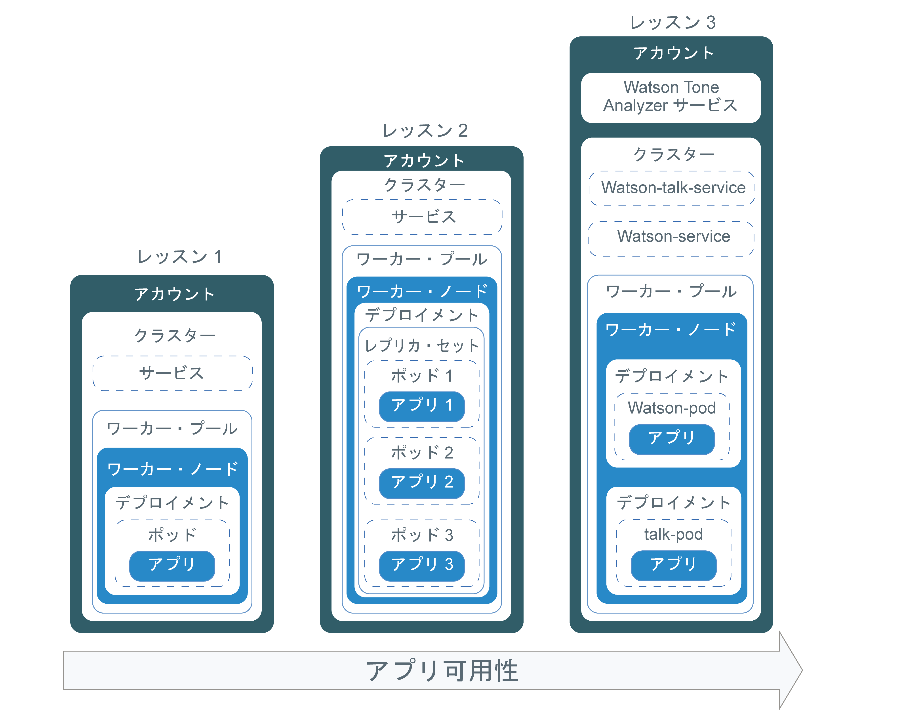
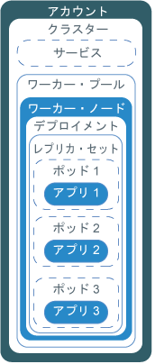

---

copyright:
  years: 2014, 2018
lastupdated: "2018-08-06"

---

{:new_window: target="_blank"}
{:shortdesc: .shortdesc}
{:screen: .screen}
{:pre: .pre}
{:table: .aria-labeledby="caption"}
{:codeblock: .codeblock}
{:tip: .tip}
{:download: .download}


# チュートリアル: Kubernetes クラスターにアプリをデプロイする方法
{: #cs_apps_tutorial}

{{site.data.keyword.containerlong}} を使用して、{{site.data.keyword.watson}} {{site.data.keyword.toneanalyzershort}} を利用するコンテナー化アプリをデプロイする方法について説明します。
{: shortdesc}

このシナリオでは、架空の PR 会社が {{site.data.keyword.Bluemix_notm}} サービスを使用して自社のプレス・リリースを分析し、自社のメッセージのトーンに関するフィードバックを受け取ります。

PR 会社のアプリ開発者が、直前のチュートリアルで作成した Kubernetes クラスターを使用して、Hello World バージョンのアプリをデプロイします。 このチュートリアルの各レッスンを基に、アプリ開発者は同じアプリを段階的に複雑にした各バージョンをデプロイします。 次の図は、各デプロイメントのコンポーネントをレッスン別に示しています。



図に示すように、Kubernetes では、クラスター内でアプリを稼働状態にするためにいくつかの異なるタイプのリソースを使用します。 Kubernetes の場合は、デプロイメントとサービスが相互に連係します。 デプロイメントには、アプリの定義が含まれます。 例えば、コンテナーに使用するイメージや、アプリのために公開する必要があるポートです。 デプロイメントを作成すると、デプロイメントで定義したコンテナーごとに Kubernetes のポッドが作成されます。 アプリの回復力を高めるために、デプロイメントの中で同じアプリのインスタンスを複数定義することもできます。そうすれば、Kubernetes によってレプリカ・セットが自動的に作成されます。 そのレプリカ・セットによってポッドがモニターされ、常に指定された数のポッドが稼働状態になります。 1 つのポッドが応答しなくなったら、そのポッドが自動的に再作成されます。

サービスによってポッドのセットをグループ化し、クラスター内の他のサービスからそれらのポッドにアクセスするためのネットワーク接続を提供します。そうすれば、各ポッドの実際のプライベート IP アドレスを公開する必要はありません。 Kubernetes サービスを使用すれば、クラスター内の他のポッドにアプリを公開することも、インターネットにアプリを公開することも可能です。 このチュートリアルでは、Kubernetes サービスを使用して、稼働中のアプリにインターネットからアクセスします。そのアクセスのために、ワーカー・ノードに自動的に割り当てられるパブリック IP アドレスとパブリック・ポートを使用します。

標準クラスターでアプリの可用性をさらに高めるために、各ゾーンにワーカー・ノードを持つ複数のゾーンにまたがるワーカー・プールを作成して、アプリのレプリカをさらに多く実行することができます。このチュートリアルではそのような作業を取り上げませんが、いつかアプリの可用性を改善する必要が生じたときのために、そのような概念を頭に入れておいてください。

{{site.data.keyword.Bluemix_notm}} サービスをアプリに統合する作業は 1 つのレッスンでしか取り上げていませんが、そのサービスは、アプリがどれほど単純でもどれほど複雑でも利用できます。

## 達成目標

* Kubernetes の基本的な用語を理解します
* {{site.data.keyword.registryshort_notm}} のレジストリー名前空間にイメージをプッシュします
* アプリへのパブリック・アクセスを構成します
* 1 つの Kubernetes コマンドと 1 つのスクリプトを使用して、アプリの 1 つのインスタンスをクラスターにデプロイします
* ヘルス・チェック時に再作成されるコンテナーにアプリの複数インスタンスをデプロイします
* {{site.data.keyword.Bluemix_notm}} サービスの機能を使用するアプリをデプロイします

## 所要時間

40 分

## 対象者

初めて Kubernetes クラスターにアプリをデプロイするソフトウェア開発者およびネットワーク管理者。

## 前提条件

* [チュートリアル: Kubernetes クラスターの作成](cs_tutorials.html#cs_cluster_tutorial)


## レッスン 1: アプリの 1 つのインスタンスを Kubernetes クラスターにデプロイする
{: #cs_apps_tutorial_lesson1}

直前のチュートリアルで、ワーカー・ノードを 1 つ持つクラスターを作成しました。 このレッスンでは、デプロイメントを構成し、そのワーカー・ノード内の Kubernetes ポッドにアプリの単一インスタンスをデプロイします。
{:shortdesc}

次の図は、このレッスンを実行してデプロイするコンポーネントを示しています。


アプリをデプロイするには、以下のようにします。

1.  [Hello World アプリ](https://github.com/IBM/container-service-getting-started-wt) のソース・コードをユーザー・ホーム・ディレクトリーに複製します。 このリポジトリーには、同じアプリのさまざまなバージョンが、`Lab` で始まる各フォルダーに入っています。 各バージョンに以下のファイルがあります。
    * `Dockerfile`: イメージのビルド定義。
    * `app.js`: Hello World アプリ。
    * `package.json`: アプリに関するメタデータ。

    ```
    git clone https://github.com/IBM/container-service-getting-started-wt.git
    ```
    {: pre}

2.  `Lab 1` ディレクトリーに移動します。

    ```
    cd 'container-service-getting-started-wt/Lab 1'
    ```
    {: pre}

3.  {{site.data.keyword.Bluemix_notm}} CLI にログインします。 プロンプトが出されたら、{{site.data.keyword.Bluemix_notm}} 資格情報を入力します。 {{site.data.keyword.Bluemix_notm}} 地域を指定するには、`ibmcloud ks region-set` コマンドを使用します。

    ```
    ibmcloud login [--sso]
    ```
    {: pre}

    **注**: ログイン・コマンドが失敗する場合は、フェデレーテッド ID がある可能性があります。 コマンドに `--sso` フラグを付加してみてください。 CLI 出力に示された URL を使用して、ワンタイム・パスコードを取得してください。

4.  CLI でクラスターのコンテキストを設定します。
    1.  環境変数を設定して Kubernetes 構成ファイルをダウンロードするためのコマンドを取得します。

        ```
        ibmcloud ks cluster-config <cluster_name_or_ID>
        ```
        {: pre}

        構成ファイルのダウンロードが完了すると、そのローカルの Kubernetes 構成ファイルのパスを環境変数として設定するために使用できるコマンドが表示されます。
    2.  `KUBECONFIG` 環境変数を設定するための出力を、コピーして貼り付けます。

        OS X の場合の例:

        ```
        export KUBECONFIG=/Users/<user_name>/.bluemix/plugins/container-service/clusters/<pr_firm_cluster>/kube-config-prod-dal10-pr_firm_cluster.yml
        ```
        {: screen}

5.  {{site.data.keyword.registryshort_notm}} CLI にログインします。 **注**: container-registry プラグインが[インストールされている](/docs/services/Registry/index.html#registry_cli_install)ことを確認してください。

    ```
    ibmcloud cr login
    ```
    {: pre}
    -   {{site.data.keyword.registryshort_notm}} の名前空間を忘れた場合は、以下のコマンドを実行します。

        ```
        ibmcloud cr namespace-list
        ```
        {: pre}

6.  Docker を開始します。
    * Docker Community Edition を使用している場合は、何の操作も必要ありません。
    * Linux を使用している場合は、[Docker の資料](https://docs.docker.com/config/daemon/) を調べて、ご使用の Linux ディストリビューションに応じた Docker の開始方法についての説明を確認してください。
    * Windows や OSX で Docker Toolbox を使用している場合は、Docker Quickstart Terminal を使用できます。その場合は、Docker が自動的に開始します。 その後のいくつかの手順でも Docker Quickstart Terminal から Docker コマンドを実行し、それから `KUBECONFIG` セッション変数の設定時に使用した CLI に切り替えてください。

7.  `Lab 1` ディレクトリーのアプリ・ファイルを組み込んだ Docker イメージをビルドします。 後日アプリを変更しなければならなくなった場合は、この手順を繰り返して別バージョンのイメージを作成します。

    コンテナー・イメージを使用する際の[個人情報の保護](cs_secure.html#pi)の詳細を確認してください。

    1.  イメージをローカルにビルドします。 使用する名前とタグを指定します。 必ず、前のチュートリアルで {{site.data.keyword.registryshort_notm}} に作成した名前空間を使用してください。 名前空間の情報でイメージにタグを付けておけば、後の手順でイメージをプッシュする時に、Docker がプッシュ先の場所を判別できるようになります。 イメージ名には小文字の英数字または下線 (`_`) のみを使用してください。 コマンドの末尾にピリオド (`.`) をつけることを忘れないようにしてください。 このピリオドは、イメージをビルドするための Dockerfile とビルド成果物を、現行ディレクトリー内で探すよう Docker に指示するものです。

        ```
        docker build -t registry.<region>.bluemix.net/<namespace>/hello-world:1 .
        ```
        {: pre}

        ビルドが完了したら、次の正常終了のメッセージを確認してください。
        ```
        Successfully built <image_id>
        Successfully tagged <image_tag>
        ```
        {: screen}

    2.  イメージをレジストリー名前空間にプッシュします。

        ```
        docker push registry.<region>.bluemix.net/<namespace>/hello-world:1
        ```
        {: pre}

        出力例:

        ```
        The push refers to a repository [registry.ng.bluemix.net/pr_firm/hello-world]
        ea2ded433ac8: Pushed
        894eb973f4d3: Pushed
        788906ca2c7e: Pushed
        381c97ba7dc3: Pushed
        604c78617f34: Pushed
        fa18e5ffd316: Pushed
        0a5e2b2ddeaa: Pushed
        53c779688d06: Pushed
        60a0858edcd5: Pushed
        b6ca02dfe5e6: Pushed
        1: digest: sha256:0d90cb73288113bde441ae9b8901204c212c8980d6283fbc2ae5d7cf652405
        43 size: 2398
        ```
        {: screen}

8.  ポッドはデプロイメントを使用して管理され、コンテナー化されたアプリ・インスタンスを格納するために使用されます。 以下のコマンドでは、アプリを 1 つのポッドにデプロイします。 このチュートリアルのためにデプロイメントの名前は **hello-world-deployment** になっていますが、任意の名前を付けることができます。 Docker Quickstart Terminal を使用して Docker コマンドを実行した場合は、必ず、`KUBECONFIG` セッション変数の設定時に使用した CLI に切り替えてください。

    ```
    kubectl run hello-world-deployment --image=registry.<region>.bluemix.net/<namespace>/hello-world:1
    ```
    {: pre}

    出力例:

    ```
    deployment "hello-world-deployment" created
    ```
    {: screen}

    Kubernetes リソースを処理する際の[個人情報の保護](cs_secure.html#pi)の詳細を確認してください。

9.  デプロイメントを NodePort サービスとして公開することによって、だれでもアプリにアクセスできるようにします。 Cloud Foundry アプリのポートを公開する場合と同じく、ここで公開する NodePort は、そのワーカー・ノードがトラフィックを listen するポートです。

    ```
    kubectl expose deployment/hello-world-deployment --type=NodePort --port=8080 --name=hello-world-service --target-port=8080
    ```
    {: pre}

    出力例:

    ```
    service "hello-world-service" exposed
    ```
    {: screen}

    <table summary=“Information about the expose command parameters.”>
    <caption>公開パラメーターに関する詳細</caption>
    <thead>
    <th colspan=2> expose のパラメーターに関する詳細</th>
    </thead>
    <tbody>
    <tr>
    <td><code>expose</code></td>
    <td>リソースを Kubernetes サービスとして公開し、一般のユーザーが利用できるようにします。</td>
    </tr>
    <tr>
    <td><code>deployment/<em>&lt;hello-world-deployment&gt;</em></code></td>
    <td>このサービスを使用して公開するリソース・タイプとリソースの名前。</td>
    </tr>
    <tr>
    <td><code>--name=<em>&lt;hello-world-service&gt;</em></code></td>
    <td>サービスの名前。</td>
    </tr>
    <tr>
    <td><code>--port=<em>&lt;8080&gt;</em></code></td>
    <td>サービスが動作するポート。</td>
    </tr>
    <tr>
    <td><code>--type=NodePort</code></td>
    <td>作成するサービス・タイプ。</td>
    </tr>
    <tr>
    <td><code>--target-port=<em>&lt;8080&gt;</em></code></td>
    <td>サービスがトラフィックを転送する宛先ポート。 この例では、target-port が port と同じですが、作成する他のアプリでは異なる場合があります。</td>
    </tr>
    </tbody></table>

10. デプロイメントの作業がすべて完了したので、ブラウザーでアプリをテストできます。 URL を作成するための詳細情報を取得します。
    1.  サービスに関する情報を取得して、割り当てられた NodePort を確認します。

        ```
        kubectl describe service hello-world-service
        ```
        {: pre}

        出力例:

        ```
        Name:                   hello-world-service
        Namespace:              default
        Labels:                 run=hello-world-deployment
        Selector:               run=hello-world-deployment
        Type:                   NodePort
        IP:                     10.xxx.xx.xxx
        Port:                   <unset> 8080/TCP
        NodePort:               <unset> 30872/TCP
        Endpoints:              172.30.xxx.xxx:8080
        Session Affinity:       None
        No events.
        ```
        {: screen}

        `expose` コマンドで NodePort を生成すると、30000 から 32767 の範囲でランダムに値が割り当てられます。 この例では、NodePort は 30872 です。

    2.  クラスター内のワーカー・ノードのパブリック IP アドレスを取得します。

        ```
        ibmcloud ks workers <cluster_name_or_ID>
        ```
        {: pre}

        出力例:

        ```
        ibmcloud ks workers pr_firm_cluster
        Listing cluster workers...
        OK
        ID                                                 Public IP       Private IP       Machine Type   State    Status   Zone   Version
        kube-mil01-pa10c8f571c84d4ac3b52acbf50fd11788-w1   169.xx.xxx.xxx  10.xxx.xx.xxx    free           normal   Ready    mil01      1.10.5
        ```
        {: screen}

11. ブラウザーを開き、`http://<IP_address>:<NodePort>` という形式の URL でアプリを確認します。 この例の値を使用した場合、URL は `http://169.xx.xxx.xxx:30872` になります。 その URL をブラウザーに入力すると、以下のテキストが表示されます。

    ```
    Hello world! Your app is up and running in a cluster!
    ```
    {: screen}

    アプリが公開されていることを確認するには、これを携帯電話のブラウザーに入力してみてください。
    {: tip}

12. [Kubernetes ダッシュボードを起動](cs_app.html#cli_dashboard)します。

    [{{site.data.keyword.Bluemix_notm}} GUI](https://console.bluemix.net/) でクラスターを選択した場合は、**「Kubernetes ダッシュボード (Kubernetes Dashboard)」**ボタンを使用して、1 回のクリックでダッシュボードを起動できます。
    {: tip}

13. **「ワークロード」**タブで、作成したリソースを表示します。

これで完了です。 最初のバージョンのアプリをデプロイできました。

このレッスンで実行したコマンドの数が多すぎると思うなら、一部の処理を自動化するために構成スクリプトを使用できます。 第 2 バージョンのアプリでは構成スクリプトを使用します。また、アプリのインスタンスを複数デプロイして可用性を高めます。その方法を学ぶために次のレッスンに進みましょう。

<br />


## レッスン 2: 可用性を高めたアプリをデプロイして更新する
{: #cs_apps_tutorial_lesson2}

このレッスンでは、Hello World アプリの 3 つのインスタンスをクラスターにデプロイして、最初のバージョンのアプリよりも可用性を高めます。
{:shortdesc}

可用性が高くなることは、ユーザー・アクセスが 3 つのインスタンスに分割されることを意味します。 同じアプリ・インスタンスにアクセスするユーザーが多すぎると、応答時間が長くなる可能性があります。 複数のインスタンスをデプロイすれば、ユーザーにとって応答時間が短くなります。 このレッスンでは、Kubernetes でのヘルス・チェックとデプロイメント更新の処理についても取り上げます。 次の図には、このレッスンを完了することによりデプロイされるコンポーネントが含まれています。



直前のチュートリアルでは、アカウントと、ワーカー・ノードを 1 つ持つクラスターを作成しました。 このレッスンでは、デプロイメントを構成して、Hello World アプリの 3 つのインスタンスをデプロイします。 各インスタンスは、ワーカー・ノード内のレプリカ・セットの一部として、Kubernetes ポッドにデプロイされます。 それをだれでも利用できるようにするために、Kubernetes サービスも作成します。

Kubernetes では、構成スクリプトで定義する可用性検査を使用して、ポッド内のコンテナーが稼働しているかどうかを確認できます。 例えば、その検査によってデッドロックをキャッチできます。デッドロックとは、アプリは稼働しているのに処理を進められない状況のことです。 そのような状態になったコンテナーを再始動すれば、バグはあってもアプリの可用性を高めることができます。 その後、Kubernetes で準備状況検査を使用して、コンテナーでトラフィックの受け入れを再開する準備が整っているかどうかを確認します。 コンテナーの準備が整っていれば、そのポッドの準備も整ったことになります。 ポッドの準備が整えば、ポッドが再び開始されます。 このバージョンのアプリでは、15 秒ごとにタイムアウトになります。 構成スクリプトでヘルス・チェックを構成しておけば、ヘルス・チェックでアプリの問題が検出された時点でコンテナーが再作成されます。

1.  CLI で `Lab 2` ディレクトリーに移動します。

  ```
  cd 'container-service-getting-started-wt/Lab 2'
  ```
  {: pre}

2.  新しい CLI セッションを開始した場合は、ログインしてクラスターのコンテキストを設定します。

3.  ローカル環境で 2 つ目のバージョンのアプリをイメージとしてビルドしてタグを付けます。 この場合も、コマンドの末尾にピリオド (`.`) を付けることを忘れないようにしてください。

  ```
  docker build -t registry.<region>.bluemix.net/<namespace>/hello-world:2 .
  ```
  {: pre}

  正常終了のメッセージを確認します。

  ```
  Successfully built <image_id>
  ```
  {: screen}

4.  2 つ目のバージョンのイメージをレジストリー名前空間にプッシュします。 イメージがプッシュされるのを待ってから、次の手順に進みます。

  ```
  docker push registry.<region>.bluemix.net/<namespace>/hello-world:2
  ```
  {: pre}

  出力例:

  ```
  The push refers to a repository [registry.ng.bluemix.net/pr_firm/hello-world]
  ea2ded433ac8: Pushed
  894eb973f4d3: Pushed
  788906ca2c7e: Pushed
  381c97ba7dc3: Pushed
  604c78617f34: Pushed
  fa18e5ffd316: Pushed
  0a5e2b2ddeaa: Pushed
  53c779688d06: Pushed
  60a0858edcd5: Pushed
  b6ca02dfe5e6: Pushed
  1: digest: sha256:0d90cb73288113bde441ae9b8901204c212c8980d6283fbc2ae5d7cf652405
  43 size: 2398
  ```
  {: screen}

5.  テキスト・エディターを使用して、`Lab 2` ディレクトリー内の `healthcheck.yml` ファイルを開きます。 この構成スクリプトでは、前のレッスンの手順をいくつか結合して、デプロイメントとサービスを同時に作成します。 この PR 会社のアプリ開発者は、更新の適用時や、ポッドを再作成して問題をトラブルシューティングする時に、そのスクリプトを使用できます。
    1. プライベート・レジストリー名前空間内のイメージの詳細情報を更新します。

        ```
        image: "registry.<region>.bluemix.net/<namespace>/hello-world:2"
        ```
        {: codeblock}

    2.  **Deployment** セクションにある `replicas` の値に注目します。 replicas の値は、アプリのインスタンスの数です。 3 つのインスタンスを実行すれば、インスタンスが 1 つだけの場合よりもアプリの可用性がさらに高くなります。

        ```
        replicas: 3
        ```
        {: codeblock}

    3.  HTTP の Liveness Probe の値に注目します。5 秒ごとにコンテナーの正常性を検査することになっています。

        ```
        livenessProbe:
                    httpGet:
                      path: /healthz
                      port: 8080
                    initialDelaySeconds: 5
                    periodSeconds: 5
        ```
        {: codeblock}

    4.  **Service** セクションにある `NodePort` の値に注目します。 前のレッスンのようにランダムな NodePort を生成する代わりに、30000 から 32767 の範囲でポートを指定できます。 この例では 30072 を使用しています。

6.  クラスターのコンテキストの設定時に使用した CLI に切り替え、構成スクリプトを実行します。 デプロイメントとサービスを作成すると、PR 会社のユーザーがアプリを表示できるようになります。

  ```
  kubectl apply -f healthcheck.yml
  ```
  {: pre}

  出力例:

  ```
  deployment "hw-demo-deployment" created
  service "hw-demo-service" created
  ```
  {: screen}

7.  デプロイメント作業が完了したので、ブラウザーを開いてアプリを確認できます。 前のレッスンで使用したのと同じワーカー・ノードのパブリック IP アドレスに、構成スクリプトで指定した NodePort を組み合わせて、URL を作成します。 ワーカー・ノードのパブリック IP アドレスを取得するには、以下のようにします。

  ```
  ibmcloud ks workers <cluster_name_or_ID>
  ```
  {: pre}

  この例の値を使用した場合、URL は `http://169.xx.xxx.xxx:30072` になります。 ブラウザーに以下のテキストが表示される可能性があります。 そのテキストが表示されなくても、心配は無用です。 このアプリは、稼働状態になったりダウン状態になったりする設計になっているからです。

  ```
  Hello world! Great job getting the second stage up and running!
  ```
  {: screen}

  `http://169.xx.xxx.xxx:30072/healthz` で状況を確認することもできます。

  最初の 10 秒から 15 秒で 200 というメッセージが返されます。アプリが正常に稼働しているという意味のメッセージです。 その 15 秒が経過すると、タイムアウト・メッセージが表示されます。 これは予期される動作です。

  ```
  {
    "error": "Timeout, Health check error!"
  }
  ```
  {: screen}

8.  [Kubernetes ダッシュボードを起動](cs_app.html#cli_dashboard)します。

9. **「ワークロード」**タブで、作成したリソースを表示します。 このタブから、ヘルス・チェックの作動状況を継続的にリフレッシュして確認できます。 **「ポッド (Pods)」**セクションには、ポッド内のコンテナーの再作成時にポッドが再始動した回数が表示されます。 ダッシュボードで以下のエラー・メッセージがキャッチされた場合は、ヘルス・チェックで問題が検出されています。 数分待ってから再度リフレッシュしてみてください。 各ポッドの再始動回数が変わっているはずです。

    ```
    Liveness probe failed: HTTP probe failed with statuscode: 500
    Back-off restarting failed docker container
    Error syncing pod, skipping: failed to "StartContainer" for "hw-container" with CrashLoopBackOff: "Back-off 1m20s restarting failed container=hw-container pod=hw-demo-deployment-3090568676-3s8v1_default(458320e7-059b-11e7-8941-56171be20503)"
    ```
    {: screen}

これで完了です。 2 つ目のバージョンのアプリをデプロイできました。 使用するコマンドの数を減らし、ヘルス・チェックの動作を学び、デプロイメントを編集できました。 Hello World アプリは、PR 会社のテストに合格したといえます。 次の段階として、PR 会社がプレス・リリースの分析作業を開始するのに役立つアプリをデプロイしましょう。

作業を進める前に、これまで作成したリソースを削除してもかまいません。 同じ構成スクリプトを使用して、作成した両方のリソースを削除できます。

  ```
  kubectl delete -f healthcheck.yml
  ```
  {: pre}

  出力例:

  ```
  deployment "hw-demo-deployment" deleted
  service "hw-demo-service" deleted
  ```
  {: screen}

<br />


## レッスン 3: Watson Tone Analyzer アプリをデプロイして更新する
{: #cs_apps_tutorial_lesson3}

前の各レッスンでは、アプリを複数の単一コンポーネントとして 1 つのワーカー・ノードにデプロイしました。 このレッスンでは、{{site.data.keyword.watson}} {{site.data.keyword.toneanalyzershort}} サービスを利用するアプリの 2 つのコンポーネントをクラスターにデプロイします。
{:shortdesc}

各コンポーネントを異なるコンテナーに分離しておけば、1 つのコンポーネントの更新時に他のコンポーネントに影響が及ぶことを防止できます。 また、アプリを更新し、レプリカの追加でスケールを大きくして可用性をさらに高めるようにします。 次の図には、このレッスンを完了することによりデプロイされるコンポーネントが含まれています。


直前のチュートリアルから引き継いで使用するアカウントと、1 つのワーカー・ノードを持つクラスターがあります。 このレッスンでは、{{site.data.keyword.Bluemix_notm}} アカウントに {{site.data.keyword.watson}} {{site.data.keyword.toneanalyzershort}} サービスのインスタンスを作成し、2 つのデプロイメント (アプリのコンポーネントごとに 1 つのデプロイメント) を構成します。 各コンポーネントは、ワーカー・ノード内の Kubernetes ポッドにデプロイされます。 それら両方のコンポーネントをだれでも利用できるようにするために、コンポーネントごとに Kubernetes サービスも作成します。


### レッスン 3a: {{site.data.keyword.watson}} {{site.data.keyword.toneanalyzershort}} アプリをデプロイする
{: #lesson3a}

1.  CLI で `Lab 3` ディレクトリーに移動します。

  ```
  cd 'container-service-getting-started-wt/Lab 3'
  ```
  {: pre}

2.  新しい CLI セッションを開始した場合は、ログインしてクラスターのコンテキストを設定します。

3.  最初の {{site.data.keyword.watson}} イメージをビルドします。

    1.  `watson` ディレクトリーに移動します。

        ```
        cd watson
        ```
        {: pre}

    2.  ローカル環境でアプリの最初の部分をイメージとしてビルドしてタグを付けます。 この場合も、コマンドの末尾にピリオド (`.`) を付けることを忘れないようにしてください。 Docker Quickstart Terminal を使用して Docker コマンドを実行している場合は、必ず、CLI を切り替えてください。

        ```
        docker build -t registry.<region>.bluemix.net/<namespace>/watson .
        ```
        {: pre}

        正常終了のメッセージを確認します。

        ```
        Successfully built <image_id>
        ```
        {: screen}

    3.  アプリの最初の部分をイメージとしてプライベート・レジストリー名前空間にプッシュします。 イメージがプッシュされるのを待ってから、次の手順に進みます。

        ```
        docker push registry.<region>.bluemix.net/<namespace>/watson
        ```
        {: pre}

4.  {{site.data.keyword.watson}}-talk イメージをビルドします。

    1.  `watson-talk` ディレクトリーに移動します。

        ```
        cd 'container-service-getting-started-wt/Lab 3/watson-talk'
        ```
        {: pre}

    2.  ローカル環境でアプリの 2 つ目の部分をイメージとしてビルドしてタグを付けます。 この場合も、コマンドの末尾にピリオド (`.`) を付けることを忘れないようにしてください。

        ```
        docker build -t registry.<region>.bluemix.net/<namespace>/watson-talk .
        ```
        {: pre}

        正常終了のメッセージを確認します。

        ```
        Successfully built <image_id>
        ```
        {: screen}

    3.  アプリの 2 つ目の部分をプライベート・レジストリー名前空間にプッシュします。 イメージがプッシュされるのを待ってから、次の手順に進みます。

        ```
        docker push registry.<region>.bluemix.net/<namespace>/watson-talk
        ```
        {: pre}

5.  それぞれのイメージがレジストリー名前空間に正常に追加されたことを確認します。 Docker Quickstart Terminal を使用して Docker コマンドを実行した場合は、必ず、`KUBECONFIG` セッション変数の設定時に使用した CLI に切り替えてください。

    ```
    ibmcloud cr images
    ```
    {: pre}

    出力例:

    ```
    Listing images...

    REPOSITORY                                      NAMESPACE  TAG      DIGEST         CREATED         SIZE     VULNERABILITY STATUS
    registry.ng.bluemix.net/namespace/hello-world   namespace  1        0d90cb732881   40 minutes ago  264 MB   OK
    registry.ng.bluemix.net/namespace/hello-world   namespace  2        c3b506bdf33e   20 minutes ago  264 MB   OK
    registry.ng.bluemix.net/namespace/watson        namespace  latest   fedbe587e174   3 minutes ago   274 MB   OK
    registry.ng.bluemix.net/namespace/watson-talk   namespace  latest   fedbe587e174   2 minutes ago   274 MB   OK
    ```
    {: screen}

6.  テキスト・エディターを使用して、`Lab 3` ディレクトリー内の `watson-deployment.yml` ファイルを開きます。 この構成スクリプトには、アプリの `watson` のコンポーネントと `watson-talk` のコンポーネントの両方のデプロイメントとサービスが含まれています。

    1.  レジストリー名前空間にある両方のデプロイメントのイメージの詳細情報を更新します。

        watson:

        ```
        image: "registry.<region>.bluemix.net/namespace/watson"
        ```
        {: codeblock}

        watson-talk:

        ```
        image: "registry.<region>.bluemix.net/namespace/watson-talk"
        ```
        {: codeblock}

    2.  watson デプロイメントの volumes セクションで、前のチュートリアルで作成した {{site.data.keyword.watson}} {{site.data.keyword.toneanalyzershort}} のシークレットの名前を更新します。 Kubernetes シークレットをボリュームとしてデプロイメントにマウントすると、{{site.data.keyword.Bluemix_notm}} サービスの資格情報を、ポッドで実行されるコンテナーから使用できるようになります。 このチュートリアルの {{site.data.keyword.watson}} アプリ・コンポーネントは、ボリューム・マウント・パスを使用してサービス資格情報を検索するように構成されています。

        ```
        volumes:
                - name: service-bind-volume
                  secret:
                    defaultMode: 420
                    secretName: binding-mytoneanalyzer
        ```
        {: codeblock}

        シークレットの名前を忘れた場合は、以下のコマンドを実行します。

        ```
        kubectl get secrets --namespace=default
        ```
        {: pre}

    3.  watson-talk の service セクションで、`NodePort` の設定値に注目します。 この例では 30080 を使用しています。

7.  構成スクリプトを実行します。

  ```
  kubectl apply -f watson-deployment.yml
  ```
  {: pre}

8.  オプション: {{site.data.keyword.watson}} {{site.data.keyword.toneanalyzershort}} のシークレットがポッドに対してボリュームとしてマウントされたことを確認します。

    1.  watson ポッドの名前を取得するには、以下のコマンドを実行します。

        ```
        kubectl get pods
        ```
        {: pre}

        出力例:

        ```
        NAME                                 READY     STATUS    RESTARTS  AGE
        watson-pod-4255222204-rdl2f          1/1       Running   0         13h
        watson-talk-pod-956939399-zlx5t      1/1       Running   0         13h
        ```
        {: screen}

    2.  ポッドの詳細情報を取得して、シークレットの名前を探します。

        ```
        kubectl describe pod <pod_name>
        ```
        {: pre}

        出力例:

        ```
        Volumes:
          service-bind-volume:
            Type:       Secret (a volume populated by a Secret)
            SecretName: binding-mytoneanalyzer
          default-token-j9mgd:
            Type:       Secret (a volume populated by a Secret)
            SecretName: default-token-j9mgd
        ```
        {: codeblock}

9.  ブラウザーを開いて、何かのテキストを分析します。 URL の形式は `http://<worker_node_IP_address>:<watson-talk-nodeport>/analyze/"<text_to_analyze>"` です。

    例:

    ```
    http://169.xx.xxx.xxx:30080/analyze/"Today is a beautiful day"
    ```
    {: screen}

    入力したテキストに関する JSON 応答がブラウザーに表示されます。

10. [Kubernetes ダッシュボードを起動](cs_app.html#cli_dashboard)します。

11. **「ワークロード」**タブで、作成したリソースを表示します。

### レッスン 3b: 稼働中の Watson Tone Analyzer デプロイメントを更新する
{: #lesson3b}

デプロイメントの稼働中に、デプロイメントを編集してポッド・テンプレートの値を変更することができます。 このレッスンには、使用されるイメージの更新が含まれています。 この PR 会社はデプロイメント内のアプリを変更します。

イメージの名前を変更します。

1.  稼働中のデプロイメントの構成の詳細情報を開きます。

    ```
    kubectl edit deployment/watson-talk-pod
    ```
    {: pre}

    オペレーティング・システムの種類によって、vi エディターかテキスト・エディターのいずれかが開きます。

2.  イメージの名前を ibmliberty イメージに変更します。

    ```
    spec:
          containers:
          - image: registry.<region>.bluemix.net/ibmliberty:latest
    ```
    {: codeblock}

3.  変更内容を保存し、エディターを終了します。

4.  変更内容を稼働中のデプロイメントに適用します。

    ```
    kubectl rollout status deployment/watson-talk-pod
    ```
    {: pre}

    ロールアウトの完了を知らせる確認メッセージが表示されるのを待ちます。

    ```
    deployment "watson-talk-pod" successfully rolled out
    ```
    {: screen}

    変更をロールアウトすると、Kubernetes によって別のポッドが作成されてテストされます。 テストが正常に完了すると、元のポッドは削除されます。

[クイズに答えて知識を試してみましょう!](https://ibmcloud-quizzes.mybluemix.net/containers/apps_tutorial/quiz.php)

これで完了です。 {{site.data.keyword.watson}} {{site.data.keyword.toneanalyzershort}} アプリをデプロイできました。 この PR 会社は、このデプロイメントを使用してプレス・リリースの分析作業を開始できるようになりました。

これまで作成したリソースを削除してもかまいません。 構成スクリプトを使用して、作成したリソースを削除できます。

  ```
  kubectl delete -f watson-deployment.yml
  ```
  {: pre}

  出力例:

  ```
  deployment "watson-pod" deleted
  deployment "watson-talk-pod" deleted
  service "watson-service" deleted
  service "watson-talk-service" deleted
  ```
  {: screen}

  クラスターを保持する必要がない場合は、クラスターも削除できます。

  ```
  ibmcloud ks cluster-rm <cluster_name_or_ID>
  ```
  {: pre}

## 次の作業
{: #next}

基本を習得したので、さらに高度な作業に進むことができます。 次のいずれかを試すことを検討してください。

- リポジトリー内の[さらに複雑な Lab ](https://github.com/IBM/container-service-getting-started-wt#lab-overview) を行う
- {{site.data.keyword.containershort_notm}} を使用して[アプリの自動スケーリングを行う](cs_app.html#app_scaling)
-  [developerWorks ](https://developer.ibm.com/code/technologies/container-orchestration/) でコンテナー・オーケストレーションのコード・パターンを探索する
