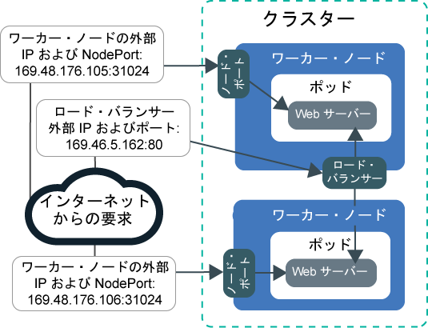
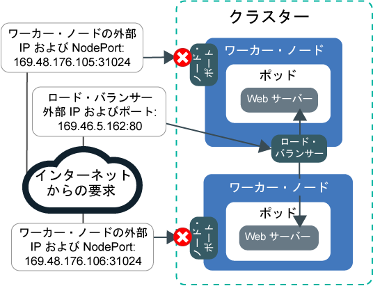
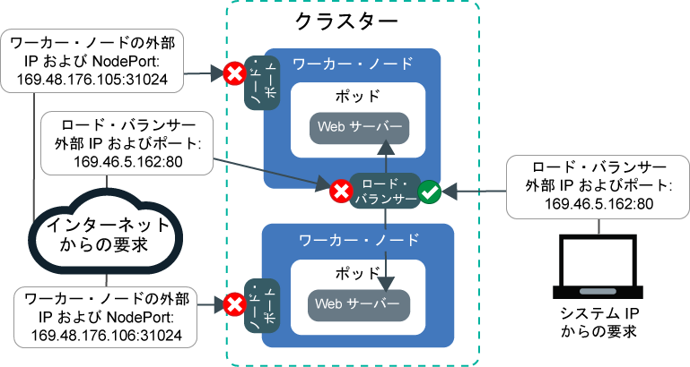
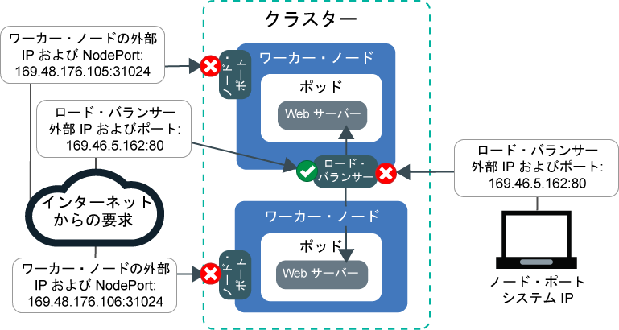

---

copyright:
  years: 2014, 2019
lastupdated: "2019-06-11"

keywords: kubernetes, iks

subcollection: containers

---

{:new_window: target="_blank"}
{:shortdesc: .shortdesc}
{:screen: .screen}
{:pre: .pre}
{:table: .aria-labeledby="caption"}
{:codeblock: .codeblock}
{:tip: .tip}
{:note: .note}
{:important: .important}
{:deprecated: .deprecated}
{:download: .download}
{:preview: .preview}


# チュートリアル: Calico ネットワーク・ポリシーを使用したトラフィックのブロック
{: #policy_tutorial}

デフォルトで、Kubernetes の NodePort、LoadBalancer、Ingress の各サービスは、パブリックとプライベートのすべてのクラスター・ネットワーク・インターフェースでアプリを使用可能にします。 デフォルトの `allow-node-port-dnat` Calico ポリシーでは、NodePort、ネットワーク・ロード・バランサー (NLB)、Ingress アプリケーション・ロード・バランサー (ALB) の各サービスから、それらのサービスが公開しているアプリ・ポッドへの着信トラフィックが許可されます。 Kubernetes は宛先ネットワーク・アドレス変換 (DNAT) を使用してサービス要求を正しいポッドに転送します。
{: shortdesc}

ただし、セキュリティー上の理由から、特定のソース IP アドレスからのネットワーク・サービスへのトラフィックのみを許可する必要がある場合があります。 [Calico Pre-DNAT ポリシー](https://docs.projectcalico.org/v3.1/getting-started/bare-metal/policy/pre-dnat)を使用して、特定の IP アドレスのトラフィックをホワイトリストまたはブラックリストに入れることができます。 Pre-DNAT ポリシーは、Kubernetes がポッドにトラフィックを転送するために通常の DNAT を使用する前に適用されるため、指定されたトラフィックがアプリに到達することを防止します。 Calico Pre-DNAT ポリシーを作成する場合、ソース IP アドレスをホワイトリストまたはブラックリストに入れるかどうかを選択します。 ほとんどのシナリオでは、ホワイトリスティングによって、既知の許可されたソース IP アドレスからのトラフィックを除くすべてのトラフィックがブロックされるので、最も安全な構成が提供されます。 通常、ブラックリスティングは、少数の IP アドレスからの攻撃を防ぐようなシナリオでのみ有用です。

このシナリオでは、PR 会社のネットワーク管理者の役割を担って、アプリへの何らかの異常なトラフィックを見つけます。このチュートリアルのレッスンでは、サンプル Web サーバー・アプリを作成し、ネットワーク・ロード・バランサー (NLB) サービスを使用してアプリを公開し、Calico ポリシーのホワイトリストとブラックリストの両方を使用して、不要で異常なトラフィックからアプリを保護します。

## 達成目標
{: #policies_objectives}

- 上位の Pre-DNAT ポリシーを作成することによって、すべてのノード・ポートへの着信トラフィックをブロックします。
- 下位の Pre-DNAT ポリシーを作成することによって、ホワイトリストにあるソース IP アドレスが、NLB のパブリック IP およびポートにアクセスできるようにします。 下位ポリシーが上位ポリシーをオーバーライドします。
- 下位の Pre-DNAT ポリシーを作成することによって、ブラックリストにあるソース IP アドレスが、NLB のパブリック IP およびポートにアクセスすることをブロックします。

## 所要時間
{: #policies_time}

1 時間

## 対象読者
{: #policies_audience}

このチュートリアルは、アプリへのネットワーク・トラフィックを管理するソフトウェア開発者やネットワーク管理者を対象にしています。

## 前提条件
{: #policies_prereqs}

- [クラスターを作成します](/docs/containers?topic=containers-clusters#clusters_ui)。
- [CLI のターゲットを自分のクラスターに設定します](/docs/containers?topic=containers-cs_cli_install#cs_cli_configure)。
- [Calico CLI をインストールして構成します](/docs/containers?topic=containers-network_policies#cli_install)。
- {{site.data.keyword.containerlong_notm}} に対する以下の {{site.data.keyword.Bluemix_notm}} IAM アクセス・ポリシーがあることを確認します。
    - [任意のプラットフォーム役割](/docs/containers?topic=containers-users#platform)
    - [**ライター**または**管理者**のサービス役割](/docs/containers?topic=containers-users#platform)

<br />


## レッスン 1: アプリをデプロイし、NLB を使用して公開する
{: #lesson1}

最初のレッスンでは、複数の IP アドレスとポートからアプリがどのように公開されるか、パブリック・トラフィックがクラスターにどのように着信するかを示します。
{: shortdesc}

チュートリアルを通じて使用するサンプル Web サーバー・アプリのデプロイから開始します。 `echoserver` Web サーバーでは、クライアントからクラスターへの接続に関するデータが表示され、PR 会社のクラスターへのアクセスをテストできます。次に、ネットワーク・ロード・バランサー (NLB) 1.0 サービスを作成して、アプリを公開します。 NLB 1.0 サービスにより、NLB サービス IP アドレスとワーカー・ノードのノード・ポートの両方でアプリが使用可能になります。

Ingress アプリケーション・ロード・バランサー (ALB) を使用しますか? ステップ 3 と 4 で NLB を作成する代わりに、[Web サーバー・アプリのサービスを作成して](/docs/containers?topic=containers-ingress#public_inside_1)、[Web サーバー・アプリの Ingress リソースを作成します](/docs/containers?topic=containers-ingress#public_inside_4)。 その後、`ibmcloud ks albs --cluster <cluster_name>` を実行して ALB のパブリック IP を取得し、それらの IP をチュートリアルの `<loadbalancer_IP>` の代わりに常に使用してください。
{: tip}

以下のイメージは、レッスン 1 の終了時に、Web サーバー・アプリがパブリック・ノード・ポートとパブリック NLB によってインターネットにどのように公開されるかを示しています。



1. サンプル Web サーバー・アプリをデプロイします。 接続が Web サーバー・アプリに対して行われると、アプリは接続で受信した HTTP ヘッダーを使用して応答します。
    ```
    kubectl run webserver --image=k8s.gcr.io/echoserver:1.10 --replicas=3
    ```
    {: pre}

2. Web サーバー・アプリ・ポッドの **STATUS** が `Running` になっていることを確認します。
    ```
    kubectl get pods -o wide
    ```
    {: pre}

    出力例:
    ```
    NAME                         READY     STATUS    RESTARTS   AGE       IP               NODE
    webserver-855556f688-6dbsn   1/1       Running   0          1m        172.30.xxx.xxx   10.176.48.78
    webserver-855556f688-76rkp   1/1       Running   0          1m        172.30.xxx.xxx   10.176.48.78
    webserver-855556f688-xd849   1/1       Running   0          1m        172.30.xxx.xxx   10.176.48.78
    ```
    {: screen}

3. アプリをパブリック・インターネットに公開するには、テキスト・エディターで `webserver-lb.yaml` という NLB 1.0 サービス構成ファイルを作成します。
    ```
    apiVersion: v1
    kind: Service
    metadata:
      labels:
        run: webserver
      name: webserver-lb
    spec:
      type: LoadBalancer
      selector:
        run: webserver
      ports:
      - name: webserver-port
        port: 80
        protocol: TCP
        targetPort: 8080
    ```
    {: codeblock}

4. NLB をデプロイします。
    ```
    kubectl apply -f filepath/webserver-lb.yaml
    ```
    {: pre}

5. NLB によってコンピューターから公開されたアプリにパブリック・アクセスできることを確認します。

    1. NLB のパブリック **EXTERNAL-IP** アドレスを取得します。
        ```
        kubectl get svc -o wide
        ```
        {: pre}

        出力例:
        ```
        NAME           CLUSTER-IP       EXTERNAL-IP        PORT(S)        AGE       SELECTOR
        webserver-lb   172.21.xxx.xxx   169.xx.xxx.xxx     80:31024/TCP   2m        run=webserver
        ```
        {: screen}

    2. メモ用のテキスト・ファイルを作成して、NLB IP をそのテキスト・ファイルにコピーします。 このメモは、後のレッスンで値を迅速に取り出すために役立ちます。

    3. NLB の外部 IP にパブリック・アクセスできることを確認します。
        ```
        curl --connect-timeout 10 <loadbalancer_IP>:80
        ```
        {: pre}

        以下の出力例では、NLB によってパブリック NLB IP アドレス `169.1.1.1` でアプリが公開されたことを確認できます。 アプリ・ポッド `webserver-855556f688-76rkp` が curl 要求を受信しました。
        ```
        Hostname: webserver-855556f688-76rkp
        Pod Information:
            -no pod information available-
        Server values:
            server_version=nginx: 1.13.3 - lua: 10008
        Request Information:
            client_address=1.1.1.1
            method=GET
            real path=/
            query=
            request_version=1.1
            request_scheme=http
            request_uri=http://169.1.1.1:8080/
        Request Headers:
            accept=*/*
            host=169.1.1.1
            user-agent=curl/7.54.0
        Request Body:
            -no body in request-
        ```
        {: screen}

6. ノード・ポートによってコンピューターから公開されたアプリにパブリック・アクセスできることを確認します。NLB サービスにより、NLB サービス IP アドレスとワーカー・ノードのノード・ポートの両方でアプリが使用可能になります。

    1. NLB がワーカー・ノードに割り当てたノード・ポートを取得します。 ノード・ポートの範囲は 30000 から 32767 までです。
        ```
        kubectl get svc -o wide
        ```
        {: pre}

        以下の出力例では、ノード・ポートは `31024` です。
        ```
        NAME           CLUSTER-IP       EXTERNAL-IP        PORT(S)        AGE       SELECTOR
        webserver-lb   172.21.xxx.xxx   169.xx.xxx.xxx     80:31024/TCP   2m        run=webserver
        ```
        {: screen}  

    2. ワーカー・ノードの **Public IP** アドレスを取得します。
        ```
        ibmcloud ks workers --cluster <cluster_name>
        ```
        {: pre}

        出力例:
        ```
        ID                                                 Public IP        Private IP     Machine Type        State    Status   Zone    Version   
        kube-dal10-cr18e61e63c6e94b658596ca93d087eed9-w1   169.xx.xxx.xxx   10.176.48.67   u3c.2x4.encrypted   normal   Ready    dal10   1.13.6_1513*   
        kube-dal10-cr18e61e63c6e94b658596ca93d087eed9-w2   169.xx.xxx.xxx   10.176.48.79   u3c.2x4.encrypted   normal   Ready    dal10   1.13.6_1513*   
        kube-dal10-cr18e61e63c6e94b658596ca93d087eed9-w3   169.xx.xxx.xxx   10.176.48.78   u3c.2x4.encrypted   normal   Ready    dal10   1.13.6_1513*   
        ```
        {: screen}

    3. 後のレッスンで使用するために、ワーカー・ノードのパブリック IP とノード・ポートをメモのテキストにコピーします。

    4. ノード・ポートを使用してワーカー・ノードのパブリック IP アドレスにアクセスできることを確認します。
        ```
        curl  --connect-timeout 10 <worker_IP>:<NodePort>
        ```
        {: pre}

        以下の出力例では、アプリへの要求がワーカー・ノードのプライベート IP アドレス `10.1.1.1` とノード・ポート `31024` を介して受信されたことを確認できます。 アプリ・ポッド `webserver-855556f688-xd849` が curl 要求を受信しました。
        ```
        Hostname: webserver-855556f688-xd849
        Pod Information:
            -no pod information available-
        Server values:
            server_version=nginx: 1.13.3 - lua: 10008
        Request Information:
            client_address=1.1.1.1
            method=GET
            real path=/
            query=
            request_version=1.1
            request_scheme=http
            request_uri=http://10.1.1.1:8080/
        Request Headers:
            accept=*/*
            host=10.1.1.1:31024
            user-agent=curl/7.60.0
        Request Body:
            -no body in request-
        ```
        {: screen}

この時点で、アプリは複数の IP アドレスとポートから公開されています。 これらの IP のほとんどは、クラスターの内部にあり、プライベート・ネットワークを介してのみアクセス可能です。 パブリック・ノード・ポートとパブリック NLB ポートのみ、パブリック・インターネットに公開されます。

次に、パブリック・トラフィックをブロックするための Calico ポリシーを作成して適用します。

## レッスン 2: すべてのノード・ポートへの着信トラフィックをブロックする
{: #lesson2}

PR 会社のクラスターを保護するには、アプリを公開している NLB サービスとノード・ポートの両方へのパブリック・アクセスをブロックする必要があります。 まず、ノード・ポートへのアクセスをブロックします。
{: shortdesc}

以下のイメージは、レッスン 2 の終了時に、トラフィックがどのように NLB に許可され、ノード・ポートには許可されないかを示しています。



1. テキスト・エディターで、`deny-nodeports.yaml` という上位の Pre-DNAT ポリシーを作成し、すべてのソース IP からのノード・ポートへの着信 TCP および UDP トラフィックを拒否します。
    ```
    apiVersion: projectcalico.org/v3
    kind: GlobalNetworkPolicy
    metadata:
      name: deny-nodeports
    spec:
      applyOnForward: true
      preDNAT: true
      ingress:
      - action: Deny
            destination:
              ports:
          - 30000:32767
            protocol: TCP
            source: {}
      - action: Deny
            destination:
              ports:
          - 30000:32767
        protocol: UDP
        source: {}
      selector: ibm.role=='worker_public'
      order: 1100
      types:
      - Ingress
    ```
    {: codeblock}

2. ポリシーを適用します。
    - Linux:

      ```
      calicoctl apply -f filepath/deny-nodeports.yaml
      ```
      {: pre}

    - Windows および OS X:

      ```
      calicoctl apply -f filepath/deny-nodeports.yaml --config=filepath/calicoctl.cfg
      ```
      {: pre}
  出力例:
  ```
  Successfully applied 1 'GlobalNetworkPolicy' resource(s)
  ```
  {: screen}

3. メモの値を使用して、ワーカー・ノードのパブリック IP アドレスおよびノード・ポートにパブリック・アクセスできないことを確認します。
    ```
    curl  --connect-timeout 10 <worker_IP>:<NodePort>
    ```
    {: pre}

    作成した Calico ポリシーによってノード・ポートへのトラフィックがブロックされるため、接続がタイムアウトになります。
    ```
    curl: (28) Connection timed out after 10016 milliseconds
    ```
    {: screen}

4. 前回のレッスンで作成した LoadBalancer の externalTrafficPolicy を `Cluster` から `Local` に変更します。`Local` にすることで、次のステップで LoadBalancer の外部 IP に対して curl を実行したときに、システムのソース IP が保持されるようになります。
    ```
    kubectl patch svc webserver -p '{"spec":{"externalTrafficPolicy":"Local"}}'
    ```
    {: pre}

5. メモの値を使用して、まだ NLB 外部 IP アドレスにパブリック・アクセスできることを確認します。
    ```
    curl --connect-timeout 10 <loadbalancer_IP>:80
    ```
    {: pre}

    出力例:
    ```
    Hostname: webserver-855556f688-76rkp
    Pod Information:
        -no pod information available-
    Server values:
        server_version=nginx: 1.13.3 - lua: 10008
    Request Information:
        client_address=1.1.1.1
        method=GET
        real path=/
        query=
        request_version=1.1
        request_scheme=http
        request_uri=http://<loadbalancer_IP>:8080/
    Request Headers:
        accept=*/*
        host=<loadbalancer_IP>
        user-agent=curl/7.54.0
    Request Body:
        -no body in request-
    ```
    {: screen}
    出力の `Request Information` セクションでは、ソース IP アドレスは、`client_address=1.1.1.1` などになります。ソース IP アドレスは、curl の実行に使用しているシステムのパブリック IP です。 それ以外の場合、プロキシーまたは VPN を介してインターネットに接続している場合は、プロキシーまたは VPN がシステムの実際の IP アドレスを不明瞭にしている可能性があります。 いずれの場合も、NLB はシステムのソース IP アドレスをクライアント IP アドレスとして認識します。

6. 後のレッスンで使用するために、システムのソース IP アドレス (前のステップの出力では `client_address=1.1.1.1`) をメモにコピーします。

この時点で、アプリはパブリック NLB ポートからのみパブリック・インターネットに公開されています。 パブリック・ノード・ポートへのトラフィックはブロックされています。 不要なトラフィックからクラスターが部分的にロックされました。

次に、特定のソース IP からのトラフィックをホワイトリストに入れるための Calico ポリシーを作成して適用します。

## レッスン 3: ホワイトリストにある IP からの NLB への着信トラフィックを許可する
{: #lesson3}

独自のコンピューター IP アドレスのみをホワイトリストに入れることによって、PR 会社のクラスターへのトラフィックを完全にロックして、アクセスをテストします。
{: shortdesc}

最初に、ノード・ポートに加えて、アプリを公開している NLB へのすべての着信トラフィックをブロックする必要があります。 その後、システムの IP アドレスをホワイトリストに入れるポリシーを作成できます。 レッスン 3 の終了時に、パブリック・ノード・ポートおよび NLB へのすべてのトラフィックはブロックされ、ホワイトリストにあるシステム IP からのトラフィックのみ許可されます。



1. テキスト・エディターで、`deny-lb-port-80.yaml` という上位の Pre-DNAT ポリシーを作成し、すべてのソース IP からの NLB IP アドレスとポートへの着信 TCP および UDP トラフィックを拒否します。 メモした NLB パブリック IP アドレスに `<loadbalancer_IP>` を置き換えます。

    ```
    apiVersion: projectcalico.org/v3
    kind: GlobalNetworkPolicy
    metadata:
      name: deny-lb-port-80
    spec:
      applyOnForward: true
      preDNAT: true
      ingress:
      - action: Deny
        destination:
          nets:
          - <loadbalancer_IP>/32
          ports:
          - 80
        protocol: TCP
        source: {}
      - action: Deny
        destination:
          nets:
          - <loadbalancer_IP>/32
          ports:
          - 80
        protocol: UDP
        source: {}
      selector: ibm.role=='worker_public'
      order: 800
      types:
      - Ingress
    ```
    {: codeblock}

2. ポリシーを適用します。
    - Linux:

      ```
      calicoctl apply -f filepath/deny-lb-port-80.yaml
      ```
      {: pre}

    - Windows および OS X:

      ```
      calicoctl apply -f filepath/deny-lb-port-80.yaml --config=filepath/calicoctl.cfg
      ```
      {: pre}

3. メモの値を使用して、パブリック NLB IP アドレスにアクセスできないことを確認します。 作成した Calico ポリシーによって NLB へのトラフィックがブロックされるため、接続がタイムアウトになります。
    ```
    curl --connect-timeout 10 <loadbalancer_IP>:80
    ```
    {: pre}

4. テキスト・エディターで、`whitelist.yaml` という下位の Pre-DNAT ポリシーを作成し、システムの IP から NLB IP アドレスとポートへのトラフィックを許可します。 メモの値を使用して、`<loadbalancer_IP>` を NLB のパブリック IP アドレスに置き換え、`<client_address>` をシステムのソース IP のパブリック IP アドレスに置き換えます。 システム IP を思い出せない場合は、`curl ifconfig.co` を実行できます。
    ```
    apiVersion: projectcalico.org/v3
    kind: GlobalNetworkPolicy
    metadata:
      name: whitelist
    spec:
      applyOnForward: true
      preDNAT: true
      ingress:
      - action: Allow
        destination:
          nets:
          - <loadbalancer_IP>/32
          ports:
          - 80
        protocol: TCP
        source:
          nets:
          - <client_address>/32
      selector: ibm.role=='worker_public'
      order: 500
      types:
      - Ingress
    ```
    {: codeblock}

5. ポリシーを適用します。
    - Linux:

      ```
      calicoctl apply -f filepath/whitelist.yaml
      ```
      {: pre}

    - Windows および OS X:

      ```
      calicoctl apply -f filepath/whitelist.yaml --config=filepath/calicoctl.cfg
      ```
      {: pre}
  システムの IP アドレスがホワイトリストに入りました。

6. メモの値を使用して、パブリック NLB IP アドレスにアクセスできることを確認します。
    ```
    curl --connect-timeout 10 <loadbalancer_IP>:80
    ```
    {: pre}

7. 別の IP アドレスを持つ別のシステムにアクセスできる場合は、そのシステムからの NLB へのアクセスを試みてください。
    ```
    curl --connect-timeout 10 <loadbalancer_IP>:80
    ```
    {: pre}
    システムの IP アドレスがホワイトリストにないため、接続がタイムアウトになります。

この時点で、パブリック・ノード・ポートと NLB へのすべてのトラフィックがブロックされます。 ホワイトリストにあるシステム IP からのトラフィックのみ許可されます。

## レッスン 4: ブラックリストにある IP からの NLB への着信トラフィックを拒否する
{: #lesson4}

前のレッスンでは、すべてのトラフィックをブロックし、いくつかの IP のみをホワイトリストに入れました。 このシナリオは、制御されたいくつかのソース IP アドレスのみにアクセスを制限するようなテスト目的の場合によく機能します。 ただし、PR 会社のアプリは広く公開される必要のあるものです。 少数の IP アドレスで見られる異常なトラフィックを除き、すべてのトラフィックが許可される必要があります。 ブラックリスティングは、少数の IP アドレスからの攻撃を防ぐ場合に役立つため、このようなシナリオで有用です。
{: shortdesc}

このレッスンでは、所有するシステムのソース IP アドレスからのトラフィックをブロックすることにより、ブラックリストをテストします。 レッスン 4 の終了時に、パブリック・ノード・ポートへのすべてのトラフィックがブロックされ、パブリック NLB へのすべてのトラフィックが許可されます。 ブラックリストに入れたシステム IP からの NLB へのトラフィックのみブロックされます。



1. 前のレッスンで作成したホワイトリスト・ポリシーをクリーンアップします。
    - Linux:
      ```
      calicoctl delete GlobalNetworkPolicy deny-lb-port-80
      ```
      {: pre}
      ```
      calicoctl delete GlobalNetworkPolicy whitelist
      ```
      {: pre}

    - Windows および OS X:
      ```
      calicoctl delete GlobalNetworkPolicy deny-lb-port-80 --config=filepath/calicoctl.cfg
      ```
      {: pre}
      ```
      calicoctl delete GlobalNetworkPolicy whitelist --config=filepath/calicoctl.cfg
      ```
      {: pre}

    すべてのソース IP からの NLB IP アドレスとポートへの着信 TCP および UDP トラフィックが再度許可されます。

2. システムのソース IP アドレスから NLB の IP アドレスおよびポートへのすべての着信 TCP および UDP トラフィックを拒否するには、テキスト・エディターで `blacklist.yaml` という下位の pre-DNAT ポリシーを作成します。 メモの値を使用して、`<loadbalancer_IP>` を NLB のパブリック IP アドレスに置き換え、`<client_address>` をシステムのソース IP のパブリック IP アドレスに置き換えます。
  ```
  apiVersion: projectcalico.org/v3
  kind: GlobalNetworkPolicy
  metadata:
    name: blacklist
  spec:
    applyOnForward: true
    preDNAT: true
    ingress:
    - action: Deny
      destination:
        nets:
        - <loadbalancer_IP>/32
        ports:
        - 80
      protocol: TCP
      source:
        nets:
        - <client_address>/32
    - action: Deny
      destination:
        nets:
        - <loadbalancer_IP>/32
        ports:
        - 80
      protocol: UDP
      source:
        nets:
        - <client_address>/32
    selector: ibm.role=='worker_public'
    order: 500
    types:
    - Ingress
  ```
  {: codeblock}

3. ポリシーを適用します。
    - Linux:

      ```
      calicoctl apply -f filepath/blacklist.yaml
      ```
      {: pre}

    - Windows および OS X:

      ```
      calicoctl apply -f filepath/blacklist.yaml --config=filepath/calicoctl.cfg
      ```
      {: pre}
  システムの IP アドレスがブラックリストに入りました。

4. メモの値を使用し、システムの IP がブラックリストにあるため、NLB IP にアクセスできないことをシステムから確認します。
    ```
    curl --connect-timeout 10 <loadbalancer_IP>:80
    ```
    {: pre}
    この時点で、パブリック・ノード・ポートへのすべてのトラフィックがブロックされ、パブリック NLB へのすべてのトラフィックが許可されます。 ブラックリストに入れたシステム IP からの NLB へのトラフィックのみブロックされます。

おつかれさまでした。 Calico Pre-DNAT ポリシーを使用してソース IP をブラックリストに入れることにより、アプリへのトラフィックを正常に制御しました。

## レッスン 5: ブラックリストにある IP からの NLB へのブロックされたトラフィックをログに記録する
{: #lesson5}

前のレッスンでは、システム IP から NLB へのトラフィックをブラックリストに入れました。 このレッスンでは、拒否されたトラフィック要求をログに記録する方法を学習します。
{: shortdesc}

例として、勤務している PR 会社から、いずれかのネットワーク・ポリシーによって継続的に拒否される異常なトラフィックの追跡のロギングをセットアップするよう依頼されたとします。 潜在的なセキュリティー脅威をモニターするには、NLB IP で試行されたアクションがブラックリスト・ポリシーで拒否されるたびに記録するようにロギングをセットアップします。

1. Calico NetworkPolicy `log-denied-packets` を作成します。 このログ・ポリシーでは、`blacklist` ポリシーと同じセレクターを使用し、これにより、このポリシーが Calico Iptables 規則チェーンに追加されます。 `300` などの下位番号を使用すると、このルールを確実に Iptables 規則チェーンのブラックリスト・ポリシーの前に追加できます。 ご使用の IP からのパケットは、このポリシーによってログに記録されてから、`blacklist` ポリシー規則との照合が試行され、拒否されます。
  ```
  apiVersion: projectcalico.org/v3
  kind: GlobalNetworkPolicy
  metadata:
    name: log-denied-packets
  spec:
    applyOnForward: true
    preDNAT: true
    ingress:
    - action: Log
      destination:
        nets:
        - <loadbalancer_IP>/32
        ports:
        - 80
      protocol: TCP
      source:
        nets:
        - <client_address>/32
    - action: Deny
      destination:
        nets:
        - <loadbalancer_IP>/32
        ports:
        - 80
      protocol: UDP
      source:
        nets:
        - <client_address>/32
    selector: ibm.role=='worker_public'
    order: 300
    types:
    - Ingress
  ```
  {: codeblock}

2. ポリシーを適用します。
  ```
  calicoctl apply -f log-denied-packets.yaml --config=<filepath>/calicoctl.cfg
  ```
  {: pre}

3. システム IP から NLB IP に要求を送信して、ログ・エントリーを生成します。 これらの要求パケットは、拒否される前にログに記録されます。
  ```
  curl --connect-timeout 10 <loadbalancer_IP>:80
  ```
  {: pre}

4. `/var/log/syslog` パスに作成されたログ・エントリーを確認します。 ログ・エントリーは、以下のようになります。
  ```
  Sep 5 14:34:40 <worker_hostname> kernel: [158271.044316] calico-packet: IN=eth1 OUT= MAC=08:00:27:d5:4e:57:0a:00:27:00:00:00:08:00 SRC=192.XXX.XX.X DST=192.XXX.XX.XX LEN=60 TOS=0x00 PREC=0x00 TTL=64 ID=52866 DF PROTO=TCP SPT=42962 DPT=22 WINDOW=29200 RES=0x00 SYN URGP=0
  ```
  {: screen}

おつかれさまでした。 ブラックリストに入ったトラフィックをより簡単にモニターできるように、ロギングをセットアップしました。

ブラックリスト・ポリシーとログ・ポリシーをクリーンアップする場合は、以下のようにします。
1. ブラックリスト・ポリシーをクリーンアップします。
    - Linux:
      ```
      calicoctl delete GlobalNetworkPolicy blacklist
      ```
      {: pre}

    - Windows および OS X:
      ```
      calicoctl delete GlobalNetworkPolicy blacklist --config=filepath/calicoctl.cfg
      ```
      {: pre}

2. ログ・ポリシーをクリーンアップします。
    - Linux:
      ```
      calicoctl delete GlobalNetworkPolicy log-denied-packets
      ```
      {: pre}

    - Windows および OS X:
      ```
      calicoctl delete GlobalNetworkPolicy log-denied-packets --config=filepath/calicoctl.cfg
      ```
      {: pre}

## 次の作業
{: #whats_next}

* [ネットワーク・ポリシーによるトラフィックの制御](/docs/containers?topic=containers-network_policies)をお読みください。
* クラスターのトラフィックを制御する Calico ネットワーク・ポリシーの例については、[Stars Policy Demo ](https://docs.projectcalico.org/v3.1/getting-started/kubernetes/tutorials/stars-policy/) と [advanced network policy ](https://docs.projectcalico.org/v3.1/getting-started/kubernetes/tutorials/advanced-policy) を参照してください。
