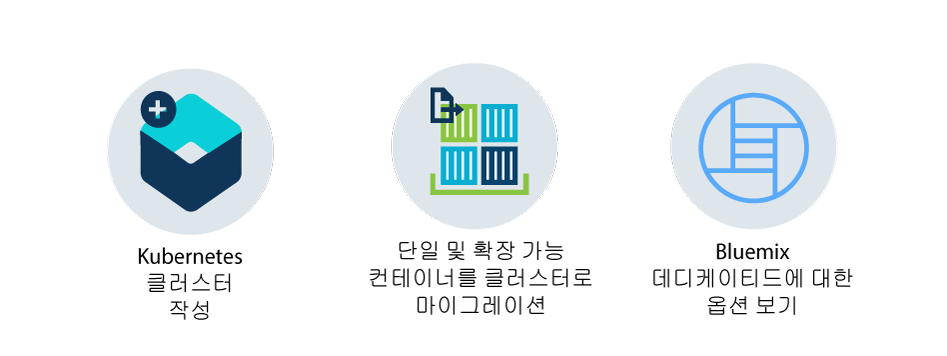

---

copyright:
  years: 2014, 2018
lastupdated: "2018-05-24"

---

{:new_window: target="_blank"}
{:shortdesc: .shortdesc}
{:screen: .screen}
{:pre: .pre}
{:table: .aria-labeledby="caption"}
{:codeblock: .codeblock}
{:tip: .tip}
{:download: .download}

# {{site.data.keyword.containerlong_notm}} 시작하기
{: #container_index}

Kubernetes 클러스터에서 실행되는 Docker 컨테이너에 고가용성 앱을 배치하여 {{site.data.keyword.containerlong}}를 진행하십시오.
{:shortdesc}

컨테이너는 환경 간에 앱을 원활하게 이동시킬 수 있도록 앱 및 해당 종속성을 모두 패키징하는 표준 방식입니다.  가상 머신과 달리 컨테이너는 운영 체제를 함께 제공하지 않습니다. 앱 코드, 런타임, 시스템 도구, 라이브러리 및 설정만 컨테이너 내에 패키징됩니다. 컨테이너는 가상 머신보다 경량이고 휴대하기 쉬우며 효율적입니다.

시작하려면 옵션을 클릭하십시오.

<map name="home_map" id="home_map">
<area href="#clusters" alt="{{site.data.keyword.Bluemix_notm}}에서 Kubernetes 클러스터 시작하기" title="{{site.data.keyword.Bluemix_notm}}에서 Kubernetes 클러스터 시작하기" shape="rect" coords="-7, -8, 108, 211" />
<area href="cs_cli_install.html" alt="CLI를 설치하십시오." title="CLI를 설치하십시오." shape="rect" coords="155, -1, 289, 210" />
<area href="cs_dedicated.html#dedicated_environment" alt="{{site.data.keyword.Bluemix_dedicated_notm}} 클라우드 환경" title="{{site.data.keyword.Bluemix_notm}} 클라우드 환경" shape="rect" coords="326, -10, 448, 218" />
</map>

## 클러스터 시작하기
{: #clusters}

컨테이너에 앱을 배치하시겠습니까? 기다리십시오. 먼저 Kubernetes 클러스터 작성으로 시작하십시오. Kubernetes는 컨테이너를 위한 오케스트레이션 도구입니다. Kubernetes를 사용하면 개발자는 클러스터의 처리 능력과 유연성을 사용하여 고가용성 앱을 신속하게 배치할 수 있습니다.
{:shortdesc}

클러스터는 무엇입니까? 클러스터는 앱의 고가용성을 유지시키는 리소스, 작업자 노드, 네트워크 및 스토리지 디바이스의 세트입니다. 클러스터가 있으면 컨테이너에 앱을 배치할 수 있습니다.

**시작하기 전에**

평가판, 종량과금제 또는 구독 [{{site.data.keyword.Bluemix_notm}} 계정](https://console.bluemix.net/registration/)이 있어야 합니다. 

평가판 계정을 사용하면 서비스에 익숙해질 수 있도록 21일 동안 사용할 수 있는 하나의 무료 클러스터를 작성할 수 있습니다. 종량과금제 또는 구독 계정을 사용하여 무료 평가판 클러스터를 작성할 수 있지만 표준 클러스터에서 사용할 IBM Cloud 인프라(Softlayer) 리소스를 프로비저닝할 수도 있습니다.
{:tip}

무료 클러스터를 작성하려면 다음을 수행하십시오.

1.  [{{site.data.keyword.Bluemix_notm}} **카탈로그** ](https://console.bluemix.net/catalog/?category=containers)에서 **Kubernetes 클러스터의 컨테이너**를 선택하고 **작성**을 클릭하십시오. 클러스터 구성 페이지가 열립니다. 기본적으로 **무료 클러스터**가 선택되어 있습니다.

2. 클러스터에 고유 이름을 지정하십시오.

3.  **클러스터 작성**을 클릭하십시오. 프로비저닝하는 데 몇 분이 걸릴 수 있는 작업자 노드가 작성되지만 **작업자 노드** 탭에서 진행상태를 볼 수 있습니다. `Ready` 상태가 되면 클러스터에 대한 작업을 시작할 수 있습니다.

잘하셨습니다! 첫 번째 Kubernetes 클러스터를 작성했습니다. 다음은 무료 클러스터에 대한 일부 세부사항입니다.

*   **머신 유형**: 무료 클러스터에는 앱이 사용할 수 있는 2개의 CPU와 4GB의 메모리가 있는 하나의 작업자 노드가 있습니다. 표준 클러스터를 작성할 때 다양한 머신 크기로 실제(베어메탈) 머신 또는 가상 머신 간에 선택할 수 있습니다.
*   **관리 마스터**: 클러스터에서 모든 Kubernetes 리소스를 제어하고 모니터하는 전용 및 고가용성의 {{site.data.keyword.IBM_notm}} 소유 Kubernetes 마스터가 작업자 노드를 중앙에서 모니터하고 관리합니다. 사용자는 이 마스터를 관리하기 위해 염려할 필요가 없으며 작업자 노드에 배치된 작업자 노드 및 앱에만 집중할 수 있습니다.
*   **인프라 리소스**: VLAN 및 IP 주소와 같은 클러스터를 실행하는 데 필요한 리소스는 {{site.data.keyword.IBM_notm}} 소유 IBM Cloud 인프라(SoftLayer) 계정에서 관리됩니다. 표준 클러스터를 작성할 때 고유의 IBM Cloud 인프라(SoftLayer) 계정에서 이러한 리소스를 관리합니다. 표준 클러스터를 작성할 때 이러한 리소스 및 [필요한 권한](cs_users.html#infra_access)에 대하여 더 자세히 알 수 있습니다.
*   **기타 옵션**: 무료 클러스터가 선택한 지역 내에 배치되지만 위치(데이터센터)를 선택할 수 없습니다. 위치, 네트워킹 및 지속적 스토리지에 대한 제어를 위해 표준 클러스터를 작성하십시오. [무료 클러스터 및 표준 클러스터의 이점에 대해 자세히 알아보십시오](cs_why.html#cluster_types).

**다음에 수행할 작업**
다음 21일 동안 무료 클러스터를 사용하여 다음과 같은 작업을 수행해 보십시오.

* [클러스터 관련 작업을 시작하도록 CLI를 설치합니다.](cs_cli_install.html#cs_cli_install)
* [클러스터에 앱을 배치합니다. ](cs_app.html#app_cli)
* [더 높은 가용성을 위해 여러 노드가 있는 표준 클러스터를 작성합니다.](cs_clusters.html#clusters_ui)
* [Docker 이미지를 저장하고 다른 사용자와 공유하도록 {{site.data.keyword.Bluemix_notm}}에서 개인용 레지스트리를 설정합니다.](/docs/services/Registry/index.html)
