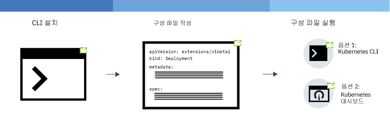
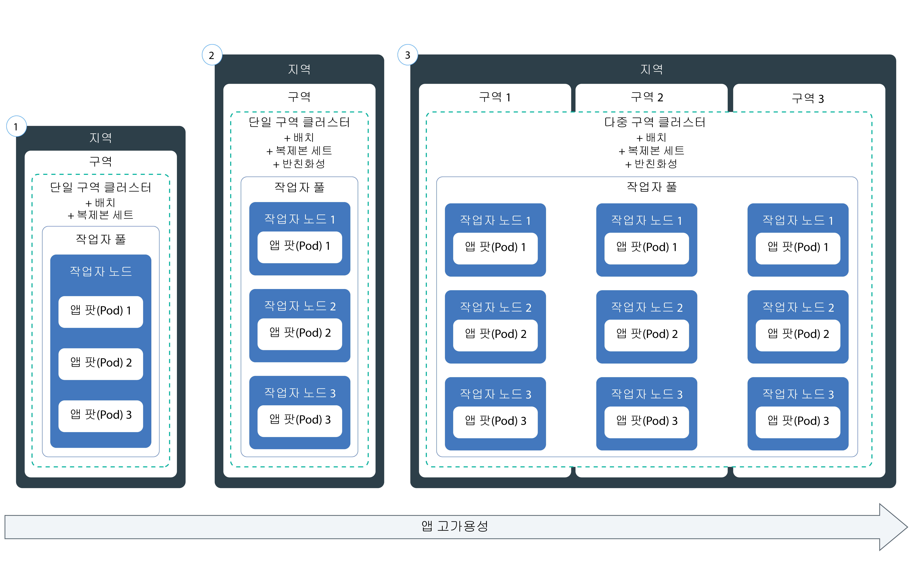

---

copyright:
  years: 2014, 2019
lastupdated: "2019-06-11"

keywords: kubernetes, iks, node.js, js, java, .net, go, flask, react, python, swift, rails, ruby, spring boot, angular

subcollection: containers

---

{:new_window: target="_blank"}
{:shortdesc: .shortdesc}
{:screen: .screen}
{:pre: .pre}
{:table: .aria-labeledby="caption"}
{:codeblock: .codeblock}
{:tip: .tip}
{:note: .note}
{:important: .important}
{:deprecated: .deprecated}
{:download: .download}
{:preview: .preview}


# 클러스터에 Kubernetes 기반 앱 배치
{: #app}

{{site.data.keyword.containerlong}}에서 Kubernetes 기술을 사용하여 컨테이너에 앱을 배치하고 앱이 시작되어 실행 중인지 항상 확인할 수 있습니다. 예를 들어, 사용자를 위해 작동 중단 시간 없이 롤링 업데이트 및 롤백을 수행할 수 있습니다. Kubernetes는 특정 언어나 앱을 요구하지 않는 확장 가능한 컨테이너 오케스트레이션 플랫폼이므로 원하는 언어로 작성된 Stateless, Stateful 및 데이터 처리 앱과 같은 다양한 워크로드를 실행할 수 있습니다.
{: shortdesc}

다음 이미지의 영역을 클릭하여 앱을 배치하기 위한 일반 단계를 자세히 보십시오. 우선 기본사항을 알고 싶으십니까? [앱 배치 튜토리얼](/docs/containers?topic=containers-cs_apps_tutorial#cs_apps_tutorial)을 이용해 보십시오.


<map name="d62e18" id="d62e18">
<area href="/docs/containers?topic=containers-cs_cli_install" target="_blank" alt="CLI를 설치하십시오." title="CLI를 설치하십시오." shape="rect" coords="30, 69, 179, 209" />
<area href="https://kubernetes.io/docs/concepts/configuration/overview/" target="_blank" alt="앱의 구성 파일을 작성하십시오. Kubernetes의 우수 사례를 검토하십시오." title="앱의 구성 파일을 작성하십시오. Kubernetes의 우수 사례를 검토하십시오." shape="rect" coords="254, 64, 486, 231" />
<area href="#app_cli" target="_blank" alt="옵션 1: Kubernetes CLI에서 구성 파일을 실행하십시오." title="옵션 1: Kubernetes CLI에서 구성 파일을 실행하십시오." shape="rect" coords="544, 67, 730, 124" />
<area href="#cli_dashboard" target="_blank" alt="옵션 2: Kubernetes 대시보드를 로컬로 시작하고 구성 파일을 실행하십시오." title="옵션 2: Kubernetes 대시보드를 로컬로 시작하고 구성 파일을 실행하십시오." shape="rect" coords="544, 141, 728, 204" />
</map>

<br />


## 클러스터에서의 앱 실행 계획
{: #plan_apps}

{{site.data.keyword.containerlong_notm}} 클러스터에 앱을 배치하려면 앱이 올바르게 액세스되고 {{site.data.keyword.Bluemix_notm}}의 기타 서비스와 통합될 수 있도록 우선 앱 설정 방법을 결정하십시오.
{:shortdesc}

### 내 앱에 대해 어떤 유형의 Kubernetes 오브젝트를 작성할 수 있습니까?
{: #object}

앱 YAML 파일을 준비할 때는 앱의 가용성, 성능 및 보안을 향상시키기 위한 다양한 선택사항이 있습니다. 예를 들면, 단일 팟(Pod) 대신 Kubernetes 제어기 오브젝트를 사용하여 복제본 세트, 작업 또는 디먼 세트와 같은 워크로드를 관리할 수 있습니다. 팟(Pod) 및 제어기에 대한 자세한 정보는 [Kubernetes 문서 ](https://kubernetes.io/docs/concepts/workloads/pods/pod-overview/)를 참조하십시오. 팟(Pod)의 복제본 세트를 관리하는 배치는 앱에 대한 일반적인 유스 케이스입니다.
{: shortdesc}

예를 들면, `kind: Deployment` 오브젝트를 사용하면 팟(Pod)의 가용성을 높일 수 있는 복제본 세트를 지정할 수 있으므로 이는 앱 팟(Pod)을 배치하는 데 있어서 좋은 선택사항입니다.

다음 표에는 다양한 Kubernetes 워크로드 오브젝트를 작성하는 이유가 설명되어 있습니다.

|오브젝트 |설명 |
| --- | --- |
| [`Pod` ](https://kubernetes.io/docs/concepts/workloads/pods/pod/) | 팟(Pod)은 워크로드의 가장 작은 배치 가능 단위이며 하나의 컨테이너 또는 여러 컨테이너를 포함할 수 있습니다. 컨테이너와 마찬가지로, 팟(Pod)은 간단히 사용하고 폐기할 수 있도록 디자인되며 앱 기능의 단위 테스트에 주로 사용됩니다. 앱에서 작동 중지 시간이 발생하지 않도록 하려면 배치와 같은 Kubernetes 제어기를 사용하여 팟(Pod)을 배치하는 것을 고려하십시오. 배치는 여러 팟(Pod), 복제본, 팟(Pod) 스케일링, 롤아웃 등을 관리하는 데 도움을 줍니다. |
| [`ReplicaSet` ](https://kubernetes.io/docs/concepts/workloads/controllers/replicaset/) | 복제본 세트는 팟(Pod)의 여러 복제본이 실행되도록 하며 특정 팟(Pod)이 작동 중단 상태가 되면 이를 다시 스케줄합니다. 팟(Pod) 스케줄링이 어떻게 작동하는지 테스트하려는 경우에는 복제본 세트를 작성할 수 있으나 앱 업데이트, 롤아웃 및 스케일링을 관리하려는 경우에는 배치를 작성하십시오. |
| [`Deployment` ](https://kubernetes.io/docs/concepts/workloads/controllers/deployment/) | 배치는 팟(Pod) 또는 팟(Pod) 템플리트의 [ReplicaSet ](https://kubernetes.io/docs/concepts/workloads/controllers/replicaset/)을 관리하는 제어기입니다. 배치가 없는 팟(Pod) 또는 복제본 세트를 작성하여 앱 기능을 테스트할 수 있습니다. 프로덕션 레벨 설정의 경우에는 배치를 사용하여 앱 업데이트, 롤아웃 및 스케일링을 관리하십시오. |
| [`StatefulSet` ](https://kubernetes.io/docs/concepts/workloads/controllers/statefulset/) | 배치와 마찬가지로, Stateful 세트는 팟(Pod)의 복제본 세트를 관리하는 제어기입니다. 배치와 달리, Stateful 세트는 팟(Pod)이 다시 스케줄된 후에도 유지되는 고유한 네트워크 정체성을 갖도록 합니다. 워크로드를 클라우드에서 실행하려는 경우에는 서비스 인스턴스가 독립적이며 서비스 중단 없이 실패할 수 있도록 [앱을 Stateless로 디자인](/docs/containers?topic=containers-strategy#cloud_workloads)하십시오. 그러나 데이터베이스와 같은 일부 앱은 Stateful이어야 합니다. 이러한 경우에는 Stateful 세트를 작성하고 [파일](/docs/containers?topic=containers-file_storage#file_statefulset), [블록](/docs/containers?topic=containers-block_storage#block_statefulset) 또는 [오브젝트](/docs/containers?topic=containers-object_storage#cos_statefulset) 스토리지를 Stateful 세트를 위한 지속적 스토리지로 사용하는 것을 고려하십시오. 또한 [Portworx](/docs/containers?topic=containers-portworx)를 베어메탈 작업자 노드 맨 위에 설치하고 Portworx를 고가용성 소프트웨어로 정의된 스토리지 솔루션으로 사용하여 Stateful 세트에 대한 지속적 스토리지를 관리할 수도 있습니다. |
| [`DaemonSet` ](https://kubernetes.io/docs/concepts/workloads/controllers/daemonset/) | 클러스터에 있는 모든 작업자 노드에서 동일한 팟(Pod)을 실행해야 하는 경우에는 디먼 세트를 사용하십시오. 디먼 세트에서 관리하는 팟(Pod)은 작업자 노드가 클러스터에 추가되면 자동으로 스케줄됩니다. 일반적인 유스 케이스에는 클러스터 또는 앱의 상태에 대한 정보를 제공하기 위해 모든 작업자 노드에서 로그를 수집하는, `logstash` 또는 `prometheus`와 같은 로그 콜렉터가 있습니다. |
| [`Job` ](https://kubernetes.io/docs/concepts/workloads/controllers/jobs-run-to-completion/) | 작업은 하나 이상의 팟(Pod)이 성공적으로 완료될 수 있도록 합니다. 작업은 렌더링할 특정 수의 프레임, 전송할 특정 수의 이메일, 변환할 특정 수의 파일과 같이 서로 별개이지만 관련된 작업 항목의 병렬 처리를 지원하기 위해 큐 또는 일괄처리 작업에 사용할 수 있습니다. 특정 횟수만큼 실행되도록 작업을 스케줄하려면 [`CronJob` ](https://kubernetes.io/docs/concepts/workloads/controllers/cron-jobs/)을 사용하십시오.|
{: caption="작성할 수 있는 Kubernetes 워크로드 오브젝트의 유형입니다." caption-side="top"}

### 내 Kubernetes 앱 구성에 기능을 추가하는 방법은 무엇입니까?
배치에 포함시킬 수 있는 항목에 대한 설명은 [YAML 파일에 앱 요구사항 지정](#app_yaml)을 참조하십시오. 예에는 다음 항목이 포함됩니다.
* [복제본 세트](#replicaset)
* [레이블](#label)
* [친화성](#affinity)
* [이미지 정책](#image)
* [포트](#port)
* [리소스 요청 및 한계](#resourcereq)
* [활동 상태 및 준비 상태 프로브](#probe)
* 포트에 앱 서비스를 노출하기 위한 [서비스](#app-service)
* 컨테이너 환경 변수를 설정하기 위한 [ConfigMap](#configmap)
* 컨테이너 환경 변수를 설정하기 위한 [Secret](#secret)
* 스토리지를 위해 컨테이너에 마운트되는 [지속적 볼륨](#pv)

### 내 Kubernetes 앱 구성에서 변수를 사용하도록 하려면 어떻게 해야 합니까? 변수를 YAML에 추가하는 방법은 무엇입니까?
{: #variables}

데이터를 YAML 파일에 하드코딩하는 대신 배치에 변수를 정보를 추가하려는 경우에는 Kubernetes [`ConfigMap` ](https://kubernetes.io/docs/tasks/configure-pod-container/configure-pod-configmap/) 또는 [`Secret` ](https://kubernetes.io/docs/concepts/configuration/secret/) 오브젝트를 사용할 수 있습니다.
{: shortdesc}

ConfigMap 또는 secret을 이용하려면 이를 팟(Pod)에 마운트해야 합니다. ConfigMap 또는 secret은 팟(Pod)이 실행되기 직전에 팟(Pod)과 결합됩니다. 배치 스펙 및 이미지는 여러 앱에 걸쳐 재사용할 수 있지만, 그 후에는 사용자 정의된 ConfigMap 및 secret을 스왑 아웃하십시오. 특히 secret은 로컬 노드에서 많은 스토리지를 차지할 수 있으므로 적절히 계획하십시오.

두 리소스는 모두 키-값 쌍을 정의하지만, 사용자는 둘을 서로 다른 상황에 사용합니다.

<dl>
<dt>ConfigMap</dt>
<dd>배치에 지정된 워크로드에 대한, 만감하지 않은 구성 정보를 제공합니다. ConfigMap의 주된 용도에는 세 가지가 있습니다.
<ul><li><strong>파일 시스템</strong>: 사용자는 전체 파일 또는 변수 세트를 팟(Pod)에 마운트할 수 있습니다. 값에 설정된 파일의 키 이름 컨텐츠에 따라 각 항목에 대해 하나의 파일이 작성됩니다.</li>
<li><strong>환경 변수</strong>: 컨테이너 스펙에 대해 동적으로 환경 변수를 설정하십시오.</li>
<li><strong>명령행 인수</strong>: 컨테이너 스펙에 사용되는 명령행 인수를 설정하십시오.</li></ul></dd>

<dt>시크릿</dt>
<dd>워크로드에 다음과 같은 민감한 정보를 제공합니다. 클러스터의 다른 사용자에게 시크릿에 대한 액세스 권한이 있을 수 있으므로, 시크릿 정보가 이러한 사용자와 공유될 수 있다는 점을 반드시 알고 있어야 합니다.
<ul><li><strong>PII(Personally Identifiable Information)</strong>: Secret에 이메일 정보, 또는 회사나 정부의 규제 준수에 필요한 기타 정보와 같은 민감한 정보를 저장하십시오.</li>
<li><strong>인증 정보</strong>: 비밀번호, 키 및 토큰과 같은 인증 정보를 Secret에 입력하여 실수로 노출할 위험을 줄이십시오. 예를 들어, 클러스터에 [서비스를 바인드](/docs/containers?topic=containers-service-binding#bind-services)하는 경우에는 인증 정보가 Secret에 저장됩니다.</li></ul></dd>
</dl>

secret을 더 안전하게 보호하려 하십니까? 기존 및 신규 시크릿을 암호화하기 위해 클러스터 관리자에게 클러스터에서 [{{site.data.keyword.keymanagementservicefull}}를 사용으로 설정](/docs/containers?topic=containers-encryption#keyprotect)하도록 요청하십시오.
{: tip}

### 내 앱에 Watson과 같은 IBM 서비스를 추가하는 방법은 무엇입니까?
[앱에 서비스 추가](/docs/containers?topic=containers-service-binding#adding_app)를 참조하십시오.

### 내 앱이 올바른 리소스를 확보하도록 하는 방법은 무엇입니까?
[앱 YAML 파일을 지정](#app_yaml)할 때. 앱이 올바른 리소스를 확보하도록 돕는 Kubernetes 기능을 앱 구성에 추가할 수 있습니다. 특히, YAML 파일에 정의된 각 컨테이너에 대해 [리소스 한계 및 요청을 설정 ](https://kubernetes.io/docs/concepts/configuration/manage-compute-resources-container/)하십시오.
{: shortdesc}

추가로, 클러스터 관리자는 다음과 같이 앱 배치에 영향을 주는 리소스 제어를 설정할 수 있습니다.
*  [리소스 할당량 ](https://kubernetes.io/docs/concepts/policy/resource-quotas/)
*  [팟(Pod) 우선순위](/docs/containers?topic=containers-pod_priority#pod_priority)

### 내 앱에 액세스하는 방법은 무엇입니까?
[`clusterIP` 서비스를 사용](/docs/containers?topic=containers-cs_network_planning#in-cluster)하여 클러스터 내에서 개인용으로 앱에 액세스할 수 있습니다.
{: shortdesc}

앱을 외부에 노출하려는 경우에는 클러스터 유형에 따라 여러 선택사항이 있습니다.
*  **무료 클러스터**: [NodePort 서비스](/docs/containers?topic=containers-nodeport#nodeport)를 사용하여 앱을 노출할 수 있습니다.
*  **표준 클러스터**: [NodePort, 로드 밸런서 또는 Ingress 서비스](/docs/containers?topic=containers-cs_network_planning#external)를 사용하여 앱을 노출할 수 있습니다.
*  **Calico를 사용하여 사설로 설정된 클러스터**: [NodePort, 로드 밸런서 또는 Ingress 서비스](/docs/containers?topic=containers-cs_network_planning#private_both_vlans)를 사용하여 앱을 노출할 수 있습니다. 또한 Calico preDNAT 네트워크 정책을 사용하여 공용 노드 포트를 차단해야 합니다.
*  **사설 VLAN 전용 표준 클러스터**: [NodePort, 로드 밸런서 또는 Ingress 서비스](/docs/containers?topic=containers-cs_network_planning#plan_private_vlan)를 사용하여 앱을 노출할 수 있습니다. 또한 사용자의 방화벽에서 서비스의 사설 IP 주소의 포트를 열어야 합니다.

### 앱을 배치한 후 해당 상태를 모니터링하는 방법은 무엇입니까?
클러스터에 대한 {{site.data.keyword.Bluemix_notm}} [로깅 및 모니터링](/docs/containers?topic=containers-health#health)을 설정할 수 있습니다. 서드파티 [로깅 및 모니터링 서비스](/docs/containers?topic=containers-supported_integrations#health_services)와 통합하도록 선택할 수도 있습니다.
{: shortdesc}

### 내 앱을 최신 상태로 유지하는 방법은 무엇입니까?
워크로드 사용량에 따라 동적으로 앱을 추가하고 제거하려는 경우에는 [앱 스케일링](/docs/containers?topic=containers-app#app_scaling)을 참조하십시오.
{: shortdesc}

앱에 대한 업데이트를 관리하려는 경우에는 [롤링 배치 관리](/docs/containers?topic=containers-app#app_rolling)를 참조하십시오.

### 내 앱 배치에 대한 액세스 권한을 갖는 사용자를 제어하는 방법은 무엇입니까?
계정 및 클러스터 관리자는 다양한 레벨(클러스터, Kubernetes 네임스페이스, 팟(Pod), 컨테이너)에서의 액세스 권한을 제어할 수 있습니다.
{: shortdesc}

{{site.data.keyword.Bluemix_notm}} IAM을 사용하면 클러스터-인스턴스 레벨에서 개별 사용자, 그룹 또는 서비스 계정에 권한을 지정할 수 있습니다.  사용자를 클러스터 내 특정 네임스페이스로 제한하여 클러스터 액세스 권한을 더 자세한 범위로 지정할 수 있습니다. 자세한 정보는 [클러스터 액세스 권한 지정](/docs/containers?topic=containers-users#users)을 참조하십시오.

팟(Pod) 레벨에서 액세스 권한을 제어하려는 경우에는 [Kubernetes RBAC를 사용하여 팟(Pod) 보안 정책을 구성](/docs/containers?topic=containers-psp#psp)할 수 있습니다.

앱 배치 YAML에는 팟(Pod) 또는 컨테이너에 대한 보안 컨텍스트를 설정할 수 있습니다. 자세한 정보는 [Kubernetes 문서 ](https://kubernetes.io/docs/tasks/configure-pod-container/security-context/)를 검토하십시오.

애플리케이션 레벨에서 액세스를 제어하시겠습니까? 앱 코드를 변경하지 않고 언제든지 업데이트할 수 있는 사인온 플로우를 작성하려면 [{{site.data.keyword.appid_long_notm}}](/docs/services/appid?topic=appid-getting-started)를 사용해 보십시오.
{: tip}

<br />


## 고가용성 배치 계획
{: #highly_available_apps}

다중 작업자 노드 및 클러스터에
보다 광범위하게 설정을 분배할수록 사용자가 앱에서 작동 중단을 겪을 가능성이 보다 줄어듭니다.
{: shortdesc}

가용성의 정도가 증가하는 순서로 정렬된 다음의 잠재적 앱 설정을 검토하십시오.



1.  단일 구역 클러스터의 단일 노드의 복제본 세트에 의해 관리되는 n+2 팟(Pod)의 배치.
2.  복제본 세트에 의해 관리되며 단일 구역 클러스터의 다중 노드 간에 전개된(반친화성) n+2 팟(Pod)의 배치.
3.  복제본 세트에 의해 관리되며 구역 간의 다중 구역 클러스터의 다중 노드 간에 전개된(반친화성) n+2 팟(Pod)의 배치.

고가용성을 높이기 위해 [서로 다른 지역의 다중 클러스터를 글로벌 로드 밸런서와 연결](/docs/containers?topic=containers-ha_clusters#multiple_clusters)할 수도 있습니다.

### 앱의 가용성 향상
{: #increase_availability}

앱의 가용성을 높이려면 다음 옵션을 고려하십시오.
{: shortdesc}

<dl>
  <dt>배치 및 복제본 세트를 사용하여 앱과 해당 종속 항목 배치</dt>
    <dd><p>배치는 앱과 해당 종속 항목의 모든 컴포넌트를 선언하는 데 사용할 수 있는 Kubernetes 리소스입니다. 배치를 사용하면 모든 단계를 기록할 필요 없이 앱에 집중할 수 있습니다.</p>
    <p>둘 이상의 팟(Pod)을 배치하는 경우, 팟(Pod)을 모니터링하며 항상 지정된 수의 팟(Pod)이 시작되고 실행되도록 보장하는 복제본 세트가 배치에 대해 자동으로 작성됩니다. 팟(Pod)이 중단되는 경우, 복제본 세트는 응답하지 않는 팟(Pod)을 새 팟(Pod)으로 대체합니다.</p>
    <p>배치를 사용하여 앱에 대한 업데이트 전략(롤링 업데이트 중에 추가할 팟(Pod)의 수와 한 번에 사용 불가능 상태가 될 수 있는 팟(Pod)의 수 포함)을 정의할 수 있습니다. 롤링 업데이트를 수행할 때 배치는 개정이 작동 중인지 여부를 확인하며, 장애가 발견되면 롤아웃을 중지합니다.</p>
    <p>배치를 사용하면 플래그가 서로 다른 여러 개정을 동시에 배치할 수 있습니다. 예를 들면, 배치를 프로덕션으로 푸시하기로 결정하기 전에 먼저 이를 테스트할 수 있습니다.</p>
    <p>배치를 사용하면 배치된 개정을 계속해서 추적할 수 있습니다. 사용자는 이 히스토리를 사용하여 업데이트가 예상한 대로 작동하지 않는 경우 이전 버전으로 롤백할 수 있습니다.</p></dd>
  <dt>앱의 워크로드를 위한 충분한 복제본과 두 개의 추가 복제본 포함</dt>
    <dd>앱의 보다 높은 가용성과 장애에 대한 복원성을 더욱 높이려면, 예상된 워크로드를 처리할 수 있도록 최소량 이상의 추가 복제본을 포함할 것을 고려하십시오. 팟(Pod)이 충돌했으며 복제본 세트가 아직 충돌된 팟(Pod)을 복구하지 않은 경우에는 추가 복제본이 워크로드를 처리할 수 있습니다. 두 건의 장애가 동시에 발생하지 않도록 방지하려면, 두 개의 추가 복제본을 포함하십시오. 이 설정은 N + 2 패턴으로, 여기서 N은 수신 워크로드를 처리하기 위한 복제본의 수이며 + 2는 두 개의 추가 복제본입니다. 팟(Pod)은 클러스터에 충분한 공간이 있는 한 원하는 만큼 보유할 수 있습니다.</dd>
  <dt>여러 노드 간에 팟(Pod) 전개(반친화성)</dt>
    <dd><p>배치를 작성할 때 각 팟(Pod)을 동일한 작업자 노드에 배치할 수 있습니다. 이를 친화성(affinity) 또는 동일 위치에 배치라고 합니다. 작업자 노드 장애로부터 앱을 보호하기 위해, 표준 클러스터에 <code>podAntiAffinity</code> 옵션을 사용하여 여러 작업자 노드에 팟(Pod)이 분산되도록 배치를 구성할 수 있습니다. 팟(Pod) 반친화성에는 선호 및 필수의 두 가지 유형이 있습니다.
      <p>자세한 정보는 <a href="https://kubernetes.io/docs/concepts/configuration/assign-pod-node/" rel="external" target="_blank" title="(새 탭 또는 창에서 열림)">노드에 팟(Pod) 지정</a>에 대한 Kubernetes 문서를 참조하십시오.</p>
      <p>앱 배치에서의 친화성에 대한 예는 [앱 배치 YAML 파일 작성](#app_yaml)을 참조하십시오.</p>
      </dd>
    </dd>
<dt>여러 구역 또는 지역 간에 팟(Pod) 분배</dt>
  <dd><p>구역 장애에서 앱을 보호하기 위해, 별도의 구역에서 다중 클러스터를 작성하거나 다중 구역 클러스터의 작업자 풀에 구역을 추가할 수 있습니다. 다중 구역 클러스터는 [특정 메트로 영역](/docs/containers?topic=containers-regions-and-zones#zones)(예: 댈러스)에서만 사용 가능합니다. 별도의 구역에서 다중 클러스터를 작성하는 경우에는 [글로벌 로드 밸런서를 설정](/docs/containers?topic=containers-ha_clusters#multiple_clusters)해야 합니다.</p>
  <p>복제본 세트를 사용하고 팟(Pod) 반친화성을 지정하는 경우, Kubernetes는 노드 간에 앱 팟(Pod)을 전개합니다. 노드가 다중 구역에 있으면 팟(Pod)이 구역 간에 전개되며 앱의 가용성이 증가됩니다. 하나의 구역에서만 실행하도록 앱을 제한하려는 경우에는 팟(Pod) 친화성을 구성하거나 하나의 구역에서 작업자 풀을 작성하고 해당 레이블을 지정할 수 있습니다. 자세한 정보는 [다중 구역 클러스터에 대한 고가용성](/docs/containers?topic=containers-ha_clusters#ha_clusters)을 참조하십시오.</p>
  <p><strong>다중 구역 클러스터 배치에서 내 앱 팟(Pod)이 노드 간에 균등하게 분배되어 있습니까?</strong></p>
  <p>팟(Pod)은 구역 간에는 균등하게 분배되어 있지만, 노드 간에는 항상 그렇지 않습니다. 예를 들어, 세 개의 구역 각각에 하나의 노드가 있는 클러스터가 있고 팟(Pod)이 여섯 개인 복제본 세트를 배치하는 경우에는 각 노드가 두 개의 팟(Pod)을 갖습니다. 그러나 세 개의 구역 각각에 두 개의 노드가 있는 클러스터가 있고 팟(Pod)이 여섯 개인 복제본 세트를 배치하는 경우에는 각 구역이 두 개의 팟(Pod)을 스케줄하며, 노드당 하나의 팟(Pod)을 스케줄할 수도 있고 스케줄하지 않을 수도 있습니다. 스케줄링에 대한 추가적인 제어를 위해 [팟(Pod) 친화성을 설정 ](https://kubernetes.io/docs/concepts/configuration/assign-pod-node)할 수 있습니다.</p>
  <p><strong>구역이 작동 중지되면 어떻게 기타 구역의 나머지 노드로 팟(Pod)이 다시 스케줄됩니까?</strong></br>이는 배치에서 사용한 스케줄링 정책에 따라 다릅니다. [노드 특정 팟(Pod) 친화성 ](https://kubernetes.io/docs/concepts/configuration/assign-pod-node/#node-affinity-beta-feature)을 포함한 경우에는 팟(Pod)이 다시 스케줄되지 않습니다. 그렇지 않은 경우에는 팟(Pod)이 기타 구역의 사용 가능한 작업자 노드에서 작성되지만, 이의 밸런스가 유지되지 않을 수 있습니다. 예를 들면 두 개의 팟(Pod)이 두 개의 사용 가능한 노드에 분배되거나, 둘 모두 가용 용량이 있는 하나의 노드에 스케줄될 수 있습니다. 이와 유사하게, 사용 불가능한 구역이 리턴되면 팟(Pod)이 자동으로 삭제되지 않으며 노드 간에 리밸런싱됩니다. 구역이 백업된 후에 구역 간에 팟(Pod)의 리밸런싱을 원하는 경우에는 [Kubernetes 디스케줄러(descheduler) ](https://github.com/kubernetes-incubator/descheduler)의 사용을 고려하십시오.</p>
  <p><strong>팁</strong>: 다중 구역 클러스터에서는 구역 장애에 대해 클러스터를 보호하기 위해 충분한 용량이 남아 있도록 구역당 50%의 작업자 노드 용량을 유지하십시오. </p>
  <p><strong>지역 간에 내 앱을 전개하려면 어떻게 합니까?</strong></br>지역 장애로부터 앱을 보호하려면, 다른 지역에 두 번째 클러스터를 작성하고 클러스터에 연결할 [글로벌 로드 밸런서를 설정](/docs/containers?topic=containers-ha_clusters#multiple_clusters)한 후에 배치 YAML을 사용하여 앱에 대한 [팟(Pod) 반친화성 ](https://kubernetes.io/docs/concepts/configuration/assign-pod-node/)으로 중복 복제본 세트를 배치하십시오.</p>
  <p><strong>내 앱에서 지속적 스토리지가 필요하면 어떻게 합니까?</strong></p>
  <p>[{{site.data.keyword.cloudant_short_notm}}](/docs/services/Cloudant?topic=cloudant-getting-started#getting-started) 또는 [{{site.data.keyword.cos_full_notm}}](/docs/services/cloud-object-storage?topic=cloud-object-storage-about) 등의 클라우드 서비스를 사용하십시오.</p></dd>
</dl>

## YAML 파일에 앱 요구사항 지정
{: #app_yaml}

Kubernetes에서는 Kubernetes 오브젝트 구성을 선언하는 YAML 파일로 앱을 나타낼 수 있습니다. Kubernetes API 서버는 이 YAML 파일을 처리하며 구성과 필요한 오브젝트 상태를 etcd 데이터 저장소에 저장합니다. Kubernetes 스케줄러는 YAML 파일의 스펙, 관리자가 설정한 클러스터 정책, 사용 가능한 클러스터 용량을 고려하여 클러스터 내의 작업자 노드에 워크로드를 스케줄합니다.
{: shortdesc}

[전체 YAML 파일](https://raw.githubusercontent.com/IBM-Cloud/kube-samples/master/deploy-apps-clusters/deploy_wasliberty.yaml)의 사본을 검토하십시오. 그 후 다음 섹션을 검토하여 앱 배치를 어떻게 개선할 수 있는지 알아보십시오.

* [복제본 세트](#replicaset)
* [레이블](#label)
* [친화성](#affinity)
* [이미지 정책](#image)
* [포트](#port)
* [리소스 요청 및 한계](#resourcereq)
* [활동 상태 및 준비 상태 프로브](#probe)
* 포트에 앱 서비스를 노출하기 위한 [서비스](#app-service)
* 컨테이너 환경 변수를 설정하기 위한 [ConfigMap](#configmap)
* 컨테이너 환경 변수를 설정하기 위한 [Secret](#secret)
* 스토리지를 위해 컨테이너에 마운트되는 [지속적 볼륨](#pv)
* [다음 단계](#nextsteps)
* [전체 YAML 예](#yaml-example)

<dl>
<dt>기본 배치 메타데이터</dt>
  <dd><p>배치하는 [Kubernetes 오브젝트 유형](#object)에 대해 적절한 API 버전을 사용하십시오. API 버전은 사용자가 사용할 수 있는 Kubernetes 오브젝트에 대해 지원되는 기능을 결정합니다. 메타데이터에 지정하는 이름은 해당 레이블이 아니라 오브젝트의 이름입니다. 오브젝트와 상호작용할 때 이름을 사용합니다(예: `kubectl get deployment <name>`).</p>
  <p><pre class="codeblock"><code>apiVersion: apps/v1
kind: Deployment
metadata:
  name: wasliberty</code></pre></p></dd>

<dt id="replicaset">복제본 세트</dt>
  <dd><p>앱의 가용성을 높이기 위해 배치에 복제본 세트를 지정할 수 있습니다. 복제본 세트에는 배치할 앱 인스턴스 수를 정의합니다. 복제본 세트는 Kubernetes 배치에 의해 관리되고 모니터링됩니다. 하나의 앱 인스턴스가 작동 중지 상태가 되면 Kubernetes는 자동으로 앱의 새 인스턴스를 스핀업하여 지정된 앱 인스턴스 수를 유지합니다.</p>
  <p><pre class="codeblock"><code>spec:
replicas: 3</pre></code></p></dd>

<dt id="label">레이블</dt>
  <dd><p>[레이블](/docs/containers?topic=containers-strategy#deploy_organize)을 사용하면 클러스터에 있는 서로 다른 유형의 리소스를 동일한 `key: value` 쌍으로 표시할 수 있습니다. 그 후에는 해당하는 다른 리소스에 빌드할 수 있도록 하기 위해 레이블을 비교하도록 선택기를 지정할 수 있습니다. 앱을 외부에 노출하려는 경우에는 서비스에 지정하는 선택기와 일치하는 레이블을 사용해야 합니다. 다음 예에서 배치 스펙은 레이블 `app: wasliberty`와 일치하는 템플리트를 사용합니다.</p>
  <p>`staging` 또는 `production` 컴포넌트를 보려는 경우와 같이, 클러스터에서 레이블 지정된 오브젝트를 검색할 수 있습니다. 예를 들면, 클러스터에 있는 모든 네임스페이스에서 `env: production` 레이블이 있는 모든 리소스를 나열하는 경우 있습니다. <strong>참고:</strong> 이 명령을 실행하려면 모든 네임스페이스에 대한 액세스 권한이 필요합니다. <pre class="pre"><code>kubectl get all -l env=production --all-namespaces</code></pre></p>
  <ul><li>레이블에 대한 자세한 정보는 [Kubernetes 문서 ](https://kubernetes.io/docs/concepts/overview/working-with-objects/labels/)를 참조하십시오.</li>
  <li>작업자 노드에 레이블을 적용하려면 레이블이 있는 [작업자 풀을 작성](/docs/containers?topic=containers-add_workers#add_pool)하거나 [기존 작업자 풀을 업데이트](/docs/containers?topic=containers-add_workers#worker_pool_labels)하십시오. </li>
  <li>더 자세한 예는 [레이블을 사용하여 특정 작업자 노드에 앱 배치](/docs/containers?topic=containers-app#node_affinity)를 참조하십시오.</li></ul>
  <p><pre class="codeblock"><code>selector:
matchLabels:
app: wasliberty
template:
metadata:
labels:
app: wasliberty</pre></code></p></dd>

<dt id="affinity">친화성</dt>
  <dd><p>팟(Pod)이 스케줄되는 작업자 노드를 더 자세하게 제어하려는 경우에는 친화성(동일 위치에 배치)을 지정하십시오. 친화성은 스케줄 시에만 팟(Pod)에 영향을 줍니다. 예를 들어, 팟(Pod)이 동일한 노드에 스케줄될 수 있도록 하지 않고 작업자 노드 간에 배치를 분산시키려는 경우에는 표준 클러스터에 <code>podAntiAffinity</code> 옵션을 사용하십시오. 팟(Pod) 반친화성에는 선호 및 필수의 두 가지 유형이 있습니다.</p>
  <p>자세한 정보는 <a href="https://kubernetes.io/docs/concepts/configuration/assign-pod-node/" rel="external" target="_blank" title="(새 탭 또는 창에서 열림)">노드에 팟(Pod) 지정</a>에 대한 Kubernetes 문서를 참조하십시오.</p>
  <ul><li><strong>필수 반친화성</strong>: 보유한 작업자 노드 수만큼만 복제본을 배치할 수 있습니다. 예를 들어, 클러스터에 세 개의 작업자 노드가 있으나 YAML 파일에 다섯 개의 복제본을 정의하는 경우에는 세 개의 복제본만 배치됩니다. 각 복제본은 서로 다른 작업자 노드에 상주합니다. 남은 두 개의 복제본은 보류 상태로 유지됩니다. 클러스터에 다른 작업자 노드를 추가하면 남은 복제본 중 하나가 자동으로 새 작업자 노드에 배치됩니다. 한 작업자 노드가 실패하는 경우, 친화성 정책이 필요하므로 해당 팟(Pod)은 다시 스케줄되지 않습니다. 필수 반친화성이 있는 YAML의 예는 <a href="https://github.com/IBM-Cloud/kube-samples/blob/master/deploy-apps-clusters/liberty_requiredAntiAffinity.yaml" rel="external" target="_blank" title="(새 탭 또는 창에서 열림)">필수 팟(Pod) 반친화성이 있는 Liberty 앱</a>을 참조하십시오.</li>
  <li><strong>선호 반친화성</strong>: 사용 가능한 용량이 있는 노드에 팟(Pod)을 배치할 수 있으며, 이는 워크로드에 더 큰 유연성을 제공합니다. 가능한 경우 팟(Pod)은 서로 다른 작업자 노드에 스케줄됩니다. 예를 들어, 클러스터에 용량이 충분한 세 개의 작업자 노드가 있는 경우에는 노드 전체에 다섯 개의 복제본 팟(Pod)을 스케줄할 수 있습니다. 그러나 클러스터에 두 개의 작업자 노드를 추가하는 경우 친화성 규칙은 기존 노드에서 실행 중인 두 개의 추가 팟(Pod)이 사용 가능한 노드로 다시 스케줄되도록 강제하지 않습니다. </li>
  <li><strong>작업자 노드 친화성</strong>: 베어메탈과 같은 특정 작업자 노드에서만 실행되도록 배치를 구성할 수 있습니다. 자세한 정보는 [레이블을 사용하여 특정 작업자 노드에 앱 배치](/docs/containers?topic=containers-app#node_affinity)를 참조하십시오.</li></ul>
  <p>선호 반친화성에 대한 예:</p>
  <p><pre class="codeblock"><code>spec:
  affinity:
    podAntiAffinity:
      preferredDuringSchedulingIgnoredDuringExecution:
      - weight: 100
        podAffinityTerm:
          labelSelector:
            matchExpressions:
            - key: app
              operator: In
              values:
              - wasliberty
          topologyKey: kubernetes.io/hostname</pre></code></p></dd>

<dt id="image">컨테이너 이미지</dt>
  <dd>
  <p>컨테이너에 대해 사용할 이미지, 이미지의 위치 및 이미지 가져오기 정책을 지정하십시오. 이미지 태그를 지정하지 않으면 기본적으로 `latest`로 태그 지정된 이미지를 가져옵니다.</p>
  <p>**주의**: 프로덕션 워크로드에 대해서는 latest 태그를 사용하지 마십시오. Docker Hub 또는 {{site.data.keyword.registryshort_notm}}와 같은 공용 또는 공유 저장소를 사용하고 있는 경우에는 워크로드를 최신 이미지에 대해 테스트하지 않았을 수 있습니다.</p>
  <p>예를 들어, 공용 IBM 이미지의 태그를 나열하려면 다음을 수행하십시오.</p>
  <ol><li>글로벌 레지스트리 지역으로 전환하십시오.<pre class="pre"><code>ibmcloud cr region-set global</code></pre></li>
  <li>IBM 이미지를 나열하십시오.<pre class="pre"><code>ibmcloud cr images --include-ibm</code></pre></li></ol>
  <p>기본 `imagePullPolicy`는 이미지가 로컬에 없는 경우에만 이를 가져오는 `IfNotPresent`입니다. 컨테이너가 시작할 때마다 이미지를 가져오도록 하려면 `imagePullPolicy: Always`를 지정하십시오.</p>
  <p><pre class="codeblock"><code>containers:
- name: wasliberty
  image: icr.io/ibmliberty:webProfile8
  imagePullPolicy: Always</pre></code></p></dd>

<dt id="port">앱 서비스의 포트</dt>
  <dd><p>앱의 서비스를 열 컨테이너 포트를 선택하십시오. 어느 포트를 열어야 하는지 알아보려면 앱 스펙 또는 Dockerfile을 참조하십시오. 이 포트는 사설 네트워크에서 액세스할 수 있지만, 공용 네트워크 연결에서는 액세스할 수 없습니다. 앱을 외부에 노출하려면 NodePort, 로드 밸런서 또는 Ingress 서비스를 사용해야 합니다. [`Service` 오브젝트를 작성](#app-service)하는 경우에 이와 동일한 포트 번호를 사용합니다.</p>
  <p><pre class="codeblock"><code>ports:
- containerPort: 9080</pre></code></p></dd>

<dt id="resourcereq">리소스 요청 및 한계</dt>
  <dd><p>클러스터 관리자는 클러스터에 있는 각 Kubernetes 네임스페이스에 대해 [<code>ResourceQuota</code> 오브젝트 ](https://kubernetes.io/docs/concepts/policy/resource-quotas/)를 작성하여 클러스터를 공유하는 팀들이 컴퓨팅 리소스(메모리 및 CPU)를 필요 이상으로 사용하지 않도록 할 수 있습니다. 클러스터 관리자가 컴퓨팅 리소스 할당량을 설정하는 경우 배치 템플리트 내의 각 컨테이너는 메모리 및 CPU에 대한 리소스 요청 및 한계를 지정해야 하며, 이렇게 하지 않으면 팟(Pod) 작성이 실패합니다.</p>
  <p><ol><li>네임스페이스에 대해 리소스 할당량이 설정되었는지 확인하십시오. <pre class="pre"><code>kubectl get quota --namespace=<namespace></code></pre></li>
  <li>할당량 한계가 얼마인지 확인하십시오.<pre class="pre"><code>kubectl describe quota <quota_name> --namespace=<namespace></code></pre></li></ol></p>
  <p>리소스 할당량이 설정되지 않은 경우에도, 작업자 노드 리소스 관리 능력을 향상시키기 위해 배치에 리소스 요청 및 한계를 포함시킬 수 있습니다.</p><p class="note">컨테이너가 한계를 초과하면 해당 컨테이너가 다시 시작되거나 실패할 수 있습니다. 컨테이너가 요청을 초과하는 경우, 작업자 노드에서 초과된 리소스가 모두 사용되면 해당 팟(Pod)이 제거됩니다. 문제점 해결에 대한 자세한 정보는 [팟(Pod) 다시 시작이 계속 실패하거나 팟(Pod)이 예기치 않게 제거됨](/docs/containers?topic=containers-cs_troubleshoot_clusters#pods_fail)을 참조하십시오. </p>
  <p>**요청**: 컨테이너가 사용할 수 있도록 스케줄러가 예약하는 최소 리소스 양입니다. 이 양이 한계와 동일한 경우에는 요청이 보장됩니다. 이 양이 한계보다 작은 경우 요청은 여전히 보장되지만, 스케줄러가 다른 컨테이너의 리소스를 만족시키기 위해 요청과 한계의 차이를 사용할 수 있습니다. </p>
  <p>**한계**: 컨테이너가 이용할 수 있는 최대 리소스 양입니다. 컨테이너 전체에서 사용되는 리소스의 양이 작업자 노드에서 사용 가능한 양을 초과하는 경우에는 공간을 확보하기 위해 컨테이너가 제거됩니다. 제거를 방지하려면 리소스 요청을 컨테이너의 한계와 동일하게 설정하십시오. 한계가 지정되지 않은 경우 기본값은 작업자 노드의 용량입니다.</p>
  <p>자세한 정보는 [Kubernetes 문서 ](https://kubernetes.io/docs/concepts/configuration/manage-compute-resources-container/)를 참조하십시오.</p>
  <p><pre class="codeblock"><code>resources:
  requests:
    memory: "512Mi"
    cpu: "500m"
  limits:
    memory: "1024Mi"
    cpu: "1000m"</pre></code></p></dd>

<dt id="probe">활동 상태 및 준비 상태 프로브</dt>
  <dd><p>기본적으로 Kubernetes는 팟(Pod) 내의 모든 컨테이너가 시작되면 앱 팟(Pod)에 트래픽을 전송하며, 컨테이너가 충돌하면 이를 다시 시작합니다. 사용자는 상태 검사를 설정하여 서비스 트래픽 라우팅의 내구성을 향상시킬 수 있습니다. 예를 들면, 사용자의 앱에 시작 지연 시간이 있습니다. 이 앱 프로세스가 전체 앱이 완전히 준비되기 전에 시작될 수 있으며, 이는 응답(특히 많은 인스턴스로 스케일 확장할 때)에 영향을 줄 수 있습니다. 상태 검사를 사용하면 앱의 실행 중 여부 및 요청 수신 준비 여부를 시스템에 알려 줄 수 있습니다. 이러한 프로브를 설정하면 앱의 [롤링 업데이트](#app_rolling)를 수행할 때 작동 중단 시간을 방지하는 데도 도움을 줄 수 있습니다. 사용자는 활동 상태 프로브와 준비 상태 프로브의 두 가지 상태 검사를 설정할 수 있습니다.</p>
  <p>**활동 상태 프로브**: 컨테이너가 실행 중인지 확인하는 활동 상태 프로브를 설정합니다. 이 프로브가 실패하면 컨테이너가 다시 시작됩니다. 컨테이너가 활동 상태 프로브를 지정하지 않은 경우, 이 프로브는 컨테이너가 **Running** 상태이면 컨테이너가 작동 중이라고 가정하므로 성공합니다.</p>
  <p>**준비 상태 프로브**: 컨테이너가 요청 및 외부 트래픽을 수신할 준비가 되었는지 확인하는 준비 상태 프로브를 설정합니다. 이 프로브가 실패하면 팟(Pod)의 IP 주소가 제거되며 해당 주소가 팟(Pod)과 일치하는 서비스를 위한 사용 가능한 IP 주소가 되지만, 컨테이너가 다시 시작되지는 않습니다. 앱이 시작되는 데 어느 정도 시간이 소요되는 경우에는 초기 지연 시간이 있는 준비 상태 프로브를 설정하는 것이 특히 중요합니다. 초기 지연 시간이 경과하기 전에는 프로브가 시작되지 않으며, 이는 컨테이너가 준비를 완료할 시간을 줍니다. 컨테이너가 준비 상태 프로브를 제공하지 않은 경우, 이 프로브는 컨테이너가 **Running** 상태이면 컨테이너가 작동 중이라고 가정하므로 성공합니다.</p>
  <p>명령, HTTP 요청 또는 TCP 소켓으로 프로브를 설정할 수 있습니다. 다음 예는 HTTP 요청을 사용합니다. 준비 상태 프로브보다 활동 상태 프로브에 더 많은 시간을 지정하십시오. 자세한 정보는 [Kubernetes 문서 ](https://kubernetes.io/docs/tasks/configure-pod-container/configure-liveness-readiness-probes/)를 참조하십시오.</p>
  <p><pre class="codeblock"><code>livenessProbe:
  httpGet:
    path: /
    port: 9080
  initialDelaySeconds: 300
  periodSeconds: 15
readinessProbe:
  httpGet:
    path: /
    port: 9080
  initialDelaySeconds: 45
  periodSeconds: 5</pre></code></p></dd>

<dt id="app-service">앱 노출 서비스</dt>
  <dd><p>앱을 노출하는 서비스를 작성할 수 있습니다. `spec` 섹션에서, `port` 및 레이블 값이 배치에 사용한 것과 일치하도록 하십시오. 이 서비스는 다음 예에서 `app: wasliberty`와 같은 레이블과 일치하는 오브젝트를 노출합니다.</p>
  <ul><li>기본적으로 서비스는 서비스를 클러스터 내에서만 액세스할 수 있도록 하며 클러스터 외부에서는 액세스할 수 없도록 하는 [`ClusterIP ` ](https://kubernetes.io/docs/tutorials/kubernetes-basics/expose/expose-intro/)를 사용합니다.</li>
  <li>NodePort, 로드 밸런서 또는 Ingress 서비스를 작성하여 앱을 외부에 공개할 수 있습니다. 이러한 서비스에는 두 개의 IP 주소(하나는 외부, 하나는 내부)가 있습니다. 외부 IP 주소에 트래픽이 수신되면, 이는 내부 클러스터 IP 주소로 전달됩니다. 그 후 이 트래픽은 내부 클러스터 IP 주소에서 앱의 컨테이너 IP 주소로 라우팅됩니다.</li>
  <li>다음 예는 `NodePort`를 사용하여 서비스를 클러스터 외부에 노출합니다. 외부 액세스를 설정하는 방법에 대한 자세한 정보는 [NodePort, 로드 밸런서 또는 Ingress 서비스 선택](/docs/containers?topic=containers-cs_network_planning#external)을 참조하십시오. </li></ul>
  <p><pre class="codeblock"><code>apiVersion: v1
kind: Service
metadata:
  name: wasliberty
  labels:
    app: wasliberty
spec:
  ports:
  - port: 9080
  selector:
    app: wasliberty
    type: NodePort</pre></code></p></dd>

<dt id="configmap">컨테이너 환경 변수를 위한 ConfigMap</dt>
<dd><p>ConfigMap은 배치 워크로드의 민감하지 않은 구성 정보를 제공합니다. 다음 예는 ConfigMap의 값을 배치 YAML의 컨테이너 spec 섹션에서 환경 변수로서 참조하는 방법을 보여줍니다. ConfigMap의 값을 참조함으로써, 사용자는 이 구성 정보를 배치로부터 분리하여 컨테이너화된 앱을 포터블 상태로 유지할 수 있습니다.<ul><li>[변수에 대해 Kubernetes `ConfigMap` 또는 `Secret` 오브젝트 중 어느 것을 사용할지 결정하는 데 도움을 주십시오](#variables).</li>
<li>ConfigMap를 사용하는 다른 방법은 [Kubernetes 문서 ](https://kubernetes.io/docs/tasks/configure-pod-container/configure-pod-configmap/)를 참조하십시오.</li></ul></p>
<p><pre class="codeblock"><code>apiVersion: apps/v1
kind: Deployment
metadata:
  name: wasliberty
spec:
  replicas: 3
  template:
    ...
    spec:
      ...
      containers:
      - name: wasliberty
        ...
        env:
          - name: VERSION
            valueFrom:
              configMapKeyRef:
                name: wasliberty
                key: VERSION
          - name: LANGUAGE
            valueFrom:
              configMapKeyRef:
                name: wasliberty
                key: LANGUAGE
        ...
---
apiVersion: v1
kind: ConfigMap
metadata:
  name: wasliberty
  labels:
    app: wasliberty
data:
  VERSION: "1.0"
  LANGUAGE: en</pre></code></p></dd>

  <dt id="secret">컨테이너 환경 변수를 위한 Secret</dt>
  <dd><p>Secret은 배치 워크로드의 비밀번호와 같은 민감한 구성 정보를 제공합니다. 다음 예는 시크릿의 값을 배치 YAML의 컨테이너 spec 섹션에서 환경 변수로서 참조하는 방법을 보여줍니다. Secret을 볼륨으로서 마운트할 수도 있습니다. Secret의 값을 참조함으로써, 사용자는 이 구성 정보를 배치로부터 분리하여 컨테이너화된 앱을 포터블 상태로 유지할 수 있습니다.<ul><li>[변수에 대해 ConfigMap 또는 Secret 중 어느 것을 사용할지 결정하는 데 도움을 주십시오](#variables).</li>
  <li>자세한 정보는 [Secret을 사용하는 경우 이해](/docs/containers?topic=containers-encryption#secrets)를 참조하십시오.</li></ul></p>
  <p><pre class="codeblock"><code>apiVersion: apps/v1
  kind: Deployment
  metadata:
    name: wasliberty
  spec:
    replicas: 3
    template:
      ...
      spec:
        ...
        containers:
        - name: wasliberty
          ...
          env:
          - name: username
            valueFrom:
              secretKeyRef:
                name: wasliberty
                key: username
          - name: password
            valueFrom:
              secretKeyRef:
                name: wasliberty
                key: password
          ...
  ---
  apiVersion: v1
  kind: Secret
  metadata:
    name: wasliberty
    labels:
      app: wasliberty
  type: Opaque
  data:
    username: dXNlcm5hbWU=
    password: cGFzc3dvcmQ=</pre></code></p></dd>

<dt id="pv">컨테이너 스토리지를 위한 지속적 볼륨</dt>
<dd><p>지속적 볼륨(PV)은 컨테이너 워크로드를 위한 지속적 데이터 스토리지를 제공하기 위해 물리적 스토리지와 상호작용합니다. 다음 예는 앱에 지속적 스토리지를 추가하는 방법을 보여줍니다. 지속적 스토리지를 프로비저닝하려면 지속적 볼륨 클레임(PVC)을 작성하여 원하는 파일 스토리지의 유형 및 크기를 나타냅니다. PVC를 작성하면 지속적 볼륨 및 물리적 스토리지가 [동적 프로비저닝](/docs/containers?topic=containers-kube_concepts#dynamic_provisioning)을 사용하여 자동으로 작성됩니다. 이 스토리지는 배치 YAML의 PVC를 참조하여 사용자의 앱 팟(Pod)에 자동으로 마운트됩니다. 팟(Pod)의 컨테이너가 `/test` 마운트 경로 디렉토리에 데이터를 기록하면 해당 데이터가 NFS 파일 스토리지 인스턴스에 저장됩니다.</p><ul><li>자세한 정보는 [Kubernetes 스토리지 기본사항 이해](/docs/containers?topic=containers-kube_concepts#kube_concepts)를 참조하십시오.</li><li>프로비저닝할 수 있는 다른 스토리지 유형에 대한 선택사항은 [고가용성 지속적 스토리지 계획](/docs/containers?topic=containers-storage_planning#storage_planning)을 참조하십시오.</li></ul>
<p><pre class="codeblock"><code>apiVersion: apps/v1
kind: Deployment
metadata:
  name: wasliberty
spec:
  replicas: 3
  template:
    ...
    spec:
      ...
      containers:
      - name: wasliberty
        ...
        volumeMounts:
        - name: pvmount
          mountPath: /test
      volumes:
      - name: pvmount
        persistentVolumeClaim:
          claimName: wasliberty
        ...
---
apiVersion: v1
kind: PersistentVolumeClaim
metadata:
  name: wasliberty
  annotations:
    volume.beta.kubernetes.io/storage-class: "ibmc-file-bronze"
  labels:
    billingType: "hourly"
    app: wasliberty
spec:
  accessModes:
    - ReadWriteMany
  resources:
    requests:
      storage: 24Gi</pre></code></p></dd>

<dt id="nextsteps">앱을 배치할 준비가 되었습니까?</dt>
<dd><ul><li>[전체 YAML의 사본을 시작하기 위한 템플리트로 사용](https://raw.githubusercontent.com/IBM-Cloud/kube-samples/master/deploy-apps-clusters/deploy_wasliberty.yaml)하십시오.</li>
<li>[Kubernetes 대시보드에서 앱을 배치](/docs/containers?topic=containers-app#app_ui)하십시오.</li>
<li>[CLI에서 앱을 배치](/docs/containers?topic=containers-app#app_cli)하십시오.</li></ul></dd>

</dl>

### 전체 배치 YAML 예
{: #yaml-example}

다음 항목은 [앞에서 섹션별로 다룬](#app_yaml) 배치 YAML의 사본입니다. [이 YAML을 GitHub에서 다운로드](https://raw.githubusercontent.com/IBM-Cloud/kube-samples/master/deploy-apps-clusters/deploy_wasliberty.yaml)할 수도 있습니다.
{: shortdesc}

YAML을 적용하려면 다음 명령을 실행하십시오. 

```
kubectl apply -f file.yaml [-n <namespace>]
```
{: pre}

예제 YAML:

```yaml
apiVersion: apps/v1
kind: Deployment
metadata:
  name: wasliberty
spec:
  replicas: 3
  selector:
    matchLabels:
      app: wasliberty
  template:
    metadata:
      labels:
        app: wasliberty
    spec:
      affinity:
        podAntiAffinity:
          preferredDuringSchedulingIgnoredDuringExecution:
          - weight: 100
            podAffinityTerm:
              labelSelector:
                matchExpressions:
                - key: app
                  operator: In
                  values:
                  - wasliberty
              topologyKey: kubernetes.io/hostname
      containers:
      - name: wasliberty
        image: icr.io/ibmliberty
        env:
          - name: VERSION
            valueFrom:
              configMapKeyRef:
                name: wasliberty
                key: VERSION
          - name: LANGUAGE
            valueFrom:
              configMapKeyRef:
                name: wasliberty
                key: LANGUAGE
          - name: username
            valueFrom:
              secretKeyRef:
                name: wasliberty
                key: username
          - name: password
            valueFrom:
              secretKeyRef:
                name: wasliberty
                key: password
        ports:
          - containerPort: 9080
        resources:
          requests:
            memory: "512Mi"
            cpu: "500m"
          limits:
            memory: "1024Mi"
            cpu: "1000m"
        livenessProbe:
          httpGet:
            path: /
            port: 9080
          initialDelaySeconds: 300
          periodSeconds: 15
        readinessProbe:
          httpGet:
            path: /
            port: 9080
          initialDelaySeconds: 45
          periodSeconds: 5
        volumeMounts:
        - name: pvmount
          mountPath: /test
      volumes:
      - name: pvmount
        persistentVolumeClaim:
          claimName: wasliberty
---
apiVersion: v1
kind: Service
metadata:
  name: wasliberty
  labels:
    app: wasliberty
spec:
  ports:
  - port: 9080
  selector:
    app: wasliberty
  type: NodePort
---
apiVersion: v1
kind: ConfigMap
metadata:
  name: wasliberty
  labels:
    app: wasliberty
data:
  VERSION: "1.0"
  LANGUAGE: en
---
apiVersion: v1
kind: Secret
metadata:
  name: wasliberty
  labels:
    app: wasliberty
type: Opaque
data:
  username: dXNlcm5hbWU=
  password: cGFzc3dvcmQ=
---
apiVersion: v1
kind: PersistentVolumeClaim
metadata:
  name: wasliberty
  annotations:
    volume.beta.kubernetes.io/storage-class: "ibmc-file-bronze"
  labels:
    billingType: "hourly"
    app: wasliberty
spec:
  accessModes:
    - ReadWriteMany
  resources:
    requests:
      storage: 24Gi
```
{: codeblock}

<br />


## 여러 환경에서 재사용할 수 있도록 Kustomize를 사용하여 Kubernetes 환경 파일 관리
{: #kustomize}

사용자는 [12가지 요소 ](https://12factor.net/) 클라우드 기반 앱의 일부로서, 버전 제어되는 공통 코드 베이스 소스를 사용하는 지속적 개발 및 딜리버리 파이프라인을 설정하여 개발/프로덕션 일치를 유지하고자 합니다. 코드 베이스 저장소에서 Kubernetes 리소스 구성 Manifest 파일은 보통 YAML 형식으로 저장됩니다. 사용자는 Kubernetes 프로젝트인 [Kustomize ](https://kustomize.io/)를 사용하여 여러 환경에서의 배치를 표준화하고 사용자 정의할 수 있습니다.
{: shortdesc}

예를 들면, 기본 `kustomization` YAML을 설정하여 개발, 테스트 및 프로덕션 환경에서 공유하는 배치 및 PVC와 같은 Kubernetes 오브젝트를 선언할 수 있습니다. 그 다음에는 테스트 환경보다 프로덕션 환경의 복제본 수가 많은 것과 같이 각 환경의 사용자 정의된 구성이 있는 별도의 `kustomization` YAML을 설정할 수 있습니다. 그 후에는 이러한 사용자 정의된 YAML을 공유 기본 YAML에 오버레이하거나 그 위에 빌드함으로써 몇 가지 오버레이 구성 차이를 제외하고 소스 제어하는 환경과 거의 동일한 환경을 관리할 수 있습니다. Kustomize에 대한 자세한 정보(용어집 및 FAQ)는 [Kustomize 문서 ](https://github.com/kubernetes-sigs/kustomize/tree/master/docs)를 확인하십시오. 

시작하기 전에:
*   Kubernetes 버전 1.14 이상을 실행하는 클러스터를 [작성](/docs/containers?topic=containers-clusters#clusters_ui)하거나 이러한 클러스터로 [업데이트](/docs/containers?topic=containers-update)하십시오. 
*   [`kubectl` 버전](/docs/containers?topic=containers-cs_cli_install#kubectl)이 클러스터 버전과 일치하는지 확인하십시오. 
*   [계정에 로그인하십시오. 해당되는 경우, 적절한 리소스 그룹을 대상으로 지정하십시오. 클러스터의 컨텍스트를 설정하십시오.](/docs/containers?topic=containers-cs_cli_install#cs_cli_configure)

Kustomize를 사용하여 구성 파일을 설정하려면 다음을 수행하십시오. 
1.  [`kustomize` 도구 ](https://github.com/kubernetes-sigs/kustomize/blob/master/docs/INSTALL.md)를 설치하십시오. 
    *   MacOS의 경우에는 `brew` 패키지 관리자를 사용할 수 있습니다.
        ```
        brew install kustomize
        ```
        {: pre}
    *   Windows의 경우에는 `chocolatey` 패키지 관리자를 사용할 수 있습니다.
        ```
        choco install kustomize
        ```
        {: pre}
2.  Git과 같은 버전 제어 시스템에 앱의 디렉토리를 작성하십시오.
    ```
    git init ~/<my_app>
    ```
    {: pre}
3.  `kustomize` [`base` ](https://github.com/kubernetes-sigs/kustomize/blob/master/docs/glossary.md#base) 디렉토리, [`overlay`](https://github.com/kubernetes-sigs/kustomize/blob/master/docs/glossary.md#overlay) 디렉토리, 환경 디렉토리(staging 및 production 등)의 저장소 구조를 작성하십시오. 후속 단계에서는 `kustomize`와 함께 사용하기 위해 이러한 저장소를 설정합니다.
    ```
    mkdir -p ~/<my_app>/base &&
    mkdir -p ~/<my_app>/overlay &&
    mkdir -p ~/<my_app>/overlay/staging &&
    mkdir -p ~/<my_app>/overlay/prod
    ```
    {: pre}
    
    저장소 구조 예:
    ```
    .
    ├── base
    └── overlay
        ├── prod
        └── staging
    ```
    {: screen}
4.  `base` 저장소를 설정하십시오. 
    1.  base 저장소로 이동하십시오.
        ```
        cd ~/<my_app>/base
        ```
        {: pre}
    2.  앱 배치를 위한 초기 Kubernetes 구성 YAML 파일 세트를 작성하십시오. `wasliberty` [YAML 예](#yaml-example)를 사용하여 배치, 서비스, ConfigMap 및 지속적 볼륨 클레임을 작성할 수 있습니다. 
    3.  환경 전체에 적용할 기본 구성을 지정하는 [`kustomization` 파일 ](https://github.com/kubernetes-sigs/kustomize/blob/master/docs/kustomization.yaml)을 작성하십시오. `kustomization` 파일은 동일한 `base` 저장소에 저장되는 Kubernetes 리소스 구성 YAML을 포함해야 합니다. `kustomization` 파일에서는 base 저장소의 모든 리소스 YAML에 적용되는 구성(모든 리소스 이름에 추가되는 접두부 또는 접미부, 레이블, 모든 리소스가 작성되는 기존 네임스페이스, Secret, ConfigMap 등) 또한 추가할 수 있습니다.
        ```
        apiVersion: kustomize.config.k8s.io/v1beta1
        kind: Kustomization
        namespace: wasliberty
        namePrefix: kustomtest-
        nameSuffix: -v2
        commonLabels:
          app: kustomized-wasliberty
        resources:
        - deployment.yaml
        - service.yaml
        - pvc.yaml
        - configmap.yaml
        - secret.yaml
        ```
        {: codeblock}
        
        `resources` YAML의 이름은 `base` 저장소에 있는 다른 파일의 이름과 일치해야 합니다. 이름이 동일한 여러 구성을 포함시킬 수도 있지만, 이 예의 구성은 `deployment.yaml`, `service.yaml`, `pvc.yaml`과 같은 별도의 파일입니다. 
        
    4.  `kustomization` 기본 YAML 파일에 정의한 구성으로 리소스 YAML 파일을 빌드하십시오. 리소스는 `kustomization`과 리소스 YAML의 구성을 결합하여 빌드됩니다. 결합된 YAML 파일은 터미널 출력의 `stdout`에서 리턴됩니다. 새 레이블을 추가하는 것과 같이 `kustomization` YAML에 수행하는 후속 변경사항을 빌드하는 경우에는 이와 동일한 명령을 사용하십시오.
        ```
        kustomize build
        ```
        {: pre}
5.  각 환경(staging 및 prod 등)에 대해 고유 `kustomization` YAML 파일이 있는 overlay 저장소를 설정하십시오. 
    1.  staging 저장소에서 `kustomization.yaml` 파일을 작성하십시오. 테스트할 새 컴포넌트의 레이블, 이미지 태그 또는 YAML과 같이 staging에 고유한 구성을 추가하십시오.
        ```
        apiVersion: kustomize.config.k8s.io/v1beta1
        kind: Kustomization
        namePrefix: staging-
        commonLabels:
          env: staging
          owner: TeamA
        bases:
        - ../../base
        patchesStrategicMerge:
        - configmap.yaml
        - new_staging_resource.yaml
        resources:
        - new_staging_resource.yaml
        ```
        {: codeblock}
        <table summary="1열의 YAML 파일 필드 및 2열의 해당 필드를 채우는 방법에 대해 설명하는 표입니다.">
        <caption>YAML 컴포넌트</caption>
        <thead>
        <th colspan=2> YAML 파일 컴포넌트 이해</th>
        </thead>
        <tbody>
        <tr>
        <td><code>namePrefix</code></td>
        <td>staging `kustomization` 파일을 사용하여 작성할 각 리소스의 이름에 연결할 접두부를 지정하십시오(예: `staging-`). </td>
        </tr>
        <tr>
        <td><code>commonLabels</code></td>
        <td>staging 환경 및 담당 팀과 같이 staging 오브젝트에 고유한 레이블을 추가하십시오. </td>
        </tr>
        <tr>
        <td><code>bases</code></td>
        <td>base `kustomization` 파일을 포함하는 원격 저장소의 디렉토리 또는 URL에 대한 상대 경로를 추가하십시오. 예를 들면, 이 상대 경로는 이전에 작성한 `base` 저장소의 base `kustomization` 파일을 가리킬 수 있습니다. 이 필드는 overlay `kustomization`에 필요합니다. </td>
        </tr>
        <tr>
        <td><code>patchesStrategicMerge</code></td>
        <td>base `kustomization`에 병합할 리소스 구성 YAML 파일을 나열하십시오. `kustomization` 파일과 마찬가지로 이러한 파일도 동일한 저장소(예: `overlay/staging`)에 추가해야 합니다. 이러한 리소스 구성 파일은 동일한 이름의 기본 구성 파일에 패치로서 병합되는 사소한 변경사항을 포함할 수 있습니다. 리소스는 `base` 구성 파일에 있는 모든 컴포넌트와 사용자가 `overlay` 구성 파일에 지정하는 추가 컴포넌트를 모두 가져옵니다. <br><br>구성이 기본에 없는 새 파일인 경우에는 해당 파일 이름을 `resources` 필드에 추가해야 합니다. </td>
        </tr>
        <tr>
        <td><code>resources</code></td>
        <td>base 저장소에 포함되지 않으며 staging 저장소에서 고유한 리소스 구성 YAML 파일을 나열하십시오. `patchesStrategicMerge` 필드에도 이러한 파일을 포함하고, 이들을 `kustomization` 파일과 동일한 저장소(예: `overlay/staging`)에 추가하십시오. </td>
        </tr>
        <tr>
        <td>기타 가능한 구성</td>
        <td>파일에 추가할 수 있는 기타 구성은 [kustomization YAML 예 ](https://github.com/kubernetes-sigs/kustomize/blob/master/docs/kustomization.yaml)를 참조하십시오. </td>
        </tr>
        </tbody></table>
    2.  staging overlay 구성 파일을 빌드하십시오.
        ```
        kustomize build overlay/staging
        ```
        {: pre}
    3.  이러한 단계를 반복하여 prod overlay `kustomization` 및 기타 구성 YAML 파일을 작성하십시오. 예를 들면, prod 환경이 더 많은 사용자 요청을 처리할 수 있도록 `deployment.yaml`에서 복제본 수를 늘릴 수 있습니다. 
    4.  `kustomize` 저장소 구조를 검토하여 필요한 모든 YAML 구성 파일이 포함되었는지 확인하십시오. 이 구조는 다음 예와 같을 수 있습니다.
        ```
        ├── base
        │   ├── configmap.yaml
        │   ├── deployment.yaml
        │   ├── kustomization.yaml
        │   ├── pvc.yaml
        │   ├── secret.yaml
        │   └── service.yaml
        └── overlay
            ├── prod
            │   ├── deployment.yaml
            │   ├── kustomization.yaml
            │   └── new_prod_resource.yaml
            └── staging
                ├── configmap.yaml
                ├── kustomization.yaml
                └── new_staging_resource.yaml
        ```
        {: screen}
6.  배치할 환경에 대한 Kubernetes 리소스를 적용하십시오. 다음 예는 staging 저장소를 사용합니다. 
    1.  staging overlay 디렉토리로 이동하십시오. 이전 단계에서 리소스를 빌드하지 않은 경우에는 지금 작성하십시오.
        ```
        cd overlay/staging && kustomize build
        ```
        {: pre}
    2.  클러스터에 Kubernetes 리소스를 적용하십시오. `-k` 플래그와 `kustomization` 파일이 위치한 디렉토리를 포함하십시오. 예를 들어, 이미 staging 디렉토리로 이동한 경우에는 `../staging`을 포함시켜 디렉토리의 경로를 표시하십시오.
        ```
        kubectl apply -k ../staging
        ```
        {: pre}
        출력 예:
        ```
        configmap/staging-kustomtest-configmap-v2 created
        secret/staging-kustomtest-secret-v2 created
        service/staging-kustomtest-service-v2 created
        deployment.apps/staging-kustomtest-deployment-v2 created
        job.batch/staging-pi created
        persistentvolumeclaim/staging-kustomtest-pvc-v2 created
        ```
    3.  staging의 고유 변경사항이 적용되었는지 확인하십시오. 예를 들어, `staging-` 접두부를 추가한 경우에는 팟(Pod) 및 작성된 기타 리소스의 이름이 이 접두부를 포함합니다.
        ```
        kubectl get -k ../staging
        ```
        {: pre}
        출력 예:
        ```
        NAME                                        DATA   AGE
        configmap/staging-kustomtest-configmap-v2   2      90s

        NAME                                  TYPE     DATA   AGE
        secret/staging-kustomtest-secret-v2   Opaque   2      90s

        NAME                                    TYPE       CLUSTER-IP      EXTERNAL-IP   PORT(S)          AGE
        service/staging-kustomtest-service-v2   NodePort   172.21.xxx.xxx   <none>        9080:30200/TCP   90s

        NAME                                               READY   UP-TO-DATE   AVAILABLE   AGE
        deployment.apps/staging-kustomtest-deployment-v2   0/3     3            0           91s

        NAME                   COMPLETIONS   DURATION   AGE
        job.batch/staging-pi   1/1           41s        2m37s

        NAME                                              STATUS    VOLUME   CAPACITY   ACCESS MODES   STORAGECLASS       AGE
        persistentvolumeclaim/staging-kustomtest-pvc-v2   Pending                                      ibmc-file-bronze   90s
        ```
        {: screen}
    4.  빌드할 각 환경에 대해 이러한 단계를 반복하십시오. 
7.  **선택사항**: Kustomize로 적용한 모든 리소스를 제어하여 환경을 정리하십시오.
    ```
    kubectl delete -k <directory>
    ```
    {: pre}
    출력 예:
    ```
    configmap "staging-kustomtest-configmap-v2" deleted
    secret "staging-kustomtest-secret-v2" deleted
    service "staging-kustomtest-service-v2" deleted
    deployment.apps "staging-kustomtest-deployment-v2" deleted
    job.batch "staging-pi" deleted
    persistentvolumeclaim "staging-kustomtest-pvc-v2" deleted
    ```
    {: screen}

## Kubernetes 대시보드 실행
{: #cli_dashboard}

로컬 시스템의 Kubernetes 대시보드를 열어서 클러스터 및 해당 작업자 노드에 대한 정보를 봅니다. [{{site.data.keyword.Bluemix_notm}} 콘솔에서](#db_gui) 단추를 한 번만 클릭하여 대시보드에 액세스할 수 있습니다. [CLI를 사용](#db_cli)하여 대시보드에 액세스하거나 CI/CD 파이프라인의 경우와 같은 자동화 프로세스의 단계를 사용할 수 있습니다.
{:shortdesc}

클러스터에 너무 많은 리소스와 사용자가 있어서 Kubernetes 대시보드가 조금 느립니까? Kubernetes 버전 1.12 이상을 실행하는 클러스터의 경우, 클러스터 관리자는 `kubectl -n kube-system scale deploy kubernetes-dashboard --replicas=3`을 실행하여 `kubernetes-dashboard` 배치를 스케일링할 수 있습니다.
{: tip}

시작하기 전에:
* Kubernetes 리소스로 작업할 수 있도록 적절한 Kubernetes RBAC 역할을 권한 부여하는 [서비스 역할](/docs/containers?topic=containers-users#platform)이 지정되어 있는지 확인하십시오.
* [콘솔에서 Kubernetes 대시보드를 시작](#db_gui)하려면 [플랫폼 역할](/docs/containers?topic=containers-users#platform)이 지정되어야 합니다. 서비스 역할만 지정되었지만 플랫폼 역할이 지정되지 않은 경우에는 [CLI에서 Kubernetes 대시보드를 시작](#db_cli)하십시오.
* [계정에 로그인하십시오. 해당되는 경우, 적절한 리소스 그룹을 대상으로 지정하십시오. 클러스터의 컨텍스트를 설정하십시오.](/docs/containers?topic=containers-cs_cli_install#cs_cli_configure)

기본 포트를 사용하거나 자체 포트를 설정하여 클러스터에 대한 Kubernetes 대시보드를 실행할 수 있습니다.

**{{site.data.keyword.Bluemix_notm}} 콘솔에서 Kubernetes 대시보드 실행**
{: #db_gui}

1.  [{{site.data.keyword.Bluemix_notm}} 콘솔](https://cloud.ibm.com/)에 로그인하십시오.
2.  메뉴 표시줄에서 사용할 계정을 선택하십시오.
3.  메뉴 에서 **Kubernetes**를 클릭하십시오.
4.  **클러스터** 페이지에서 액세스하려는 클러스터를 클릭하십시오.
5.  클러스터 세부사항 페이지에서 **Kubernetes 대시보드** 단추를 클릭하십시오.

</br>
</br>

**CLI에서 Kubernetes 대시보드 실행**
{: #db_cli}

1.  Kubernetes 인증 정보를 가져오십시오.

    ```
    kubectl config view -o jsonpath='{.users[0].user.auth-provider.config.id-token}'
    ```
    {: pre}

2.  출력에 표시되는 **id-token** 값을 복사하십시오.

3.  기본 포트 번호로 프록시를 설정하십시오.

    ```
    kubectl proxy
    ```
    {: pre}

    출력 예:

    ```
    Starting to serve on 127.0.0.1:8001
    ```
    {: screen}

4.  대시보드에 로그인하십시오.

  1.  브라우저에서 다음 URL로 이동하십시오.

      ```
      http://localhost:8001/api/v1/namespaces/kube-system/services/https:kubernetes-dashboard:/proxy/
      ```
      {: codeblock}

  2.  사인온 페이지에서 **토큰** 인증 방법을 선택하십시오.

  3.  그런 다음 이전에 복사한 **id-token** 값을 **토큰** 필드에 붙여넣고 **로그인**을 클릭하십시오.

Kubernetes 대시보드에서 작업이 완료되면 `CTRL+C`를 사용하여 `proxy` 명령을 종료하십시오. 종료한 후에는 Kubernetes 대시보드를 더 이상 사용할 수 없습니다. `proxy` 명령을 실행하여 Kubernetes 대시보드를 다시 시작하십시오.

[그런 다음 대시보드에서 구성 파일을 실행할 수 있습니다.](#app_ui)

<br />


## Kubernetes 대시보드를 사용하여 앱 배치
{: #app_ui}

Kubernetes 대시보드를 사용하여 클러스터에 앱을 배치하는 경우, 배치 리소스가 자동으로 클러스터에서 팟(Pod)을 작성하고 업데이트 및 관리합니다. 대시보드 사용에 대한 자세한 정보는 [Kubernetes 문서 ](https://kubernetes.io/docs/tasks/access-application-cluster/web-ui-dashboard/)를 참조하십시오.
{:shortdesc}

클러스터에 너무 많은 리소스와 사용자가 있어서 Kubernetes 대시보드가 조금 느립니까? Kubernetes 버전 1.12 이상을 실행하는 클러스터의 경우, 클러스터 관리자는 `kubectl -n kube-system scale deploy kubernetes-dashboard --replicas=3`을 실행하여 `kubernetes-dashboard` 배치를 스케일링할 수 있습니다.
{: tip}

시작하기 전에:

-   [필수 CLI를 설치](/docs/containers?topic=containers-cs_cli_install#cs_cli_install)하십시오.
-   [계정에 로그인하십시오. 해당되는 경우, 적절한 리소스 그룹을 대상으로 지정하십시오. 클러스터의 컨텍스트를 설정하십시오.](/docs/containers?topic=containers-cs_cli_install#cs_cli_configure)
-   Kubernetes 리소스로 작업할 수 있도록 적절한 Kubernetes RBAC 역할을 권한 부여하는 [서비스 역할](/docs/containers?topic=containers-users#platform)이 지정되어 있는지 확인하십시오.
-   [콘솔에서 Kubernetes 대시보드를 시작](#db_gui)하려면 [플랫폼 역할](/docs/containers?topic=containers-users#platform)이 지정되어야 합니다. 서비스 역할만 지정되었지만 플랫폼 역할이 지정되지 않은 경우에는 [CLI에서 Kubernetes 대시보드를 시작](#db_cli)하십시오.

앱을 배치하려면 다음을 수행하십시오.

1.  Kubernetes [대시보드](#cli_dashboard)를 열고 **+ 작성**을 클릭하십시오.
2.  다음 두 방법 중 하나로 앱 세부사항을 입력하십시오. 
  * **아래의 앱 세부사항 지정**을 선택하고 세부사항을 입력하십시오.
  * **YAML 또는 JSON 파일 업로드**를 선택하여 앱 [구성 파일 ](https://kubernetes.io/docs/tasks/inject-data-application/define-environment-variable-container/)을 업로드하십시오.

  구성 파일에 대해 도움이 필요하십니까? 이 [YAML 파일 예 ](https://github.com/IBM-Cloud/kube-samples/blob/master/deploy-apps-clusters/deploy-ibmliberty.yaml)를 참조하십시오. 이 예에서는 미국 남부 지역의 **ibmliberty** 이미지로부터 컨테이너가 배치됩니다. Kubernetes 리소스에 대해 작업할 때 [개인 정보 보호](/docs/containers?topic=containers-security#pi)에 대해 자세히 알아보십시오.
  {: tip}

3.  다음 방법 중 하나를 사용하여 앱이 배치되었는지 확인하십시오.
  * Kubernetes 대시보드에서 **배치**를 클릭하십시오. 성공한 배치의 목록이 표시됩니다.
  * 앱이 [공용으로 사용 가능](/docs/containers?topic=containers-cs_network_planning#public_access)한 경우에는 {{site.data.keyword.containerlong}} 대시보드의 클러스터 개요 페이지로 이동하십시오. 클러스터 요약 섹션에 있는 하위 도메인을 복사한 후 브라우저에 붙여넣어 앱을 보십시오.

<br />


## CLI로 앱 배치
{: #app_cli}

클러스터가 작성된 후에 Kubernetes CLI를 사용하여 해당 클러스터에 앱을 배치할 수 있습니다.
{:shortdesc}

시작하기 전에:

-   필수 [CLI](/docs/containers?topic=containers-cs_cli_install#cs_cli_install)를 설치하십시오.
-   [계정에 로그인하십시오. 해당되는 경우, 적절한 리소스 그룹을 대상으로 지정하십시오. 클러스터의 컨텍스트를 설정하십시오.](/docs/containers?topic=containers-cs_cli_install#cs_cli_configure)
-   네임스페이스의 Kubernetes 리소스로 작업할 수 있도록 적절한 Kubernetes RBAC 역할을 권한 부여하는 [서비스 역할](/docs/containers?topic=containers-users#platform)이 지정되어 있는지 확인하십시오.

앱을 배치하려면 다음을 수행하십시오.

1.  [Kubernetes 우수 사례 ](https://kubernetes.io/docs/concepts/configuration/overview/)를 기반으로 구성 파일을 작성하십시오. 일반적으로, 구성 파일에는 Kubernetes에서 작성 중인 각각의 리소스에 대한 구성 세부사항이 포함되어 있습니다. 스크립트에는 하나 이상의 다음 섹션이 포함될 수 있습니다.

    -   [배치 ](https://kubernetes.io/docs/concepts/workloads/controllers/deployment/): 팟(Pod)과 복제본 세트 작성을 정의합니다. 팟(Pod)에는 개별 컨테이너화된 앱이 포함되며, 복제본 세트는 팟(Pod)의 다중 인스턴스를 제어합니다.

    -   [서비스 ](https://kubernetes.io/docs/concepts/services-networking/service/): 작업자 노드나 로드 밸런서 공인 IP 주소 또는 공용 Ingress 라우트를 사용하여 팟(Pod)에 프론트 엔드 액세스를 제공합니다.

    -   [Ingress ](https://kubernetes.io/docs/concepts/services-networking/ingress/): 공용으로 앱에 액세스하는 라우트를 제공하는 로드 밸런서 유형을 지정합니다.

    Kubernetes 리소스에 대해 작업할 때 [개인 정보 보호](/docs/containers?topic=containers-security#pi)에 대해 자세히 알아보십시오.

2.  클러스터의 컨텍스트에서 구성 파일을 실행하십시오.

    ```
    kubectl apply -f config.yaml
    ```
    {: pre}

3.  노드 포트 서비스, 로드 밸런서 서비스 또는 Ingress를 사용하여 앱을 공용으로 사용 가능하게 한 경우 앱에 액세스할 수 있는지 확인하십시오.

<br />


## 레이블을 사용하여 특정 작업자 노드에 앱 배치
{: #node_affinity}

앱을 배치할 때 앱 팟(Pod)은 클러스터의 여러 작업자 노드에 무작위로 배치됩니다. 일부 경우에는 사용자가 앱 팟(Pod)이 배치되는 작업자 노드를 제한하고자 할 수 있습니다. 예를 들면, 특정 작업자 풀의 작업자 노드는 베어메탈 머신에 있으므로 이러한 작업자 노드에만 앱 팟(Pod)을 배치하려 할 수 있습니다. 앱 팟(Pod)이 배치되어야 하는 작업자 노드를 지정하려면 앱 배치에 친화성 규칙을 추가하십시오.
{:shortdesc}

시작하기 전에:
*   [계정에 로그인하십시오. 해당되는 경우, 적절한 리소스 그룹을 대상으로 지정하십시오. 클러스터의 컨텍스트를 설정하십시오.](/docs/containers?topic=containers-cs_cli_install#cs_cli_configure)
*   네임스페이스의 Kubernetes 리소스로 작업할 수 있도록 적절한 Kubernetes RBAC 역할을 권한 부여하는 [서비스 역할](/docs/containers?topic=containers-users#platform)이 지정되어 있는지 확인하십시오.

특정 작업자 노드에 앱을 배치하려면 다음을 수행하십시오.

1.  앱 팟(Pod)이 배치될 작업자 풀의 ID를 가져오십시오.
    ```
    ibmcloud ks worker-pools --cluster <cluster_name_or_ID>
    ```
    {: pre}

2.  작업자 풀에 있는 작업자 노드를 나열하고 **사설 IP** 주소 중 하나를 기록하십시오.
    ```
    ibmcloud ks workers --cluster <cluster_name_or_ID> --worker-pool <worker_pool_name_or_ID>
    ```
    {: pre}

3.  작업자 노드에 대해 설명하십시오. **레이블** 출력에서 작업자 풀 ID 레이블(`ibm-cloud.kubernetes.io/worker-pool-id`)을 기록해 두십시오.

    <p class="tip">이 주제의 단계는 작업자 풀 ID를 사용하여 해당 작업자 풀 내의 작업자 노드에만 앱 팟(Pod)을 배치합니다. 다른 레이블을 사용하여 특정 작업자 노드에 앱 팟(Pod)을 배치하려면 대신 이 레이블을 기록해 두십시오. 예를 들어, 특정 사설 VLAN에만 앱 팟(Pod)을 배치하려면 `privateVLAN=` 레이블을 사용하십시오.</p>

    ```
    kubectl describe node <worker_node_private_IP>
    ```
    {: pre}

    출력 예:
    ```
    Name:               10.xxx.xx.xxx
    Roles:              <none>
    Labels:             arch=amd64
                        beta.kubernetes.io/arch=amd64
                        beta.kubernetes.io/instance-type=b3c.4x16.encrypted
                        beta.kubernetes.io/os=linux
                        failure-domain.beta.kubernetes.io/region=us-south
                        failure-domain.beta.kubernetes.io/zone=dal10
                        ibm-cloud.kubernetes.io/encrypted-docker-data=true
                        ibm-cloud.kubernetes.io/ha-worker=true
                        ibm-cloud.kubernetes.io/iaas-provider=softlayer
                        ibm-cloud.kubernetes.io/machine-type=b3c.4x16.encrypted
                        ibm-cloud.kubernetes.io/sgx-enabled=false
                        ibm-cloud.kubernetes.io/worker-pool-id=00a11aa1a11aa11a1111a1111aaa11aa-11a11a
                        ibm-cloud.kubernetes.io/worker-version=1.13.6_1534
                        kubernetes.io/hostname=10.xxx.xx.xxx
                        privateVLAN=1234567
                        publicVLAN=7654321
    Annotations:        node.alpha.kubernetes.io/ttl=0
    ...
    ```
    {: screen}

4. 앱 배치에 작업자 풀 ID에 대한 [친화성 규칙을 추가 ](https://kubernetes.io/docs/concepts/configuration/assign-pod-node/#node-affinity-beta-feature)하십시오.

    예제 YAML:

    ```
    apiVersion: apps/v1
    kind: Deployment
    metadata:
      name: with-node-affinity
    spec:
      template:
        spec:
          affinity:
            nodeAffinity:
              requiredDuringSchedulingIgnoredDuringExecution:
                nodeSelectorTerms:
                - matchExpressions:
                  - key: ibm-cloud.kubernetes.io/worker-pool-id
                    operator: In
                    values:
                    - <worker_pool_ID>
    ...
    ```
    {: codeblock}

    예제 YAML의 **affinity** 섹션에서는 `ibm-cloud.kubernetes.io/worker-pool-id`가 `key`이며 `<worker_pool_ID>`는 `value`입니다.

5. 업데이트된 배치 구성 파일을 적용하십시오.
    ```
    kubectl apply -f with-node-affinity.yaml
    ```
    {: pre}

6. 앱 팟(Pod)이 올바른 작업자 노드에 배치되었는지 확인하십시오.

    1. 클러스터 내의 팟(Pod)을 나열하십시오.
        ```
        kubectl get pods -o wide
        ```
        {: pre}

        출력 예:
        ```
        NAME                   READY     STATUS              RESTARTS   AGE       IP               NODE
        cf-py-d7b7d94db-vp8pq  1/1       Running             0          15d       172.30.xxx.xxx   10.176.48.78
        ```
        {: screen}

    2. 출력에서 앱의 팟(Pod)을 식별하십시오. 해당 팟(Pod)이 있는 작업자 노드의 **NODE** 사설 IP 주소를 기록해 두십시오.

        이전 예제 출력에서 앱 팟(Pod) `cf-py-d7b7d94db-vp8pq`는 IP 주소 `10.xxx.xx.xxx`의 작업자 노드에 있습니다.

    3. 앱 배치에서 지정한 작업자 풀의 작업자 노드를 나열하십시오.

        ```
        ibmcloud ks workers --cluster <cluster_name_or_ID> --worker-pool <worker_pool_name_or_ID>
        ```
        {: pre}

        출력 예:

        ```
        ID                                                 Public IP       Private IP     Machine Type      State    Status  Zone    Version
        kube-dal10-crb20b637238bb471f8b4b8b881bbb4962-w7   169.xx.xxx.xxx  10.176.48.78   b3c.4x16          normal   Ready   dal10   1.8.6_1504
        kube-dal10-crb20b637238bb471f8b4b8b881bbb4962-w8   169.xx.xxx.xxx  10.176.48.83   b3c.4x16          normal   Ready   dal10   1.8.6_1504
        kube-dal12-crb20b637238bb471f8b4b8b881bbb4962-w9   169.xx.xxx.xxx  10.176.48.69   b3c.4x16          normal   Ready   dal12   1.8.6_1504
        ```
        {: screen}

        다른 요인을 기반으로 친화성 규칙을 작성한 경우에는 해당 값을 대신 가져오십시오. 예를 들어, 앱 팟(Pod)이 특정 VLAN의 작업자 노드에 배치되었는지 확인하려면 `ibmcloud ks worker-get --cluster <cluster_name_or_ID> --worker <worker_ID>`를 실행하여 작업자 노드가 있는 VLAN을 보십시오.
       {: tip}

    4. 출력에서, 이전 단계에서 식별한 사설 IP 주소의 작업자 노드가 이 작업자 풀에 배치되었는지 확인하십시오.

<br />


## GPU 머신에 앱 배치
{: #gpu_app}

[베어메탈 그래픽 처리 장치(GPU) 머신 유형](/docs/containers?topic=containers-planning_worker_nodes#planning_worker_nodes)이 있는 경우 작업자 노드에 수학적으로 집약적인 워크로드를 스케줄할 수 있습니다. 예를 들어, 성능 향상을 위해 CUDA(Compute Unified Device Architecture) 플랫폼을 사용하여 GPU 및 CPU에서 처리 로드를 공유하는 3D 앱을 실행할 수 있습니다.
{:shortdesc}

다음 단계에서는 GPU가 필요한 워크로드를 배치하는 방법에 대해 알아봅니다. 또한 GPU 및 CPU 모두에서 워크로드를 처리할 필요가 없는 [앱을 배치](#app_ui)할 수도 있습니다. 이후 [이 Kubernetes 데모 ](https://github.com/pachyderm/pachyderm/tree/master/examples/ml/tensorflow)를 통해 [TensorFlow ](https://www.tensorflow.org/) 기계 학습 프레임워크와 같은 수학적으로 집약적인 워크로드를 살펴보는 것이 유용할 수 있습니다.

시작하기 전에:
* [베어메탈 GPU 머신 유형을 작성](/docs/containers?topic=containers-clusters#clusters_ui)하십시오. 이 프로세스는 완료하는 데 영업일 기준으로 이틀 이상 걸릴 수 있습니다. 
* 네임스페이스의 Kubernetes 리소스로 작업할 수 있도록 적절한 Kubernetes RBAC 역할을 권한 부여하는 [서비스 역할](/docs/containers?topic=containers-users#platform)이 지정되어 있는지 확인하십시오.

GPU 머신에서 워크로드를 실행하려면 다음을 수행하십시오.
1.  YAML 파일을 작성하십시오. 이 예에서는 `Job` YAML이 완료하도록 스케줄된 명령이 성공적으로 종료될 때까지 실행되는 일시적인 팟(Pod)을 작성하여 일괄처리와 유사한 워크로드를 관리합니다.

    GPU 워크로드의 경우에는 항상 YAML 스펙에 `resources: limits: nvidia.com/gpu` 필드를 제공해야 합니다.
    {: note}

    ```yaml
    apiVersion: batch/v1
    kind: Job
    metadata:
      name: nvidia-smi
      labels:
        name: nvidia-smi
    spec:
      template:
        metadata:
          labels:
            name: nvidia-smi
        spec:
          containers:
          - name: nvidia-smi
            image: nvidia/cuda:9.1-base-ubuntu16.04
            command: [ "/usr/test/nvidia-smi" ]
            imagePullPolicy: IfNotPresent
            resources:
              limits:
                nvidia.com/gpu: 2
            volumeMounts:
            - mountPath: /usr/test
              name: nvidia0
          volumes:
            - name: nvidia0
              hostPath:
                path: /usr/bin
          restartPolicy: Never
    ```
    {: codeblock}

    <table summary="1열의 YAML 파일 필드 및 2열의 해당 필드를 채우는 방법에 대해 설명하는 표입니다.">
    <caption>YAML 컴포넌트</caption>
    <thead>
    <th colspan=2> YAML 파일 컴포넌트 이해</th>
    </thead>
    <tbody>
    <tr>
    <td>메타데이터 및 레이블 이름</td>
    <td>작업의 이름과 레이블을 지정하고 파일의 메타데이터 및 `spec template` 메타데이터 모두에서 동일한 이름을 사용하십시오 (예: `nvidia-smi`).</td>
    </tr>
    <tr>
    <td><code>containers.image</code></td>
    <td>컨테이너가 실행 중인 인스턴스인 이미지를 제공하십시오. 이 예에서는 이 값이 DockerHub CUDA 이미지를 사용하도록 설정됩니다(<code>nvidia/cuda:9.1-base-ubuntu16.04</code>).</td>
    </tr>
    <tr>
    <td><code>containers.command</code></td>
    <td>컨테이너에서 실행할 명령을 지정하십시오. 이 예에서는 <code>[ "/usr/test/nvidia-smi" ]</code> 명령이 GPU 머신에 있는 바이너리 파일을 참조하므로 볼륨 마운트도 설정해야 합니다.</td>
    </tr>
    <tr>
    <td><code>containers.imagePullPolicy</code></td>
    <td>이미지가 현재 작업자 노드에 있지 않은 경우에만 새 이미지를 가져오려면 <code>IfNotPresent</code>를 지정하십시오.</td>
    </tr>
    <tr>
    <td><code>resources.limits</code></td>
    <td>GPU 머신의 경우 리소스 한계를 지정해야 합니다. Kubernetes [디바이스 플러그인 ](https://kubernetes.io/docs/concepts/cluster-administration/device-plugins/)이 한계와 일치하도록 기본 리소스 요청을 설정합니다.
    <ul><li>키를 <code>nvidia.com/gpu</code>로 지정해야 합니다.</li>
    <li>요청하는 GPU의 정수(예: <code>2</code>)를 입력하십시오. <strong>참고</strong>: 컨테이너 팟(Pod)은 GPU를 공유하지 않으며 GPU가 과다 할당될 수 없습니다. 예를 들어, 1개의 `mg1c.16x128` 머신만 있는 경우 해당 머신에는 2개의 GPU만 있으며 최대 `2`를 지정할 수 있습니다.</li></ul></td>
    </tr>
    <tr>
    <td><code>volumeMounts</code></td>
    <td>컨테이너에 마운트된 볼륨의 이름을 지정하십시오(예: <code>nvidia0</code>). 컨테이너에 볼륨의 <code>mountPath</code>를 지정하십시오. 이 예에서는 <code>/usr/test</code> 경로가 작업 컨테이너 명령에서 사용되는 경로와 일치합니다. </td>
    </tr>
    <tr>
    <td><code>volumes</code></td>
    <td>작업 볼륨의 이름을 지정하십시오(예: <code>nvidia0</code>). GPU 작업자 노드의 <code>hostPath</code>에서 호스트에 있는 볼륨의 <code>path</code>를 지정하십시오(이 예에서는 <code>/usr/bin</code>). <code>mountPath</code> 컨테이너가 호스트 볼륨 <code>path</code>에 맵핑되며, 이를 통해 이 작업에 컨테이너 명령이 실행될 GPU 작업자 노드의 NVIDIA 바이너리에 대한 액세스 권한이 부여됩니다.</td>
    </tr>
    </tbody></table>

2.  YAML 파일을 적용하십시오. 예를 들어, 다음과 같습니다.

    ```
    kubectl apply -f nvidia-smi.yaml
    ```
    {: pre}

3.  팟(Pod)을 `nvidia-sim` 레이블별로 필터링하여 작업 팟(Pod)을 확인하십시오. **STATUS**가 **Completed**인지 확인하십시오.

    ```
    kubectl get pod -a -l 'name in (nvidia-sim)'
    ```
    {: pre}

    출력 예:
    ```
    NAME                  READY     STATUS      RESTARTS   AGE
    nvidia-smi-ppkd4      0/1       Completed   0          36s
    ```
    {: screen}

4.  GPU 디바이스 플러그인이 팟(Pod)을 스케줄한 방법을 알 수 있도록 팟(Pod)에 대해 설명하십시오.
    * `Limits` 및 `Requests` 필드에서 사용자가 지정한 리소스 한계가 디바이스 플러그인에서 자동으로 설정한 요청과 일치하는지 확인하십시오.
    * 이벤트에서 팟(Pod)이 GPU 작업자 노드에 지정되었는지 확인하십시오.

    ```
    kubectl describe pod nvidia-smi-ppkd4
    ```
    {: pre}

    출력 예:
    ```
    Name:           nvidia-smi-ppkd4
    Namespace:      default
    ...
    Limits:
     nvidia.com/gpu:  2
    Requests:
     nvidia.com/gpu:  2
    ...
    Events:
    Type    Reason                 Age   From                     Message
    ----    ------                 ----  ----                     -------
    Normal  Scheduled              1m    default-scheduler        Successfully assigned nvidia-smi-ppkd4 to 10.xxx.xx.xxx
    ...
    ```
    {: screen}

5.  로그를 확인하여 작업이 GPU를 사용하여 해당 워크로드를 계산했는지 확인할 수 있습니다. 작업의 `[ "/usr/test/nvidia-smi" ]` 명령이 GPU 작업자 노드의 GPU 디바이스 상태를 조회했습니다.

    ```
    kubectl logs nvidia-sim-ppkd4
    ```
    {: pre}

    출력 예:
    ```
    +-----------------------------------------------------------------------------+
    | NVIDIA-SMI 390.12                 Driver Version: 390.12                    |
    |-------------------------------+----------------------+----------------------+
    | GPU  Name        Persistence-M| Bus-Id        Disp.A | Volatile Uncorr. ECC |
    | Fan  Temp  Perf  Pwr:Usage/Cap|         Memory-Usage | GPU-Util  Compute M. |
    |===============================+======================+======================|
    |   0  Tesla K80           Off  | 00000000:83:00.0 Off |                  Off |
    | N/A   37C    P0    57W / 149W |      0MiB / 12206MiB |      0%      Default |
    +-------------------------------+----------------------+----------------------+
    |   1  Tesla K80           Off  | 00000000:84:00.0 Off |                  Off |
    | N/A   32C    P0    63W / 149W |      0MiB / 12206MiB |      1%      Default |
    +-------------------------------+----------------------+----------------------+

    +-----------------------------------------------------------------------------+
    | Processes:                                                       GPU Memory |
    |  GPU       PID   Type   Process name                             Usage      |
    |=============================================================================|
    |  No running processes found                                                 |
    +-----------------------------------------------------------------------------+
    ```
    {: screen}

    이 예에서는 두 개의 GPU가 모두 작업자 노드에서 스케줄되었으므로 두 개의 GPU가 작업을 실행하는 데 사용되었음을 알 수 있습니다. 한계가 1로 설정된 경우 하나의 GPU만 표시됩니다.

## 앱 스케일링
{: #app_scaling}

Kubernetes에서는 [수평 팟(Pod) Auto-Scaling ](https://kubernetes.io/docs/tasks/run-application/horizontal-pod-autoscale/)을 사용하여 CPU를 기반으로 앱의 인스턴스 수를 늘리거나 줄일 수 있습니다.
{:shortdesc}

Cloud Foundry 애플리케이션 스케일링에 대한 정보를 찾으십니까? [{{site.data.keyword.Bluemix_notm}}용 IBM Auto-Scaling](/docs/services/Auto-Scaling?topic=Auto-Scaling%20-get-started)을 확인하십시오. 팟(Pod) 대신 작업자 노드를 스케일링하시겠습니까? [클러스터 오토스케일러](/docs/containers?topic=containers-ca#ca)를 확인하십시오.
{: tip}

시작하기 전에:
- [계정에 로그인하십시오. 해당되는 경우, 적절한 리소스 그룹을 대상으로 지정하십시오. 클러스터의 컨텍스트를 설정하십시오.](/docs/containers?topic=containers-cs_cli_install#cs_cli_configure)
- heapster 모니터링은 Auto-Scaling을 수행할 클러스터에 배치되어야 합니다.
- 네임스페이스의 Kubernetes 리소스로 작업할 수 있도록 적절한 Kubernetes RBAC 역할을 권한 부여하는 [서비스 역할](/docs/containers?topic=containers-users#platform)이 지정되어 있는지 확인하십시오.

단계:

1.  CLI에서 클러스터에 앱을 배치하십시오. 앱을 배치할 때는 CPU를 요청해야 합니다.

    ```
    kubectl run <app_name> --image=<image> --requests=cpu=<cpu> --expose --port=<port_number>
    ```
    {: pre}

    <table summary="1열의 Kubectl 명령 옵션 및 2열의 해당 옵션을 채우는 방법에 대해 설명하는 표입니다.">
    <caption>`kubectl run`에 대한 명령 컴포넌트</caption>
    <thead>
    <th colspan=2> 이 명령의 컴포넌트 이해</th>
    </thead>
    <tbody>
    <tr>
    <td><code>--image</code></td>
    <td>배치하려는 애플리케이션입니다.</td>
    </tr>
    <tr>
    <td><code>--request=cpu</code></td>
    <td>컨테이너의 필수 CPU(밀리 코어 단위로 지정됨)입니다. 예: <code>--requests=200m</code>.</td>
    </tr>
    <tr>
    <td><code>--expose</code></td>
    <td>true인 경우, 외부 서비스를 작성합니다.</td>
    </tr>
    <tr>
    <td><code>--port</code></td>
    <td>외부에서 앱이 사용 가능한 포트입니다.</td>
    </tr></tbody></table>

    보다 복잡한 배치를 위해서는 [구성 파일](#app_cli)을 작성해야 할 수 있습니다.
    {: tip}

2.  Autoscaler를 작성하고 정책을 정의하십시오. `kubectl autoscale` 명령을 사용한 작업에 대한 자세한 정보는 [Kubernetes 문서 ](https://kubernetes.io/docs/reference/generated/kubectl/kubectl-commands#autoscale)를 참조하십시오.

    ```
    kubectl autoscale deployment <deployment_name> --cpu-percent=<percentage> --min=<min_value> --max=<max_value>
    ```
    {: pre}

    <table summary="1열의 Kubectl 명령 옵션 및 2열의 해당 옵션을 채우는 방법에 대해 설명하는 표입니다.">
    <caption>`kubectl autoscale`에 대한 명령 컴포넌트</caption>
    <thead>
    <th colspan=2> 이 명령의 컴포넌트 이해</th>
    </thead>
    <tbody>
    <tr>
    <td><code>--cpu-percent</code></td>
    <td>Horizontal Pod Autoscaler에서 유지하는 평균 CPU 사용률(백분율로 지정됨)입니다.</td>
    </tr>
    <tr>
    <td><code>--min</code></td>
    <td>지정된 CPU 사용 백분율을 유지하기 위해 사용되는 배치된 팟(Pod)의 최소 수입니다.</td>
    </tr>
    <tr>
    <td><code>--max</code></td>
    <td>지정된 CPU 사용 백분율을 유지하기 위해 사용되는 배치된 팟(Pod)의 최대 수입니다.</td>
    </tr>
    </tbody></table>


<br />


## 앱 업데이트를 위한 롤링 배치 관리
{: #app_rolling}

배치와 같은 팟(Pod) 템플리트를 포함하는 워크로드에 대해 자동화되고 제어 가능한 방식으로 앱 변경사항의 롤아웃을 관리할 수 있습니다. 롤아웃이 계획대로 진행되지 않으면 배치를 이전 개정으로 롤백할 수 있습니다.
{:shortdesc}

롤링 업데이트 중에 작동 중단 시간이 발생하지 않도록 하려 하십니까? 가장 최근에 업데이트된 팟(Pod)이 준비되면 다음 앱으로 롤아웃을 진행할 수 있도록 [배치에 준비 상태 프로브](#probe)를 지정하십시오.
{: tip}

시작하기 전에:
*   [계정에 로그인하십시오. 해당되는 경우, 적절한 리소스 그룹을 대상으로 지정하십시오. 클러스터의 컨텍스트를 설정하십시오.](/docs/containers?topic=containers-cs_cli_install#cs_cli_configure)
*   [배치](#app_cli)를 작성하십시오.
*   네임스페이스의 Kubernetes 리소스로 작업할 수 있도록 적절한 Kubernetes RBAC 역할을 권한 부여하는 [서비스 역할](/docs/containers?topic=containers-users#platform)을 보유하고 있는지 확인하십시오.

앱에 대한 롤링 업데이트를 관리하려면 다음을 수행하십시오.
1.  컨테이너가 실행 중이고 요청을 대한 준비가 된 경우에만 배치가 준비로 표시되는지 확인하려면 [활동 상태 및 준비 상태 프로브를 배치](#probe)에 추가하십시오.

2.  업데이트 중에 최대 갑작스러운 증가 및 사용 불가능한 팟(Pod) 또는 팟(Pod)의 백분율을 지정하는 롤링 업데이트 전략을 포함하도록 배치를 업데이트하십시오.

    ```
    apiVersion: apps/v1
    kind: Deployment
    metadata:  
      name: nginx-test
    spec:
      replicas: 10
      selector:
        matchLabels:
          service: http-server
      minReadySeconds: 5
      progressDeadlineSeconds: 600
      strategy: 
        type: RollingUpdate  
        rollingUpdate:    
          maxUnavailable: 50%
          maxSurge: 2
    ...
    ```
    {: codeblock}

    <table summary="1열의 YAML 파일 필드 및 2열의 해당 필드를 채우는 방법에 대해 설명하는 표입니다.">
    <caption>YAML 컴포넌트</caption>
    <thead>
    <th colspan=2> YAML 파일 컴포넌트 이해</th>
    </thead>
    <tbody>
    <tr>
    <td><code>spec.minReadySeconds</code></td>
    <td>기본적으로 배치는 팟(Pod)이 롤아웃을 계속하도록 `ready`로 표시될 때까지 대기합니다. 최신 팟(Pod)의 앱이 아직 준비되지 않은 경우에도 배치가 계속해서 팟(Pod)을 작성하는 경우 이 필드를 사용하여 배치 롤아웃의 속도를 늦추십시오. 예를 들어, `5`를 지정하는 경우 배치는 팟(Pod)이 다음 팟(Pod)을 작성하기 전에 `ready`가 된 후 5초를 기다립니다.</td>
    </tr>
    <tr>
    <td><code>spec.progressDeadlineSeconds</code></td>
    <td>배치가 실패로 간주되기 전에 제한시간(초)를 설정하십시오. 예를 들어, 제한시간 없이 새 앱 버전에 버그가 있고 즉시 정지되는 경우 팟(Pod)이 `ready` 상태에 도달하지 않으므로 롤아웃을 계속할 수 없습니다. 이 제한시간을 `600`초로 설정하는 경우 롤아웃의 단계에서 10초 동안 진행하는 데 실패하는 경우 배치는 실패로 표시되고 롤아웃이 중지됩니다.</td>
    </tr>
    <tr>
    <td><code>spec.strategy.type</code></td>
    <td>`RollingUpdate` 전략 유형을 지정하십시오.</td>
    </tr>
    <tr>
    <td><code>spec.strategy.rollingUpdate.maxUnavailable</code></td>
    <td>업데이트 중에 사용하지 못할 수 있는 팟(Pod)의 최대 수를 숫자(`2`) 또는 백분율(`50%`)로 설정하십시오. 일반적으로 하나의 팟(Pod)만 한 번에 작동 중지할 수 있도록 롤아웃을 제한하지 않는 한 복제본의 수를 나중에 변경하는 경우 여기서 숫자를 업데이트하는 것을 기억할 필요가 없도록 백분율을 사용하십시오. 100% 용량 미만이 되기를 원하지 않는 경우 이 값을 `0%`로 설정하고 `spec.strategy.type.rollingUpdate.maxSurge` 매개변수로 지정하십시오.</td>
    </tr>
    <tr>
    <td><code>spec.strategy.rollingUpdate.maxSurge</code></td>
    <td>배치가 롤아웃 중에 사용할 수 있는 추가 리소스의 최대 수를 숫자(`2`) 또는 백분율(`50%`)로 설정하십시오. 예를 들어, 배치가 `10`개의 복제본을 지정하고 `maxSurge`를 `2`로 설정하는 경우 롤아웃 중에 두 개의 새 복제본이 작성됩니다. 이제 12개의 복제본(10개의 기존 복제본, 2개의 신규 복제본)을 보유하게 됩니다. 두 개의 새 복제본이 준비된 후에는 지정된 10개의 복제본을 맞추기 위해 배치가 이전 복제본을 8개로 스케일링 다운합니다. 이 프로세스는 롤아웃이 완료되고 모든 10개의 복제본이 새 버전을 실행할 때까지 계속됩니다.<p class="tip">Blue-Green 간의 즉각적인 전환 스타일 업데이트를 수행하려면 `maxSurge`를 `100%`로 설정하십시오. 배치는 새 필수 복제본을 모두 작성한 후 이전 버전 복제본을 0으로 스케일링 다운합니다.</p></td>
    </tr>
    </tbody></table>

3.  변경사항을 [롤아웃 ](https://kubernetes.io/docs/concepts/workloads/controllers/deployment/#updating-a-deployment)하십시오. 예를 들어, 초기 배치에 사용된 이미지를 변경할 수 있습니다.

    1.  배치 이름을 가져오십시오.

        ```
        kubectl get deployments
        ```
        {: pre}

    2.  팟(Pod) 이름을 가져오십시오.

        ```
        kubectl get pods
        ```
        {: pre}

    3.  팟(Pod)에서 실행 중인 컨테이너의 이름을 가져오십시오.

        ```
        kubectl describe pod <pod_name>
        ```
        {: pre}

    4.  사용할 배치에 대해 새 이미지를 설정하십시오.

        ```
        kubectl set image deployment/<deployment_name><container_name>=<image_name>
        ```
        {: pre}

    명령을 실행하면 변경사항이 즉시 적용되며 롤아웃 히스토리에 로깅됩니다.

4.  배치의 상태를 확인하십시오.

    ```
    kubectl rollout status deployments/<deployment_name>
    ```
    {: pre}

    상태에서 추적할 시간이 필요한 항목을 발견한 경우 다음 명령을 사용하여 롤아웃을 일시정지하고 재개할 수 있습니다.

    ```
    kubectl rollout pause deployment <deployment_name>
    ```
    {: pre}

    ```
    kubectl rollout resume deployment <deployment_name>
    ```
    {: pre}

5.  변경사항을 롤백하십시오.
    1.  배치의 롤아웃 히스토리를 보고 마지막 배치의 개정 번호를 식별하십시오.

        ```
        kubectl rollout history deployment/<deployment_name>
        ```
        {: pre}

        **팁:** 특정 개정에 대한 세부사항을 보려면 개정 번호를 포함하십시오.

        ```
        kubectl rollout history deployment/<deployment_name> --revision=<number>
        ```
        {: pre}

    2.  이전 버전으로 롤백하거나 개정을 지정하십시오. 이전 버전으로 롤백하려면 다음 명령을 사용하십시오.

        ```
        kubectl rollout undo deployment/<depoyment_name> --to-revision=<number>
        ```
        {: pre}

<br />

