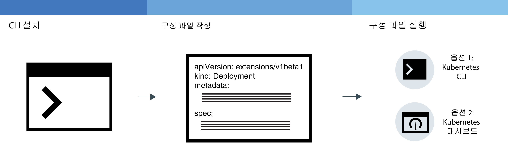
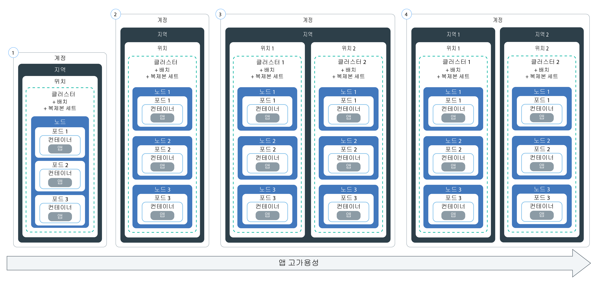

---

copyright:
  years: 2014, 2018
lastupdated: "2018-01-11"

---

{:new_window: target="_blank"}
{:shortdesc: .shortdesc}
{:screen: .screen}
{:pre: .pre}
{:table: .aria-labeledby="caption"}
{:codeblock: .codeblock}
{:tip: .tip}
{:download: .download}


# 클러스터에 앱 배치
{: #app}

Kubernetes 기술을 사용하여 앱을 배치하고 앱이 시작되어 실행 중인지 항상 확인할 수 있습니다. 예를 들어, 사용자를 위해 작동 중단 시간 없이 롤링 업데이트 및 롤백을 수행할 수 있습니다.
{:shortdesc}

다음 이미지의 영역을 클릭하여 앱을 배치하기 위한 일반 단계를 자세히 보십시오.


<map name="d62e18" id="d62e18">
<area href="cs_cli_install.html" target="_blank" alt="CLI를 설치하십시오." title="CLI를 설치하십시오." shape="rect" coords="30, 69, 179, 209" />
<area href="https://kubernetes.io/docs/concepts/configuration/overview/" target="_blank" alt="앱의 구성 파일을 작성하십시오. Kubernetes의 우수 사례를 검토하십시오." title="앱의 구성 파일을 작성하십시오. Kubernetes의 우수 사례를 검토하십시오." shape="rect" coords="254, 64, 486, 231" />
<area href="#app_cli" target="_blank" alt="옵션 1: Kubernetes CLI에서 구성 파일을 실행하십시오." title="옵션 1: Kubernetes CLI에서 구성 파일을 실행하십시오." shape="rect" coords="544, 67, 730, 124" />
<area href="#cli_dashboard" target="_blank" alt="옵션 2: Kubernetes 대시보드를 로컬로 시작하고 구성 파일을 실행하십시오." title="옵션 2: Kubernetes 대시보드를 로컬로 시작하고 구성 파일을 실행하십시오." shape="rect" coords="544, 141, 728, 204" />
</map>


<br />


## 배치 계획
{: #highly_available_apps}

다중 작업자 노드 및 클러스터에 보다 광범위하게 설정을 분배할수록 사용자가 앱에서 작동 중단을 겪을 가능성이 보다 줄어듭니다.
{:shortdesc}

가용성의 정도가 증가하는 순서로 정렬된 다음의 잠재적 앱 설정을 검토하십시오. 



1.  복제본 세트에 의해 관리되는 n+2 포드의 배치.
2.  복제본 세트에 의해 관리되며 같은 위치의 여러 노드 간에 전개된(연관관계 방지) n+2 포드의 배치.
3.  복제본 세트에 의해 관리되며 서로 다른 위치의 여러 노드 간에 전개된(연관관계 방지) n+2 포드의 배치.
4.  복제본 세트에 의해 관리되며 서로 다른 지역의 여러 노드 간에 전개된(연관관계 방지) n+2 포드의 배치.

앱의 가용성을 높이기 위한 기술에 대해 자세히 알아보십시오.

<dl>
<dt>배치 및 복제본 세트를 사용하여 앱과 해당 종속 항목 배치</dt>
<dd>배치는 앱과 해당 종속 항목의 모든 컴포넌트를 선언하는 데 사용할 수 있는 Kubernetes 리소스입니다. 모든 필수 단계와 이를 작성하는 순서를 기술하는 대신 단일 컴포넌트를 기술하여, 실행 시에 앱이 어떻게 표시되어야 하는지에 집중할 수 있습니다.
</br></br>
둘 이상의 포드를 배치하는 경우, 포드를 모니터하며 항상 원하는 수의 포드가 시작되고 실행되도록 보장하는 복제본 세트가 배치에 대해 자동으로 작성됩니다. 포드가 중단되는 경우, 복제본 세트는 응답하지 않는 포드를 새 포드로 대체합니다.
</br></br>
배치를 사용하면 롤링 업데이트 중에 추가할 포드의 수와 한 번에 사용 불가능한 포드의 수를 포함하여 앱에 대한 업데이트 전략을 정의할 수 있습니다. 롤링 업데이트를 수행할 때 배치는 개정이 작동 중인지 여부를 확인하며, 장애가 발견되면 롤아웃을 중지합니다.
</br></br>
배치는 서로 다른 플래그로 여러 개정을 동시에 배치하는 가능성도 제공합니다. 따라서 예를 들어, 프로덕션으로 푸시하기로 결정하기 전에 우선 배치를 테스트할 수 있습니다.
</br></br>
모든 배치는 배치된 개정을 계속해서 추적합니다. 업데이트가 예상대로 작동하지 않음을 발견할 때 개정의 이 히스토리를 사용하여 이전 버전으로 롤백할 수 있습니다.</dd>
<dt>앱의 워크로드를 위한 충분한 복제본과 두 개의 추가 복제본 포함</dt>
<dd>앱의 보다 높은 가용성과 장애에 대한 복원성을 더욱 높이려면, 예상된 워크로드를 처리할 수 있도록 최소량 이상의 추가 복제본을 포함할 것을 고려하십시오. 포드가 중단되었으며 복제본 세트가 아직 중단된 포드를 복구하지 않은 경우, 추가 복제본은 워크로드를 처리할 수 있습니다. 두 건의 장애가 동시에 발생하지 않도록 방지하려면, 두 개의 추가 복제본을 포함하십시오. 이 설정은 N+2 패턴입니다. 여기서 N은 수신 워크로드를 처리하기 위한 복제본의 수이며, +2는 두 개의 추가 복제본입니다. 클러스터에 충분한 영역이 있으면 원하는 만큼의 포드를 클러스터에 보유할 수 있습니다.</dd>
<dt>여러 노드 간에 포드 전개(연관관계 방지)</dt>
<dd>배치를 작성할 때 각 포드가 동일한 작업자 노드에 배치될 수 있습니다. 포드가 동일한 작업자 노드에 존재하는 이 설정을 연관관계 또는 코로케이션이라고 합니다. 작업자 노드 장애로부터 앱을 보호하기 위해, <strong>podAntiAffinity</strong> 옵션을 사용하여 여러 작업자 노드 간에 포드를 전개하도록 배치를 실행할 수 있습니다. 이 옵션은 표준 클러스터에만 사용 가능합니다.

</br></br>
<strong>참고:</strong> 다음의 YAML 파일은 모든 포드가 서로 다른 작업자 노드에 배치되도록 합니다. 클러스터에서 사용 가능한 작업자 노드보다 많은 추가 복제본이 정의된 경우에는 연관관계 방지 요구사항을 충족할 수 있는 수의 복제본만 배치됩니다. 추가 작업자 노드가 클러스터에 추가될 때까지 추가 복제본은 보류 상태를 유지합니다.

<pre class="codeblock">
<code>apiVersion: extensions/v1beta1
kind: Deployment
metadata:
name: wasliberty
spec:
        replicas: 3
template:
metadata:
labels:
app: wasliberty
spec:
      affinity:
        podAntiAffinity:
          preferredDuringSchedulingIgnoredDuringExecution:
          - weight: 100
            podAffinityTerm:
              labelSelector:
                matchExpressions:
                - key: app
                  operator: In
                  values:
                  - wasliberty
              topologyKey: kubernetes.io/hostname
      containers:
      - name: wasliberty
        image: registry.&lt;region&gt;.bluemix.net/ibmliberty
        ports:
        - containerPort: 9080
---
apiVersion: v1
kind: Service
metadata:
  name: wasliberty
  labels:
    app: wasliberty
spec:
  ports:
    # 서비스를 제공할 포트
  - port: 9080
  selector:
    app: wasliberty
  type: NodePort</code></pre>

</dd>
<dt>여러 위치 또는 지역 간에 포드 분배</dt>
<dd>위치 또는 지역 장애로부터 앱을 보호하기 위해 다른 위치 또는 지역에 두 번째 클러스터를 작성하고 배치 YAML을 사용하여 앱에 대한 중복 복제본 세트를 배치할 수 있습니다. 클러스터의 앞에 공유 라우트 및 로드 밸런서를 추가함으로써 위치 및 지역 간에 워크로드를 분배할 수 있습니다. 클러스터 간의 라우트 공유에 대한 자세한 정보는 <a href="cs_clusters.html#clusters" target="_blank">클러스터의 고가용성</a>을 참조하십시오.

자세한 정보는 <a href="cs_clusters.html#planning_clusters" target="_blank">고가용성 배치</a> 옵션을 검토하십시오.</dd>
</dl>


### 최소 앱 배치
{: #minimal_app_deployment}

라이트 또는 표준 클러스터의 기본 앱 배치에는 다음 컴포넌트가 포함될 수 있습니다.
{:shortdesc}


다이어그램에 표시된 대로 최소 앱을 위한 컴포넌트를 배치하려면 다음 예와 유사한 구성 파일을 사용합니다.
```
apiVersion: extensions/v1beta1
kind: Deployment
metadata:
  name: ibmliberty
spec:
  replicas: 1
  template:
    metadata:
      labels:
        app: ibmliberty
    spec:
      containers:
      - name: ibmliberty
        image: registry.<region>.bluemix.net/ibmliberty:latest
---
apiVersion: v1
kind: Service
metadata:
  name: ibmliberty-service
  labels:
    app: ibmliberty
spec:
  selector:
    run: ibmliberty
  type: NodePort
  ports:
   - protocol: TCP
     port: 9080
```
{: codeblock}

각 컴포넌트에 대해 자세히 보려면 [Kubernetes 기본](cs_tech.html#kubernetes_basics)을 검토하십시오.

<br />


## Kubernetes 대시보드 실행
{: #cli_dashboard}

로컬 시스템의 Kubernetes 대시보드를 열어서 클러스터 및 해당 작업자 노드에 대한 정보를 봅니다.
{:shortdesc}

시작하기 전에 클러스터를 [CLI의 대상으로 지정](cs_cli_install.html#cs_cli_configure)하십시오. 이 태스크에는 [관리자 액세스 정책](cs_users.html#access_policies)이 필요합니다. 현재 [액세스 정책](cs_users.html#infra_access)을 확인하십시오.

기본 포트를 사용하거나 자체 포트를 설정하여 클러스터에 대한 Kubernetes 대시보드를 실행할 수 있습니다.

1.  Kubernetes 마스터 버전 1.7.4 이하가 있는 클러스터의 경우:

    1.  기본 포트 번호로 프록시를 설정하십시오.

        ```
        kubectl proxy
        ```
        {: pre}

        출력:

        ```
        Starting to serve on 127.0.0.1:8001
        ```
        {: screen}

    2.  웹 브라우저에서 Kubernetes 대시보드를 여십시오.

        ```
        http://localhost:8001/ui
        ```
        {: codeblock}

2.  Kubernetes 마스터 버전 1.8.2 이상이 있는 클러스터의 경우:

    1.  Kubernetes 신임 정보를 가져오십시오.

        ```
        kubectl config view -o jsonpath='{.users[0].user.auth-provider.config.id-token}'
        ```
        {: pre}

    2.  출력에 표시되는 **id-token** 값을 복사하십시오. 

    3.  기본 포트 번호로 프록시를 설정하십시오.

        ```
        kubectl proxy
        ```
        {: pre}

        출력 예:

        ```
        Starting to serve on 127.0.0.1:8001
        ```
        {: screen}

    4.  대시보드에 로그인하십시오.

        1.  브라우저에서 다음 URL로 이동하십시오. 

            ```
            http://localhost:8001/api/v1/namespaces/kube-system/services/https:kubernetes-dashboard:/proxy/
            ```
            {: codeblock}

        2.  사인온 페이지에서 **토큰** 인증 방법을 선택하십시오. 

        3.  그런 다음 이전에 복사한 **id-token** 값을 **토큰** 필드에 붙여넣고 **로그인**을 클릭하십시오. 

[그런 다음 대시보드에서 구성 파일을 실행할 수 있습니다.](#app_ui)

Kubernetes 대시보드에서 작업이 완료되면 `CTRL+C`를 사용하여 `proxy` 명령을 종료하십시오. 종료한 후에는 Kubernetes 대시보드를 더 이상 사용할 수 없습니다. `proxy` 명령을 실행하여 Kubernetes 대시보드를 다시 시작하십시오.


<br />


## 시크릿 작성
{: #secrets}

Kubernetes 시크릿은 사용자 이름, 비밀번호 또는 키와 같은 기밀 정보를 저장하는 안전한 방법입니다.
{:shortdesc}

<table>
<caption>테이블. 태스크별로 시크릿에 저장해야 하는 파일</caption>
<thead>
<th>태스크</th>
<th>시크릿에 저장할 필수 파일</th>
</thead>
<tbody>
<tr>
<td>클러스터에 서비스 추가</td>
<td>없음. 클러스터에 서비스를 바인드할 때 시크릿이 작성됩니다.</td>
</tr>
<tr>
<td>선택사항: Ingress 시크릿을 사용하지 않는 경우 TLS가 포함된 Ingress 서비스를 구성하십시오. <p><b>참고</b>: TLS는 기본적으로 이미 사용 가능하며 시크릿도 TLS 연결을 위해 이미 작성되어 있습니다.

기본 TLS 시크릿을 보려면 다음을 수행하십시오.
<pre>
bx cs cluster-get &gt;CLUSTER-NAME&lt; | grep "Ingress secret"
</pre>
</p>
대신 고유 시크릿을 작성하려면 이 주제의 단계를 완료하십시오.</td>
<td>서버 인증서 및 키: <code>server.crt</code> 및 <code>server.key</code></td>
<tr>
<td>상호 인증 어노테이션을 작성하십시오.</td>
<td>CA 인증서: <code>ca.crt</code></td>
</tr>
</tbody>
</table>

시크릿에 저장할 수 있는 항목에 대한 자세한 정보는 [Kubernetes 문서](https://kubernetes.io/docs/concepts/configuration/secret/)를 참조하십시오.


인증서로 시크릿을 작성하려면 다음을 수행하십시오.

1. 인증 제공자로부터 인증 기관(CA) 인증서 및 키를 생성하십시오. 고유 도메인이 있는 경우 도메인의 공식적 TLS 인증서를 구매하십시오. 테스트용으로 자체 서명 인증서를 생성할 수 있습니다.

 중요: [CN](https://support.dnsimple.com/articles/what-is-common-name/)이 인증서마다 다른지 확인하십시오.

 클라이언트 인증서 및 클라이언트 키는 신뢰할 수 있는 루트 인증서(이 경우 CA 인증서)까지 확인해야 합니다. 예:

 ```
 Client Certificate: issued by Intermediate Certificate
 Intermediate Certificate: issued by Root Certificate
 Root Certificate: issued by itself
 ```
 {: codeblock}

2. 인증서를 Kubernetes 시크릿으로 작성하십시오.

   ```
 kubectl create secret generic <secretName> --from-file=<cert_file>=<cert_file>
   ```
   {: pre}

   예:
   - TLS 연결:

     ```
 kubectl create secret tls <secretName> --from-file=tls.crt=server.crt --from-file=tls.key=server.key
     ```
     {: pre}

   - 상호 인증 어노테이션:

     ```
 kubectl create secret generic <secretName> --from-file=ca.crt=ca.crt
     ```
     {: pre}

<br />


## GUI로 앱 배치
{: #app_ui}

Kubernetes 대시보드를 사용하여 클러스터에 앱을 배치하는 경우, 클러스터에서 포드를 작성하고 업데이트 및 관리하는 배치 리소스가 자동으로 작성됩니다.
{:shortdesc}

시작하기 전에:

-   필수 [CLI](cs_cli_install.html#cs_cli_install)를 설치하십시오.
-   클러스터를 [CLI의 대상으로 지정](cs_cli_install.html#cs_cli_configure)하십시오.

앱을 배치하려면 다음을 수행하십시오.

1.  [Kubernetes 대시보드를 여십시오](#cli_dashboard).
2.  Kubernetes 대시보드에서 **+ 작성**을 클릭하십시오.
3.  **아래의 앱 세부사항 지정**을 선택하여 GUI에서 앱 세부사항을 입력하거나, **YAML 또는 JSON 파일 업로드**를 선택하여 앱 [구성 파일 ](https://kubernetes.io/docs/tasks/inject-data-application/define-environment-variable-container/)을 업로드하십시오. 미국 남부 지역의 **ibmliberty** 이미지에서 컨테이너를 배포하려면 [이 예제 YAML 파일 ](https://github.com/IBM-Bluemix/kube-samples/blob/master/deploy-apps-clusters/deploy-ibmliberty.yaml)을 사용하십시오.
4.  Kubernetes 대시보드에서 **배치**를 클릭하여 배치가 작성되었는지 확인하십시오.
5.  노드 포트 서비스, 로드 밸런서 서비스 또는 Ingress를 사용하여 앱을 공용으로 사용 가능하게 한 경우 앱에 액세스할 수 있는지 확인하십시오.

<br />


## CLI로 앱 배치
{: #app_cli}

클러스터가 작성된 후에 Kubernetes CLI를 사용하여 해당 클러스터에 앱을 배치할 수 있습니다.
{:shortdesc}

시작하기 전에:

-   필수 [CLI](cs_cli_install.html#cs_cli_install)를 설치하십시오.
-   클러스터를 [CLI의 대상으로 지정](cs_cli_install.html#cs_cli_configure)하십시오.

앱을 배치하려면 다음을 수행하십시오.

1.  [Kubernetes 우수 사례 ](https://kubernetes.io/docs/concepts/configuration/overview/)를 기반으로 구성 파일을 작성하십시오. 일반적으로, 구성 파일에는 Kubernetes에서 작성 중인 각각의 리소스에 대한 구성 세부사항이 포함되어 있습니다. 스크립트에는 하나 이상의 다음 섹션이 포함될 수 있습니다.

    -   [배치 ](https://kubernetes.io/docs/concepts/workloads/controllers/deployment/): 포드와 복제본 세트 작성을 정의합니다. 포드에는 개별 컨테이너화된 앱이 포함되며, 복제본 세트는 포드의 다중 인스턴스를 제어합니다.

    -   [서비스 ](https://kubernetes.io/docs/concepts/services-networking/service/): 작업자 노드나 로드 밸런서 공인 IP 주소 또는 공용 Ingress 라우트를 사용하여 포드에 프론트 엔드 액세스를 제공합니다.

    -   [Ingress ](https://kubernetes.io/docs/concepts/services-networking/ingress/): 공개적으로 앱에 액세스하는 라우트를 제공하는 로드 밸런서 유형을 지정합니다.

2.  클러스터의 컨텍스트에서 구성 파일을 실행하십시오.

    ```
    kubectl apply -f deployment_script_location
    ```
    {: pre}

3.  노드 포트 서비스, 로드 밸런서 서비스 또는 Ingress를 사용하여 앱을 공용으로 사용 가능하게 한 경우 앱에 액세스할 수 있는지 확인하십시오.

<br />


## 앱 스케일링
{: #app_scaling}

애플리케이션에 대한 수요의 변경사항에 응답하고 필요 시에만 리소스를 사용하는 클라우드 애플리케이션을 배치하십시오. Auto-Scaling은 CPU를 기반으로 앱의 인스턴스 수를 자동으로 늘리거나 줄입니다.
{:shortdesc}

시작하기 전에 클러스터를 [CLI의 대상으로 지정](cs_cli_install.html#cs_cli_configure)하십시오.

**참고:** Cloud Foundry 애플리케이션 스케일링에 대한 정보를 찾으십니까? [{{site.data.keyword.Bluemix_notm}}에 대한 IBM Auto-Scaling](/docs/services/Auto-Scaling/index.html)을 확인하십시오.

Kubernetes에서는 [수평 포드 Auto-Scaling ](https://kubernetes.io/docs/reference/generated/kubectl/kubectl-commands#autoscale)을 사용하여 CPU를 기반으로 앱을 스케일링할 수 있습니다.

1.  CLI에서 클러스터에 앱을 배치하십시오. 앱을 배치할 때는 CPU를 요청해야 합니다.

    ```
    kubectl run <name> --image=<image> --requests=cpu=<cpu> --expose --port=<port_number>
    ```
    {: pre}

    <table>
    <thead>
    <th colspan=2> 이 명령의 컴포넌트 이해</th>
    </thead>
    <tbody>
    <tr>
    <td><code>--image</code></td>
    <td>배치하려는 애플리케이션입니다.</td>
    </tr>
    <tr>
    <td><code>--request=cpu</code></td>
    <td>컨테이너의 필수 CPU(밀리 코어 단위로 지정됨)입니다. 예: <code>--requests=200m</code>.</td>
    </tr>
    <tr>
    <td><code>--expose</code></td>
    <td>true인 경우, 외부 서비스를 작성합니다.</td>
    </tr>
    <tr>
    <td><code>--port</code></td>
    <td>외부에서 앱이 사용 가능한 포트입니다.</td>
    </tr></tbody></table>

    **참고:** 보다 복잡한 배치를 위해서는 [구성 파일](#app_cli)을 작성해야 할 수 있습니다.
2.  Horizontal Pod Autoscaler를 작성하고 정책을 정의하십시오. `kubectl autoscale` 명령으로 작업하는 방법에 대한 자세한 정보는 [Kubernetes 문서 ](https://kubernetes.io/docs/reference/generated/kubectl/kubectl-commands#autoscale)를 참조하십시오.

    ```
    kubectl autoscale deployment <deployment_name> --cpu-percent=<percentage> --min=<min_value> --max=<max_value>
    ```
    {: pre}

    <table>
    <thead>
    <th colspan=2> 이 명령의 컴포넌트 이해</th>
    </thead>
    <tbody>
    <tr>
    <td><code>--cpu-percent</code></td>
    <td>Horizontal Pod Autoscaler에서 유지하는 평균 CPU 사용률(백분율로 지정됨)입니다.</td>
    </tr>
    <tr>
    <td><code>--min</code></td>
    <td>지정된 CPU 사용 백분율을 유지하기 위해 사용되는 배치된 포드의 최소 수입니다.</td>
    </tr>
    <tr>
    <td><code>--max</code></td>
    <td>지정된 CPU 사용 백분율을 유지하기 위해 사용되는 배치된 포드의 최대 수입니다.</td>
    </tr>
    </tbody></table>


<br />


## 롤링 배치 관리
{: #app_rolling}

자동화되고 제어 가능한 방식으로 변경사항의 롤아웃을 관리할 수 있습니다. 롤아웃이 계획대로 진행되지 않으면 배치를 이전 개정으로 롤백할 수 있습니다.
{:shortdesc}

시작하기 전에 [배치](#app_cli)를 작성하십시오.

1.  변경사항을 [롤아웃 ](https://kubernetes.io/docs/reference/generated/kubectl/kubectl-commands#rollout)하십시오. 예를 들어, 초기 배치에 사용된 이미지를 변경할 수 있습니다.

    1.  배치 이름을 가져오십시오.

        ```
         kubectl get deployments
        ```
        {: pre}

    2.  포드 이름을 가져오십시오.

        ```
            kubectl get pods
        ```
        {: pre}

    3.  포드에서 실행 중인 컨테이너의 이름을 가져오십시오.

        ```
        kubectl describe pod <pod_name>
        ```
        {: pre}

    4.  사용할 배치에 대해 새 이미지를 설정하십시오.

        ```
        kubectl set image deployment/<deployment_name><container_name>=<image_name>
        ```
        {: pre}

    명령을 실행하면 변경사항이 즉시 적용되며 롤아웃 히스토리에 로깅됩니다.

2.  배치의 상태를 확인하십시오.

    ```
    kubectl rollout status deployments/<deployment_name>
    ```
    {: pre}

3.  변경사항을 롤백하십시오.
    1.  배치의 롤아웃 히스토리를 보고 마지막 배치의 개정 번호를 식별하십시오.

        ```
        kubectl rollout history deployment/<deployment_name>
        ```
        {: pre}

        **팁:** 특정 개정에 대한 세부사항을 보려면 개정 번호를 포함하십시오.

        ```
        kubectl rollout history deployment/<deployment_name> --revision=<number>
        ```
        {: pre}

    2.  이전 버전으로 롤백하거나 개정을 지정하십시오. 이전 버전으로 롤백하려면 다음 명령을 사용하십시오.

        ```
        kubectl rollout undo deployment/<depoyment_name> --to-revision=<number>
        ```
        {: pre}

<br />

