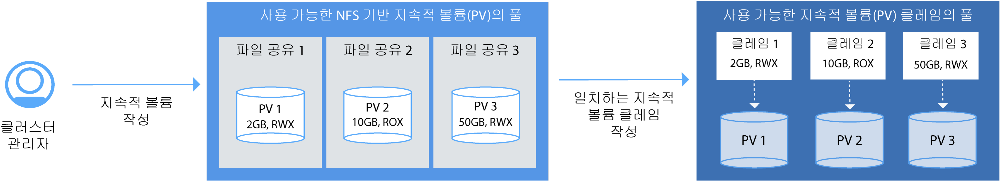

---

copyright:
  years: 2014, 2017
lastupdated: "2017-08-21"

---

{:new_window: target="_blank"}
{:shortdesc: .shortdesc}
{:screen: .screen}
{:pre: .pre}
{:codeblock: .codeblock}
{:table: .aria-labeledby="caption"}
{:codeblock: .codeblock}
{:tip: .tip} 
{:download: .download}


# 클러스터 설정
{: #cs_cluster}

최대 가용성 및 용량을 위한 클러스터 설정을 설계합니다. {:shortdesc}

시작하기 전에 [고가용성 클러스터 구성](cs_planning.html#cs_planning_cluster_config)에 대한 옵션을 검토하십시오. 

](https://console.bluemix.net/docs/api/content/containers/images/cs_cluster_ha_roadmap.png)

## GUI에서 클러스터 작성
{: #cs_cluster_ui}

Kubernetes 클러스터는 네트워크로 구성된 작업자 노드의 세트입니다. 클러스터의 용도는 애플리케이션의 고가용성을 유지시키는 리소스, 노드, 네트워크 및 스토리지 디바이스의 세트를 정의하는 것입니다. 앱을 배치하려면 우선 클러스터를 작성하고 해당 클러스터에서 작업자 노드에 대한 정의를 설정해야 합니다. {:shortdesc}

{{site.data.keyword.Bluemix_notm}} 데디케이티드 사용자의 경우 [{{site.data.keyword.Bluemix_notm}} 데디케이티드(비공개 베타)의 GUI에서 Kubernetes 클러스터 작성](#creating_cli_dedicated)을 대신 참조하십시오.

클러스터를 작성하려면 다음을 수행하십시오. 
1.  카탈로그에서 **컨테이너**를 선택하고 **Kubernetes 클러스터**를 클릭하십시오. 

2.  **클러스터 유형**으로 **표준**을 선택하십시오. 표준 클러스터에서는 고가용성 환경을 위한 다중 작업자 노드와 같은 기능이 제공됩니다. 
3.  **클러스터 이름**을 입력하십시오. 
4.  작업자 노드에서 사용할 **Kubernetes 버전**을 선택하십시오.  
5.  클러스터가 배치될 {{site.data.keyword.Bluemix_notm}} **위치**를 선택하십시오. 사용 가능한 위치는 사용자가 로그인한 {{site.data.keyword.Bluemix_notm}} 지역에 따라 다릅니다. 
최고의 성능을 위해서는 실제로 사용자와 가장 가까운 지역을 선택하십시오.
자국 외에 있는 위치를 선택하는 경우에는
외국에서 데이터를 물리적으로 저장하기 전에 법적 인가를 받아야 할 수 있음을 유념하십시오. 
{{site.data.keyword.Bluemix_notm}} 지역은 사용 가능한 컨테이너 레지스트리와
사용 가능한 {{site.data.keyword.Bluemix_notm}} 서비스를 결정합니다.

6.  **시스템 유형**을 선택하십시오. 시스템 유형은 각 작업자 노드에서 설정되었으며 노드에 배치된 모든 컨테이너가 사용할 수 있는 가상 CPU 및 메모리의 양을 정의합니다. 
    -   마이크로 머신 유형은 최소 옵션을 표시합니다. 
    -   밸런스 머신 유형에는 각 CPU에 지정된 것과 동일한 양의 메모리가 있으며, 이는 성능을 최적화합니다. 
7.  필요한 **작업자 노드의 수**를 선택하십시오. 클러스터의 고가용성을 위해 3을 선택하십시오. 
8.  {{site.data.keyword.BluSoftlayer_full}} 계정에서 **프라이빗 VLAN**을 선택하십시오. 프라이빗 VLAN은 작업자 노드 간의 통신에 사용됩니다. 다중 클러스터에 대해 동일한 프라이빗 VLAN을 사용할 수 있습니다. 
9. {{site.data.keyword.BluSoftlayer_notm}} 계정에서 **퍼블릭 VLAN**을 선택하십시오. 퍼블릭 VLAN은 작업자 노드 및 IBM이 관리하는 Kubernetes 마스터 간의 통신에 사용됩니다. 
다중 클러스터에 대해 동일한 퍼블릭 VLAN을 사용할 수 있습니다. 퍼블릭 VLAN 을 선택하지 않도록 결정한 경우에는 대체 솔루션을 구성해야 합니다. 
10. **하드웨어**에 대해 **전용** 또는 **공유**를 선택하십시오. 대부분의 경우에는 **공유** 옵션으로도 충분합니다. 
    -   **전용**: 기타 IBM 고객으로부터 실제 리소스의 완전한 격리를 보장합니다. 
    -   **공유**: IBM이 실제 리소스를 기타 IBM 고객과 동일한 하드웨어에 저장하도록 허용합니다. 
11. **클러스터 작성**을 클릭하십시오.클러스터에 대한 세부사항이 열리지만, 클러스터의 작업자 노드를 프로비저닝하는 데 수 분이 걸립니다. **작업자 노드** 탭에서
작업자 노드 배치의 진행상태를 볼 수 있습니다. 작업자 노드가 준비되면 상태가 **준비**로 변경됩니다. 

    **참고:** 모든 작업자 노드에는 클러스터가 작성된 이후 수동으로 변경될 수 없는 고유 작업자 노드 ID 및 도메인 이름이 지정됩니다. 
ID 또는 도메인 이름을 변경하면 Kubernetes 마스터가 클러스터를 관리할 수 없습니다. 


**다음 단계: **

클러스터가 시작되어 실행 중인 경우에는 다음 태스크를 수행할 수 있습니다. 

-   [클러스터 관련 작업을 시작하도록 CLI 설치.](cs_cli_install.html#cs_cli_install)
-   [클러스터에 앱을 배치하십시오. ](cs_apps.html#cs_apps_cli)
-   [Docker 이미지를 저장하고 다른 사용자들과 공유하도록 {{site.data.keyword.Bluemix_notm}}에서 개인용 레지스트리를 설정하십시오.](/docs/services/Registry/index.html)

### {{site.data.keyword.Bluemix_notm}} 데디케이티드(비공개 베타)의 GUI로 클러스터 작성
{: #creating_ui_dedicated}

1.  IBM ID로 {{site.data.keyword.Bluemix_notm}} 퍼블릭 콘솔([https://console.bluemix.net ](https://console.bluemix.net))에 로그인하십시오. 
2.  계정 메뉴에서 {{site.data.keyword.Bluemix_notm}} 데디케이티드 계정을 선택하십시오. 콘솔이 {{site.data.keyword.Bluemix_notm}} 데디케이티드 인스턴스에 대한 서비스와 정보로 업데이트됩니다. 
3.  카탈로그에서 **컨테이너**를 선택하고 **Kubernetes 클러스터**를 클릭하십시오. 
4.  **클러스터 이름**을 입력하십시오. 
5.  작업자 노드에서 사용할 **Kubernetes 버전**을 선택하십시오.  
6.  **시스템 유형**을 선택하십시오. 시스템 유형은 각 작업자 노드에서 설정되었으며 노드에 배치된 모든 컨테이너가 사용할 수 있는 가상 CPU 및 메모리의 양을 정의합니다. 
    -   마이크로 머신 유형은 최소 옵션을 표시합니다. 
    -   밸런스 머신 유형에는 각 CPU에 지정된 것과 동일한 양의 메모리가 있으며, 이는 성능을 최적화합니다. 
7.  필요한 **작업자 노드의 수**를 선택하십시오. 클러스터의 고가용성을 보장하려면 3을 선택하십시오. 
8.  **클러스터 작성**을 클릭하십시오.클러스터에 대한 세부사항이 열리지만, 클러스터의 작업자 노드를 프로비저닝하는 데 수 분이 걸립니다. **작업자 노드** 탭에서
작업자 노드 배치의 진행상태를 볼 수 있습니다. 작업자 노드가 준비되면 상태가 **준비**로 변경됩니다. 

**다음 단계: **

클러스터가 시작되어 실행 중인 경우에는 다음 태스크를 수행할 수 있습니다. 

-   [클러스터 관련 작업을 시작하도록 CLI 설치.](cs_cli_install.html#cs_cli_install)
-   [클러스터에 앱을 배치하십시오. ](cs_apps.html#cs_apps_cli)
-   [Docker 이미지를 저장하고 다른 사용자들과 공유하도록 {{site.data.keyword.Bluemix_notm}}에서 개인용 레지스트리를 설정하십시오.](/docs/services/Registry/index.html)

## CLI에서 클러스터 작성
{: #cs_cluster_cli}

클러스터는 네트워크로 구성된 작업자 노드의 세트입니다. 클러스터의 용도는 애플리케이션의 고가용성을 유지시키는 리소스, 노드, 네트워크 및 스토리지 디바이스의 세트를 정의하는 것입니다. 앱을 배치하려면 우선 클러스터를 작성하고 해당 클러스터에서 작업자 노드에 대한 정의를 설정해야 합니다. {:shortdesc}

{{site.data.keyword.Bluemix_notm}} 데디케이티드 사용자의 경우 [{{site.data.keyword.Bluemix_notm}} 데디케이티드(비공개 베타)의 CLI에서 Kubernetes 클러스터 작성](#creating_cli_dedicated)을 대신 참조하십시오.

클러스터를 작성하려면 다음을 수행하십시오. 
1.  {{site.data.keyword.Bluemix_notm}} CLI 및 [{{site.data.keyword.containershort_notm}} 플러그인](cs_cli_install.html#cs_cli_install)을 설치하십시오.
2.  {{site.data.keyword.Bluemix_notm}} CLI에 로그인하십시오.프롬프트가 표시되면
{{site.data.keyword.Bluemix_notm}} 신임 정보를 입력하십시오. 

    ```
     bx login
    ```
    {: pre}

      특정 {{site.data.keyword.Bluemix_notm}} 지역을 지정하려면 API 엔드포인트를 포함하십시오. 특정 {{site.data.keyword.Bluemix_notm}} 지역의 컨테이너 레지스트리에 저장된 개인용 Docker 이미지가 있거나 사전 작성된 {{site.data.keyword.Bluemix_notm}} 서비스 인스턴스가 있는 경우에는 다음 지역에 로그인하여 이미지와 {{site.data.keyword.Bluemix_notm}} 서비스에 액세스할 수 있습니다.


      로그인하는 {{site.data.keyword.Bluemix_notm}} 지역에 따라 사용 가능한 데이터 센터를 포함하여 Kubernetes 클러스터를 작성할 수 있는 지역도 결정됩니다. 지역을 지정하지 않으면 가장 근접한 지역에 자동으로 로그인됩니다.

       -  미국 남부

           ```
            bx login -a api.ng.bluemix.net
           ```
           {: pre}
     
       -  시드니

           ```
           bx login -a api.au-syd.bluemix.net
           ```
           {: pre}

       -  독일

           ```
           bx login -a api.eu-de.bluemix.net
           ```
           {: pre}

       -  영국

           ```
           bx login -a api.eu-gb.bluemix.net
           ```
           {: pre}

      **참고:** 연합 ID가 있는 경우 `bx login --sso`를 사용하여 {{site.data.keyword.Bluemix_notm}} CLI에 로그인하십시오. 사용자 이름을 입력하고 CLI 출력에서 제공된 URL을 사용하여 일회성 패스코드를 검색하십시오. `--sso`가 없으면 로그인에 실패하고 `--sso` 옵션을 사용하면 성공하는 경우에는 연합 ID를 보유 중임을 알 수 있습니다. 

3.  여러 {{site.data.keyword.Bluemix_notm}} 계정, 조직 및 영역에 지정된 경우에는 Kubernetes 클러스터가 작성될 계정을 선택하십시오. 클러스터는 계정 및 조직에 특정하지만, {{site.data.keyword.Bluemix_notm}} 영역과는 독립적입니다. 따라서 조직의 여러 영역에 액세스할 수 있으면 목록에서 임의의 영역을 선택할 수 있습니다.
4.  선택사항: 이전에 선택한 {{site.data.keyword.Bluemix_notm}} 지역 이외의 지역에 Kubernetes 클러스터를 작성하거나 액세스하려는 경우 이 지역을 지정하십시오. 예를 들어, 다음과 같은 이유로 다른 {{site.data.keyword.containershort_notm}} 지역에 로그인할 수 있습니다.

    -   한 지역에 {{site.data.keyword.Bluemix_notm}} 서비스 또는 사설 Docker를 작성한 후 다른 지역의 {{site.data.keyword.containershort_notm}}에서 사용하려고 합니다.
    -   사용자가 로그인한 기본 {{site.data.keyword.Bluemix_notm}} 지역과 다른 지역에 있는 클러스터에 액세스하려고 합니다.
    
    다음 API 엔드포인트 중에서 선택하십시오.

    -   미국 남부:

        ```
         bx cs init --host https://us-south.containers.bluemix.net
        ```
        {: pre}

    -   영국 남쪽:

    

        ```
        bx cs init --host https://uk-south.containers.bluemix.net
        ```
        {: pre}

    -   중앙 유럽:

        ```
        bx cs init --host https://eu-central.containers.bluemix.net
        ```
        {: pre}

    -   AP 남부:

        ```
          bx cs init --host https://ap-south.containers.bluemix.net
          ```
        {: pre}
    
6.  클러스터를 작성하십시오.
    1.  사용 가능한 위치를 검토하십시오. 표시되는 위치는 로그인한 {{site.data.keyword.containershort_notm}} 지역에 따라 다릅니다. 

        ```
        bx cs locations
        ```
        {: pre}

        CLI 출력이 다음과 유사하게 나타납니다. 

        -   미국 남부:

            ```
            dal10
            dal12
            ```
            {: screen}

        -   영국 남쪽:

            ```
            lon02
            lon04
            ```
            {: screen}

        -   중앙 유럽:

            ```
            ams03
            fra02
            ```
            {: screen}

        -   AP 남부

            ```
            syd01
            syd02
            ```
            {: screen}

    2.  위치를 선택하고 그 위치에서 사용할 수 있는 시스템 유형을 검토하십시오. 시스템 유형은 각 작업자 노드가 사용할 수 있는 가상 컴퓨팅 리소스를 지정합니다. 

        ```
        bx cs machine-types <location>
        ```
        {: pre}

        ```
        Getting machine types list...
        OK
        Machine Types
        Name         Cores   Memory   Network Speed   OS             Storage   Server Type   
        u1c.2x4      2       4GB      1000Mbps        UBUNTU_16_64   100GB     virtual   
        b1c.4x16     4       16GB     1000Mbps        UBUNTU_16_64   100GB     virtual   
        b1c.16x64    16      64GB     1000Mbps        UBUNTU_16_64   100GB     virtual   
        b1c.32x128   32      128GB    1000Mbps        UBUNTU_16_64   100GB     virtual   
        b1c.56x242   56      242GB    1000Mbps        UBUNTU_16_64   100GB     virtual 
        ```
        {: screen}

    3.  퍼블릭 및 프라이빗 VLAN이 이 계정에 대한 {{site.data.keyword.BluSoftlayer_notm}}에 이미 존재하는지 확인하십시오. 

        ```
        bx cs vlans <location>
        ```
        {: pre}

        ```
        ID        Name                Number   Type      Router  
        1519999   vlan   1355     private   bcr02a.dal10  
        1519898   vlan   1357     private   bcr02a.dal10 
        1518787   vlan   1252     public   fcr02a.dal10 
        1518888   vlan   1254     public    fcr02a.dal10 
        ```
        {: screen}

        퍼블릭 및 프라이빗 VLAN이 이미 존재하는 경우 일치하는 라우터를 기록해 놓으십시오. 프라이빗 VLAN 라우터는 항상 `bcr`(벡엔드 라우터)로 시작하고 퍼블릭 VLAN 라우터는 항상 `fcr`(프론트 엔드 라우터)로 시작합니다. 클러스터 작성 시 해당 VLAN을 사용하려면 해당 접두부 뒤의 숫자와 문자 조합이 일치해야 합니다. 출력 예에서는 라우터가 모두 `02a.dal10`을 포함하고 있기 때문에 프라이빗 VLAN이 퍼블릭 VLAN과 함께 사용될 수 있습니다. 

    4.  `cluster-create` 명령을 실행하십시오. 2vCPU 및 4GB 메모리로 설정된 하나의 작업자 노드를 포함하는 라이트 클러스터와 {{site.data.keyword.BluSoftlayer_notm}} 계정에서 선택한 수만큼 많은 작업자 노드를 포함할 수 있는 표준 클러스터 중에 선택할 수 있습니다. 표준 클러스터를 작성하는 경우, 기본적으로 작업자 노드의 하드웨어는 여러 IBM 고객에 의해 공유되며 사용 시간을 기준으로 비용이 청구됩니다. </b>표준 클러스터의 예: 

        ```
        bx cs cluster-create --location dal10; --public-vlan <public_vlan_id> --private-vlan <private_vlan_id> --machine-type u1c.2x4 --workers 3 --name <cluster_name>
        ```
        {: pre}

        라이트 클러스터의 예:

        ```
        bx cs cluster-create --name my_cluster
        ```
        {: pre}

        <table>
        <caption>표 1. 이 명령의 컴포넌트 이해</caption>
        <thead>
        <th colspan=2> 이 명령의 컴포넌트 이해</th>
        </thead>
        <tbody>
        <tr>
        <td><code>cluster-create</code></td>
        <td>{{site.data.keyword.Bluemix_notm}} 조직에 클러스터를 작성하는 명령입니다.</td> 
        </tr>
        <tr>
        <td><code>--location <em>&lt;location&gt;</em></code></td>
        <td><em>&lt;location&gt;</em>을 클러스터를 작성하려는 {{site.data.keyword.Bluemix_notm}} 위치 ID로대체하십시오. 사용 가능한 위치는 사용자가 로그인한 {{site.data.keyword.containershort_notm}} 지역에 따라 다릅니다. 사용 가능한 위치는 다음과 같습니다. <ul><li>미국 남부<ul><li>dal10 [댈러스]</li><li>dal12 [댈러스]</li></ul></li><li>영국 남부<ul><li>lon02 [런던]</li><li>lon04 [런던]</li></ul></li><li>중앙 유럽<ul><li>ams03 [암스테르담]</li><li>ra02 [프랑크푸르트]</li></ul></li><li>AP 남부<ul><li>syd01 [시드니]</li><li>syd04 [시드니]</li></ul></li></ul></td> 
        </tr>
        <tr>
        <td><code>--machine-type <em>&lt;machine_type&gt;</em></code></td>
        <td>표준 클러스터를 작성 중인 경우 시스템 유형을 선택하십시오. 시스템 유형은 각 작업자 노드가 사용할 수 있는 가상 컴퓨팅 리소스를 지정합니다. 자세한 정보는 [{{site.data.keyword.containershort_notm}}의 라이트 및 표준 클러스터 비교](cs_planning.html#cs_planning_cluster_type)를 검토하십시오. 라이트 클러스터의 경우에는 시스템 유형을 정의할 필요가 없습니다. </td> 
        </tr>
        <tr>
        <td><code>--public-vlan <em>&lt;public_vlan_id&gt;</em></code></td>
        <td><ul><li>라이트 클러스터의 경우, 퍼블릭 VLAN을 정의할 필요가 없습니다. 라이트 클러스터는 IBM이 소유하고 있는 퍼블릭 VLAN에 자동으로 연결됩니다. </li><li>표준 클러스터의 경우, 그 위치에 대한 {{site.data.keyword.BluSoftlayer_notm}} 계정에 퍼블릭 VLAN이 이미 있으면 그 퍼블릭 VLAN의 ID를 입력하십시오. 그렇지 않으면, {{site.data.keyword.containershort_notm}}가 사용자를 위해 자동으로 퍼블릭 VLAN을 작성하므로 이 옵션을 지정할 필요가 없습니다. <br/><br/><strong>참고</strong>: create 명령으로 지정하는 퍼블릭 및 프라이빗 VLAN은 일치해야 합니다. 프라이빗 VLAN 라우터는 항상 <code>bcr</code>(벡엔드 라우터)로 시작하고 퍼블릭 VLAN 라우터는 항상 <code>fcr</code>(프론트 엔드 라우터)로 시작합니다. 클러스터 작성 시 해당 VLAN을 사용하려면 해당 접두부 뒤의 숫자와 문자 조합이 일치해야 합니다. 클러스터를 작성하기 위해 일치하지 않는 퍼블릭 및 프라이빗 VLAN을 사용하지 마십시오. </li></ul></td> 
        </tr>
        <tr>
        <td><code>--private-vlan <em>&lt;private_vlan_id&gt;</em></code></td>
        <td><ul><li>라이트 클러스터의 경우, 프라이빗 VLAN을 정의할 필요가 없습니다. 라이트 클러스터는 IBM이 소유하고 있는 프라이빗 VLAN에 자동으로 연결됩니다. </li><li>표준 클러스터의 경우, 그 위치에 대한 {{site.data.keyword.BluSoftlayer_notm}} 계정에 프라이빗 VLAN이 이미 있으면 그 프라이빗 VLAN의 ID를 입력하십시오. 그렇지 않으면, {{site.data.keyword.containershort_notm}}가 사용자를 위해 자동으로 프라이빗 VLAN을 작성하므로 이 옵션을 지정할 필요가 없습니다. <br/><br/><strong>참고</strong>: create 명령으로 지정하는 퍼블릭 및 프라이빗 VLAN은 일치해야 합니다. 프라이빗 VLAN 라우터는 항상 <code>bcr</code>(벡엔드 라우터)로 시작하고 퍼블릭 VLAN 라우터는 항상 <code>fcr</code>(프론트 엔드 라우터)로 시작합니다. 클러스터 작성 시 해당 VLAN을 사용하려면 해당 접두부 뒤의 숫자와 문자 조합이 일치해야 합니다. 클러스터를 작성하기 위해 일치하지 않는 퍼블릭 및 프라이빗 VLAN을 사용하지 마십시오. </li></ul></td> 
        </tr>
        <tr>
        <td><code>--name <em>&lt;name&gt;</em></code></td>
        <td><em>&lt;name&gt;</em>을 클러스터의 이름으로 바꾸십시오. </td> 
        </tr>
        <tr>
        <td><code>--workers <em>&lt;number&gt;</em></code></td>
        <td>클러스터에 포함할 작업자 노드의 수입니다. <code>--workers</code> 옵션이 지정되지 않은 경우 1개의 작업자 노드가 작성됩니다. </td> 
        </tr>
        </tbody></table>

7.  클러스터 작성이 요청되었는지 확인하십시오.

    ```
     bx cs clusters
    ```
    {: pre}

    **참고:** 작업자 노드 시스템을 정렬하고, 클러스터를 설정하고 계정에 프로비저닝하는 데 최대 15분이 소요될 수 있습니다. 

    클러스터의 프로비저닝이 완료되면 클러스터의 상태가 **deployed**로 변경됩니다. 

    ```
    Name         ID                                   State      Created          Workers   
    my_cluster   paf97e8843e29941b49c598f516de72101   deployed   20170201162433   1   
    ```
    {: screen}

8.  작업자 노드의 상태를 확인하십시오. 

    ```
    bx cs workers <cluster>
    ```
    {: pre}

    작업자 노드가 준비되면 상태(state)가 **정상**으로 변경되며, 상태(status)는 **준비**입니다. 노드 상태(status)가 **준비**인 경우에는 클러스터에 액세스할 수 있습니다. 

    **참고:** 모든 작업자 노드에는 클러스터가 작성된 이후 수동으로 변경될 수 없는 고유 작업자 노드 ID 및 도메인 이름이 지정됩니다. ID 또는 도메인 이름을 변경하면 Kubernetes 마스터가 클러스터를 관리할 수 없습니다. 

    ```
    ID                                                  Public IP        Private IP     Machine Type   State      Status  
    prod-dal10-pa8dfcc5223804439c87489886dbbc9c07-w1   169.47.223.113   10.171.42.93   free           normal    Ready
    ```
    {: screen}

9. 작성한 클러스터를 이 세션에 대한 컨텍스트로 설정하십시오. 클러스터 관련 작업을 수행할 때마다 다음 구성 단계를 완료하십시오. 
    1.  환경 변수를 설정하기 위한 명령을 가져오고 Kubernetes 구성 파일을 다운로드하십시오. 

        ```
        bx cs cluster-config <cluster_name_or_id>
        ```
        {: pre}

        구성 파일 다운로드가 완료되면 환경 변수로서 경로를 로컬 Kubernetes 구성 파일로 설정하는 데 사용할 수 있는 명령이 표시됩니다. 

        OS X에 대한 예:

        ```
         export KUBECONFIG=/Users/<user_name>/.bluemix/plugins/container-service/clusters/<cluster_name>/kube-config-prod-dal10-<cluster_name>.yml
        ```
        {: screen}

    2.  `KUBECONFIG` 환경 변수를 설정하려면 터미널에 표시되는 명령을 복사하고 붙여넣기하십시오. 
    3.  `KUBECONFIG` 환경 변수가 올바르게 설정되었는지 확인하십시오. 

        OS X에 대한 예:

        ```
        echo $KUBECONFIG
        ```
        {: pre}

        출력:

        ```
        /Users/<user_name>/.bluemix/plugins/container-service/clusters/<cluster_name>/kube-config-prod-dal10-<cluster_name>.yml
        ```
        {: screen}

10. 기본 포트 8001로 Kubernetes 대시보드를 실행하십시오. 
    1.  기본 포트 번호로 프록시를 설정하십시오. 

        ```
        kubectl proxy
        ```
        {: pre}

        ```
        Starting to serve on 127.0.0.1:8001
        ```
        {: screen}

    2.  웹 브라우저에서 다음 URL을 열어서 Kubernetes 대시보드를 보십시오. 

        ```
        http://localhost:8001/ui
        ```
        {: codeblock}


**다음 단계: **

-   [클러스터에 앱을 배치하십시오. ](cs_apps.html#cs_apps_cli)
-   [`kubectl` 명령행을 사용하여 클러스터를 관리하십시오. ](https://kubernetes.io/docs/user-guide/kubectl/)
-   [Docker 이미지를 저장하고 다른 사용자들과 공유하도록 {{site.data.keyword.Bluemix_notm}}에서 개인용 레지스트리를 설정하십시오.](/docs/services/Registry/index.html)

### {{site.data.keyword.Bluemix_notm}} 데디케이티드(비공개 베타)의 CLI로 클러스터 작성
{: #creating_cli_dedicated}

1.  {{site.data.keyword.Bluemix_notm}} CLI 및 [{{site.data.keyword.containershort_notm}} 플러그인](cs_cli_install.html#cs_cli_install)을 설치하십시오.
2.  {{site.data.keyword.containershort_notm}}의 공용 엔드포인트에 로그인하십시오. {{site.data.keyword.Bluemix_notm}} 신임 정보를 입력하고, 프롬프트가 표시되면 {{site.data.keyword.Bluemix_notm}} 데디케이티드 계정을 선택하십시오. 

    ```
    bx login -a api.<region>.bluemix.net
    ```
    {: pre}

    **참고:** 연합 ID가 있는 경우 `bx login --sso`를 사용하여 {{site.data.keyword.Bluemix_notm}} CLI에 로그인하십시오. 사용자 이름을 입력하고 CLI 출력에서 제공된 URL을 사용하여 일회성 패스코드를 검색하십시오. `--sso`가 없으면 로그인에 실패하고 `--sso` 옵션을 사용하면 성공하는 경우에는 연합 ID를 보유 중임을 알 수 있습니다. 

3.  `cluster-create` 명령을 사용하여 클러스터를 작성하십시오. 표준 클러스터를 작성하는 경우, 작업자 노드의 하드웨어는 사용 시간을 기준으로 비용이 청구됩니다. 

    예

    ```
    bx cs cluster-create --machine-type <machine-type> --workers <number> --name <cluster_name>
    ```
    {: pre}
    
    <table>
    <caption>표 2. 이 명령의 컴포넌트 이해</caption>
    <thead>
    <th colspan=2> 이 명령의 컴포넌트 이해</th>
    </thead>
    <tbody>
    <tr>
    <td><code>cluster-create</code></td>
    <td>{{site.data.keyword.Bluemix_notm}} 조직에 클러스터를 작성하는 명령입니다.</td> 
    </tr>
    <tr>
    <td><code>--location <em>&lt;location&gt;</em></code></td>
    <td>&lt;location&gt;을 클러스터를 작성하려는 {{site.data.keyword.Bluemix_notm}} 위치 ID로 대체하십시오. 사용 가능한 위치는 사용자가 로그인한 {{site.data.keyword.containershort_notm}} 지역에 따라 다릅니다. 사용 가능한 위치는 다음과 같습니다. <ul><li>미국 남부<ul><li>dal10 [댈러스]</li><li>dal12 [댈러스]</li></ul></li><li>영국 남부<ul><li>lon02 [런던]</li><li>lon04 [런던]</li></ul></li><li>중앙 유럽<ul><li>ams03 [암스테르담]</li><li>ra02 [프랑크푸르트]</li></ul></li><li>AP 남부<ul><li>syd01 [시드니]</li><li>syd04 [시드니]</li></ul></li></ul></td> 
    </tr>
    <tr>
    <td><code>--machine-type <em>&lt;machine_type&gt;</em></code></td>
    <td>표준 클러스터를 작성 중인 경우 시스템 유형을 선택하십시오. 시스템 유형은 각 작업자 노드가 사용할 수 있는 가상 컴퓨팅 리소스를 지정합니다. 자세한 정보는 [{{site.data.keyword.containershort_notm}}의 라이트 및 표준 클러스터 비교](cs_planning.html#cs_planning_cluster_type)를 검토하십시오. 라이트 클러스터의 경우에는 시스템 유형을 정의할 필요가 없습니다. </td> 
    </tr>
    <tr>
    <td><code>--name <em>&lt;name&gt;</em></code></td>
    <td><em>&lt;name&gt;</em>을 클러스터의 이름으로 바꾸십시오. </td> 
    </tr>
    <tr>
    <td><code>--workers <em>&lt;number&gt;</em></code></td>
    <td>클러스터에 포함할 작업자 노드의 수입니다. <code>--workers</code> 옵션이 지정되지 않은 경우 1개의 작업자 노드가 작성됩니다. </td> 
    </tr>
    </tbody></table>

4.  클러스터 작성이 요청되었는지 확인하십시오.

    ```
     bx cs clusters
    ```
    {: pre}

    **참고:** 작업자 노드 시스템을 정렬하고, 클러스터를 설정하고 계정에 프로비저닝하는 데 최대 15분이 소요될 수 있습니다. 

    클러스터의 프로비저닝이 완료되면 클러스터의 상태가 **deployed**로 변경됩니다. 

    ```
    Name         ID                                   State      Created          Workers   
    my_cluster   paf97e8843e29941b49c598f516de72101   deployed   20170201162433   1   
    ```
    {: screen}

5.  작업자 노드의 상태를 확인하십시오. 

    ```
    bx cs workers <cluster>
    ```
    {: pre}

    작업자 노드가 준비되면 상태(state)가 **정상**으로 변경되며, 상태(status)는 **준비**입니다. 노드 상태(status)가 **준비**인 경우에는 클러스터에 액세스할 수 있습니다. 

    ```
    ID                                                  Public IP        Private IP     Machine Type   State      Status  
    prod-dal10-pa8dfcc5223804439c87489886dbbc9c07-w1   169.47.223.113   10.171.42.93   free           normal    Ready
    ```
    {: screen}

6.  작성한 클러스터를 이 세션에 대한 컨텍스트로 설정하십시오. 클러스터 관련 작업을 수행할 때마다 다음 구성 단계를 완료하십시오. 

    1.  환경 변수를 설정하기 위한 명령을 가져오고 Kubernetes 구성 파일을 다운로드하십시오. 

        ```
        bx cs cluster-config <cluster_name_or_id>
        ```
        {: pre}

        구성 파일 다운로드가 완료되면 환경 변수로서 경로를 로컬 Kubernetes 구성 파일로 설정하는 데 사용할 수 있는 명령이 표시됩니다. 

        OS X에 대한 예:

        ```
         export KUBECONFIG=/Users/<user_name>/.bluemix/plugins/container-service/clusters/<cluster_name>/kube-config-prod-dal10-<cluster_name>.yml
        ```
        {: screen}

    2.  `KUBECONFIG` 환경 변수를 설정하려면 터미널에 표시되는 명령을 복사하고 붙여넣기하십시오. 
    3.  `KUBECONFIG` 환경 변수가 올바르게 설정되었는지 확인하십시오. 

        OS X에 대한 예:

        ```
        echo $KUBECONFIG
        ```
        {: pre}

        출력:

        ```
         /Users/<user_name>/.bluemix/plugins/container-service/clusters/<cluster_name>/kube-config-prod-dal10-<cluster_name>.yml
        ```
        {: screen}

7.  기본 포트 8001로 Kubernetes 대시보드에 액세스하십시오. 
    1.  기본 포트 번호로 프록시를 설정하십시오. 

        ```
        kubectl proxy
        ```
        {: pre}

        ```
         Starting to serve on 127.0.0.1:8001
        ```
        {: screen}

    2.  Kubernetes 대시보드를 볼 수 있도록 웹 브라우저에서 다음 URL을 여십시오. 

        ```
        http://localhost:8001/ui
        ```
        {: codeblock}


**다음 단계: **

-   [클러스터에 앱을 배치하십시오. ](cs_apps.html#cs_apps_cli)
-   [`kubectl` 명령행을 사용하여 클러스터를 관리하십시오. ](https://kubernetes.io/docs/user-guide/kubectl/)
-   [Docker 이미지를 저장하고 다른 사용자들과 공유하도록 {{site.data.keyword.Bluemix_notm}}에서 개인용 레지스트리를 설정하십시오.](/docs/services/Registry/index.html)

## 개인용 및 공용 이미지 레지스트리 사용
{: #cs_apps_images}

Docker 이미지는 작성하는 모든 컨테이너의 기초가 됩니다. 이미지는 이미지를 빌드하는 지시사항이 포함된 파일인 Dockerfile에서 작성됩니다. Dockerfile은 앱, 해당 앱의 구성 및 그 종속 항목과 같이 개별적으로 저장되는 해당 지시사항의 빌드 아티팩트를 참조할 수 있습니다. 일반적으로 이미지는 공용으로 액세스 가능한 레지스트리(공용 레지스트리) 또는 소규모 사용자 그룹에 대한 제한된 액세스 권한으로 설정된 레지스트리(개인용 레지스트리)에 저장됩니다. {:shortdesc}

다음 옵션을 검토하여 이미지 레지스트리를 설정하는 방법과 레지스트리의 이미지를 사용하는 방법에 대한 정보를 찾으십시오. 

-   [IBM 제공 이미지와 사용자 고유의 개인용 Docker 이미지 관련 작업을 위해 {{site.data.keyword.registryshort_notm}}의 네임스페이스에 액세스](#bx_registry_default).
-   [Docker Hub에서 공용 이미지에 액세스](#dockerhub).
-   [다른 개인용 레지스트리에 저장된 개인용 이미지에 액세스](#private_registry). 

### IBM 제공 이미지와 사용자 고유의 개인용 Docker 이미지 관련 작업을 위해
{{site.data.keyword.registryshort_notm}}의 네임스페이스에 액세스
{: #bx_registry_default}

{{site.data.keyword.registryshort_notm}}의 네임스페이스에 저장된 개인용 이미지나 IBM 제공 공용 이미지에서 클러스터로 컨테이너를 배치할 수 있습니다. 

시작하기 전에:

-   [{{site.data.keyword.Bluemix_notm}} 퍼블릭 또는 {{site.data.keyword.Bluemix_notm}} 데디케이티드의 {{site.data.keyword.registryshort_notm}}에 네임스페이스를 설정하고 이 네임스페이스에 이미지를 푸시](/docs/services/Registry/registry_setup_cli_namespace.html#registry_namespace_add)하십시오.
-   [클러스터를 작성](#cs_cluster_cli)하십시오. 
-   [클러스터에 CLI를 대상으로 지정](cs_cli_install.html#cs_cli_configure)하십시오. 

클러스터를 작성할 때 그 클러스터에 대해 만료되지 않는 레지스트리 토큰이 자동으로 작성됩니다. 이 토큰은 IBM 제공 공용 및 사용자 고유의 개인용 Docker 이미지 관련 작업이 가능하도록 {{site.data.keyword.registryshort_notm}}에서 사용자가 설정한 임의의 네임스페이스에 대한 읽기 전용 액세스 권한을 부여하는 데 사용됩니다. 토큰은 컨테이너화된 앱을 배치할 때 Kubernetes 클러스터에 액세스할 수 있도록 Kubernetes `imagePullSecret`에 저장되어야 합니다. 클러스터가 작성되면 {{site.data.keyword.containershort_notm}}가 이 토큰을 Kubernetes `imagePullSecret`에 자동으로 저장합니다. `imagePullSecret`은 기본 Kubernetes 네임스페이스, 그 네임스페이스에 대한 ServiceAccount에서 기본 시크릿 목록 및 kube-system 네임스페이스에 추가됩니다. 

**참고:** 이 초기 설정을 사용하면 {{site.data.keyword.Bluemix_notm}} 계정의 네임스페이스에서 사용할 수 있는 이미지에서 클러스터의 **기본** 네임스페이스로 컨테이너를 배치할 수 있습니다. 클러스터의 다른 네임스페이스로 컨테이너를 배치하려는 경우 또는 다른 {{site.data.keyword.Bluemix_notm}} 지역 또는 다른 {{site.data.keyword.Bluemix_notm}} 계정에 저장된 이미지를 사용하려는 경우, [클러스터에 대해 사용자 고유의 imagePullSecret을 작성](#bx_registry_other)해야 합니다. 

클러스터의 **기본** 네임스페이스에 컨테이너를 배치하려면 배치 구성 스크립트를 작성하십시오.

1.  선호하는 편집기를 열고 <em>mydeployment.yaml</em>로 이름 지정된 배치 구성 스크립트를 작성하십시오. 
2.  {{site.data.keyword.registryshort_notm}}의 네임스페이스에서 사용하려는 배치 및 이미지를 정의하십시오. 

    {{site.data.keyword.registryshort_notm}}의 네임스페이스에서 개인용 이미지 사용: 

    ```
    apiVersion: extensions/v1beta1
    kind: Deployment
    metadata:
      name: ibmliberty-deployment
    spec:
      replicas: 3
      template:
        metadata:
          labels:
            app: ibmliberty
        spec:
          containers:
          - name: ibmliberty
            image: registry.<region>.bluemix.net/<namespace>/<my_image>:<tag>
    ```
    {: codeblock}

    **팁:** 네임스페이스 정보를 검색하려면 `bx cr namespace-list`를 실행하십시오.

3.  클러스터에 배치를 작성하십시오. 

    ```
     kubectl apply -f mydeployment.yaml
    ```
    {: pre}

    **팁:** IBM 제공 공용 이미지 중 하나와 같이 기존 구성 스크립트도 배치할 수 있습니다. 이 예에서는 미국 남부 지역에서 **ibmliberty** 이미지를 사용합니다. 

    ```
    kubectl apply -f https://raw.githubusercontent.com/IBM-{{site.data.keyword.Bluemix_notm}}/kube-samples/master/deploy-apps-clusters/deploy-ibmliberty.yaml
    ```
    {: pre}

### 다른 Kubernetes 네임스페이스에 이미지 배치 또는 다른 {{site.data.keyword.Bluemix_notm}} 지역과 계정의 이미지 액세스
{: #bx_registry_other}

사용자 고유의 imagePullSecret을 작성하여 컨테이너를 다른 Kubernetes 네임스페이스에 배치하고 다른 {{site.data.keyword.Bluemix_notm}} 지역 또는 계정에 저장된 이미지를 사용하거나 {{site.data.keyword.Bluemix_notm}} 데디케이티드에 저장된 이미지를 사용할 수 있습니다. 

시작하기 전에:

1.  [{{site.data.keyword.Bluemix_notm}} 퍼블릭 또는 {{site.data.keyword.Bluemix_notm}} 데디케이티드의 {{site.data.keyword.registryshort_notm}}에 네임스페이스를 설정하고 이 네임스페이스에 이미지를 푸시](/docs/services/Registry/registry_setup_cli_namespace.html#registry_namespace_add)하십시오.
2.  [클러스터를 작성](#cs_cluster_cli)하십시오. 
3.  [클러스터에 CLI를 대상으로 지정](cs_cli_install.html#cs_cli_configure)하십시오. 

고유 imagePullSecret을 작성하려면 다음을 수행하십시오.

**참고:** ImagePullSecrets는 사용하도록 지정된 Kubernetes 네임스페이스에만 유효합니다. 개인용 이미지에서 컨테이너를 배치하려는 모든 네임스페이스에 대해 이러한 단계를 반복하십시오. 

1.  아직 토큰이 없으면 [액세스할 레지스트리의 토큰을 작성](/docs/services/Registry/registry_tokens.html#registry_tokens_create)하십시오.
2.  {{site.data.keyword.Bluemix_notm}} 계정에서 사용 가능한 토큰을 나열하십시오. 

    ```
     bx cr token-list
    ```
    {: pre}

3.  사용하려는 토큰 ID를 기록해 놓으십시오. 
4.  토큰의 값을 검색하십시오. <token_id>를 이전 단계에서 검색한 토큰의 ID로 대체하십시오. 

    ```
    bx cr token-get <token_id>
    ```
    {: pre}

    사용자의 토큰 값이 CLI 출력의 **토큰** 필드에 표시됩니다. 

5.  토큰 정보를 저장하기 위한 Kubernetes 시크릿을 작성하십시오. 

    ```
    kubectl --namespace <kubernetes_namespace> create secret docker-registry <secret_name>  --docker-server=<registry_url> --docker-username=token --docker-password=<token_value> --docker-email=<docker_email>
    ```
    {: pre}
    
    <table>
    <caption>표 3. 이 명령의 컴포넌트 이해</caption>
    <thead>
    <th colspan=2> 이 명령의 컴포넌트 이해</th>
    </thead>
    <tbody>
    <tr>
    <td><code>--namespace <em>&lt;kubernetes_namespace&gt;</em></code></td>
    <td>필수. 시크릿을 사용하고 컨테이너를 배치하려는 클러스터의 Kubernetes 네임스페이스입니다. 클러스터의 모든 네임스페이스를 나열하려면 <code>kubectl get namespaces</code>를 실행하십시오. </td> 
    </tr>
    <tr>
    <td><code><em>&lt;secret_name&gt;</em></code></td>
    <td>필수. imagePullSecret에 사용하려는 이름입니다. </td> 
    </tr>
    <tr>
    <td><code>--docker-server <em>&lt;registry_url&gt;</em></code></td>
    <td>필수. 네임스페이스가 설정된 이미지 레지스트리에 대한 URL입니다. <ul><li>미국 남부에 설정된 네임스페이스: registry.ng.bluemix.net</li><li>미국 남부에 설정된 네임스페이스: registry.eu-gb.bluemix.net</li><li>중앙 유럽(프랑크푸르트)에 설정된 네임스페이스: registry.eu-de.bluemix.net</li><li>호주(시드니)에 설정된 네임스페이스: registry.au-syd.bluemix.net</li><li>{{site.data.keyword.Bluemix_notm}} 데디케이티드에 설정된 네임스페이스: registry.<em>&lt;dedicated_domain&gt;</em></li></ul></td> 
    </tr>
    <tr>
    <td><code>--docker-username <em>&lt;docker_username&gt;</em></code></td>
    <td>필수. 개인용 레지스트리에 로그인하기 위한 사용자 이름입니다. </td> 
    </tr>
    <tr>
    <td><code>--docker-password <em>&lt;token_value&gt;</em></code></td>
    <td>필수. 이전에 검색한 레지스트리 토큰의 값입니다. </td> 
    </tr>
    <tr>
    <td><code>--docker-email <em>&lt;docker-email&gt;</em></code></td>
    <td>필수. Docker 이메일 주소가 있는 경우 입력하십시오. 없는 경우에는 가상의 이메일 주소(예: example a@b.c)를 입력하십시오. 이 이메일은 Kubernetes 시크릿을 작성하기 위해서는 반드시 필요하지만 작성 후에는 사용되지 않습니다. </td> 
    </tr>
    </tbody></table>

6.  시크릿이 작성되었는지 확인하십시오. <em>&lt;kubernetes_namespace&gt;</em>를 imagePullSecret을 작성한 네임스페이스의 이름으로 대체하십시오. 

    ```
    kubectl get secrets --namespace <kubernetes_namespace>
    ```
    {: pre}

7.  imagePullSecret을 참조하는 포드를 작성하십시오. 
    1.  선호하는 편집기를 열고 mypod.yaml로 이름 지정된 포드 구성 스크립트를 작성하십시오. 
    2.  개인용 {{site.data.keyword.Bluemix_notm}} 레지스트리에 액세스하기 위해 사용하려는 포드 및 imagePullSecret을 정의하십시오. 네임스페이스에서 개인용 이미지 사용: 

        ```
        apiVersion: v1
        kind: Pod
        metadata:
          name: <pod_name>
        spec:
          containers:
            - name: <container_name>
              image: registry.<region>.bluemix.net/<my_namespace>/<my_image>:<tag>  
          imagePullSecrets:
            - name: <secret_name>
        ```
        {: codeblock}

        <table>
        <caption>표 4. YAML 파일 컴포넌트 이해</caption>
        <thead>
        <th colspan=2> YAML 파일 컴포넌트 이해</th>
        </thead>
        <tbody>
        <tr>
        <td><code><em>&lt;container_name&gt;</em></code></td>
        <td>클러스터에 배치하려는 컨테이너의 이름입니다. </td> 
        </tr>
        <tr>
        <td><code><em>&lt;secret_name&gt;</em></code></td>
        <td>이미지가 저장된 네임스페이스입니다. 사용 가능한 네임스페이스를 나열하려면 `bx cr namespace-list`를 실행하십시오. </td> 
        </tr>
        <tr>
        <td><code><em>&lt;my_namespace&gt;</em></code></td>
        <td>이미지가 저장된 네임스페이스입니다. 사용 가능한 네임스페이스를 나열하려면 `bx cr namespace-list`를 실행하십시오. </td> 
        </tr>
        <tr>
        <td><code><em>&lt;my_image&gt;</em></code></td>
        <td>사용하려는 이미지의 이름입니다. {{site.data.keyword.Bluemix_notm}} 계정에서 사용 가능한 이미지를 나열하려면 `bx cr image-list`를 실행하십시오. </td> 
        </tr>
        <tr>
        <td><code><em>&lt;tag&gt;</em></code></td>
        <td>사용하려는 이미지의 버전입니다. 태그가 지정되지 않은 경우, 기본적으로 <strong>latest</strong>로 태그가 지정된 이미지가 사용됩니다. </td> 
        </tr>
        <tr>
        <td><code><em>&lt;secret_name&gt;</em></code></td>
        <td>이전에 작성한 imagePullSecret의 이름입니다. </td> 
        </tr>
        </tbody></table>

   3.  변경사항을 저장하십시오. 
   4.  클러스터에 배치를 작성하십시오. 

        ```
        kubectl apply -f mypod.yaml
        ```
        {: pre}


### Docker Hub에서 공용 이미지에 액세스
{: #dockerhub}

Docker Hub에 저장된 공용 이미지를 사용하여 추가 구성 없이 컨테이너를 클러스터에 배치할 수 있습니다. 배치 구성 스트립트 파일을 작성하거나 기존 스크립트 파일을 배치하십시오.

시작하기 전에:

1.  [클러스터를 작성](#cs_cluster_cli)하십시오. 
2.  [클러스터에 CLI를 대상으로 지정](cs_cli_install.html#cs_cli_configure)하십시오. 

배치 구성 스크립트를 작성하십시오. 

1.  선호하는 편집기를 열고 mydeployment.yaml로 이름 지정된 배치 구성 스크립트를 작성하십시오. 
2.  사용하려는 Docker Hub로부터 배치 및 공용 이미지를 정의하십시오. 다음 구성 스크립트는 Docker Hub에서 사용 가능한 공용 NGINX 이미지를 사용합니다.

    ```
    apiVersion: extensions/v1beta1
    kind: Deployment
    metadata:
      name: nginx-deployment
    spec:
      replicas: 3
      template:
        metadata:
          labels:
            app: nginx
        spec:
          containers:
          - name: nginx
            image: nginx
    ```
    {: codeblock}

3.  클러스터에 배치를 작성하십시오. 

    ```
     kubectl apply -f mydeployment.yaml
    ```
    {: pre}

    **팁:** 또는 기존 구성 스크립트를 배치하십시오. 다음 예에서는 동일한 공용 NGINX 이미지를 사용하지만 클러스터에 직접 적용됩니다.

    ```
    kubectl apply -f https://raw.githubusercontent.com/IBM-{{site.data.keyword.Bluemix_notm}}/kube-samples/master/deploy-apps-clusters/deploy-nginx.yaml
    ```
    {: pre}


### 다른 개인용 레지스트리에 저장된 개인용 이미지에 액세스
{: #private_registry}

사용하려는 개인용 레지스트리가 이미 있는 경우, 레지스트리 신임 정보를 Kubernetes imagePullSecret에 저장하고 구성 스크립트에서 이 시크릿을 참조해야 합니다. 

시작하기 전에:

1.  [클러스터를 작성](#cs_cluster_cli)하십시오. 
2.  [클러스터에 CLI를 대상으로 지정](cs_cli_install.html#cs_cli_configure)하십시오. 

imagePullSecret을 작성하려면 다음 단계를 따르십시오.


**참고:** ImagePullSecrets는 사용하도록 지정된 Kubernetes 네임스페이스에만 유효합니다. {{site.data.keyword.Bluemix_notm}} 레지스트리의 이미지에서 컨테이너를 배치하려는 모든 네임스페이스에 이러한 단계를 반복하십시오. 

1.  개인용 레지스트리 신임 정보를 저장하기 위한 Kubernetes 시크릿을 작성하십시오. 

    ```
    kubectl --namespace <kubernetes_namespace> create secret docker-registry <secret_name>  --docker-server=<registry_url> --docker-username=<docker_username> --docker-password=<docker_password> --docker-email=<docker_email>
    ```
    {: pre}
    
    <table>
    <caption>표 5. 이 명령의 컴포넌트 이해</caption>
    <thead>
    <th colspan=2> 이 명령의 컴포넌트 이해</th>
    </thead>
    <tbody>
    <tr>
    <td><code>--namespace <em>&lt;kubernetes_namespace&gt;</em></code></td>
    <td>필수. 시크릿을 사용하고 컨테이너를 배치하려는 클러스터의 Kubernetes 네임스페이스입니다. 클러스터의 모든 네임스페이스를 나열하려면 <code>kubectl get namespaces</code>를 실행하십시오. </td> 
    </tr>
    <tr>
    <td><code><em>&lt;secret_name&gt;</em></code></td>
    <td>필수. imagePullSecret에 사용하려는 이름입니다. </td> 
    </tr>
    <tr>
    <td><code>--docker-server <em>&lt;registry_url&gt;</em></code></td>
    <td>필수. 개인용 이미지가 저장된 레지스트리에 대한 URL입니다. </td> 
    </tr>
    <tr>
    <td><code>--docker-username <em>&lt;docker_username&gt;</em></code></td>
    <td>필수. 개인용 레지스트리에 로그인하기 위한 사용자 이름입니다. </td> 
    </tr>
    <tr>
    <td><code>--docker-password <em>&lt;token_value&gt;</em></code></td>
    <td>필수. 이전에 검색한 레지스트리 토큰의 값입니다. </td> 
    </tr>
    <tr>
    <td><code>--docker-email <em>&lt;docker-email&gt;</em></code></td>
    <td>필수. Docker 이메일 주소가 있는 경우 입력하십시오. 없는 경우에는 가상의 이메일 주소(예: example a@b.c)를 입력하십시오. 이 이메일은 Kubernetes 시크릿을 작성하기 위해서는 반드시 필요하지만 작성 후에는 사용되지 않습니다. </td> 
    </tr>
    </tbody></table>

2.  시크릿이 작성되었는지 확인하십시오. <em>&lt;kubernetes_namespace&gt;</em>를 imagePullSecret을 작성한 네임스페이스의 이름으로 대체하십시오.


    ```
    kubectl get secrets --namespace <kubernetes_namespace>
    ```
    {: pre}

3.  imagePullSecret을 참조하는 포드를 작성하십시오. 
    1.  선호하는 편집기를 열고 mypod.yaml로 이름 지정된 포드 구성 스크립트를 작성하십시오. 
    2.  개인용 {{site.data.keyword.Bluemix_notm}} 레지스트리에 액세스하기 위해 사용하려는 포드 및 imagePullSecret을 정의하십시오. 개인용 레지스트리에서 개인용 이미지 사용: 

        ```
        apiVersion: v1
        kind: Pod
        metadata:
          name: <pod_name>
        spec:
          containers:
            - name: <container_name>
              image: <my_image>:<tag>  
          imagePullSecrets:
            - name: <secret_name>
        ```
        {: codeblock}

        <table>
        <caption>표 6. YAML 파일 컴포넌트 이해</caption>
        <thead>
        <th colspan=2> YAML 파일 컴포넌트 이해</th>
        </thead>
        <tbody>
        <tr>
        <td><code><em>&lt;pod_name&gt;</em></code></td>
        <td>작성하려는 포드의 이름입니다. </td> 
        </tr>
        <tr>
        <td><code><em>&lt;container_name&gt;</em></code></td>
        <td>클러스터에 배치하려는 컨테이너의 이름입니다. </td> 
        </tr>
        <tr>
        <td><code><em>&lt;my_image&gt;</em></code></td>
        <td>사용하려는 개인용 레지스트리의 이미지에 대한 전체 경로입니다. </td> 
        </tr>
        <tr>
        <td><code><em>&lt;tag&gt;</em></code></td>
        <td>사용하려는 이미지의 버전입니다. 태그가 지정되지 않은 경우, 기본적으로 <strong>latest</strong>로 태그가 지정된 이미지가 사용됩니다. </td> 
        </tr>
        <tr>
        <td><code><em>&lt;secret_name&gt;</em></code></td>
        <td>이전에 작성한 imagePullSecret의 이름입니다. </td> 
        </tr>
        </tbody></table>

  3.  변경사항을 저장하십시오. 
  4.  클러스터에 배치를 작성하십시오. 

        ```
         kubectl apply -f mypod.yaml
        ```
        {: pre}


## 클러스터에 {{site.data.keyword.Bluemix_notm}} 서비스 추가
{: #cs_cluster_service}

기존 {{site.data.keyword.Bluemix_notm}} 서비스 인스턴스를 클러스터에 추가하여 클러스터 사용자가 앱을 클러스터에 배치할 때 {{site.data.keyword.Bluemix_notm}} 서비스에 액세스하고 이를 사용할 수 있게 합니다. {:shortdesc}

시작하기 전에:

-   클러스터를 [CLI의 대상으로 지정](cs_cli_install.html#cs_cli_configure)하십시오. 
-   [클러스터에 추가할 영역에서 {{site.data.keyword.Bluemix_notm}} 서비스의 인스턴스를 요청](/docs/services/reqnsi.html#req_instance)하십시오. 
-   {{site.data.keyword.Bluemix_notm}} 데디케이티드 사용자의 경우 [{{site.data.keyword.Bluemix_notm}} 데디케이티드(비공개 베타)의 클러스터에 {{site.data.keyword.Bluemix_notm}} 서비스 추가](#binding_dedicated)를 대신 참조하십시오. 

**참고:** 서비스 키를 지원하는 {{site.data.keyword.Bluemix_notm}} 서비스만 추가할 수 있습니다([{{site.data.keyword.Bluemix_notm}} 서비스를 사용하도록 외부 앱 사용](/docs/services/reqnsi.html#req_instance) 섹션으로 스크롤).

서비스를 추가하려면 다음을 수행하십시오. 
2.  {{site.data.keyword.Bluemix_notm}} 영역의 모든 기존 서비스를 나열하십시오. 

    ```
    bx service list
    ```
    {: pre}

    CLI 출력 예제:

    ```
    name                      service           plan    bound apps   last operation   
    <service_instance_name>   <service_name>    spark                create succeeded
    ```
    {: screen}

3.  클러스터에 추가할 서비스 인스턴스의 **이름**을 기록해 놓으십시오. 
4.  서비스를 추가하는 데 사용할 클러스터 네임스페이스를 식별하십시오. 다음 옵션 중에 선택하십시오. 
    -   기존 네임스페이스를 나열하고 사용할 네임스페이스를 선택하십시오. 

        ```
         kubectl get namespaces
        ```
        {: pre}

    -   클러스터의 새 네임스페이스를 작성하십시오. 

        ```
        kubectl create namespace <namespace_name>
        ```
        {: pre}

5.  서비스를 클러스터에 추가하십시오. 

    ```
    bx cs cluster-service-bind <cluster_name_or_id> <namespace> <service_instance_name>
    ```
    {: pre}

    서비스가 클러스터에 정상적으로 추가되면 서비스 인스턴스의 신임 정보를 보유하는 클러스터 시크릿이 작성됩니다. CLI 출력 예제:

    ```
    bx cs cluster-service-bind mycluster mynamespace cleardb 
    Binding service instance to namespace...
    OK
    Namespace: mynamespace
    Secret name:     binding-<service_instance_name>
    ```
    {: screen}

6.  시크릿이 클러스터 네임스페이스에서 작성되었는지 확인하십시오. 

    ```
    kubectl get secrets --namespace=<namespace>
    ```
    {: pre}


클러스터에 배치된 포드에서 서비스를 사용하려면 [Kubernetes 시크릿을 시크릿 볼륨으로 포드에 마운트](cs_apps.html#cs_apps_service)하여 클러스터 사용자가 {{site.data.keyword.Bluemix_notm}} 서비스의 서비스 자격 증명에 액세스할 수 있어야 합니다. 

### {{site.data.keyword.Bluemix_notm}} 데디케이티드(비공개 베타)의 클러스터에 {{site.data.keyword.Bluemix_notm}} 서비스 추가
{: #binding_dedicated}

시작하기 전에 클러스터에 추가할 영역에서 [{{site.data.keyword.Bluemix_notm}} 서비스의 인스턴스를 요청](/docs/services/reqnsi.html#req_instance)하십시오.

1.  서비스 인스턴스가 작성된 {{site.data.keyword.Bluemix_notm}} 데디케이티드 환경에 로그인하십시오. 

    ```
    bx login -a api.<dedicated_domain>
    ```
    {: pre}

2.  {{site.data.keyword.Bluemix_notm}} 영역의 모든 기존 서비스를 나열하십시오. 

    ```
     bx service list
    ```
    {: pre}

    CLI 출력 예제:

    ```
    name                      service           plan    bound apps   last operation
    <service_instance_name>   <service_name>    spark                create succeeded
    ```
    {: screen}

3.  사용자 이름, 비밀번호 및 URL 등과 같은 서비스에 대한 기밀 정보가 포함된 서비스 신임 정보 키를 작성하십시오. 

    ```
    bx service key-create <service_name> <service_key_name>
    ```
    {: pre}

4.  서비스 신임 정보 키를 사용하여 서비스에 대한 기밀 정보가 포함된 JSON 파일을 컴퓨터에서 작성하십시오. 

    ```
    bx service key-show <service_name> <service_key_name>| sed -n '/{/,/}/'p >> /filepath/<dedicated-service-key>.json
    ```
    {: pre}

5.  {{site.data.keyword.containershort_notm}}의 공용 엔드포인트에 로그인하고 CLI의 대상을 {{site.data.keyword.Bluemix_notm}} 데디케이티드 환경의 클러스터로 지정하십시오. 
    1.  {{site.data.keyword.containershort_notm}}의 공용 엔드포인트를 사용하여 계정에 로그인하십시오. {{site.data.keyword.Bluemix_notm}} 신임 정보를 입력하고, 프롬프트가 표시되면 {{site.data.keyword.Bluemix_notm}} 데디케이티드 계정을 선택하십시오. 

        ```
        bx login -a api.ng.bluemix.net
        ```
        {: pre}

        **참고:** 연합 ID가 있는 경우 `bx login --sso`를 사용하여 {{site.data.keyword.Bluemix_notm}} CLI에 로그인하십시오. 사용자 이름을 입력하고 CLI 출력에서 제공된 URL을 사용하여 일회성 패스코드를 검색하십시오. `--sso`가 없으면 로그인에 실패하고 `--sso` 옵션을 사용하면 성공하는 경우에는 연합 ID를 보유 중임을 알 수 있습니다. 

    2.  사용 가능한 클러스터의 목록을 가져오고 CLI에서 대상으로 지정할 클러스터의 이름을 식별하십시오. 

        ```
        bx cs clusters
        ```
        {: pre}

    3.  환경 변수를 설정하기 위한 명령을 가져오고 Kubernetes 구성 파일을 다운로드하십시오. 

        ```
        bx cs cluster-config <cluster_name_or_id>
        ```
        {: pre}

        구성 파일 다운로드가 완료되면 환경 변수로서 경로를 로컬 Kubernetes 구성 파일로 설정하는 데 사용할 수 있는 명령이 표시됩니다. 

        OS X에 대한 예:

        ```
         export KUBECONFIG=/Users/<user_name>/.bluemix/plugins/container-service/clusters/<cluster_name>/kube-config-prod-dal10-<cluster_name>.yml
        ```
        {: screen}

    4.  `KUBECONFIG` 환경 변수를 설정하려면 터미널에 표시되는 명령을 복사하고 붙여넣기하십시오. 
6.  서비스 신임 정보 JSON 파일에서 Kubernetes 시크릿을 작성하십시오. 

    ```
    kubectl create secret generic <secret_name> --from-file=/filepath/<dedicated-service-key>.json
    ```
    {: pre}

7.  사용할 각 {{site.data.keyword.Bluemix_notm}} 서비스마다 이러한 단계를 반복하십시오. 

{{site.data.keyword.Bluemix_notm}} 서비스는 클러스터에 바인드되어 있으며 해당 클러스터에 배치된 포드에 의해 사용될 수 있습니다. 포드의 서비스를 사용하기 위해 클러스터 사용자는 [시크릿 볼륨으로서 Kubernetes 시크릿을 포드에 마운트](cs_apps.html#cs_apps_service)함으로써 {{site.data.keyword.Bluemix_notm}} 서비스에 대한 서비스 신임 정보에 액세스할 수 있습니다. 


## 클러스터 액세스 관리
{: #cs_cluster_user}

클러스터에 액세스하여 클러스터를 관리하고 클러스터에 앱을 배치할 수 있도록 다른 사용자에게 클러스터에 대한 액세스 권한을 부여할 수 있습니다. {:shortdesc}

{{site.data.keyword.containershort_notm}}로 작업하는 모든 사용자에게 이 사용자가 어떤 조치를 수행할 수 있는지 판별하는 ID 및 액세스 관리에서 서비스 특정 사용자 역할이 지정되어야 합니다. ID 및 액세스 관리는 다음 액세스 권한 사이의 차이점을 구별합니다. 

-   {{site.data.keyword.containershort_notm}} 액세스 정책

    액세스 정책은 클러스터에서 수행할 수 있는 클러스터 관리 조치(예: 클러스터 작성 또는 제거, 추가 작업 노드 추가 또는 제거)를 판별합니다. 

<!-- If you want to prevent a user from deploying apps to a cluster or creating other Kubernetes resources, you must create RBAC policies for the cluster. -->

-   Cloud Foundry 역할

    모든 사용자에게 Cloud Foundry 사용자 역할이 지정되어야 합니다. 이 역할은 사용자가 {{site.data.keyword.Bluemix_notm}} 계정에서 수행할 수 있는 조치(예: 다른 사용자 초대 또는 할당 사용량 보기)를 판별합니다. 각 역할의 권한을 검토하려면 [Cloud Foundry 역할](/docs/iam/users_roles.html#cfroles)을 참조하십시오. 

-   RBAC 역할

    {{site.data.keyword.containershort_notm}} 액세스 정책이 지정된 모든 사용자는 자동으로 RBAC 역할이 지정됩니다. RBAC 역할은 클러스터 내부의 Kubernetes 리소스에서 수행할 수 있는 조치를 판별합니다. RBAC 역할은 기본 네임스페이스에 대해서만 설정됩니다. 클러스터 관리자는 클러스터에서 다른 네임스페이스에 대한 RBAC 역할을 추가할 수 있습니다. 자세한 정보는 Kubernetes 문서의 [RBAC 인증 사용](https://kubernetes.io/docs/admin/authorization/rbac/#api-overview)을 참조하십시오.


계속하려면 다음 조치 중에서 선택하십시오. 

-   [클러스터로 작업하기 위해 필요한 액세스 정책 및 권한 보기](#access_ov). 
-   [현재 액세스 정책 보기](#view_access).
-   [기존 사용자의 액세스 정책 변경](#change_access). 
-   [{{site.data.keyword.Bluemix_notm}} 계정에 사용자 추가](#add_users).

### 필수 {{site.data.keyword.containershort_notm}} 액세스 정책 및 권한의 개요
{: #access_ov}

{{site.data.keyword.Bluemix_notm}} 계정에서 사용자에게 권한을 부여할 수 있는 액세스 정책 및 권한을 검토하십시오. 

|액세스 정책|클러스터 관리 권한|Kubernetes 리소스 권한|
|-------------|------------------------------|-------------------------------|
|<ul><li>역할: 관리자</li><li>서비스 인스턴스: 모든 현재 서비스 인스턴스</li></ul>|<ul><li>라이트 또는 표준 클러스터 작성</li><li>{{site.data.keyword.BluSoftlayer_notm}} 포트폴리오에 액세스하도록 {{site.data.keyword.Bluemix_notm}} 계정에 대한 신임 정보 설정</li><li>클러스터 제거</li><li>이 계정의 다른 기존 사용자에 대한 {{site.data.keyword.containershort_notm}}
액세스 정책 지정 및 변경. </li></ul><br/>이 역할은 이 계정의 모든 클러스터에 대한 편집자, 운영자 및 뷰어 역할에서 권한을 상속합니다. |<ul><li>RBAC 역할: cluster-admin</li><li>모든 네임스페이스의 리소스에 대한 읽기/쓰기 액세스 권한</li><li>네임스페이스 내에서 역할 작성</li></ul>|
|<ul><li>역할: 관리자</li><li>서비스 인스턴스: 특정 클러스터 ID</li></ul>|<ul><li>특정 클러스터를 제거합니다.</li></ul><br/>이 역할은 선택된 클러스터에 대한 편집자, 운영자 및 뷰어 역할에서 권한을 상속합니다. |<ul><li>RBAC 역할: cluster-admin</li><li>모든 네임스페이스의 리소스에 대한 읽기/쓰기 액세스 권한</li><li>네임스페이스 내에서 역할 작성</li><li>Kubernetes 대시보드에 액세스</li></ul>|
|<ul><li>역할: 운영자</li><li>서비스 인스턴스: 모든 현재 서비스 인스턴스/특정 클러스터 ID</li></ul>|<ul><li>추가 작업자 노드를 클러스터에 추가</li><li>작업자 노드를 클러스터에서 제거</li><li>작업자 노드를 다시 부팅</li><li>작업자 노드를 다시 로드</li><li>클러스터에 서브넷 추가</li></ul>|<ul><li>RBAC 역할: 관리</li><li>기본 네임스페이스 내의 리소스에 대한 읽기/쓰기 액세스 권한(네임스페이스 자체에는 해당되지 않음)</li><li>네임스페이스 내에서 역할 작성</li></ul>|
|<ul><li>역할: 편집자</li><li>서비스 인스턴스: 모든 현재 서비스 인스턴스/특정 클러스터 ID</li></ul>|<ul><li>{{site.data.keyword.Bluemix_notm}} 서비스를 클러스터에 바인드합니다. </li><li>클러스터에 대해 {{site.data.keyword.Bluemix_notm}} 서비스의 바인드를 해제합니다. </li><li>웹훅을 작성합니다. </li></ul><br/>앱 개발자의 경우 이 역할을 사용하십시오. |<ul><li>RBAC 역할: 편집</li><li>기본 네임스페이스 내부의 리소스에 대한 읽기/쓰기 액세스 권한</li></ul>|
|<ul><li>역할: 뷰어</li><li>서비스 인스턴스: 모든 현재 서비스 인스턴스/특정 클러스터 ID</li></ul>|<ul><li>클러스터 나열</li><li>클러스터의 세부사항 보기</li></ul>|<ul><li>RBAC 역할: 보기</li><li>기본 네임스페이스 내부의 리소스에 대한 읽기 액세스 권한</li><li>Kubernetes 시크릿에 대한 읽기 액세스 권한 없음</li></ul>|
|<ul><li>Cloud Foundry 조직 역할: 관리자</li></ul>|<ul><li>{{site.data.keyword.Bluemix_notm}} 계정에 추가 사용자 추가</li></ul>||
|<ul><li>Cloud Foundry 영역 역할: 개발자</li></ul>|<ul><li>{{site.data.keyword.Bluemix_notm}} 서비스 인스턴스 작성</li><li>{{site.data.keyword.Bluemix_notm}} 서비스 인스턴스를 클러스터에 바인드</li></ul>||
{: caption="표 7. 필수 IBM Bluemix Container Service 액세스 정책 및 권한 개요" caption-side="top"}

### {{site.data.keyword.containershort_notm}} 액세스 정책 확인
{: #view_access}

{{site.data.keyword.containershort_notm}}에 대해 사용자에게 지정된 액세스 정책을 검토하고 확인할 수 있습니다. 액세스 정책은 수행할 수 있는 클러스터 관리 조치를 판별합니다. 

1.  {{site.data.keyword.containershort_notm}} 액세스 정책을 검증하려는 {{site.data.keyword.Bluemix_notm}} 계정을 선택하십시오. 
2.  메뉴 표시줄에서 **관리** > **보안** > **ID와 액세스**를 클릭하십시오. **사용자** 창에 사용자의 목록이 해당 이메일 주소 및 선택한 계정에 대한 현재 상태와 함께 표시됩니다. 
3.  액세스 정책을 확인하려는 사용자를 선택하십시오. 
4.  **서비스 정책** 섹션에서 사용자에 대한 액세스 정책을 검토하십시오. 이 역할로 수행할 수 있는 조치에 대한 자세한 정보는 [Overview of required {{site.data.keyword.containershort_notm}} 액세스 정책 및 권한](#access_ov)을 참조하십시오.
5.  선택사항: [현재 액세스 정책을 변경](#change_access)하십시오.

    **참고:** {{site.data.keyword.containershort_notm}}의 모든 리소스에 대해 지정된 관리자 서비스 정책이 있는 사용자만 기존 사용자를 위한 액세스 정책을 변경할 수 있습니다. {{site.data.keyword.Bluemix_notm}} 계정에 사용자를 더 추가하려면 해당 계정에 대한 관리자 Cloud Foundry 역할이 있어야 합니다. {{site.data.keyword.Bluemix_notm}} 계정 소유자의 ID를 찾으려면 `bx iam accounts`를 실행하고 **소유자 사용자 ID**를 찾으십시오. 


### 기존 사용자에 대한 {{site.data.keyword.containershort_notm}} 액세스 정책 변경
{: #change_access}

기존 사용자가 {{site.data.keyword.Bluemix_notm}} 계정에서 클러스터에 대한 클러스터 관리 권한을 부여하도록 액세스 정책을 변경할 수 있습니다. 

시작하기 전에 {{site.data.keyword.containershort_notm}}의 모든 리소스에 대한 [관리자 액세스 정책이 지정되었음을 확인](#view_access)하십시오. 

1.  기존 사용자에 대한 {{site.data.keyword.containershort_notm}} 액세스 정책을 변경하려는 {{site.data.keyword.Bluemix_notm}} 계정을 선택하십시오. 
2.  메뉴 표시줄에서 **관리** > **보안** > **ID와 액세스**를 클릭하십시오. **사용자** 창에 사용자의 목록이 해당 이메일 주소 및 선택한 계정에 대한 현재 상태와 함께 표시됩니다. 
3.  액세스 정책을 변경하려는 사용자를 찾으십시오. 찾고 있는 사용자를 찾지 못한 경우, [이 사용자를 {{site.data.keyword.Bluemix_notm}} 계정에 초대](#add_users)하십시오. 
4.  **조치** 탭에서 **정책 지정**을 클릭하십시오. 
5.  **서비스** 드롭 다운 목록에서 **{{site.data.keyword.containershort_notm}}**를 선택하십시오.
6.  **역할** 드롭 다운 목록에서 지정할 액세스 정책을 선택하십시오. 특정 지역 또는 클러스터에서 제한 없이 역할을 선택하면 이 계정에 작성된 모든 클러스터에 이 액세스 정책이 자동으로 적용됩니다. 특정 클러스터 또는 지역으로 액세스를 제한하려면 **서비스 인스턴스** 및 **지역** 드롭 다운 목록에서 선택하십시오. 액세스 정책당 지원되는 조치 목록을 찾으려면 [필수 {{site.data.keyword.containershort_notm}} 액세스 정책 및 권한 개요](#access_ov)를 참조하십시오. 특정 클러스터의 ID를 찾으려면 `bx cs clusters`를 실행하십시오.
7.  **정책 지정**을 클릭하여 변경사항을 저장하십시오. 

### {{site.data.keyword.Bluemix_notm}} 계정에 사용자 추가
{: #add_users}

클러스터에 대한 액세스 권한을 부여하기 위해 추가 사용자를 {{site.data.keyword.Bluemix_notm}} 계정에 추가할 수 있습니다. 

시작하기 전에 사용자에게 {{site.data.keyword.Bluemix_notm}} 계정에 대한 관리자 Cloud Foundry 역할이 지정되었는지 확인하십시오. 

1.  사용자를 추가하려는 {{site.data.keyword.Bluemix_notm}} 계정을 선택하십시오. 
2.  메뉴 표시줄에서 **관리** > **보안** > **ID와 액세스**를 클릭하십시오. 사용자 창에 사용자의 목록이 해당 이메일 주소 및 선택한 계정에 대한 현재 상태와 함께 표시됩니다. 
3.  **사용자 초대**를 클릭하십시오. 
4.  **이메일 주소 또는 기존 IBM ID**에서 {{site.data.keyword.Bluemix_notm}} 계정에 추가하려는 사용자의 이메일 주소를 입력하십시오. 
5.  **액세스** 섹션에서 **ID 및 액세스 사용 서비스**를 펼치십시오. 
6.  **서비스** 드롭 다운 목록에서 **{{site.data.keyword.containershort_notm}}**를 선택하십시오.
7.  **역할** 드롭 다운 목록에서 지정하려는 액세스 정책을 선택하십시오. 특정 지역 또는 클러스터에 대한 제한 없이 역할을 선택하면 이 액세스 정책을 이 계정에서 작성된 모든 클러스터에 자동으로 적용합니다. 특정 클러스터 또는 지역으로 액세스를 제한하려면 **서비스 인스턴스** 및 **지역** 드롭 다운 목록에서 선택하십시오. 액세스 정책당 지원되는 조치 목록을 찾으려면 [필수 {{site.data.keyword.containershort_notm}} 액세스 정책 및 권한 개요](#access_ov)를 참조하십시오. 특정 클러스터의 ID를 찾으려면 `bx cs clusters`를 실행하십시오.
8.  **Cloud Foundry 액세스** 섹션을 펼쳐서 사용자를 추가하려는 **조직** 드롭 다운 목록에서 {{site.data.keyword.Bluemix_notm}} 조직을 선택하십시오. 
9.  **영역 역할** 드롭 다운 목록에서 역할을 선택하십시오. Kubernetes 클러스터는 {{site.data.keyword.Bluemix_notm}} 영역에서 독립적입니다. 이 사용자가 {{site.data.keyword.Bluemix_notm}} 계정에 추가 사용자를 추가하도록 허용하려면 사용자에게 Cloud Foundry **조직 역할**을 지정해야 합니다. 그러나 Cloud Foundry 조직 역할은 이후의 단계에서만 지정할 수 있습니다. 
10. **사용자 초대**를 클릭하십시오. 
11. 선택사항: **사용자** 개요의 **조치** 탭에서 **사용자 관리**를 선택하십시오.
12. 선택사항: **Cloud Foundry 역할** 섹션에서 이전 단계에서 추가한 사용자에게 권한이 부여된 Cloud Foundry 조직 역할을 찾으십시오.
13. 선택사항: **조치** 탭에서 **조직 역할 편집**을 클릭하십시오.
14. 선택사항: **조직 역할** 드롭 다운 목록에서 **관리자**를 선택하십시오. 
15. 선택사항: **역할 저장**을 클릭하십시오. 

## 클러스터에 서브넷 추가
{: #cs_cluster_subnet}

클러스터에 서브넷을 추가하여 사용 가능한 포터블 공인 IP 주소의 풀을 변경합니다. {:shortdesc}

{{site.data.keyword.containershort_notm}}에서 사용자는 클러스터에 네트워크 서브넷을 추가하여 Kubernetes 서비스에 대한 안정적인 포터블 IP를 추가할 수 있습니다. 표준 클러스터를 작성하면 {{site.data.keyword.containershort_notm}}에서 포터블 공인 서브넷과 5개의 IP 주소를 자동으로 프로비저닝합니다. 포터블 공인 IP 주소는 정적이며 작업자 노드 또는 클러스터가 제거되더라도 변경되지 않습니다. 

포터블 공인 IP 주소 중 하나가 공용 라우트를 사용하여 클러스터의 다중 앱을 노출하기 위해 사용할 수 있는 [Ingress 제어기](cs_apps.html#cs_apps_public_ingress)에 사용됩니다. 나머지 네 개의 포터블 공인 IP 주소는 [로드 밸런서 서비스 작성](cs_apps.html#cs_apps_public_load_balancer)을 통해 단일 앱을 공용으로 노출하는 데 사용될 수 있습니다. 

**참고:** 포터블 공인 IP 주소는 매월 비용이 청구됩니다. 클러스터가 프로비저닝된 후에 포터블 공인 IP 주소를 제거하도록 선택한 경우, 비록 짧은 시간 동안만 사용했어도 월별 비용을 계속 지불해야 합니다. 

### 클러스터에 대한 추가 서브넷 요청
{: #add_subnet}

클러스터에 서브넷을 지정하여 클러스터에 안정적인 포터블 공인 IP를 추가할 수 있습니다. 

{{site.data.keyword.Bluemix_notm}} 데디케이티드 사용자의 경우 이 태스크를 사용하는 대신 [지원 티켓을 열어](/docs/support/index.html#contacting-support) 서브넷을 작성한 다음 [`bx cs cluster-subnet-add`](cs_cli_reference.html#cs_cluster_subnet_add) 명령을 사용하여 클러스터에 서브넷을 추가해야 합니다.

시작하기 전에 {{site.data.keyword.Bluemix_notm}} GUI를 통해 {{site.data.keyword.BluSoftlayer_notm}} 포트폴리오에 액세스할 수 있는지 확인하십시오. 포트폴리오에 액세스하려면 기존 {{site.data.keyword.Bluemix_notm}} 종량과금제 계정을 설정하거나 사용해야 합니다. 

1.  카탈로그의 **인프라** 섹션에서 **네트워크**를 선택하십시오. 
2.  **서브넷/IP**를 선택하고 **작성**을 클릭하십시오. 
3.  **이 계정에 추가할 서브넷 유형 선택** 드롭 다운 메뉴에서 **포터블 퍼블릭**을 선택하십시오. 
4.  포터블 서브넷에서 추가하려는 IP 주소의 번호를 선택하십시오. 

    **참고:** 서브넷에 대한 포터블 공인 IP 주소를 추가할 때는 Ingress 제어기에 사용하거나 로드 밸런서 서비스를 작성하는 데 사용할 수 없도록 3개의 IP 주소를 사용하여 클러스터 내부 네트워킹을 설정합니다. 예를 들어, 8개의 포터블 공인 IP 주소를 요청하는 경우에는 이 중에서 5개를 사용하여 앱을 공용으로 노출할 수 있습니다. 

5.  포터블 공인 IP 주소를 라우팅하려는 퍼블릭 VLAN을 선택하십시오. 기존 작업자 노드가 연결되어 있는 퍼블릭 VLAN을 선택해야 합니다. 작업자 노드에 대해 퍼블릭 VLAN을 검토하십시오. 

    ```
    bx cs worker-get <worker_id>
    ```
    {: pre}

6.  설문지 작성을 완료한 후 **주문하기**를 클릭하십시오.

    **참고:** 포터블 공인 IP 주소는 매월 비용이 청구됩니다. 포터블 공인 IP 주소를 작성한 후에 제거하도록 선택하는 경우, 비록 한 달 중 일부 기간만 사용했어도 월별 비용을 계속 지불해야 합니다. <!-- removed conref to test bx login -->
7.  서브넷이 프로비저닝된 후 Kubernetes 클러스터에 서브넷을 사용 가능하게 하십시오. 
    1.  인프라 대시보드에서 사용자가 작성하고 서브넷의 ID를 기록해 놓은 서브넷을 선택하십시오. 
    2.  {{site.data.keyword.Bluemix_notm}} CLI에 로그인하십시오.

        ```
        bx login
        ```
        {: pre}

        특정 {{site.data.keyword.Bluemix_notm}} 지역을 지정하려면 다음 API 엔드포인트 중 하나를 선택하십시오.

       -  미국 남부

           ```
            bx login -a api.ng.bluemix.net
           ```
           {: pre}
     
       -  시드니

           ```
           bx login -a api.au-syd.bluemix.net
           ```
           {: pre}

       -  독일

           ```
           bx login -a api.eu-de.bluemix.net
           ```
           {: pre}

       -  영국

           ```
           bx login -a api.eu-gb.bluemix.net
           ```
           {: pre}

    3.  계정의 모든 클러스터를 나열하고 사용자의 서브넷을 사용 가능하게 하려는 클러스터의 ID를 기록해 놓으십시오. 

        ```
         bx cs clusters
        ```
        {: pre}

    4.  클러스터에 서브넷을 추가하십시오. 클러스터가 서브넷을 사용할 수 있도록 하는 경우에는 사용자가 사용할 수 있는 모든 사용 가능한 포터블 공인 IP 주소가 포함된 Kubernetes 구성 맵이 사용자를 위해 작성됩니다. 클러스터에 대해 Ingress 제어기가 존재하지 않으면 하나의 포터블 공인 IP 주소가 Ingress 제어기를 작성하는 데 자동으로 사용됩니다. 기타 모든 포터블 공인 IP 주소를 사용하여 사용자 앱에 대한 로드 밸런서 서비스를 작성할 수 있습니다.


        ```
        bx cs cluster-subnet-add <cluster name or id> <subnet id>
        ```
        {: pre}

8.  서브넷이 정상적으로 클러스터에 추가되었는지 확인하십시오. 클러스터 id가 **바인드된 클러스터** 열에 나열됩니다. 

    ```
     bx cs subnets
    ```
    {: pre}

### Kubernetes 클러스터에 사용자 정의 및 기존 서브넷 추가
{: #custom_subnet}

Kubernetes 클러스터에 기존의 포터블 공인 서브넷을 추가할 수 있습니다. 

시작하기 전에 클러스터를 [CLI의 대상으로 지정](cs_cli_install.html#cs_cli_configure)하십시오. 

사용하고자 하는 사용자 정의 방화벽 규칙이나 사용 가능한 IP 주소와 함께 {{site.data.keyword.BluSoftlayer_notm}} 포트폴리오에 기존 서브넷이 있는 경우에는 서브넷 없이 클러스터를 작성하고 클러스터의 프로비저닝 시에 클러스터가 기존 서브넷을 사용할 수 있도록 하십시오. 

1.  사용할 서브넷을 식별하십시오. 서브넷의 ID 및 VLAN ID를 기록해 두십시오. 이 예제에서 서브넷 ID는 807861이며 VLAN ID는 1901230입니다. 

    ```
     bx cs subnets
    ```
    {: pre}

    ```
    Getting subnet list...
    OK
    ID        Network                                      Gateway                                   VLAN ID   Type      Bound Cluster   
    553242    203.0.113.0/24                               10.87.15.00                               1565280   private      
    807861    192.0.2.0/24                                 10.121.167.180                            1901230   public      
    
    ```
    {: screen}

2.  VLAN이 있는 위치를 확인하십시오. 이 예제에서 위치는 dal10입니다. 

    ```
    bx cs vlans dal10
    ```
    {: pre}

    ```
    Getting VLAN list...
    OK
    ID        Name                  Number   Type      Router   
    1900403   vlan                    1391     private   bcr01a.dal10   
    1901230   vlan                    1180     public   fcr02a.dal10 
    ```
    {: screen}

3.  식별된 위치와 VLAN ID를 사용하여 클러스터를 작성하십시오. 새 포터블 공인 IP 서브넷이 자동으로 작성되지 않도록 `--no-subnet` 플래그를 포함하십시오. 

    ```
    bx cs cluster-create --location dal10 --machine-type u1c.2x4 --no-subnet --public-vlan 1901230 --private-vlan 1900403 --workers 3 --name my_cluster 
    ```
    {: pre}

4.  클러스터 작성이 요청되었는지 확인하십시오.

    ```
    bx cs clusters
    ```
    {: pre}

    **참고:** 작업자 노드 시스템을 정렬하고, 클러스터를 설정하고 계정에 프로비저닝하는 데 최대 15분이 소요될 수 있습니다. 

    클러스터의 프로비저닝이 완료되면 클러스터의 상태가 **deployed**로 변경됩니다. 

    ```
    Name         ID                                   State      Created          Workers   
    my_cluster   paf97e8843e29941b49c598f516de72101   deployed   20170201162433   3   
    ```
    {: screen}

5.  작업자 노드의 상태를 확인하십시오. 

    ```
    bx cs workers <cluster>
    ```
    {: pre}

    작업자 노드가 준비되면 상태(state)가 **정상**으로 변경되며, 상태(status)는 **준비**입니다. 노드 상태(status)가 **준비**인 경우에는 클러스터에 액세스할 수 있습니다. 

    ```
    ID                                                  Public IP        Private IP     Machine Type   State      Status  
    prod-dal10-pa8dfcc5223804439c87489886dbbc9c07-w1   169.47.223.113   10.171.42.93   free           normal    Ready
    ```
    {: screen}

6.  서브넷 ID를 지정하여 클러스터에 서브넷을 추가하십시오. 클러스터가 서브넷을 사용할 수 있도록 하는 경우에는 사용자가 사용할 수 있는 모든 사용 가능한 포터블 공인 IP 주소가 포함된 Kubernetes 구성 맵이 사용자를 위해 작성됩니다. 클러스터에 대해 Ingress 제어기가 아직 존재하지 않으면 하나의 포터블 공인 IP 주소를 자동으로 사용하여 Ingress 제어기를 작성합니다. 기타 모든 포터블 공인 IP 주소를 사용하여 사용자 앱에 대한 로드 밸런서 서비스를 작성할 수 있습니다.


    ```
    bx cs cluster-subnet-add mycluster 807861
    ```
    {: pre}


## 클러스터에서 기존 NFS 파일 공유 사용
{: #cs_cluster_volume_create}

Kubernetes와 함께 사용하려는 {{site.data.keyword.BluSoftlayer_notm}} 계정에 기존 NFS 파일 공유가 이미 있는 경우, 기존 NFS 파일 공유에서 지속적 볼륨을 작성하여 수행할 수 있습니다. 지속적 볼륨은 Kubernetes 클러스터 리소스 역할을 하는 실제 하드웨어의 한 부분이며 클러스터 사용자가 이용할 수 있습니다. {:shortdesc}

시작하기 전에 지속적 볼륨을 작성하기 위해 사용할 수 있는 기존 NFS 파일 공유가 있는지 확인하십시오. 

[](https://console.bluemix.net/docs/api/content/containers/images/cs_cluster_pv_pvc.png)

Kubernetes는 실제 하드웨어를 나타내는 지속적 볼륨과 일반적으로 클러스터 사용자가 시작하는 스토리지에 대한 요청인 지속적 볼륨 클레임을 구별합니다. 기존 NFS 파일 공유가 Kubernetes와 함께 사용될 수 있도록 하려면 특정 크기와 액세스 모드로 지속적 볼륨을 작성하고 그 지속적 볼륨 스펙과 일치하는 지속적 볼륨 클레임을 작성해야 합니다. 지속적 볼륨과 지속적 볼륨 클레임이 일치하는 경우 서로 바인드됩니다. 바인드된 지속적 볼륨 클레임만 볼륨을 포드에 마운트하기 위해 클러스터 사용자가 사용할 수 있습니다. 이 프로세스를 지속적 스토리지의 정적 프로비저닝이라고 합니다. 

**참고:** 지속적 스토리지의 정적 프로비저닝은 기존 NFS 파일 공유에만 적용됩니다. 기존 NFS 파일 공유가 없는 경우, 클러스터 사용자는 지속적 볼륨을 추가하기 위해 [동적 프로비저닝](cs_apps.html#cs_apps_volume_claim) 프로세스를 사용할 수 있습니다. 

지속적 볼륨 및 일치하는 지속적 볼륨 클레임을 작성하려면 다음 단계를 따르십시오. 

1.  {{site.data.keyword.BluSoftlayer_notm}} 계정에서 지속적 볼륨 오브젝트를 작성하려는 NFS 파일 공유의 ID 및 경로를 검색하십시오. 
    1.  {{site.data.keyword.BluSoftlayer_notm}} 계정에 로그인하십시오. 
    2.  **스토리지**를 클릭하십시오.
    3.  **파일 스토리지**를 클릭하고 사용하려는 NFS 파일 공유의 ID 및 경로를 기록해 놓으십시오. 
2.  선호하는 편집기를 여십시오. 
3.  지속적 볼륨에 대한 스토리지 구성 스크립트를 작성하십시오. 

    ```
    apiVersion: v1
    kind: PersistentVolume
    metadata:
     name: mypv
    spec:
     capacity:
       storage: "20Gi"
     accessModes:
       - ReadWriteMany
     nfs:
       server: "nfslon0410b-fz.service.softlayer.com"
       path: "/IBM01SEV8491247_0908"
    ```
    {: codeblock}

    <table>
    <caption>표 8. YAML 파일 컴포넌트 이해</caption>
    <thead>
    <th colspan=2> YAML 파일 컴포넌트 이해</th>
    </thead>
    <tbody>
    <tr>
    <td><code>name</code></td>
    <td>작성하려는 지속적 볼륨 오브젝트의 이름을 입력하십시오. </td> 
    </tr>
    <tr>
    <td><code>스토리지</code></td>
    <td>기존 NFS 파일 공유의 스토리지 크기를 입력하십시오. 스토리지 크기는 기가바이트(예: 20Gi(20GB) 또는 1000Gi(1TB))로 기록되어야 하며 그 크기는 기존 파일 공유의 크기와 일치해야 합니다. </td> 
    </tr>
    <tr>
    <td><code>accessMode</code></td>
    <td>액세스 모드는 지속적 볼륨이 작업자 노드에 마운트될 수 있는 방법을 정의합니다. <ul><li>ReadWriteOnce(RWO): 지속적 볼륨이 단일 작업자 노드의 포드에만 마운트될 수 있습니다. 이 지속적 볼륨에 마운트된 포드는 볼륨에서 읽기 및 쓰기가 가능합니다. </li><li>ReadOnlyMany(ROX): 지속적 볼륨이 다중 작업자 노드에 호스팅된 포드에 마운트될 수 있습니다. 이 지속적 볼륨에 마운트된 포드는 볼륨에서 읽기만 가능합니다. </li><li>ReadWriteMany(RWX): 이 지속적 볼륨이 다중 작업자 노드에 호스팅된 포드에 마운트될 수 있습니다. 이 지속적 볼륨에 마운트된 포드는 볼륨에서 읽기 및 쓰기가 가능합니다. </li></ul></td> 
    </tr>
    <tr>
    <td><code>server</code></td>
    <td>NFS 파일 공유 서버 ID를 입력하십시오. </td> 
    </tr>
    <tr>
    <td><code>path</code></td>
    <td>지속적 볼륨 오브젝트를 작성하려는 NFS 파일 공유에 대한 경로를 입력하십시오. </td> 
    </tr>
    </tbody></table>

4.  클러스터에 지속적 볼륨 오브젝트를 작성하십시오. 

    ```
    kubectl apply -f <yaml_path>
    ```
    {: pre}

    예

    ```
    kubectl apply -f deploy/kube-config/pv.yaml
    ```
    {: pre}

5.  지속적 볼륨이 작성되었는지 확인하십시오. 

    ```
    kubectl get pv
    ```
    {: pre}

6.  다른 구성 스크립트를 작성하여 지속적 볼륨 클레임을 작성하십시오. 지속적 볼륨 클레임이 이전에 작성한 지속적 볼륨 오브젝트와 일치하도록 `storage` 및 `accessMode`에 동일한 값을 선택해야 합니다. `storage-class` 필드는 비어 있어야 합니다. 이러한 필드 중에 지속적 볼륨과 일치하지 않는 것이 있는 경우에는 대신 새 지속적 볼륨이 자동으로 작성됩니다. 

    ```
    kind: PersistentVolumeClaim
    apiVersion: v1
    metadata:
     name: mypvc
     annotations:
       volume.beta.kubernetes.io/storage-class: ""
    spec:
     accessModes:
       - ReadWriteMany
     resources:
       requests:
         storage: "20Gi"
    ```
    {: codeblock}

7.  지속적 볼륨 클레임을 작성하십시오. 

    ```
    kubectl apply -f deploy/kube-config/mypvc.yaml
    ```
    {: pre}

8.  지속적 볼륨 클레임이 작성되고 지속적 볼륨 오브젝트에 바인드되었는지 확인하십시오. 이 프로세스는 몇 분 정도 소요됩니다. 

    ```
    kubectl describe pvc mypvc
    ```
    {: pre}

    출력은 다음과 같이 표시됩니다. 

    ```
    Name: mypvc
    Namespace: default
    StorageClass: ""
    Status: Bound
    Volume: pvc-0d787071-3a67-11e7-aafc-eef80dd2dea2
    Labels: <none>
    Capacity: 20Gi
    Access Modes: RWX
    Events:
      FirstSeen LastSeen Count From        SubObjectPath Type Reason Message
      --------- -------- ----- ----        ------------- -------- ------ -------
      3m 3m 1 {ibm.io/ibmc-file 31898035-3011-11e7-a6a4-7a08779efd33 } Normal Provisioning External provisioner is provisioning volume for claim "default/my-persistent-volume-claim"
      3m 1m  10 {persistentvolume-controller } Normal ExternalProvisioning cannot find provisioner "ibm.io/ibmc-file", expecting that a volume for the claim is provisioned either manually or via external software
      1m 1m 1 {ibm.io/ibmc-file 31898035-3011-11e7-a6a4-7a08779efd33 } Normal ProvisioningSucceeded Successfully provisioned volume pvc-0d787071-3a67-11e7-aafc-eef80dd2dea2
    ```
    {: screen}


지속적 볼륨 오브젝트를 작성했으며 지속적 볼륨 클레임에 바인드했습니다. 이제 클러스터 사용자는 자신의 포드에 [지속적 볼륨 클레임을 마운트](cs_apps.html#cs_apps_volume_mount)하고 지속적 볼륨 오브젝트에서 읽거나 쓰기를 시작할 수 있습니다. 

## Kubernetes 클러스터 리소스 시각화
{: #cs_weavescope}

Weave Scope는 서비스, 포드, 컨테이너, 프로세스, 노드 등을 포함하여 Kubernetes 클러스터 내의 리소스에 대한 시각적 다이어그램을 제공합니다. Weave Scope는 CPU 및 메모리에 대한 대화식 메트릭을 제공하며 컨테이너로 tail 및 exec를 실행하기 위한 도구도 제공합니다. {:shortdesc}

시작하기 전에:

-   공용 인터넷에 클러스터 정보를 노출하지 않도록 유념하십시오. 이러한 단계를 완료하여 안전하게 Weave Scope를 배치하고 웹 브라우저에서 로컬로 이에 액세스하십시오. 
-   클러스터가 아직 없으면 [표준 클러스터를 작성](#cs_cluster_ui)하십시오. Weave Scope는 CPU를 과도하게 사용할 수 있습니다(특히, 앱의 경우). 라이트 클러스터가 아닌 더 큰 표준 클러스터에서 Weave Scope를 실행하십시오. 
-   클러스터에 [CLI를 대상으로 지정](cs_cli_install.html#cs_cli_configure)하고 `kubectl` 명령을 실행하십시오.


클러스터에서 Weave Scope를 사용하려면 다음을 수행하십시오. 
2.  클러스터에서 제공된 RBAC 권한 구성 파일 중 하나를 배치하십시오. 

    읽기/쓰기 권한을 사용하려면 다음을 실행하십시오. 

    ```
    kubectl apply -f "https://raw.githubusercontent.com/IBM-{{site.data.keyword.Bluemix_notm}}/kube-samples/master/weave-scope/weave-scope-rbac.yaml"
    ```
    {: pre}

    읽기 전용 권한을 사용하려면 다음을 실행하십시오. 

    ```
    kubectl apply -f "https://raw.githubusercontent.com/IBM-{{site.data.keyword.Bluemix_notm}}/kube-samples/master/weave-scope/weave-scope-rbac-readonly.yaml"
    ```
    {: pre}

    출력:

    ```
    clusterrole "weave-scope-mgr" created
    clusterrolebinding "weave-scope-mgr-role-binding" created
    ```
    {: screen}

3.  클러스터 IP 주소로 개별적 액세스가 가능한 Weave Scope 서비스를 배치하십시오. 

    <pre class="pre">
    <code>kubectl apply --namespace kube-system -f "https://cloud.weave.works/k8s/scope.yaml?k8s-version=$(kubectl version | base64 | tr -d '&bsol;n')"</code>
    </pre>

    출력:

    ```
    serviceaccount "weave-scope" created
    deployment "weave-scope-app" created
    service "weave-scope-app" created
    daemonset "weave-scope-agent" created
    ```
    {: screen}

4.  포트 포워딩 명령을 실행하여 컴퓨터에서 서비스를 시작하십시오. 이제 Weave Scope가 클러스터에서 구성되었으므로, 다음번에 Weave Scope에 액세스하기 위해 이전 구성 단계를 다시 완료하지 않고도 이 포트 포워딩 명령을 실행할 수 있습니다. 

    ```
    kubectl port-forward -n kube-system "$(kubectl get -n kube-system pod --selector=weave-scope-component=app -o jsonpath='{.items..metadata.name}')" 4040
    ```
    {: pre}

    출력:

    ```
    Forwarding from 127.0.0.1:4040 -> 4040
    Forwarding from [::1]:4040 -> 4040
    Handling connection for 4040
    ```
    {: screen}

5.  `http://localhost:4040` 주소로 웹 브라우저를 여십시오. 클러스터에서 Kubernetes 리소스의 토폴로지 다이어그램이나 테이블을 보려면 선택하십시오.

      


[Weave Scope 기능 에 대해 자세히 알아보십시오](https://www.weave.works/docs/scope/latest/features/).

## 클러스터 제거
{: #cs_cluster_remove}

클러스터 관련 작업이 완료되면 클러스터가 더 이상 리소스를 이용하지 않도록 이를 제거할 수 있습니다. {:shortdesc}

표준 또는 {{site.data.keyword.Bluemix_notm}} 종량과금제 계정으로 작성된 라이트 및 표준 클러스터는 더 이상 필요하지 않은 경우 사용자가 수동으로 제거해야 합니다. 무료 평가판 계정으로 작성된 라이트 클러스터는 무료 평가판 기간이 종료되면 자동으로 제거됩니다. 

클러스터를 삭제하면 컨테이너, 포드, 바인딩된 서비스 및 시크릿 등이 포함된 클러스터의 리소스도 삭제됩니다. 클러스터를 삭제할 때 스토리지를 삭제하지 않은 경우에는 {{site.data.keyword.Bluemix_notm}} GUI의 {{site.data.keyword.BluSoftlayer_notm}} 대시보드를 통해 스토리지를 삭제할 수 있습니다. 월별 비용 청구 주기로 인해, 매월 말일에는 지속적 볼륨 클레임을 삭제할 수 없습니다. 해당 월의 말일에 지속적 볼륨 클레임을 삭제하는 경우 다음 달이 시작될 때까지 삭제는 보류 상태를 유지합니다. 

**경고:** 지속적 스토리지에 클러스터 또는 데이터 백업이 작성되지 않았습니다. 클러스터를 삭제하면 영구적이며 실행 취소할 수 없습니다.

-   {{site.data.keyword.Bluemix_notm}} GUI에서
    1.  클러스터를 선택하고 **추가 조치...** 메뉴에서 **삭제**를 클릭하십시오. 
-   {{site.data.keyword.Bluemix_notm}} CLI에서
    1.  사용 가능한 클러스터를 나열하십시오. 

        ```
         bx cs clusters
        ```
        {: pre}

    2.  클러스터를 삭제하십시오.

        ```
        bx cs cluster-rm my_cluster
        ```
        {: pre}

    3.  프롬프트에 따라 클러스터 리소스 삭제 여부를 선택하십시오.

클러스터를 제거할 때 포터블 공인 및 사설 서브넷은 자동으로 제거되지 않습니다. 서브넷은 로드 밸런서 서비스 또는 Ingress 제어기에 포터블 공인 IP 주소를 지정하는 데 사용됩니다. 서브넷을 수동으로 삭제하거나 새 클러스터에서 이를 재사용하도록 선택할 수 있습니다. 

