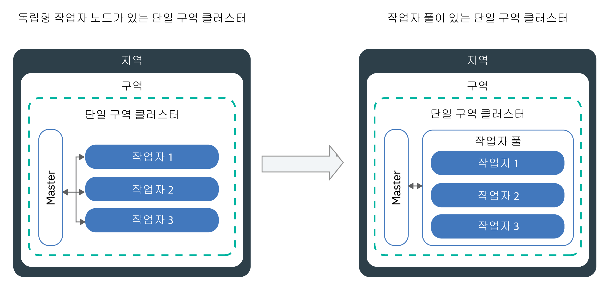

---

copyright:
  years: 2014, 2019
lastupdated: "2019-06-12"

keywords: kubernetes, iks

subcollection: containers

---

{:new_window: target="_blank"}
{:shortdesc: .shortdesc}
{:screen: .screen}
{:pre: .pre}
{:table: .aria-labeledby="caption"}
{:codeblock: .codeblock}
{:tip: .tip}
{:note: .note}
{:important: .important}
{:deprecated: .deprecated}
{:download: .download}
{:preview: .preview}


# 클러스터, 작업자 노드 및 클러스터 컴포넌트 업데이트
{: #update}

{{site.data.keyword.containerlong}}에서 업데이트를 설치하여 Kubernetes 클러스터를 최신 상태로 유지할 수 있습니다.
{:shortdesc}

## Kubernetes 마스터 업데이트
{: #master}

주기적으로, Kubernetes는 [주 버전 업데이트, 부 버전 업데이트 또는 패치 업데이트](/docs/containers?topic=containers-cs_versions#version_types)를 릴리스합니다. 업데이트는 Kubernetes 마스터의 Kubernetes API 서버 버전 또는 기타 컴포넌트에 영향을 줄 수 있습니다. IBM에서 패치 버전을 업데이트하지만, 사용자가 마스터 주 및 부 버전을 업데이트해야 합니다.
{:shortdesc}

**마스터의 업데이트 시점을 어떻게 압니까?**</br>
업데이트가 사용 가능하게 되면 {{site.data.keyword.Bluemix_notm}} 콘솔 및 CLI에서 알림을 받습니다. [지원되는 버전](/docs/containers?topic=containers-cs_versions) 페이지에서 확인할 수도 있습니다.

**마스터는 최신 버전 이전 몇 버전까지 가능합니까?**</br>
IBM은 일반적으로 한 번에 세 개의 Kubernetes 버전을 지원합니다. Kubernetes API 서버는 현재 버전보다 최대 두 버전 이전 버전까지만 업데이트할 수 있습니다. 

예를 들어, 현재 Kubernetes API 서버 버전이 1.11이고 1.14로 업데이트하려는 경우에는 먼저 1.12로 업데이트해야 합니다. 

클러스터가 지원되지 않는 Kubernetes 버전을 실행하는 경우에는 [버전 아카이브 지시사항](/docs/containers?topic=containers-cs_versions#k8s_version_archive)을 따르십시오. 지원되지 않음 상태가 되어 운영에 영향을 주는 상황을 방지하려면 클러스터를 최신 상태로 유지하십시오. 

**내 작업자 노드가 마스터보다 이후 버전을 실행할 수 있습니까?**</br>
작업자 노드는 마스터보다 이후 `major.minor` Kubernetes 버전을 실행할 수 없습니다. 우선 최신 Kubernetes 버전으로 [마스터를 업데이트](#update_master)하십시오. 그리고 클러스터의 [작업자 노드를 업데이트](#worker_node)하십시오.

작업자 노드는 마스터보다 이후 패치 버전을 실행할 수 있습니다(예: 보안 업데이트를 위한 작업자 노드 전용 패치 버전).

**패치 업데이트는 어떻게 적용됩니까?**</br>
기본적으로 마스터에 대한 패치 업데이트는 며칠에 걸쳐 자동으로 적용되므로, 마스터에 적용되기 전에는 마스터 패치 버전이 사용 가능으로 표시되지 않을 수 있습니다. 업데이트 자동화는 비정상 상태이거나 현재 오퍼레이션이 진행 중인 클러스터 또한 건너뜁니다. 마스터를 한 부 버전에서 다른 부 버전으로 업데이트하는 경우에만 필요한 패치와 같은 특정 마스터 수정팩에 대해서는 IBM에서 자동 업데이트를 사용 안함으로 설정할 수 있습니다. 이러한 경우에는 [버전의 변경 로그](/docs/containers?topic=containers-changelog)에서 잠재적인 영향이 있는지 확인하고 업데이트 자동화가 적용되기를 기다릴 필요 없이 직접 `ibmcloud ks cluster-update` [명령](/docs/containers?topic=containers-cli-plugin-kubernetes-service-cli#cs_cluster_update)을 사용할 수 있습니다.

마스터와는 달리, 작업자 노드는 각 패치 버전에 대해 업데이트해야 합니다.

**마스터 업데이트 중에 무슨 일이 발생합니까?**</br>
Kubernetes 버전 1.11 이상을 실행하는 클러스터의 경우 세 개의 복제본 팟(Pod)에서 마스터가 높은 가용성을 보입니다. 한 번에 한 개의 팟(Pod)을 사용할 수 없는 경우에만 마스터 팟(Pod)에서 롤링 업데이트가 수행됩니다. 업데이트 중 사용자가 클러스터에 액세스하여 클러스터를 변경할 수 있도록 두 인스턴스는 시작되어 실행 중입니다. 작업자 노드, 앱 및 리소스는 계속 실행됩니다.

이전 버전의 Kubernetes를 실행하는 클러스터의 경우 Kubernetes API 서버를 업데이트할 때 API 서버가 5 - 10분 정도 작동 중지됩니다. 업데이트 중에는 클러스터에 액세스하거나 클러스터를 변경할 수 없습니다. 그러나 클러스터 사용자가 배치한 작업자 노드, 앱 및 리소스는 수정되지 않고 계속 실행됩니다. 

**업데이트를 롤백할 수 있습니까?**</br>
아니오. 일단 업데이트 프로세스가 발생되면 클러스터를 이전 버전으로 롤백할 수 없습니다. 프로덕션 마스터를 업데이트하기 전에는 반드시 테스트 클러스터를 사용하고 지시사항에 따라 잠재적인 문제를 처리하십시오. 

**마스터를 업데이트하기 위해 수행할 수 있는 프로세스는 무엇입니까?**</br>
다음 다이어그램은 마스터 업데이트 시 수행 가능한 프로세스를 보여줍니다.


그림 1. Kubernetes 마스터 업데이트 프로세스 다이어그램

{: #update_master}
시작하기 전에, [**운영자** 또는 **관리자** {{site.data.keyword.Bluemix_notm}} IAM 플랫폼 역할](/docs/containers?topic=containers-users#platform)을 보유하고 있는지 확인하십시오. 

Kubernetes 마스터 _주_ 또는 _부_ 버전을 업데이트하려면 다음을 수행하십시오.

1.  [Kubernetes 변경사항](/docs/containers?topic=containers-cs_versions)을 검토하고 _마스터 이전 업데이트_로 표시된 변경사항을 작성하십시오.

2.  [{{site.data.keyword.Bluemix_notm}} 콘솔](https://cloud.ibm.com/login)을 사용하거나 CLI `ibmcloud ks cluster-update` [명령](/docs/containers?topic=containers-cli-plugin-kubernetes-service-cli#cs_cluster_update)을 실행하여 Kubernetes API 서버 및 이와 연관된 Kubernetes 마스터 컴포넌트를 업데이트하십시오.

3.  잠시 기다린 후에 업데이트가 완료되었는지 확인하십시오. {{site.data.keyword.Bluemix_notm}} 클러스터 대시보드에서 Kubernetes API 서버 버전을 검토하거나 `ibmcloud ks clusters`를 실행하십시오.

4.  Kubernetes 마스터에서 실행되는 Kubernetes API 서버 버전과 일치하는 [`kubectl cli`](/docs/containers?topic=containers-cs_cli_install#kubectl)의 버전을 설치하십시오. 서버 버전과 두 버전(n +/- 2) 이상 차이 나는 `kubectl` 클라이언트 버전을 [Kubernetes는 지원하지 않습니다 ](https://kubernetes.io/docs/setup/version-skew-policy/). 

Kubernetes API 서버 업데이트가 완료되면 작업자 노드를 업데이트할 수 있습니다.

<br />


## 작업자 노드 업데이트
{: #worker_node}

작업자 노드를 업데이트하라는 알림을 수신했습니다. 무슨 의미일까요? 보안 업데이트와 패치가 Kubernetes API 서버 및 기타 Kubernetes 마스터 컴포넌트에 대해 시행되었으므로 사용자는 작업자 노드가 동기화를 유지하는지 확인해야 합니다.
{: shortdesc}

**업데이트 중에 내 앱에 무슨 일이 발생합니까?**</br>
업데이트 중인 작업자 노드에서 배치의 일부로서 앱을 실행하는 경우, 해당 앱은 클러스터의 기타 작업자 노드로 다시 스케줄됩니다. 이러한 작업자 노드는 다른 작업자 풀에 있을 수 있습니다. 또는 독립형 작업자 노드가 있으면 앱이 독립형 작업자 노드로 스케줄될 수 있습니다. 앱의 작동 중단 시간을 방지하려면 워크로드를 감당할 만한 충분한 용량이 클러스터에 있는지 확인해야 합니다.

**업데이트 중에 한 번에 작동 중지되는 작업자 노드의 수를 어떻게 제어합니까? **</br>
모든 작업자 노드가 시작하여 실행되어야 하는 경우에는 작업자 노드를 더 추가할 수 있도록 [작업자 풀 크기 조정](/docs/containers?topic=containers-cli-plugin-kubernetes-service-cli#cs_worker_pool_resize) 또는 [독립형 작업자 노드 추가](/docs/containers?topic=containers-cli-plugin-kubernetes-service-cli#cs_worker_add)를 고려하십시오. 업데이트가 완료되면 추가적인 작업자 노드를 제거할 수 있습니다.

또한 업데이트 중에 사용 불가능할 수 있는 작업자 노드의 최대 수를 지정하는 Kubernetes 구성 맵을 작성할 수 있습니다. 작업자 노드는 작업자 노드 레이블로 식별됩니다. IBM 제공 레이블을 사용하거나 사용자가 작업자 노드에 추가한 사용자 정의 레이블을 사용할 수 있습니다.

**구성 맵을 정의하지 않도록 선택하면 어떻게 됩니까?**</br>
구성 맵을 정의하지 않으면 기본값이 사용됩니다. 기본적으로, 각 클러스터의 전체 작업자 노드에서 최대 20% 는 업데이트 프로세스 중에 사용이 불가능할 수 있습니다.

**시작하기 전에**:
- [계정에 로그인하십시오. 해당되는 경우, 적절한 리소스 그룹을 대상으로 지정하십시오. 클러스터의 컨텍스트를 설정하십시오.](/docs/containers?topic=containers-cs_cli_install#cs_cli_configure)
- [Kubernetes 마스터를 업데이트](#master)하십시오. 작업자 노드 Kubernetes 버전은 Kubernetes 마스터에서 실행되는 Kubernetes API 서버 버전보다 상위 버전일 수 없습니다.
- [Kubernetes 변경사항](/docs/containers?topic=containers-cs_versions)에서 _마스터 이후 업데이트_로 표시된 변경사항을 작성하십시오.
- 패치 업데이트를 적용하려는 경우에는 [Kubernetes 버전 변경 로그](/docs/containers?topic=containers-changelog#changelog)를 검토하십시오.
- [**운영자** 또는 **관리자** {{site.data.keyword.Bluemix_notm}} IAM 플랫폼 역할](/docs/containers?topic=containers-users#platform)을 보유하고 있는지 확인하십시오. </br>

작업자 노드를 업데이트하면 앱과 서비스의 작동이 중단될 수 있습니다. 작업자 노드 머신이 다시 이미징되며, [팟(Pod)의 외부에 저장](/docs/containers?topic=containers-storage_planning#persistent_storage_overview)되지 않은 경우 데이터가 삭제됩니다.
{: important}

{: #worker-up-configmap}
**구성 맵 작성 및 작업자 노드 업데이트**:

1.  사용 가능한 작업자 노드를 나열하고 사설 IP 주소를 기록해 두십시오.

    ```
    ibmcloud ks workers --cluster <cluster_name_or_ID>
    ```
    {: pre}

2. 작업자 노드의 레이블을 보십시오. CLI 출력의 **Labels** 섹션에서 작업자 노드 레이블을 찾을 수 있습니다. 모든 레이블은 `NodeSelectorKey` 및 `NodeSelectorValue`로 구성되어 있습니다.
   ```
   kubectl describe node <private_worker_IP>
   ```
   {: pre}

   출력 예:
   ```
   Name:               10.184.58.3
   Roles:              <none>
   Labels:             arch=amd64
                    beta.kubernetes.io/arch=amd64
                    beta.kubernetes.io/os=linux
                    failure-domain.beta.kubernetes.io/region=us-south
                    failure-domain.beta.kubernetes.io/zone=dal12
                    ibm-cloud.kubernetes.io/encrypted-docker-data=true
                    ibm-cloud.kubernetes.io/iaas-provider=softlayer
                    ibm-cloud.kubernetes.io/machine-type=u3c.2x4.encrypted
                    kubernetes.io/hostname=10.123.45.3
                    privateVLAN=2299001
                    publicVLAN=2299012
   Annotations:        node.alpha.kubernetes.io/ttl=0
                    volumes.kubernetes.io/controller-managed-attach-detach=true
   CreationTimestamp:  Tue, 03 Apr 2018 15:26:17 -0400
   Taints:             <none>
   Unschedulable:      false
   ```
   {: screen}

3. 구성 맵을 작성하고 작업자 노드에 대한 비가용성 규칙을 정의하십시오. 다음 예는 네 개의 검사(`zonecheck.json`, `regioncheck.json`, `defaultcheck.json` 및 검사 템플리트)를 보여줍니다. 이러한 예제 검사를 사용하여 특정 구역(`zonecheck.json`), 지역(`regioncheck.json`)의 작업자 노드에 대해 또는 구성 맵(`defaultcheck.json`)에서 정의한 검사와 일치하지 않는 모든 작업자 노드에 대해 규칙을 정의할 수 있습니다. 검사 템플리트를 사용하여 자체 검사를 작성하십시오. 모든 검사에 대해, 작업자 노드를 식별하려면 이전 단계에서 검색한 작업자 노드 레이블 중 하나를 선택해야 합니다.  

   검사할 때마다 <code>NodeSelectorKey</code> 및 <code>NodeSelectorValue</code>에 대해 하나의 값만 설정할 수 있습니다. 둘 이상의 지역, 구역 또는 기타 작업자 노드 레이블에 대해 규칙을 설정하려면 새 검사를 작성하십시오. 구성 맵에서 최대 10개까지 검사를 정의하십시오. 검사를 더 추가하는 경우에 이는 무시됩니다.
   {: note}

   예:
   ```
   apiVersion: v1
   kind: ConfigMap
   metadata:
     name: ibm-cluster-update-configuration
     namespace: kube-system
   data:
    drain_timeout_seconds: "120"
    zonecheck.json: |
      {
        "MaxUnavailablePercentage": 30,
        "NodeSelectorKey": "failure-domain.beta.kubernetes.io/zone",
        "NodeSelectorValue": "dal13"
      }
    regioncheck.json: |
      {
        "MaxUnavailablePercentage": 20,
        "NodeSelectorKey": "failure-domain.beta.kubernetes.io/region",
        "NodeSelectorValue": "us-south"
      }
    defaultcheck.json: |
      {
        "MaxUnavailablePercentage": 20
      }
    <check_name>: |
      {
        "MaxUnavailablePercentage": <value_in_percentage>,
        "NodeSelectorKey": "<node_selector_key>",
        "NodeSelectorValue": "<node_selector_value>"
      }
   ```
   {: codeblock}

   <table summary="표의 첫 번째 행에는 두 개의 열이 있습니다. 나머지 행은 왼쪽에서 오른쪽으로 읽어야 하며 1열에는 매개변수가 있고 2열에는 일치하는 설명이 있습니다.">
   <caption>ConfigMap 컴포넌트</caption>
    <thead>
      <th colspan=2> 컴포넌트 이해 </th>
    </thead>
    <tbody>
      <tr>
        <td><code>drain_timeout_seconds</code></td>
        <td> 선택사항: [드레인 ](https://kubernetes.io/docs/tasks/administer-cluster/safely-drain-node/)이 완료될 때까지 대기하는 제한시간(초)입니다. 안전하게 작업자 노드의 드레인을 수행하면 작업자 노드에서 모든 기존 팟(Pod)이 제거되며 클러스터의 기타 작업자 노드로 팟(Pod)이 다시 스케줄됩니다. 허용되는 값은 1 - 180 범위의 정수입니다. 기본값은 30입니다.</td>
      </tr>
      <tr>
        <td><code>zonecheck.json</code></br><code>regioncheck.json</code></td>
        <td>지정된 <code>NodeSelectorKey</code> 및 <code>NodeSelectorValue</code>로 식별할 수 있는 작업자 노드 세트에 대한 규칙을 정의하는 2개의 검사입니다. <code>zonecheck.json</code>은 해당 구역 레이블을 기반으로 작업자 노드를 식별하며, <code>regioncheck.json</code>은 프로비저닝 중에 모든 작업자 노드에 추가된 구역 레이블을 사용합니다. 이 예제에서는 자체 구역 레이블이 <code>dal13</code>인 모든 작업자 노드 중 30% 와 <code>us-south</code>의 모든 작업자 노드 중 20% 가 업데이트 중에 사용 불가능할 수 있습니다.</td>
      </tr>
      <tr>
        <td><code>defaultcheck.json</code></td>
        <td>구성 맵을 작성하지 않았거나 맵이 잘못 구성된 경우에는 Kubernetes 기본값이 적용됩니다. 기본적으로, 클러스터의 작업자 노드는 한 번에 20%만  사용 불가능 상태가 될 수 있습니다. 구성 맵에 기본 검사를 추가하여 기본값을 대체할 수 있습니다. 예제에서는 구역 및 지역 검사(<code>dal13</code> 또는 <code>us-south</code>)에서 지정되지 않은 모든 작업자 노드가 업데이트 중에 사용 불가능할 수 있습니다. </td>
      </tr>
      <tr>
        <td><code>MaxUnavailablePercentage</code></td>
        <td>지정된 레이블 키 및 값에 대해 사용 불가능 상태가 될 수 있는 노드의 최대 수이며 이는 백분율로 지정됩니다. 배치, 다시 로드 또는 프로비저닝 프로세스 중에는 작업자 노드를 사용할 수 없습니다. 정의된 최대 사용 불가능 백분율을 초과하면 큐에 지정된 작업자 노드가 업데이트로부터 차단됩니다. </td>
      </tr>
      <tr>
        <td><code>NodeSelectorKey</code></td>
        <td>해당 규칙을 설정하고자 하는 작업자 노드의 레이블 키입니다. 사용자는 IBM에서 제공한 기본 레이블과 자신이 작성한 작업자 노드 레이블에 대한 규칙을 설정할 수 있습니다. <ul><li>하나의 작업자 풀에 속하는 작업자 노드에 대한 규칙을 추가하려는 경우에는 <code>ibm-cloud.kubernetes.io/machine-type</code> 레이블을 사용할 수 있습니다. </li><li> 머신 유형이 동일한 둘 이상의 작업자 풀이 있는 경우에는 사용자 정의 레이블을 사용하십시오. </li></ul></td>
      </tr>
      <tr>
        <td><code>NodeSelectorValue</code></td>
        <td>사용자가 정의한 규칙에 대해 고려되기 위해 작업자 노드가 보유해야 하는 레이블 값입니다. </td>
      </tr>
    </tbody>
   </table>

4. 클러스터에서 구성 맵을 작성하십시오.
   ```
   kubectl apply -f <filepath/configmap.yaml>
   ```
   {: pre}

5.  구성 맵이 작성되었는지 확인하십시오.
    ```
    kubectl get configmap --namespace kube-system
    ```
    {: pre}

6.  작업자 노드를 업데이트하십시오.

    ```
    ibmcloud ks worker-update --cluster <cluster_name_or_ID> --workers <worker_node1_ID> <worker_node2_ID>
    ```
    {: pre}

7. 선택사항: 발생하는 유효성 검증 오류 및 구성 맵에 의해 트리거되는 이벤트를 확인하십시오. 이벤트는 CLI 출력의 **Events** 섹션에서 검토가 가능합니다.
   ```
   kubectl describe -n kube-system cm ibm-cluster-update-configuration
   ```
   {: pre}

8. 작업자 노드의 Kubernetes 버전을 검토하여 업데이트가 완료되었는지 확인하십시오.  
   ```
   kubectl get nodes
   ```
   {: pre}

9. 중복 작업자 노드가 없는지 확인하십시오. 일부 경우에 업데이트 후 이전 클러스터가 **`NotReady`** 상태의 중복된 작업자 노드를 나열할 수 있습니다. 중복 항목을 제거하려면 [문제점 해결](/docs/containers?topic=containers-cs_troubleshoot_clusters#cs_duplicate_nodes)을 참조하십시오.

다음 단계:
-   기타 작업자 풀에서 업데이트 프로세스를 반복하십시오.
-   클러스터에서 작업하는 개발자에게 `kubectl` CLI를 Kubernetes 마스터의 버전으로 업데이트하도록 알리십시오.
-   Kubernetes 대시보드에 사용률 그래프가 표시되지 않으면 [`kube-dashboard` 팟(Pod)을 삭제](/docs/containers?topic=containers-cs_troubleshoot_health#cs_dashboard_graphs)하십시오.


### 콘솔에서 작업자 노드 업데이트
{: #worker_up_console}

ConfigMap을 처음 설정한 후에는 {{site.data.keyword.Bluemix_notm}} 콘솔을 사용하여 작업자 노드를 업데이트할 수 있습니다.
{: shortdesc}

시작하기 전에:
*   [구성 맵을 설정](#worker_node)하여 작업자 노드가 업데이트되는 방법을 제어하십시오.
*   [Kubernetes 마스터를 업데이트](#master)하십시오. 작업자 노드 Kubernetes 버전은 Kubernetes 마스터에서 실행되는 Kubernetes API 서버 버전보다 상위 버전일 수 없습니다.
*   [Kubernetes 변경사항](/docs/containers?topic=containers-cs_versions)에서 _마스터 이후 업데이트_로 표시된 변경사항을 작성하십시오.
*   패치 업데이트를 적용하려는 경우에는 [Kubernetes 버전 변경 로그](/docs/containers?topic=containers-changelog#changelog)를 검토하십시오.
*   [**운영자** 또는 **관리자** {{site.data.keyword.Bluemix_notm}} IAM 플랫폼 역할](/docs/containers?topic=containers-users#platform)을 보유하고 있는지 확인하십시오. </br>

작업자 노드를 업데이트하면 앱과 서비스의 작동이 중단될 수 있습니다. 작업자 노드 머신이 다시 이미징되며, [팟(Pod)의 외부에 저장](/docs/containers?topic=containers-storage_planning#persistent_storage_overview)되지 않은 경우 데이터가 삭제됩니다.
{: important}

콘솔에서 작업자 노드를 업데이트하려면 다음을 수행하십시오.
1.  [{{site.data.keyword.Bluemix_notm}} 콘솔](https://cloud.ibm.com/) 메뉴 에서 **Kubernetes**를 클릭하십시오.
2.  **클러스터** 페이지에서 클러스터를 클릭하십시오.
3.  **작업자 노드** 탭에서 업데이트할 각 작업자 노드에 대한 선택란을 선택하십시오. 표 헤더 행 위에 조치 표시줄이 표시됩니다.
4.  조치 표시줄에서 **Kubernetes 업데이트**를 클릭하십시오.

<br />


## 머신 유형 업데이트
{: #machine_type}

새 작업자 노드를 추가하고 이전 작업자 노드를 제거하여 작업자 노드의 머신 유형을 업데이트할 수 있습니다. 예를 들어, 클러스트에 더 이상 사용되지 않는 `x1c` 또는 이전 Ubuntu 16 `x2c` 작업자 노드 특성이 있는 경우, 이름에 `x3c`가 있는 머신 유형을 사용하는 Ubuntu 18 작업자 노드를 작성하십시오.
{: shortdesc}

시작하기 전에:
- [계정에 로그인하십시오. 해당되는 경우, 적절한 리소스 그룹을 대상으로 지정하십시오. 클러스터의 컨텍스트를 설정하십시오.](/docs/containers?topic=containers-cs_cli_install#cs_cli_configure)
- 작업자 노드에 데이터를 저장하면 [작업자 노드의 외부에 저장](/docs/containers?topic=containers-storage_planning#persistent_storage_overview)되지 않은 경우 데이터가 삭제됩니다.
- [**운영자** 또는 **관리자** {{site.data.keyword.Bluemix_notm}} IAM 플랫폼 역할](/docs/containers?topic=containers-users#platform)을 보유하고 있는지 확인하십시오. 

머신 유형을 업데이트하려면 다음을 수행하십시오.

1. 사용 가능한 작업자 노드를 나열하고 사설 IP 주소를 기록해 두십시오.
   - **작업자 풀의 작업자 노드의 경우**:
     1. 클러스터에서 사용 가능한 작업자 풀을 나열하십시오.
        ```
        ibmcloud ks worker-pools --cluster <cluster_name_or_ID>
        ```
        {: pre}

     2. 작업자 풀의 작업자 노드를 나열하십시오.
        ```
        ibmcloud ks workers --cluster <cluster_name_or_ID> --worker-pool <pool_name>
        ```
        {: pre}

     3. 작업자 노드에 대한 세부사항을 가져오고 구역, 사설 및 공용 VLAN ID를 기록해 두십시오.
        ```
        ibmcloud ks worker-get --cluster <cluster_name_or_ID> --worker <worker_ID>
        ```
        {: pre}

   - **더 이상 사용되지 않음: 독립형 작업자 노드의 경우**:
     1. 사용 가능한 작업자 노드를 나열하십시오.
        ```
        ibmcloud ks workers --cluster <cluster_name_or_ID>
        ```
        {: pre}

     2. 작업자 노드에 대한 세부사항을 가져오고 구역, 사설 및 공용 VLAN ID를 기록해 두십시오.
        ```
        ibmcloud ks worker-get --cluster <cluster_name_or_ID> --worker <worker_ID>
        ```
        {: pre}

2. 구역에서 사용 가능한 머신 유형을 나열하십시오.
   ```
   ibmcloud ks machine-types <zone>
   ```
   {: pre}

3. 새 머신 유형으로 작업자 노드를 작성하십시오.
   - **작업자 풀의 작업자 노드의 경우**:
     1. 대체할 작업자 노드의 수로 작업자 풀을 작성하십시오.
        ```
        ibmcloud ks worker-pool-create --name <pool_name> --cluster <cluster_name_or_ID> --machine-type <machine_type> --size-per-zone <number_of_workers_per_zone>
        ```
        {: pre}

     2. 작업자 풀이 작성되었는지 확인하십시오.
        ```
        ibmcloud ks worker-pools --cluster <cluster_name_or_ID>
        ```
        {: pre}

     3. 이전에 검색한 작업자 풀에 구역을 추가하십시오. 구역을 추가하면 작업자 풀에서 정의된 작업자 노드가 구역에서 프로비저닝되며 향후 워크로드 스케줄을 위해 고려됩니다. 다중 구역 간에 작업자 노드를 전개하려면 [다중 구역 가능 구역](/docs/containers?topic=containers-regions-and-zones#zones)을 선택하십시오.
        ```
        ibmcloud ks zone-add --zone <zone> --cluster <cluster_name_or_ID> --worker-pools <pool_name> --private-vlan <private_VLAN_ID> --public-vlan <public_VLAN_ID>
        ```
        {: pre}

   - **더 이상 사용되지 않음: 독립형 작업자 노드의 경우**:
       ```
       ibmcloud ks worker-add --cluster <cluster_name> --machine-type <machine_type> --workers <number_of_worker_nodes> --private-vlan <private_VLAN_ID> --public-vlan <public_VLAN_ID>
       ```
       {: pre}

4. 작업자 노드가 배치될 때까지 대기하십시오.
   ```
   ibmcloud ks workers --cluster <cluster_name_or_ID>
   ```
   {: pre}

   작업자 노드 상태가 **정상**으로 변경되면 배치가 완료된 것입니다.

5. 이전의 작업자 노드를 제거하십시오. **참고**: 월별로 비용이 청구되는 머신 유형(예: 베어메탈)을 제거하는 경우 한 달의 요금이 청구됩니다.
   - **작업자 풀의 작업자 노드의 경우**:
     1. 이전 머신 유형의 작업자 풀을 제거하십시오. 작업자 풀을 제거하면 모든 구역의 풀에서 모든 작업자 노드가 제거됩니다. 이 프로세스는 완료하는 데 몇 분 정도 소요될 수 있습니다.
        ```
        ibmcloud ks worker-pool-rm --worker-pool <pool_name> --cluster <cluster_name_or_ID>
        ```
        {: pre}

     2. 작업자 풀이 제거되었는지 확인하십시오.
        ```
        ibmcloud ks worker-pools --cluster <cluster_name_or_ID>
        ```
        {: pre}

   - **더 이상 사용되지 않음: 독립형 작업자 노드의 경우**:
      ```
      ibmcloud ks worker-rm --cluster <cluster_name> --worker <worker_node>
      ```
      {: pre}

6. 작업자 노드가 클러스터에서 제거되었는지 확인하십시오.
   ```
   ibmcloud ks workers --cluster <cluster_name_or_ID>
   ```
   {: pre}

7. 이러한 단계를 반복하여 기타 작업자 풀 또는 독립형 작업자 노드를 다른 머신 유형으로 업데이트하십시오.

## 클러스터 컴포넌트 업데이트
{: #components}

{{site.data.keyword.containerlong_notm}} 클러스터는 클러스터를 프로비저닝할 때 자동으로 설치되는 컴포넌트(예: 로깅을 위한 Fluentd)와 함께 제공됩니다. 기본적으로 이러한 컴포넌트는 IBM에 의해 자동으로 업데이트됩니다. 그러나 사용자는 일부 컴포넌트에 대해 자동 업데이트를 사용 안함으로 설정하고 마스터 및 작업자 노드와 별도로 수동으로 업데이트할 수 있습니다.
{: shortdesc}

**클러스터와 별도로 업데이트할 수 있는 기본 컴포넌트는 무엇입니까?**</br>
사용자는 선택적으로 다음 컴포넌트에 대해 자동 업데이트를 사용 안함으로 설정할 수 있습니다. 
* [로깅을 위한 Fluentd](#logging-up)
* [Ingress 애플리케이션
로드 밸런서(ALB)](#alb)

**클러스터와 별도로 업데이트할 수 없는 컴포넌트가 있습니까?**</br>

예. 클러스터는 변경 불가능한 다음 관리 컴포넌트 및 연관된 리소스와 함께 배치됩니다. 특정 성능 이점을 얻기 위해 팟(Pod)을 스케일링하고 ConfigMap을 편집하는 경우는 예외입니다. 이러한 배치 컴포넌트 중 하나를 변경하려고 시도하면 일정 간격마다 해당 원본 설정이 복원됩니다. 

* `coredns`
* `coredns-autoscaler`
* `heapster`
* `ibm-file-plugin`
* `ibm-storage-watcher`
* `ibm-keepalived-watcher`
* `kube-dns-amd64`
* `kube-dns-autoscaler`
* `kubernetes-dashboard`
* `metrics-server`
* `vpn`

`addonmanager.kubernetes.io/mode: Reconcile` 레이블을 사용하여 이러한 리소스를 볼 수 있습니다. 예를 들어, 다음과 같습니다.

```
kubectl get deployments --all-namespaces -l addonmanager.kubernetes.io/mode=Reconcile
```
{: pre}

**기본 컴포넌트 외에 다른 추가 기능 또는 플러그인을 설치할 수 있습니까?**</br>
예. {{site.data.keyword.containerlong_notm}}에서는 클러스터에 기능을 추가하기 위해 선택할 수 있는 기타 플러그인 및 추가 기능을 제공합니다. 예를 들면, [Helm 차트를 사용](/docs/containers?topic=containers-helm#public_helm_install)하여 [블록 스토리지 플러그인](/docs/containers?topic=containers-block_storage#install_block) 또는 [strongSwan VPN](/docs/containers?topic=containers-vpn#vpn-setup)을 설치할 수 있습니다. 또는 클러스터에서 [Istio](/docs/containers?topic=containers-istio) 또는 [Knative](/docs/containers?topic=containers-serverless-apps-knative)와 같은 IBM 관리 추가 기능을 사용으로 설정할 수도 있습니다. 이러한 Helm 차트 및 추가 기능은 Helm 차트 readme에 있는 지시사항을 따르거나 [관리 추가 기능 업데이트](/docs/containers?topic=containers-managed-addons#updating-managed-add-ons) 단계에 따라 별도로 업데이트해야 합니다. 

### Fluentd에 대한 자동 업데이트 관리
{: #logging-up}

로깅 또는 필터 구성을 변경하려면 Fluentd 컴포넌트가 최신 버전이어야 합니다. 기본적으로 이 컴포넌트에 대한 자동 업데이트는 사용으로 설정됩니다.
{: shortdesc}

Fluentd 컴포넌트의 자동 업데이트는 다음 방법으로 관리할 수 있습니다. **참고**: 다음 명령을 실행하려면 클러스터에 대해 [**관리자** {{site.data.keyword.Bluemix_notm}} IAM 플랫폼 역할](/docs/containers?topic=containers-users#platform)을 보유하고 있어야 합니다.

* `ibmcloud ks logging-autoupdate-get --cluster <cluster_name_or_ID>` [명령](/docs/containers?topic=containers-cli-plugin-kubernetes-service-cli#cs_log_autoupdate_get)을 실행하여 자동 업데이트가 사용으로 설정되었는지 확인하십시오.
* `ibmcloud ks logging-autoupdate-disable` [명령](/docs/containers?topic=containers-cli-plugin-kubernetes-service-cli#cs_log_autoupdate_disable)을 실행하여 자동 업데이트를 사용 안함으로 설정하십시오.
* 자동 업데이트가 사용 안함으로 설정되어 있지만 구성을 변경해야 하는 경우에는 두 가지 옵션이 있습니다. 
    * Fluentd 팟(Pod)에 대해 자동 업데이트를 켭니다.
        ```
        ibmcloud ks logging-autoupdate-enable --cluster <cluster_name_or_ID>
        ```
        {: pre}
    * `--force-update` 옵션이 포함된 로깅 명령을 사용할 때 일회성 업데이트를 강제 실행합니다. **참고**: 팟(Pod)은 Fluentd 컴포넌트의 최신 버전으로 업데이트되지만 Fluentd는 자동으로 최신 버전으로 업데이트되지 않습니다.
        명령 예:

        ```
        ibmcloud ks logging-config-update --cluster <cluster_name_or_ID> --id <log_config_ID> --type <log_type> --force-update
        ```
        {: pre}

### Ingress ALB에 대한 자동 업데이트 관리
{: #alb}

Ingress 애플리케이션 로드 밸런서(ALB) 컴포넌트가 업데이트되는 시점을 제어하십시오.
{: shortdesc}

Ingress ALB 컴포넌트가 업데이트되면 모든 ALB 팟(Pod)에 있는 `nginx-ingress` 및 `ingress-auth` 컨테이너가 최신 빌드 버전으로 업데이트됩니다. 기본적으로 ALB에 대한 자동 업데이트는 사용으로 설정됩니다. Ingress ALB에서 가동 중단 시간이 발생하지 않도록 업데이트는 롤링 방식으로 수행됩니다.

자동 업데이트를 사용 안함으로 설정하는 경우에는 사용자가 ALB를 업데이트해야 합니다. 업데이트가 사용 가능할 경우 `ibmcloud ks albs` 또는 `alb-autoupdate-get` 명령을 실행하면 CLI에서 알림을 받습니다.

클러스터의 Kubernetes 주 버전 또는 부 버전을 업데이트하는 경우, IBM은 이로 인해 필요한 Ingress 배치 변경을 자동으로 수행하지만 Ingress ALB의 빌드 버전은 변경하지 않습니다. 최신 Kubernetes 버전과 자신의 Ingress ALB 이미지 간의 호환성은 사용자가 확인해야 합니다.
{: note}

시작하기 전에:

1. ALB가 실행 중인지 확인하십시오.
    ```
    ibmcloud ks albs
    ```
    {: pre}

2. Ingress ALB 컴포넌트에 대한 자동 업데이트의 상태를 확인하십시오.
    ```
    ibmcloud ks alb-autoupdate-get --cluster <cluster_name_or_ID>
    ```
    {: pre}

    자동 업데이트가 사용으로 설정된 경우 출력 예:
    ```
    Retrieving automatic update status of application load balancer (ALB) pods in cluster mycluster...
    OK
    Automatic updates of the ALB pods are enabled in cluster mycluster
    ALBs are at the latest version in cluster mycluster
    ```
    {: screen}

    자동 업데이트가 사용 안함으로 설정된 경우 출력 예:
    ```
    Retrieving automatic update status of application load balancer (ALB) pods in cluster mycluster...
    OK
    Automatic updates of the ALB pods are disabled in cluster mycluster
    ALBs are not at the latest version in cluster mycluster. To view the current version, run 'ibmcloud ks albs'.
    ```
    {: screen}

3. ALB 팟(Pod)의 **빌드** 버전을 확인하십시오.
    ```
    ibmcloud ks albs --cluster <cluster_name_or_ID>
    ```
    {: pre}

    출력 예:
    ```
    ALB ID                                            Enabled   Status     Type      ALB IP          Zone    Build                           ALB VLAN ID
    private-crdf253b6025d64944ab99ed63bb4567b6-alb2   false     disabled   private   10.xxx.xx.xxx   dal10   ingress:411/ingress-auth:315*   2234947
    public-crdf253b6025d64944ab99ed63bb4567b6-alb2    true      enabled    public    169.xx.xxx.xxx  dal10   ingress:411/ingress-auth:315*   2234945

    * An update is available for the ALB pods. Review any potentially disruptive changes for the latest version before you update: https://cloud.ibm.com/docs/containers?topic=containers-update#alb
    ```
    {: screen}

Ingress ALB 컴포넌트의 자동 업데이트는 다음 방법으로 관리할 수 있습니다. **참고**: 다음 명령을 실행하려면 클러스터에 대해 [**편집자** 또는 **관리자** {{site.data.keyword.Bluemix_notm}} IAM 플랫폼 역할](/docs/containers?topic=containers-users#platform)을 보유하고 있어야 합니다.
* 자동 업데이트를 사용 안함으로 설정하십시오.
    ```
    ibmcloud ks alb-autoupdate-disable --cluster <cluster_name_or_ID>
    ```
    {: pre}
* Ingress ALB를 수동으로 업데이트하십시오. 
    1. 업데이트가 사용 가능하여 ALB를 업데이트하려는 경우에는 먼저 [Ingress ALB 컴포넌트의 최신 버전에 대한 변경 로그](/docs/containers?topic=containers-cluster-add-ons-changelog#alb_changelog)를 확인하여 문제를 일으킬 수 있는 변경사항을 확인하십시오. 
    2. ALB 팟(Pod)의 일회성 업데이트를 강제 실행하십시오. 클러스터에 있는 모든 ALB 팟(Pod)이 최신 빌드 버전으로 업데이트됩니다. 개별 ALB를 업데이트하거나 ALB를 업데이트할 빌드를 선택할 수는 없습니다. 자동 업데이트는 사용 안함으로 계속 설정됩니다.
        ```
        ibmcloud ks alb-update --cluster <cluster_name_or_ID>
        ```
        {: pre}
* ALB 팟(Pod)이 최근에 업데이트되었지만 ALB의 사용자 정의 구성이 최신 빌드의 영향을 받는 경우, ALB 팟(Pod)이 실행되던 이전 빌드로 업데이트를 롤백할 수 있습니다. **참고**: 업데이트를 롤백하면 ALB 팟(Pod)에 대한 업데이트가 사용 안함으로 설정됩니다.
    ```
    ibmcloud ks alb-rollback --cluster <cluster_name_or_ID>
    ```
    {: pre}
* 자동 업데이트를 다시 사용으로 설정하십시오. 다음 빌드가 사용 가능해질 때마다 ALB 팟(Pod)이 자동으로 최신 빌드로 업데이트됩니다.
    ```
    ibmcloud ks alb-autoupdate-enable --cluster <cluster_name_or_ID>
    ```
    {: pre}

<br />


## 관리 추가 기능 업데이트
{: #addons}

관리 {{site.data.keyword.containerlong_notm}} 추가 기능은 Istio 또는 Knative와 같은 오픈 소스 기능으로 클러스터를 개선하는 손쉬운 방법입니다. 클러스터에 추가하는 오픈 소스 버전은 IBM에서 테스트하고 {{site.data.keyword.containerlong_notm}}에서 사용하도록 승인됩니다. 클러스터에서 사용으로 설정한 관리 추가 기능을 최신 버전으로 업데이트하려면 [관리 추가 기능 업데이트](/docs/containers?topic=containers-managed-addons#updating-managed-add-ons)를 참조하십시오. 

## 독립형 작업자 노드에서 작업자 풀로 업데이트
{: #standalone_to_workerpool}

다중 구역 클러스터의 도입에 따라, 동일한 구성(예: 머신 유형)의 작업자 노드는 작업자 풀로 그룹화되어 있습니다. 새 클러스터를 작성하면 이름이 `default`인 작업자 풀이 사용자를 위해 자동으로 작성됩니다.
{: shortdesc}

작업자 풀을 사용하여 작업자 노드를 구역 간에 균등하게 전개하고 밸런스가 유지된 클러스터를 빌드할 수 있습니다. 밸런스가 유지된 클러스터는 가용성이 보다 높으며 장애에 대한 복원성이 보다 우수합니다. 작업자 노드가 구역에서 제거되면 사용자가 작업자 풀을 리밸런싱하고 새 작업자 노드를 해당 구역에 자동으로 프로비저닝할 수 있습니다. 작업자 풀은 모든 작업자 노드에 대한 Kubernetes 버전 업데이트를 설치하는 데도 사용됩니다.  

다중 구역 클러스터가 사용 가능해지기 전에 클러스터를 작성한 경우, 작업자 노드는 여전히 독립형이며 자동으로 작업자 풀로 그룹화되지 않습니다. 작업자 풀을 사용하려면 이러한 클러스터를 업데이트해야 합니다. 업데이트되지 않으면 단일 구역 클러스터를 다중 구역 클러스터로 변경할 수 없습니다.
{: important}

독립형 작업자 노드에서 작업자 풀로 이동할 때 클러스터 설정이 변경되는 방법을 확인하려면 다음 이미지를 검토하십시오.



시작하기 전에:
- 클러스터에 대한 [**운영자** 또는 **관리자** {{site.data.keyword.Bluemix_notm}} IAM 플랫폼 역할](/docs/containers?topic=containers-users#platform)을 보유하고 있는지 확인하십시오. 
- [계정에 로그인하십시오. 해당되는 경우, 적절한 리소스 그룹을 대상으로 지정하십시오. 클러스터의 컨텍스트를 설정하십시오.](/docs/containers?topic=containers-cs_cli_install#cs_cli_configure)

독립형 작업자 노드를 작업자 풀로 업데이트하려면 다음을 수행하십시오.

1. 클러스터의 기존 독립형 작업자 노드를 나열하고 **ID**, **머신 유형** 및 **사설 IP**를 기록해 두십시오.
   ```
   ibmcloud ks workers --cluster <cluster_name_or_ID>
   ```
   {: pre}

2. 작업자 풀을 작성하고 풀에 추가할 작업자 노드의 수와 머신 유형을 결정하십시오.
   ```
   ibmcloud ks worker-pool-create --name <pool_name> --cluster <cluster_name_or_ID> --machine-type <machine_type> --size-per-zone <number_of_workers_per_zone>
   ```
   {: pre}

3. 사용 가능한 구역을 나열하고 작업자 풀에서 작업자 노드를 프로비저닝할 위치를 결정하십시오. 독립형 작업자 노드가 프로비저닝된 구역을 보려면 `ibmcloud ks cluster-get --cluster <cluster_name_or_ID>`를 실행하십시오. 다중 구역 간에 작업자 노드를 전개하려면 [다중 구역 가능 구역](/docs/containers?topic=containers-regions-and-zones#zones)을 선택하십시오.
   ```
   ibmcloud ks zones
   ```
   {: pre}

4. 이전 단계에서 선택한 구역에 대해 사용 가능한 VLAN을 나열하십시오. 해당 구역에 아직 VLAN이 없는 경우에는 구역을 작업자 풀에 추가할 때 VLAN이 사용자를 위해 자동으로 작성됩니다.
   ```
   ibmcloud ks vlans --zone <zone>
   ```
   {: pre}

5. 작업자 풀에 구역을 추가하십시오. 작업자 풀에 구역을 추가하면 작업자 풀에서 정의된 작업자 노드가 구역에서 프로비저닝되며 향후 워크로드 스케줄을 위해 고려됩니다. {{site.data.keyword.containerlong}}는 지역에 대한 `failure-domain.beta.kubernetes.io/region` 레이블과 구역에 대한 `failure-domain.beta.kubernetes.io/zone` 레이블을 각 작업자 노드에 자동으로 추가합니다. Kubernetes 스케줄러는 이러한 레이블을 사용하여 동일한 지역 내의 구역 간에 팟(Pod)을 전개합니다.
   1. **하나의 작업자 풀에 구역 추가**: `<pool_name>`을 작업자 풀의 이름으로 대체하고 이전에 검색한 정보를 사용하여 클러스터 ID, 구역 및 VLAN을 채우십시오. 해당 구역에 사설 및 공용 VLAN이 없는 경우에는 이 옵션을 지정하지 마십시오. 사설 및 공용 VLAN이 사용자를 위해 자동으로 작성됩니다.

      서로 다른 작업자 풀에 대해 서로 다른 VLAN을 사용하려면 각 VLAN 및 이의 대응되는 작업자 풀에 대해 이 명령을 반복하십시오. 지정된 VLAN에 임의의 새 작업자 노드가 추가되지만, 기존 작업자 노드에 대한 VLAN은 변경되지 않습니다.
      ```
      ibmcloud ks zone-add --zone <zone> --cluster <cluster_name_or_ID> --worker-pools <pool_name> --private-vlan <private_VLAN_ID> --public-vlan <public_VLAN_ID>
      ```
      {: pre}

   2. **다중 작업자 풀에 구역 추가**: 다중 작업자 풀을 `ibmcloud ks zone-add` 명령에 추가하십시오. 다중 작업자 풀을 구역에 추가하려면 해당 구역에 기존 사설 및 공용 VLAN이 있어야 합니다. 해당 구역에 공용 및 사설 VLAN이 없는 경우에는 공용 및 사설 VLAN이 사용자를 위해 작성되도록 우선 구역을 하나의 작업자 풀에 추가하는 것을 고려하십시오. 그리고 구역을 기타 작업자 풀에 추가할 수 있습니다. </br></br>구역 간에 클러스터의 밸런스가 유지될 수 있도록 모든 작업자 풀의 작업자 노드가 모든 구역으로 프로비저닝되는 것이 중요합니다. 서로 다른 작업자 풀에 대해 서로 다른 VLAN을 사용하려면 작업자 풀에 사용할 VLAN에서 이 명령을 반복 실행하십시오. 클러스터용 다중 VLAN, 동일한 VLAN의 다중 서브넷 또는 다중 구역 클러스터가 있는 경우에는 작업자 노드가 사설 네트워크에서 서로 간에 통신할 수 있도록 IBM Cloud 인프라(SoftLayer) 계정에 대해 [Virtual Router Function (VRF)](/docs/infrastructure/direct-link?topic=direct-link-overview-of-virtual-routing-and-forwarding-vrf-on-ibm-cloud#overview-of-virtual-routing-and-forwarding-vrf-on-ibm-cloud)을 사용으로 설정해야 합니다. VRF를 사용으로 설정하려면 [IBM Cloud 인프라(SoftLayer) 계정 담당자에게 문의](/docs/infrastructure/direct-link?topic=direct-link-overview-of-virtual-routing-and-forwarding-vrf-on-ibm-cloud#how-you-can-initiate-the-conversion)하십시오. VRF를 사용할 수 없거나 사용하지 않으려면 [VLAN Spanning](/docs/infrastructure/vlans?topic=vlans-vlan-spanning#vlan-spanning)을 사용으로 설정하십시오. 이 조치를 수행하려면 **네트워크 > 네트워크 VLAN Spanning 관리** [인프라 권한](/docs/containers?topic=containers-users#infra_access)이 필요합니다. 또는 이를 사용으로 설정하도록 계정 소유자에게 요청할 수 있습니다. VLAN Spanning이 이미 사용으로 설정되었는지 확인하려면 `ibmcloud ks vlan-spanning-get --region <region>` [명령](/docs/containers?topic=containers-cli-plugin-kubernetes-service-cli#cs_vlan_spanning_get)을 사용하십시오.
      ```
      ibmcloud ks zone-add --zone <zone> --cluster <cluster_name_or_ID> --worker-pools <pool_name1,pool_name2,pool_name3> --private-vlan <private_VLAN_ID> --public-vlan <public_VLAN_ID>
      ```
      {: pre}

   3. **작업자 풀에 다중 구역 추가**: 다른 구역에서 `ibmcloud ks zone-add` 명령을 반복 실행하고 해당 구역에서 프로비저닝하고자 하는 작업자 풀을 지정하십시오. 클러스터에 구역을 더 추가하면 단일 구역 클러스터에서 [다중 구역 클러스터](/docs/containers?topic=containers-ha_clusters#multizone)로 클러스터가 변경됩니다.

6. 각 구역에서 작업자 노드가 배치될 때까지 대기하십시오.
   ```
   ibmcloud ks workers --cluster <cluster_name_or_ID>
   ```
   {: pre}
   작업자 노드 상태가 **정상**으로 변경되면 배치가 완료된 것입니다.

7. 독립형 작업자 노드를 제거하십시오. 독립형 작업자 노드가 여러 개인 경우에는 한 번에 하나씩 제거하십시오.
   1. 클러스터의 작업자 노드를 나열하고 이 명령의 사설 IP 주소를 맨 처음에 검색한 사설 IP 주소와 비교하여 독립형 작업자 노드를 찾으십시오.
      ```
      kubectl get nodes
      ```
      {: pre}
   2. 유출(cordoning)이라고 알려진 프로세스에서 작업자 노드를 스케줄 불가능으로 표시하십시오. 작업자 노드를 유출할 때 이후 팟(Pod) 스케줄링에서 사용할 수 없도록 합니다. `kubectl get nodes` 명령에서 리턴된 `name`을 사용하십시오.
      ```
      kubectl cordon <worker_name>
      ```
      {: pre}
   3. 팟(Pod) 스케줄링이 작업자 노드에 사용 불가능한지 확인하십시오.
      ```
      kubectl get nodes
      ```
      {: pre}
상태가 **`SchedulingDisabled`**로 표시되는 경우 작업자 노드가 팟(Pod) 스케줄링에 사용 불가능합니다.
   4. 팟(Pod)이 독립형 작업자 노드에서 제거되고 나머지 유출되지 않은 독립형 작업자 노드 및 작업자 풀의 작업자 노드로 다시 스케줄되도록 강제 실행하십시오.
      ```
      kubectl drain <worker_name> --ignore-daemonsets
      ```
      {: pre}
      이 프로세스에는 몇 분 정도 소요될 수 있습니다.

   5. 독립형 작업자 노드를 제거하십시오. `ibmcloud ks workers --cluster <cluster_name_or_ID>` 명령을 사용하여 검색한 작업자 노드 ID를 사용하십시오.
      ```
      ibmcloud ks worker-rm --cluster <cluster_name_or_ID> --worker <worker_ID>
      ```
      {: pre}
   6. 모든 독립형 작업자 노드가 제거될 때까지 이러한 단계를 반복하십시오.


**다음에 수행할 작업** </br>
이제 작업자 풀을 사용하도록 클러스터를 업데이트했으므로 클러스터에 구역을 더 추가하여 가용성을 높일 수 있습니다. 클러스터에 구역을 더 추가하면 단일 구역 클러스터에서 [다중 구역 클러스터](/docs/containers?topic=containers-ha_clusters#ha_clusters)로 클러스터가 변경됩니다. 단일 구역 클러스터를 다중 구역 클러스터를 변경하면 Ingress 도메인이 `<cluster_name>.<region>.containers.mybluemix.net`에서 `<cluster_name>.<region_or_zone>.containers.appdomain.cloud`로 변경됩니다. 기존 Ingress 도메인은 여전히 유효하며 앱으로 요청을 전송하는 데 사용될 수 있습니다.

<br />

