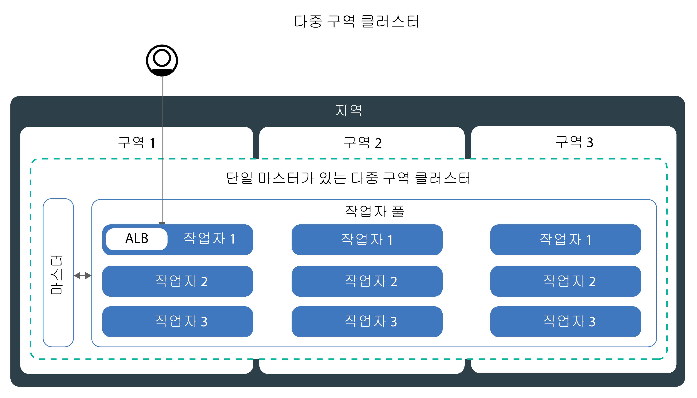

---

copyright:
  years: 2014, 2018
lastupdated: "2018-08-06"

---

{:new_window: target="_blank"}
{:shortdesc: .shortdesc}
{:screen: .screen}
{:pre: .pre}
{:table: .aria-labeledby="caption"}
{:codeblock: .codeblock}
{:tip: .tip}
{:download: .download}


# 클러스터 설정
{: #clusters}

{{site.data.keyword.containerlong}}의 최대 컨테이너 가용성과 클러스터 용량을 위한 Kubernetes 클러스터 설정을 디자인하십시오. 아직도 시작 단계입니까? [Kubernetes 클러스터 작성 튜토리얼](cs_tutorials.html#cs_cluster_tutorial)을 이용해 보십시오.
{:shortdesc}

## {{site.data.keyword.containershort_notm}}에서 다중 구역 클러스터 작성
{: #multizone}

{{site.data.keyword.containerlong}}에서 다중 구역 클러스터를 작성할 수 있습니다. 작업자 풀을 사용하여 다중 작업자 노드와 구역 간에 앱을 분배하면 사용자에게 작동 중지 시간이 발생할 가능성이 낮아질 수 있습니다 로드 밸런싱 및 격리 등의 기본 제공 기능은 호스트, 네트워크 또는 앱에서의 잠재적 구역 장애에 대해 복원성을 높여줍니다. 한 구역의 리소스가 작동 중지되는 경우, 클러스터 워크로드는 기타 구역에서 여전히 작동됩니다.
{: shortdesc}

### 잠시만요, 구역과 풀은 도대체 무엇입니까? 무슨 차이가 있습니까?
{: #mz_changed}

이전에는 위치라고 부르던 **구역(zone)**은 IBM 클라우드 리소스가 작성될 수 있는 데이터센터입니다. 

클러스터에는 이제 동일한 특성(예: 머신 유형, CPU 및 메모리)을 지닌 작업자 노드의 콜렉션인 **작업자 풀(worker pool)**이라는 기능이 있습니다. 새로운 `ibmcloud ks worker-pool` 명령을 사용하여 클러스터를 변경(예: 구역 추가, 작업자 노드 추가 또는 작업자 노드 업데이트)할 수 있습니다. 

독립형 작업자 노드의 이전 클러스터 설정은 지원은 되지만 더 이상 사용되지 않습니다. 반드시 [작업자 풀을 클러스터에 추가](cs_clusters.html#add_pool)한 후에 [작업자 풀을 사용하도록 마이그레이션](cs_cluster_update.html#standalone_to_workerpool)하여 독립형 작업자 노드 대신 사용자의 작업자 노드를 구성하십시오. 

### 시작하기 전에 무엇을 알아야 합니까?
{: #general_reqs}

너무 진전되기 전에 일부 관리 항목을 처리하여 다중 구역 클러스터가 워크로드에 맞게 준비될 수 있도록 하십시오. 

<dl>
<dt>VLAN 필수</dt>
  <dd><p>작업자 풀에 구역을 추가할 때는 작업자 노드가 연결되는 사설 및 공용 VLAN을 정의해야 합니다. </p><ul><li>사용 가능한 해당 구역에 기존 VLAN이 있는지 확인하려면 `ibmcloud ks vlans <zone>`을 실행하십시오. VLAN ID를 기록해 둔 다음에 작업자 풀에 구역을 추가할 때 이를 사용하십시오. </li>
  <li>해당 구역에 VLAN이 없는 경우에는 사설 및 공용 VLAN이 사용자를 위해 자동으로 작성됩니다. 사용자가 사설 및 공용 VLAN을 지정할 필요는 없습니다. </li></ul>
  </dd>
<dt>VLAN Spanning 또는 VRF 사용</dt>
  <dd><p>작업자 노드는 구역 간의 사설 네트워크에서 서로 간에 통신해야 합니다. 다음 두 가지 옵션이 있습니다. </p>
  <ol><li>IBM Cloud 인프라(SoftLayer) 계정에서 [VLAN Spanning을 사용으로 설정](/docs/infrastructure/vlans/vlan-spanning.html#vlan-spanning)합니다. VLAN spanning을 사용으로 설정하려면 <strong>네트워크 > 네트워크 VLAN Spanning 관리</strong> [인프라 권한](/docs/iam/infrastructureaccess.html#infrapermission)이 있어야 합니다. 또는 이를 사용할 수 있도록 계정 소유자에게 요청할 수 있습니다. </li>
  <li>또는 VRF(Virtual Router Function) 사용 IBM Cloud 인프라(SoftLayer) 계정을 사용합니다. VRF 계정을 받으려면 IBM Cloud 인프라(SoftLayer) 지원에 문의하십시오. </li></ol></dd>
<dt>기존 지속적 볼륨 준비</dt>
  <dd><p>지속적 볼륨은 실제 스토리지 디바이스가 있는 구역에서만 사용될 수 있습니다. 다중 구역 클러스터에서 예기치 않은 앱 오류를 방지하려면 지역 및 구역 레이블을 기존의 지속적 볼륨에 적용해야 합니다. 이러한 레이블은 kube-scheduler가 지속적 볼륨을 사용하는 앱의 스케줄 위치를 판별하는 데 도움이 됩니다. 다음 명령을 실행하고 <code>&lt;mycluster&gt;</code>를 사용자의 클러스터 이름으로 대체하십시오. </p>
  <pre class="pre"><code>bash <(curl -Ls https://raw.githubusercontent.com/IBM-Cloud/kube-samples/master/file-pv-labels/apply_pv_labels.sh) <mycluster></code></pre></dd>
<dt>오직 단일 구역 클러스터만 {{site.data.keyword.Bluemix_dedicated_notm}} 인스턴스에 사용할 수 있습니다. </dt>
    <dd>{{site.data.keyword.Bluemix_dedicated_notm}}에서는 [단일 구역 클러스터](cs_clusters.html#single_zone)만 작성할 수 있습니다. 사용 가능한 구역은 {{site.data.keyword.Bluemix_dedicated_notm}} 환경이 설정될 때 사전 정의되었습니다. 기본적으로, 단일 구역 클러스터는 이름이 `default`인 작업자 풀로 설정됩니다. 작업자 풀은 클러스터 작성 중에 정의한 것과 동일한 구성(예: 머신 유형)으로 작업자 노드를 그룹화합니다. [기존 작업자 풀의 크기를 조정](cs_clusters.html#resize_pool)하거나 [새 작업자 풀을 추가](cs_clusters.html#add_pool)하여 클러스터에 작업자 노드를 더 추가할 수 있습니다. 작업자 풀을 추가할 때는 작업자가 구역에 배치할 수 있도록 사용 가능한 구역을 작업자 풀에 추가해야 합니다. 그러나 작업자 풀에 기타 구역을 추가할 수는 없습니다. </dd>
</dl>

### 다중 구역 클러스터를 작성할 준비가 되었습니다. 어떻게 시작할 수 있습니까? 
{: #mz_gs}

**클러스터 작성**을 클릭하여 [{{site.data.keyword.containershort_notm}} 콘솔](https://console.bluemix.net/containers-kubernetes/clusters)에서 지금 바로 시작하십시오. 

다음 [다중 구역 시티](cs_regions.html#zones) 중 하나에서 클러스터를 작성할 수 있습니다. 
* 미국 남부 지역의 달라스: dal10, dal12, dal13
* 미국 동부 지역의 워싱턴 DC: wdc04, wdc06, wdc07
* EU 중앙 지역의 프랑크푸르트: fra02, fra04, fra05
* UK 남부 지역의 런던: lon02, lon04, lon06

**기존 클러스터에 구역 추가**:

다중 구역 시티에 클러스터를 보유한 경우에는 클러스터에 작업자 풀을 추가한 후에 GUI 또는 CLI를 사용하여 해당 작업자 풀에 구역을 추가할 수 있습니다. 단계의 전체 목록은 [독립형 작업자 노드에서 작업자 풀로 업데이트](cs_cluster_update.html#standalone_to_workerpool)를 참조하십시오. 

### 한 걸음 나아가서, 현재 내 클러스터를 관리하는 방법에서는 어떤 변경사항이 있습니까? 
{: #mz_new_ways}

작업자 풀을 도입함에 따라 새로운 API 및 명령 세트를 사용하여 클러스터를 관리할 수 있습니다. `ibmcloud ks help`를 실행하여 터미널에서 또는 [CLI 문서 페이지](cs_cli_reference.html#cs_cli_reference)에서 이러한 새 명령을 볼 수 있습니다. 

다음 표에서는 몇 가지 공통된 클러스터 관리 조치에 대해 이전 방법과 새 방법을 비교합니다. 
<table summary="표에서는 다중 구역 명령을 수행하는 새 방법에 대한 설명을 보여줍니다. 행은 왼쪽에서 오른쪽 방향으로 읽어야 하며, 설명은 1열에 있고 이전 방법은 2열에 있으며 새 다중 구역 방법은 3열에 있습니다.">
<caption>다중 구역 작업자 풀 명령에 대한 새 방법. </caption>
  <thead>
  <th>설명</th>
  <th>이전 독립형 작업자 노드</th>
  <th>새 다중 구역 작업자 풀</th>
  </thead>
  <tbody>
    <tr>
    <td>클러스터에 작업자 노드를 추가합니다.</td>
    <td><strong>더 이상 사용되지 않음</strong>: <code>ibmcloud ks worker-add</code>로 독립형 작업자 노드를 추가합니다. </td>
    <td><ul><li>기존 풀과는 다른 머신 유형을 추가하려는 경우 <code>ibmcloud ks worker-pool-create</code> [명령](cs_cli_reference.html#cs_worker_pool_create)으로 새 작업자 풀을 작성합니다.</li>
    <li>기존 풀에 작업자 노드를 추가하려는 경우 <code>ibmcloud ks worker-pool-resize</code> [명령](cs_cli_reference.html#cs_worker_pool_resize)으로 풀에서 구역당 노드 수의 크기를 조정합니다.</li></ul></td>
    </tr>
    <tr>
    <td>클러스터에서 작업자 노드를 제거합니다.</td>
    <td><code>ibmcloud ks worker-rm</code>: 클러스터에서 문제가 있는 작업자 노드를 삭제하기 위해 이를 여전히 사용할 수 있습니다. </td>
    <td><ul><li>작업자 풀의 밸런스가 유지되지 않는 경우(예: 작업자 노드 제거 이후)에는 <code>ibmcloud ks worker-pool-rebalance</code> [명령](cs_cli_reference.html#cs_rebalance)으로 이를 리밸런싱합니다.</li>
    <li>풀에서 작업자 노드의 수를 줄이려는 경우 <code>ibmcloud ks worker-pool-resize</code> [명령](cs_cli_reference.html#cs_worker_pool_resize)으로 구역당 수를 조정합니다(최소값 1).</li></ul></td>
    </tr>
    <tr>
    <td>작업자 노드에 대해 새 VLAN을 사용합니다.</td>
    <td><strong>더 이상 사용되지 않음</strong>: <code>ibmcloud ks worker-add</code>로 새 사설 또는 공용 VLAN을 사용하는 새 작업자 노드를 추가합니다.</td>
    <td><code>ibmcloud ks zone-network-set</code> [명령](cs_cli_reference.html#cs_zone_network_set)으로 이전에 사용했던 것과 다른 공용 또는 사설 VLAN을 사용하도록 작업자 풀을 설정합니다.</td>
    </tr>
  </tbody>
  </table>

### 다중 구역 클러스터에 대해 알아보려면 어떻게 해야 합니까? 
{: #learn_more}

다중 구역에 대한 전체 문서가 업데이트되었습니다. 특히 다중 구역 클러스터의 도입으로 인해 상당히 많이 변경된 다음 주제에 관심이 있을 수 있습니다. 
* [고가용성 클러스터 설정](#ha_clusters)
* [고가용성 앱 배치 계획](cs_app.html#highly_available_apps)
* [다중 구역 클러스터에 대해 LoadBalancer를 사용한 앱 노출](cs_loadbalancer.html#multi_zone_config)
* [Ingress를 사용한 앱 노출](cs_ingress.html#ingress)
* 고가용성 지속적 스토리지의 경우에는 [{{site.data.keyword.cloudant_short_notm}}](/docs/services/Cloudant/getting-started.html#getting-started-with-cloudant) 또는 [{{site.data.keyword.cos_full_notm}}](/docs/services/cloud-object-storage/about-cos.html#about-ibm-cloud-object-storage) 등의 클라우드 서비스를 사용하십시오. 

## 고가용성 클러스터 설정
{: #ha_clusters}
{{site.data.keyword.containerlong}}에서 앱의 최대 가용성 및 용량을 제공하기 위한 표준 클러스터를 디자인하십시오. 

다중 작업자 노드, 구역 및 클러스터 간에 앱을 분배하면 사용자에게 작동 중지 시간이 발생할 가능성이 낮아질 수 있습니다. 로드 밸런싱 및 격리 등의 기본 제공 기능을 사용하면 호스트, 네트워크 또는 앱에서 잠재적 장애가 발생할 때 복원성이 높아집니다.

가용도의 증가 순으로 정렬된 다음의 잠재적 클러스터 설정을 검토하십시오. 


1. 작업자 풀에 다중 작업자 노드가 있는 [단일 구역 클러스터](#single_zone). 
2. 한 지역 내의 구역 간에 작업자 노드를 전개하는 [다중 구역 클러스터](#multi_zone). 
3. 구역 또는 지역 간에 설정되었으며 글로벌 로드 밸런서를 통해 연결된 [다중 클러스터](#multiple_clusters). 

### 단일 구역 클러스터
{: #single_zone}

클러스터에서 하나의 작업자 노드를 사용할 수 없는 경우 장애 복구를 허용하고 앱의 가용성을 개선하려면 추가로 작업자 노드를 단일 구역 클러스터에 추가하십시오.
{: shortdesc}


기본적으로, 단일 구역 클러스터는 이름이 `default`인 작업자 풀로 설정됩니다. 작업자 풀은 클러스터 작성 중에 정의한 것과 동일한 구성(예: 머신 유형)으로 작업자 노드를 그룹화합니다. [기존 작업자 풀의 크기를 조정](#resize_pool)하거나 [새 작업자 풀을 추가](#add_pool)하여 클러스터에 작업자 노드를 더 추가할 수 있습니다. 

작업자 노드를 더 추가하면 다중 작업자 노드 간에 앱 인스턴스를 분배할 수 있습니다. 하나의 작업자 노드가 작동 중지되면 사용 가능한 작업자 노드의 앱 인스턴스가 계속해서 실행됩니다. Kubernetes는 사용 불가능한 작업자 노드에서 팟(Pod)을 자동으로 다시 스케줄하여 앱의 성능과 용량을 보장합니다. 팟(Pod)이 작업자 노드 간에 균등하게 분배되도록 보장하려면 [팟(Pod) 친화성](https://kubernetes.io/docs/concepts/configuration/assign-pod-node/#inter-pod-affinity-and-anti-affinity-beta-feature)을 구현하십시오. 

**내 단일 구역 클러스터를 다중 구역 클러스터로 변환할 수 있습니까?**
종종 가능합니다. 단일 구역 클러스터가 [다중 구역 메트로 시티](cs_regions.html#zones)에 있으면 단일 구역 클러스터를 다중 구역 클러스터로 변환할 수 있습니다. 다중 구역 클러스터로 변환하려면 클러스터의 작업자 풀에 [구역을 추가](#add_zone)하십시오. 다중 작업자 풀을 보유한 경우에는 클러스터 간에 작업자 노드의 밸런스가 유지되도록 모든 풀에 구역을 추가하십시오. 

**다중 구역 클러스터를 사용해야 합니까?**
아니오. 원하는 수 만큼의 단일 구역 클러스터를 작성할 수 있습니다. 실제로, 단순한 관리를 위해 또는 클러스터가 특정 [단일 구역 시티](cs_regions.html#zones)에 상주해야 하는 경우에는 단일 구역 클러스터를 선호할 수 있습니다. 

### 다중 구역 클러스터
{: #multi_zone}

단일 구역 장애에 대해 클러스터를 보호하기 위해 한 지역 내의 구역 간에 클러스터를 전개할 수 있습니다.
{: shortdesc}



클러스터에 구역을 더 추가하여 한 지역 내의 다중 구역 간의 작업자 풀에서 작업자 노드를 복제할 수 있습니다. 다중 구역 클러스터는 가용성 및 장애 복구를 보장하기 위해 작업자 노드와 구역 간에 팟(Pod)을 균등하게 스케줄하도록 디자인되어 있습니다. 작업자 노드가 구역 간에 균등하게 전개되지 않았거나 구역 중 하나의 용량이 충분하지 않은 경우, Kubernetes 스케줄러가 요청된 모든 팟(Pod)을 스케줄하지 못할 수 있습니다. 따라서 충분한 용량을 사용할 수 있을 때까지 팟(Pod)이 **보류** 상태가 될 수 있습니다. Kubernetes 스케줄러가 최상의 분배로 구역 간에 팟(Pod)을 분배하도록 하는 기본 동작을 변경하려면 `preferredDuringSchedulingIgnoredDuringExecution` [팟(Pod) 친화성 정책](https://kubernetes.io/docs/concepts/configuration/assign-pod-node/#inter-pod-affinity-and-anti-affinity-beta-feature)을 사용하십시오. 

**3개의 구역에서 작업자 노드가 필요한 이유는 무엇입니까?** </br>
3개의 구역 간에 작업 로드를 분배하면 1 - 2개의 구역을 사용할 수 없는 경우에 앱에 대한 고가용성을 보장할 수 있을 뿐 아니라, 이에 따라 클러스터 설정을 보다 비용 효율적으로 만들 수 있습니다. 그 이유가 궁금하면 아래의 예를 살펴보십시오. 

앱의 워크로드를 처리하기 위해 6개의 코어가 있는 작업자 노드가 필요하다고 가정합니다. 클러스터의 가용성을 높이기 위해 다음 옵션을 사용할 수 있습니다. 

- **다른 구역에 리소스 복제:** 이 옵션을 사용하면 2개의 작업자 노드가 지정되며, 각각에는 각 구역에 6개의 코어가 있으므로 이는 총 12개의 코어가 됩니다. </br>
- **3개의 구역 간에 리소스 분배:** 이 옵션을 사용하면 구역당 3개의 코어를 배치하며, 이에 따라 9개 코어의 총 용량이 지정됩니다. 워크로드를 처리하려면 2개의 구역이 동시에 구동되어야 합니다. 하나의 구역을 사용할 수 없는 경우에는 다른 2개의 구역이 워크로드를 처리할 수 있습니다. 2개의 구역을 사용할 수 없는 경우에는 나머지 3개의 코어가 워크로드를 처리하기 위해 구동됩니다. 구역당 3개의 코어를 배치하는 것은 시스템의 수가 감소되어 비용이 절감됨을 의미합니다. </br>

**내 Kubernetes 마스터의 가용성을 높이는 방법은 무엇입니까?** </br>
다중 구역 클러스터는 작업자와 동일한 메트로 영역에서 프로비저닝되는 단일 Kubernetes 마스터로 설정됩니다. 예를 들어, 작업자가 `dal10`, `dal12` 또는 `dal13` 구역 중 하나 이상에 있으면 마스터는 달라스 다중 구역 메트로 시티에 위치합니다. 

**Kubernetes 마스터를 사용할 수 없게 되면 어떻게 됩니까?** </br>
Kubernetes 마스터를 사용할 수 없는 동안에는 클러스터에 액세스하거나 이를 변경할 수 없습니다. 그러나 사용자가 배치한 작업자 노드, 앱 및 리소스는 수정되지 않고 계속 실행됩니다. Kubernetes 마스터 장애에 대해 또는 다중 구역 클러스터를 사용할 수 없는 지역에서 클러스터를 보호하기 위해 [다중 클러스터를 설정하고 이를 글로벌 로드 밸런서와 연결](#multiple_clusters)할 수 있습니다. 

**공용 인터넷에서 내 사용자가 내 앱에 액세스할 수 있도록 하려면 어떻게 해야 합니까?**</br>
Ingress 애플리케이션 로드 밸런서(ALB) 또는 로드 밸런서 서비스를 사용하여 앱을 노출할 수 있습니다. 기본적으로, 공용 ALB는 클러스터의 각 구역에서 자동으로 작성되고 사용하도록 설정됩니다. 클러스터에 대한 다중 구역 로드 밸런서(MZLB)도 자동으로 작성되고 사용하도록 설정됩니다. MZLB 상태는 클러스터의 각 구역에서 ALB를 검사하며 이러한 상태 검사를 기반으로 하여 업데이트된 DNS 검색 결과를 보관합니다. 자세한 정보는 고가용성 [Ingress 서비스](cs_ingress.html#planning)를 참조하십시오. 

로드 밸런서 서비스는 하나의 구역에서만 설정됩니다. 앱에 대한 수신 요청은 하나의 해당 구역에서 다른 구역의 모든 앱 인스턴스로 라우팅됩니다. 이 영역을 사용할 수 없게 되면 인터넷에서 앱에 접속할 수 없습니다. 단일 구역 장애를 처리하기 위해 다른 구역에서 추가 로드 밸런서 서비스를 설정할 수 있습니다. 자세한 정보는 고가용성 [로드 밸런서 서비스](cs_loadbalancer.html#multi_zone_config)를 참조하십시오. 

**내 다중 구역 클러스터를 작성했습니다. 왜 여전히 하나의 구역만 있습니까? 내 클러스터에 구역을 추가하는 방법은 무엇입니까?**</br>
[CLI를 사용하여 다중 구역 클러스터를 작성](#clusters_cli)한 경우, 클러스터는 작성되었지만 프로세스를 완료하려면 사용자가 구역을 작업자 풀에 추가해야 합니다. 다중 구역 간에 전개하려면 클러스터가 [다중 구역 메트로 시티](cs_regions.html#zones)에 있어야 합니다. 구역을 클러스터에 추가하고 구역 간에 작업자 노드를 전개하려면 [클러스터에 구역 추가](#add_zone)를 참조하십시오. 

### 글로벌 로드 밸런서와 연결된 다중 클러스터
{: #multiple_clusters}

Kubernetes 마스터 장애로부터 또는 다중 구역 클러스터를 사용할 수 없는 지역에 대해 앱을 보호하기 위해 지역 내의 서로 다른 구역에서 다중 클러스터를 작성하고 이를 글로벌 로드 밸런서와 연결할 수 있습니다.
{: shortdesc}


다중 클러스터 간에 워크로드의 밸런스를 유지하려면 글로벌 로드 밸런서를 설정하고 애플리케이션 로드 밸런서(ALB) 또는 로드 밸런서 서비스의 IP 주소를 도메인에 추가해야 합니다. 이러한 IP 주소를 추가하면 클러스터 간에 수신 트래픽을 라우팅할 수 있습니다. 클러스터 중 하나가 사용 불가능한지를 글로벌 로드 밸런서가 감지할 수 있도록 하려면 모든 IP 주소에 대한 Ping 기반 상태 검사의 추가를 고려하십시오. 이 검사를 설정하면 DNS 제공자가 도메인에 추가된 IP 주소에 대해 주기적으로 ping을 실행합니다. 하나의 IP 주소가 사용 불가능하게 되면 트래픽이 더 이상 이 IP 주소로 전송되지 않습니다. 그러나 Kubernetes는 사용 가능한 클러스터의 작업자 노드에서 사용 불가능한 클러스터의 팟(Pod)을 자동으로 다시 시작하지 않습니다. Kubernetes가 사용 가능한 클러스터의 팟(Pod)을 자동으로 다시 시작하도록 하려면 [다중 구역 클러스터](#multi_zone) 설정을 고려하십시오. 

**3개의 구역에서 3개의 클러스터가 필요한 이유는 무엇입니까?** </br>
[다중 구역 클러스터에서 3개 구역](#multi_zone) 사용과 유사하게, 사용자는 구역 간에 3개의 클러스터를 설정하여 앱에 대한 추가 가용성을 제공할 수 있습니다. 또한 워크로드 처리를 위한 시스템 구매 수량을 줄임으로써 비용을 감소시킬 수도 있습니다. 

**지역 간에 다중 클러스터를 설정하려면 어떻게 합니까?**</br>
하나의 지리적 위치의 서로 다른 지역에서(예: 미국 남부 및 미국 동부) 또는 지리적 위치 간에(예: 미국 남부 및 EU 중앙) 다중 클러스터를 설정할 수 있습니다. 두 설정 모두 사용자의 앱에 대해 동일한 레벨의 가용성을 제공하지만, 데이터 공유 및 데이터 복제와 관련해서는 복잡도 역시 추가됩니다. 대부분의 경우에는 동일한 지리적 위치 내에 있는 것으로도 충분합니다. 그러나 사용자가 전세계에 걸쳐 있는 경우에는 앱에 요청을 전송할 때 사용자가 오래 기다리지 않도록 사용자가 있는 클러스터를 설정하는 것이 바람직합니다. 

**다중 클러스터에 대한 글로벌 로드 밸런서 설정:**

1. 다중 구역 또는 지역에서 [클러스터를 작성](cs_clusters.html#clusters)하십시오. 
2. 작업자 노드가 사설 네트워크에서 서로 간에 통신할 수 있도록 IBM Cloud 인프라(SoftLayer) 계정에 대해 [VLAN Spanning](/docs/infrastructure/vlans/vlan-spanning.html#vlan-spanning)을 사용으로 설정하십시오. 이 조치를 수행하려면 **네트워크 > 네트워크 VLAN Spanning 관리** [인프라 권한](cs_users.html#infra_access)이 필요합니다. 또는 이를 사용으로 설정하도록 계정 소유자에게 요청할 수 있습니다. VLAN Spanning에 대한 대안으로서, VRF(Virtual Router Function)가 IBM Cloud 인프라(SoftLayer) 계정에서 사용으로 설정된 경우에는 이를 사용할 수 있습니다. 
3. 각 클러스터에서 [애플리케이션 로드 밸런서(ALB)](cs_ingress.html#ingress_expose_public) 또는 [로드 밸런서 서비스](cs_loadbalancer.html#config)를 사용하여 앱을 노출하십시오. 
4. 각 클러스터에 대해 로드 밸런서 서비스 또는 ALB에 대한 공인 IP 주소를 나열하십시오. 
   - 클러스터에 있는 모든 공용 가능 ALB의 IP 주소를 나열하려면 다음을 수행하십시오.
     ```
     ibmcloud ks albs --cluster <cluster_name_or_id>
     ```
     {: pre}

   - 로드 밸런서 서비스의 IP 주소를 나열하려면 다음을 수행하십시오.
     ```
     kubectl describe service <myservice>
     ```
     {: pre}

     **로드 밸런서 Ingress** IP 주소는 로드 밸런서 서비스에 지정된 포터블 IP 주소입니다.
4. {{site.data.keyword.Bluemix_notm}} Internet Services(CIS)를 사용하여 글로벌 로드 밸런서를 설정하거나 자체 글로벌 로드 밸런서를 설정하십시오. 
    * CIS 글로벌 로드 밸런서를 사용하려면 다음을 수행하십시오. 
        1. [{{site.data.keyword.Bluemix_notm}} Internet Services(CIS) 시작하기](/docs/infrastructure/cis/getting-started.html#getting-started-with-ibm-cloud-internet-services-cis-)의 1 - 4단계에 따라 서비스를 설정하십시오. 
            * 1 - 3단계에서는 서비스 인스턴스 프로비저닝, 앱 도메인 추가 및 이름 서버 구성을 안내합니다. 
            * 4단계에서 DNS 레코드 작성을 안내합니다. 수집한 각 ALB 또는 로드 밸런서 IP 주소에 대한 DNS 레코드를 작성하십시오. 이러한 DNS 레코드는 앱 도메인을 모든 클러스터 ALB 또는 로드 밸런서에 맵핑하며 앱 도메인에 대한 요청이 라운드 로빈 주기로 클러스터에 전달되도록 보장합니다. 
        2. ALB 또는 로드 밸런서에 대한 [상태 검사를 추가](/docs/infrastructure/cis/glb-setup.html#add-a-health-check)하십시오. 모든 클러스터에서 ALB 또는 로드 밸런서에 대해 동일한 상태 검사를 사용하거나 특정 클러스터에 사용할 특정 상태 검사를 작성할 수 있습니다. 
        3. 클러스터의 ALB 또는 로드 밸런서 IP를 추가하여 각 클러스터에 대한 [오리진 풀을 추가](/docs/infrastructure/cis/glb-setup.html#add-a-pool)하십시오. 예를 들어, 각각 2개의 ALB가 있는 3개의 클러스터를 보유한 경우에는 각각 2개의 ALB IP 주소가 있는 3개의 오리진 풀을 작성하십시오. 작성되는 각 오리진 풀에 상태 검사를 추가하십시오. 
        4. [글로벌 로드 밸런서를 추가](/docs/infrastructure/cis/glb-setup.html#set-up-and-configure-your-load-balancers)하십시오. 
    * 자체 글로벌 로드 밸런서를 사용하려면 다음을 수행하십시오. 
        1. 모든 공용 가능 ALB 및 로드 밸런서 서비스의 IP 주소를 도메인에 추가하여 수신 트래픽을 ALB 또는 로드 밸런서 서비스로 라우팅하도록 도메인을 구성하십시오. 
        2. 각 IP 주소에 대해 DNS 제공자가 비정상적인 IP 주소를 감지할 수 있도록 Ping 기반 상태 검사를 사용하십시오. 비정상적인 IP 주소가 감지되면 트래픽이 더 이상 이 IP 주소로 라우팅되지 않습니다. 

## 작업자 노드 구성 계획
{: #planning_worker_nodes}

Kubernetes 클러스터는 작업자 노드 풀에서 그룹화되고 Kubernetes 마스터에 의해 중앙 집중식으로 모니터되고 관리되는 작업자 노드로 구성되어 있습니다. 클러스터 관리자는 클러스터 사용자가 클러스터에서 앱을 배치하고 실행하기 위한 모든 리소스를 보유하도록 보장하기 위해 작업자 노드의 클러스터를 설정하는 방법을 결정합니다.
{:shortdesc}

표준 클러스터를 작성하면 동일한 구성의 작업자 노드가 사용자를 대신하여 IBM Cloud 인프라(SoftLayer)에서 주문되며 클러스터의 기본 작업자 노드 풀에 추가됩니다. 모든 작업자 노드에는 클러스터가 작성된 이후 변경될 수 없는 고유 작업자 노드 ID 및 도메인 이름이 지정됩니다.

가상 서버 또는 실제(베어메탈) 서버 중에서 선택할 수 있습니다. 사용자가 선택하는 하드웨어 격리 레벨에 따라서 가상 작업자 노드를 공유 또는 전용 노드로 설정할 수 있습니다. 작업자 노드를 공용 VLAN 및 사설 VLAN에 연결할지 또는 사설 VLAN에만 연결할지를 선택할 수도 있습니다. 모든 작업자 노드는 작업자 노드에 배치된 컨테이너가 사용할 수 있는 vCPU 수, 메모리 및 디스크 공간을 판별하는 특정 머신 유형으로 프로비저닝됩니다. Kubernetes는 클러스터에 속할 수 있는 작업자 노드의 최대수를 제한합니다. 자세한 정보는 [작업자 노드 및 팟(Pod) 할당량 ](https://kubernetes.io/docs/setup/cluster-large/)을 검토하십시오.

### 작업자 풀
{: #worker_pools}

모든 클러스터는 클러스터 작성 중에 정의한 동일 구성(예: 머신 유형)의 작업자 노드를 그룹화하는 기본 작업자 풀로 설정됩니다. UI에서 클러스터를 프로비저닝하는 경우에는 동시에 다중 구역을 선택할 수 있습니다. CLI에서 작성된 클러스터는 처음에는 오직 한 구역의 작업자 풀로 프로비저닝됩니다. 클러스터가 프로비저닝된 이후 작업자 풀에 영역을 더 추가하여 구역 간에 균등하게 작업자 노드를 복제할 수 있습니다. 예를 들어, 3개의 작업자 노드로 구성된 작업자 풀에 두 번째 구역을 추가하면 3개의 작업자 노드가 두 번째 구역으로 프로비저닝되므로 사용자에게는 총 6개의 작업자 노드가 지정됩니다. 

서로 다른 구역에 있는 작업자 간에 사설 네트워크의 통신을 사용 가능하게 하려면 [VLAN Spanning](/docs/infrastructure/vlans/vlan-spanning.html#vlan-spanning)을 사용으로 설정해야 합니다.
      다른 머신 유형 특성을 클러스터에 추가하려면 [다른 작업자 풀을 작성](cs_cli_reference.html#cs_worker_pool_create)하십시오.

### 작업자 노드용 하드웨어
{: #shared_dedicated_node}

{{site.data.keyword.Bluemix_notm}}에서 표준 클러스터를 작성하는 경우에는 실제 머신(베어메탈), 또는 실제 하드웨어에서 실행되는 가상 머신으로 작업자 노드를 프로비저닝하도록 선택합니다. 무료 클러스터를 작성하면 작업자 노드가 IBM Cloud 인프라(SoftLayer) 계정에서 가상, 공유 노드로서 자동으로 프로비저닝됩니다.
{:shortdesc}


원하는 작업자 풀의 유형을 결정하려면 다음 정보를 검토하십시오. 계획할 때 총 메모리 용량의 10%인 [작업자 노드 한계 최소 임계값](#resource_limit_node)을 고려하십시오.

<dl>
<dt>실제 머신(베어메탈)을 사용해야 하는 이유는 무엇입니까?</dt>
<dd><p><strong>더 많은 컴퓨팅 리소스</strong>: 베어메탈이라고도 하는 싱글 테넌트 실제 서버로 작업자 노드를 프로비저닝할 수 있습니다. 베어메탈은 메모리 또는 CPU와 같이 머신의 실제 리소스에 직접 액세스를 제공합니다. 이 설정은 호스트에서 실행되는 가상 머신에 실제 리소스를 할당하는 가상 머신 하이퍼바이저를 제거합니다. 대신, 모든 베어메탈 머신의 리소스가 작업자 전용으로만 사용되므로 리소스를 공유하거나 성능을 저하시키는 "시끄러운 이웃(noisy neighbors)" 문제를 신경쓰지 않아도 됩니다. 실제 머신 유형에는 가상 머신 유형보다 더 많은 로컬 스토리지가 있으며, 일부에는 로컬 데이터를 백업할 수 있는 RAID가 있습니다.</p>
<p><strong>월별 비용 청구</strong>: 베어메탈 서버는 가상 서버보다 더 비싸며, 추가적인 리소스 및 호스트 제어 기능이 필요한 고성능 앱에 가장 적합합니다. 베어메탈 서버는 월별로 비용이 청구됩니다. 월말 전에 베어메탈 서버를 취소하는 경우 해당 월말까지 비용이 청구됩니다. 베어메탈 서버 주문 및 취소는 IBM Cloud 인프라(SoftLayer) 계정을 통해 이뤄지는 수동 프로세스입니다. 완료하는 데 1영업일 이상이 소요될 수 있습니다.</p>
<p><strong>신뢰할 수 있는 컴퓨팅을 사용하기 위한 옵션</strong>: 신뢰할 수 있는 컴퓨팅을 사용으로 설정하여 작업자 노드의 변조 여부를 확인하십시오. 클러스터 작성 중에 신뢰 사용을 설정하지 않고 나중에 이를 수행하려면 `ibmcloud ks feature-enable` [명령](cs_cli_reference.html#cs_cluster_feature_enable)을 사용할 수 있습니다. 신뢰를 사용하도록 설정한 후에는 나중에 사용하지 않도록 설정할 수 없습니다. 신뢰가 없는 새 클러스터를 작성할 수 있습니다. 노드 시작 프로세스 중에 신뢰가 작동하는 방법에 대한 정보는 [신뢰할 수 있는 컴퓨팅을 사용하는 {{site.data.keyword.containershort_notm}}](cs_secure.html#trusted_compute)를 참조하십시오. 신뢰할 수 있는 컴퓨팅은 Kubernetes 버전 1.9 이상을 실행하며 특정 베어메탈 머신 유형을 포함하는 클러스터에서 사용 가능합니다. `ibmcloud ks machine-types <zone>` [명령](cs_cli_reference.html#cs_machine_types)을 실행하면 **Trustable** 필드를 검토하여 신뢰를 지원하는 머신을 확인할 수 있습니다. 예를 들어, `mgXc` GPU 특성(flavor)은 신뢰할 수 있는 컴퓨팅을 지원하지 않습니다.</p></dd>
<dt>가상 머신을 사용해야 하는 이유는 무엇입니까?</dt>
<dd><p>VM을 사용하면 더 비용 효율적인 가격으로 베어메탈보다 더 뛰어난 유연성, 빠른 프로비저닝 시간 및 자동화된 확장성 기능을 얻을 수 있습니다. 테스트 및 개발 환경, 스테이징 및 프로덕션 환경, 마이크로서비스 및 비즈니스 앱과 같은 가장 일반적인 용도의 유스 케이스에 VM을 사용할 수 있습니다. 그러나 성능에는 트레이드오프가 있을 수 있습니다. RAM, 데이터 및 GPU 집약적인 워크로드에 고성능 컴퓨팅이 필요한 경우 베어메탈을 사용하십시오.</p>
<p><strong>단일 또는 멀티 테넌시 간에 결정</strong>:표준 가상 클러스터를 작성하는 경우 기본 하드웨어를 여러 {{site.data.keyword.IBM_notm}} 고객이 공유할 것인지(멀티 테넌시) 또는 사용자만 전용으로 사용할 것인지(단일 테넌시)를 선택해야 합니다.</p>
<p>멀티 테넌트 설정에서 실제 리소스(예: CPU 및 메모리)는 동일한 실제 하드웨어에 배치된 모든 가상 머신 간에 공유됩니다. 모든 가상 머신이 독립적으로 실행될 수 있도록 보장하기 위해, 가상 머신 모니터(하이퍼바이저라고도 함)는 실제 리소스를 격리된 엔티티로 세그먼트화하고 이를 전용 리소스로서 가상 머신에 할당합니다(하이퍼바이저 격리).</p>
<p>싱글 테넌트 설정에서 모든 실제 리소스는 사용자에게만 전용으로 제공됩니다. 동일한 실제 호스트에서 가상 머신으로서 여러 작업자 노드를 배치할 수 있습니다. 멀티 테넌트 설정과 유사하게, 하이퍼바이저는 모든 작업자 노드가 사용 가능한 실제 리소스의 해당 공유를 가져오도록 보장합니다.</p>
<p>기반 하드웨어의 비용이 여러 고객 간에 공유되므로, 공유 노드는 일반적으로 전용 노드보다 비용이 저렴합니다. 그러나 공유 및 전용 노드 간에 결정하는 경우, 사용자는 자체 법률 부서에 문의하여 앱 환경에서 요구하는 인프라 격리 및 준수의 레벨을 논의하고자 할 수 있습니다.</p>
<p><strong>가상 `u2c` 또는 `b2c` 머신 특성</strong>: 이러한 머신은 신뢰성을 위해 SAN(Storage Area Networing) 대신 로컬 디스크를 사용합니다. 신뢰성을 갖게 되면 로컬 디스크에 바이트를 직렬화하는 경우 처리량이 많아지고 네트워크 장애로 인한 파일 시스템 성능 저하를 줄일 수 있습니다. 이러한 머신 유형에는 OS 파일 시스템용으로 25GB 기본 로컬 디스크 스토리지와 컨테이너 런타임 및 kubelet 등의 데이터용으로 100GB 보조 로컬 디스크 스토리지가 포함되어 있습니다. </p>
<p><strong>더 이상 사용되지 않는 `u1c` 또는 `b1c` 머신 유형이 있으면 어떻게 됩니까?</strong> `u2c` 및 `b2c` 머신 유형의 사용을 시작하려면 [작업자 노드를 추가하여 머신 유형을 업데이트](cs_cluster_update.html#machine_type)하십시오.</p></dd>
<dt>선택할 수 있는 가상 및 실제 머신 특성은 무엇입니까?</dt>
<dd><p>많습니다! 유스 케이스에 가장 적합한 머신의 유형을 선택하십시오. 작업자 풀은 특성이 동일한 머신으로 구성된다는 점에 유의하십시오. 클러스터에서 머신 유형을 혼합하려면 각 특성마다 별도의 작업자 풀을 작성하십시오.</p>
<p>머신 유형은 구역에 따라 다릅니다. 해당 구역에서 사용 가능한 머신 유형을 보려면 `ibmcloud ks machine-types <zone_name>`을 실행하십시오.</p>
<p><table>
<caption>{{site.data.keyword.containershort_notm}}에서 사용 가능한 실제(베어메탈) 및 가상 머신 유형</caption>
<thead>
<th>이름 및 유스 케이스</th>
<th>코어 수 / 메모리</th>
<th>기본 / 보조 디스크</th>
<th>네트워크 속도</th>
</thead>
<tbody>
<tr>
<td><strong>가상, u2c.2x4</strong>: 빠른 테스트, 개념 증명 및 기타 경량 워크로드에는 이 가장 작은 크기의 VM을 사용하십시오.</td>
<td>2 / 4GB</td>
<td>25GB / 100GB</td>
<td>1000Mbps</td>
</tr>
<tr>
<td><strong>가상, b2c.4x16</strong>: 테스트, 개발 및 기타 경량 워크로드의 경우 이 균형 VM을 선택하십시오.</td>
<td>4 / 16GB</td>
<td>25GB / 100GB</td>
<td>1000Mbps</td>
</tr>
<tr>
<td><strong>가상, b2c.16x64</strong>: 중간 규모의 워크로드의 경우 이 균형 VM을 선택하십시오.</td></td>
<td>16 / 64GB</td>
<td>25GB / 100GB</td>
<td>1000Mbps</td>
</tr>
<tr>
<td><strong>가상, b2c.32x128</strong>: 동시 사용자가 많은 데이터베이스 및 동적 웹 사이트와 같은 중간 규모에서 대규모 워크로드의 경우 이 균형 VM을 선택하십시오.</td></td>
<td>32 / 128GB</td>
<td>25GB / 100GB</td>
<td>1000Mbps</td>
</tr>
<tr>
<td><strong>가상, b2c.56x242</strong>: 동시 사용자가 많은 데이터베이스 및 다중 앱과 같은 대규모 워크로드의 경우 이 균형 VM을 선택하십시오.</td></td>
<td>56 / 242GB</td>
<td>25GB / 100GB</td>
<td>1000Mbps</td>
</tr>
<tr>
<td><strong>RAM 집약적인 베어메탈, mr1c.28x512</strong>: 작업자 노드에 사용 가능한 RAM을 최대화하십시오.</td>
<td>28 / 512GB</td>
<td>2TB SATA / 960GB SSD</td>
<td>10000Mbps</td>
</tr>
<tr>
<td><strong>GPU 베어메탈, mg1c.16x128</strong>: 고성능 컴퓨팅, 기계 학습 또는 3D 애플리케이션과 같은 수학적으로 집약적인 워크로드의 경우 이 유형을 선택하십시오. 이 특성에는 1개의 Tesla K80 실제 카드가 있으며 카드당 2개씩 총 2개의 그래픽 처리 장치(GPU)가 포함되어 있습니다.</td>
<td>16 / 128GB</td>
<td>2TB SATA / 960GB SSD</td>
<td>10000Mbps</td>
</tr>
<tr>
<td><strong>GPU 베어메탈, mg1c.28x256</strong>: 고성능 컴퓨팅, 기계 학습 또는 3D 애플리케이션과 같은 수학적으로 집약적인 워크로드의 경우 이 유형을 선택하십시오. 이 특성에는 2개의 Tesla K80 실제 카드가 있으며 카드당 2개씩 총 4개의 GPU가 포함되어 있습니다.</td>
<td>28 / 256GB</td>
<td>2TB SATA / 960GB SSD</td>
<td>10000Mbps</td>
</tr>
<tr>
<td><strong>데이터 집약적인 베어메탈, md1c.16x64.4x4tb</strong>: 머신에 로컬로 저장된 데이터를 백업하기 위한 RAID를 포함하여 상당한 크기의 로컬 디스크 스토리지의 경우. 분산 파일 시스템, 대형 데이터베이스 및 빅데이터 분석 워크로드와 같은 경우에 사용하십시오.</td>
<td>16 / 64GB</td>
<td>2x2TB RAID1 / 4x4TB SATA RAID10</td>
<td>10000Mbps</td>
</tr>
<tr>
<td><strong>데이터 집약적인 베어메탈, md1c.28x512.4x4tb</strong>: 머신에 로컬로 저장된 데이터를 백업하기 위한 RAID를 포함하여 상당한 크기의 로컬 디스크 스토리지의 경우. 분산 파일 시스템, 대형 데이터베이스 및 빅데이터 분석 워크로드와 같은 경우에 사용하십시오.</td>
<td>28 / 512GB</td>
<td>2x2TB RAID1 / 4x4TB SATA RAID10</td>
<td>10000Mbps</td>
</tr>
<tr>
<td><strong>균형 베어메탈, mb1c.4x32</strong>: 가상 머신에서 제공하는 것보다 더 많은 컴퓨팅 리소스가 필요한 균형 워크로드에 사용하십시오.</td>
<td>4 / 32GB</td>
<td>2TB SATA / 2TB SATA</td>
<td>10000Mbps</td>
</tr>
<tr>
<td><strong>균형 베어메탈, mb1c.16x64</strong>: 가상 머신에서 제공하는 것보다 더 많은 컴퓨팅 리소스가 필요한 균형 워크로드에 사용하십시오.</td>
<td>16 / 64GB</td>
<td>2TB SATA / 960GB SSD</td>
<td>10000Mbps</td>
</tr>
</tbody>
</table>
</p>
</dd>
</dl>


[콘솔 UI](#clusters_ui) 또는 [CLI](#clusters_cli)를 사용하여 클러스터를 배치할 수 있습니다.

### 작업자 노드에 대한 VLAN 연결
{: #worker_vlan_connection}

클러스터를 작성할 때 모든 클러스터가 IBM Cloud 인프라(SoftLayer) 계정에서 VLAN에 자동으로 연결됩니다.
{:shortdesc}

VLAN은 동일한 실제 회선에 연결된 것처럼 작업자 노드 및 팟(Pod)의 그룹을 구성합니다.
* 공용 VLAN에는 자동으로 프로비저닝되는 두 개의 서브넷이 있습니다. 기본 공용 서브넷은 클러스터 작성 중에 작업자 노드에 지정된 공인 IP 주소를 판별하고 포터블 공용 서브넷은 Ingress 및 로드 밸런서 네트워킹 서비스에 대한 공인 IP 주소를 제공합니다.
* 사설 VLAN에도 자동으로 프로비저닝되는 두 개의 서브넷이 있습니다. 기본 사설 서브넷은 클러스터 작성 중에 작업자 노드에 지정된 사설 IP 주소를 판별하고 포터블 사설 서브넷은 Ingress 및 로드 밸런서 네트워킹 서비스에 대한 사설 IP 주소를 제공합니다.

무료 클러스터의 경우 클러스터 작성 중에 기본적으로 클러스터의 작업자 노드가 IBM 소유 공용 VLAN 및 사설 VLAN에 연결됩니다.

표준 클러스터의 경우, 처음으로 구역에서 클러스터를 작성할 때 사용자를 위해 공용 VLAN 및 사설 VLAN이 자동으로 프로비저닝됩니다. 해당 구역에서 작성되는 모든 후속 클러스터에 대해 사용할 VLAN을 선택하십시오. 작업자 노드를 공용 VLAN 및 사설 VLAN 모두에 연결하거나 사설 VLAN에만 연결할 수 있습니다. 작업자 노드를 사설 VLAN에만 연결하려는 경우에는 기존 사설 VLAN의 ID를 사용하거나 [새 사설 VLAN을 작성](/docs/cli/reference/softlayer/index.html#sl_vlan_create)하여 클러스터 작성 중에 해당 ID를 사용할 수 있습니다. 작업자 노드가 사설 VLAN 전용으로 설정된 경우에는 작업자 노드가 마스터와 통신할 수 있도록 [가상 라우터 어플라이언스](cs_vpn.html#vyatta)와 같은 네트워크 연결에 대한 대체 솔루션을 구성해야 합니다.

**참고**: 클러스터에 대한 다중 VLAN 또는 동일한 VLAN의 다중 서브넷이 있는 경우 작업자 노드가 사설 네트워크에서 서로 통신할 수 있도록 VLAN Spanning을 켜야 합니다. 지시사항은 [VLAN Spanning 사용 또는 사용 안함](/docs/infrastructure/vlans/vlan-spanning.html#vlan-spanning)을 참조하십시오.

### 작업자 노드 메모리 한계
{: #resource_limit_node}

{{site.data.keyword.containershort_notm}}는 각 작업자 노드에 대한 메모리 한계를 설정합니다. 작업자 노드에서 실행 중인 팟(Pod)이 이 메모리 한계를 초과하는 경우 팟(Pod)이 제거됩니다. Kubernetes에서 이 한계는 [하드 축출 임계값(hard eviction threshold) ](https://kubernetes.io/docs/tasks/administer-cluster/out-of-resource/#hard-eviction-thresholds)이라고 합니다.
{:shortdesc}

팟(Pod)이 자주 제거되면 클러스터에 작업자 노드를 추가하거나 팟(Pod)에 [리소스 한계 ](https://kubernetes.io/docs/concepts/configuration/manage-compute-resources-container/#resource-requests-and-limits-of-pod-and-container)를 설정하십시오.

**각 머신에는 총 메모리 용량의 10%에 해당하는 최소 임계값이 있습니다**. 작업자 노드에서 사용 가능한 메모리가 허용되는 최소 임계값보다 작은 경우 Kubernetes가 즉시 팟(Pod)을 제거합니다. 작업자 노드가 사용 가능한 경우 팟(Pod)이 다른 작업자 노드에서 다시 스케줄됩니다. 예를 들어, `b2c.4x16` 가상 머신이 있는 경우 총 메모리 용량은 16GB입니다. 사용 가능한 메모리가 1600MB(10%) 미만이면 새 팟(Pod)을 이 작업자 노드에 스케줄할 수 없으며 대신 다른 작업자 노드에 스케줄됩니다. 다른 작업자 노드가 사용 가능하지 않으면 새 팟(Pod)이 스케줄되지 않은 상태로 남아 있습니다.

작업자 노드에서 사용되는 메모리 양을 검토하려면 [kubectl top node ](https://kubernetes.io/docs/reference/kubectl/overview/#top)를 실행하십시오.

### 작업자 노드에 대한 자동 복구
`Docker`, `kubelet`, `kube-proxy` 및 `calico`는 Kubernetes 작업자 노드가 정상적인 상태로 작동해야 하는 중요한 컴포넌트입니다. 시간 경과에 따라 이러한 컴포넌트는 중단될 수 있고 작업자 노드가 작동되지 않을 수 있습니다. 작동되지 않는 작업자 노드에서는 클러스터의 총 용량이 줄어들고 앱의 작동이 중단될 수 있습니다.

[작업자 노드에 대한 상태 검사를 구성하고 자동 복구를 사용으로 설정](cs_health.html#autorecovery)할 수 있습니다. 자동 복구는 구성된 검사에 따라 비정상적인 작업자 노드를 발견하면 작업자 노드에서 OS 다시 로드와 같은 정정 조치를 트리거합니다. 자동 복구 작동 방식에 대한 자세한 정보는 [자동 복구 블로그 게시물](https://www.ibm.com/blogs/bluemix/2017/12/autorecovery-utilizes-consistent-hashing-high-availability/)을 참조하십시오.

<br />


## GUI에서 클러스터 작성
{: #clusters_ui}

Kubernetes 클러스터의 용도는 앱의 고가용성을 유지시키는 리소스, 노드, 네트워크 및 스토리지 디바이스의 세트를 정의하는 것입니다. 앱을 배치하려면 우선 클러스터를 작성하고 해당 클러스터에서 작업자 노드에 대한 정의를 설정해야 합니다.
{:shortdesc}

**시작하기 전에**

평가판, 종량과금제 또는 구독 [{{site.data.keyword.Bluemix_notm}} 계정](https://console.bluemix.net/registration/)이 있어야 합니다.

하드웨어 격리, 구역, API 버전 등을 선택하여 클러스터를 완전히 사용자 정의하려면 표준 클러스터를 작성하십시오.
{: tip}

**무료 클러스터 작성**

1개의 무료 클러스터를 사용하여 {{site.data.keyword.containershort_notm}}의 작동 방법에 친숙해질 수 있습니다. 무료 클러스터를 사용하면 전문 용어를 배우고 튜토리얼을 마치며 프로덕션 레벨 표준 클러스터로 도약하기 전에 방향감을 터득할 수 있습니다. 걱정 마십시오. 종량과금제 또는 구독 계정이 있어도 여전히 무료 클러스터를 받을 수 있습니다. **참고**:무료 클러스터의 유효 기간은 21일입니다. 이 기간이 지나면 클러스터가 만료되며 클러스터와 해당 데이터가 삭제됩니다. 삭제된 데이터는 {{site.data.keyword.Bluemix_notm}}에 의해 백업되지 않으며 이를 복원할 수 없습니다. 중요한 데이터는 반드시 백업을 받으십시오. 

1. 카탈로그에서 **{{site.data.keyword.containershort_notm}}**를 선택하십시오. 

2. 클러스터를 배치할 지역을 선택하십시오.

3. **무료** 클러스터 플랜을 선택하십시오. 

4. 클러스터에 이름을 지정하십시오. 이름은 문자로 시작해야 하며 35자 이하의 문자, 숫자 및 하이픈(-)을 포함할 수 있습니다. 클러스터 이름과 클러스터가 배치된 지역이 Ingress 하위 도메인의 완전한 이름을 형성합니다. 특정 Ingress 하위 도메인이 지역 내에서 고유하도록 하기 위해 클러스터 이름을 자르고 Ingress 도메인 이름 내의 무작위 값을 추가할 수 있습니다.


5. **클러스터 작성**을 클릭하십시오. 기본적으로는 1개의 작업자 노드가 있는 작업자 풀이 작성됩니다. **작업자 노드** 탭에서 작업자 노드 배치의 진행상태를 볼 수 있습니다. 배치가 완료되면 **개요** 탭에서 클러스터가 준비되었는지 확인할 수 있습니다.

    작성 중에 지정된 고유 ID 또는 도메인 이름을 변경하면 Kubernetes 마스터가 더 이상 클러스터를 관리할 수 없습니다.
    {: tip}

</br>

**표준 클러스터 작성**

1. 카탈로그에서 **{{site.data.keyword.containershort_notm}}**를 선택하십시오. 

2. 클러스터를 배치할 지역을 선택하십시오. 최상의 성능을 얻으려면 실제로 사용자와 가장 가까운 지역을 선택하십시오. 자국 외에 있는 구역을 선택하는 경우에는 데이터를 저장하기 전에 법적 인가를 받아야 할 수 있음을 유념하십시오. 

3. **표준** 클러스터 플랜을 선택하십시오. 표준 클러스터를 사용하면 고가용성 환경을 위한 다중 작업자 노드와 같은 기능에 대한 액세스 권한을 갖게 됩니다.

4. 구역 세부사항을 입력하십시오. 

    1. **단일 구역** 또는 **다중 구역** 가용성을 선택하십시오. 다중 구역 클러스터에서 마스터 노드는 다중 구역 가능 구역에 배치되며 클러스터의 리소스는 다중 구역 간에 전개됩니다. 선택사항은 지역에 따라 제한될 수 있습니다.

    2. 클러스터가 호스팅될 특정 구역을 선택하십시오. 최소한 1개의 구역을 선택해야 하지만 원하는 수만큼 선택할 수 있습니다. 둘 이상의 구역을 선택하면 사용자가 선택한 구역 간에 작업자 노드가 전개되므로 보다 높은 고가용성이 제공됩니다. 1개의 구역만 선택하는 경우에는 작성 이후에 [클러스터에 구역을 추가](#add_zone)할 수 있습니다. 

    3. IBM Cloud 인프라(SoftLayer) 계정에서 공용 VLAN(선택사항) 및 사설 VLAN(필수)을 선택하십시오. 작업자 노드는 사설 VLAN을 사용하여 서로 간에 통신합니다. Kubernetes 마스터와 통신하려면 작업자 노드에 대한 공용 연결을 구성해야 합니다. 이 구역에 공용 또는 사설 VLAN이 없는 경우에는 이를 그대로 공백으로 두십시오. 공용 및 사설 VLAN이 사용자를 위해 자동으로 작성됩니다. 기존 VLAN을 보유 중이며 공용 VLAN을 지정하지 않은 경우에는 [가상 라우터 어플라이언스](/docs/infrastructure/virtual-router-appliance/about.html#about) 등의 방화벽 구성을 고려하십시오. 다중 클러스터에 대해 동일한 VLAN을 사용할 수 있습니다. 서로 다른 구역에 있는 작업자 간에 사설 네트워크의 통신을 사용 가능하게 하려면 [VLAN Spanning](/docs/infrastructure/vlans/vlan-spanning.html#vlan-spanning)을 사용으로 설정해야 합니다.
      **참고**: 작업자 노드가 사설 VLAN 전용으로 설정된 경우에는 네트워크 연결에 대해 대체 솔루션을 구성해야 합니다.

5. 기본 작업자 풀을 구성하십시오. 작업자 풀은 동일한 구성을 공유하는 작업자 노드의 그룹입니다. 나중에 언제든지 클러스터에 작업자 풀을 더 추가할 수 있습니다. 

    1. 하드웨어 격리의 유형을 선택하십시오. 가상은 시간별로 비용이 청구되고 베어메탈은 월별로 비용이 청구됩니다.

        - **가상 - 데디케이티드**: 작업자 노드가 사용자 계정에 전념하는 인프라에서 호스팅됩니다. 실제 리소스가 완전히 격리됩니다.

        - **가상 - 공유**: 하이퍼바이저 및 실제 하드웨어와 같은 인프라 리소스가 사용자와 다른 IBM 고객 간에 공유되지만 해당 사용자만 각 작업자 노드에 액세스할 수 있습니다. 이 옵션은 비용이 적게 들고 대부분의 경우에 충분하지만 회사 정책에 따라 성능 및 인프라 요구사항을 확인해야 할 수 있습니다.

        - **베어메탈**: 월별로 비용이 청구되는 베어메탈 서버는 IBM Cloud 인프라(SoftLayer)의 수동 상호작용으로 프로비저닝되며 완료하는 데 영업일 기준으로 이틀 이상 걸릴 수 있습니다. 베어메탈은 추가 리소스 및 호스트 제어가 필요한 고성능 애플리케이션에 가장 적합합니다. Kubernetes 버전 1.9 이상을 실행하는 클러스터의 경우에는 변조에 대해 작업자 노드를 확인하기 위해 [신뢰할 수 있는 컴퓨팅](cs_secure.html#trusted_compute)의 사용을 선택할 수도 있습니다. 신뢰할 수 있는 컴퓨팅은 선택된 베어메탈 머신 유형에만 사용할 수 있습니다. 예를 들어, `mgXc` GPU 특성(flavor)은 신뢰할 수 있는 컴퓨팅을 지원하지 않습니다. 클러스터 작성 중에 신뢰 사용을 설정하지 않고 나중에 이를 수행하려면 `ibmcloud ks feature-enable` [명령](cs_cli_reference.html#cs_cluster_feature_enable)을 사용할 수 있습니다. 신뢰를 사용하도록 설정한 후에는 나중에 사용하지 않도록 설정할 수 없습니다.

        베어메탈 머신을 프로비저닝하려는지 확인하십시오. 월별로 비용이 청구되므로 실수로 주문한 후 즉시 취소하는 경우 한 달의 요금이 청구됩니다.
        {:tip}

    2. 머신 유형을 선택하십시오. 머신 유형은 각 작업자 노드에서 설정되고 컨테이너에 사용 가능한 가상 CPU, 메모리 및 디스크 공간의 양을 정의합니다. 사용 가능한 베어메탈 및 가상 머신 유형은 클러스터가 배치되는 구역에 따라 다양합니다. 클러스터를 작성한 후에 작업자 또는 풀을 클러스터에 추가하여 서로 다른 머신 유형을 추가할 수 있습니다. 

    3. 클러스터에서 필요한 작업자 노드의 수를 지정하십시오. 사용자가 입력하는 작업자의 수는 선택한 구역의 수에 따라 복제됩니다. 이는 2개의 구역을 보유 중이며 3개의 작업자 노드를 선택하는 경우에 6개의 노드가 프로비저닝되고 각 구역에서 3개의 노드가 라이브 상태임을 의미합니다. 

6. 클러스터에 고유 이름을 지정하십시오. **참고**: 작성 중에 지정된 고유 ID 또는 도메인 이름을 변경하면 Kubernetes 마스터가 더 이상 클러스터를 관리할 수 없습니다. 

7. 클러스터 마스터 노드의 Kubernetes API 서버 버전을 선택하십시오.

8. **클러스터 작성**을 클릭하십시오. 작업자 풀은 사용자가 지정한 작업자 수로 작성됩니다. **작업자 노드** 탭에서 작업자 노드 배치의 진행상태를 볼 수 있습니다. 배치가 완료되면 **개요** 탭에서 클러스터가 준비되었는지 확인할 수 있습니다.

**다음에 수행할 작업**

클러스터가 시작되어 실행 중인 경우에는 다음 태스크를 수행할 수 있습니다.

-   [클러스터에 구역을 추가](#add_zone)하여 다중 구역 간에 작업자 노드를 전개합니다. 
-   [클러스터 관련 작업을 시작하도록 CLI를 설치합니다.](cs_cli_install.html#cs_cli_install)
-   [클러스터에 앱을 배치합니다.](cs_app.html#app_cli)
-   [Docker 이미지를 저장하고 다른 사용자들과 공유하도록 {{site.data.keyword.Bluemix_notm}}에서 개인용 레지스트리를 설정합니다.](/docs/services/Registry/index.html)
- 클러스터에 대한 다중 VLAN 또는 동일한 VLAN의 다중 서브넷이 있는 경우 작업자 노드가 사설 네트워크에서 서로 통신할 수 있도록 [VLAN Spanning을 켜야](/docs/infrastructure/vlans/vlan-spanning.html#vlan-spanning) 합니다.
- 방화벽이 있는 경우, 클러스터의 아웃바운드 트래픽을 허용하거나 네트워킹 서비스를 위한 인바운드 트래픽을 허용하려면 [필수 포트를 열어서](cs_firewall.html#firewall) `ibmcloud`, `kubectl` 또는 `calicotl` 명령을 사용해야 할 수 있습니다. 
-  Kubernetes 버전 1.10 이상의 클러스터: [팟(Pod) 보안 정책](cs_psp.html)으로 클러스터에서 팟을 작성할 수 있는 사용자를 제어합니다. 

<br />


## CLI에서 클러스터 작성
{: #clusters_cli}

Kubernetes 클러스터의 용도는 앱의 고가용성을 유지시키는 리소스, 노드, 네트워크 및 스토리지 디바이스의 세트를 정의하는 것입니다. 앱을 배치하려면 우선 클러스터를 작성하고 해당 클러스터에서 작업자 노드에 대한 정의를 설정해야 합니다.
{:shortdesc}

시작하기 전에:
- [IBM Cloud 인프라(SoftLayer) 포트폴리오에 액세스](cs_troubleshoot_clusters.html#cs_credentials)하도록 구성된 종량과금제 또는 구독 [{{site.data.keyword.Bluemix_notm}} 계정](https://console.bluemix.net/registration/)이 있어야 합니다. 1개의 무료 클러스터를 작성하여 30일 동안 일부 기능을 사용해 보거나, 선택한 하드웨어 격리로 완벽히 사용자 정의가 가능한 표준 클러스터를 작성할 수 있습니다. 
- [표준 클러스터를 프로비저닝하기 위해 IBM Cloud 인프라(SoftLayer)에 필요한 최소 권한이 있는지 확인](cs_users.html#infra_access)하십시오.
- {{site.data.keyword.Bluemix_notm}} CLI 및 [{{site.data.keyword.containershort_notm}} 플러그인](cs_cli_install.html#cs_cli_install)을 설치하십시오.
- 클러스터에 대한 다중 VLAN 또는 동일한 VLAN의 다중 서브넷이 있는 경우 작업자 노드가 사설 네트워크에서 서로 통신할 수 있도록 [VLAN Spanning을 켜야](/docs/infrastructure/vlans/vlan-spanning.html#vlan-spanning) 합니다.

클러스터를 작성하려면 다음을 수행하십시오.

1.  {{site.data.keyword.Bluemix_notm}} CLI에 로그인하십시오.

    1.  로그인을 수행하고 프롬프트가 표시되면 {{site.data.keyword.Bluemix_notm}} 신임 정보를 입력하십시오. 

        ```
        ibmcloud login
        ```
        {: pre}

        **참고:** 연합 ID가 있는 경우에는 `ibmcloud login --sso`를 사용하여 {{site.data.keyword.Bluemix_notm}} CLI에 로그인하십시오. 사용자 이름을 입력하고 CLI 출력에서 제공된 URL을 사용하여 일회성 패스코드를 검색하십시오. `--sso` 옵션을 사용하지 않으면 로그인에 실패하고 `--sso` 옵션을 사용하면 성공하는 경우에는 연합 ID를 보유하고 있다는 것입니다.

    2. 여러 {{site.data.keyword.Bluemix_notm}} 계정이 있는 경우에는 Kubernetes 클러스터를 작성할 계정을 선택하십시오.

    3.  이전에 선택한 {{site.data.keyword.Bluemix_notm}} 지역 이외의 지역에서 Kubernetes 클러스터를 작성하거나 이에 액세스하려면 `ibmcloud ks region-set`를 실행하십시오. 

3.  클러스터를 작성하십시오.

    1.  **표준 클러스터**: 사용 가능한 구역을 검토하십시오. 표시되는 구역은 사용자가 로그인한 {{site.data.keyword.containershort_notm}} 지역에 따라 다릅니다. 

        **참고**: 구역 간에 클러스터를 전개하려면 [다중 구역 가능 구역](cs_regions.html#zones)에서 클러스터를 작성해야 합니다. 

        ```
        ibmcloud ks zones
        ```
        {: pre}

    2.  **표준 클러스터**: 구역을 선택하고 해당 구역에서 사용할 수 있는 머신 유형을 검토하십시오. 머신 유형은 각 작업자 노드가 사용할 수 있는 가상 또는 실제 컴퓨팅 호스트를 지정합니다.

        -  가상 또는 실제(베어메탈) 머신을 선택하려면 **서버 유형** 필드를 보십시오.
        -  **가상**: 시간별로 비용이 청구되는 가상 머신은 공유 또는 전용 하드웨어에 프로비저닝됩니다.
        -  **실제**: 월별로 비용이 청구되는 베어메탈 서버는 IBM Cloud 인프라(SoftLayer)의 수동 상호작용으로 프로비저닝되며 완료하는 데 영업일 기준으로 이틀 이상 걸릴 수 있습니다. 베어메탈은 추가 리소스 및 호스트 제어가 필요한 고성능 애플리케이션에 가장 적합합니다.
        - **신뢰할 수 있는 컴퓨팅을 사용한 실제 머신**: Kubernetes 버전 1.9 이상을 실행하는 클러스터의 경우 [신뢰할 수 있는 컴퓨팅](cs_secure.html#trusted_compute)을 사용하여 베어메탈 작업자 노드를 변조와 비교하여 확인하도록 선택할 수도 있습니다. 신뢰할 수 있는 컴퓨팅은 선택된 베어메탈 머신 유형에만 사용할 수 있습니다. 예를 들어, `mgXc` GPU 특성(flavor)은 신뢰할 수 있는 컴퓨팅을 지원하지 않습니다. 클러스터 작성 중에 신뢰 사용을 설정하지 않고 나중에 이를 수행하려면 `ibmcloud ks feature-enable` [명령](cs_cli_reference.html#cs_cluster_feature_enable)을 사용할 수 있습니다. 신뢰를 사용하도록 설정한 후에는 나중에 사용하지 않도록 설정할 수 없습니다.
        -  **머신 유형**: 배치할 머신 유형을 결정하려면 [사용 가능한 작업자 노드 하드웨어](#shared_dedicated_node)의 코어, 메모리 및 스토리지 조합을 검토하십시오. 클러스터를 작성한 후에 [작업자 풀을 추가](#add_pool)하여 서로 다른 실제 또는 가상 머신 유형을 추가할 수 있습니다. 

           베어메탈 머신을 프로비저닝하려는지 확인하십시오. 월별로 비용이 청구되므로 실수로 주문한 후 즉시 취소하는 경우 한 달의 요금이 청구됩니다.
           {:tip}

        ```
        ibmcloud ks machine-types <zone>
        ```
        {: pre}

    3.  **표준 클러스터**: 공용 및 사설 VLAN이 이 계정에 대한 IBM Cloud 인프라(SoftLayer)에 이미 존재하는지 확인하십시오.

        ```
        ibmcloud ks vlans <zone>
        ```
        {: pre}

        ```
        ID        Name   Number   Type      Router
        1519999   vlan   1355     private   bcr02a.dal10
        1519898   vlan   1357     private   bcr02a.dal10
        1518787   vlan   1252     public    fcr02a.dal10
        1518888   vlan   1254     public    fcr02a.dal10
        ```
        {: screen}

        공용 및 사설 VLAN이 이미 존재하는 경우 일치하는 라우터를 기록해 두십시오. 사설 VLAN 라우터는 항상 <code>bcr</code>(벡엔드 라우터)로 시작하고 공용 VLAN 라우터는 항상 <code>fcr</code>(프론트 엔드 라우터)로 시작합니다. 클러스터를 작성하고 공인 및 사설 VLAN을 지정할 때는 이러한 접두부 뒤의 숫자 및 문자 조합이 일치해야 합니다. 출력 예에서는 라우터가 모두 `02a.dal10`을 포함하고 있기 때문에 사설 VLAN이 공용 VLAN과 함께 사용될 수 있습니다.

        사용자는 작업자 노드를 사설 VLAN에 연결해야 하며, 선택적으로 작업자 노드를 공용 VLAN에도 연결할 수 있습니다. **참고**: 작업자 노드가 사설 VLAN 전용으로 설정된 경우에는 네트워크 연결에 대해 대체 솔루션을 구성해야 합니다.

    4.  **무료 및 표준 클러스터**: `cluster-create` 명령을 실행하십시오. 2vCPU 및 4GB 메모리로 설정된 하나의 작업자 노드를 포함하며 30일 후에 자동으로 삭제되는 무료 클러스터와 표준 클러스터 간에 선택할 수 있습니다. 표준 클러스터를 작성하는 경우, 기본적으로 작업자 노드 디스크가 암호화되고 해당 하드웨어가 다중 IBM 고객에 의해 공유되며 사용 시간을 기준으로 비용이 청구됩니다. </br>표준 클러스터의 예입니다. 클러스터의 옵션을 지정하십시오.

        ```
        ibmcloud ks cluster-create --zone dal10 --machine-type b2c.4x16 --hardware <shared_or_dedicated> --public-vlan <public_VLAN_ID> --private-vlan <private_VLAN_ID> --workers 3 --name <cluster_name> --kube-version <major.minor.patch> [--disable-disk-encrypt][--trusted]
        ```
        {: pre}

        무료 클러스터의 예입니다. 클러스터 이름을 지정하십시오.

        ```
        ibmcloud ks cluster-create --name my_cluster
        ```
        {: pre}

        <table>
        <caption>cluster-create 컴포넌트</caption>
        <thead>
        <th colspan=2> 이 명령의 컴포넌트 이해</th>
        </thead>
        <tbody>
        <tr>
        <td><code>cluster-create</code></td>
        <td>{{site.data.keyword.Bluemix_notm}} 조직에 클러스터를 작성하는 명령입니다.</td>
        </tr>
        <tr>
        <td><code>--zone <em>&lt;zone&gt;</em></code></td>
        <td>**표준 클러스터**: <em>&lt;zone&gt;</em>을 클러스터가 작성될 {{site.data.keyword.Bluemix_notm}} 구역 ID로 대체하십시오. 사용 가능한 구역은 사용자가 로그인한 {{site.data.keyword.containershort_notm}} 지역에 따라 다릅니다. <br></br>**참고**: 클러스터 작업자 노드는 이 구역에 배치됩니다. 구역 간에 클러스터를 전개하려면 [다중 구역 가능 구역](cs_regions.html#zones)에서 클러스터를 작성해야 합니다. 클러스터를 작성한 후에는 [클러스터에 구역을 추가](#add_zone)할 수 있습니다. </td>
        </tr>
        <tr>
        <td><code>--machine-type <em>&lt;machine_type&gt;</em></code></td>
        <td>**표준 클러스터**: 머신 유형을 선택하십시오. 공유 또는 전용 하드웨어에서 가상 머신으로서 또는 베어메탈에서 실제 머신으로서 작업자 노드를 배치할 수 있습니다. 사용 가능한 실제 및 가상 머신 유형은 클러스터가 배치되는 구역에 따라 다양합니다. 자세한 정보는 `ibmcloud ks machine-type` [명령](cs_cli_reference.html#cs_machine_types)에 대한 문서를 참조하십시오. 무료 클러스터의 경우에는 머신 유형을 정의할 필요가 없습니다.</td>
        </tr>
        <tr>
        <td><code>--hardware <em>&lt;shared_or_dedicated&gt;</em></code></td>
        <td>**표준 클러스터, 가상 전용**: 작업자 노드에 대한 하드웨어 격리의 레벨입니다. 사용자 전용으로만 실제 리소스를 사용 가능하게 하려면 dedicated를 사용하고, 실제 리소스를 다른 IBM 고객과 공유하도록 허용하려면 shared를 사용하십시오. 기본값은 shared입니다. 이 값은 표준 클러스터의 경우 선택사항이며 무료 클러스터에는 사용할 수 없습니다.</td>
        </tr>
        <tr>
        <td><code>--public-vlan <em>&lt;public_vlan_id&gt;</em></code></td>
        <td><ul>
          <li>**무료 클러스터**: 공용 VLAN을 정의할 필요가 없습니다. 무료 클러스터는 IBM이 소유하고 있는 공용 VLAN에 자동으로 연결됩니다.</li>
          <li>**표준 클러스터**: 해당 구역에 대한 IBM Cloud 인프라(SoftLayer) 계정에서 공용 VLAN이 이미 설정되어 있으면 공용 VLAN의 ID를 입력하십시오. 작업자 노드가 사설 VLAN에만 연결하려는 경우 이 옵션을 지정하지 마십시오. **참고**: 작업자 노드가 사설 VLAN 전용으로 설정된 경우에는 네트워크 연결에 대해 대체 솔루션을 구성해야 합니다.<br/><br/>
          <strong>참고</strong>: 사설 VLAN 라우터는 항상 <code>bcr</code>(벡엔드 라우터)로 시작하고 공용 VLAN 라우터는 항상 <code>fcr</code>(프론트 엔드 라우터)로 시작합니다. 클러스터를 작성하고 공인 및 사설 VLAN을 지정할 때는 이러한 접두부 뒤의 숫자 및 문자 조합이 일치해야 합니다.</li>
        </ul></td>
        </tr>
        <tr>
        <td><code>--private-vlan <em>&lt;private_vlan_id&gt;</em></code></td>
        <td><ul><li>**무료 클러스터**: 사설 VLAN을 정의할 필요가 없습니다. 무료 클러스터는 IBM이 소유하고 있는 사설 VLAN에 자동으로 연결됩니다.</li><li>**표준 클러스터**: 해당 구역에 대한 IBM Cloud 인프라(SoftLayer) 계정에서 사설 VLAN이 이미 설정되어 있으면 사설 VLAN의 ID를 입력하십시오. 계정에 사설 VLAN이 없는 경우 이 옵션을 지정하지 마십시오. {{site.data.keyword.containershort_notm}}에서 사용자를 위해 자동으로 사설 VLAN을 작성합니다.<br/><br/><strong>참고</strong>: 사설 VLAN 라우터는 항상 <code>bcr</code>(벡엔드 라우터)로 시작하고 공용 VLAN 라우터는 항상 <code>fcr</code>(프론트 엔드 라우터)로 시작합니다. 클러스터를 작성하고 공인 및 사설 VLAN을 지정할 때는 이러한 접두부 뒤의 숫자 및 문자 조합이 일치해야 합니다.</li></ul></td>
        </tr>
        <tr>
        <td><code>--name <em>&lt;name&gt;</em></code></td>
        <td>**무료 및 표준 클러스터**: <em>&lt;name&gt;</em>을 클러스터의 이름으로 바꾸십시오. 이름은 문자로 시작해야 하며 35자 이하의 문자, 숫자 및 하이픈(-)을 포함할 수 있습니다. 클러스터 이름과 클러스터가 배치된 지역이 Ingress 하위 도메인의 완전한 이름을 형성합니다. 특정 Ingress 하위 도메인이 지역 내에서 고유하도록 하기 위해 클러스터 이름을 자르고 Ingress 도메인 이름 내의 무작위 값을 추가할 수 있습니다.
</td>
        </tr>
        <tr>
        <td><code>--workers <em>&lt;number&gt;</em></code></td>
        <td>**표준 클러스터**: 클러스터에 포함할 작업자 노드의 수입니다. <code>--workers</code> 옵션이 지정되지 않은 경우 1개의 작업자 노드가 작성됩니다.</td>
        </tr>
        <tr>
          <td><code>--kube-version <em>&lt;major.minor.patch&gt;</em></code></td>
          <td>**표준 클러스터**: 클러스터 마스터 노드를 위한 Kubernetes 버전입니다. 이 값은 선택사항입니다. 버전이 지정되지 않은 경우에는 클러스터가 지원되는 Kubernetes 버전의 기본값으로 작성됩니다. 사용 가능한 버전을 보려면 <code>ibmcloud ks kube-versions</code>를 실행하십시오.
</td>
        </tr>
        <tr>
        <td><code>--disable-disk-encrypt</code></td>
        <td>**무료 및 표준 클러스터**: 작업자 노드는 기본적으로 디스크 암호화 기능을 합니다. [자세히 보기](cs_secure.html#encrypted_disk). 암호화를 사용 안함으로 설정하려면 이 옵션을 포함하십시오.</td>
        </tr>
        <tr>
        <td><code>--trusted</code></td>
        <td>**표준 베어메탈 클러스터**: [신뢰할 수 있는 컴퓨팅](cs_secure.html#trusted_compute)을 사용하여 베어메탈 작업자 노드를 변조와 비교하여 확인합니다. 신뢰할 수 있는 컴퓨팅은 선택된 베어메탈 머신 유형에만 사용할 수 있습니다. 예를 들어, `mgXc` GPU 특성(flavor)은 신뢰할 수 있는 컴퓨팅을 지원하지 않습니다. 클러스터 작성 중에 신뢰 사용을 설정하지 않고 나중에 이를 수행하려면 `ibmcloud ks feature-enable` [명령](cs_cli_reference.html#cs_cluster_feature_enable)을 사용할 수 있습니다. 신뢰를 사용하도록 설정한 후에는 나중에 사용하지 않도록 설정할 수 없습니다.</td>
        </tr>
        </tbody></table>

4.  클러스터 작성이 요청되었는지 확인하십시오.

    ```
    ibmcloud ks clusters
    ```
    {: pre}

    **참고:** 가상 머신의 경우 작업자 노드 머신을 정렬하고, 클러스터를 설정하고 계정에 프로비저닝하는 데 몇 분이 소요될 수 있습니다. 베어메탈 실제 머신은 IBM Cloud 인프라(SoftLayer)의 수동 상호작용으로 프로비저닝되며 완료하는 데 영업일 기준으로 이틀 이상 걸릴 수 있습니다.

    클러스터의 프로비저닝이 완료되면 클러스터의 상태가 **배치됨(deployed)**으로 변경됩니다.

    ```
    Name         ID                                   State      Created          Workers   Zone   Version
    my_cluster   paf97e8843e29941b49c598f516de72101   deployed   20170201162433   1         mil01      1.10.5
    ```
    {: screen}

5.  작업자 노드의 상태를 확인하십시오.

    ```
    ibmcloud ks workers <cluster_name_or_ID>
    ```
    {: pre}

    작업자 노드가 준비되면 상태(state)가 **정상(normal)**으로 변경되며, 상태(status)는 **준비(Ready)**입니다. 노드 상태(status)가 **준비(Ready)**인 경우에는 클러스터에 액세스할 수 있습니다.

    **참고:** 모든 작업자 노드에는 클러스터가 작성된 이후 수동으로 변경될 수 없는 고유 작업자 노드 ID 및 도메인 이름이 지정됩니다. ID 또는 도메인 이름을 변경하면 Kubernetes 마스터가 클러스터를 관리할 수 없습니다. 

    ```
    ID                                                 Public IP       Private IP       Machine Type   State    Status   Zone   Version
    kube-mil01-paf97e8843e29941b49c598f516de72101-w1   169.xx.xxx.xxx  10.xxx.xx.xxx    free           normal   Ready    mil01      1.10.5
    ```
    {: screen}

6.  작성한 클러스터를 이 세션에 대한 컨텍스트로 설정하십시오. 클러스터 관련 작업을 수행할 때마다 다음 구성 단계를 완료하십시오.
    1.  환경 변수를 설정하기 위한 명령을 가져오고 Kubernetes 구성 파일을 다운로드하십시오.

        ```
        ibmcloud ks cluster-config <cluster_name_or_ID>
        ```
        {: pre}

        구성 파일 다운로드가 완료되면 환경 변수로서 경로를 로컬 Kubernetes 구성 파일로 설정하는 데 사용할 수 있는 명령이 표시됩니다.

        OS X에 대한 예:

        ```
        export KUBECONFIG=/Users/<user_name>/.bluemix/plugins/container-service/clusters/mycluster/kube-config-prod-dal10-mycluster.yml
        ```
        {: screen}

    2.  `KUBECONFIG` 환경 변수를 설정하려면 터미널에 표시되는 명령을 복사하여 붙여넣기하십시오.
    3.  `KUBECONFIG` 환경 변수가 올바르게 설정되었는지 확인하십시오.

        OS X에 대한 예:

        ```
        echo $KUBECONFIG
        ```
        {: pre}

        출력:

        ```
        /Users/<user_name>/.bluemix/plugins/container-service/clusters/mycluster/kube-config-prod-dal10-mycluster.yml

        ```
        {: screen}

7.  기본 포트 `8001`로 Kubernetes 대시보드를 실행하십시오.
    1.  기본 포트 번호로 프록시를 설정하십시오.

        ```
        kubectl proxy
        ```
        {: pre}

        ```
        Starting to serve on 127.0.0.1:8001
        ```
        {: screen}

    2.  웹 브라우저에서 다음 URL을 열어서 Kubernetes 대시보드를 보십시오.

        ```
        http://localhost:8001/ui
        ```
        {: codeblock}


**다음에 수행할 작업**

-   [클러스터에 구역을 추가](#add_zone)하여 다중 구역 간에 작업자 노드를 전개하십시오. 
-   [클러스터에 앱을 배치합니다. ](cs_app.html#app_cli)
-   [`kubectl` 명령행을 사용하여 클러스터를 관리합니다. ](https://kubernetes.io/docs/reference/kubectl/overview/)
-   [Docker 이미지를 저장하고 다른 사용자들과 공유하도록 {{site.data.keyword.Bluemix_notm}}에서 개인용 레지스트리를 설정합니다.](/docs/services/Registry/index.html)
-   방화벽이 있는 경우, 클러스터의 아웃바운드 트래픽을 허용하거나 네트워킹 서비스를 위한 인바운드 트래픽을 허용하려면 [필수 포트를 열어서](cs_firewall.html#firewall) `ibmcloud`, `kubectl` 또는 `calicotl` 명령을 사용해야 할 수 있습니다. 
-   Kubernetes 버전 1.10 이상의 클러스터: [팟(Pod) 보안 정책](cs_psp.html)으로 클러스터에서 팟을 작성할 수 있는 사용자를 제어합니다. 

<br />


## 클러스터에 작업자 노드 및 구역 추가
{: #add_workers}

앱의 가용성을 높이기 위해 클러스터의 한 기존 구역 또는 다수의 기존 구역에 작업자 노드를 추가할 수 있습니다. 구역 장애로부터 앱을 보호하는 데 도움이 되도록 클러스터에 구역을 추가할 수 있습니다.
{:shortdesc}

클러스터를 작성하면 작업자 노드가 작업자 풀에서 프로비저닝됩니다. 클러스터 작성 후에는 해당 크기를 조정하거나 작업자 풀을 더 추가하여 풀에 작업자 노드를 더 추가할 수 있습니다. 기본적으로 작업자 풀은 하나의 구역에 존재합니다. 하나의 구역에만 작업자 풀이 있는 클러스터를 단일 구역 클러스터(single zone cluster)라고 합니다. 클러스터에 구역을 더 추가하면 작업자 풀이 구역 간에 존재합니다. 둘 이상의 구역 간에 전개된 작업자 풀이 있는 클러스터를 다중 구역 클러스터(multizone cluster)라고 합니다. 

다중 구역 클러스터가 있으면 해당 작업자 노드 리소스의 밸런스를 유지하십시오. 모든 작업자 풀이 동일한 구역 간에 전개되어 있는지 확인하고 개별 노드를 추가하는 대신 풀의 크기를 조정하여 작업자를 추가하거나 제거하십시오.
{: tip}

다음 섹션에서는 다음을 수행하는 방법을 설명합니다. 
  * [클러스터에서 기존 작업자 풀의 크기를 조정하여 작업자 노드 추가](#resize_pool)
  * [클러스터에 작업자 풀을 추가하여 작업자 노드 추가](#add_pool)
  * [클러스터에 구역을 추가하고 다중 구역 간의 작업자 풀에서 작업자 노드 복제](#add_zone)
  * [더 이상 사용되지 않음: 클러스터에 독립형 작업자 노드 추가](#standalone)


### 기존 작업자 풀의 크기를 조정하여 작업자 노드 추가
{: #resize_pool}

작업자 풀이 하나의 구역에 있는지 또는 다중 구역 간에 전개되었는지 여부와 무관하게, 기존 작업자 풀의 크기를 조정하여 클러스터에 있는 작업자 노드의 수를 늘리거나 줄일 수 있습니다.
{: shortdesc}

예를 들어, 구역별로 3개의 작업자 노드가 있는 하나의 작업자 풀이 있는 클러스터를 고려하십시오. 
* 클러스터가 단일 구역이고 `dal10`에 존재하는 경우, 작업자 풀에는 `dal10`에 3개의 작업자 노드가 있습니다. 클러스터에는 총 3개의 작업자 노드가 있습니다.
* 클러스터가 다중 구역이고 `dal10` 및 `dal12`에 존재하는 경우, 작업자 풀에는 `dal10`에 3개의 작업자 노드가 있으며 `dal12`에 3개의 작업자 노드가 있습니다. 클러스터에는 총 6개의 작업자 노드가 있습니다.

베어메탈 작업자 풀의 경우에는 비용이 매월 청구됨을 유념하십시오. 크기를 늘리거나 줄이는 경우, 이는 해당 월의 비용에 영향을 줍니다.
{: tip}

작업자 풀의 크기를 조정하려면 각 구역에서 작업자 풀에 배치된 작업자 노드의 수를 변경하십시오. 

1. 크기 조정을 원하는 작업자 풀의 이름을 가져오십시오.
    ```
    ibmcloud ks worker-pools --cluster <cluster_name_or_ID>
    ```
    {: pre}

2. 각 구역에서 배치할 작업자 노드의 수를 지정하여 작업자 풀의 크기를 조정하십시오. 최소값은 1입니다.
    ```
    ibmcloud ks worker-pool-resize --cluster <cluster_name_or_ID> --worker-pool <pool_name>  --size-per-zone <number_of_workers_per_zone>
    ```
    {: pre}

3. 작업자 풀의 크기가 조정되었는지 확인하십시오.
    ```
    ibmcloud ks workers <cluster_name_or_ID> --worker-pool <pool_name>
    ```
    {: pre}

    Example output for a worker pool that is in two zones, `dal10` and `dal12`, and is resized to two worker nodes per zone:
    ```
    ID                                                 Public IP        Private IP      Machine Type      State    Status  Zone    Version
    kube-dal10-crb20b637238ea471f8d4a8b881aae4962-w7   169.xx.xxx.xxx   10.xxx.xx.xxx   b2c.4x16          normal   Ready   dal10   1.8.6_1504
    kube-dal10-crb20b637238ea471f8d4a8b881aae4962-w8   169.xx.xxx.xxx   10.xxx.xx.xxx   b2c.4x16          normal   Ready   dal10   1.8.6_1504
    kube-dal12-crb20b637238ea471f8d4a8b881aae4962-w9   169.xx.xxx.xxx   10.xxx.xx.xxx   b2c.4x16          normal   Ready   dal12   1.8.6_1504
    kube-dal12-crb20b637238ea471f8d4a8b881aae4962-w10  169.xx.xxx.xxx   10.xxx.xx.xxx   b2c.4x16          normal   Ready   dal12   1.8.6_1504
    ```
    {: screen}

### 새 작업자 풀을 작성하여 작업자 노드 추가
{: #add_pool}

새 작업자 풀을 작성하여 클러스터에 작업자 노드를 추가할 수 있습니다.
{:shortdesc}

1. 사용 가능한 구역을 나열하고 작업자 풀에서 작업자 노드가 배치될 구역을 선택하십시오. 다중 구역 간에 작업자 노드를 전개하려면 [다중 구역 가능 구역](cs_regions.html#zones)을 선택하십시오. 
   ```
   ibmcloud ks zones
   ```
   {: pre}

2. 각 구역에 대해 사용 가능한 사설 및 공용 VLAN을 나열하십시오. 사용할 사설 및 공용 VLAN을 기록해 두십시오. 사설 또는 공용 VLAN이 없으면 구역을 작업자 풀에 추가할 때 사용자를 위해 VLAN이 자동으로 작성됩니다. 
   ```
   ibmcloud ks vlans <zone>
   ```
   {: pre}

3. 작업자 풀을 작성하십시오. 머신 유형 옵션에 대해서는 [`machine-types` 명령](cs_cli_reference.html#cs_machine_types) 문서를 검토하십시오. 
   ```
   ibmcloud ks worker-pool-create --name <pool_name> --cluster <cluster_name_or_ID> --machine-type <machine_type> --size-per-zone <number_of_workers_per_zone>
   ```
   {: pre}

4. 작업자 풀이 작성되었는지 확인하십시오. 
   ```
   ibmcloud ks worker-pools --cluster <cluster_name_or_ID>
   ```
   {: pre}

5. 기본적으로, 작업자 풀을 추가하면 구역이 없는 풀이 작성됩니다. 구역에 작업자 노드를 배치하려면 작업자 풀에 구역을 추가해야 합니다. 다중 구역 간에 작업자 노드를 전개하려면 다른 다중 구역 가능 구역에서 이 명령을 반복하십시오.   
   ```
   ibmcloud ks zone-add --zone <zone> --cluster <cluster_name_or_ID> --worker-pools <pool_name> --private-vlan <private_VLAN_ID> --public-vlan <public_VLAN_ID>
   ```
   {: pre}

6. 사용자가 추가한 구역에서 작업자 노드의 프로비저닝을 확인하십시오. 
   ```
   ibmcloud ks workers <cluster_name_or_ID> --worker-pool <pool_name>
   ```
   {: pre}

   출력 예:
   ```
   ID                                                 Public IP        Private IP      Machine Type      State    Status  Zone    Version
   kube-dal10-crb20b637238ea471f8d4a8b881aae4962-w7   169.xx.xxx.xxx   10.xxx.xx.xxx   b2c.4x16          normal   Ready   dal10   1.8.6_1504
   kube-dal10-crb20b637238ea471f8d4a8b881aae4962-w8   169.xx.xxx.xxx   10.xxx.xx.xxx   b2c.4x16          normal   Ready   dal10   1.8.6_1504
   ```
   {: screen}

### 작업자 풀에 구역을 추가하여 작업자 노드 추가
{: #add_zone}

기존 작업자 풀에 구역을 추가하여 한 지역 내의 다중 구역 간에 클러스터를 전개할 수 있습니다.
{:shortdesc}

작업자 풀에 구역을 추가하면 작업자 풀에서 정의된 작업자 노드가 새 구역에서 프로비저닝되며 향후 워크로드 스케줄을 위해 고려됩니다. {{site.data.keyword.containerlong_notm}}는 지역에 대한 `failure-domain.beta.kubernetes.io/region` 레이블과 구역에 대한 `failure-domain.beta.kubernetes.io/zone` 레이블을 각 작업자 노드에 자동으로 추가합니다. Kubernetes 스케줄러는 이러한 레이블을 사용하여 동일한 지역 내의 구역 간에 팟(Pod)을 전개합니다. 

**참고**: 클러스터에 다중 작업자 풀이 있는 경우에는 작업자 노드가 클러스터 간에 균등하게 전개되도록 이들 모두에 구역을 추가하십시오. 

시작하기 전에:
*  작업자 풀에 구역을 추가하려면 작업자 풀이 [다중 구역 가능 구역](cs_regions.html#zones)에 있어야 합니다. 작업자 풀이 다중 구역 가능 구역에 없으면 [새 작업자 풀 작성](#add_pool)을 고려하십시오. 
*  작업자 노드가 사설 네트워크에서 서로 간에 통신할 수 있도록 IBM Cloud 인프라(SoftLayer) 계정에 대해 [VLAN Spanning](/docs/infrastructure/vlans/vlan-spanning.html#vlan-spanning)을 사용으로 설정하십시오. 이 조치를 수행하려면 **네트워크 > 네트워크 VLAN Spanning 관리** [인프라 권한](cs_users.html#infra_access)이 필요합니다. 또는 이를 사용으로 설정하도록 계정 소유자에게 요청할 수 있습니다. VLAN Spanning에 대한 대안으로서, VRF(Virtual Router Function)가 IBM Cloud 인프라(SoftLayer) 계정에서 사용으로 설정된 경우에는 이를 사용할 수 있습니다. 

작업자 노드가 있는 구역을 작업자 풀에 추가하려면 다음을 수행하십시오.

1. 사용 가능한 구역을 나열하고 작업자 풀에 추가할 구역을 선택하십시오. 선택하는 구역은 다중 구역 가능 구역이어야 합니다. 
   ```
   ibmcloud ks zones
   ```
   {: pre}

2. 해당 구역의 사용 가능한 VLAN을 나열하십시오. 사설 또는 공용 VLAN이 없으면 구역을 작업자 풀에 추가할 때 사용자를 위해 VLAN이 자동으로 작성됩니다. 
   ```
   ibmcloud ks vlans <zone>
   ```
   {: pre}

3. 클러스터의 작업자 풀을 나열하고 해당 이름을 기록해 두십시오. 
   ```
   ibmcloud ks worker-pools --cluster <cluster_name_or_ID>
   ```
   {: pre}

4. 작업자 풀에 구역을 추가하십시오. 다중 작업자 풀이 있는 경우에는 모든 구역에서 클러스터의 밸런스가 유지되도록 모든 작업자 풀에 구역을 추가하십시오. `<pool1_id_or_name,pool2_id_or_name,...>`을 모든 작업자 풀 이름의 쉼표로 분리된 목록으로 대체하십시오. </br>**참고:** 다중 작업자 풀에 구역을 추가하려면 우선 사설 및 공용 VLAN이 있어야 합니다. 해당 구역에 공용 및 사설 VLAN이 없는 경우에는 공용 및 사설 VLAN이 사용자를 위해 작성되도록 우선 하나의 작업자 풀에 구역을 추가하십시오. 그러면 사용자를 위해 작성된 사설 및 공용 VLAN을 지정하여 다른 작업자 풀에 구역을 추가할 수 있습니다. 

   서로 다른 작업자 풀에 대해 서로 다른 VLAN을 사용하려면 각 VLAN 및 이의 대응되는 작업자 풀에 대해 이 명령을 반복하십시오. 지정된 VLAN에 임의의 새 작업자 노드가 추가되지만, 기존 작업자 노드에 대한 VLAN은 변경되지 않습니다.
   {: tip}
   ```
   ibmcloud ks zone-add --zone <zone> --cluster <cluster_name_or_ID> --worker-pools <pool1_name,pool2_name,...> --private-vlan <private_VLAN_ID> --public-vlan <public_VLAN_ID>
   ```
   {: pre}

5. 구역이 클러스터에 추가되었는지 확인하십시오. 출력의 **Worker zones** 필드에서 추가된 구역을 찾으십시오. 추가된 구역에서 새 작업자 노드가 프로비저닝되었으므로 **Workers** 필드에서 총 작업자 수가 증가되었음을 유의하십시오.
    ```
    ibmcloud ks cluster-get <cluster_name_or_ID>
    ```
    {: pre}

    출력 예:
    ```
    Name:               mycluster
    ID:                 a20a637238aa471f8d4a8b881aaa4988
    State:              normal
    Created:            2018-04-19T01:49:22+0000
    Master zone:    us-south
    Worker zones:       dal10,dal12
    Master URL:         https://169.xx.xxx.xxx:21111
    Ingress subdomain:  ...
    Ingress secret:     ...
    Workers:            6
    Version:            1.8.6_1504
    ```
    {: screen}  

### 더 이상 사용되지 않음: 독립형 작업자 노드 추가
{: #standalone}

작업자 풀이 도입되기 전에 작성된 클러스터가 있는 경우에는 더 이상 사용되지 않는 명령을 사용하여 독립형 작업자 노드를 추가할 수 있습니다.
{: shortdesc}

**참고:** 작업자 풀이 도입된 후에 작성된 클러스터가 있는 경우에는 독립형 작업자 노드를 추가할 수 없습니다. 그 대신에 [작업자 풀을 작성](#add_pool)하고 [기존 작업자 풀의 크기를 조정](#resize_pool)하거나 [작업자 풀에 구역을 추가](#add_zone)하여 클러스터에 작업자 노드를 추가할 수 있습니다. 

1. 사용 가능한 구역을 나열하고 작업자 노드를 추가할 구역을 선택하십시오. 
   ```
   ibmcloud ks zones
   ```
   {: pre}

2. 해당 구역의 사용 가능한 VLAN을 나열하고 해당 ID를 기록하십시오. 
   ```
   ibmcloud ks vlans <zone>
   ```
   {: pre}

3. 해당 구역에서 사용 가능한 머신 유형을 나열하십시오. 
   ```
   ibmcloud ks machine-types <zone>
   ```
   {: pre}

4. 클러스터에 독립형 작업자 노드를 추가하십시오. 
   ```
   ibmcloud ks worker-add --cluster <cluster_name_or_ID> --number <number_of_worker_nodes> --public-vlan <public_VLAN_ID> --private-vlan <private_VLAN_ID> --machine-type <machine_type> --hardware <shared_or_dedicated>
   ```
   {: pre}

5. 작업자 노드가 작성되었는지 확인하십시오. 
   ```
   ibmcloud ks workers <cluster_name_or_ID>
   ```
   {: pre}


## 클러스터 상태 보기
{: #states}

Kubernetes 클러스터의 상태를 검토하여 클러스터의 가용성과 용량에 대한 정보 및 발생할 수 있는 잠재적 문제점에 대한 정보를 가져오십시오.
{:shortdesc}

특정 클러스터에 대한 정보(예: 해당 구역, 마스터 URL, Ingress 하위 도메인, 버전, 소유자 및 모니터링 대시보드)를 보려면 `ibmcloud ks cluster-get <cluster_name_or_ID>` [명령](cs_cli_reference.html#cs_cluster_get)을 사용하십시오. `--showResources` 플래그를 포함하여 스토리지 팟(Pod)의 추가 기능 또는 공인 및 사설 IP의 서브넷 VLAN과 같은 추가 클러스터 리소스를 보십시오.

`ibmcloud ks clusters` 명령을 실행하고 **상태** 필드를 찾아서 현재 클러스터 상태를 볼 수 있습니다. 클러스터 및 작업자 노드에 대한 문제점을 해결하려면 [클러스터 문제점 해결](cs_troubleshoot.html#debug_clusters)을 참조하십시오.

<table summary="모든 테이블 행은 왼쪽에서 오른쪽 방향으로 읽어야 하며 1열에는 클러스터의 상태, 2열에는 설명이 있어야 합니다.">
<caption>클러스터 상태</caption>
   <thead>
   <th>클러스터 상태</th>
   <th>설명</th>
   </thead>
   <tbody>
<tr>
   <td>중단됨</td>
   <td>Kubernetes 마스터가 배치되기 전에 사용자가 클러스터 삭제를 요청합니다. 클러스터 삭제가 완료된 후 대시보드에서 클러스터가 제거됩니다. 클러스터가 오랜 기간 동안 이 상태인 경우 [{{site.data.keyword.Bluemix_notm}} 지원 티켓](cs_troubleshoot.html#ts_getting_help)을 여십시오.</td>
   </tr>
 <tr>
     <td>중요</td>
     <td>Kubernetes 마스터에 도달할 수 없거나 클러스터의 모든 작업자 노드가 작동 중지되었습니다. </td>
    </tr>
   <tr>
     <td>삭제에 실패함</td>
     <td>Kubernetes 마스터 또는 최소 하나의 작업자 노드를 삭제할 수 없습니다.  </td>
   </tr>
   <tr>
     <td>삭제됨</td>
     <td>클러스터가 삭제되었으나 아직 대시보드에서 제거되지 않았습니다. 클러스터가 오랜 기간 동안 이 상태인 경우 [{{site.data.keyword.Bluemix_notm}} 지원 티켓](cs_troubleshoot.html#ts_getting_help)을 여십시오. </td>
   </tr>
   <tr>
   <td>삭제 중</td>
   <td>클러스터가 삭제 중이고 클러스터 인프라가 해체되고 있습니다. 클러스터에 액세스할 수 없습니다.  </td>
   </tr>
   <tr>
     <td>배치에 실패함</td>
     <td>Kubernetes 마스터의 배치를 완료하지 못했습니다. 이 상태를 해결할 수 없습니다. [{{site.data.keyword.Bluemix_notm}} 지원 티켓](cs_troubleshoot.html#ts_getting_help)을 열어 IBM Cloud 지원에 문의하십시오.</td>
   </tr>
     <tr>
       <td>배치 중</td>
       <td>Kubernetes 마스터가 아직 완전히 배치되지 않았습니다. 클러스터에 액세스할 수 없습니다. 클러스터가 완전히 배치될 때까지 기다렸다가 클러스터의 상태를 검토하십시오.</td>
      </tr>
      <tr>
       <td>정상</td>
       <td>클러스터의 모든 작업자 노드가 시작되어 실행 중입니다. 클러스터에 액세스하고 클러스터에 앱을 배치할 수 있습니다. 이 상태는 정상으로 간주되고 사용자의 조치가 필요하지 않습니다. **참고**: 작업자 노드가 정상이더라도 [네트워킹](cs_troubleshoot_network.html) 및 [스토리지](cs_troubleshoot_storage.html)와 같은 기타 인프라 리소스에는 여전히 문제가 있을 수 있습니다.</td>
    </tr>
      <tr>
       <td>보류 중</td>
       <td>Kubernetes 마스터가 배치됩니다. 작업자 노드를 프로비저닝 중이므로 아직 클러스터에서 사용할 수 없습니다. 클러스터에 액세스할 수 있지만 클러스터에 앱을 배치할 수 없습니다.  </td>
     </tr>
   <tr>
     <td>요청됨</td>
     <td>클러스터 작성 및 Kubernetes 마스터 및 작업자 노드의 인프라 정렬에 대한 요청이 전송되었습니다. 클러스터의 배치가 시작되면 클러스터 상태가 <code>Deploying</code>으로 변경됩니다. 클러스터가 오랜 기간 동안 <code>Requested</code> 상태인 경우 [{{site.data.keyword.Bluemix_notm}} 지원 티켓](cs_troubleshoot.html#ts_getting_help)을 여십시오. </td>
   </tr>
   <tr>
     <td>업데이트 중</td>
     <td>Kubernetes 마스터에서 실행되는 Kubernetes API 서버가 새 Kubernetes API 버전으로 업데이트 중입니다. 업데이트 중에는 클러스터에 액세스하거나 클러스터를 변경할 수 없습니다. 사용자가 배치한 작업자 노드, 앱 및 리소스는 수정되지 않고 계속 실행됩니다. 업데이트가 완료될 때까지 기다렸다가 클러스터의 상태를 검토하십시오. </td>
   </tr>
    <tr>
       <td>경고</td>
       <td>클러스터에 있는 하나 이상의 작업자 노드를 사용할 수 없지만, 다른 작업자 노드가 사용 가능하며 워크로드를 인계받을 수 있습니다. </td>
    </tr>
   </tbody>
 </table>


<br />


## 클러스터 제거
{: #remove}

종량과금제 계정으로 작성된 무료 및 표준 클러스터가 더 이상 필요하지 않은 경우에는 이러한 클러스터가 더 이상 리소스를 이용하지 않도록 수동으로 제거해야 합니다.
{:shortdesc}

**경고:**
  - 클러스터 또는 지속적 스토리지의 데이터에 대한 백업이 작성되지 않았습니다. 클러스터 또는 지속적 스토리지의 삭제는 영구적이며 실행 취소할 수 없습니다.
  - 클러스터를 제거하면 클러스터를 작성할 때 자동으로 프로비저닝된 서브넷과 `ibmcloud ks cluster-subnet-create` 명령을 사용하여 작성된 서브넷도 역시 제거됩니다. 그러나 `ibmcloud ks cluster-subnet-add` 명령을 사용하여 클러스터에 기존 서브넷을 수동으로 추가한 경우, 이러한 서브넷은 IBM Cloud 인프라(SoftLayer) 계정에서 제거되지 않으며 다른 클러스터에서 이를 재사용할 수 있습니다. 

시작하기 전에:
* 클러스터 ID를 기록해 두십시오. 클러스터와 함께 자동으로 삭제되지 않는 관련 IBM Cloud 인프라(SoftLayer) 리소스를 조사하여 이를 제거하려면 클러스터 ID가 필요할 수 있습니다. 
* 지속적 스토리지의 데이터를 삭제하려면 [삭제 옵션을 잘 숙지](cs_storage_remove.html#cleanup)하십시오. 

클러스터를 제거하려면 다음 작업을 수행하십시오.

-   {{site.data.keyword.Bluemix_notm}} GUI에서
    1.  클러스터를 선택하고 **추가 조치...** 메뉴에서 **삭제**를 클릭하십시오.

-   {{site.data.keyword.Bluemix_notm}} CLI에서
    1.  사용 가능한 클러스터를 나열하십시오.

        ```
        ibmcloud ks clusters
        ```
        {: pre}

    2.  클러스터를 삭제하십시오.

        ```
        ibmcloud ks cluster-rm <cluster_name_or_ID>
        ```
        {: pre}

    3.  프롬프트에 따라 클러스터 리소스(컨테이너, 팟(Pod), 바인딩된 서비스, 지속적 스토리지, 시크릿 등) 삭제 여부를 선택하십시오.
      - **지속적 스토리지**: 지속적 스토리지는 데이터에 대한 고가용성을 제공합니다. [기존 파일 공유](cs_storage_file.html#existing_file)를 사용하여 지속적 볼륨 클레임을 작성한 경우 클러스터를 삭제할 때 파일 공유를 삭제할 수 없습니다. 나중에 IBM Cloud 인프라(SoftLayer) 포트폴리오에서 파일 공유를 수동으로 삭제해야 합니다.

          **참고**: 월별 비용 청구 주기로 인해, 매월 말일에는 지속적 볼륨 클레임(PVC)을 삭제할 수 없습니다. 해당 월의 말일에 지속적 볼륨 클레임을 삭제하는 경우 다음 달이 시작될 때까지 삭제는 보류 상태를 유지합니다.

다음 단계:
- 제거된 클러스터의 이름이 `ibmcloud ks clusters` 명령 실행 시 사용 가능한 클러스터 목록에 더 이상 나열되지 않으면 이 이름을 재사용할 수 있습니다. 
- 서브넷을 보존한 경우에는 [이를 새 클러스터에서 다시 사용](cs_subnets.html#custom)하거나 나중에 IBM Cloud 인프라(SoftLayer) 포트폴리오에서 수동으로 삭제할 수 있습니다.
- 지속적 스토리지를 보관한 경우에는 {{site.data.keyword.Bluemix_notm}} GUI의 IBM Cloud 인프라(SoftLayer) 대시보드를 통해 나중에 [스토리지를 삭제](cs_storage_remove.html#cleanup)할 수 있습니다. 
