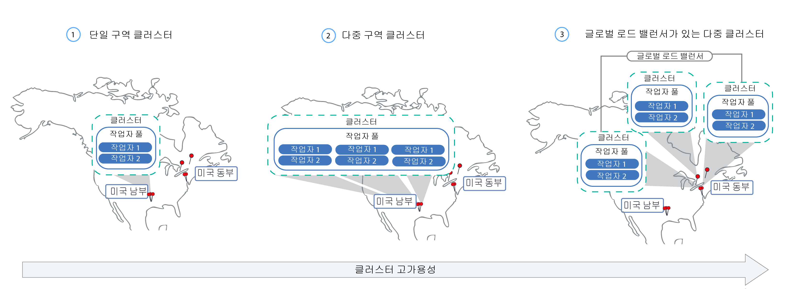

---

copyright:
  years: 2014, 2018
lastupdated: "2018-12-05"

---

{:new_window: target="_blank"}
{:shortdesc: .shortdesc}
{:screen: .screen}
{:pre: .pre}
{:table: .aria-labeledby="caption"}
{:codeblock: .codeblock}
{:tip: .tip}
{:note: .note}
{:important: .important}
{:deprecated: .deprecated}
{:download: .download}


# 클러스터 및 작업자 노드 설정 계획
{: #plan_clusters}
{{site.data.keyword.containerlong}}에서 앱의 최대 가용성 및 용량을 제공하기 위한 표준 클러스터를 디자인하십시오.

## 고가용성 클러스터
{: #ha_clusters}

다중 작업자 노드, 구역 및 클러스터 간에 앱을 분배하면 사용자에게 작동 중지 시간이 발생할 가능성이 낮아질 수 있습니다. 로드 밸런싱 및 격리 등의 기본 제공 기능을 사용하면 호스트, 네트워크 또는 앱에서 잠재적 장애가 발생할 때 복원성이 높아집니다.
{: shortdesc}

가용도의 증가 순으로 정렬된 다음의 잠재적 클러스터 설정을 검토하십시오.



1. 작업자 풀에 다중 작업자 노드가 있는 [단일 구역 클러스터](#single_zone).
2. 한 지역 내의 구역 간에 작업자 노드를 전개하는 [다중 구역 클러스터](#multizone).
3. 구역 또는 지역 간에 설정되었으며 글로벌 로드 밸런서를 통해 연결된 [다중 클러스터](#multiple_clusters).

## 단일 구역 클러스터
{: #single_zone}

클러스터에서 하나의 작업자 노드를 사용할 수 없는 경우 장애 복구를 허용하고 앱의 가용성을 개선하려면 추가로 작업자 노드를 단일 구역 클러스터에 추가하십시오.
{: shortdesc}


기본적으로, 단일 구역 클러스터는 이름이 `default`인 작업자 풀로 설정됩니다. 작업자 풀은 클러스터 작성 중에 정의한 것과 동일한 구성(예: 머신 유형)으로 작업자 노드를 그룹화합니다. [기존 작업자 풀의 크기를 조정](cs_clusters.html#resize_pool)하거나 [새 작업자 풀을 추가](cs_clusters.html#add_pool)하여 클러스터에 작업자 노드를 더 추가할 수 있습니다.

작업자 노드를 더 추가하면 다중 작업자 노드 간에 앱 인스턴스를 분배할 수 있습니다. 하나의 작업자 노드가 작동 중지되면 사용 가능한 작업자 노드의 앱 인스턴스가 계속해서 실행됩니다. Kubernetes는 사용 불가능한 작업자 노드에서 팟(Pod)을 자동으로 다시 스케줄하여 앱의 성능과 용량을 보장합니다. 팟(Pod)이 작업자 노드 간에 균등하게 분배되도록 보장하려면 [팟(Pod) 친화성](https://kubernetes.io/docs/concepts/configuration/assign-pod-node/#inter-pod-affinity-and-anti-affinity-beta-feature)을 구현하십시오.

**내 단일 구역 클러스터를 다중 구역 클러스터로 변환할 수 있습니까?**</br>
클러스터가 [지원되는 다중 구역 메트로 시티](cs_regions.html#zones) 중 하나에 있으면 가능합니다. [독립형 작업자 노드에서 작업자 풀로 업데이트](cs_cluster_update.html#standalone_to_workerpool)를 참조하십시오.


**다중 구역 클러스터를 사용해야 합니까?**</br>
아니오. 원하는 수 만큼의 단일 구역 클러스터를 작성할 수 있습니다. 실제로, 단순한 관리를 위해 또는 클러스터가 특정 [단일 구역 시티](cs_regions.html#zones)에 상주해야 하는 경우에는 단일 구역 클러스터를 선호할 수 있습니다.

**단일 구역에서 고가용성 마스터를 보유할 수 있습니까?**</br>
예, Kubernetes 버전 1.10 이상을 실행하는 클러스터에서 가능합니다. 단일 구역에서, 마스터는 고가용성이며 가동 중단(예: 마스터 업데이트 중에)에 대해 보호할 수 있도록 Kubernetes API 서버, etcd, 스케줄러 및 제어기 관리자에 대해 별도 실제 호스트의 복제본을 포함합니다. 구역 장애에 대해 보호하기 위해 다음을 수행할 수 있습니다.
* 마스터가 구역 간에 전개되어 있는 [다중 구역 가능 구역에서 클러스터를 작성](cs_clusters_planning.html#multizone)합니다. 
* [다중 클러스터를 작성](#multiple_clusters)하고 이를 글로벌 로드 밸런서와 연결합니다. 

## 다중 구역 클러스터
{: #multizone}

{{site.data.keyword.containerlong}}에서 다중 구역 클러스터를 작성할 수 있습니다. 작업자 풀을 사용하여 다중 작업자 노드와 구역 간에 앱을 분배하면 사용자에게 작동 중지 시간이 발생할 가능성이 낮아집니다. 로드 밸런싱 같은 기본 제공 기능은 호스트, 네트워크 또는 앱에서 발생하는 잠재적 구역 장애에 대한 복원성을 높여줍니다. 한 구역의 리소스가 작동 중지되는 경우, 클러스터 워크로드는 기타 구역에서 여전히 작동됩니다. 
**참고**: 오직 단일 구역 클러스터만 {{site.data.keyword.Bluemix_dedicated_notm}} 인스턴스에 사용할 수 있습니다.
{: shortdesc}

**작업자 풀은 무엇입니까?**</br>
작업자 풀은 시스템 유형, CPU 및 메모리 등의 특성이 동일한 작업자 노드의 콜렉션입니다. 새 클러스터를 작성하면 기본 작업자 풀이 사용자를 위해 자동으로 작성됩니다. 구역 간의 풀에서 작업자 노드를 전개하거나 풀에 작업자 노드를 추가하거나 작업자 노드를 업데이트하려면 새 `ibmcloud ks worker-pool` 명령을 사용할 수 있습니다.

**독립형 작업자 노드를 계속 사용할 수 있습니까?**</br>
독립형 작업자 노드의 이전 클러스터 설정은 지원은 되지만 더 이상 사용되지 않습니다. 독립형 작업자 노드 대신 사용자의 작업자 노드를 구성하려면 반드시 [작업자 풀을 클러스터에 추가](cs_clusters.html#add_pool)한 후에 [작업자 풀을 사용](cs_cluster_update.html#standalone_to_workerpool)하십시오. 

**내 단일 구역 클러스터를 다중 구역 클러스터로 변환할 수 있습니까?**</br>
클러스터가 [지원되는 다중 구역 메트로 시티](cs_regions.html#zones) 중 하나에 있으면 가능합니다. [독립형 작업자 노드에서 작업자 풀로 업데이트](cs_cluster_update.html#standalone_to_workerpool)를 참조하십시오.


### 다중 구역 클러스터 설정에 대한 자세한 설명
{: #mz_setup}


클러스터에 구역을 더 추가하여 한 지역 내의 다중 구역 간의 작업자 풀에서 작업자 노드를 복제할 수 있습니다. 다중 구역 클러스터는 가용성 및 장애 복구를 보장하기 위해 작업자 노드와 구역 간에 팟(Pod)을 균등하게 스케줄하도록 디자인되어 있습니다. 작업자 노드가 구역 간에 균등하게 전개되지 않았거나 구역 중 하나의 용량이 충분하지 않은 경우, Kubernetes 스케줄러가 요청된 모든 팟(Pod)을 스케줄하지 못할 수 있습니다. 결과적으로, 충분한 용량이 사용 가능할 때까지 팟(Pod)이 **보류** 상태가 될 수 있습니다. Kubernetes 스케줄러가 최상의 분배로 구역 간에 팟(Pod)을 분배하도록 하는 기본 동작을 변경하려면 `preferredDuringSchedulingIgnoredDuringExecution` [팟(Pod) 친화성 정책](https://kubernetes.io/docs/concepts/configuration/assign-pod-node/#inter-pod-affinity-and-anti-affinity-beta-feature)을 사용하십시오.

**3개의 구역에서 작업자 노드가 필요한 이유는 무엇입니까?** </br>
3개의 구역 간에 작업 로드를 분배하면 1 - 2개의 구역을 사용할 수 없는 경우에 앱에 대한 고가용성을 보장할 수 있을 뿐 아니라, 이에 따라 클러스터 설정을 보다 비용 효율적으로 만들 수 있습니다. 그 이유가 궁금하면 아래의 예를 살펴보십시오.

앱의 워크로드를 처리하기 위해 6개의 코어가 있는 작업자 노드가 필요하다고 가정합니다. 클러스터의 가용성을 높이기 위해 다음 옵션을 사용할 수 있습니다.

- **다른 구역에 리소스 복제:** 이 옵션을 사용하면 2개의 작업자 노드가 지정되며, 각각에는 각 구역에 6개의 코어가 있으므로 이는 총 12개의 코어가 됩니다. </br>
- **3개의 구역 간에 리소스 분배:** 이 옵션을 사용하면 구역당 3개의 코어를 배치하며, 이에 따라 9개 코어의 총 용량이 지정됩니다. 워크로드를 처리하려면 2개의 구역이 동시에 구동되어야 합니다. 하나의 구역을 사용할 수 없는 경우에는 다른 2개의 구역이 워크로드를 처리할 수 있습니다. 2개의 구역을 사용할 수 없는 경우에는 나머지 3개의 코어가 워크로드를 처리하기 위해 구동됩니다. 구역당 3개의 코어를 배치하는 것은 시스템의 수가 감소되어 비용이 절감됨을 의미합니다.</br>

**내 Kubernetes 마스터는 어떻게 설정되어 있습니까?** </br>
다중 구역 클러스터는 작업자와 동일한 메트로 영역에서 프로비저닝된 단일 또는 고가용성(Kubernetes 1.10 이상의) Kubernetes 마스터로 설정됩니다. 
또한 다중 구역 클러스터를 작성하는 경우에는 고가용성 마스터가 구역 간에 전개됩니다. 예를 들어, 클러스터가 `dal10`, `dal12` 또는 `dal13` 구역에 있으면 마스터는 달라스 다중 구역 메트로 시티의 각 구역에 전개됩니다. 

**Kubernetes 마스터를 사용할 수 없게 되면 어떻게 됩니까?** </br>
[Kubernetes 마스터](cs_tech.html#architecture)는 클러스터가 시작하고 계속 실행되도록 하는 기본 컴포넌트입니다. 마스터는 클러스터에 대한 SPOT(Single Point of Truth) 역할을 하는 etcd 데이터베이스에 클러스터 리소스와 해당 구성을 저장합니다. Kubernetes API 서버는 마스터에 대한 작업자 노드의 모든 클러스터 관리 요청을 위한 기본 시작점입니다. 또는 클러스터 리소스와 상호 작용하고자 할 때의 시작점이기도 합니다.<br><br>마스터 장애 발생 시에 워크로드는 작업자 노드에서 계속 실행되지만, 마스터의 Kubernetes API 서버가 백업될 때까지는 사용자가 `kubectl` 명령을 사용하여 클러스터 리소스 관련 작업을 수행하거나 클러스터 상태를 확인할 수 없습니다. 마스터 가동 중단 중에 팟(Pod)이 중지되는 경우에는 작업자 노드가 다시 Kubernetes API 서버에 접속할 수 있을 때까지 팟(Pod)을 다시 스케줄할 수 없습니다.<br><br>마스터 가동 중단 중에도 사용자는 여전히 {{site.data.keyword.containerlong_notm}} API에 대해 `ibmcloud ks` 명령을 실행하여 인프라 리소스(예: 작업자 노드 또는 VLAN) 관련 작업을 수행할 수 있습니다. 작업자 노드를 클러스터에 추가하거나 이에서 제거하여 현재 클러스터 구성을 변경하는 경우에는 마스터가 백업될 때까지 변경사항이 발생하지 않습니다.

마스터 가동 중단 중에는 작업자 노드를 다시 시작하거나 재부팅하지 마십시오. 이 조치를 수행하면 작업자 노드에서 팟(Pod)이 제거됩니다. Kubernetes API 서버가 사용 불가능하므로 클러스터의 다른 작업자 노드로 팟(Pod)을 다시 스케줄할 수 없습니다.
{: important}


Kubernetes 마스터 장애에 대해 또는 다중 구역 클러스터를 사용할 수 없는 지역에서 클러스터를 보호하기 위해 [다중 클러스터를 설정하고 이를 글로벌 로드 밸런서와 연결](#multiple_clusters)할 수 있습니다.

**마스터가 구역 간의 작업자와 통신할 수 있도록 하려면 내가 해야 할 일이 있습니까?**</br>
예. 클러스터용 다중 VLAN, 동일한 VLAN의 다중 서브넷 또는 다중 구역 클러스터가 있는 경우에는 작업자 노드가 사설 네트워크에서 서로 간에 통신할 수 있도록 IBM Cloud 인프라(SoftLayer) 계정에 대해 [VLAN Spanning](/docs/infrastructure/vlans/vlan-spanning.html#vlan-spanning)을 사용으로 설정해야 합니다. 이 조치를 수행하려면 **네트워크 > 네트워크 VLAN Spanning 관리** [인프라 권한](cs_users.html#infra_access)이 필요합니다. 또는 이를 사용으로 설정하도록 계정 소유자에게 요청할 수 있습니다. VLAN Spanning이 이미 사용으로 설정되었는지 확인하려면 `ibmcloud ks vlan-spanning-get` [명령](/docs/containers/cs_cli_reference.html#cs_vlan_spanning_get)을 사용하십시오. {{site.data.keyword.BluDirectLink}}를 사용 중인 경우에는 [VRF(Virtual Router Function)](/docs/infrastructure/direct-link/subnet-configuration.html#more-about-using-vrf)를 대신 사용해야 합니다. VRF를 사용하려면 IBM Cloud 인프라(SoftLayer) 계정 담당자에게 문의하십시오.

**공용 인터넷에서 내 사용자가 내 앱에 액세스할 수 있도록 하려면 어떻게 해야 합니까?**</br>
Ingress 애플리케이션 로드 밸런서(ALB) 또는 로드 밸런서 서비스를 사용하여 앱을 노출할 수 있습니다.

- **Ingress 애플리케이션 로드 밸런서(ALB):** 기본적으로, 공용 ALB는 클러스터의 각 구역에서 자동으로 작성되고 사용하도록 설정됩니다. 각 지역마다 1개의 MZLB가 존재할 수 있도록 클러스터의 Cloudflare 다중 구역 로드 밸런서(MZLB) 역시 자동으로 작성되고 배치됩니다. MZLB는 동일한 호스트 이름 뒤에 사용자 ALB의 IP 주소를 지정하며, 이러한 IP 주소에 대한 상태 검사를 사용하여 사용 가능 여부를 판별합니다. 예를 들어, 미국 동부 지역의 3개 구역에 작업자 노드가 있으면 `yourcluster.us-east.containers.appdomain.cloud`에 3개의 ALB IP 주소가 있습니다. MZLB 상태는 지역의 각 구역에서 공용 ALB IP를 검사하며, 이러한 상태 검사를 기반으로 DNS 검색 결과가 지속적으로 업데이트되도록 합니다. 자세한 정보는 [Ingress 컴포넌트 및 아키텍처](cs_ingress.html#planning)를 참조하십시오.

- **로드 밸런서 서비스:** 로드 밸런서 서비스는 하나의 구역에서만 설정됩니다. 앱에 대한 수신 요청은 하나의 해당 구역에서 다른 구역의 모든 앱 인스턴스로 라우팅됩니다. 이 영역을 사용할 수 없게 되면 인터넷에서 앱에 접속할 수 없습니다. 단일 구역 장애를 처리하기 위해 다른 구역에서 추가 로드 밸런서 서비스를 설정할 수 있습니다. 자세한 정보는 고가용성 [로드 밸런서 서비스](cs_loadbalancer.html#multi_zone_config)를 참조하십시오.

**내 다중 구역 클러스터에 대해 지속적 스토리지를 설정할 수 있습니까?**</br>
고가용성 지속적 스토리지의 경우에는 [{{site.data.keyword.cloudant_short_notm}}](/docs/services/Cloudant/getting-started.html#getting-started-with-cloudant) 또는 [{{site.data.keyword.cos_full_notm}}](/docs/services/cloud-object-storage/about-cos.html#about-ibm-cloud-object-storage) 등의 클라우드 서비스를 사용하십시오.

NFS 파일 및 블록 스토리지는 구역 간에 공유될 수 없습니다. 지속적 볼륨은 실제 스토리지 디바이스가 있는 구역에서만 사용될 수 있습니다. 계속 사용하려는 클러스터에 기존 NFS 파일 또는 블록 스토리지가 있는 경우에는 기존의 지속적 볼륨에 지역 및 구역 레이블을 적용해야 합니다. 이러한 레이블은 kube-scheduler가 지속적 볼륨을 사용하는 앱의 스케줄 위치를 판별하는 데 도움이 됩니다. 다음 명령을 실행하고 `<mycluster>`를 클러스터 이름으로 대체하십시오.

```
    bash <(curl -Ls https://raw.githubusercontent.com/IBM-Cloud/kube-samples/master/file-pv-labels/apply_pv_labels.sh) <mycluster>
```
{: pre}

**내 다중 구역 클러스터를 작성했습니다. 왜 여전히 하나의 구역만 있습니까? 내 클러스터에 구역을 추가하는 방법은 무엇입니까?**</br>
[CLI를 사용하여 다중 구역 클러스터를 작성](cs_clusters.html#clusters_cli)한 경우, 클러스터는 작성되었지만 프로세스를 완료하려면 사용자가 구역을 작업자 풀에 추가해야 합니다. 다중 구역 간에 전개하려면 클러스터가 [다중 구역 메트로 시티](cs_regions.html#zones)에 있어야 합니다. 구역을 클러스터에 추가하고 구역 간에 작업자 노드를 전개하려면 [클러스터에 구역 추가](cs_clusters.html#add_zone)를 참조하십시오.

### 현재 내 클러스터를 관리하는 방법에서 일부 변경사항이 있습니까?
{: #mz_new_ways}

작업자 풀을 도입함에 따라 새로운 API 및 명령 세트를 사용하여 클러스터를 관리할 수 있습니다. `ibmcloud ks help`를 실행하여 터미널에서 또는 [CLI 문서 페이지](cs_cli_reference.html#cs_cli_reference)에서 이러한 새 명령을 볼 수 있습니다.

다음 표에서는 몇 가지 공통된 클러스터 관리 조치에 대해 이전 방법과 새 방법을 비교합니다.
<table summary="표에서는 다중 구역 명령을 수행하는 새 방법에 대한 설명을 보여줍니다. 행은 왼쪽에서 오른쪽 방향으로 읽어야 하며, 설명은 1열에 있고 이전 방법은 2열에 있으며 새 다중 구역 방법은 3열에 있습니다.">
<caption>다중 구역 작업자 풀 명령에 대한 새 방법.</caption>
  <thead>
  <th>설명</th>
  <th>이전 독립형 작업자 노드</th>
  <th>새 다중 구역 작업자 풀</th>
  </thead>
  <tbody>
    <tr>
    <td>클러스터에 작업자 노드를 추가합니다.</td>
    <td><p class="deprecated"><code>ibmcloud ks worker-add</code>: 독립형 작업자 노드 추가. </p></td>
    <td><ul><li>기존 풀과는 다른 머신 유형을 추가하려는 경우 <code>ibmcloud ks worker-pool-create</code> [명령](cs_cli_reference.html#cs_worker_pool_create)으로 새 작업자 풀을 작성합니다.</li>
    <li>기존 풀에 작업자 노드를 추가하려는 경우 <code>ibmcloud ks worker-pool-resize</code> [명령](cs_cli_reference.html#cs_worker_pool_resize)으로 풀에서 구역당 노드 수의 크기를 조정합니다.</li></ul></td>
    </tr>
    <tr>
    <td>클러스터에서 작업자 노드를 제거합니다.</td>
    <td><code>ibmcloud ks worker-rm</code>: 클러스터에서 문제가 있는 작업자 노드를 삭제하기 위해 이를 여전히 사용할 수 있습니다.</td>
    <td><ul><li>작업자 풀의 밸런스가 유지되지 않는 경우(예: 작업자 노드 제거 이후)에는 <code>ibmcloud ks worker-pool-rebalance</code> [명령](cs_cli_reference.html#cs_rebalance)으로 이를 리밸런싱합니다.</li>
    <li>풀에서 작업자 노드의 수를 줄이려는 경우 <code>ibmcloud ks worker-pool-resize</code> [명령](cs_cli_reference.html#cs_worker_pool_resize)으로 구역당 수를 조정합니다(최소값 1).</li></ul></td>
    </tr>
    <tr>
    <td>작업자 노드에 대해 새 VLAN을 사용합니다.</td>
    <td><p class="deprecated">새 사설 또는 공용 VLAN을 사용하는 새 작업자 노드 추가: <code>ibmcloud ks worker-add</code>.</p></td>
    <td><code>ibmcloud ks zone-network-set</code> [명령](cs_cli_reference.html#cs_zone_network_set)으로 이전에 사용했던 것과 다른 공용 또는 사설 VLAN을 사용하도록 작업자 풀을 설정합니다.</td>
    </tr>
  </tbody>
  </table>

## 글로벌 로드 밸런서와 연결된 다중 클러스터
{: #multiple_clusters}

Kubernetes 마스터 장애로부터 또는 다중 구역 클러스터를 사용할 수 없는 지역에 대해 앱을 보호하기 위해 지역 내의 서로 다른 구역에서 다중 클러스터를 작성하고 이를 글로벌 로드 밸런서와 연결할 수 있습니다.
{: shortdesc}


다중 클러스터 간에 워크로드의 밸런스를 유지하려면 글로벌 로드 밸런서를 설정하고 애플리케이션 로드 밸런서(ALB) 또는 로드 밸런서 서비스의 IP 주소를 도메인에 추가해야 합니다. 이러한 IP 주소를 추가하면 클러스터 간에 수신 트래픽을 라우팅할 수 있습니다. 클러스터 중 하나가 사용 불가능한지를 글로벌 로드 밸런서가 감지할 수 있도록 하려면 모든 IP 주소에 대한 Ping 기반 상태 검사의 추가를 고려하십시오. 이 검사를 설정하면 DNS 제공자가 도메인에 추가된 IP 주소에 대해 주기적으로 ping을 실행합니다. 하나의 IP 주소가 사용 불가능하게 되면 트래픽이 더 이상 이 IP 주소로 전송되지 않습니다. 그러나 Kubernetes는 사용 가능한 클러스터의 작업자 노드에서 사용 불가능한 클러스터의 팟(Pod)을 자동으로 다시 시작하지 않습니다. Kubernetes가 사용 가능한 클러스터의 팟(Pod)을 자동으로 다시 시작하도록 하려면 [다중 구역 클러스터](#multizone) 설정을 고려하십시오.

**3개의 구역에서 3개의 클러스터가 필요한 이유는 무엇입니까?** </br>
[다중 구역 클러스터에서 3개 구역](#multizone) 사용과 유사하게, 사용자는 구역 간에 3개의 클러스터를 설정하여 앱에 대한 추가 가용성을 제공할 수 있습니다. 또한 워크로드 처리를 위한 시스템 구매 수량을 줄임으로써 비용을 감소시킬 수도 있습니다.

**지역 간에 다중 클러스터를 설정하려면 어떻게 합니까?** </br>
하나의 지리적 위치의 서로 다른 지역에서(예: 미국 남부 및 미국 동부) 또는 지리적 위치 간에(예: 미국 남부 및 EU 중앙) 다중 클러스터를 설정할 수 있습니다. 두 설정 모두 사용자의 앱에 대해 동일한 레벨의 가용성을 제공하지만, 데이터 공유 및 데이터 복제와 관련해서는 복잡도 역시 추가됩니다. 대부분의 경우에는 동일한 지리적 위치 내에 있는 것으로도 충분합니다. 그러나 사용자가 전세계에 걸쳐 있는 경우에는 앱에 요청을 전송할 때 사용자가 오래 기다리지 않도록 사용자가 있는 클러스터를 설정하는 것이 바람직합니다.

**다중 클러스터에 대한 글로벌 로드 밸런서 설정:**

1. 다중 구역 또는 지역에서 [클러스터를 작성](cs_clusters.html#clusters)하십시오.
2. 클러스터용 다중 VLAN, 동일한 VLAN의 다중 서브넷 또는 다중 구역 클러스터가 있는 경우에는 작업자 노드가 사설 네트워크에서 서로 간에 통신할 수 있도록 IBM Cloud 인프라(SoftLayer) 계정에 대해 [VLAN Spanning](/docs/infrastructure/vlans/vlan-spanning.html#vlan-spanning)을 사용으로 설정해야 합니다. 이 조치를 수행하려면 **네트워크 > 네트워크 VLAN Spanning 관리** [인프라 권한](cs_users.html#infra_access)이 필요합니다. 또는 이를 사용으로 설정하도록 계정 소유자에게 요청할 수 있습니다. VLAN Spanning이 이미 사용으로 설정되었는지 확인하려면 `ibmcloud ks vlan-spanning-get` [명령](/docs/containers/cs_cli_reference.html#cs_vlan_spanning_get)을 사용하십시오. {{site.data.keyword.BluDirectLink}}를 사용 중인 경우에는 [VRF(Virtual Router Function)](/docs/infrastructure/direct-link/subnet-configuration.html#more-about-using-vrf)를 대신 사용해야 합니다. VRF를 사용하려면 IBM Cloud 인프라(SoftLayer) 계정 담당자에게 문의하십시오.
3. 각 클러스터에서 [애플리케이션 로드 밸런서(ALB)](cs_ingress.html#ingress_expose_public) 또는 [로드 밸런서 서비스](cs_loadbalancer.html)를 사용하여 앱을 노출하십시오.
4. 각 클러스터에 대해 로드 밸런서 서비스 또는 ALB에 대한 공인 IP 주소를 나열하십시오.
   - 클러스터에 있는 모든 공용 가능 ALB의 IP 주소를 나열하려면 다음을 수행하십시오.
     ```
     ibmcloud ks albs --cluster <cluster_name_or_id>
     ```
     {: pre}

   - 로드 밸런서 서비스의 IP 주소를 나열하려면 다음을 수행하십시오.
     ```
     kubectl describe service <myservice>
     ```
     {: pre}

          **로드 밸런서 Ingress** IP 주소는 로드 밸런서 서비스에 지정된 포터블 IP 주소입니다.

4.  {{site.data.keyword.Bluemix_notm}} Internet Services(CIS)를 사용하여 글로벌 로드 밸런서를 설정하거나 자체 글로벌 로드 밸런서를 설정하십시오.

    **CIS 글로벌 로드 밸런서를 사용**하려면 다음을 수행하십시오.
    1.  [{{site.data.keyword.Bluemix_notm}} Internet Services(CIS) 시작하기](/docs/infrastructure/cis/getting-started.html#getting-started-with-ibm-cloud-internet-services-cis-)의 1 - 4단계에 따라 서비스를 설정하십시오.
        *  1 - 3단계에서는 서비스 인스턴스 프로비저닝, 앱 도메인 추가 및 이름 서버 구성을 안내합니다.
        * 4단계에서 DNS 레코드 작성을 안내합니다. 수집한 각 ALB 또는 로드 밸런서 IP 주소에 대한 DNS 레코드를 작성하십시오. 이러한 DNS 레코드는 앱 도메인을 모든 클러스터 ALB 또는 로드 밸런서에 맵핑하며 앱 도메인에 대한 요청이 라운드 로빈 주기로 클러스터에 전달되도록 보장합니다.
    2. ALB 또는 로드 밸런서에 대한 [상태 검사를 추가](/docs/infrastructure/cis/glb-setup.html#add-a-health-check)하십시오. 모든 클러스터에서 ALB 또는 로드 밸런서에 대해 동일한 상태 검사를 사용하거나 특정 클러스터에 사용할 특정 상태 검사를 작성할 수 있습니다.
    3. 클러스터의 ALB 또는 로드 밸런서 IP를 추가하여 각 클러스터에 대한 [오리진 풀을 추가](/docs/infrastructure/cis/glb-setup.html#add-a-pool)하십시오. 예를 들어, 각각 2개의 ALB가 있는 3개의 클러스터를 보유한 경우에는 각각 2개의 ALB IP 주소가 있는 3개의 오리진 풀을 작성하십시오. 작성되는 각 오리진 풀에 상태 검사를 추가하십시오.
    4. [글로벌 로드 밸런서를 추가](/docs/infrastructure/cis/glb-setup.html#set-up-and-configure-your-load-balancers)하십시오.

    **자체 글로벌 로드 밸런서를 사용**하려면 다음을 수행하십시오.
    1. 모든 공용 가능 ALB 및 로드 밸런서 서비스의 IP 주소를 도메인에 추가하여 수신 트래픽을 ALB 또는 로드 밸런서 서비스로 라우팅하도록 도메인을 구성하십시오.
    2. 각 IP 주소에 대해 DNS 제공자가 비정상적인 IP 주소를 감지할 수 있도록 Ping 기반 상태 검사를 사용하십시오. 비정상적인 IP 주소가 감지되면 트래픽이 더 이상 이 IP 주소로 라우팅되지 않습니다.

## 개인용 클러스터
{: #private_clusters}

기본적으로 {{site.data.keyword.containerlong_notm}}는 사설 VLAN 및 공용 VLAN에 대한 액세스 권한으로 클러스터를 설정합니다. 사설 VLAN은 각 작업자 노드에 지정된 사설 IP 주소를 판별하며, 이는 각 작업자 노드에 사설 네트워크 인터페이스를 제공합니다. 공용 VLAN을 사용하면 작업자 노드가 자동으로 안전하게 마스터에 연결할 수 있습니다.

사설 VLAN을 통한 트래픽은 허용하면서 공용 VLAN을 통한 공용 트래픽은 차단하기 위해 클러스터를 잠그려는 경우에는 [Calico 네트워크 정책으로 공용 액세스로부터 클러스터를 보호](cs_network_cluster.html#both_vlans_private_services)할 수 있습니다. 이러한 Calico 네트워크 정책은 작업자 노드가 마스터와 통신하는 것을 막지 않습니다. [네트워킹 워크로드를 에지 작업자 노드로 격리](cs_edge.html)함으로써 공용 트래픽을 차단하지 않으면서 클러스터의 취약 부분을 제한할 수도 있습니다.

사설 VLAN에 대한 액세스 권한만 있는 클러스터를 작성하려는 경우에는 단일 구역 또는 다중 구역 개인용 클러스터를 작성할 수 있습니다. 그러나 작업자 노드가 사설 VLAN에만 연결되어 있으면 작업자 노드가 자동으로 마스터에 연결할 수 없습니다. 작업자 노드와 마스터 간의 네트워크 연결을 제공하도록 게이트웨이 어플라이언스를 구성해야 합니다.

개인 전용 클러스터가 되도록 공용 및 사설 VLAN에 연결된 클러스터를 변환할 수 없습니다. 클러스터에서 모든 공용 VLAN을 제거하면 여러 클러스터 컴포넌트의 작동이 중지됩니다. 다음 단계를 사용하여 새 클러스터를 작성해야 합니다.
{: note}

사설 VLAN에 대한 액세스 권한만 있는 클러스터를 작성하려면 다음을 수행하십시오.

1.  [개인 전용 클러스터 네트워킹 계획](cs_network_cluster.html#private_vlan)을 검토하십시오.
2.  네트워크 연결을 위한 게이트웨이 어플라이언스를 구성하십시오. 참고로, 사용자는 방화벽의 [필수 포트와 IP 주소를 열고](cs_firewall.html#firewall_outbound) 서브넷에 대해 [VLAN Spanning을 사용으로 설정](cs_subnets.html#vra-routing)해아 합니다.
3.  `--private-only` 플래그를 포함하여 [CLI를 사용하여 클러스터를 작성](cs_clusters.html#clusters_cli)하십시오.
4.  개인용 NodePort, 로드 밸런서 또는 Ingress 서비스를 사용하여 사설 네트워크에 앱을 노출하려면 [사설 VLAN 전용 설정을 위한 사설 외부 네트워킹 계획](cs_network_planning.html#private_vlan)을 검토하십시오. 서비스는 개인용 IP 주소에서만 액세스가 가능하며, 사용자는 사설 IP 주소를 사용하도록 방화벽의 포트를 구성해야 합니다.


## 작업자 풀 및 작업자 노드
{: #planning_worker_nodes}

Kubernetes 클러스터는 작업자 노드 풀에서 그룹화되고 Kubernetes 마스터에 의해 중앙 집중식으로 모니터되고 관리되는 작업자 노드로 구성되어 있습니다. 클러스터 관리자는 클러스터 사용자가 클러스터에서 앱을 배치하고 실행하기 위한 모든 리소스를 보유하도록 보장하기 위해 작업자 노드의 클러스터를 설정하는 방법을 결정합니다.
{:shortdesc}

표준 클러스터를 작성하면 동일한 메모리, CPU 및 디스크 공간 스펙(특성)의 작업자 노드가 사용자를 대신하여 IBM Cloud 인프라(SoftLayer)에서 주문되며 클러스터의 기본 작업자 노드 풀에 추가됩니다. 모든 작업자 노드에는 클러스터가 작성된 이후 변경될 수 없는 고유 작업자 노드 ID 및 도메인 이름이 지정됩니다. 가상 서버 또는 실제(베어메탈) 서버 중에서 선택할 수 있습니다. 사용자가 선택하는 하드웨어 격리 레벨에 따라서 가상 작업자 노드를 공유 또는 전용 노드로 설정할 수 있습니다. 다른 특성을 클러스터에 추가하려면 [다른 작업자 풀을 작성](cs_cli_reference.html#cs_worker_pool_create)하십시오.

Kubernetes는 클러스터에 속할 수 있는 작업자 노드의 최대수를 제한합니다. 자세한 정보는 [작업자 노드 및 팟(Pod) 할당량 ](https://kubernetes.io/docs/setup/cluster-large/)을 검토하십시오.


## 작업자 노드에 사용 가능한 하드웨어
{: #shared_dedicated_node}

{{site.data.keyword.Bluemix_notm}}에서 표준 클러스터를 작성하는 경우, 사용자는 작업자 풀이 실제 머신(베어메탈)이거나 실제 하드웨어에서 실행되는 가상 머신인 작업자 노드로 구성되는지 여부를 선택합니다. 또한 작업자 노드 특성 또는 메모리, CPU 및 기타 머신 스펙(예: 디스크 스토리지)의 조합도 선택합니다.
{:shortdesc}


둘 이상의 작업자 노드 특성을 원하는 경우에는 각 특성마다 작업자 풀을 작성해야 합니다. 무료 클러스터를 작성하면 작업자 노드가 IBM Cloud 인프라(SoftLayer) 계정에서 가상, 공유 노드로서 자동으로 프로비저닝됩니다. 표준 클러스터에서 사용자는 워크로드에 가장 최적으로 작동하는 시스템 유형을 선택할 수 있습니다. 계획을 수립할 때 총 CPU 및 메모리 용량의 [작업자 노드 리소스 예약](#resource_limit_node)을 고려하십시오. 

[콘솔 UI](cs_clusters.html#clusters_ui) 또는 [CLI](cs_clusters.html#clusters_cli)를 사용하여 클러스터를 배치할 수 있습니다.

다음 옵션 중 하나를 선택하여 원하는 작업자 풀의 유형을 결정하십시오.
* [가상 머신](#vm)
* [실제 머신(베어메탈)](#bm)
* [SDS(Software-Defined Storage) 머신](#sds)

### 가상 머신
{: #vm}

VM을 사용하면 더 비용 효율적인 가격으로 베어메탈보다 더 뛰어난 유연성, 빠른 프로비저닝 시간 및 자동화된 확장성 기능을 얻을 수 있습니다. 테스트 및 개발 환경, 스테이징 및 프로덕션 환경, 마이크로서비스 및 비즈니스 앱과 같은 가장 일반적인 용도의 유스 케이스에 VM을 사용할 수 있습니다. 그러나 성능에는 트레이드오프가 있을 수 있습니다. RAM, 데이터 및 GPU 집약적 워크로드를 처리하기 위해 고성능 컴퓨팅이 필요하면 [베어메탈](#bm)을 사용하십시오.
{: shortdesc}

**내가 공유 또는 전용 하드웨어를 사용해야 합니까?**</br>
표준 가상 클러스터를 작성하는 경우에는 기본 하드웨어를 여러 {{site.data.keyword.IBM_notm}} 고객이 공유하도록 할 것인지(멀티 테넌시) 또는 자체 전용으로 사용할 것인지(단일 테넌시) 여부를 선택해야 합니다.

* **멀티 테넌트, 공유 하드웨어 설정에서**: 실제 리소스(예: CPU 및 메모리)는 동일한 실제 하드웨어에 배치된 모든 가상 머신 간에 공유됩니다. 모든 가상 머신이 독립적으로 실행될 수 있도록 보장하기 위해, 가상 머신 모니터(하이퍼바이저라고도 함)는 실제 리소스를 격리된 엔티티로 세그먼트화하고 이를 전용 리소스로서 가상 머신에 할당합니다(하이퍼바이저 격리).
* **싱글 테넌트, 전용 하드웨어 설정에서**: 모든 실제 리소스는 자체 전용으로 사용됩니다. 동일한 실제 호스트에서 가상 머신으로서 여러 작업자 노드를 배치할 수 있습니다. 멀티 테넌트 설정과 유사하게, 하이퍼바이저는 모든 작업자 노드가 사용 가능한 실제 리소스의 해당 공유를 가져오도록 보장합니다.

기반 하드웨어의 비용이 여러 고객 간에 공유되므로, 공유 노드는 일반적으로 전용 노드보다 비용이 저렴합니다. 그러나 공유 및 전용 노드 간에 결정하는 경우, 사용자는 자체 법률 부서에 문의하여 앱 환경에서 요구하는 인프라 격리 및 준수의 레벨을 논의하고자 할 수 있습니다.

**VM의 일반적인 특징은 무엇입니까?**</br>
가상 머신은 신뢰성을 위해 SAN(Storage Area Networing) 대신 로컬 디스크를 사용합니다. 신뢰성을 갖게 되면 로컬 디스크에 바이트를 직렬화하는 경우 처리량이 많아지고 네트워크 장애로 인한 파일 시스템 성능 저하를 줄일 수 있습니다. 모든 VM에는 1000Mbps 네크워킹 속도, OS 파일 시스템용 25GB 기본 로컬 디스크 스토리지, 그리고 컨테이너 런타임 및 `kubelet` 등의 데이터용 100GB 보조 로컬 디스크 스토리지가 포함되어 있습니다. 작업자 노드에 있는 로컬 스토리지는 단기 처리만을 위한 것이며, 작업자 노드를 업데이트하거나 다시 로드하면 기본 및 보조 디스크의 내용은 삭제됩니다. 지속적 스토리지 솔루션은 [고가용성 지속적 스토리지 계획](cs_storage_planning.html#storage_planning)을 참조하십시오.

**더 이상 사용되지 않는 `u1c` 또는 `b1c` 머신 유형이 있으면 어떻게 됩니까?**</br>
`u2c` 및 `b2c` 머신 유형의 사용을 시작하려면 [작업자 노드를 추가하여 머신 유형을 업데이트](cs_cluster_update.html#machine_type)하십시오.

**어떤 가상 머신 특성을 사용할 수 있습니까?**</br>
머신 유형은 구역에 따라 다릅니다. 해당 구역에서 사용 가능한 머신 유형을 보려면 `ibmcloud ks machine-types <zone>`을 실행하십시오. 사용 가능한 [베어메탈](#bm) 또는 [SDS](#sds) 머신 유형을 검토할 수도 있습니다.

<table>
<caption>{{site.data.keyword.containerlong_notm}}에서 사용 가능한 가상 머신 유형.</caption>
<thead>
<th>이름 및 유스 케이스</th>
<th>코어 수 / 메모리</th>
<th>기본 / 보조 디스크</th>
<th>네트워크 속도</th>
</thead>
<tbody>
<tr>
<td><strong>가상, u2c.2x4</strong>: 빠른 테스트, 개념 증명(PoC) 및 기타 경량 워크로드에는 이 가장 작은 크기의 VM을 사용하십시오.</td>
<td>2 / 4GB</td>
<td>25GB / 100GB</td>
<td>1000Mbps</td>
</tr>
<tr>
<td><strong>가상, b2c.4x16</strong>: 테스트, 개발 및 기타 경량 워크로드의 경우 이 균형 VM을 선택하십시오.</td>
<td>4 / 16GB</td>
<td>25GB / 100GB</td>
<td>1000Mbps</td>
</tr>
<tr>
<td><strong>가상, b2c.16x64</strong>: 중간 규모의 워크로드의 경우 이 균형 VM을 선택하십시오.</td></td>
<td>16 / 64GB</td>
<td>25GB / 100GB</td>
<td>1000Mbps</td>
</tr>
<tr>
<td><strong>가상, b2c.32x128</strong>: 동시 사용자가 많은 데이터베이스 및 동적 웹 사이트와 같은 중간 규모에서 대규모 워크로드의 경우 이 균형 VM을 선택하십시오.</td></td>
<td>32 / 128GB</td>
<td>25GB / 100GB</td>
<td>1000Mbps</td>
</tr>
<tr>
<td><strong>가상, b2c.56x242</strong>: 동시 사용자가 많은 데이터베이스 및 다중 앱과 같은 대규모 워크로드의 경우 이 균형 VM을 선택하십시오.</td></td>
<td>56 / 242GB</td>
<td>25GB / 100GB</td>
<td>1000Mbps</td>
</tr>
<tr>
<td><strong>가상, c2c.16x16</strong>: 경량 워크로드의 경우 작업자 노드의 컴퓨팅 리소스에 대한 균등한 밸런스를 원하면 이 특성을 사용하십시오.</td></td>
<td>16 / 16GB</td>
<td>25GB / 100GB</td>
<td>1000Mbps</td>
</tr><tr>
<td><strong>가상, c2c.16x32</strong>: 경량에서 중형급 워크로드를 위해 작업자 노드의 CPU 및 메모리 리소스의 비율이 1:2가 되기를 원하는 경우에는 이 특성을 사용하십시오.</td></td>
<td>16 / 32GB</td>
<td>25GB / 100GB</td>
<td>1000Mbps</td>
</tr><tr>
<td><strong>가상, c2c.32x32</strong>: 중형급 워크로드의 경우 작업자 노드의 컴퓨팅 리소스에 대한 균등한 밸런스를 원하면 이 특성을 사용하십시오.</td></td>
<td>32 / 32GB</td>
<td>25GB / 100GB</td>
<td>1000Mbps</td>
</tr><tr>
<td><strong>가상, c2c.32x64</strong>: 중형급 워크로드를 위해 작업자 노드의 CPU 및 메모리 리소스의 비율이 1:2가 되기를 원하는 경우에는 이 특성을 사용하십시오.</td></td>
<td>32 / 64GB</td>
<td>25GB / 100GB</td>
<td>1000Mbps</td>
</tr>
</tbody>
</table>

### 실제 머신(베어메탈)
{: #bm}

베어메탈이라고도 하는 싱글 테넌트 실제 서버로서 작업자 노드를 프로비저닝할 수 있습니다.
{: shortdesc}

**베어메탈과 VM의 차이점은 무엇입니까?**</br>
베어메탈은 메모리 또는 CPU와 같이 머신의 실제 리소스에 직접 액세스를 제공합니다. 이 설정은 호스트에서 실행되는 가상 머신에 실제 리소스를 할당하는 가상 머신 하이퍼바이저를 제거합니다. 대신, 모든 베어메탈 머신의 리소스가 작업자 전용으로만 사용되므로 리소스를 공유하거나 성능을 저하시키는 "시끄러운 이웃(noisy neighbors)" 문제를 신경쓰지 않아도 됩니다. 실제 머신 유형에는 가상 머신 유형보다 더 많은 로컬 스토리지가 있으며, 일부에는 데이터 가용성 향상을 위한 RAID 구성이 있습니다. 작업자 노드에 있는 로컬 스토리지는 단기 처리만을 위한 것이며, 작업자 노드를 업데이트하거나 다시 로드하면 기본 및 보조 디스크의 내용은 삭제됩니다. 지속적 스토리지 솔루션은 [고가용성 지속적 스토리지 계획](cs_storage_planning.html#storage_planning)을 참조하십시오.

**성능 향상을 위한 우수한 스펙 외에, VM에서 수행할 수 없는 작업을 베어메탈에서 수행할 수 있습니까?**</br>
예. 베어메탈에서는 신뢰할 수 있는 컴퓨팅을 사용하여 작업자 노드의 변조 여부를 확인하는 옵션이 있습니다. 클러스터 작성 중에 신뢰 사용을 설정하지 않고 나중에 이를 수행하려면 `ibmcloud ks feature-enable` [명령](cs_cli_reference.html#cs_cluster_feature_enable)을 사용할 수 있습니다. 신뢰를 사용하도록 설정한 후에는 나중에 사용하지 않도록 설정할 수 없습니다. 신뢰가 없는 새 클러스터를 작성할 수 있습니다. 노드 시작 프로세스 중의 신뢰 작동 방법에 대한 자세한 정보는 [신뢰할 수 있는 컴퓨팅의 {{site.data.keyword.containerlong_notm}}](cs_secure.html#trusted_compute)를 참조하십시오. 신뢰할 수 있는 컴퓨팅은 특정 베어메탈 머신 유형에 사용될 수 있습니다. `ibmcloud ks machine-types <zone>` [명령](cs_cli_reference.html#cs_machine_types)을 실행하면 **Trustable** 필드를 검토하여 신뢰를 지원하는 머신을 확인할 수 있습니다. 예를 들어, `mgXc` GPU 특성(flavor)은 신뢰할 수 있는 컴퓨팅을 지원하지 않습니다.

**베어메탈은 대단한 것 같습니다! 내가 이를 바로 주문할 수 없는 이유는 무엇입니까?**</br>
베어메탈 서버는 가상 서버보다 고가이며, 추가 리소스와 호스트 제어가 필요한 고성능 앱에 최적화되어 있습니다.

베어메탈 서버는 월별로 비용이 청구됩니다. 월말 전에 베어메탈 서버를 취소하는 경우 해당 월말까지 비용이 청구됩니다. 베어메탈 서버 주문 및 취소는 IBM Cloud 인프라(SoftLayer) 계정을 통해 이뤄지는 수동 프로세스입니다. 완료하는 데 1영업일 이상이 소요될 수 있습니다.
{: important}

**어떤 베어메탈 특성을 내가 주문할 수 있습니까?**</br>
머신 유형은 구역에 따라 다릅니다. 해당 구역에서 사용 가능한 머신 유형을 보려면 `ibmcloud ks machine-types <zone>`을 실행하십시오. 사용 가능한 [VM](#vm) 또는 [SDS](#sds) 머신 유형을 검토할 수도 있습니다.

베어메탈 머신은 다양한 유스 케이스(예: RAM 집약적, 데이터 집약적 또는 GPU 집약적 워크로드)에 최적화되어 있습니다.

워크로드를 지원하는 올바른 스토리지 구성이 있는 머신 유형을 선택하십시오. 일부 특성에는 다음과 같은 디스크와 스토리지 구성이 혼합되어 있습니다. 예를 들어, 일부 특성에는 원시 SSD 보조 디스크와 함께 SATA 기본 디스크가 있을 수 있습니다.

* **SATA**: OS 파일 시스템을 저장하는 작업자 노드의 기본 디스크에 종종 사용되는 자기 스피닝 디스크 스토리지 디바이스입니다.
* **SSD**: 고성능 데이터를 위한 SSD(Solid-State Drive) 스토리지 디바이스입니다.
* **원시**: 스토리지 디바이스가 포맷되지 않았으며 전체 용량을 사용할 수 있습니다.
* **RAID**: 스토리지 장치에 RAID 레벨에 따라 다양한 중복성과 성능을 위해 분산된 데이터가 있습니다. 이와 같이 사용할 수 있는 디스크 용량은 다양합니다.


<table>
<caption>{{site.data.keyword.containerlong_notm}}에서 사용 가능한 베어메탈 머신 유형.</caption>
<thead>
<th>이름 및 유스 케이스</th>
<th>코어 수 / 메모리</th>
<th>기본 / 보조 디스크</th>
<th>네트워크 속도</th>
</thead>
<tbody>
<tr>
<td><strong>RAM 집약적인 베어메탈, mr1c.28x512</strong>: 작업자 노드에 사용 가능한 RAM을 최대화합니다.</td>
<td>28 / 512GB</td>
<td>2TB SATA / 960GB SSD</td>
<td>10000Mbps</td>
</tr>
<tr>
<td><strong>GPU 베어메탈, mg1c.16x128</strong>: 고성능 컴퓨팅, 기계 학습 또는 3D 애플리케이션과 같은 수학적으로 집약적인 워크로드의 경우 이 유형을 선택하십시오. 이 특성에는 1개의 Tesla K80 실제 카드가 있으며 카드당 2개씩 총 2개의 그래픽 처리 장치(GPU)가 포함되어 있습니다.</td>
<td>16 / 128GB</td>
<td>2TB SATA / 960GB SSD</td>
<td>10000Mbps</td>
</tr>
<tr>
<td><strong>GPU 베어메탈, mg1c.28x256</strong>: 고성능 컴퓨팅, 기계 학습 또는 3D 애플리케이션과 같은 수학적으로 집약적인 워크로드의 경우 이 유형을 선택하십시오. 이 특성에는 2개의 Tesla K80 실제 카드가 있으며 카드당 2개씩 총 4개의 GPU가 포함되어 있습니다.</td>
<td>28 / 256GB</td>
<td>2TB SATA / 960GB SSD</td>
<td>10000Mbps</td>
</tr>
<tr>
<td><strong>데이터 집약적인 베어메탈, md1c.16x64.4x4tb</strong>: 분산 파일 시스템, 대형 데이터베이스, 빅데이터 분석 등의 워크로드를 위해 데이터 가용성 향상을 위한 RAID를 포함하는 대용량 로컬 디스크 스토리지를 원하는 경우에는 이 유형을 사용하십시오.</td>
<td>16 / 64GB</td>
<td>2x2TB RAID1 / 4x4TB SATA RAID10</td>
<td>10000Mbps</td>
</tr>
<tr>
<td><strong>데이터 집약적인 베어메탈, md1c.28x512.4x4tb</strong>: 분산 파일 시스템, 대형 데이터베이스, 빅데이터 분석 등의 워크로드를 위해 데이터 가용성 향상을 위한 RAID를 포함하는 대용량 로컬 디스크 스토리지를 원하는 경우에는 이 유형을 사용하십시오.</td>
<td>28 / 512GB</td>
<td>2x2TB RAID1 / 4x4TB SATA RAID10</td>
<td>10000Mbps</td>
</tr>
<tr>
<td><strong>균형 베어메탈, mb1c.4x32</strong>: 가상 머신에서 제공하는 것보다 더 많은 컴퓨팅 리소스가 필요한 균형 워크로드에 사용하십시오.</td>
<td>4 / 32GB</td>
<td>2TB SATA / 2TB SATA</td>
<td>10000Mbps</td>
</tr>
<tr>
<td><strong>균형 베어메탈, mb1c.16x64</strong>: 가상 머신에서 제공하는 것보다 더 많은 컴퓨팅 리소스가 필요한 균형 워크로드에 사용하십시오.</td>
<td>16 / 64GB</td>
<td>2TB SATA / 960GB SSD</td>
<td>10000Mbps</td>
</tr>
<tr>
</tbody>
</table>

### SDS(Software-Defined Storage) 머신
{: #sds}

SDS(Software-Defined Storage) 특성은 실제 로컬 스토리지를 위한 추가 원시 디스크와 함께 프로비저닝되는 실제 머신입니다. 이러한 원시 디스크는 기본 및 보조 로컬 디스크와 달리 작업자 노드 업데이트 또는 다시 로드 중에 내용이 삭제되지 않습니다. 데이터가 컴퓨팅 노드와 공존하므로 SDS 머신은 고성능 워크로드에 적합합니다.
{: shortdesc}

**SDS 특성을 언제 사용합니까?**</br>
일반적으로 다음과 같은 경우에 SDS 머신을 사용합니다.
*  클러스터에 대한 SDS 추가 기능을 사용하는 경우에는 SDS 머신을 사용하십시오. 
*  앱이 로컬 스토리지를 필요로 하는 [StatefulSet ](https://kubernetes.io/docs/concepts/workloads/controllers/statefulset/)인 경우에는 SDS 머신을 사용하고 [Kubernetes 로컬 지속적 볼륨(베타) ](https://kubernetes.io/blog/2018/04/13/local-persistent-volumes-beta/)을 프로비저닝할 수 있습니다.
*  추가 원시 로컬 스토리지를 요구하는 사용자 정의 앱이 있을 수 있습니다. 

추가 스토리지 솔루션은 [고가용성 지속적 스토리지 계획](cs_storage_planning.html#storage_planning)을 참조하십시오.

**어떤 SDS 특성을 주문할 수 있습니까?**</br>
머신 유형은 구역에 따라 다릅니다. 해당 구역에서 사용 가능한 머신 유형을 보려면 `ibmcloud ks machine-types <zone>`을 실행하십시오. 사용 가능한 [베어메탈](#bm) 또는 [VM](#vm) 머신 유형을 검토할 수도 있습니다.

워크로드를 지원하는 올바른 스토리지 구성이 있는 머신 유형을 선택하십시오. 일부 특성에는 다음과 같은 디스크와 스토리지 구성이 혼합되어 있습니다. 예를 들어, 일부 특성에는 원시 SSD 보조 디스크와 함께 SATA 기본 디스크가 있을 수 있습니다.

* **SATA**: OS 파일 시스템을 저장하는 작업자 노드의 기본 디스크에 종종 사용되는 자기 스피닝 디스크 스토리지 디바이스입니다.
* **SSD**: 고성능 데이터를 위한 SSD(Solid-State Drive) 스토리지 디바이스입니다.
* **원시**: 스토리지 디바이스가 포맷되지 않았으며 전체 용량을 사용할 수 있습니다.
* **RAID**: 스토리지 장치에 RAID 레벨에 따라 다양한 중복성과 성능을 위해 분산된 데이터가 있습니다. 이와 같이 사용할 수 있는 디스크 용량은 다양합니다.


<table>
<caption>{{site.data.keyword.containerlong_notm}}에서 사용 가능한 SDS 머신 유형.</caption>
<thead>
<th>이름 및 유스 케이스</th>
<th>코어 수 / 메모리</th>
<th>기본 / 보조 디스크</th>
<th>추가 원시 디스크</th>
<th>네트워크 속도</th>
</thead>
<tbody>
<tr>
<td><strong>SDS, ms2c.4x32.1.9tb.ssd의 베어메탈</strong>: 성능 향상을 위해 로컬 스토리지가 추가로 필요하면 SDS(Software-Defined Storage)를 지원하는 이 디스크 집약적 특성을 사용하십시오.</td>
<td>4 / 32GB</td>
<td>2TB SATA / 960GB SSD</td>
<td>1.9TB 원시 SSD</td>
<td>10000Mbps</td>
</tr>
<tr>
<td><strong>SDS, ms2c.16x64.1.9tb.ssd의 베어메탈</strong>: 성능 향상을 위해 로컬 스토리지가 추가로 필요하면 SDS(Software-Defined Storage)를 지원하는 이 디스크 집약적 특성을 사용하십시오.</td>
<td>16 / 64GB</td>
<td>2TB SATA / 960GB SSD</td>
<td>1.9TB 원시 SSD</td>
<td>10000Mbps</td>
</tr>
<tr>
<td><strong>SDS, ms2c.28x256.3.8tb.ssd의 베어메탈</strong>: 성능 향상을 위해 로컬 스토리지가 추가로 필요하면 SDS(Software-Defined Storage)를 지원하는 이 디스크 집약적 특성을 사용하십시오.</td>
<td>28 / 256GB</td>
<td>2TB SATA / 1.9TB SSD</td>
<td>3.8TB 원시 SSD</td>
<td>10000Mbps</td>
</tr>
<tr>
<td><strong>SDS, ms2c.28x512.4x3.8tb.ssd의 베어메탈</strong>: 성능 향상을 위해 로컬 스토리지가 추가로 필요하면 SDS(Software-Defined Storage)를 지원하는 이 디스크 집약적 특성을 사용하십시오.</td>
<td>28 / 512GB</td>
<td>2TB SATA / 1.9TB SSD</td>
<td>4개의 디스크, 3.8TB 원시 SSD</td>
<td>10000Mbps</td>
</tr>
</tbody>
</table>

## 작업자 노드 리소스 예약
{: #resource_limit_node}

{{site.data.keyword.containerlong_notm}}에서는 각 작업자 노드에서 사용 가능한 컴퓨팅 리소스를 제한하는 컴퓨팅 리소스 예약을 설정합니다. 예약된 메모리와 CPU 리소스는 작업자 노드의 팟(Pod)에 의해 사용될 수 없으며, 각 작업자 노드의 할당 가능한 리소스를 줄입니다. 초기에 팟(Pod)을 배치하는 경우, 작업자 노드에 할당 가능한 리소스가 충분히 없으면 배치에 실패합니다. 또한 팟(Pod)이 작업자 노드 리소스 한계를 초과하면 팟(Pod)이 제거됩니다. Kubernetes에서 이 한계는 [하드 축출 임계값(hard eviction threshold) ](https://kubernetes.io/docs/tasks/administer-cluster/out-of-resource/#hard-eviction-thresholds)이라고 합니다.
{:shortdesc}

작업자 노드 예약 미만의 CPU 또는 메모리가 사용 가능한 경우, Kubernetes는 충분한 컴퓨팅 리소스를 복원하기 위해 팟(Pod) 제거를 시작합니다. 작업자 노드가 사용 가능한 경우 팟(Pod)은 다른 작업자 노드로 다시 스케줄됩니다. 팟(Pod)이 자주 제거되는 경우에는 클러스터에 작업자 노드를 더 추가하거나 팟(Pod)에서 [리소스 한계 ](https://kubernetes.io/docs/concepts/configuration/manage-compute-resources-container/#resource-requests-and-limits-of-pod-and-container)를 설정하십시오. 

작업자 노드에서 예약된 리소스는 작업자 노드와 함께 제공되는 CPU 및 메모리의 양에 따라 다릅니다. {{site.data.keyword.containerlong_notm}}에서는 다음 표에 표시된 대로 메모리와 CPU 티어를 정의합니다. 작업자 노드가 다중 티어의 컴퓨팅 리소스와 함께 제공되는 경우에는 CPU 및 메모리 리소스의 백분율이 각 티어마다 예약됩니다. 

작업자 노드에서 현재 사용되는 컴퓨팅 리소스의 양을 검토하려면 [`kubectl top node` ](https://kubernetes.io/docs/reference/kubectl/overview/#top)를 실행하십시오.
{: tip}

<table summary="티어별 작업자 노드 메모리 예약.">
<caption>티어별 작업자 노드 메모리 예약. </caption>
<thead>
<tr>
  <th>메모리 티어</th>
  <th>예약된 % 또는 양</th>
  <th>`b2c.4x16` 작업자 노드(16GB) 예</th>
  <th>`mg1c.28x256` 작업자 노드(256GB) 예</th>
</tr>
</thead>
<tbody>
<tr>
  <td>첫 번째 16GB(0-16GB)</td>
  <td>10% 메모리</td>
  <td>1.6GB</td>
  <td>1.6GB</td>
</tr>
<tr>
  <td>다음 112GB(17-128GB)</td>
  <td>6% 메모리</td>
  <td>해당사항 없음</td>
  <td>6.72GB</td>
</tr>
<tr>
  <td>나머지 GB(129GB+)</td>
  <td>2% 메모리</td>
  <td>해당사항 없음</td>
  <td>2.54GB</td>
</tr>
<tr>
  <td>[`kubelet` 제거 ](https://kubernetes.io/docs/tasks/administer-cluster/out-of-resource/)를 위한 추가 예약</td>
  <td>100MB</td>
  <td>100MB(일정 양)</td>
  <td>100MB(일정 양)</td>
</tr>
<tr>
  <td>**총 예약**</td>
  <td>**(변동)**</td>
  <td>**총 16GB 중 1.7GB**</td>
  <td>**총 256GB 중 10.96GB**</td>
</tr>
</tbody>
</table>

<table summary="티어별 작업자 노드 CPU 예약.">
<caption>티어별 작업자 노드 CPU 예약.</caption>
<thead>
<tr>
  <th>CPU 티어</th>
  <th>% 예약됨</th>
  <th>`b2c.4x16` 작업자 노드(4 코어) 예</th>
  <th>`mg1c.28x256` 작업자 노드(28 코어) 예</th>
</tr>
</thead>
<tbody>
<tr>
  <td>첫 번째 코어(코어 1)</td>
  <td>6% 코어</td>
  <td>0.06 코어</td>
  <td>0.06 코어</td>
</tr>
<tr>
  <td>다음 2 코어(코어 2-3)</td>
  <td>1% 코어</td>
  <td>0.02 코어</td>
  <td>0.02 코어</td>
</tr>
<tr>
  <td>다음 2 코어(코어 4-5)</td>
  <td>0.5% 코어</td>
  <td>0.005 코어</td>
  <td>0.01 코어</td>
</tr>
<tr>
  <td>나머지 코어(코어 6+)</td>
  <td>0.25% 코어</td>
  <td>해당사항 없음</td>
  <td>0.0575 코어</td>
</tr>
<tr>
  <td>**총 예약**</td>
  <td>**(변동)**</td>
  <td>**총 4 코어 중 0.085 코어**</td>
  <td>**총 28 코어 중 0.1475 코어**</td>
</tr>
</tbody>
</table>

## 작업자 노드에 대한 자동 복구
{: #autorecovery}

정상적인 Kubernetes 작업자 노드를 보유하려면 중요 컴포넌트(예: `containerd`, `kubelet`, `kube-proxy` 및 `calico`)가 작동해야 합니다. 시간 경과에 따라 이러한 컴포넌트는 중단될 수 있고 작업자 노드가 작동되지 않을 수 있습니다. 작동되지 않는 작업자 노드에서는 클러스터의 총 용량이 줄어들고 앱의 작동이 중단될 수 있습니다.
{:shortdesc}

[작업자 노드에 대한 상태 검사를 구성하고 자동 복구를 사용으로 설정](cs_health.html#autorecovery)할 수 있습니다. 자동 복구는 구성된 검사에 따라 비정상적인 작업자 노드를 발견하면 작업자 노드에서 OS 다시 로드와 같은 정정 조치를 트리거합니다. 자동 복구 작동 방식에 대한 자세한 정보는 [자동 복구 블로그 게시물](https://www.ibm.com/blogs/bluemix/2017/12/autorecovery-utilizes-consistent-hashing-high-availability/)을 참조하십시오.

<br />

