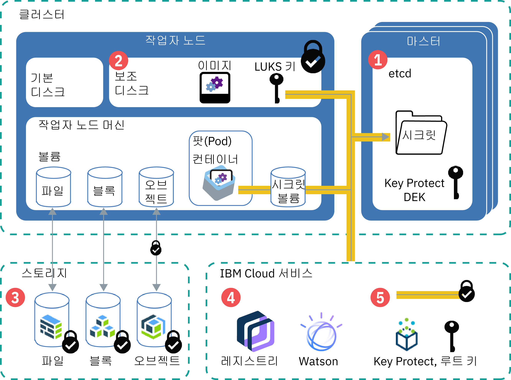

---

copyright:
  years: 2014, 2019
lastupdated: "2019-05-31"

keywords: kubernetes, iks

subcollection: containers

---

{:new_window: target="_blank"}
{:shortdesc: .shortdesc}
{:screen: .screen}
{:pre: .pre}
{:table: .aria-labeledby="caption"}
{:codeblock: .codeblock}
{:tip: .tip}
{:note: .note}
{:important: .important}
{:deprecated: .deprecated}
{:download: .download}
{:preview: .preview}


# 클러스터에 있는 민감한 정보 보호
{: #encryption}

민감한 클러스터 정보를 보호하면 데이터 무결성을 보장하고 권한 없는 사용자에게 데이터가 표시되는 것을 방지할 수 있습니다.
{: shortdesc}

적절한 보호가 필요한 클러스터의 여러 레벨로 민감한 데이터를 작성할 수 있습니다.
- **클러스터 레벨:** 클러스터 구성 데이터가 Kubernetes 마스터의 etcd 컴포넌트에 저장됩니다. etcd의 데이터는 Kubernetes 마스터의 로컬 디스크에 저장되며 {{site.data.keyword.cos_full_notm}}에 백업됩니다. 데이터는 {{site.data.keyword.cos_full_notm}}로 전송 중 및 저장 중에 암호화됩니다. 클러스터에 대해 [{{site.data.keyword.keymanagementservicelong_notm}} 암호화를 사용으로 설정](/docs/containers?topic=containers-encryption#encryption)하여 Kubernetes 마스터의 로컬 디스크에서 etcd 데이터의 암호화를 사용 설정하도록 선택할 수 있습니다. 이전 버전의 Kubernetes를 실행하는 클러스터의 etcd 데이터는 IBM에서 관리하고 매일 백업하는 암호화된 디스크에 저장됩니다.
- **앱 레벨:** 앱을 배치할 때 인증 정보 또는 키와 같은 기밀 정보를 YAML 구성 파일, ConfigMap 또는 스크립트에 저장하지 마십시오. 대신 [Kubernetes secret ](https://kubernetes.io/docs/concepts/configuration/secret/)을 사용하십시오. 권한 없는 사용자가 민감한 클러스터 정보에 액세스하지 못하도록 [Kubernetes 시크릿에 있는 데이터를 암호화](#keyprotect)할 수도 있습니다.

클러스터를 보호하는 데 대한 자세한 정보는 [{{site.data.keyword.containerlong_notm}}에 대한 보안](/docs/containers?topic=containers-security#security)을 참조하십시오.



_그림: 클러스터의 데이터 암호화 개요_

1.  **etcd**: etcd는 Kubernetes 리소스의 데이터가 저장되는 마스터의 컴포넌트입니다(예: 오브젝트 구성 `.yaml` 파일 및 시크릿). etcd의 데이터는 Kubernetes 마스터의 로컬 디스크에 저장되며 {{site.data.keyword.cos_full_notm}}에 백업됩니다. 데이터는 {{site.data.keyword.cos_full_notm}}로 전송 중 및 저장 중에 암호화됩니다. 클러스터에 대해 [{{site.data.keyword.keymanagementservicelong_notm}} 암호화를 사용으로 설정](#keyprotect)하여 Kubernetes 마스터의 로컬 디스크에 있는 etcd 데이터에 대한 암호화를 사용으로 설정할 수 있습니다. 이전 버전의 Kubernetes를 실행하는 클러스터의 etcd 데이터는 IBM에서 관리하고 매일 백업하는 암호화된 디스크에 저장됩니다. etcd 데이터가 팟(Pod)에 전송될 때 데이터는 데이터 보호와 무결성을 보장하기 위해 TLS를 통해 암호화됩니다.
2.  **작업자 노드의 보조 디스크**: 작업자 노드의 보조 디스크에는 컨테이너 파일 시스템 및 로컬에서 가져온 이미지가 저장됩니다. 디스크는 작업자 노드에 대해 고유한 LUKS 암호화 키로 AES 256비트 암호화되고 etcd에 시크릿(IBM에서 관리함)으로 저장됩니다. 작업자 노드를 다시 로드하거나 업데이트하면 LUKS 키가 순환됩니다.
3.  **스토리지**: [파일, 블록 또는 오브젝트 지속적 스토리지를 설정](/docs/containers?topic=containers-storage_planning#persistent_storage_overview)하여 데이터를 저장할 수 있습니다. IBM Cloud 인프라(SoftLayer) 스토리지 인스턴스는 데이터를 암호화된 디스크에 저장하므로, 저장된 데이터는 암호화됩니다. 또한 오브젝트 스토리지를 선택한 경우에는 전송 중인 데이터도 암호화됩니다.
4.  **{{site.data.keyword.Bluemix_notm}} 서비스**: {{site.data.keyword.registryshort_notm}} 또는 {{site.data.keyword.watson}} 등의 [{{site.data.keyword.Bluemix_notm}} 서비스를 클러스터와 통합](/docs/containers?topic=containers-service-binding#bind-services)할 수 있습니다. 서비스 인증 정보는 etcd에 저장된 시크릿에 저장되며, 앱에서는 시크릿을 볼륨으로 마운트하거나 시크릿을 [배치](/docs/containers?topic=containers-app#secret)의 환경 변수로 지정하여 액세스할 수 있습니다.
5.  **{{site.data.keyword.keymanagementserviceshort}}**: 클러스터에서 [{{site.data.keyword.keymanagementserviceshort}}를 사용으로 설정](#keyprotect)하면 랩핑된 데이터 암호화 키(DEK)가 etcd에 저장됩니다. DEK는 서비스 인증 정보 및 LUKS 키를 포함하여 클러스터의 시크릿을 암호화합니다. 루트 키는 {{site.data.keyword.keymanagementserviceshort}} 인스턴스에 있으므로 암호화된 시크릿에 대한 액세스를 제어하십시오. {{site.data.keyword.keymanagementserviceshort}} 키는 정보 도용을 방지하는 FIPS 140-2 레벨 2로 인증된 클라우드 기반 하드웨어 보안 모듈에 의해 보호됩니다. {{site.data.keyword.keymanagementserviceshort}} 암호화가 작동하는 방식에 대한 자세한 정보는 [엔벨로프 암호화](/docs/services/key-protect/concepts?topic=key-protect-envelope-encryption#envelope-encryption)를 참조하십시오.

## secret을 사용하는 경우 이해
{: #secrets}

Kubernetes 시크릿은 사용자 이름, 비밀번호 또는 키와 같은 기밀 정보를 저장하는 안전한 방법입니다. 기밀 정보를 암호화해야 하는 경우에는 [{{site.data.keyword.keymanagementserviceshort}}를 사용으로 설정](#keyprotect)하여 secret을 암호화하십시오. 시크릿에 무엇을 저장할 수 있는지에 대한 자세한 정보는 [Kubernetes 문서 ](https://kubernetes.io/docs/concepts/configuration/secret/)를 참조하십시오.
{:shortdesc}

시크릿이 필요한 다음 태스크를 검토하십시오.

### 클러스터에 서비스 추가
{: #secrets_service}

서비스를 클러스터에 바인드할 때는 서비스 인증 정보를 저장할 secret을 작성할 필요가 없습니다. 시크릿은 사용자를 위해 자동으로 작성됩니다. 자세한 정보는 [클러스터에 {{site.data.keyword.Bluemix_notm}} 서비스 추가](/docs/containers?topic=containers-service-binding#bind-services)를 참조하십시오.
{: shortdesc}

### TLS 시크릿을 사용하여 앱에 대한 트래픽을 암호화
{: #secrets_tls}

ALB는 클러스터의 앱에 대한 HTTP 네트워크 트래픽을 로드 밸런싱합니다. 수신 HTTPS 연결도 로드 밸런싱하려면 네트워크 트래픽을 복호화하고 클러스터에 노출된 앱으로 복호화된 요청을 전달하도록 ALB를 구성할 수 있습니다. 자세한 정보는 [Ingress 구성 문서](/docs/containers?topic=containers-ingress#public_inside_3)를 참조하십시오.
{: shortdesc}

또한, HTTPS 프로토콜을 필요로 하는 앱이 있으며 트래픽이 암호화된 상태를 유지해야 하는 경우에는 `ssl-services` 어노테이션을 사용하여 단방향 또는 상호 인증 시크릿을 사용할 수 있습니다. 자세한 정보는 [Ingress 어노테이션 문서](/docs/containers?topic=containers-ingress_annotation#ssl-services)를 참조하십시오.

### Kubernetes 이미지 풀 시크릿에 저장된 인증 정보를 사용하여 레지스트리에 액세스
{: #imagepullsecret}

클러스터를 작성하면 {{site.data.keyword.registrylong}} 인증 정보에 대한 secret이 `default` Kubernetes 네임스페이스에 자동으로 작성됩니다. 그러나 다음 상황에서 컨테이너를 배치하려는 경우에는 [자신의 고유 이미지 풀 시크릿을 작성](/docs/containers?topic=containers-images#other)해야 합니다.
* {{site.data.keyword.registryshort_notm}} 레지스트리에 있는 이미지에서 `default` 외의 Kubernetes 네임스페이스로 배치하는 경우.
* 다른 {{site.data.keyword.Bluemix_notm}} 지역 또는 {{site.data.keyword.Bluemix_notm}} 계정에 저장된 {{site.data.keyword.registryshort_notm}} 레지스트리에 있는 이미지에서 배치하는 경우.
* 외부 개인용 레지스트리에 저장된 이미지에서 배치하는 경우.

<br />


## {{site.data.keyword.keymanagementserviceshort}}(베타)를 사용하여 Kubernetes 마스터의 로컬 디스크 및 시크릿 암호화
{: #keyprotect}

[{{site.data.keyword.keymanagementservicefull}} ](/docs/services/key-protect?topic=key-protect-getting-started-tutorial)를 클러스터의 Kubernetes [키 관리 서비스(KMS) 제공자 ](https://kubernetes.io/docs/tasks/administer-cluster/kms-provider/)로 사용하여 Kubernetes 마스터의 etcd 컴포넌트 및 Kubernetes 시크릿을 암호화할 수 있습니다. KMS 제공자는 Kubernetes 버전 1.11의 알파 기능으로, {{site.data.keyword.keymanagementserviceshort}} 통합을 {{site.data.keyword.containerlong_notm}}의 베타 릴리스로 작성합니다.
{: shortdesc}

기본적으로 클러스터 구성 및 Kubernetes 시크릿은 IBM에서 관리하는 Kubernetes 마스터의 etcd 컴포넌트에 저장됩니다. 또한 작업자 노드의 보조 디스크는 etcd에 시크릿으로 저장되는 IBM 관리 LUKS 키로 암호화됩니다. etcd의 데이터는 Kubernetes 마스터의 로컬 디스크에 저장되며 {{site.data.keyword.cos_full_notm}}에 백업됩니다. 데이터는 {{site.data.keyword.cos_full_notm}}로 전송 중 및 저장 중에 암호화됩니다. 그러나 Kubernetes 마스터의 로컬 디스크에 있는 etcd 컴포넌트의 데이터는 클러스터에 대해 {{site.data.keyword.keymanagementserviceshort}} 암호화를 사용으로 설정할 때까지 자동으로 암호화되지 않습니다. 이전 버전의 Kubernetes를 실행하는 클러스터의 etcd 데이터는 IBM에서 관리하고 매일 백업하는 암호화된 디스크에 저장됩니다.

클러스터에서 {{site.data.keyword.keymanagementserviceshort}}를 사용으로 설정하면 LUKS 시크릿을 포함하여 etcd의 데이터를 암호화하는 데 사용자 자신의 루트 키가 사용됩니다. 자신의 루트 키로 secret을 암호화함으로써 민감한 데이터에 대한 제어 능력을 향상시킬 수 있습니다. 자신의 고유한 암호화를 사용하면 etcd 데이터 및 Kubernetes 시크릿에 보안 계층이 추가되며 민감한 클러스터 정보에 액세스할 수 있는 사용자를 더 세부적으로 제어할 수 있습니다. etcd 또는 자신의 시크릿에 대한 액세스 권한을 불가역적으로 제거해야 하는 경우에는 루트 키를 삭제할 수 있습니다.

{{site.data.keyword.keymanagementserviceshort}} 인스턴스에서 루트 키를 삭제하지 마십시오. 새 키를 사용하기 위해 회전하는 경우에도 키를 삭제하지 마십시오. 루트 키를 삭제하는 경우, etcd 데이터 또는 클러스터의 시크릿에 있는 데이터에 액세스하거나 이로부터 데이터를 제거할 수 없게 됩니다.
{: important}

시작하기 전에:
* [계정에 로그인하십시오. 해당되는 경우, 적절한 리소스 그룹을 대상으로 지정하십시오. 클러스터의 컨텍스트를 설정하십시오.](/docs/containers?topic=containers-cs_cli_install#cs_cli_configure)
* `ibmcloud ks cluster-get --cluster <cluster_name_or_ID>`를 실행하고 **버전** 필드를 확인하여 클러스터가 Kubernetes 버전 1.11.3_1521 이상을 실행하는지 확인하십시오.
* 클러스터에 대한 [**관리자** {{site.data.keyword.Bluemix_notm}} IAM 플랫폼 역할](/docs/containers?topic=containers-users#platform)이 있는지 확인하십시오.
* 클러스터가 있는 지역에 대해 설정된 API 키가 Key Protect를 사용할 수 있도록 권한 부여되었는지 확인하십시오. 지역에 대해 인증 정보가 저장되는 API 키 소유자를 확인하려면 `ibmcloud ks api-key-info --cluster <cluster_name_or_ID>`를 실행하십시오.

{{site.data.keyword.keymanagementserviceshort}}를 사용으로 설정하거나, 클러스터의 secret을 암호화하는 인스턴스 또는 루트 키를 업데이트하려면 다음을 수행하십시오.

1.  [{{site.data.keyword.keymanagementserviceshort}} 인스턴스를 작성](/docs/services/key-protect?topic=key-protect-provision#provision)하십시오.

2.  가져오기 인스턴스 ID를 가져오십시오.

    ```
    ibmcloud resource service-instance <kp_instance_name> | grep GUID
    ```
    {: pre}

3.  [루트 키를 작성](/docs/services/key-protect?topic=key-protect-create-root-keys#create-root-keys)하십시오. 기본적으로 루트 키는 만료 날짜 없이 작성됩니다.

    내부 보안 정책을 준수하기 위해 만료 날짜를 설정해야 하십니까? [API를 사용하여 루트 키를 작성](/docs/services/key-protect?topic=key-protect-create-root-keys#create-root-key-api)하고 `expirationDate` 매개변수를 포함하십시오. **중요**: 루트 키가 만료되기 전에 이러한 단계를 반복하여 클러스터가 새 루트 키를 사용하도록 업데이트해야 합니다. 그렇지 않으면, 시크릿을 복호화할 수 없습니다.
    {: tip}

4.  [루트 키 **ID**](/docs/services/key-protect?topic=key-protect-view-keys#view-keys-gui)를 기록하십시오.

5.  인스턴스의 [{{site.data.keyword.keymanagementserviceshort}} 엔드포인트](/docs/services/key-protect?topic=key-protect-regions#service-endpoints)를 가져오십시오.

6.  {{site.data.keyword.keymanagementserviceshort}}를 사용으로 설정할 클러스터의 이름을 가져오십시오.

    ```
    ibmcloud ks clusters
    ```
    {: pre}

7.  클러스터에서 {{site.data.keyword.keymanagementserviceshort}}를 사용으로 설정하십시오. 플래그를 이전에 검색한 정보로 채우십시오. 인에이블먼트 프로세스는 완료하는 데 약간의 시간이 소요될 수 있습니다.

    ```
    ibmcloud ks key-protect-enable --cluster <cluster_name_or_ID> --key-protect-url <kp_endpoint> --key-protect-instance <kp_instance_ID> --crk <kp_root_key_ID>
    ```
    {: pre}

8.  인에이블먼트 도중에 배치에 필요한 YAML 구성을 업데이트하는 등 Kubernetes 마스터에 액세스할 수 없습니다. 다음 명령의 출력에서 **마스터 상태**가 **준비**인지 확인하십시오.
    ```
   ibmcloud ks cluster-get --cluster <cluster_name_or_ID>
    ```
    {: pre}

    인에이블먼트가 진행 중인 경우 출력 예:
    ```
    Name:                   <cluster_name>   
    ID:                     <cluster_ID>   
    ...
    Master Status:          Key Protect feature enablement in progress.  
    ```
    {: screen}

    마스터가 준비되는 경우 출력 예:
    ```
    Name:                   <cluster_name>   
    ID:                     <cluster_ID>   
    ...
    Master Status:          Ready (1 min ago)   
    ```
    {: screen}

    클러스터에서 {{site.data.keyword.keymanagementserviceshort}}가 사용으로 설정되고 나면 `etcd`의 데이터, 클러스터에 작성된 기존 시크릿 및 새 시크릿이 {{site.data.keyword.keymanagementserviceshort}} 루트 키를 사용하여 자동으로 암호화됩니다.

9.  선택사항: 키를 순환하려면 새 루트 키 ID를 사용하여 이러한 단계를 반복하십시오. 기존에 암호화된 데이터가 계속해서 보호되도록 새 루트 키가 이전 루트 키와 함께 클러스터 구성에 추가됩니다.

{{site.data.keyword.keymanagementserviceshort}} 인스턴스에서 루트 키를 삭제하지 마십시오. 새 키를 사용하기 위해 회전하는 경우에도 키를 삭제하지 마십시오. 루트 키를 삭제하는 경우, etcd 데이터 또는 클러스터의 시크릿에 있는 데이터에 액세스하거나 이로부터 데이터를 제거할 수 없게 됩니다.
{: important}


## IBM Cloud Data Shield(베타)를 사용하여 데이터 암호화
{: #datashield}

{{site.data.keyword.datashield_short}}는 Intel® Software Guard Extensions(SGX) 및 Fortanix® 기술과 통합되어 {{site.data.keyword.Bluemix_notm}} 컨테이너 워크로드 코드와 데이터가 사용 중에 보호됩니다. 앱 코드와 데이터는 앱의 중요한 부분을 보호하는 작업자 노드의 신뢰할 수 있는 메모리 영역인 CPU 강화 엔클레이브에서 실행되므로 코드와 데이터를 기밀로 유지하고 수정하지 않고 유지하는 데 도움이 됩니다.
{: shortdesc}

데이터 보호에 있어서 암호화는 가장 많이 사용되고 효과적인 제어 방법 중 하나입니다. 그러나 데이터는 라이프사이클의 각 단계에서 암호화되어야 합니다. 데이터는 라이프사이클 동안 3단계(저장 데이터, 동작 중인 데이터, 사용 중인 데이터)를 거칩니다. 저장 데이터와 동작 중인 데이터는 데이터가 저장되고 전송될 때 데이터를 보호하는 데 일반적으로 사용됩니다. 해당 보호를 한 단계 더 수행하면 이제 사용 중인 데이터를 암호화할 수 있습니다.

내부 정책, 정부 규제 또는 업계 규제 준수 요구사항으로 인해 사용자 또는 회사에서 데이터 민감도가 필요한 경우, 이 솔루션은 클라우드로 전환하는 데 도움이 될 수 있습니다. 예제 솔루션에는 금융 및 의료 서비스 기관 또는 온프레미스 클라우드 솔루션이 필요한 정부 정책이 있는 국가가 포함됩니다.

시작하려면 SGX 사용 베어메탈 작업자 클러스터를 mb2c.4x32 시스템 유형으로 프로비저닝하고 [ {{site.data.keyword.datashield_short}} 문서](/docs/services/data-shield?topic=data-shield-getting-started#getting-started)를 확인하십시오.
