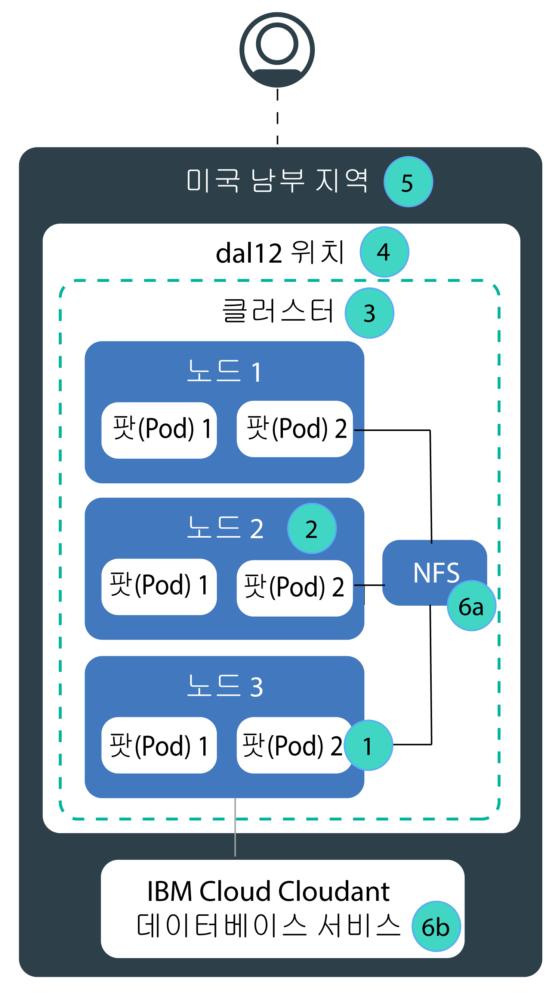

---

copyright:
  years: 2014, 2019
lastupdated: "2019-06-05"

keywords: kubernetes, iks, disaster recovery, dr, ha, hadr

subcollection: containers

---

{:new_window: target="_blank"}
{:shortdesc: .shortdesc}
{:screen: .screen}
{:pre: .pre}
{:table: .aria-labeledby="caption"}
{:codeblock: .codeblock}
{:tip: .tip}
{:note: .note}
{:important: .important}
{:deprecated: .deprecated}
{:download: .download}
{:preview: .preview}

# {{site.data.keyword.containerlong_notm}}의 고가용성
{: #ha}

내장 Kubernetes 및 {{site.data.keyword.containerlong}} 기능을 사용하여 클러스터의 가용성을 더 높이고 클러스터의 컴포넌트가 실패할 때 앱의 작동 중단을 방지하십시오.
{: shortdesc}

고가용성은 부분 또는 전체 사이트 실패 후에도 앱의 시작 및 실행을 유지시키는 IT 인프라의 핵심 원칙입니다. 고가용성의 주요 목적은 IT 인프라의 잠재적 실패 지점을 제거하는 것입니다. 예를 들어, 중복성을 추가하고 장애 복구 메커니즘을 설정하여 한 시스템의 실패에 대비할 수 있습니다.

IT 인프라의 다른 레벨 및 클러스터의 다른 컴포넌트에서 고가용성을 구현할 수 있습니다. 사용자에게 적합한 고가용성의 레벨은 비즈니스 요구사항, 고객과 약정한 SLA(Service Level Agreements), 지출할 비용과 같은 여러 요인에 따라 달라집니다.

## {{site.data.keyword.containerlong_notm}}의 잠재적 실패 지점에 대한 개요
{: #fault_domains}

{{site.data.keyword.containerlong_notm}} 아키텍처 및 인프라는 신뢰성, 짧은 처리 대기 시간 및 최대 가동 시간을 보장하도록 디자인되었습니다. 그러나 실패가 발생할 수 있습니다. {{site.data.keyword.Bluemix_notm}}에서 호스팅하는 서비스에 따라 실패가 몇 분 동안만 지속되는 경우에도 실패를 허용하지 못할 수 있습니다.
{: shortdesc}

{{site.data.keyword.containerlong_notm}}는 중복성 및 반친화성을 추가하여 클러스터에 더 많은 가용성을 추가하는 여러 방법을 제공합니다. 잠재적 실패 지점과 이를 제거하는 방법에 대해 알아보려면 다음 이미지를 검토하십시오.

<dl>
<dt> 1. 컨테이너 또는 팟(Pod) 실패.</dt>
  <dd>
컨테이너 및 팟(Pod)은 단기적으로만 지속되도록 디자인되었으며 예기치 않게 실패할 수 있습니다. 예를 들어, 앱에서 오류가 발생하는 경우 컨테이너 또는 팟(Pod)이 손상될 수 있습니다. 앱의 가용성을 높이려면 실패가 발생한 경우 워크로드 및 추가 인스턴스를 처리할 수 있도록 앱의 인스턴스가 충분히 있는지 확인해야 합니다. 이상적으로, 작업자 노드 실패로부터 앱을 보호하도록 이러한 인스턴스가 다중 작업자 노드에 분배됩니다.

  
[고가용성 앱 배치](/docs/containers?topic=containers-app#highly_available_apps)를 참조하십시오.
</dd>
<dt> 2. 작업자 노드 실패.</dt>
  <dd>
작업자 노드는 실제 하드웨어의 상위에서 실행되는 VM입니다. 작업자 노드 실패에는 전원, 냉각 또는 네트워킹과 같은 하드웨어 가동 중단 및 VM 자체 문제가 포함됩니다. 클러스터에 다중 작업자 노드를 설정하여 작업자 노드 실패에 대해 설명할 수 있습니다.

한 구역의 작업자 노드가 별도의 실제 컴퓨팅 호스트에 있다는 보장은 없습니다. 예를 들어, 3개의 작업자 노드를 포함하는 하나의 클러스터가 있지만 3개의 작업자 노드는 모두 IBM 구역의 동일한 실제 컴퓨팅 호스트에서 작성되었을 수 있습니다. 이 경우 이 실제 컴퓨팅 호스트의 작동이 중지되면 모든 작업자 노드의 작동이 중지됩니다. 이러한 실패가 발생하지 않도록 보호하려면 다른 구역에 [다중 구역 클러스터를 설정하거나 여러 단일 구역 클러스터를 작성](/docs/containers?topic=containers-ha_clusters#ha_clusters)해야 합니다.

  
[다중 작업자 노드가 있는 클러스터 작성](/docs/containers?topic=containers-cli-plugin-kubernetes-service-cli#cs_cluster_create)을 참조하십시오.
</dd>
<dt> 3. 클러스터 실패.</dt>
  <dd>
[Kubernetes 마스터](/docs/containers?topic=containers-ibm-cloud-kubernetes-service-technology#architecture)는 클러스터가 시작하고 계속 실행되도록 하는 기본 컴포넌트입니다. 마스터는 클러스터에 대한 SPOT(Single Point of Truth) 역할을 하는 etcd 데이터베이스에 클러스터 리소스와 해당 구성을 저장합니다. Kubernetes API 서버는 마스터에 대한 작업자 노드의 모든 클러스터 관리 요청을 위한 기본 시작점입니다. 또는 클러스터 리소스와 상호 작용하고자 할 때의 시작점이기도 합니다.  마스터 장애 발생 시에 워크로드는 작업자 노드에서 계속 실행되지만, 마스터의 Kubernetes API 서버가 백업될 때까지는 사용자가 `kubectl` 명령을 사용하여 클러스터 리소스 관련 작업을 수행하거나 클러스터 상태를 확인할 수 없습니다. 마스터 가동 중단 중에 팟(Pod)이 중지되는 경우에는 작업자 노드가 다시 Kubernetes API 서버에 접속할 수 있을 때까지 팟(Pod)을 다시 스케줄할 수 없습니다.  마스터 가동 중단 중에도 사용자는 여전히 {{site.data.keyword.containerlong_notm}} API에 대해 `ibmcloud ks` 명령을 실행하여 인프라 리소스(예: 작업자 노드 또는 VLAN) 관련 작업을 수행할 수 있습니다. 작업자 노드를 클러스터에 추가하거나 이에서 제거하여 현재 클러스터 구성을 변경하는 경우에는 마스터가 백업될 때까지 변경사항이 발생하지 않습니다.

마스터 가동 중단 중에는 작업자 노드를 다시 시작하거나 재부팅하지 마십시오. 이 조치를 수행하면 작업자 노드에서 팟(Pod)이 제거됩니다. Kubernetes API 서버가 사용 불가능하므로 클러스터의 다른 작업자 노드로 팟(Pod)을 다시 스케줄할 수 없습니다.
{: important}
클러스터 마스터는 고가용성이며 가동 중단(예: 마스터 업데이트 중에)에 대해 보호할 수 있도록 별도의 호스트에 Kubernetes API 서버, etcd, 스케줄러 및 제어기 관리자의 복제본을 포함합니다.

구역 장애로부터 클러스터 마스터를 보호하기 위해 다음을 수행할 수 있습니다. <ul><li>구역 간에 마스터를 전개하는 [다중 구역 메트로 위치](/docs/containers?topic=containers-regions-and-zones#zones)에 클러스터를 작성하십시오.</li><li>다른 구역에 두 번째 클러스터를 설정합니다.</li></ul>

  
[고가용성 클러스터 설정](/docs/containers?topic=containers-ha_clusters#ha_clusters)을 참조하십시오.
</dd>
<dt> 4. 구역 실패.</dt>
  <dd>
구역 실패는 모든 실제 컴퓨팅 호스트 및 NFS 스토리지에 영향을 줍니다. 실패에는 전원, 냉각, 네트워킹 또는 가동 중단 및 자연 재해(예: 홍수, 지진 및 허리케인)가 포함됩니다. 구역 실패로부터 보호하려면 외부 로드 밸런서에 의해 로드 밸런싱된 2개의 서로 다른 구역에서 클러스터를 보유해야 합니다.

  
[고가용성 클러스터 설정](/docs/containers?topic=containers-ha_clusters#ha_clusters)을 참조하십시오.
</dd>    
<dt> 5. 지역 실패.</dt>
  <dd>
모든 지역은 지역별 API 엔드포인트에서 액세스할 수 있는 고가용성 로드 밸런서로 설정됩니다. 로드 밸런서는 수신 및 발신 요청을 지역의 구역에 있는 클러스터로 라우팅합니다. 전체 지역 실패의 가능성은 낮습니다. 그러나 이 실패에 대해 설명하려는 경우 여러 지역에 다중 클러스터를 설정하고 외부 로드 밸런서를 사용하여 이를 연결할 수 있습니다. 전체 지역이 실패하는 경우에는 다른 지역의 클러스터가 워크로드를 인계할 수 있습니다. 

다중 지역 클러스터에서는 여러 클라우드 리소스가 필요하며 앱에 따라 복잡해지고 비용이 증가할 수 있습니다. 다중 지역 설정이 필요한지 또는 잠재적인 서비스 중단을 허용할 수 있는지 여부를 확인하십시오. 다중 지역 클러스터를 설정하려는 경우 앱 및 데이터를 다른 지역에 호스팅할 수 있고 앱에서 글로벌 데이터 복제를 처리할 수 있는지 확인하십시오.

  
[고가용성 클러스터 설정](/docs/containers?topic=containers-ha_clusters#ha_clusters)을 참조하십시오.
</dd>   
<dt> 6a, 6b. 스토리지 실패.</dt>
  <dd>
상태 저장 앱에서 데이터는 앱의 시작 및 실행을 유지하는 중요한 역할을 수행합니다. 데이터가 잠재적인 실패로부터 복구할 수 있을 정도로 가용성이 높은지 확인하십시오. {{site.data.keyword.containerlong_notm}}에서 데이터를 지속하기 위한 여러 옵션을 선택할 수 있습니다. 예를 들어, Kubernetes 고유의 지속적 볼륨을 사용하여 NFS 스토리지를 프로비저닝하거나 {{site.data.keyword.Bluemix_notm}} 데이터베이스 서비스를 사용하여 데이터를 저장할 수 있습니다.

  
[고가용성 데이터 계획](/docs/containers?topic=containers-storage_planning#persistent_storage_overview)을 참조하십시오.
</dd>
</dl>
