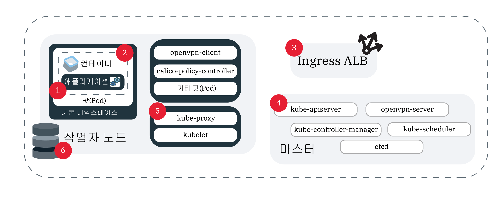

---

copyright:
  years: 2014, 2019
lastupdated: "2019-06-11"

keywords: kubernetes, iks, logmet, logs, metrics

subcollection: containers

---

{:new_window: target="_blank"}
{:shortdesc: .shortdesc}
{:screen: .screen}
{:pre: .pre}
{:table: .aria-labeledby="caption"}
{:codeblock: .codeblock}
{:tip: .tip}
{:note: .note}
{:important: .important}
{:deprecated: .deprecated}
{:download: .download}
{:preview: .preview}


# 로깅 및 모니터링
{: #health}

{{site.data.keyword.containerlong}}의 로깅 및 모니터링을 설정하면 문제를 해결하고 Kubernetes 클러스터 및 앱의 상태와 성능을 향상시킬 수 있습니다.
{: shortdesc}

지속적 모니터링과 로깅은 클러스터에 대한 공격을 감지하고 이의 발생 시에 문제를 해결하는 열쇠입니다. 클러스터를 지속적으로 모니터링함으로써 사용자는 클러스터의 용량은 물론 앱에 사용 가능한 리소스의 가용성을 보다 잘 파악할 수 있습니다. 이 인사이트를 사용하면 가동 중단 시에 앱을 보호할 수 있도록 준비할 수 있습니다. **참고**: 로깅 및 모니터링를 구성하려면 {{site.data.keyword.containerlong_notm}}에서 표준 클러스터를 사용해야 합니다.

## 로깅 솔루션 선택
{: #logging_overview}

기본적으로 로그는 다음의 모든 {{site.data.keyword.containerlong_notm}} 클러스터 컴포넌트에 대해 로컬로 생성되고 기록됩니다. 작업자 노드, 컨테이너, 애플리케이션, 지속적 스토리지, Ingress 애플리케이션 로드 밸런서, Kubernetes API 및 `kube-system-system` 네임스페이스. 이러한 로그를 수집, 전달 및 볼 수 있는 여러 가지 로깅 솔루션을 사용할 수 있습니다.
{: shortdesc}

로그를 수집해야 하는 클러스터 컴포넌트를 기준으로 로깅 솔루션을 선택할 수 있습니다. 일반적인 구현은 분석 및 인터페이스 기능(예: {{site.data.keyword.loganalysisfull}}, {{site.data.keyword.la_full}} 또는 서드파티 서비스)에 따라 원하는 로깅 서비스를 선택하는 것입니다. 그런 다음 {{site.data.keyword.cloudaccesstrailfull}}를 사용하여 클러스터의 사용자 활동을 감사하고 클러스터 마스터 로그를 {{site.data.keyword.cos_full}}에 백업할 수 있습니다. **참고**: 로깅을 구성하려면 표준 Kubernetes 클러스터가 있어야 합니다.

<dl>

<dt>{{site.data.keyword.la_full_notm}}</dt>
<dd>LogDNA를 클러스터에 서드파티 서비스로 배치하여 팟(Pod) 컨테이너 로그를 관리합니다. {{site.data.keyword.la_full_notm}}를 사용하려면 클러스터의 모든 작업자 노드에 로깅 에이전트를 배치해야 합니다. 이 에이전트는 `kube-system`을 포함하여 모든 네임스페이스에서 팟(Pod)의 `/var/log` 디렉토리에 저장되는 `*.log` 확장자와 확장자 없는 파일을 사용하여 로그를 수집합니다. 그런 다음 에이전트는 로그를 {{site.data.keyword.la_full_notm}} 서비스에 전달합니다. 서비스에 대한 자세한 정보는 [{{site.data.keyword.la_full_notm}}](/docs/services/Log-Analysis-with-LogDNA?topic=LogDNA-about) 문서를 참조하십시오. 시작하려면 [LogDNA로 {{site.data.keyword.loganalysisfull_notm}}에서 Kubernetes 클러스터 로그 관리](/docs/services/Log-Analysis-with-LogDNA/tutorials?topic=LogDNA-kube#kube)를 참조하십시오.
</dd>

<dt>{{site.data.keyword.loganalysisfull_notm}}를 사용하는 Fluentd</dt>
<dd><p class="deprecated">이전에는 Fluentd 클러스터 컴포넌트가 수집한 로그를 {{site.data.keyword.loganalysisfull_notm}}에 전달하는 로깅 구성을 작성할 수 있었습니다. 2019년 4월 30일부터 새 {{site.data.keyword.loganalysisshort_notm}} 인스턴스를 프로비저닝할 수 없으며 모든 Lite 플랜 인스턴스가 삭제됩니다. 기존 Premium 플랜 인스턴스는 2019년 9월 30일까지 지원됩니다. 클러스터에 대한 로그를 계속 수집하려면 {{site.data.keyword.la_full_notm}}를 설정하거나 외부 서버에 로그를 전달하도록 구성을 변경해야 합니다. </p>
</dd>

<dt>외부 서버를 사용하는 Fluentd</dt>
<dd>클러스터 컴포넌트의 로그를 수집, 전달 및 보기 위해 Fluentd를 사용하여 로깅 구성을 작성할 수 있습니다. 로깅 구성을 작성하면 [Fluentd ](https://www.fluentd.org/) 클러스터 컴포넌트가 지정된 소스의 경로에서 로그를 수집합니다. 그 후 Fluentd는 syslog 프로토콜을 허용하는 외부 서버로 이러한 로그를 전달할 수 있습니다. 시작하려면 [syslog에 클러스터 및 앱 로그 전달 이해](#logging)를 참조하십시오. </dd>

<dt>{{site.data.keyword.cloudaccesstrailfull_notm}}</dt>
<dd>클러스터에서 작성된 사용자 시작 관리 활동을 모니터링하려면 감사 로그를 수집하고 {{site.data.keyword.cloudaccesstrailfull_notm}}에 전달할 수 있습니다. 클러스터는 두 가지 유형의 {{site.data.keyword.cloudaccesstrailshort}} 이벤트를 생성합니다.
<ul><li>클러스터 관리 이벤트는 자동으로 생성되며 {{site.data.keyword.cloudaccesstrailshort}}에 전달됩니다.</li>
<li>Kubernetes API 서버 감사 이벤트가 자동으로 생성되지만 Fluentd가 이 로그를 {{site.data.keyword.cloudaccesstrailshort}}에 전달할 수 있도록 [로깅 구성을 작성](#api_forward)해야 합니다.</li></ul>
추적할 수 있는 {{site.data.keyword.containerlong_notm}} 이벤트의 유형에 대한 자세한 정보는 [활동 트래커 이벤트](/docs/containers?topic=containers-at_events)를 참조하십시오. 서비스에 대한 자세한 정보는 [활동 트래커](/docs/services/cloud-activity-tracker?topic=cloud-activity-tracker-getting-started) 문서를 참조하십시오.
<p class="note">{{site.data.keyword.containerlong_notm}}는 현재 {{site.data.keyword.at_full}}를 사용하도록 구성되어 있지 않습니다. 클러스터 관리 이벤트 및 Kubernetes API 감사 로그를 관리하려면 계속해서 {{site.data.keyword.cloudaccesstrailfull_notm}}을 Log Analysis와 함께 사용하십시오. </p>
</dd>

<dt>{{site.data.keyword.cos_full_notm}}</dt>
<dd>클러스터의 Kubernetes 마스터의 로그를 수집하고 전달하며 보려면, 특정 시점에서 마스터 로그의 스냅샷을 작성하여 {{site.data.keyword.cos_full_notm}} 버킷에 수집할 수 있습니다. 이 스냅샷은 팟(Pod) 스케줄링, 배치 또는 RBAC 정책과 같이 API 서버를 통해 전송된 모든 항목을 포함합니다. 시작하려면 [마스터 로그 수집](#collect_master)을 참조하십시오.</dd>

<dt>서드파티 서비스</dt>
<dd>특별 요구사항이 있는 경우에는 자체 로깅 솔루션을 설정할 수 있습니다. [ 로깅 및 모니터링 통합](/docs/containers?topic=containers-supported_integrations#health_services)에서 클러스터에 추가할 수 있는 서드파티 로깅 서비스를 확인하십시오. `/var/log/pods/` 경로에서 컨테이너 로그를 수집할 수 있습니다. </dd>

</dl>

<br />


## {{site.data.keyword.la_full_notm}}에 클러스터 및 앱 로그 전달
{: #logdna}

LogDNA를 클러스터에 서드파티 서비스로 배치하여 팟(Pod) 컨테이너 로그를 관리합니다.
{: shortdesc}

{{site.data.keyword.la_full_notm}}를 사용하려면 클러스터의 모든 작업자 노드에 로깅 에이전트를 배치해야 합니다. 이 에이전트는 `kube-system`을 포함하여 모든 네임스페이스에서 팟(Pod)의 `/var/log` 디렉토리에 저장되는 `*.log` 확장자와 확장자 없는 파일을 사용하여 로그를 수집합니다. 그런 다음 에이전트는 로그를 {{site.data.keyword.la_full_notm}} 서비스에 전달합니다. 서비스에 대한 자세한 정보는 [{{site.data.keyword.la_full_notm}}](/docs/services/Log-Analysis-with-LogDNA?topic=LogDNA-about) 문서를 참조하십시오. 시작하려면 [LogDNA로 {{site.data.keyword.loganalysisfull_notm}}에서 Kubernetes 클러스터 로그 관리](/docs/services/Log-Analysis-with-LogDNA/tutorials?topic=LogDNA-kube#kube)를 참조하십시오.

<br />


## 더 이상 사용되지 않음: {{site.data.keyword.loganalysisfull_notm}}에 클러스터, 앱 및 Kubernetes API 감사 로그 전달
{: #loga}

이전에는 Fluentd 클러스터 컴포넌트가 수집한 로그를 {{site.data.keyword.loganalysisfull_notm}}에 전달하는 로깅 구성을 작성할 수 있었습니다. 2019년 4월 30일부터 {{site.data.keyword.loganalysisfull_notm}}는 더 이상 사용되지 않습니다. 사용자는 새 {{site.data.keyword.loganalysisshort_notm}} 인스턴스를 프로비저닝할 수 없으며 모든 Lite 플랜 인스턴스가 삭제됩니다. 기존 Premium 플랜 인스턴스는 2019년 9월 30일까지 지원됩니다.
{: deprecated}

클러스터에 대한 로그를 계속 수집하려는 경우에는 다음 옵션이 있습니다. 
* {{site.data.keyword.la_full_notm}}를 설정하십시오. 자세한 정보는 [{{site.data.keyword.la_full_notm}}로 전환](/docs/services/CloudLogAnalysis?topic=cloudloganalysis-transition)을 참조하십시오. 
* [로그를 외부 서버에 전달하도록 구성을 변경](#configuring)하십시오. 

기존 {{site.data.keyword.loganalysisshort_notm}} 인스턴스에 대한 자세한 정보는 [{{site.data.keyword.loganalysisshort_notm}} 문서](/docs/services/CloudLogAnalysis?topic=cloudloganalysis-containers_kube_other_logs)를 참조하십시오. 

<br />


## 외부 서버에 클러스터, 앱 및 Kubernetes API 감사 로그 전달
{: #configuring}

{{site.data.keyword.containerlong_notm}} 표준 클러스터에서 외부 서버로의 로그 전달을 구성하십시오.
{: shortdesc}

### 외부 서버로의 로그 전달 이해
{: #logging}

기본적으로, 로그는 클러스터의 [Fluentd ](https://www.fluentd.org/) 추가 기능에 의해 수집됩니다. 컨테이너와 같은 클러스터의 소스에 대한 로깅 구성을 작성하면 해당 소스의 경로에서 Fluentd가 수집한 로그가 외부 서버에 전달됩니다. 소스에서 로깅 서비스로의 트래픽은 유입 포트에서 암호화됩니다.
{: shortdesc}

**해당 로그 전달을 구성할 수 있는 소스는 무엇입니까?**

다음 이미지에서는 로깅을 구성할 수 있는 소스의 위치를 볼 수 있습니다. 



1. `worker`: 작업자 노드에 대해 보유하고 있는 인프라 구성에 특정한 정보입니다. 작업자 로그는 syslog에서 캡처되며 이에는 운영 체제 이벤트가 포함됩니다. `auth.log`에서는 OS에 대해 작성된 인증 요청에 대한 정보를 찾을 수 있습니다.</br>**경로**:
    * `/var/log/syslog`
    * `/var/log/auth.log`

2. `container`: 실행 중인 컨테이너에 의해 로그되는 정보입니다. </br>**경로**: `STDOUT` 또는 `STDERR`에 기록되는 모든 항목입니다. 

3. `application`: 애플리케이션 레벨에서 발생하는 이벤트에 대한 정보입니다. 이는 이벤트(예: 로그인 성공, 스토리지에 대한 경고 또는 앱 레벨에서 수행될 수 있는 기타 오퍼레이션)가 발생했다는 알림일 수 있습니다. </br>**경로**: 로그가 전달되는 경로를 설정할 수 있습니다. 그러나 로그를 전송하려면 로깅 구성에서 절대 경로를 사용해야 하며, 그렇지 않으면 로그를 읽을 수 없습니다. 경로가 작업자 노드에 마운트되어 있는 경우에는 symlink가 작성되었을 수 있습니다. 예: 지정된 경로가 `/usr/local/spark/work/app-0546/0/stderr`이지만 로그가 실제로는 `/usr/local/spark-1.0-hadoop-1.2/work/app-0546/0/stderr`로 전달되는 경우에는 로그를 읽을 수 없습니다.

4. `storage`: 클러스터에서 설정된 지속적 스토리지에 대한 정보. 스토리지 로그를 사용하면 DevOps 파이프라인 및 프로덕션 릴리스의 일부로서 문제점 판별 대시보드 및 경보를 설정하는 데 도움이 될 수 있습니다. **참고**: 경로 `/var/log/kubelet.log` 및 `/var/log/syslog`에는 스토리지 로그도 포함되어 있지만, 이러한 경로의 로그는 `kubernetes` 및 `worker` 로그 소스에 의해 수집됩니다.</br>**경로**:
    * `/var/log/ibmc-s3fs.log`
    * `/var/log/ibmc-block.log`

  **팟(Pod)**:
    * `portworx-***`
    * `ibmcloud-block-storage-attacher-***`
    * `ibmcloud-block-storage-driver-***`
    * `ibmcloud-block-storage-plugin-***`
    * `ibmcloud-object-storage-plugin-***`

5. `kubernetes`: kubelet, kube-proxy, 그리고 작업자 노드의 kube-system 네임스페이스에서 발생한 기타 Kubernetes 이벤트의 정보입니다.</br>**경로**:
    * `/var/log/kubelet.log`
    * `/var/log/kube-proxy.log`
    * `/var/log/event-exporter/1..log`

6. `kube-audit`: 시간, 사용자 및 영향을 받은 리소스를 포함하여 Kubernetes API 서버로 전송된 클러스터 관련 조치에 대한 정보입니다.

7. `ingress`: Ingress ALB를 통해 클러스터로 유입되는 네트워크 트래픽에 대한 정보입니다.</br>**경로**:
    * `/var/log/alb/ids/*.log`
    * `/var/log/alb/ids/*.err`
    * `/var/log/alb/customerlogs/*.log`
    * `/var/log/alb/customerlogs/*.err`

</br>

**사용할 수 있는 구성 옵션에는 무엇이 있습니까?**

다음 표는 로깅을 구성할 때 이용할 수 있는 다양한 옵션과 이에 대한 설명을 보여줍니다. 

<table>
<caption> 로깅 구성 옵션 이해</caption>
  <thead>
    <th>옵션</th>
    <th>설명</th>
  </thead>
  <tbody>
    <tr>
      <td><code><em>&lt;cluster_name_or_ID&gt;</em></code></td>
      <td>클러스터의 이름 또는 ID입니다.</td>
    </tr>
    <tr>
      <td><code><em>--log_source</em></code></td>
      <td>로그를 전달할 소스입니다. 허용되는 값은 <code>container</code>, <code>application</code>, <code>worker</code>, <code>kubernetes</code>, <code>ingress</code>, <code>storage</code> 및 <code>kube-audit</code>입니다. 이 인수는 구성을 적용할 로그 소스의 쉼표로 구분된 목록을 지원합니다. 로그 소스를 제공하지 않으면 <code>container</code> 및 <code>ingress</code> 로그 소스에 대해 작성됩니다.</td>
    </tr>
    <tr>
      <td><code><em>--type syslog</em></code></td>
      <td>값 <code>syslog</code>는 로그를 외부 서버로 전달합니다. </p>
      </dd></td>
    </tr>
    <tr>
      <td><code><em>--namespace</em></code></td>
      <td>선택사항: 로그를 전달할 Kubernetes 네임스페이스입니다. <code>ibm-system</code> 및 <code>kube-system</code> Kubernetes 네임스페이스의 경우 로그 전달이 지원되지 않습니다. 이 값은 <code>container</code> 로그 소스에 대해서만 유효합니다. 네임스페이스를 지정하지 않으면 컨테이너의 모든 네임스페이스가 이 구성을 사용합니다.</td>
    </tr>
    <tr>
      <td><code><em>--hostname</em></code></td>
      <td><p>{{site.data.keyword.loganalysisshort_notm}}의 경우 [유입 URL](/docs/services/CloudLogAnalysis?topic=cloudloganalysis-log_ingestion#log_ingestion_urls)을 사용하십시오. 유입 URL을 지정하지 않으면 클러스터가 작성된 지역의 엔드포인트가 사용됩니다.</p>
      <p>syslog의 경우 로그 콜렉터 서비스의 호스트 이름 또는 IP 주소를 지정하십시오.</p></td>
    </tr>
    <tr>
      <td><code><em>--port</em></code></td>
      <td>유입 포트입니다. 포트를 지정하지 않으면 표준 포트 <code>9091</code>이 사용됩니다.
      <p>syslog의 경우 로그 콜렉터 서버의 포트를 지정하십시오. 포트를 지정하지 않으면 표준 포트 <code>514</code>가 사용됩니다.</td>
    </tr>
    <tr>
      <td><code><em>--app-containers</em></code></td>
      <td>선택사항: 앱에서 로그를 전달하기 위해 앱이 포함된 컨테이너의 이름을 지정할 수 있습니다. 쉼표로 구분된 목록을 사용하여 두 개 이상의 컨테이너를 지정할 수 있습니다. 컨테이너가 지정되지 않은 경우 로그는 사용자가 제공한 경로가 포함된 모든 컨테이너에서 전달됩니다.</td>
    </tr>
    <tr>
      <td><code><em>--app-paths</em></code></td>
      <td>앱이 로그를 기록하는 컨테이너 상의 경로입니다. 소스 유형이 <code>application</code>인 로그를 전달하려면 경로를 제공해야 합니다. 두 개 이상의 경로를 지정하려면 쉼표로 구분된 목록을 사용하십시오. 예: <code>/var/log/myApp1/*,/var/log/myApp2/*</code></td>
    </tr>
    <tr>
      <td><code><em>--syslog-protocol</em></code></td>
      <td>로깅 유형이 <code>syslog</code>인 경우 전송 계층은 프로토콜입니다. `udp`, `tls` 또는 `tcp` 프로토콜을 사용할 수 있습니다. <code>udp</code> 프로토콜을 사용하여 rsyslog 서버에 전달하는 경우 1KB를 초과하는 로그는 잘립니다. </td>
    </tr>
    <tr>
      <td><code><em>--ca-cert</em></code></td>
      <td>필수: 로깅 유형이 <code>syslog</code>이고 프로토콜이 <code>tls</code>인 경우, 인증 기관 인증서가 포함된 Kubernetes 시크릿 이름입니다.</td>
    </tr>
    <tr>
      <td><code><em>--verify-mode</em></code></td>
      <td>로깅 유형이 <code>syslog</code>이고 프로토콜이 <code>tls</code>인 경우, 확인 모드입니다. 지원되는 값은 <code>verify-peer</code> 및 기본값 <code>verify-none</code>입니다.</td>
    </tr>
    <tr>
      <td><code><em>--skip-validation</em></code></td>
      <td>선택사항: 조직 및 영역 이름을 지정할 때 이러한 항목의 유효성 검증을 건너뜁니다. 유효성 검증을 건너뛰면 처리 시간이 줄어들지만 올바르지 않은 로깅 구성이 로그를 올바르게 전달하지 않습니다.</td>
    </tr>
  </tbody>
</table>

**업데이트된 Fluentd를 유지해야 합니까?**

로깅 또는 필터 구성을 변경하려면 Fluentd 로깅 추가 기능이 최신 버전이어야 합니다. 기본적으로는 추가 기능에 대한 자동 업데이트가 사용됩니다. 자동 업데이트를 사용하지 않으려면 [클러스터 추가 기능 업데이트: 로깅을 위한 Fluentd](/docs/containers?topic=containers-update#logging-up)를 참조하십시오.

**클러스터에 있는 하나의 소스에서 일부 로그만 전달할 수 있습니까?**

예. 예를 들어, 특별히 로그가 많이 생성되는 팟(Pod)이 있는 경우에는 해당 팟(Pod)이 로그 스토리지 공간을 차지하지 않도록 하면서 다른 팟(Pod)의 로그는 전달되도록 할 수 있습니다. 특정 팟(Pod)의 로그가 전달되지 않도록 하려면 [로그 필터링](#filter-logs)을 참조하십시오.

<br />


### 클러스터 및 앱 로그 전달
{: #enable-forwarding}

클러스터 및 앱 로깅에 대한 구성을 작성하십시오. 플래그를 사용하여 서로 다른 로깅 옵션 간에 구분할 수 있습니다.
{: shortdesc}

**`udp` 또는 `tcp` 프로토콜을 통해 사용자의 자체 서버로 로그 전달**

1. [**편집자** 또는 **관리자** {{site.data.keyword.Bluemix_notm}} IAM 플랫폼 역할](/docs/containers?topic=containers-users#platform)을 보유하고 있는지 확인하십시오. 

2. 로그 소스가 있는 클러스터에서 [계정에 로그인하십시오. 해당되는 경우, 적절한 리소스 그룹을 대상으로 지정하십시오. 클러스터의 컨텍스트를 설정하십시오.](/docs/containers?topic=containers-cs_cli_install#cs_cli_configure)

3. 다음 두 가지 방법 중 하나로 syslog 프로토콜을 허용하는 서버를 설정하십시오. 
  * 자체 서버를 설정하여 관리하거나 제공자가 관리하도록 하십시오. 제공자가 사용자 대신 서버를 관리하는 경우 로깅 제공자로부터 로깅 엔드포인트를 가져오십시오.

  * 컨테이너에서 syslog를 실행하십시오. 예를 들어, 이 [배치 .yaml 파일 ](https://github.com/IBM-Cloud/kube-samples/blob/master/deploy-apps-clusters/deploy-syslog-from-kube.yaml)을 사용하여 클러스터에서 컨테이너를 실행하는 Docker 공용 이미지를 페치할 수 있습니다. 이미지는 공용 클러스터 IP 주소에 포트 `514`를 공개하고 이 공용 클러스터 IP 주소를 사용하여 syslog 호스트를 구성합니다.

  syslog 접두부를 제거하면 유효한 JSON으로서 로그를 볼 수 있습니다. 이를 수행하려면 rsyslog 서버가 실행 중인 <code>etc/rsyslog.conf</code> 파일의 맨 위에 다음 코드를 추가하십시오. <code>$template customFormat,"%msg%\n"</br>$ActionFileDefaultTemplate customFormat</code>
  {: tip}

4. 로그 전달 구성을 작성하십시오.
    ```
    ibmcloud ks logging-config-create --cluster <cluster_name_or_ID> --logsource <log_source> --namespace <kubernetes_namespace> --hostname <log_server_hostname_or_IP> --port <log_server_port> --type syslog --app-containers <containers> --app-paths <paths_to_logs> --syslog-protocol <protocol> --skip-validation
    ```
    {: pre}

</br></br>

**`tls` 프로토콜을 통해 사용자의 자체 서버로 로그 전달**

다음 단계는 일반 지시사항입니다. 프로덕션 환경에서 컨테이너를 사용하기 전에 필요한 보안 요구사항이 충족되었는지 확인하십시오.
{: tip}

1. 다음 [{{site.data.keyword.Bluemix_notm}} IAM 역할](/docs/containers?topic=containers-users#platform)을 보유하고 있는지 확인하십시오. 
    * 클러스터에 대한 **편집자** 또는 **관리자** 플랫폼 역할
    * `kube-system` 네임스페이스에 대한 **작성자** 또는 **관리자** 서비스 역할

2. 로그 소스가 있는 클러스터에서 [계정에 로그인하십시오. 해당되는 경우, 적절한 리소스 그룹을 대상으로 지정하십시오. 클러스터의 컨텍스트를 설정하십시오.](/docs/containers?topic=containers-cs_cli_install#cs_cli_configure)

3. 다음 두 가지 방법 중 하나로 syslog 프로토콜을 허용하는 서버를 설정하십시오. 
  * 자체 서버를 설정하여 관리하거나 제공자가 관리하도록 하십시오. 제공자가 사용자 대신 서버를 관리하는 경우 로깅 제공자로부터 로깅 엔드포인트를 가져오십시오.

  * 컨테이너에서 syslog를 실행하십시오. 예를 들어, 이 [배치 .yaml 파일 ](https://github.com/IBM-Cloud/kube-samples/blob/master/deploy-apps-clusters/deploy-syslog-from-kube.yaml)을 사용하여 클러스터에서 컨테이너를 실행하는 Docker 공용 이미지를 페치할 수 있습니다. 이미지는 공용 클러스터 IP 주소에 포트 `514`를 공개하고 이 공용 클러스터 IP 주소를 사용하여 syslog 호스트를 구성합니다. 사용자는 관련 인증 기관 및 서버 측 인증서를 삽입하고 서버에서 `tls`를 사용할 수 있도록 `syslog.conf`를 업데이트해야 합니다. 

4. 이름이 `ca-cert`인 파일에 인증 기관 인증서를 저장하십시오. 반드시 파일 이름이 동일해야 합니다.

5. `ca-cert` 파일에 대해 `kube-system` 네임스페이스에서 시크릿을 작성하십시오. 로깅 구성을 작성할 때는 `--ca-cert` 플래그에 대해 시크릿 이름을 사용하십시오.
    ```
    kubectl -n kube-system create secret generic --from-file=ca-cert
    ```
    {: pre}

6. 로그 전달 구성을 작성하십시오.
    ```
    ibmcloud ks logging-config-create --cluster <cluster name or id> --logsource <log source> --type syslog --syslog-protocol tls --hostname <ip address of syslog server> --port <port for syslog server, 514 is default> --ca-cert <secret name> --verify-mode <defaults to verify-none>
    ```
    {: pre}

### Kubernetes API 감사 로그 전달
{: #audit_enable}

Kubernetes API 서버를 통해 전달되는 이벤트를 감사하려는 경우에는 외부 서버에 이벤트를 전달하는 구성을 작성할 수 있습니다.
{: shortdesc}

Kubernetes 감사 로그에 대한 자세한 정보는 Kubernetes 문서에서 <a href="https://kubernetes.io/docs/tasks/debug-application-cluster/audit/" target="blank">감사 주제</a>를 참조하십시오.

* 현재 이 로깅 구성의 모든 클러스터에 대해 기본 감사 정책이 사용됩니다.
* 현재는 필터가 지원되지 않습니다.
* 클러스터당 하나의 `kube-audit` 구성만 있을 수 있지만 로깅 구성과 웹훅을 작성하여 로그를 {{site.data.keyword.cloudaccesstrailshort}} 및 외부 서버로 전달할 수 있습니다.
* 클러스터에 대한 [**관리자** {{site.data.keyword.Bluemix_notm}} IAM 플랫폼 역할](/docs/containers?topic=containers-users#platform)이 있어야 합니다.

**시작하기 전에**

1. 로그를 전달할 수 있는 원격 로깅 서버를 설정하십시오. 예를 들어, [Logstash를 Kubernetes와 함께 사용](https://kubernetes.io/docs/tasks/debug-application-cluster/audit/#use-logstash-to-collect-and-distribute-audit-events-from-webhook-backend)하여 감사 이벤트를 수집할 수 있습니다.

2. API 서버 감사 로그를 수집할 클러스터에서 [계정에 로그인하십시오. 해당되는 경우, 적절한 리소스 그룹을 대상으로 지정하십시오. 클러스터의 컨텍스트를 설정하십시오.](/docs/containers?topic=containers-cs_cli_install#cs_cli_configure)

Kubernetes API 감사 로그를 전달하려면 다음을 수행하십시오.

1. 웹훅을 설정하십시오. 이 플래그에 정보를 제공하지 않은 경우에는 기본 구성이 사용됩니다.

    ```
    ibmcloud ks apiserver-config-set audit-webhook <cluster_name_or_ID> --remoteServer <server_URL_or_IP> --caCert <CA_cert_path> --clientCert <client_cert_path> --clientKey <client_key_path>
    ```
    {: pre}

  <table>
  <caption>이 명령의 컴포넌트 이해</caption>
    <thead>
      <th colspan=2> 이 명령의 컴포넌트 이해</th>
    </thead>
    <tbody>
      <tr>
        <td><code><em>&lt;cluster_name_or_ID&gt;</em></code></td>
        <td>클러스터의 이름 또는 ID입니다.</td>
      </tr>
      <tr>
        <td><code><em>&lt;server_URL&gt;</em></code></td>
        <td>로그를 전송할 원격 로깅 서비스의 URL 또는 IP 주소입니다. 비보안 서버 URL을 제공한 경우 인증서가 무시됩니다.</td>
      </tr>
      <tr>
        <td><code><em>&lt;CA_cert_path&gt;</em></code></td>
        <td>원격 로깅 서비스를 확인하는 데 사용되는 CA 인증서의 파일 경로입니다.</td>
      </tr>
      <tr>
        <td><code><em>&lt;client_cert_path&gt;</em></code></td>
        <td>원격 로깅 서비스에 대해 인증하는 데 사용되는 클라이언트 인증서의 파일 경로입니다.</td>
      </tr>
      <tr>
        <td><code><em>&lt;client_key_path&gt;</em></code></td>
        <td>원격 로깅 서비스에 연결하는 데 사용되는 해당 클라이언트 키의 파일 경로입니다.</td>
      </tr>
    </tbody>
  </table>

2. 원격 로깅 서비스의 URL을 확인하여 로그 전달이 사용으로 설정되었는지 확인하십시오.

    ```
    ibmcloud ks apiserver-config-get audit-webhook <cluster_name_or_ID>
    ```
    {: pre}

    출력 예:
    ```
    OK
    Server:			https://8.8.8.8
    ```
    {: screen}

3. Kubernetes 마스터를 다시 시작하여 구성 업데이트를 적용하십시오.

    ```
    ibmcloud ks apiserver-refresh --cluster <cluster_name_or_ID>
    ```
    {: pre}

4. 선택사항: 감사 로그 전달을 중지하려는 경우 구성을 사용 안함으로 설정할 수 있습니다.
    1. API 서버 감사 로그를 수집 중단할 클러스터에서 [계정에 로그인하십시오. 해당되는 경우, 적절한 리소스 그룹을 대상으로 지정하십시오. 클러스터의 컨텍스트를 설정하십시오.](/docs/containers?topic=containers-cs_cli_install#cs_cli_configure)
    2. 클러스터의 API 서버에 대해 웹훅 백엔드 구성을 사용하지 않도록 설정하십시오.

        ```
        ibmcloud ks apiserver-config-unset audit-webhook <cluster_name_or_ID>
        ```
        {: pre}

    3. Kubernetes 마스터를 다시 시작하여 구성 업데이트를 적용하십시오.

        ```
        ibmcloud ks apiserver-refresh --cluster <cluster_name_or_ID>
        ```
        {: pre}

### 전달되는 로그 필터링
{: #filter-logs}

일정 기간 동안 특정 로그를 필터링하여 외부 서버에 전달할 로그를 선택할 수 있습니다. 플래그를 사용하여 서로 다른 필터링 옵션 간에 구분할 수 있습니다.
{: shortdesc}

<table>
<caption>로그 필터링에 대한 옵션 이해</caption>
  <thead>
    <th colspan=2> 로그 필터링 옵션 이해</th>
  </thead>
  <tbody>
    <tr>
      <td>&lt;cluster_name_or_ID&gt;</td>
      <td>필수: 해당 로그를 필터링할 클러스터의 이름 또는 ID입니다.</td>
    </tr>
    <tr>
      <td><code>&lt;log_type&gt;</code></td>
      <td>필터를 적용할 로그의 유형입니다. 현재는 <code>all</code>, <code>container</code> 및 <code>host</code>가 지원됩니다.</td>
    </tr>
    <tr>
      <td><code>&lt;configs&gt;</code></td>
      <td>선택사항: 로깅 구성 ID의 쉼표로 구분된 목록입니다. 제공되지 않으면 필터에 전달된 모든 클러스터 로깅 구성에 필터가 적용됩니다. <code>--show-matching-configs</code> 옵션을 사용하여 필터와 일치하는 로그 구성을 볼 수 있습니다.</td>
    </tr>
    <tr>
      <td><code>&lt;kubernetes_namespace&gt;</code></td>
      <td>선택사항: 로그를 전달할 Kubernetes 네임스페이스입니다. 이 플래그는 로그 유형 <code>container</code>를 사용하는 경우에만 적용됩니다.</td>
    </tr>
    <tr>
      <td><code>&lt;container_name&gt;</code></td>
      <td>선택사항: 로그를 필터링할 컨테이너의 이름입니다.</td>
    </tr>
    <tr>
      <td><code>&lt;logging_level&gt;</code></td>
      <td>선택사항: 지정된 레벨 이하의 로그를 필터링합니다. 허용 가능한 값은 규범적 순서대로 <code>fatal</code>, <code>error</code>, <code>warn/warning</code>, <code>info</code>, <code>debug</code> 및 <code>trace</code>입니다. 예를 들어, <code>info</code> 레벨에서 로그를 필터링한 경우에는 <code>debug</code> 및 <code>trace</code> 또한 필터링됩니다. **참고**: 로그 메시지가 JSON 형식이며 level 필드를 포함하는 경우에만 이 플래그를 사용할 수 있습니다. 메시지를 JSON 형식으로 표시하려면 명령에 <code>--json</code> 플래그를 추가하십시오.</td>
    </tr>
    <tr>
      <td><code>&lt;message&gt;</code></td>
      <td>선택사항: 정규식으로 작성된 지정된 메시지가 포함되어 있는 로그를 필터링합니다.</td>
    </tr>
    <tr>
      <td><code>&lt;filter_ID&gt;</code></td>
      <td>선택사항: 로그 필터의 ID입니다.</td>
    </tr>
    <tr>
      <td><code>--show-matching-configs</code></td>
      <td>선택사항: 각 필터가 적용되는 로깅 구성을 보여줍니다.</td>
    </tr>
    <tr>
      <td><code>--all</code></td>
      <td>선택사항: 로그 전달 필터를 모두 삭제합니다.</td>
    </tr>
  </tbody>
</table>

1. 로깅 필터를 작성하십시오.
  ```
  ibmcloud ks logging-filter-create --cluster <cluster_name_or_ID> --type <log_type> --logging-configs <configs> --namespace <kubernetes_namespace> --container <container_name> --level <logging_level> --regex-message <message>
  ```
  {: pre}

2. 작성한 로그 필터를 보십시오.

  ```
  ibmcloud ks logging-filter-get --cluster <cluster_name_or_ID> --id <filter_ID> --show-matching-configs
  ```
  {: pre}

3. 작성한 로그 필터를 업데이트하십시오.
  ```
  ibmcloud ks logging-filter-update --cluster <cluster_name_or_ID> --id <filter_ID> --type <server_type> --logging-configs <configs> --namespace <kubernetes_namespace --container <container_name> --level <logging_level> --regex-message <message>
  ```
  {: pre}

4. 작성한 로그 필터를 삭제하십시오.

  ```
  ibmcloud ks logging-filter-rm --cluster <cluster_name_or_ID> --id <filter_ID> [--all]
  ```
  {: pre}

### 로그 전달 확인, 업데이트 및 삭제
{: #verifying-log-forwarding}

**확인**</br>
다음 두 가지 방법 중 하나로 구성이 올바르게 설정되었는지 확인할 수 있습니다. 

* 클러스터의 모든 로깅 구성을 나열하려면 다음을 실행하십시오.
  ```
    ibmcloud ks logging-config-get --cluster <cluster_name_or_ID>
  ```
  {: pre}

* 로그 소스의 한 가지 유형에 대한 로깅 구성을 나열하려면 다음을 실행하십시오.
  ```
    ibmcloud ks logging-config-get --cluster <cluster_name_or_ID> --logsource <source>
  ```
  {: pre}

**업데이트**</br>
이미 작성한 로깅 구성을 업데이트할 수 있습니다. 
```
ibmcloud ks logging-config-update --cluster <cluster_name_or_ID> --id <log_config_id> --namespace <namespace> --type <server_type> --syslog-protocol <protocol> --logsource <source> --hostname <hostname_or_ingestion_URL> --port <port> --space <cluster_space> --org <cluster_org> --app-containers <containers> --app-paths <paths_to_logs>
```
{: pre}

**삭제**</br>
클러스터에 대한 하나의 로깅 구성 또는 모든 로깅 구성의 로그 전달을 중지할 수 있습니다. 

* 하나의 로깅 구성을 삭제하려면 다음을 수행하십시오.
  ```
  ibmcloud ks logging-config-rm --cluster <cluster_name_or_ID> --id <log_config_ID>
  ```
  {: pre}

* 모든 로깅 구성을 삭제하려면 다음을 수행하십시오.
  ```
  ibmcloud ks logging-config-rm --cluster <my_cluster> --all
  ```
  {: pre}

<br />


## {{site.data.keyword.cloudaccesstrailfull_notm}}에 Kubernetes API 감사 로그 전달
{: #api_forward}

Kubernetes가 API 서버를 통해 전달된 모든 이벤트를 자동으로 감사합니다. 사용자는 이벤트를 {{site.data.keyword.cloudaccesstrailfull_notm}}에 전달할 수 있습니다.
{: shortdesc}

Kubernetes 감사 로그에 대한 자세한 정보는 Kubernetes 문서에서 <a href="https://kubernetes.io/docs/tasks/debug-application-cluster/audit/" target="blank">감사 주제</a>를 참조하십시오.

* 현재 이 로깅 구성의 모든 클러스터에 대해 기본 감사 정책이 사용됩니다.
* 현재는 필터가 지원되지 않습니다.
* 클러스터당 하나의 `kube-audit` 구성만 있을 수 있지만 로깅 구성과 웹훅을 작성하여 로그를 {{site.data.keyword.cloudaccesstrailshort}} 및 외부 서버로 전달할 수 있습니다.
* 클러스터에 대한 [**관리자** {{site.data.keyword.Bluemix_notm}} IAM 플랫폼 역할](/docs/containers?topic=containers-users#platform)이 있어야 합니다.

{{site.data.keyword.containerlong_notm}}는 현재 {{site.data.keyword.at_full}}를 사용하도록 구성되어 있지 않습니다. Kubernetes API 감사 로그를 관리하려면 계속해서 {{site.data.keyword.cloudaccesstrailfull_notm}}을 Log Analysis와 함께 사용하십시오.
{: note}

**시작하기 전에**

1. 권한을 확인하십시오. 클러스터를 작성할 때 영역을 지정한 경우 계정 소유자 및 {{site.data.keyword.containerlong_notm}} 키 소유자 모두에 해당 영역의 관리자, 개발자 또는 감사자 권한이 필요합니다.

2. API 서버 감사 로그를 수집할 클러스터에서 [계정에 로그인하십시오. 해당되는 경우, 적절한 리소스 그룹을 대상으로 지정하십시오. 클러스터의 컨텍스트를 설정하십시오.](/docs/containers?topic=containers-cs_cli_install#cs_cli_configure)

**로그 전달**

1. 로깅 구성을 작성하십시오.

    ```
    ibmcloud ks logging-config-create --cluster <cluster_name_or_ID> --logsource kube-audit --space <cluster_space> --org <cluster_org> --hostname <ingestion_URL> --type ibm
    ```
    {: pre}

    예제 명령 및 출력:

    ```
    ibmcloud ks logging-config-create --cluster myCluster --logsource kube-audit
    Creating logging configuration for kube-audit logs in cluster myCluster...
    OK
    Id                                     Source      Namespace   Host                                   Port     Org    Space   Server Type   Protocol  Application Containers   Paths
    14ca6a0c-5bc8-499a-b1bd-cedcf40ab850   kube-audit    -         ingest-au-syd.logging.bluemix.net✣    9091✣     -       -         ibm          -              -                  -

    ✣ Indicates the default endpoint for the {{site.data.keyword.loganalysisshort_notm}} service.

    ```
    {: screen}

    <table>
    <caption>이 명령의 컴포넌트 이해</caption>
      <thead>
        <th colspan=2> 이 명령의 컴포넌트 이해</th>
      </thead>
      <tbody>
        <tr>
          <td><code><em>&lt;cluster_name_or_ID&gt;</em></code></td>
          <td>클러스터의 이름 또는 ID입니다.</td>
        </tr>
        <tr>
          <td><code><em>&lt;ingestion_URL&gt;</em></code></td>
          <td>로그를 전달할 엔드포인트입니다. [유입 URL](/docs/services/CloudLogAnalysis?topic=cloudloganalysis-log_ingestion#log_ingestion_urls)을 지정하지 않으면 클러스터를 작성한 지역의 엔드포인트가 사용됩니다.</td>
        </tr>
        <tr>
          <td><code><em>&lt;cluster_space&gt;</em></code></td>
          <td>선택사항: 로그를 전송할 Cloud Foundry 영역의 이름입니다. 로그를 {{site.data.keyword.loganalysisshort_notm}}로 전달하는 경우 영역 및 조직이 유입 지점에서 지정됩니다. 영역을 지정하지 않으면 로그는 계정 레벨로 전송됩니다.</td>
        </tr>
        <tr>
          <td><code><em>&lt;cluster_org&gt;</em></code></td>
          <td>영역이 있는 Cloud Foundry 조직의 이름입니다. 영역을 지정한 경우 이 값은 필수입니다.</td>
        </tr>
      </tbody>
    </table>

2. 계획한 대로 구현되었는지 확인하려면 클러스터 로깅 구성을 보십시오.

    ```
    ibmcloud ks logging-config-get --cluster <cluster_name_or_ID>
    ```
    {: pre}

    예제 명령 및 출력:
    ```
    ibmcloud ks logging-config-get --cluster myCluster
    Retrieving cluster myCluster logging configurations...
    OK
    Id                                     Source        Namespace   Host                                 Port    Org   Space   Server Type  Protocol  Application Containers   Paths
    a550d2ba-6a02-4d4d-83ef-68f7a113325c   container     *           ingest-au-syd.logging.bluemix.net✣  9091✣   -     -         ibm           -          -              -
    14ca6a0c-5bc8-499a-b1bd-cedcf40ab850   kube-audit    -           ingest-au-syd.logging.bluemix.net✣  9091✣   -     -         ibm           -          -              -       
    ```
    {: screen}

3. 자신이 전달하는 Kubernetes API 감사 이벤트를 보려면 다음을 수행하십시오. 
  1. {{site.data.keyword.Bluemix_notm}} 계정에 로그인하십시오.
  2. 카탈로그에서 {{site.data.keyword.containerlong_notm}}의 인스턴스와 동일한 계정으로 {{site.data.keyword.cloudaccesstrailshort}} 서비스의 인스턴스를 프로비저닝하십시오.
  3. {{site.data.keyword.cloudaccesstrailshort}} 대시보드의 **관리** 탭에서 계정 또는 영역 도메인을 선택하십시오.
    * **계정 로그**: 클러스터 관리 이벤트 및 Kubernetes API 서버 감사 이벤트는 이벤트가 생성된 {{site.data.keyword.Bluemix_notm}} 지역의 **계정 도메인**에 있습니다.
    * **영역 로그**: 2단계에서 로깅 구성을 구성할 때 영역을 지정한 경우 이러한 이벤트는 {{site.data.keyword.cloudaccesstrailshort}} 서비스가 프로비저닝된 Cloud Foundry 영역과 연관된 **영역 도메인**에 있습니다. 
  4. **Kibana에서 보기**를 클릭하십시오.
  5. 해당 로그를 보고자 하는 시간 범위를 설정하십시오. 기본값은 24시간입니다.
  6. 검색 결과를 좁히기 위해 `ActivityTracker_Account_Search_in_24h`의 편집 아이콘을 클릭하고 **사용 가능한 필드** 컬럼에 필드를 추가할 수 있습니다.

  다른 사용자가 계정 및 영역 이벤트를 볼 수 있도록 허용하려면 [계정 이벤트를 볼 수 있도록 권한 부여](/docs/services/cloud-activity-tracker/how-to?topic=cloud-activity-tracker-grant_permissions#grant_permissions)를 참조하십시오.
  {: tip}

<br />


## {{site.data.keyword.cos_full_notm}} 버킷에 마스터 로그 수집
{: #collect_master}

{{site.data.keyword.containerlong_notm}}를 사용하면 {{site.data.keyword.cos_full_notm}} 버킷에서 언제든지 마스터 로그의 스냅샷을 작성할 수 있습니다. 이 스냅샷은 팟(Pod) 스케줄링, 배치 또는 RBAC 정책과 같이 API 서버를 통해 전송된 모든 항목을 포함합니다.
{: shortdesc}

Kubernetes API 서버 로그는 자동으로 스트리밍되므로, 입력되는 새 로그를 위한 공간을 확보하기 위해 자동으로 삭제됩니다. 특정 시점의 로그 스냅샷을 보존하면 문제점 해결, 사용 방식의 차이 확인, 패턴 찾기가 더 용이해지며 이는 애플리케이션을 더 안전한 상태로 유지하는 데 도움을 줍니다.

**시작하기 전에**

* {{site.data.keyword.Bluemix_notm}} 카탈로그에서 {{site.data.keyword.cos_short}}의 [인스턴스를 프로비저닝](/docs/services/cloud-object-storage/basics?topic=cloud-object-storage-gs-dev)하십시오.
* 클러스터에 대한 [**관리자** {{site.data.keyword.Bluemix_notm}} IAM 플랫폼 역할](/docs/containers?topic=containers-users#platform)을 보유하고 있는지 확인하십시오. 

**스냅샷 작성**

1. [이 시작하기 튜토리얼](/docs/services/cloud-object-storage?topic=cloud-object-storage-getting-started#gs-create-buckets)에 따라 {{site.data.keyword.Bluemix_notm}} 콘솔을 통해 오브젝트 스토리지 버킷을 작성하십시오.

2. 작성한 버킷에 [HMAC 서비스 인증 정보](/docs/services/cloud-object-storage/iam?topic=cloud-object-storage-service-credentials)를 생성하십시오.
  1. {{site.data.keyword.cos_short}} 대시보드의 **서비스 인증 정보** 탭에서 **새 인증 정보**를 클릭하십시오.
  2. HMAC 인증 정보에 `Writer` 서비스 역할을 부여하십시오.
  3. **인라인 구성 매개변수 추가** 필드에 `{"HMAC":true}`를 지정하십시오.

3. CLI를 통해 마스터 로그의 스냅샷을 요청하십시오.

  ```
  ibmcloud ks logging-collect --cluster <cluster name or ID> --cos-bucket <COS_bucket_name> --cos-endpoint <location_of_COS_bucket> --hmac-key-id <HMAC_access_key_ID> --hmac-key <HMAC_access_key>
  ```
  {: pre}

  <table>
  <caption>이 명령의 컴포넌트 이해</caption>
    <thead>
      <th colspan=2> 이 명령의 컴포넌트 이해</th>
    </thead>
    <tbody>
      <tr>
        <td><code>--cluster <em>&lt;cluster_name_or_ID&gt;</em></code></td>
        <td>클러스터의 이름 또는 ID입니다.</td>
      </tr>
      <tr>
        <td><code>--cos-bucket <em>&lt;COS_bucket_name&gt;</em></code></td>
        <td>로그를 저장할 {{site.data.keyword.cos_short}} 버킷의 이름입니다.</td>
      </tr>
      <tr>
        <td><code>--cos-endpoint <em>&lt;location_of_COS_bucket&gt;</em></code></td>
        <td>로그를 저장하는 버킷의 지역, 교차 지역 또는 단일 데이터 센터 {{site.data.keyword.cos_short}} 엔드포인트입니다. 사용 가능한 엔드포인트는 {{site.data.keyword.cos_short}} 문서에서 [엔드포인트 및 스토리지 위치](/docs/services/cloud-object-storage/basics?topic=cloud-object-storage-endpoints)를 참조하십시오. </td>
      </tr>
      <tr>
        <td><code>--hmac-key-id <em>&lt;HMAC_access_key_ID&gt;</em></code></td>
        <td>{{site.data.keyword.cos_short}} 인스턴스에 대한 HMAC 인증 정보의 고유 ID입니다. </td>
      </tr>
      <tr>
        <td><code>--hmac-key <em>&lt;HMAC_access_key&gt;</em></code></td>
        <td>{{site.data.keyword.cos_short}} 인스턴스에 대한 HMAC 키입니다.</td>
      </tr>
    </tbody>
  </table>

  명령 및 응답 예:

  ```
  ibmcloud ks logging-collect --cluster mycluster --cos-bucket mybucket --cos-endpoint s3-api.us-geo.objectstorage.softlayer.net --hmac-key-id e2e7f5c9fo0144563c418dlhi3545m86 --hmac-key c485b9b9fo4376722f692b63743e65e1705301ab051em96j
  There is no specified log type. The default master will be used.
  Submitting log collection request for master logs for cluster mycluster...
  OK
  The log collection request was successfully submitted. To view the status of the request run ibmcloud ks logging-collect-status mycluster.
  ```
  {: screen}

4. 요청의 상태를 확인하십시오. 요청이 완료되는 데는 어느 정도 시간이 소요될 수 있지만, 사용자는 자신의 요청이 완료되었는지 확인할 수 있습니다. 사용자는 응답에서 마스터 로그를 포함하는 파일의 이름을 찾고 {{site.data.keyword.Bluemix_notm}} 콘솔을 사용하여 파일을 다운로드할 수 있습니다.

  ```
  ibmcloud ks logging-collect-status --cluster <cluster_name_or_ID>
  ```
  {: pre}

  출력 예:

  ```
  ibmcloud ks logging-collect-status --cluster mycluster
  Getting the status of the last log collection request for cluster mycluster...
  OK
  State     Start Time             Error   Log URLs
  success   2018-09-18 16:49 PDT   - s3-api.us-geo.objectstorage.softlayer.net/mybucket/master-0-0862ae70a9ae6c19845ba3pc0a2a6o56-1297318756.tgz
  s3-api.us-geo.objectstorage.softlayer.net/mybucket/master-1-0862ae70a9ae6c19845ba3pc0a2a6o56-1297318756.tgz
  s3-api.us-geo.objectstorage.softlayer.net/mybucket/master-2-0862ae70a9ae6c19845ba3pc0a2a6o56-1297318756.tgz
  ```
  {: screen}

<br />


## 모니터링 솔루션 선택
{: #view_metrics}

메트릭은 클러스터의 상태와 성능을 모니터링하는 데 도움이 됩니다. 표준 Kubernetes 및 컨테이너 런타임 기능을 사용하여 클러스터와 앱의 상태를 모니터링할 수 있습니다. **참고**: 모니터링은 표준 클러스터에서만 지원됩니다.
{:shortdesc}

**IBM에서 내 클러스터를 모니터링합니까?**

모든 Kubernetes 마스터는 IBM에 의해 지속적으로 모니터링됩니다. {{site.data.keyword.containerlong_notm}}는 Kubernetes 마스터가 배치된 모든 노드를 자동으로 스캔하여 Kubernetes 및 OS 특정 보안 수정사항에서 발견된 취약성을 찾습니다. 취약성이 발견된 경우 {{site.data.keyword.containerlong_notm}}에서 자동으로 수정사항을 적용하고 사용자 대신 취약성을 해결하여 마스터 노드 보호를 보장합니다. 사용자는 나머지 클러스터 컴포넌트에 대한 로그를 모니터링하고 분석하는 일을 담당합니다.

메트릭 서비스를 사용할 때 충돌을 피하려면 리소스 그룹 및 지역 전체에서 클러스터가 고유한 이름을 갖도록 하십시오.
{: tip}

<dl>
  <dt>{{site.data.keyword.mon_full_notm}}</dt>
    <dd>메트릭을 {{site.data.keyword.monitoringlong}}에 전달하기 위해 Sysdig를 작업자 노드에 서드파티의 서비스로 배치하여 앱의 성능과 상태에 대한 작동 가시성을 얻을 수 있습니다. 자세한 정보는 [Kubernetes 클러스터에서 앱에 대한 메트릭 분석](/docs/services/Monitoring-with-Sysdig/tutorials?topic=Sysdig-kubernetes_cluster#kubernetes_cluster)을 참조하십시오.</dd>

  <dt>Kubernetes 대시보드</dt>
    <dd>Kubernetes 대시보드는 작업자 노드의 상태를 검토하고 Kubernetes 리소스를 찾으며 컨테이너화된 앱을 배치하고 로깅 및 모니터링 정보를 사용하여 앱의 문제점을 해결할 수 있는 관리 웹 인터페이스입니다. Kubernetes 대시보드에 대한 자세한 정보는 [{{site.data.keyword.containerlong_notm}}의 Kubernetes 대시보드 시작](/docs/containers?topic=containers-app#cli_dashboard)을 참조하십시오.</dd>

  <dt>더 이상 사용되지 않음: {{site.data.keyword.Bluemix_notm}} 콘솔의 클러스터 개요 페이지 및 <code>ibmcloud ks cluster-get</code>의 출력의 메트릭 대시보드</dt>
    <dd>{{site.data.keyword.containerlong_notm}}는 클러스터의 상태와 용량 및 클러스터 리소스의 사용에 대한 정보를 제공합니다. 이 콘솔을 사용하면 클러스터를 확장하고 지속적 스토리지 관련 작업을 수행하며 {{site.data.keyword.Bluemix_notm}} 서비스 바인딩을 통해 클러스터에 기능을 더 추가할 수 있습니다. 메트릭을 보려면 **Kubernetes** > **클러스터** 대시보드로 이동하여 클러스터를 선택하고 **메트릭** 링크를 클릭하십시오.
  <p class="deprecated">{{site.data.keyword.Bluemix_notm}} 콘솔의 클러스터 개요 페이지와 `ibmcloud ks cluster-get`의 출력에 있는 메트릭 대시보드 링크는 더 이상 사용되지 않습니다. 2019년 5월 3일 이후 작성되는 클러스터는 메트릭 대시보드 링크 없이 작성됩니다. 2019년 5월 3일 또는 그 이전에 작성된 클러스터에서는 계속해서 메트릭 대시보드 링크가 유지됩니다. </p></dd>

  <dt>{{site.data.keyword.monitoringlong_notm}}</dt>
    <dd><p>표준 클러스터의 메트릭은 Kubernetes 클러스터가 작성될 때 로그인된 {{site.data.keyword.Bluemix_notm}} 계정에 위치합니다. 클러스터를 작성할 때 {{site.data.keyword.Bluemix_notm}} 영역을 지정한 경우 메트릭은 해당 영역에 위치합니다. 컨테이너 메트릭은 클러스터에 배치된 모든 컨테이너에 대해 자동으로 수집됩니다. 이러한 메트릭이 전송되고
Grafana를 통해 사용 가능하게 됩니다. 메트릭에 대한 자세한 정보는 [{{site.data.keyword.containerlong_notm}}에 대한 모니터링](/docs/services/cloud-monitoring/containers?topic=cloud-monitoring-monitoring_bmx_containers_ov#monitoring_bmx_containers_ov).</p>
    <p>Grafana 대시보드에 액세스하려면 다음 URL 중 하나로 이동하여 클러스터를 작성한 {{site.data.keyword.Bluemix_notm}} 계정 또는 영역을 선택하십시오.</p>
    <table summary="표에서 첫 번째 행은 두 열 모두에 걸쳐 있습니다. 나머지 행은 왼쪽에서 오른쪽 방향으로 읽어야 하며, 서버 구역은 1열에 있고 일치시킬 IP 주소는 2열에 있습니다.">
      <caption>모니터링 트래픽을 위해 열리는 IP 주소</caption>
            <thead>
            <th>{{site.data.keyword.containerlong_notm}} 지역</th>
            <th>모니터링 주소</th>
            <th>서브넷 모니터링</th>
            </thead>
          <tbody>
            <tr>
             <td>중앙 유럽</td>
             <td><code>metrics.eu-de.bluemix.net</code></td>
             <td><code>158.177.65.80/30</code></td>
            </tr>
            <tr>
             <td>영국 남부</td>
             <td><code>metrics.eu-gb.bluemix.net</code></td>
             <td><code>169.50.196.136/29</code></td>
            </tr>
            <tr>
              <td>미국 동부, 미국 남부, AP 북부, AP 남부</td>
              <td><code>metrics.ng.bluemix.net</code></td>
              <td><code>169.47.204.128/29</code></td>
             </tr>
            </tbody>
          </table> </dd>
</dl>

### 기타 상태 모니터링 도구
{: #health_tools}

추가 모니터링 기능을 위해 다른 도구를 구성할 수 있습니다.
<dl>
  <dt>Prometheus</dt>
    <dd>Prometheus는 Kubernetes에 맞게 디자인된 오픈 소스 모니터링, 로깅 및 경보 도구입니다. 도구는 클러스터, 작업자 노드 및 Kubernetes 로깅 정보를 기반으로 한 배치 상태에 대한 자세한 정보를 검색합니다. 설정에 대한 자세한 정보는 [CoreOS 지시사항 ](https://github.com/coreos/prometheus-operator/tree/master/contrib/kube-prometheus)을 참조하십시오. </dd>
</dl>

<br />


## 클러스터 상태 보기
{: #states}

Kubernetes 클러스터의 상태를 검토하여 클러스터의 가용성 및 용량에 대한 정보와 발생할 수 있는 잠재적 문제점에 대한 정보를 얻으십시오.
{:shortdesc}

특정 클러스터에 대한 정보(해당 구역, 서비스 엔드포인트 URL, Ingress 하위 도메인, 버전 및 소유자 등)를 보려면 `ibmcloud ks cluster-get --cluster <cluster_name_or_ID>` [명령](/docs/containers?topic=containers-cli-plugin-kubernetes-service-cli#cs_cluster_get)을 사용하십시오. `--showResources` 플래그를 포함하여 스토리지 팟(Pod)의 추가 기능 또는 공인 및 사설 IP의 서브넷 VLAN과 같은 추가 클러스터 리소스를 보십시오.

전체 클러스터, IBM 관리 마스터, 그리고 자신의 작업자 노드에 대한 정보를 검토할 수 있습니다. 클러스터 및 작업자 노드에 대한 문제점을 해결하려면 [클러스터 문제점 해결](/docs/containers?topic=containers-cs_troubleshoot#debug_clusters)을 참조하십시오.

### 클러스터 상태
{: #states_cluster}

`ibmcloud ks clusters` 명령을 실행하고 **상태(State)** 필드를 찾아서 현재 클러스터 상태를 볼 수 있습니다.
{: shortdesc}

<table summary="표의 모든 행은 왼쪽에서 오른쪽 방향으로 읽어야 하며 1열에는 클러스터의 상태, 2열에는 설명이 있습니다.">
<caption>클러스터 상태</caption>
   <thead>
   <th>클러스터 상태</th>
   <th>설명</th>
   </thead>
   <tbody>
<tr>
   <td>`중단됨(Aborted)`</td>
   <td>Kubernetes 마스터가 배치되기 전에 사용자가 클러스터 삭제를 요청합니다. 클러스터 삭제가 완료된 후 대시보드에서 클러스터가 제거됩니다. 클러스터가 오랜 기간 동안 이 상태인 경우에는 [{{site.data.keyword.Bluemix_notm}} 지원 케이스](/docs/containers?topic=containers-cs_troubleshoot#ts_getting_help)를 여십시오.</td>
   </tr>
 <tr>
     <td>`위험(Critical)`</td>
     <td>Kubernetes 마스터에 도달할 수 없거나 클러스터의 모든 작업자 노드가 작동 중지되었습니다. </td>
    </tr>
   <tr>
     <td>`삭제에 실패함(Delete failed)`</td>
     <td>Kubernetes 마스터 또는 최소 하나의 작업자 노드를 삭제할 수 없습니다.  </td>
   </tr>
   <tr>
     <td>`삭제됨(Deleted)`</td>
     <td>클러스터가 삭제되었으나 아직 대시보드에서 제거되지 않았습니다. 클러스터가 오랜 기간 동안 이 상태인 경우에는 [{{site.data.keyword.Bluemix_notm}} 지원 케이스](/docs/containers?topic=containers-cs_troubleshoot#ts_getting_help)를 여십시오. </td>
   </tr>
   <tr>
   <td>`삭제 중(Deleting)`</td>
   <td>클러스터가 삭제 중이고 클러스터 인프라가 해체되고 있습니다. 클러스터에 액세스할 수 없습니다.  </td>
   </tr>
   <tr>
     <td>`배치에 실패함(Deploy failed)`</td>
     <td>Kubernetes 마스터의 배치를 완료하지 못했습니다. 이 상태를 해결할 수 없습니다. [{{site.data.keyword.Bluemix_notm}} 지원 케이스](/docs/containers?topic=containers-cs_troubleshoot#ts_getting_help)를 열어서 IBM Cloud 지원 팀에 문의하십시오.</td>
   </tr>
     <tr>
       <td>`배치 중(Deploying)`</td>
       <td>Kubernetes 마스터가 아직 완전히 배치되지 않았습니다. 클러스터에 액세스할 수 없습니다. 클러스터가 완전히 배치될 때까지 기다렸다가 클러스터의 상태를 검토하십시오.</td>
      </tr>
      <tr>
       <td>`정상(Normal)`</td>
       <td>클러스터의 모든 작업자 노드가 시작되어 실행 중입니다. 클러스터에 액세스하고 클러스터에 앱을 배치할 수 있습니다. 이 상태는 정상으로 간주되고 사용자의 조치가 필요하지 않습니다.<p class="note">작업자 노드가 정상인 경우에도 [네트워킹](/docs/containers?topic=containers-cs_troubleshoot_network) 및 [스토리지](/docs/containers?topic=containers-cs_troubleshoot_storage)와 같은 기타 인프라 리소스에는 여전히 주의를 기울여야 합니다. 클러스터를 방금 작성한 경우 Ingress 시크릿 또는 레지스트리 이미지 풀 시크릿과 같은 기타 서비스에서 사용하는 클러스터의 일부분이 계속 처리 중일 수 있다는 점에 유의하십시오.</p></td>
    </tr>
      <tr>
       <td>`보류 중(Pending)`</td>
       <td>Kubernetes 마스터가 배치됩니다. 작업자 노드를 프로비저닝 중이므로 아직 클러스터에서 사용할 수 없습니다. 클러스터에 액세스할 수 있지만 클러스터에 앱을 배치할 수 없습니다.  </td>
     </tr>
   <tr>
     <td>`요청됨(Requested)`</td>
     <td>클러스터 작성 및 Kubernetes 마스터 및 작업자 노드의 인프라 정렬에 대한 요청이 전송되었습니다. 클러스터의 배치가 시작되면 클러스터 상태가 <code>Deploying</code>으로 변경됩니다. 클러스터가 오랜 기간 동안 <code>Requested</code> 상태인 경우에는 [{{site.data.keyword.Bluemix_notm}} 지원 케이스](/docs/containers?topic=containers-cs_troubleshoot#ts_getting_help)를 여십시오. </td>
   </tr>
   <tr>
     <td>`업데이트 중(Updating)`</td>
     <td>Kubernetes 마스터에서 실행되는 Kubernetes API 서버가 새 Kubernetes API 버전으로 업데이트 중입니다. 업데이트 중에는 클러스터에 액세스하거나 클러스터를 변경할 수 없습니다. 사용자가 배치한 작업자 노드, 앱 및 리소스는 수정되지 않고 계속 실행됩니다. 업데이트가 완료될 때까지 기다렸다가 클러스터의 상태를 검토하십시오. </td>
   </tr>
   <tr>
    <td>`지원되지 않음(Unsupported)`</td>
    <td>클라이언트가 실행되는 [Kubernetes 버전](/docs/containers?topic=containers-cs_versions#cs_versions)은 더 이상 지원되지 않습니다. 클러스터의 상태가 더 이상 능동적으로 모니터되거나 보고되지 않습니다. 또한 작업자 노드를 추가하거나 다시 로드할 수 없습니다. 중요 보안 업데이트 및 지원을 계속해서 받으려면 클러스터를 업데이트해야 합니다. [버전 업데이트 준비 조치](/docs/containers?topic=containers-cs_versions#prep-up)를 검토한 후 지원되는 Kubernetes 버전으로 [클러스터를 업데이트](/docs/containers?topic=containers-update#update)하십시오. <br><br><p class="note">지원되는 가장 오래된 버전보다 세 버전 이상 이전 버전인 클러스터는 업데이트할 수 없습니다. 이러한 상황을 방지하기 위해 클러스터를 현재 버전에서 세 버전 미만 차이 나는 Kubernetes 버전으로(예: 1.12에서 1.14으로) 업데이트할 수 있습니다. 또한 클러스터가 버전 1.5, 1.7 또는 1.8을 실행하는 경우 너무 큰 버전 차이로 인해 업데이트할 수 없습니다. 이 경우에는 대신 [클러스터를 작성](/docs/containers?topic=containers-clusters#clusters)하고 클러스터에 [앱을 배치](/docs/containers?topic=containers-app#app)해야 합니다. </p></td>
   </tr>
    <tr>
       <td>`경고(Warning)`</td>
       <td>클러스터에 있는 하나 이상의 작업자 노드를 사용할 수 없지만, 다른 작업자 노드가 사용 가능하며 워크로드를 인계받을 수 있습니다. </td>
    </tr>
   </tbody>
 </table>


### 마스터 상태
{: #states_master}

{{site.data.keyword.containerlong_notm}}에는 고가용성 복제본, 사용자에 맞게 적용되는 자동 보안 패치 업데이트 기능 및 인시던트 발생 시 자동으로 복구할 수 있는 기능을 갖춘 IBM 관리 마스터가 포함되어 있습니다. `ibmcloud ks cluster-get --cluster <cluster_name_or_ID>`를 실행하여 클러스터 마스터의 상태(health, status 및 state)를 확인할 수 있습니다.
{: shortdesc} 

**Master Health**<br>
**Master Health**는 마스터 컴포넌트의 상태(state)를 반영하고 사용자 주의가 필요한 경우 사용자에게 알립니다. 상태(health)는 다음 중 하나일 수 있습니다. 
*   `error`: 마스터가 작동하지 않습니다. IBM이 자동으로 알림을 받고 이 문제를 해결하기 위한 조치를 취합니다. 사용자는 마스터가 `normal`이 될 때까지 상태(health)를 계속 모니터할 수 있습니다. 
*   `normal`: 마스터가 작동하며 정상입니다. 조치가 필요하지 않습니다. 
*   `unavailable`: 마스터가 액세스 불가능할 수 있으며, 이는 작업자 풀 크기 조정과 같은 일부 조치가 일시적으로 사용 불가능함을 의미합니다. IBM이 자동으로 알림을 받고 이 문제를 해결하기 위한 조치를 취합니다. 사용자는 마스터가 `normal`이 될 때까지 상태(health)를 계속 모니터할 수 있습니다.  
*   `unsupported`: 마스터가 지원되지 않는 Kubernetes 버전을 실행합니다. 사용자는 [클러스터를 업데이트](/docs/containers?topic=containers-update)하여 마스터를 `normal` 상태(health)로 되돌려야 합니다. 

**Master Status 및 State**<br>
**Master Status**는 진행 중인 마스터 상태(state)의 오퍼레이션에 대한 세부사항을 제공합니다. 이 상태(status)에는 마스터가 동일한 상태(state)로 있던 기간에 대한 시간소인(예: `Ready (1 month ago)`)이 포함됩니다. **Master State**는 마스터에서 수행될 수 있는 가능한 오퍼레이션(예: 배치, 업데이트 및 삭제)의 라이프사이클을 반영합니다. 각 상태(state)는 다음 표에 설명되어 있습니다. 

<table summary="표의 모든 행은 왼쪽에서 오른쪽 방향으로 읽어야 하며 1열에는 마스터 상태, 2열에는 설명이 있습니다.">
<caption>마스터 상태</caption>
   <thead>
   <th>마스터 상태</th>
   <th>설명</th>
   </thead>
   <tbody>
<tr>
   <td>`deployed`</td>
   <td>마스터가 배치되었습니다. 상태(status)를 보고 마스터가 `Ready` 상태인지 확인하거나 업데이트가 사용 가능한지 알아보십시오. </td>
   </tr>
 <tr>
     <td>`deploying`</td>
     <td>마스터가 현재 배치 중입니다. 작업자 노드 추가와 같은 클러스터 관련 작업을 수행하기 전에 상태(state)가 `deployed`가 되기를 기다리십시오. </td>
    </tr>
   <tr>
     <td>`deploy_failed`</td>
     <td>마스터를 배치하는 데 실패했습니다. IBM 지원 센터에서 이 문제에 대한 알림을 받고 문제 해결을 위해 작업합니다. **Master Status** 필드를 확인하여 자세한 정보를 보거나 `deployed` 상태(state)가 될 때까지 기다리십시오. </td>
   </tr>
   <tr>
   <td>`deleting`</td>
   <td>사용자가 클러스터를 삭제하여 마스터가 현재 삭제되고 있습니다. 삭제는 실행 취소할 수 없습니다. 클러스터가 삭제되고 나면 해당 클러스터가 완전히 제거되므로 더 이상 마스터 상태(state)를 확인할 수 없습니다. </td>
   </tr>
     <tr>
       <td>`delete_failed`</td>
       <td>마스터를 삭제하는 데 실패했습니다. IBM 지원 센터에서 이 문제에 대한 알림을 받고 문제 해결을 위해 작업합니다. 클러스터를 다시 삭제해도 문제를 해결할 수 없습니다. 대신, **Master Status** 필드를 확인하여 자세한 정보를 보고 클러스터가 삭제될 때까지 기다리십시오. </td>
      </tr>
      <tr>
       <td>`updating`</td>
       <td>마스터가 해당 Kubernetes 버전을 업데이트하고 있습니다. 업데이트는 자동으로 적용되는 패치 업데이트이거나, 클러스터를 업데이트하여 적용한 부 또는 주 버전 업데이트일 수 있습니다. 업데이트 중에 고가용성 마스터는 계속해서 요청을 처리할 수 있으며 앱 워크로드 및 작업자 노드는 실행을 계속합니다. 마스터 업데이트가 완료되고 나면 [작업자 노드를 업데이트](/docs/containers?topic=containers-update#worker_node)할 수 있습니다. <br><br>
       업데이트에 실패하면 마스터는 `deployed` 상태(state)로 돌아가서 이전 버전 실행을 계속합니다. IBM 지원 센터에서 이 문제에 대한 알림을 받고 문제 해결을 위해 작업합니다. **Master Status** 필드에서 업데이트의 실패 여부를 확인할 수 있습니다. </td>
    </tr>
   </tbody>
 </table>


### 작업자 노드 상태
{: #states_workers}

`ibmcloud ks workers --cluster <cluster_name_or_ID>` 명령을 실행하고 **상태(State)** 및 **상태(Status)** 필드를 찾아 현재 작업자 노드 상태를 볼 수 있습니다.
{: shortdesc}

<table summary="표의 모든 행은 왼쪽에서 오른쪽 방향으로 읽어야 하며 1열에는 클러스터의 상태, 2열에는 설명이 있습니다.">
<caption>작업자 노드 상태</caption>
  <thead>
  <th>작업자 노드 상태</th>
  <th>설명</th>
  </thead>
  <tbody>
<tr>
    <td>`위험(Critical)`</td>
    <td>작업자 노드는 여러 이유로 인해 위험 상태가 될 수 있습니다. <ul><li>작업자 노드의 유출 및 드레인 없이 작업자 노드에 대한 다시 부팅을 시작했습니다. 작업자 노드를 다시 부팅하면 <code>containerd</code>, <code>kubelet</code>, <code>kube-proxy</code> 및 <code>calico</code>에서 데이터 손상이 발생할 수 있습니다. </li>
    <li>작업자 노드에 배치된 팟(Pod)은 [메모리 ](https://kubernetes.io/docs/tasks/configure-pod-container/assign-memory-resource/) 및 [CPU ](https://kubernetes.io/docs/tasks/configure-pod-container/assign-cpu-resource/)에 대한 리소스 한계를 사용하지 않습니다. 리소스 한계 없이 팟(Pod)은 사용 가능한 모든 리소스를 이용할 수 있으며 이 작업자 노드에 실행할 기타 팟(Pod)에 대한 리소스를 남기지 않습니다. 워크로드의 과도한 사용으로 인해 작업자 노드가 실패하게 됩니다. </li>
    <li>시간이 지남에 따라 수백 또는 수천 개의 컨테이너를 실행한 후 <code>containerd</code>, <code>kubelet</code> 또는 <code>calico</code>가 복구 불가능한 상태가 되었습니다. </li>
    <li>작업자 노드 및 Kubernetes 마스터 간 통신의 성능을 저하시키거나 차단하는 작업자 노드에 대한 가상 라우터 어플라이언스를 설정합니다. </li><li> 현재 네트워킹 작업자 노드와 Kubernetes 마스터 간의 통신 실패의 원인이 되는 {{site.data.keyword.containerlong_notm}} 또는 IBM Cloud 인프라(SoftLayer)의 현재 네트워킹 문제점입니다.</li>
    <li>작업자 노드의 용량이 부족합니다. 작업자 노드의 <strong>상태</strong>를 확인하여 <strong>디스크 부족</strong> 또는 <strong>메모리 부족</strong>이 표시되는지 확인하십십시오. 작업자 노드의 용량이 부족하면 워크로드의 로드 밸런싱을 지원하기 위해 작업자 노드의 워크로드를 줄이거나 작업자 노드를 클러스터에 추가해보십시오.</li>
    <li>디바이스가 [{{site.data.keyword.Bluemix_notm}} 콘솔 리소스 목록 ](https://cloud.ibm.com/resources)에서 전원이 꺼져 있습니다. 리소스 목록을 열고 **디바이스** 목록에서 작업자 노드 ID를 찾으십시오. 조치 메뉴에서 **전원 켜기**를 클릭하십시오.</li></ul>
많은 경우 작업자 노드를 [다시 로드](/docs/containers?topic=containers-cli-plugin-kubernetes-service-cli#cs_worker_reload)하면 문제점을 해결할 수 있습니다. 작업자 노드를 다시 로드하면 최신 [패치 버전](/docs/containers?topic=containers-cs_versions#version_types)이 작업자 노드에 적용됩니다. 주 버전 및 부 버전은 변경되지 않습니다. 작업자 노드를 다시 로드하기 전에 기존 팟(Pod)이 정상적으로 종료되고 남아 있는 작업자 노드로 다시 스케줄되었는지 확인하려면 작업자 노드를 유출하고 드레인하십시오.</br></br> 작업자 노드를 다시 로드해도 문제가 해결되지 않으면 다음 단계로 이동하여 작업자 노드의 문제점 해결을 계속 진행하십시오. </br></br><strong>팁:</strong> [작업자 노드에 대한 상태 검사를 구성하고 자동 복구를 사용으로 설정](/docs/containers?topic=containers-health#autorecovery)할 수 있습니다. 자동 복구는 구성된 검사에 따라 비정상적인 작업자 노드를 발견하면 작업자 노드에서 OS 다시 로드와 같은 정정 조치를 트리거합니다. 자동 복구 작동 방식에 대한 자세한 정보는 [자동 복구 블로그 게시물](https://www.ibm.com/blogs/bluemix/2017/12/autorecovery-utilizes-consistent-hashing-high-availability/)을 참조하십시오.
    </td>
   </tr>
   <tr>
   <td>`배치됨(Deployed)`</td>
   <td>업데이트가 작업자 노드에 성공적으로 배치되었습니다. 업데이트가 배치된 후에는 {{site.data.keyword.containerlong_notm}}에서 작업자 노드에 대한 상태 검사를 시작합니다. 상태 검사에 성공하면 작업자 노드가 <code>Normal</code> 상태가 됩니다. <code>Deployed</code> 상태의 작업자 노드는 일반적으로 워크로드 수신 준비가 되어 있으며, 이는 <code>kubectl get nodes</code>를 실행하고 상태가 <code>Normal</code>을 표시하는지 확인하여 검사할 수 있습니다. </td>
   </tr>
    <tr>
      <td>`배치 중(Deploying)`</td>
      <td>작업자 노드의 Kubernetes 버전을 업데이트할 때 업데이트 설치를 위해 작업자 노드가 다시 배치됩니다. 작업자 노드를 다시 로드하거나 재부팅하면 작업자 노드가 다시 배치되어 최신 패치 버전을 자동으로 설치합니다. 작업자 노드가 오랫동안 이 상태로 고착되어 있는 경우 다음 단계로 진행하여 배치 중에 문제점이 발생했는지 확인하십시오. </td>
   </tr>
      <tr>
      <td>`정상(Normal)`</td>
      <td>작업자 노드가 완전히 프로비저닝되어 클러스터에서 사용할 준비가 되었습니다. 이 상태는 정상으로 간주되고 사용자의 조치가 필요하지 않습니다. **참고**: 작업자 노드가 정상이더라도 [네트워킹](/docs/containers?topic=containers-cs_troubleshoot_network) 및 [스토리지](/docs/containers?topic=containers-cs_troubleshoot_storage)와 같은 기타 인프라 리소스에는 여전히 문제가 있을 수 있습니다.</td>
   </tr>
 <tr>
      <td>`프로비저닝 중(Provisioning)`</td>
      <td>작업자 노드를 프로비저닝 중이므로 아직 클러스터에서 사용할 수 없습니다. CLI 출력의 <strong>상태(Status)</strong> 열에서 프로비저닝 프로세스를 모니터링할 수 있습니다. 작업자 노드가 오랫동안 이 상태로 고착되어 있는 경우 다음 단계로 진행하여 프로비저닝 중에 문제점이 발생했는지 확인하십시오.</td>
    </tr>
    <tr>
      <td>`프로비저닝 실패(Provision_failed)`</td>
      <td>작업자 노드를 프로비저닝할 수 없습니다. 다음 단계로 진행하여 실패에 관한 세부사항을 찾으십시오.</td>
    </tr>
 <tr>
      <td>`다시 로드 중(Reloading)`</td>
      <td>작업자 노드를 다시 로드 중이므로 클러스터에서 사용할 수 없습니다. CLI 출력의 <strong>상태(Status)</strong> 열에서 다시 로드 프로세스를 모니터링할 수 있습니다. 작업자 노드가 오랫동안 이 상태로 고착되어 있는 경우 다음 단계로 진행하여 다시 로드하는 중에 문제점이 발생했는지 확인하십시오.</td>
     </tr>
     <tr>
      <td>`다시 로드 실패(Reloading_failed) `</td>
      <td>작업자 노드를 다시 로드할 수 없습니다. 다음 단계로 진행하여 실패에 관한 세부사항을 찾으십시오.</td>
    </tr>
    <tr>
      <td>`다시 로드 보류 중(Reload_pending) `</td>
      <td>작업자 노드의 Kubernetes 버전을 다시 로드하거나 업데이트하는 요청이 전송되었습니다. 작업자 노드가 다시 로드되면 상태가 <code>다시 로드 중</code>으로 변경됩니다. </td>
    </tr>
    <tr>
     <td>`알 수 없음(Unknown)`</td>
     <td>다음 이유 중 하나로 인해 Kubernetes 마스터에 연결할 수 없습니다.<ul><li>Kubernetes 마스터의 업데이트를 요청했습니다. 업데이트 중에 작업자 노드의 상태를 검색할 수 없습니다. Kubernetes 마스터가 성공적으로 업데이트된 후에도 작업자 노드가 오랜 기간 동안 이 상태인 경우에는 작업자 노드를 [다시 로드](/docs/containers?topic=containers-cli-plugin-kubernetes-service-cli#cs_worker_reload)해 보십시오.</li><li>작업자 노드를 보호 중이거나 최근에 방화벽 설정을 변경한 다른 방화벽이 있을 수 있습니다. {{site.data.keyword.containerlong_notm}}에서는 작업자 노드와 Kubernetes 마스터 간의 양방향 통신을 허용하기 위해 특정 IP 주소와 포트를 열도록 요구합니다. 자세한 정보는 [방화벽으로 인해 작업자 노드를 연결할 수 없음](/docs/containers?topic=containers-cs_troubleshoot_clusters#cs_firewall)을 참조하십시오.</li><li>Kubernetes 마스터가 작동 중단되었습니다. [{{site.data.keyword.Bluemix_notm}} 지원 케이스](/docs/containers?topic=containers-cs_troubleshoot#ts_getting_help)을 열어서 {{site.data.keyword.Bluemix_notm}} 지원 팀에 문의하십시오.</li></ul></td>
</tr>
   <tr>
      <td>`경고(Warning)`</td>
      <td>작업자 노드가 메모리 또는 디스크 공간의 한계에 도달하고 있습니다. 작업자 노드의 작업 로드를 줄이거나 클러스터에 작업자 노드를 추가하여 작업 로드의 로드 밸런스를 맞출 수 있습니다.</td>
</tr>
  </tbody>
</table>


## 자동 복구를 통해 작업자 노드의 상태 모니터링 구성
{: #autorecovery}

자동 복구 시스템은 다양한 검사를 통해 작업자 노드 상태를 조회합니다. 자동 복구는 구성된 검사에 따라 비정상적인 작업자 노드를 발견하면 작업자 노드에서 OS 다시 로드와 같은 정정 조치를 트리거합니다. 한 번에 하나의 작업자 노드에서만 정정 조치가 이루어집니다. 다른 작업자 노드에서 정정 조치가 이루어지려면 먼저 현재 작업자 노드가 정정 조치를 완료해야 합니다. 자세한 정보는 이 [자동 복구 블로그 게시물](https://www.ibm.com/blogs/bluemix/2017/12/autorecovery-utilizes-consistent-hashing-high-availability/)을 참조하십시오.
{: shortdesc}

자동 복구를 위해서는 하나 이상의 정상 노드가 올바르게 작동해야 합니다. 둘 이상의 작업자 노드가 있는 클러스터에서만 활성 검사를 통한 자동 복구를 구성하십시오.
{: note}

시작하기 전에:
- 다음 [{{site.data.keyword.Bluemix_notm}} IAM 역할](/docs/containers?topic=containers-users#platform)을 보유하고 있는지 확인하십시오. 
    - 클러스터에 대한 **관리자** 플랫폼 역할
    - `kube-system` 네임스페이스에 대한 **작성자** 또는 **관리자** 서비스 역할
- [계정에 로그인하십시오. 해당되는 경우, 적절한 리소스 그룹을 대상으로 지정하십시오. 클러스터의 컨텍스트를 설정하십시오.](/docs/containers?topic=containers-cs_cli_install#cs_cli_configure)

자동 복구를 구성하려면 다음을 수행하십시오.

1.  [지시사항에 따라](/docs/containers?topic=containers-helm#public_helm_install) 로컬 시스템에 Helm 클라이언트를 설치하고 서비스 계정이 있는 Helm 서버(tiller)를 설치한 후 {{site.data.keyword.Bluemix_notm}} Helm 저장소를 추가하십시오.

2.  Tiller가 서비스 계정으로 설치되어 있는지 확인하십시오.
    ```
    kubectl get serviceaccount -n kube-system | grep tiller
    ```
    {: pre}

    출력 예:
    ```
    NAME                                 SECRETS   AGE
    tiller                               1         2m
    ```
    {: screen}

3. 검사를 JSON 형식으로 정의하는 구성 맵 파일을 작성하십시오. 예를 들어, 다음 YAML 파일은 세 가지 검사(하나의 HTTP 검사와 두 개의 Kubernetes API 서버 검사)를 정의합니다. 세 가지 유형의 검사에 대한 정보와 검사의 개별 컴포넌트에 대한 정보는 예제 YAML 파일 다음에 나오는 표를 참조하십시오.
</br>
   **팁**: 구성 맵의 `data` 섹션에서 각 검사를 고유 키로 정의하십시오.

   ```
   kind: ConfigMap
   apiVersion: v1
   metadata:
     name: ibm-worker-recovery-checks
     namespace: kube-system
   data:
     checknode.json: |
       {
         "Check":"KUBEAPI",
          "Resource":"NODE",
          "FailureThreshold":3,
          "CorrectiveAction":"RELOAD",
          "CooloffSeconds":1800,
          "IntervalSeconds":180,
          "TimeoutSeconds":10,
          "Enabled":true
        }
      checkpod.json: |
        {
         "Check":"KUBEAPI",
         "Resource":"POD",
         "PodFailureThresholdPercent":50,
         "FailureThreshold":3,
         "CorrectiveAction":"RELOAD",
         "CooloffSeconds":1800,
         "IntervalSeconds":180,
         "TimeoutSeconds":10,
         "Enabled":true
       }
     checkhttp.json: |
       {
         "Check":"HTTP",
         "FailureThreshold":3,
         "CorrectiveAction":"REBOOT",
         "CooloffSeconds":1800,
         "IntervalSeconds":180,
         "TimeoutSeconds":10,
         "Port":80,
         "ExpectedStatus":200,
         "Route":"/myhealth",
         "Enabled":false
       }
   ```
   {:codeblock}

   <table summary="configmap의 컴포넌트 이해">
   <caption>configmap 컴포넌트 이해</caption>
   <thead>
   <th colspan=2> configmap 컴포넌트 이해</th>
   </thead>
   <tbody>
   <tr>
   <td><code>name</code></td>
   <td>구성 이름 <code>ibm-worker-recovery-checks</code>는 상수이고 변경될 수 없습니다.</td>
   </tr>
   <tr>
   <td><code>namespace</code></td>
   <td><code>kube-system</code> 네임스페이스는 상수이고 변경될 수 없습니다.</td>
   </tr>
   <tr>
   <td><code>checknode.json</code></td>
   <td>각 작업자 노드가 <code>Ready</code> 상태인지 검사하는 Kubernetes API 노드 검사를 정의합니다. 작업자 노드 상태가 <code>Ready</code> 상태가 아니면 해당 작업자 노드에 대한 검사는 실패로 간주됩니다. 예제의 검사에서는 3분마다 YAML이 실행됩니다. 3회 연속 실패 시, 작업자 노드가 다시 로드됩니다. 이 조치는 <code>ibmcloud ks worker-reload</code>를 실행하는 것과 같습니다.<br></br>노드 검사는 <b>Enabled</b> 필드를 <code>false</code>로 설정하거나 검사를 제거할 때까지 활성화됩니다.</td>
   </tr>
   <tr>
   <td><code>checkpod.json</code></td>
   <td>
   작업자 노드에 지정된 총 팟(Pod)을 기반으로 해당 작업자 노드에 있는 <code>NotReady</code> 팟(Pod)의 전체 백분율을 검사하는 Kubernetes API 팟(Pod) 검사를 정의합니다. <code>NotReady</code> 팟(Pod)의 전체 백분율이 정의된 <code>PodFailureThresholdPercent</code>보다 큰 경우 해당 작업자 노드에 대한 검사가 실패로 간주됩니다. 예제의 검사에서는 3분마다 YAML이 실행됩니다. 3회 연속 실패 시, 작업자 노드가 다시 로드됩니다. 이 조치는 <code>ibmcloud ks worker-reload</code>를 실행하는 것과 같습니다. 예를 들어, 기본 <code>PodFailureThresholdPercent</code>는 50%입니다. 3회 연속 <code>NotReady</code> 팟(Pod)의 백분율이 50%보다 크면 작업자 노드가 다시 로드됩니다. <br></br>기본적으로는 모든 네임스페이스의 팟(Pod)이 검사됩니다. 지정된 네임스페이스의 팟(Pod)으로 검사를 제한하려면 검사에 <code>Namespace</code> 필드를 추가하십시오. 이 팟(Pod) 검사는 <b>Enabled</b> 필드를 <code>false</code>로 설정하거나 검사를 제거할 때까지 활성화됩니다.
   </td>
   </tr>
   <tr>
   <td><code>checkhttp.json</code></td>
   <td>작업자 노드에서 실행되는 HTTP 서버가 정상인지 검사하는 HTTP 검사를 정의합니다. 이 검사를 사용하려면 [DaemonSet ](https://kubernetes.io/docs/concepts/workloads/controllers/daemonset/)를 사용하여 클러스터 내의 모든 작업자 노드에 HTTP 서버를 배치해야 합니다. <code>/myhealth</code> 경로에서 사용 가능하며 HTTP 서버가 정상인지 확인할 수 있는 상태 검사를 구현해야 합니다. <code>Route</code> 매개변수를 변경하여 다른 경로를 정의할 수 있습니다. HTTP 서버가 정상인 경우에는 <code>ExpectedStatus</code>에 정의된 HTTP 응답 코드를 리턴해야 합니다. HTTP 서버는 작업자 노드의 사설 IP 주소를 청취하도록 구성되어야 합니다. 이 사설 IP 주소는 <code>kubectl get nodes</code>를 실행하여 찾을 수 있습니다.<br></br>
      예를 들면, 클러스터에 사설 IP 주소 10.10.10.1 및 10.10.10.2를 사용하는 두 개의 노드가 있다고 가정합니다. 이 예에서는 두 개의 라우트 <code>http://10.10.10.1:80/myhealth</code> 및 <code>http://10.10.10.2:80/myhealth</code>가 200 HTTP 응답을 리턴하는지 검사됩니다.
   예제의 검사에서는 3분마다 YAML이 실행됩니다. 3회 연속 실패 시, 작업자 노드가 다시 부팅됩니다. 이 조치는 <code>ibmcloud ks worker-reboot</code>를 실행하는 것과 같습니다.<br></br>HTTP 검사는 <b>Enabled</b> 필드를 <code>true</code>로 설정할 때까지 비활성화됩니다.</td>
   </tr>
   </tbody>
   </table>

   <table summary="검사의 개별 컴포넌트 이해">
   <caption>검사의 개별 컴포넌트 이해</caption>
   <thead>
   <th colspan=2>검사의 개별 컴포넌트 이해 </th>
   </thead>
   <tbody>
   <tr>
   <td><code>Check</code></td>
   <td>자동 복구에서 사용할 검사 유형을 입력하십시오. <ul><li><code>HTTP</code>: 자동 복구는 각 노드에서 실행되는 HTTP 서버를 호출하여 노드가 올바르게 실행 중인지 여부를 판별합니다.</li><li><code>KUBEAPI</code>: 자동 복구는 Kubernetes API 서버를 호출하고 작업자 노드에서 보고된 상태 데이터를 읽습니다.</li></ul></td>
   </tr>
   <tr>
   <td><code>Resource</code></td>
   <td>검사 유형이 <code>KUBEAPI</code>인 경우 자동 복구에서 검사할 리소스 유형을 입력하십시오. 허용되는 값은 <code>NODE</code> 또는 <code>POD</code>입니다.</td>
   </tr>
   <tr>
   <td><code>FailureThreshold</code></td>
   <td>연속 실패한 검사의 수에 대한 임계값을 입력하십시오. 이 임계값에 도달하면 자동 복구가 지정된 정정 조치를 트리거합니다. 예를 들어, 값이 3이고 자동 복구가 구성된 검사에 세 번 연속 실패하면 자동 복구가 검사와 연관된 정정 조치를 트리거합니다.</td>
   </tr>
   <tr>
   <td><code>PodFailureThresholdPercent</code></td>
   <td>리소스 유형이 <code>POD</code>인 경우 [<strong><code>NotReady </code></strong> ](https://kubernetes.io/docs/tasks/configure-pod-container/configure-liveness-readiness-probes/#define-readiness-probes) 상태인 작업자 노드의 팟(Pod) 백분율에 대한 임계값을 입력하십시오. 이 백분율은 작업자 노드에 대해 스케줄된 총 팟(Pod) 수를 기준으로 합니다. 검사에서 비정상 팟(Pod)의 백분율이 임계값을 초과한다고 판별되면 하나의 오류로 계수합니다.</td>
   </tr>
   <tr>
   <td><code>CorrectiveAction</code></td>
   <td>오류 임계값에 도달할 때 실행할 조치를 입력하십시오. 정정 조치는 다른 작업자가 수리되지 않는 동안에 그리고 작업자 노드가 이전 조치의 쿨오프 주기가 아닌 경우에만 실행됩니다. <ul><li><code>REBOOT</code>: 작업자 노드를 다시 부팅합니다.</li><li><code>RELOAD</code>: 클린 OS에서 작업자 노드에 필요한 모든 구성을 다시 로드합니다.</li></ul></td>
   </tr>
   <tr>
   <td><code>CooloffSeconds</code></td>
   <td>자동 복구가 이미 정정 조치가 실행된 노드로 인해 다른 정정 조치를 실행할 때까지 대기해야 하는 시간(초)을 입력하십시오. 쿨 오프 주기는 정정 조치가 실행될 때 시작됩니다.</td>
   </tr>
   <tr>
   <td><code>IntervalSeconds</code></td>
   <td>연속 검사 간 시간(초)을 입력하십시오. 예를 들어, 값이 180이면 자동 복구는 3분마다 각 노드에서 검사를 실행합니다.</td>
   </tr>
   <tr>
   <td><code>TimeoutSeconds</code></td>
   <td>자동 복구가 호출 오퍼레이션을 종료하기 전까지 데이터베이스에 대한 검사 호출에 걸리는 최대 시간(초)을 입력하십시오. <code>TimeoutSeconds</code> 값은 <code>IntervalSeconds</code> 값보다 작아야 합니다.</td>
   </tr>
   <tr>
   <td><code>Port</code></td>
   <td>검사 유형이 <code>HTTP</code>인 경우 HTTP 서버가 작업자 노드에서 바인딩해야 하는 포트를 입력하십시오. 이 포트는 클러스터에 있는 모든 작업자 노드의 IP에 노출되어야 합니다. 자동 복구에는 서버 검사를 위해 모든 노드에서 일정한 포트 번호가 필요합니다. 사용자 정의 서버를 클러스터에 배치할 때 [디먼 세트 ](https://kubernetes.io/docs/concepts/workloads/controllers/daemonset/)를 사용하십시오.</td>
   </tr>
   <tr>
   <td><code>ExpectedStatus</code></td>
   <td>검사 유형이 <code>HTTP</code>인 경우 검사에서 리턴될 HTTP 서버 상태를 입력하십시오. 예를 들어, 값 200은 서버의 <code>OK</code> 응답을 예상함을 표시합니다.</td>
   </tr>
   <tr>
   <td><code>Route</code></td>
   <td>검사 유형이 <code>HTTP</code>인 경우 HTTP 서버에서 요청되는 경로를 입력하십시오. 이 값은 일반적으로 모든 작업자 노드에서 실행 중인 서버의 메트릭 경로입니다.</td>
   </tr>
   <tr>
   <td><code>Enabled</code></td>
   <td>검사를 사용으로 설정하려면 <code>true</code>를 입력하고 사용 안함으로 설정하려면 <code>false</code>를 입력하십시오.</td>
   </tr>
   <tr>
   <td><code>Namespace</code></td>
   <td> 선택사항: 한 네임스페이스의 팟(Pod)만을 검사하도록 <code>checkpod.json</code>을 제한하려면 <code>Namespace</code> 필드를 추가하고 네임스페이스를 입력하십시오.</td>
   </tr>
   </tbody>
   </table>

4. 클러스터에서 구성 맵을 작성하십시오.
    ```
    kubectl apply -f ibm-worker-recovery-checks.yaml
    ```
    {: pre}

5. 적절한 검사를 통해 `kube-system` 네임스페이스에서 이름이 `ibm-worker-recovery-checks`인 구성 맵을 작성했는지 확인하십시오.
    ```
    kubectl -n kube-system get cm ibm-worker-recovery-checks -o yaml
    ```
    {: pre}

6. `ibm-worker-recovery` Helm 차트를 설치하여 클러스터에 자동 복구를 배치하십시오.
    ```
    helm install --name ibm-worker-recovery iks-charts/ibm-worker-recovery  --namespace kube-system
    ```
    {: pre}

7. 몇 분 후에 다음 명령의 출력에서 `Events` 섹션을 확인하여 자동 복구 배치의 활동을 볼 수 있습니다.
    ```
    kubectl -n kube-system describe deployment ibm-worker-recovery
    ```
    {: pre}

8. 자동 복구 배치에 대한 활동이 표시되지 않는 경우, 자동 복구 차트 정의에 포함된 테스트를 실행하여 Helm 배치를 확인할 수 있습니다.
    ```
    helm test ibm-worker-recovery
    ```
    {: pre}
