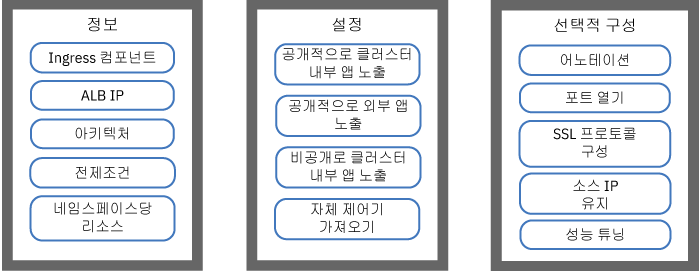
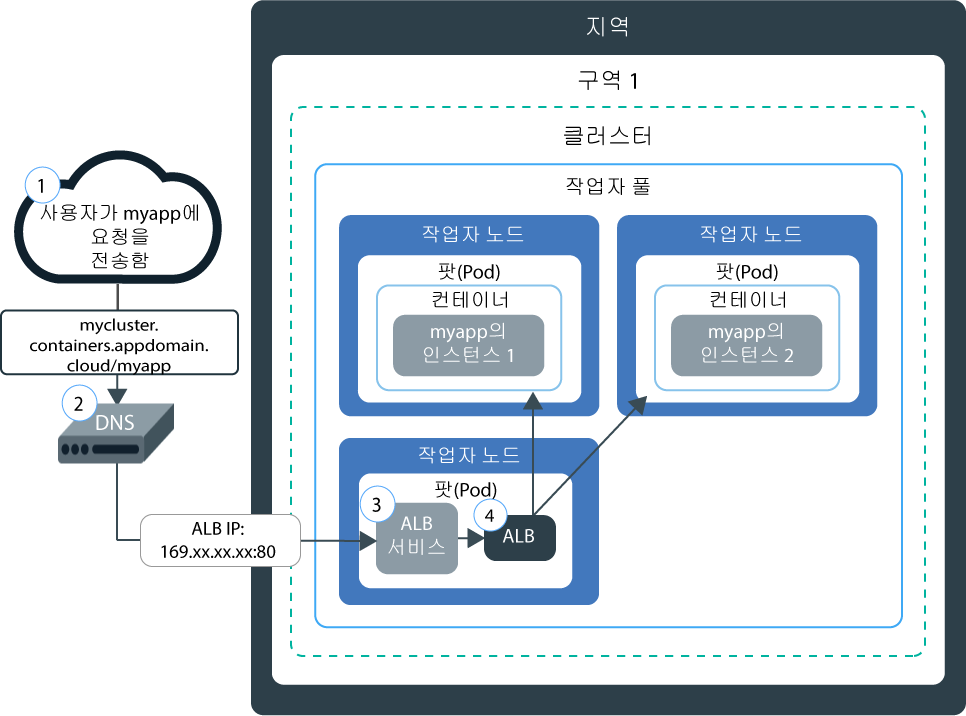
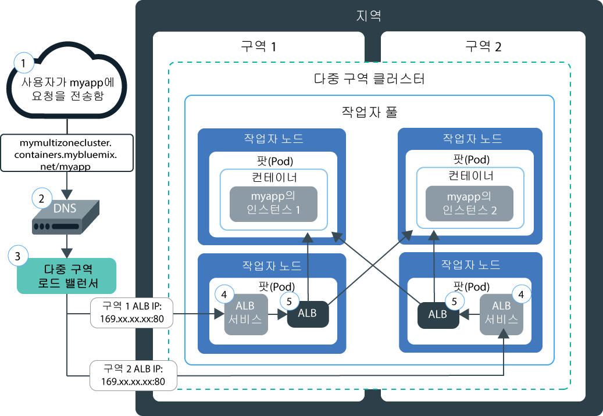
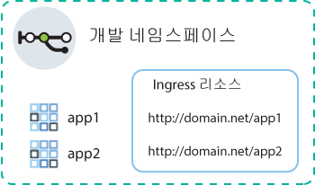
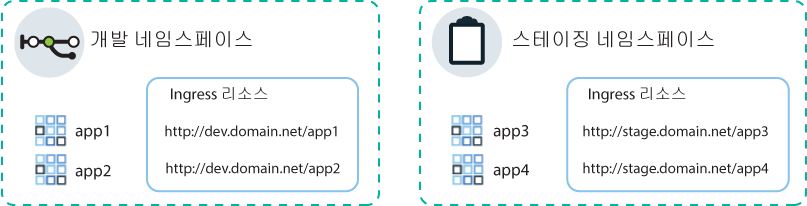
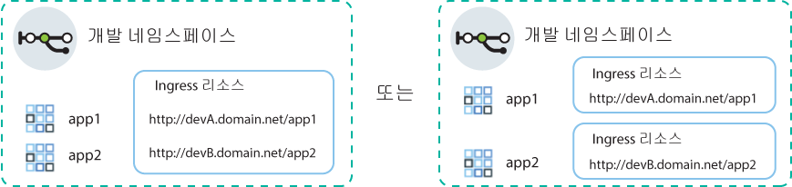

---

copyright:
  years: 2014, 2019
lastupdated: "2019-06-12"

keywords: kubernetes, iks, nginx, ingress controller

subcollection: containers

---

{:new_window: target="_blank"}
{:shortdesc: .shortdesc}
{:screen: .screen}
{:pre: .pre}
{:table: .aria-labeledby="caption"}
{:codeblock: .codeblock}
{:tip: .tip}
{:note: .note}
{:important: .important}
{:deprecated: .deprecated}
{:download: .download}
{:preview: .preview}


# Ingress 애플리케이션 로드 밸런서(ALB)로 HTTPS 로드 밸런싱
{: #ingress}

{{site.data.keyword.containerlong}}에서 IBM 제공 애플리케이션 로드 밸런서에서 관리하는 Ingress 리소스를 작성하여 Kubernetes 클러스터에서 여러 앱을 노출합니다.
{:shortdesc}



<map name="image-map">
    <area target="" alt="Ingress 컴포넌트" title="Ingress 컴포넌트" href="#ingress_components" coords="28,42,172,69" shape="rect">
    <area target="" alt="ALB IP" title="ALB IP" href="#ips" coords="27,79,171,104" shape="rect">
    <area target="" alt="아키텍처" title="아키텍처" href="#architecture-single" coords="31,114,171,140" shape="rect">
    <area target="" alt="전제조건" title="전제조건" href="#config_prereqs" coords="28,151,171,176" shape="rect">
    <area target="" alt="단일 또는 다중 네임스페이스에 대한 네트워킹 계획" title="단일 또는 다중 네임스페이스에 대한 네트워킹 계획" href="#multiple_namespaces" coords="31,191,172,229" shape="rect">
    <area target="" alt="클러스터 내부에 있는 앱을 공용으로 노출" title="클러스터 내부에 있는 앱을 공용으로 노출" href="#ingress_expose_public" coords="275,43,418,78" shape="rect">
    <area target="" alt="클러스터 외부에 있는 앱을 공용으로 노출" title="클러스터 외부에 있는 앱을 공용으로 노출" href="#external_endpoint" coords="275,94,419,128" shape="rect">
    <area target="" alt="사설 네트워크에 앱 노출" title="사설 네트워크에 앱 노출" href="#ingress_expose_private" coords="277,141,418,177" shape="rect">
    <area target="" alt="자체 Ingress 제어기 가져오기" title="자체 Ingress 제어기 가져오기" href="#user_managed" coords="278,192,416,228" shape="rect">
    <area target="" alt="어노테이션으로 Ingress 리소스의 사용자 정의" title="어노테이션으로 Ingress 리소스의 사용자 정의" href="#annotations" coords="523,44,670,73" shape="rect">
    <area target="" alt="Ingress ALB에서 포트 열기" title="Ingress ALB에서 포트 열기" href="#opening_ingress_ports" coords="521,83,669,105" shape="rect">
    <area target="" alt="HTTP 레벨에서 SSL 프로토콜과 SSL 암호 구성" title="HTTP 레벨에서 SSL 프로토콜과 SSL 암호 구성" href="#ssl_protocols_ciphers" coords="523,116,669,158" shape="rect">
    <area target="" alt="소스 IP 주소 유지" title="소스 IP 주소 유지" href="#preserve_source_ip" coords="522,167,671,202" shape="rect">
    <area target="" alt="ALB 성능 튜닝" title="ALB 성능 튜닝" href="#perf_tuning" coords="524,213,669,237" shape="rect">
</map>

## 샘플 YAML
{: #sample_ingress}

이 샘플 YAML 파일을 사용하여 Ingress 리소스 지정을 빠르게 시작할 수 있습니다.
{: shortdesc}

**앱을 공용으로 노출하는 Ingress 리소스**</br>

다음 작업을 이미 완료하셨습니까?
- 앱 배치
- 앱 서비스 작성
- 도메인 이름 및 TLS 시크릿 선택

다음 배치 YAML을 사용하여 Ingress 리소스를 작성할 수 있습니다.

```
apiVersion: extensions/v1beta1
kind: Ingress
metadata:
  name: myingressresource
spec:
  tls:
  - hosts:
    - <domain>
    secretName: <tls_secret_name>
  rules:
  - host: <domain>
    http:
      paths:
      - path: /<app1_path>
        backend:
          serviceName: <app1_service>
          servicePort: 80
      - path: /<app2_path>
        backend:
          serviceName: <app2_service>
          servicePort: 80
```
{: codeblock}

</br>

**앱을 비공개로 노출하는 Ingress 리소스**</br>

다음 작업을 이미 완료하셨습니까?
- 사설 ALB 사용
- 앱 배치
- 앱 서비스 작성
- 사용자 정의 도메인 이름 및 TLS 시크릿 등록

다음 배치 YAML을 사용하여 Ingress 리소스를 작성할 수 있습니다.

```
apiVersion: extensions/v1beta1
kind: Ingress
metadata:
  name: myingressresource
  annotations:
    ingress.bluemix.net/ALB-ID: "<private_ALB_ID_1>;<private_ALB_ID_2>"
spec:
  tls:
  - hosts:
    - <domain>
    secretName: <tls_secret_name>
  rules:
  - host: <domain>
    http:
      paths:
      - path: /<app1_path>
        backend:
          serviceName: <app1_service>
          servicePort: 80
      - path: /<app2_path>
        backend:
          serviceName: <app2_service>
          servicePort: 80
```
{: codeblock}

<br />


## Ingress의 개념
{: #planning}

Ingress는 공용 또는 개인용 요청을 앱에 전달함으로써 클러스터 내 네트워크 트래픽 워크로드의 균형을 유지하는 Kubernetes 서비스입니다. Ingress를 사용하여 고유 공용 또는 개인용 라우트를 사용함으로써 공용 또는 사설 네트워크에 여러 앱 서비스를 노출시킬 수 있습니다.
{:shortdesc}

### Ingress에서 무엇이 제공됩니까?
{: #ingress_components}

Ingress는 다음 3개의 컴포넌트로 구성되어 있습니다.
<dl>
<dt>Ingress 리소스</dt>
<dd>Ingress를 사용하여 앱을 노출시키려면 앱에 대한 Kubernetes 서비스를 작성하고 Ingress 리소스를 정의하여 Ingress에 이 서비스를 등록해야 합니다. Ingress 리소스는 앱에 대한 수신 요청을 라우팅하는 방법에 대한 규칙을 정의하는 Kubernetes 리소스입니다. Ingress 리소스는 공용 라우트에 추가되어 `mycluster.us-south.containers.appdomain.cloud/myapp1` 등의 고유 앱 URL을 작성하는 앱 서비스에 대한 경로도 지정합니다.<p class="note">2018년 5월 24일 현재, 새 클라우드에 대해 Ingress 하위 도메인 형식이 변경되었습니다. 새 하위 도메인 형식으로 포함된 지역 또는 구역 이름은 클러스터가 작성된 구역을 기반으로 생성됩니다. 일치하는 앱 도메인 이름에 대한 파이프라인 종속성이 있으면 IBM 제공 Ingress 하위 도메인 대신에 자체 사용자 정의 도메인을 사용할 수 있습니다.<ul><li>2018년 5월 24일 이후에 작성된 모든 클러스터에는 새 형식 <code>&lt;cluster_name&gt;.&lt;region_or_zone&gt;.containers.appdomain.cloud</code>의 하위 도메인이 지정됩니다.</li><li>2018년 5월 24일 이전에 작성된 단일 구역 클러스터는 이전 형식 <code>&lt;cluster_name&gt;.&lt;region&gt;.containers.mybluemix.net</code>의 지정된 하위 도메인을 계속 사용합니다.</li><li>처음으로 [클러스터에 구역을 추가](/docs/containers?topic=containers-add_workers#add_zone)하여 2018년 5월 24일 이전에 작성된 단일 구역 클러스터를 다중 구역으로 변경하는 경우, 클러스터는 이전 형식 <code>&lt;cluster_name&gt;.&lt;region&gt;.containers.mybluemix.net</code>의 지정된 하위 도메인을 계속 사용하며 이에는 새 형식 <code>&lt;cluster_name&gt;.&lt;region_or_zone&gt;.containers.appdomain.cloud</code>의 하위 도메인도 역시 지정됩니다. 두 하위 도메인 중 하나를 사용할 수 있습니다.</li></ul></p>**다중 구역 클러스터**: Ingress 리소스는 글로벌하며, 다중 구역 클러스터의 네임스페이스당 하나의 Ingress 리소스만 필요합니다.</dd>
<dt>애플리케이션 로드 밸런서(ALB)</dt>
<dd>애플리케이션 로드 밸런서(ALB)는 수신 HTTP, HTTPS 또는 TCP 서비스 요청을 청취하는 외부 로드 밸런서입니다. 그리고 ALB는 Ingress 리소스에 정의된 규칙에 따라 적합한 앱 팟(Pod)에 요청을 전달합니다. 표준 클러스터를 작성할 때 {{site.data.keyword.containerlong_notm}}에서 자동으로 클러스터용 고가용성 ALB를 작성하고 고유 공용 라우트를 ALB에 지정합니다. 공용 라우트는 클러스터 작성 중에 IBM Cloud 인프라(SoftLayer) 계정으로 프로비저닝된 포터블 공인 IP 주소에 링크됩니다. 기본 사설 ALB도 자동으로 작성되지만 자동으로 사용으로 설정되지는 않습니다.<br></br>**다중 구역 클러스터**: 클러스터에 구역을 추가하는 경우에는 포터블 공용 서브넷이 추가되며 새 공용 ALB가 해당 구역의 서브넷에서 자동으로 작성되고 사용으로 설정됩니다. 클러스터의 모든 기본 공용 ALB는 하나의 공용 라우트를 공유하지만 서로 다른 IP 주소를 보유합니다. 기본 사설 ALB 역시 각 구역에서 자동으로 작성되지만 자동으로 사용되도록 설정되지는 않습니다.</dd>
<dt>다중 구역 로드 밸런서(MZLB)</dt>
<dd><p>**다중 구역 클러스터**: 다중 구역 클러스터를 작성하거나 [단일 구역 클러스터에 구역을 추가](/docs/containers?topic=containers-add_workers#add_zone)할 때마다 각 지역당 1개의 MZLB가 존재하도록 Cloudflare 다중 구역 로드 밸런서(MZLB)가 자동으로 작성되고 배치됩니다. MZLB는 동일한 하위 도메인 뒤에 사용자 ALB의 IP 주소를 지정하며, 이러한 IP 주소에 대한 상태 검사를 사용하여 사용 가능 여부를 판별합니다. 예를 들어, 미국 동부 지역의 3개 구역에 작업자 노드가 있으면 하위 도메인 `yourcluster.us-east.containers.appdomain.cloud`에 3개의 ALB IP 주소가 있습니다. MZLB 상태는 지역의 각 구역에서 공용 ALB IP를 검사하며, 이러한 상태 검사를 기반으로 DNS 검색 결과가 지속적으로 업데이트되도록 합니다. 예를 들어, ALB의 IP 주소가 `1.1.1.1`, `2.2.2.2` 및 `3.3.3.3`인 경우에 Ingress 하위 도메인의 정상 오퍼레이션 DNS 검색은 모두 3개의 IP를 리턴하며 이 중에서 1개를 클라이언트가 무작위로 액세스합니다. IP 주소가 `3.3.3.3`인 ALB가 어떤 이유로든 사용 불가능하게 된 경우(예: 구역 장애로 인해), 해당 구역에 대한 상태 검사는 실패하며 MZLB는 하위 도메인에서 실패한 IP를 제거합니다. 그리고 DNS 검색은 정상적인 `1.1.1.1` 및 `2.2.2.2` ALB IP만 리턴합니다. 하위 도메인의 TTL(Time To Live)이 30초이므로, 30초 후에 새 클라이언트 앱은 사용 가능한 정상 ALB IP 중 하나에만 액세스할 수 있습니다.</p><p>드물지만 일부 DNS 분석기 또는 클라이언트 앱은 30초 TTL 이후에도 비정상 ALB IP를 계속 사용할 수 있습니다. 클라이언트 앱이 `3.3.3.3` IP를 포기하고 `1.1.1.1` 또는 `2.2.2.2`에 연결을 시도할 때까지 이러한 클라이언트 앱의 로드 시간은 보다 길어질 수 있습니다. 클라이언트 브라우저나 클라이언트 앱 설정에 따라, 지연 시간의 범위는 수 초에서 총 TCP 제한시간까지일 수 있습니다.</p>
<p>MZLB는 IBM 제공 Ingress 하위 도메인만을 사용하는 공용 ALB에 대해 로드 밸런싱을 수행합니다. 사설 ALB만 사용하는 경우에는 수동으로 ALB의 상태를 확인하고 DNS 검색 결과를 업데이트해야 합니다. 사용자 정의 도메인을 사용하는 공용 ALB를 사용하는 경우, 사용자 정의 도메인의 요청을 클러스터의 IBM 제공 Ingress 하위 도메인으로 전달할 수 있도록 DNS 항목의 CNAME을 작성하여 MZLB 로드 밸런싱에 ALB를 포함할 수 있습니다.</p>
<p class="note">Calico 사전-DNAT 네트워크 정책을 사용하여 Ingress 서비스에 대한 모든 수신 트래픽을 차단하는 경우, ALB의 상태 검사에 사용되는 <a href="https://www.cloudflare.com/ips/">Cloudflare의 IPv4 IP </a> 역시 화이트리스트에 추가해야 합니다. 이러한 IP를 화이트리스트에 추가하기 위한 Calico 사전-DNAT 정책의 작성 방법에 대한 단계를 알아보려면 <a href="/docs/containers?topic=containers-policy_tutorial#lesson3">Calico 네트워크 정책 튜토리얼</a>의 학습 3을 참조하십시오.</p></dd>
</dl>

### IP 주소는 Ingress ALB에 어떻게 지정되어 있습니까?
{: #ips}

표준 클러스터를 작성하면 {{site.data.keyword.containerlong_notm}}에서 포터블 공용 서브넷과 포터블 사설 서브넷을 자동으로 프로비저닝합니다. 기본적으로, 클러스터는 자동으로 다음을 사용합니다.
* 기본 공용 Ingress ALB에 대한 포터블 공용 서브넷의 한 개의 포터블 공인 IP 주소.
* 기본 공용 Ingress ALB에 대한 포터블 공용 서브넷의 한 개의 포터블 사설 IP 주소.
{: shortdesc}

다중 구역 클러스터가 있는 경우 기본 공용 ALB 및 기본 사설 ALB가 각 구역에서 자동으로 작성됩니다. 기본 공용 ALB의 IP 주소는 모두 클러스터에 대해 동일한 IBM 제공 하위 도메인 뒤에 있습니다.

포터블 공인 및 사설 IP 주소는 정적인 유동 IP이므로 작업자 노드가 제거될 때 변경되지 않습니다. 작업자 노드가 제거되면 해당 IP를 지속적으로 모니터링하는 `Keepalived` 디먼이 자동으로 해당 작업자 노드에 있었던 ALB 팟(Pod)을 해당 구역의 다른 작업자 노드로 다시 스케줄합니다. 다시 스케줄된 ALB 팟(Pod)은 동일한 정적 IP 주소를 유지합니다. 클러스터의 유효 기간 동안 각 구역의 ALB IP 주소는 변경되지 않습니다. 클러스터에서 구역을 제거하면 해당 구역에 대한 ALB IP 주소가 제거됩니다.

ALB에 지정된 IP를 보려면 다음 명령을 실행할 수 있습니다.
```
     ibmcloud ks albs --cluster <cluster_name_or_id>
```
{: pre}

구역 장애 발생 시 ALB IP에 발생하는 사항에 대한 자세한 정보는 [다중 구역 로드 밸런서 컴포넌트](#ingress_components)의 정의를 참조하십시오.


### 단일 구역 클러스터에서 Ingress를 사용하여 요청이 내 앱에 도달하는 방법은 무엇입니까?
{: #architecture-single}


다음 다이어그램은 Ingress가 인터넷에서 단일 구역 클러스터의 앱으로 통신을 지정하는 방법을 보여줍니다.



1. 사용자는 앱의 URL에 액세스하여 요청을 앱에 전송합니다. 이 URL은 Ingress 리소스 경로가 포함된 노출된 앱의 공용 URL입니다(예: `mycluster.us-south.containers.appdomain.cloud/myapp`).

2. DNS 시스템 서비스는 URL의 하위 도메인을 클러스터에서 ALB를 노출하는 로드 밸런서의 포터블 공인 IP 주소로 해석합니다.

3. 해석된 IP 주소를 기반으로 하여 클라이언트는 ALB를 노출하는 로드 밸런서 서비스로 요청을 전송합니다.

4. 로드 밸런서 서비스는 해당 요청을 ALB로 라우팅합니다.

5. ALB는 클러스터에서 `myapp` 경로에 대한 라우팅 규칙이 존재하는지 여부를 확인합니다. 일치하는 규칙이 발견된 경우에는 Ingress 리소스에서 정의한 규칙에 따라 요청이 앱이 배치된 팟(Pod)에 전달됩니다. 패키지의 소스 IP 주소는 앱 팟(Pod)이 실행 중인 작업자 노드의 공인 IP 주소의 IP 주소로 변경됩니다. 여러 앱 인스턴스가 클러스터에 배치되는 경우 ALB는 앱 팟(Pod) 간의 요청을 로드 밸런싱합니다.

### 다중 구역 클러스터에서 Ingress를 사용하여 요청이 내 앱에 도달하는 방법은 무엇입니까?
{: #architecture-multi}

다음 다이어그램은 Ingress가 인터넷에서 다중 구역 클러스터의 앱으로 통신을 지정하는 방법을 보여줍니다.



1. 사용자는 앱의 URL에 액세스하여 요청을 앱에 전송합니다. 이 URL은 Ingress 리소스 경로가 포함된 노출된 앱의 공용 URL입니다(예: `mycluster.us-south.containers.appdomain.cloud/myapp`).

2. 글로벌 로드 밸런서의 역할을 하는 DNS 시스템 서비스는 URL의 하위 도메인을 MZLB에 의해 정상으로 보고된 사용 가능한 IP 주소로 해석합니다. MZLB는 클러스터의 각 구역에서 공용 ALB를 노출하는 로드 밸런서 서비스의 포터블 공인 IP 주소를 지속적으로 검사합니다. IP 주소는 라운드 로빈 주기로 해석되며, 요청이 다양한 구역에서 정상 상태의 ALB 간에 균등하게 로드 밸런싱됨을 보장합니다.

3. 클라이언트는 ALB를 노출하는 로드 밸런서 서비스의 IP 주소로 요청을 전송합니다.

4. 로드 밸런서 서비스는 해당 요청을 ALB로 라우팅합니다.

5. ALB는 클러스터에서 `myapp` 경로에 대한 라우팅 규칙이 존재하는지 여부를 확인합니다. 일치하는 규칙이 발견된 경우에는 Ingress 리소스에서 정의한 규칙에 따라 요청이 앱이 배치된 팟(Pod)에 전달됩니다. 패키지의 소스 IP 주소는 앱 팟(Pod)이 실행 중인 작업자 노드의 공인 IP 주소로 변경됩니다. 여러 앱 인스턴스가 클러스터에 배치되는 경우, ALB는 모든 구역에서 앱 팟(Pod) 간의 요청을 로드 밸런싱합니다.

<br />


## 전제조건
{: #config_prereqs}

Ingress를 시작하기 전에 다음 전제조건을 검토하십시오.
{:shortdesc}

**모든 Ingress 구성에 대한 전제조건:**
- Ingress는 표준 클러스터에만 사용 가능하고 고가용성을 보장할 수 있도록 구역당 최소한 2개의 작업자 노드를 요구하며 해당 주기적 업데이트가 적용됩니다. 한 구역에 한 명의 작업자만 있는 경우, ALB는 자동 업데이트를 수신할 수 없습니다. 자동 업데이트가 ALB 팟(Pod)에 롤아웃되면 팟(Pod)이 다시 로드됩니다. 그러나, ALB 팟(Pod)에는 고가용성을 위해 각 작업자 노드에 하나의 팟(Pod)만 스케줄되도록 하는 반친화성 규칙이 있습니다. 하나의 작업자에 하나의 ALB 팟(Pod)만 있으므로 트래픽이 인터럽트되지 않도록 팟(Pod)이 다시 시작되지 않습니다. ALB 팟(Pod)은 업데이트된 새 팟(Pod)을 스케줄할 수 있도록 이전 팟(Pod)을 수동으로 삭제하는 경우에만 최신 버전으로 업데이트됩니다.
- Ingress를 설정하려면 다음 [{{site.data.keyword.Bluemix_notm}} IAM 역할](/docs/containers?topic=containers-users#platform)이 필요합니다.
    - 클러스터에 대한 **관리자** 플랫폼 역할
    - 모든 네임스페이스에서 **관리자** 서비스 역할

**다중 구역 클러스터에서 Ingress 사용을 위한 전제조건**:
 - [에지 작업자 노드](/docs/containers?topic=containers-edge)로 네트워크 트래픽을 제한하는 경우에는 Ingress 팟(Pod)의 고가용성을 위해 각 구역에서 최소한 2개의 에지 작업자 노드를 사용하도록 설정해야 합니다. 구역당 최소한 2개의 작업자 노드가 있으며 클러스터의 모든 구역에 전개된 [에지 노드 작업자 풀을 작성](/docs/containers?topic=containers-add_workers#add_pool)하십시오.
 - 클러스터용 다중 VLAN, 동일한 VLAN의 다중 서브넷 또는 다중 구역 클러스터가 있는 경우에는 작업자 노드가 사설 네트워크에서 서로 간에 통신할 수 있도록 IBM Cloud 인프라(SoftLayer) 계정에 대해 [Virtual Router Function (VRF)](/docs/infrastructure/direct-link?topic=direct-link-overview-of-virtual-routing-and-forwarding-vrf-on-ibm-cloud#overview-of-virtual-routing-and-forwarding-vrf-on-ibm-cloud)을 사용으로 설정해야 합니다. VRF를 사용으로 설정하려면 [IBM Cloud 인프라(SoftLayer) 계정 담당자에게 문의](/docs/infrastructure/direct-link?topic=direct-link-overview-of-virtual-routing-and-forwarding-vrf-on-ibm-cloud#how-you-can-initiate-the-conversion)하십시오. VRF를 사용할 수 없거나 사용하지 않으려면 [VLAN Spanning](/docs/infrastructure/vlans?topic=vlans-vlan-spanning#vlan-spanning)을 사용으로 설정하십시오. 이 조치를 수행하려면 **네트워크 > 네트워크 VLAN Spanning 관리** [인프라 권한](/docs/containers?topic=containers-users#infra_access)이 필요합니다. 또는 이를 사용으로 설정하도록 계정 소유자에게 요청할 수 있습니다. VLAN Spanning이 이미 사용으로 설정되었는지 확인하려면 `ibmcloud ks vlan-spanning-get --region <region>` [명령](/docs/containers?topic=containers-cli-plugin-kubernetes-service-cli#cs_vlan_spanning_get)을 사용하십시오. 
 - 구역에서 장애가 발생하는 경우, 해당 구역의 Ingress ALB에 대한 요청에서 간헐적인 장애가 나타날 수 있습니다.

<br />


## 단일 또는 다중 네임스페이스에 대한 네트워킹 계획
{: #multiple_namespaces}

노출할 앱이 있는 네임스페이스당 하나의 Ingress 리소스가 필요합니다.
{:shortdesc}

### 모든 앱이 하나의 네임스페이스에 있음
{: #one-ns}

클러스터의 앱이 모두 동일한 네임스페이스에 있는 경우 해당 네임스페이스에서 노출되는 앱에 대한 라우팅 규칙을 정의하려면 하나의 Ingress 리소스가 필요합니다. 예를 들어, 개발 네임스페이스의 서비스에서 노출되는 `app1` 및 `app2`가 있는 경우 네임스페이스에 Ingress 리소스를 작성할 수 있습니다. 리소스는 `domain.net`을 호스트로 지정하고 각 앱이 청취하는 경로를 `domain.net`에 등록합니다.
{: shortdesc}



### 앱이 다중 네임스페이스에 있음
{: #multi-ns}

클러스터의 앱이 여러 네임스페이스에 있는 경우 해당 네임스페이스에서 노출되는 앱에 대한 규칙을 정의하려면 네임스페이스당 하나의 리소스를 작성해야 합니다.
{: shortdesc}

그러나 호스트 이름을 하나의 리소스로만 정의할 수 있습니다. 여러 개의 리소스로 동일한 호스트 이름을 정의할 수 없습니다. 다중 Ingress 리소스를 동일한 호스트 이름에 등록하려면 와일드카드 도메인을 사용해야 합니다. `*.domain.net`와 같은 와일드카드 도메인이 등록되면 다중 하위 도메인을 모두 동일한 호스트로 해석할 수 있습니다. 그런 다음, 각 네임스페이스에 Ingress 리소스를 작성하고 각 Ingress 리소스에 다른 하위 도메인을 지정할 수 있습니다.

예를 들어, 다음 시나리오를 고려하십시오.
* 두 가지 버전의 테스트용 샘플 앱 `app1` 및 `app3`이 있습니다.
* 동일한 클러스터 내에 있는 두 개의 다른 네임스페이스에 앱을 배치합니다. 즉, `app1`을 개발 네임스페이스에 배치하고 `app3`을 스테이징 네임스페이스에 배치합니다.

동일한 클러스터 ALB를 사용하여 이러한 앱에 대한 트래픽을 관리하기 위해 다음 서비스와 리소스를 작성합니다.
* `app1`을 노출하기 위한 개발 네임스페이스의 Kubernetes 서비스
* 호스트를 `dev.domain.net`으로 지정하는 개발 네임스페이스의 Ingress 리소스
* `app3`을 노출하기 위한 스테이징 네임스페이스의 Kubernetes 서비스
* 호스트를 `stage.domain.net`으로 지정하는 스테이징 네임스페이스의 Ingress 리소스
</br>



이제 두 URL이 모두 동일한 도메인으로 해석되므로 둘 다 동일한 ALB에서 제공됩니다. 그러나 스테이징 네임스페이스의 리소스가 `stage` 하위 도메인에 등록되므로, Ingress ALB는 `stage.domain.net/app3` URL의 요청을 `app3`으로만 올바르게 라우팅합니다.

{: #wildcard_tls}
IBM 제공 Ingress 하위 도메인 와일드카드, `*.<cluster_name>.<region>.containers.appdomain.cloud`가 클러스터에 기본적으로 등록됩니다. IBM 제공 TLS 인증서는 와일드카드 인증서이며 와일드카드 하위 도메인에 사용될 수 있습니다. 사용자 정의 도메인을 사용하려면 사용자 정의 도메인을 와일드카드 도메인(예: `*.custom_domain.net`)으로 등록해야 합니다. TLS를 사용하려면 와일드카드 인증서를 가져와야 합니다.
{: note}

### 네임스페이스 내의 다중 도메인
{: #multi-domains}

개별 네임스페이스 내에서 하나의 도메인을 사용하여 네임스페이스의 모든 앱에 액세스할 수 있습니다. 개별 네임스페이스 내에서 앱에 대해 다른 도메인을 사용하려면 와일드카드 도메인을 사용하십시오. `*.mycluster.us-south.containers.appdomain.cloud`와 같은 와일드카드 도메인이 등록되면 다중 하위 도메인이 모두 동일한 호스트로 해석됩니다. 그러면 하나의 리소스를 사용하여 해당 리소스 내의 다중 하위 도메인을 지정할 수 있습니다. 또는 네임스페이스에 다중 Ingress 리소스를 작성하고 각 Ingress 리소스에 다른 하위 도메인을 지정할 수 있습니다.
{: shortdesc}



IBM 제공 Ingress 하위 도메인 와일드카드, `*.<cluster_name>.<region>.containers.appdomain.cloud`가 클러스터에 기본적으로 등록됩니다. IBM 제공 TLS 인증서는 와일드카드 인증서이며 와일드카드 하위 도메인에 사용될 수 있습니다. 사용자 정의 도메인을 사용하려면 사용자 정의 도메인을 와일드카드 도메인(예: `*.custom_domain.net`)으로 등록해야 합니다. TLS를 사용하려면 와일드카드 인증서를 가져와야 합니다.
{: note}

<br />


## 클러스터 내부에 있는 앱을 공용으로 노출
{: #ingress_expose_public}

공용 Ingress ALB를 사용하여 클러스터 내부에 있는 앱을 공용으로 노출합니다.
{:shortdesc}

시작하기 전에:

* Ingress [전제조건](#config_prereqs)을 검토하십시오.
* [계정에 로그인하십시오. 해당되는 경우, 적절한 리소스 그룹을 대상으로 지정하십시오. 클러스터의 컨텍스트를 설정하십시오.](/docs/containers?topic=containers-cs_cli_install#cs_cli_configure)

### 1단계: 앱 배치 및 앱 서비스 작성
{: #public_inside_1}

앱을 배치하고 앱 노출을 위한 Kubernetes 서비스를 작성하여 시작하십시오.
{: shortdesc}

1.  [클러스터에 앱을 배치](/docs/containers?topic=containers-app#app_cli)하십시오. 구성 파일의 메타데이터 섹션에서 배치에 레이블(예: `app: code`)을 추가했는지 확인하십시오. 이 레이블은 팟(Pod)을 Ingress 로드 밸런싱에 포함시킬 수 있도록 앱이 실행 중인 모든 팟(Pod)을 식별하는 데 필요합니다.

2.   노출할 각 앱에 대한 Kubernetes 서비스를 작성하십시오. Ingress 로드 밸런싱에서 클러스터 ALB에 의해 포함되려면 앱이 Kubernetes 서비스에 의해 노출되어야 합니다.
      1.  선호하는 편집기를 열고 예를 들어 이름이 `myappservice.yaml`인 서비스 구성 파일을 작성하십시오.
      2.  ALB가 노출할 앱에 대한 서비스를 정의하십시오.

          ```
          apiVersion: v1
          kind: Service
          metadata:
            name: myappservice
          spec:
            selector:
              <selector_key>: <selector_value>
            ports:
             - protocol: TCP
               port: 8080
          ```
          {: codeblock}

          <table>
          <thead>
          <th colspan=2> ALB 서비스 YAML 파일 컴포넌트 이해</th>
          </thead>
          <tbody>
          <tr>
          <td><code>selector</code></td>
          <td>사용자의 앱이 실행되는 팟(Pod)을 대상으로 지정하기 위해 사용할 레이블 키(<em>&lt;selector_key&gt;</em>) 및 값(<em>&lt;selector_value&gt;</em>) 쌍을 입력하십시오. 팟(Pod)을 대상으로 지정하여 서비스 로드 밸런싱에 포함하려면 <em>&lt;selector_key&gt;</em> 및 <em>&lt;selector_value&gt;</em>가 배치 YAML의 <code>spec.template.metadata.labels</code> 섹션에 있는 키/값 쌍과 동일해야 합니다.</td>
           </tr>
           <tr>
           <td><code>port</code></td>
           <td>서비스가 청취하는 포트입니다.</td>
           </tr>
           </tbody></table>
      3.  변경사항을 저장하십시오.
      4.  클러스터에 서비스를 작성하십시오. 클러스터의 다중 네임스페이스에 앱이 배치되는 경우 서비스가 노출할 앱과 동일한 네임스페이스에 배치되는지 확인하십시오.

          ```
          kubectl apply -f myappservice.yaml [-n <namespace>]
          ```
          {: pre}
      5.  노출할 모든 앱에 대해 이러한 단계를 반복하십시오.


### 2단계: 앱 도메인 선택
{: #public_inside_2}

공용 ALB를 구성할 때는 앱에 액세스하는 데 사용되는 도메인을 선택합니다.
{: shortdesc}

IBM 제공 도메인(예: `mycluster-12345.us-south.containers.appdomain.cloud/myapp`)을 사용하여 인터넷에서 앱에 액세스할 수 있습니다. 사용자 정의 도메인을 대신 사용하기 위해, 사용자 정의 도메인을 IBM 제공 도메인에 맵핑하도록 CNAME 레코드를 설정하거나 ALB의 공인 IP 주소를 사용하여 DNS 제공자로 A 레코드를 설정할 수 있습니다.

**IBM 제공 Ingress 도메인을 사용하려면 다음을 수행하십시오.**

IBM 제공 도메인을 가져오십시오. `<cluster_name_or_ID>`를 앱이 배치된 클러스터의 이름으로 대체하십시오.
```
ibmcloud ks cluster-get --cluster <cluster_name_or_ID> | grep Ingress
```
{: pre}

출력 예:
```
Ingress Subdomain:      mycluster-12345.us-south.containers.appdomain.cloud
Ingress Secret:         <tls_secret>
```
{: screen}

**사용자 정의 도메인을 사용하려면 다음을 수행하십시오.**
1.    사용자 정의 도메인을 작성하십시오. 사용자 정의 도메인을 등록하려면 DNS(Domain Name Service) 제공자 또는 [{{site.data.keyword.Bluemix_notm}} DNS](/docs/infrastructure/dns?topic=dns-getting-started)를 통해 작업하십시오.
      * Ingress에서 노출할 앱이 하나의 클러스터의 여러 네임스페이스에 있는 경우 사용자 정의 도메인을 와일드카드 도메인(예: `*.custom_domain.net`)으로 등록하십시오.

2.  수신 네트워크 트래픽을 IBM 제공 ALB로 라우팅하도록 사용자의 도메인을 구성하십시오. 다음 옵션 중에서 선택하십시오.
    -   표준 이름 레코드(CNAME)로서 IBM 제공 도메인을 지정하여 사용자 정의 도메인의 별명을 정의하십시오. IBM 제공 Ingress 도메인을 찾으려면 `ibmcloud ks cluster-get --cluster <cluster_name>`을 실행하고 **Ingress subdomain** 필드를 찾으십시오. IBM에서 IBM 하위 도메인의 자동 상태 검사를 제공하고 실패한 IP를 DNS 응답에서 제거하므로, CNAME을 사용하도록 권장합니다.
    -   IP 주소를 레코드로 추가하여 IBM 제공 ALB의 포터블 공인 IP 주소로 사용자 정의 도메인을 맵핑하십시오. ALB의 포터블 공인 IP 주소를 찾으려면 `ibmcloud ks alb-get --albID  <public_alb_ID>`를 실행하십시오. 

### 3단계: TLS 종료 선택
{: #public_inside_3}

앱 도메인을 선택한 후에는 TLS 종료의 사용 여부를 선택합니다.
{: shortdesc}

ALB는 클러스터의 앱에 대한 HTTP 네트워크 트래픽을 로드 밸런싱합니다. 수신 HTTPS 연결도 로드 밸런싱하려면 네트워크 트래픽을 복호화하고 클러스터에 노출된 앱으로 복호화된 요청을 전달하도록 ALB를 구성할 수 있습니다.

* IBM 제공 Ingress 하위 도메인을 사용하는 경우에는 IBM 제공 TLS 인증서를 사용할 수 있습니다. IBM 제공 TLS 인증서는 LetsEncrypt에 의해 서명되고 IBM에 의해 완벽히 관리됩니다. 인증서는 90일마다 만료되며 만료되기 37일 전에 자동으로 갱신됩니다. 와일드카드 TLS 인증에 대한 정보는 [이 참고](#wildcard_tls)를 참조하십시오.
* 사용자 정의 도메인을 사용하는 경우에는 자체 TLS 인증서를 사용하여 TLS 종료를 관리할 수 있습니다. ALB는 먼저 앱이 있는 네임스페이스의 시크릿을 확인한 후 `default`와 마지막으로 `ibm-cert-store`에서 시크릿을 확인합니다. 오직 단일 네임스페이스의 앱이 있는 경우에는 해당되는 동일 네임스페이스의 인증서에 대한 TLS 시크릿을 가져오거나 이를 작성할 수 있습니다. 다중 네임스페이스의 앱이 있는 경우에는 ALB가 모든 네임스페이스의 인증서에 액세스하고 이를 사용할 수 있도록 `default` 네임스페이스의 인증서에 대한 TLS 시크릿을 가져오거나 작성하십시오. 각 네임스페이스에 정의한 Ingress 리소스에서 기본 네임스페이스에 있는 시크릿 이름을 지정하십시오. 와일드카드 TLS 인증에 대한 정보는 [이 참고](#wildcard_tls)를 참조하십시오. **참고**: 사전 공유 키(TLS-PSK)가 포함된 TLS 인증서는 지원되지 않습니다.

**IBM 제공 Ingress 도메인을 사용하는 경우:**

클러스터에 대한 IBM 제공 TLS 시크릿을 가져오십시오.
```
ibmcloud ks cluster-get --cluster <cluster_name_or_ID> | grep Ingress
```
{: pre}

출력 예:
```
Ingress Subdomain:      mycluster-12345.us-south.containers.appdomain.cloud
Ingress Secret:         <tls_secret>
```
{: screen}
</br>

**사용자 정의 도메인을 사용하는 경우:**

TLS 인증서가 사용하려는 {{site.data.keyword.cloudcerts_long_notm}}에 저장된 경우, 다음 명령을 사용하여 클러스터에 연관 시크릿을 가져올 수 있습니다.

```
        ibmcloud ks alb-cert-deploy --secret-name <secret_name> --cluster <cluster_name_or_ID> --cert-crn <certificate_crn>
```
{: pre}

IBM 제공 Ingress 시크릿과 동일한 이름으로 시크릿을 작성하지 않았는지 확인하십시오. `ibmcloud ks cluster-get --cluster <cluster_name_or_ID> | grep Ingress`를 실행하여 IBM 제공 Ingress 시크릿 이름을 가져올 수 있습니다.
{: note}

이 명령으로 사용하여 인증서를 가져오면 인증서 시크릿이 `ibm-cert-store`라는 네임스페이스에 작성됩니다. 그런 다음 이 시크릿에 대한 참조는 네임스페이스의 모든 Ingress 리소스가 액세스할 수 있는 `default` 네임스페이스에 작성됩니다. ALB에서 요청을 처리하는 동안 이 참조를 따라 `ibm-cert-store` 네임스페이스에서 인증서 시크릿을 선택하여 사용합니다.

</br>

준비된 TLS 인증서가 없으면 다음 단계를 수행하십시오.
1. 인증서 제공자의 인증 기관(CA) 인증서 및 키를 생성하십시오. 고유 도메인이 있는 경우 도메인의 공식적 TLS 인증서를 구매하십시오. [CN ](https://support.dnsimple.com/articles/what-is-common-name/)이 각 인증서에 대해 서로 다른지 확인하십시오.
2. 인증서 및 키를 Base-64로 변환하십시오.
   1. 인증서 및 키를 Base-64로 인코딩하고 Base-64로 인코딩된 값을 새 파일에 저장하십시오.
      ```
      openssl base64 -in tls.key -out tls.key.base64
      ```
      {: pre}

   2. 인증서 및 키의 Base-64로 인코딩된 값을 보십시오.
      ```
      cat tls.key.base64
      ```
      {: pre}

3. 인증서 및 키를 사용하여 시크릿 YAML 파일을 작성하십시오.
     ```
     apiVersion: v1
     kind: Secret
     metadata:
       name: ssl-my-test
     type: Opaque
     data:
       tls.crt: <client_certificate>
       tls.key: <client_key>
     ```
     {: codeblock}

4. 인증서를 Kubernetes 시크릿으로 작성하십시오.
     ```
     kubectl create -f ssl-my-test
     ```
     {: pre}
     IBM 제공 Ingress 시크릿과 동일한 이름으로 시크릿을 작성하지 않았는지 확인하십시오. `ibmcloud ks cluster-get --cluster <cluster_name_or_ID> | grep Ingress`를 실행하여 IBM 제공 Ingress 시크릿 이름을 가져올 수 있습니다.
     {: note}


### 3단계: Ingress 리소스 작성
{: #public_inside_4}

Ingress 리소스는 ALB에서 트래픽을 앱 서비스에 라우팅하는 데 사용하는 라우팅 규칙을 정의합니다.
{: shortdesc}

클러스터에 앱이 노출되는 여러 네임스페이스가 있는 경우에는 네임스페이스당 하나의 Ingress 리소스가 필요합니다. 그러나 각 네임스페이스는 다른 호스트를 사용해야 합니다. 와일드카드 도메인을 등록하고 각 리소스에 다른 하위 도메인을 지정해야 합니다. 자세한 정보는 [단일 또는 다중 네임스페이스에 대한 네트워킹 계획](#multiple_namespaces)을 참조하십시오.
{: note}

1. 선호하는 편집기를 열고 `myingressresource.yaml`과 같은 이름의 Ingress 구성 파일을 작성하십시오.

2. IBM 제공 도메인 또는 사용자 정의 도메인을 사용하여 수신 네트워크 트래픽을 이전에 작성한 서비스로 라우팅하는 Ingress 리소스를 구성 파일에 정의하십시오.

    TLS를 사용하지 않는 YAML 예:
    ```
    apiVersion: extensions/v1beta1
    kind: Ingress
    metadata:
      name: myingressresource
    spec:
      rules:
      - host: <domain>
        http:
          paths:
          - path: /<app1_path>
            backend:
              serviceName: <app1_service>
              servicePort: 80
          - path: /<app2_path>
            backend:
              serviceName: <app2_service>
              servicePort: 80
    ```
    {: codeblock}

    TLS를 사용하는 YAML 예:
    ```
    apiVersion: extensions/v1beta1
    kind: Ingress
    metadata:
      name: myingressresource
    spec:
      tls:
      - hosts:
        - <domain>
        secretName: <tls_secret_name>
      rules:
      - host: <domain>
        http:
          paths:
          - path: /<app1_path>
            backend:
              serviceName: <app1_service>
              servicePort: 80
          - path: /<app2_path>
            backend:
              serviceName: <app2_service>
              servicePort: 80
    ```
    {: codeblock}

    <table>
    <thead>
    <th colspan=2> YAML 파일 컴포넌트 이해</th>
    </thead>
    <tbody>
    <tr>
    <td><code>tls.hosts</code></td>
    <td>TLS를 사용하려면 <em>&lt;domain&gt;</em>을 IBM 제공 Ingress 하위 도메인 또는 사용자 정의 도메인으로 대체하십시오.

    </br></br>
    <strong>참고:</strong><ul><li>하나의 클러스터에 있는 여러 네임스페이스의 서비스에서 앱을 노출한 경우 도메인의 시작 부분에 와일드카드 하위 도메인을 추가하십시오(예: `subdomain1.custom_domain.net` 또는 `subdomain1.mycluster.us-south.containers.appdomain.cloud`). 클러스터에 작성하는 각 리소스마다 고유한 하위 도메인을 사용하십시오.</li><li>Ingress 작성 중에 실패하지 않으려면 호스트에 &ast;를 사용하거나 호스트 특성을 비워 두지 마십시오.</li></ul></td>
    </tr>
    <tr>
    <td><code>tls.secretName</code></td>
    <td><ul><li>IBM 제공 Ingress 도메인을 사용하는 경우에는 <em>&lt;tls_secret_name&gt;</em>을 IBM 제공 Ingress 시크릿의 이름으로 대체하십시오.</li><li>사용자 정의 도메인을 사용하는 경우에는 <em>&lt;tls_secret_name&gt;</em>을 사용자 정의 TLS 인증서 및 키를 보유하는 이전에 작성된 시크릿으로 대체하십시오. {{site.data.keyword.cloudcerts_short}}에서 인증서를 가져온 경우에는 <code>ibmcloud ks alb-cert-get --cluster <cluster_name_or_ID> --cert-crn <certificate_crn></code>을 실행하여 TLS 인증서와 연관된 시크릿을 볼 수 있습니다.</li><ul><td>
    </tr>
    <tr>
    <td><code>host</code></td>
    <td><em>&lt;domain&gt;</em>을 IBM 제공 Ingress 하위 도메인 또는 사용자 정의 도메인으로 대체하십시오.

    </br></br>
    <strong>참고:</strong><ul><li>하나의 클러스터에 있는 여러 네임스페이스의 서비스에서 앱을 노출한 경우 도메인의 시작 부분에 와일드카드 하위 도메인을 추가하십시오(예: `subdomain1.custom_domain.net` 또는 `subdomain1.mycluster.us-south.containers.appdomain.cloud`). 클러스터에 작성하는 각 리소스마다 고유한 하위 도메인을 사용하십시오.</li><li>Ingress 작성 중에 실패하지 않으려면 호스트에 &ast;를 사용하거나 호스트 특성을 비워 두지 마십시오.</li></ul></td>
    </tr>
    <tr>
    <td><code>path</code></td>
    <td><em>&lt;app_path&gt;</em>를 슬래시 또는 앱이 청취 중인 경로로 대체하십시오. 앱에 대한 고유 라우트를 작성하기 위해 경로가 IBM 제공 또는 사용자 정의 도메인에 추가됩니다. 이 라우트를 웹 브라우저에 입력하면 네트워크 트래픽이 애플리케이션 ALB로 라우팅됩니다. ALB는 연관된 서비스를 찾고 네트워크 트래픽을 이 서비스에 전송합니다. 그 후 이 서비스는 트래픽을 앱이 실행 중인 팟(Pod)에 전달합니다.
    </br></br>
             많은 앱은 특정 경로에서 청취하지는 않지만 루트 경로와 특정 포트를 사용합니다. 이 경우에는 루트 경로를 <code>/</code>로 정의하고 앱에 대한 개별 경로를 지정하지 마십시오.         예: <ul><li><code>http://domain/</code>의 경우 <code>/</code>를 경로로 입력하십시오.</li><li><code>http://domain/app1_path</code>의 경우 <code>/app1_path</code>를 경로로 입력하십시오.</li></ul>
    </br>
    <strong>팁:</strong> [재작성 어노테이션](/docs/containers?topic=containers-ingress_annotation#rewrite-path)을 사용하여 앱이 청취하는 경로와 다른 경로에서 청취하도록 Ingress를 구성할 수 있습니다.</td>
    </tr>
    <tr>
    <td><code>serviceName</code></td>
    <td><em>&lt;app1_service&gt;</em> 및 <em>&lt;app2_service&gt;</em> 등을 앱 노출을 위해 작성한 서비스의 이름으로 대체하십시오. 클러스터에 있는 여러 네임스페이스의 서비스에서 앱을 노출한 경우 동일한 네임스페이스에 있는 앱 서비스만 포함하십시오. 노출할 앱이 있는 각 네임스페이스마다 하나의 Ingress 리소스를 작성해야 합니다.</td>
    </tr>
    <tr>
    <td><code>servicePort</code></td>
    <td>서비스가 청취하는 포트입니다. 앱에 대한 Kubernetes 서비스를 작성했을 때 정의한 동일한 포트를 사용하십시오.</td>
    </tr>
    </tbody></table>

3.  클러스터에 대한 Ingress 리소스를 작성하십시오. 리소스가 리소스에 정의한 앱 서비스와 동일한 네임스페이스에 배치되는지 확인하십시오.

    ```
        kubectl apply -f myingressresource.yaml -n <namespace>
    ```
    {: pre}
4.   Ingress 리소스가 작성되었는지 확인하십시오.

      ```
      kubectl describe ingress myingressresource
      ```
      {: pre}

      1. 이벤트의 메시지에 리소스 구성의 오류에 대한 설명이 있는 경우, 리소스 파일의 값을 변경한 후 파일을 리소스에 다시 적용하십시오.


Ingress 리소스가 앱 서비스와 동일한 네임스페이스에 작성됩니다. 이 네임스페이스의 앱이 클러스터의 Ingress ALB에 등록됩니다.

### 5단계: 인터넷에서 앱에 액세스
{: #public_inside_5}

웹 브라우저에서 액세스할 앱 서비스의 URL을 입력하십시오.
{: shortdesc}

```
https://<domain>/<app1_path>
```
{: codeblock}

여러 앱을 노출한 경우 URL에 추가되는 경로를 변경하여 해당 앱에 액세스하십시오.

```
https://<domain>/<app2_path>
```
{: codeblock}

와일드카드 도메인을 사용하여 여러 네임스페이스의 앱을 노출하는 경우 고유의 하위 도메인을 통해 해당 앱에 액세스하십시오.

```
http://<subdomain1>.<domain>/<app1_path>
```
{: codeblock}

```
http://<subdomain2>.<domain>/<app1_path>
```
{: codeblock}


Ingress를 통해 앱에 연결하는 데 문제가 있습니까? [Ingress 디버깅](/docs/containers?topic=containers-cs_troubleshoot_debug_ingress)을 시도하십시오.
{: tip}

<br />


## 클러스터 외부에 있는 앱을 공용으로 노출
{: #external_endpoint}

클러스터 외부에 있는 앱을 공용 Ingress ALB 로드 밸런싱에 포함하여 공용으로 노출합니다. IBM 제공 또는 사용자 정의 도메인의 수신 공용 요청이 외부 앱으로 자동으로 전달됩니다.
{: shortdesc}

시작하기 전에:

* Ingress [전제조건](#config_prereqs)을 검토하십시오.
* 클러스터 로드 밸런싱에 포함하고자 하는 외부 앱에 공인 IP 주소를 사용하여 액세스할 수 있는지 확인하십시오.
* [계정에 로그인하십시오. 해당되는 경우, 적절한 리소스 그룹을 대상으로 지정하십시오. 클러스터의 컨텍스트를 설정하십시오.](/docs/containers?topic=containers-cs_cli_install#cs_cli_configure)

클러스터 외부에 있는 앱을 공용으로 노출하려면 다음을 수행하십시오.

1.  작성할 외부 엔드포인트로 수신 요청을 전달할 클러스터에 대한 Kubernetes 서비스를 작성하십시오.
    1.  선호하는 편집기를 열고 예를 들어, `myexternalservice.yaml`이라는 이름의 서비스 구성 파일을 작성하십시오.
    2.  ALB가 노출할 앱에 대한 서비스를 정의하십시오.

        ```
        apiVersion: v1
        kind: Service
        metadata:
          name: myexternalservice
        spec:
          ports:
           - protocol: TCP
             port: 8080
        ```
        {: codeblock}

        <table>
        <caption>ALB 서비스 파일 컴포넌트 이해</caption>
        <thead>
        <th colspan=2> YAML 파일 컴포넌트 이해</th>
        </thead>
        <tbody>
        <tr>
        <td><code>metadata.name</code></td>
        <td><em><code>&lt;myexternalservice&gt;</code></em>를 서비스의 이름으로 대체하십시오.<p>Kubernetes 리소스에 대해 작업할 때 [개인 정보 보호](/docs/containers?topic=containers-security#pi)에 대해 자세히 알아보십시오.</p></td>
        </tr>
        <tr>
        <td><code>port</code></td>
        <td>서비스가 청취하는 포트입니다.</td>
        </tr></tbody></table>

    3.  변경사항을 저장하십시오.
    4.  클러스터에 대한 Kubernetes 서비스를 작성하십시오.

        ```
                kubectl apply -f myexternalservice.yaml
        ```
        {: pre}
2.  클러스터 로드 밸런싱에 포함하고자 하는 앱의 외부 위치를 정의하는 Kubernetes 엔드포인트를 구성하십시오.
    1.  선호하는 편집기를 열고 예를 들어, `myexternalendpoint.yaml`이라는 이름의 엔드포인트 구성 파일을 작성하십시오.
    2.  외부 엔드포인트를 정의하십시오. 외부 앱에 액세스하기 위해 사용할 수 있는 모든 공인 IP 주소 및 포트를 포함하십시오.

        ```
        kind: Endpoints
        apiVersion: v1
        metadata:
          name: myexternalendpoint
        subsets:
          - addresses:
              - ip: <external_IP1>
              - ip: <external_IP2>
            ports:
              - port: <external_port>
        ```
        {: codeblock}

        <table>
        <thead>
        <th colspan=2> YAML 파일 컴포넌트 이해</th>
        </thead>
        <tbody>
        <tr>
        <td><code>name</code></td>
        <td><em><code>&lt;myexternalendpoint&gt;</code></em>를 이전에 작성한 Kubernetes 서비스의 이름으로 대체하십시오.</td>
        </tr>
        <tr>
        <td><code>ip</code></td>
        <td><em>&lt;external_IP&gt;</em>를 사용자의 외부 앱에 연결하기 위한 공인 IP 주소로 대체하십시오.</td>
         </tr>
         <td><code>port</code></td>
         <td><em>&lt;external_port&gt;</em>를 사용자의 외부 앱이 청취하는 포트로 대체하십시오.</td>
         </tbody></table>

    3.  변경사항을 저장하십시오.
    4.  클러스터에 대한 Kubernetes 엔드포인트를 작성하십시오.

        ```
        kubectl apply -f myexternalendpoint.yaml
        ```
        {: pre}

3. "클러스터 내부에 있는 앱을 공용으로 노출"의 단계를 계속하십시오([2단계: 앱 도메인 선택](#public_inside_2)).

<br />


## 사설 네트워크에 앱 노출
{: #ingress_expose_private}

사설 Ingress ALB를 사용하여 앱을 사설 네트워크에 노출합니다.
{:shortdesc}

사설 ALB를 사용하려면 먼저 사설 ALB를 사용으로 설정해야 합니다. 사설 VLAN 전용 클러스터는 IBM 제공 Ingress 하위 도메인이 지정되지 않으므로 Ingress 시크릿은 클러스터 설정 중에 작성되지 않습니다. 사설 네트워크에 앱을 노출하려면 사용자 정의 도메인을 사용하여 ALB를 등록하고 선택적으로 사용자 고유의 TLS 인증서를 가져와야 합니다.

시작하기 전에:
* Ingress [전제조건](#config_prereqs)을 검토하십시오.
* 작업자 노드가 [공용 및 사설 VLAN에](/docs/containers?topic=containers-cs_network_planning#private_both_vlans) 또는 [사설 VLAN에만](/docs/containers?topic=containers-cs_network_planning#plan_private_vlan) 연결될 때 앱에 대한 개인용 액세스를 계획하기 위한 옵션을 검토하십시오.
    * 작업자 노드가 사설 VLAN에만 연결된 경우에는 [사설 네트워크에서 사용 가능한 DNS 서비스 ](https://kubernetes.io/docs/tasks/administer-cluster/dns-custom-nameservers/)를 구성해야 합니다.

### 1단계: 앱 배치 및 앱 서비스 작성
{: #private_1}

앱을 배치하고 앱 노출을 위한 Kubernetes 서비스를 작성하여 시작하십시오.
{: shortdesc}

1.  [클러스터에 앱을 배치](/docs/containers?topic=containers-app#app_cli)하십시오. 구성 파일의 메타데이터 섹션에서 배치에 레이블(예: `app: code`)을 추가했는지 확인하십시오. 이 레이블은 팟(Pod)을 Ingress 로드 밸런싱에 포함시킬 수 있도록 앱이 실행 중인 모든 팟(Pod)을 식별하는 데 필요합니다.

2.   노출할 각 앱에 대한 Kubernetes 서비스를 작성하십시오. Ingress 로드 밸런싱에서 클러스터 ALB에 의해 포함되려면 앱이 Kubernetes 서비스에 의해 노출되어야 합니다.
      1.  선호하는 편집기를 열고 예를 들어 이름이 `myappservice.yaml`인 서비스 구성 파일을 작성하십시오.
      2.  ALB가 노출할 앱에 대한 서비스를 정의하십시오.

          ```
          apiVersion: v1
          kind: Service
          metadata:
            name: myappservice
          spec:
            selector:
              <selector_key>: <selector_value>
            ports:
             - protocol: TCP
               port: 8080
          ```
          {: codeblock}

          <table>
          <thead>
          <th colspan=2> ALB 서비스 YAML 파일 컴포넌트 이해</th>
          </thead>
          <tbody>
          <tr>
          <td><code>selector</code></td>
          <td>사용자의 앱이 실행되는 팟(Pod)을 대상으로 지정하기 위해 사용할 레이블 키(<em>&lt;selector_key&gt;</em>) 및 값(<em>&lt;selector_value&gt;</em>) 쌍을 입력하십시오. 팟(Pod)을 대상으로 지정하여 서비스 로드 밸런싱에 포함하려면 <em>&lt;selector_key&gt;</em> 및 <em>&lt;selector_value&gt;</em>가 배치 YAML의 <code>spec.template.metadata.labels</code> 섹션에 있는 키/값 쌍과 동일해야 합니다.</td>
           </tr>
           <tr>
           <td><code>port</code></td>
           <td>서비스가 청취하는 포트입니다.</td>
           </tr>
           </tbody></table>
      3.  변경사항을 저장하십시오.
      4.  클러스터에 서비스를 작성하십시오. 클러스터의 다중 네임스페이스에 앱이 배치되는 경우 서비스가 노출할 앱과 동일한 네임스페이스에 배치되는지 확인하십시오.

          ```
          kubectl apply -f myappservice.yaml [-n <namespace>]
          ```
          {: pre}
      5.  노출할 모든 앱에 대해 이러한 단계를 반복하십시오.


### 2단계: 기본 사설 ALB 사용
{: #private_ingress}

표준 클러스터를 작성하면 작업자 노드가 있는 각 구역에 IBM 제공 사설 애플리케이션 로드 밸런서(ALB)가 작성되며 포터블 사설 IP 주소 및 사설 라우트가 지정됩니다. 그러나 각 구역의 기본 사설 ALB가 자동으로 사용되지는 않습니다. 기본 사설 ALB를 사용하여 앱에 대한 사설 네트워크 트래픽을 로드 밸런싱하려면, 먼저 IBM 제공 포터블 사설 IP 주소 또는 자체 포터블 사설 IP 주소 중 하나로 이를 사용할 수 있도록 해야 합니다.
{:shortdesc}

클러스터 작성 시에 `--no-subnet` 플래그를 사용한 경우, 사설 ALB를 사용으로 설정하려면 우선 포터블 사설 서브넷이나 사용자 관리 서브넷을 추가해야 합니다. 자세한 정보는 [클러스터의 추가 서브넷 요청](/docs/containers?topic=containers-subnets#request)을 참조하십시오.
{: note}

**사전 지정된 IBM 제공 포터블 사설 IP 주소를 사용하여 기본 사설 ALB를 사용하도록 설정하려면 다음을 수행하십시오. **

1. 사용하고자 하는 기본 사설 ALB의 ID를 가져오십시오. <em>&lt;cluster_name&gt;</em>을 노출할 앱이 배치되는 클러스터의 이름으로 대체하십시오.

    ```
    ibmcloud ks albs --cluster <cluster_name>
    ```
    {: pre}

    사설 ALB의 **상태(Status)** 필드는 _disabled_입니다.
    ```
    ALB ID                                            Enabled   Status     Type      ALB IP          Zone    Build                          ALB VLAN ID
    private-crdf253b6025d64944ab99ed63bb4567b6-alb1   false     disabled   private   -               dal10   ingress:411/ingress-auth:315   2234947
    public-crdf253b6025d64944ab99ed63bb4567b6-alb1    true      enabled    public    169.xx.xxx.xxx  dal10   ingress:411/ingress-auth:315   2234945
    ```
    {: screen}
    다중 구역 클러스터에서, ALB ID의 번호 지정된 접미어는 ALB가 추가된 순서를 표시합니다.
    * 예를 들어, ALB `private-cr6d779503319d419aa3b4ab171d12c3b8-alb1`의 `-alb1` 접미부는 해당 ALB가 작성된 첫 번째 기본 사설 ALB임을 표시합니다. 이는 사용자가 클러스터를 작성한 구역에 존재합니다. 위의 예제에서 클러스터는 `dal10`에서 작성되었습니다.
    * ALB `private-crb2f60e9735254ac8b20b9c1e38b649a5-alb2`의 `-alb2` 접미부는 해당 ALB가 작성된 두 번째 기본 사설 ALB임을 표시합니다. 이는 사용자가 클러스터에 추가한 두 번째 구역에 존재합니다. 위의 예제에서 두 번째 구역은 `dal12`입니다.

2. 사설 ALB를 사용으로 설정하십시오. 이전 단계의 출력에서 <em>&lt;private_ALB_ID&gt;</em>를 사설 ALB의 ID로 대체하십시오.

   ```
   ibmcloud ks alb-configure --albID <private_ALB_ID> --enable
   ```
   {: pre}

3. **다중 구역 클러스터**: 고가용성을 위해서는 각 구역의 사설 ALB에 대해 위의 단계를 반복하십시오.

<br>
**고유 포터블 사설 IP 주소를 사용하여 사설 ALB를 사용으로 설정하려면 다음을 수행하십시오.**

1. 클러스터의 사설 VLAN에서 트래픽을 라우팅하도록 선택된 IP 주소의 사용자 관리 서브넷을 구성하십시오.

   ```
   ibmcloud ks cluster-user-subnet-add --cluster <cluster_name> --subnet-cidr <subnet_CIDR> --private-vlan <private_VLAN>
   ```
   {: pre}

   <table>
   <thead>
   <th colspan=2> 명령 컴포넌트 이해</th>
   </thead>
   <tbody>
   <tr>
   <td><code>&lt;cluster_name&gt;</code></td>
   <td>노출할 앱이 배치되는 클러스터의 이름 또는 ID입니다.</td>
   </tr>
   <tr>
   <td><code>&lt;subnet_CIDR&gt;</code></td>
   <td>사용자 관리 서브넷의 CIDR입니다.</td>
   </tr>
   <tr>
   <td><code>&lt;private_VLAN_ID&gt;</code></td>
   <td>사용 가능한 사설 VLAN ID입니다. `ibmcloud ks vlans`를 실행하여 사용 가능한 사설 VLAN의 ID를 찾을 수 있습니다.</td>
   </tr>
   </tbody></table>

2. 클러스터에서 사용 가능한 ALB를 나열하여 사설 ALB의 ID를 가져오십시오.

    ```
    ibmcloud ks albs --cluster <cluster_name>
    ```
    {: pre}

    사설 ALB의 **상태(Status)** 필드는 _disabled_입니다.
    ```
    ALB ID                                            Enabled   Status     Type      ALB IP          Zone    Build                          ALB VLAN ID
    private-crdf253b6025d64944ab99ed63bb4567b6-alb1   false     disabled   private   -               dal10   ingress:411/ingress-auth:315   2234947
    public-crdf253b6025d64944ab99ed63bb4567b6-alb1    true      enabled    public    169.xx.xxx.xxx  dal10   ingress:411/ingress-auth:315   2234945
    ```
    {: screen}

3. 사설 ALB를 사용으로 설정하십시오. <em>&lt;private_ALB_ID&gt;</em>를 이전 단계의 출력의 사설 ALB ID로 대체하고 <em>&lt;user_IP&gt;</em>를 사용할 사용자 관리 서브넷의 IP 주소로 대체하십시오.

   ```
   ibmcloud ks alb-configure --albID <private_ALB_ID> --enable --user-ip <user_IP>
   ```
   {: pre}

4. **다중 구역 클러스터**: 고가용성을 위해서는 각 구역의 사설 ALB에 대해 위의 단계를 반복하십시오.

### 3단계: 사용자 정의 도메인 맵핑
{: #private_3}

사설 VLAN 전용 클러스터에는 IBM 제공 Ingress 하위 도메인이 지정되지 않습니다. 사설 ALB를 구성할 때 사용자 정의 도메인을 사용하여 앱을 노출하십시오.
{: shortdesc}

**사설 VLAN 전용 클러스터:**

1. 작업자 노드가 사설 VLAN에만 연결된 경우에는 [사설 네트워크에서 사용 가능한 DNS 서비스 ](https://kubernetes.io/docs/tasks/administer-cluster/dns-custom-nameservers/)를 구성해야 합니다.
2. DNS 제공자를 통해 사용자 정의 도메인을 작성하십시오. Ingress에서 노출할 앱이 하나의 클러스터의 여러 네임스페이스에 있는 경우 사용자 정의 도메인을 와일드카드 도메인(예: *.custom_domain.net`)으로 등록하십시오.
3. 사설 DNS 서비스를 사용하여 IP 주소를 A 레코드로 추가하여 사용자 정의 도메인을 포터블 사설 IP 주소에 맵핑하십시오. ALB의 포터블 사설 IP 주소를 찾으려면 각 ALB에 대해 `ibmcloud ks alb-get --albID <private_alb_ID>`를 실행하십시오. 

**사설 및 공용 VLAN 클러스터:**

1.    사용자 정의 도메인을 작성하십시오. 사용자 정의 도메인을 등록하려면 DNS(Domain Name Service) 제공자 또는 [{{site.data.keyword.Bluemix_notm}} DNS](/docs/infrastructure/dns?topic=dns-getting-started)를 통해 작업하십시오.
      * Ingress에서 노출할 앱이 하나의 클러스터의 여러 네임스페이스에 있는 경우 사용자 정의 도메인을 와일드카드 도메인(예: `*.custom_domain.net`)으로 등록하십시오.

2.  IP 주소를 A 레코드로 추가하여 사용자 정의 도메인을 포터블 사설 IP 주소에 맵핑하십시오. ALB의 포터블 사설 IP 주소를 찾으려면 각 ALB에 대해 `ibmcloud ks alb-get --albID <private_alb_ID>`를 실행하십시오. 

### 4단계: TLS 종료 선택
{: #private_4}

사용자 정의 도메인을 맵핑한 후에는 TLS 종료의 사용 여부를 선택하십시오.
{: shortdesc}

ALB는 클러스터의 앱에 대한 HTTP 네트워크 트래픽을 로드 밸런싱합니다. 수신 HTTPS 연결도 로드 밸런싱하려면 네트워크 트래픽을 복호화하고 클러스터에 노출된 앱으로 복호화된 요청을 전달하도록 ALB를 구성할 수 있습니다.

사설 VLAN 전용 클러스터는 IBM 제공 Ingress 도메인이 지정되지 않으므로 Ingress 시크릿은 클러스터 설정 중에 작성되지 않습니다. 사용자는 자체 TLS 인증서를 사용하여 TLS 종료를 관리할 수 있습니다.  ALB는 먼저 앱이 있는 네임스페이스의 시크릿을 확인한 후 `default`와 마지막으로 `ibm-cert-store`에서 시크릿을 확인합니다. 오직 단일 네임스페이스의 앱이 있는 경우에는 해당되는 동일 네임스페이스의 인증서에 대한 TLS 시크릿을 가져오거나 이를 작성할 수 있습니다. 다중 네임스페이스의 앱이 있는 경우에는 ALB가 모든 네임스페이스의 인증서에 액세스하고 이를 사용할 수 있도록 `default` 네임스페이스의 인증서에 대한 TLS 시크릿을 가져오거나 작성하십시오. 각 네임스페이스에 정의한 Ingress 리소스에서 기본 네임스페이스에 있는 시크릿 이름을 지정하십시오. 와일드카드 TLS 인증에 대한 정보는 [이 참고](#wildcard_tls)를 참조하십시오. **참고**: 사전 공유 키(TLS-PSK)가 포함된 TLS 인증서는 지원되지 않습니다.

TLS 인증서가 사용하려는 {{site.data.keyword.cloudcerts_long_notm}}에 저장된 경우, 다음 명령을 사용하여 클러스터에 연관 시크릿을 가져올 수 있습니다.

```
        ibmcloud ks alb-cert-deploy --secret-name <secret_name> --cluster <cluster_name_or_ID> --cert-crn <certificate_crn>
```
{: pre}

이 명령으로 사용하여 인증서를 가져오면 인증서 시크릿이 `ibm-cert-store`라는 네임스페이스에 작성됩니다. 그런 다음 이 시크릿에 대한 참조는 네임스페이스의 모든 Ingress 리소스가 액세스할 수 있는 `default` 네임스페이스에 작성됩니다. ALB에서 요청을 처리하는 동안 이 참조를 따라 `ibm-cert-store` 네임스페이스에서 인증서 시크릿을 선택하여 사용합니다.

### 5단계: Ingress 리소스 작성
{: #private_5}

Ingress 리소스는 ALB에서 트래픽을 앱 서비스에 라우팅하는 데 사용하는 라우팅 규칙을 정의합니다.
{: shortdesc}

클러스터에 앱이 노출되는 여러 네임스페이스가 있는 경우에는 네임스페이스당 하나의 Ingress 리소스가 필요합니다. 그러나 각 네임스페이스는 다른 호스트를 사용해야 합니다. 와일드카드 도메인을 등록하고 각 리소스에 다른 하위 도메인을 지정해야 합니다. 자세한 정보는 [단일 또는 다중 네임스페이스에 대한 네트워킹 계획](#multiple_namespaces)을 참조하십시오.
{: note}

1. 선호하는 편집기를 열고 `myingressresource.yaml`과 같은 이름의 Ingress 구성 파일을 작성하십시오.

2.  사용자 정의 도메인을 사용하여 수신 네트워크 트래픽을 이전에 작성한 서비스로 라우팅하는 Ingress 리소스를 구성 파일에 정의하십시오.

    TLS를 사용하지 않는 YAML 예:
    ```
    apiVersion: extensions/v1beta1
    kind: Ingress
    metadata:
      name: myingressresource
      annotations:
        ingress.bluemix.net/ALB-ID: "<private_ALB_ID_1>;<private_ALB_ID_2>"
    spec:
      rules:
      - host: <domain>
        http:
          paths:
          - path: /<app1_path>
            backend:
              serviceName: <app1_service>
              servicePort: 80
          - path: /<app2_path>
            backend:
              serviceName: <app2_service>
              servicePort: 80
    ```
    {: codeblock}

    TLS를 사용하는 YAML 예:
    ```
    apiVersion: extensions/v1beta1
    kind: Ingress
    metadata:
      name: myingressresource
      annotations:
        ingress.bluemix.net/ALB-ID: "<private_ALB_ID_1>;<private_ALB_ID_2>"
    spec:
      tls:
      - hosts:
        - <domain>
        secretName: <tls_secret_name>
      rules:
      - host: <domain>
        http:
          paths:
          - path: /<app1_path>
            backend:
              serviceName: <app1_service>
              servicePort: 80
          - path: /<app2_path>
            backend:
              serviceName: <app2_service>
              servicePort: 80
    ```
    {: codeblock}

    <table>
    <thead>
    <th colspan=2> YAML 파일 컴포넌트 이해</th>
    </thead>
    <tbody>
    <tr>
    <td><code>ingress.bluemix.net/ALB-ID</code></td>
    <td><em>&lt;private_ALB_ID&gt;</em>를 사설 ALB의 ID로 대체하십시오. 다중 구역 클러스터가 있고 여러 개의 사설 ALB를 사용할 수 있는 경우 각 ALB의 ID를 포함하십시오. <code>ibmcloud ks albs --cluster <my_cluster></code>를 실행하여 ALB ID를 찾으십시오. 이 Ingress 어노테이션에 대한 자세한 정보는 [사설 애플리케이션 로드 밸런서 라우팅](/docs/containers?topic=containers-ingress_annotation#alb-id)을 참조하십시오.</td>
    </tr>
    <tr>
    <td><code>tls.hosts</code></td>
    <td>TLS를 사용하려면 <em>&lt;domain&gt;</em>을 사용자 정의 도메인으로 대체하십시오.</br></br><strong>참고:</strong><ul><li>하나의 클러스터에 있는 여러 네임스페이스의 서비스에서 앱을 노출한 경우 도메인의 시작 부분에 와일드카드 하위 도메인을 추가하십시오(예: `subdomain1.custom_domain.net`). 클러스터에 작성하는 각 리소스마다 고유한 하위 도메인을 사용하십시오.</li><li>Ingress 작성 중에 실패하지 않으려면 호스트에 &ast;를 사용하거나 호스트 특성을 비워 두지 마십시오.</li></ul></td>
    </tr>
    <tr>
    <td><code>tls.secretName</code></td>
    <td><em>&lt;tls_secret_name&gt;</em>을 사용자 정의 TLS 인증서 및 키가 포함된, 이전에 작성한 시크릿의 이름으로 대체하십시오. {{site.data.keyword.cloudcerts_short}}에서 인증서를 가져온 경우에는 <code>ibmcloud ks alb-cert-get --cluster <cluster_name_or_ID> --cert-crn <certificate_crn></code>을 실행하여 TLS 인증서와 연관된 시크릿을 볼 수 있습니다.
    </tr>
    <tr>
    <td><code>host</code></td>
    <td><em>&lt;domain&gt;</em>을 사용자 정의 도메인으로 대체하십시오.
    </br></br>
    <strong>참고:</strong><ul><li>하나의 클러스터에 있는 여러 네임스페이스의 서비스에서 앱을 노출한 경우 도메인의 시작 부분에 와일드카드 하위 도메인을 추가하십시오(예: `subdomain1.custom_domain.net`). 클러스터에 작성하는 각 리소스마다 고유한 하위 도메인을 사용하십시오.</li><li>Ingress 작성 중에 실패하지 않으려면 호스트에 &ast;를 사용하거나 호스트 특성을 비워 두지 마십시오.</li></ul></td>
    </td>
    </tr>
    <tr>
    <td><code>path</code></td>
    <td><em>&lt;app_path&gt;</em>를 슬래시 또는 앱이 청취 중인 경로로 대체하십시오. 앱에 대한 고유 라우트를 작성하기 위해 경로가 사용자 정의 도메인에 추가됩니다. 이 라우트를 웹 브라우저에 입력하면 네트워크 트래픽이 애플리케이션 ALB로 라우팅됩니다. ALB는 연관된 서비스를 찾고 네트워크 트래픽을 이 서비스에 전송합니다. 그 후 이 서비스는 트래픽을 앱이 실행 중인 팟(Pod)에 전달합니다.
    </br></br>
             많은 앱은 특정 경로에서 청취하지는 않지만 루트 경로와 특정 포트를 사용합니다. 이 경우에는 루트 경로를 <code>/</code>로 정의하고 앱에 대한 개별 경로를 지정하지 마십시오.         예: <ul><li><code>http://domain/</code>의 경우 <code>/</code>를 경로로 입력하십시오.</li><li><code>http://domain/app1_path</code>의 경우 <code>/app1_path</code>를 경로로 입력하십시오.</li></ul>
    </br>
    <strong>팁:</strong> [재작성 어노테이션](/docs/containers?topic=containers-ingress_annotation#rewrite-path)을 사용하여 앱이 청취하는 경로와 다른 경로에서 청취하도록 Ingress를 구성할 수 있습니다.</td>
    </tr>
    <tr>
    <td><code>serviceName</code></td>
    <td><em>&lt;app1_service&gt;</em> 및 <em>&lt;app2_service&gt;</em> 등을 앱 노출을 위해 작성한 서비스의 이름으로 대체하십시오. 클러스터에 있는 여러 네임스페이스의 서비스에서 앱을 노출한 경우 동일한 네임스페이스에 있는 앱 서비스만 포함하십시오. 노출할 앱이 있는 각 네임스페이스마다 하나의 Ingress 리소스를 작성해야 합니다.</td>
    </tr>
    <tr>
    <td><code>servicePort</code></td>
    <td>서비스가 청취하는 포트입니다. 앱에 대한 Kubernetes 서비스를 작성했을 때 정의한 동일한 포트를 사용하십시오.</td>
    </tr>
    </tbody></table>

3.  클러스터에 대한 Ingress 리소스를 작성하십시오. 리소스가 리소스에 정의한 앱 서비스와 동일한 네임스페이스에 배치되는지 확인하십시오.

    ```
        kubectl apply -f myingressresource.yaml -n <namespace>
    ```
    {: pre}
4.   Ingress 리소스가 작성되었는지 확인하십시오.

      ```
      kubectl describe ingress myingressresource
      ```
      {: pre}

      1. 이벤트의 메시지에 리소스 구성의 오류에 대한 설명이 있는 경우, 리소스 파일의 값을 변경한 후 파일을 리소스에 다시 적용하십시오.


Ingress 리소스가 앱 서비스와 동일한 네임스페이스에 작성됩니다. 이 네임스페이스의 앱이 클러스터의 Ingress ALB에 등록됩니다.

### 6단계: 사설 네트워크에서 앱에 액세스
{: #private_6}

1. 앱에 액세스할 수 있으려면 우선 DNS 서비스에 액세스할 수 있는지 확인하십시오.
  * 공용 및 사설 VLAN: 기본 외부 DNS 제공자를 사용하려면 [공용 액세스로 에지 노드를 구성](/docs/containers?topic=containers-edge#edge)하고 [가상 라우터 어플라이언스를 구성 ](https://www.ibm.com/blogs/bluemix/2017/07/kubernetes-and-bluemix-container-based-workloads-part4/)해야 합니다.
  * 사설 VLAN만: [사설 네트워크에서 사용 가능한 DNS 서비스 ](https://kubernetes.io/docs/tasks/administer-cluster/dns-custom-nameservers/)를 구성해야 합니다.

2. 사설 네트워크 방화벽 내에서 웹 브라우저에 앱 서비스의 URL을 입력하십시오.

```
https://<domain>/<app1_path>
```
{: codeblock}

여러 앱을 노출한 경우 URL에 추가되는 경로를 변경하여 해당 앱에 액세스하십시오.

```
https://<domain>/<app2_path>
```
{: codeblock}

와일드카드 도메인을 사용하여 여러 네임스페이스의 앱을 노출하는 경우 고유의 하위 도메인을 통해 해당 앱에 액세스하십시오.

```
http://<subdomain1>.<domain>/<app1_path>
```
{: codeblock}

```
http://<subdomain2>.<domain>/<app1_path>
```
{: codeblock}


TLS를 사용하는 사설 ALB를 통해 클러스터에서 마이크로서비스 대 마이크로서비스 통신을 보호하는 방법에 대한 종합적인 튜토리얼은 [이 블로그 게시물 ](https://medium.com/ibm-cloud/secure-microservice-to-microservice-communication-across-kubernetes-clusters-using-a-private-ecbe2a8d4fe2)을 확인하십시오.
{: tip}

<br />


## 어노테이션으로 Ingress 리소스의 사용자 정의
{: #annotations}

Ingress 애플리케이션 로드 밸런서(ALB)에 기능을 추가하려면 Ingress 리소스에서 IBM 특정 어노테이션을 메타데이터로서 추가할 수 있습니다.
{: shortdesc}

가장 흔하게 사용되는 어노테이션 중 일부를 사용하여 시작하십시오.
* [redirect-to-https](/docs/containers?topic=containers-ingress_annotation#redirect-to-https): 비보안 HTTP 클라이언트 요청을 HTTPS로 변환합니다.
* [rewrite-path](/docs/containers?topic=containers-ingress_annotation#rewrite-path): 백엔드 앱이 청취하는 다른 경로로 수신 네트워크 트래픽을 라우팅합니다.
* [ssl-services](/docs/containers?topic=containers-ingress_annotation#ssl-services): TLS를 사용하여 HTTPS가 필요한 업스트림 앱으로의 트래픽을 암호화합니다.
* [appid-auth](/docs/containers?topic=containers-ingress_annotation#appid-auth): {{site.data.keyword.appid_full_notm}}를 사용하여 애플리케이션에 인증합니다.
* [client-max-body-size](/docs/containers?topic=containers-ingress_annotation#client-max-body-size): 클라이언트가 요청의 일부로 전송할 수 있는 최대 본문 크기를 설정합니다.

`ingress.bluemix.net/<annotation>` 형식의 어노테이션만 지원됩니다. 지원되는 어노테이션의 전체 목록은 [어노테이션으로 Ingress의 사용자 정의](/docs/containers?topic=containers-ingress_annotation)를 참조하십시오. `ingress.kubernetes.io/<annotation>`, `kubernetes.io/<annotation>` 및 `nginx.ingress.kubernetes.io/<annotation>` 형식의 어노테이션은 지원되지 않습니다.
{: note}

<br />


## Ingress ALB에서 포트 열기
{: #opening_ingress_ports}

기본적으로 포트 80과 443만 Ingress ALB에 노출됩니다. 다른 포트를 노출하려는 경우 `ibm-cloud-provider-ingress-cm` configmap 리소스를 편집할 수 있습니다.
{:shortdesc}

1. `ibm-cloud-provider-ingress-cm` configmap 리소스에 대한 구성 파일을 편집하십시오.

    ```
    kubectl edit cm ibm-cloud-provider-ingress-cm -n kube-system
    ```
    {: pre}

2. <code>data</code> 섹션을 추가하고 공용 포트 `80`, `443`과 그 외에 노출시킬 기타 포트를 세미콜론(;)으로 구분하여 지정하십시오.

    기본적으로 포트 80 및 443이 열립니다. 80 및 443을 열린 상태로 유지하려면 `public-ports` 필드에 지정하는 다른 포트 이외에 이러한 포트도 포함해야 합니다. 지정되지 않은 포트는 닫힙니다. 사설 ALB를 사용으로 설정한 경우 `private-ports` 필드에도 열린 상태로 유지할 포트를 지정해야 합니다.
    {: important}

    ```
    apiVersion: v1
    data:
      public-ports: "80;443;<port3>"
      private-ports: "80;443;<port4>"
    kind: ConfigMap
    metadata:
      name: ibm-cloud-provider-ingress-cm
      namespace: kube-system
    ```
    {: codeblock}

    `80`, `443` 및 `9443`을 열린 상태로 유지하는 예:
    ```
     apiVersion: v1
 data:
   public-ports: "80;443;9443"
 kind: ConfigMap
 metadata:
   name: ibm-cloud-provider-ingress-cm
   namespace: kube-system
    ```
    {: screen}

3. 구성 파일을 저장하십시오.

4. configmap 변경사항이 적용되었는지 확인하십시오.
  ```
   kubectl get cm ibm-cloud-provider-ingress-cm -n kube-system -o yaml
  ```
  {: pre}

5. 선택사항:
  * [`tcp-ports`](/docs/containers?topic=containers-ingress_annotation#tcp-ports) 어노테이션을 사용하여 열려 있는 비표준 TCP 포트를 통해 앱에 액세스합니다.
  * [`custom-port`](/docs/containers?topic=containers-ingress_annotation#custom-port) 어노테이션을 사용하여 열려 있는 포트로 HTTP(포트 80) 및 HTTPS(포트 443) 네트워크 트래픽에 대한 기본 포트를 변경합니다.

configmap 리소스에 대한 자세한 정보는 [Kubernetes 문서](https://kubernetes.io/docs/tasks/configure-pod-container/configure-pod-configmap/)를 참조하십시오.

<br />


## 소스 IP 주소 유지
{: #preserve_source_ip}

기본적으로, 클라이언트 요청의 소스 IP 주소는 유지되지 않습니다. 앱에 대한 클라이언트 요청이 클러스터에 전송되는 경우, 요청은 ALB를 노출시키는 로드 밸런서 서비스에 대해 팟(Pod)으로 라우팅됩니다. 앱 팟(Pod)이 로드 밸런서 서비스 팟(Pod)과 동일한 작업자 노드에 없는 경우 로드 밸런서는 다른 작업자 노드의 앱 팟(Pod)으로 요청을 전달합니다. 패키지의 소스 IP 주소는 앱 팟(Pod)이 실행 중인 작업자 노드의 공인 IP 주소로 변경됩니다.
{: shortdesc}

클라이언트 요청의 원래 소스 IP 주소를 유지하기 위해 [소스 IP 유지를 사용 ](https://kubernetes.io/docs/tutorials/services/source-ip/#source-ip-for-services-with-typeloadbalancer)할 수 있습니다. 앱 서버가 보안 및 액세스 제어 정책을 적용해야 하는 경우 등에는 클라이언트의 IP를 유지하는 것이 유용합니다.

[ALB 사용 안함](/docs/containers?topic=containers-cli-plugin-kubernetes-service-cli#cs_alb_configure)을 설정하면 ALB를 노출하는 로드 밸런서 서비스에 대해 작성된 소스 IP 변경사항이 유실됩니다. ALB를 다시 사용하도록 설정하는 경우에는 소스 IP를 다시 사용하도록 설정해야 합니다.
{: note}

소스 IP 유지를 사용하려면 Ingress ALB를 노출하는 로드 밸런서 서비스를 편집하십시오.

1. 클러스터의 모든 ALB 또는 단일 ALB에 대해 IP 유지를 사용하십시오.
    * 단일 ALB에 대한 소스 IP 유지를 설정하려면 다음을 수행하십시오.
        1. 해당 소스 IP를 사용하려는 ALB의 ID를 가져오십시오. ALB 서비스의 형식은 `public-cr18e61e63c6e94b658596ca93d087eed9-alb1`(공용 ALB의 경우) 또는 `private-cr18e61e63c6e94b658596ca93d087eed9-alb1`(사설 ALB의 경우)과 유사합니다.
            ```
            kubectl get svc -n kube-system | grep alb
            ```
            {: pre}

        2. ALB를 노출하는 로드 밸런서 서비스에 대해 YAML을 여십시오.
            ```
            kubectl edit svc <ALB_ID> -n kube-system
            ```
            {: pre}

        3. **`spec`** 아래에서 **`externalTrafficPolicy`**의 값을 `Cluster`에서 `Local`로 변경하십시오.

        4. 구성 파일을 저장하고 닫으십시오. 출력은 다음과 유사합니다.

            ```
            service "public-cr18e61e63c6e94b658596ca93d087eed9-alb1" edited
            ```
            {: screen}
    * 클러스터의 모든 공용 ALB에 대해 소스 IP 유지를 설정하려면 다음을 명령을 실행하십시오.
        ```
        kubectl get svc -n kube-system | grep alb | awk '{print $1}' | grep "^public" | while read alb; do kubectl patch svc $alb -n kube-system -p '{"spec":{"externalTrafficPolicy":"Local"}}'; done
        ```
        {: pre}

        출력 예:
        ```
        "public-cr18e61e63c6e94b658596ca93d087eed9-alb1", "public-cr17e61e63c6e94b658596ca92d087eed9-alb2" patched
        ```
        {: screen}

    * 클러스터의 모든 사설 ALB에 대해 소스 IP 유지를 설정하려면 다음을 명령을 실행하십시오.
        ```
        kubectl get svc -n kube-system | grep alb | awk '{print $1}' | grep "^private" | while read alb; do kubectl patch svc $alb -n kube-system -p '{"spec":{"externalTrafficPolicy":"Local"}}'; done
        ```
        {: pre}

        출력 예:
        ```
        "private-cr18e61e63c6e94b658596ca93d087eed9-alb1", "private-cr17e61e63c6e94b658596ca92d087eed9-alb2" patched
        ```
        {: screen}

2. 소스 IP가 ALB 팟(Pod) 로그에서 유지되는지 확인하십시오.
    1. 수정한 ALB에 대한 팟(Pod)의 ID를 가져오십시오.
        ```
        kubectl get pods -n kube-system | grep alb
        ```
        {: pre}

    2. 해당 ALB 팟(Pod)의 로그를 여십시오. `client` 필드의 IP 주소가 로드 밸런서 서비스 IP 주소가 아닌 클라이언트 요청 IP 주소인지 확인하십시오.
        ```
        kubectl logs <ALB_pod_ID> nginx-ingress -n kube-system
        ```
        {: pre}

3. 이제 백엔드 앱에 전송된 요청에 대한 헤더를 검색할 때 `x-forwarded-for` 헤더에서 클라이언트 IP 주소를 볼 수 있습니다.

4. 더 이상 소스 IP 유지를 원하지 않으면 서비스에 대한 변경사항을 되돌릴 수 있습니다.
    * 공용 ALB에 대한 소스 IP 유지를 되돌리려면 다음을 실행하십시오.
        ```
        kubectl get svc -n kube-system | grep alb | awk '{print $1}' | grep "^public" | while read alb; do kubectl patch svc $alb -n kube-system -p '{"spec":{"externalTrafficPolicy":"Cluster"}}'; done
        ```
        {: pre}
    * 사설 ALB에 대한 소스 IP 유지를 되돌리려면 다음을 실행하십시오.
        ```
        kubectl get svc -n kube-system | grep alb | awk '{print $1}' | grep "^private" | while read alb; do kubectl patch svc $alb -n kube-system -p '{"spec":{"externalTrafficPolicy":"Cluster"}}'; done
        ```
        {: pre}

<br />


## HTTP 레벨에서 SSL 프로토콜과 SSL 암호 구성
{: #ssl_protocols_ciphers}

`ibm-cloud-provider-ingress-cm` configmap을 편집하여 글로벌 HTTP 레벨에서 SSL 프로토콜과 암호를 사용으로 설정하십시오.
{:shortdesc}

PCI Security Standards Council 준수사항을 준수하도록 Ingress 서비스는 기본적으로 2019년 1월 23일 Ingress ALB 팟(Pod)의 후속 버전 업데이트를 사용하여 TLS 1.0 및 1.1을 사용 안함으로 설정합니다. 업데이트는 자동 ALB 업데이트에서 제외되지 않은 모든 {{site.data.keyword.containerlong_notm}} 클러스터에 자동으로 롤아웃됩니다. 앱에 연결하는 클라이언트가 TLS 1.2를 지원하면 어떠한 조치도 필요하지 않습니다. 여전히 TLS 1.0 또는 1.1 지원이 필요한 레거시 클라이언트가 있는 경우 수동으로 필요한 TLS 버전을 사용으로 설정하십시오. 이 섹션의 다음 단계에 따라 TLS 1.1 또는 1.0 프로토콜을 사용하도록 기본 설정을 대체할 수 있습니다. 클라이언트가 애플리케이션에 액세스하는 데 사용하는 TLS 버전을 확인하는 방법에 대한 자세한 정보는 이 [{{site.data.keyword.Bluemix_notm}} 블로그 게시물](https://www.ibm.com/blogs/bluemix/2018/11/ibm-cloud-kubernetes-service-alb-update-tls-1-0-and-1-1-disabled-by-default/)을 참조하십시오.
{: important}

모든 호스트에 대해 사용으로 설정된 프로토콜을 지정하는 경우, TLSv1.1 및 TLSv1.2 매개변수(1.1.13, 1.0.12)는 OpenSSL 1.0.1 이상을 사용할 때만 작동합니다. TLSv1.3 매개변수(1.13.0)는 TLSv1.3 지원으로 빌드된 OpenSSL 1.1.1을 사용하는 경우에만 작동합니다.
{: note}

configmap을 편집하여 SSL 프로토콜 및 암호를 사용으로 설정하려면 다음을 수행하십시오.

1. `ibm-cloud-provider-ingress-cm` configmap 리소스에 대한 구성 파일을 편집하십시오.

    ```
    kubectl edit cm ibm-cloud-provider-ingress-cm -n kube-system
    ```
    {: pre}

2. SSL 프로토콜 및 암호를 추가하십시오. [OpenSSL 라이브러리 암호 목록 형식 ](https://www.openssl.org/docs/man1.0.2/apps/ciphers.html)에 따라 암호를 형식화하십시오.

   ```
   apiVersion: v1
   data:
     ssl-protocols: "TLSv1 TLSv1.1 TLSv1.2"
     ssl-ciphers: "HIGH:!aNULL:!MD5"
   kind: ConfigMap
   metadata:
     name: ibm-cloud-provider-ingress-cm
     namespace: kube-system
   ```
   {: codeblock}

3. 구성 파일을 저장하십시오.

4. configmap 변경사항이 적용되었는지 확인하십시오.

   ```
   kubectl get cm ibm-cloud-provider-ingress-cm -n kube-system -o yaml
   ```
   {: pre}

<br />


## ALB 성능 튜닝
{: #perf_tuning}

Ingress ALB의 성능을 최적화하기 위해 필요에 따라 기본 설정을 변경할 수 있습니다.
{: shortdesc}


### ALB 스케일링
{: #scale_albs}

표준 클러스터를 작성하면 작업자 노드가 있는 각 구역에 하나의 공용 ALB와 하나의 사설 ALB가 작성됩니다. 각 ALB는 초당 32,768개의 연결을 처리할 수 있습니다. 그러나 초당 32,768개보다 많은 연결을 처리해야 하는 경우에는 추가 ALB를 작성하여 ALB를 스케일링 업할 수 있습니다.
{: shortdesc}

예를 들어, `dal10`에 작업자 노드가 있는 경우에는 `dal10`에 하나의 기본 공용 ALB가 있습니다. 이 기본 공용 ALB는 해당 구역의 두 작업자 노드에 두 개의 팟(Pod)으로 배치됩니다. 그러나 더 많은 초당 연결 수를 처리하려는 경우에는 `dal10`의 ALB 수를 늘릴 수 있습니다. 이 경우에는 `dal10`에 두 번째 공용 ALB를 작성할 수 있습니다. 이 ALB 또한 `dal10`의 두 작업자 노드에 두 개의 팟(Pod)으로 배치됩니다. 클러스터에 있는 모든 공용 ALB는 동일한 IBM 지정 Ingress 하위 도메인을 공유하므로 새 ALB의 IP 주소는 Ingress 하위 도메인에 자동으로 추가됩니다. Ingress 리소스 파일을 변경할 필요는 없습니다. 

더 많은 구역으로 ALB를 스케일링 업할 수도 있습니다. 다중 구역 클러스터를 작성하면 작업자 노드가 있는 각 구역에 하나의 기본 공용 ALB가 작성됩니다. 그러나 기본 공용 ALB는 최대 세 개의 구역에서만 작성됩니다. 예를 들어, 나중에 원래 세 구역 중 하나를 제거하고 작업자를 다른 구역에 추가하는 경우에는 해당 새 구역에서 기본 공용 ALB가 작성되지 않습니다. 사용자는 ALB를 수동으로 작성하여 해당 새 구역의 연결을 처리할 수 있습니다.
{: tip}

1. 작업자 노드가 있는 각 구역에서 ALB를 작성하십시오. 
  ```
  ibmcloud ks alb-create --cluster <cluster_name_or_ID> --type <public_or_private> --zone <zone> --vlan <VLAN_ID> [--user-ip <IP_address>]
  ```
  {: pre}

  <table>
  <caption>이 명령의 컴포넌트 이해</caption>
  <thead>
  <th colspan=2> 이 명령의 컴포넌트 이해</th>
  </thead>
  <tbody>
  <tr>
  <td><code>--cluster &lt;cluster_name_or_ID&gt;</code></td>
  <td>클러스터의 이름 또는 ID입니다.</td>
  </tr>
  <tr>
  <td><code>--type &lt;public_or_private&gt;</code></td>
  <td>ALB의 유형(<code>public</code> 또는 <code>private</code>)입니다. </td>
  </tr>
  <tr>
  <td><code>--zone &lt;zone&gt;</code></td>
  <td>ALB를 작성할 구역입니다. </td>
  </tr>
  <tr>
  <td><code>--vlan &lt;VLAN_ID&gt;</code></td>
  <td>이 VLAN은 ALB <code>type</code>(public 또는 private)과 일치해야 하며 작성할 ALB와 동일한 <code>zone</code>에 있어야 합니다. 구역에 대해 사용 가능한 VLAN을 보려면 <code>ibmcloud ks worker-get --cluster &lt;cluster_name_or_ID&gt; --worker &lt;worker_id&gt;</code>를 실행하고 공용 또는 사설 VLAN의 ID를 기록하십시오. </td>
  </tr>
  <tr>
  <td><code>--user-ip &lt;IP_address&gt;</code></td>
  <td>선택사항: ALB에 지정할 IP 주소입니다. 이 IP는 지정한 <code>vlan</code>에 있어야 하며 작성할 ALB와 동일한 <code>zone</code>에 있어야 합니다. 자세한 정보는 [사용 가능한 포터블 공인 IP 주소 보기](/docs/containers?topic=containers-subnets#managing_ips)를 참조하십시오. </td>
  </tr>
  </tbody>
  </table>

2. 각 구역에서 작성한 ALB의 **Status**가 `enabled`이며 **ALB IP**가 지정되었는지 확인하십시오.
    ```
    ibmcloud ks albs --cluster <cluster_name_or_ID>
    ```
    {: pre}

    `dal10` 및 `dal12`에 ID가 `public-crdf253b6025d64944ab99ed63bb4567b6-alb3` 및 `public-crdf253b6025d64944ab99ed63bb4567b6-alb4`인 새 공용 ALB가 작성된 클러스터의 출력 예:
    ```
    ALB ID                                            Enabled   Status     Type      ALB IP          Zone    Build                          ALB VLAN ID
    private-crdf253b6025d64944ab99ed63bb4567b6-alb1   false     disabled   private   -               dal12   ingress:411/ingress-auth:315   2294021
    private-crdf253b6025d64944ab99ed63bb4567b6-alb2   false     disabled   private   -               dal10   ingress:411/ingress-auth:315   2234947
    public-crdf253b6025d64944ab99ed63bb4567b6-alb1    true      enabled    public    169.48.228.78   dal12   ingress:411/ingress-auth:315   2294019
    public-crdf253b6025d64944ab99ed63bb4567b6-alb2    true      enabled    public    169.46.17.6     dal10   ingress:411/ingress-auth:315   2234945
    public-crdf253b6025d64944ab99ed63bb4567b6-alb3    true      enabled    public    169.49.28.09    dal12   ingress:411/ingress-auth:315   2294019
    public-crdf253b6025d64944ab99ed63bb4567b6-alb4    true      enabled    public    169.50.35.62    dal10   ingress:411/ingress-auth:315   2234945
    ```
    {: screen}

3. 공용 ALB의 경우의 선택사항: 새 ALB의 IP를 사용하여, 새 ALB가 클러스터의 IBM 제공 Ingress 하위 도메인 아래에 나열되는지 확인하십시오. `ibmcloud ks cluster-get --cluster <cluster_name_or_ID>`를 실행하여 이 하위 도메인을 찾을 수 있습니다. 
  ```
  nslookup <Ingress_subdomain>
  ```
  {: pre}

  출력 예:
  ```
  Non-authoritative answer:
  Name:    mycluster.us-south.containers.appdomain.cloud
  Addresses:  169.48.228.78
            169.46.17.6
            169.49.28.09
            169.50.35.62
  ```
  {: screen}

4. 나중에 ALB를 스케일링 다운하도록 결정하는 경우에는 ALB를 사용 안함으로 설정할 수 있습니다. 예를 들면, 작업자 노드에서 컴퓨팅 리소스를 더 적게 사용하기 위해 ALB를 사용 안함으로 설정할 수 있습니다. ALB는 사용 안함으로 설정되면 클러스터의 트래픽을 라우팅하지 않습니다. `ibmcloud ks alb-configure --albID <ALB_ID> --enable`을 실행하여 ALB를 언제든지 다시 사용으로 설정할 수 있습니다.
    ```
        ibmcloud ks alb-configure --albID <ALB_ID> --disable
    ```
    {: pre}


### 로그 버퍼링 및 비우기 제한시간 사용
{: #access-log}

기본적으로 Ingress ALB는 각 요청이 도착할 때마다 이를 로깅합니다. 사용량이 매우 많은 환경을 보유한 경우, 도착 시마다 각 요청을 로깅하면 디스크 I/O 사용량이 엄청나게 증가할 수 있습니다. 계속 이어지는 I/O를 피하기 위해, `ibm-cloud-provider-ingress-cm` Ingress configmap을 편집하여 ALB에 대한 로그 버퍼링 및 비우기 제한시간을 사용할 수 있습니다. 버퍼링을 사용하는 경우, 각 로그 항목에 대해 별도의 쓰기 오퍼레이션을 수행하는 대신 ALB는 일련의 항목을 버퍼링하고 이를 단일 오퍼레이션으로 파일에 함께 씁니다.
{: shortdesc}

1. `ibm-cloud-provider-ingress-cm` configmap 리소스에 대한 구성 파일을 작성하고 편집하십시오.

    ```
    kubectl edit cm ibm-cloud-provider-ingress-cm -n kube-system
    ```
    {: pre}

2. configmap을 편집하십시오.
    1. `access-log-buffering` 필드를 추가하고 이를 `"true"`로 설정하여 버퍼링을 사용하도록 설정하십시오.

    2. ALB가 버퍼 컨텐츠를 로그에 써야 하는 경우의 임계값을 설정하십시오.
        * 시간 간격: `flush-interval` 필드를 추가하고 ALB가 로그에 써야 하는 빈도로 이를 설정하십시오. 예를 들어, 기본값 `5m`이 사용되는 경우 ALB는 5분마다 한 번씩 버퍼 컨텐츠를 로그에 씁니다.
        * 버퍼 크기: `buffer-size` 필드를 추가하고 ALB가 버퍼 컨텐츠를 로그에 쓰기 전에 버퍼에서 유지 가능한 로그 메모리의 양으로 이를 설정하십시오. 예를 들어, 기본값 `100KB`가 사용되는 경우 ALB는 버퍼가 100kb의 로그 컨텐츠에 도달할 때마다 로그에 버퍼 컨텐츠를 씁니다.
        * 시간 간격 또는 버퍼 크기: `flush-interval` 및 `buffer-size`가 모두 설정된 경우 ALB는 먼저 충족되는 임계값 매개변수에 따라 로그에 버퍼 컨텐츠를 씁니다.

    ```
    apiVersion: v1
    kind: ConfigMap
    data:
      access-log-buffering: "true"
      flush-interval: "5m"
      buffer-size: "100KB"
    metadata:
      name: ibm-cloud-provider-ingress-cm
      ...
    ```
   {: codeblock}

3. 구성 파일을 저장하십시오.

4. ALB가 액세스 로그 변경사항으로 구성되어 있는지 확인하십시오.

   ```
   kubectl logs -n kube-system <ALB_ID> -c nginx-ingress
   ```
   {: pre}

### keepalive 연결의 수 또는 기간 변경
{: #keepalive_time}

Keepalive 연결은 연결을 열고 닫는 데 필요한 CPU 및 네트워크 사용을 줄임으로써 성능에 상당한 영향을 줄 수 있습니다. ALB 성능의 최적화를 위해 사용자는 ALB와 클라이언트 간의 최대 Keepalive 연결 수 및 keepalive 연결의 지속 가능 기간을 변경할 수 있습니다.
{: shortdesc}

1. `ibm-cloud-provider-ingress-cm` configmap 리소스에 대한 구성 파일을 편집하십시오.

    ```
    kubectl edit cm ibm-cloud-provider-ingress-cm -n kube-system
    ```
    {: pre}

2. `keep-alive-requests` 및 `keep-alive`의 값을 변경하십시오.
    * `keep-alive-requests`: Ingress ALB에 대해 열린 상태를 유지할 수 있는 keepalive 클라이언트 연결의 수입니다. 기본값은 `4096`입니다.
    * `keep-alive`: keepalive 클라이언트 연결이 Ingress ALB에 대해 열린 상태를 유지할 수 있는 제한시간(초 단위)입니다. 기본값은 `8s`입니다.
   ```
   apiVersion: v1
   data:
     keep-alive-requests: "4096"
     keep-alive: "8s"
   kind: ConfigMap
   metadata:
     name: ibm-cloud-provider-ingress-cm
     namespace: kube-system
   ```
   {: codeblock}

3. 구성 파일을 저장하십시오.

4. configmap 변경사항이 적용되었는지 확인하십시오.

   ```
   kubectl get cm ibm-cloud-provider-ingress-cm -n kube-system -o yaml
   ```
   {: pre}


### 보류 중인 연결 백로그 변경
{: #backlog}

서버 큐에서 대기할 수 있는 보류 중인 연결의 수에 대한 기본 백로그 설정을 줄일 수 있습니다.
{: shortdesc}

`ibm-cloud-provider-ingress-cm` Ingress configmap에서 `backlog` 필드는 서버 큐에서 대기할 수 있는 보류 중인 연결의 최대 수를 설정합니다. 기본적으로 `backlog`은 `32768`로 설정되어 있습니다. Ingress configmap을 편집하여 기본값을 대체할 수 있습니다.

1. `ibm-cloud-provider-ingress-cm` configmap 리소스에 대한 구성 파일을 편집하십시오.

    ```
    kubectl edit cm ibm-cloud-provider-ingress-cm -n kube-system
    ```
    {: pre}

2. `backlog` 값을 `32768`에서 이보다 낮은 값으로 변경하십시오. 값은 32768 이하여야 합니다.

   ```
   apiVersion: v1
   data:
     backlog: "32768"
   kind: ConfigMap
   metadata:
     name: ibm-cloud-provider-ingress-cm
     namespace: kube-system
   ```
   {: codeblock}

3. 구성 파일을 저장하십시오.

4. configmap 변경사항이 적용되었는지 확인하십시오.

   ```
   kubectl get cm ibm-cloud-provider-ingress-cm -n kube-system -o yaml
   ```
   {: pre}


### 커널 성능 튜닝
{: #ingress_kernel}

Ingress ALB의 성능을 최적화하기 위해 [작업자 노드의 Linux 커널 `sysctl` 매개변수를 변경](/docs/containers?topic=containers-kernel)할 수도 있습니다. 작업자 노드가 최적화된 커널 튜닝으로 자동 프로비저닝되므로, 특정 성능 최적화 요구사항이 있는 경우에만 이러한 설정을 변경하십시오.
{: shortdesc}

<br />


## VLAN 간 ALB 이동
{: #migrate-alb-vlan}

[작업자 노드 VLAN 연결을 변경](/docs/containers?topic=containers-cs_network_cluster#change-vlans)하면 작업자 노드가 새 VLAN에 연결되며 새 공인 또는 사설 IP 주소가 지정됩니다. 그러나 ALB에는 이전 VLAN에 속한 서브넷의 정적 포터블 공인 또는 사설 IP 주소가 지정되어 있으므로 이를 새 VLAN으로 자동으로 마이그레이션할 수는 없습니다. 작업자 노드와 ALB가 서로 다른 VLAN에 연결되어 있으면 ALB가 앱 팟(Pod)에 대한 수신 네트워크 트래픽을 작업자 노드에 전달할 수 없습니다. ALB를 다른 VLAN으로 이동하려면 새 VLAN에 ALB를 작성하고 이전 VLAN에서 해당 ALB를 사용 안함으로 설정해야 합니다.
{: shortdesc}

클러스터에 있는 모든 공용 ALB는 동일한 IBM 지정 Ingress 하위 도메인을 공유한다는 점을 유의하십시오. 새 ALB를 작성할 때 Ingress 리소스 파일을 변경할 필요는 없습니다. 

1. 각 구역에서 작업자 노드 연결을 변경한 새 공용 또는 사설 VLAN을 가져오십시오. 
  1. 구역 내 작업자의 세부사항을 나열하십시오.
    ```
    ibmcloud ks worker-get --cluster <cluster_name_or_ID> --worker <worker_id>
    ```
    {: pre}

  2. 출력에서 공용 또는 사설 VLAN의 **ID**를 기록하십시오. 
    * 공용 ALB를 작성하려면 공용 VLAN ID를 기록하십시오. 
    * 사설 ALB를 작성하려면 사설 VLAN ID를 기록하십시오. 

  3. 각 구역의 새 공용 또는 사설 VLAN ID를 확보하기 위해 각 구역의 작업자에 대해 **a** - **b**단계를 반복하십시오. 

2. 각 구역에서 새 VLAN에 ALB를 작성하십시오. 
  ```
  ibmcloud ks alb-create --cluster <cluster_name_or_ID> --type <public_or_private> --zone <zone> --vlan <VLAN_ID> [--user-ip <IP_address>]
  ```
  {: pre}

  <table>
  <caption>이 명령의 컴포넌트 이해</caption>
  <thead>
  <th colspan=2> 이 명령의 컴포넌트 이해</th>
  </thead>
  <tbody>
  <tr>
  <td><code>--cluster &lt;cluster_name_or_ID&gt;</code></td>
  <td>클러스터의 이름 또는 ID입니다.</td>
  </tr>
  <tr>
  <td><code>--type &lt;public_or_private&gt;</code></td>
  <td>ALB의 유형(<code>public</code> 또는 <code>private</code>)입니다. </td>
  </tr>
  <tr>
  <td><code>--zone &lt;zone&gt;</code></td>
  <td>ALB를 작성할 구역입니다. </td>
  </tr>
  <tr>
  <td><code>--vlan &lt;VLAN_ID&gt;</code></td>
  <td>이 VLAN은 ALB <code>type</code>(public 또는 private)과 일치해야 하며 작성할 ALB와 동일한 <code>zone</code>에 있어야 합니다. </td>
  </tr>
  <tr>
  <td><code>--user-ip &lt;IP_address&gt;</code></td>
  <td>선택사항: ALB에 지정할 IP 주소입니다. 이 IP는 지정한 <code>vlan</code>에 있어야 하며 작성할 ALB와 동일한 <code>zone</code>에 있어야 합니다. 자세한 정보는 [사용 가능한 포터블 공인 IP 주소 보기](/docs/containers?topic=containers-subnets#managing_ips)를 참조하십시오. </td>
  </tr>
  </tbody>
  </table>

3. 각 구역의 새 VLAN에서 작성한 ALB의 **Status**가 `enabled`이며 **ALB IP** 주소가 지정되었는지 확인하십시오.
    ```
    ibmcloud ks albs --cluster <cluster_name_or_ID>
    ```
    {: pre}

    `dal12`의 VLAN `2294030` 및 `dal10`의 VLAN `2234940`에 새 공용 ALB가 작성된 클러스터의 출력 예:
    ```
    ALB ID                                            Enabled   Status     Type      ALB IP          Zone    Build                          ALB VLAN ID
    private-crdf253b6025d64944ab99ed63bb4567b6-alb1   false     disabled   private   -               dal12   ingress:411/ingress-auth:315   2294021
    private-crdf253b6025d64944ab99ed63bb4567b6-alb2   false     disabled   private   -               dal10   ingress:411/ingress-auth:315   2234947
    public-crdf253b6025d64944ab99ed63bb4567b6-alb1    true      enabled    public    169.48.228.78   dal12   ingress:411/ingress-auth:315   2294019
    public-crdf253b6025d64944ab99ed63bb4567b6-alb2    true      enabled    public    169.46.17.6     dal10   ingress:411/ingress-auth:315   2234945
    public-crdf253b6025d64944ab99ed63bb4567b6-alb3    true      enabled    public    169.49.28.09    dal12   ingress:411/ingress-auth:315   2294030
    public-crdf253b6025d64944ab99ed63bb4567b6-alb4    true      enabled    public    169.50.35.62    dal10   ingress:411/ingress-auth:315   2234940
    ```
    {: screen}

4. 이전 VLAN에 연결된 각 ALB를 사용 안함으로 설정하십시오. 
  ```
  ibmcloud ks alb-configure --albID <old_ALB_ID> --disable
  ```
  {: pre}

5. 이전 VLAN에 연결된 각 ALB의 **Status**가 `disabled`인지 확인하십시오. 새 VLAN에 연결된 ALB만 수신 네트워크 트래픽을 받고 앱 팟(Pod)과 통신합니다.
    ```
    ibmcloud ks albs --cluster <cluster_name_or_ID>
    ```
    {: pre}

    `dal12`의 VLAN `2294019` 및 `dal10`의 VLAN `2234945`에서 기본 공용 ALB가 사용 안함으로 설정된 클러스터의 출력 예:
    ```
    ALB ID                                            Enabled   Status     Type      ALB IP          Zone    Build
    private-crdf253b6025d64944ab99ed63bb4567b6-alb1   false     disabled   private   -               dal12   ingress:411/ingress-auth:315   2294021
    private-crdf253b6025d64944ab99ed63bb4567b6-alb2   false     disabled   private   -               dal10   ingress:411/ingress-auth:315   2234947
    public-crdf253b6025d64944ab99ed63bb4567b6-alb1    false     disabled   public    169.48.228.78   dal12   ingress:411/ingress-auth:315   2294019
    public-crdf253b6025d64944ab99ed63bb4567b6-alb2    false     disabled   public    169.46.17.6     dal10   ingress:411/ingress-auth:315   2234945
    public-crdf253b6025d64944ab99ed63bb4567b6-alb3    true      enabled    public    169.49.28.09    dal12   ingress:411/ingress-auth:315   2294030
    public-crdf253b6025d64944ab99ed63bb4567b6-alb4    true      enabled    public    169.50.35.62    dal10   ingress:411/ingress-auth:315   2234940
    ```
    {: screen}

7. 공용 ALB의 경우의 선택사항: 새 ALB의 IP가 클러스터의 IBM 제공 Ingress 하위 도메인 아래에 나열되는지 확인하십시오. `ibmcloud ks cluster-get --cluster <cluster_name_or_ID>`를 실행하여 이 하위 도메인을 찾을 수 있습니다. 
  ```
  nslookup <Ingress_subdomain>
  ```
  {: pre}

  출력 예:
  ```
  Non-authoritative answer:
  Name:    mycluster.us-south.containers.appdomain.cloud
  Addresses:  169.49.28.09
            169.50.35.62
  ```
  {: screen}

<br />


## 자체 Ingress 제어기 가져오기
{: #user_managed}

{{site.data.keyword.Bluemix_notm}}에서 실행하기 위해 자신의 Ingress 제어기를 가져오고 IBM 제공 호스트 이름 및 TLS 인증서를 이용하십시오.
{: shortdesc}

IBM 제공 Ingress 애플리케이션 로드 밸런서(ALB)는 [사용자 정의 {{site.data.keyword.Bluemix_notm}} 어노테이션](/docs/containers?topic=containers-ingress_annotation)을 사용하여 구성할 수 있는 NGINX 제어기를 기반으로 합니다. 앱에서 필요로 하는 것에 따라, 사용자가 고유한 Ingress 제어기를 구성하고자 할 수도 있습니다. IBM 제공 Ingress ALB를 사용하는 대신 자신의 Ingress 제어기를 가져오는 경우에는 사용자가 직접 제어기 이미지를 제공하고, 제어기를 유지보수 및 업데이트하고, Ingress 제어기가 취약성으로부터 안전할 수 있도록 보안 관련 업데이트를 적용해야 합니다. **참고**: 자체 Ingress 제어기 가져오기는 앱에 대한 공용 외부 액세스를 제공하는 경우에만 지원되며 개인용 외부 액세스를 제공하는 경우에는 지원되지 않습니다.

자신의 Ingress 제어기를 가져오는 데는 두 가지 옵션이 있습니다. 
* [네트워크 로드 밸런서(NLB)를 작성하여 사용자 정의 Ingress 제어기 배치를 노출한 후 NLB IP 주소에 대한 호스트 이름을 작성합니다](#user_managed_nlb). {{site.data.keyword.Bluemix_notm}}가 호스트 이름을 제공하며 사용자 대신 해당 호스트 이름에 대한 와일드카드 SSL 인증서를 생성하고 유지보수합니다. IBM 제공 NLB DNS 호스트 이름에 대한 자세한 정보는 [NLB 호스트 이름 등록](/docs/containers?topic=containers-loadbalancer#loadbalancer_hostname)을 참조하십시오. 
* [IBM 제공 ALB 배치를 사용 안함으로 설정하고 IBM 제공 Ingress 하위 도메인의 ALB와 DNS 등록을 노출한 로드 밸런서 서비스를 사용합니다](#user_managed_alb). 이 옵션을 사용하면 이미 클러스터에 지정된 Ingress 하위 도메인 및 TLS 인증서를 활용할 수 있습니다. 

### NLB 및 호스트 이름을 작성하여 Ingress 제어기 노출
{: #user_managed_nlb}

네트워크 로드 밸런서(NLB)를 작성하여 사용자 정의 Ingress 제어기 배치를 노출한 후 NLB IP 주소에 대한 호스트 이름을 작성하십시오.
{: shortdesc}

1. Ingress 제어기에 대한 구성 파일을 준비하십시오. 예를 들면 [cloud-generic NGINX 커뮤니티 Ingress 제어기 ](https://github.com/kubernetes/ingress-nginx/tree/master/deploy/cloud-generic)를 사용할 수 있습니다. 커뮤니티 제어기를 사용하는 경우에는 다음 단계에 따라 `kustomization.yaml` 파일을 편집하십시오. 
  1. `namespace: ingress-nginx`를 with `namespace: kube-system`으로 대체하십시오. 
  2. `commonLabels` 섹션에서 `app.kubernetes.io/name: ingress-nginx` 및 `app.kubernetes.io/part-of: ingress-nginx` 레이블을 `app: ingress-nginx` 레이블로 대체하십시오. 

2. 자체 Ingress 제어기를 배치하십시오. 예를 들어, cloud-generic NGINX 커뮤니티 Ingress 제어기를 사용하려면 다음 명령을 실행하십시오.
    ```
    kubectl apply --kustomize . -n kube-system
    ```
    {: pre}

3. 사용자 정의 Ingress 배치를 노출하기 위한 로드 밸런서를 정의하십시오.
    ```
    apiVersion: v1
    kind: Service
    metadata:
      name: my-lb-svc
    spec:
      type: LoadBalancer
      selector:
        app: ingress-nginx
      ports:
       - protocol: TCP
           port: 8080
        externalTrafficPolicy: Local
    ```
    {: codeblock}

4. 클러스터에 서비스를 작성하십시오.
    ```
    kubectl apply -f my-lb-svc.yaml
    ```
    {: pre}

5. 로드 밸런서의 **EXTERNAL-IP** 주소를 가져오십시오.
    ```
    kubectl get svc my-lb-svc -n kube-system
    ```
    {: pre}

    다음 출력 예에서 **EXTERNAL-IP**는 `168.1.1.1`입니다.
    ```
    NAME         TYPE           CLUSTER-IP       EXTERNAL-IP      PORT(S)            AGE
    my-lb-svc    LoadBalancer   172.21.xxx.xxx   168.1.1.1        80:30104/TCP       2m
    ```
    {: screen}

6. DNS 호스트 이름을 작성하여 로드 밸런서 IP 주소를 등록하십시오.
    ```
  ibmcloud ks nlb-dns-create --cluster <cluster_name_or_id> --ip <LB_IP>
    ```
    {: pre}

7. 호스트 이름이 작성되었는지 확인하십시오.
  ```
  ibmcloud ks nlb-dnss --cluster <cluster_name_or_id>
  ```
  {: pre}

  출력 예:
  ```
  Hostname                                                                                IP(s)              Health Monitor   SSL Cert Status           SSL Cert Secret Name
  mycluster-a1b2cdef345678g9hi012j3kl4567890-0001.us-south.containers.appdomain.cloud     ["168.1.1.1"]      None             created                   <certificate>
  ```
  {: screen}

8. 선택사항: [상태 모니터를 작성하여 호스트 이름의 상태 검사를 사용으로 설정](/docs/containers?topic=containers-loadbalancer#loadbalancer_hostname_monitor)하십시오. 

9. 사용자 정의 Ingress 제어기에서 필요한 기타 리소스(예: configmap)를 배치하십시오.

10. 앱의 Ingress 리소스를 작성하십시오. Kubernetes 문서를 사용하여 [Ingress 리소스 파일 ](https://kubernetes.io/docs/concepts/services-networking/ingress/)을 작성하고 [어노테이션](https://kubernetes.github.io/ingress-nginx/user-guide/nginx-configuration/annotations/)을 사용할 수 있습니다. 
  <p class="tip">하나의 클러스터에서 IBM 제공 ALB를 사용자 정의 Ingress 제어기와 계속해서 동시에 사용하는 경우에는 ALB 및 사용자 정의 제어기를 위한 별도의 Ingress 리소스를 작성할 수 있습니다. [IBM ALB에만 적용하기 위해 작성하는 Ingress 리소스](/docs/containers?topic=containers-ingress#ingress_expose_public)에 어노테이션 <code>kubernetes.io/ingress.class: "iks-nginx"</code>를 추가하십시오. </p>

11. 7단계에서 찾은 로드 밸런서 호스트 이름과 Ingress 리소스 파일에 지정한, 앱이 청취하는 경로를 사용하여 앱에 액세스하십시오. 
  ```
  https://<load_blanacer_host_name>/<app_path>
  ```
  {: codeblock}

### 기본 로드 밸런서 및 Ingress 하위 도메인을 사용하여 Ingress 제어기 노출
{: #user_managed_alb}

IBM 제공 ALB 배치를 사용 안함으로 설정하고 ALB를 노출한 로드 밸런서 서비스와 IBM 제공 Ingress 하위 도메인의 DNS를 사용하십시오.
{: shortdesc}

1. 기본 공용 ALB의 ID를 가져오십시오. 공용 ALB의 형식은 `public-cr18e61e63c6e94b658596ca93d087eed9-alb1`과 유사합니다.
    ```
    kubectl get svc -n kube-system | grep alb
    ```
    {: pre}

2. 기본 공용 ALB를 사용 안함으로 설정하십시오. `--disable-deployment` 플래그를 사용하면 IBM 제공 ALB 배치가 사용 안함으로 설정되지만, Ingress 제어기를 노출하는 데 사용되는 로드 밸런서 서비스 또는 IBM 제공 Ingress 하위 도메인에 대한 DNS 등록이 제거되지는 않습니다.
    ```
    ibmcloud ks alb-configure --albID <ALB_ID> --disable-deployment
    ```
    {: pre}

3. Ingress 제어기에 대한 구성 파일을 준비하십시오. 예를 들면 [cloud-generic NGINX 커뮤니티 Ingress 제어기 ](https://github.com/kubernetes/ingress-nginx/tree/master/deploy/cloud-generic)를 사용할 수 있습니다. 커뮤니티 제어기를 사용하는 경우에는 다음 단계에 따라 `kustomization.yaml` 파일을 편집하십시오. 
  1. `namespace: ingress-nginx`를 with `namespace: kube-system`으로 대체하십시오. 
  2. `commonLabels` 섹션에서 `app.kubernetes.io/name: ingress-nginx` 및 `app.kubernetes.io/part-of: ingress-nginx` 레이블을 `app: ingress-nginx` 레이블로 대체하십시오. 
  3. `SERVICE_NAME` 변수에서 `name: ingress-nginx`를 `name: <ALB_ID>`로 대체하십시오. 예를 들면, 1단계의 ALB ID는 `name: public-cr18e61e63c6e94b658596ca93d087eed9-alb1`과 같게 됩니다. 

4. 자체 Ingress 제어기를 배치하십시오. 예를 들어, cloud-generic NGINX 커뮤니티 Ingress 제어기를 사용하려면 다음 명령을 실행하십시오. **중요**: IBM 제공 Ingress 하위 도메인 및 제어기를 노출하는 로드 밸런서 서비스를 계속 사용하려면 제어기가 `kube-system` 네임스페이스에 배치되어 있어야 합니다.
    ```
    kubectl apply --kustomize . -n kube-system
    ```
    {: pre}

5. 사용자 정의 Ingress 배치의 레이블을 가져오십시오.
    ```
    kubectl get deploy <ingress-controller-name> -n kube-system --show-labels
    ```
    {: pre}

    다음의 예제 출력에서 레이블 값은 `ingress-nginx`입니다.
    ```
    NAME                       DESIRED   CURRENT   UP-TO-DATE   AVAILABLE   AGE       LABELS
    nginx-ingress-controller   1         1         1            1           1m        app=ingress-nginx
    ```
    {: screen}

6. 1단계에서 가져온 ALB ID를 사용하여 IBM ALB를 노출하는 로드 밸런서 서비스를 여십시오.
    ```
    kubectl edit svc <ALB_ID> -n kube-system
    ```
    {: pre}

7. 사용자 정의 Ingress 배치를 지시하도록 로드 밸런서 서비스를 업데이트하십시오. `spec/selector` 아래에서 `app` 레이블의 ALB ID를 제거하고 5단계에서 가져온 자체 Ingress 제어기에 대한 레이블을 추가하십시오.
    ```
    apiVersion: v1
    kind: Service
    metadata:
      ...
    spec:
      clusterIP: 172.21.xxx.xxx
      externalTrafficPolicy: Cluster
      loadBalancerIP: 169.xx.xxx.xxx
      ports:
      - name: http
        nodePort: 31070
        port: 80
        protocol: TCP
        targetPort: 80
      - name: https
        nodePort: 31854
        port: 443
        protocol: TCP
        targetPort: 443
      selector:
        app: <custom_controller_label>
      ...
    ```
    {: codeblock}
    1. 선택사항: 기본적으로 로드 밸런서 서비스는 포트 80 및 443에서 트래픽을 허용합니다. 사용자 정의 Ingress 제어기에서 다른 포트 세트가 필요한 경우에는 해당 포트를 `ports` 섹션에 추가하십시오.

8. 구성 파일을 저장하고 닫으십시오. 출력은 다음과 유사합니다.
    ```
    service "public-cr18e61e63c6e94b658596ca93d087eed9-alb1" edited
    ```
    {: screen}

9. 이제 `Selector`가 제어기를 지시하는지 확인하십시오.
    ```
    kubectl describe svc <ALB_ID> -n kube-system
    ```
    {: pre}

    출력 예:
    ```
    Name:                     public-cre58bff97659a4f41bc927362d5a8ee7a-alb1
    Namespace:                kube-system
    Labels:                   app=public-cre58bff97659a4f41bc927362d5a8ee7a-alb1
    Annotations:              service.kubernetes.io/ibm-ingress-controller-public=169.xx.xxx.xxx
                              service.kubernetes.io/ibm-load-balancer-cloud-provider-zone=wdc07
    Selector:                 app=ingress-nginx
    Type:                     LoadBalancer
    IP:                       172.21.xxx.xxx
    IP:                       169.xx.xxx.xxx
    LoadBalancer Ingress:     169.xx.xxx.xxx
    Port:                     port-443  443/TCP
    TargetPort:               443/TCP
    NodePort:                 port-443  30087/TCP
    Endpoints:                172.30.xxx.xxx:443
    Port:                     port-80  80/TCP
    TargetPort:               80/TCP
    NodePort:                 port-80  31865/TCP
    Endpoints:                172.30.xxx.xxx:80
    Session Affinity:         None
    External Traffic Policy:  Cluster
    Events:                   <none>
    ```
    {: screen}

10. 사용자 정의 Ingress 제어기에서 필요한 기타 리소스(예: configmap)를 배치하십시오.

11. 다중 구역 클러스터가 있는 경우에는 각 ALB에 대해 이러한 단계를 반복하십시오.

12. 다중 구역 클러스터가 있는 경우에는 상태 검사를 구성해야 합니다. Cloudflare DNS 상태 검사 엔드포인트인 `albhealth.<clustername>.<region>.containers.appdomain.com`은 응답의 본문이 `healthy`인 `200` 응답을 기대합니다. `200` 및 `healthy`를 리턴할 상태 검사가 설정되지 않은 경우 상태 검사는 DNS 풀에서 모든 ALB IP 주소를 제거합니다. 사용자는 기존 상태 검사 리소스를 편집하거나, 직접 작성할 수 있습니다. 
  * 기존 상태 검사 리소스를  편집하려면 다음을 수행하십시오. 
      1. `alb-health` 리소스를 여십시오.
        ```
        kubectl edit ingress alb-health --namespace kube-system
        ```
        {: pre}
      2. `metadata.annotations` 섹션에서 `ingress.bluemix.net/server-snippets` 어노테이션 이름을 제어기가 지원하는 어노테이션으로 변경하십시오. 예를 들면, `nginx.ingress.kubernetes.io/server-snippet` 어노테이션을 사용할 수 있습니다. 서버 스니펫의 컨텐츠를 변경하지 마십시오. 
      3. 파일을 저장하고 닫으십시오. 변경사항이 자동으로 적용됩니다. 
  * 자신의 고유 상태 검사 리소스를 작성하려면 다음 스니펫이 Cloudflare에 리턴되는지 확인하십시오.
    ```
    { return 200 'healthy'; add_header Content-Type text/plain; }
    ```
    {: codeblock}

13. [클러스터 내부에 있는 앱을 공용으로 노출](#ingress_expose_public)의 단계에 따라 앱에 대한 Ingress 리소스를 작성하십시오.

이제 앱이 사용자 정의 Ingress 제어기에 의해 노출됩니다. IBM 제공 ALB 배치를 복원하려면 ALB를 다시 사용하도록 설정하십시오. ALB가 재배치되며, ALB를 지시하도록 로드 밸런서 서비스가 자동으로 재구성됩니다.

```
ibmcloud ks alb-configure --albID <alb ID> --enable
```
{: pre}
