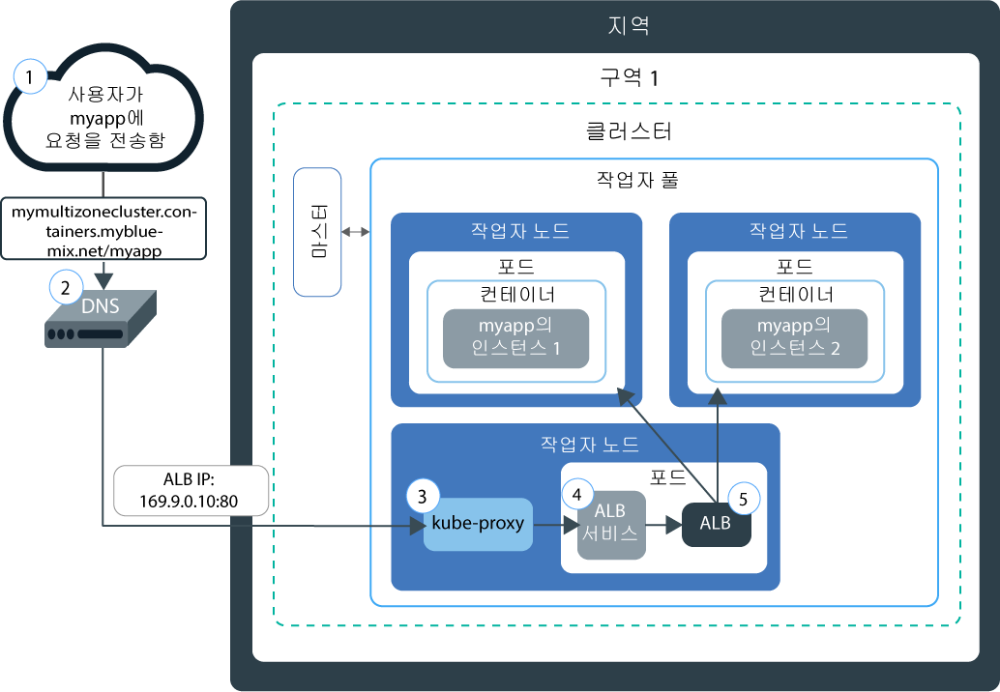
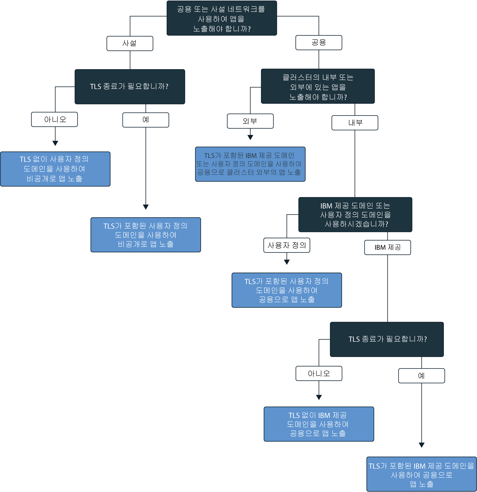

---

copyright:
  years: 2014, 2018
lastupdated: "2018-03-16"

---

{:new_window: target="_blank"}
{:shortdesc: .shortdesc}
{:screen: .screen}
{:pre: .pre}
{:table: .aria-labeledby="caption"}
{:codeblock: .codeblock}
{:tip: .tip}
{:download: .download}


# Ingress 서비스 설정
{: #ingress}

{{site.data.keyword.containerlong}}에서 IBM 제공 애플리케이션 로드 밸런서에서 관리하는 Ingress 리소스를 작성하여 Kubernetes 클러스터에서 다중 앱을 노출합니다.
{:shortdesc}

## Ingress 서비스로 네트워킹 계획
{: #planning}

Ingress로 클러스터에서 여러 서비스를 노출할 수 있으며 단일 공용 시작점을 사용하여 이를 공용으로 사용 가능하게 할 수 있습니다.
{:shortdesc}

공개하려는 각 앱에 대한 로드 밸런서 서비스를 작성하기 보다는 Ingress에서는 해당 개별 경로를 기반으로 클러스터 내부 및 외부의 앱으로 공용 요청을 전달하는 고유 공용 라우트를 제공합니다. Ingress는 두 개의 기본 컴포넌트(애플리케이션 로드 밸런서와 Ingress 리소스)로 구성되어 있습니다. 

애플리케이션 로드 밸런서(ALB)는 수신 HTTP 또는 HTTPS, TCP 또는 UDP 서비스 요청을 청취하고 적절한 앱 포드로 요청을 전달하는 외부 로드 밸런서입니다. 표준 클러스터를 작성할 때 {{site.data.keyword.containershort_notm}}에서 자동으로 클러스터용 고가용성 ALB를 작성하고 고유 공용 라우트를 ALB에 지정합니다. 공용 라우트는 클러스터 작성 중에 IBM Cloud 인프라(SoftLayer) 계정으로 프로비저닝된 포터블 공인 IP 주소에 링크됩니다. 기본 사설 ALB도 자동으로 작성되지만 자동으로 사용으로 설정되지는 않습니다.

Ingress를 통해 앱을 노출하려면 앱에 대한 Kubernetes 서비스를 작성하고 Ingress 리소스를 정의하여 ALB에 이 서비스를 등록해야 합니다. Ingress 리소스는 노출된 앱에 대한 고유 URL을 형성하기 위해 공용 라우트에 추가된 경로(예: `mycluster.us-south.containers.mybluemix.net/myapp`)를 지정하고 앱의 수신 요청을 라우팅하는 방법에 대한 규칙을 정의합니다.

다음 다이어그램은 Ingress가 인터넷에서 앱으로 통신하는 방식을 표시합니다.



1. 사용자는 앱의 URL에 액세스하여 요청을 앱에 전송합니다. 이 URL은 URL에 추가된 Ingress 리소스 경로를 포함한 노출된 앱의 공용 URL입니다(예: `mycluster.us-south.containers.mybluemix.net/myapp`).

2. 글로벌 로드 밸런서의 역할을 하는 DNS 시스템 서비스는 클러스터에서 기본 공용 ALB의 포터블 공인 IP 주소에 대한 URL을 분석합니다. 

3. `kube-proxy`는 앱의 Kubernetes ALB 서비스에 대한 요청을 라우팅합니다. 

4. Kubernetes 서비스는 ALB에 요청을 라우팅합니다.

5. ALB는 클러스터에서 `myapp` 경로에 대한 라우팅 규칙이 존재하는지 여부를 확인합니다. 일치하는 규칙이 발견된 경우에는 Ingress 리소스에서 정의한 규칙에 따라 요청이 앱이 배치된 포드에 전달됩니다. 다중 앱 인스턴스가 클러스터에 배치되는 경우 ALB는 앱 포드 간의 요청을 로드 밸런싱합니다.


**참고:** Ingress는 표준 클러스터에만 사용 가능하고 고가용성을 보장할 수 있도록 클러스터에 최소한 두 개의 작업자 노드가 있어야 하며 주기적 업데이트가 적용됩니다. Ingress를 설정하려면 [관리자 액세스 정책](cs_users.html#access_policies)이 필요합니다. 현재 [액세스 정책](cs_users.html#infra_access)을 확인하십시오.

다음 의사결정 트리에 따라 Ingress를 위한 최고의 구성을 선택할 수 있습니다.


<map name="ingress_map" id="ingress_map">
<area href="/docs/containers/cs_ingress.html#private_ingress_no_tls" alt="TLS 없이 사용자 정의 도메인을 사용하여 비공개로 앱 노출" shape="rect" coords="25, 246, 187, 294"/>
<area href="/docs/containers/cs_ingress.html#private_ingress_tls" alt="TLS가 포함된 사용자 정의 도메인을 사용하여 비공개로 앱 노출" shape="rect" coords="161, 337, 309, 385"/>
<area href="/docs/containers/cs_ingress.html#external_endpoint" alt="TLS가 포함된 IBM 제공 도메인 또는 사용자 정의 도메인을 사용하여 공용으로 클러스터 외부의 앱 노출" shape="rect" coords="313, 229, 466, 282"/>
<area href="/docs/containers/cs_ingress.html#custom_domain_cert" alt="TLS가 포함된 사용자 정의 도메인을 사용하여 공용으로 앱 노출" shape="rect" coords="365, 415, 518, 468"/>
<area href="/docs/containers/cs_ingress.html#ibm_domain" alt="TLS 없이 IBM 제공 도메인을 사용하여 공용으로 앱 노출" shape="rect" coords="414, 629, 569, 679"/>
<area href="/docs/containers/cs_ingress.html#ibm_domain_cert" alt="TLS가 포함된 IBM 제공 도메인을 사용하여 공용으로 앱 노출" shape="rect" coords="563, 711, 716, 764"/>
</map>

<br />


## 공용으로 앱 노출
{: #ingress_expose_public}

표준 클러스터를 작성할 때 IBM 제공 애플리케이션 로드 밸런서(ALB)가 자동으로 사용으로 설정되며 포터블 공인 IP 주소 및 공용 라우트가 지정됩니다.
{:shortdesc}

Ingress를 통해 공용으로 노출된 모든 앱에는 고유 URL을 사용하여 클러스터에서 앱에 공용으로 액세스할 수 있도록 공용 라우트에 추가된 고유 경로가 지정됩니다. 앱을 공용으로 노출하려면 다음 시나리오에 맞게 Ingress를 구성할 수 있습니다.

-   [TLS 없이 IBM 제공 도메인을 사용하여 공용으로 앱 노출](#ibm_domain)
-   [TLS가 포함된 IBM 제공 도메인을 사용하여 공용으로 앱 노출](#ibm_domain_cert)
-   [TLS가 포함된 사용자 정의 도메인을 사용하여 공용으로 앱 노출](#custom_domain_cert)
-   [TLS가 포함된 IBM 제공 도메인 또는 사용자 정의 도메인을 사용하여 공용으로 클러스터 외부의 앱 노출](#external_endpoint)

### TLS 없이 IBM 제공 도메인을 사용하여 공용으로 앱 노출
{: #ibm_domain}

클러스터의 앱에 대한 수신 HTTP 네트워크 트래픽을 로드 밸런싱하도록 ALB를 구성하고 IBM 제공 도메인을 사용하여 인터넷에서 앱에 액세스할 수 있습니다.
{:shortdesc}

시작하기 전에:

-   클러스터가 아직 없으면 [표준 클러스터를 작성](cs_clusters.html#clusters_ui)하십시오.
-   클러스터에 [CLI를 대상으로 지정](cs_cli_install.html#cs_cli_configure)하고 `kubectl` 명령을 실행하십시오.

IBM 제공 도메인을 사용하여 앱을 노출하려면 다음을 수행하십시오.

1.  [클러스터에 앱을 배치](cs_app.html#app_cli)하십시오. 클러스터에 앱을 배치하면 컨테이너에서 앱을 실행하는 사용자에 대한 하나 이상의 포드가 작성됩니다. 구성 파일의 메타데이터 섹션에서 배치에 레이블을 추가했는지 확인하십시오. 이 레이블은 Ingress 로드 밸런싱에 포함될 수 있도록 앱이 실행 중인 모든 포드를 식별하는 데 필요합니다.
2.  노출할 앱에 대한 Kubernetes 서비스를 작성하십시오. ALB는 클러스터 내에서 Kubernetes 서비스를 통해 앱이 노출되는 경우에만 앱을 Ingress 로드 밸런싱에 포함시킬 수 있습니다.
    1.  선호하는 편집기를 열고 예를 들어, `myservice.yaml`이라는 이름의 서비스 구성 파일을 작성하십시오.
    2.  공용으로 노출시키려는 앱에 대해 서비스를 정의하십시오.

        ```
        apiVersion: v1
        kind: Service
        metadata:
          name: <myservice>
        spec:
          selector:
            <selectorkey>: <selectorvalue>
          ports:
           - protocol: TCP
             port: 8080
        ```
        {: codeblock}

        <table>
        <caption>ALB 서비스 파일 컴포넌트 이해</caption>
        <thead>
        <th colspan=2> YAML 파일 컴포넌트 이해</th>
        </thead>
        <tbody>
        <tr>
        <td><code>name</code></td>
        <td><em>&lt;myservice&gt;</em>를 ALB 서비스의 이름으로 대체하십시오.</td>
        </tr>
        <tr>
        <td><code>selector</code></td>
        <td>사용자의 앱이 실행되는 포드를 대상으로 지정하기 위해 사용하려는 레이블 키(<em>&lt;selectorkey&gt;</em>) 및 값(<em>&lt;selectorvalue&gt;</em>) 쌍을 입력하십시오. 예를 들어, 다음 선택기 <code>app: code</code>를 사용하는 경우 메타데이터에 이 레이블이 있는 포드는 모두 로드 밸런싱에 포함됩니다. 클러스터에 앱을 배치할 때 사용된 것과 동일한 레이블을 입력하십시오. </td>
         </tr>
         <tr>
         <td><code>port</code></td>
         <td>서비스가 청취하는 포트입니다.</td>
         </tr>
         </tbody></table>
    3.  변경사항을 저장하십시오.
    4.  클러스터에 서비스를 작성하십시오.

        ```
    kubectl apply -f myservice.yaml
        ```
        {: pre}
    5.  공용으로 노출시키려는 모든 앱에 대해 이러한 단계를 반복하십시오.
3.  IBM 제공 도메인을 보려면 사용자의 클러스터에 대한 세부사항을 가져오십시오. _&lt;mycluster&gt;_를 공용으로 노출시키려는 앱이 배치된 클러스터의 이름으로 대체하십시오.

    ```
     bx cs cluster-get <mycluster>
    ```
    {: pre}

    CLI 출력이 다음과 유사하게 나타납니다.

    ```
    Retrieving cluster <mycluster>...
    OK
    Name:    <mycluster>
    ID:    b9c6b00dc0aa487f97123440b4895f2d
    State:    normal
    Created:  2017-04-26T19:47:08+0000
    Location: dal10
    Master URL:  https://169.57.40.165:1931
    Ingress subdomain:  <ibmdomain>
    Ingress secret:  <ibmtlssecret>
    Workers:  3
    Version: 1.8.8
    ```
    {: screen}

    **Ingress 하위 도메인** 필드에서 IBM 제공 도메인을 볼 수 있습니다.
4.  Ingress 리소스를 작성하십시오. Ingress 리소스는 앱용으로 작성된 Kubernetes 서비스에 대한 라우팅 규칙을 정의하며, 수신 네트워크 트래픽을 서비스로 라우팅하기 위해 ALB에 의해 사용됩니다. 클러스터 내에서 Kubernetes 서비스를 통해 모든 앱이 노출되는 경우 하나의 Ingress 리소스를 사용하여 다중 앱에 대한 라우팅 규칙을 정의해야 합니다.
    1.  선호하는 편집기를 열고 예를 들어, `myingress.yaml`이라는 이름의 Ingress 구성 파일을 작성하십시오.
    2.  IBM 제공 도메인을 사용하여 수신 네트워크 트래픽을 이전에 작성된 서비스로 라우팅하는 Ingress 리소스를 구성 파일에 정의하십시오.

        ```
        apiVersion: extensions/v1beta1
        kind: Ingress
        metadata:
          name: <myingressname>
        spec:
          rules:
          - host: <ibmdomain>
            http:
              paths:
              - path: /<myservicepath1>
                backend:
                  serviceName: <myservice1>
                  servicePort: 80
              - path: /<myservicepath2>
                backend:
                  serviceName: <myservice2>
                  servicePort: 80
        ```
        {: codeblock}

        <table>
        <caption>Ingress 리소스 파일 컴포넌트 이해</caption>
        <thead>
        <th colspan=2> YAML 파일 컴포넌트 이해</th>
        </thead>
        <tbody>
        <tr>
        <td><code>name</code></td>
        <td><em>&lt;myingressname&gt;</em>을 Ingress 리소스의 이름으로 대체하십시오.</td>
        </tr>
        <tr>
        <td><code>host</code></td>
        <td><em>&lt;ibmdomain&gt;</em>을 이전 단계의 IBM 제공 <strong>Ingress 하위 도메인</strong> 이름으로 대체하십시오.

        </br></br>
        <strong>참고:</strong> Ingress 작성 중에 실패하지 않으려면 호스트에 *를 사용하거나 호스트 특성을 비워 두지 마십시오.</td>
        </tr>
        <tr>
        <td><code>path</code></td>
        <td>네트워크 트래픽이 앱으로 전달될 수 있도록 <em>&lt;myservicepath1&gt;</em>을 슬래시 또는 앱이 청취 중인 고유 경로로 대체하십시오.

        </br>
        모든 Kubernetes 서비스의 경우, IBM 제공 도메인에 추가된 개별 경로를 정의하여 사용자의 앱에 대한 고유 경로(예: <code>ingress_domain/myservicepath1</code>)를 작성할 수 있습니다. 이 라우트를 웹 브라우저에 입력하면 네트워크 트래픽이 애플리케이션 ALB로 라우팅됩니다. ALB는 연관된 서비스를 찾은 후에 네트워크 트래픽을 서비스로 전송하고 동일한 경로를 사용하여 앱을 실행 중인 포드로 전송합니다. 수신 네트워크 트래픽을 수신하려면 이 경로에서 청취하도록 앱을 설정해야 합니다.

        </br></br>
         많은 앱은 특정 경로에서 청취하지는 않지만 루트 경로와 특정 포트를 사용합니다. 이 경우에는 루트 경로를 <code>/</code>로 정의하고 앱에 대한 개별 경로를 지정하지 마십시오.
        </br>
        예: <ul><li><code>http://ingress_host_name/</code>의 경우 <code>/</code>를 경로로 입력하십시오.</li><li><code>http://ingress_host_name/myservicepath</code>의 경우 <code>/myservicepath</code>를 경로로 입력하십시오.</li></ul>
        </br>
        <strong>팁:</strong> 앱이 청취하는 경로와는 다른 경로에서 청취하도록 Ingress를 구성하기 위해 [재작성 어노테이션](cs_annotations.html#rewrite-path)을 사용하여 앱에 대한 적절한 라우팅을 설정할 수 있습니다.</td>
        </tr>
        <tr>
        <td><code>serviceName</code></td>
        <td><em>&lt;myservice1&gt;</em>을 앱에 대한 Kubernetes 서비스를 작성했을 때 사용한 서비스의 이름으로 대체하십시오.</td>
        </tr>
        <tr>
        <td><code>servicePort</code></td>
        <td>서비스가 청취하는 포트입니다. 앱에 대한 Kubernetes 서비스를 작성했을 때 정의한 동일한 포트를 사용하십시오.</td>
        </tr>
        </tbody></table>

    3.  클러스터에 대한 Ingress 리소스를 작성하십시오.

        ```
         kubectl apply -f myingress.yaml
        ```
        {: pre}

5.  Ingress 리소스가 작성되었는지 확인하십시오. _&lt;myingressname&gt;_을 이전에 작성한 Ingress 리소스의 이름으로 대체하십시오.

    ```
    kubectl describe ingress <myingressname>
    ```
    {: pre}

    1. 이벤트의 메시지에 리소스 구성의 오류에 대한 설명이 있는 경우, 리소스 파일의 값을 변경한 후 파일을 리소스에 다시 적용하십시오.

6.  웹 브라우저에서 액세스할 앱 서비스의 URL을 입력하십시오.

    ```
    http://<ibmdomain>/<myservicepath1>
    ```
    {: codeblock}

<br />


### TLS가 포함된 IBM 제공 도메인을 사용하여 공용으로 앱 노출
{: #ibm_domain_cert}

앱에 대한 수신 TLS 연결을 관리하도록 Ingress ALB를 구성하고 IBM 제공 TLS 인증서를 사용하여 네트워크 트래픽을 복호화하며 클러스터에 노출된 앱으로 암호화되지 않은 요청을 전달할 수 있습니다.
{:shortdesc}

시작하기 전에:

-   클러스터가 아직 없으면 [표준 클러스터를 작성](cs_clusters.html#clusters_ui)하십시오.
-   클러스터에 [CLI를 대상으로 지정](cs_cli_install.html#cs_cli_configure)하고 `kubectl` 명령을 실행하십시오.

TLS가 포함된 IBM 제공 도메인을 사용하여 앱을 노출하려면 다음을 수행하십시오.

1.  [클러스터에 앱을 배치](cs_app.html#app_cli)하십시오. 구성 파일의 메타데이터 섹션에서 배치에 레이블을 추가했는지 확인하십시오. 이 레이블은 Ingress 로드 밸런싱에 포함되도록록 앱이 실행 중인 모든 포드를 식별합니다.
2.  노출할 앱에 대한 Kubernetes 서비스를 작성하십시오. ALB는 클러스터 내에서 Kubernetes 서비스를 통해 앱이 노출되는 경우에만 앱을 Ingress 로드 밸런싱에 포함시킬 수 있습니다.
    1.  선호하는 편집기를 열고 예를 들어, `myservice.yaml`이라는 이름의 서비스 구성 파일을 작성하십시오.
    2.  공용으로 노출시키려는 앱에 대해 ALB 서비스를 정의하십시오.

        ```
        apiVersion: v1
        kind: Service
        metadata:
          name: <myservice>
        spec:
          selector:
            <selectorkey>: <selectorvalue>
          ports:
           - protocol: TCP
             port: 8080
        ```
        {: codeblock}

        <table>
        <caption>ALB 서비스 파일 컴포넌트 이해</caption>
        <thead>
        <th colspan=2> YAML 파일 컴포넌트 이해</th>
        </thead>
        <tbody>
        <tr>
        <td><code>name</code></td>
        <td><em>&lt;myservice&gt;</em>를 ALB 서비스의 이름으로 대체하십시오.</td>
        </tr>
        <tr>
        <td><code>selector</code></td>
        <td>사용자의 앱이 실행되는 포드를 대상으로 지정하기 위해 사용하려는 레이블 키(<em>&lt;selectorkey&gt;</em>) 및 값(<em>&lt;selectorvalue&gt;</em>) 쌍을 입력하십시오. 예를 들어, 다음 선택기 <code>app: code</code>를 사용하는 경우 메타데이터에 이 레이블이 있는 포드는 모두 로드 밸런싱에 포함됩니다. 클러스터에 앱을 배치할 때 사용된 것과 동일한 레이블을 입력하십시오. </td>
         </tr>
         <tr>
         <td><code>port</code></td>
         <td>서비스가 청취하는 포트입니다.</td>
         </tr>
         </tbody></table>

    3.  변경사항을 저장하십시오.
    4.  클러스터에 서비스를 작성하십시오.

        ```
    kubectl apply -f myservice.yaml
        ```
        {: pre}

    5.  공용으로 노출시키려는 모든 앱에 대해 이러한 단계를 반복하십시오.

3.  IBM 제공 도메인과 TLS 인증서를 확인하십시오. _&lt;mycluster&gt;_를 앱이 배치되는 클러스터의 이름으로 대체하십시오.

    ```
     bx cs cluster-get <mycluster>
    ```
    {: pre}

    CLI 출력이 다음과 유사하게 나타납니다.

    ```
    bx cs cluster-get <mycluster>
    Retrieving cluster <mycluster>...
    OK
    Name:    <mycluster>
    ID:    b9c6b00dc0aa487f97123440b4895f2d
    State:    normal
    Created:  2017-04-26T19:47:08+0000
    Location: dal10
    Master URL:  https://169.57.40.165:1931
    Ingress subdomain:  <ibmdomain>
    Ingress secret:  <ibmtlssecret>
    Workers:  3
    Version: 1.8.8
    ```
    {: screen}

    **Ingress 하위 도메인**에서 IBM 제공 도메인을 볼 수 있으며, **Ingress 시크릿** 필드에서 IBM 제공 인증서를 볼 수 있습니다.

4.  Ingress 리소스를 작성하십시오. Ingress 리소스는 앱용으로 작성된 Kubernetes 서비스에 대한 라우팅 규칙을 정의하며, 수신 네트워크 트래픽을 서비스로 라우팅하기 위해 ALB에 의해 사용됩니다. 클러스터 내에서 Kubernetes 서비스를 통해 모든 앱이 노출되는 경우 하나의 Ingress 리소스를 사용하여 다중 앱에 대한 라우팅 규칙을 정의해야 합니다.
    1.  선호하는 편집기를 열고 예를 들어, `myingress.yaml`이라는 이름의 Ingress 구성 파일을 작성하십시오.
    2.  IBM 제공 도메인을 사용하여 수신 네트워크 트래픽을 서비스로 라우팅하고 IBM 제공 인증서를 사용하여 TLS 종료를 관리하는 Ingress 리소스를 구성 파일에 정의하십시오. 모든 서비스에 대해 IBM 제공 도메인에 추가된 개별 경로를 정의하여 사용자의 앱에 고유 경로(예: `https://ingress_domain/myapp`)를 작성할 수 있습니다. 이 라우트를 웹 브라우저에 입력하면 네트워크 트래픽이 애플리케이션 ALB로 라우팅됩니다. ALB는 연관된 서비스를 찾은 후에 네트워크 트래픽을 서비스로 전송하고 앱을 실행 중인 포드로 전송합니다.

        **참고:** Ingress 리소스에 정의한 경로에서 앱이 청취해야 합니다. 그렇지 않으면 네트워크 트래픽이 앱으로 전달될 수 없습니다. 대부분의 앱은
특정 경로에서 청취하지 않지만 루트 경로와 특정 포트를 사용합니다. 이 경우에는 루트 경로를 `/`로 정의하고 앱에 대한 개별 경로를 지정하지 마십시오.

        ```
        apiVersion: extensions/v1beta1
        kind: Ingress
        metadata:
          name: <myingressname>
        spec:
          tls:
          - hosts:
            - <ibmdomain>
            secretName: <ibmtlssecret>
          rules:
          - host: <ibmdomain>
            http:
              paths:
              - path: /<myservicepath1>
                backend:
                  serviceName: <myservice1>
                  servicePort: 80
              - path: /<myservicepath2>
                backend:
                  serviceName: <myservice2>
                  servicePort: 80
        ```
        {: codeblock}

        <table>
        <caption>Ingress 리소스 파일 컴포넌트 이해</caption>
        <thead>
        <th colspan=2> YAML 파일 컴포넌트 이해</th>
        </thead>
        <tbody>
        <tr>
        <td><code>name</code></td>
        <td><em>&lt;myingressname&gt;</em>을 Ingress 리소스의 이름으로 대체하십시오.</td>
        </tr>
        <tr>
        <td><code>tls/hosts</code></td>
        <td><em>&lt;ibmdomain&gt;</em>을 이전 단계의 IBM 제공 <strong>Ingress 하위 도메인</strong> 이름으로 대체하십시오. 이 도메인은 TLS 종료를 위해 구성됩니다.

        </br></br>
        <strong>참고:</strong> Ingress 작성 중에 실패하지 않으려면 호스트에 &ast;를 사용하거나 호스트 특성을 비워 두지 마십시오.</td>
        </tr>
        <tr>
        <td><code>tls/secretName</code></td>
        <td><em>&lt;ibmtlssecret&gt;</em>을 이전 단계의 IBM 제공 <strong>Ingress 시크릿</strong> 이름으로 대체하십시오. 이 인증서는 TLS 종료를 관리합니다.
        </tr>
        <tr>
        <td><code>host</code></td>
        <td><em>&lt;ibmdomain&gt;</em>을 이전 단계의 IBM 제공 <strong>Ingress 하위 도메인</strong> 이름으로 대체하십시오. 이 도메인은 TLS 종료를 위해 구성됩니다.

        </br></br>
        <strong>참고:</strong> Ingress 작성 중에 실패하지 않으려면 호스트에 &ast;를 사용하거나 호스트 특성을 비워 두지 마십시오.</td>
        </tr>
        <tr>
        <td><code>path</code></td>
        <td>네트워크 트래픽이 앱으로 전달될 수 있도록 <em>&lt;myservicepath1&gt;</em>을 슬래시 또는 앱이 청취 중인 고유 경로로 대체하십시오.

        </br>
        모든 Kubernetes 서비스의 경우, IBM 제공 도메인에 추가된 개별 경로를 정의하여 사용자의 앱에 대한 고유 경로(예: <code>ingress_domain/myservicepath1</code>)를 작성할 수 있습니다. 이 라우트를 웹 브라우저에 입력하면 네트워크 트래픽이 애플리케이션 ALB로 라우팅됩니다. ALB는 연관된 서비스를 찾은 후에 네트워크 트래픽을 서비스로 전송하고 동일한 경로를 사용하여 앱을 실행 중인 포드로 전송합니다. 수신 네트워크 트래픽을 수신하려면 이 경로에서 청취하도록 앱을 설정해야 합니다.

        </br>
         많은 앱은 특정 경로에서 청취하지는 않지만 루트 경로와 특정 포트를 사용합니다. 이 경우에는 루트 경로를 <code>/</code>로 정의하고 앱에 대한 개별 경로를 지정하지 마십시오.

        </br>
        예: <ul><li><code>http://ingress_host_name/</code>의 경우 <code>/</code>를 경로로 입력하십시오.</li><li><code>http://ingress_host_name/myservicepath</code>의 경우 <code>/myservicepath</code>를 경로로 입력하십시오.</li></ul>
        <strong>팁:</strong> 앱이 청취하는 경로와는 다른 경로에서 청취하도록 Ingress를 구성하기 위해 [재작성 어노테이션](cs_annotations.html#rewrite-path)을 사용하여 앱에 대한 적절한 라우팅을 설정할 수 있습니다.</td>
        </tr>
        <tr>
        <td><code>serviceName</code></td>
        <td><em>&lt;myservice1&gt;</em>을 앱에 대한 Kubernetes 서비스를 작성했을 때 사용한 서비스의 이름으로 대체하십시오.</td>
        </tr>
        <tr>
        <td><code>servicePort</code></td>
        <td>서비스가 청취하는 포트입니다. 앱에 대한 Kubernetes 서비스를 작성했을 때 정의한 동일한 포트를 사용하십시오.</td>
        </tr>
        </tbody></table>

    3.  클러스터에 대한 Ingress 리소스를 작성하십시오.

        ```
         kubectl apply -f myingress.yaml
        ```
        {: pre}

5.  Ingress 리소스가 작성되었는지 확인하십시오. _&lt;myingressname&gt;_을 이전에 작성한 Ingress 리소스의 이름으로 대체하십시오.

    ```
    kubectl describe ingress <myingressname>
    ```
    {: pre}

    1. 이벤트의 메시지에 리소스 구성의 오류에 대한 설명이 있는 경우, 리소스 파일의 값을 변경한 후 파일을 리소스에 다시 적용하십시오.

6.  웹 브라우저에서 액세스할 앱 서비스의 URL을 입력하십시오.

    ```
    https://<ibmdomain>/<myservicepath1>
    ```
    {: codeblock}

<br />


### TLS가 포함된 사용자 정의 도메인을 사용하여 공용으로 앱 노출
{: #custom_domain_cert}

IBM 제공 도메인이 아니라 사용자 정의 도메인을 사용하는 동안 수신 네트워크 트래픽을 클러스터의 앱으로 라우팅하도록 ALB를 구성하고 고유 TLS 인증서를 사용하여 TLS 종료를 관리할 수 있습니다.
{:shortdesc}

시작하기 전에:

-   클러스터가 아직 없으면 [표준 클러스터를 작성](cs_clusters.html#clusters_ui)하십시오.
-   클러스터에 [CLI를 대상으로 지정](cs_cli_install.html#cs_cli_configure)하고 `kubectl` 명령을 실행하십시오.

TLS가 포함된 사용자 정의 도메인을 사용하여 앱을 노출하려면 다음을 수행하십시오.

1.  사용자 정의 도메인을 작성하십시오. 사용자 정의 도메인을 작성하려면 도메인 이름 서비스(DNS) 제공업체 또는 [{{site.data.keyword.Bluemix_notm}} ](/docs/infrastructure/dns/getting-started.html#getting-started-with-dns)를 찾아서 사용자 정의 도메인을 등록하십시오.
2.  수신 네트워크 트래픽을 IBM 제공 ALB로 라우팅하도록 사용자의 도메인을 구성하십시오. 다음 옵션 중에서 선택하십시오.
    -   표준 이름 레코드(CNAME)로서 IBM 제공 도메인을 지정하여 사용자 정의 도메인의 별명을 정의하십시오. IBM 제공 Ingress 도메인을 찾으려면 `bx cs cluster-get <mycluster>`을 실행하고 **Ingress subdomain** 필드를 찾으십시오.
    -   IP 주소를 레코드로 추가하여 IBM 제공 ALB의 포터블 공인 IP 주소로 사용자 정의 도메인을 맵핑하십시오. ALB의 포터블 공인 IP 주소를 찾으려면 `bx cs alb-get <public_alb_ID>`를 실행하십시오.
3.  TLS 인증서와 키 시크릿을 가져오거나 작성하십시오.
    * TLS 인증서가 사용하려는 {{site.data.keyword.cloudcerts_long_notm}}에 저장된 경우, 다음 명령을 사용하여 클러스터에 연관 시크릿을 가져올 수 있습니다.

      ```
          bx cs alb-cert-deploy --secret-name <secret_name> --cluster <cluster_name_or_ID> --cert-crn <certificate_crn>
      ```
      {: pre}

    * 준비된 TLS 인증서가 없으면 다음 단계를 수행하십시오.
        1. PEM 형식으로 인코딩된 사용자의 도메인에 대한 TLS 인증서 및 키를 작성하십시오.
        2. TLS 인증서 및 키를 사용하는 시크릿을 작성하십시오. <em>&lt;mytlssecret&gt;</em>을 Kubernetes 시크릿의 이름으로, <em>&lt;tls_key_filepath&gt;</em>를 사용자 정의 TLS 키 파일의 경로로, <em>&lt;tls_cert_filepath&gt;</em>를 사용자 정의 TLS 인증서 파일의 경로로 대체하십시오.

            ```
        kubectl create secret tls <mytlssecret> --key <tls_key_filepath> --cert <tls_cert_filepath>
            ```
            {: pre}

4.  [클러스터에 앱을 배치](cs_app.html#app_cli)하십시오. 클러스터에 앱을 배치하면 컨테이너에서 앱을 실행하는 사용자에 대한 하나 이상의 포드가 작성됩니다. 구성 파일의 메타데이터 섹션에서 배치에 레이블을 추가했는지 확인하십시오. 이 레이블은 Ingress 로드 밸런싱에 포함될 수 있도록 앱이 실행 중인 모든 포드를 식별하는 데 필요합니다.

5.  노출할 앱에 대한 Kubernetes 서비스를 작성하십시오. ALB는 클러스터 내에서 Kubernetes 서비스를 통해 앱이 노출되는 경우에만 앱을 Ingress 로드 밸런싱에 포함시킬 수 있습니다.

    1.  선호하는 편집기를 열고 예를 들어, `myservice.yaml`이라는 이름의 서비스 구성 파일을 작성하십시오.
    2.  공용으로 노출시키려는 앱에 대해 ALB 서비스를 정의하십시오.

        ```
        apiVersion: v1
        kind: Service
        metadata:
          name: <myservice>
        spec:
          selector:
            <selectorkey>: <selectorvalue>
          ports:
           - protocol: TCP
             port: 8080
        ```
       {: codeblock}

        <table>
        <caption>ALB 서비스 파일 컴포넌트 이해</caption>
        <thead>
        <th colspan=2> YAML 파일 컴포넌트 이해</th>
        </thead>
        <tbody>
        <tr>
        <td><code>name</code></td>
        <td><em>&lt;myservice1&gt;</em>을 ALB 서비스의 이름으로 대체하십시오.</td>
        </tr>
        <tr>
        <td><code>selector</code></td>
        <td>사용자의 앱이 실행되는 포드를 대상으로 지정하기 위해 사용하려는 레이블 키(<em>&lt;selectorkey&gt;</em>) 및 값(<em>&lt;selectorvalue&gt;</em>) 쌍을 입력하십시오. 예를 들어, 다음 선택기 <code>app: code</code>를 사용하는 경우 메타데이터에 이 레이블이 있는 포드는 모두 로드 밸런싱에 포함됩니다. 클러스터에 앱을 배치할 때 사용된 것과 동일한 레이블을 입력하십시오. </td>
         </tr>
         <td><code>port</code></td>
         <td>서비스가 청취하는 포트입니다.</td>
         </tbody></table>

    3.  변경사항을 저장하십시오.
    4.  클러스터에 서비스를 작성하십시오.

        ```
    kubectl apply -f myservice.yaml
        ```
        {: pre}

    5.  공용으로 노출시키려는 모든 앱에 대해 이러한 단계를 반복하십시오.
6.  Ingress 리소스를 작성하십시오. Ingress 리소스는 앱용으로 작성된 Kubernetes 서비스에 대한 라우팅 규칙을 정의하며, 수신 네트워크 트래픽을 서비스로 라우팅하기 위해 ALB에 의해 사용됩니다. 클러스터 내에서 Kubernetes 서비스를 통해 모든 앱이 노출되는 경우 하나의 Ingress 리소스를 사용하여 다중 앱에 대한 라우팅 규칙을 정의해야 합니다.
    1.  선호하는 편집기를 열고 예를 들어, `myingress.yaml`이라는 이름의 Ingress 구성 파일을 작성하십시오.
    2.  사용자 정의 도메인을 사용하여 수신 네트워크 트래픽을 서비스로 라우팅하고 사용자 정의 인증서를 사용하여 TLS 종료를 관리하는 Ingress 리소스를 구성 파일에 정의하십시오. 모든 서비스에 대해 사용자 정의 도메인에 추가된 개별 경로를 정의하여 사용자의 앱에 고유 경로(예: `https://mydomain/myapp`)를 작성할 수 있습니다. 이 라우트를 웹 브라우저에 입력하면 네트워크 트래픽이 애플리케이션 ALB로 라우팅됩니다. ALB는 연관된 서비스를 찾은 후에 네트워크 트래픽을 서비스로 전송하고 앱을 실행 중인 포드로 전송합니다.

        Ingress 리소스에 정의한 경로에서 앱이 청취해야 합니다. 그렇지 않으면 네트워크 트래픽이 앱으로 전달될 수 없습니다. 대부분의 앱은
특정 경로에서 청취하지 않지만 루트 경로와 특정 포트를 사용합니다. 이 경우에는 루트 경로를 `/`로 정의하고 앱에 대한 개별 경로를 지정하지 마십시오.

        ```
        apiVersion: extensions/v1beta1
        kind: Ingress
        metadata:
          name: <myingressname>
        spec:
          tls:
          - hosts:
            - <mycustomdomain>
            secretName: <mytlssecret>
          rules:
          - host: <mycustomdomain>
            http:
              paths:
              - path: /<myservicepath1>
                backend:
                  serviceName: <myservice1>
                  servicePort: 80
              - path: /<myservicepath2>
                backend:
                  serviceName: <myservice2>
                  servicePort: 80
        ```
        {: codeblock}

        <table>
        <caption>Ingress 리소스 파일 컴포넌트 이해</caption>
        <thead>
        <th colspan=2> YAML 파일 컴포넌트 이해</th>
        </thead>
        <tbody>
        <tr>
        <td><code>name</code></td>
        <td><em>&lt;myingressname&gt;</em>을 Ingress 리소스의 이름으로 대체하십시오.</td>
        </tr>
        <tr>
        <td><code>tls/hosts</code></td>
        <td><em>&lt;mycustomdomain&gt;</em>을 TLS 종료를 위해 구성하려는 사용자 정의 도메인으로 대체하십시오.

        </br></br>
        <strong>참고:</strong> Ingress 작성 중에 실패하지 않으려면 호스트에 &ast;를 사용하거나 호스트 특성을 비워 두지 마십시오.</td>
        </tr>
        <tr>
        <td><code>tls/secretName</code></td>
        <td><em>&lt;mytlssecret&gt;</em>을 사용자 정의 TLS 인증서 및 키를 보유하고 있는 이전에 작성한 시크릿 이름으로 대체하십시오. 인증서를 {{site.data.keyword.cloudcerts_short}}에서 가져온 경우, <code>bx cs alb-cert-get --cluster <cluster_name_or_ID> --cert-crn <certificate_crn></code>을 실행하여 TLS 인증서와 연관된 시크릿을 볼 수 있습니다.
        </tr>
        <tr>
        <td><code>host</code></td>
        <td><em>&lt;mycustomdomain&gt;</em>을 TLS 종료를 위해 구성하려는 사용자 정의 도메인으로 대체하십시오.

        </br></br>
        <strong>참고:</strong> Ingress 작성 중에 실패하지 않으려면 호스트에 &ast;를 사용하거나 호스트 특성을 비워 두지 마십시오.
        </td>
        </tr>
        <tr>
        <td><code>path</code></td>
        <td>네트워크 트래픽이 앱으로 전달될 수 있도록 <em>&lt;myservicepath1&gt;</em>을 슬래시 또는 앱이 청취 중인 고유 경로로 대체하십시오.

        </br>
        모든 Kubernetes 서비스의 경우, IBM 제공 도메인에 추가된 개별 경로를 정의하여 사용자의 앱에 대한 고유 경로(예: <code>ingress_domain/myservicepath1</code>)를 작성할 수 있습니다. 이 라우트를 웹 브라우저에 입력하면 네트워크 트래픽이 애플리케이션 ALB로 라우팅됩니다. ALB는 연관된 서비스를 찾은 후에 네트워크 트래픽을 서비스로 전송하고 동일한 경로를 사용하여 앱을 실행 중인 포드로 전송합니다. 수신 네트워크 트래픽을 수신하려면 이 경로에서 청취하도록 앱을 설정해야 합니다.

        </br>
         많은 앱은 특정 경로에서 청취하지는 않지만 루트 경로와 특정 포트를 사용합니다. 이 경우에는 루트 경로를 <code>/</code>로 정의하고 앱에 대한 개별 경로를 지정하지 마십시오.

        </br></br>
        예: <ul><li><code>https://mycustomdomain/</code>의 경우 <code>/</code>를 경로로 입력하십시오.</li><li><code>https://mycustomdomain/myservicepath</code>의 경우 <code>/myservicepath</code>를 경로로 입력하십시오.</li></ul>
        <strong>팁:</strong> 앱이 청취하는 경로와는 다른 경로에서 청취하도록 Ingress를 구성하기 위해 [재작성 어노테이션](cs_annotations.html#rewrite-path)을 사용하여 앱에 대한 적절한 라우팅을 설정할 수 있습니다.
        </td>
        </tr>
        <tr>
        <td><code>serviceName</code></td>
        <td><em>&lt;myservice1&gt;</em>을 앱에 대한 Kubernetes 서비스를 작성했을 때 사용한 서비스의 이름으로 대체하십시오.</td>
        </tr>
        <tr>
        <td><code>servicePort</code></td>
        <td>서비스가 청취하는 포트입니다. 앱에 대한 Kubernetes 서비스를 작성했을 때 정의한 동일한 포트를 사용하십시오.</td>
        </tr>
        </tbody></table>

    3.  변경사항을 저장하십시오.
    4.  클러스터에 대한 Ingress 리소스를 작성하십시오.

        ```
         kubectl apply -f myingress.yaml
        ```
        {: pre}

7.  Ingress 리소스가 작성되었는지 확인하십시오. _&lt;myingressname&gt;_을 이전에 작성한 Ingress 리소스의 이름으로 대체하십시오.

    ```
    kubectl describe ingress <myingressname>
    ```
    {: pre}

    1. 이벤트의 메시지에 리소스 구성의 오류에 대한 설명이 있는 경우, 리소스 파일의 값을 변경한 후 파일을 리소스에 다시 적용하십시오.

8.  인터넷에서 앱에 액세스하십시오.
    1.  선호하는 웹 브라우저를 여십시오.
    2.  액세스하려는 앱 서비스의 URL을 입력하십시오.

        ```
        https://<mycustomdomain>/<myservicepath1>
        ```
        {: codeblock}

<br />


### TLS가 포함된 IBM 제공 도메인 또는 사용자 정의 도메인을 사용하여 공용으로 클러스터 외부의 앱 노출
{: #external_endpoint}

클러스터의 외부에 있는 앱을 포함하도록 ALB를 구성할 수 있습니다. IBM 제공 또는 사용자 정의 도메인의 수신 요청이 외부 앱으로 자동으로 전달됩니다.
{:shortdesc}

시작하기 전에:

-   클러스터가 아직 없으면 [표준 클러스터를 작성](cs_clusters.html#clusters_ui)하십시오.
-   클러스터에 [CLI를 대상으로 지정](cs_cli_install.html#cs_cli_configure)하고 `kubectl` 명령을 실행하십시오.
-   클러스터 로드 밸런싱에 포함시키고자 하는 외부 앱에 공인 IP 주소를 사용하여 액세스할 수 있는지 확인하십시오.

IBM 제공 도메인의 수신 네트워크 트래픽을 클러스터의 외부에 있는 앱으로 라우팅할 수 있습니다. 사용자 정의 도메인 및 TLS 인증서를 대신 사용하려는 경우, IBM 제공 도메인 및 TLS 인증서를 [사용자 정의 도메인 및 TLS 인증서](#custom_domain_cert)로 대체하십시오.

1.  작성할 외부 엔드포인트로 수신 요청을 전달할 클러스터에 대한 Kubernetes 서비스를 작성하십시오.
    1.  선호하는 편집기를 열고 예를 들어, `myexternalservice.yaml`이라는 이름의 서비스 구성 파일을 작성하십시오.
    2.  ALB 서비스를 정의하십시오.

        ```
        apiVersion: v1
        kind: Service
        metadata:
          name: <myservicename>
        spec:
          ports:
           - protocol: TCP
             port: 8080
        ```
        {: codeblock}

        <table>
        <caption>ALB 서비스 파일 컴포넌트 이해</caption>
        <thead>
        <th colspan=2> YAML 파일 컴포넌트 이해</th>
        </thead>
        <tbody>
        <tr>
        <td><code>metadata/name</code></td>
        <td><em>&lt;myservicename&gt;</em>을 서비스의 이름으로 대체하십시오.</td>
        </tr>
        <tr>
        <td><code>port</code></td>
        <td>서비스가 청취하는 포트입니다.</td>
        </tr></tbody></table>

    3.  변경사항을 저장하십시오.
    4.  클러스터에 대한 Kubernetes 서비스를 작성하십시오.

        ```
        kubectl apply -f myexternalservice.yaml
        ```
        {: pre}

2.  클러스터 로드 밸런싱에 포함시키고자 하는 앱의 외부 위치를 정의하는 Kubernetes 엔드포인트를 구성하십시오.
    1.  선호하는 편집기를 열고 예를 들어, `myexternalendpoint.yaml`이라는 이름의 엔드포인트 구성 파일을 작성하십시오.
    2.  외부 엔드포인트를 정의하십시오. 외부 앱에 액세스하기 위해 사용할 수 있는 모든 공인 IP 주소 및 포트를 포함하십시오.

        ```
        kind: Endpoints
        apiVersion: v1
        metadata:
          name: <myservicename>
        subsets:
          - addresses:
              - ip: <externalIP1>
              - ip: <externalIP2>
            ports:
              - port: <externalport>
        ```
        {: codeblock}

        <table>
        <thead>
        <th colspan=2> YAML 파일 컴포넌트 이해</th>
        </thead>
        <tbody>
        <tr>
        <td><code>name</code></td>
        <td><em>&lt;myendpointname&gt;</em>을 이전에 작성한 Kubernetes 서비스의 이름으로 대체하십시오.</td>
        </tr>
        <tr>
        <td><code>ip</code></td>
        <td>외부 앱에 연결하기 위해 <em>&lt;externalIP&gt;</em>를 공인 IP 주소로 대체하십시오.</td>
         </tr>
         <td><code>port</code></td>
         <td><em>&lt;externalport&gt;</em>를 사용자의 외부 앱이 청취하는 포트로 대체하십시오.</td>
         </tbody></table>

    3.  변경사항을 저장하십시오.
    4.  클러스터에 대한 Kubernetes 엔드포인트를 작성하십시오.

        ```
        kubectl apply -f myexternalendpoint.yaml
        ```
        {: pre}

3.  IBM 제공 도메인과 TLS 인증서를 확인하십시오. _&lt;mycluster&gt;_를 앱이 배치되는 클러스터의 이름으로 대체하십시오.

    ```
     bx cs cluster-get <mycluster>
    ```
    {: pre}

    CLI 출력이 다음과 유사하게 나타납니다.

    ```
    Retrieving cluster <mycluster>...
    OK
    Name:    <mycluster>
    ID:    b9c6b00dc0aa487f97123440b4895f2d
    State:    normal
    Created:  2017-04-26T19:47:08+0000
    Location: dal10
    Master URL:  https://169.57.40.165:1931
    Ingress subdomain:  <ibmdomain>
    Ingress secret:  <ibmtlssecret>
    Workers:  3
    Version: 1.8.8
    ```
    {: screen}

    **Ingress 하위 도메인**에서 IBM 제공 도메인을 볼 수 있으며, **Ingress 시크릿** 필드에서 IBM 제공 인증서를 볼 수 있습니다.

4.  Ingress 리소스를 작성하십시오. Ingress 리소스는 앱용으로 작성된 Kubernetes 서비스에 대한 라우팅 규칙을 정의하며, 수신 네트워크 트래픽을 서비스로 라우팅하기 위해 ALB에 의해 사용됩니다. 클러스터 내에서 Kubernetes 서비스를 통해 모든 앱이 자체 외부 엔드포인트로 노출되는 한, 하나의 Ingress 리소스를 사용하여 다중 외부 앱에 대한 라우팅 규칙을 정의할 수 있습니다.
    1.  선호하는 편집기를 열고 예를 들어, `myexternalingress.yaml`이라는 이름의 Ingress 구성 파일을 작성하십시오.
    2.  이전에 정의한 외부 엔드포인트를 사용하여 수신 네트워크 트래픽을 사용자의 외부 앱으로 라우팅하기 위한 IBM 제공 도메인 및 TLS 인증서를 사용하는 Ingress 리소스를 구성 파일에 정의하십시오. 모든 서비스에 대해 IBM 제공 또는 사용자 정의 도메인에 추가된 개별 경로를 정의하여 사용자의 앱에 고유 경로(예: `https://ingress_domain/myapp`)를 작성할 수 있습니다. 이 라우트를 웹 브라우저에 입력하면 네트워크 트래픽이 애플리케이션 ALB로 라우팅됩니다. ALB는 연관된 서비스를 찾은 후에 네트워크 트래픽을 서비스로 전송하고 외부 앱으로 전송합니다.

        Ingress 리소스에 정의한 경로에서 앱이 청취해야 합니다. 그렇지 않으면 네트워크 트래픽이 앱으로 전달될 수 없습니다. 대부분의 앱은
특정 경로에서 청취하지 않지만 루트 경로와 특정 포트를 사용합니다. 이 경우에는 루트 경로를 /로 정의하고 앱에 대한 개별 경로를 지정하지 마십시오.

        ```
        apiVersion: extensions/v1beta1
        kind: Ingress
        metadata:
          name: <myingressname>
        spec:
          tls:
          - hosts:
            - <ibmdomain>
            secretName: <ibmtlssecret>
          rules:
          - host: <ibmdomain>
            http:
              paths:
              - path: /<myexternalservicepath1>
                backend:
                  serviceName: <myservice1>
                  servicePort: 80
              - path: /<myexternalservicepath2>
                backend:
                  serviceName: <myexternalservice2>
                  servicePort: 80
        ```
        {: codeblock}

        <table>
        <caption>Ingress 리소스 파일 컴포넌트 이해</caption>
        <thead>
        <th colspan=2> YAML 파일 컴포넌트 이해</th>
        </thead>
        <tbody>
        <tr>
        <td><code>name</code></td>
        <td><em>&lt;myingressname&gt;</em>을 Ingress 리소스의 이름으로 대체하십시오.</td>
        </tr>
        <tr>
        <td><code>tls/hosts</code></td>
        <td><em>&lt;ibmdomain&gt;</em>을 이전 단계의 IBM 제공 <strong>Ingress 하위 도메인</strong> 이름으로 대체하십시오. 이 도메인은 TLS 종료를 위해 구성됩니다.

        </br></br>
        <strong>참고:</strong> Ingress 작성 중에 실패하지 않으려면 호스트에 &ast;를 사용하거나 호스트 특성을 비워 두지 마십시오.</td>
        </tr>
        <tr>
        <td><code>tls/secretName</code></td>
        <td><em>&lt;ibmtlssecret&gt;</em>을 이전 단계의 IBM 제공 <strong>Ingress 시크릿</strong>으로 대체하십시오. 이 인증서는 TLS 종료를 관리합니다.</td>
        </tr>
        <tr>
        <td><code>rules/host</code></td>
        <td><em>&lt;ibmdomain&gt;</em>을 이전 단계의 IBM 제공 <strong>Ingress 하위 도메인</strong> 이름으로 대체하십시오. 이 도메인은 TLS 종료를 위해 구성됩니다.

        </br></br>
        <strong>참고:</strong> Ingress 작성 중에 실패하지 않으려면 호스트에 &ast;를 사용하거나 호스트 특성을 비워 두지 마십시오.</td>
        </tr>
        <tr>
        <td><code>path</code></td>
        <td>네트워크 트래픽이 앱으로 전달될 수 있도록 <em>&lt;myexternalservicepath&gt;</em>를 슬래시 또는 외부 앱이 청취 중인 고유 경로로 대체하십시오.

        </br>
        모든 Kubernetes 서비스에 대해 도메인에 추가된 개별 경로를 정의하여 사용자의 앱에 고유 경로(예: <code>https://ibmdomain/myservicepath1</code>)를 작성할 수 있습니다. 이 라우트를 웹 브라우저에 입력하면 네트워크 트래픽이 애플리케이션 ALB로 라우팅됩니다. ALB는 연관된 서비스를 찾고 동일한 경로를 사용하여 네트워크 트래픽을 외부 앱으로 전송합니다. 수신 네트워크 트래픽을 수신하려면 이 경로에서 청취하도록 앱을 설정해야 합니다.

        </br></br>
         많은 앱은 특정 경로에서 청취하지는 않지만 루트 경로와 특정 포트를 사용합니다. 이 경우에는 루트 경로를 <code>/</code>로 정의하고 앱에 대한 개별 경로를 지정하지 마십시오.

        </br></br>
        <strong>팁:</strong> 앱이 청취하는 경로와는 다른 경로에서 청취하도록 Ingress를 구성하기 위해 [재작성 어노테이션](cs_annotations.html#rewrite-path)을 사용하여 앱에 대한 적절한 라우팅을 설정할 수 있습니다.</td>
        </tr>
        <tr>
        <td><code>serviceName</code></td>
        <td><em>&lt;myexternalservice&gt;</em>를 외부 앱에 대한 Kubernetes 서비스를 작성했을 때 사용한 서비스의 이름으로 대체하십시오.</td>
        </tr>
        <tr>
        <td><code>servicePort</code></td>
        <td>서비스가 청취하는 포트입니다.</td>
        </tr>
        </tbody></table>

    3.  변경사항을 저장하십시오.
    4.  클러스터에 대한 Ingress 리소스를 작성하십시오.

        ```
        kubectl apply -f myexternalingress.yaml
        ```
        {: pre}

5.  Ingress 리소스가 작성되었는지 확인하십시오. _&lt;myingressname&gt;_을 이전에 작성한 Ingress 리소스의 이름으로 대체하십시오.

    ```
    kubectl describe ingress <myingressname>
    ```
    {: pre}

    1. 이벤트의 메시지에 리소스 구성의 오류에 대한 설명이 있는 경우, 리소스 파일의 값을 변경한 후 파일을 리소스에 다시 적용하십시오.

6.  사용자의 외부 앱에 액세스하십시오.
    1.  선호하는 웹 브라우저를 여십시오.
    2.  사용자의 외부 앱에 액세스하기 위한 URL을 입력하십시오.

        ```
        https://<ibmdomain>/<myexternalservicepath>
        ```
        {: codeblock}

<br />


## 사설 네트워크에 앱 노출
{: #ingress_expose_private}

표준 클러스터를 작성할 때 IBM 제공 애플리케이션 로드 밸런서(ALB)가 작성되며 포터블 사설 IP 주소 및 사설 라우트가 지정됩니다. 그러나 기본 사설 ALB가 자동으로 사용으로 설정되지는 않습니다. 사설 네트워크에 앱을 노출하려면 먼저 [기본 사설 애플리케이션 로드 밸런서를 사용으로 설정](#private_ingress)하십시오.
{:shortdesc}

그 다음에 다음 시나리오에 맞게 Ingress를 구성할 수 있습니다.
-   [TLS 없이 사용자 정의 도메인을 사용하여 비공개로 앱 노출](#private_ingress_no_tls)
-   [TLS가 포함된 사용자 정의 도메인을 사용하여 비공개로 앱 노출](#private_ingress_tls)

### 기본 사설 애플리케이션 로드 밸런서 사용
{: #private_ingress}

기본 사설 ALB를 사용하려면 먼저 IBM 제공 포터블 사설 IP 주소 또는 고유 포터블 사설 IP 주소를 사용하여 이를 사용으로 설정해야 합니다.
{:shortdesc}

**참고**: 클러스터를 작성했을 때 `--no-subnet` 플래그를 사용한 경우, 사설 ALB를 사용하려면 먼저 포터블 사설 서브넷 또는 사용자 관리 서브넷을 추가해야 합니다. 자세한 정보는 [클러스터의 추가 서브넷 요청](cs_subnets.html#request)을 참조하십시오.

시작하기 전에:

-   클러스터가 아직 없으면 [표준 클러스터를 작성](cs_clusters.html#clusters_ui)하십시오.
-   클러스터를 [CLI의 대상으로 지정](cs_cli_install.html#cs_cli_configure)하십시오.

사전 지정된 IBM 제공 포터블 사설 IP 주소를 사용하여 사설 ALB를 사용으로 설정하려면 다음을 수행하십시오.

1. 클러스터에서 사용 가능한 ALB를 나열하여 사설 ALB의 ID를 가져오십시오. <em>&lt;cluser_name&gt;</em>을 노출할 앱이 배치된 클러스터의 이름으로 대체하십시오.

    ```
    bx cs albs --cluster <my_cluster>
    ```
    {: pre}

    사설 ALB의 **Status** 필드는 _disabled_입니다.
    ```
    ALB ID                                            Enabled   Status     Type      ALB IP
    private-cr6d779503319d419ea3b4ab171d12c3b8-alb1   false     disabled   private   -
    public-cr6d779503319d419ea3b4ab171d12c3b8-alb1    true      enabled    public    169.46.63.150
    ```
    {: screen}

2. 사설 ALB를 사용으로 설정하십시오. 이전 단계의 출력에서 <em>&lt;private_ALB_ID&gt;</em>를 사설 ALB의 ID로 대체하십시오.

   ```
   bx cs alb-configure --albID <private_ALB_ID> --enable
   ```
   {: pre}


고유 포터블 사설 IP 주소를 사용하여 사설 ALB를 사용으로 설정하려면 다음을 수행하십시오.

1. 클러스터의 프라이빗 VLAN에서 트래픽을 라우팅하도록 선택된 IP 주소의 사용자 관리 서브넷을 구성하십시오. <em>&lt;cluser_name&gt;</em>을 노출할 앱이 배치된 클러스터의 이름 또는 ID로, <em>&lt;subnet_CIDR&gt;</em>을 사용자 관리 서브넷의 CIDR로, <em>&lt;private_VLAN&gt;</em>을 사용 가능한 프라이빗 VLAN ID로 대체하십시오. `bx cs vlans`를 실행하여 사용 가능한 프라이빗 VLAN의 ID를 찾을 수 있습니다.

   ```
   bx cs cluster-user-subnet-add <cluster_name> <subnet_CIDR> <private_VLAN>
   ```
   {: pre}

2. 클러스터에서 사용 가능한 ALB를 나열하여 사설 ALB의 ID를 가져오십시오. 

    ```
    bx cs albs --cluster <my_cluster>
    ```
    {: pre}

    사설 ALB의 **상태** 필드는 _disabled_입니다.
    ```
    ALB ID                                            Enabled   Status     Type      ALB IP
    private-cr6d779503319d419ea3b4ab171d12c3b8-alb1   false     disabled   private   -
    public-cr6d779503319d419ea3b4ab171d12c3b8-alb1    true      enabled    public    169.46.63.150
    ```
    {: screen}

3. 사설 ALB를 사용으로 설정하십시오. 이전 단계의 출력에서 <em>&lt;private_ALB_ID&gt;</em>를 사설 ALB의 ID로 대체하고 <em>&lt;user_ip&gt;</em>를 사용할 사용자 관리 서브넷의 IP 주소로 대체하십시오.

   ```
   bx cs alb-configure --albID <private_ALB_ID> --enable --user-ip <user_ip>
   ```
   {: pre}

<br />


### TLS 없이 사용자 정의 도메인을 사용하여 비공개로 앱 노출
{: #private_ingress_no_tls}

사용자 정의 도메인을 사용하여 수신 네트워크 트래픽을 클러스터의 앱으로 라우팅하도록 사설 ALB를 구성할 수 있습니다.
{:shortdesc}

시작하기 전에 [사설 애플리케이션 로드 밸런서를 사용으로 설정](#private_ingress)하십시오.

TLS 없이 사용자 정의 도메인을 사용하여 비공개로 앱을 노출하려면 다음을 수행하십시오.

1.  사용자 정의 도메인을 작성하십시오. 사용자 정의 도메인을 작성하려면 도메인 이름 서비스(DNS) 제공업체 또는 [{{site.data.keyword.Bluemix_notm}} ](/docs/infrastructure/dns/getting-started.html#getting-started-with-dns)를 찾아서 사용자 정의 도메인을 등록하십시오.

2.  IP 주소를 레코드로 추가하여 IBM 제공 사설 ALB의 포터블 사설 IP 주소로 사용자 정의 도메인을 맵핑하십시오. 사설 ALB의 포터블 사설 IP 주소를 찾으려면 `bx cs albs --cluster <cluster_name>`을 실행하십시오.

3.  [클러스터에 앱을 배치](cs_app.html#app_cli)하십시오. 클러스터에 앱을 배치하면 컨테이너에서 앱을 실행하는 사용자에 대한 하나 이상의 포드가 작성됩니다. 구성 파일의 메타데이터 섹션에서 배치에 레이블을 추가했는지 확인하십시오. 이 레이블은 모든 포드가 Ingress 로드 밸런싱에 포함되도록 앱이 실행 중인 모든 포드를 식별합니다.

4.  노출할 앱에 대한 Kubernetes 서비스를 작성하십시오. 사설 ALB는 클러스터 내에서 Kubernetes 서비스를 통해 앱이 노출되는 경우에만 앱을 Ingress 로드 밸런싱에 포함시킬 수 있습니다.

    1.  선호하는 편집기를 열고 예를 들어, `myservice.yaml`이라는 이름의 서비스 구성 파일을 작성하십시오.
    2.  공용으로 노출시키려는 앱에 대해 ALB 서비스를 정의하십시오.

        ```
        apiVersion: v1
        kind: Service
        metadata:
          name: <myservice>
        spec:
          selector:
            <selectorkey>: <selectorvalue>
          ports:
           - protocol: TCP
             port: 8080
        ```
       {: codeblock}

        <table>
        <caption>ALB 서비스 파일 컴포넌트 이해</caption>
        <thead>
        <th colspan=2> YAML 파일 컴포넌트 이해</th>
        </thead>
        <tbody>
        <tr>
        <td><code>name</code></td>
        <td><em>&lt;myservice1&gt;</em>을 ALB 서비스의 이름으로 대체하십시오.</td>
        </tr>
        <tr>
        <td><code>selector</code></td>
        <td>사용자의 앱이 실행되는 포드를 대상으로 지정하기 위해 사용하려는 레이블 키(<em>&lt;selectorkey&gt;</em>) 및 값(<em>&lt;selectorvalue&gt;</em>) 쌍을 입력하십시오. 예를 들어, 다음 선택기 <code>app: code</code>를 사용하는 경우 메타데이터에 이 레이블이 있는 포드는 모두 로드 밸런싱에 포함됩니다. 클러스터에 앱을 배치할 때 사용된 것과 동일한 레이블을 입력하십시오. </td>
         </tr>
         <td><code>port</code></td>
         <td>서비스가 청취하는 포트입니다.</td>
         </tbody></table>

    3.  변경사항을 저장하십시오.
    4.  클러스터에 Kubernetes 서비스를 작성하십시오.

        ```
    kubectl apply -f myservice.yaml
        ```
        {: pre}

    5.  사설 네트워크로 노출할 모든 앱에 대해 이러한 단계를 반복하십시오.
7.  Ingress 리소스를 작성하십시오. Ingress 리소스는 앱용으로 작성된 Kubernetes 서비스에 대한 라우팅 규칙을 정의하며, 수신 네트워크 트래픽을 서비스로 라우팅하기 위해 ALB에 의해 사용됩니다. 클러스터 내에서 Kubernetes 서비스를 통해 모든 앱이 노출되는 경우 하나의 Ingress 리소스를 사용하여 다중 앱에 대한 라우팅 규칙을 정의해야 합니다.
    1.  선호하는 편집기를 열고 예를 들어, `myingress.yaml`이라는 이름의 Ingress 구성 파일을 작성하십시오.
    2.  사용자 정의 도메인을 사용하여 수신 네트워크 트래픽을 사용자 서비스로 라우팅하는 Ingress 리소스를 구성 파일에 정의하십시오. 모든 서비스에 대해 사용자 정의 도메인에 추가된 개별 경로를 정의하여 사용자의 앱에 고유 경로(예: `https://mydomain/myapp`)를 작성할 수 있습니다. 이 라우트를 웹 브라우저에 입력하면 네트워크 트래픽이 애플리케이션 ALB로 라우팅됩니다. ALB는 연관된 서비스를 찾은 후에 네트워크 트래픽을 서비스로 전송하고 앱을 실행 중인 포드로 전송합니다.

        Ingress 리소스에 정의한 경로에서 앱이 청취해야 합니다. 그렇지 않으면 네트워크 트래픽이 앱으로 전달될 수 없습니다. 대부분의 앱은
특정 경로에서 청취하지 않지만 루트 경로와 특정 포트를 사용합니다. 이 경우에는 루트 경로를 `/`로 정의하고 앱에 대한 개별 경로를 지정하지 마십시오.

        ```
        apiVersion: extensions/v1beta1
        kind: Ingress
        metadata:
          name: <myingressname>
          annotations:
            ingress.bluemix.net/ALB-ID: "<private_ALB_ID>"
        spec:
          rules:
          - host: <mycustomdomain>
            http:
              paths:
              - path: /<myservicepath1>
                backend:
                  serviceName: <myservice1>
                  servicePort: 80
              - path: /<myservicepath2>
                backend:
                  serviceName: <myservice2>
                  servicePort: 80
        ```
        {: codeblock}

        <table>
        <caption>Ingress 리소스 파일 컴포넌트 이해</caption>
        <thead>
        <th colspan=2> YAML 파일 컴포넌트 이해</th>
        </thead>
        <tbody>
        <tr>
        <td><code>name</code></td>
        <td><em>&lt;myingressname&gt;</em>을 Ingress 리소스의 이름으로 대체하십시오.</td>
        </tr>
        <tr>
        <td><code>ingress.bluemix.net/ALB-ID</code></td>
        <td><em>&lt;private_ALB_ID&gt;</em>를 사설 ALB의 ID로 대체하십시오. ALB ID를 찾으려면 <code>bx cs albs --cluster <my_cluster></code>를 실행하십시오. 이 Ingress 어노테이션에 대한 자세한 정보는 [사설 애플리케이션 로드 밸런서 라우팅](cs_annotations.html#alb-id)을 참조하십시오.</td>
        </tr>
        <td><code>host</code></td>
        <td><em>&lt;mycustomdomain&gt;</em>을 사용자 정의 도메인으로 대체하십시오.

        </br></br>
        <strong>참고:</strong> Ingress 작성 중에 실패하지 않으려면 호스트에 &ast;를 사용하거나 호스트 특성을 비워 두지 마십시오.
        </td>
        </tr>
        <tr>
        <td><code>path</code></td>
        <td>네트워크 트래픽이 앱으로 전달될 수 있도록 <em>&lt;myservicepath1&gt;</em>을 슬래시 또는 앱이 청취 중인 고유 경로로 대체하십시오.

        </br>
        모든 Kubernetes 서비스의 경우, 사용자 정의 도메인에 추가된 개별 경로를 정의하여 사용자의 앱에 대한 고유 경로(예: <code>custom_domain/myservicepath1</code>)를 작성할 수 있습니다. 이 라우트를 웹 브라우저에 입력하면 네트워크 트래픽이 애플리케이션 ALB로 라우팅됩니다. ALB는 연관된 서비스를 찾은 후에 네트워크 트래픽을 서비스로 전송하고 동일한 경로를 사용하여 앱을 실행 중인 포드로 전송합니다. 수신 네트워크 트래픽을 수신하려면 이 경로에서 청취하도록 앱을 설정해야 합니다.

        </br>
         많은 앱은 특정 경로에서 청취하지는 않지만 루트 경로와 특정 포트를 사용합니다. 이 경우에는 루트 경로를 <code>/</code>로 정의하고 앱에 대한 개별 경로를 지정하지 마십시오.

        </br></br>
        예: <ul><li><code>https://mycustomdomain/</code>의 경우 <code>/</code>를 경로로 입력하십시오.</li><li><code>https://mycustomdomain/myservicepath</code>의 경우 <code>/myservicepath</code>를 경로로 입력하십시오.</li></ul>
        <strong>팁:</strong> 앱이 청취하는 경로와는 다른 경로에서 청취하도록 Ingress를 구성하기 위해 [재작성 어노테이션](cs_annotations.html#rewrite-path)을 사용하여 앱에 대한 적절한 라우팅을 설정할 수 있습니다.
        </td>
        </tr>
        <tr>
        <td><code>serviceName</code></td>
        <td><em>&lt;myservice1&gt;</em>을 앱에 대한 Kubernetes 서비스를 작성했을 때 사용한 서비스의 이름으로 대체하십시오.</td>
        </tr>
        <tr>
        <td><code>servicePort</code></td>
        <td>서비스가 청취하는 포트입니다. 앱에 대한 Kubernetes 서비스를 작성했을 때 정의한 동일한 포트를 사용하십시오.</td>
        </tr>
        </tbody></table>

    3.  변경사항을 저장하십시오.
    4.  클러스터에 대한 Ingress 리소스를 작성하십시오.

        ```
         kubectl apply -f myingress.yaml
        ```
        {: pre}

8.  Ingress 리소스가 작성되었는지 확인하십시오. _&lt;myingressname&gt;_을 이전에 작성한 Ingress 리소스의 이름으로 대체하십시오.

    ```
    kubectl describe ingress <myingressname>
    ```
    {: pre}

    1. 이벤트의 메시지에 리소스 구성의 오류에 대한 설명이 있는 경우, 리소스 파일의 값을 변경한 후 파일을 리소스에 다시 적용하십시오.

9.  인터넷에서 앱에 액세스하십시오.
    1.  선호하는 웹 브라우저를 여십시오.
    2.  액세스하려는 앱 서비스의 URL을 입력하십시오.

        ```
        http://<mycustomdomain>/<myservicepath1>
        ```
        {: codeblock}

<br />


### TLS가 포함된 사용자 정의 도메인을 사용하여 비공개로 앱 노출
{: #private_ingress_tls}

수신 네트워크 트래픽을 클러스터의 앱으로 라우팅하도록 사설 ALB를 사용할 수 있습니다. 또한 사용자 정의 도메인을 사용하는 동안 고유 TLS 인증서를 사용하여 TLS 종료를 관리할 수 있습니다.
{:shortdesc}

시작하기 전에 [기본 사설 애플리케이션 로드 밸런서를 사용으로 설정](#private_ingress)하십시오.

TLS가 포함된 사용자 정의 도메인을 사용하여 비공개로 앱을 노출하려면 다음을 수행하십시오.

1.  사용자 정의 도메인을 작성하십시오. 사용자 정의 도메인을 작성하려면 도메인 이름 서비스(DNS) 제공업체 또는 [{{site.data.keyword.Bluemix_notm}} ](/docs/infrastructure/dns/getting-started.html#getting-started-with-dns)를 찾아서 사용자 정의 도메인을 등록하십시오.

2.  IP 주소를 레코드로 추가하여 IBM 제공 사설 ALB의 포터블 사설 IP 주소로 사용자 정의 도메인을 맵핑하십시오. 사설 ALB의 포터블 사설 IP 주소를 찾으려면 `bx cs albs --cluster <cluster_name>`을 실행하십시오.

3.  TLS 인증서와 키 시크릿을 가져오거나 작성하십시오.
    * TLS 인증서가 사용하려는 {{site.data.keyword.cloudcerts_long_notm}}에 저장된 경우, `bx cs alb-cert-deploy --secret-name <secret_name> --cluster <cluster_name_or_ID> --cert-crn <certificate_crn>`을 실행하여 클러스터에 연관 시크릿을 가져올 수 있습니다.
    * 준비된 TLS 인증서가 없으면 다음 단계를 수행하십시오.
        1. PEM 형식으로 인코딩된 사용자의 도메인에 대한 TLS 인증서 및 키를 작성하십시오.
        2. TLS 인증서 및 키를 사용하는 시크릿을 작성하십시오. <em>&lt;mytlssecret&gt;</em>을 Kubernetes 시크릿의 이름으로, <em>&lt;tls_key_filepath&gt;</em>를 사용자 정의 TLS 키 파일의 경로로, <em>&lt;tls_cert_filepath&gt;</em>를 사용자 정의 TLS 인증서 파일의 경로로 대체하십시오.

            ```
        kubectl create secret tls <mytlssecret> --key <tls_key_filepath> --cert <tls_cert_filepath>
            ```
            {: pre}

4.  [클러스터에 앱을 배치](cs_app.html#app_cli)하십시오. 클러스터에 앱을 배치하면 컨테이너에서 앱을 실행하는 사용자에 대한 하나 이상의 포드가 작성됩니다. 구성 파일의 메타데이터 섹션에서 배치에 레이블을 추가했는지 확인하십시오. 이 레이블은 Ingress 로드 밸런싱에 포함될 수 있도록 앱이 실행 중인 모든 포드를 식별하는 데 필요합니다.

5.  노출할 앱에 대한 Kubernetes 서비스를 작성하십시오. 사설 ALB는 클러스터 내에서 Kubernetes 서비스를 통해 앱이 노출되는 경우에만 앱을 Ingress 로드 밸런싱에 포함시킬 수 있습니다.

    1.  선호하는 편집기를 열고 예를 들어, `myservice.yaml`이라는 이름의 서비스 구성 파일을 작성하십시오.
    2.  공개하려는 앱에 대해 애플리케이션 로드 밸런서 서비스를 정의하십시오.

        ```
        apiVersion: v1
        kind: Service
        metadata:
          name: <myservice>
        spec:
          selector:
            <selectorkey>: <selectorvalue>
          ports:
           - protocol: TCP
             port: 8080
        ```
       {: codeblock}

        <table>
        <caption>ALB 서비스 파일 컴포넌트 이해</caption>
        <thead>
        <th colspan=2> YAML 파일 컴포넌트 이해</th>
        </thead>
        <tbody>
        <tr>
        <td><code>name</code></td>
        <td><em>&lt;myservice1&gt;</em>을 ALB 서비스의 이름으로 대체하십시오.</td>
        </tr>
        <tr>
        <td><code>selector</code></td>
        <td>사용자의 앱이 실행되는 포드를 대상으로 지정하기 위해 사용하려는 레이블 키(<em>&lt;selectorkey&gt;</em>) 및 값(<em>&lt;selectorvalue&gt;</em>) 쌍을 입력하십시오. 예를 들어, 다음 선택기 <code>app: code</code>를 사용하는 경우 메타데이터에 이 레이블이 있는 포드는 모두 로드 밸런싱에 포함됩니다. 클러스터에 앱을 배치할 때 사용된 것과 동일한 레이블을 입력하십시오. </td>
         </tr>
         <td><code>port</code></td>
         <td>서비스가 청취하는 포트입니다.</td>
         </tbody></table>

    3.  변경사항을 저장하십시오.
    4.  클러스터에 서비스를 작성하십시오.

        ```
    kubectl apply -f myservice.yaml
        ```
        {: pre}

    5.  사설 네트워크에 노출할 모든 앱에 대해 이러한 단계를 반복하십시오.
6.  Ingress 리소스를 작성하십시오. Ingress 리소스는 앱용으로 작성된 Kubernetes 서비스에 대한 라우팅 규칙을 정의하며, 수신 네트워크 트래픽을 서비스로 라우팅하기 위해 ALB에 의해 사용됩니다. 클러스터 내에서 Kubernetes 서비스를 통해 모든 앱이 노출되는 경우 하나의 Ingress 리소스를 사용하여 다중 앱에 대한 라우팅 규칙을 정의해야 합니다.
    1.  선호하는 편집기를 열고 예를 들어, `myingress.yaml`이라는 이름의 Ingress 구성 파일을 작성하십시오.
    2.  사용자 정의 도메인을 사용하여 수신 네트워크 트래픽을 서비스로 라우팅하고 사용자 정의 인증서를 사용하여 TLS 종료를 관리하는 Ingress 리소스를 구성 파일에 정의하십시오. 모든 서비스에 대해 사용자 정의 도메인에 추가된 개별 경로를 정의하여 사용자의 앱에 고유 경로(예: `https://mydomain/myapp`)를 작성할 수 있습니다. 이 라우트를 웹 브라우저에 입력하면 네트워크 트래픽이 애플리케이션 ALB로 라우팅됩니다. ALB는 연관된 서비스를 찾은 후에 네트워크 트래픽을 서비스로 전송하고 앱을 실행 중인 포드로 전송합니다.

        **참고:** Ingress 리소스에 정의한 경로에서 앱이 청취해야 합니다. 그렇지 않으면 네트워크 트래픽이 앱으로 전달될 수 없습니다. 대부분의 앱은
특정 경로에서 청취하지 않지만 루트 경로와 특정 포트를 사용합니다. 이 경우에는 루트 경로를 `/`로 정의하고 앱에 대한 개별 경로를 지정하지 마십시오.

        ```
        apiVersion: extensions/v1beta1
        kind: Ingress
        metadata:
          name: <myingressname>
          annotations:
            ingress.bluemix.net/ALB-ID: "<private_ALB_ID>"
        spec:
          tls:
          - hosts:
            - <mycustomdomain>
            secretName: <mytlssecret>
          rules:
          - host: <mycustomdomain>
            http:
              paths:
              - path: /<myservicepath1>
                backend:
                  serviceName: <myservice1>
                  servicePort: 80
              - path: /<myservicepath2>
                backend:
                  serviceName: <myservice2>
                  servicePort: 80
         ```
         {: codeblock}

         <table>
        <caption>Ingress 리소스 파일 컴포넌트 이해</caption>
        <thead>
        <th colspan=2> YAML 파일 컴포넌트 이해</th>
        </thead>
        <tbody>
        <tr>
        <td><code>name</code></td>
        <td><em>&lt;myingressname&gt;</em>을 Ingress 리소스의 이름으로 대체하십시오.</td>
        </tr>
        <tr>
        <td><code>ingress.bluemix.net/ALB-ID</code></td>
        <td><em>&lt;private_ALB_ID&gt;</em>를 사설 ALB의 ID로 대체하십시오. ALB ID를 찾으려면 <code>bx cs albs --cluster <my_cluster></code>를 실행하십시오. 이 Ingress 어노테이션에 대한 자세한 정보는 [사설 애플리케이션 로드 밸런서 라우팅(ALB-ID)](cs_annotations.html#alb-id)을 참조하십시오.</td>
        </tr>
        <tr>
        <td><code>tls/hosts</code></td>
        <td><em>&lt;mycustomdomain&gt;</em>을 TLS 종료를 위해 구성하려는 사용자 정의 도메인으로 대체하십시오.

        </br></br>
        <strong>참고:</strong> Ingress 작성 중에 실패하지 않으려면 호스트에 &ast;를 사용하거나 호스트 특성을 비워 두지 마십시오.</td>
        </tr>
        <tr>
        <td><code>tls/secretName</code></td>
        <td><em>&lt;mytlssecret&gt;</em>을 사용자 정의 TLS 인증서 및 키를 보유하고 있는 이전에 작성한 시크릿 이름으로 대체하십시오. 인증서를 {{site.data.keyword.cloudcerts_short}}에서 가져온 경우, <code>bx cs alb-cert-get --cluster <cluster_name_or_ID> --cert-crn <certificate_crn></code>을 실행하여 TLS 인증서와 연관된 시크릿을 볼 수 있습니다.
        </tr>
        <tr>
        <td><code>host</code></td>
        <td><em>&lt;mycustomdomain&gt;</em>을 TLS 종료를 위해 구성하려는 사용자 정의 도메인으로 대체하십시오.

        </br></br>
        <strong>참고:</strong> Ingress 작성 중에 실패하지 않으려면 호스트에 &ast;를 사용하거나 호스트 특성을 비워 두지 마십시오.
        </td>
        </tr>
        <tr>
        <td><code>path</code></td>
        <td>네트워크 트래픽이 앱으로 전달될 수 있도록 <em>&lt;myservicepath1&gt;</em>을 슬래시 또는 앱이 청취 중인 고유 경로로 대체하십시오.

        </br>
        모든 Kubernetes 서비스의 경우, IBM 제공 도메인에 추가된 개별 경로를 정의하여 사용자의 앱에 대한 고유 경로(예: <code>ingress_domain/myservicepath1</code>)를 작성할 수 있습니다. 이 라우트를 웹 브라우저에 입력하면 네트워크 트래픽이 애플리케이션 ALB로 라우팅됩니다. ALB는 연관된 서비스를 찾은 후에 네트워크 트래픽을 서비스로 전송하고 동일한 경로를 사용하여 앱을 실행 중인 포드로 전송합니다. 수신 네트워크 트래픽을 수신하려면 이 경로에서 청취하도록 앱을 설정해야 합니다.

        </br>
         많은 앱은 특정 경로에서 청취하지는 않지만 루트 경로와 특정 포트를 사용합니다. 이 경우에는 루트 경로를 <code>/</code>로 정의하고 앱에 대한 개별 경로를 지정하지 마십시오.

        </br></br>
        예: <ul><li><code>https://mycustomdomain/</code>의 경우 <code>/</code>를 경로로 입력하십시오.</li><li><code>https://mycustomdomain/myservicepath</code>의 경우 <code>/myservicepath</code>를 경로로 입력하십시오.</li></ul>
        <strong>팁:</strong> 앱이 청취하는 경로와는 다른 경로에서 청취하도록 Ingress를 구성하기 위해 [재작성 어노테이션](cs_annotations.html#rewrite-path)을 사용하여 앱에 대한 적절한 라우팅을 설정할 수 있습니다.
        </td>
        </tr>
        <tr>
        <td><code>serviceName</code></td>
        <td><em>&lt;myservice1&gt;</em>을 앱에 대한 Kubernetes 서비스를 작성했을 때 사용한 서비스의 이름으로 대체하십시오.</td>
        </tr>
        <tr>
        <td><code>servicePort</code></td>
        <td>서비스가 청취하는 포트입니다. 앱에 대한 Kubernetes 서비스를 작성했을 때 정의한 동일한 포트를 사용하십시오.</td>
        </tr>
         </tbody></table>

    3.  변경사항을 저장하십시오.
    4.  클러스터에 대한 Ingress 리소스를 작성하십시오.

        ```
         kubectl apply -f myingress.yaml
        ```
        {: pre}

7.  Ingress 리소스가 작성되었는지 확인하십시오. _&lt;myingressname&gt;_을 이전에 작성한 Ingress 리소스의 이름으로 대체하십시오.

    ```
    kubectl describe ingress <myingressname>
    ```
    {: pre}

    1. 이벤트의 메시지에 리소스 구성의 오류에 대한 설명이 있는 경우, 리소스 파일의 값을 변경한 후 파일을 리소스에 다시 적용하십시오.

8.  인터넷에서 앱에 액세스하십시오.
    1.  선호하는 웹 브라우저를 여십시오.
    2.  액세스하려는 앱 서비스의 URL을 입력하십시오.

        ```
        https://<mycustomdomain>/<myservicepath1>
        ```
        {: codeblock}

TLS가 포함된 사설 ALB를 사용하여 클러스터에서 마이크로서비스 대 마이크로서비스 통신을 보호하는 방법에 대한 종합적인 튜토리얼은 [이 블로그 포스트 ](https://medium.com/ibm-cloud/secure-microservice-to-microservice-communication-across-kubernetes-clusters-using-a-private-ecbe2a8d4fe2)을 참조하십시오.

<br />


## 선택적 애플리케이션 로드 밸런서 구성
{: #configure_alb}

다음 옵션을 사용하여 애플리케이션 로드 밸런서를 추가로 구성할 수 있습니다.

-   [Ingress 애플리케이션 로드 밸런서에서 포트 열기](#opening_ingress_ports)
-   [HTTP 레벨에서 SSL 프로토콜 및 SSL 암호 구성](#ssl_protocols_ciphers)
-   [어노테이션으로 애플리케이션 로드 밸런서 사용자 정의](cs_annotations.html)
{: #ingress_annotation}


### Ingress 애플리케이션 로드 밸런서에서 포트 열기
{: #opening_ingress_ports}

기본적으로 포트 80과 443만 Ingress ALB에 노출됩니다. 다른 포트를 노출하려는 경우 `ibm-cloud-provider-ingress-cm` configmap 리소스를 편집할 수 있습니다.
{:shortdesc}

1.  `ibm-cloud-provider-ingress-cm` configmap 리소스에 대한 로컬 버전의 구성 파일을 작성하십시오. <code>data</code> 섹션을 추가하고 공용 포트 80, 443 및 세미콜론(;)으로 구분된 configmap 파일에 추가할 다른 모든 포트를 지정하십시오.

 참고: 포트를 지정하는 경우 80과 443도 열린 상태를 유지하도록 포함되어야 합니다. 지정되지 않은 포트는 닫힙니다.

 ```
 apiVersion: v1
 data:
   public-ports: "80;443;<port3>"
 kind: ConfigMap
 metadata:
   name: ibm-cloud-provider-ingress-cm
   namespace: kube-system
 ```
 {: codeblock}

 예:
 ```
 apiVersion: v1
 data:
   public-ports: "80;443;9443"
 kind: ConfigMap
 metadata:
   name: ibm-cloud-provider-ingress-cm
   namespace: kube-system
 ```

2. 구성 파일을 적용하십시오.

 ```
 kubectl apply -f <path/to/configmap.yaml>
 ```
 {: pre}

3. 구성 파일이 적용되었는지 확인하십시오.

 ```
 kubectl describe cm ibm-cloud-provider-ingress-cm -n kube-system
 ```
 {: pre}

 출력:
 ```
 Name:        ibm-cloud-provider-ingress-cm
 Namespace:    kube-system
 Labels:        <none>
 Annotations:    <none>

 Data
 ====

  public-ports: "80;443;<port3>"
 ```
 {: codeblock}

configmap 리소스에 대한 자세한 정보는 [Kubernetes 문서](https://kubernetes-v1-4.github.io/docs/user-guide/configmap/)를 참조하십시오.

### HTTP 레벨에서 SSL 프로토콜과 SSL 암호 구성
{: #ssl_protocols_ciphers}

`ibm-cloud-provider-ingress-cm` configmap을 편집하여 글로벌 HTTP 레벨에서 SSL 프로토콜과 암호를 사용으로 설정하십시오.
{:shortdesc}


**참고**: 모든 호스트에 사용으로 설정된 프로토콜을 지정할 때 TLSv1.1 및 TLSv1.2 매개변수(1.1.13, 1.0.12)는 OpenSSL 1.0.1 이상을 사용하는 경우에만 작동합니다. TLSv1.3 매개변수(1.13.0)는 TLSv1.3 지원으로 빌드된 OpenSSL 1.1.1을 사용하는 경우에만 작동합니다.

configmap을 편집하여 SSL 프로토콜 및 암호를 사용으로 설정하려면 다음을 수행하십시오.

1. ibm-cloud-provider-ingress-cm configmap configmap 리소스에 대한 로컬 버전의 구성 파일을 작성하고 여십시오.

    ```
    kubectl edit cm ibm-cloud-provider-ingress-cm -n kube-system
    ```
    {: pre}

2. SSL 프로토콜 및 암호를 추가하십시오. [OpenSSL 라이브러리 암호 목록 형식 ](https://www.openssl.org/docs/man1.0.2/apps/ciphers.html)에 따라 암호를 형식화하십시오.

   ```
 apiVersion: v1
 data:
   ssl-protocols: "TLSv1 TLSv1.1 TLSv1.2"
   ssl-ciphers: "HIGH:!aNULL:!MD5"
 kind: ConfigMap
 metadata:
   name: ibm-cloud-provider-ingress-cm
   namespace: kube-system
   ```
   {: codeblock}

2. 구성 파일을 적용하십시오.

   ```
 kubectl apply -f <path/to/configmap.yaml>
   ```
   {: pre}

3. 구성 파일이 적용되었는지 확인하십시오.

   ```
 kubectl describe cm ibm-cloud-provider-ingress-cm -n kube-system
   ```
   {: pre}

   출력:
   ```
 Name:        ibm-cloud-provider-ingress-cm
 Namespace:    kube-system
 Labels:        <none>
 Annotations:    <none>

   Data
 ====

    ssl-protocols: "TLSv1 TLSv1.1 TLSv1.2"
  ssl-ciphers: "HIGH:!aNULL:!MD5"
   ```
   {: screen}
