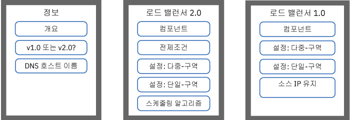
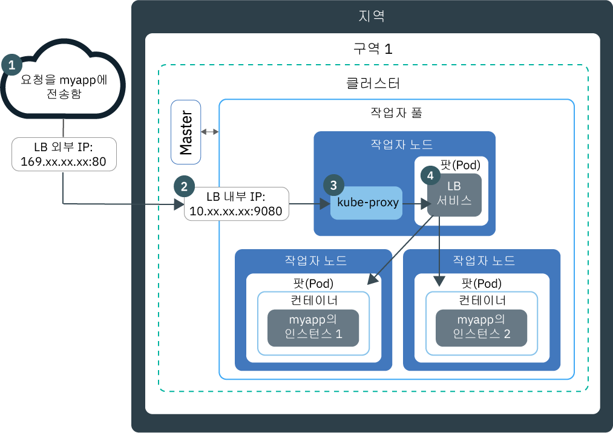
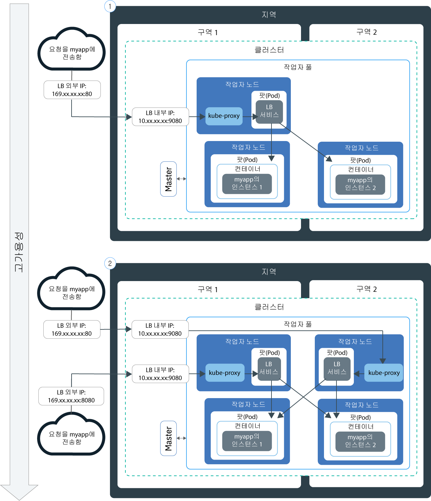
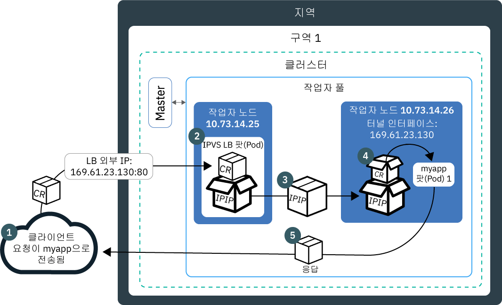
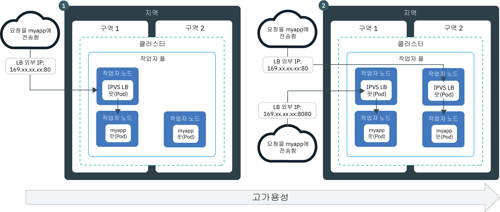

---

copyright:
  years: 2014, 2019
lastupdated: "2019-06-05"

keywords: kubernetes, iks, lb2.0, nlb, health check

subcollection: containers

---

{:new_window: target="_blank"}
{:shortdesc: .shortdesc}
{:screen: .screen}
{:pre: .pre}
{:table: .aria-labeledby="caption"}
{:codeblock: .codeblock}
{:tip: .tip}
{:note: .note}
{:important: .important}
{:deprecated: .deprecated}
{:download: .download}
{:preview: .preview}


# 네트워크 로드 밸런서(NLB)가 사용된 기본 및 DSR 로드 밸런싱
{: #loadbalancer}

포트를 노출하고 계층 4 네트워크 로드 밸런서(NLB)의 포터블 IP 주소를 사용하여 컨테이너화된 앱에 액세스하십시오.
{:shortdesc}

시작하려면 다음 옵션 중 하나를 선택하십시오.


<map name="image-map">
    <area target="" alt="개요" title="개요" href="#lb_overview" coords="35,44,175,72" shape="rect">
    <area target="" alt="버전 1.0 및 2.0 로드 밸런서 비교" title="버전 1.0 및 2.0 로드 밸런서 비교" href="#comparison" coords="34,83,173,108" shape="rect">
    <area target="" alt="로드 밸런서 호스트 이름 등록" title="로드 밸런서 호스트 이름 등록" href="#loadbalancer_hostname" coords="33,119,174,146" shape="rect">
    <area target="" alt="v2.0: 컴포넌트 및 아키텍처(베타)" title="v2.0: 컴포넌트 및 아키텍처(베타)" href="#planning_ipvs" coords="273,45,420,72" shape="rect">
    <area target="" alt="v2.0: 전제조건" title="v2.0: 전제조건" href="#ipvs_provision" coords="277,85,417,108" shape="rect">
    <area target="" alt="v2.0: 다중 구역 클러스터에서 로드 밸런서 2.0 설정" title="v2.0: 다중 구역 클러스터에서 로드 밸런서 2.0 설정" href="#ipvs_multi_zone_config" coords="276,122,417,147" shape="rect">
    <area target="" alt="v2.0: 단일 구역 클러스터에서 로드 밸런서 2.0 설정" title="v2.0: 단일 구역 클러스터에서 로드 밸런서 2.0 설정" href="#ipvs_single_zone_config" coords="277,156,419,184" shape="rect">
    <area target="" alt="v2.0: 스케줄링 알고리즘" title="v2.0: 스케줄링 알고리즘" href="#scheduling" coords="276,196,419,220" shape="rect">
    <area target="" alt="v1.0: 컴포넌트 및 아키텍처" title="v1.0: 컴포넌트 및 아키텍처" href="#v1_planning" coords="519,47,668,74" shape="rect">
    <area target="" alt="v1.0: 다중 구역 클러스터에서 로드 밸런서 1.0 설정" title="v1.0: 다중 구역 클러스터에서 로드 밸런서 1.0 설정" href="#multi_zone_config" coords="520,85,667,110" shape="rect">
    <area target="" alt="v1.0: 단일 구역 클러스터에서 로드 밸런서 1.0 설정" title="v1.0: 단일 구역 클러스터에서 로드 밸런서 1.0 설정" href="#lb_config" coords="520,122,667,146" shape="rect">
    <area target="" alt="v1.0: 소스 IP 보존 사용" title="v1.0: 소스 IP 보존 사용" href="#node_affinity_tolerations" coords="519,157,667,194" shape="rect">
</map>
</br>

빠르게 시작하려면 다음 명령을 실행하여 로드 밸런서 1.0을 작성할 수 있습니다.
```
kubectl expose deploy my-app --port=80 --target-port=8080 --type=LoadBalancer --name my-lb-svc
```
{: pre}

## 개요
{: #lb_overview}

표준 클러스터를 작성하면 {{site.data.keyword.containerlong}}에서 포터블 공용 서브넷과 포터블 사설 서브넷을 자동으로 프로비저닝합니다.
{: shortdesc}

* 포터블 공용 서브넷은 5개의 사용 가능한 IP 주소를 제공합니다. 포터블 공인 IP 주소 1개는 기본 [공용 Ingress ALB](/docs/containers?topic=containers-ingress)에 사용됩니다. 나머지 4개의 포터블 공인 IP 주소는 공용 네트워크 로드 밸런서 서비스 또는 NLB 작성을 통해 단일 앱을 인터넷에 노출하는 데 사용할 수 있습니다.
* 포터블 사설 서브넷은 5개의 사용 가능한 IP 주소를 제공합니다. 포터블 사설 IP 주소 1개는 기본 [사설 Ingress ALB](/docs/containers?topic=containers-ingress#private_ingress)에 사용됩니다. 나머지 4개의 포터블 사설 IP 주소는 사설 로드 밸런서 서비스 또는 NLB 작성을 통해 단일 앱을 사설 네트워크에 노출하는 데 사용할 수 있습니다.

포터블 공인 및 사설 IP 주소는 정적인 유동 IP이므로 작업자 노드가 제거될 때 변경되지 않습니다. NLB IP 주소가 있는 작업자 노드가 제거되는 경우에는 해당 IP 주소를 지속적으로 모니터링하는 Keepalived 디먼이 이 IP 주소를 다른 작업자 노드로 자동으로 이동시킵니다. NLB에 포트를 지정할 수 있습니다. NLB 서비스는 앱의 수신 요청에 대한 외부 시작점 역할을 합니다. 인터넷에서 NLB에 액세스하기 위해 `<IP_address>:<port>` 형식의 지정된 포트와 NLB의 공인 IP 주소를 사용할 수 있습니다.  호스트 이름 없이 NLB IP 주소를 등록하여 NLB에 대한 DNS 항목을 작성할 수도 있습니다.

NLB 서비스를 사용하여 앱을 노출하면 서비스의 NodePorts를 통해 앱이 자동으로 사용 가능해집니다. [NodePort](/docs/containers?topic=containers-nodeport)는 클러스터 내 모든 작업자 노드의 모든 공용 및 사설 IP 주소에서 액세스 가능합니다. NLB를 사용하는 동안 NodePort에 대한 트래픽을 차단하려면 [네트워크 로드 밸런서(NLB) 또는 NodePort 서비스에 대한 인바운드 트래픽 제어](/docs/containers?topic=containers-network_policies#block_ingress)를 참조하십시오.

<br />


## 버전 1.0 NLB와 2.0 NLB의 기본 및 DSR 로드 밸런싱 비교
{: #comparison}

NLB를 작성할 때는 기본 로드 밸런싱을 수행하는 버전 1.0 NLB, 또는 DSR(Direct Server Return) 로드 밸런싱을 수행하는 버전 2.0 NLB를 선택할 수 있습니다. 버전 2.0 NLB는 베타로 제공합니다.
{: shortdesc}

**버전 1.0과 비슷한 2.0 NLB는 얼마나 유사합니까?**

버전 1.0과 2.0 NLB는 둘 다 Linux 커널 영역에서 실행되는 계층 4 로드 밸런서입니다. 두 버전 모두 클러스터 내에서 실행되며, 작업자 노드 리소스를 사용합니다. 따라서 NLB의 사용 가능 용량은 항상 사용자 고유의 클러스터에 제공됩니다. 또한 NLB의 두 버전 모두에서는 연결이 종료되지 않습니다. 대신 연결을 앱 팟(Pod)으로 전달합니다.

**버전 1.0과 비슷한 2.0 NLB는 얼마나 다릅니까?**

클라이언트가 요청을 앱에 전송하면 NLB는 앱 팟(Pod)이 있는 작업자 노드 IP 주소로 요청 패킷을 라우팅합니다. 버전 1.0 NLB는 NAT(Network Address Translation)을 사용하여 요청 패킷의 소스 IP 주소를 로드 밸런서 팟(Pod)이 있는 작업자 노드의 IP에 재작성합니다. 작업자 노드가 앱 응답 패킷을 리턴하면 NLB가 있는 작업자 노드 IP가 사용됩니다. 그러면 NLB는 응답 패킷을 클라이언트에 전송해야 합니다. IP 주소 재작성을 방지하기 위해 [소스 IP 보존을 사용으로 설정](#node_affinity_tolerations)할 수 있습니다. 그러나 소스 IP 보존을 사용하려면 요청을 다른 작업자로 전달할 필요가 없도록 로드 밸런서 팟(Pod)과 앱 팟(Pod)을 동일한 작업자에서 실행해야 합니다. 노드 친화성 및 결함 허용을 앱 팟(Pod)에 추가해야 합니다. 버전 1.0 NLB를 사용한 기본 로드 밸런싱에 대한 자세한 정보는 [v1.0: 기본 로드 밸런싱의 컴포넌트 및 아키텍처](#v1_planning)를 참조하십시오. 

버전 1.0 NLB와 반대로, 버전 2.0 NLB는 요청을 다른 작업자의 앱 팟(Pod)에 전달할 때 NAT를 사용하지 않습니다. NLB 2.0은 클라이언트 요청을 라우팅할 때 IPIP(IP over IP)를 사용하여 원래 요청 패킷을 다른 새 패킷에 캡슐화합니다. 이 캡슐화 IPIP 패킷은 로드 밸런서 팟(Pod)이 있는 작업자 노드의 소스 IP를 제공하므로, 원래 요청 패킷이 클라이언트 IP를 소스 IP 주소로 보존할 수 있습니다. 그러면 작업자 노드는 DSR(Direct Server Return)을 사용하여 앱 응답 패킷을 클라이언트 IP로 전송합니다. 응답 패킷은 NLB를 건너뛰고 클라이언트로 직접 전송되므로 NLB에서 처리해야 하는 트래픽의 양이 줄어듭니다. 버전 2.0 NLB를 사용한 DSR 로드 밸런싱에 대한 자세한 정보는 [v2.0: DSR 로드 밸런싱의 컴포넌트 및 아키텍처](#planning_ipvs)를 참조하십시오. 

<br />


## v1.0: 기본 로드 밸런싱의 컴포넌트 및 아키텍처
{: #v1_planning}

TCP/UDP 네트워크 로드 밸런서(NLB) 1.0은 Linux 커널 기능인 Iptables를 사용하여 앱 팟(Pod) 전체에서 요청을 로드 밸런싱합니다.
{: shortdesc}

### 단일 구역 클러스터에서의 트래픽 플로우
{: #v1_single}

다음 다이어그램은 NLB 1.0이 인터넷에서 단일 구역 클러스터의 앱으로 통신을 유도하는 방식을 보여줍니다.
{: shortdesc}



1. 앱에 대한 요청은 작업자 노드에서 지정된 포트와 NLB의 공인 IP 주소를 사용합니다.

2. 요청은 자동으로 NLB 서비스의 내부 클러스터 IP 주소 및 포트로 전달됩니다. 내부 클러스터 IP 주소는 클러스터 내에서만 액세스가 가능합니다.

3. `kube-proxy`는 앱의 NLB 서비스에 대한 요청을 라우팅합니다.

4. 요청은 앱 팟(Pod)의 사설 IP 주소로 전달됩니다. 요청 패키지의 소스 IP 주소는 앱 팟(Pod)이 실행 중인 작업자 노드의 공인 IP 주소로 변경됩니다. 여러 앱 인스턴스가 클러스터에 배치되는 경우 NLB는 앱 팟(Pod) 간의 요청을 라우팅합니다.

### 다중 구역 클러스터에서의 트래픽 플로우
{: #v1_multi}

다음 다이어그램은 네트워크 로드 밸런서(NLB) 1.0이 인터넷에서 다중 구역 클러스터의 앱으로 통신을 유도하는 방식을 보여줍니다.
{: shortdesc}



기본적으로 NLB 1.0는 각각 하나의 구역에만 설정됩니다. 고가용성을 얻으려면 앱 인스턴스가 있는 모든 구역에 NLB 1.0을 배치해야 합니다. 요청은 라운드 로빈 주기로 다양한 구역에서 NLB에 의해 처리됩니다. 또한 각 NLB는 자체 구역의 앱 인스턴스와 기타 구역의 앱 인스턴스로 요청을 라우팅합니다.

<br />


## v1.0: 다중 구역 클러스터에서 NLB 1.0 설정
{: #multi_zone_config}

**시작하기 전에**:
* 공용 네트워크 로드 밸런서(NLB)를 다중 구역에 작성하려면 하나 이상의 공용 VLAN의 각 구역에서 포터블 서브넷이 사용 가능해야 합니다. 사설 NLB를 다중 구역에 작성하려면 하나 이상의 사설 VLAN의 각 구역에서 포터블 서브넷이 사용 가능해야 합니다. [클러스터의 서브넷 구성](/docs/containers?topic=containers-subnets)에 있는 단계를 수행하여 서비넷을 추가할 수 있습니다.
* 에지 작업자 노드로 네트워크 트래픽을 제한하는 경우에는 NLB가 균등하게 배치되도록 각 구역에서 최소한 2개의 [에지 작업자 노드](/docs/containers?topic=containers-edge#edge)가 사용으로 설정되었는지 확인하십시오.
* 작업자 노드가 사설 네트워크에서 서로 통신할 수 있도록 IBM Cloud 인프라(SoftLayer) 계정에 대해 [VLAN Spanning](/docs/infrastructure/vlans?topic=vlans-vlan-spanning#vlan-spanning)을 사용으로 설정하십시오. 이 조치를 수행하려면 **네트워크 > 네트워크 VLAN Spanning 관리** [인프라 권한](/docs/containers?topic=containers-users#infra_access)이 필요합니다. 또는 이를 사용으로 설정하도록 계정 소유자에게 요청할 수 있습니다. VLAN Spanning이 이미 사용으로 설정되었는지 확인하려면 `ibmcloud ks vlan-spanning-get --region <region>` [명령](/docs/containers?topic=containers-cli-plugin-kubernetes-service-cli#cs_vlan_spanning_get)을 사용하십시오. 
* `default` 네임스페이스에 대해 [**작성자** 또는 **관리자** {{site.data.keyword.Bluemix_notm}} IAM 서비스 역할](/docs/containers?topic=containers-users#platform)이 있는지 확인하십시오.


다중 구역 클러스터에 NLB 1.0 서비스를 설정하려면 다음을 수행하십시오.
1.  [클러스터에 앱을 배치](/docs/containers?topic=containers-app#app_cli)하십시오. 구성 파일의 메타데이터 섹션에서 배치에 레이블을 추가했는지 확인하십시오. 이 레이블은 로드 밸런싱에 포함될 수 있도록 앱이 실행 중인 모든 팟(Pod)을 식별하는 데 필요합니다.

2.  공용 또는 사설 네트워크로 노출하려는 앱에 대해 로드 밸런서 서비스를 작성하십시오.
  1. 예를 들어, `myloadbalancer.yaml`이라는 이름의 서비스 구성 파일을 작성하십시오.
  2. 노출하려는 앱에 대한 로드 밸런서 서비스를 정의하십시오. 구역, VLAN 및 IP 주소를 지정할 수 있습니다.

      ```
      apiVersion: v1
      kind: Service
      metadata:
        name: myloadbalancer
        annotations:
          service.kubernetes.io/ibm-load-balancer-cloud-provider-ip-type: <public_or_private>
          service.kubernetes.io/ibm-load-balancer-cloud-provider-zone: "<zone>"
          service.kubernetes.io/ibm-load-balancer-cloud-provider-vlan: "<vlan_id>"
      spec:
        type: LoadBalancer
        selector:
          <selector_key>: <selector_value>
        ports:
         - protocol: TCP
           port: 8080
        loadBalancerIP: <IP_address>
      ```
      {: codeblock}

      <table>
      <caption>YAML 파일 컴포넌트 이해</caption>
      <thead>
      <th colspan=2> YAML 파일 컴포넌트 이해</th>
      </thead>
      <tbody>
      <tr>
        <td><code>service.kubernetes.io/ibm-load-balancer-cloud-provider-ip-type:</code>
        <td><code>private</code> 또는 <code>public</code> 로드 밸런서를 지정하는 어노테이션입니다.</td>
      </tr>
      <tr>
        <td><code>service.kubernetes.io/ibm-load-balancer-cloud-provider-zone:</code>
        <td>로드 밸런서 서비스가 배치되는 구역을 지정하기 위한 어노테이션입니다. 구역을 보려면 <code>ibmcloud ks zones</code>를 실행하십시오.</td>
      </tr>
      <tr>
        <td>`service.kubernetes.io/ibm-load-balancer-cloud-provider-vlan:`
        <td>로드 밸런서 서비스가 배치되는 VLAN을 지정하는 어노테이션입니다. VLAN을 보려면 <code>ibmcloud ks vlans --zone <zone></code>을 실행하십시오.</td>
      </tr>
      <tr>
        <td><code>selector</code></td>
        <td>앱 배치 YAML의 <code>spec.template.metadata.labels</code> 섹션에서 사용한 레이블 키(<em>&lt;selector_key&gt;</em>) 및 값(<em>&lt;selector_value&gt;</em>)입니다.</td>
      </tr>
      <tr>
        <td><code>port</code></td>
        <td>서비스가 청취하는 포트입니다.</td>
      </tr>
      <tr>
        <td><code>loadBalancerIP</code></td>
        <td>선택사항: 사설 로드 밸런서를 작성하거나 공용 로드 밸런서의 특정 포터블 IP 주소를 사용하려면 사용하려는 IP 주소를 지정하십시오. IP 주소는 어노테이션에 지정한 VLAN과 구역에 있어야 합니다. IP 주소를 지정하지 않는 경우:<ul><li>클러스터가 공용 VLAN에 있는 경우 포터블 공인 IP 주소가 사용됩니다. 대부분의 클러스터는 공용 VLAN에 있습니다.</li><li>클러스터가 사설 VLAN에만 있는 경우, 포터블 사설 IP 주소가 사용됩니다.</li></ul></td>
      </tr>
      </tbody></table>

      `dal12`의 사설 VLAN `2234945`에 지정된 IP 주소를 사용하는 사설 NLB 1.0 서비스를 작성하는 구성 파일 예:

      ```
      apiVersion: v1
      kind: Service
      metadata:
        name: myloadbalancer
        annotations:
          service.kubernetes.io/ibm-load-balancer-cloud-provider-ip-type: private
          service.kubernetes.io/ibm-load-balancer-cloud-provider-zone: "dal12"
          service.kubernetes.io/ibm-load-balancer-cloud-provider-vlan: "2234945"
      spec:
        type: LoadBalancer
        selector:
          app: nginx
        ports:
         - protocol: TCP
           port: 8080
        loadBalancerIP: 172.21.xxx.xxx
      ```
      {: codeblock}

  3. 선택사항: `spec.loadBalancerSourceRanges` 필드에 IP를 지정하여 제한된 범위의 IP 주소에서만 사용할 수 있는 NLB 서비스를 작성하십시오. `loadBalancerSourceRanges`는 작업자 노드의 Iptables 규칙을 통해 클러스터의 `kube-proxy`에 의해 구현됩니다. 자세한 정보는 [Kubernetes 문서 ](https://kubernetes.io/docs/tasks/access-application-cluster/configure-cloud-provider-firewall/)를 참조하십시오.

  4. 클러스터에 서비스를 작성하십시오.

      ```
        kubectl apply -f myloadbalancer.yaml
      ```
      {: pre}

3. NLB 서비스가 정상적으로 작성되었는지 확인하십시오. 서비스가 작성되고 앱을 사용할 수 있으려면 몇 분 정도 걸릴 수 있습니다.

    ```
    kubectl describe service myloadbalancer
    ```
    {: pre}

    CLI 출력 예:

    ```
    Name:                   myloadbalancer
    Namespace:              default
    Labels:                 <none>
    Selector:               app=liberty
    Type:                   LoadBalancer
    Zone:                   dal10
    IP:                     172.21.xxx.xxx
    LoadBalancer Ingress:   169.xx.xxx.xxx
    Port:                   <unset> 8080/TCP
    NodePort:               <unset> 32040/TCP
    Endpoints:              172.30.xxx.xxx:8080
    Session Affinity:       None
    Events:
      FirstSeen	LastSeen	Count	From			SubObjectPath	Type	 Reason			          Message
      ---------	--------	-----	----			-------------	----	 ------			          -------
      10s		    10s		    1	    {service-controller }	  Normal CreatingLoadBalancer	Creating load balancer
      10s		    10s		    1	    {service-controller }	  Normal CreatedLoadBalancer	 Created load balancer
    ```
    {: screen}

    **LoadBalancer Ingress** IP 주소는 NLB 서비스에 지정된 포터블 IP 주소입니다.

4.  공용 NLB를 작성한 경우 인터넷에서 앱에 액세스하십시오.
    1.  선호하는 웹 브라우저를 여십시오.
    2.  NLB 및 포트의 포터블 공인 IP 주소를 입력하십시오.

        ```
        http://169.xx.xxx.xxx:8080
        ```
        {: codeblock}    

5. 단계 2 -4를 반복하여 각 구역에 버전 1.0 NLB를 추가하십시오.    

6. [NLB 1.0에 대해 소스 IP 보존을 사용으로 설정](#node_affinity_tolerations)하도록 선택한 경우에는 [에지 노드 친화성을 앱 팟(Pod)에 추가](#lb_edge_nodes)하여 앱 팟(Pod)이 에지 작업자 노드에 스케줄링되도록 하십시오. 수신 요청을 받도록 앱 팟(Pod)이 에지 노드에 스케줄되어야 합니다.

7. 선택사항: 로드 밸런서 서비스는 또한 서비스의 NodePort를 통해 앱을 사용할 수 있도록 합니다. [NodePort](/docs/containers?topic=containers-nodeport)는 클러스터 내의 모든 노드에 대한 모든 공인 및 사설 IP 주소에서 액세스가 가능합니다. NLB 서비스를 사용하는 동안 NodePort에 대한 트래픽을 차단하려면 [네트워크 로드 밸런서(NLB) 또는 NodePort 서비스에 대한 인바운드 트래픽 제어](/docs/containers?topic=containers-network_policies#block_ingress)를 참조하십시오.

그 다음에는 [NLB 호스트 이름을 등록](#loadbalancer_hostname)할 수 있습니다.

<br />


## v1.0: 단일 구역 클러스터에서 NLB 1.0 설정
{: #lb_config}

**시작하기 전에**:
* 네트워크 로드 밸런서(NLB) 서비스에 지정하는 데 사용 가능한 포터블 공인 또는 사설 IP 주소를 보유해야 합니다. 자세한 정보는 [클러스터의 서브넷 구성](/docs/containers?topic=containers-subnets)을 참조하십시오.
* `default` 네임스페이스에 대해 [**작성자** 또는 **관리자** {{site.data.keyword.Bluemix_notm}} IAM 서비스 역할](/docs/containers?topic=containers-users#platform)이 있는지 확인하십시오.

단일 구역 클러스터에 NLB 1.0 서비스를 작성하려면 다음을 수행하십시오.

1.  [클러스터에 앱을 배치](/docs/containers?topic=containers-app#app_cli)하십시오. 구성 파일의 메타데이터 섹션에서 배치에 레이블을 추가했는지 확인하십시오. 이 레이블은 로드 밸런싱에 포함될 수 있도록 앱이 실행 중인 모든 팟(Pod)을 식별하는 데 필요합니다.
2.  공용 또는 사설 네트워크로 노출하려는 앱에 대해 로드 밸런서 서비스를 작성하십시오.
    1.  예를 들어, `myloadbalancer.yaml`이라는 이름의 서비스 구성 파일을 작성하십시오.

    2.  노출하려는 앱에 대한 로드 밸런서 서비스를 정의하십시오.
        ```
        apiVersion: v1
        kind: Service
        metadata:
          name: myloadbalancer
          annotations:
            service.kubernetes.io/ibm-load-balancer-cloud-provider-ip-type: <public_or_private>
            service.kubernetes.io/ibm-load-balancer-cloud-provider-vlan: "<vlan_id>"
        spec:
          type: LoadBalancer
          selector:
            <selector_key>: <selector_value>
          ports:
           - protocol: TCP
             port: 8080
          loadBalancerIP: <IP_address>
          externalTrafficPolicy: Local
        ```
        {: codeblock}

        <table>
        <caption>YAML 파일 컴포넌트 이해</caption>
        <thead>
        <th colspan=2> YAML 파일 컴포넌트 이해</th>
        </thead>
        <tbody>
        <tr>
          <td>`service.kubernetes.io/ibm-load-balancer-cloud-provider-ip-type:`
          <td><code>private</code> 또는 <code>public</code> 로드 밸런서를 지정하는 어노테이션입니다.</td>
        </tr>
        <tr>
          <td>`service.kubernetes.io/ibm-load-balancer-cloud-provider-vlan:`
          <td>로드 밸런서 서비스가 배치되는 VLAN을 지정하는 어노테이션입니다. VLAN을 보려면 <code>ibmcloud ks vlans --zone <zone></code>을 실행하십시오.</td>
        </tr>
        <tr>
          <td><code>selector</code></td>
          <td>앱 배치 YAML의 <code>spec.template.metadata.labels</code> 섹션에서 사용한 레이블 키(<em>&lt;selector_key&gt;</em>) 및 값(<em>&lt;selector_value&gt;</em>)입니다.</td>
        </tr>
        <tr>
          <td><code>port</code></td>
          <td>서비스가 청취하는 포트입니다.</td>
        </tr>
        <tr>
          <td><code>loadBalancerIP</code></td>
          <td>선택사항: 사설 로드 밸런서를 작성하거나 공용 로드 밸런서의 특정 포터블 IP 주소를 사용하려면 사용하려는 IP 주소를 지정하십시오. IP 주소는 어노테이션에 지정한 VLAN에 있어야 합니다. IP 주소를 지정하지 않는 경우:<ul><li>클러스터가 공용 VLAN에 있는 경우 포터블 공인 IP 주소가 사용됩니다. 대부분의 클러스터는 공용 VLAN에 있습니다.</li><li>클러스터가 사설 VLAN에만 있는 경우, 포터블 사설 IP 주소가 사용됩니다.</li></ul></td>
        </tr>
        </tbody></table>

        사설 VLAN `2234945`에 지정된 IP 주소를 사용하는 사설 NLB 1.0 서비스를 작성하는 구성 파일 예:

        ```
        apiVersion: v1
        kind: Service
        metadata:
          name: myloadbalancer
          annotations:
            service.kubernetes.io/ibm-load-balancer-cloud-provider-ip-type: private
            service.kubernetes.io/ibm-load-balancer-cloud-provider-vlan: "2234945"
        spec:
          type: LoadBalancer
          selector:
            app: nginx
          ports:
           - protocol: TCP
             port: 8080
          loadBalancerIP: 172.21.xxx.xxx
        ```
        {: codeblock}

    3. 선택사항: `spec.loadBalancerSourceRanges` 필드에 IP를 지정하여 제한된 범위의 IP 주소에서만 사용할 수 있는 NLB 서비스를 작성하십시오. `loadBalancerSourceRanges`는 작업자 노드의 Iptables 규칙을 통해 클러스터의 `kube-proxy`에 의해 구현됩니다. 자세한 정보는 [Kubernetes 문서 ](https://kubernetes.io/docs/tasks/access-application-cluster/configure-cloud-provider-firewall/)를 참조하십시오.

    4.  클러스터에 서비스를 작성하십시오.

        ```
        kubectl apply -f myloadbalancer.yaml
        ```
        {: pre}

3.  NLB 서비스가 정상적으로 작성되었는지 확인하십시오. 서비스가 작성되고 앱을 사용할 수 있으려면 몇 분 정도 걸릴 수 있습니다.

    ```
    kubectl describe service myloadbalancer
    ```
    {: pre}

    CLI 출력 예:

    ```
    Name:                   myloadbalancer
    Namespace:              default
    Labels:                 <none>
    Selector:               app=liberty
    Type:                   LoadBalancer
    Location:               dal10
    IP:                     172.21.xxx.xxx
    LoadBalancer Ingress:   169.xx.xxx.xxx
    Port:                   <unset> 8080/TCP
    NodePort:               <unset> 32040/TCP
    Endpoints:              172.30.xxx.xxx:8080
    Session Affinity:       None
    Events:
      FirstSeen	LastSeen	Count	From			SubObjectPath	Type	 Reason			          Message
      ---------	--------	-----	----			-------------	----	 ------			          -------
      10s		    10s		    1	    {service-controller }	  Normal CreatingLoadBalancer	Creating load balancer
      10s		    10s		    1	    {service-controller }	  Normal CreatedLoadBalancer	 Created load balancer
    ```
    {: screen}

    **LoadBalancer Ingress** IP 주소는 NLB 서비스에 지정된 포터블 IP 주소입니다.

4.  공용 NLB를 작성한 경우 인터넷에서 앱에 액세스하십시오.
    1.  선호하는 웹 브라우저를 여십시오.
    2.  NLB 및 포트의 포터블 공인 IP 주소를 입력하십시오.

        ```
        http://169.xx.xxx.xxx:8080
        ```
        {: codeblock}

5. [NLB 1.0에 대해 소스 IP 보존을 사용으로 설정](#node_affinity_tolerations)하도록 선택한 경우에는 [에지 노드 친화성을 앱 팟(Pod)에 추가](#lb_edge_nodes)하여 앱 팟(Pod)이 에지 작업자 노드에 스케줄링되도록 하십시오. 수신 요청을 받도록 앱 팟(Pod)이 에지 노드에 스케줄되어야 합니다.

6. 선택사항: 로드 밸런서 서비스는 또한 서비스의 NodePort를 통해 앱을 사용할 수 있도록 합니다. [NodePort](/docs/containers?topic=containers-nodeport)는 클러스터 내의 모든 노드에 대한 모든 공인 및 사설 IP 주소에서 액세스가 가능합니다. NLB 서비스를 사용하는 동안 NodePort에 대한 트래픽을 차단하려면 [네트워크 로드 밸런서(NLB) 또는 NodePort 서비스에 대한 인바운드 트래픽 제어](/docs/containers?topic=containers-network_policies#block_ingress)를 참조하십시오.

그 다음에는 [NLB 호스트 이름을 등록](#loadbalancer_hostname)할 수 있습니다.

<br />


## v1.0: 소스 IP 보존 사용
{: #node_affinity_tolerations}

이 기능은 버전 1.0 네트워크 로드 밸런서(NLB)에만 해당합니다. 클라이언트 요청의 소스 IP 주소는 기본적으로 버전 2.0 NLB에 의해 보존됩니다.
{: note}

앱에 대한 클라이언트 요청이 클러스터로 전송되는 경우, 로드 밸런서 서비스 팟(Pod)에서 요청을 수신합니다. 앱 팟(Pod)이 로드 밸런서 서비스 팟(Pod)과 동일한 작업자 노드에 없는 경우, NLB는 다른 작업자 노드의 앱 팟(Pod)으로 요청을 전달합니다. 패키지의 소스 IP 주소는 로드 밸런서 서비스 앱 팟(Pod)이 실행 중인 작업자 노드의 공인 IP 주소로 변경됩니다.
{: shortdesc}

클라이언트 요청의 원본 소스 IP 주소를 유지하려는 경우 로드 밸런서 서비스에 대해 [소스 IP를 사용하도록 설정 ](https://kubernetes.io/docs/tasks/access-application-cluster/create-external-load-balancer/#preserving-the-client-source-ip)할 수 있습니다. 앱이 개시자의 실제 소스 IP 주소를 볼 수 있도록 TCP 연결은 앱 팟(Pod)으로 계속 진행됩니다. 앱 서버가 보안 및 액세스 제어 정책을 적용해야 하는 경우 등에는 클라이언트의 IP를 유지하는 것이 유용합니다.

소스 IP를 사용할 수 있도록 설정하면 로드 밸런서 서비스 팟(Pod)은 동일한 작업자 노드에 배치된 앱 팟(Pod)에만 요청을 전달해야 합니다. 일반적으로, 로드 밸런서 서비스 팟(Pod)은 앱 팟(Pod)이 배치되는 작업자 노드에도 배치됩니다. 그러나 다음과 같은 일부 상황에서는 로드 밸런서 팟(Pod)과 앱 팟(Pod)이 동일한 작업자 노드에 스케줄되지 않습니다.

* 로드 밸런서 서비스 팟(Pod)만 배치할 수 있도록 오염(taint)된 에지 노드가 있습니다. 이러한 노드에는 앱 팟(Pod)을 배치할 수 없습니다.
* 클러스터가 여러 공용 또는 사설 VLAN에 연결되어 있으며 앱 팟(Pod)이 하나의 VLAN에만 연결된 작업자 노드에 배치될 가능성이 있습니다. NLB IP 주소가 작업자 노드와 다른 VLAN에 연결되어 있어 이러한 작업자 노드에 로드 밸런서 서비스 팟(Pod)을 배치하지 못할 수 있습니다.

로드 밸런서 서비스 팟(Pod) 역시 배치할 수 있는 특정 작업자 노드에 배치하도록 앱을 강제 실행하려면 앱 배치에 친화성 규칙(affinity rule) 및 결함 허용(toleration)을 추가해야 합니다.

### 에지 노드 친화성 규칙 및 결함 허용 추가
{: #lb_edge_nodes}

[작업자 노드의 레이블을 에지 노드로 지정](/docs/containers?topic=containers-edge#edge_nodes)하고 [에지 노드를 오염(taint)](/docs/containers?topic=containers-edge#edge_workloads)시키면 로드 밸런서 서비스 팟(Pod)이 해당 에지 노드에만 배치되며 앱 팟(Pod)을 에지 노드에 배치할 수 없습니다. 소스 IP가 NLB 서비스에 대해 사용으로 설정되면 에지 노드의 로드 밸런서 팟(Pod)이 다른 작업자 노드의 앱 팟(Pod)에 수신 요청을 전달할 수 없습니다.
{:shortdesc}

앱 팟(Pod)이 에지 노드에 배치되도록 강제하려면 앱 배치에 에지 노드 [친화성 규칙 ](https://kubernetes.io/docs/concepts/configuration/assign-pod-node/#node-affinity-beta-feature) 및 [결함 허용 ](https://kubernetes.io/docs/concepts/configuration/taint-and-toleration/#concepts)을 추가하십시오.

에지 노드 친화성 및 에지 노드 결함 허용을 포함하는 배치 YAML 예:

```
apiVersion: apps/v1
kind: Deployment
metadata:
  name: with-node-affinity
spec:
  selector:
    matchLabels:
      <label_name>: <label_value>
  template:
    spec:
      affinity:
        nodeAffinity:
          requiredDuringSchedulingIgnoredDuringExecution:
            nodeSelectorTerms:
            - matchExpressions:
              - key: dedicated
                operator: In
                values:
                - edge
      tolerations:
        - key: dedicated
          value: edge
...
```
{: codeblock}

**affinity** 및 **tolerations** 섹션 모두에서 `dedicated`가 `key`이고 `edge`가 `value`입니다.

### 여러 공용 또는 사설 VLAN에 대한 친화성 규칙 추가
{: #edge_nodes_multiple_vlans}

클러스터가 여러 공용 또는 사설 VLAN에 연결되어 있으면 앱 팟(Pod)이 하나의 VLAN에만 연결된 작업자 노드에 배치될 가능성이 있습니다. NLB IP 주소가 작업자 노드와 다른 VLAN에 연결되어 있는 경우에는 로드 밸런서 서비스 팟(Pod)이 이러한 작업자 노드에 배치되지 않습니다.
{:shortdesc}

소스 IP를 사용할 수 있도록 설정된 경우에는 앱 배치에 친화성 규칙을 추가하여 NLB의 IP 주소와 동일한 VLAN인 작업자 노드에 앱 팟(Pod)을 스케줄하십시오.

시작하기 전에: [계정에 로그인하십시오. 해당되는 경우, 적절한 리소스 그룹을 대상으로 지정하십시오. 클러스터의 컨텍스트를 설정하십시오.](/docs/containers?topic=containers-cs_cli_install#cs_cli_configure)

1. NLB 서비스의 IP 주소를 가져오십시오. **LoadBalancer Ingress** 필드에서 IP 주소를 확인하십시오.
    ```
    kubectl describe service <loadbalancer_service_name>
    ```
    {: pre}

2. NLB 서비스가 연결된 VLAN ID를 검색하십시오.

    1. 클러스터의 포터블 공용 VLAN을 나열하십시오.
        ```
        ibmcloud ks cluster-get --cluster <cluster_name_or_ID> --showResources
        ```
        {: pre}

        출력 예:
        ```
        ...

        Subnet VLANs
        VLAN ID   Subnet CIDR       Public   User-managed
        2234947   10.xxx.xx.xxx/29  false    false
        2234945   169.36.5.xxx/29   true     false
        ```
        {: screen}

    2. **Subnet VLANs** 아래의 출력에서 이전에 검색한 NLB IP 주소와 일치하는 서브넷 CIDR을 찾고 VLAN ID를 기록해 두십시오.

        예를 들어, NLB 서비스 IP 주소가 `169.36.5.xxx`인 경우 이전 단계의 출력 예에서 일치하는 서브넷은 `169.36.5.xxx/29`입니다. 해당 서브넷이 연결된 VLAN ID는 `2234945`입니다.

3. 이전 단계에서 기록한 VLAN ID에 대한 앱 배치에 [친화성 규칙을 추가 ](https://kubernetes.io/docs/concepts/configuration/assign-pod-node/#node-affinity-beta-feature)하십시오.

    예를 들어, 여러 VLAN이 있으나 앱 팟(Pod)이 `2234945` 공용 VLAN의 작업자 노드에만 배치되도록 하려면 다음과 같이 입력하십시오.

    ```
    apiVersion: apps/v1
    kind: Deployment
    metadata:
      name: with-node-affinity
    spec:
      selector:
        matchLabels:
          <label_name>: <label_value>
      template:
        spec:
          affinity:
            nodeAffinity:
              requiredDuringSchedulingIgnoredDuringExecution:
                nodeSelectorTerms:
                - matchExpressions:
                  - key: publicVLAN
                    operator: In
                    values:
                    - "2234945"
    ...
    ```
    {: codeblock}

    YAML 예에서는 **affinity** 섹션에서 `publicVLAN`이 `key`이며 `"2234945"`가 `value`입니다.

4. 업데이트된 배치 구성 파일을 적용하십시오.
    ```
    kubectl apply -f with-node-affinity.yaml
    ```
    {: pre}

5. 지정된 VLAN에 연결된 작업자 노드에 앱 팟(Pod)이 배치되었는지 확인하십시오.

    1. 클러스터 내의 팟(Pod)을 나열하십시오. `<selector>`를 앱에 대해 사용한 레이블로 대체하십시오.
        ```
        kubectl get pods -o wide app=<selector>
        ```
        {: pre}

        출력 예:
        ```
        NAME                   READY     STATUS              RESTARTS   AGE       IP               NODE
        cf-py-d7b7d94db-vp8pq  1/1       Running             0          15d       172.30.xxx.xxx   10.176.48.78
        ```
        {: screen}

    2. 출력에서 앱의 팟(Pod)을 식별하십시오. 해당 팟(Pod)이 있는 작업자 노드의 **NODE** ID를 기록해 두십시오.

        이전 단계의 출력 예에서는 앱 팟(Pod) `cf-py-d7b7d94db-vp8pq`가 작업자 노드 `10.176.48.78`에 있습니다.

    3. 작업자 노드의 세부사항을 나열하십시오.

        ```
        kubectl describe node <worker_node_ID>
        ```
        {: pre}

        출력 예:

        ```
        Name:                   10.xxx.xx.xxx
        Role:
        Labels:                 arch=amd64
                                beta.kubernetes.io/arch=amd64
                                beta.kubernetes.io/os=linux
                                failure-domain.beta.kubernetes.io/region=us-south
                                failure-domain.beta.kubernetes.io/zone=dal10
                                ibm-cloud.kubernetes.io/encrypted-docker-data=true
                                kubernetes.io/hostname=10.xxx.xx.xxx
                                privateVLAN=2234945
                                publicVLAN=2234967
        ...
        ```
        {: screen}

    4. 출력의 **Labels** 섹션에서 공용 또는 사설 VLAN이 이전 단계에서 지정한 VLAN인지 확인하십시오.

<br />


## v2.0: 컴포넌트 및 아키텍처(베타)
{: #planning_ipvs}

네트워크 로드 밸런서(NLB) 2.0 기능은 베타로 제공합니다. NLB 2.0을 사용하려면 [클러스터의 마스터 및 작업자 노드를](/docs/containers?topic=containers-update) Kubernetes 버전 1.12 이상으로 업데이트해야 합니다.
{: note}

NLB 2.0은 Linux 커널의 IP 가상 서버(IPVS)를 사용하는 계층 4 로드 밸런서입니다. NLB 2.0은 TCP 및 UDP를 지원하고, 다중 작업자 노드 앞에 실행되며, IPIP(IP over IP) 터널링을 사용하여 하나의 NLB IP 주소에 도착하는 트래픽을 이러한 작업자 노드에 분산시킵니다.

{{site.data.keyword.containerlong_notm}}에서 사용 가능한 로드 밸런싱 배치 패턴에 대한 자세한 정보가 필요하십니까? 이 [블로그 게시물 ](https://www.ibm.com/blogs/bluemix/2018/10/ibm-cloud-kubernetes-service-deployment-patterns-for-maximizing-throughput-and-availability/)을 확인하십시오.
{: tip}

### 단일 구역 클러스터에서의 트래픽 플로우
{: #ipvs_single}

다음 다이어그램은 NLB 2.0이 인터넷에서 단일 구역 클러스터의 앱으로 통신을 유도하는 방식을 보여줍니다.
{: shortdesc}



1. 앱에 대한 클라이언트 요청은 작업자 노드에 지정된 포트와 NLB의 공인 IP 주소를 사용합니다. 이 예에서 NLB는 가상 IP 주소 169.61.23.130을 사용하며, 현재 작업자 10.73.14.25에 있습니다.

2. NLB가 클라이언트 요청 패킷(그림에서 "CR"로 레이블 지정됨)을 IPIP 패킷("IPIP"으로 레이블 지정됨) 내에 캡슐화합니다. 클라이언트 요청 패킷은 클라이언트 IP를 소스 IP 주소로 보존합니다. IPIP 캡슐화 패킷은 작업자 10.73.14.25 IP를 소스 IP 주소로 사용합니다.

3. NLB가 IPIP 패킷을 앱 팟(Pod)이 있는 작업자(10.73.14.26)로 라우팅합니다. 여러 앱 인스턴스가 클러스터에 배치된 경우, NLB는 앱 팟(Pod)이 배치된 작업자 간에 요청을 라우팅합니다.

4. 작업자 10.73.14.26에서 IPIP 캡슐화 패킷을 언팩한 다음 클라이언트 요청 패킷을 언팩합니다. 클라이언트 요청 패킷이 해당 작업자 노드에 있는 앱 팟(Pod)에 전달됩니다.

5. 작업자 10.73.14.26에서 원래 요청 패킷의 소스 IP 주소(클라이언트 IP)를 사용하여 앱 팟(Pod)의 응답 패킷을 클라이언트로 직접 리턴합니다.

### 다중 구역 클러스터에서의 트래픽 플로우
{: #ipvs_multi}

다중 구역 클러스터를 통과하는 트래픽은 [단일 구역 클러스터를 통과하는 트래픽](#ipvs_single)과 동일한 경로를 따릅니다. 다중 구역 클러스터에서 NLB는 자체 구역의 앱 인스턴스와 다른 구역의 앱 인스턴스로 요청을 라우팅합니다. 다음 다이어그램은 각 구역에 있는 버전 2.0 NLB가 인터넷에서 다중 구역 클러스터의 앱으로 통신을 유도하는 방식을 보여줍니다.
{: shortdesc}



기본적으로 버전 2.0 NLB는 각각 하나의 구역에만 설정됩니다. 앱 인스턴스가 있는 모든 구역에 버전 2.0 NLB를 배치하면 향상된 고가용성을 얻을 수 있습니다.

<br />


## v2.0: 전제조건
{: #ipvs_provision}

기존의 버전 1.0 NLB를 2.0으로 업데이트할 수 없습니다. 새 NLB 2.0을 작성해야 합니다. 버전 1.0 및 버전 2.0 NLB를 한 클러스터에서 동시에 실행할 수 있습니다.
{: shortdesc}

NLB 2.0을 작성하려면 먼저 다음 전제조건 단계를 완료해야 합니다.

1. [클러스터의 마스터 및 작업자 노드를](/docs/containers?topic=containers-update) Kubernetes 버전 1.12 이상으로 업데이트하십시오.

2. NLB 2.0이 다중 구역에 있는 앱 팟(Pod)으로 요청을 전달할 수 있게 하려면 VLAN에 대한 용량 집계를 요청하는 지원 케이스를 여십시오. 이 구성 설정은 네트워크 중단 또는 가동 중단을 발생시키지 않습니다. 
    1. [{{site.data.keyword.Bluemix_notm}} 콘솔](https://cloud.ibm.com/)에 로그인하십시오.
    2. 메뉴 표시줄에서 **지원**을 클릭하고 **케이스 관리** 탭을 클릭한 후 **새 케이스 작성**을 클릭하십시오.
    3. 케이스 필드에 다음을 입력하십시오.
       * 지원 유형에는 **기술**을 선택하십시오.
       * 카테고리는 **VLAN Spanning**을 선택하십시오.
       * 주제에는 **공용 VLAN 네트워크 질문**을 입력하십시오.
    4. 설명에 다음 내용을 추가하십시오. "내 계정과 연관된 공용 VLAN에 대한 용량 집계를 허용하도록 네트워크를 설정하십시오. 이 요청에 대한 참조 티켓은 https://control.softlayer.com/support/tickets/63859145입니다." 특정 VLAN(예: 한 클러스터의 공용 VLAN만)에서 용량 집계를 허용하려는 경우에는 설명에 해당 VLAN ID를 지정할 수 있습니다. 
    5. **제출**을 클릭하십시오.

3. IBM Cloud 인프라(SoftLayer) 계정에 대해 [VRF(Virtual Router Function)](/docs/infrastructure/direct-link?topic=direct-link-overview-of-virtual-routing-and-forwarding-vrf-on-ibm-cloud#overview-of-virtual-routing-and-forwarding-vrf-on-ibm-cloud)를 사용으로 설정하십시오. VRF를 사용으로 설정하려면 [IBM Cloud 인프라(SoftLayer) 계정 담당자에게 문의](/docs/infrastructure/direct-link?topic=direct-link-overview-of-virtual-routing-and-forwarding-vrf-on-ibm-cloud#how-you-can-initiate-the-conversion)하십시오. VRF를 사용할 수 없거나 사용하지 않으려면 [VLAN Spanning](/docs/infrastructure/vlans?topic=vlans-vlan-spanning#vlan-spanning)을 사용으로 설정하십시오. VRF 또는 VLAN Spanning이 사용으로 설정된 경우, NLB 2.0이 패킷을 계정의 다양한 서브넷으로 라우팅할 수 있습니다.

4. [Calico Pre-DNAT 네트워크 정책](/docs/containers?topic=containers-network_policies#block_ingress)을 사용하여 NLB 2.0의 IP 주소에 대한 트래픽을 관리하는 경우, `applyOnForward: true` 및 `doNotTrack: true` 필드를 추가하고 해당 정책의 `spec` 섹션에서 `preDNAT: true` 필드를 제거해야 합니다. `applyOnForward: true`를 사용하면 Calico 정책이 캡슐화되고 전달된 상태로 트래픽에 전송됩니다. `doNotTrack: true`를 사용하면 작업자 노드가 연결을 추적하지 않고도 DSR을 사용하여 응답 패킷을 클라이언트에 직접 리턴할 수 있습니다. 예를 들어 Calico 정책을 사용하여 특정 IP 주소와 NLB IP 주소 간 트래픽을 화이트리스트에 추가할 경우, 정책이 다음과 유사하게 표시됩니다.
    ```
    apiVersion: projectcalico.org/v3
    kind: GlobalNetworkPolicy
    metadata:
      name: whitelist
    spec:
      applyOnForward: true
      doNotTrack: true
      ingress:
      - action: Allow
        destination:
          nets:
          - <loadbalancer_IP>/32
          ports:
          - 80
        protocol: TCP
        source:
          nets:
          - <client_address>/32
      selector: ibm.role=='worker_public'
      order: 500
      types:
      - Ingress
    ```
    {: screen}

그런 다음 [다중 구역 클러스터](#ipvs_multi_zone_config) 또는 [단일 구역 클러스터에서 NLB 2.0 설정](#ipvs_single_zone_config)에 설명된 단계를 수행하십시오.

<br />


## v2.0: 다중 구역 클러스터에서 NLB 2.0 설정
{: #ipvs_multi_zone_config}

**시작하기 전에**:

* **중요**: [NLB 2.0 전제조건](#ipvs_provision)을 완료하십시오.
* 공용 NLB를 다중 구역에 작성하려면 하나 이상의 공용 VLAN의 각 구역에서 포터블 서브넷이 사용 가능해야 합니다. 사설 NLB를 다중 구역에 작성하려면 하나 이상의 사설 VLAN의 각 구역에서 포터블 서브넷이 사용 가능해야 합니다. [클러스터의 서브넷 구성](/docs/containers?topic=containers-subnets)에 있는 단계를 수행하여 서비넷을 추가할 수 있습니다.
* 에지 작업자 노드로 네트워크 트래픽을 제한하는 경우에는 NLB가 균등하게 배치되도록 각 구역에서 최소한 2개의 [에지 작업자 노드](/docs/containers?topic=containers-edge#edge)가 사용으로 설정되었는지 확인하십시오.
* `default` 네임스페이스에 대해 [**작성자** 또는 **관리자** {{site.data.keyword.Bluemix_notm}} IAM 서비스 역할](/docs/containers?topic=containers-users#platform)이 있는지 확인하십시오.


다중 구역 클러스터에 NLB 2.0을 설정하려면 다음을 수행하십시오.
1.  [클러스터에 앱을 배치](/docs/containers?topic=containers-app#app_cli)하십시오. 구성 파일의 메타데이터 섹션에서 배치에 레이블을 추가했는지 확인하십시오. 이 레이블은 로드 밸런싱에 포함될 수 있도록 앱이 실행 중인 모든 팟(Pod)을 식별하는 데 필요합니다.

2.  공용 또는 사설 네트워크로 노출하려는 앱에 대해 로드 밸런서 서비스를 작성하십시오.
  1. 예를 들어, `myloadbalancer.yaml`이라는 이름의 서비스 구성 파일을 작성하십시오.
  2. 노출하려는 앱에 대한 로드 밸런서 서비스를 정의하십시오. 구역, VLAN 및 IP 주소를 지정할 수 있습니다.

      ```
      apiVersion: v1
      kind: Service
      metadata:
        name: myloadbalancer
        annotations:
          service.kubernetes.io/ibm-load-balancer-cloud-provider-ip-type: <public_or_private>
          service.kubernetes.io/ibm-load-balancer-cloud-provider-zone: "<zone>"
          service.kubernetes.io/ibm-load-balancer-cloud-provider-vlan: "<vlan_id>"
          service.kubernetes.io/ibm-load-balancer-cloud-provider-enable-features: "ipvs"
          service.kubernetes.io/ibm-load-balancer-cloud-provider-scheduler: "<algorithm>"
      spec:
        type: LoadBalancer
        selector:
          <selector_key>: <selector_value>
        ports:
         - protocol: TCP
           port: 8080
        loadBalancerIP: <IP_address>
        externalTrafficPolicy: Local
      ```
      {: codeblock}

      <table>
      <caption>YAML 파일 컴포넌트 이해</caption>
      <thead>
      <th colspan=2> YAML 파일 컴포넌트 이해</th>
      </thead>
      <tbody>
      <tr>
        <td><code>service.kubernetes.io/ibm-load-balancer-cloud-provider-ip-type:</code>
        <td><code>private</code> 또는 <code>public</code> 로드 밸런서를 지정하는 어노테이션입니다.</td>
      </tr>
      <tr>
        <td><code>service.kubernetes.io/ibm-load-balancer-cloud-provider-zone:</code>
        <td>로드 밸런서 서비스가 배치되는 구역을 지정하기 위한 어노테이션입니다. 구역을 보려면 <code>ibmcloud ks zones</code>를 실행하십시오.</td>
      </tr>
      <tr>
        <td>`service.kubernetes.io/ibm-load-balancer-cloud-provider-vlan:`
        <td>로드 밸런서 서비스가 배치되는 VLAN을 지정하는 어노테이션입니다. VLAN을 보려면 <code>ibmcloud ks vlans --zone <zone></code>을 실행하십시오.</td>
      </tr>
      <tr>
        <td><code>service.kubernetes.io/ibm-load-balancer-cloud-provider-enable-features: "ipvs"</code>
        <td>버전 2.0 로드 밸런서를 지정하는 어노테이션입니다.</td>
      </tr>
      <tr>
        <td><code>service.kubernetes.io/ibm-load-balancer-cloud-provider-scheduler:</code>
        <td>선택사항: 스케줄링 알고리즘을 지정하는 어노테이션입니다. 허용되는 값은 라운드 로빈의 경우 <code>"rr"</code>(기본값) 또는 소스 해싱의 경우 <code>"sh"</code>입니다. 자세한 정보는 [2.0: 스케줄링 알고리즘](#scheduling)을 참조하십시오.</td>
      </tr>
      <tr>
        <td><code>selector</code></td>
        <td>앱 배치 YAML의 <code>spec.template.metadata.labels</code> 섹션에서 사용한 레이블 키(<em>&lt;selector_key&gt;</em>) 및 값(<em>&lt;selector_value&gt;</em>)입니다.</td>
      </tr>
      <tr>
        <td><code>port</code></td>
        <td>서비스가 청취하는 포트입니다.</td>
      </tr>
      <tr>
        <td><code>loadBalancerIP</code></td>
        <td>선택사항: 사설 NLB를 작성하거나 공용 NLB의 특정 포터블 IP 주소를 사용하려면 사용하려는 IP 주소를 지정하십시오. IP 주소는 어노테이션에 지정한 구역 및 VLAN에 있어야 합니다. IP 주소를 지정하지 않는 경우:<ul><li>클러스터가 공용 VLAN에 있는 경우 포터블 공인 IP 주소가 사용됩니다. 대부분의 클러스터는 공용 VLAN에 있습니다.</li><li>클러스터가 사설 VLAN에만 있는 경우, 포터블 사설 IP 주소가 사용됩니다.</li></ul></td>
      </tr>
      <tr>
        <td><code>externalTrafficPolicy: Local</code></td>
        <td><code>Local</code>로 설정하십시오.</td>
      </tr>
      </tbody></table>

      라운드 로빈 스케줄링 알고리즘을 사용하는 `dal12`에서 NLB 2.0 서비스를 작성하는 구성 파일 예:

      ```
      apiVersion: v1
      kind: Service
      metadata:
        name: myloadbalancer
        annotations:
          service.kubernetes.io/ibm-load-balancer-cloud-provider-zone: "dal12"
          service.kubernetes.io/ibm-load-balancer-cloud-provider-enable-features: "ipvs"
          service.kubernetes.io/ibm-load-balancer-cloud-provider-scheduler: "rr"
      spec:
        type: LoadBalancer
        selector:
          app: nginx
        ports:
         - protocol: TCP
           port: 8080
        externalTrafficPolicy: Local
      ```
      {: codeblock}

  3. 선택사항: `spec.loadBalancerSourceRanges` 필드에 IP를 지정하여 제한된 범위의 IP 주소에서만 사용할 수 있는 NLB 서비스를 작성하십시오.  `loadBalancerSourceRanges`는 작업자 노드의 Iptables 규칙을 통해 클러스터의 `kube-proxy`에 의해 구현됩니다. 자세한 정보는 [Kubernetes 문서 ](https://kubernetes.io/docs/tasks/access-application-cluster/configure-cloud-provider-firewall/)를 참조하십시오.

  4. 클러스터에 서비스를 작성하십시오.

      ```
        kubectl apply -f myloadbalancer.yaml
      ```
      {: pre}

3. NLB 서비스가 정상적으로 작성되었는지 확인하십시오. NLB 서비스가 올바르게 작성되고 앱을 사용할 수 있으려면 몇 분 정도 걸릴 수 있습니다.

    ```
    kubectl describe service myloadbalancer
    ```
    {: pre}

    CLI 출력 예:

    ```
    Name:                   myloadbalancer
    Namespace:              default
    Labels:                 <none>
    Selector:               app=liberty
    Type:                   LoadBalancer
    Zone:                   dal10
    IP:                     172.21.xxx.xxx
    LoadBalancer Ingress:   169.xx.xxx.xxx
    Port:                   <unset> 8080/TCP
    NodePort:               <unset> 32040/TCP
    Endpoints:              172.30.xxx.xxx:8080
    Session Affinity:       None
    Events:
      FirstSeen	LastSeen	Count	From			SubObjectPath	Type	 Reason			          Message
      ---------	--------	-----	----			-------------	----	 ------			          -------
      10s		    10s		    1	    {service-controller }	  Normal CreatingLoadBalancer	Creating load balancer
      10s		    10s		    1	    {service-controller }	  Normal CreatedLoadBalancer	 Created load balancer
    ```
    {: screen}

    **LoadBalancer Ingress** IP 주소는 NLB 서비스에 지정된 포터블 IP 주소입니다.

4.  공용 NLB를 작성한 경우 인터넷에서 앱에 액세스하십시오.
    1.  선호하는 웹 브라우저를 여십시오.
    2.  NLB 및 포트의 포터블 공인 IP 주소를 입력하십시오.

        ```
        http://169.xx.xxx.xxx:8080
        ```
        {: codeblock}

5. 고가용성을 얻으려면 단계 2 -4를 반복하여 앱 인스턴스가 있는 각 구역에 NLB 2.0을 추가하십시오.

6. 선택사항: NLB 서비스는 또한 서비스의 NodePort를 통해 앱을 사용할 수 있도록 합니다. [NodePort](/docs/containers?topic=containers-nodeport)는 클러스터 내의 모든 노드에 대한 모든 공인 및 사설 IP 주소에서 액세스가 가능합니다. NLB 서비스를 사용하는 동안 NodePort에 대한 트래픽을 차단하려면 [네트워크 로드 밸런서(NLB) 또는 NodePort 서비스에 대한 인바운드 트래픽 제어](/docs/containers?topic=containers-network_policies#block_ingress)를 참조하십시오.

그 다음에는 [NLB 호스트 이름을 등록](#loadbalancer_hostname)할 수 있습니다.

<br />


## v2.0: 단일 구역 클러스터에서 NLB 2.0 설정
{: #ipvs_single_zone_config}

**시작하기 전에**:

* **중요**: [NLB 2.0 전제조건](#ipvs_provision)을 완료하십시오.
* NLB 서비스에 지정하는 데 사용 가능한 포터블 공인 또는 사설 IP 주소를 보유해야 합니다. 자세한 정보는 [클러스터의 서브넷 구성](/docs/containers?topic=containers-subnets)을 참조하십시오.
* `default` 네임스페이스에 대해 [**작성자** 또는 **관리자** {{site.data.keyword.Bluemix_notm}} IAM 서비스 역할](/docs/containers?topic=containers-users#platform)이 있는지 확인하십시오.

단일 구역 클러스터에 NLB 2.0 서비스를 작성하려면 다음을 수행하십시오.

1.  [클러스터에 앱을 배치](/docs/containers?topic=containers-app#app_cli)하십시오. 구성 파일의 메타데이터 섹션에서 배치에 레이블을 추가했는지 확인하십시오. 이 레이블은 로드 밸런싱에 포함될 수 있도록 앱이 실행 중인 모든 팟(Pod)을 식별하는 데 필요합니다.
2.  공용 또는 사설 네트워크로 노출하려는 앱에 대해 로드 밸런서 서비스를 작성하십시오.
    1.  예를 들어, `myloadbalancer.yaml`이라는 이름의 서비스 구성 파일을 작성하십시오.

    2.  노출하려는 앱에 대해 로드 밸런서 2.0 서비스를 정의하십시오.
        ```
        apiVersion: v1
        kind: Service
        metadata:
          name: myloadbalancer
          annotations:
            service.kubernetes.io/ibm-load-balancer-cloud-provider-ip-type: <public_or_private>
            service.kubernetes.io/ibm-load-balancer-cloud-provider-vlan: "<vlan_id>"
            service.kubernetes.io/ibm-load-balancer-cloud-provider-enable-features: "ipvs"
            service.kubernetes.io/ibm-load-balancer-cloud-provider-scheduler: "<algorithm>"
        spec:
          type: LoadBalancer
          selector:
            <selector_key>: <selector_value>
          ports:
           - protocol: TCP
             port: 8080
          loadBalancerIP: <IP_address>
          externalTrafficPolicy: Local
        ```
        {: codeblock}

        <table>
        <caption>YAML 파일 컴포넌트 이해</caption>
        <thead>
        <th colspan=2> YAML 파일 컴포넌트 이해</th>
        </thead>
        <tbody>
        <tr>
          <td>`service.kubernetes.io/ibm-load-balancer-cloud-provider-ip-type:`
          <td><code>private</code> 또는 <code>public</code> 로드 밸런서를 지정하는 어노테이션입니다.</td>
        </tr>
        <tr>
          <td>`service.kubernetes.io/ibm-load-balancer-cloud-provider-vlan:`
          <td>선택사항: 로드 밸런서 서비스가 배치되는 VLAN을 지정하는 어노테이션입니다. VLAN을 보려면 <code>ibmcloud ks vlans --zone <zone></code>을 실행하십시오.</td>
        </tr>
        <tr>
          <td><code>service.kubernetes.io/ibm-load-balancer-cloud-provider-enable-features: "ipvs"</code>
          <td>로드 밸런서 2.0을 지정하는 어노테이션입니다.</td>
        </tr>
        <tr>
          <td><code>service.kubernetes.io/ibm-load-balancer-cloud-provider-scheduler:</code>
          <td>선택사항: 스케줄링 알고리즘을 지정하는 어노테이션입니다. 허용되는 값은 라운드 로빈의 경우 <code>"rr"</code>(기본값) 또는 소스 해싱의 경우 <code>"sh"</code>입니다. 자세한 정보는 [2.0: 스케줄링 알고리즘](#scheduling)을 참조하십시오.</td>
        </tr>
        <tr>
          <td><code>selector</code></td>
          <td>앱 배치 YAML의 <code>spec.template.metadata.labels</code> 섹션에서 사용한 레이블 키(<em>&lt;selector_key&gt;</em>) 및 값(<em>&lt;selector_value&gt;</em>)입니다.</td>
        </tr>
        <tr>
          <td><code>port</code></td>
          <td>서비스가 청취하는 포트입니다.</td>
        </tr>
        <tr>
          <td><code>loadBalancerIP</code></td>
          <td>선택사항: 사설 NLB를 작성하거나 공용 NLB의 특정 포터블 IP 주소를 사용하려면 사용하려는 IP 주소를 지정하십시오. IP 주소는 어노테이션에 지정한 VLAN에 있어야 합니다. IP 주소를 지정하지 않는 경우:<ul><li>클러스터가 공용 VLAN에 있는 경우 포터블 공인 IP 주소가 사용됩니다. 대부분의 클러스터는 공용 VLAN에 있습니다.</li><li>클러스터가 사설 VLAN에만 있는 경우, 포터블 사설 IP 주소가 사용됩니다.</li></ul></td>
        </tr>
        <tr>
          <td><code>externalTrafficPolicy: Local</code></td>
          <td><code>Local</code>로 설정하십시오.</td>
        </tr>
        </tbody></table>

    3.  선택사항: `spec.loadBalancerSourceRanges` 필드에 IP를 지정하여 제한된 범위의 IP 주소에서만 사용할 수 있는 NLB 서비스를 작성하십시오. `loadBalancerSourceRanges`는 작업자 노드의 Iptables 규칙을 통해 클러스터의 `kube-proxy`에 의해 구현됩니다. 자세한 정보는 [Kubernetes 문서 ](https://kubernetes.io/docs/tasks/access-application-cluster/configure-cloud-provider-firewall/)를 참조하십시오.

    4.  클러스터에 서비스를 작성하십시오.

        ```
        kubectl apply -f myloadbalancer.yaml
        ```
        {: pre}

3.  NLB 서비스가 정상적으로 작성되었는지 확인하십시오. 서비스가 작성되고 앱을 사용할 수 있으려면 몇 분 정도 걸릴 수 있습니다.

    ```
    kubectl describe service myloadbalancer
    ```
    {: pre}

    CLI 출력 예:

    ```
    Name:                   myloadbalancer
    Namespace:              default
    Labels:                 <none>
    Selector:               app=liberty
    Type:                   LoadBalancer
    Location:               dal10
    IP:                     172.21.xxx.xxx
    LoadBalancer Ingress:   169.xx.xxx.xxx
    Port:                   <unset> 8080/TCP
    NodePort:               <unset> 32040/TCP
    Endpoints:              172.30.xxx.xxx:8080
    Session Affinity:       None
    Events:
      FirstSeen	LastSeen	Count	From			SubObjectPath	Type	 Reason			          Message
      ---------	--------	-----	----			-------------	----	 ------			          -------
      10s		    10s		    1	    {service-controller }	  Normal CreatingLoadBalancer	Creating load balancer
      10s		    10s		    1	    {service-controller }	  Normal CreatedLoadBalancer	 Created load balancer
    ```
    {: screen}

    **LoadBalancer Ingress** IP 주소는 NLB 서비스에 지정된 포터블 IP 주소입니다.

4.  공용 NLB를 작성한 경우 인터넷에서 앱에 액세스하십시오.
    1.  선호하는 웹 브라우저를 여십시오.
    2.  NLB 및 포트의 포터블 공인 IP 주소를 입력하십시오.

        ```
        http://169.xx.xxx.xxx:8080
        ```
        {: codeblock}

5. 선택사항: NLB 서비스는 또한 서비스의 NodePort를 통해 앱을 사용할 수 있도록 합니다. [NodePort](/docs/containers?topic=containers-nodeport)는 클러스터 내의 모든 노드에 대한 모든 공인 및 사설 IP 주소에서 액세스가 가능합니다. NLB 서비스를 사용하는 동안 NodePort에 대한 트래픽을 차단하려면 [네트워크 로드 밸런서(NLB) 또는 NodePort 서비스에 대한 인바운드 트래픽 제어](/docs/containers?topic=containers-network_policies#block_ingress)를 참조하십시오.

그 다음에는 [NLB 호스트 이름을 등록](#loadbalancer_hostname)할 수 있습니다.

<br />


## v2.0: 스케줄링 알고리즘
{: #scheduling}

스케줄링 알고리즘에 따라 NLB 2.0이 네트워크 연결을 앱 팟(Pod)에 지정하는 방식이 결정됩니다. 클라이언트 요청이 클러스터에 도달하면 NLB는 스케줄링 알고리즘에 따라 요청 패킷을 작업자 노드에 라우팅합니다. 스케줄링 알고리즘을 사용하려면 NLB 서비스 구성 파일의 scheduler 어노테이션에 Keepalived 약칭을 지정하십시오(`service.kubernetes.io/ibm-load-balancer-cloud-provider-scheduler: "rr"`). {{site.data.keyword.containerlong_notm}}에서 지원되는 스케줄링 알고리즘은 다음 목록을 확인하십시오. 스케줄링 알고리즘을 지정하지 않을 경우 라운드 로빈 알고리즘이 기본적으로 사용됩니다. 자세한 정보는 [Keepalived 문서 ](http://www.Keepalived.org/doc/scheduling_algorithms.html)를 참조하십시오.
{: shortdesc}

### 지원되는 스케줄링 알고리즘
{: #scheduling_supported}

<dl>
<dt>라운드 로빈(<code>rr</code>)</dt>
<dd>NLB가 작업자 노드에 대한 연결을 라우팅할 때 앱 팟(Pod) 목록을 순환하면서 각각의 앱 팟(Pod)을 동등하게 처리합니다. 라운드 로빈은 버전 2.0 NLB의 기본 스케줄링 알고리즘입니다.</dd>
<dt>소스 해싱(<code>sh</code>)</dt>
<dd>NLB가 클라이언트 요청 패킷의 소스 IP 주소를 기반으로 해시 키를 생성합니다. 그런 다음, NLB는 정적으로 지정된 해시 테이블에서 해시 키를 찾아보고 해당 범위의 해시를 처리하는 앱 팟(Pod)으로 요청을 라우팅합니다. 이 알고리즘을 사용하면 특정 클라이언트의 요청이 항상 동일한 앱 팟(Pod)에 전달됩니다.</br>**참고**: Kubernetes에서는 요청을 작업자의 랜덤 팟(Pod)으로 전송되도록 하는 Iptables 규칙을 사용합니다. 이 스케줄링 알고리즘을 사용하려면 작업자 노드당 한 개의 앱 팟(Pod)만 배치해야 합니다. 예를 들어 각 팟(Pod)에 <code>run=&lt;app_name&gt;</code>이라는 레이블이 있는 경우 앱 배치의 <code>spec</code> 섹션에 다음과 같은 반친화성 규칙을 추가하십시오.</br>
<pre class="codeblock">
<code>
spec:
      affinity:
        podAntiAffinity:
          preferredDuringSchedulingIgnoredDuringExecution:
          - weight: 100
            podAffinityTerm:
              labelSelector:
                matchExpressions:
                - key: run
                  operator: In
                  values:
                  - <APP_NAME>
              topologyKey: kubernetes.io/hostname</code></pre>

전체 예는 [이 IBM Cloud 배치 패턴 블로그 ](https://www.ibm.com/blogs/bluemix/2018/10/ibm-cloud-kubernetes-service-deployment-patterns-4-multi-zone-cluster-app-exposed-via-loadbalancer-aggregating-whole-region-capacity/)에서 찾을 수 있습니다.</dd>
</dl>

### 지원되지 않는 스케줄링 알고리즘
{: #scheduling_unsupported}

<dl>
<dt>대상 해싱(<code>dh</code>)</dt>
<dd>패킷 대상(NLB IP 주소 및 포트)은 수신 요청을 처리하는 작업자 노드를 판별하는 데 사용됩니다. 그러나 {{site.data.keyword.containerlong_notm}}의 NLB에 대한 IP 주소와 포트는 변경되지 않습니다. NLB는 NLB가 있는 동일한 작업자 노드 내에 요청을 강제로 보존하므로, 한 작업자에 있는 앱 팟(Pod)만 모든 수신 요청을 처리합니다.</dd>
<dt>동적 연결 계수 알고리즘</dt>
<dd>다음 알고리즘은 클라이언트와 NLB 간 연결의 동적 개수에 따라 다릅니다. 그러나 DSR(Direct Service Return)로 인해 NLB 2.0 팟(Pod)이 리턴 패킷 경로에 있을 수 없으므로 NLB는 설정된 연결을 추적하지 않습니다.<ul>
<li>최소 연결(<code>lc</code>)</li>
<li>지역성 기반 최소 연결(<code>lblc</code>)</li>
<li>복제를 사용한 지역성 기반 최소 연결(<code>lblcr</code>)</li>
<li>큐 수행 안함(<code>nq</code>)</li>
<li>최단 예상 지연(<code>seq</code>)</li></ul></dd>
<dt>가중된 팟(Pod) 알고리즘</dt>
<dd>다음 알고리즘은 가중된 앱 팟(Pod)에 따라 다릅니다. 그러나 {{site.data.keyword.containerlong_notm}}에서는 로드 밸런싱을 위해 모든 앱 팟(Pod)에 동일 가중치가 지정됩니다.<ul>
<li>가중치가 부여된 최소 연결(<code>wlc</code>)</li>
<li>가중치가 부여된 라운드 로빈(<code>wrr</code>)</li></ul></dd></dl>

<br />


## NLB 호스트 이름 등록
{: #loadbalancer_hostname}

네트워크 로드 밸런서(NLB)를 설정한 후 호스트 이름을 작성하여 NLB IP에 대한 DNS 항목을 작성할 수 있습니다. TCP/HTTP(S) 모니터를 설정하여 각 호스트 이름 뒤에 있는 NLB IP 주소의 상태를 검사할 수도 있습니다.
{: shortdesc}

<dl>
<dt>호스트 이름</dt>
<dd>단일 또는 다중 구역 클러스터에서 공용 NLB를 작성하는 경우 NLB IP 주소에 대한 호스트 이름을 작성하여 앱을 인터넷에 노출할 수 있습니다. 또한 {{site.data.keyword.Bluemix_notm}}가 사용자에게 적합한 호스트 이름에 대한 와일드카드 SSL 인증서의 생성 및 유지보수를 관리합니다.
<p>다중 구역 클러스터에서 호스트 이름을 작성하고 각 구역의 NLB IP 주소를 해당 호스트 이름 DNS 항목에 추가할 수 있습니다. 예를 들어, 미국 남부 지역의 3개 구역에 사용자 앱에 적합한 NLB를 배치한 경우 3개의 NLB IP 주소에 대한 호스트 이름 `mycluster-a1b2cdef345678g9hi012j3kl4567890-0001.us-south.containers.appdomain.cloud`를 작성할 수 있습니다. 사용자가 앱 호스트 이름에 액세스하면 클라이언트는 무작위로 이러한 IP 중 하나에 액세스하고 요청이 해당 NLB로 전송됩니다.</p>
현재 사설 NLB에 대한 호스트 이름을 작성할 수 없습니다.</dd>
<dt>상태 검사 모니터</dt>
<dd>단일 호스트 이름 뒤에 있는 NLB IP 주소의 상태 검사를 사용으로 설정하여 해당 NLB IP 주소의 사용 가능 여부를 판별합니다. 호스트 이름에 대한 모니터를 사용으로 설정하면, 모니터 상태는 각 NLB IP를 검사하고 이러한 상태 검사를 기반으로 DNS 검색 결과가 지속적으로 업데이트되도록 합니다. 예를 들어, NLB의 IP 주소가 `1.1.1.1`, `2.2.2.2` 및 `3.3.3.3`인 경우에 host 하위 도메인의 정상 오퍼레이션 DNS 검색은 모두 3개의 IP를 리턴하며 이 중에서 1개를 클라이언트가 무작위로 액세스합니다. IP 주소가 `3.3.3.3`인 NLB가 어떤 이유로든 사용 불가능하게 된 경우(예: 구역 장애로 인해), 해당 IP에 대한 상태 검사는 실패하며 모니터는 호스트 이름에서 실패한 IP를 제거합니다. 그리고 DNS 검색은 정상적인 `1.1.1.1` 및 `2.2.2.2` IP만 리턴합니다.</dd>
</dl>

다음 명령을 실행하여 클러스터의 NLB IP에 등록된 모든 호스트 이름을 볼 수 있습니다.
```
ibmcloud ks nlb-dnss --cluster <cluster_name_or_id>
```
{: pre}

</br>

### DNS 호스트 이름으로 NLB IP 등록
{: #loadbalancer_hostname_dns}

네트워크 로드 밸런서(NLB) IP 주소에 대한 호스트 이름을 작성하여 앱을 공용 인터넷에 노출합니다.
{: shortdesc}

시작하기 전에:
* 다음 고려사항 및 제한사항을 검토하십시오.
  * 공용 버전 1.0 및 2.0 NLB에 대한 호스트 이름을 작성할 수 있습니다.
  * 현재 사설 NLB에 대한 호스트 이름을 작성할 수 없습니다.
  * 최대 128개의 호스트 이름을 등록할 수 있습니다. [지원 케이스](/docs/get-support?topic=get-support-getting-customer-support)를 열어 이 제한사항을 해제할 수 있습니다.
* [단일 구역 클러스터에서 사용자 앱에 적합한 NLB를 작성](#lb_config)하거나 [다중 구역 클러스터의 각 구역에서 NLB를 작성](#multi_zone_config)하십시오.

하나 이상의 NLB IP 주소에 대한 호스트 이름을 작성하려면 다음을 수행하십시오.

1. NLB에 대한 **EXTERNAL-IP** 주소를 가져오십시오. 하나의 앱을 노출하는 다중 구역 클러스터의 각 구역에 NLB가 있는 경우 각 NLB에 대해 IP를 가져오십시오.
  ```
    kubectl get svc
  ```
  {: pre}

  다음 출력 예에서 NLB **EXTERNAL-IP**는 `168.2.4.5` 및 `88.2.4.5`입니다.
  ```
  NAME             TYPE           CLUSTER-IP       EXTERNAL-IP       PORT(S)                AGE
  lb-myapp-dal10   LoadBalancer   172.21.xxx.xxx   168.2.4.5         1883:30303/TCP         6d
  lb-myapp-dal12   LoadBalancer   172.21.xxx.xxx   88.2.4.5          1883:31303/TCP         6d
  ```
  {: screen}

2. DNS 호스트 이름을 작성하여 IP를 등록하십시오. 초기에는 하나의 IP 주소로만 호스트 이름을 작성할 수 있습니다.
  ```
  ibmcloud ks nlb-dns-create --cluster <cluster_name_or_id> --ip <NLB_IP>
  ```
  {: pre}

3. 호스트 이름이 작성되었는지 확인하십시오.
  ```
  ibmcloud ks nlb-dnss --cluster <cluster_name_or_id>
  ```
  {: pre}

  출력 예:
  ```
  Hostname                                                                                IP(s)              Health Monitor   SSL Cert Status           SSL Cert Secret Name
  mycluster-a1b2cdef345678g9hi012j3kl4567890-0001.us-south.containers.appdomain.cloud     ["168.2.4.5"]      None             created                   <certificate>
  ```
  {: screen}

4. 하나의 앱을 노출하는 다중 구역 클러스터의 각 구역에 NLB가 있는 경우 기타 NLB의 IP를 호스트 이름에 추가하십시오. 추가할 각 IP 주소에 대해 다음 명령을 실행해야 합니다.
  ```
  ibmcloud ks nlb-dns-add --cluster <cluster_name_or_id> --ip <IP_address> --nlb-host <host_name>
  ```
  {: pre}

5. 선택사항: `host` 또는 `ns lookup`을 실행하여 IP가 호스트 이름에 등록되어 있는지 확인하십시오.
  명령 예:
  ```
  host mycluster-a1b2cdef345678g9hi012j3kl4567890-0001.us-south.containers.appdomain.cloud
  ```
  {: pre}

  출력 예:
  ```
  mycluster-a1b2cdef345678g9hi012j3kl4567890-0001.us-south.containers.appdomain.cloud has address 88.2.4.5  
  mycluster-a1b2cdef345678g9hi012j3kl4567890-0001.us-south.containers.appdomain.cloud has address 168.2.4.5
  ```
  {: screen}

6. 웹 브라우저에서 작성한 호스트 이름을 통해 앱에 액세스하려면 URL을 입력하십시오.

그 다음에는 [상태 모니터를 작성하여 호스트 이름의 상태 검사를 사용으로 설정](#loadbalancer_hostname_monitor)할 수 있습니다.

</br>

### 호스트 이름 형식 이해
{: #loadbalancer_hostname_format}

NLB의 호스트 이름은 형식 `<cluster_name>-<globally_unique_account_HASH>-0001.<region>.containers.appdomain.cloud`를 따릅니다.
{: shortdesc}

예를 들어, NLB에 대해 작성하는 호스트 이름이 `mycluster-a1b2cdef345678g9hi012j3kl4567890-0001.us-south.containers.appdomain.cloud`와 같이 표시될 수 있습니다. 다음 표는 호스트 이름의 각 컴포넌트에 대해 설명합니다.

<table>
<thead>
<th colspan=2> LB 호스트 이름 형식 이해</th>
</thead>
<tbody>
<tr>
<td><code>&lt;cluster_name&gt;</code></td>
<td>클러스터의 이름입니다.
<ul><li><code>myclustername</code>: 클러스터 이름이 26자 이하이면 전체 클러스터 이름이 포함되고 수정되지 않습니다.</li>
<li><code>myveryverylongclusternam</code>: 클러스터 이름이 26자 이상이고 클러스터 이름이 이 지역에서 고유한 경우 클러스터 이름의 처음 24자만 사용됩니다.</li>
<li><code>myveryverylongclu-ABC123</code>: 클러스터 이름이 26자 이상이고 이 지역에서 동일한 이름의 기존 클러스터가 있는 경우 클러스터의 처음 17자만 사용되고 대시와 6개의 무작위 문자가 포함됩니다.</li></ul>
</td>
</tr>
<tr>
<td><code>&lt;globally_unique_account_HASH&gt;</code></td>
<td>전세계적으로 고유한 HASH가 {{site.data.keyword.Bluemix_notm}} 계정에 대해 작성됩니다. 클러스터에서 NLB에 대해 작성하는 모든 호스트 이름이 전세계적으로 고유한 이 HASH를 사용합니다.</td>
</tr>
<tr>
<td><code>0001</code></td>
<td>
첫 번째 및 두 번째 문자인 <code>00</code>은 공용 호스트 이름을 나타냅니다. 세 번째 및 네 번째 문자인 <code>01</code> 또는 다른 숫자는 사용자가 작성하는 각 호스트 이름에 대한 카운터의 역할을 합니다.</td>
</tr>
<tr>
<td><code>&lt;지역&gt;</code></td>
<td>클러스터가 작성되는 지역입니다.</td>
</tr>
<tr>
<td><code>containers.appdomain.cloud</code></td>
<td>{{site.data.keyword.containerlong_notm}} 호스트 이름에 대한 하위 도메인입니다.</td>
</tr>
</tbody>
</table>

</br>

### 상태 모니터를 작성하여 호스트 이름의 상태 검사를 사용으로 설정
{: #loadbalancer_hostname_monitor}

단일 호스트 이름 뒤에 있는 NLB IP 주소의 상태 검사를 사용으로 설정하여 해당 NLB IP 주소의 사용 가능 여부를 판별합니다.
{: shortdesc}

시작하기 전에 [DNS 호스트 이름으로 NLB IP를 등록](#loadbalancer_hostname_dns)하십시오.

1. 호스트 이름을 가져오십시오. 출력에서는 호스트에 `Unconfigured`의 **상태** 모니터가 있다는 점에 유의하십시오.
  ```
  ibmcloud ks nlb-dns-monitor-ls --cluster <cluster_name_or_id>
  ```
  {: pre}

  출력 예:
  ```
  Hostname                                                                                   Status         Type    Port   Path
  mycluster-a1b2cdef345678g9hi012j3kl4567890-0001.us-south.containers.appdomain.cloud        Unconfigured   N/A     0      N/A
  ```
  {: screen}

2. 호스트 이름에 대한 상태 검사 모니터를 작성하십시오. 구성 매개변수를 포함하지 않은 경우 기본값이 사용됩니다.
  ```
  ibmcloud ks nlb-dns-monitor-configure --cluster <cluster_name_or_id> --nlb-host <host_name> --enable --desc <description> --type <type> --method <method> --path <path> --timeout <timeout> --retries <retries> --interval <interval> --port <port> --expected-body <expected-body> --expected-codes <expected-codes> --follows-redirects <true> --allows-insecure <true>
  ```
  {: pre}

  <table>
  <caption>이 명령의 컴포넌트 이해</caption>
  <thead>
  <th colspan=2> 이 명령의 컴포넌트 이해</th>
  </thead>
  <tbody>
  <tr>
  <td><code>--cluster &lt;cluster_name_or_ID&gt;</code></td>
  <td>필수: 호스트 이름이 등록된 클러스터의 이름 또는 ID입니다.</td>
  </tr>
  <tr>
  <td><code>--nlb-host &lt;host_name&gt;</code></td>
  <td>필수: 상태 검사 모니터를 사용으로 설정할 호스트 이름입니다.</td>
  </tr>
  <tr>
  <td><code>--enable</code></td>
  <td>필수: 호스트 이름에 대한 상태 검사 모니터를 사용으로 설정합니다.</td>
  </tr>
  <tr>
  <td><code>--description &lt;description&gt;</code></td>
  <td>상태 모니터에 대한 설명입니다.</td>
  </tr>
  <tr>
  <td><code>--type &lt;type&gt;</code></td>
  <td>상태 검사에 사용할 프로토콜: <code>HTTP</code>, <code>HTTPS</code> 또는 <code>TCP</code>. 기본값: <code>HTTP</code></td>
  </tr>
  <tr>
  <td><code>--method &lt;method&gt;</code></td>
  <td>상태 검사에 사용할 메소드입니다. <code>type</code> <code>HTTP</code> 및 <code>HTTPS</code>의 기본값: <code>GET</code>. <code>type</code> <code>TCP</code>의 기본값: <code>connection_established</code></td>
  </tr>
  <tr>
  <td><code>--path &lt;path&gt;</code></td>
  <td><code>type</code>이 <code>HTTPS</code>인 경우: 상태 검사에 대한 엔드포인트 경로입니다. 기본값: <code>/</code></td>
  </tr>
  <tr>
  <td><code>--timeout &lt;timeout&gt;</code></td>
  <td>IP가 비정상 상태로 간주되기 전의 시간(초)입니다. 기본값: <code>5</code></td>
  </tr>
  <tr>
  <td><code>--retries &lt;retries&gt;</code></td>
  <td>제한시간 초과 시 IP가 비정상 상태로 간주되기 전에 시도할 재시도 횟수입니다. 재시도가 즉시 시도됩니다. 기본값: <code>2</code></td>
  </tr>
  <tr>
  <td><code>--interval &lt;interval&gt;</code></td>
  <td>각 상태 검사 간의 간격(초)입니다. 짧은 간격은 장애 복구 시간이 개선되지만 IP에 대한 로드가 증가될 수 있습니다. 기본값: <code>60</code></td>
  </tr>
  <tr>
  <td><code>--port &lt;port&gt;</code></td>
  <td>상태 검사에 연결할 포트 번호입니다. <code>type</code>이 <code>TCP</code>인 경우 이 매개변수는 필수입니다. <code>type</code>이 <code>HTTP</code> 또는 <code>HTTPS</code>인 경우 80(HTTP) 또는 443(HTTPS) 이외의 포트를 사용하는 경우에만 포트를 정의하십시오. TCP의 기본값은 <code>0</code>이고 HTTP의 기본값은 <code>80</code>입니다. HTTPS의 기본값은 <code>443</code>입니다.</td>
  </tr>
  <tr>
  <td><code>--expected-body &lt;expected-body&gt;</code></td>
  <td><code>type</code>이 <code>HTTP</code> 또는 <code>HTTPS</code>인 경우: 상태 검사가 응답 본문에서 찾는 하위 문자열입니다(대소문자 구분). 이 문자열을 찾을 수 없으면 IP가 비정상 상태로 간주됩니다.</td>
  </tr>
  <tr>
  <td><code>--expected-codes &lt;expected-codes&gt;</code></td>
  <td><code>type</code>이 <code>HTTP</code> 또는 <code>HTTPS</code>인 경우: 상태 검사가 응답 본문에서 찾는 HTTP 코드입니다. HTTP 코드를 찾을 수 없으면 IP가 비정상 상태로 간주됩니다. 기본값: <code>2xx</code></td>
  </tr>
  <tr>
  <td><code>--allows-insecure &lt;true&gt;</code></td>
  <td><code>type</code>이 <code>HTTP</code> 또는 <code>HTTPS</code>인 경우: 인증서를 유효성 검증하지 않으려면 <code>true</code>를 설정하십시오.</td>
  </tr>
  <tr>
  <td><code>--follows-redirects &lt;true&gt;</code></td>
  <td><code>type</code>이 <code>HTTP</code> 또는 <code>HTTPS</code>인 경우: IP로 리턴되는 경로 재지정을 따르려면 <code>true</code>를 설정하십시오.</td>
  </tr>
  </tbody>
  </table>

  명령 예:
  ```
  ibmcloud ks nlb-dns-monitor-configure --cluster mycluster --nlb-host mycluster-a1b2cdef345678g9hi012j3kl4567890-0001.us-south.containers.appdomain.cloud --enable --desc "Login page monitor" --type HTTPS --method GET --path / --timeout 5 --retries 2 --interval 60 --expected-body "healthy" --expected-codes 2xx --follows-redirects true
  ```
  {: pre}

3. 상태 검사 모니터가 올바른 설정으로 구성되었는지 확인하십시오.
  ```
  ibmcloud ks nlb-dns-monitor-get --cluster <cluster_name_or_id> --nlb-host <host_name>
  ```
  {: pre}

  출력 예:
  ```
  <placeholder - still want to test this one>
  ```
  {: screen}

4. 호스트 이름 뒤에 있는 NLB IP의 상태 검사 상태를 보십시오.
  ```
  ibmcloud ks nlb-dns-monitor-status --cluster <cluster_name_or_id> --nlb-host <host_name>
  ```
  {: pre}

  출력 예:
  ```
  Hostname                                                                                IP          Health Monitor   H.Monitor Status
  mycluster-a1b2cdef345678g9hi012j3kl4567890-0001.us-south.containers.appdomain.cloud     168.2.4.5   Enabled          Healthy
  mycluster-a1b2cdef345678g9hi012j3kl4567890-0001.us-south.containers.appdomain.cloud     88.2.4.5    Enabled          Healthy
  ```
  {: screen}

</br>

### 호스트 이름에서 IP와 모니터의 업데이트 및 제거
{: #loadbalancer_hostname_delete}

생성한 호스트 이름에서 NLB IP 주소를 추가하고 제거할 수 있습니다. 필요에 따라 호스트 이름에 대한 상태 검사 모니터를 사용 및 사용 안함으로 설정할 수도 있습니다.
{: shortdesc}

**NLB IP**

나중에 동일한 앱을 노출하도록 클러스터의 다른 구역에서 더 많은 NLB를 추가하는 경우 NLB IP를 기존 호스트 이름에 추가할 수 있습니다. 추가할 각 IP 주소에 대해 다음 명령을 실행해야 합니다.
```
ibmcloud ks nlb-dns-add --cluster <cluster_name_or_id> --ip <IP_address> --nlb-host <host_name>
```
{: pre}

호스트 이름으로 더 이상 등록하지 않을 NLB의 IP 주소도 제거할 수 있습니다. 제거할 각 IP 주소에 대해 다음 명령을 실행해야 합니다. 호스트 이름에서 모든 IP를 제거하는 경우 호스트 이름은 계속해서 존재하지만 IP가 이와 연관되지 않습니다.
```
ibmcloud ks nlb-dns-rm --cluster <cluster_name_or_id> --ip <ip1,ip2> --nlb-host <host_name>
```
{: pre}

</br>

**상태 검사 모니터**

상태 모니터 구성을 변경해야 하는 경우 특정 설정을 변경할 수 있습니다. 변경할 설정에 대한 플래그만 포함하십시오.
```
ibmcloud ks nlb-dns-monitor-configure --cluster <cluster_name_or_id> --nlb-host <host_name> --desc <description> --type <type> --method <method> --path <path> --timeout <timeout> --retries <retries> --interval <interval> --port <port> --expected-body <expected-body> --expected-codes <expected-codes> --follows-redirects <true> --allows-insecure <true>
```
{: pre}

다음 명령을 실행하여 언제든지 호스트 이름에 대한 상태 검사 모니터를 사용 안함으로 설정할 수 있습니다.
```
ibmcloud ks nlb-dns-monitor-disable --cluster <cluster_name_or_id> --nlb-host <host_name>
```
{: pre}

호스트 이름에 대한 모니터를 사용으로 다시 설정하려면 다음 명령을 실행하십시오.
```
ibmcloud ks nlb-dns-monitor-enable --cluster <cluster_name_or_id> --nlb-host <host_name>
```
{: pre}
