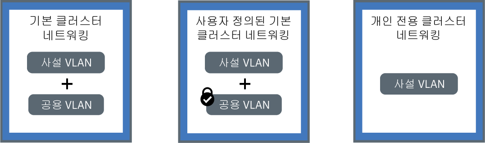

---

copyright:
  years: 2014, 2018
lastupdated: "2018-12-05"

---

{:new_window: target="_blank"}
{:shortdesc: .shortdesc}
{:screen: .screen}
{:pre: .pre}
{:table: .aria-labeledby="caption"}
{:codeblock: .codeblock}
{:tip: .tip}
{:note: .note}
{:important: .important}
{:deprecated: .deprecated}
{:download: .download}

# 클러스터 내 및 사설 네트워킹 계획
{: #planning}

{{site.data.keyword.containerlong}} 클러스터에 대한 네트워킹 설정을 계획합니다.
{: shortdesc}

## 클러스터 내 네트워킹 이해
{: #in-cluster}

작업자 노드에 배치된 모든 팟(Pod)에는 172.30.0.0/16 범위의 사설 IP 주소가 지정되며 이는 작업자 노드 간에만 라우팅됩니다. 충돌을 피하려면 사용자의 작업자 노드와 통신하는 노드에서 이 IP 범위를 사용하지 마십시오. 작업자 노드와 팟(Pod)은 사설 IP 주소를 사용하여 사설 네트워크에서 안전하게 통신할 수 있습니다. 그러나 팟(Pod)에 장애가 발생하거나 작업자 노드의 재작성이 필요한 경우에는 새 사설 IP 주소가 지정됩니다.

기본적으로, 고가용성이어야 하는 앱에 대한 사설 IP 주소 변경을 추적하는 것은 어렵습니다. 그 대신에 기본 제공 Kubernetes 서비스 검색 기능을 사용하여 사설 네트워크에서 클러스터 IP 서비스로서 앱을 노출할 수 있습니다. Kubernetes 서비스는 팟(Pod) 세트를 그룹화하며 이러한 팟(Pod)에 대한 네트워크 연결을 제공합니다. 이 연결은 각 팟(Pod)의 실제 사설 IP 주소를 노출하지 않고 클러스터의 기타 서비스에 대한 연결을 제공합니다. 서비스에는 클러스터 내에서만 액세스가 가능한 클러스터 내 IP 주소가 지정됩니다.
* 이전 클러스터: dal13 구역에서 2018년 2월 이전에 또는 기타 구역에서 2017년 10월 이전에 작성된 클러스터에서는 서비스에 10.10.10.0/24 범위의 254 IP 중 하나의 IP가 지정됩니다. 254 서비스의 한계에 도달하여 추가 서비스가 필요하면 새 클러스터를 작성해야 합니다.
* 새 클러스터: dal13 구역에서 2018년 2월 이후에 또는 기타 구역에서 2017년 10월 이후에 작성된 클러스터에서는 서비스에 172.21.0.0/16 범위의 65,000 IP 중 하나의 IP가 지정됩니다.

충돌을 피하려면 사용자의 작업자 노드와 통신하는 노드에서 이 IP 범위를 사용하지 마십시오. 또한 DNS 검색 항목이 서비스에 대해 작성되며 클러스터의 `kube-dns` 컴포넌트에 저장됩니다. DNS 항목에는 서비스의 이름, 서비스가 작성된 네임스페이스 및 지정된 클러스터 내 IP 주소에 대한 링크가 포함되어 있습니다.

클러스터 서비스 뒤의 팟(Pod)에 액세스하기 위해, 앱은 서비스의 클러스터 내 IP 주소를 사용하거나 서비스의 이름을 사용하여 요청을 전송할 수 있습니다. 서비스의 이름을 사용하는 경우, 해당 이름은 `kube-dns` 컴포넌트에서 검색되며 서비스의 클러스터 내 IP 주소로 라우팅됩니다. 요청이 서비스에 도달하는 경우, 서비스는 팟(Pod)의 클러스터 내 IP 주소 및 이들이 배치된 작업자 노드와는 무관하게 요청을 팟(Pod)에 동일하게 전달합니다.

 

## VLAN 연결 및 네트워크 인터페이스 이해
{: #interfaces}

{{site.data.keyword.containerlong_notm}}는 작업자 노드에 대한 고품질 네트워크 성능 및 네트워크 격리를 보장하는 IBM Cloud 인프라(SoftLayer) VLAN을 제공합니다. VLAN은 동일한 실제 회선에 연결된 것처럼 작업자 노드 및 팟(Pod)의 그룹을 구성합니다. VLAN은 {{site.data.keyword.Bluemix_notm}} 계정 전용이며 IBM 고객 간에 공유되지 않습니다.

기본적으로 모든 클러스터는 사설 VLAN에 연결됩니다. 사설 VLAN은 각 작업자 노드에 지정된 사설 IP 주소를 판별합니다. 작업자는 사설 네트워크 인터페이스를 보유하며 사설 네트워크를 통해 액세스가 가능합니다. 공용 VLAN에도 연결되어 있는 클러스터를 작성하면 클러스터가 공용 네트워크 인터페이스도 보유합니다. 공용 VLAN을 사용하면 작업자 노드가 자동으로 안전하게 마스터에 연결할 수 있습니다. 클러스터의 기본 VLAN에 대한 자세한 정보는 [클러스터의 기본 VLAN, 서브넷 및 IP](cs_subnets.html#default_vlans_subnets)를 참조하십시오.

클러스터 네트워킹 설정은 클러스터의 네트워크 인터페이스에 의해 정의될 수 있습니다.

* **기본 클러스터 네트워킹**: 사설 및 공용 네트워크 인터페이스가 둘 다 있는 클러스터
* **사용자 정의된 기본 클러스터 네트워킹**: 수신 공용 트래픽을 차단하기 위한 사설 및 공용 네트워크 인터페이스와 Calico 네트워크 정책이 둘 다 있는 클러스터
* **사설 전용 클러스터 네트워킹**: 사설 네트워크 인터페이스만 있는 클러스터

다음 설정 중 하나를 클릭하여 클러스터에 대한 네트워킹을 계획하십시오.

<map name="home_map" id="home_map">
<area href="#both_vlans" alt="기본 클러스터 네트워킹 계획" title="기본 클러스터 네트워킹 계획" shape="rect" coords="-7, -8, 149, 211" />
<area href="#both_vlans_private" alt="사용자 정의된 기본 클러스터 네트워킹 계획" title="사용자 정의된 기본 클러스터 네트워킹 계획" shape="rect" coords="196, -1, 362, 210" />
<area href="#private_vlan" alt="사설 전용 클러스터 네트워킹 계획" title="사설 전용 클러스터 네트워킹 계획" shape="rect" coords="409, -10, 572, 218" />
</map>

 

## 기본 클러스터 네트워킹 계획
{: #both_vlans}

기본적으로 {{site.data.keyword.containerlong_notm}}는 공용 VLAN 및 사설 VLAN에 대한 액세스 권한으로 클러스터를 설정합니다.
{:shortdesc}

**이 설정으로 내 클러스터는 무엇을 가져옵니까?**
* 작업자 노드에 공용 네트워크 인터페이스를 제공하는 각 작업자 노드에 대한 공인 IP 주소
* 작업자 노드에 사설 네트워크 인터페이스를 제공하는 각 작업자 노드에 대한 사설 IP 주소
* 모든 작업자 노드와 마스터 간의 자동화된 보안 OpenVPN 연결

**왜 이 설정을 사용해야 합니까?**

* 단일 구역 클러스터의 공용 인터넷에 액세스해야 하는 앱을 사용자가 보유합니다.
* 다중 구역 클러스터의 공용 인터넷에 액세스해야 하는 앱을 사용자가 보유합니다. 다중 구역 클러스터를 작성하려면 [VLAN Spanning](cs_subnets.html#subnet-routing)을 사용으로 설정해야 하므로, 클러스터는 동일한 IBM Cloud 계정에서 사설 VLAN에 연결된 기타 시스템과 통신할 수 있습니다. 사설 네트워크에서 다중 구역 클러스터를 분리하려면 [Calico 네트워크 정책](cs_network_policy.html#isolate_workers)을 사용할 수 있습니다.

**내 클러스터에 대한 공용 및 개인용 액세스를 관리하기 위한 내 옵션은 무엇입니까?**
 다음 절에서는 공용 및 사설 VLAN에 연결된 클러스터에 대한 네트워킹 설정에 사용할 수 있는 {{site.data.keyword.containerlong_notm}}에서의 기능을 설명합니다.

### 네트워크 서비스에서 앱 노출
{: #both_vlans_services}

작업자 노드에 대한 공용 네트워크 인터페이스는 클러스터 작성 중에 모든 작업자 노드에서 구성된 [사전 정의된 Calico 네트워크 정책 설정](cs_network_policy.html#default_policy)에 의해 보호됩니다. 기본적으로, 모든 아웃바운드 네트워크 트래픽이 모든 작업자 노드에 대해 허용됩니다. 인바운드 네트워크 트래픽은 일부 포트를 제외하면 차단됩니다. IBM이 네트워크 트래픽을 모니터링하고 Kubernetes 마스터에 대한 보안 업데이트를 자동으로 설치할 수 있도록 하기 위해 이러한 포트는 열려 있습니다.

앱을 공용 또는 사설 네트워크에 노출하려는 경우에는 공용 또는 개인용 NodePort, LoadBalancer 또는 Ingress 서비스를 작성할 수 있습니다. 각 서비스에 대한 자세한 정보는 [NodePort, LoadBalancer 또는 Ingress 서비스 선택](cs_network_planning.html#external)을 참조하십시오.

### 선택사항:에지 작업자 노드에 대한 네트워킹 워크로드 격리
{: #both_vlans_edge}

에지 작업자 노드는 외부에서 적은 수의 작업자 노드에 액세스할 수 있게 하고 네트워크 워크로드를 격리함으로써 클러스터의 보안을 향상시킬 수 있습니다. Ingress 및 로드 밸런서 팟(Pod)이 지정된 작업자 노드에만 배치되도록 보장하려면 [작업자 노드를 에지 노드로서 레이블링](cs_edge.html#edge_nodes)하십시오. 또한 기타 워크로드가 에지 노드에서 실행하지 못하도록 방지하려면 [에지 노드를 오염(taint)](cs_edge.html#edge_workloads)시키십시오.

### 선택사항: strongSwan VPN을 사용하여 IBM Cloud Private 또는 온프레미스 네트워크에 연결
{: #both_vlans_vpn}

작업자 노드와 앱을 온프레미스 네트워크에 안전하게 연결할 수 있도록 [strongSwan IPSec VPN 서비스 ](https://www.strongswan.org/about.html)를 설정할 수 있습니다. strongSwan IPSec VPN 서비스는 업계 표준 IPSec(Internet Protocol Security) 프로토콜 스위트를 기반으로 하는 인터넷 상의 엔드-투-엔드 보안 통신 채널을 제공합니다.
* 클러스터와 온프레미스 네트워크 간의 보안 연결을 설정하려면 클러스터 내의 팟(Pod)에 직접 [strongSwan IPSec VPN 서비스를 구성하고 배치](cs_vpn.html#vpn-setup)하십시오.
* 클러스터 및 IBM Cloud Private 인스턴스 간에 보안 연결을 설정하려면 [strongSwan VPN으로 퍼블릭 및 프라이빗 클라우드 연결](cs_hybrid.html#hybrid_vpn)을 참조하십시오.

 

## 사용자 정의된 기본 클러스터 네트워킹 계획
{: #both_vlans_private}

기본적으로 {{site.data.keyword.containerlong_notm}}는 공용 VLAN 및 사설 VLAN에 대한 액세스 권한으로 클러스터를 설정합니다. 그러나 공용 액세스를 차단하기 위해 네트워크 정책을 사용하여 기본 네트워킹 설정을 사용자 정의할 수 있습니다.
{:shortdesc}

**이 설정으로 내 클러스터는 무엇을 가져옵니까?**
* 작업자 노드에 공용 네트워크 인터페이스를 제공하는 각 작업자 노드에 대한 공인 IP 주소
* 작업자 노드에 사설 네트워크 인터페이스를 제공하는 각 작업자 노드에 대한 사설 IP 주소
* 모든 작업자 노드와 마스터 간의 자동화된 보안 OpenVPN 연결

**왜 이 설정을 사용해야 합니까?**

* 사용자가 단일 구역 클러스터의 앱을 보유합니다. 오직 클러스터 내의 팟(Pod)에 또는 동일한 사설 VLAN에 연결된 기타 클러스터의 팟(Pod)에 앱을 노출하고자 합니다.
* 사용자가 다중 구역 클러스터의 앱을 보유합니다. 오직 클러스터 내의 팟(Pod)에 또는 클러스터와 동일한 사설 VLAN에 연결된 기타 클러스터의 팟(Pod)에 앱을 노출하고자 합니다. 그러나 다중 구역 클러스터를 위해 [VLAN Spanning](cs_subnets.html#subnet-routing)을 사용으로 설정해야 하므로, 동일한 IBM Cloud 계정에서 사설 VLAN에 연결된 다른 시스템이 클러스터에 액세스할 수 있습니다. 다중 구역 클러스터는 다른 시스템으로부터 격리해야 합니다.

**내 클러스터에 대한 공용 및 개인용 액세스를 관리하기 위한 내 옵션은 무엇입니까?** 다음 절에서는 공용 및 사설 VLAN에 연결된 클러스터에 대한 공용 네트워킹의 잠금과 사설 전용 네트워킹의 설정에 사용할 수 있는 {{site.data.keyword.containerlong_notm}}에서의 기능을 설명합니다.

### 사설 네트워킹 서비스에서 앱 노출 및 Calico 네트워크 정책으로 공용 액세스로부터 클러스터 보호
{: #both_vlans_private_services}

작업자 노드에 대한 공용 네트워크 인터페이스는 클러스터 작성 중에 모든 작업자 노드에서 구성된 [사전 정의된 Calico 네트워크 정책 설정](cs_network_policy.html#default_policy)에 의해 보호됩니다. 기본적으로, 모든 아웃바운드 네트워크 트래픽이 모든 작업자 노드에 대해 허용됩니다. 인바운드 네트워크 트래픽은 일부 포트를 제외하면 차단됩니다. IBM이 네트워크 트래픽을 모니터링하고 Kubernetes 마스터에 대한 보안 업데이트를 자동으로 설치할 수 있도록 하기 위해 이러한 포트는 열려 있습니다.

사설 네트워크에서만 앱을 노출하려는 경우, 개인용 NodePort, LoadBalancer 또는 Ingress 서비스를 작성할 수 있습니다. 사설 외부 네트워킹 계획에 대한 자세한 정보는 [공용 및 사설 VLAN 설정을 위한 사설 외부 네트워킹 계획](cs_network_planning.html#private_both_vlans)을 참조하십시오.

그러나 기본 Calico 네트워크 정책은 인터넷에서 이러한 서비스로의 인바운드 공용 네트워크 트래픽도 허용합니다. 사용자는 서비스에 대한 모든 공용 트래픽을 대신 차단하는 Calico 정책을 작성할 수 있습니다. 예를 들어, NodePort 서비스는 작업자 노드의 사설 및 공인 IP 주소 모두에서 작업자 노드의 포트를 엽니다. 포터블 사설 IP 주소를 가진 로드 밸런서 서비스는 모든 작업자 노드에서 공용 NodePort를 엽니다. 사용자는 공용 NodePort를 차단하는 [Calico preDNAT 네트워크 정책](cs_network_policy.html#block_ingress)을 작성해야 합니다.

예를 들어, 개인용 로드 밸런서 서비스를 작성했다고 가정합니다. 공용 트래픽이 로드 밸런서에 의해 열린 NodePort에 도달하지 못하도록 차단하는 Calico preDNAT 정책을 작성할 수도 있습니다. 이 개인용 로드 밸런서는 다음에 의해 액세스될 수 있습니다.
* [동일한 해당 클러스터의 임의의 팟(Pod)](#in-cluster)
* 동일한 사설 VLAN에 연결된 임의의 클러스터의 임의의 팟(Pod)
* [VLAN Spanning을 사용으로 설정](cs_subnets.html#subnet-routing)한 경우, 동일한 IBM Cloud 계정의 사설 VLAN에 연결된 시스템
* 사용자가 IBM Cloud 클라우드 계정에는 없지만 여전히 회사 방화벽 뒤에 있는 경우, 로드 밸런서 IP가 작동되는 서브넷에 대한 VPN 연결을 통한 시스템
* 사용자가 다른 IBM Cloud 계정에 있는 경우, 로드 밸런서 IP가 작동되는 서브넷에 대한 VPN 연결을 통한 시스템

### 사설 네트워크에서 클러스터 격리
{: #isolate}

다중 구역 클러스터, 단일 구역 클러스터용 다중 VLAN 또는 동일한 VLAN의 다중 서브넷이 있는 경우에는 작업자 노드가 사설 네트워크에서 서로 간에 통신할 수 있도록 [VLAN Spanning을 사용으로 설정](/docs/infrastructure/vlans/vlan-spanning.html#vlan-spanning)해야 합니다. 그러나 VLAN Spanning이 사용으로 설정되면 동일한 IBM Cloud 계정에서 사설 VLAN에 연결된 시스템이 작업자에 액세스할 수 있습니다. [Calico 네트워크 정책](cs_network_policy.html#isolate_workers)을 사용하여 사설 네트워크의 기타 시스템으로부터 다중 구역 클러스터를 격리시킬 수 있습니다. 이러한 정책은 사설 방화벽에서 열린 개인용 IP 범위 및 포트에 대한 유입 및 유출도 허용합니다.

### 선택사항:에지 작업자 노드에 대한 네트워킹 워크로드 격리
{: #both_vlans_private_edge}

에지 작업자 노드는 외부에서 적은 수의 작업자 노드에 액세스할 수 있게 하고 네트워크 워크로드를 격리함으로써 클러스터의 보안을 향상시킬 수 있습니다. Ingress 및 로드 밸런서 팟(Pod)이 지정된 작업자 노드에만 배치되도록 보장하려면 [작업자 노드를 에지 노드로서 레이블링](cs_edge.html#edge_nodes)하십시오. 또한 기타 워크로드가 에지 노드에서 실행하지 못하도록 방지하려면 [에지 노드를 오염(taint)](cs_edge.html#edge_workloads)시키십시오.

그리고 [Calico preDNAT 네트워크 정책](cs_network_policy.html#block_ingress)을 사용하여 에지 작업자 노드를 실행 중인 클러스터의 공용 NodePort에 대한 트래픽을 차단하십시오. 노드 포트를 차단하면 에지 작업자 노드가 수신 트래픽을 처리하는 유일한 작업자 노드가 됩니다.

### 선택사항: strongSwan VPN을 사용하여 IBM Cloud Private 또는 온프레미스 네트워크에 연결
{: #both_vlans_private_vpn}

작업자 노드와 앱을 온프레미스 네트워크에 안전하게 연결할 수 있도록 [strongSwan IPSec VPN 서비스 ](https://www.strongswan.org/about.html)를 설정할 수 있습니다. strongSwan IPSec VPN 서비스는 업계 표준 IPSec(Internet Protocol Security) 프로토콜 스위트를 기반으로 하는 인터넷 상의 엔드-투-엔드 보안 통신 채널을 제공합니다.
* 클러스터와 온프레미스 네트워크 간의 보안 연결을 설정하려면 클러스터 내의 팟(Pod)에 직접 [strongSwan IPSec VPN 서비스를 구성하고 배치](cs_vpn.html#vpn-setup)하십시오.
* 클러스터 및 IBM Cloud Private 인스턴스 간에 보안 연결을 설정하려면 [strongSwan VPN으로 퍼블릭 및 프라이빗 클라우드 연결](cs_hybrid.html#hybrid_vpn)을 참조하십시오.

 

## 사설 전용 클러스터 네트워킹 계획
{: #private_vlan}

CLI에 `--private-only` 플래그를 포함하여 [사설 VLAN 전용 클러스터를 작성](cs_clusters.html#clusters_cli)할 수 있습니다. 작업자 노드가 사설 VLAN에만 연결되어 있으면 작업자 노드가 자동으로 마스터에 연결할 수 없습니다. 작업자 노드를 마스터에 연결하려면 게이트웨이 어플라이언스를 사용해야 합니다. 게이트웨이 어플라이언스를 사용하여 원하지 않는 액세스로부터 클러스터를 보호할 수도 있습니다.
{:shortdesc}

**이 설정으로 내 클러스터는 무엇을 가져옵니까?**
* 작업자 노드에 사설 네트워크 인터페이스를 제공하는 각 작업자 노드에 대한 사설 IP 주소

**이 설정으로 내 클러스터는 무엇을 가져오지 못합니까?**
* 작업자 노드에 공용 네트워크 인터페이스를 제공하는 각 작업자 노드에 대한 공인 IP 주소. 클러스터를 절대로 공용으로 사용할 수 없습니다.
* 모든 작업자 노드와 마스터 간의 자동 연결. [게이트웨이 어플라이언스를 구성](#private_vlan_gateway)하여 이 연결을 제공해야 합니다.

**왜 이 설정을 사용해야 합니까?**
 사용자에게 특정 보안 요구사항이 있거나 사용자가 전용 네트워크 보안을 제공하기 위한 사용자 정의 네트워크 정책과 라우팅 규칙을 작성해야 합니다. 참고로, 게이트웨이 어플라이언스를 사용하면 별도의 비용이 발생합니다. 세부사항은 [문서](/docs/infrastructure/fortigate-10g/explore-firewalls.html)를 참조하십시오.

**내 클러스터에 대한 공용 및 개인용 액세스를 관리하기 위한 내 옵션은 무엇입니까?**
 다음 절에서는 사설 VLAN에만 연결된 클러스터에 대한 네트워킹 설정에 사용할 수 있는 {{site.data.keyword.containerlong_notm}}에서의 기능을 설명합니다.

### 게이트웨이 어플라이언스 구성
{: #private_vlan_gateway}

작업자 노드가 사설 VLAN 전용으로 설정된 경우에는 작업자 노드와 마스터 간의 네트워크 연결에 대해 대체 솔루션을 구성해야 합니다. 사용자는 표준 클러스터에 대한 전용 네트워크 보안을 제공하고 네트워크 침입을 발견하여 이를 해결하기 위한 사용자 정의 네트워크 정책으로 방화벽을 설정할 수 있습니다. 예를 들어, 방화벽 역할을 수행하며 원하지 않는 트래픽을 차단하도록 [가상 라우터 어플라이언스](/docs/infrastructure/virtual-router-appliance/about.html) 또는 [Fortigate 보안 어플라이언스](/docs/infrastructure/fortigate-10g/about.html) 설정을 선택할 수 있습니다. 방화벽을 설정할 때 마스터와 작업자 노드가 통신할 수 있도록 각 지역의 [필수 포트와 IP 주소 공개](cs_firewall.html#firewall_outbound)도 해야 합니다.

기존 라우터 어플라이언스가 있으며 클러스터를 추가하는 경우에는 클러스터에 대해 주문된 새 포터블 서브넷이 라우터 어플라이언스에서 구성되지 않습니다. 네트워크 서비스를 사용하려면 [VLAN Spanning을 사용으로 설정](cs_subnets.html#vra-routing)하여 동일한 VLAN의 서브넷 간에 라우팅을 사용하도록 설정해야 합니다.
{: important}

### 사설 네트워크 서비스에서 앱 노출
{: #private_vlan_services}

사설 네트워크에서만 앱의 액세스를 허용하려면 사설 NodePort, LoadBalancer 또는 Ingress 서비스를 사용할 수 있습니다. 작업자 노드가 공용 VLAN에 연결되어 있지 않으므로 공용 트래픽은 이러한 서비스로 라우팅되지 않습니다. 이러한 서비스에 대한 인바운드 트래픽을 허용하도록 사용자는 [필수 포트와 IP 주소 공개](cs_firewall.html#firewall_inbound)도 해야 합니다.

각 서비스에 대한 자세한 정보는 [NodePort, LoadBalancer 또는 Ingress 서비스 선택](cs_network_planning.html#external)을 참조하십시오.

### 선택사항: 게이트웨이 어플라이언스를 사용하여 온프레미스 데이터베이스에 연결
{: #private_vlan_vpn}

작업자 노드와 앱을 온프레미스 네트워크에 안전하게 연결하려면 VPN 게이트웨이를 설정해야 합니다. 이전에 설정한 VRA 또는 FSA를 사용하여 IPSec VPN 엔드포인트를 구성할 수도 있습니다. VRA를 구성하려면 [VRA를 사용하여 VPN 연결 설정](cs_vpn.html#vyatta)을 참조하십시오.
