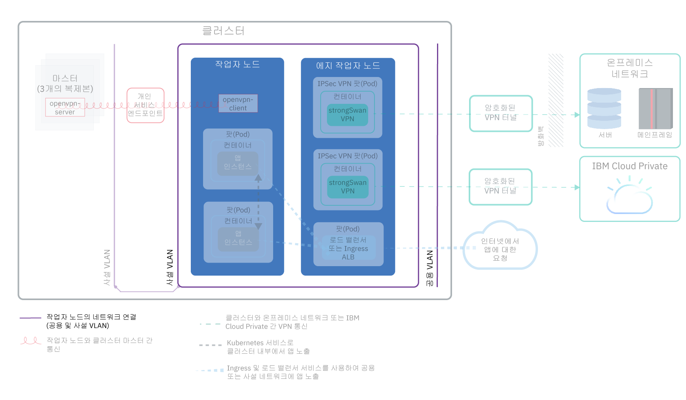
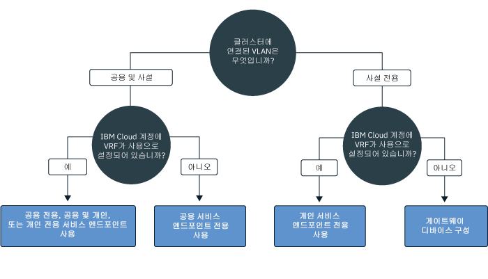
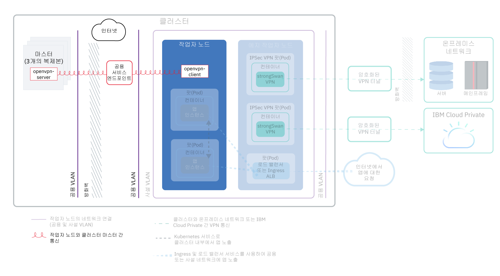
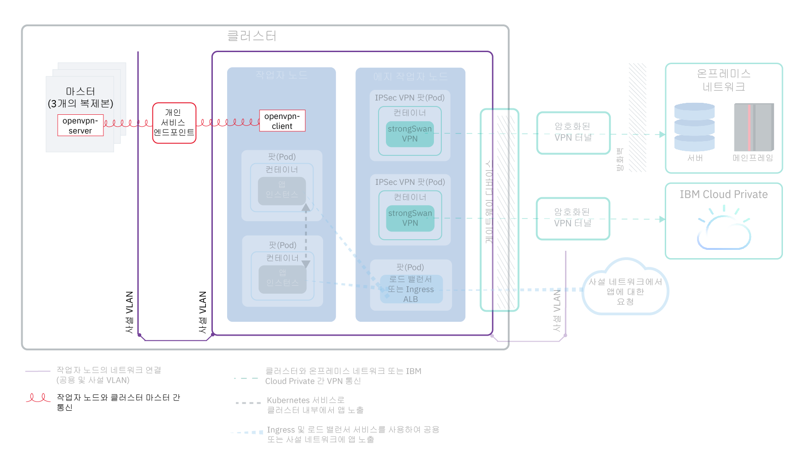
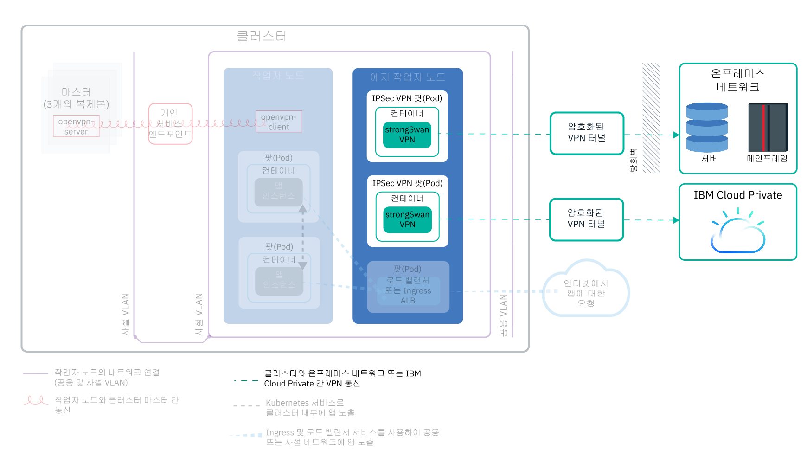
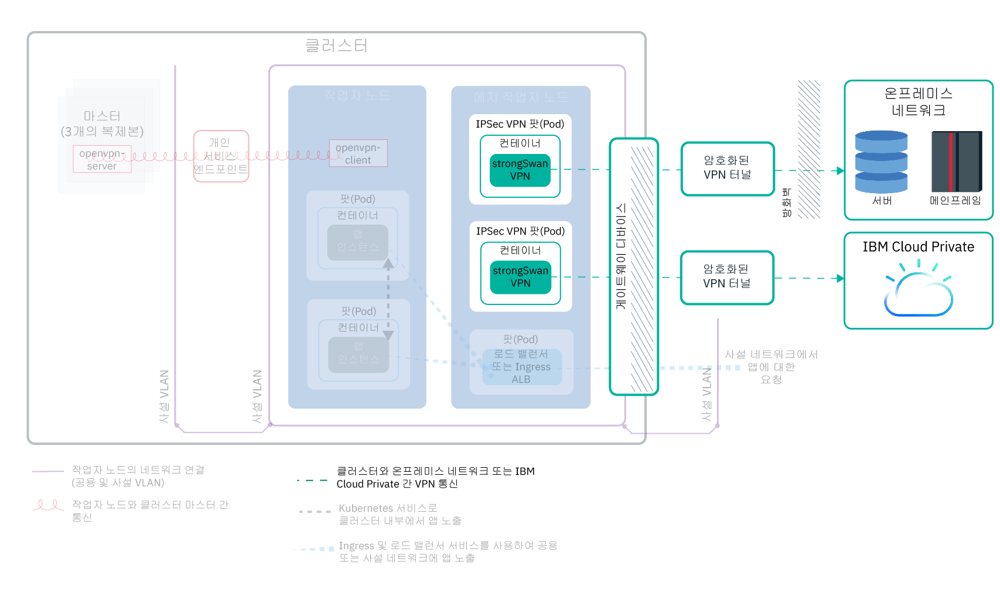

---

copyright:
  years: 2014, 2019
lastupdated: "2019-04-15"

---

{:new_window: target="_blank"}
{:shortdesc: .shortdesc}
{:screen: .screen}
{:pre: .pre}
{:table: .aria-labeledby="caption"}
{:codeblock: .codeblock}
{:tip: .tip}
{:note: .note}
{:important: .important}
{:deprecated: .deprecated}
{:download: .download}

# 클러스터 네트워크 계획
{: #cs_network_ov}

{{site.data.keyword.containerlong}} 클러스터에 대한 네트워킹 설정을 계획합니다.
{: shortdesc}

이 페이지는 클러스터의 네트워크 구성을 설정하는 데 도움이 됩니다. 앱의 네트워킹 설정에 대한 정보를 찾으십니까? [클러스터 내부 및 외부 네트워킹에서 앱 노출 계획](/docs/containers?topic=containers-cs_network_planning)을 참조하십시오.
{: tip}

## {{site.data.keyword.containerlong_notm}} 네트워크 기본 사항 이해
{: #cs_network_ov_basics}

클러스터 네트워크 설정을 시작하기 전에 {{site.data.keyword.containerlong_notm}} 클러스터의 네트워킹 기본 개념을 이해하는 것이 중요합니다.
{: shortdesc}

### 서로 통신해야 하는 클러스터 컴포넌트는 무엇입니까?
{: #cs_network_ov_basics_components}

클러스터를 작성할 때 특정 클러스터 컴포넌트가 서로 통신할 수 있도록 네트워킹 설정을 선택해야 합니다.
{: shortdesc}

* 모든 작업자 노드는 서로 통신하고 Kubernetes 마스터와 통신하기 위해 VLAN에 연결되어야 합니다. VLAN을 선택하려면 [작업자와 작업자 간의 통신 계획](#cs_network_ov_worker)을 참조하십시오.
* 작업자가 작업자 간 및 마스터에 연결할 수 있도록 여러 사설 VLAN 간에 통신이 허용되어야 합니다. VRF(Virtual Router Function) 또는 VLAN Spanning을 사용으로 설정하려면 [네트워크 세그먼트화를 보장하기 위해 VLAN과 서브넷을 어떻게 구성합니까?](#cs_network_ov_basics_segmentation)를 참조하십시오.
* 작업자는 공용 네트워크 또는 사설 네트워크를 통해 Kubernetes 마스터와 안전하게 통신할 수 있습니다. 작업자와 마스터 간의 통신 채널을 선택하려면 [마스터와 작업자 간 통신 계획](#cs_network_ov_master)을 참조하십시오.

### {{site.data.keyword.containerlong_notm}}에서 네트워킹은 어떻게 작동합니까?
{: #cs_network_ov_basics_vlans}

{{site.data.keyword.containerlong_notm}}는 VLAN, 서브넷 및 IP 주소를 사용하여 클러스터 컴포넌트 네트워크 연결을 제공합니다.
{: shortdesc}

**VLAN은 무엇입니까? {{site.data.keyword.containerlong_notm}}에서 제공** 하는 VLAN 유형은 무엇입니까?

클러스터를 작성하면 클러스터의 작업자 노드가 VLAN에 자동으로 연결됩니다. VLAN은 동일한 실제 회선에 연결된 것처럼 작업자 노드 및 팟(Pod)의 그룹을 구성하며, 작업자 및 팟(Pod) 간의 연결을 위한 채널을 제공합니다.
{: shortdesc}

<dl>
<dt>무료 클러스터의 VLAN</dt>
<dd>무료 클러스터의 경우에는 기본적으로 클러스터의 작업자 노드가 IBM 소유의 공용 VLAN 및 사설 VLAN에 연결됩니다. IBM에서 VLAN, 서브넷 및 IP 주소를 제어하므로 사용자는 다중 구역 클러스터를 작성하거나 클러스터에 서브넷을 추가할 수 없습니다. 오직 NodePort 서비스를 사용한 앱 노출만 수행할 수 있습니다.</dd>
<dt>표준 클러스터의 VLAN</dt>
<dd>표준 클러스터에서 구역의 클러스터를 처음으로 작성하는 경우, 해당 구역의 공용 VLAN 및 사설 VLAN은 IBM Cloud 인프라(SoftLayer) 계정에서 사용자를 위해 자동으로 프로비저닝됩니다. 해당 구역에서 작성하는 모든 후속 클러스터에 대해 해당 구역에서 사용할 VLAN 쌍을 지정해야 합니다. 다중 클러스터가 VLAN을 공유할 수 있으므로 사용자는 자신을 위해 작성된 동일한 공용 및 사설 VLAN을 재사용할 수 있습니다. 
 작업자 노드를 공용 VLAN 및 사설 VLAN 모두에 연결하거나 사설 VLAN에만 연결할 수 있습니다. 작업자 노드를 사설 VLAN에만 연결하려는 경우에는 기존 사설 VLAN의 ID를 사용하거나 [새 사설 VLAN을 작성](/docs/cli/reference/ibmcloud?topic=cloud-cli-manage-classic-vlans#sl_vlan_create)하여 클러스터 작성 중에 해당 ID를 사용할 수 있습니다.</dd></dl>

계정에 대해 각 구역에서 프로비저닝되는 VLAN을 보려면 `ibmcloud ks vlans --zone <zone>`을 실행하십시오. 하나의 클러스터가 프로비저닝된 VLAN을 보려면 `ibmcloud ks cluster-get --cluster <cluster_name_or_ID> --showResources`를 실행하고 **Subnet VLANs** 섹션을 찾으십시오.

IBM Cloud 인프라(SoftLayer)는 구역의 첫 번째 클러스터가 작성될 때 자동으로 프로비저닝되는 VLAN을 관리합니다. VLAN을 미사용 상태로 두면(예: VLAN에서 모든 작업자 노드를 제거하여) IBM Cloud 인프라(SoftLayer)가 VLAN을 재확보합니다. 향후에 새 VLAN이 필요하면 [contact {{site.data.keyword.Bluemix_notm}} 지원 팀에 문의](/docs/infrastructure/vlans?topic=vlans-ordering-premium-vlans#ordering-premium-vlans)하십시오.

**내 VLAN 선택이 내 클러스터에 어떤 영향을 줍니까?** 

선택한 VLAN 연결은 Kubernetes 마스터 및 작업자 노드가 클러스터에서 서로 통신할 수 있는 방법을 판별합니다. 자세한 정보는 [작업자 노드와 Kubernetes 마스터 간의 통신 계획](/docs/containers?topic=containers-cs_network_ov#cs_network_ov_master)을 참조하십시오.

VLAN 연결을 선택하면 앱에 대한 네트워크 연결도 판별됩니다. 자세한 정보는 [클러스터 내부 및 외부 네트워킹에서 앱 노출 계획](/docs/containers?topic=containers-cs_network_planning)을 참조하십시오.

### 서브넷은 무엇입니까? {{site.data.keyword.containerlong_notm}}에서 제공하는 서브넷 유형은 무엇입니까?
{: #cs_network_ov_basics_subnets}

작업자 노드 및 팟(Pod)에 추가하여 서브넷도 자동으로 VLAN에 프로비저닝됩니다. 서브넷은 클러스터 컴포넌트에 IP 주소를 지정하여 이에 대한 네트워크 연결을 제공합니다.
{: shortdesc}

다음의 서브넷이 기본 공용 및 사설 VLAN에서 자동으로 프로비저닝됩니다.

**공용 VLAN 서브넷**
* 기본 공용 서브넷은 클러스터 작성 중에 작업자 노드에 지정된 공인 IP 주소를 판별합니다. 동일한 VLAN의 다중 클러스터는 하나의 기본 공용 서브넷을 공유할 수 있습니다.
* 포터블 공용 서브넷은 하나의 클러스터에만 바인드되어 있으며 8개의 공인 IP 주소를 클러스터에 제공합니다. 3개의 IP 주소는 IBM Cloud 인프라(SoftLayer) 기능을 위해 예약됩니다. 1개의 IP는 기본 공용 Ingress ALB에 의해 사용되며, 4개의 IP는 공용 네트워크 로드 밸런서(NLB) 서비스 작성에 사용될 수 있습니다. 포터블 공인 IP는 인터넷을 통해 NLB에 액세스하기 위해 사용될 수 있는 영구적인 고정 IP 주소입니다. NLB에 대해 5개 이상의 IP가 필요하면 [포터블 IP 주소 추가](/docs/containers?topic=containers-subnets#adding_ips)를 참조하십시오.

**사설 VLAN 서브넷**
* 기본 사설 서브넷은 클러스터 작성 중에 작업자 노드에 지정된 사설 IP 주소를 판별합니다. 동일한 VLAN의 다중 클러스터는 하나의 기본 사설 서브넷을 공유할 수 있습니다.
* 포터블 사설 서브넷은 하나의 클러스터에만 바인드되어 있으며 8개의 사설 IP 주소를 클러스터에 제공합니다. 3개의 IP 주소는 IBM Cloud 인프라(SoftLayer) 기능을 위해 예약됩니다. 1개의 IP는 기본 사설 Ingress ALB에 의해 사용되며, 4개의 IP는 사설 네트워크 로드 밸런서(NLB) 서비스 작성에 사용될 수 있습니다. 포터블 사설 IP는 사설 네트워크를 통해 NLB에 액세스하기 위해 사용될 수 있는 영구적인 고정 IP 주소입니다. 사설 NLB에 대해 5개 이상의 IP가 필요하면 [포터블 IP 주소 추가](/docs/containers?topic=containers-subnets#adding_ips)를 참조하십시오.

계정에서 프로비저닝된 서브넷을 모두 보려면 `ibmcloud ks subnets`를 실행하십시오. 하나의 클러스터에 바인드된 포터블 공인 및 포터블 사설 서브넷을 보려면 `ibmcloud ks cluster-get --cluster <cluster_name_or_ID> --showResources`를 실행하고 **Subnet VLANs** 섹션을 찾으십시오.

{{site.data.keyword.containerlong_notm}}에서 VLAN에는 서브넷이 40개로 제한되어 있습니다. 이 한계에 도달하면 우선 [VLAN의 서브넷을 재사용하여 새 클러스터를 작성](/docs/containers?topic=containers-subnets#subnets_custom)할 수 있는지 여부를 확인하십시오. 새 VLAN이 필요하면 [{{site.data.keyword.Bluemix_notm}} 지원 팀에 문의](/docs/infrastructure/vlans?topic=vlans-ordering-premium-vlans#ordering-premium-vlans)하여 VLAN을 주문하십시오. 그런 다음, 이 새 VLAN을 사용하는 [클러스터를 작성](/docs/containers?topic=containers-cs_cli_reference#cs_cluster_create)하십시오.
{: note}

### 네트워크 세그먼트화를 보장하기 위해 VLAN 및 서브넷이 어떻게 구성되어 있습니까?
{: #cs_network_ov_basics_segmentation}

네트워크 세그먼트화는 네트워크를 다중 하위 네트워크로 분할하기 위한 접근 방식을 말합니다. 하나의 서브네트워크에서 실행되는 앱은 다른 서브네트워크의 앱을 보거나 이에 액세스할 수 없습니다. 네트워크 세그먼트화 옵션과 VLAN과 관련된 방법에 대한 자세한 정보는 [이 클러스터 보안 주제](/docs/containers?topic=containers-security#network_segmentation)를 참조하십시오.
{: shortdesc}

그러나 여러 상황에서 클러스터의 컴포넌트는 여러 개의 사설 VLAN을 통해 통신할 수 있어야 합니다. 예를 들어, 다중 구역 클러스터를 작성하려는 경우, 클러스터에 여러 개의 VLAN이 있거나 또는 동일한 VLAN에 여러 개의 서브넷이 있는 경우, 동일한 VLAN 또는 다른 VLAN의 다른 서브넷에 있는 작업자 노드는 자동으로 서로 통신할 수 없습니다. IBM Cloud 인프라(SoftLayer) 계정에 대해 VRF(Virtual Router Function) 또는 VLAN Spanning을 사용으로 설정해야 합니다.

**VRF(Virtual Router Functions)와 VLAN Spanning은 무엇입니까?** 

<dl>
<dt>[VRF(Virtual Router Function)](/docs/infrastructure/direct-link?topic=direct-link-overview-of-virtual-routing-and-forwarding-vrf-on-ibm-cloud#overview-of-virtual-routing-and-forwarding-vrf-on-ibm-cloud)</dt>
<dd>VRF를 사용하면 인프라 계정의 모든 VLAN과 서브넷이 서로 통신할 수 있습니다. 또한 작업자와 마스터가 개인 서비스 엔드포인트를 통해 통신할 수 있도록 하려면 VRF가 필요합니다. VRF를 사용으로 설정하려면 [IBM Cloud 인프라(SoftLayer) 계정 담당자에게 문의하십시오](/docs/infrastructure/direct-link?topic=direct-link-overview-of-virtual-routing-and-forwarding-vrf-on-ibm-cloud#how-you-can-initiate-the-conversion). VRF는 트래픽을 관리하도록 게이트웨이 어플라이언스를 구성하지 않는 한 모든 VLAN이 통신할 수 있으므로 계정에 대한 VLAN Spanning 옵션을 제거합니다.</dd>
<dt>[VLAN Spanning](/docs/infrastructure/vlans?topic=vlans-vlan-spanning#vlan-spanning)</dt>
<dd>VRF를 사용할 수 없거나 사용하지 않으려면 VLAN Spanning을 사용으로 설정하십시오. 이 조치를 수행하려면 **네트워크 > 네트워크 VLAN Spanning 관리** [인프라 권한](/docs/containers?topic=containers-users#infra_access)이 필요합니다. 또는 이를 사용으로 설정하도록 계정 소유자에게 요청할 수 있습니다. VLAN Spanning이 이미 사용으로 설정되었는지 확인하려면 `ibmcloud ks vlan-spanning-get` [명령](/docs/containers?topic=containers-cs_cli_reference#cs_vlan_spanning_get)을 사용하십시오. VRF 대신 VLAN Spanning을 사용하도록 선택한 경우에는 개인 서비스 엔드포인트를 사용할 수 없습니다.</dd>
</dl>

**VRF 또는 VLAN Spanning은 네트워크 세그먼트화에 어떤 영향을 미칩니까?** 

VRF 또는 VLAN Spanning이 사용으로 설정되면 동일한 {{site.data.keyword.Bluemix_notm}} 계정에서 사설 VLAN에 연결된 시스템이 작업자와 통신할 수 있습니다. [Calico 사설 네트워크 정책](/docs/containers?topic=containers-network_policies#isolate_workers)을 적용하여 사설 네트워크의 기타 시스템으로부터 클러스터를 분리할 수 있습니다. 또한 {{site.data.keyword.containerlong_notm}}는 모든 [IBM Cloud 인프라(SoftLayer) 방화벽 오퍼링 ](https://www.ibm.com/cloud-computing/bluemix/network-security)과 호환 가능합니다. 사용자는 표준 클러스터에 대한 전용 네트워크 보안을 제공하고 네트워크 침입을 발견하여 이를 해결하기 위한 사용자 정의 네트워크 정책으로 방화벽(예: [Virtual Router Appliance](/docs/infrastructure/virtual-router-appliance?topic=virtual-router-appliance-about-the-vra))을 설정할 수 있습니다.

 

## 작업자와 작업자 간 통신 계획
{: #cs_network_ov_worker}

네트워크 인터페이스를 사용하려면 모든 작업자 노드는 VLAN에 연결되어야 합니다. 이 네트워크 인터페이스를 사용하면 각 작업자 노드가 다른 작업자 노드에 정보를 전송하고 수신할 수 있습니다.
{: shortdesc}

### 작업자 노드 VLAN 연결에 필요한 내 옵션은 무엇입니까?
{: #cs_network_ov_worker_options}

클러스터를 작성하면 작업자 노드를 공용 VLAN 및 사설 VLAN 모두에 연결하거나 사설 VLAN에만 연결할 수 있습니다.
{: shortdesc}

**클러스터를 공용 및 사설 VLAN에 연결하는 이유는 무엇입니까?** 

대부분의 경우 공용 및 사설 VLAN에 연결되는 클러스터를 작성하여 네트워크 유연성을 확보할 수 있습니다. 예를 들어, 다음과 같습니다.
* 공용 인터넷에 액세스해야 하는 앱을 보유하고 있습니다.
* 클러스터 내의 팟(Pod)에만 또는 동일한 사설 VLAN에 연결된 기타 클러스터의 팟(Pod)에 노출하려는 앱이 있습니다. Calico 네트워크 정책을 사용하거나 외부 네트워크 워크로드를 에지 작업자 노드로 격리하는 등의 공용 인터페이스에서 앱을 보호하는 데 사용할 수 있는 몇 가지 옵션이 있습니다.

다음 이미지는 공용 및 사설 VLAN에 연결된 작업자 노드의 네트워크 연결을 표시합니다.

<figure>
 
 <figcaption>공용 및 사설 VLAN에 연결된 작업자 노드의 네트워크 연결</figcaption>
</figure>

다중 구역 클러스터를 작성하려는 경우, 클러스터에 여러 개의 VLAN이 있거나 또는 동일한 VLAN에 여러 개의 서브넷이 있는 경우, 동일한 VLAN 또는 다른 VLAN의 다른 서브넷에 있는 작업자 노드는 자동으로 서로 통신할 수 없습니다. IBM Cloud 인프라(SoftLayer) 계정에 대해 [VRF 또는 VLAN Spanning](#cs_network_ov_basics_segmentation)을 사용으로 설정해야 합니다. VRF를 선택하여 [마스터와 작업자 간의 통신을 위한 개인 서비스 엔드포인트](#cs_network_ov_master_private)를 사용으로 설정하십시오. VRF를 사용할 수 없거나 사용하지 않으려면 VLAN Spanning을 사용으로 설정하십시오.

**사설 VLAN 전용에 연결하는 이유는 무엇입니까?** 

사용자에게 특정 보안 요구사항이 있거나 사용자가 전용 네트워크 보안을 제공하기 위한 사용자 정의 네트워크 정책과 라우팅 규칙을 작성해야 하는 경우 사설 VLAN 전용 클러스터를 작성합니다.
{: shortdesc}

다음 이미지는 사설 VLAN 전용에 연결된 작업자 노드의 네트워크 연결을 표시합니다.

<figure>
 
 <figcaption>사설 네트워킹 설정에서 작업자 노드의 네트워크 연결</figcaption>
</figure>

다중 구역 클러스터를 작성하려는 경우, 클러스터에 여러 개의 VLAN이 있거나 또는 동일한 VLAN에 여러 개의 서브넷이 있는 경우, 동일한 VLAN 또는 다른 VLAN의 다른 서브넷에 있는 작업자 노드는 자동으로 서로 통신할 수 없습니다. IBM Cloud 인프라(SoftLayer) 계정에 대해 [VRF 또는 VLAN Spanning](#cs_network_ov_basics_segmentation)을 사용으로 설정해야 합니다. VRF를 선택하여 [마스터와 작업자 간의 통신을 위한 개인 서비스 엔드포인트](#cs_network_ov_master_private)를 사용으로 설정하십시오. VRF를 사용할 수 없거나 사용하지 않으려면 VLAN Spanning을 사용으로 설정하고 마스터와 작업자 간 통신에 필요한 게이트웨이 디바이스도 구성해야 합니다.

### VLAN 연결을 선택했습니다. 어떻게 설정합니까?
{: #cs_network_ov_worker_setup}

[공용 및 사설 VLAN으로 클러스터 네트워킹 설정](/docs/containers?topic=containers-cs_network_cluster#both_vlans) 또는 [사설 VLAN 전용으로 클러스터 네트워킹 설정](/docs/containers?topic=containers-cs_network_cluster#setup_private_vlan)에 있는 단계를 수행하십시오.
{: shortdesc}

### VLAN 결정사항을 나중에 변경할 수 있습니까? 내 작업자 노드 IP 주소를 변경합니까?
{: #cs_network_ov_worker_change}

클러스터에서 작업자 풀을 수정하여 VLAN 설정을 변경할 수 있습니다. 자세한 정보는 [작업자 노드 VLAN 연결 변경](/docs/containers?topic=containers-cs_network_cluster#change-vlans)을 참조하십시오.
{: shortdesc}

작업자 노드에는 클러스터가 사용하는 공용 또는 사설 VLAN의 IP 주소가 지정됩니다. 작업자 노드가 프로비저닝된 후에는 IP 주소가 변경되지 않습니다. 예를 들어, 작업자 노드 IP 주소가 `reload`, `reboot` 및 `update` 오퍼레이션에서 지속됩니다. 또한 작업자 노드의 사설 IP 주소가 대부분 `kubectl` 명령의 작업자 노드 ID에 사용됩니다. 작업자 풀이 사용하는 VLAN을 변경하는 경우 해당 풀에서 프로비저닝되는 새 작업자 노드가 IP 주소에 대해 새 VLAN을 사용합니다. 기존 작업자 노드 IP 주소가 변경되지 않지만 이전 VLAN을 사용하는 작업자 노드를 제거하도록 선택할 수 있습니다. 

 

## 마스터와 작업자 간 통신 계획
{: #cs_network_ov_master}

클러스터를 작성할 때 작업자 노드 및 Kubernetes 마스터가 클러스터 구성을 조정하도록 통신하는 방법을 선택해야 합니다.
{: shortdesc}

Kubernetes 마스터가 작업자 노드를 관리할 수 있도록 통신 채널을 설정해야 합니다. 이 통신 설정은 VLAN 연결 설정 방법에 따라 다릅니다. 공용 전용, 공용 및 개인 또는 개인 전용 서비스 엔드포인트를 사용으로 설정하여 작업자 노드와 Kubernetes 마스터가 통신하도록 할 수 있습니다. 서비스 엔드포인트를 사용할 수 있는지 여부를 판별하려면 이 의사결정 트리를 따르십시오.

<map name="dt-image-map" id="dt-image-map">
  <area alt="공용, 공용 및 개인 또는 개인 서비스 엔드포인트를 사용하는 기본 네트워킹" title="공용, 공용 및 개인 또는 개인 서비스 엔드포인트를 사용하는 기본 네트워킹" href="#cs_network_ov_master_both" coords="0,296,195,354" shape="rect" />
  <area alt="공용 서비스 엔드포인트 전용을 사용하는 기본 네트워킹" title="공용 서비스 엔드포인트 전용을 사용하는 기본 네트워킹" href="#cs_network_ov_master_public" coords="220,295,353,352" shape="rect" />
  <area alt="개인 서비스 엔드포인트 전용을 사용하는 사설 네트워킹" title="개인 서비스 엔드포인트 전용을 사용하는 사설 네트워킹" href="#cs_network_ov_master_private" coords="393,294,524,356" shape="rect" />
  <area alt="게이트웨이 어플라이언스를 사용하는 사설 네트워킹" title="게이트웨이 어플라이언스를 사용하는 사설 네트워킹" href="#cs_network_ov_master_gateway" coords="579,294,697,354" shape="rect" />
</map>

각 설정에 대한 자세한 정보는 다음 절을 참조하십시오.

### 공용 서비스 엔드포인트 전용
{: #cs_network_ov_master_public}

사설 및 공용 VLAN을 사용하여 작업자 노드를 설정하면 작업자 노드는 공용 서비스 엔드포인트를 통해 공용 네트워크를 거쳐 마스터에 자동으로 연결할 수 있습니다. {{site.data.keyword.Bluemix_notm}} 계정에는 VRF가 필요하지 않습니다.
{: shortdesc}

다음 이미지는 공용 서비스 엔드포인트를 통한 작업자 노드와 Kubernetes 마스터 사이의 통신을 표시합니다.

<figure>
 
 <figcaption>공용 서비스 엔드포인트를 통한 작업자 노드와 Kubernetes 마스터 사이의 통신</figcaption>
</figure>

**작업자 노드와 마스터 간 통신** 
공용 서비스 엔드포인트를 통해 공용 네트워크를 거쳐 통신이 안전하게 설정됩니다. 작업자는 TLS 인증서를 통해 마스터와 안전하게 통신하고 마스터는 OpenVPN 연결을 통해 작업자와 통신합니다.

**마스터에 액세스** 
마스터는 권한이 부여된 클러스터 사용자가 공용 서비스 엔드포인트를 통해 공용으로 액세스할 수 있습니다. 클러스터 사용자는 인터넷을 통해 Kubernetes 마스터에 안전하게 액세스하여 `kubectl` 명령(예)을 실행할 수 있습니다.

클러스터 작성 중 또는 클러스터 작성 후 공용 서비스 엔드포인트 전용을 설정하려면 [공용 서비스 엔드포인트 설정](/docs/containers?topic=containers-cs_network_cluster#set-up-public-se)의 단계를 수행하십시오.

### 개인 서비스 엔드포인트 전용
{: #cs_network_ov_master_private}

마스터를 개인용으로만 액세스할 수 있게 하려면 Kubernetes 버전 1.11 이상을 실행하는 클러스터에서 개인 서비스 엔드포인트를 사용으로 설정할 수 있습니다. {{site.data.keyword.Bluemix_notm}} 계정에는 VRF가 필요합니다. 클러스터가 사설 VLAN에만 연결되어 있는 경우 개인 서비스 엔드포인트는 게이트웨이 디바이스가 마스터에 안전하게 연결될 필요가 없게 합니다.
{: shortdesc}

다음 이미지는 개인 서비스 엔드포인트를 통한 작업자 노드와 Kubernetes 마스터 사이의 통신을 표시합니다.

<figure>
 
 <figcaption>개인 서비스 엔드포인트를 통한 작업자 노드와 Kubernetes 마스터 사이의 통신</figcaption>
</figure>

**작업자 노드와 마스터 간 통신** 
통신은 개인 서비스 엔드포인트를 통해 사설 네트워크를 거쳐 설정됩니다.

**마스터에 액세스** 
클러스터 사용자는 {{site.data.keyword.Bluemix_notm}} 사설 네트워크를 사용하거나 VPN 연결을 통해 사설 네트워크에 연결하여 마스터에 액세스해야 합니다.

클러스터 작성 중 또는 클러스터 작성 후 개인 서비스 엔드포인트 전용을 설정하려면 [개인 서비스 엔드포인트 설정](/docs/containers?topic=containers-cs_network_cluster#set-up-private-se)의 단계를 수행하십시오.

### 공용 및 개인 서비스 엔드포인트
{: #cs_network_ov_master_both}

클러스터 사용자가 마스터를 공용 또는 개인용으로 액세스할 수 있게 하려면 Kubernetes 버전 1.11 이상을 실행하는 클러스터에서 공용 및 개인 서비스 엔드포인트를 사용으로 설정할 수 있습니다. {{site.data.keyword.Bluemix_notm}} 계정에는 VRF가 필요합니다.
{: shortdesc}

**작업자 노드와 마스터 간의 통신** 
통신은 사설 서비스 엔드포인트를 통한 사설 네트워크와 공용 서비스 엔드포인트를 통한 공용 네트워크 모두를 통해 설정됩니다. 공용 엔드포인트를 통한 작업자와 마스터 간의 트래픽 절반과 개인 엔드포인트를 통핸 절반을 라우팅하여 마스터와 작업자 간의 통신은 공용 또는 사설 네트워크의 잠재적인 가동 중단으로부터 보호됩니다. 

**마스터에 액세스** 
마스터는 권한이 있는 클러스터 사용자가 {{site.data.keyword.Bluemix_notm}} 사설 네트워크를 사용하거나 VPN 연결을 통해 사설 네트워크에 연결되어 있는 경우 개인 서비스 엔드포인트를 통해 개인용으로 액세스할 수 있습니다. 그 외의 경우, 마스터는 권한이 부여된 클러스터 사용자가 공용 서비스 엔드포인트를 통해 공용으로 액세스할 수 있습니다.

클러스터 작성 중에 공용 및 개인 서비스 엔드포인트를 설정하려면 [개인 서비스 엔드포인트 설정](/docs/containers?topic=containers-cs_network_cluster#set-up-private-se)의 단계를 수행하십시오. 클러스터를 작성한 후 [공용](/docs/containers?topic=containers-cs_network_cluster#set-up-public-se) 또는 [개인](/docs/containers?topic=containers-cs_network_cluster#set-up-private-se) 서비스 엔드포인트를 개별적으로 사용으로 설정할 수 있습니다.

### 게이트웨이 어플라이언스를 사용하는 사설 네트워킹
{: #cs_network_ov_master_gateway}

작업자 노드가 사설 VLAN 전용으로 설정되고 {{site.data.keyword.Bluemix_notm}} 계정에서 VRF가 사용으로 설정되어 있지 않은 경우, 작업자 노드와 마스터 간의 네트워크 연결에 대해 대체 솔루션을 구성해야 합니다. 사용자는 표준 클러스터에 대한 전용 네트워크 보안을 제공하고 네트워크 침입을 발견하여 이를 해결하기 위한 사용자 정의 네트워크 정책으로 방화벽을 설정할 수 있습니다. 예를 들어, 방화벽 역할을 수행하며 원하지 않는 트래픽을 차단하도록 [가상 라우터 어플라이언스](/docs/infrastructure/virtual-router-appliance?topic=virtual-router-appliance-about-the-vra) 또는 [Fortigate 보안 어플라이언스](/docs/services/vmwaresolutions/services?topic=vmware-solutions-fsa_considerations) 설정을 선택할 수 있습니다. 방화벽을 설정할 때 마스터와 작업자 노드가 통신할 수 있도록 각 지역의 [필수 포트와 IP 주소 공개](/docs/containers?topic=containers-firewall#firewall_outbound)도 해야 합니다.
{: shortdesc}

기존 라우터 어플라이언스가 있으며 클러스터를 추가하는 경우에는 클러스터에 대해 주문된 새 포터블 서브넷이 라우터 어플라이언스에서 구성되지 않습니다. 네트워크 서비스를 사용하려면 [VLAN Spanning을 사용으로 설정](/docs/containers?topic=containers-subnets#vra-routing)하여 동일한 VLAN의 서브넷 간에 라우팅을 사용하도록 설정해야 합니다.
{: important}

## 온프레미스 네트워크 또는 {{site.data.keyword.icpfull_notm}} 통신에 대한 클러스터 계획
{: #cs_network_ov_vpn}

클러스터에 strongSwan VPN 연결 서비스를 설정하여 작업자 노드와 앱을 온프레미스 네트워크 또는 {{site.data.keyword.icpfull_notm}}에 안전하게 연결합니다.
{: shortdesc}

### 공용 및 사설 VLAN 설정을 위한 VPN 연결 설정
{: #cs_network_ov_vpn_public}

<figure>
 
 <figcaption>기본 네트워킹 설정에서 클러스터와 온프레미스 네트워크 또는 {{site.data.keyword.icpfull_notm}} 사이의 VPN 통신</figcaption>
</figure>

작업자 노드와 앱을 온프레미스 네트워크에 안전하게 연결할 수 있도록 클러스터에서 [strongSwan IPSec VPN 서비스 ](https://www.strongswan.org/about.html)를 직접 설정할 수 있습니다. strongSwan IPSec VPN 서비스는 업계 표준 IPSec(Internet Protocol Security) 프로토콜 스위트를 기반으로 하는 인터넷 상의 엔드-투-엔드 보안 통신 채널을 제공합니다.
* 클러스터와 온프레미스 네트워크 간의 보안 연결을 설정하려면 클러스터 내의 팟(Pod)에 직접 [strongSwan IPSec VPN 서비스를 구성하고 배치](/docs/containers?topic=containers-vpn#vpn-setup)하십시오.
* 클러스터 및 {{site.data.keyword.icpfull_notm}} 인스턴스 간에 보안 연결을 설정하려면 [strongSwan VPN으로 퍼블릭 및 프라이빗 클라우드 연결](/docs/containers?topic=containers-hybrid_iks_icp#hybrid_vpn)을 참조하십시오.

### 사설 VLAN 전용 설정을 위한 VPN 연결 설정
{: #cs_network_ov_vpn_private}

클러스터가 사설 VLAN에만 연결된 경우에는 VRA(Vyatta) 또는 FSA 게이트웨이 디바이스에서 IPSec VPN 엔드포인트를 설정해야 합니다. 그러면 클러스터에서 [strongSwan IPSec VPN 서비스](/docs/containers?topic=containers-vpn#vpn-setup)를 구성하여 게이트웨이에서 VPN 엔드포인트를 배치할 수 있습니다. strongSwan을 사용하지 않으려면 [VPN 연결을 VRA와 직접 설정](/docs/containers?topic=containers-vpn#vyatta)할 수 있습니다.
{: shortdesc}

<figure>
 
 <figcaption>사설 네트워킹에서 게이트웨이 디바이스를 통한 클러스터와 온프레미스 네트워크 또는 {{site.data.keyword.icpfull_notm}} 사이의 VPN 통신</figcaption>
</figure>

