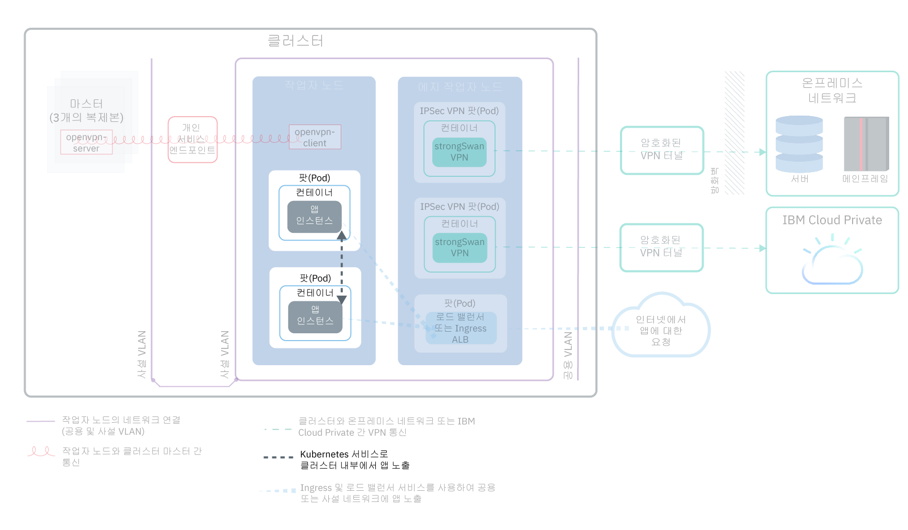
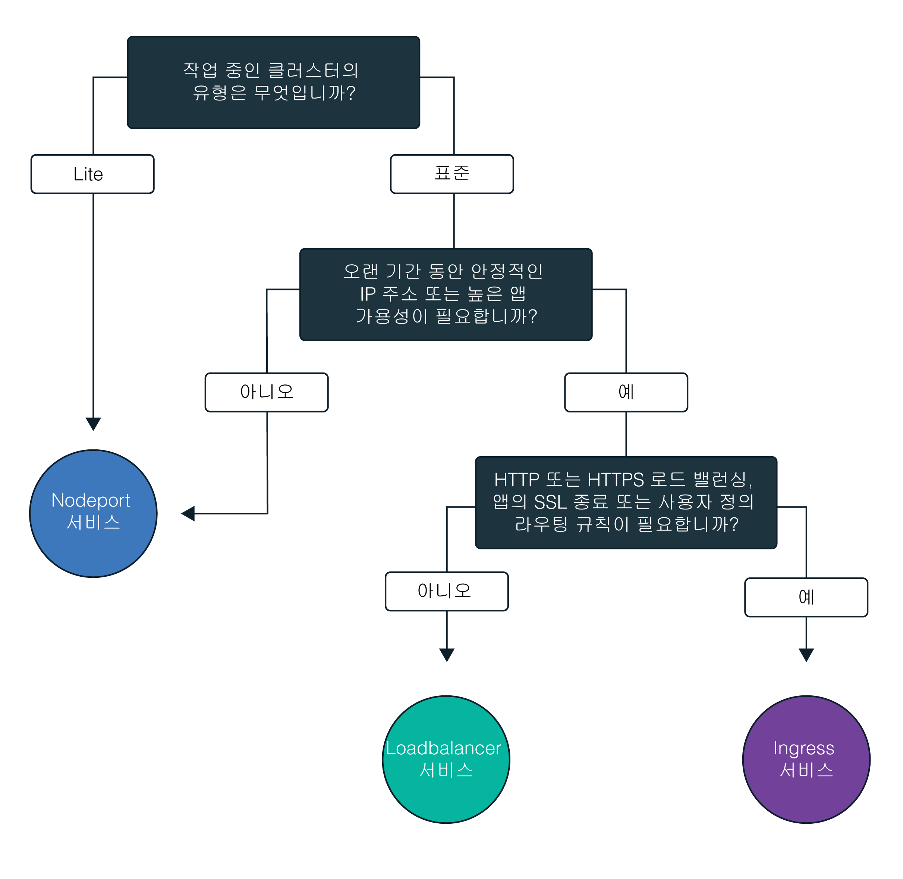
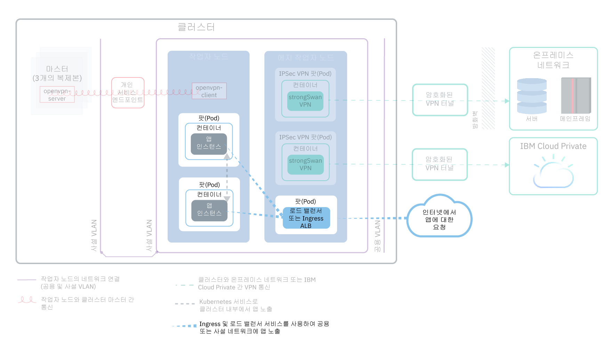
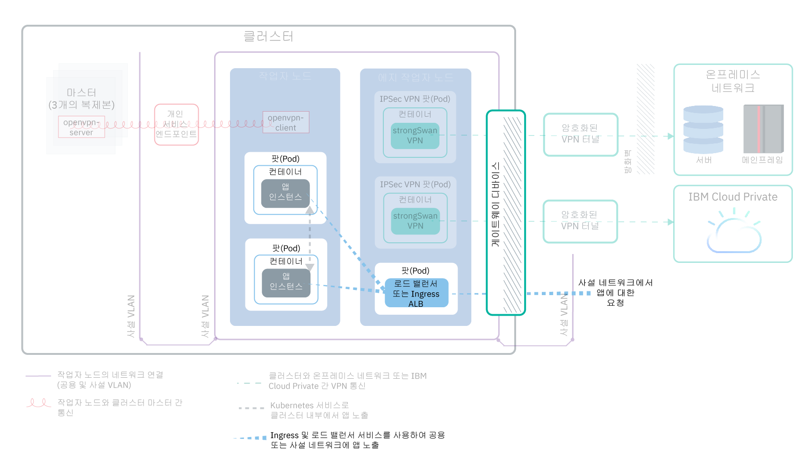

---

copyright:
  years: 2014, 2019
lastupdated: "2019-03-21"

keywords: kubernetes, iks

subcollection: containers

---

{:new_window: target="_blank"}
{:shortdesc: .shortdesc}
{:screen: .screen}
{:pre: .pre}
{:table: .aria-labeledby="caption"}
{:codeblock: .codeblock}
{:tip: .tip}
{:note: .note}
{:important: .important}
{:deprecated: .deprecated}
{:download: .download}

# 클러스터 내부 및 외부 네트워킹에서 앱 노출 계획
{: #cs_network_planning}

{{site.data.keyword.containerlong}}에서 사용자는 앱을 공용 또는 개인용으로 액세스 가능하게 하여 클러스터 내부 및 외부 네트워킹을 관리할 수 있습니다.
{: shortdesc}

이 페이지는 앱에 대한 클러스터 내부 및 외부 네트워킹을 계획하는 데 도움이 됩니다. 네트워킹을 위한 클러스터 설정에 대한 정보는 [클러스터 네트워크 설정](/docs/containers?topic=containers-cs_network_cluster)을 참조하십시오.
{: tip}

## Kubernetes 서비스를 통해 클러스터 내부 트래픽에 앱 노출
{: #in-cluster}

Kubernetes 검색 서비스를 작성하여 팟(Pod) 간의 클러스터 내부 통신을 허용합니다.
{: shortdesc}

<figure>
 
 <figcaption>Kubernetes 서비스로 클러스터 내부에서 앱 노출</figcaption>
</figure>

작업자 노드에 배치된 모든 팟(Pod)에는 172.30.0.0/16 범위의 사설 IP 주소가 지정되며 이는 작업자 노드 간에만 라우팅됩니다. 충돌을 피하려면 사용자의 작업자 노드와 통신하는 노드에서 이 IP 범위를 사용하지 마십시오. 작업자 노드와 팟(Pod)은 사설 IP 주소를 사용하여 사설 네트워크에서 안전하게 통신할 수 있습니다. 그러나 팟(Pod)에 장애가 발생하거나 작업자 노드의 재작성이 필요한 경우에는 새 사설 IP 주소가 지정됩니다.

기본적으로, 고가용성이어야 하는 앱에 대한 사설 IP 주소 변경을 추적하는 것은 어렵습니다. 그 대신에 기본 제공 Kubernetes 서비스 검색 기능을 사용하여 사설 네트워크에서 클러스터 IP 서비스로서 앱을 노출할 수 있습니다. Kubernetes 서비스는 팟(Pod) 세트를 그룹화하며 이러한 팟(Pod)에 대한 네트워크 연결을 제공합니다. 이 연결은 각 팟(Pod)의 실제 사설 IP 주소를 노출하지 않고 클러스터의 기타 서비스에 대한 연결을 제공합니다. 서비스에는 클러스터 내에서만 액세스가 가능한 클러스터 내 IP 주소가 지정됩니다.
* 이전 클러스터: dal13 구역에서 2018년 2월 이전에 또는 기타 구역에서 2017년 10월 이전에 작성된 클러스터에서는 서비스에 10.10.10.0/24 범위의 254 IP 중 하나의 IP가 지정됩니다. 254 서비스의 한계에 도달하여 추가 서비스가 필요하면 새 클러스터를 작성해야 합니다.
* 새 클러스터: dal13 구역에서 2018년 2월 이후에 또는 기타 구역에서 2017년 10월 이후에 작성된 클러스터에서는 서비스에 172.21.0.0/16 범위의 65,000 IP 중 하나의 IP가 지정됩니다.

충돌을 피하려면 사용자의 작업자 노드와 통신하는 노드에서 이 IP 범위를 사용하지 마십시오. 또한 DNS 검색 항목이 서비스에 대해 작성되며 클러스터의 `kube-dns` 컴포넌트에 저장됩니다. DNS 항목에는 서비스의 이름, 서비스가 작성된 네임스페이스 및 지정된 클러스터 내 IP 주소에 대한 링크가 포함되어 있습니다.

클러스터 서비스 뒤의 팟(Pod)에 액세스하기 위해, 앱은 서비스의 클러스터 내 IP 주소를 사용하거나 서비스의 이름을 사용하여 요청을 전송할 수 있습니다. 서비스의 이름을 사용하는 경우, 해당 이름은 `kube-dns` 컴포넌트에서 검색되며 서비스의 클러스터 내 IP 주소로 라우팅됩니다. 요청이 서비스에 도달하는 경우, 서비스는 팟(Pod)의 클러스터 내 IP 주소 및 이들이 배치된 작업자 노드와는 무관하게 요청을 팟(Pod)에 동일하게 전달합니다.

 

## NodePort, LoadBalancer 또는 Ingress 서비스를 선택하여 클러스터 외부 트래픽에 앱 노출
{: #external}

공용 인터넷이나 사설 네트워크에서 외부적으로 앱에 액세스할 수 있도록 하기 위해 {{site.data.keyword.containerlong_notm}}에서는 3개의 네트워킹 서비스를 지원합니다.
{:shortdesc}

**[NodePort 서비스](/docs/containers?topic=containers-nodeport)**(무료 및 표준 클러스터)
* 모든 작업자 노드에서 포트를 노출시키고 작업자 노드의 공인 또는 사설 IP 주소를 사용하여 클러스터의 서비스에 액세스합니다.
* Iptables는 로드 밸런스가 앱의 팟(Pod) 전체에서 요청하는 기능이며, 고성능 네트워크 라우팅과 네트워크 액세스 제어를 제공합니다.
* 작업자 노드의 공인 및 사설 IP 주소는 영구적이지 않습니다. 작업자 노드가 제거되거나 다시 작성되면 새 공인 및 새 사설 IP 주소가 작업자 노드에 지정됩니다.
* NodePort 서비스는 공용 또는 개인용 액세스를 테스트하기에는 최상입니다. 짧은 시간 동안에만 공용 또는 개인용 액세스가 필요한 경우에도 이를 사용할 수 있습니다.

**[LoadBalancer 서비스](/docs/containers?topic=containers-loadbalancer)**(표준 클러스터 전용)
* 모든 표준 클러스터는 앱에 대한 외부 TCP/UDP 로드 밸런서를 작성하는 데 사용할 수 있는 네 개의 포터블 공인 IP 주소 및 네 개의 사설 IP 주소로 프로비저닝됩니다. 앱이 요구하는 포트를 노출함으로써 로드 밸런서를 사용자 정의할 수 있습니다.
* Iptables는 로드 밸런스가 앱의 팟(Pod) 전체에서 요청하는 기능이며, 고성능 네트워크 라우팅과 네트워크 액세스 제어를 제공합니다.
* 로드 밸런서에 지정된 포터블 공인 및 사설 IP 주소는 영구적이며, 클러스터에서 작업자 노드가 다시 작성될 때 변경되지 않습니다.
* 공용 로드 밸런서 IP 주소를 DNS 항목에 등록하는 앱의 호스트 이름을 작성할 수 있습니다. 또한 각 호스트 이름에 대해 로드 밸런서 IP에 대한 상태 검사 모니터를 사용으로 설정할 수도 있습니다.

**[Ingress](/docs/containers?topic=containers-ingress)**(표준 클러스터 전용)
* 하나의 외부 HTTP, HTTPS 또는 TCP 애플리케이션 로드 밸런서(ALB)를 작성하여 클러스터의 다중 앱을 노출합니다. ALB는 안전하고 고유한 공용 또는 사설 시작점, Ingress 하위 도메인을 사용하여 수신 요청을 앱으로 라우팅합니다.
* 하나의 라우트를 사용하여 서비스로서 클러스터의 다중 앱을 노출할 수 있습니다.
* Ingress는 다음 3개의 컴포넌트로 구성되어 있습니다.
  * Ingress 리소스는 앱에 대한 수신 요청을 라우팅하고 로드 밸런싱하는 방법에 대한 규칙을 정의합니다.
  * ALB는 수신 HTTP, HTTPS 또는 TCP 서비스 요청을 청취합니다. Ingress 리소스에 정의한 규칙을 기반으로 앱의 팟(Pod)에서 요청을 전달합니다.
  * 다중 구역 로드 밸런서(MZLB)는 앱에 대한 모든 수신 요청을 처리하며 다양한 구역의 ALB 간에 요청을 로드 밸런싱합니다. 또한 각 구역의 ALB IP 주소에 대한 상태 확인을 사용으로 설정할 수도 있습니다.
* 사용자 정의 라우팅 규칙으로 사용자 고유의 ALB를 구현해야 하고 앱에 대한 SSL 종료가 필요한 경우 Ingress를 사용하십시오.

앱에 대한 최상의 네트워킹 서비스를 선택하려면 다음 의사결정 트리에 따라 시작하기 옵션 중 하나를 클릭할 수 있습니다.

<map name="networking_map" id="networking_map">
<area href="/docs/containers?topic=containers-nodeport" alt="Nodeport 서비스" shape="circle" coords="52, 283, 45"/>
<area href="/docs/containers?topic=containers-loadbalancer" alt="LoadBalancer 서비스" shape="circle" coords="247, 419, 44"/>
<area href="/docs/containers?topic=containers-ingress" alt="Ingress 서비스" shape="circle" coords="445, 420, 45"/>
</map>

{{site.data.keyword.containerlong_notm}}에서 사용 가능한 로드 밸런싱 배치 패턴에 대한 자세한 정보가 필요하십니까? 이 [블로그 게시물 ](https://www.ibm.com/blogs/bluemix/2018/10/ibm-cloud-kubernetes-service-deployment-patterns-for-maximizing-throughput-and-availability/)을 확인하십시오.
{: tip}

 

## 공용 및 사설 VLAN 설정에 대한 공용 외부 네트워킹 계획
{: #public_access}

{{site.data.keyword.containerlong_notm}}에서 Kubernetes 클러스터를 작성하는 경우에는 클러스터를 공용 VLAN에 연결할 수 있습니다. 공용 VLAN은 각 작업자 노드에 지정된 공인 IP 주소를 판별하며, 이는 각 작업자 노드에 공용 네트워크 인터페이스를 제공합니다.
{:shortdesc}

<figure>
 
 <figcaption>기본 네트워킹 설정에서 공용 네트워크에 앱 노출</figcaption>
</figure>

작업자 노드에 대한 공용 네트워크 인터페이스는 클러스터 작성 중에 모든 작업자 노드에서 구성된 [사전 정의된 Calico 네트워크 정책 설정](/docs/containers?topic=containers-network_policies#default_policy)에 의해 보호됩니다.

기본적으로, 모든 아웃바운드 네트워크 트래픽이 모든 작업자 노드에 대해 허용됩니다. 인바운드 네트워크 트래픽은 일부 포트를 제외하면 차단됩니다. 이러한 포트는 IBM이 네트워크 트래픽을 모니터링하고 Kubernetes 마스터에 대한 보안 업데이트를 자동으로 설치할 수 있도록 열려 있으므로 NodePort, LoadBalancer및 Ingress 서비스에 연결을 설정할 수 있습니다. 수정 방법을 포함하여 이러한 정책에 대한 자세한 정보는 [네트워크 정책](/docs/containers?topic=containers-network_policies#network_policies)을 참조하십시오.

인터넷에서 앱을 공용으로 사용할 수 있도록 하기 위해 NodePort, LoadBalancer 또는 Ingress 서비스를 작성할 수 있습니다. 각 서비스를 비교하려면 [NodePort, LoadBalancer 또는 Ingress 서비스 선택](#external)을 참조하십시오.

다음의 다이어그램은 {{site.data.keyword.containerlong_notm}}에서 Kubernetes가 공용 네트워크 트래픽을 전달하는 방법을 보여줍니다.

 

## 공용 및 사설 VLAN 설정에 대한 사설 외부 네트워킹 계획
{: #private_both_vlans}

작업자 노드가 공용 및 사설 VLAN 모두에 연결된 경우, 개인용 NodePort, LoadBalancer 또는 Ingress 서비스를 작성하여 사설 네트워크에서만 앱에 액세스할 수 있도록 할 수 있습니다. 그리고 서비스에 대한 공용 트래픽을 차단하는 Calico 정책을 작성할 수 있습니다.
{: shortdesc}

작업자 노드에 대한 공용 네트워크 인터페이스는 클러스터 작성 중에 모든 작업자 노드에서 구성된 [사전 정의된 Calico 네트워크 정책 설정](/docs/containers?topic=containers-network_policies#default_policy)에 의해 보호됩니다. 기본적으로, 모든 아웃바운드 네트워크 트래픽이 모든 작업자 노드에 대해 허용됩니다. 인바운드 네트워크 트래픽은 일부 포트를 제외하면 차단됩니다. 이러한 포트는 IBM이 네트워크 트래픽을 모니터링하고 Kubernetes 마스터에 대한 보안 업데이트를 자동으로 설치할 수 있도록 열려 있으므로 NodePort, LoadBalancer및 Ingress 서비스에 연결을 설정할 수 있습니다.

사설 네트워크에서만 앱을 노출하려는 경우, 개인용 NodePort, LoadBalancer 또는 Ingress 서비스를 작성할 수 있습니다.

**NodePort**
* [NodePort 서비스를 작성](/docs/containers?topic=containers-nodeport)하십시오. 공인 IP 주소 이외에 작업자 노드의 사설 IP 주소를 통해 NodePort 서비스를 사용할 수 있습니다.
* NodePort 서비스는 작업자 노드의 사설 및 공인 IP 주소 모두에서 작업자 노드의 포트를 엽니다. 사용자는 [Calico preDNAT 네트워크 정책](/docs/containers?topic=containers-network_policies#block_ingress)을 사용하여 공용 NodePort를 차단해야 합니다.

**LoadBalancer**
* [사설 LoadBalancer 서비스를 작성](/docs/containers?topic=containers-loadbalancer)하십시오.
* 포터블 사설 IP 주소를 사용하는 로드 밸런서 서비스에는 여전히 모든 작업자 노드에서 열려 있는 공용 노드 포트가 있습니다. 사용자는 [Calico preDNAT 네트워크 정책](/docs/containers?topic=containers-network_policies#block_ingress)을 사용하여 이의 공용 노드를 차단해야 합니다.

**Ingress**
* 클러스터를 작성하면 하나의 공용 및 사설 Ingress 애플리케이션 로드 밸런서(ALB)가 자동으로 작성됩니다. 기본적으로 공용 ALB는 사용되고 사설 ALB는 사용되지 않으므로, 사용자는 [공용 ALB 사용 안함](/docs/containers?topic=containers-cs_cli_reference#cs_alb_configure) 및 [사설 ALB 사용](/docs/containers?topic=containers-ingress#private_ingress)을 설정해야 합니다.
* 그리고 [사설 Ingress 서비스를 작성](/docs/containers?topic=containers-ingress#ingress_expose_private)하십시오.

기본 Calico 네트워크 정책은 이러한 서비스에 인바운드 공용 트래픽을 허용하므로 대신 Calico 정책을 작성하여 모든 공용 트래픽을 해당 서비스에 차단할 수 있습니다. 예를 들어, NodePort 서비스는 작업자 노드의 사설 및 공인 IP 주소 모두에서 작업자 노드의 포트를 엽니다. 포터블 사설 IP 주소를 가진 로드 밸런서 서비스는 모든 작업자 노드에서 공용 NodePort를 엽니다. 사용자는 공용 NodePort를 차단하는 [Calico preDNAT 네트워크 정책](/docs/containers?topic=containers-network_policies#block_ingress)을 작성해야 합니다.

예를 들어, 사설 로드 밸런서 서비스를 작성했다고 가정합니다. 공용 트래픽이 로드 밸런서에 의해 열린 NodePort에 도달하지 못하도록 차단하는 Calico preDNAT 정책을 작성할 수도 있습니다. 이 사설 로드 밸런서는 다음에 의해 액세스될 수 있습니다.
* 동일한 해당 클러스터의 임의의 팟(Pod)
* 동일한 {{site.data.keyword.Bluemix_notm}} 계정의 임의의 클러스터의 임의의 팟(Pod)
* [VLAN Spanning을 사용으로 설정](/docs/containers?topic=containers-subnets#subnet-routing)한 경우, 동일한 {{site.data.keyword.Bluemix_notm}} 계정의 사설 VLAN에 연결된 시스템
* 사용자가 {{site.data.keyword.Bluemix_notm}} 계정에는 없지만 여전히 회사 방화벽 뒤에 있는 경우, 로드 밸런서 IP가 작동되는 서브넷에 대한 VPN 연결을 통한 시스템
* 사용자가 다른 {{site.data.keyword.Bluemix_notm}} 계정에 있는 경우, 로드 밸런서 IP가 작동되는 서브넷에 대한 VPN 연결을 통한 시스템

 

## 사설 VLAN 전용 설정을 위한 사설 외부 네트워킹 계획
{: #plan_private_vlan}

작업자 노드가 사설 VLAN에만 연결되어 있고 마스터와 작업자 노드를 [게이트웨이 디바이스](/docs/containers?topic=containers-cs_network_ov#cs_network_ov_master_gateway)를 통해 통신할 수 있도록 한 경우 개인용 NodePort, LoadBalancer 또는 Ingress 서비스를 작성하여 사설 네트워크에서만 앱에 액세스할 수 있도록 할 수 있습니다.
{: shortdesc}

<figure>
 
 <figcaption>사설 네트워킹 설정에서 사설 네트워크에 앱 노출</figcaption>
</figure>

작업자 노드가 공용 VLAN에 연결되어 있지 않으므로 공용 트래픽은 이러한 서비스로 라우팅되지 않습니다. 이러한 서비스에 대한 인바운드 트래픽을 허용하도록 사용자는 게이트웨이 디바이스 방화벽의 [필수 포트와 IP 주소 공개](/docs/containers?topic=containers-firewall#firewall_inbound)도 해야 합니다.

**NodePort**:
* [사설 NodePort 서비스를 작성](/docs/containers?topic=containers-nodeport)하십시오. 서비스는 작업자 노드의 사설 IP 주소에서만 사용 가능합니다.
* 사설 방화벽에서 모든 작업자 노드가 트래픽을 허용할 수 있도록 서비스를 사설 IP 주소에 배치할 때 구성한 포트를 여십시오. 포트를 찾으려면 `kubectl get svc`를 실행하십시오. 포트는 20000 - 32000 범위에 있습니다.

**LoadBalancer**
* [사설 LoadBalancer 서비스를 작성](/docs/containers?topic=containers-loadbalancer)하십시오. 클러스터가 사설 VLAN에만 있는 경우 네 개의 사용 가능한 포터블 사설 IP 주소 중 하나가 사용됩니다.
* 사설 방화벽에서 서비스를 로드 밸런스 서비스의 사설 IP 주소에 배치할 때 구성한 포트를 여십시오.

**Ingress**:
* [사설 네트워크에서 사용 가능한 DNS 서비스 ](https://kubernetes.io/docs/tasks/administer-cluster/dns-custom-nameservers/)를 구성해야 합니다.
* 클러스터를 작성하면 사설 Ingress 애플리케이션 로드 밸런서(ALB)가 자동으로 작성되지만, 기본적으로 사용하도록 설정되지는 않습니다. 사용자가 [사설 ALB를 사용하도록 설정](/docs/containers?topic=containers-ingress#private_ingress)해야 합니다.
* 그리고 [사설 Ingress 서비스를 작성](/docs/containers?topic=containers-ingress#ingress_expose_private)하십시오.
* 사설 방화벽에서 사설 ALB의 IP 주소에 대해 포트 80(HTTP의 경우) 또는 포트 443(HTTPS의 경우)을 여십시오.

클러스터가 사설 VLAN에만 연결되어 있고 마스터 및 작업자 노드가 사설 전용 서비스 엔드포인트를 통해 통신할 수 있도록 한 경우에는 앱을 사설 네트워크에 노출할 수 없습니다. 방화벽 역할을 하여 원하지 않는 트래픽을 차단하도록 게이트웨이 디바이스(예: [VRA](/docs/infrastructure/virtual-router-appliance?topic=virtual-router-appliance-about-the-vra) 또는 [FSA](/docs/services/vmwaresolutions/services?topic=vmware-solutions-fsa_considerations))를 설정해야 합니다. 게이트웨이 디바이스를 설정하지 않으려면 공용 및 사설 VLAN에 연결된 [작업자 풀을 작성](/docs/containers?topic=containers-clusters#add_pool)할 수 있습니다. 그런 다음 이러한 작업자 노드를 에지 노드로 레이블 지정하고 Calico 정책을 사용하여 불필요한 모든 공용 트래픽을 차단할 수 있습니다. 자세한 정보는 [에지 작업자 노드에 대한 네트워킹 워크로드 격리](/docs/containers?topic=containers-cs_network_planning#both_vlans_private_edge)를 참조하십시오.
{: note}

 

## 선택사항: 에지 작업자 노드에 대한 네트워킹 워크로드 격리
{: #both_vlans_private_edge}

에지 작업자 노드는 외부에서 적은 수의 작업자 노드에 액세스할 수 있게 하고 네트워크 워크로드를 격리함으로써 클러스터의 보안을 향상시킬 수 있습니다. Ingress 및 로드 밸런서 팟(Pod)이 지정된 작업자 노드에만 배치되도록 보장하려면 [작업자 노드를 에지 노드로서 레이블링](/docs/containers?topic=containers-edge#edge_nodes)하십시오. 또한 기타 워크로드가 에지 노드에서 실행하지 못하도록 방지하려면 [에지 노드를 오염(taint)](/docs/containers?topic=containers-edge#edge_workloads)시키십시오.
{: shortdesc}

클러스터가 공용 VLAN에 연결되어 있지만 에지 작업자 노드에서 공용 NodePorts에 대한 트래픽을 차단하려면 [Calico preDNAT 네트워크 정책](/docs/containers?topic=containers-network_policies#block_ingress)도 사용할 수 있습니다. 노드 포트를 차단하면 에지 작업자 노드가 수신 트래픽을 처리하는 유일한 작업자 노드가 됩니다.

## 선택사항: 사설 네트워크에서 클러스터 격리
{: #isolate}

다중 구역 클러스터, 단일 구역 클러스터용 다중 VLAN 또는 동일한 VLAN의 다중 서브넷이 있는 경우에는 작업자 노드가 사설 네트워크에서 서로 간에 통신할 수 있도록 [VLAN Spanning을 사용으로 설정](/docs/infrastructure/vlans?topic=vlans-vlan-spanning#vlan-spanning)하거나 [VRF를 사용으로 설정](/docs/infrastructure/direct-link?topic=direct-link-overview-of-virtual-routing-and-forwarding-vrf-on-ibm-cloud#customer-vrf-overview)하십시오. 그러나 VLAN Spanning 또는 VRF가 사용으로 설정되면 동일한 IBM Cloud 계정에서 사설 VLAN에 연결된 시스템이 작업자에 액세스할 수 있습니다. [Calico 네트워크 정책](/docs/containers?topic=containers-network_policies#isolate_workers)을 사용하여 사설 네트워크의 기타 시스템으로부터 다중 구역 클러스터를 격리시킬 수 있습니다. 이러한 정책은 사설 방화벽에서 열린 사설 IP 범위 및 포트에 대한 유입 및 유출도 허용합니다.
{: shortdesc}
