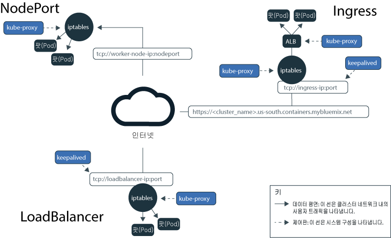

---

copyright:
  years: 2014, 2018
lastupdated: "2018-09-10"

---

{:new_window: target="_blank"}
{:shortdesc: .shortdesc}
{:screen: .screen}
{:pre: .pre}
{:table: .aria-labeledby="caption"}
{:codeblock: .codeblock}
{:tip: .tip}
{:download: .download}

# 외부 네트워킹에서 앱 노출 계획
{: #planning}

{{site.data.keyword.containerlong}}에서 사용자는 앱을 공용 또는 개인용으로 액세스 가능하게 하여 외부 네트워킹을 관리할 수 있습니다.
{: shortdesc}

## NodePort, LoadBalancer 또는 Ingress 서비스 선택
{: #external}

공용 인터넷이나 사설 네트워크에서 외부적으로 앱에 액세스할 수 있도록 하기 위해 {{site.data.keyword.containerlong_notm}}에서는 3개의 네트워킹 서비스를 지원합니다.
{:shortdesc}

**[NodePort 서비스](cs_nodeport.html)**(무료 및 표준 클러스터)
* 모든 작업자 노드에서 포트를 노출시키고 작업자 노드의 공인 또는 사설 IP 주소를 사용하여 클러스터의 서비스에 액세스합니다.
* Iptables는 로드 밸런스가 앱의 팟(Pod) 전체에서 요청하는 기능이며, 고성능 네트워크 라우팅과 네트워크 액세스 제어를 제공합니다.
* 작업자 노드의 공인 및 사설 IP 주소는 영구적이지 않습니다. 작업자 노드가 제거되거나 다시 작성되면 새 공인 및 새 사설 IP 주소가 작업자 노드에 지정됩니다.
* NodePort 서비스는 공용 또는 개인용 액세스를 테스트하기에는 최상입니다. 짧은 시간 동안에만 공용 또는 개인용 액세스가 필요한 경우에도 이를 사용할 수 있습니다.

**[LoadBalancer 서비스](cs_loadbalancer.html)**(표준 클러스터 전용)
* 모든 표준 클러스터는 앱에 대한 외부 TCP/UDP 로드 밸런서를 작성하는 데 사용할 수 있는 네 개의 포터블 공인 IP 주소 및 네 개의 사설 IP 주소로 프로비저닝됩니다.
* Iptables는 로드 밸런스가 앱의 팟(Pod) 전체에서 요청하는 기능이며, 고성능 네트워크 라우팅과 네트워크 액세스 제어를 제공합니다.
* 로드 밸런서에 지정된 포터블 공인 및 사설 IP 주소는 영구적이며, 클러스터에서 작업자 노드가 다시 작성될 때 변경되지 않습니다.
* 앱이 요구하는 포트를 노출함으로써 로드 밸런서를 사용자 정의할 수 있습니다.

**[Ingress](cs_ingress.html)**(표준 클러스터 전용)
* 하나의 외부 HTTP 또는 HTTPS, TCP 또는 UDP 애플리케이션 로드 밸런서(ALB)를 작성하여 클러스터의 다중 앱을 노출합니다. ALB는 안전하고 고유한 공용 또는 사설 시작점을 사용하여 수신 요청을 앱으로 라우팅합니다.
* 하나의 라우트를 사용하여 서비스로서 클러스터의 다중 앱을 노출할 수 있습니다.
* Ingress는 다음 3개의 컴포넌트로 구성되어 있습니다.
  * Ingress 리소스는 앱에 대한 수신 요청을 라우팅하고 로드 밸런싱하는 방법에 대한 규칙을 정의합니다.
  * ALB는 수신 HTTP 또는 HTTPS, TCP 또는 UDP 서비스 요청을 청취합니다. Ingress 리소스에 정의한 규칙을 기반으로 앱의 팟(Pod)에서 요청을 전달합니다.
  * 다중 구역 로드 밸런서(MZLB)는 앱에 대한 모든 수신 요청을 처리하며 다양한 구역의 ALB 간에 요청을 로드 밸런싱합니다.
* 사용자 정의 라우팅 규칙으로 사용자 고유의 ALB를 구현하려고 하고 앱에 대한 SSL 종료가 필요한 경우 Ingress를 사용하십시오.

앱에 대한 최상의 네트워킹 서비스를 선택하려면 다음 의사결정 트리에 따라 시작하기 옵션 중 하나를 클릭할 수 있습니다.

<map name="networking_map" id="networking_map">
<area href="/docs/containers/cs_nodeport.html" alt="Nodeport 서비스" shape="circle" coords="52, 283, 45"/>
<area href="/docs/containers/cs_loadbalancer.html" alt="LoadBalancer 서비스" shape="circle" coords="247, 419, 44"/>
<area href="/docs/containers/cs_ingress.html" alt="Ingress 서비스" shape="circle" coords="445, 420, 45"/>
</map>

 

## 공용 외부 네트워킹 계획
{: #public_access}

{{site.data.keyword.containerlong_notm}}에서 Kubernetes 클러스터를 작성하는 경우에는 클러스터를 공용 VLAN에 연결할 수 있습니다. 공용 VLAN은 각 작업자 노드에 지정된 공인 IP 주소를 판별하며, 이는 각 작업자 노드에 공용 네트워크 인터페이스를 제공합니다.
{:shortdesc}

인터넷에서 앱을 공용으로 사용할 수 있도록 하기 위해 NodePort, LoadBalancer 또는 Ingress 서비스를 작성할 수 있습니다. 각 서비스를 비교하려면 [NodePort, LoadBalancer 또는 Ingress 서비스 선택](#external)을 참조하십시오.

다음의 다이어그램은 {{site.data.keyword.containerlong_notm}}에서 Kubernetes가 공용 네트워크 트래픽을 전달하는 방법을 보여줍니다.

*{{site.data.keyword.containerlong_notm}}의 Kubernetes 데이터 평면*

무료 및 표준 클러스터 모두의 작업자 노드에 대한 공용 네트워크 인터페이스는 Calico 네트워크 정책으로 보호됩니다. 이러한 정책은 기본적으로 대부분의 인바운드 트래픽을 차단합니다. 그러나 NodePort, LoadBalancer 및 Ingress 서비스에 대한 연결과 마찬가지로 Kubernetes가 작동하는 데 필요한 인바운드 트래픽은 허용됩니다. 수정 방법을 포함하여 이러한 정책에 대한 자세한 정보는 [네트워크 정책](cs_network_policy.html#network_policies)을 참조하십시오.

서브넷, 방화벽 및 VPN 관련 정보를 포함하여 네트워킹을 위한 클러스터 설정에 대한 자세한 정보는 [기본 클러스터 네트워킹 계획](cs_network_cluster.html#both_vlans)을 참조하십시오. 

 

## 공용 및 사설 VLAN 설정에 대한 사설 외부 네트워킹 계획
{: #private_both_vlans}

작업자 노드가 공용 및 사설 VLAN 모두에 연결된 경우, 개인용 NodePort, LoadBalancer 또는 Ingress 서비스를 작성하여 사설 네트워크에서만 앱에 액세스할 수 있도록 할 수 있습니다. 그리고 서비스에 대한 공용 트래픽을 차단하는 Calico 정책을 작성할 수 있습니다. 

**NodePort**
* [NodePort 서비스를 작성](cs_nodeport.html)하십시오. 공인 IP 주소 이외에 작업자 노드의 사설 IP 주소를 통해 NodePort 서비스를 사용할 수 있습니다.
* NodePort 서비스는 작업자 노드의 사설 및 공인 IP 주소 모두에서 작업자 노드의 포트를 엽니다. 사용자는 [Calico preDNAT 네트워크 정책](cs_network_policy.html#block_ingress)을 사용하여 공용 NodePort를 차단해야 합니다.

**LoadBalancer**
* [사설 LoadBalancer 서비스를 작성](cs_loadbalancer.html)하십시오.
* 포터블 사설 IP 주소를 사용하는 로드 밸런서 서비스에는 여전히 모든 작업자 노드에서 열려 있는 공용 노드 포트가 있습니다. 사용자는 [Calico preDNAT 네트워크 정책](cs_network_policy.html#block_ingress)을 사용하여 이의 공용 노드를 차단해야 합니다.

**Ingress**
* 클러스터를 작성하면 하나의 공용 및 사설 Ingress 애플리케이션 로드 밸런서(ALB)가 자동으로 작성됩니다. 기본적으로 공용 ALB는 사용되고 사설 ALB는 사용되지 않으므로, 사용자는 [공용 ALB 사용 안함](cs_cli_reference.html#cs_alb_configure) 및 [사설 ALB 사용](cs_ingress.html#private_ingress)을 설정해야 합니다.
* 그리고 [사설 Ingress 서비스를 작성](cs_ingress.html#ingress_expose_private)하십시오.

예를 들어, 개인용 로드 밸런서 서비스를 작성했다고 가정합니다. 공용 트래픽이 로드 밸런서에 의해 열린 NodePort에 도달하지 못하도록 차단하는 Calico preDNAT 정책을 작성할 수도 있습니다. 이 개인용 로드 밸런서는 다음에 의해 액세스될 수 있습니다. 
* 동일한 해당 클러스터의 임의의 팟(Pod)
* 동일한 IBM Cloud 계정의 임의의 클러스터의 임의의 팟(Pod)
* [VLAN Spanning을 사용으로 설정](cs_subnets.html#subnet-routing)한 경우, 동일한 IBM Cloud 계정의 사설 VLAN에 연결된 시스템
* 사용자가 IBM Cloud 클라우드 계정에는 없지만 여전히 회사 방화벽 뒤에 있는 경우, 로드 밸런서 IP가 작동되는 서브넷에 대한 VPN 연결을 통한 시스템 
* 사용자가 다른 IBM Cloud 계정에 있는 경우, 로드 밸런서 IP가 작동되는 서브넷에 대한 VPN 연결을 통한 시스템 

서브넷, 방화벽 및 VPN 관련 정보를 포함하여 네트워킹을 위한 클러스터 설정에 대한 자세한 정보는 [기본 클러스터 네트워킹 계획](cs_network_cluster.html#both_vlans)을 참조하십시오. 

 

## 사설 VLAN 전용 설정을 위한 사설 외부 네트워킹 계획
{: #private_vlan}

작업자 노드가 사설 VLAN에만 연결된 경우, 개인용 NodePort, LoadBalancer 또는 Ingress 서비스를 작성하여 사설 네트워크에서만 앱에 액세스할 수 있도록 할 수 있습니다. 작업자 노드가 공용 VLAN에 연결되어 있지 않으므로 공용 트래픽은 이러한 서비스로 라우팅되지 않습니다.

**NodePort**:
* [사설 NodePort 서비스를 작성](cs_nodeport.html)하십시오. 서비스는 작업자 노드의 사설 IP 주소에서만 사용 가능합니다.
* 사설 방화벽에서 모든 작업자 노드가 트래픽을 허용할 수 있도록 서비스를 사설 IP 주소에 배치할 때 구성한 포트를 여십시오. 포트를 찾으려면 `kubectl get svc`를 실행하십시오. 포트는 20000 - 32000 범위에 있습니다.

**LoadBalancer**
* [사설 LoadBalancer 서비스를 작성](cs_loadbalancer.html)하십시오. 클러스터가 사설 VLAN에만 있는 경우 네 개의 사용 가능한 포터블 사설 IP 주소 중 하나가 사용됩니다.
* 사설 방화벽에서 서비스를 로드 밸런스 서비스의 사설 IP 주소에 배치할 때 구성한 포트를 여십시오.

**Ingress**:
* [사설 네트워크에서 사용 가능한 DNS 서비스 ](https://kubernetes.io/docs/tasks/administer-cluster/dns-custom-nameservers/)를 구성해야 합니다. 
* 클러스터를 작성하면 사설 Ingress 애플리케이션 로드 밸런서(ALB)가 자동으로 작성되지만, 기본적으로 사용하도록 설정되지는 않습니다. 사용자가 [사설 ALB를 사용하도록 설정](cs_ingress.html#private_ingress)해야 합니다.
* 그리고 [사설 Ingress 서비스를 작성](cs_ingress.html#ingress_expose_private)하십시오.
* 사설 방화벽에서 사설 ALB의 IP 주소에 대해 포트 80(HTTP의 경우) 또는 포트 443(HTTPS의 경우)을 여십시오.

서브넷 및 게이트웨이 어플라이언스 관련 정보를 포함하여 네트워킹을 위한 클러스터 설정에 대한 자세한 정보는 [사설 VLAN 전용 설정을 위한 네트워킹 계획](cs_network_cluster.html#private_vlan)을 참조하십시오. 
