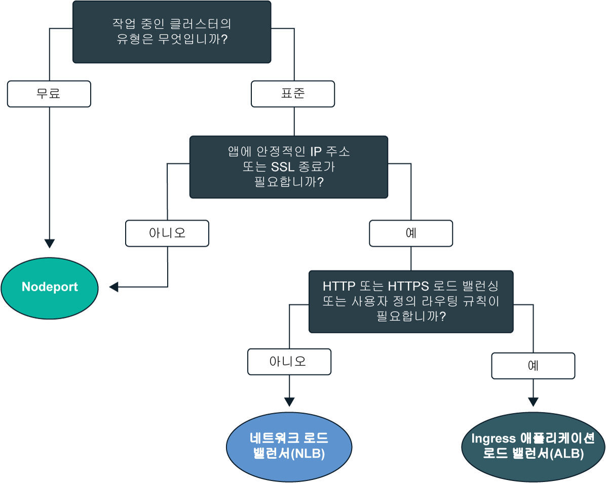
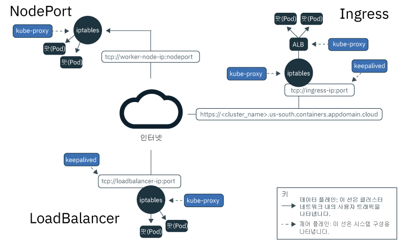
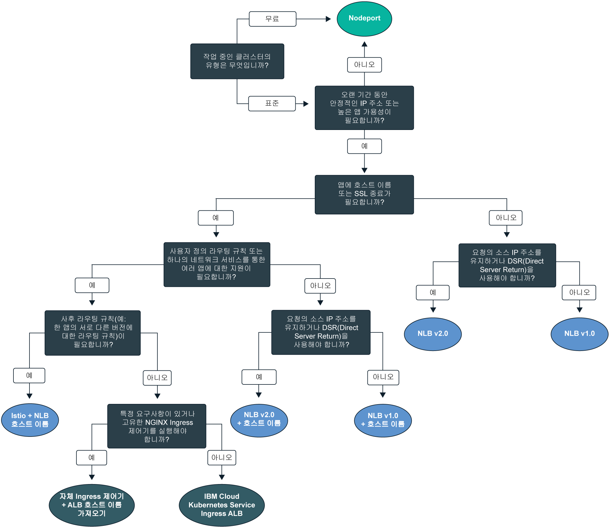

---

copyright:
  years: 2014, 2019
lastupdated: "2019-06-05"

keywords: kubernetes, iks

subcollection: containers

---

{:new_window: target="_blank"}
{:shortdesc: .shortdesc}
{:screen: .screen}
{:pre: .pre}
{:table: .aria-labeledby="caption"}
{:codeblock: .codeblock}
{:tip: .tip}
{:note: .note}
{:important: .important}
{:deprecated: .deprecated}
{:download: .download}
{:preview: .preview}

# 앱의 클러스터 내 네트워킹 및 외부 네트워킹 계획
{: #cs_network_planning}

{{site.data.keyword.containerlong}}에서 사용자는 앱을 공용 또는 개인용으로 액세스 가능하게 하여 클러스터 내부 및 외부 네트워킹을 관리할 수 있습니다.
{: shortdesc}

앱 네트워킹을 빠르게 시작하려면 이 의사결정 트리를 따르고 옵션을 클릭하여 설정 문서를 확인하십시오.

<map name="networking_map" id="networking_map">
<area target="" href="/docs/containers?topic=containers-nodeport" alt="NodePort 서비스" coords="52,254,78,260,93,270,101,285,92,302,72,314,49,318,19,309,0,281,18,263" shape="poly">
<area target="" href="/docs/containers?topic=containers-loadbalancer" alt="네트워크 로드 밸런서(NLB) 서비스" coords="288,405,324,414,348,434,350,455,327,471,295,477,246,471,222,446,237,417" shape="poly">
<area target="" href="/docs/containers?topic=containers-ingress" alt="Ingress 애플리케이션 로드 밸런서(ALB) 서비스" coords="532,405,568,410,593,427,600,448,582,468,554,477,508,476,467,463,454,441,474,419" shape="poly">
</map>

## Kubernetes 서비스 검색을 통해 앱에 대한 로드 밸런싱 이해
{: #in-cluster}

Kubernetes 서비스 검색은 네트워크 서비스 및 로컬 Kubernetes 프록시를 사용하여 앱에 네트워크 연결을 제공합니다.
{: shortdesc}

**서비스** 
작업자 노드에 배치된 모든 팟(Pod)에는 172.30.0.0/16 범위의 사설 IP 주소가 지정되며 이는 작업자 노드 간에만 라우팅됩니다. 충돌을 피하려면 사용자의 작업자 노드와 통신하는 노드에서 이 IP 범위를 사용하지 마십시오. 작업자 노드와 팟(Pod)은 사설 IP 주소를 사용하여 사설 네트워크에서 안전하게 통신할 수 있습니다. 그러나 팟(Pod)에 장애가 발생하거나 작업자 노드의 재작성이 필요한 경우에는 새 사설 IP 주소가 지정됩니다.

고가용성이어야 하는 앱에 대한 사설 IP 주소 변경을 추적하는 대신, 기본 제공 Kubernetes 서비스 검색 기능을 사용하여 IP 서비스로서 앱을 노출할 수 있습니다. Kubernetes 서비스는 팟(Pod) 세트를 그룹화하며 이러한 팟(Pod)에 대한 네트워크 연결을 제공합니다. 서비스는 대상으로 지정된 팟(Pod)을 선택하고 레이블을 통해 트래픽을 라우팅합니다.

서비스는 각 팟(Pod)의 실제 사설 IP 주소를 노출하지 않고 클러스터의 앱 팟(Pod)과 기타 서비스 간의 연결을 제공합니다. 서비스에는 클러스터 내에서만 액세스가 가능한 클러스터 내 IP 주소 `clusterIP`가 지정됩니다. 이 IP 주소는 전체 수명 동안 서비스에 연결되고 서비스가 존재하는 동안 변경되지 않습니다. 
* 새 클러스터: dal13 구역에서 2018년 2월 이후에 또는 기타 구역에서 2017년 10월 이후에 작성된 클러스터에서는 서비스에 172.21.0.0/16 범위의 65,000 IP 중 하나의 IP가 지정됩니다.
* 이전 클러스터: dal13 구역에서 2018년 2월 이전에 또는 기타 구역에서 2017년 10월 이전에 작성된 클러스터에서는 서비스에 10.10.10.0/24 범위의 254 IP 중 하나의 IP가 지정됩니다. 254 서비스의 한계에 도달하여 추가 서비스가 필요하면 새 클러스터를 작성해야 합니다.

충돌을 피하려면 사용자의 작업자 노드와 통신하는 노드에서 이 IP 범위를 사용하지 마십시오. 또한 DNS 검색 항목이 서비스에 대해 작성되며 클러스터의 `kube-dns` 컴포넌트에 저장됩니다. DNS 항목에는 서비스의 이름, 서비스가 작성된 네임스페이스 및 지정된 클러스터 내 IP 주소에 대한 링크가 포함되어 있습니다.

**`kube-proxy`** 
서비스에 맞는 모든 TCP 및 UDP 네트워크 트래픽의 기본 로드 밸런싱을 제공하려면 로컬 Kubernetes 네트워크 프록시인 `kube-proxy`가 `kube-system` 네임스페이스에서 각 작업자 노드마다 디먼으로 실행됩니다. `kube-proxy`는 Linux 커널 기능인 Iptables 규칙을 사용하여 서비스는 팟(Pod)의 클러스터 내 IP 주소 및 이들이 배치된 작업자 노드와는 무관하게 요청을 서비스 뒤의 팟(Pod)에 동일하게 전달합니다.

예를 들어, 클러스터 내부의 앱은 서비스의 클러스터 내 IP를 사용하거나 요청을 서비스의 이름으로 전송하여 클러스터 서비스 뒤의 팟(Pod)에 액세스할 수 있습니다. 서비스의 이름을 사용할 때 `kube-proxy`는 클러스터 DNS 제공자에서 이름을 검색하고 요청을 서비스의 클러스터 내 IP 주소로 라우팅합니다.

내부 클러스터 IP 주소 및 외부 IP 주소를 모두 제공하는 서비스를 사용하는 경우 클러스터 외부의 클라이언트는 요청을 서비스의 외부 공용 또는 사설 IP 주소로 전송할 수 있습니다. `kube-proxy`는 요청을 서비스 뒤의 앱 팟(Pod) 간에 서비스의 클러스터 내 IP 주소에 전달합니다.

다음 이미지는 Kubernetes가 어떻게 {{site.data.keyword.containerlong_notm}}에서 `kube-proxy` 및 NodePort, LoadBalancer 또는 Ingress 서비스를 통해 공용 네트워크 트래픽을 전달하는지 보여줍니다. 

<figure>
 
 <figcaption>How Kubernetes가 {{site.data.keyword.containerlong_notm}}에서 NodePort, LoadBalancer 및 Ingress 서비스를 통해 공용 네트워크 트래픽을 전달하는 방법</figcaption>
</figure>

 

## Kubernetes 서비스 유형 이해
{: #external}

Kubernetes는 네트워크 서비스의 네 가지 기본 유형 즉, `ClusterIP`, `NodePort`, `LoadBalancer` 및 `Ingress`를 지원합니다. `ClusterIP` 서비스는 클러스터에서만 팟(Pod) 간의 클러스터 내부 통신을 허용하도록 앱에 내부적으로 액세스할 수 있도록 합니다. `NodePort`, `LoadBalancer` 및 `Ingress` 서비스는 공용 인터넷 또는 사설 네트워크에서 외부적으로 앱에 액세스할 수 있도록 합니다.
{: shortdesc}

<dl>
<dt>[ClusterIP](https://kubernetes.io/docs/concepts/services-networking/service/#defining-a-service)</dt>
<dd>사설 네트워크에서 클러스터 IP 서비스로서 앱만 노출할 수 있습니다. `clusterIP` 서비스는 클러스터 내에서만 다른 팟(Pod)이 액세스할 수 있는 클러스터 내 IP 주소를 제공합니다. 외부 IP 주소는 앱에 대해 작성되지 않습니다. 클러스터 서비스 뒤의 팟(Pod)에 액세스하기 위해, 클러스터의 기타 앱은 서비스의 클러스터 내 IP 주소를 사용하거나 서비스의 이름을 사용하여 요청을 전송할 수 있습니다. 요청이 서비스에 도달하는 경우, 서비스는 팟(Pod)의 클러스터 내 IP 주소 및 이들이 배치된 작업자 노드와는 무관하게 요청을 팟(Pod)에 동일하게 전달합니다. 서비스의 YAML 구성 파일에서 `type`을 지정하지 않은 경우 기본적으로 `ClusterIP` 유형이 작성되는 점을 유의하십시오.</dd>

<dt>[NodePort](/docs/containers?topic=containers-nodeport)</dt>
<dd>Kubernetes 서비스로 앱을 노출하면 30000 - 32767 범위의 NodePort 및 내부 클러스터 IP 주소가 서비스에 지정됩니다. 클러스터 외부에서 서비스에 액세스하기 위해 작업자 노드의 공용 또는 사설 IP 주소와 <code>&lt;IP_address&gt;:&lt;nodeport&gt;</code> 형식의 NodePort를 사용합니다. 그러나 작업자 노드의 공인 및 사설 IP 주소는 영구적이지 않습니다. 작업자 노드가 제거되거나 다시 작성되면 새 공인 및 새 사설 IP 주소가 작업자 노드에 지정됩니다. NodePort는 짧은 시간에만 공용 또는 개인용 액세스를 테스트하거나 액세스 권한을 제공하는 데 적합합니다.</dd>

<dt>[LoadBalancer(NLB)](/docs/containers?topic=containers-loadbalancer)</dt>
<dd>모든 표준 클러스터는 앱에 대한 계층 4 TCP/UDP 네트워크 로드 밸런서(NLB)를 작성하는 데 사용할 수 있는 네 개의 포터블 공인 IP 주소 및 네 개의 사설 IP 주소로 프로비저닝됩니다. 앱이 요구하는 포트를 노출하여 NLB를 사용자 정의할 수 있습니다. NLB에 지정된 포터블 공인 및 사설 IP 주소는 영구적이며, 클러스터에서 작업자 노드가 다시 작성될 때 변경되지 않습니다. 공용 NLB IP 주소를 DNS 항목에 등록하는 앱의 호스트 이름을 작성할 수 있습니다. 또한 각 호스트 이름에 대해 NLB IP에 대한 상태 검사 모니터를 사용으로 설정할 수도 있습니다.</dd>

<dt>[Ingress(ALB)](/docs/containers?topic=containers-ingress)</dt>
<dd>하나의 계층 7 HTTP, HTTPS 또는 TCP Ingress 애플리케이션 로드 밸런서(ALB)를 작성하여 클러스터의 여러 앱을 노출합니다. ALB는 안전하고 고유한 공용 또는 사설 시작점, Ingress 하위 도메인을 사용하여 수신 요청을 앱으로 라우팅합니다. 하나의 라우트를 사용하여 서비스로서 클러스터의 여러 앱을 노출할 수 있습니다. Ingress는 다음 3개의 컴포넌트로 구성되어 있습니다.<ul>
  <li>Ingress 리소스는 앱에 대한 수신 요청을 라우팅하고 로드 밸런싱하는 방법에 대한 규칙을 정의합니다.</li>
  <li>ALB는 수신 HTTP, HTTPS 또는 TCP 서비스 요청을 청취합니다. Ingress 리소스에 정의한 규칙을 기반으로 앱의 팟(Pod)에서 요청을 전달합니다.</li>
  <li>다중 구역 로드 밸런서(MZLB)는 앱에 대한 모든 수신 요청을 처리하며 다양한 구역의 ALB 간에 요청을 로드 밸런싱합니다. 또한 각 구역의 ALB IP 주소에 대한 상태 검사를 사용으로 설정할 수도 있습니다.</li></ul></dd>
</dl>

 
다음 표는 각 네트워크 서비스 유형의 기능을 비교합니다.

|특성|ClusterIP|NodePort|LoadBalancer(NLB)|Ingress(ALB)|
|---------------|---------|--------|------------|-------|
|무료 클러스터||| | |
|표준 클러스터|||||
|외부적으로 액세스 가능| ||||
|고정 외부 IP| | |||
|외부 호스트 이름| | |||
|SSL 종료| | |||
|HTTP(S) 로드 밸런싱| | | ||
|사용자 정의 라우팅 규칙| | | ||
|서비스당 여러 앱| | | ||
{: caption="Kubernetes 네트워크 서비스 유형의 특성" caption-side="top"}

하나 이상의 네트워크 서비스를 기반으로 한 로드 밸런싱 배치 패턴을 선택하려면 [공용 외부 로드 밸런싱의 배치 패턴 선택](#pattern_public) 또는 [사설 외부 로드 밸런싱의 배치 패턴 선택](#private_access)을 참조하십시오.

 

## 공용 외부 로드 밸런싱 계획
{: #public_access}

인터넷에 공용으로 클러스터의 앱을 노출하십시오.
{: shortdesc}

{{site.data.keyword.containerlong_notm}}에서 Kubernetes 클러스터를 작성하는 경우에는 클러스터를 공용 VLAN에 연결할 수 있습니다. 공용 VLAN은 각 작업자 노드에 지정된 공인 IP 주소를 판별하며, 이는 각 작업자 노드에 공용 네트워크 인터페이스를 제공합니다. 공용 네트워킹 서비스는 공용 IP 주소 및 공용 URL(선택사항)로 앱을 제공하여 이 공용 네트워크 인터페이스에 연결합니다. 앱이 공용으로 노출되면 공용 서비스 IP 주소 또는 사용자 앱에 맞게 설정한 URL을 갖고 있는 사용자는 요청을 앱에 전송할 수 있습니다. 이러한 이유로 가능한면 적은 앱을 노출하십시오. 외부 웹 클라이언트 또는 사용자로의 트래픽을 허용할 준비가 되면 공용으로 앱만 노출하십시오.

작업자 노드에 대한 공용 네트워크 인터페이스는 클러스터 작성 중에 모든 작업자 노드에서 구성된 [사전 정의된 Calico 네트워크 정책 설정](/docs/containers?topic=containers-network_policies#default_policy)에 의해 보호됩니다. 기본적으로, 모든 아웃바운드 네트워크 트래픽이 모든 작업자 노드에 대해 허용됩니다. 인바운드 네트워크 트래픽은 일부 포트를 제외하면 차단됩니다. 이러한 포트는 IBM이 네트워크 트래픽을 모니터링하고 Kubernetes 마스터에 대한 보안 업데이트를 자동으로 설치할 수 있도록 열려 있으므로 NodePort, LoadBalancer및 Ingress 서비스에 연결을 설정할 수 있습니다. 수정 방법을 포함하여 이러한 정책에 대한 자세한 정보는 [네트워크 정책](/docs/containers?topic=containers-network_policies#network_policies)을 참조하십시오.

인터넷에서 앱을 공용으로 사용할 수 있도록 하기 위해 사용자 앱에 적합한 로드 밸런싱 배치 패턴을 선택하여 공용 NodePort, LoadBalancer 또는 Ingress 서비스를 작성하십시오.

### 공용 외부 로드 밸런싱의 배치 패턴 선택
{: #pattern_public}

네트워크 서비스로 앱이 노출되면 배치 패턴에 대한 몇 가지 선택사항이 제공됩니다. 빠르게 시작하려면 의사결정 트리를 따라 배치 패턴을 선택하십시오. 각 배치 패턴, 사용 이유 및 설정 방법에 대한 자세한 정보는 의사결정 트리 뒤에 나오는 테이블을 참조하십시오. 이 배치 패턴이 사용하는 네트워킹 서비스에 대한 기본 정보는 [Kubernetes 서비스 유형 이해](#external)를 참조하십시오.
{: shortdesc}

<figure>
  
  <figcaption>이 의사결정 트리를 사용하여 사용자 앱에 적합한 최적의 네트워킹 배치 패턴을 선택하십시오. 각 배치 패턴에 대한 정보는 다음 표를 참조하십시오.</figcaption>
</figure>

<table summary="이 표는 공용 네트워크 배치 패턴의 이름, 유스 케이스 및 배치 패턴에 대해 왼쪽에서 오른쪽으로 읽습니다.">
<caption>IBM Cloud Kubernetes Service의 공용 네트워크 배치 패턴 특성</caption>
<col width="10%">
<col width="25%">
<col width="25%">
<thead>
<th>이름</th>
<th>로드 밸런싱 메소드</th>
<th>유스 케이스</th>
<th>구현</th>
</thead>
<tbody>
<tr>
<td>NodePort</td>
<td>작업자의 공용 IP 주소에 앱을 노출하는 작업자 노드의 포트</td>
<td>짧은 시간에만 하나의 앱에 대한 공용 액세스를 테스트하거나 액세스를 제공합니다.</td>
<td>[공용 NodePort 서비스를 작성](/docs/containers?topic=containers-nodeport#nodeport_config)하십시오.</td>
</tr><tr>
<td>NLB v1.0(+ 호스트 이름)</td>
<td>IP 주소 또는 호스트 이름을 통해 앱을 노출하는 기본 로드 밸런싱</td>
<td>SSL 종료를 지원하는 IP 주소 또는 호스트 이름을 통해 하나의 앱을 공용으로 빠르게 노출합니다.</td>
<td><ol><li>[단일](/docs/containers?topic=containers-loadbalancer#lb_config) 또는 [다중 구역](/docs/containers?topic=containers-loadbalancer#multi_zone_config) 클러스터에서 공용 네트워크 로드 밸런서(NLB) 1.0을 작성하십시오.</li><li>선택적으로 호스트 이름 및 상태 검사를 [등록](/docs/containers?topic=containers-loadbalancer#loadbalancer_hostname)하십시오.</li></ol></td>
</tr><tr>
<td>NLB v2.0(+ 호스트 이름)</td>
<td>IP 주소 또는 호스트 이름을 통해 앱을 노출하는 DSR 로드 밸런싱</td>
<td>SSL 종료를 지원하는 IP 주소 또는 호스트 이름을 통해 공용으로 높은 레벨의 트래픽을 수신할 수 있는 앱을 노출합니다.</td>
<td><ol><li>[전제조건](/docs/containers?topic=containers-loadbalancer#ipvs_provision)을 완료하십시오.</li><li>[단일](/docs/containers?topic=containers-loadbalancer#ipvs_single_zone_config) 또는 [다중 구역](/docs/containers?topic=containers-loadbalancer#ipvs_multi_zone_config) 클러스터에서 공용 NLB 2.0을 작성합니다.</li><li>선택적으로 호스트 이름 및 상태 검사를 [등록](/docs/containers?topic=containers-loadbalancer#loadbalancer_hostname)하십시오.</li></ol></td>
</tr><tr>
<td>Istio + NLB 호스트 이름</td>
<td>호스트 이름을 통해 앱을 노출하고 Istio 라우팅 규칙을 사용하는 기본 로드 밸런싱</td>
<td>Istio 사후 라우팅 규칙(예: 한 앱 마이크로서비스의 서로 다른 버전에 대한 규칙)을 구현하고 공용 호스트 이름을 사용하여 Istio 관리 앱을 노출합니다.</li></ol></td>
<td><ol><li>[관리 Istio 추가 기능](/docs/containers?topic=containers-istio#istio_install)을 설치하십시오.</li><li>[Istio 서비스 메시](/docs/containers?topic=containers-istio#istio_sidecar)에 앱을 포함하십시오.</li><li>기본 Istio 로드 밸런서를 [호스트 이름](/docs/containers?topic=containers-istio#istio_expose_link)에 등록하십시오.</li></ol></td>
</tr><tr>
<td>Ingress ALB</td>
<td>호스트 이름을 통해 앱을 노출하고 사용자 정의 라우팅 규칙을 사용하는 기본 로드 밸런싱</td>
<td>여러 앱을 위해 사용자 정의 라우팅 규칙 및 SSL 종료를 구현합니다.</td>
<td><ol><li>공용 ALB에 대한 [Ingress 서비스](/docs/containers?topic=containers-ingress#ingress_expose_public)를 작성하십시오.</li><li>[어노테이션](/docs/containers?topic=containers-ingress_annotation)이 포함된 ALB 라우팅 규칙을 사용자 정의하십시오.</li></ol></td>
</tr><tr>
<td>자체 Ingress 제어기 가져오기 + ALB 호스트 이름</td>
<td>IBM 제공 ALB 호스트 이름이 포함된 앱을 노출하고 사용자 정의 라우팅 규칙을 사용하는 사용자 정의 Ingress 제어기가 포함된 HTTP 로드 밸런싱</td>
<td>여러 앱을 위해 사용자 정의 라우팅 규칙 또는 사용자 정의 튜닝에 대한 기타 특정 요구사항을 구현합니다.</td>
<td>[Ingress 제어기를 배치하고 IBM 제공 ALB 호스트 이름을 활용](/docs/containers?topic=containers-ingress#user_managed)하십시오.</td>
</tr>
</tbody>
</table>

계속해서 {{site.data.keyword.containerlong_notm}}에서 사용 가능한 로드 밸런싱 배치 패턴에 대한 자세한 정보가 필요하십니까? 이 [블로그 게시물 ](https://www.ibm.com/blogs/bluemix/2018/10/ibm-cloud-kubernetes-service-deployment-patterns-for-maximizing-throughput-and-availability/)을 확인하십시오.
{: tip}

 

## 사설 외부 로드 밸런싱 계획
{: #private_access}

비공개로 사설 네트워크에만 클러스터의 앱을 노출하십시오.
{: shortdesc}

{{site.data.keyword.containerlong_notm}}의 Kubernetes 클러스터에서 앱을 배치할 때 클러스터로서 동일한 사설 네트워크에 있는 사용자 및 서비스만 앱에 액세스할 수 있도록 설정할 수 있습니다. 사설 로드 밸런싱은 앱을 일반 사용자에게 노출하지 않고 클러스터 외부의 요청에서 앱을 사용할 수 있도록 하는 데 적합합니다. 나중에 공용 네트워크 서비스를 사용하여 앱을 공용으로 노출하기 전에 액세스, 요청 라우팅 및 기타 구성을 테스트하기 위해 사설 로드 밸런싱도 사용할 수 있습니다.

예를 들어, 앱에 대한 사설 NLB를 작성한다고 가정합니다. 이 사설 NLB는 다음에 의해 액세스될 수 있습니다.
* 동일한 해당 클러스터의 임의의 팟(Pod)
* 동일한 {{site.data.keyword.Bluemix_notm}} 계정의 임의의 클러스터의 임의의 팟(Pod)
* [VRF 또는 VLAN Spanning](/docs/containers?topic=containers-subnets#basics_segmentation)이 사용으로 설정된 경우, 동일한 {{site.data.keyword.Bluemix_notm}} 계정에서 사설 VLAN에 연결된 시스템. 
* 사용자가 {{site.data.keyword.Bluemix_notm}} 계정에는 없지만 여전히 회사 방화벽 뒤에 있는 경우, NLB IP가 작동되는 서브넷에 대한 VPN 연결을 통한 시스템
* 사용자가 다른 {{site.data.keyword.Bluemix_notm}} 계정에 있는 경우, NLB IP가 작동되는 서브넷에 대한 VPN 연결을 통한 시스템.

사설 네트워크를 통해서만 앱을 사용할 수 있도록 하려면 클러스터의 VLAN 설정을 기반으로 한 로드 밸런싱 배치 패턴을 선택하십시오.
* [공용 및 사설 VLAN 설정](#private_both_vlans)
* [사설 VLAN 전용 설정](#plan_private_vlan)

### 공용 및 사설 VLAN 설정에서 사설 로드 밸런싱 설정
{: #private_both_vlans}

작업자 노드가 공용 및 사설 VLAN 모두에 연결된 경우, 개인용 NodePort, LoadBalancer 또는 Ingress 서비스를 작성하여 사설 네트워크에서만 앱에 액세스할 수 있도록 설정할 수 있습니다. 그리고 서비스에 대한 공용 트래픽을 차단하는 Calico 정책을 작성할 수 있습니다.
{: shortdesc}

작업자 노드에 대한 공용 네트워크 인터페이스는 클러스터 작성 중에 모든 작업자 노드에서 구성된 [사전 정의된 Calico 네트워크 정책 설정](/docs/containers?topic=containers-network_policies#default_policy)에 의해 보호됩니다. 기본적으로, 모든 아웃바운드 네트워크 트래픽이 모든 작업자 노드에 대해 허용됩니다. 인바운드 네트워크 트래픽은 일부 포트를 제외하면 차단됩니다. 이러한 포트는 IBM이 네트워크 트래픽을 모니터링하고 Kubernetes 마스터에 대한 보안 업데이트를 자동으로 설치할 수 있도록 열려 있으므로 NodePort, LoadBalancer및 Ingress 서비스에 연결을 설정할 수 있습니다.

기본 Calico 네트워크 정책은 이러한 서비스에 인바운드 공용 트래픽을 허용하므로 대신 Calico 정책을 작성하여 모든 공용 트래픽을 해당 서비스에 차단할 수 있습니다. 예를 들어, NodePort 서비스는 작업자 노드의 사설 및 공인 IP 주소 모두에서 작업자 노드의 포트를 엽니다. 포터블 사설 IP 주소를 가진 NLB 서비스는 모든 작업자 노드에서 공용 NodePort를 엽니다. 사용자는 공용 NodePort를 차단하는 [Calico preDNAT 네트워크 정책](/docs/containers?topic=containers-network_policies#block_ingress)을 작성해야 합니다.

사설 네트워킹에 적합한 다음 로드 밸런싱 배치 패턴을 확인하십시오.

|이름|로드 밸런싱 메소드|유스 케이스|구현|
|----|---------------------|--------|--------------|
|NodePort|작업자의 사설 IP 주소에 앱을 노출하는 작업자 노드의 포트|짧은 시간에만 하나의 앱에 대한 개인용 액세스를 테스트하거나 액세스를 제공합니다.|<ol><li>[NodePort 서비스를 작성](/docs/containers?topic=containers-nodeport)하십시오.</li><li>NodePort 서비스는 작업자 노드의 사설 및 공인 IP 주소 모두에서 작업자 노드의 포트를 엽니다. 사용자는 [Calico preDNAT 네트워크 정책](/docs/containers?topic=containers-network_policies#block_ingress)을 사용하여 공용 NodePort에 대한 트래픽을 차단해야 합니다.</li></ol>|
|NLB v1.0|사설 IP 주소를 통해 앱을 노출하는 기본 로드 밸런싱|사설 IP 주소를 통해 하나의 앱을 사설 네트워크에 빠르게 노출합니다.|<ol><li>[사설 NLB 서비스를 작성](/docs/containers?topic=containers-loadbalancer)하십시오.</li><li>포터블 사설 IP 주소를 사용하는 NLB에는 여전히 모든 작업자 노드에서 열려 있는 공용 노드 포트가 있습니다. [Calico preDNAT 네트워크 정책](/docs/containers?topic=containers-network_policies#block_ingress)을 작성하여 공용 NodePort에 대한 트래픽을 차단하십시오.</li></ol>|
|NLB v2.0|사설 IP 주소를 통해 앱을 노출하는 DSR 로드 밸런싱|IP 주소를 통해 사설 네트워크에 높은 레벨의 트래픽을 수신할 수 있는 앱을 노출합니다.|<ol><li>[사설 NLB 서비스를 작성](/docs/containers?topic=containers-loadbalancer)하십시오.</li><li>포터블 사설 IP 주소를 사용하는 NLB에는 여전히 모든 작업자 노드에서 열려 있는 공용 노드 포트가 있습니다. [Calico preDNAT 네트워크 정책](/docs/containers?topic=containers-network_policies#block_ingress)을 작성하여 공용 NodePort에 대한 트래픽을 차단하십시오.</li></ol>|
|Ingress ALB|호스트 이름을 통해 앱을 노출하고 사용자 정의 라우팅 규칙을 사용하는 기본 로드 밸런싱|여러 앱을 위해 사용자 정의 라우팅 규칙 및 SSL 종료를 구현합니다.|<ol><li>[공용 ALB를 사용 안함으로 설정하십시오. ](/docs/containers?topic=containers-cli-plugin-kubernetes-service-cli#cs_alb_configure)</li><li>[사설 ALB를 사용으로 설정하고 Ingress 리소스를 작성](/docs/containers?topic=containers-ingress#ingress_expose_private)하십시오.</li><li>[어노테이션](/docs/containers?topic=containers-ingress_annotation)이 포함된 ALB 라우팅 규칙을 사용자 정의하십시오.</li></ol>|
{: caption="공용 및 사설 VLAN 설정을 위한 네트워크 배치 패턴의 특성" caption-side="top"}

 

### 사설 VLAN 전용 설정을 위한 사설 로드 밸런싱 설정
{: #plan_private_vlan}

작업자 노드가 사설 VLAN에만 연결된 경우, 개인용 NodePort, LoadBalancer 또는 Ingress 서비스를 작성하여 사설 네트워크에서만 앱에 외부로 액세스할 수 있도록 할 수 있습니다.
{: shortdesc}

클러스터가 사설 VLAN에만 연결되어 있고 마스터 및 작업자 노드가 사설 전용 서비스 엔드포인트를 통해 통신할 수 있도록 한 경우에는 앱을 사설 네트워크에 자동으로 노출할 수 없습니다. 방화벽 역할을 하여 트래픽을 차단 또는 허용하도록 게이트웨이 디바이스(예: [VRA(Vyatta)](/docs/infrastructure/virtual-router-appliance?topic=virtual-router-appliance-about-the-vra) 또는 [FSA](/docs/services/vmwaresolutions/services?topic=vmware-solutions-fsa_considerations))를 설정해야 합니다. 작업자 노드가 공용 VLAN에 연결되어 있지 않으므로 공용 트래픽은 NodePort, LoadBalancer 또는 Ingress 서비스로 라우팅되지 않습니다. 그러나 이러한 서비스에 대한 인바운드 트래픽을 허용하도록 게이트웨이 디바이스 방화벽의 필수 포트 및 IP 주소를 공개해야 합니다.

사설 네트워킹에 적합한 다음 로드 밸런싱 배치 패턴을 확인하십시오.

|이름|로드 밸런싱 메소드|유스 케이스|구현|
|----|---------------------|--------|--------------|
|NodePort|작업자의 사설 IP 주소에 앱을 노출하는 작업자 노드의 포트|짧은 시간에만 하나의 앱에 대한 개인용 액세스를 테스트하거나 액세스를 제공합니다.|<ol><li>[NodePort 서비스를 작성](/docs/containers?topic=containers-nodeport)하십시오.</li><li>사설 방화벽에서 모든 작업자 노드가 트래픽을 허용할 수 있도록 서비스를 사설 IP 주소에 배치할 때 구성한 포트를 여십시오. 포트를 찾으려면 `kubectl get svc`를 실행하십시오. 포트는 20000 - 32000 범위에 있습니다.</li></ol>|
|NLB v1.0|사설 IP 주소를 통해 앱을 노출하는 기본 로드 밸런싱|사설 IP 주소를 통해 하나의 앱을 사설 네트워크에 빠르게 노출합니다.|<ol><li>[사설 NLB 서비스를 작성](/docs/containers?topic=containers-loadbalancer)하십시오.</li><li>사설 방화벽에서 서비스를 NLB의 사설 IP 주소에 배치할 때 구성한 포트를 여십시오.</li></ol>|
|NLB v2.0|사설 IP 주소를 통해 앱을 노출하는 DSR 로드 밸런싱|IP 주소를 통해 사설 네트워크에 높은 레벨의 트래픽을 수신할 수 있는 앱을 노출합니다.|<ol><li>[사설 NLB 서비스를 작성](/docs/containers?topic=containers-loadbalancer)하십시오.</li><li>사설 방화벽에서 서비스를 NLB의 사설 IP 주소에 배치할 때 구성한 포트를 여십시오.</li></ol>|
|Ingress ALB|호스트 이름을 통해 앱을 노출하고 사용자 정의 라우팅 규칙을 사용하는 기본 로드 밸런싱|여러 앱을 위해 사용자 정의 라우팅 규칙 및 SSL 종료를 구현합니다.|<ol><li>[사설 네트워크에서 사용 가능한 DNS 서비스 ](https://kubernetes.io/docs/tasks/administer-cluster/dns-custom-nameservers/)를 구성하십시오.</li><li>[사설 ALB를 사용으로 설정하고 Ingress 리소스를 작성](/docs/containers?topic=containers-ingress#private_ingress)하십시오.</li><li>사설 방화벽에서 사설 ALB의 IP 주소에 대해 포트 80(HTTP의 경우) 또는 포트 443(HTTPS의 경우)을 여십시오.</li><li>[어노테이션](/docs/containers?topic=containers-ingress_annotation)이 포함된 ALB 라우팅 규칙을 사용자 정의하십시오.</li></ol>|
{: caption="사설 VLAN 전용 설정을 위한 네트워크 배치 패턴의 특성" caption-side="top"}
