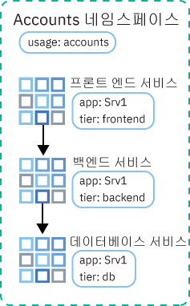
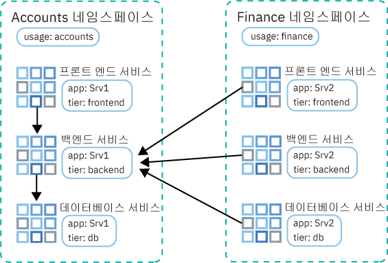

---

copyright:
  years: 2014, 2019
lastupdated: "2019-06-11"

keywords: kubernetes, iks

subcollection: containers

---

{:new_window: target="_blank"}
{:shortdesc: .shortdesc}
{:screen: .screen}
{:pre: .pre}
{:table: .aria-labeledby="caption"}
{:codeblock: .codeblock}
{:tip: .tip}
{:note: .note}
{:important: .important}
{:deprecated: .deprecated}
{:download: .download}
{:preview: .preview}


# 네트워크 정책을 사용한 트래픽 제어
{: #network_policies}

모든 Kubernetes 클러스터는 Calico라는 네트워크 플러그인으로 설정됩니다. {{site.data.keyword.containerlong}}에서 모든 작업자 노드의 공용 네트워크 인터페이스 보안을 위해 기본 네트워크 정책이 설정됩니다.
{: shortdesc}

고유한 보안 요구사항이 있는 경우 또는 VLAN Spanning이 사용으로 설정된 다중 구역 클러스터가 있는 경우에는 Calico 및 Kubernetes를 사용하여 클러스터에 대한 네트워크 정책을 작성할 수 있습니다. Kubernetes 네트워크 정책을 사용하면 클러스터 내의 팟(Pod)에 대해 허용하거나 차단할 네트워크 트래픽을 지정할 수 있습니다. 네트워크 로드 밸런서(NLB)에 대한 인바운드(Ingress) 트래픽 차단과 같은 고급 네트워크 정책을 설정하려면 Calico 네트워크 정책을 사용하십시오.

<ul>
  <li>
  [Kubernetes 네트워크 정책 ](https://kubernetes.io/docs/concepts/services-networking/network-policies/): 이러한 정책은 팟(Pod)이 다른 팟(Pod) 및 외부 엔드포인트와 통신할 수 있는 방법을 지정합니다. Kubernetes 버전 1.8부터 프로토콜, 포트 및 소스 또는 대상 IP 주소에 따라 수신 및 발신 네트워크 트래픽을 모두 허용하거나 차단할 수 있습니다. 팟(Pod) 및 네임스페이스 레이블에 따라 트래픽을 필터링할 수도 있습니다. `kubectl` 명령 또는 Kubernetes API를 사용하여 Kubernetes 네트워크 정책을 적용할 수 있습니다. 이러한 정책이 적용되면 자동으로 Calico 네트워크 정책으로 변환되고 Calico가 해당 정책을 적용합니다.
  </li>
  <li>
  [Calico 네트워크 정책 ](https://docs.projectcalico.org/v3.3/getting-started/bare-metal/policy/): 이러한 정책은 Kubernetes 네트워크 정책의 수퍼세트이며 `calicoctl` 명령을 사용하여 적용됩니다. Calico 정책은 다음 기능을 추가합니다.
    <ul>
    <li>Kubernetes 팟(Pod) 소스 또는 대상 IP 주소나 CIDR에 관계없이 특정 네트워크 인터페이스의 네트워크 트래픽을 허용하거나 차단합니다.</li>
    <li>네임스페이스 간에 팟(Pod)에 대한 네트워크 트래픽을 허용하거나 차단합니다.</li>
    <li>[Kubernetes LoadBalancer 또는 NodePort 서비스에 대한 인바운드(Ingress) 트래픽을 차단](#block_ingress)합니다.</li>
    </ul>
  </li>
  </ul>

Calico는 Kubernetes 작업자 노드에서 Linux Iptables 규칙을 설정하여 자동으로 Calico 정책으로 변환된 Kubernetes 네트워크 정책을 포함하여 이러한 정책을 적용합니다. Iptables 규칙은 대상으로 지정된 리소스에 전달되도록 네트워크 트래픽이 충족해야 하는 특성을 정의하기 위해
작업자 노드에 대한 방화벽의 역할을 합니다.

네트워크 로드 밸런서(NLB) 및 Ingress 애플리케이션 로드 밸런서(ALB) 서비스를 사용하려면 Calico 및 Kubernetes 정책을 사용하여 클러스터 내부 또는 외부로의 네트워크 트래픽을 관리하십시오. IBM Cloud 인프라(SoftLayer) [보안 그룹](/docs/infrastructure/security-groups?topic=security-groups-about-ibm-security-groups#about-ibm-security-groups)은 사용하지 마십시오. IBM Cloud 인프라(SoftLayer) 보안 그룹은 하이퍼바이저 레벨에서 트래픽을 필터링하기 위해 단일 가상 서버의 네트워크 인터페이스에 적용됩니다. 그러나 보안 그룹은 ALB 및 NLB IP 주소의 관리를 위해 {{site.data.keyword.containerlong_notm}}에서 사용하는 VRRP 프로토콜을 지원하지 않습니다. IP의 관리를 위한 VRRP 프로토콜이 존재하지 않으면, ALB 및 NLB 서비스가 제대로 작동하지 않습니다.
{: tip}

<br />


## 기본 Calico 및 Kubernetes 네트워크 정책
{: #default_policy}

공용 VLAN을 사용하는 클러스터가 작성될 때 각 작업자 노드 및 해당 공용 네트워크 인터페이스에 대해 레이블이 `ibm.role: worker_public`인 `HostEndpoint` 리소스가 자동으로 작성됩니다. 작업자 노드의 공용 네트워크 인터페이스를 보호하기 위해 레이블이 `ibm.role: worker_public`인 호스트 엔드포인트에 기본 Calico 정책이 적용됩니다.
{:shortdesc}

이러한 기본 Calico 호스트 정책은 모든 아웃바운드 네트워크 트래픽을 허용하고 Kubernetes NodePort, LoadBalancer 및 Ingress 서비스와 같은 특정 클러스터 컴포넌트에 대한 인바운드 트래픽을 허용합니다. 인터넷으로부터 기본 정책에 지정되지 않은 작업자 노드로의 기타 모든 인바운드 네트워크 트래픽은 차단됩니다. 기본 정책은 팟(Pod) 간 트래픽에는 영향을 미치지 않습니다.

자동으로 클러스터에 적용되는 다음과 같은 기본 Calico 호스트 정책을 검토하십시오.

정책을 완전히 이해하지 못하는 경우에는 호스트 엔드포인트에 적용된 정책을 제거하지 마십시오. 정책에서 허용되는 트래픽이 필요하지 않은지 확인하십시오.
{: important}

 <table summary="표에서 첫 번째 행은 두 열 모두에 걸쳐 있습니다. 나머지 행은 왼쪽에서 오른쪽 방향으로 읽어야 하며, 서버 구역은 1열에 있고 일치시킬 IP 주소는 2열에 있습니다.">
 <caption>각 클러스터의 기본 Calico 호스트 정책</caption>
  <thead>
  <th colspan=2> 각 클러스터의 기본 Calico 호스트 정책</th>
  </thead>
  <tbody>
    <tr>
      <td><code>allow-all-outbound</code></td>
      <td>아웃바운드 트래픽을 모두 허용합니다.</td>
    </tr>
    <tr>
      <td><code>allow-bigfix-port</code></td>
      <td>BigFix 앱에 대한 포트 52311의 수신 트래픽이 필요한 작업자 노드 업데이트를 허용하도록 합니다.</td>
    </tr>
    <tr>
      <td><code>allow-icmp</code></td>
      <td>수신 ICMP 패킷(ping)을 허용합니다.</td>
     </tr>
    <tr>
      <td><code>allow-node-port-dnat</code></td>
      <td>해당 서비스가 노출되는 팟(Pod)에 대한 수신 네트워크 로드 밸런서(NLB), Ingress 애플리케이션 로드 밸런서(ALB) 및 NodePort 서비스 트래픽을 허용합니다. <strong>참고</strong>: Kubernetes는 대상 네트워크 주소 변환(DNAT)을 사용하여 서비스 요청을 올바른 팟(Pod)에 전달하므로 노출된 포트를 지정할 필요가 없습니다. 해당 전달은 호스트 엔드포인트 정책이 Iptables에서 적용되기 전에 이루어집니다.</td>
   </tr>
   <tr>
      <td><code>allow-sys-mgmt</code></td>
      <td>작업자 노드를 관리하는 데 사용되는 특정 IBM Cloud 인프라(SoftLayer) 시스템에 대한 수신 연결을 허용합니다.</td>
   </tr>
   <tr>
    <td><code>allow-vrrp</code></td>
    <td>가상 IP 주소를 모니터링하고 작업자 노드 간에 이동하는 데 사용되는 VRRP 패킷을 허용합니다.</td>
   </tr>
  </tbody>
</table>

Kubernetes 대시보드에 대한 액세스를 제한하는 기본 Kubernetes 정책도 작성됩니다. Kubernetes 정책은 호스트 엔드포인트에 적용되지 않지만 대신 `kube-dashboard` 팟(Pod)에 적용됩니다. 이 정책은 사설 VLAN에만 연결된 클러스터와 공용 및 사설 VLAN에 연결된 클러스터에 적용됩니다.

<table>
<caption>각 클러스터의 기본 Kubernetes 정책</caption>
<thead>
<th colspan=2> 각 클러스터의 기본 Kubernetes 정책</th>
</thead>
<tbody>
 <tr>
  <td><code>kubernetes-dashboard</code></td>
  <td><code>kube-system</code> 네임스페이스에 제공됨: Kubernetes 대시보드에 액세스하지 못하도록 모든 팟(Pod)을 차단합니다. 이 정책은 {{site.data.keyword.Bluemix_notm}} 콘솔에서 또는 <code>kubectl proxy</code>를 사용하여 대시보드에 액세스하는 데는 영향을 주지 않습니다. 팟(Pod)에 대시보드에 대한 액세스 권한이 필요한 경우 <code>kubernetes-dashboard-policy: allow</code> 레이블이 있는 네임스페이스에 팟(Pod)을 배치하십시오.</td>
 </tr>
</tbody>
</table>

<br />


## Calico CLI 설치 및 구성
{: #cli_install}

Calico 정책을 확인, 관리 및 추가하려면 Calico CLI를 설치하여 구성하십시오.
{:shortdesc}

1. [계정에 로그인하십시오. 해당되는 경우, 적절한 리소스 그룹을 대상으로 지정하십시오. 클러스터의 컨텍스트를 설정하십시오.](/docs/containers?topic=containers-cs_cli_install#cs_cli_configure) `--admin` 및 `--network` 옵션을 `ibmcloud ks cluster-config` 명령에 포함하십시오. `--admin`은 인프라 포트폴리오에 액세스하고 작업자 노드에서 Calico 명령을 실행하기 위한 키를 다운로드합니다. `--network`는 모든 Calico 명령을 실행하기 위한 Calico 구성 파일을 다운로드합니다.

  ```
  ibmcloud ks cluster-config --cluster <cluster_name_or_ID> --admin --network
  ```
  {: pre}

3. OS X 및 Linux 사용자의 경우, 다음 단계를 완료하십시오.
    1. `/etc/calico` 디렉토리를 작성하십시오.
        ```
        sudo mkdir /etc/calico
        ```
        {: pre}

    2. 이전에 다운로드한 Calico 구성 파일을 이 디렉토리로 이동하십시오.
        ```
        sudo mv /Users/<user>/.bluemix/plugins/container-service/clusters/<cluster_name>-admin/calicoctl.cfg /etc/calico
        ```
        {: pre}

4. [Calico CLI를 다운로드 ](https://github.com/projectcalico/calicoctl/releases)하십시오.

    OS X를 사용하는 경우 `-darwin-amd64` 버전을 다운로드하십시오. Windows를 사용하는 경우 {{site.data.keyword.Bluemix_notm}} CLI와 동일한 디렉토리에 Calico CLI를 설치하십시오. 이 설정을 사용하면 나중에 명령을 실행할 때 일부 파일 경로 변경이 필요하지 않습니다. 반드시 `calicoctl.exe`로 파일을 저장하십시오.
    {: tip}

5. OS X 및 Linux 사용자의 경우, 다음 단계를 완료하십시오.
    1. 실행 파일을 _/usr/local/bin_ 디렉토리로 이동하십시오.
        - Linux:

          ```
          mv filepath/calicoctl /usr/local/bin/calicoctl
          ```
          {: pre}

        - OS X:

          ```
          mv filepath/calicoctl-darwin-amd64 /usr/local/bin/calicoctl
          ```
          {: pre}

    2. 파일을 실행 파일로 설정하십시오.

        ```
        chmod +x /usr/local/bin/calicoctl
        ```
        {: pre}

6. 회사 네트워크 정책으로 인해 프록시 또는 방화벽을 사용하여 로컬 시스템에서 공용 엔드포인트에 액세스하지 못하는 경우 [Calico 명령에 대한 TCP 액세스를 허용](/docs/containers?topic=containers-firewall#firewall)하십시오.

7. Calico 구성이 올바르게 작동하고 있는지 확인하십시오.

    - Linux 및 OS X:

      ```
      calicoctl get nodes
      ```
      {: pre}

    - Windows: `--config` 플래그를 사용하여, 1단계에서 얻은 네트워크 구성 파일을 대상으로 지정하십시오. `calicoctl` 명령을 실행할 때마다 이 플래그를 포함하십시오.

      ```
      calicoctl get nodes --config=filepath/calicoctl.cfg
      ```
      {: pre}

      출력:

      ```
      NAME
      kube-dal10-crc21191ee3997497ca90c8173bbdaf560-w1.cloud.ibm
      kube-dal10-crc21191ee3997497ca90c8173bbdaf560-w2.cloud.ibm
      kube-dal10-crc21191ee3997497ca90c8173bbdaf560-w3.cloud.ibm
      ```
      {: screen}

<br />


## 네트워크 정책 보기
{: #view_policies}

클러스터에 적용되는 기본 및 추가된 네트워크 정책에 대한 세부사항을 보십시오.
{:shortdesc}

시작하기 전에:
1. [Calico CLI를 설치 및 구성](#cli_install)하십시오.
2. [계정에 로그인하십시오. 해당되는 경우, 적절한 리소스 그룹을 대상으로 지정하십시오. 클러스터의 컨텍스트를 설정하십시오.](/docs/containers?topic=containers-cs_cli_install#cs_cli_configure) `--admin` 및 `--network` 옵션을 `ibmcloud ks cluster-config` 명령에 포함하십시오. `--admin`은 인프라 포트폴리오에 액세스하고 작업자 노드에서 Calico 명령을 실행하기 위한 키를 다운로드합니다. `--network`는 모든 Calico 명령을 실행하기 위한 Calico 구성 파일을 다운로드합니다.

  ```
  ibmcloud ks cluster-config --cluster <cluster_name_or_ID> --admin --network
  ```
  {: pre}

**클러스터에서 네트워크 정책을 보려면 다음을 수행하십시오**.

Linux 및 Mac 사용자는 `--config=filepath/calicoctl.cfg` 플래그를 `calicoctl` 명령에 포함할 필요가 없습니다.
{: tip}

1. Calico 호스트 엔드포인트를 보십시오.

    ```
    calicoctl get hostendpoint -o yaml --config=filepath/calicoctl.cfg
    ```
    {: pre}

2. 클러스터에 작성된 모든 Calico 및 Kubernetes 네트워크 정책을 보십시오. 이 목록에는 팟(Pod) 또는 호스트에 아직 적용되지 않았을 수 있는 정책이 포함됩니다. 네트워크 정책이 적용되려면 Calico 네트워크 정책에 정의된 선택기와 일치하는 Kubernetes 리소스를 찾아야 합니다.

    [네트워크 정책 ](https://docs.projectcalico.org/v3.3/reference/calicoctl/resources/networkpolicy)의 범위는 특정 네임스페이스로 지정됩니다.
    ```
    calicoctl get NetworkPolicy --all-namespaces -o wide --config=filepath/calicoctl.cfg
    ```
    {:pre}

    [글로벌 네트워크 정책 ](https://docs.projectcalico.org/v3.3/reference/calicoctl/resources/globalnetworkpolicy)의 범위는 특정 네임스페이스로 지정되지 않습니다.
    ```
    calicoctl get GlobalNetworkPolicy -o wide --config=filepath/calicoctl.cfg
    ```
    {: pre}

3. 네트워크 정책의 세부사항을 보십시오.

    ```
    calicoctl get NetworkPolicy -o yaml <policy_name> --namespace <policy_namespace> --config=filepath/calicoctl.cfg
    ```
    {: pre}

4. 클러스터에 대한 모든 글로벌 네트워크 정책의 세부사항을 보십시오.

    ```
    calicoctl get GlobalNetworkPolicy -o yaml --config=filepath/calicoctl.cfg
    ```
    {: pre}

<br />


## 네트워크 정책 추가
{: #adding_network_policies}

대부분의 경우, 기본 정책은 변경할 필요가 없습니다. 고급 시나리오에만 변경사항이 필요할 수 있습니다. 변경해야 하는 경우 사용자 고유의 네트워크 정책을 작성할 수 있습니다.
{:shortdesc}

Kubernetes 네트워크 정책을 작성하려면 [Kubernetes 네트워크 정책 문서 ](https://kubernetes.io/docs/concepts/services-networking/network-policies/)를 참조하십시오.

Calico 정책을 작성하려면 다음 단계를 사용하십시오.

1. [Calico CLI를 설치 및 구성](#cli_install)하십시오.
2. [계정에 로그인하십시오. 해당되는 경우, 적절한 리소스 그룹을 대상으로 지정하십시오. 클러스터의 컨텍스트를 설정하십시오.](/docs/containers?topic=containers-cs_cli_install#cs_cli_configure) `--admin` 및 `--network` 옵션을 `ibmcloud ks cluster-config` 명령에 포함하십시오. `--admin`은 인프라 포트폴리오에 액세스하고 작업자 노드에서 Calico 명령을 실행하기 위한 키를 다운로드합니다. `--network`는 모든 Calico 명령을 실행하기 위한 Calico 구성 파일을 다운로드합니다.

  ```
  ibmcloud ks cluster-config --cluster <cluster_name_or_ID> --admin --network
  ```
  {: pre}

3. Calico v3 정책 구문을 사용한 구성 스크립트(`.yaml`)를 작성하여 Calico [네트워크 정책 ](https://docs.projectcalico.org/v3.3/reference/calicoctl/resources/networkpolicy) 또는 [글로벌 네트워크 정책 ](https://docs.projectcalico.org/v3.3/reference/calicoctl/resources/globalnetworkpolicy)을 정의하십시오. 이러한 구성 파일에는 이러한 정책이 적용되는 팟(Pod), 네임스페이스 또는 호스트를 설명하는 선택기가 포함됩니다. 사용자 공유 정책을 작성하려면 이러한 [샘플 Calico 정책 ](http://docs.projectcalico.org/v3.3/getting-started/kubernetes/tutorials/advanced-policy)을 참조하십시오.

4. 클러스터에 정책을 적용하십시오.
    - Linux 및 OS X:

      ```
      calicoctl apply -f policy.yaml
      ```
      {: pre}

    - Windows:

      ```
      calicoctl apply -f filepath/policy.yaml --config=filepath/calicoctl.cfg
      ```
      {: pre}

<br />


## NLB 또는 NodePort 서비스에 대한 인바운드 트래픽 제어
{: #block_ingress}

[기본적으로](#default_policy) Kubernetes NodePort 및 LoadBalancer 서비스는 앱을 모든 공용 및 사설 클러스터 인터페이스에서 사용 가능하게 하도록 디자인되었습니다. 그러나 사용자는 Calico 정책을 사용하여 트래픽 소스 또는 대상을 기반으로 서비스에 대한 수신 트래픽을 차단할 수 있습니다.
{:shortdesc}

해당 서비스에 대해 생성된 DNAT Iptables 규칙으로 인해, 기본 Kubernetes 및 Calico 정책을 Kubernetes NodePort 및 LoadBalancer 서비스의 보호에 적용하기는 어렵습니다. 그러나 Kubernetes가 일반 DNAT를 사용하여 트래픽을 팟(Pod)에 전달하기 전에 Iptables 규칙을 생성하고 적용하기 때문에 Pre-DNAT 정책은 특정 트래픽이 앱에 도달하지 못하도록 차단합니다.

Calico Pre-DNAT 네트워크 정책의 몇 가지 일반적인 사용법은 다음과 같습니다.

  - 사설 네트워크 로드 밸런서(NLB) 서비스의 공용 노트 포트에 대한 트래픽 차단: NLB 서비스는 NLB IP 주소 및 포트를 통해 앱을 사용할 수 있도록 하고, 서비스의 노드 포트를 통해 앱을 사용할 수 있도록 합니다. 클러스터 내의 모든 노드에 대한 모든 IP 주소(공인 및 사설)에서 노드 포트에 액세스할 수 있습니다.
  - [에지 작업자 노드](/docs/containers?topic=containers-edge#edge)에서 실행되는 클러스터의 공용 노드 포트에 대한 트래픽 차단: 노드 포트를 차단하면 에지 작업자 노드가 수신 트래픽을 처리하는 유일한 작업자 노드가 됩니다.
  - 특정 소스 IP 주소 또는 CIDR로부터의 트래픽을 차단(블랙리스트 지정)
  - 특정 소스 IP 주소 또는 CIDR로부터의 트래픽만 허용(화이트리스트 지정)하고 다른 모든 트래픽을 차단

소스 IP 주소를 화이트리스트 또는 블랙리스트에 추가하는 방법을 보려면 [Calico 네트워크 정책을 사용하여 트래픽 차단 튜토리얼](/docs/containers?topic=containers-policy_tutorial#policy_tutorial)을 참고하십시오. 클러스터와의 양방향 트래픽을 제어하는 추가적인 예제 Calico 네트워크 정책을 보려면 [스타 정책 데모 ](https://docs.projectcalico.org/v3.3/getting-started/kubernetes/tutorials/stars-policy/) 및 [고급 네트워크 정책 ](https://docs.projectcalico.org/v3.3/getting-started/kubernetes/tutorials/advanced-policy)을 체크아웃할 수 있습니다.
{: tip}

시작하기 전에:
1. [Calico CLI를 설치 및 구성](#cli_install)하십시오.
2. [계정에 로그인하십시오. 해당되는 경우, 적절한 리소스 그룹을 대상으로 지정하십시오. 클러스터의 컨텍스트를 설정하십시오.](/docs/containers?topic=containers-cs_cli_install#cs_cli_configure) `--admin` 및 `--network` 옵션을 `ibmcloud ks cluster-config` 명령에 포함하십시오. `--admin`은 인프라 포트폴리오에 액세스하고 작업자 노드에서 Calico 명령을 실행하기 위한 키를 다운로드합니다. `--network`는 모든 Calico 명령을 실행하기 위한 Calico 구성 파일을 다운로드합니다.

  ```
  ibmcloud ks cluster-config --cluster <cluster_name_or_ID> --admin --network
  ```
  {: pre}

Pre-DNAT 정책을 작성하려면 다음을 수행하십시오.

1. Ingress(수신 트래픽)의 Kubernetes 서비스 액세스에 대한 Calico Pre-DNAT 네트워크 정책을 정의하십시오.
    * [Calico v3 정책 구문 ](https://docs.projectcalico.org/v3.3/reference/calicoctl/resources/networkpolicy)을 사용하십시오.
    * [NLB 2.0](/docs/containers?topic=containers-loadbalancer#planning_ipvs)에 대한 트래픽을 관리하는 경우, 정책의 `spec` 섹션에 `applyOnForward: true` 및 `doNotTrack: true` 필드를 포함해야 합니다.

        모든 노드 포트를 차단하는 리소스 예:

        ```
        apiVersion: projectcalico.org/v3
        kind: GlobalNetworkPolicy
        metadata:
          name: deny-nodeports
        spec:
          applyOnForward: true
          preDNAT: true
          ingress:
          - action: Deny
            destination:
              ports:
              - 30000:32767
            protocol: TCP
            source: {}
          - action: Deny
            destination:
              ports:
              - 30000:32767
        protocol: UDP
        source: {}
      selector: ibm.role=='worker_public'
      order: 1100
      types:
          - Ingress
        ```
        {: codeblock}

        지정된 소스 CIDR의 트래픽만 NLB 2.0에 화이트리스트로 추가하는 예제 리소스:

        ```
apiVersion: projectcalico.org/v3
    kind: GlobalNetworkPolicy
    metadata:
      name: whitelist
    spec:
      applyOnForward: true
      doNotTrack: true
      ingress:
          - action: Allow
        destination:
          nets:
              - <loadbalancer_IP>/32
          ports:
              - 80
        protocol: TCP
        source:
          nets:
              - <client_address>/32
      selector: ibm.role=='worker_public'
      order: 500
      types:
          - Ingress
        ```
        {: codeblock}

        지정된 소스 CIDR의 트래픽만 NLB 1.0에 화이트리스트로 추가하는 예제 리소스:

        ```
        apiVersion: projectcalico.org/v3
        kind: GlobalNetworkPolicy
        metadata:
          name: whitelist
        spec:
          applyOnForward: true
          preDNAT: true
          ingress:
          - action: Allow
        destination:
          nets:
              - <loadbalancer_IP>/32
          ports:
              - 80
        protocol: TCP
        source:
          nets:
              - <client_address>/32
      selector: ibm.role=='worker_public'
      order: 500
      types:
          - Ingress
        ```
        {: codeblock}

2. Calico preDNAT 네트워크 정책을 적용하십시오. 클러스터 전체에 정책 변경사항을 적용하는 데 약 1분이 걸립니다.

  - Linux 및 OS X:

    ```
    calicoctl apply -f deny-nodeports.yaml
    ```
    {: pre}

  - Windows:

    ```
    calicoctl apply -f filepath/deny-nodeports.yaml --config=filepath/calicoctl.cfg
    ```
    {: pre}

3. 선택사항: 다중 구역 클러스터에서 다중 구역 로드 밸런서(MZLB) 상태 검사는 클러스터의 각 구역에서 Ingress 애플리케이션 로드 밸런서(ALB)를 검사하며, 이러한 상태 검사를 기반으로 DNS 검색 결과가 지속적으로 업데이트되도록 합니다. 사전-DNAT 정책을 사용하여 Ingress 서비스에 대한 모든 수신 트래픽을 차단하는 경우, ALB의 상태 검사에 사용되는 [Cloudflare의 IPv4 IP ](https://www.cloudflare.com/ips/) 역시 화이트리스트에 추가해야 합니다. 이러한 IP를 화이트리스트에 추가하기 위한 Calico 사전-DNAT 정책의 작성 방법에 대한 단계를 알아보려면 [Calico 네트워크 정책 튜토리얼](/docs/containers?topic=containers-policy_tutorial#lesson3)의 학습 3을 참조하십시오.

## 사설 네트워크의 클러스터 격리
{: #isolate_workers}

다중 구역 클러스터, 단일 구역 클러스터를 위한 다중 VLAN, 또는 동일한 VLAN의 다중 서브넷이 있는 경우에는 작업자 노드가 사설 네트워크에서 서로 통신할 수 있도록 VRF 또는 VLAN Spanning을 사용으로 설정해야 합니다. 그러나 VRF 또는 VLAN Spanning이 사용으로 설정되면 동일한 {{site.data.keyword.Bluemix_notm}} 계정에서 사설 VLAN에 연결된 모든 시스템이 작업자와 통신할 수 있습니다.
{: shortdesc}

[Calico 사설 네트워크 정책 ](https://github.com/IBM-Cloud/kube-samples/tree/master/calico-policies/private-network-isolation)을 적용하여 사설 네트워크의 기타 시스템으로부터 클러스터를 격리시킬 수 있습니다. 이 Calico 정책 세트와 호스트 엔드포인트는 계정의 사설 네트워크에 있는 다른 리소스로부터 클러스터의 사설 네트워크 트래픽을 격리시킵니다. 

정책의 대상은 작업자 노드 사설 인터페이스(eth0) 및 클러스터의 팟(Pod) 네트워크입니다.

**작업자 노드**

* 사설 인터페이스 유출은 팟(Pod) IP, 이 클러스터의 작업자, DNS 액세스를 위한 UPD/TCP 포트 53, NFS 파일 서버와의 통신을 위한 포트 2049, 블록 스토리지와의 통신을 위한 포트 443 및 3260에만 허용됩니다.
* 사설 인터페이스 유입은 클러스터의 작업자에서만, 그리고 DNS, kubelet, ICMP 및 VRRP로만 허용됩니다.

**팟(Pod)**

* 팟(Pod)으로의 모든 유입은 클러스터의 작업에서 허용됩니다.
* 팟(Pod)에서의 유출은 공인 IP, DNS, kubelet, 그리고 클러스터의 기타 팟(Pod)으로만 제한됩니다.

시작하기 전에:
1. [Calico CLI를 설치 및 구성](#cli_install)하십시오.
2. [계정에 로그인하십시오. 해당되는 경우, 적절한 리소스 그룹을 대상으로 지정하십시오. 클러스터의 컨텍스트를 설정하십시오.](/docs/containers?topic=containers-cs_cli_install#cs_cli_configure) `--admin` 및 `--network` 옵션을 `ibmcloud ks cluster-config` 명령에 포함하십시오. `--admin`은 인프라 포트폴리오에 액세스하고 작업자 노드에서 Calico 명령을 실행하기 위한 키를 다운로드합니다. `--network`는 모든 Calico 명령을 실행하기 위한 Calico 구성 파일을 다운로드합니다.

  ```
  ibmcloud ks cluster-config --cluster <cluster_name_or_ID> --admin --network
  ```
  {: pre}

Calico 정책을 사용하여 사설 네트워크에서 클러스터를 분리하려면 다음을 수행하십시오.

1. `IBM-Cloud/kube-samples` 저장소를 복제하십시오.
    ```
    git clone https://github.com/IBM-Cloud/kube-samples.git
    ```
    {: pre}

2. 클러스터 버전이 호환 가능한 Calico 버전의 개인용 정책 디렉토리로 이동하십시오.
   ```
      cd <filepath>/IBM-Cloud/kube-samples/calico-policies/private-network-isolation/calico-v3
   ```
   {: pre}

3. 개인용 호스트 엔드포인트에 대한 정책을 설정하십시오.
    1. `generic-privatehostendpoint.yaml` 정책을 여십시오.
    2. `<worker_name>`을 작업자 노드의 이름으로 대체하십시오. **중요**: 일부 작업자 노드는 Calico 정책에 대해 다른 이름 지정 구조를 따라야 합니다. 다음 명령에서 리턴하는 형식으로 작업자 노드 이름을 사용해야 합니다.
      ```
      calicoctl get nodes --config==filepath/calicoctl.cfg
      ```
      {: pre}
    3. `<worker-node-private-ip>`를 작업자 노드의 사설 IP 주소로 대체하십시오. 작업자 노드의 사설 IP를 보려면 `ibmcloud ks workers --cluster <my_cluster>`를 실행하십시오.
    4. 클러스터의 각 작업자 노드의 새 섹션에서 이 단계 세트를 반복하십시오. **참고**: 클러스터에 작업자 노드를 추가할 때마다 호스트 엔드포인트 파일을 새 항목으로 업데이트해야 합니다.

4. 클러스터에 모든 정책을 적용하십시오.
    - Linux 및 OS X:

      ```
      calicoctl apply -f allow-all-workers-private.yaml
      calicoctl apply -f allow-ibm-ports-private.yaml
      calicoctl apply -f allow-egress-pods.yaml
      calicoctl apply -f allow-icmp-private.yaml
      calicoctl apply -f allow-vrrp-private.yaml
      calicoctl apply -f generic-privatehostendpoint.yaml
      ```
      {: pre}

    - Windows:

      ```
      calicoctl apply -f allow-all-workers-private.yaml --config=filepath/calicoctl.cfg
      calicoctl apply -f allow-ibm-ports-private.yaml --config=filepath/calicoctl.cfg
      calicoctl apply -f allow-egress-pods.yaml --config=filepath/calicoctl.cfg
      calicoctl apply -f allow-icmp-private.yaml --config=filepath/calicoctl.cfg
      calicoctl apply -f allow-vrrp-private.yaml --config=filepath/calicoctl.cfg
      calicoctl apply -f generic-privatehostendpoint.yaml --config=filepath/calicoctl.cfg
      ```
      {: pre}

## 팟(Pod) 간의 트래픽 제어
{: #isolate_services}

Kubernetes 정책은 내부 네트워크 트래픽으로부터 팟(Pod)을 보호합니다. 네임스페이스 내에서 서로 간에 또는 네임스페이스 간에 앱 마이크로서비스를 격리하기 위한 단순 Kubernetes 네트워크 정책을 작성할 수 있습니다.
{: shortdesc}

Kubernetes 네트워크 정책이 팟(Pod) 간의 트래픽을 제어하는 방법에 대한 자세한 정보와 추가적인 정책 예제를 보려면 [Kubernetes 문서 ](https://kubernetes.io/docs/concepts/services-networking/network-policies/)를 참조하십시오.
{: tip}

### 네임스페이스 내의 앱 서비스 격리
{: #services_one_ns}

다음 시나리오에서는 하나의 네임스페이스 내에서 앱 마이크로서비스 간에 트래픽을 관리하는 방법을 보여줍니다.

Accounts 팀은 하나의 네임스페이스에 여러 앱 서비스를 배치하지만, 공용 네트워크를 통해 마이크로서비스 간에 필요한 통신만 허용하려면 격리가 필요합니다. 앱 `Srv1`의 경우, 팀에는 프론트 엔드, 백엔드 및 데이터베이스 서비스가 있습니다. 이들은 각 서비스의 레이블을 `app: Srv1` 레이블 및 `tier: frontend`, `tier: backend` 또는 `tier: db` 레이블로 지정합니다.



Accounts 팀은 프론트 엔드에서 백엔드로의 트래픽과 백엔드에서 데이터베이스로의 트래픽을 허용하고자 합니다. 이들은 자체 네트워크 정책의 레이블을 사용하여 마이크로서비스 간에 허용되는 트래픽 플로우를 지정합니다.

우선 이들은 프론트 엔드에서 백엔드로의 트래픽을 허용하는 Kubernetes 네트워크 정책을 작성합니다.

```
kind: NetworkPolicy
apiVersion: networking.k8s.io/v1
metadata:
  name: backend-allow
spec:
  podSelector:
    matchLabels:
      app: Srv1
      tier: backend
  ingress:
  - from:
    - podSelector:
        matchLabels:
          app: Srv1
          Tier: frontend
```
{: codeblock}

`spec.podSelector.matchLabels` 섹션에는 Srv1 백엔드 서비스에 대한 레이블이 나열되므로, 정책은 오직 해당 팟(Pod)_에만_ 적용됩니다. `spec.ingress.from.podSelector.matchLabels` 섹션에는 Srv1 프론트 엔드 서비스에 대한 레이블이 나열되므로, ingress는 오직 해당 팟(Pod)_에서만_ 허용됩니다.

그리고 이들은 백엔드에서 데이터베이스로의 트래픽을 허용하는 유사한 Kubernetes 네트워크 정책을 작성합니다.

```
kind: NetworkPolicy
apiVersion: networking.k8s.io/v1
metadata:
  name: db-allow
spec:
  podSelector:
    matchLabels:
      app: Srv1
      tier: db
  ingress:
  - from:
    - podSelector:
        matchLabels:
          app: Srv1
          Tier: backend
  ```
  {: codeblock}

`spec.podSelector.matchLabels` 섹션에는 Srv1 데이터베이스 서비스에 대한 레이블이 나열되므로, 정책은 오직 해당 팟(Pod)_에만_ 적용됩니다. `spec.ingress.from.podSelector.matchLabels` 섹션에는 Srv1 백엔드 서비스에 대한 레이블이 나열되므로, ingress는 오직 해당 팟(Pod)_에서만_ 허용됩니다.

트래픽은 이제 프론트 엔드에서 백엔드로, 그리고 백엔드에서 데이터베이스로 이동할 수 있습니다. 데이터베이스는 백엔드에 응답할 수 있으며 백엔드는 프론트엔드에 응답할 수 있지만, 역방향 트래픽 연결은 설정될 수 없습니다.

### 네임스페이스 간의 앱 서비스 격리
{: #services_across_ns}

다음 시나리오에서는 다중 네임스페이스에서 앱 마이크로서비스 간에 트래픽을 관리하는 방법을 보여줍니다.

다른 하위 팀이 소유하는 서비스에서 통신이 필요하지만, 해당 서비스는 동일한 클러스터 내의 서로 다른 네임스페이스에 배치되어 있습니다. Accounts 팀은 Accounts 네임스페이스의 앱 Srv1에 대해 프론트 엔드, 백엔드 및 데이터베이스 서비스를 배치합니다. Finance 팀은 Finance 네임스페이스의 앱 Srv2에 대해 프론트 엔드, 백엔드 및 데이터베이스 서비스를 배치합니다. 두 팀은 모두 각 서비스의 레이블을 `app: Srv1` 또는 `app: Srv2` 레이블과 `tier: frontend`, `tier: backend` 또는 `tier: db` 레이블로 지정합니다. 또한 이들은 `usage: accounts` 또는 `usage: finance` 레이블로 네임스페이스의 레이블을 지정합니다.



Finance 팀의 Srv2는 Accounts 팀의 Srv1 백엔드에서 정보를 호출해야 합니다. 따라서 Accounts 팀은 Finance 네임스페이스로부터 Accounts 네임스페이스의 Srv1 백엔드로의 모든 트래픽을 허용하는 레이블을 사용하는 Kubernetes 네트워크 정책을 작성합니다. 또한 팀에서는 해당 포트를 통한 액세스만 격리하기 위해 포트 3111도 지정합니다.

```
kind: NetworkPolicy
apiVersion: networking.k8s.io/v1
metadata:
  Namespace: accounts
  name: accounts-allow
spec:
  podSelector:
    matchLabels:
      app: Srv1
      Tier: backend
  ingress:
  - from:
    - NamespaceSelector:
        matchLabels:
          usage: finance
      ports:
        port: 3111
```
{: codeblock}

`spec.podSelector.matchLabels` 섹션에는 Srv1 백엔드 서비스에 대한 레이블이 나열되므로, 정책은 오직 해당 팟(Pod)_에만_ 적용됩니다. ingress가 해당 네임스페이스의 서비스_에서만_ 허용될 수 있도록 `spec.ingress.from.NamespaceSelector.matchLabels` 섹션에는 Finance 네임스페이스에 대한 레이블이 나열되어 있습니다.

이제 트래픽은 finance 마이크로서비스에서 accounts Srv1 백엔드로 이동할 수 있습니다. accounts Srv1 백엔드는 finance 마이크로서비스에 응답할 수 있지만 역방향 트래픽 연결은 설정할 수 없습니다.

이 예제에서는 Finance 네임스페이스의 모든 마이크로서비스에서의 모든 트래픽이 허용됩니다. `podSelector` 및 `namespaceSelector`를 결합할 수 없으므로 사용자는 다른 네임스페이스의 특정 앱 팟(Pod)에서의 트래픽을 허용할 수 없습니다.

<br />


## 거부된 트래픽 로깅
{: #log_denied}

클러스터의 특정 팟(Pod)에 대해 거부된 트래픽 요청을 로깅하기 위해 Calico 로그 네트워크 정책을 작성할 수 있습니다.
{: shortdesc}

트래픽을 앱 팟(Pod)으로 제한하도록 네트워크 정책을 설정하는 경우, 이러한 정책에서 허용하지 않는 트래픽 요청은 거부되고 삭제됩니다. 일부 시나리오에서 사용자는 거부된 트래픽 요청에 대한 자세한 정보를 원할 수 있습니다. 예를 들어, 사용자는 네트워크 정책 중 하나에 의해 지속적으로 거부되는 일부 비정상적인 트래픽을 발견할 수 있습니다. 잠재적인 보안 위협을 모니터링하기 위해, 사용자는 정책이 지정된 앱 팟(Pod)에 대해 시도된 조치를 거부할 때마다 기록하도록 로깅을 설정할 수 있습니다.

이 절에서는 Kubernetes 네트워크 정책으로 거부되는 트래픽을 로깅하는 방법을 보여줍니다. Calico 네트워크 정책으로 거부되는 트래픽을 로깅하려면 [학습 5의 Calico 네트워크 정책 튜토리얼](/docs/containers?topic=containers-policy_tutorial#lesson5)을 참조하십시오.
{: tip}

시작하기 전에:
1. [Calico CLI를 설치 및 구성](#cli_install)하십시오.
2. [클러스터에 Kubernetes CLI를 대상으로 지정](/docs/containers?topic=containers-cs_cli_install#cs_cli_configure)하십시오. `--admin` 옵션을 `ibmcloud ks cluster-config` 명령에 포함하십시오. 이는 인증서 및 권한 파일을 다운로드하는 데 사용됩니다. 이 다운로드에는 인프라 포트폴리오에 액세스하고 작업자 노드에서 Calico 명령을 실행하기 위한 키도 포함됩니다.
    ```
    ibmcloud ks cluster-config --cluster <cluster_name> --admin
    ```
    {: pre}

거부된 트래픽을 로깅하려면 다음을 수행하십시오.

1. 수신 트래픽을 차단하거나 제한하는 기존 Kubernetes 네트워크 정책을 작성하거나 사용하십시오.
  1. Kubernetes 네트워크 정책을 작성하십시오. 예를 들어, 팟(Pod) 간의 트래픽을 제어하기 위해 NGINX 앱에 대한 액세스를 제한하는 이름이 `access-nginx`인 다음의 예제 Kubernetes 정책을 사용할 수 있습니다. "run=nginx"로 레이블 지정된 팟(Pod)에 대한 수신 트래픽은 "run=access" 레이블이 있는 팟(Pod)에서만 허용됩니다. "run=nginx" 앱 팟(Pod)으로의 기타 모든 수신 트래픽은 차단됩니다.
    ```
    kind: NetworkPolicy
    apiVersion: networking.k8s.io/v1
    metadata:
      name: access-nginx
    spec:
      podSelector:
        matchLabels:
          run: nginx
      ingress:
        - from:
          - podSelector:
              matchLabels:
                run: access
    ```
    {: codeblock}

  2. 정책을 적용하십시오.
    ```
        kubectl apply -f <policy_name>.yaml
    ```
    {: pre}

  3.         Calico가 Iptables 규칙으로서 적용할 수 있도록 Kubernetes 정책은 Calico NetworkPolicy으로 자동 변환됩니다. 자동 작성된 Calico 정책의 구문을 검토하고 `spec.selector` 필드의 값을 복사하십시오.
    ```
    calicoctl get policy -o yaml <policy_name> --config=<filepath>/calicoctl.cfg
    ```
    {: pre}

    예를 들어, Kubernetes 정책이 적용되고 Calico NetworkPolicy로 변환된 후 `access-nginx` 정책의 Calico v3 구문은 다음과 같습니다. `spec.selector` 필드의 값은 `projectcalico.org/orchestrator == 'k8s' && run == 'nginx'`입니다.
    ```
    apiVersion: projectcalico.org/v3
    kind: NetworkPolicy
    metadata:
      name: access-nginx
    spec:
      ingress:
      - action: Allow
        destination: {}
        source:
          selector: projectcalico.org/orchestrator == 'k8s' && run == 'access'
      order: 1000
      selector: projectcalico.org/orchestrator == 'k8s' && run == 'nginx'
      types:
      - Ingress
    ```
    {: screen}

2. 이전 단계에서 작성한 Calico 정책에 의해 거부된 모든 트래픽을 로깅하려면 이름이 `log-denied-packets`인 Calico NetworkPolicy를 작성하십시오. 예를 들어, 로그 정책은 이 정책을 Calico Iptables 규칙 체인에 추가하는 1단계에서 설명한 예제 `access-nginx` Kubernetes 정책과 동일한 팟(Pod) 선택기를 사용합니다. 보다 높은 순서 번호(예: `3000`)를 사용하여 이 규칙이 Iptables 규칙 체인의 끝에 추가되도록 보장할 수 있습니다. `access-nginx` 정책 규칙과 일치하는 `run=access` 레이블 지정된 팟(Pod)의 요청 패킷은 `run=nginx` 레이블 지정된 팟(Pod)에 의해 허용됩니다. 그러나 기타 소스의 패킷이 낮은 순서 `access-nginx` 정책 규칙과의 일치를 시도하는 경우 이는 거부됩니다. 그리고 해당 패킷은 높은 순서 `log-denied-packets` 정책 규칙과의 일치를 시도합니다. 이에 도달하는 패킷을 `log-denied-packets`에서 로깅하므로, `run=nginx` 레이블 지정된 팟(Pod)에 의해 거부된 패킷만 로깅됩니다. 패킷의 시도가 로깅된 후에는 패킷이 삭제됩니다.
  ```
  apiVersion: projectcalico.org/v3
  kind: NetworkPolicy
  metadata:
    name: log-denied-packets
  spec:
    types:
    - Ingress
    ingress:
    - action: Log
      destination: {}
      source: {}
    selector: projectcalico.org/orchestrator == 'k8s' && run == 'nginx'
    order: 3000
  ```
  {: codeblock}

  <table>
  <caption>로그 정책 YAML 컴포넌트 이해</caption>
  <thead>
  <th colspan=2> 로그 정책 YAML 컴포넌트 이해</th>
  </thead>
  <tbody>
  <tr>
   <td><code>types</code></td>
   <td>이 <code>Ingress</code> 정책은 모든 수신 트래픽 요청에 적용됩니다. <code>Ingress</code> 값은 모든 수신 트래픽에 대한 일반 용어이며, IBM Ingress ALB에서만의 트래픽을 의미하지 않습니다.</td>
  </tr>
   <tr>
    <td><code>ingress</code></td>
    <td><ul><li><code>action</code>: <code>Log</code> 조치는 이 정책과 일치하는 요청에 대한 로그 항목을 작업자 노드의 `/var/log/syslog` 경로에 씁니다.</li><li><code>destination</code>: <code>selector</code>가 이 정책을 특정 레이블의 모든 팟(Pod)에 적용하므로 대상은 지정되지 않습니다.</li><li><code>source</code>: 이 정책은 임의의 소스의 요청에 적용됩니다.</li></ul></td>
   </tr>
   <tr>
    <td><code>selector</code></td>
    <td>&lt;selector&gt;를 1단계에서 사용한 `spec.selector` 필드의 동일한 선택기로 대체하십시오. 예를 들어, 선택기 <code>selector: projectcalico.org/orchestrator == 'k8s' && run == 'nginx'</code>를 사용하면 이 정책의 규칙이 1단계의 <code>access-nginx</code> 샘플 Kubernetes 네트워크 정책 규칙과 동일한 Iptables 체인에 추가됩니다. 이 정책은 동일한 선택기 레이블을 사용하는 팟(Pod)에 대한 수신 네트워크 트래픽에만 적용됩니다.</td>
   </tr>
   <tr>
    <td><code>order</code></td>
    <td>Calico 정책에는 수신 요청 패킷에 적용되는 시점을 판별하는 순서가 있습니다. 낮은 순서(예: <code>1000</code>)의 정책이 우선 적용됩니다. 높은 순서의 정책은 낮은 순서 정책 이후에 적용됩니다. 예를 들어, 매우 높은 순서(예: <code>3000</code>)의 정책은 사실상 낮은 순서 정책이 모두 적용된 후에 마지막으로 적용됩니다.</br></br>수신 요청 패킷은 Iptables 규칙 체인을 거치며 우선 낮은 순서 정책의 규칙을 일치시키려고 시도합니다. 패킷이 규칙과 일치하면 패킷이 허용됩니다. 그러나 패킷이 어떤 규칙과도 일치하지 않으면 이는 최상위 순서의 Iptables 규칙 체인의 마지막 규칙에 도달합니다. 해당 정책이 체인의 마지막 정책이 되도록 하려면, 1단계에서 작성한 정책보다 훨씬 높은 순서(예: <code>3000</code>)를 사용하십시오.</td>
   </tr>
  </tbody>
  </table>

3. 정책을 적용하십시오.
  ```
    calicoctl apply -f log-denied-packets.yaml --config=<filepath>/calicoctl.cfg
  ```
  {: pre}

4. 1단계에서 작성한 정책에서 허용되지 않는 요청을 전송하여 로그 항목을 생성하십시오. 예를 들어, 허용되지 않는 팟(Pod) 또는 IP 주소에서 네트워크 정책으로 보호되는 팟(Pod)의 ping을 실행하십시오.

5. `/var/log/syslog` 경로에 작성된 로그 항목을 확인하십시오. 로그 항목의 DST(대상) 또는 SRC(소스) IP 주소는 프록시, NAT(Network Address Translation) 및 기타 네트워킹 프로세스로 인해 예상과는 다를 수 있습니다. 로그 항목이 다음과 유사하게 나타납니다.
  ```
  Sep 5 14:34:40 <worker_hostname> kernel: [158271.044316] calico-packet: IN=eth1 OUT= MAC=08:00:27:d5:4e:57:0a:00:27:00:00:00:08:00 SRC=192.XXX.XX.X DST=192.XXX.XX.XX LEN=60 TOS=0x00 PREC=0x00 TTL=64 ID=52866 DF PROTO=TCP SPT=42962 DPT=22 WINDOW=29200 RES=0x00 SYN URGP=0
  ```
  {: screen}

6. 선택사항: 외부 syslog 서버로 `/var/log/syslog`의 [로그를 전달](/docs/containers?topic=containers-health#configuring)하십시오.
