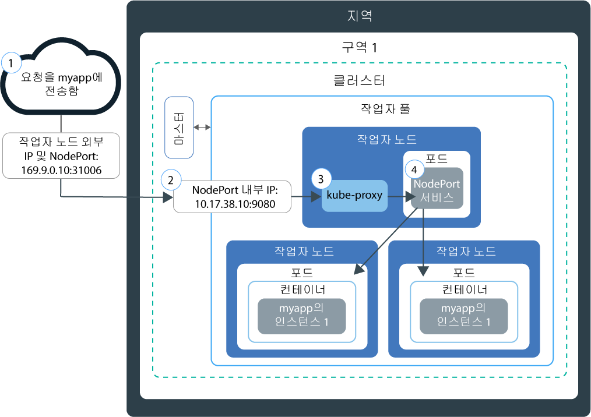

---

copyright:
  years: 2014, 2019
lastupdated: "2019-05-31"

keywords: kubernetes, iks

subcollection: containers

---

{:new_window: target="_blank"}
{:shortdesc: .shortdesc}
{:screen: .screen}
{:pre: .pre}
{:table: .aria-labeledby="caption"}
{:codeblock: .codeblock}
{:tip: .tip}
{:note: .note}
{:important: .important}
{:deprecated: .deprecated}
{:download: .download}
{:preview: .preview}


# NodePort를 사용한 액세스 테스트
{: #nodeport}

Kubernetes 클러스터에서 작업자 노드의 공인 IP 주소를 사용하고 NodePort를 노출하여 컨테이너화된 앱을 인터넷 액세스에 사용할 수 있도록 하십시오. {{site.data.keyword.containerlong}}의 테스트 및 단기 공용 액세스 용도로만 이 옵션을 사용하십시오.
{:shortdesc}

## NodePort를 사용한 네트워크 트래픽 관리
{: #nodeport_planning}

작업자 노드에서 공용 포트를 노출하고, 작업자 노드의 공인 IP 주소를 사용하여 인터넷을 통해 클러스터의 서비스에 공용으로 액세스하십시오.
{:shortdesc}

NodePort 유형의 Kubernetes 서비스를 작성하여 앱을 노출하면 30000 - 32767 범위의 NodePort 및 내부 클러스터 IP 주소가 서비스에 지정됩니다. NodePort 서비스는 앱의 수신 요청에 대한 외부 시작점 역할을 합니다. 지정된 NodePort는 클러스터에 있는 각 작업자 노드의 `kubeproxy` 설정에서 공용으로 노출됩니다. 모든 작업자 노드는 지정된 NodePort에서 서비스의 수신 입력을 청취하기 시작합니다. 인터넷에서 서비스에 액세스하기 위해, 사용자는 `<IP_address>:<nodeport>` 형식의 NodePort 및 클러스터 작성 중에 지정된 작업자 노드의 공인 IP 주소를 사용할 수 있습니다. 사설 네트워크의 서비스에 액세스하려면 공용 IP 주소 대신 작업자 노드의 사설 IP 주소를 사용하십시오. 

다음 다이어그램은 NodePort 서비스가 구성될 때 인터넷에서 앱으로 통신이 이루어지는 방식을 표시합니다.



1. 작업자 노드에서 NodePort와 작업자 노드의 공인 IP 주소를 사용하여 앱에 요청을 전송합니다.

2. 요청은 자동으로 NodePort 서비스의 내부 클러스터 IP 주소 및 포트로 전달됩니다. 내부 클러스터 IP 주소는 클러스터 내에서만 액세스가 가능합니다.

3. `kube-proxy`는 앱의 Kubernetes NodePort 서비스에 대한 요청을 라우팅합니다.

4. 앱이 배치된 팟(Pod)의 사설 IP 주소로 요청이 전달됩니다. 여러 앱 인스턴스가 클러스터에 배치되는 경우 NodePort 서비스는 앱 팟(Pod) 간의 요청을 라우팅합니다.

작업자 노드의 공인 IP 주소는 영구적이지 않습니다. 작업자 노드가 제거되거나 다시 작성되면 새 공인 IP 주소가 작업자 노드에 지정됩니다. 앱에 대한 공용 액세스를 테스트하기 위해 또는 짧은 시간 동안에만 공용 액세스가 필요한 경우에 NodePort 서비스를 사용할 수 있습니다. 서비스에 대한 추가 가용성과 안정적인 공인 IP 주소가 필요한 경우에는 [네트워크 로드 밸런서(NLB) 서비스](/docs/containers?topic=containers-loadbalancer) 또는 [Ingress](/docs/containers?topic=containers-ingress)를 사용하여 앱을 노출하십시오.
{: note}

<br />


## NodePort 서비스를 사용하여 앱에 대한 액세스 사용
{: #nodeport_config}

무료 또는 표준 클러스터에 대해 Kubernetes NodePort 서비스로서 앱을 노출할 수 있습니다.
{:shortdesc}

앱이 아직 없는 경우, [Guestbook ](https://github.com/kubernetes/examples/blob/master/guestbook/all-in-one/guestbook-all-in-one.yaml)이라는 Kubernetes 예제 앱을 사용할 수 있습니다.

1.  앱의 구성 파일에서 [서비스 ](https://kubernetes.io/docs/concepts/services-networking/service/) 섹션을 정의하십시오.

    Guestbook 예제의 경우 구성 파일에 프론트 엔드 서비스 섹션이 있습니다. Guestbook 앱을 외부에서 사용하려면 NodePort 유형과 30000 - 32767 범위의 NodePort를 프론트 엔드 서비스 섹션에 추가하십시오.
    {: tip}

    예:

    ```
    apiVersion: v1
    kind: Service
    metadata:
      name: <my-nodeport-service>
      labels:
        <my-label-key>: <my-label-value>
    spec:
      selector:
        <my-selector-key>: <my-selector-value>
      type: NodePort
      ports:
       - port: <8081>
         # nodePort: <31514>

    ```
    {: codeblock}

    <table>
    <caption>NodePort 서비스 컴포넌트 이해</caption>
    <thead>
    <th colspan=2> NodePort 서비스 섹션 컴포넌트 이해</th>
    </thead>
    <tbody>
    <tr>
    <td><code>metadata.name</code></td>
    <td><code><em>&lt;my-nodeport-service&gt;</em></code>를 NodePort 서비스 이름으로 대체합니다.<p>Kubernetes 리소스에 대해 작업할 때 [개인 정보 보호](/docs/containers?topic=containers-security#pi)에 대해 자세히 알아보십시오.</p></td>
    </tr>
    <tr>
    <td><code>metadata.labels</code></td>
    <td><code><em>&lt;my-label-key&gt;</em></code> 및 <code><em>&lt;my-label-value&gt;</em></code>를 서비스에 대해 사용할 레이블로 대체하십시오.</td>
    </tr>
    <tr>
      <td><code>spec.selector</code></td>
      <td><code><em>&lt;my-selector-key&gt;</em></code> 및 <code><em>&lt;my-selector-value&gt;</em></code>를 배치 YAML의 <code>spec.template.metadata.labels</code> 섹션에 사용한 키/값 쌍으로 대체하십시오. 서비스를 배치와 연관시키려면 선택기가 배치 레이블과 일치해야 합니다.
      </tr>
    <tr>
    <td><code>ports.port</code></td>
    <td><code><em>&lt;8081&gt;</em></code>을 서비스가 청취하는 포트로 대체합니다. </td>
     </tr>
     <tr>
     <td><code>ports.nodePort</code></td>
     <td>선택사항: <code><em>&lt;31514&gt;</em></code>를 30000 - 32767 범위의 NodePort로 대체합니다. 다른 서비스에서 이미 사용 중인 NodePort는 지정하지 마십시오. NodePort가 지정되지 않으면 사용자를 위해 임의로 지정됩니다.<br><br>NodePort를 지정하고 이미 사용 중인 NodePort를 보려면 다음 명령을 실행하십시오. <pre class="pre"><code>kubectl get svc</code></pre><p>사용 중인 모든 NodePort가 **Ports** 필드 아래에 표시됩니다.</p></td>
     </tr>
     </tbody></table>

2.  업데이트된 구성 파일을 저장하십시오.

3.  이러한 단계를 반복하여 인터넷에 노출할 개별 앱의 NodePort 서비스를 작성하십시오.

**다음에 수행할 작업:**

앱이 배치된 경우에는 작업자 노드의 공인 IP 주소와 NodePort를 사용하여
브라우저에서 앱에 액세스하기 위한 공용 URL을 구성할 수 있습니다. 작업자 노드가 사설 VLAN에만 연결된 경우에는 사설 NodePort 서비스가 작성되었으며 이는 작업자 노드의 사설 IP 주소를 통해 액세스가 가능합니다.

1.  클러스터의 작업자 노드에 대한 공인 IP 주소를 가져오십시오. 사설 네트워크의 작업자 노드에 액세스하려면 사설 IP 주소를 대신 가져오십시오.

    ```
    ibmcloud ks workers --cluster <cluster_name>
    ```
    {: pre}

    출력:

    ```
    ID                                                Public IP   Private IP    Size     State    Status
    prod-dal10-pa215dcf5bbc0844a990fa6b0fcdbff286-w1  192.0.2.23  10.100.10.10  u3c.2x4  normal   Ready
    prod-dal10-pa215dcf5bbc0844a990fa6b0fcdbff286-w2  192.0.2.27  10.100.10.15  u3c.2x4  normal   Ready
    ```
    {: screen}

2.  랜덤 NodePort가 지정된 경우에는 지정된 NodePort를 찾으십시오.

    ```
    kubectl describe service <service_name>
    ```
    {: pre}

    출력:

    ```
    Name:                   <service_name>
    Namespace:              default
    Labels:                 run=<deployment_name>
    Selector:               run=<deployment_name>
    Type:                   NodePort
    IP:                     10.10.10.8
    Port:                   <unset> 8080/TCP
    NodePort:               <unset> 30872/TCP
    Endpoints:              172.30.171.87:8080
    Session Affinity:       None
    No events.
    ```
    {: screen}

    이 예에서 NodePort는 `30872`입니다.

    **엔드포인트** 섹션에 `<none>`이 표시되면, NodePort 서비스의 `spec.selector` 섹션에서 사용하는 `<selectorkey>` 및 `<selectorvalue>`를 확인하십시오. 배치 YAML의 `spec.template.metadata.labels` 섹션에서 사용한 _키/값_ 쌍과 동일해야 합니다.
    {: note}

3.  NodePort 및 작업자 노드 IP 주소 중 하나로 URL을 구성하십시오. 예: `http://192.0.2.23:30872`
