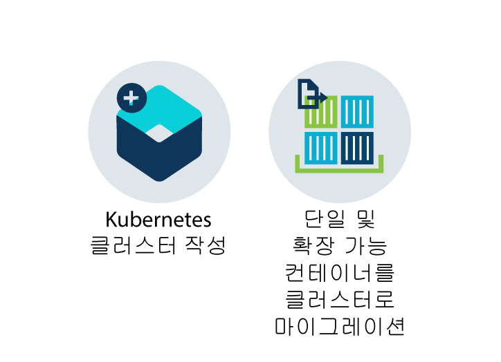
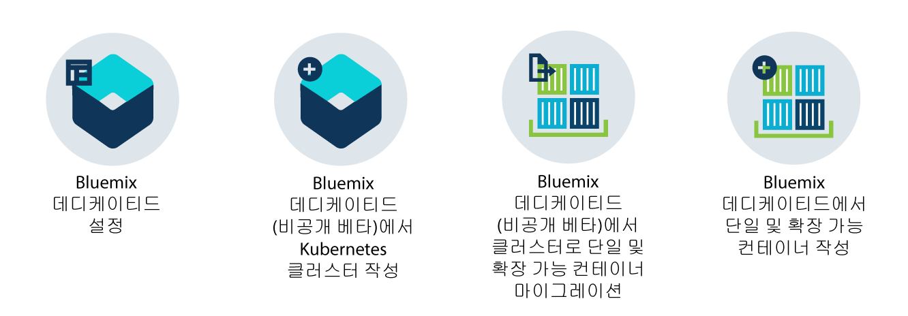

---

copyright:
  years: 2014, 2017
lastupdated: "2017-08-14"

---

{:new_window: target="_blank"}
{:shortdesc: .shortdesc}
{:screen: .screen}
{:pre: .pre}
{:table: .aria-labeledby="caption"}
{:codeblock: .codeblock}
{:tip: .tip} 
{:download: .download}

# {{site.data.keyword.containerlong_notm}} 정보
{: #cs_ov}

{{site.data.keyword.containershort}}는 Kubernetes API를 사용하여
독립적인 컴퓨팅 호스트의 클러스터에서 컨테이너화된 앱의 배치, 오퍼레이션, 스케일링 및 모니터링을 자동화하는
강력한 도구, 직관적인 사용자 경험, 기본 제공 보안 및 격리를 제공할 수 있도록 Docker 및 Kubernetes를 결합합니다. {:shortdesc}

## Kubernetes 기본
{: #kubernetes_basics}

Kubernetes는 Borg 프로젝트의 일부로 Google에서 개발되었으며, 2014년에 오픈 소스 커뮤니티로 넘겨졌습니다. Kubernetes는 컨테이너화된 인프라의 실행에 있어서 15년 넘는 Google 연구 성과를 프로덕션 워크로드, 오픈 소스 컨트리뷰션 및 Docker 컨테이너 관리 도구와 결합함으로써 이식성과 확장성이 뛰어나고 장애 조치(fail-over) 시에 자체 회복되는 격리된 보안 앱 플랫폼을 제공합니다. {:shortdesc}

몇 가지 용어를 사용하여 Kubernetes 작동 방식의 기본에 대해 알아보십시오. 

<dl>
<dt>클러스터</dt>
<dd>Kubernetes 클러스터는 작업자 노드라고 하는 하나 이상의 가상 머신으로 구성되어 있습니다. 모든
작업자 노드는 컨테이너화된 앱을 배치, 실행 및 관리할 수 있는 계산 호스트를 나타냅니다.
작업자 노드는 클러스터의 모든 Kubernetes 리소스를 중앙에서 제어하고 모니터링하는
Kubernetes 마스터에서 관리합니다. 컨테이너화된 앱을 배치하는 경우, Kubernetes 마스터는 클러스터에서 사용 가능한 용량과 배치 요구사항을 고려하여 앱이 배치될 위치를 결정합니다. </dd>
<dt>포드</dt>
<dd>Kubernetes 클러스터로 배치된 모든 컨테이너화된 앱을 포드가 배치, 실행 및 관리합니다. 포드는 Kubernetes 클러스터의 최소 배치 가능 단위를 나타내며, 단일 단위로 처리되어야 하는 컨테이너를 함께 그룹화하는 데 사용됩니다. 대부분의 경우, 컨테이너는 자체 포드에 배치됩니다. 그러나 해당 컨테이너가 동일한 사설 IP 주소를 사용하여 주소 지정될 수 있도록, 앱에서는 하나의 포드에 배치되는 컨테이너 및 기타 헬퍼 컨테이너가 필요할 수 있습니다. </dd>
<dt>배치</dt>
<dd>배치는 지속적 스토리지, 서비스 또는 어노테이션과 같이 앱을 실행하는 데 필요한 컨테이너 및 기타 Kubernetes 리소스를 지정하는
Kubernetes 리소스입니다.
배치는 Kubernetes 배치 스크립트에 문서화되어 있습니다. 배치를 실행할 때 Kubernetes 마스터는 클러스터의 작업자 노드에서 사용 가능한 용량을 고려하여 지정된 컨테이너를 포드로 배치합니다. 다른 Kubernetes 리소스가 작성되고 배치 스크립트에 지정된 대로 구성됩니다.   
배치를 사용하면 롤링 업데이트 중에 추가할 포드의 수와 한 번에 사용 불가능한 포드의 수를 포함하여 앱에 대한 업데이트 전략을 정의할 수 있습니다. 롤링 업데이트를 수행할 때 배치는 개정이 작동 중인지 여부를 확인하며, 장애가 발견되면 롤아웃을 중지합니다. </dd>
<dt>서비스</dt>
<dd>
Kubernetes 서비스는 포드 세트를 그룹화하며, 각 포드의 실제 사설 IP 주소를 노출함이 없이
클러스터의 기타 서비스에 대해 이러한 포드로의 네트워크 연결을 제공합니다. 서비스를 사용하여 클러스터 내에서 또는 공용 인터넷에 앱을 사용 가능하게 할 수 있습니다.   
Kubernetes 용어에 대한 자세한 정보는 <a href="https://kubernetes.io/docs/tutorials/kubernetes-basics/" target="_blank">Kubernetes 기본 튜토리얼</a>을 확인하십시오.</dd>
</dl>

## 클러스터 사용의 이점
{: #cs_ov_benefits}

각각의 클러스터는 기본 Kubernetes 및 {{site.data.keyword.IBM_notm}}의 추가 기능을 제공하는 공유 또는 전용 가상 머신에 배치됩니다. {:shortdesc}

|이점|설명|
|-------|-----------|
|컴퓨팅, 네트워크 및 스토리지 인프라가 격리된 단일 테넌트 Kubernetes 클러스터|<ul><li>비즈니스 및 개발 환경의 요구사항을 충족하는 자체 사용자 정의된 인프라를 작성합니다. </li><li>{{site.data.keyword.BluSoftlayer_full}}에서 제공하는 리소스를 사용하는 전용 및 보안 Kubernetes 마스터, 작업자 노드, 가상 네트워크 및 스토리지를 프로비저닝합니다. </li><li>지속적 데이터를 저장하고, Kubernetes 포드 간에 데이터를 공유하며, 통합 및 보안 볼륨 서비스에서 필요 시에 데이터를 복원합니다. </li><li>고가용성이며 {{site.data.keyword.IBM_notm}}에서 주기적으로 모니터하는 완전 관리되는 Kubernetes 마스터. </li><li>모든 기본 Kubernetes API에 대한 전체 지원의 이점. </li></ul>|
|Vulnerability Advisor에서 이미지 보안 준수|<ul><li>이미지가 저장되고 조직의 모든 사용자에 의해 공유되는 자체 보안 Docker 개인용 이미지 레지스트리를 설정합니다. </li><li>개인용 {{site.data.keyword.Bluemix_notm}} 레지스트리에서 이미지를 자동 스캔하는 이점. </li><li>잠재적 취약점을 해결하기 위해 이미지에서 사용된 운영 체제에 특정한 권장사항을 검토합니다. </li></ul>|
|앱의 자동 스케일링|<ul><li>CPU 및 메모리 이용률을 기반으로 앱을 확장하고 축소하는 사용자 정의 정책을 정의합니다. </li></ul>|
|클러스터 상태의 지속적 모니터링|<ul><li>클러스터 대시보드를 사용하여 클러스터, 작업자 노드 및 컨테이너 배치의 상태를 빠르게 보고 관리합니다. </li><li>{{site.data.keyword.monitoringlong}}를 사용하여 세부 이용 메트릭을 찾아서 작업 로드를 충족하도록 클러스터를 신속하게 확장합니다. </li><li>{{site.data.keyword.loganalysislong}}를 사용하여 로깅 정보를 검토하고 자세한 클러스터 활동을 확인하십시오. </li></ul>|
|비정상 컨테이너의 자동 복구|<ul><li>작업자 노드에 배치된 컨테이너에 대한 지속성 상태 검사. </li><li>장애 발생 시에 컨테이너의 자동 재작성. </li></ul>|
|서비스 검색 및 서비스 관리|<ul><li>공개적으로 노출하지 않고 클러스터의 기타 앱이 사용할 수 있도록 앱 서비스를 중앙 집중식으로 등록합니다. </li><li>IP 주소 또는 컨테이너 ID의 변경을 추적하지 않고 등록된 서비스를 검색하며, 사용 가능한 인스턴스로 자동 라우팅하는 이점을 활용합니다. </li></ul>|
|공용으로 서비스를 안전하게 노출|<ul><li>클러스터 내의 IP 주소 변경을 추적함이 없이 앱을 공용으로 사용하고 다중 작업자 노드 간의
워크로드 밸런싱을 수행할 수 있도록 전체 로드 밸런서와 Ingress 지원이 제공되는 사설 오버레이 네트워크. </li><li>인터넷에서 클러스터의 서비스에 액세스하기 위해 공인 IP 주소, {{site.data.keyword.IBM_notm}} 제공 라우트 또는 자체 사용자 정의 도메인 간에 선택합니다. </li></ul>|
|{{site.data.keyword.Bluemix_notm}} 서비스 통합|<ul><li>Watson API, 블록체인, 데이터 서비스 또는 Internet of Things와 같은
{{site.data.keyword.Bluemix_notm}} 서비스의 통합을 통해
앱에 부가 기능을 추가하고, 클러스터 사용자가 앱 개발과 컨테이너 관리 프로세스를 단순화할 수 있도록 도움을 줍니다. </li></ul>|
{: caption="표 1. {{site.data.keyword.containerlong_notm}}에서 클러스터 사용의 이점" caption-side="top"}

## 클라우드 환경
{: #cs_ov_environments}

클러스터와 컨테이너가 배치될
{{site.data.keyword.Bluemix_notm}} 클라우드 환경을 선택할 수 있습니다. {:shortdesc}

###{{site.data.keyword.Bluemix_notm}} 퍼블릭
{: #public_environment}

퍼블릭 클라우드 환경([https://console.bluemix.net ](https://console.bluemix.net))에 클러스터를 배치하고 {{site.data.keyword.Bluemix_notm}} 카탈로그의 서비스에 연결하십시오.

{{site.data.keyword.Bluemix_notm}} 퍼블릭의
클러스터를 사용하면 클러스터의 작업자 노드에 대한 하드웨어 격리 레벨을 선택할 수 있습니다. 사용 가능한 실제 리소스가 사용자 클러스터에만 전용되도록 전용 하드웨어를 사용하거나, 실제 리소스가 기타 {{site.data.keyword.IBM_notm}} 고객의 클러스터와 공유될 수 있도록 공유 하드웨어를 사용하십시오. 클러스터에 대한 격리를 원할 때는 {{site.data.keyword.Bluemix_notm}}
퍼블릭 환경의 전용 클러스터를 선택할 수 있지만, 사용자가 사용하는 기타
{{site.data.keyword.Bluemix_notm}} 서비스에 대해서는 이러한 격리가 필요하지 않습니다. 

시작하려면 다음 옵션 중 하나를 클릭하십시오. 

    <map name="public_options" id="public_options">
    <area href="container_index.html#clusters" alt="Bluemix에서 Kubernetes 클러스터 시작하기" title="Bluemix에서 Kubernetes 클러스터 시작하기" shape="rect" coords="-5, -6, 123, 154" />
<area href="cs_classic.html#cs_classic" alt="IBM Bluemix Container Service(Kraken)에서 단일 및 확장 가능 컨테이너 실행" title="IBM Bluemix Container Service(Kraken)에서 단일 및 확장 가능 컨테이너 실행" shape="rect" coords="181, -5, 320, 161" />
</map>

### {{site.data.keyword.Bluemix_notm}} 데디케이티드
{: #dedicated_environment}

클러스터(비공개 베타) 또는 단일 및 확장 가능 컨테이너를 데디케이티드 클라우드 환경(`https://<my-dedicated-cloud-instance>.bluemix.net`)에 배치하고 역시 해당 환경에서 실행 중인 사전 선택된 {{site.data.keyword.Bluemix_notm}} 서비스와 연결합니다. 

{{site.data.keyword.Bluemix_notm}} 데디케이티드의
클러스터는 {{site.data.keyword.Bluemix_notm}} 퍼블릭에서
전용 하드웨어로 작성된 클러스터와 동등합니다. 사용 가능한 실제 리소스는 사용자의 클러스터에만 전용되며, 기타 {{site.data.keyword.IBM_notm}} 고객의 클러스터와는 공유되지 않습니다. 
퍼블릭 및 데디케이티드 모두의 경우, 공용 API 엔드포인트는 클러스터를 작성하는 데 사용됩니다. 그러나 {{site.data.keyword.Bluemix_notm}}
데디케이티드에서 대부분의 중요한 차이점은 다음과 같습니다. 

*   {{site.data.keyword.IBM_notm}}은 사용자가 소유하는 계정에서가 아니라 작업자 노드, VLAN 및 서브넷이 배치된 {{site.data.keyword.BluSoftlayer_notm}} 계정을 소유하고 관리합니다. 
*   해당 VLAN 및 서브넷에 대한 스펙은 클러스터가 작성될 때가 아니라 데디케이티드 환경이 작성될 때 판별됩니다. 

클러스터에 대한 격리를 원할 때 {{site.data.keyword.Bluemix_notm}}
데디케이티드 환경을 설정하도록 선택할 수 있으며, 사용자가 사용하는 기타
{{site.data.keyword.Bluemix_notm}} 서비스에 대해
이러한 격리를 요구할 수도 있습니다. 

시작하려면 다음 옵션 중 하나를 클릭하십시오. 

    <map name="dedicated_options" id="dedicated_options">
    <area href="#setup_dedicated" alt="Bluemix 데디케이티드(비공개 베타)용 IBM Bluemix Container Service 설정" title="Bluemix 데디케이티드(비공개 베타)용 IBM Bluemix Container Service 설정" shape="rect" coords="-5, -15, 100, 153" />
    <area href="container_index.html#dedicated" alt="Bluemix 데디케이티드(비공개 베타)에서 Kubernetes 클러스터 시작하기" title="Bluemix 데디케이티드(비공개 베타)에서 Kubernetes 클러스터 시작하기" shape="rect" coords="153, -10, 276, 182" />
    <area href="cs_classic.html#cs_classic" alt="IBM Bluemix Container Service(Kraken)에서 단일 및 확장 가능 컨테이너 실행" title="IBM Bluemix Container Service(Kraken)에서 단일 및 확장 가능 컨테이너 실행" shape="rect" coords="317, -11, 436, 188" />
<area href="container_ha.html#container_group_ui" alt="Bluemix GUI에서 컨테이너 그룹으로 장기 서비스 실행" title="Bluemix GUI에서 컨테이너 그룹으로 장기 서비스 실행" shape="rect" coords="485, -1, 600, 173" />
    </map>

### 클라우드 환경 간에 클러스터 관리의 차이점
{: #env_differences}

|영역|{{site.data.keyword.Bluemix_notm}} 퍼블릭|{{site.data.keyword.Bluemix_notm}} 데디케이티드(비공개 베타)|
|--|--------------|--------------------------------|
|클러스터 작성|라이트 클러스터를 작성하거나 표준 클러스터에 대해 다음 세부사항을 지정하십시오. <ul><li>클러스터 유형</li><li>이름</li><li>Kubernetes 버전</li><li>위치</li><li>시스템 유형</li><li>작업자 노드 수</li><li>퍼블릭 VLAN</li><li>프라이빗 VLAN</li><li>하드웨어</li></ul>|표준 클러스터에 대해 다음 세부사항을 지정하십시오. <ul><li>이름</li><li>Kubernetes 버전</li><li>시스템 유형</li><li>작업자 노드 수</li></ul>
**참고:** VLAN 및 하드웨어 설정은
{{site.data.keyword.Bluemix_notm}} 환경을 작성하는 동안 사전 정의됩니다. 
|
|클러스터 하드웨어 및 소유권|표준 클러스터에서 하드웨어는 기타 {{site.data.keyword.IBM_notm}} 고객과 공유되거나 사용자에게만 전용될 수 있습니다. 퍼블릭 및 프라이빗 VLAN은 사용자의 {{site.data.keyword.BluSoftlayer_notm}} 계정으로 사용자가 소유하고 관리합니다. |{{site.data.keyword.Bluemix_notm}}
데디케이티드의 클러스터에서는 하드웨어가 항상 전용됩니다. 퍼블릭 및 프라이빗 VLAN은 사용자를 위해 IBM이 소유하고 관리합니다. 위치는 {{site.data.keyword.Bluemix_notm}} 환경에 대해 사전 정의되어 있습니다. |
|클러스터와 서비스 바인딩|[bx cs cluster-service-bind](cs_cluster.html#cs_cluster_service) 명령을 사용하여 Kubernetes 시크릿을 클러스터에 바인드합니다. |서비스 신임 정보에 대한
[JSON 키 파일](cs_cluster.html#binding_dedicated)을 작성한 후에
클러스터에 바인드할 수 있도록 해당 파일에서 Kubernetes 시크릿을 작성합니다. |
|로드 밸런서 및 Ingress 네트워킹|표준 클러스터를 프로비저닝하는 동안 다음 조치가 자동으로 수행됩니다.<ul><li>공용 포터블 서브넷이 클러스터에 바인드되고 {{site.data.keyword.BluSoftlayer_notm}} 계정에 지정됩니다. </li><li>고가용성 Ingress 제어기에 하나의 포터블 공인 IP 주소를 사용하고 고유한 공용 라우트가 &lt;cluster_name&gt;.containers.mybluemix.net 형식으로 지정됩니다. 이 라우트를 사용하여 공용에 여러 앱을 노출할 수 있습니다. </li><li>로드 밸런서 서비스를 통해 공용에 앱을 노출하는 데 사용할 수 있도록 4개의 포터블 공인 IP 주소가 클러스터에 지정됩니다. {{site.data.keyword.BluSoftlayer_notm}} 계정을 통해 추가 서브넷을 요청할 수 있습니다.</li></ul>|데디케이티드 계정을 작성할 때 사용자는 다음과 같은 의사결정을 내립니다. <ul><li>원하는 서브넷의 수</li><li>원하는 서브넷의 유형(로드 밸런서 또는 Ingress). {{site.data.keyword.IBM_notm}}은 서브넷을 작성하며 사용자를 위해 네트워크 관리 태스크를 수행합니다. 
선택사항에 따라 Ingress 제어기가 작성될 수 있으며 공용 라우트가 지정될 수 있습니다. [지원 티켓을 열어](/docs/support/index.html#contacting-support) 서브넷을 작성한 후에 [`bx cs cluster-subnet-add`](cs_cli_reference.html#cs_cluster_subnet_add) 명령을 사용하여 클러스터에 서브넷을 추가함으로써 추가 서브넷을 요청할 수 있습니다. |
|NodePort 네트워킹|작업자 노드에서 공용 포트를 노출하고, 작업자 노드의 공인 IP 주소를 사용하여 클러스터의 서비스에 공용으로 액세스합니다. |작업자 노드의 모든 공인 IP 주소는 방화벽을 통해 차단합니다. 그러나 클러스터에 추가된 {{site.data.keyword.Bluemix_notm}} 서비스의 경우 노드 포트는 공인 IP 주소나 사설 IP 주소를 통해 액세스할 수 있습니다.|
|지속적 스토리지|볼륨의 [동적 프로비저닝](cs_apps.html#cs_apps_volume_claim) 또는
[정적 프로비저닝](cs_cluster.html#cs_cluster_volume_create)을 사용합니다. |볼륨의 [동적 프로비저닝](cs_apps.html)을 사용합니다. </li></ul>|
|{{site.data.keyword.registryshort_notm}}의 이미지 레지스트리 URL|<ul><li>미국 남부: <code>registry.ng bluemix.net</code></li><li>영국 남부: <code>registry.eu-gb.bluemix.net</code></li><li>중앙 유럽(프랑크푸르트): <code>registry.eu-de.bluemix.net</code></li><li>호주(시드니): <code>registry.au-syd.bluemix.net</code></li></ul>||<ul><li>새 네임스페이스의 경우에는 {{site.data.keyword.Bluemix_notm}}
퍼블릭에 대해 정의된 동일한 지역 기반 레지스트리를 사용합니다. </li><li>{{site.data.keyword.Bluemix_notm}} 데디케이티드의 단일 및 확장 가능 컨테이너에 대해 설정된 네임스페이스의 경우 <code>registry.&lt;dedicated_domain&gt;</code>을 사용하십시오.</li></ul>|
|레지스트리에 액세스|[{{site.data.keyword.containershort_notm}}에서 개인용 및 공용 이미지 레지스트리 사용](cs_cluster.html#cs_apps_images)의 옵션을 참조하십시오.|<ul><li>새로운 네임스페이스의 경우 [{{site.data.keyword.containershort_notm}}에서 개인용 및 공용 이미지 레지스트리 사용](cs_cluster.html#cs_apps_images)의 옵션을 참조하십시오.</li><li>단일 및 확장 가능 그룹에 대해 설정된 네임스페이스의 경우에는 인증을 위해
[토큰을 사용하고 Kubernetes 시크릿을 작성](cs_dedicated_tokens.html#cs_dedicated_tokens)하십시오. </li></ul>|
{: caption="표 2. {{site.data.keyword.Bluemix_notm}} 퍼블릭과 {{site.data.keyword.Bluemix_notm}} 데디케이티드 사이의 기능 차이점" caption-side="top"}

### {{site.data.keyword.Bluemix_notm}} 데디케이티드(비공개 베타)에서 {{site.data.keyword.containershort_notm}} 설정
{: #setup_dedicated}

관리자는 IBM 관리자 ID 및 조직의 사용자를 데디케이티드 환경에 추가해야 합니다. 

시작하기 전에 [{{site.data.keyword.Bluemix_notm}} 데디케이티드 환경을 설정](/docs/dedicated/index.html#setupdedicated)하십시오.

클러스터를 사용하도록 데디케이티드 환경을 설정하려면 다음을 수행하십시오. 

1.  제공된 IBM 관리자 ID를 환경에 추가하십시오. 
    1.  {{site.data.keyword.Bluemix_notm}} 데디케이티드 계정을 선택하십시오. 
    2.  메뉴 표시줄에서 **관리>보안>ID 및 액세스**를 클릭하십시오. 사용자 창에는 사용자의 목록이 해당 이메일 주소 및 선택된 계정에 대한 상태와 함께 표시됩니다. 
    3.  **사용자 초대**를 클릭하십시오. 
    4.  **이메일 주소 또는 기존 IBM ID**에 이메일 주소 `cfsdl@us.ibm.com`을 입력하십시오. 
    5.  **액세스** 섹션에서 **ID 및 액세스 사용 서비스**를 펼치십시오. 
    6.  **서비스** 드롭 다운 목록에서 **{{site.data.keyword.containershort_notm}}**를 선택하십시오.
    7.  **역할** 드롭 다운 목록에서 **관리자**를 선택하십시오. 
    8.  **사용자 초대**를 클릭하십시오. 
2.  [{{site.data.keyword.Bluemix_notm}} 계정의 일반 사용자를 위해 IBM ID를 작성하십시오.](https://www.ibm.com/account/us-en/signup/register.html)
3.  [이전 단계의 사용자를 {{site.data.keyword.Bluemix_notm}} 계정에 추가하십시오.](cs_cluster.html#add_users)
4.  퍼블릭 콘솔을 통해 {{site.data.keyword.Bluemix_notm}}
데디케이티드 계정에 액세스하고 클러스터 작성을 시작하십시오. 

    1.  IBM ID로 {{site.data.keyword.Bluemix_notm}} 퍼블릭 콘솔([https://console.bluemix.net ](https://console.bluemix.net))에 로그인하십시오. 
    2.  계정 메뉴에서 {{site.data.keyword.Bluemix_notm}} 데디케이티드 계정을 선택하십시오. 콘솔이 {{site.data.keyword.Bluemix_notm}} 데디케이티드 인스턴스에 대한 서비스와 정보로 업데이트됩니다. 
    3.  {{site.data.keyword.Bluemix_notm}} 데디케이티드 인스턴스의 카탈로그에서
**컨테이너**를 선택하고 **Kubernetes 클러스터**를 클릭하십시오. 

다음으로 클러스터 작성에 대한 자세한 정보는 [{{site.data.keyword.Bluemix_notm}} 데디케이티드(비공개 베타)의 GUI에서 Kubernetes 클러스터 작성](cs_cluster.html#creating_ui_dedicated)을 참조하십시오.

## Kubernetes 클러스터 작동 방식 
{: #cs_ov_architecture}

Kubernetes 클러스터는 느슨한 결합의 확장 가능하며 Kubernetes 마스터에 의해 중앙 집중식으로
모니터링되고 관리되는 하나 이상의 실제 또는 가상 머신(작업자 노드라고도 함)으로 구성되어 있습니다. 각각의
고객 계정마다 Kubernetes 마스터는 IBM에 의해 관리되며, 높은 복원성과 가용성을 제공합니다. {:shortdesc}

각각의 작업자 노드는 격리, 리소스 관리 기능 및 작업자 노드 보안 준수를 제공하는 기본 제공 보안 기능은 물론 {{site.data.keyword.IBM_notm}} 관리 Docker 엔진, 별도의 컴퓨팅 리소스, 네트워킹 및 볼륨 서비스로 설정됩니다. 작업자 노드는 보안 TLS 인증서 및 openVPN 연결을 사용하여 마스터와 통신합니다. 

*그림 1. IBM Bluemix Container Service의 Kubernetes 아키텍처 및 네트워킹*

## Docker 컨테이너
{: #cs_ov_docker}

Docker는 2013년에 dotCloud에 의해 릴리스된 오픈 소스 프로젝트입니다. 기존 Linux 컨테이너 기술(LXC)의 기능을 기반으로
빌드되어 Docker는 앱을 신속하게 빌드, 테스트, 배치 및 스케일링하기 위해 사용할 수 있는 소프트웨어
플랫폼이 되었습니다. Docker는 앱이 실행해야 하는 모든 요소가 포함된 컨테이너라고 부르는
표준화된 단위로 소프트웨어를 패키지합니다. {:shortdesc}

기본 Docker 개념에 대해 학습하려면 다음 개념을 검토하십시오. 

<dl>
<dt>컨테이너</dt>
<dd>컨테이너는 환경 간에 앱을 이동하고 변경사항 없이 앱을 실행할 수 있도록 앱과 모든 종속 항목을 패키징하는 표준 방법입니다. 가상 머신과 달리 컨테이너는 디바이스, 그 운영 체제 및 기본 하드웨어를 가상화하지 않습니다. 앱 코드, 런타임, 시스템 도구, 라이브러리 및 설정만 컨테이너 내부에 패키징됩니다. 컨테이너는
배치된 계산 호스트에서 격리된 프로세스로 실행되고 호스트 운영 체제와 그 하드웨어 리소스를 공유합니다. 이 접근 방식으로 인해 컨테이너가 가상 머신보다 경량으로 유지되어
이식성이 높아지고 효율적이게 됩니다. </dd>
<dt>이미지</dt>
<dd>모든 컨테이너는 Docker 이미지를 기반으로 하며 이미지의 인스턴스가 될 것으로 간주됩니다. 이미지는 빌드 아티팩트(예: 앱, 앱의 구성 및 이의 종속 항목) 및 이미지를 빌드하는 방법에 대한 지시사항이 포함된 파일인 Dockerfile에서 작성됩니다. </dd>
<dt>레지스트리</dt>
<dd>이미지 레지스트리는 사용자가 Docker 이미지를 저장, 검색 및 공유하는 위치입니다. 
레지스트리에 저장된 이미지는 공용으로 사용 가능하거나(공용 레지스트리), 소규모 그룹의 사용자만 액세스가 가능합니다(개인용 레지스트리). {{site.data.keyword.containershort_notm}}는 클러스터에 첫 번째 컨테이너화된 앱을 작성하도록 Docker 및 Kubernetes를 시작하기 위해 사용할 수 있는 공용 이미지(예: ibmliberty)를 제공합니다. 엔터프라이즈 애플리케이션인 경우에는 {{site.data.keyword.Bluemix_notm}}에 제공된 레지스트리와 같은 개인용 레지스트리를 사용하여
권한 없는 사용자가 이를 사용하고 변경하지 못하도록 이미지를 보호하십시오.   
이미지에서 컨테이너를 배치하려는 경우,
이미지가 공용 또는 개인용 이미지 레지스트리에 저장되는지 확인해야 합니다. </dd>
</dl>

### 컨테이너 사용의 주요 이점
{: #container_benefits}

<dl>
<dt>컨테이너는 민첩합니다.</dt>
<dd>컨테이너는
개발 및 프로덕션 팀을 위한 표준화된 환경을 제공함으로써 시스템 관리를 단순화합니다. 엔진의 경량 런타임을 사용하면 수요 변경에 따른 응답으로 신속한
확장 및 축소가 가능합니다. 또한 서로
다른 운영 체제 플랫폼 및 기본 인프라를 관리해야
하는 복잡도를 제거하는 데 도움이 됩니다. 컨테이너는 임의의 인프라에서 임의의 앱을 신속하고 확실하게 개발하고
실행할 수 있도록 도움을 줍니다.</dd>
<dt>컨테이너는 크기가 작습니다.</dt>
<dd>하나의 가상 머신에 필요한 크기의 공간에 더 많은 컨테이너를 배치할 수 있습니다.
</dd>
<dt>컨테이너는 이식 가능성을 제공합니다.</dt>
<dd>다른 이미지를 기반으로 다른 컨테이너를 위한 이미지를 빌드할 수 있습니다. 다른 사람이 이미지에 대한 작업의 대부분을 수행하고
여러분의 용도에 맞게 이미지를 변경하도록 할 수 있습니다. 또한 스테이징 환경에서 프로덕션 환경으로
앱 코드를 신속하게 마이그레이션할 수 있습니다. Delivery Pipeline이나 UrbanCode Deploy와 같은 도구를
사용하여 마이그레이션 프로세스를 자동화할 수 있습니다.</dd>
</dl>

## 컨테이너의 오용
{: #cs_terms}

클라이언트는 {{site.data.keyword.containershort_notm}}를 잘못 사용할 수 없습니다. {:shortdesc}

오용에는 다음이 포함됩니다. 

*   불법적 활동
*   맬웨어의 배포 또는 실행
*   {{site.data.keyword.containershort_notm}}에 손상을 주거나
사용자의 {{site.data.keyword.containershort_notm}} 사용을 방해함
*   기타 서비스 또는 시스템에 손상을 주거나 사용자의 사용을 방해함
*   서비스 또는 시스템에 대한 비인가된 액세스
*   서비스 또는 시스템의 비인가된 수정
*   기타 사용자의 권한 위반

전체 이용 약관은
[클라우드 서비스 이용 약관](/docs/navigation/notices.html#terms)을 참조하십시오. 
