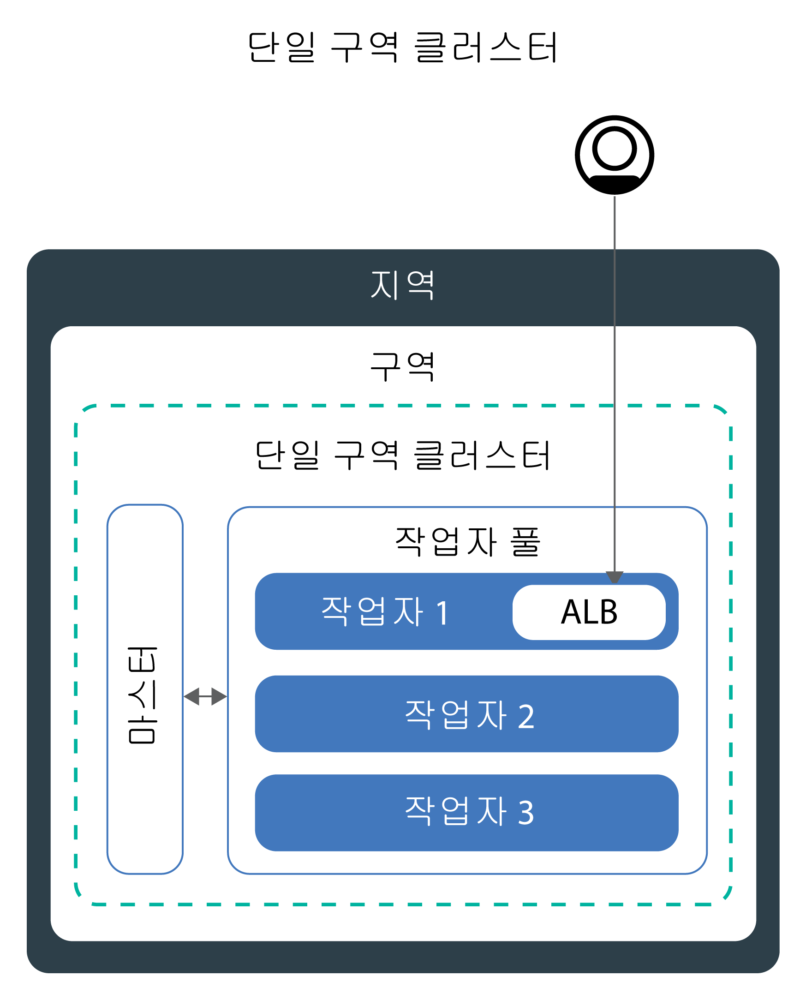
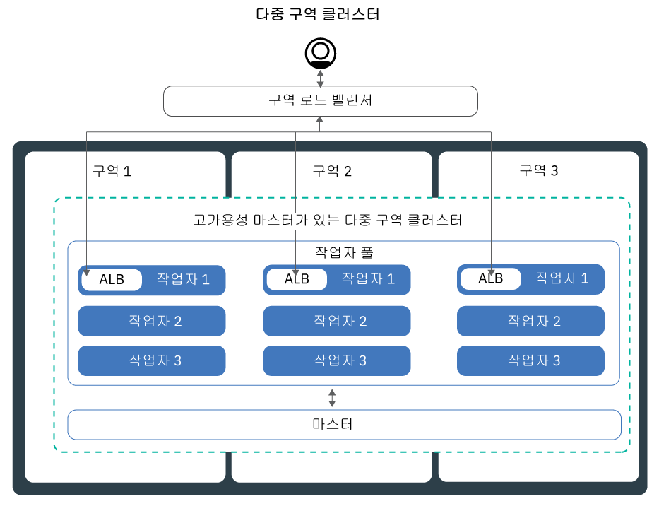
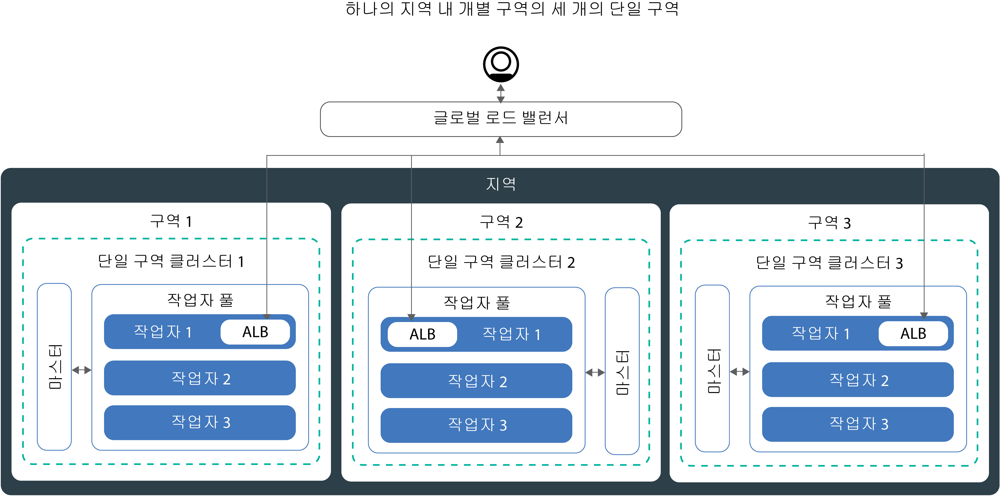

---

copyright:
  years: 2014, 2019
lastupdated: "2019-06-11"

keywords: kubernetes, iks, multi az, multi-az, szr, mzr

subcollection: containers

---

{:new_window: target="_blank"}
{:shortdesc: .shortdesc}
{:screen: .screen}
{:pre: .pre}
{:table: .aria-labeledby="caption"}
{:codeblock: .codeblock}
{:tip: .tip}
{:note: .note}
{:important: .important}
{:deprecated: .deprecated}
{:download: .download}
{:preview: .preview}


# 고가용성을 위한 클러스터 계획
{: #ha_clusters}

{{site.data.keyword.containerlong}}에서 앱의 최대 가용성 및 용량을 제공하기 위한 표준 클러스터를 디자인하십시오.
{: shortdesc}

다중 작업자 노드, 구역 및 클러스터 간에 앱을 분배하면 사용자에게 작동 중지 시간이 발생할 가능성이 낮아질 수 있습니다. 로드 밸런싱 및 격리 등의 기본 제공 기능을 사용하면 호스트, 네트워크 또는 앱에서 잠재적 장애가 발생할 때 복원성이 높아집니다. 가용도의 증가 순으로 정렬된 다음의 잠재적 클러스터 설정을 검토하십시오.


1. 작업자 풀에 다중 작업자 노드가 있는 [단일 구역 클러스터](#single_zone).
2. 한 지역 내의 구역 간에 작업자 노드를 전개하는 [다중 구역 클러스터](#multizone).
3. **공용 및 사설 VLAN에만 연결된 클러스터**: 글로벌 로드 밸런서를 통해 연결된 여러 구역 또는 지역에 설정된 [다중 클러스터](#multiple_clusters). 

## 단일 구역 클러스터
{: #single_zone}

클러스터에서 하나의 작업자 노드를 사용할 수 없는 경우 장애 복구를 허용하고 앱의 가용성을 개선하려면 추가로 작업자 노드를 단일 구역 클러스터에 추가하십시오.
{: shortdesc}



기본적으로, 단일 구역 클러스터는 이름이 `default`인 작업자 풀로 설정됩니다. 작업자 풀은 클러스터 작성 중에 정의한 것과 동일한 구성(예: 머신 유형)으로 작업자 노드를 그룹화합니다. [기존 작업자 풀의 크기를 조정](/docs/containers?topic=containers-add_workers#resize_pool)하거나 [새 작업자 풀을 추가](/docs/containers?topic=containers-add_workers#add_pool)하여 클러스터에 작업자 노드를 더 추가할 수 있습니다.

작업자 노드를 더 추가하면 다중 작업자 노드 간에 앱 인스턴스를 분배할 수 있습니다. 하나의 작업자 노드가 작동 중지되면 사용 가능한 작업자 노드의 앱 인스턴스가 계속해서 실행됩니다. Kubernetes는 사용 불가능한 작업자 노드에서 팟(Pod)을 자동으로 다시 스케줄하여 앱의 성능과 용량을 보장합니다. 팟(Pod)이 작업자 노드 간에 균등하게 분배되도록 보장하려면 [팟(Pod) 친화성](https://kubernetes.io/docs/concepts/configuration/assign-pod-node/#inter-pod-affinity-and-anti-affinity-beta-feature)을 구현하십시오.

**내 단일 구역 클러스터를 다중 구역 클러스터로 변환할 수 있습니까?**</br>
클러스터가 [지원되는 다중 구역 메트로 위치](/docs/containers?topic=containers-regions-and-zones#zones) 중 하나에 있으면 가능합니다. 예. [독립형 작업자 노드에서 작업자 풀로 업데이트](/docs/containers?topic=containers-update#standalone_to_workerpool)를 참조하십시오.


**다중 구역 클러스터를 사용해야 합니까?**</br>
아니오. 원하는 수 만큼의 단일 구역 클러스터를 작성할 수 있습니다. 실제로, 단순한 관리를 위해 또는 클러스터가 특정 [단일 구역 시티](/docs/containers?topic=containers-regions-and-zones#zones)에 상주해야 하는 경우에는 단일 구역 클러스터를 선호할 수 있습니다.

**단일 구역에서 고가용성 마스터를 보유할 수 있습니까?**</br>
예. 단일 구역에서, 마스터는 고가용성이며 가동 중단(예: 마스터 업데이트 중에)에 대해 보호할 수 있도록 Kubernetes API 서버, etcd, 스케줄러 및 제어기 관리자에 대해 별도 실제 호스트의 복제본을 포함합니다. 구역 장애에 대해 보호하기 위해 다음을 수행할 수 있습니다.
* 마스터가 구역 간에 전개되어 있는 [다중 구역 가능 구역에서 클러스터를 작성](#multizone)합니다.
* [공용 및 사설 VLAN에 연결된 다중 클러스터를 작성](#multiple_clusters)하고 이를 글로벌 로드 밸런서로 연결합니다. 

## 다중 구역 클러스터
{: #multizone}

{{site.data.keyword.containerlong_notm}}에서 다중 구역 클러스터를 작성할 수 있습니다. 작업자 풀을 사용하여 다중 작업자 노드와 구역 간에 앱을 분배하면 사용자에게 작동 중지 시간이 발생할 가능성이 낮아집니다. 로드 밸런싱 등의 기본 제공 기능은 호스트, 네트워크 또는 앱에서 발생하는 잠재적 구역 장애에 대한 복원성을 높여줍니다. 한 구역의 리소스가 작동 중지되는 경우, 클러스터 워크로드는 기타 구역에서 여전히 작동됩니다.
{: shortdesc}

**작업자 풀은 무엇입니까?**</br>
작업자 풀은 시스템 유형, CPU 및 메모리 등의 특성이 동일한 작업자 노드의 콜렉션입니다. 새 클러스터를 작성하면 기본 작업자 풀이 사용자를 위해 자동으로 작성됩니다. 구역 간의 풀에서 작업자 노드를 전개하거나 풀에 작업자 노드를 추가하거나 작업자 노드를 업데이트하려면 새 `ibmcloud ks worker-pool` 명령을 사용할 수 있습니다.

**독립형 작업자 노드를 계속 사용할 수 있습니까?**</br>
독립형 작업자 노드의 이전 클러스터 설정은 지원은 되지만 더 이상 사용되지 않습니다. 독립형 작업자 노드 대신 사용자의 작업자 노드를 구성하려면 반드시 [작업자 풀을 클러스터에 추가](/docs/containers?topic=containers-planning_worker_nodes#add_pool)한 후에 [작업자 풀을 사용](/docs/containers?topic=containers-update#standalone_to_workerpool)하십시오.

**내 단일 구역 클러스터를 다중 구역 클러스터로 변환할 수 있습니까?**</br>
클러스터가 [지원되는 다중 구역 메트로 위치](/docs/containers?topic=containers-regions-and-zones#zones) 중 하나에 있으면 가능합니다. 예. [독립형 작업자 노드에서 작업자 풀로 업데이트](/docs/containers?topic=containers-update#standalone_to_workerpool)를 참조하십시오.


### 다중 구역 클러스터 설정에 대한 자세한 설명
{: #mz_setup}



클러스터에 구역을 더 추가하여 한 지역 내의 다중 구역 간의 작업자 풀에서 작업자 노드를 복제할 수 있습니다. 다중 구역 클러스터는 가용성 및 장애 복구를 보장하기 위해 작업자 노드와 구역 간에 팟(Pod)을 균등하게 스케줄하도록 디자인되어 있습니다. 작업자 노드가 구역 간에 균등하게 전개되지 않았거나 구역 중 하나의 용량이 충분하지 않은 경우, Kubernetes 스케줄러가 요청된 모든 팟(Pod)을 스케줄하지 못할 수 있습니다. 결과적으로, 충분한 용량이 사용 가능할 때까지 팟(Pod)이 **보류** 상태가 될 수 있습니다. Kubernetes 스케줄러가 최상의 분배로 구역 간에 팟(Pod)을 분배하도록 하는 기본 동작을 변경하려면 `preferredDuringSchedulingIgnoredDuringExecution` [팟(Pod) 친화성 정책](https://kubernetes.io/docs/concepts/configuration/assign-pod-node/#inter-pod-affinity-and-anti-affinity-beta-feature)을 사용하십시오.

**세 개의 구역에서 작업자 노드가 필요한 이유는 무엇입니까?** </br>
세 개의 구역 간에 작업 로드를 분배하면 하나 또는 두 개의 구역을 사용할 수 없는 경우에 대해 앱의 고가용성을 보장할 수 있을 뿐만 아니라, 클러스터 설정을 보다 비용 효율적으로 만들 수 있습니다. 그 이유가 궁금하면 아래의 예를 살펴보십시오.

앱의 워크로드를 처리하기 위해 여섯 개의 코어가 있는 작업자 노드가 필요하다고 가정해 보십시오. 클러스터의 가용성을 높이기 위해 다음 옵션을 사용할 수 있습니다.

- **다른 구역에 리소스 복제:** 이 옵션을 사용하면 작업자 노드가 두 개가 되고, 각 구역에 각각 여섯 개의 코어가 있으므로 총 코어 수는 12개입니다. </br>
- **세 개의 구역 간에 리소스 분배:** 이 옵션을 사용하면 구역당 세 개의 코어를 배치하므로 총 코어 수가 아홉 개가 됩니다. 워크로드를 처리하려면 2개의 구역이 동시에 구동되어야 합니다. 하나의 구역을 사용할 수 없는 경우에는 다른 2개의 구역이 워크로드를 처리할 수 있습니다. 두 구역이 사용 불가능한 경우에는 나머지 세 코어가 워크로드를 처리합니다. 구역당 세 개의 코어를 배치하는 것은 시스템의 수가 감소되어 비용이 절감됨을 의미합니다. </br>

**내 Kubernetes 마스터는 어떻게 설정되어 있습니까?** </br>
[다중 구역 메트로 위치](/docs/containers?topic=containers-regions-and-zones#zones)에 클러스터를 작성하면, 고가용성 Kubernetes 마스터가 자동으로 배치되며 메트로 구역에 세 개의 복제본이 분산됩니다. 예를 들어, 클러스터가 `dal10`, `dal12` 또는 `dal13` 구역에 있으면 Kubernetes 마스트의 복제본은 댈러스 다중 구역 메트로의 각 구역에 전개됩니다.

**Kubernetes 마스터를 사용할 수 없게 되면 어떻게 됩니까?** </br>
[Kubernetes 마스터](/docs/containers?topic=containers-ibm-cloud-kubernetes-service-technology#architecture)는 클러스터가 시작하고 계속 실행되도록 하는 기본 컴포넌트입니다. 마스터는 클러스터에 대한 SPOT(Single Point of Truth) 역할을 하는 etcd 데이터베이스에 클러스터 리소스와 해당 구성을 저장합니다. Kubernetes API 서버는 마스터에 대한 작업자 노드의 모든 클러스터 관리 요청을 위한 기본 시작점입니다. 또는 클러스터 리소스와 상호 작용하고자 할 때의 시작점이기도 합니다.<br><br>마스터 장애 발생 시에 워크로드는 작업자 노드에서 계속 실행되지만, 마스터의 Kubernetes API 서버가 백업될 때까지는 사용자가 `kubectl` 명령을 사용하여 클러스터 리소스 관련 작업을 수행하거나 클러스터 상태를 확인할 수 없습니다. 마스터 가동 중단 중에 팟(Pod)이 중지되는 경우에는 작업자 노드가 다시 Kubernetes API 서버에 접속할 수 있을 때까지 팟(Pod)을 다시 스케줄할 수 없습니다.<br><br>마스터 가동 중단 중에도 사용자는 여전히 {{site.data.keyword.containerlong_notm}} API에 대해 `ibmcloud ks` 명령을 실행하여 인프라 리소스(예: 작업자 노드 또는 VLAN) 관련 작업을 수행할 수 있습니다. 작업자 노드를 클러스터에 추가하거나 이에서 제거하여 현재 클러스터 구성을 변경하는 경우에는 마스터가 백업될 때까지 변경사항이 발생하지 않습니다.

마스터 가동 중단 중에는 작업자 노드를 다시 시작하거나 재부팅하지 마십시오. 이 조치를 수행하면 작업자 노드에서 팟(Pod)이 제거됩니다. Kubernetes API 서버가 사용 불가능하므로 클러스터의 다른 작업자 노드로 팟(Pod)을 다시 스케줄할 수 없습니다.
{: important}


Kubernetes 마스터 장애에 대해 클러스터를 보호하거나 다중 구역 클러스터를 사용할 수 없는 지역에서 클러스터를 보호하려는 경우에는 [공용 및 사설 VLAN에 연결된 다중 클러스터를 설정하고 이를 글로벌 로드 밸런서와 연결](#multiple_clusters)할 수 있습니다. 

**마스터가 구역 간의 작업자와 통신할 수 있도록 하려면 내가 해야 할 일이 있습니까?**</br>
예. 클러스터용 다중 VLAN, 동일한 VLAN의 다중 서브넷 또는 다중 구역 클러스터가 있는 경우에는 작업자 노드가 사설 네트워크에서 서로 간에 통신할 수 있도록 IBM Cloud 인프라(SoftLayer) 계정에 대해 [Virtual Router Function (VRF)](/docs/infrastructure/direct-link?topic=direct-link-overview-of-virtual-routing-and-forwarding-vrf-on-ibm-cloud#overview-of-virtual-routing-and-forwarding-vrf-on-ibm-cloud)을 사용으로 설정해야 합니다. VRF를 사용으로 설정하려면 [IBM Cloud 인프라(SoftLayer) 계정 담당자에게 문의](/docs/infrastructure/direct-link?topic=direct-link-overview-of-virtual-routing-and-forwarding-vrf-on-ibm-cloud#how-you-can-initiate-the-conversion)하십시오. VRF를 사용할 수 없거나 사용하지 않으려면 [VLAN Spanning](/docs/infrastructure/vlans?topic=vlans-vlan-spanning#vlan-spanning)을 사용으로 설정하십시오. 이 조치를 수행하려면 **네트워크 > 네트워크 VLAN Spanning 관리** [인프라 권한](/docs/containers?topic=containers-users#infra_access)이 필요합니다. 또는 이를 사용으로 설정하도록 계정 소유자에게 요청할 수 있습니다. VLAN Spanning이 이미 사용으로 설정되었는지 확인하려면 `ibmcloud ks vlan-spanning-get --region <region>` [명령](/docs/containers?topic=containers-cli-plugin-kubernetes-service-cli#cs_vlan_spanning_get)을 사용하십시오. 

**공용 인터넷에서 내 사용자가 내 앱에 액세스할 수 있도록 하려면 어떻게 해야 합니까?**</br>
Ingress 애플리케이션 로드 밸런서(ALB) 또는 로드 밸런서 서비스를 사용하여 앱을 노출할 수 있습니다.

- **Ingress 애플리케이션 로드 밸런서(ALB):** 기본적으로, 공용 ALB는 클러스터의 각 구역에서 자동으로 작성되고 사용하도록 설정됩니다. 각 지역마다 1개의 MZLB가 존재할 수 있도록 클러스터의 Cloudflare 다중 구역 로드 밸런서(MZLB) 역시 자동으로 작성되고 배치됩니다. MZLB는 동일한 호스트 이름 뒤에 사용자 ALB의 IP 주소를 지정하며, 이러한 IP 주소에 대한 상태 검사를 사용하여 사용 가능 여부를 판별합니다. 예를 들어, 미국 동부 지역의 3개 구역에 작업자 노드가 있으면 호스트 이름 `yourcluster.us-east.containers.appdomain.cloud`에 3개의 ALB IP 주소가 있습니다. MZLB 상태는 지역의 각 구역에서 공용 ALB IP를 검사하며, 이러한 상태 검사를 기반으로 DNS 검색 결과가 지속적으로 업데이트되도록 합니다. 자세한 정보는 [Ingress 컴포넌트 및 아키텍처](/docs/containers?topic=containers-ingress#planning)를 참조하십시오.

- **로드 밸런서 서비스:** 로드 밸런서 서비스는 하나의 구역에서만 설정됩니다. 앱에 대한 수신 요청은 하나의 해당 구역에서 다른 구역의 모든 앱 인스턴스로 라우팅됩니다. 이 영역을 사용할 수 없게 되면 인터넷에서 앱에 접속할 수 없습니다. 단일 구역 장애를 처리하기 위해 다른 구역에서 추가 로드 밸런서 서비스를 설정할 수 있습니다. 자세한 정보는 고가용성 [로드 밸런서 서비스](/docs/containers?topic=containers-loadbalancer#multi_zone_config)를 참조하십시오.

**내 다중 구역 클러스터에 대해 지속적 스토리지를 설정할 수 있습니까?**</br>
고가용성 지속적 스토리지의 경우에는 [{{site.data.keyword.cloudant_short_notm}}](/docs/services/Cloudant?topic=cloudant-getting-started#getting-started) 또는 [{{site.data.keyword.cos_full_notm}}](/docs/services/cloud-object-storage?topic=cloud-object-storage-about) 등의 클라우드 서비스를 사용하십시오. 또한 [SDS 시스템](/docs/containers?topic=containers-planning_worker_nodes#sds)을 사용하는 [Portworx](/docs/containers?topic=containers-portworx#portworx)와 같은 소프트웨어 정의 스토리지(SDS) 솔루션을 사용해 볼 수도 있습니다. 자세한 정보는 [다중 구역 클러스터에 대한 지속적 스토리지 옵션 비교](/docs/containers?topic=containers-storage_planning#persistent_storage_overview)를 참조하십시오.

NFS 파일 및 블록 스토리지는 구역 간에 공유될 수 없습니다. 지속적 볼륨은 실제 스토리지 디바이스가 있는 구역에서만 사용될 수 있습니다. 계속 사용하려는 클러스터에 기존 NFS 파일 또는 블록 스토리지가 있는 경우에는 기존의 지속적 볼륨에 지역 및 구역 레이블을 적용해야 합니다. 이러한 레이블은 kube-scheduler가 지속적 볼륨을 사용하는 앱의 스케줄 위치를 판별하는 데 도움이 됩니다. 다음 명령을 실행하고 `<mycluster>`를 클러스터 이름으로 대체하십시오.

```
    bash <(curl -Ls https://raw.githubusercontent.com/IBM-Cloud/kube-samples/master/file-pv-labels/apply_pv_labels.sh) <mycluster>
```
{: pre}

**내 다중 구역 클러스터를 작성했습니다. 왜 여전히 하나의 구역만 있습니까? 내 클러스터에 구역을 추가하는 방법은 무엇입니까?**</br>
[CLI를 사용하여 다중 구역 클러스터를 작성](/docs/containers?topic=containers-clusters#clusters_ui)한 경우, 클러스터는 작성되었지만 프로세스를 완료하려면 사용자가 구역을 작업자 풀에 추가해야 합니다. 다중 구역 간에 전개하려면 클러스터가 [다중 구역 메트로 위치](/docs/containers?topic=containers-regions-and-zones#zones)에 있어야 합니다. 구역을 클러스터에 추가하고 구역 간에 작업자 노드를 전개하려면 [클러스터에 구역 추가](/docs/containers?topic=containers-add_workers#add_zone)를 참조하십시오.

### 현재 내 클러스터를 관리하는 방법에서 일부 변경사항이 있습니까?
{: #mz_new_ways}

작업자 풀을 도입함에 따라 새로운 API 및 명령 세트를 사용하여 클러스터를 관리할 수 있습니다. `ibmcloud ks help`를 실행하여 터미널에서 또는 [CLI 문서 페이지](/docs/containers?topic=containers-cli-plugin-kubernetes-service-cli)에서 이러한 새 명령을 볼 수 있습니다.
{: shortdesc}

다음 표에서는 몇 가지 공통된 클러스터 관리 조치에 대해 이전 방법과 새 방법을 비교합니다.
<table summary="표에서는 다중 구역 명령을 수행하는 새 방법에 대한 설명을 보여줍니다. 행은 왼쪽에서 오른쪽 방향으로 읽어야 하며, 설명은 1열에 있고 이전 방법은 2열에 있으며 새 다중 구역 방법은 3열에 있습니다.">
<caption>다중 구역 작업자 풀 명령에 대한 새 방법.</caption>
  <thead>
  <th>설명</th>
  <th>이전 독립형 작업자 노드</th>
  <th>새 다중 구역 작업자 풀</th>
  </thead>
  <tbody>
    <tr>
    <td>클러스터에 작업자 노드를 추가합니다.</td>
    <td><p class="deprecated"><code>ibmcloud ks worker-add</code>: 독립형 작업자 노드 추가.</p></td>
    <td><ul><li>기존 풀과는 다른 머신 유형을 추가하려는 경우 <code>ibmcloud ks worker-pool-create</code> [명령](/docs/containers?topic=containers-cli-plugin-kubernetes-service-cli#cs_worker_pool_create)으로 새 작업자 풀을 작성합니다.</li>
    <li>기존 풀에 작업자 노드를 추가하려는 경우 <code>ibmcloud ks worker-pool-resize</code> [명령](/docs/containers?topic=containers-cli-plugin-kubernetes-service-cli#cs_worker_pool_resize)으로 풀에서 구역당 노드 수의 크기를 조정합니다.</li></ul></td>
    </tr>
    <tr>
    <td>클러스터에서 작업자 노드를 제거합니다.</td>
    <td><code>ibmcloud ks worker-rm</code>: 클러스터에서 문제가 있는 작업자 노드를 삭제하기 위해 이를 여전히 사용할 수 있습니다.</td>
    <td><ul><li>작업자 풀이 불균형한 경우(예: 작업자 노드 제거 이후)에는 <code>ibmcloud ks worker-pool-rebalance</code> [명령](/docs/containers?topic=containers-cli-plugin-kubernetes-service-cli#cs_rebalance)으로 이를 다시 균형 상태로 만드십시오. </li>
    <li>풀에서 작업자 노드의 수를 줄이려는 경우에는 <code>ibmcloud ks worker-pool-resize</code> [명령](/docs/containers?topic=containers-cli-plugin-kubernetes-service-cli#cs_worker_pool_resize)으로 구역당 수를 조정하십시오(최소값 `1`). </li></ul></td>
    </tr>
    <tr>
    <td>작업자 노드에 대해 새 VLAN을 사용합니다.</td>
    <td><p class="deprecated">새 사설 또는 공용 VLAN을 사용하는 새 작업자 노드 추가: <code>ibmcloud ks worker-add</code>.</p></td>
    <td><code>ibmcloud ks zone-network-set</code> [명령](/docs/containers?topic=containers-cli-plugin-kubernetes-service-cli#cs_zone_network_set)으로 이전에 사용했던 것과 다른 공용 또는 사설 VLAN을 사용하도록 작업자 풀을 설정합니다.</td>
    </tr>
  </tbody>
  </table>

## 글로벌 로드 밸런서와 연결된 다중 공용 클러스터
{: #multiple_clusters}

Kubernetes 마스터 장애로부터 또는 다중 구역 클러스터를 사용할 수 없는 지역에 대해 앱을 보호하기 위해 지역 내의 서로 다른 구역에서 다중 클러스터를 작성하고 이를 글로벌 로드 밸런서와 연결할 수 있습니다.
{: shortdesc}

다중 클러스터를 글로벌 로드 밸런서와 연결하려면 클러스터가 공용 및 사설 VLAN에 연결되어 있어야 합니다.
{: note}



다중 클러스터 간에 워크로드의 균형을 유지하려면 글로벌 로드 밸런서를 설정하고 애플리케이션 로드 밸런서(ALB) 또는 로드 밸런서 서비스의 공인 IP 주소를 도메인에 추가해야 합니다. 이러한 IP 주소를 추가하면 클러스터 간에 수신 트래픽을 라우팅할 수 있습니다. 클러스터 중 하나가 사용 불가능한지를 글로벌 로드 밸런서가 감지할 수 있도록 하려면 모든 IP 주소에 대한 Ping 기반 상태 검사의 추가를 고려하십시오. 이 검사를 설정하면 DNS 제공자가 도메인에 추가된 IP 주소에 대해 주기적으로 ping을 실행합니다. 하나의 IP 주소가 사용 불가능하게 되면 트래픽이 더 이상 이 IP 주소로 전송되지 않습니다. 그러나 Kubernetes는 사용 가능한 클러스터의 작업자 노드에서 사용 불가능한 클러스터의 팟(Pod)을 자동으로 다시 시작하지 않습니다. Kubernetes가 사용 가능한 클러스터의 팟(Pod)을 자동으로 다시 시작하도록 하려면 [다중 구역 클러스터](#multizone) 설정을 고려하십시오.

**세 개의 구역에서 세 개의 클러스터가 필요한 이유는 무엇입니까?** </br>
[다중 구역 클러스터에서 3개 구역](#multizone)을 사용하는 것과 마찬가지로, 구역 전체에 세 개의 클러스터를 설정하여 앱에 대한 추가 가용성을 제공할 수 있습니다. 또한 워크로드 처리를 위한 시스템 구매 수량을 줄임으로써 비용을 감소시킬 수도 있습니다.

**지역 간에 다중 클러스터를 설정하려면 어떻게 합니까?** </br>
하나의 지리적 위치의 서로 다른 지역에서(예: 미국 남부 및 미국 동부) 또는 지리적 위치 간에(예: 미국 남부 및 중앙 유럽) 다중 클러스터를 설정할 수 있습니다. 두 설정 모두 사용자의 앱에 대해 동일한 레벨의 가용성을 제공하지만, 데이터 공유 및 데이터 복제와 관련해서는 복잡도 역시 추가됩니다. 대부분의 경우에는 동일한 지리적 위치 내에 있는 것으로도 충분합니다. 그러나 사용자가 전세계에 걸쳐 있는 경우에는 사용자가 앱에 요청을 전송할 때 오래 기다리지 않도록 사용자가 있는 위치에 클러스터를 설정하는 것이 바람직합니다. 

**다중 클러스터에 대한 글로벌 로드 밸런서 설정:**

1. 다중 구역 또는 지역에서 [클러스터를 작성](/docs/containers?topic=containers-clusters#clusters)하십시오.
2. 클러스터용 다중 VLAN, 동일한 VLAN의 다중 서브넷 또는 다중 구역 클러스터가 있는 경우에는 작업자 노드가 사설 네트워크에서 서로 간에 통신할 수 있도록 IBM Cloud 인프라(SoftLayer) 계정에 대해 [Virtual Router Function (VRF)](/docs/infrastructure/direct-link?topic=direct-link-overview-of-virtual-routing-and-forwarding-vrf-on-ibm-cloud#overview-of-virtual-routing-and-forwarding-vrf-on-ibm-cloud)을 사용으로 설정해야 합니다. VRF를 사용으로 설정하려면 [IBM Cloud 인프라(SoftLayer) 계정 담당자에게 문의](/docs/infrastructure/direct-link?topic=direct-link-overview-of-virtual-routing-and-forwarding-vrf-on-ibm-cloud#how-you-can-initiate-the-conversion)하십시오. VRF를 사용할 수 없거나 사용하지 않으려면 [VLAN Spanning](/docs/infrastructure/vlans?topic=vlans-vlan-spanning#vlan-spanning)을 사용으로 설정하십시오. 이 조치를 수행하려면 **네트워크 > 네트워크 VLAN Spanning 관리** [인프라 권한](/docs/containers?topic=containers-users#infra_access)이 필요합니다. 또는 이를 사용으로 설정하도록 계정 소유자에게 요청할 수 있습니다. VLAN Spanning이 이미 사용으로 설정되었는지 확인하려면 `ibmcloud ks vlan-spanning-get --region <region>` [명령](/docs/containers?topic=containers-cli-plugin-kubernetes-service-cli#cs_vlan_spanning_get)을 사용하십시오. 
3. 각 클러스터에서 [애플리케이션 로드 밸런서(ALB)](/docs/containers?topic=containers-ingress#ingress_expose_public) 또는 [로드 밸런서 서비스](/docs/containers?topic=containers-loadbalancer)를 사용하여 앱을 노출하십시오.
4. 각 클러스터에 대해 로드 밸런서 서비스 또는 ALB에 대한 공인 IP 주소를 나열하십시오.
   - 클러스터에 있는 모든 공용 가능 ALB의 IP 주소를 나열하려면 다음을 수행하십시오.
     ```
     ibmcloud ks albs --cluster <cluster_name_or_id>
     ```
     {: pre}

   - 로드 밸런서 서비스의 IP 주소를 나열하려면 다음을 수행하십시오.
     ```
     kubectl describe service <myservice>
     ```
     {: pre}

          **로드 밸런서 Ingress** IP 주소는 로드 밸런서 서비스에 지정된 포터블 IP 주소입니다.

4.  {{site.data.keyword.Bluemix_notm}} Internet Services(CIS)를 사용하여 글로벌 로드 밸런서를 설정하거나 자체 글로벌 로드 밸런서를 설정하십시오.

    **CIS 글로벌 로드 밸런서를 사용**하려면 다음을 수행하십시오.
    1.  [{{site.data.keyword.Bluemix_notm}} Internet Services(CIS) 시작하기](/docs/infrastructure/cis?topic=cis-getting-started#getting-started)의 1 - 5단계에 따라 서비스를 설정하십시오. 이러한 단계에서는 서비스 인스턴스 프로비저닝, 앱 도메인 추가, 이름 서버 구성 및 DNS 레코드 작성을 안내합니다. 수집한 각 ALB 또는 로드 밸런서 IP 주소에 대한 DNS 레코드를 작성하십시오. 이러한 DNS 레코드는 앱 도메인을 모든 클러스터 ALB 또는 로드 밸런서에 맵핑하며 앱 도메인에 대한 요청이 라운드 로빈 주기로 클러스터에 전달되도록 보장합니다.
    2. ALB 또는 로드 밸런서에 대한 [상태 검사를 추가](/docs/infrastructure/cis?topic=cis-set-up-and-configure-your-load-balancers#add-a-health-check)하십시오. 모든 클러스터에서 ALB 또는 로드 밸런서에 대해 동일한 상태 검사를 사용하거나 특정 클러스터에 사용할 특정 상태 검사를 작성할 수 있습니다.
    3. 클러스터의 ALB 또는 로드 밸런서 IP를 추가하여 각 클러스터에 대한 [오리진 풀을 추가](/docs/infrastructure/cis?topic=cis-set-up-and-configure-your-load-balancers#add-a-pool)하십시오. 예를 들어, 각각 두 개의 ALB가 있는 세 개의 클러스터를 보유한 경우에는 각각 두 개의 ALB IP 주소가 있는 세 개의 오리진 풀을 작성하십시오. 작성되는 각 오리진 풀에 상태 검사를 추가하십시오.
    4. [글로벌 로드 밸런서를 추가](/docs/infrastructure/cis?topic=cis-set-up-and-configure-your-load-balancers#set-up-and-configure-your-load-balancers)하십시오.

    **자체 글로벌 로드 밸런서를 사용**하려면 다음을 수행하십시오.
    1. 모든 공용 가능 ALB 및 로드 밸런서 서비스의 IP 주소를 도메인에 추가하여 수신 트래픽을 ALB 또는 로드 밸런서 서비스로 라우팅하도록 도메인을 구성하십시오.
    2. 각 IP 주소에 대해 DNS 제공자가 비정상적인 IP 주소를 감지할 수 있도록 Ping 기반 상태 검사를 사용하십시오. 비정상적인 IP 주소가 감지되면 트래픽이 더 이상 이 IP 주소로 라우팅되지 않습니다.
