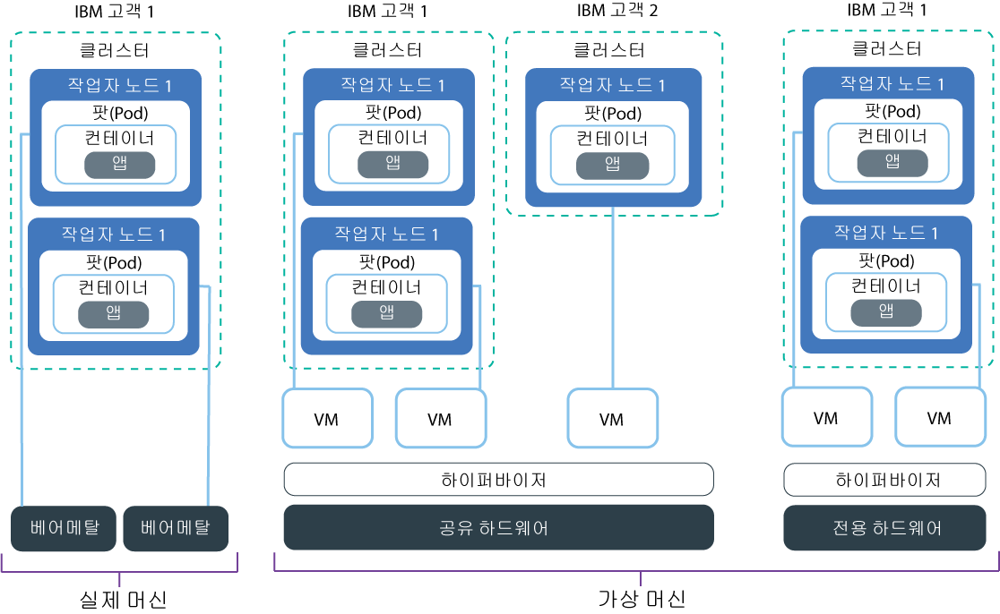

---

copyright:
  years: 2014, 2019
lastupdated: "2019-06-11"

keywords: kubernetes, iks, multi az, multi-az, szr, mzr

subcollection: containers

---

{:new_window: target="_blank"}
{:shortdesc: .shortdesc}
{:screen: .screen}
{:pre: .pre}
{:table: .aria-labeledby="caption"}
{:codeblock: .codeblock}
{:tip: .tip}
{:note: .note}
{:important: .important}
{:deprecated: .deprecated}
{:download: .download}
{:preview: .preview}

# 작업자 노드 설정 계획
{: #planning_worker_nodes}

Kubernetes 클러스터는 작업자 노드 풀에서 그룹화되고 Kubernetes 마스터에 의해 중앙 집중식으로 모니터링되고 관리되는 작업자 노드로 구성되어 있습니다. 클러스터 관리자는 클러스터 사용자가 클러스터에서 앱을 배치하고 실행하기 위한 모든 리소스를 보유하도록 보장하기 위해 작업자 노드의 클러스터를 설정하는 방법을 결정합니다.
{:shortdesc}

표준 클러스터를 작성하면 동일한 메모리, CPU 및 디스크 공간 스펙(특성)의 작업자 노드가 사용자를 대신하여 IBM Cloud 인프라(SoftLayer)에서 주문되며 클러스터의 기본 작업자 노드 풀에 추가됩니다. 모든 작업자 노드에는 클러스터가 작성된 이후 변경될 수 없는 고유 작업자 노드 ID 및 도메인 이름이 지정됩니다. 가상 서버 또는 실제(베어메탈) 서버 중에서 선택할 수 있습니다. 사용자가 선택하는 하드웨어 격리 레벨에 따라서 가상 작업자 노드를 공유 또는 전용 노드로 설정할 수 있습니다. 다른 특성을 클러스터에 추가하려면 [다른 작업자 풀을 작성](/docs/containers?topic=containers-cli-plugin-kubernetes-service-cli#cs_worker_pool_create)하십시오.

Kubernetes는 클러스터에 속할 수 있는 작업자 노드의 최대수를 제한합니다. 자세한 정보는 [작업자 노드 및 팟(Pod) 할당량 ](https://kubernetes.io/docs/setup/cluster-large/)을 검토하십시오.

워크로드를 처리하기에 작업자 노드가 충분한지 항상 확인하고 싶으십니까? [클러스터 오토스케일러](/docs/containers?topic=containers-ca#ca)를 사용해 보십시오.
{: tip}

 

## 작업자 노드에 사용 가능한 하드웨어
{: #shared_dedicated_node}

{{site.data.keyword.Bluemix_notm}}에서 표준 클러스터를 작성하는 경우, 사용자는 작업자 풀이 실제 머신(베어메탈)이거나 실제 하드웨어에서 실행되는 가상 머신인 작업자 노드로 구성되는지 여부를 선택합니다. 또한 작업자 노드 특성 또는 메모리, CPU 및 기타 머신 스펙(예: 디스크 스토리지)의 조합도 선택합니다.
{:shortdesc}

둘 이상의 작업자 노드 특성을 원하는 경우에는 각 특성마다 작업자 풀을 작성해야 합니다. CPU 또는 메모리와 같은 다른 리소스가 추가되도록 기존 작업자 노드의 크기를 조정할 수 없습니다. 무료 클러스터를 작성하면 작업자 노드가 IBM Cloud 인프라(SoftLayer) 계정에서 가상, 공유 노드로서 자동으로 프로비저닝됩니다. 표준 클러스터에서 사용자는 워크로드에 가장 최적으로 작동하는 시스템 유형을 선택할 수 있습니다. 계획을 수립할 때 총 CPU 및 메모리 용량의 [작업자 노드 리소스 예약](#resource_limit_node)을 고려하십시오.

다음 옵션 중 하나를 선택하여 원하는 작업자 풀의 유형을 결정하십시오.
* [가상 머신](#vm)
* [실제 머신(베어메탈)](#bm)
* [SDS(Software-Defined Storage) 머신](#sds)

## 가상 머신
{: #vm}

VM을 사용하면 더 비용 효율적인 가격으로 베어메탈보다 더 뛰어난 유연성, 빠른 프로비저닝 시간 및 자동화된 확장성 기능을 얻을 수 있습니다. 테스트 및 개발 환경, 스테이징 및 프로덕션 환경, 마이크로서비스 및 비즈니스 앱과 같은 가장 일반적인 용도의 유스 케이스에 VM을 사용할 수 있습니다. 그러나 성능에는 트레이드오프가 있을 수 있습니다. RAM, 데이터 및 GPU 집약적 워크로드를 처리하기 위해 고성능 컴퓨팅이 필요하면 [베어메탈](#bm)을 사용하십시오.
{: shortdesc}

**내가 공유 또는 전용 하드웨어를 사용해야 합니까?** 
표준 가상 클러스터를 작성하는 경우에는 기본 하드웨어를 여러 {{site.data.keyword.IBM_notm}} 고객이 공유하도록 할 것인지(멀티 테넌시) 또는 자체 전용으로 사용할 것인지(단일 테넌시) 여부를 선택해야 합니다.

* **멀티 테넌트, 공유 하드웨어 설정에서**: 실제 리소스(예: CPU 및 메모리)는 동일한 실제 하드웨어에 배치된 모든 가상 머신 간에 공유됩니다. 모든 가상 머신이 독립적으로 실행될 수 있도록 보장하기 위해, 가상 머신 모니터(하이퍼바이저라고도 함)는 실제 리소스를 격리된 엔티티로 세그먼트화하고 이를 전용 리소스로서 가상 머신에 할당합니다(하이퍼바이저 격리).
* **싱글 테넌트, 전용 하드웨어 설정에서**: 모든 실제 리소스는 자체 전용으로 사용됩니다. 동일한 실제 호스트에서 가상 머신으로서 여러 작업자 노드를 배치할 수 있습니다. 멀티 테넌트 설정과 유사하게, 하이퍼바이저는 모든 작업자 노드가 사용 가능한 실제 리소스의 해당 공유를 가져오도록 보장합니다.

기반 하드웨어의 비용이 여러 고객 간에 공유되므로, 공유 노드는 일반적으로 전용 노드보다 비용이 저렴합니다. 그러나 공유 및 전용 노드 간에 결정하는 경우, 사용자는 자체 법률 부서에 문의하여 앱 환경에서 요구하는 인프라 격리 및 준수의 레벨을 논의하고자 할 수 있습니다.

몇 가지 특성은 한 가지 유형의 테넌시 설정에서만 사용할 수 있습니다. 예를 들어, `m3c` VM은 `shared` 테넌시 설정으로만 사용할 수 있습니다.
{: note}

**VM의 일반적인 특징은 무엇입니까?** 
가상 머신은 신뢰성을 위해 SAN(Storage Area Networing) 대신 로컬 디스크를 사용합니다. 신뢰성을 갖게 되면 로컬 디스크에 바이트를 직렬화하는 경우 처리량이 많아지고 네트워크 장애로 인한 파일 시스템 성능 저하를 줄일 수 있습니다. 모든 VM에는 1000Mbps 네트워킹 속도, OS 파일 시스템용 25GB 기본 로컬 디스크 스토리지, 그리고 컨테이너 런타임 및 `kubelet` 등의 데이터용 100GB 보조 로컬 디스크 스토리지가 포함되어 있습니다. 작업자 노드에 있는 로컬 스토리지는 단기 처리만을 위한 것이며, 작업자 노드를 업데이트하거나 다시 로드하면 기본 및 보조 디스크의 내용은 삭제됩니다. 지속적 스토리지 솔루션은 [고가용성 지속적 스토리지 계획](/docs/containers?topic=containers-storage_planning#storage_planning)을 참조하십시오.

**이전 머신 유형이 있으면 어떻게 됩니까?** 
클러스트에 더 이상 사용되지 않는 `x1c` 또는 이전 Ubuntu 16 `x2c` 작업자 노드 특성이 있는 경우, [Ubuntu 18 `x3c` 작업자 노드를 보유하도록 클러스터를 업데이트](/docs/containers?topic=containers-update#machine_type)할 수 있습니다.

**어떤 가상 머신 특성을 사용할 수 있습니까?** 
작업자 노드 특성은 구역에 따라 다양합니다. 다음 표에는 이전 `x2c` Ubuntu 16 작업자 노드 특성과는 반대로 `x3c` Ubuntu 18 작업자 노드 특성과 같은 특성의 최신 버전이 포함되어 있습니다. 해당 구역에서 사용 가능한 머신 유형을 보려면 `ibmcloud ks machine-types <zone>`을 실행하십시오. 사용 가능한 [베어메탈](#bm) 또는 [SDS](#sds) 머신 유형을 검토할 수도 있습니다.

{: #vm-table}
<table>
<caption>{{site.data.keyword.containerlong_notm}}에서 사용 가능한 가상 머신 유형.</caption>
<thead>
<th>이름 및 유스 케이스</th>
<th>코어 수 / 메모리</th>
<th>기본 / 보조 디스크</th>
<th>네트워크 속도</th>
</thead>
<tbody>
<tr>
<td><strong>Virtual, u3c.2x4</strong>: 빠른 테스트, 개념 증명(PoC) 및 기타 경량 워크로드에는 이 가장 작은 크기의 VM을 사용하십시오.</td>
<td>2 / 4GB</td>
<td>25GB / 100GB</td>
<td>1000Mbps</td>
</tr>
<tr>
<td><strong>Virtual, b3c.4x16</strong>: 테스트, 개발 및 기타 경량 워크로드의 경우 이 균형 VM을 선택하십시오.</td>
<td>4 / 16GB</td>
<td>25GB / 100GB</td>
<td>1000Mbps</td>
</tr>
<tr>
<td><strong>Virtual, b3c.16x64</strong>: 중간 규모의 워크로드의 경우 이 균형 VM을 선택하십시오.</td></td>
<td>16 / 64GB</td>
<td>25GB / 100GB</td>
<td>1000Mbps</td>
</tr>
<tr>
<td><strong>Virtual, b3c.32x128</strong>: 동시 사용자가 많은 데이터베이스 및 동적 웹 사이트와 같은 중간 규모에서 대규모 워크로드의 경우 이 균형 VM을 선택하십시오.</td>
<td>32 / 128GB</td>
<td>25GB / 100GB</td>
<td>1000Mbps</td>
</tr>
<tr>
<td><strong>가상, c3c.16x16</strong>: 경량 워크로드의 경우 작업자 노드의 컴퓨팅 리소스에 대한 균등한 밸런스를 원하면 이 특성을 사용하십시오.</td>
<td>16 / 16GB</td>
<td>25GB / 100GB</td>
<td>1000Mbps</td>
</tr><tr>
<td><strong>가상, c3c.16x32</strong>: 경량에서 중형급 워크로드를 위해 작업자 노드의 CPU 및 메모리 리소스의 비율이 1:2가 되기를 원하는 경우에는 이 특성을 사용하십시오.</td>
<td>16 / 32GB</td>
<td>25GB / 100GB</td>
<td>1000Mbps</td>
</tr><tr>
<td><strong>가상, c3c.32x32</strong>: 중형급 워크로드의 경우 작업자 노드의 컴퓨팅 리소스에 대한 균등한 밸런스를 원하면 이 특성을 사용하십시오.</td>
<td>32 / 32GB</td>
<td>25GB / 100GB</td>
<td>1000Mbps</td>
</tr><tr>
<td><strong>가상, c3c.32x64</strong>: 중형급 워크로드를 위해 작업자 노드의 CPU 및 메모리 리소스의 비율이 1:2가 되기를 원하는 경우에는 이 특성을 사용하십시오.</td>
<td>32 / 64GB</td>
<td>25GB / 100GB</td>
<td>1000Mbps</td>
</tr>
<tr>
<td><strong>가상, m3c.8x64</strong>: {{site.data.keyword.Db2_on_Cloud_short}}와 유사한 데이터베이스처럼 추가 메모리가 필요한 경량에서 중형급 워크로드를 위해 CPU 및 메모리 리소스의 비율이 1:8이 되기를 원하는 경우에는 이 특성을 사용하십시오. 댈러스에서만 `--hardware shared` 테넌시로 사용할 수 있습니다.</td>
<td>8 / 64GB</td>
<td>25GB / 100GB</td>
<td>1000Mbps</td>
</tr><tr>
<td><strong>가상, m3c.16x128</strong>: {{site.data.keyword.Db2_on_Cloud_short}}와 유사한 데이터베이스처럼 추가 메모리가 필요한 중형급 워크로드를 위해 CPU 및 메모리 리소스의 비율이 1:8이 되기를 원하는 경우에는 이 특성을 사용하십시오. 댈러스에서만 `--hardware shared` 테넌시로 사용할 수 있습니다.</td>
<td>16 / 128GB</td>
<td>25GB / 100GB</td>
<td>1000Mbps</td>
</tr><tr>
<td><strong>가상, m3c.30x240</strong>: {{site.data.keyword.Db2_on_Cloud_short}}와 유사한 데이터베이스처럼 추가 메모리가 필요한 중형급에서 대형급 워크로드를 위해 CPU 및 메모리 리소스의 비율이 1:8이 되기를 원하는 경우에는 이 특성을 사용하십시오. 댈러스에서만 `--hardware shared` 테넌시로 사용할 수 있습니다.</td>
<td>30 / 240GB</td>
<td>25GB / 100GB</td>
<td>1000Mbps</td>
</tr>
<tr>
<td><strong>가상, z1.2x4.32x32</strong>: Hyper Protect Containers on IBM Z Systems에서 작업자 노드를 작성하려면 이 특성을 사용하십시오. </td>
<td>2 / 4GB</td>
<td>25GB / 100GB</td>
<td>1000Mbps</td>
</tr>
</tbody>
</table>

## 실제 머신(베어메탈)
{: #bm}

베어메탈이라고도 하는 싱글 테넌트 실제 서버로서 작업자 노드를 프로비저닝할 수 있습니다.
{: shortdesc}

**베어메탈과 VM의 차이점은 무엇입니까?** 
베어메탈은 메모리 또는 CPU와 같이 머신의 실제 리소스에 직접 액세스를 제공합니다. 이 설정은 호스트에서 실행되는 가상 머신에 실제 리소스를 할당하는 가상 머신 하이퍼바이저를 제거합니다. 대신, 모든 베어메탈 머신의 리소스가 작업자 전용으로만 사용되므로 리소스를 공유하거나 성능을 저하시키는 "시끄러운 이웃(noisy neighbors)" 문제를 신경쓰지 않아도 됩니다. 실제 머신 유형에는 가상 머신 유형보다 더 많은 로컬 스토리지가 있으며, 일부에는 데이터 가용성 향상을 위한 RAID 구성이 있습니다. 작업자 노드에 있는 로컬 스토리지는 단기 처리만을 위한 것이며, 작업자 노드를 업데이트하거나 다시 로드하면 기본 및 보조 디스크의 내용은 삭제됩니다. 지속적 스토리지 솔루션은 [고가용성 지속적 스토리지 계획](/docs/containers?topic=containers-storage_planning#storage_planning)을 참조하십시오.

**성능 향상을 위한 우수한 스펙 외에, VM에서 수행할 수 없는 작업을 베어메탈에서 수행할 수 있습니까?** 
예. 베어메탈에서는 신뢰할 수 있는 컴퓨팅을 사용하여 작업자 노드의 변조 여부를 확인하는 옵션이 있습니다. 클러스터 작성 중에 신뢰 사용을 설정하지 않고 나중에 이를 수행하려면 `ibmcloud ks feature-enable` [명령](/docs/containers?topic=containers-cli-plugin-kubernetes-service-cli#cs_cluster_feature_enable)을 사용할 수 있습니다. 신뢰를 사용하도록 설정한 후에는 나중에 사용하지 않도록 설정할 수 없습니다. 신뢰가 없는 새 클러스터를 작성할 수 있습니다. 노드 시작 프로세스 중의 신뢰 작동 방법에 대한 자세한 정보는 [신뢰할 수 있는 컴퓨팅의 {{site.data.keyword.containerlong_notm}}](/docs/containers?topic=containers-security#trusted_compute)를 참조하십시오. 신뢰할 수 있는 컴퓨팅은 특정 베어메탈 머신 유형에 사용될 수 있습니다. `ibmcloud ks machine-types <zone>` [명령](/docs/containers?topic=containers-cli-plugin-kubernetes-service-cli#cs_machine_types)을 실행하면 **Trustable** 필드를 검토하여 신뢰를 지원하는 머신을 확인할 수 있습니다. 예를 들어, `mgXc` GPU 특성(flavor)은 신뢰할 수 있는 컴퓨팅을 지원하지 않습니다.

신뢰할 수 있는 컴퓨팅 외에도 {{site.data.keyword.datashield_full}}(베타)를 활용할 수도 있습니다. {{site.data.keyword.datashield_short}}는 Intel® Software Guard Extensions(SGX) 및 Fortanix® 기술과 통합되어 {{site.data.keyword.Bluemix_notm}} 컨테이너 워크로드 코드와 데이터가 사용 중에 보호됩니다. 앱 코드와 데이터는 앱의 중요한 부분을 보호하는 작업자 노드의 신뢰할 수 있는 메모리 영역인 CPU 강화 엔클레이브에서 실행되므로 코드와 데이터를 기밀로 유지하고 수정하지 않고 유지하는 데 도움이 됩니다. 내부 정책, 정부 규제 또는 업계 규제 준수 요구사항으로 인해 사용자 또는 회사에서 데이터 민감도가 필요한 경우, 이 솔루션은 클라우드로 전환하는 데 도움이 될 수 있습니다. 예제 유스 케이스에는 금융 및 의료 서비스 기관 또는 온프레미스 클라우드 솔루션이 필요한 정부 정책이 있는 국가가 포함됩니다.

**베어메탈은 대단한 것 같습니다! 내가 이를 바로 주문할 수 없는 이유는 무엇입니까?** 
베어메탈 서버는 가상 서버보다 고가이며, 추가 리소스와 호스트 제어가 필요한 고성능 앱에 최적화되어 있습니다.

베어메탈 서버는 월별로 비용이 청구됩니다. 월말 전에 베어메탈 서버를 취소하는 경우 해당 월말까지 비용이 청구됩니다. 베어메탈 서버를 주문하거나 취소하면 해당 프로세스는 IBM Cloud 인프라(SoftLayer) 계정에서 수동으로 완료됩니다. 그래서 완료하는 데 영업일 기준으로 이틀 이상 걸릴 수 있습니다.
{: important}

**어떤 베어메탈 특성을 내가 주문할 수 있습니까?** 
작업자 노드 특성은 구역에 따라 다양합니다. 다음 표에는 이전 `x2c` Ubuntu 16 작업자 노드 특성과는 반대로 `x3c` Ubuntu 18 작업자 노드 특성과 같은 특성의 최신 버전이 포함되어 있습니다. 해당 구역에서 사용 가능한 머신 유형을 보려면 `ibmcloud ks machine-types <zone>`을 실행하십시오. 사용 가능한 [VM](#vm) 또는 [SDS](#sds) 머신 유형을 검토할 수도 있습니다.

베어메탈 머신은 다양한 유스 케이스(예: RAM 집약적, 데이터 집약적 또는 GPU 집약적 워크로드)에 최적화되어 있습니다.

워크로드를 지원하는 올바른 스토리지 구성이 있는 머신 유형을 선택하십시오. 일부 특성에는 다음과 같은 디스크와 스토리지 구성이 혼합되어 있습니다. 예를 들어, 일부 특성에는 원시 SSD 보조 디스크와 함께 SATA 기본 디스크가 있을 수 있습니다.

* **SATA**: OS 파일 시스템을 저장하는 작업자 노드의 기본 디스크에 종종 사용되는 자기 스피닝 디스크 스토리지 디바이스입니다.
* **SSD**: 고성능 데이터를 위한 SSD(Solid-State Drive) 스토리지 디바이스입니다.
* **원시**: 스토리지 디바이스가 포맷되지 않았으며 전체 용량을 사용할 수 있습니다.
* **RAID**: 스토리지 디바이스에 RAID 레벨에 따라 다양한 중복성과 성능을 위해 분산된 데이터가 있습니다. 이와 같이 사용할 수 있는 디스크 용량은 다양합니다.

{: #bm-table}
<table>
<caption>{{site.data.keyword.containerlong_notm}}에서 사용 가능한 베어메탈 머신 유형.</caption>
<thead>
<th>이름 및 유스 케이스</th>
<th>코어 수 / 메모리</th>
<th>기본 / 보조 디스크</th>
<th>네트워크 속도</th>
</thead>
<tbody>
<tr>
<td><strong>RAM 집약적인 베어메탈, mr3c.28x512</strong>: 작업자 노드에 사용 가능한 RAM을 최대화합니다.</td>
<td>28 / 512GB</td>
<td>2TB SATA / 960GB SSD</td>
<td>10000Mbps</td>
</tr>
<tr>
<td><strong>GPU 베어메탈, mg3c.16x128</strong>: 고성능 컴퓨팅, 기계 학습 또는 3D 애플리케이션과 같은 수학적으로 집약적인 워크로드의 경우 이 유형을 선택하십시오. 이 특성에는 한 개의 Tesla K80 실제 카드가 있으며 카드당 두 개씩 총 두 개의 그래픽 처리 장치(GPU)가 포함되어 있습니다.</td>
<td>16 / 128GB</td>
<td>2TB SATA / 960GB SSD</td>
<td>10000Mbps</td>
</tr>
<tr>
<td><strong>GPU 베어메탈, mg3c.28x256</strong>: 고성능 컴퓨팅, 기계 학습 또는 3D 애플리케이션과 같은 수학적으로 집약적인 워크로드의 경우 이 유형을 선택하십시오. 이 특성에는 두 개의 Tesla K80 실제 카드가 있으며 카드당 두 개씩 총 네 개의 GPU가 포함되어 있습니다.</td>
<td>28 / 256GB</td>
<td>2TB SATA / 960GB SSD</td>
<td>10000Mbps</td>
</tr>
<tr>
<td><strong>데이터 집약적인 베어메탈, md3c.16x64.4x4tb</strong>: 분산 파일 시스템, 대형 데이터베이스, 빅데이터 분석 등의 워크로드를 위해 데이터 가용성 향상을 위한 RAID를 포함하는 대용량 로컬 디스크 스토리지를 원하는 경우에는 이 유형을 사용하십시오.</td>
<td>16 / 64GB</td>
<td>2x2 TB RAID1 / 4x4 TB SATA RAID10</td>
<td>10000Mbps</td>
</tr>
<tr>
<td><strong>데이터 집약적인 베어메탈, md3c.28x512.4x4tb</strong>: 분산 파일 시스템, 대형 데이터베이스, 빅데이터 분석 등의 워크로드를 위해 데이터 가용성 향상을 위한 RAID를 포함하는 대용량 로컬 디스크 스토리지를 원하는 경우에는 이 유형을 사용하십시오.</td>
<td>28 / 512GB</td>
<td>2x2 TB RAID1 / 4x4 TB SATA RAID10</td>
<td>10000Mbps</td>
</tr>
<tr>
<td><strong>균형 베어메탈, mb3c.4x32</strong>: 가상 머신에서 제공하는 것보다 더 많은 컴퓨팅 리소스가 필요한 균형 워크로드에 사용하십시오. 이 특성은 <a href="/docs/services/data-shield?topic=data-shield-getting-started#getting-started" target="_blank">{{site.data.keyword.datashield_short}}(베타)</a>를 사용하여 데이터 메모리를 암호화할 수 있도록 Intel® Software Guard Extensions(SGX)을 사용하여 사용으로 설정할 수도 있습니다.</td>
<td>4 / 32GB</td>
<td>2TB SATA / 2TB SATA</td>
<td>10000Mbps</td>
</tr>
<tr>
<td><strong>균형 베어메탈, mb3c.16x64</strong>: 가상 머신에서 제공하는 것보다 더 많은 컴퓨팅 리소스가 필요한 균형 워크로드에 사용하십시오.</td>
<td>16 / 64GB</td>
<td>2TB SATA / 960GB SSD</td>
<td>10000Mbps</td>
</tr>
<tr>
</tbody>
</table>

## SDS(Software-Defined Storage) 머신
{: #sds}

SDS(Software-Defined Storage) 특성은 실제 로컬 스토리지를 위한 추가 원시 디스크와 함께 프로비저닝되는 실제 머신입니다. 이러한 원시 디스크는 기본 및 보조 로컬 디스크와 달리 작업자 노드 업데이트 또는 다시 로드 중에 내용이 삭제되지 않습니다. 데이터가 컴퓨팅 노드와 공존하므로 SDS 머신은 고성능 워크로드에 적합합니다.
{: shortdesc}

**SDS 특성을 언제 사용합니까?** 
일반적으로 다음과 같은 경우에 SDS 머신을 사용합니다.
*  클러스터에 대한 SDS 추가 기능(예: [Portworx](/docs/containers?topic=containers-portworx#portworx))을 사용하는 경우에는 SDS 머신을 사용하십시오.
*  앱이 로컬 스토리지를 필요로 하는 [StatefulSet ](https://kubernetes.io/docs/concepts/workloads/controllers/statefulset/)인 경우에는 SDS 머신을 사용하고 [Kubernetes 로컬 지속적 볼륨(베타) ](https://kubernetes.io/blog/2018/04/13/local-persistent-volumes-beta/)을 프로비저닝할 수 있습니다.
*  추가 원시 로컬 스토리지를 요구하는 사용자 정의 앱이 있을 수 있습니다.

추가 스토리지 솔루션은 [고가용성 지속적 스토리지 계획](/docs/containers?topic=containers-storage_planning#storage_planning)을 참조하십시오.

**어떤 SDS 특성을 주문할 수 있습니까?** 
작업자 노드 특성은 구역에 따라 다양합니다. 다음 표에는 이전 `x2c` Ubuntu 16 작업자 노드 특성과는 반대로 `x3c` Ubuntu 18 작업자 노드 특성과 같은 특성의 최신 버전이 포함되어 있습니다. 해당 구역에서 사용 가능한 머신 유형을 보려면 `ibmcloud ks machine-types <zone>`을 실행하십시오. 사용 가능한 [베어메탈](#bm) 또는 [VM](#vm) 머신 유형을 검토할 수도 있습니다.

워크로드를 지원하는 올바른 스토리지 구성이 있는 머신 유형을 선택하십시오. 일부 특성에는 다음과 같은 디스크와 스토리지 구성이 혼합되어 있습니다. 예를 들어, 일부 특성에는 원시 SSD 보조 디스크와 함께 SATA 기본 디스크가 있을 수 있습니다.

* **SATA**: OS 파일 시스템을 저장하는 작업자 노드의 기본 디스크에 종종 사용되는 자기 스피닝 디스크 스토리지 디바이스입니다.
* **SSD**: 고성능 데이터를 위한 SSD(Solid-State Drive) 스토리지 디바이스입니다.
* **원시**: 스토리지 디바이스가 포맷되지 않았으며 전체 용량을 사용할 수 있습니다.
* **RAID**: 스토리지 디바이스에 RAID 레벨에 따라 다양한 중복성과 성능을 위해 분산된 데이터가 있습니다. 이와 같이 사용할 수 있는 디스크 용량은 다양합니다.

{: #sds-table}
<table>
<caption>{{site.data.keyword.containerlong_notm}}에서 사용 가능한 SDS 머신 유형.</caption>
<thead>
<th>이름 및 유스 케이스</th>
<th>코어 수 / 메모리</th>
<th>기본 / 보조 디스크</th>
<th>추가 원시 디스크</th>
<th>네트워크 속도</th>
</thead>
<tbody>
<tr>
<td><strong>SDS, ms3c.4x32.1.9tb.ssd의 베어메탈</strong>: 성능 향상을 위해 로컬 스토리지가 추가로 필요하면 SDS(Software-Defined Storage)를 지원하는 이 디스크 집약적 특성을 사용하십시오.</td>
<td>4 / 32GB</td>
<td>2TB SATA / 960GB SSD</td>
<td>1.9TB 원시 SSD(디바이스 경로: `/dev/sdc`)</td>
<td>10000Mbps</td>
</tr>
<tr>
<td><strong>SDS, ms3c.16x64.1.9tb.ssd의 베어메탈</strong>: 성능 향상을 위해 로컬 스토리지가 추가로 필요하면 SDS(Software-Defined Storage)를 지원하는 이 디스크 집약적 특성을 사용하십시오.</td>
<td>16 / 64GB</td>
<td>2TB SATA / 960GB SSD</td>
<td>1.9TB 원시 SSD(디바이스 경로: `/dev/sdc`)</td>
<td>10000Mbps</td>
</tr>
<tr>
<td><strong>SDS, ms3c.28x256.3.8tb.ssd의 베어메탈</strong>: 성능 향상을 위해 로컬 스토리지가 추가로 필요하면 SDS(Software-Defined Storage)를 지원하는 이 디스크 집약적 특성을 사용하십시오.</td>
<td>28 / 256GB</td>
<td>2TB SATA / 1.9TB SSD</td>
<td>3.8TB 원시 SSD(디바이스 경로: `/dev/sdc`)</td>
<td>10000Mbps</td>
</tr>
<tr>
<td><strong>SDS, ms3c.28x512.4x3.8tb.ssd의 베어메탈</strong>: 성능 향상을 위해 로컬 스토리지가 추가로 필요하면 SDS(Software-Defined Storage)를 지원하는 이 디스크 집약적 특성을 사용하십시오.</td>
<td>28 / 512GB</td>
<td>2TB SATA / 1.9TB SSD</td>
<td>4개의 디스크, 3.8TB 원시 SSD(디바이스 경로: `/dev/sdc`, `/dev/sdd`, `/dev/sde`, `/dev/sdf`)</td>
<td>10000Mbps</td>
</tr>
</tbody>
</table>

## 작업자 노드 리소스 예약
{: #resource_limit_node}

{{site.data.keyword.containerlong_notm}}에서는 각 작업자 노드에서 사용 가능한 컴퓨팅 리소스를 제한하는 컴퓨팅 리소스 예약을 설정합니다. 예약된 메모리와 CPU 리소스는 작업자 노드의 팟(Pod)에 의해 사용될 수 없으며, 각 작업자 노드의 할당 가능한 리소스를 줄입니다. 초기에 팟(Pod)을 배치하는 경우, 작업자 노드에 할당 가능한 리소스가 충분히 없으면 배치에 실패합니다. 또한 팟(Pod)이 작업자 노드 리소스 한계를 초과하면 팟(Pod)이 제거됩니다. Kubernetes에서 이 한계는 [하드 축출 임계값(hard eviction threshold) ](https://kubernetes.io/docs/tasks/administer-cluster/out-of-resource/#hard-eviction-thresholds)이라고 합니다.
{:shortdesc}

작업자 노드 예약 미만의 CPU 또는 메모리가 사용 가능한 경우, Kubernetes는 충분한 컴퓨팅 리소스를 복원하기 위해 팟(Pod) 제거를 시작합니다. 작업자 노드가 사용 가능한 경우 팟(Pod)은 다른 작업자 노드로 다시 스케줄됩니다. 팟(Pod)이 자주 제거되는 경우에는 클러스터에 작업자 노드를 더 추가하거나 팟(Pod)에서 [리소스 한계 ](https://kubernetes.io/docs/concepts/configuration/manage-compute-resources-container/#resource-requests-and-limits-of-pod-and-container)를 설정하십시오.

작업자 노드에서 예약된 리소스는 작업자 노드와 함께 제공되는 CPU 및 메모리의 양에 따라 다릅니다. {{site.data.keyword.containerlong_notm}}에서는 다음 표에 표시된 대로 메모리와 CPU 티어를 정의합니다. 작업자 노드가 다중 티어의 컴퓨팅 리소스와 함께 제공되는 경우에는 CPU 및 메모리 리소스의 백분율이 각 티어마다 예약됩니다.

작업자 노드에서 현재 사용되는 컴퓨팅 리소스의 양을 검토하려면 [`kubectl top node` ](https://kubernetes.io/docs/reference/kubectl/overview/#top)를 실행하십시오.
{: tip}

<table summary="다음 표는 티어별 작업자 노드 메모리 예약을 보여줍니다.">
<caption>티어별 작업자 노드 메모리 예약.</caption>
<thead>
<tr>
  <th>메모리 티어</th>
  <th>예약된 % 또는 양</th>
  <th>`b3c.4x16` 작업자 노드(16GB) 예</th>
  <th>`mg1c.28x256` 작업자 노드(256GB) 예</th>
</tr>
</thead>
<tbody>
<tr>
  <td>첫 번째 4GB(0 - 4GB)</td>
  <td>25% 메모리</td>
  <td>1GB</td>
  <td>1GB</td>
</tr>
<tr>
  <td>다음 4GB(5 - 8GB)</td>
  <td>20% 메모리</td>
  <td>0.8GB</td>
  <td>0.8GB</td>
</tr>
<tr>
  <td>다음 8GB(9 - 16GB)</td>
  <td>10% 메모리</td>
  <td>0.8GB</td>
  <td>0.8GB</td>
</tr>
<tr>
  <td>다음 112GB(17 - 128GB)</td>
  <td>6% 메모리</td>
  <td>해당사항 없음</td>
  <td>6.72GB</td>
</tr>
<tr>
  <td>나머지 GB(129GB+)</td>
  <td>2% 메모리</td>
  <td>해당사항 없음</td>
  <td>2.54GB</td>
</tr>
<tr>
  <td>[`kubelet` 제거 ](https://kubernetes.io/docs/tasks/administer-cluster/out-of-resource/)를 위한 추가 예약</td>
  <td>100MB</td>
  <td>100MB(일정 양)</td>
  <td>100MB(일정 양)</td>
</tr>
<tr>
  <td>**총 예약**</td>
  <td>**(변동)**</td>
  <td>**총 16GB 중 2.7GB**</td>
  <td>**총 256GB 중 11.96GB**</td>
</tr>
</tbody>
</table>

<table summary="다음 표는 티어별 작업자 노드 CPU 예약을 보여줍니다.">
<caption>티어별 작업자 노드 CPU 예약.</caption>
<thead>
<tr>
  <th>CPU 티어</th>
  <th>% 예약됨</th>
  <th>`b3c.4x16` 작업자 노드(4 코어) 예</th>
  <th>`mg1c.28x256` 작업자 노드(28 코어) 예</th>
</tr>
</thead>
<tbody>
<tr>
  <td>첫 번째 코어(코어 1)</td>
  <td>6% 코어</td>
  <td>0.06 코어</td>
  <td>0.06 코어</td>
</tr>
<tr>
  <td>다음 2 코어(코어 2-3)</td>
  <td>1% 코어</td>
  <td>0.02 코어</td>
  <td>0.02 코어</td>
</tr>
<tr>
  <td>다음 2 코어(코어 4-5)</td>
  <td>0.5% 코어</td>
  <td>0.005 코어</td>
  <td>0.01 코어</td>
</tr>
<tr>
  <td>나머지 코어(코어 6+)</td>
  <td>0.25% 코어</td>
  <td>해당사항 없음</td>
  <td>0.0575 코어</td>
</tr>
<tr>
  <td>**총 예약**</td>
  <td>**(변동)**</td>
  <td>**총 4 코어 중 0.085 코어**</td>
  <td>**총 28 코어 중 0.1475 코어**</td>
</tr>
</tbody>
</table>
