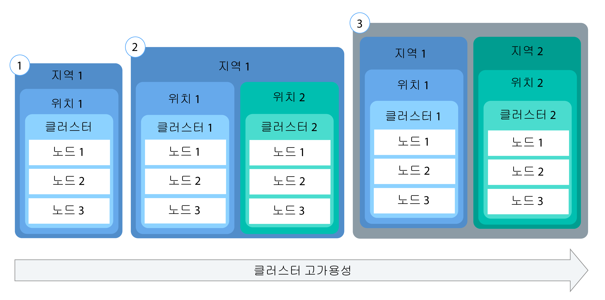
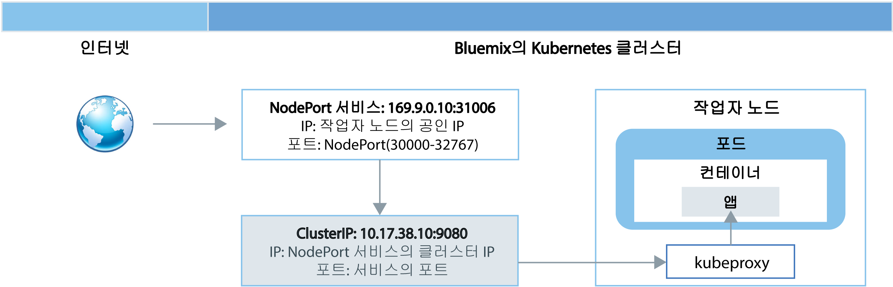
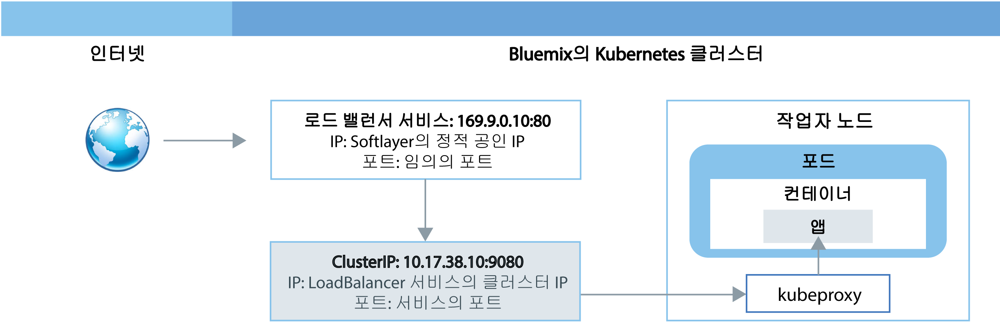
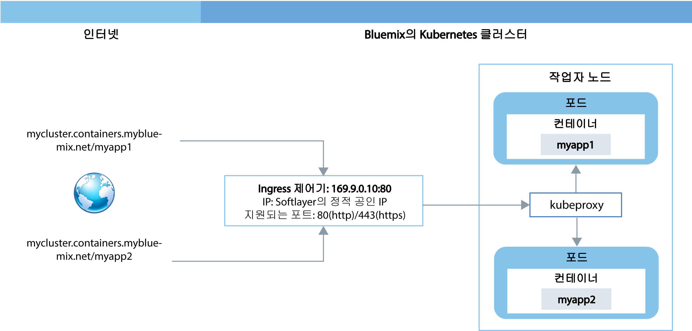
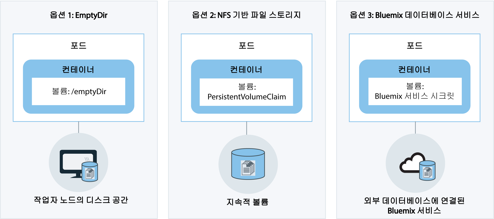

---

copyright:
  years: 2014, 2017
lastupdated: "2017-10-24"

---

{:new_window: target="_blank"}
{:shortdesc: .shortdesc}
{:screen: .screen}
{:pre: .pre}
{:table: .aria-labeledby="caption"}
{:codeblock: .codeblock}
{:tip: .tip}
{:download: .download}


# 클러스터 및 앱 계획
{: #cs_planning}

{{site.data.keyword.containershort_notm}}는 조직의 기능 및 비기능 요구사항을 충족하도록 Kubernetes 클러스터를 구성하고 사용자 정의하기 위한 다수의 옵션을 제공합니다. 이러한 구성 중 일부는 클러스터가 작성된 이후에 변경이 불가능합니다. 이러한 구성을 사전에 알고 있으면 개발 팀이 모든 리소스(예: 메모리, 디스크 공간 및 IP 주소)를 사용할 수 있도록 보장하는 데 도움이 됩니다.
{:shortdesc}

<br />


## 라이트 및 표준 클러스터 비교
{: #cs_planning_cluster_type}

라이트 클러스터를 작성하여 Kubernetes 기능에 익숙해지고 테스트하거나 표준 클러스터를 작성하여 전체 Kubernetes 기능으로 앱 구현을 시작할 수 있습니다.
{:shortdesc}

|특성|라이트 클러스터|표준 클러스터|
|---------------|-------------|-----------------|
|[{{site.data.keyword.Bluemix_notm}} 퍼블릭에서 사용 가능](cs_ov.html#public_environment)|||
|[클러스터의 사설 네트워킹](#cs_planning_private_network)|||
|[NodePort 서비스의 공용 앱 액세스](#cs_nodeport)|||
|[사용자 액세스 관리](cs_cluster.html#cs_cluster_user)|||
|[클러스터와 앱에서 {{site.data.keyword.Bluemix_notm}} 서비스 액세스](cs_cluster.html#cs_cluster_service)|||
|[스토리지를 위한 작업자 노드의 디스크 공간](#cs_planning_apps_storage)|||
|[볼륨이 있는 지속적 NFS 파일 기반 스토리지](#cs_planning_apps_storage)| ||
|[로드 밸런서 서비스의 공용 또는 개인용 앱 액세스](#cs_loadbalancer)| ||
|[Ingress 서비스의 공용 앱 액세스](#cs_ingress)| ||
|[포터블 공인 IP 주소](cs_apps.html#cs_cluster_ip_subnet)| ||
|[{{site.data.keyword.Bluemix_notm}} 데디케이티드(비공개 베타)에서 사용 가능](cs_ov.html#dedicated_environment)| ||
{: caption="표 1. 라이트 클러스터와 표준 클러스터의 차이점" caption-side="top"}

<br />


## 클러스터 구성
{: #cs_planning_cluster_config}

표준 클러스터를 사용하여 앱 가용성을 높일 수 있습니다. 복수의 작업자 노드와 클러스터 간에 설정을 분산시키면 사용자에게 작동 중지 시간이 발생할 가능성이 낮아질 수 있습니다. 로드 밸런싱 및 격리 등의 기본 제공 기능을 사용하면 호스트, 네트워크 또는 앱에서 잠재적 장애가 발생할 때 복원성이 높아집니다.
{:shortdesc}

가용성의 정도가 증가하는 순서로 정렬된 다음의 잠재적 클러스터 설정을 검토하십시오. 

[](https://console.bluemix.net/docs/api/content/containers/images/cs_cluster_ha_roadmap.png)

1.  다중 작업자 노드의 단일 클러스터
2.  동일한 지역의 서로 다른 위치에서 실행 중인 두 개의 클러스터(각각 다중 작업자 노드 보유)
3.  서로 다른 지역에서 실행 중인 두 개의 클러스터(각각 다중 작업자 노드 보유)

이러한 기술을 사용하여 클러스터의 가용성을 높이는 방법에 대해 자세히 알아봅니다. 

<dl>
<dt>앱 인스턴스를 전개하기 위해 충분한 작업자 노드 포함</dt>
<dd>고가용성을 위해서는 앱 개발자가 클러스터당 다중 작업자 노드 간에 자체 컨테이너를 전개할 수 있도록 허용하십시오. 세 개의 작업자 노드를 사용하면 앱의 사용을 인터럽트하지 않고도 하나의 작업자 노드에서 가동 중단이 발생할 수 있습니다. 사용자는 [{{site.data.keyword.Bluemix_notm}} GUI](cs_cluster.html#cs_cluster_ui) 또는 [CLI](cs_cluster.html#cs_cluster_cli)에서 클러스터를 작성할 때 포함할 작업자 노드의 수를 지정할 수 있습니다. Kubernetes는 클러스터에 속할 수 있는 작업자 노드의 최대수를 제한합니다. 자세한 정보는 [작업자 노드 및 포드 할당량 ](https://kubernetes.io/docs/admin/cluster-large/)을 검토하십시오.
<pre class="codeblock">
<code>bx cs cluster-create --location &lt;dal10&gt; --workers 3 --public-vlan &lt;my_public_vlan_id&gt; --private-vlan &lt;my_private_vlan_id&gt; --machine-type &lt;u1c.2x4&gt; --name &lt;my_cluster&gt;</code>
</pre>
</dd>
<dt>클러스터 간에 앱 전개</dt>
<dd>각각 다중 작업자 노드가 있는 다중 클러스터를 작성하십시오. 하나의 클러스터에서 가동 중단이 발생하는 경우, 사용자는 또한 다른 클러스터에 배치된 앱에 계속해서 액세스할 수 있습니다.
<p>클러스터 1:</p>
<pre class="codeblock">
<code>bx cs cluster-create --location &lt;dal10&gt; --workers 3 --public-vlan &lt;my_public_vlan_id&gt; --private-vlan &lt;my_private_vlan_id&gt; --machine-type &lt;u1c.2x4&gt; --name &lt;my_cluster1&gt;</code>
</pre>
<p>클러스터 2:</p>
<pre class="codeblock">
<code>bx cs cluster-create --location &lt;dal12&gt; --workers 3 --public-vlan &lt;my_public_vlan_id&gt; --private-vlan &lt;my_private_vlan_id&gt; --machine-type &lt;u1c.2x4&gt;  --name &lt;my_cluster2&gt;</code>
</pre>
</dd>
<dt>서로 다른 지역의 클러스터 간에 앱 전개</dt>
<dd>서로 다른 지역의 클러스터 간에 애플리케이션을 전개하는 경우에는 사용자가 있는 지역을 기반으로 로드 밸런싱이 발생하도록 허용할 수 있습니다. 한 지역의 클러스터, 하드웨어 또는 전체 위치가 가동 중단된 경우, 다른 데이터 센터에 배치된 컨테이너로 트래픽이 라우트됩니다.
<p><strong>중요:</strong> 사용자 정의 도메인을 구성한 다음 이러한 명령을 사용하여 클러스터를 작성할 수 있습니다.</p>
<p>위치 1:</p>
<pre class="codeblock">
<code>bx cs cluster-create --location &lt;dal10&gt; --workers 3 --public-vlan &lt;my_public_vlan_id&gt; --private-vlan &lt;my_private_vlan_id&gt; --machine-type &lt;u1c.2x4&gt; --name &lt;my_cluster1&gt;</code>
</pre>
<p>위치 2:</p>
<pre class="codeblock">
<code>bx cs cluster-create --location &lt;ams03&gt; --workers 3 --public-vlan &lt;my_public_vlan_id&gt; --private-vlan &lt;my_private_vlan_id&gt; --machine-type &lt;u1c.2x4&gt; --name &lt;my_cluster2&gt;</code>
</pre>
</dd>
</dl>

<br />


## 작업자 노드 구성
{: #cs_planning_worker_nodes}

Kubernetes 클러스터는 가상 머신 작업자 노드로 구성되어 있으며 Kubernetes 마스터에 의해 중앙 집중식으로 모니터링되고 관리됩니다. 클러스터 관리자는 클러스터 사용자가 클러스터에서 앱을 배치하고 실행하기 위해 모든 리소스를 보유하도록 보장하기 위해 작업자 노드의 클러스터를 설정하는 방법을 결정해야 합니다.
{:shortdesc}

표준 클러스터를 작성하면 작업자 노드가 사용자를 대신하여 IBM Bluemix Infrastructure(SoftLayer)에서 정렬되며 {{site.data.keyword.Bluemix_notm}}에 설정됩니다. 모든 작업자 노드에는 클러스터가 작성된 이후 변경될 수 없는 고유 작업자 노드 ID 및 도메인 이름이 지정됩니다. 사용자가 선택하는 하드웨어 격리 레벨에 따라서 작업자 노드를 공유 또는 전용 노드로 설정할 수 있습니다. 모든 작업자 노드는 작업자 노드에 배치된 컨테이너가 사용할 수 있는 vCPU 수, 메모리 및 디스크 공간을 판별하는 특정 시스템 유형으로 프로비저닝됩니다. Kubernetes는 클러스터에 속할 수 있는 작업자 노드의 최대수를 제한합니다. 자세한 정보는 [작업자 노드 및 포드 할당량 ](https://kubernetes.io/docs/admin/cluster-large/)을 검토하십시오. 


### 작업자 노드용 하드웨어
{: #shared_dedicated_node}

모든 작업자 노드는 실제 하드웨어에서 가상 머신으로 설정되어 있습니다. {{site.data.keyword.Bluemix_notm}} 퍼블릭에서 표준 클러스터를 작성하는 경우에는 기본 하드웨어를 여러 {{site.data.keyword.IBM_notm}} 고객이 공유하도록 할지(멀티 테넌시) 또는 사용자만 전용으로 사용할 수 있도록 할지(단일 테넌시) 여부를 선택해야 합니다.
{:shortdesc}

멀티 테넌트 설정에서 실제 리소스(예: CPU 및 메모리)는 동일한 실제 하드웨어에 배치된 모든 가상 머신 간에 공유됩니다. 모든 가상 머신이 독립적으로 실행될 수 있도록 보장하기 위해, 가상 머신 모니터(하이퍼바이저라고도 함)는 실제 리소스를 격리된 엔티티로 세그먼트화하고 이를 전용 리소스로서 가상 머신에 할당합니다(하이퍼바이저 격리). 

단일 테넌트 설정에서 실제 모든 리소스는 사용자 전용으로 제공됩니다. 동일한 실제 호스트에서 가상 머신으로서 여러 작업자 노드를 배치할 수 있습니다. 멀티 테넌트 설정과 유사하게, 하이퍼바이저는 모든 작업자 노드가 사용 가능한 실제 리소스의 해당 공유를 가져오도록 보장합니다. 

기본 하드웨어의 비용이 여러 고객 간에 공유되므로, 공유 노드는 일반적으로 전용 노드보다 비용이 저렴합니다. 그러나 공유 및 전용 노드 간에 결정하는 경우, 사용자는 자체 법률 부서에 문의하여 앱 환경에서 요구하는 인프라 격리 및 준수의 레벨을 논의하고자 할 수 있습니다. 

라이트 클러스터를 작성하면 작업자 노드가 {{site.data.keyword.IBM_notm}} IBM Bluemix Infrastructure(SoftLayer) 계정에서 공유 노드로 자동으로 프로비저닝됩니다. 

{{site.data.keyword.Bluemix_notm}} 데디케이티드에서 클러스터를 작성하는 경우에는 단일 테넌트 설정만 사용되며 모든 실제 리소스는 사용자 전용입니다. 사용자는 동일한 실제 호스트의 가상 머신으로서 다수의 작업자 노드를 배치합니다. 

<br />


## 클러스터 관리 책임
{: #responsibilities}

클러스터를 관리하기 위해 IBM과 공유하는 책임을 검토하십시오. {{site.data.keyword.Bluemix_notm}} 데디케이티드 환경에서 관리되는 클러스터에 대한 책임을 검토하려면 대신 [클라우드 환경 간에 클러스터 관리의 차이점](cs_ov.html#env_differences)을 참조하십시오.
{:shortdesc}

**IBM은 다음을 담당합니다.**

- 클러스터 작성 시 마스터, 작업자 노드 및 클러스터 내의 관리 컴포넌트(예: Ingress 제어기) 배치
- 클러스터에 대한 Kubernetes 마스터의 업데이트, 모니터링 및 복구 관리
- 작업자 노드의 상태를 모니터하고 해당 작업자 노드의 업데이트 및 복구 자동화 제공
- 작업자 노드 추가, 작업자 노드 제거 및 기본 서브넷 작성을 포함하여 인프라 계정에 대한 자동화 태스크 수행
- 클러스터 내의 운영 컴포넌트(예: Ingress 제어기 및 스토리지 플러그인) 관리, 업데이트 및 복구
- 지속적 볼륨 클레임에서 요청될 때 스토리지 볼륨 프로비저닝
- 모든 작업자 노드에 대한 보안 설정 제공

<br />
**사용자는 다음을 담당합니다.**

- [클러스터 내의 Kubernetes 리소스(예: 포드, 서비스 및 배치) 배치 및 관리](cs_apps.html#cs_apps_cli)
- [서비스 및 Kubernetes의 기능을 활용하여 앱의 고가용성 보장](cs_planning.html#highly_available_apps)
- [CLI를 통해 작업자 노드를 추가하거나 제거하여 기능 추가 또는 제거](cs_cli_reference.html#cs_worker_add)
- [클러스터의 네트워크 격리를 위해 IBM Bluemix Infrastructure(SoftLayer)에서 퍼블릭 및 프라이빗 VLAN 작성 ](https://knowledgelayer.softlayer.com/topic/vlans)
- [모든 작업자 노드에서 Kubernetes 마스터 URL에 네트워크로 연결할 수 있는지 확인](cs_security.html#opening_ports) <p>**참고:Note** 작업자 노드에 퍼블릭 및 프라이빗 VLAN이 모두 있는 경우 네트워크 연결이 구성됩니다. 작업자 노드에 프라이빗 VLAN만 설정되어 있는 경우 네트워크 연결을 제공하려면 vyatta가 필요합니다.</p>
- [Kubernetes 주 또는 부 버전 업데이트가 사용 가능한 경우 kube-apiserver 및 작업자 노드를 업데이트할 시기 판별](cs_cluster.html#cs_cluster_update)
- [`kubectl` 명령(예: `cordon` 또는 `drain`)을 실행하고 `bx cs` 명령(예: `reboot`, `reload` 또는 `delete`)을 실행하여 문제가 발생한 작업자 노드를 복구하기 위한 조치 수행](cs_cli_reference.html#cs_worker_reboot)
- [필요에 따라 IBM Bluemix Infrastructure(SoftLayer)에서 더 많은 서브넷 추가 또는 제거](cs_cluster.html#cs_cluster_subnet)
- [IBM Bluemix Infrastructure(SoftLayer)의 지속적 스토리지에 데이터 백업 및 복원 ](../services/RegistryImages/ibm-backup-restore/index.html#ibmbackup_restore_starter)

<br />


## 배치
{: #highly_available_apps}

다중 작업자 노드 및 클러스터에 보다 광범위하게 설정을 분배할수록 사용자가 앱에서 작동 중단을 겪을 가능성이 보다 줄어듭니다.
{:shortdesc}

가용성이 증가하는 순서로 정렬된 다음의 잠재적 앱 설정을 검토하십시오. 

[](../api/content/containers/images/cs_app_ha_roadmap.png)

1.  복제본 세트에 의해 관리되는 n+2 포드의 배치. 
2.  복제본 세트에 의해 관리되며 같은 위치의 여러 노드 간에 전개된(연관관계 방지) n+2 포드의 배치. 
3.  복제본 세트에 의해 관리되며 서로 다른 위치의 여러 노드 간에 전개된(연관관계 방지) n+2 포드의 배치. 
4.  복제본 세트에 의해 관리되며 서로 다른 지역의 여러 노드 간에 전개된(연관관계 방지) n+2 포드의 배치. 

앱의 가용성을 높이기 위한 기술에 대해 자세히 알아보십시오.

<dl>
<dt>배치 및 복제본 세트를 사용하여 앱과 해당 종속 항목 배치</dt>
<dd>배치는 앱과 해당 종속 항목의 모든 컴포넌트를 선언하는 데 사용할 수 있는 Kubernetes 리소스입니다. 모든 필수 단계와 이를 작성하는 순서를 기술하는 대신 단일 컴포넌트를 기술하여, 실행 시에 앱이 어떻게 표시되어야 하는지에 집중할 수 있습니다.

</br></br>
둘 이상의 포드를 배치하는 경우, 포드를 모니터하며 항상 원하는 수의 포드가 시작되고 실행되도록 보장하는 복제본 세트가 배치에 대해 자동으로 작성됩니다. 포드가 중단되는 경우, 복제본 세트는 응답하지 않는 포드를 새 포드로 대체합니다.
</br></br>
배치를 사용하면 롤링 업데이트 중에 추가할 포드의 수와 한 번에 사용 불가능한 포드의 수를 포함하여 앱에 대한 업데이트 전략을 정의할 수 있습니다. 롤링 업데이트를 수행할 때 배치는 개정이 작동 중인지 여부를 확인하며, 장애가 발견되면 롤아웃을 중지합니다.
</br></br>
배치는 서로 다른 플래그로 여러 개정을 동시에 배치하는 가능성도 제공합니다. 따라서 예를 들어, 프로덕션으로 푸시하기로 결정하기 전에 우선 배치를 테스트할 수 있습니다.
</br></br>
모든 배치는 배치된 개정을 계속해서 추적합니다. 업데이트가 예상대로 작동하지 않음을 발견할 때 개정의 이 히스토리를 사용하여 이전 버전으로 롤백할 수 있습니다. </dd>
<dt>앱의 워크로드를 위한 충분한 복제본과 두 개의 추가 복제본 포함</dt>
<dd>앱의 보다 높은 가용성과 장애에 대한 복원성을 더욱 높이려면, 예상된 워크로드를 처리할 수 있도록 최소량 이상의 추가 복제본을 포함할 것을 고려하십시오. 포드가 중단되었으며 복제본 세트가 아직 중단된 포드를 복구하지 않은 경우, 추가 복제본은 워크로드를 처리할 수 있습니다. 두 건의 장애가 동시에 발생하지 않도록 방지하려면, 두 개의 추가 복제본을 포함하십시오. 이 설정은 N+2 패턴입니다. 여기서 N은 수신 워크로드를 처리하기 위한 복제본의 수이며, +2는 두 개의 추가 복제본입니다. 클러스터에 충분한 영역이 있으면 원하는 만큼의 포드를 클러스터에 보유할 수 있습니다.</dd>
<dt>여러 노드 간에 포드 전개(연관관계 방지)</dt>
<dd>배치를 작성할 때 각 포드가 동일한 작업자 노드에 배치될 수 있습니다. 포드가 동일한 작업자 노드에 존재하는 이 설정을 연관관계 또는 코로케이션이라고 합니다. 작업자 노드 장애로부터 앱을 보호하기 위해, <strong>podAntiAffinity</strong> 옵션을 사용하여 여러 작업자 노드 간에 포드를 전개하도록 배치를 실행할 수 있습니다. 이 옵션은 표준 클러스터에만 사용 가능합니다.

</br></br>
<strong>참고:</strong> 다음의 YAML 파일은 모든 포드가 서로 다른 작업자 노드에 배치되도록 합니다. 클러스터에서 사용 가능한 작업자 노드보다 많은 추가 복제본이 정의된 경우에는 연관관계 방지 요구사항을 충족할 수 있는 수의 복제본만 배치됩니다. 추가 작업자 노드가 클러스터에 추가될 때까지 추가 복제본은 보류 상태를 유지합니다.

<pre class="codeblock">
<code>apiVersion: extensions/v1beta1
kind: Deployment
metadata:
name: wasliberty
spec:
        replicas: 3
        template:
metadata:
labels:
app: wasliberty
spec:
      affinity:
        podAntiAffinity:
          preferredDuringSchedulingIgnoredDuringExecution:
          - weight: 100
            podAffinityTerm:
              labelSelector:
                matchExpressions:
                - key: app
                  operator: In
                  values:
                  - wasliberty
              topologyKey: kubernetes.io/hostname
      containers:
      - name: wasliberty
        image: registry.&lt;region&gt;.bluemix.net/ibmliberty
        ports:
        - containerPort: 9080
---
apiVersion: v1
kind: Service
metadata:
  name: wasliberty
  labels:
    app: wasliberty
spec:
  ports:
    # 서비스를 제공할 포트
  - port: 9080
  selector:
    app: wasliberty
  type: NodePort</code></pre>

</dd>
<dt>여러 위치 또는 지역 간에 포드 분배</dt>
<dd>위치 또는 지역 장애로부터 앱을 보호하기 위해 다른 위치 또는 지역에 두 번째 클러스터를 작성하고 배치 YAML을 사용하여 앱에 대한 중복 복제본 세트를 배치할 수 있습니다. 클러스터의 앞에 공유 라우트 및 로드 밸런서를 추가함으로써 위치 및 지역 간에 워크로드를 분배할 수 있습니다. 클러스터 간의 라우트 공유에 대한 자세한 정보는 <a href="https://console.bluemix.net/docs/containers/cs_cluster.html#cs_cluster" target="_blank">클러스터의 고가용성</a>을 참조하십시오.

자세한 정보는 <a href="https://console.bluemix.net/docs/containers/cs_planning.html#cs_planning_cluster_config" target="_blank">고가용성 배치</a> 옵션을 검토하십시오.</dd>
</dl>


### 최소 앱 배치
{: #minimal_app_deployment}

라이트 또는 표준 클러스터의 기본 앱 배치에는 다음 컴포넌트가 포함될 수 있습니다.
{:shortdesc}

<a href="../api/content/containers/images/cs_app_tutorial_components1.png"></a>

최소 앱을 위한 구성 파일 예제입니다.
```
apiVersion: extensions/v1beta1
kind: Deployment
metadata:
  name: ibmliberty
spec:
  replicas: 1
  template:
    metadata:
      labels:
        app: ibmliberty
    spec:
      containers:
      - name: ibmliberty
        image: registry.<region>.bluemix.net/ibmliberty:latest
---
apiVersion: v1
kind: Service
metadata:
  name: ibmliberty-service
  labels:
    app: ibmliberty
spec:
  selector:
    run: ibmliberty
  type: NodePort
  ports:
   - protocol: TCP
     port: 9080
```
{: codeblock}

<br />


## 사설 네트워킹
{: #cs_planning_private_network}

작업자 노드 및 포드 간의 보안 사설 네트워크 통신은 사설 가상 근거리 통신망(프라이빗 VLAN이라고도 함)으로 실현됩니다. VLAN은 동일한 실제 회선에 연결된 것처럼 작업자 노드 및 포드의 그룹을 구성합니다.
{:shortdesc}

클러스터를 작성할 때 모든 클러스터가 자동으로 프라이빗 VLAN에 연결됩니다. 프라이빗 VLAN은 클러스터 작성 중에 작업자 노드에 지정된 사설 IP 주소를 판별합니다. 

|클러스터 유형|클러스터의 프라이빗 VLAN 관리자|
|------------|-------------------------------------------|
|{{site.data.keyword.Bluemix_notm}} 퍼블릭의 라이트 클러스터|{{site.data.keyword.IBM_notm}}|
|{{site.data.keyword.Bluemix_notm}} 퍼블릭의 표준 클러스터|IBM Bluemix Infrastructure(SoftLayer) 계정의 사용자 <p>**팁:** 계정의 모든 VLAN에 액세스하려면 [VLAN Spanning ](https://knowledgelayer.softlayer.com/procedure/enable-or-disable-vlan-spanning)을 켜십시오.</p>|
|{{site.data.keyword.Bluemix_notm}} 데디케이티드의 표준 클러스터|{{site.data.keyword.IBM_notm}}|
{: caption="표 2. 프라이빗 VLAN 관리 책임" caption-side="top"}

작업자 노드에 배치된 모든 포드에도 사설 IP 주소가 지정됩니다. 포드에 172.30.0.0/16 사설 주소 범위에서 IP가 지정되고 작업자 노드 사이에서만 라우트됩니다. 충돌을 피하려면 사용자의 작업자 노드와 통신할 노드에 이 IP 범위를 사용하지 마십시오. 작업자 노드 및 포드는 사설 IP 주소를 사용하여 사설 네트워크에서 안전하게 통신할 수 있습니다. 그러나 포드에 장애가 발생하거나 작업자 노드의 재작성이 필요한 경우에는 새 사설 IP 주소가 지정됩니다. 

고가용성이어야 하는 앱에 대한 사설 IP 주소 변경을 추적하는 것이 어렵기 때문에 기본 제공 Kubernetes 서비스 검색 기능을 사용하고 클러스터의 사설 네트워크에서 클러스터 IP 서비스로 앱을 노출할 수 있습니다. Kubernetes 서비스는 포드 세트를 그룹화하며, 각 포드의 실제 사설 IP 주소를 노출함이 없이 클러스터의 기타 서비스에 대해 이러한 포드로의 네트워크 연결을 제공합니다. 클러스터 IP 서비스를 작성하면 사설 IP 주소가 10.10.10.0/24 사설 주소 범위에서 그 서비스에 지정됩니다. 포드 사설 주소 범위로 사용자의 작업자 노드와 통신할 노드에 이 IP 범위를 사용하지 마십시오. 이 IP 주소는 클러스터 내에서만 액세스가 가능합니다. 사용자는 인터넷에서 이 IP 주소에 액세스할 수 없습니다. 이와 동시에 DNS 검색 항목이 서비스에 대해 작성되며, 클러스터의 kube-dns 컴포넌트에 저장됩니다. DNS 항목에는 서비스의 이름, 서비스가 작성된 네임스페이스 및 지정된 사설 클러스터 IP 주소에 대한 링크가 포함되어 있습니다. 

클러스터의 앱이 클러스터 IP 서비스의 뒤에 있는 포드에 액세스해야 하는 경우, 이는 서비스에 지정된 사설 클러스터 IP 주소를 사용하거나 서비스의 이름을 사용하여 요청을 전송할 수 있습니다. 서비스의 이름을 사용하는 경우, 해당 이름은 kube-dns 컴포넌트에서 검색되며 서비스의 사설 클러스터 IP 주소로 라우트됩니다. 요청이 서비스에 도달하는 경우, 서비스는 자체 사설 IP 주소 및 배치된 작업자 노드와는 독립적으로 모든 요청이 포드에 동일하게 전달되도록 보장합니다. 

클러스터 IP 유형 서비스를 작성하는 방법에 대한 자세한 정보는 [Kubernetes 서비스 ](https://kubernetes.io/docs/concepts/services-networking/service/#publishing-services---service-types)을 참조하십시오.

<br />


## 공용 네트워킹
{: #cs_planning_public_network}

클러스터를 작성할 때 모든 클러스터가 퍼블릭 VLAN에 연결되어야 합니다. 퍼블릭 VLAN은 클러스터 작성 중에 작업자 노드에 지정된 공인 IP 주소를 판별합니다.
{:shortdesc}

라이트 및 표준 클러스터 모두의 작업자 노드에 대한 공용 네트워크 인터페이스는 Calico 네트워크 정책으로 보호됩니다. 이러한 정책은 기본적으로 SSH를 포함한 대부분의 인바운드 트래픽을 차단합니다. 그러나 NodePort, Loadbalancer 및 Ingress 서비스에 대한 연결과 마찬가지로 Kubernetes가 작동하는 데 필요한 인바운드 트래픽은 허용됩니다. 수정 방법을 포함하여 이러한 정책에 대한 자세한 정보는 [네트워크 정책](cs_security.html#cs_security_network_policies)을 참조하십시오.

|클러스터 유형|클러스터의 퍼블릭 VLAN 관리자|
|------------|------------------------------------------|
|{{site.data.keyword.Bluemix_notm}} 퍼블릭의 라이트 클러스터|{{site.data.keyword.IBM_notm}}|
|{{site.data.keyword.Bluemix_notm}} 퍼블릭의 표준 클러스터|IBM Bluemix Infrastructure(SoftLayer) 계정의 사용자 |
|{{site.data.keyword.Bluemix_notm}} 데디케이티드의 표준 클러스터|{{site.data.keyword.IBM_notm}}|
{: caption="표 3. VLAN 관리 책임" caption-side="top"}

라이트 또는 표준 클러스터를 작성했는지 여부에 따라 다음 옵션 중에서 선택하여 앱을 공용으로 노출할 수 있습니다. 

-   [NodePort 서비스](#cs_nodeport)(라이트 및 표준 클러스터)
-   [LoadBalancer 서비스](#cs_loadbalancer)(표준 클러스터 전용)
-   [Ingress](#cs_ingress)(표준 클러스터 전용)


### NodePort 서비스를 사용하여 인터넷에 앱 노출
{: #cs_nodeport}

작업자 노드에서 공용 포트를 노출하고, 작업자 노드의 공인 IP 주소를 사용하여 클러스터의 서비스에 공용으로 액세스합니다.
{:shortdesc}

[](https://console.bluemix.net/docs/api/content/containers/images/cs_nodeport.png)

NodePort 유형의 Kubernetes 서비스를 작성하여 앱을 노출하면 30000 - 32767 범위의 NodePort 및 내부 클러스터 IP 주소가 서비스에 지정됩니다. NodePort 서비스는 앱의 수신 요청에 대한 외부 시작점 역할을 합니다. 지정된 NodePort는 클러스터에 있는 각 작업자 노드의 kubeproxy 설정에서 공용으로 노출됩니다. 모든 작업자 노드는 지정된 NodePort에서 서비스의 수신 입력을 청취하기 시작합니다. 인터넷에서 서비스에 액세스하기 위해, 사용자는 `<ip_address>:<nodeport>` 형식의 NodePort 및 클러스터 작성 중에 지정된 작업자 노드의 공인 IP 주소를 사용할 수 있습니다. 공인 IP 주소 이외에 작업자 노드의 사설 IP 주소를 통해 NodePort 서비스를 사용할 수 있습니다. 

요청이 NodePort 서비스에 도달하면 자동으로 서비스의 내부 클러스터 IP에 전달되며 추가로 kubeproxy 컴포넌트에서 앱이 배치된 포드의 사설 IP 주소로 전달됩니다. 클러스터 IP는 클러스터 내에서만 액세스가 가능합니다. 서로 다른 포드에서 실행 중인 앱의 다중 복제본이 있는 경우, kubeproxy 컴포넌트는 모든 복제본 간에 수신 요청을 로드 밸런싱합니다. 

**참고:** 작업자 노드의 공인 IP 주소는 영구적이지 않습니다. 작업자 노드가 제거되거나 다시 작성되면 새 공인 IP 주소가 작업자 노드에 지정됩니다. 앱에 대한 공용 액세스를 테스트하기 위해 또는 짧은 시간 동안에만 공용 액세스가 필요한 경우에 NodePort 서비스를 사용할 수 있습니다. 서비스에 대한 추가 가용성과 안정적인 공인 IP 주소가 필요한 경우에는 [LoadBalancer 서비스](#cs_loadbalancer) 또는 [Ingress](#cs_ingress)를 사용하여 앱을 노출하십시오.

{{site.data.keyword.containershort_notm}}에서 NodePort 유형의 서비스를 작성하는 방법에 대한 자세한 정보는 [NodePort 서비스 유형을 사용하여 앱에 대한 공용 액세스 구성](cs_apps.html#cs_apps_public_nodeport)을 참조하십시오.


### LoadBalancer 서비스를 사용하여 인터넷에 앱 노출
{: #cs_loadbalancer}

포트를 노출하고 로드 밸런서의 공인 또는 사설 IP 주소를 사용하여 앱에 액세스합니다. 

[](https://console.bluemix.net/docs/api/content/containers/images/cs_loadbalancer.png)

표준 클러스터를 작성할 때 {{site.data.keyword.containershort_notm}}는 5개의 포터블 공인 IP 주소와 5개의 사설 IP 주소를 자동으로 요청하며 클러스터 작성 중에 IBM Bluemix Infrastructure(SoftLayer) 계정에 프로비저닝됩니다. 포터블 IP 주소 중 2개(하나는 공인, 하나는 사설)는 [Ingress 제어기](#cs_ingress)에 사용됩니다. 4개의 포터블 공인 IP 주소와 4개의 사설 IP 주소는 LoadBalancer 서비스를 작성하여 앱을 노출하는 데 사용될 수 있습니다.

퍼블릭 VLAN의 클러스터에 Kubernetes LoadBalancer 서비스를 작성하는 경우 외부 로드 밸런서가 작성됩니다. 4개의 사용 가능한 공인 IP 주소 중 하나가 로드 밸런서에 지정됩니다. 포터블 공인 IP 주소를 사용할 수 없는 경우에는 LoadBalancer 서비스를 작성할 수 없습니다. LoadBalancer 서비스는 앱의 수신 요청에 대한 외부 시작점 역할을 합니다. NodePort 서비스와 다르게 로드 밸런서에 포트를 지정할 수 있으며 특정 포트 범위에 바인드되지 않습니다. LoadBalancer 서비스에 지정된 포터블 공인 IP 주소는 영구적이며 작업자 노드가 제거되거나 다시 작성될 때 변경되지 않습니다.
따라서 LoadBalancer 서비스가 NodePort 서비스보다 고가용성입니다. 인터넷에서 LoadBalancer 서비스에 액세스하려면, `<ip_address>:<port>` 형식의 지정된 포트와 로드 밸런서의 공인 IP 주소를 사용하십시오. 

요청이 LoadBalancer 서비스에 도달하면 서비스 작성 중에 LoadBalancer 서비스에 지정된 내부 클러스터 IP 주소로 자동으로 전달됩니다. 클러스터 IP 주소는 클러스터 내에서만 액세스가 가능합니다. 클러스터 IP 주소에서 수신 요청이 추가로 작업자 노드의 `kube-proxy` 컴포넌트로 전달됩니다.
그런 다음, 앱이 배치된 포드의 사설 IP 주소로 요청이 전달됩니다. 서로 다른 포드에서 실행 중인 앱의 다중 복제본이 있는 경우 `kube-proxy` 컴포넌트가 모든 복제본 간에 수신 요청을 로드 밸런싱합니다.

LoadBalancer 서비스를 사용하는 경우 작업자 노드의 각 IP 주소에서 노드 포트를 사용할 수도 있습니다. LoadBalancer 서비스를 사용하는 동안 노드 포트에 대한 액세스를 차단하려면 [수신 트래픽 차단](cs_security.html#cs_block_ingress)을 참조하십시오.

LoadBalancer 서비스를 작성할 때 IP 주소의 옵션은 다음과 같습니다.

- 클러스터가 퍼블릭 VLAN에 있는 경우 포터블 공인 IP 주소가 사용됩니다.
- 클러스터가 프라이빗 VLAN에서만 사용 가능한 경우 포터블 사설 IP 주소가 사용됩니다.
- 구성 파일에 `service.kubernetes.io/ibm-load-balancer-cloud-provider-ip-type: <public_or_private>` 어노테이션을 추가하여 LoadBalancer 서비스에 대한 포터블 공인 또는 사설 IP 주소를 요청할 수 있습니다.

{{site.data.keyword.containershort_notm}}에서 LoadBalancer 서비스를 작성하는 방법에 대한 자세한 정보는 [로드 밸런서 서비스 유형을 사용하여 앱에 대한 공용 액세스 구성](cs_apps.html#cs_apps_public_load_balancer)을 참조하십시오.

### Ingress로 인터넷에 앱 노출
{: #cs_ingress}

Ingress를 사용하면 클러스터에서 여러 서비스를 노출할 수 있으며 단일 공용 시작점을 사용하여 이를 공용으로 사용 가능하게 할 수 있습니다. 

[](https://console.bluemix.net/docs/api/content/containers/images/cs_ingress.png)

공용으로 노출하려는 각 앱에 대한 로드 밸런서 서비스를 작성하기 보다는 Ingress에서는 해당 개별 경로를 기반으로 클러스터 내부 및 외부의 앱으로 공용 요청을 전달할 수 있도록 허용하는 고유 공용 라우트를 제공합니다. Ingress는 두 개의 기본 컴포넌트로 구성되어 있습니다. Ingress 리소스는 앱의 수신 요청을 라우팅하는 방법에 대한 규칙을 정의합니다. 모든 Ingress 리소스는 수신 HTTP 또는 HTTPS 서비스 요청을 청취하고 각 Ingress 리소스에 정의된 규칙을 기반으로 요청을 전달하는 Ingress 제어기와 함께 등록되어야 합니다. 

표준 클러스터를 작성하면 {{site.data.keyword.containershort_notm}}에서 클러스터의 고가용성 Ingress 제어기를 자동으로 작성하고 `<cluster_name>.<region>.containers.mybluemix.net` 형식으로 고유한 공용 라우트를 지정합니다. 공용 라우트는 클러스터 작성 중에 IBM Bluemix Infrastructure(SoftLayer) 계정으로 프로비저닝된 포터블 공인 IP 주소에 링크됩니다. 

Ingress를 통해 앱을 노출하려면 앱에 대한 Kubernetes 서비스를 작성하고 Ingress 리소스를 정의하여 Ingress 제어기로 이 서비스를 등록해야 합니다. Ingress 리소스는 노출된 앱에 대한 고유 URL을 형성하기 위해 공용 라우트에 추가하려는 경로(예: `mycluster.us-south.containers.mybluemix.net/myapp`)를 지정합니다. 이 라우트를 웹 브라우저에 입력하면 요청이 Ingress 제어기의 링크된 포터블 공인 IP 주소로 전송됩니다. Ingress 제어기는 `mycluster` 클러스터에서 `myapp` 경로에 대한 라우팅 규칙이 존재하는지 여부를 확인합니다. 일치하는 규칙이 발견된 경우에는 원래 Ingress 리소스 오브젝트에 정의된 규칙을 고려하여 개별 경로가 포함된 요청이 앱이 배치된 포드에 전달됩니다. 앱이 수신 요청을 처리할 수 있도록 하려면, 앱이 Ingress 리소스에 정의된 개별 경로에서 청취하는지 확인하십시오. 

다음 시나리오를 위해 앱에 대한 수신 네트워크 트래픽을 관리하도록 Ingress 제어기를 구성할 수 있습니다. 

-   TLS 종료 없이 IBM 제공 도메인 사용
-   TLS 종료와 함께 IBM 제공 도메인 및 TLS 인증서 사용
-   TLS 종료를 수행하기 위해 사용자 정의 도메인 및 TLS 인증서 사용
-   클러스터 외부의 앱에 액세스하기 위해 IBM 제공 또는 사용자 정의 도메인 및 TLS 인증서 사용
-   어노테이션을 사용하여 Ingress 제어기에 기능 추가

{{site.data.keyword.containershort_notm}}에서 Ingress를 사용하는 방법에 대한 자세한 정보는 [Ingress 제어기를 사용하여 앱에 대한 공용 액세스 구성](cs_apps.html#cs_apps_public_ingress)을 참조하십시오.

<br />


## 사용자 액세스 관리
{: #cs_planning_cluster_user}

권한 부여된 사용자만 클러스터 관련 작업을 수행하고 클러스터에 앱을 배치할 수 있도록 조직의 다른 사용자에게 클러스터에 대한 액세스 권한을 부여할 수 있습니다.
{:shortdesc}

자세한 정보는 [{{site.data.keyword.containershort_notm}}에서 클러스터에 대한 액세스 및 사용자 관리](cs_cluster.html#cs_cluster_user)를 참조하십시오.

<br />


## 이미지 레지스트리
{: #cs_planning_images}

Docker 이미지는 작성하는 모든 컨테이너의 기초가 됩니다. 이미지는 이미지를 빌드하는 지시사항이 포함된 파일인 Dockerfile에서 작성됩니다. Dockerfile은 앱, 해당 앱의 구성 및 그 종속 항목과 같이 개별적으로 저장되는 해당 지시사항의 빌드 아티팩트를 참조할 수 있습니다.
{:shortdesc}

일반적으로 이미지는 공용으로 액세스 가능한 레지스트리(공용 레지스트리) 또는 소규모 사용자 그룹에 대한 제한된 액세스 권한으로 설정된 레지스트리(개인용 레지스트리)에 저장됩니다. 공용 레지스트리(예: Docker Hub)는 클러스터에서 첫 번째 컨테이너화된 앱을 작성하기 위해 Docker 및 Kubernetes를 시작하는 데 사용될 수 있습니다. 그러나 엔터프라이즈 애플리케이션인 경우에는 {{site.data.keyword.registryshort_notm}}에 제공된 레지스트리와 같은 개인용 레지스트리를 사용하여 권한 없는 사용자가 이미지를 사용하고 변경하지 못하도록 보호하십시오. 개인용 레지스트리에 액세스하기 위한 신임 정보를 클러스터 사용자가 사용할 수 있도록 보장하기 위해, 개인용 레지스트리는 클러스터 관리자에 의해 설정되어야 합니다. 

{{site.data.keyword.containershort_notm}}에서 다중 레지스트리를 사용하여 클러스터에 앱을 배치할 수 있습니다. 

|레지스트리|설명|이점|
|--------|-----------|-------|
|[{{site.data.keyword.registryshort_notm}}](/docs/services/Registry/index.html)|이 옵션을 사용하면 이미지를 안전하게 저장하고 이를 클러스터 사용자 간에 공유할 수 있는 {{site.data.keyword.registryshort_notm}}의 사용자 고유의 보안 Docker 이미지 저장소를 설정할 수 있습니다. |<ul><li>계정에서 이미지에 대한 액세스 권한을 관리합니다. </li><li>{{site.data.keyword.IBM_notm}}이 제공하는 이미지와 샘플 앱 {{site.data.keyword.IBM_notm}} Liberty를 상위 이미지로서 사용하고 이에 자체 앱 코드를 추가합니다. </li><li>Vulnerability Advisor에 의해 잠재적 취약점에 대한 이미지의 자동 스캐닝(이를 해결하기 위한 OS 특정 권장사항 포함). </li></ul>|
|기타 개인용 레지스트리|[imagePullSecret ](https://kubernetes.io/docs/concepts/containers/images/)을 작성하여 기존 개인용 레지스트리를 클러스터에 연결합니다. 시크릿은 Kubernetes 시크릿에 레지스트리 URL과 신임 정보를 안전하게 저장하는 데 사용됩니다. |<ul><li>자체 소스(Docker Hub, 조직이 소유하는 레지스트리 또는 기타 프라이빗 클라우드 레지스트리)와는 무관하게 기존 개인용 레지스트리를 사용합니다. </li></ul>|
|공용 Docker Hub|Dockerfile 변경사항이 필요 없을 때 Docker Hub에서 기존 공용 이미지를 직접 사용하려면 이 옵션을 사용합니다. <p>**참고:** 이 옵션이 조직의 보안 요구사항을 충족하지 않을 수 있음을 유념하십시오(예: 액세스 관리, 취약성 스캐닝 또는 앱 개인정보 보호정책). </p>|<ul><li>클러스터에 대해 추가 설정이 필요하지 않습니다. </li><li>다양한 오픈 소스 애플리케이션이 포함됩니다. </li></ul>|
{: caption="표 4. 공용 및 개인용 이미지 레지스트리 옵션" caption-side="top"}

이미지 레지스트리를 설정한 후에 클러스터 사용자는 클러스터에 자신의 앱 배치를 위한 이미지를 사용할 수 있습니다. 

공용 또는 개인용 레지스트리에 액세스하고 이미지를 사용하여 컨테이너를 작성하는 방법에 대한 자세한 정보는 [{{site.data.keyword.containershort_notm}}에서 개인용 및 공용 이미지 레지스트리 사용](cs_cluster.html#cs_apps_images)을 참조하십시오.

<br />


## 지속적 데이터 스토리지
{: #cs_planning_apps_storage}

컨테이너는 설계 상으로 수명이 짧습니다. 그러나 컨테이너 장애 조치(failover) 시에 데이터의 지속성을 유지하고 컨테이너 간에 데이터를 공유하기 위한 다수의 옵션 중에서 선택할 수 있습니다.
{:shortdesc}

[](https://console.bluemix.net/docs/api/content/containers/images/cs_planning_apps_storage.png)

|옵션 |설명|
|------|-----------|
|옵션 1: 작업자 노드에서 사용 가능한 디스크 공간을 사용하여 데이터의 지속성을 유지하도록 `/emptyDir` 사용<p>이 기능은 라이트 및 표준 클러스터에서 사용할 수 있습니다.</p>|이 옵션을 사용하면 포드에 지정된 작업자 노드의 디스크 공간에서 비어 있는 볼륨을 작성할 수 있습니다. 해당 포드의 컨테이너는 해당 볼륨에서 읽고 쓰기가 가능합니다. 볼륨이 하나의 특정 포드에 지정되므로, 데이터는 복제본 세트의 기타 포드와 공유될 수 없습니다. <p>`/emptyDir` 볼륨과 해당 데이터는 지정된 포드가 작업자 노드에서 영구 삭제될 때 제거됩니다. </p><p>**참고:** 포드 내의 컨테이너에 장애가 발생하는 경우, 볼륨의 데이터는 작업자 노드에서 계속 사용 가능합니다. </p><p>자세한 정보는 [Kubernetes 볼륨 ](https://kubernetes.io/docs/concepts/storage/volumes/)을 참조하십시오.</p>|
|옵션 2: 배치를 위한 NFS 기반 지속적 스토리지를 프로비저닝하는 지속적 볼륨 클레임 작성<p>이 기능은 표준 클러스터에 대해서만 사용 가능합니다.</p>|이 옵션을 사용하면 무제한 수의 NFS 파일 공유와 지속적 볼륨을 통해 컨테이너 데이터와 앱의 지속적 스토리지를 보유할 수 있습니다. NFS 기반 파일 스토리지의 요청을 시작하기 위해 [지속적 볼륨 클레임](cs_apps.html)을 작성합니다. {{site.data.keyword.containershort_notm}}는 볼륨에 대한 읽기/쓰기 권한, IOPS 및 스토리지의 크기 범위를 정의하는 사전 정의된 스토리지 클래스를 제공합니다. 지속적 볼륨 클레임을 작성할 때 이러한 스토리지 클래스 간에 선택할 수 있습니다. 지속적 볼륨 클레임을 제출한 후에 {{site.data.keyword.containershort_notm}}는 NFS 기반 파일 스토리지에 호스팅된 지속적 볼륨을 동적으로 프로비저닝합니다. 포드의 컨테이너가 볼륨에서 읽거나 볼륨에 쓸 수 있도록 허용하기 위해 사용자의 포드에 볼륨으로 [지속적 볼륨 클레임을 마운트할 수 있습니다.](cs_apps.html#cs_apps_volume_claim)지속적 볼륨은 동일한 복제본 세트의 포드 간에 또는 동일한 클러스터의 기타 포드와 공유가 가능합니다. <p>컨테이너에 장애가 발생하거나 포드가 작업자 노드에서 제거되는 경우, 데이터는 제거되지 않으며 볼륨을 마운트하는 기타 포드에 의해 계속해서 액세스될 수 있습니다. 지속적 볼륨 클레임은 지속적 스토리지에서 호스팅되지만 백업은 없습니다. 데이터를 백업해야 하는 경우 수동 백업을 작성하십시오.</p><p>**참고:** 지속적 NFS 파일 공유 스토리지는 월별 기반으로 비용이 부과됩니다. 클러스터에 대한 지속적 스토리지를 프로비저닝하며 이를 즉시 제거하는 경우, 비록 짧은 시간 동안만 사용했어도 지속적 스토리지에 대한 월별 비용을 계속 지불해야 합니다. </p>|
|옵션 3: {{site.data.keyword.Bluemix_notm}} 데이터베이스 서비스를 포드에 바인드<p>이 기능은 라이트 및 표준 클러스터에서 사용할 수 있습니다.</p>|이 옵션을 사용하면 {{site.data.keyword.Bluemix_notm}} 데이터베이스 클라우드 서비스를 사용하여 데이터의 지속성을 유지하고 이에 액세스할 수 있습니다. {{site.data.keyword.Bluemix_notm}} 서비스를 클러스터의 네임스페이스에 바인드하면, Kubernetes 시크릿이 작성됩니다. Kubernetes 시크릿은 서비스에 대한 기밀 정보를 유지합니다(예: 서비스에 대한 URL, 사용자 이름 및 비밀번호). 시크릿을 시크릿 볼륨으로서 포드에 마운트하고, 시크릿의 신임 정보를 사용하여 서비스에 액세스할 수 있습니다. 시크릿 볼륨을 기타 포드에 마운트하여 포드 간의 데이터를 공유할 수도 있습니다. <p>컨테이너에 장애가 발생하거나 포드가 작업자 노드에서 제거되는 경우, 데이터는 제거되지 않으며 시크릿 볼륨을 마운트하는 기타 포드에 의해 계속해서 액세스될 수 있습니다. </p><p>대부분의 {{site.data.keyword.Bluemix_notm}} 데이터베이스 서비스에서는 적은 양의 데이터를 위한 디스크 공간을 무료로 제공하므로 해당 기능을 테스트할 수 있습니다. </p><p>{{site.data.keyword.Bluemix_notm}} 서비스를 포드에 바인드하는 방법에 대한 자세한 정보는 [{{site.data.keyword.containershort_notm}}에서 앱의 {{site.data.keyword.Bluemix_notm}} 서비스 추가](cs_apps.html#cs_apps_service)를 참조하십시오.</p>|
{: caption="표 5. Kubernetes 클러스터에서의 배치를 위한 지속적 데이터 스토리지 옵션" caption-side="top"}

<br />


## 모니터링 도구
{: #cs_planning_health}

표준 Kubernetes 및 Docker 기능을 사용하여 클러스터 및 앱의 상태를 모니터할 수 있습니다. 클러스터와 앱의 문제점 해결을 위해 로그를 찾으려면 [클러스터 로깅 구성](cs_cluster.html#cs_logging)을 참조하십시오.
{:shortdesc}

<dl>
<dt>{{site.data.keyword.Bluemix_notm}}의 클러스터 세부사항 페이지</dt>
<dd>{{site.data.keyword.containershort_notm}}는 클러스터의 상태와 용량 및 클러스터 리소스의 사용에 대한 정보를 제공합니다. 이 GUI를 사용하면 클러스터를 확장하고 지속적 스토리지 관련 작업을 수행하며 {{site.data.keyword.Bluemix_notm}} 서비스 바인딩을 통해 클러스터에 부가 기능을 추가할 수 있습니다. 클러스터 세부사항 페이지를 보려면 **{{site.data.keyword.Bluemix_notm}}대시보드**로 이동하고 클러스터를 선택하십시오. </dd>
<dt>Kubernetes 대시보드</dt>
<dd>Kubernetes 대시보드는 작업자 노드의 상태를 검토하고 Kubernetes 리소스를 찾으며 컨테이너화된 앱을 배치하고 로깅 및 모니터링 정보를 기반으로 앱의 문제점을 해결하기 위해 사용할 수 있는 관리 웹 인터페이스입니다. Kubernetes 대시보드에 액세스하는 방법에 대한 자세한 정보는 [{{site.data.keyword.containershort_notm}}의 Kubernetes 대시보드 시작](cs_apps.html#cs_cli_dashboard)을 참조하십시오.</dd>
<dt>{{site.data.keyword.monitoringlong_notm}}</dt>
<dd>표준 클러스터의 경우 메트릭은 Kubernetes 클러스터가 작성될 때 로그인된 {{site.data.keyword.Bluemix_notm}} 영역에 위치합니다. 컨테이너 메트릭은 클러스터에 배치된 모든 컨테이너에 대해 자동으로 수집됩니다. 이러한 메트릭이 전송되고 Grafana를 통해 사용 가능하게 됩니다. 메트릭에 대한 자세한 정보는 [{{site.data.keyword.containershort_notm}} 모니터링](/docs/services/cloud-monitoring/containers/analyzing_metrics_bmx_ui.html#analyzing_metrics_bmx_ui)을 참조하십시오.<p>Grafana 대시보드에 액세스하려면 다음 URL 중 하나로 이동하여 클러스터를 작성한 {{site.data.keyword.Bluemix_notm}} 조직 및 영역을 선택하십시오. <ul><li>미국 남부 및 미국 동부: https://metrics.ng.bluemix.net</li><li>미국 남부: https://metrics.eu-gb.bluemix.net</li><li>중앙 유럽: https://metrics.eu-de.bluemix.net</li></ul></p></dd></dl>

### 기타 상태 모니터링 도구
{: #cs_planning_health_tools}

추가 로깅 및 모니터링 기능을 위해 다른 도구를 구성할 수 있습니다. 
<dl>
<dt>Prometheus</dt>
<dd>Prometheus는 Kubernetes 로깅 정보를 기반으로 배치 상태와 클러스터, 작업자 노드에 대한 세부 정보를 검색하기 위해 Kubernetes용으로 특별하게 설계된 오픈 소스 모니터링, 로깅 및 경보 도구입니다. 설정 정보는 [{{site.data.keyword.containershort_notm}}와 서비스 통합](#cs_planning_integrations)을 참조하십시오.</dd>
</dl>

<br />


## 통합
{: #cs_planning_integrations}

{{site.data.keyword.containershort_notm}}의 표준 클러스터에서 다양한 외부 서비스와 {{site.data.keyword.Bluemix_notm}}의 서비스를 사용할 수 있습니다.
{:shortdesc}

<table summary="접근성 요약">
<caption>표 6: Kubernetes의 앱과 클러스터에 대한 통합 옵션</caption>
<thead>
<tr>
<th>서비스</th>
<th>설명</th>
</tr>
</thead>
<tbody>
<tr>
<td>블록체인</td>
<td>IBM Blockchain에 공개적으로 사용 가능한 배치 환경을 {{site.data.keyword.containerlong_notm}}의 Kubernetes 클러스터에 배치하십시오. 트랜잭션 히스토리를 기록하기 위해 불변 원장을 공유하는 앱을 배치하려면 이 환경을 사용하여 고유 블록체인 네트워크를 개발하여 사용자 정의하십시오. 자세한 정보는 <a href="https://ibm-blockchain.github.io" target="_blank"> 클라우드 샌드박스 IBM Blockchain Platform에서 개발 </a>을 참조하십시오. </td>
</tr>
<tr>
<td>Continuous Delivery</td>
<td>도구 체인을 사용하여 Kubernetes 클러스터에 대한 컨테이너 배치 및 앱 빌드를 자동화합니다. 설정 정보는 <a href="https://developer.ibm.com/recipes/tutorials/deploy-kubernetes-pods-to-the-bluemix-container-service-using-devops-pipelines/" target="_blank">DevOps 파이프라인을 사용하여 {{site.data.keyword.containerlong_notm}}에 Kubernetes 포드 배치 </a> 블로그를 참조하십시오. </td>
</tr>
<tr>
<td>Helm</td>
<td> <a href="https://helm.sh/" target="_blank">Helm </a>은 Kubernetes 패키지 관리자입니다. {{site.data.keyword.containerlong_notm}} 클러스터에서 실행 중인 복잡한 Kubernetes 애플리케이션을 정의, 설치 및 업그레이드하기 위한 Helm 차트를 작성하십시오. <a href="https://developer.ibm.com/recipes/tutorials/increase-deployment-velocity-with-kubernetes-helm-charts/" target="_blank">Kubernetes Helm 차트를 사용하여 배치 속도를 향상시키는 방법 </a>에 대해 자세히 알아보십시오. </td>
</tr>
<tr>
<td>Istio</td>
<td>Istio는 Kubernetes와 같은 클라우드 오케스트레이션 플랫폼에서 서비스 메시(service mesh)로도 알려진 마이크로서비스의 네트워크에 연결하고, 보안, 관리 및 모니터하기 위한 방법을 개발자에게 제공하는 오픈 소스 서비스입니다. Istio는 네트워크 트래픽 관리, 마이크로서비스에서 로드 밸런스, 액세스 정책 적용 및 서비스 메시에서 서비스 ID 식별 기능을 제공합니다. {{site.data.keyword.containershort_notm}}의 Kubernetes 클러스터에 lstio를 설치하려면 lstio 문서의 <a href="https://istio.io/docs/tasks/installing-istio.html" target="_blank">설치 주제 </a>을 참조하십시오. Kubernetes와 lstio를 사용하는 방법에 대한 샘플 개발자 과정을 검토하려면 <a href="https://developer.ibm.com/code/journey/manage-microservices-traffic-using-istio/" target="_blank">lstio를 사용하여 마이크로서비스 트래픽 관리 </a>를 참조하십시오.</td>
</tr>
<tr>
<td>Prometheus</td>
<td>Prometheus는 Kubernetes 로깅 정보를 기반으로 배치 상태와 클러스터, 작업자 노드에 대한 세부 정보를 검색하기 위해 Kubernetes용으로 특별하게 설계된 오픈 소스 모니터링, 로깅 및 경보 도구입니다. 클러스터에서 실행 중인 모든 컨테이너의 CPU, 메모리, I/O 및 네트워크 활동이 수집되며, 클러스터의 성능과 워크로드를 모니터하기 위해 사용자 정의 조회 또는 경보에서 사용될 수 있습니다.
<p>Prometheus 사용:</p>
<ol>
<li><a href="https://github.com/coreos/prometheus-operator/tree/master/contrib/kube-prometheus" target="_blank">CoreOS 지시사항 </a>을 따라 Prometheus를 설치하십시오.
<ol>
<li>내보내기 명령을 실행할 때는 kube-system 네임스페이스를 사용하십시오. <p><code>export NAMESPACE=kube-system hack/cluster-monitoring/deploy</code></p></li>
</ol>
</li>
<li>Prometheus가 클러스터에 배치된 후에 <code>prometheus.kube-system:30900</code>을 참조하도록 Grafana의 Prometheus 데이터 소스를 편집하십시오. </li>
</ol>
</td>
</tr>
<tr>
<td>Weave Scope</td>
<td>Weave Scope는 서비스, 포드, 컨테이너, 프로세스, 노드 등을 포함하여 Kubernetes 클러스터 내의 리소스에 대한 시각적 다이어그램을 제공합니다. Weave Scope는 CPU 및 메모리에 대한 대화식 메트릭을 제공하며 컨테이너로 tail 및 exec를 실행하기 위한 도구도 제공합니다. <p>자세한 정보는 [Weave Scope 및 {{site.data.keyword.containershort_notm}}를 사용하여 Kubernetes 클러스터 리소스 시각화](cs_cluster.html#cs_weavescope)를 참조하십시오.</p></li></ol>
</td>
</tr>
</tbody>
</table>

<br />


## IBM Bluemix Infrastructure(SoftLayer) 포트폴리오 액세스
{: #cs_planning_unify_accounts}

표준 Kubernetes 클러스터를 작성하려면 IBM Bluemix Infrastructure(SoftLayer) 포트폴리오에 대한 액세스 권한이 있어야 합니다. 이러한 액세스 권한은 작업자 노드, 포터블 공인 IP 주소 또는 클러스터에 대한 지속적 스토리지 등과 같은 유료 인프라 리소스를 요청하는 데 필요합니다.
{:shortdesc}

자동 계정 링크가 사용 가능해진 후에 작성된 {{site.data.keyword.Bluemix_notm}} 종량과금제 계정은 IBM Bluemix Infrastructure(SoftLayer) 포트폴리오에 대한 액세스 권한으로 이미 설정되어 있으므로, 사용자는 추가 구성 없이 클러스터에 대한 인프라 리소스를 구매할 수 있습니다.

기타 {{site.data.keyword.Bluemix_notm}} 계정 유형의 사용자나 자체 {{site.data.keyword.Bluemix_notm}} 계정에 링크되지 않은 기존 IBM Bluemix Infrastructure(SoftLayer) 계정을 보유한 사용자는 표준 클러스터를 작성하기 위한 자체 계정을 구성해야 합니다.

각 계정 유형에 대해 사용 가능한 옵션을 찾으려면 다음 표를 검토하십시오.

|계정 유형   |설명|표준 클러스터를 작성하기 위해 사용 가능한 옵션|
|------------|-----------|----------------------------------------------|
|무료 평가판 계정|무료 평가판 계정은 IBM Bluemix Infrastructure(SoftLayer) 포트폴리오에 액세스할 수 없습니다.<p>기존 IBM Bluemix Infrastructure(SoftLayer) 계정이 있으면 무료 평가판 계정에 링크할 수 있습니다.</p>|<ul><li>옵션 1: [무료 평가판 계정을 IBM Bluemix Infrastructure(SoftLayer) 포트폴리오에 대한 액세스 권한으로 설정된 {{site.data.keyword.Bluemix_notm}} 종량과금제로 업그레이드](/docs/pricing/billable.html#upgradetopayg)합니다.</li><li>옵션 2: [무료 평가판 계정을 기존 IBM Bluemix Infrastructure(SoftLayer) 계정에 링크](/docs/pricing/linking_accounts.html#unifyingaccounts)합니다.<p>두 계정이 모두 링크되면 무료 평가판 계정이 종량과금제 계정으로 자동 업그레이드됩니다. 계정을 링크하면 {{site.data.keyword.Bluemix_notm}}를 통해 {{site.data.keyword.Bluemix_notm}} 및 IBM Bluemix Infrastructure(SoftLayer) 리소스 모두에 대해 비용이 청구됩니다. </p><p>**참고:** 링크하는 IBM Bluemix Infrastructure(SoftLayer) 계정은 수퍼유저 사용자 권한으로 설정해야 합니다.</p></li></ul>|
|이전 종량과금제 계정 |자동 계정 링크가 사용 가능하기 전에 작성된 종량과금제 계정에서는 IBM Bluemix Infrastructure(SoftLayer) 포트폴리오에 대한 액세스 권한을 제공하지 않았습니다. <p>기존 IBM Bluemix Infrastructure(SoftLayer) 계정이 있으면 이 계정을 이전 종량과금제 계정에 링크할 수 없습니다.</p>|<ul><li>옵션 1: IBM Bluemix Infrastructure(SoftLayer) 포트폴리오에 대한 액세스 권한으로 설정된 [새 종량과금제 계정을 작성](/docs/pricing/billable.html#billable)합니다. 이 옵션을 선택하는 경우에는 두 개의 별도 {{site.data.keyword.Bluemix_notm}} 계정과 비용 청구가 있습니다. <p>계속해서 이전 종량과금제 계정을 사용하여 표준 클러스터를 작성하려는 경우에는 새 종량과금제 계정을 사용하여 IBM Bluemix Infrastructure(SoftLayer) 포트폴리오에 액세스하기 위한 API 키를 생성할 수 있습니다. 그리고 이전 종량과금제 계정에 대해 API 키를 설정해야 합니다. 자세한 정보는 [이전 종량과금제 및 구독 계정에 대한 API 키 생성](#old_account)을 참조하십시오. IBM Bluemix Infrastructure(SoftLayer) 리소스가 새 종량과금제 계정을 통해 비용 청구된다는 점을 유념하십시오. </p></li><li>옵션 2: 사용하려는 기존 IBM Bluemix Infrastructure(SoftLayer) 계정이 이미 있는 경우에는 {{site.data.keyword.Bluemix_notm}} 계정에 대해 [신임 정보를 설정](cs_cli_reference.html#cs_credentials_set)할 수 있습니다.<p>**참고:** {{site.data.keyword.Bluemix_notm}} 계정과 함께 사용하는 IBM Bluemix Infrastructure(SoftLayer) 계정은 수퍼유저 권한으로 설정되어야 합니다.</p></li></ul>|
|구독 계정|구독 계정은 IBM Bluemix Infrastructure(SoftLayer) 포트폴리오에 대한 액세스 권한으로 설정되지 않습니다.|<ul><li>옵션 1: IBM Bluemix Infrastructure(SoftLayer) 포트폴리오에 대한 액세스 권한으로 설정된 [새 종량과금제 계정을 작성](/docs/pricing/billable.html#billable)합니다. 이 옵션을 선택하는 경우에는 두 개의 별도 {{site.data.keyword.Bluemix_notm}} 계정과 비용 청구가 있습니다. <p>계속해서 구독 계정을 사용하여 표준 클러스터를 작성하려는 경우에는 새 종량과금제 계정을 사용하여 IBM Bluemix Infrastructure(SoftLayer) 포트폴리오에 액세스하기 위한 API 키를 생성할 수 있습니다. 그리고 사용자의 구독 계정에 대해 API 키를 설정해야 합니다. 자세한 정보는 [이전 종량과금제 및 구독 계정에 대한 API 키 생성](#old_account)을 참조하십시오. IBM Bluemix Infrastructure(SoftLayer) 리소스가 새 종량과금제 계정을 통해 비용 청구된다는 점을 유념하십시오. </p></li><li>옵션 2: 사용하려는 기존 IBM Bluemix Infrastructure(SoftLayer) 계정이 이미 있는 경우에는 {{site.data.keyword.Bluemix_notm}} 계정에 대해 [신임 정보를 설정](cs_cli_reference.html#cs_credentials_set)할 수 있습니다.<p>**참고:** {{site.data.keyword.Bluemix_notm}} 계정과 함께 사용하는 IBM Bluemix Infrastructure(SoftLayer) 계정은 수퍼유저 권한으로 설정되어야 합니다.</p></li></ul>|
|{{site.data.keyword.Bluemix_notm}} 계정이 아닌 IBM Bluemix Infrastructure(SoftLayer) 계정|표준 클러스터를 작성하려면 {{site.data.keyword.Bluemix_notm}} 계정이 있어야 합니다. |<ul><li>옵션 1: IBM Bluemix Infrastructure(SoftLayer) 포트폴리오에 대한 액세스 권한으로 설정된 [새 종량과금제 계정을 작성](/docs/pricing/billable.html#billable)합니다. 이 옵션을 선택하는 경우에는 새 IBM Bluemix Infrastructure(SoftLayer)가 사용자를 위해 작성됩니다. 두 개의 별도 IBM Bluemix Infrastructure(SoftLayer) 계정과 비용 청구가 있습니다.</li><li>옵션 2: [무료 평가판 계정을 작성](/docs/pricing/free.html#pricing)하고 [이를 기존 IBM Bluemix Infrastructure(SoftLayer) 계정에 링크](/docs/pricing/linking_accounts.html#unifyingaccounts)합니다. 두 계정이 모두 링크되면 무료 평가판 계정이 종량과금제 계정으로 자동 업그레이드됩니다. 계정을 링크하면 {{site.data.keyword.Bluemix_notm}}를 통해 {{site.data.keyword.Bluemix_notm}} 및 IBM Bluemix Infrastructure(SoftLayer) 리소스 모두에 대해 비용이 청구됩니다. <p>**참고:** 링크하는 IBM Bluemix Infrastructure(SoftLayer) 계정은 수퍼유저 사용자 권한으로 설정해야 합니다.</p></li></ul>|
{: caption="표 7. IBM Bluemix Infrastructure(SoftLayer) 계정에 링크되지 않은 계정으로 표준 클러스터를 작성하는 데 사용 가능한 옵션" caption-side="top"}


### {{site.data.keyword.Bluemix_notm}} 계정에서 사용할 IBM Bluemix Infrastructure(SoftLayer) API 키 생성
{: #old_account}

계속해서 이전 종량과금제 또는 구독 계정을 사용하여 표준 클러스터를 작성하려면 새 종량과금제 계정으로 API 키를 생성하고 이전 계정에 대해 API 키를 설정해야 합니다.
{:shortdesc}

시작하기 전에 IBM Bluemix Infrastructure(SoftLayer) 포트폴리오에 대한 액세스 권한으로 자동 설정된 {{site.data.keyword.Bluemix_notm}} 종량과금제 계정을 작성하십시오. 

1.  종량과금제 계정을 위해 작성된 {{site.data.keyword.ibmid}} 및 비밀번호를 사용하여 [ IBM Bluemix Infrastructure(SoftLayer) 포털 ](https://control.softlayer.com/)에 로그인하십시오.
2.  **계정**을 선택한 후에 **사용자**를 선택하십시오. 
3.  **생성**을 클릭하여 새 종량과금제 계정에 대한 IBM Bluemix Infrastructure(SoftLayer) API 키를 생성하십시오.
4.  API 키를 복사하십시오. 
5.  CLI에서 이전 종량과금제 또는 구독 계정의 {{site.data.keyword.ibmid}} 및 비밀번호를 사용하여 {{site.data.keyword.Bluemix_notm}}에 로그인하십시오. 

  ```
   bx login
  ```
  {: pre}

6.  IBM Bluemix Infrastructure(SoftLayer) 포트폴리오에 액세스할 수 있도록 이전에 생성된 API 키를 설정하십시오. `<API_KEY>`를 API 키로 대체하고 `<USERNAME>`을 새 종량과금제 계정의 {{site.data.keyword.ibmid}}로 대체하십시오.

  ```
  bx cs credentials-set --infrastructure-api-key <API_KEY> --infrastructure-username <USERNAME>
  ```
  {: pre}

7.  [표준 클러스터 작성](cs_cluster.html#cs_cluster_cli)을 시작하십시오. 

**참고:** API 키를 생성한 후에 이를 검토하려면 1단계와 2단계를 수행한 후에 **API 키** 섹션에서 **보기**를 클릭하여 사용자 ID에 대한 API 키를 보십시오. 
