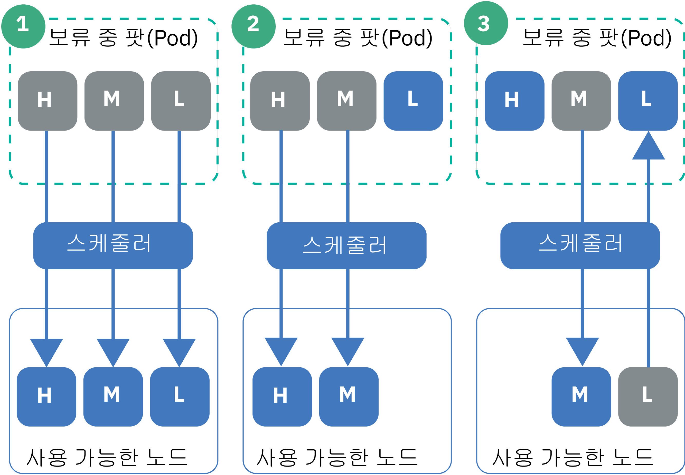

---

copyright:
  years: 2014, 2019
lastupdated: "2019-05-31"

keywords: kubernetes, iks

subcollection: containers

---

{:new_window: target="_blank"}
{:shortdesc: .shortdesc}
{:screen: .screen}
{:pre: .pre}
{:table: .aria-labeledby="caption"}
{:codeblock: .codeblock}
{:tip: .tip}
{:note: .note}
{:important: .important}
{:deprecated: .deprecated}
{:download: .download}
{:preview: .preview}


# 팟(Pod) 우선순위 설정
{: #pod_priority}

Kubernetes 팟(Pod) 우선순위 및 선취를 사용하여 팟(Pod)의 상대적 우선순위를 표시하도록 우선순위 클래스를 구성할 수 있습니다. Kubernetes 스케줄러는 팟(Pod)의 우선순위를 고려하며, 높은 우선순위 팟(Pod)을 위한 작업자 노드의 공간을 마련하기 위해 낮은 우선순위의 팟(Pod)을 선취(제거)할 수도 있습니다. Kubernetes 버전 1.11.2 이상을 실행하는 {{site.data.keyword.containerlong}} 클러스터는 이러한 클래스를 적용하는 `Priority` 허가 제어기를 지원합니다.
{: shortdesc}

**팟(Pod) 우선순위를 설정하는 이유는 무엇입니까?**</br>
자신이 클러스터 관리자인 경우에는 어떤 팟(Pod)이 클러스터 워크로드에 보다 중요한지를 제어하고자 합니다. 우선순위 클래스는 낮은 우선순위의 팟(Pod)보다 높은 우선순위의 팟(Pod)에 유리하도록 Kubernetes 스케줄러 의사결정을 제어하는 데 도움이 될 수 있습니다. 스케줄러는 보류 중인 높은 우선순위 팟이 스케줄될 수 있도록 실행 중인 낮은 우선순위 팟(Pod)을 선취(또는 제거)할 수도 있습니다.

팟(Pod) 우선순위를 설정하면 낮은 우선순위 워크로드가 클러스터의 중요 워크로드에 영향을 주지 못하도록 방지하는 데 도움이 됩니다(특히, 클러스터가 자체 리소스 용량에 도달하기 시작하는 경우).

클러스터에 대한 [적절한 사용자 액세스 권한을 설정](/docs/containers?topic=containers-users#users)했으며 [팟(Pod) 보안 정책](/docs/containers?topic=containers-psp#psp)(해당되는 경우)이 있는지 확인하십시오. 액세스 및 팟(Pod) 보안 정책은 신뢰할 수 없는 사용자가 기타 팟(Pod)의 스케줄링을 막는 높은 우선순위 팟(Pod)을 배치하지 못하도록 방지하는 데 도움이 될 수 있습니다.
{: tip}

{: #priority_scheduling}
**우선순위 스케줄링 및 선취는 어떻게 작동됩니까?**</br>
일반적으로 우선순위가 높은 보류 중인 팟(Pod)은 우선순위가 낮은 팟(Pod) 이전에 스케줄됩니다. 작업자 노드에 충분한 리소스가 남아 있지 않은 경우, 스케줄러는 스케줄되는 높은 우선순위 팟(Pod)을 위한 충분한 리소스를 확보하기 위해 팟(Pod)을 선취(제거)할 수 있습니다. 선취는 점진적 종료 기간, 팟(Pod) 중단 비용 및 작업자 노드 친화성에 의해서도 영향을 받습니다.

팟 배치에 대한 우선순위를 지정하지 않은 경우, 기본값은 `globalDefault`로 설정된 우선순위 클래스로 설정됩니다. `globalDefault` 우선순위 클래스가 없는 경우, 모든 팟(Pod)의 기본 우선순위는 영(`0`)입니다. 기본적으로 {{site.data.keyword.containerlong_notm}}에서 `globalDefault`를 설정하지 않으므로, 팟(Pod) 우선순위는 영(0)입니다.

팟(Pod) 우선순위와 스케줄러가 함께 작동되는 방법을 이해하려면 다음 그림에 있는 시나리오를 고려하십시오. 사용 가능한 리소스의 작업자 노드에 우선순위가 지정된 팟(Pod)을 두어야 합니다. 그렇지 않으면, 시나리오 3에서와 같이 기존 팟(Pod)이 제거됨과 동시에 클러스터의 높은 우선순위 팟(Pod)이 보류 중 상태를 유지할 수 있습니다.

_그림: 팟(Pod) 우선순위 시나리오_


1.  높은, 중간 및 낮은 우선순위의 3개 팟(Pod)이 스케줄링을 보류 중입니다. 스케줄러는 모든 3개 팟(Pod)에 대한 공간이 마련된 사용 가능한 작업자 노드를 찾으며, 우선순위에 따라 이를 스케줄합니다(가장 높은 우선순위 팟(Pod)이 첫 번째로 스케줄됨).
2.  높은, 중간 및 낮은 우선순위의 3개 팟(Pod)이 스케줄링을 보류 중입니다. 스케줄러는 사용 가능한 작업자 노드를 찾지만, 작업자 노드에는 높은 우선순위와 중간 우선순위 팟(Pod)을 지원하기 위해 마련된 리소스만 있습니다. 낮은 우선순위 팟(Pod)은 스케줄되지 않으며 이는 보류 중 상태로 남아 있습니다.
3.  높은 및 중간 우선순위의 2개 팟(Pod)이 스케줄링을 보류 중입니다. 낮은 우선순위의 세 번째 팟(Pod)은 사용 가능한 작업자 노드에 존재합니다. 그러나 작업자 노드에 보류 중인 팟(Pod)을 스케줄할 수 있는 충분한 리소스가 없습니다. 스케줄러는 우선순위가 낮은 팟(Pod)을 선취 또는 제거하며, 이는 팟(Pod)을 보류 상태로 리턴합니다. 그리고 스케줄러는 높은 우선순위 팟(Pod)을 스케줄하려고 시도합니다. 그러나 작업자 노드에 높은 우선순위 팟(Pod)을 스케줄할 수 있는 충분한 리소스가 없으며, 대신 스케줄러는 중간 우선순위 팟(Pod)을 스케줄합니다.

**자세한 정보**: [팟(Pod) 우선순위 및 선취 ](https://kubernetes.io/docs/concepts/configuration/pod-priority-preemption/)에 대한 Kubernetes 문서를 참조하십시오.

**팟(Pod) 우선순위 허가 제어기를 사용하지 않을 수 있습니까?**</br>
아니오, 팟(Pod) 우선순위를 사용하지 않으려면 팟(Pod) 배치에 우선순위 클래스를 포함하거나 `globalDefault`를 설정하지 마십시오. IBM이 [기본 우선순위 클래스](#default_priority_class)로 배치하는 cluster-critical 팟(Pod)을 제외한 모든 팟(Pod)의 기본값은 영(0)입니다. 팟(Pod) 우선순위가 상대적이므로, 이 기본 설정은 cluster-critical 팟(Pod)이 리소스에 대해 우선순위가 지정되도록 보장하며 사용자가 지정한 기존 스케줄링 정책에 따라 기타 팟(Pod)을 스케줄합니다.

**리소스 할당량이 팟(Pod) 우선순위에 어떻게 영향을 줍니까?**</br>
Kubernetes 1.12 이상을 실행하는 클러스터의 [할당량 범위 ](https://kubernetes.io/docs/concepts/policy/resource-quotas/#quota-scopes)를 포함하여, 팟(Pod) 우선순위를 리소스 할당량과 결합하여 사용할 수 있습니다. 할당량 범위를 사용하면 팟(Pod) 우선순위를 설명하는 리소스 할당량을 설정할 수 있습니다. 보다 높은 우선순위의 팟(Pod)은 보다 낮은 우선순위의 팟(Pod) 이전에 리소스 할당량에 의해 제한된 시스템 리소스를 이용하게 됩니다.

## 기본 우선순위 클래스 이해
{: #default_priority_class}

{{site.data.keyword.containerlong_notm}} 클러스터는 기본적으로 일부 우선순위 클래스로 제공됩니다.
{: shortdesc}

클러스터의 적절한 관리에 사용되는 기본 클래스는 수정하지 마십시오. 앱 배치에서 이러한 클래스를 사용하거나 [자체 우선순위 클래스를 작성](#create_priority_class)할 수 있습니다.
{: important}

다음 표에서는 기본적으로 클러스터에 있는 우선순위 클래스와 이를 사용하는 이유를 설명합니다.

|이름 | 설정 주체 |우선순위 값 |용도 |
|---|---|---|
| `system-node-critical` |Kubernetes | 2000001000 |클러스터 작성 시에 `kube-system` 네임스페이스에 배치되는 팟(Pod)을 선택합니다. 이 우선순위 클래스를 사용하여 작업자 노드에 대한 중요 기능을 보호할 수 있습니다(예: 네트워킹, 스토리지, 로깅, 모니터링 및 메트릭 팟(Pod)). |
| `system-cluster-critical` |Kubernetes | 2000000000 |클러스터 작성 시에 `kube-system` 네임스페이스에 배치되는 팟(Pod)을 선택합니다. 이 우선순위 클래스를 사용하여 클러스터에 대한 중요 기능을 보호할 수 있습니다(예: 네트워킹, 스토리지, 로깅, 모니터링 및 메트릭 팟(Pod)). |
| `ibm-app-cluster-critical` |IBM | 900000000 |클러스터 작성 시에 `ibm-system` 네임스페이스에 배치되는 팟(Pod)을 선택합니다. 이 우선순위 클래스를 사용하여 앱에 대한 중요 기능을 보호할 수 있습니다(예: 로드 밸런서 팟(Pod)). |
{: caption="수정하지 말아야 할 기본 우선순위 클래스" caption-side="top"}

다음 명령을 실행하여 우선순위 클래스를 사용하는 팟(Pod)을 확인할 수 있습니다.

```
kubectl get pods --all-namespaces -o custom-columns=NAME:.metadata.name,PRIORITY:.spec.priorityClassName
```
{: pre}

## 우선순위 클래스 작성
{: #create_priority_class}

팟(Pod) 우선순위를 설정하려면 우선순위 클래스를 사용해야 합니다.
{: shortdesc}

시작하기 전에:
* [계정에 로그인하십시오. 해당되는 경우, 적절한 리소스 그룹을 대상으로 지정하십시오. 클러스터의 컨텍스트를 설정하십시오.](/docs/containers?topic=containers-cs_cli_install#cs_cli_configure)
* `default` 네임스페이스에 대해 [**작성자** 또는 **관리자** {{site.data.keyword.Bluemix_notm}} IAM 서비스 역할](/docs/containers?topic=containers-users#platform)이 있는지 확인하십시오.
* 클러스터를 Kubernetes 버전 1.11로 [작성](/docs/containers?topic=containers-clusters#clusters_ui)하거나 [업데이트](/docs/containers?topic=containers-update#update)하십시오.

우선 순위 클래스를 사용하려면 다음을 수행하십시오.

1.  선택사항: 기존 우선순위 클래스를 새 클래스의 템플리트로 사용하십시오.

    1.  기존 우선순위 클래스를 나열하십시오.

        ```
        kubectl get priorityclasses
        ```
        {: pre}

    2.  복사하려는 우선순위 클래스를 선택하고 로컬 YAML 파일을 작성하십시오.

        ```
        kubectl get priorityclass <priority_class> -o yaml > Downloads/priorityclass.yaml
        ```
        {: pre}

2.  우선 순위 클래스 YAML 파일을 작성하십시오.

    ```yaml
    apiVersion: scheduling.k8s.io/v1alpha1
    kind: PriorityClass
    metadata:
      name: <priority_class_name>
    value: <1000000>
    globalDefault: <false>
    description: "Use this class for XYZ service pods only."
    ```
    {: codeblock}

    <table>
    <caption>YAML 파일 컴포넌트 이해</caption>
    <thead>
    <th colspan=2> YAML 파일 컴포넌트 이해</th>
    </thead>
    <tbody>
    <tr>
    <td><code>metadata.name</code></td>
    <td>필수: 작성하고자 하는 우선순위 클래스의 이름입니다.</td>
    </tr>
    <tr>
    <td><code>value</code></td>
    <td>필수: 10억(1000000000) 이하의 정수를 입력하십시오. 값이 높을수록 우선순위가 높습니다. 값은 클러스터에서 기타 우선순위 클래스의 값에 상대적입니다. 선취(제거)되기를 원하지 않는 시스템 중요 팟(Pod)에 대해서는 매우 높은 숫자를 예약하십시오. </br></br>예를 들어, [기본 cluster-critical 우선순위 클래스](#default_priority_class)의 범위는 900000000 - 2000001000 사이의 값입니다. 따라서 어떤 팟(Pod)도 이러한 팟(Pod)보다 높게 우선순위가 지정되지 않도록 새 우선순위 클래스에 대해 이러한 숫자보다 작은 값을 입력하십시오.</td>
    </tr>
    <tr>
    <td><code>globalDefault</code></td>
    <td>선택사항: 이 우선순위를 `priorityClassName` 값 없이 스케줄되는 모든 팟(Pod)에 적용되는 글로벌 기본값으로 지정하려면 이 필드를 `true`로 설정하십시오. 클러스터에서 1개의 우선순위 클래스만 글로벌 기본값으로 설정될 수 있습니다. 글로벌 기본값이 없는 경우, `priorityClassName`이 지정되지 않은 팟(Pod)의 우선순위는 영(`0`)입니다.</br></br>
        [기본 우선순위 클래스](#default_priority_class)는 `globalDefault`를 설정하지 않습니다. 클러스터에서 다른 우선순위 클래스를 작성한 경우에는 `kubectl describe priorityclass <name>`을 실행하여 `globalDefault`가 설정되지 않았는지 확인할 수 있습니다.</td>
    </tr>
    <tr>
    <td><code>description</code></td>
    <td>선택사항: 이 우선순위 클래스를 사용하는 이유를 사용자에게 알려줍니다. 따옴표(`""`)로 문자열을 묶으십시오.</td>
    </tr></tbody></table>

3.  클러스터의 우선순위 클래스를 작성하십시오.

    ```
    kubectl apply -f filepath/priorityclass.yaml
    ```
    {: pre}

4.  우선순위 클래스가 작성되었는지 확인하십시오.

    ```
    kubectl get priorityclasses
    ```
    {: pre}

좋습니다! 우선순위 클래스가 작성되었습니다. 우선순위 클래스, 그리고 어떤 우선순위 클래스(있는 경우)를 자체 팟(Pod) 배치에 사용해야 하는지를 팀에서 알도록 하십시오.  

## 팟(Pod)에 우선순위 지정
{: #prioritize}

팟(Pod) 스펙에 우선순위 클래스를 지정하여 {{site.data.keyword.containerlong_notm}} 클러스터 내의 팟(Pod) 우선순위를 설정하십시오. Kubernetes 버전 1.11에서 우선순위 클래스가 사용 가능하기 전에 팟(Pod)이 존재하는 경우, 사용자는 팟(Pod) YAML 파일을 편집하여 팟(Pod)에 우선순위를 지정해야 합니다.
{: shortdesc}

시작하기 전에:
* [계정에 로그인하십시오. 해당되는 경우, 적절한 리소스 그룹을 대상으로 지정하십시오. 클러스터의 컨텍스트를 설정하십시오.](/docs/containers?topic=containers-cs_cli_install#cs_cli_configure)
* 팟(Pod)을 배치할 네임스페이스에 [**작성자** 또는 **관리자** {{site.data.keyword.Bluemix_notm}} IAM 서비스 역할](/docs/containers?topic=containers-users#platform)이 있는지 확인하십시오.
* 클러스터를 Kubernetes 버전 1.11로 [작성](/docs/containers?topic=containers-clusters#clusters_ui)하거나 [업데이트](/docs/containers?topic=containers-update#update)하십시오.
* 우선순위가 기존 팟(Pod)을 선취하고 클러스터의 리소스가 이용되는 방법에 영향을 줄 수 있으므로 [우선순위 스케줄링이 작동하는 방법을 이해](#priority_scheduling)하십시오.

팟(Pod)에 우선순위를 지정하려면 다음을 수행하십시오.

1.  이미 배치된 팟(Pod)과 관련하여 팟(Pod)의 올바른 우선순위 클래스를 선택할 수 있도록, 기타 배치된 팟(Pod)의 중요도를 확인하십시오.

    1.  네임스페이스의 기타 팟(Pod)이 사용하는 우선순위 클래스를 보십시오.

        ```
        kubectl get pods -n <namespace> -o custom-columns=NAME:.metadata.name,PRIORITY:.spec.priorityClassName
        ```
        {: pre}

    2.  우선순위 클래스의 세부사항을 가져오고 **값** 숫자를 기록해 두십시오. 높은 숫자의 팟(Pod)은 낮은 숫자의 팟(Pod) 이전에 우선순위가 지정됩니다. 검토할 각 우선순위 클래스마다 이 단계를 반복하십시오.

        ```
        kubectl describe priorityclass <priorityclass_name>
        ```
        {: pre}

2.  사용할 우선순위 클래스를 가져오거나 [자체 우선순위 클래스를 작성](#create_priority_class)하십시오.

    ```
    kubectl get priorityclasses
    ```
    {: pre}

3.  팟(Pod) 스펙에서, 이전 단계에서 검색한 우선순위 클래스의 이름으로 `priorityClassName` 필드를 추가하십시오.

    ```yaml
    apiVersion: apps/v1
    kind: Deployment
    metadata:
      name: ibmliberty
    spec:
      replicas: 1
      selector:
        matchLabels:
          app: ibmliberty
      template:
        metadata:
          labels:
            app: ibmliberty
        spec:
          containers:
          - name: ibmliberty
            image: icr.io/ibmliberty:latest
            ports:
            - containerPort: 9080
          priorityClassName: <priorityclass_name>
    ```
    {: codeblock}

4.  배치될 네임스페이스에서 우선순위 지정된 팟(Pod)을 작성하십시오.

    ```
    kubectl apply -f filepath/pod-deployment.yaml
    ```
    {: pre}
