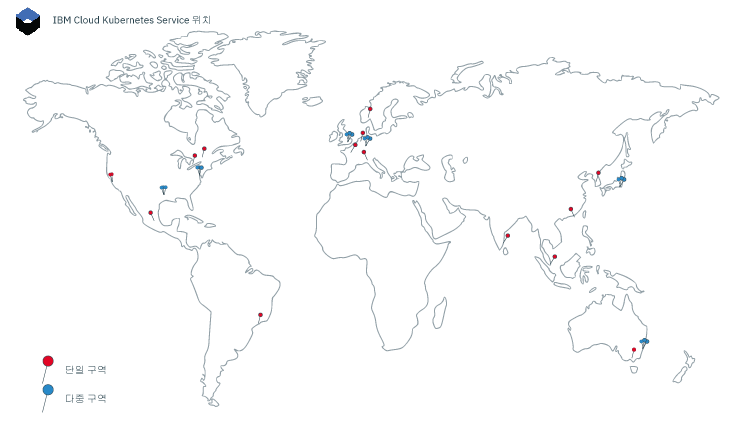
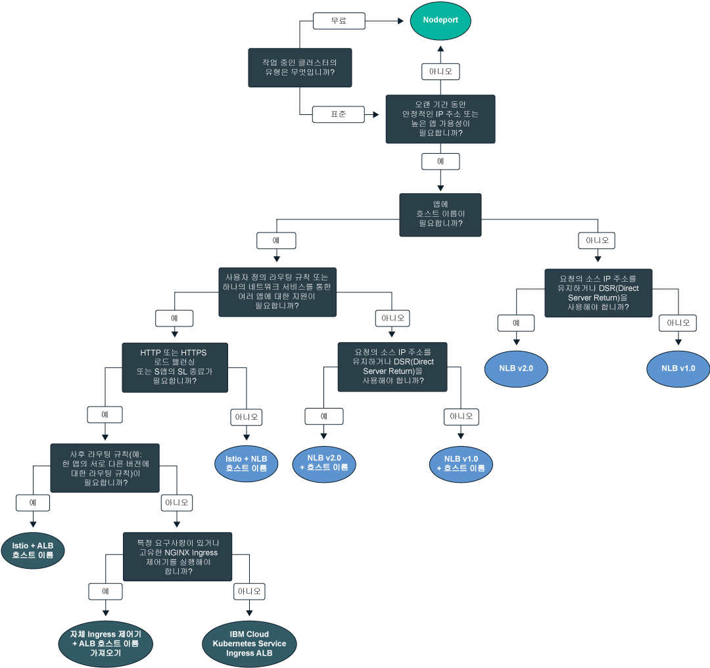

---

copyright:
  years: 2014, 2019
lastupdated: "2019-06-06"

keywords: kubernetes, iks

subcollection: containers

---

{:new_window: target="_blank"}
{:shortdesc: .shortdesc}
{:screen: .screen}
{:pre: .pre}
{:table: .aria-labeledby="caption"}
{:codeblock: .codeblock}
{:tip: .tip}
{:note: .note}
{:important: .important}
{:deprecated: .deprecated}
{:download: .download}
{:preview: .preview}

# 위치
{: #regions-and-zones}

전세계에 {{site.data.keyword.containerlong}} 클러스터를 배치할 수 있습니다. Kubernetes 클러스터를 작성할 때 리소스는 클러스터를 배치하는 위치에 남아 있습니다. 클러스터 관련 작업을 수행하도록 글로벌 API 엔드포인트를 통해 {{site.data.keyword.containerlong_notm}}에 액세스할 수 있습니다.
{:shortdesc}



_{{site.data.keyword.containerlong_notm}} 위치_

{{site.data.keyword.Bluemix_notm}} 리소스는 [지역별 엔드포인트](#bluemix_regions)를 통해 액세스된 지역으로 구성되었습니다. 대신 [글로벌 엔드포인트](#endpoint)를 사용하십시오.
{: deprecated}

## {{site.data.keyword.containerlong_notm}} 위치
{: #locations}

{{site.data.keyword.Bluemix_notm}} 리소스는 지리적 위치의 계층 구조로 구성됩니다. {{site.data.keyword.containerlong_notm}}는 여섯 개의 전세계 다중 구역 가능 지역을 포함하여 이 위치의 서브세트에서 사용 가능합니다. 무료 클러스터는 선택된 위치에서만 사용 가능합니다. 기타 {{site.data.keyword.Bluemix_notm}} 서비스는 전세계적으로 사용 가능하거나 특정 위치 내에서 사용 가능할 수 있습니다.
{: shortdesc}

### 사용 가능한 위치
{: #available-locations}

사용 가능한 {{site.data.keyword.containerlong_notm}} 위치를 나열하려면 `ibmcloud ks supported-locations` 명령을 사용하십시오.
{: shortdesc}

다음 이미지는 {{site.data.keyword.containerlong_notm}} 위치가 구성되는 방법을 설명하는 예로 사용됩니다. 



<table summary="이 표는 {{site.data.keyword.containerlong_notm}} 위치의 구성을 보여줍니다. 행은 왼쪽에서 오른쪽 방향으로 읽어야 하며 1열에는 위치 유형, 2열에는 유형의 예, 3열에는 설명이 있습니다.">
<caption>{{site.data.keyword.containerlong_notm}} 위치의 구성</caption>
  <thead>
  <th>유형</th>
  <th>예</th>
  <th>설명</th>
  </thead>
  <tbody>
    <tr>
      <td>지역</td>
      <td>북미(`na`)</td>
      <td>지리상의 대륙을 기반으로 한 구조화된 그룹화입니다. </td>
    </tr>
    <tr>
      <td>국가</td>
      <td>캐나다(`ca`)</td>
      <td>지역 내 위치의 국가입니다.</td>
    </tr>
    <tr>
      <td>메트로</td>
      <td>멕시코 시티(`mex-cty`), 댈러스(`dal`)</td>
      <td>한 개 이상의 데이터 센터가 위치한 도시의 이름입니다. 메트로는 다중 구역이 가능하며 다중 구역 가능 데이터 센터(예: 댈러스)를 보유할 수 있거나 단일 데이터 센터(예: 멕시코 시티)만 보유할 수 있습니다. 클러스터를 다중 구역 가능 메트로에서 작성하는 경우 Kubernetes 마스터 및 작업자 노드는 고가용성을 위해 구역 간에 전개될 수 있습니다. </td>
    </tr>
    <tr>
      <td>데이터 센터(구역)</td>
      <td>댈러스 12(`dal12`)</td>
      <td>클라우드 서비스 및 애플리케이션을 호스팅하는 컴퓨팅, 네트워크, 스토리지 인프라 및 관련 냉각 장치와 전원 장치의 실제 위치입니다. 클러스터는 고가용성을 위해 다중 구역 아키텍처의 데이터 센터 또는 구역 간에 전개될 수 있습니다. 구역은 서로 간에 격리되어 있으며, 이는 공유되는 단일 장애 지점이 없도록 보장합니다.</td>
    </tr>
  </tbody>
  </table>

### {{site.data.keyword.containerlong_notm}}의 단일 구역 및 다중 구역 위치
{: #zones}

다음 표에는 {{site.data.keyword.containerlong_notm}}에서 사용 가능한 단일 및 다중 구역 위치가 나열되어 있습니다. 특정 메트로에서는 단일 구역 또는 다중 구역 클러스터로 클러스터를 프로비저닝할 수 있습니다. 또한 무료 클러스터는 하나의 작업자 노드가 있는 단일 구역 클러스터로서만 선택된 지역에서만 사용 가능합니다.
{: shortdesc}

* **다중 구역**: 다중 구역 메트로 위치에서 클러스터를 작성하는 경우, 고가용성 Kubernetes 마스터의 복제본이 자동으로 구역 간에 전개됩니다. 구역 간 작업자 노드를 분산하여 구역 장애로부터 앱을 보호할 수 있는 옵션이 있습니다.
* **단일 구역**: 단일 데이터 센터 위치에서 클러스터를 작성하는 경우, 여러 개의 작업자 노드를 작성할 수 있지만 구역 간에 전개할 수는 없습니다. 고가용성 마스터에는 별도의 호스트에 3개의 복제본이 포함되지만, 이는 구역 간에 전개되어 있지 않습니다.

다중 구역 가능 구역인지 신속하게 판별하기 위해 사용자는 `ibmcloud ks supported-locations`를 실행하여 `Multizone Metro` 열에서 값을 찾을 수 있습니다.
{: tip}


{{site.data.keyword.Bluemix_notm}} 리소스는 [지역별 엔드포인트](#bluemix_regions)를 통해 액세스된 지역으로 구성되었습니다. 표에는 정보 제공을 목적으로 이전 지역이 나열되어 있습니다. 이제 [글로벌 엔드포인트](#endpoint)를 사용하여 지역이 없는 아키텍처로 이동할 수 있습니다.
{: deprecated}

**다중 구역 메트로 위치**

<table summary="이 표는 {{site.data.keyword.containerlong_notm}}의 사용 가능한 다중 구역 메트로 위치를 보여줍니다. 행은 왼쪽에서 오른쪽 방향으로 읽어야 하며 1열에는 위치하고 있는 지역, 2열에는 위치의 국가, 3열에는 위치의 메트로, 4열에는 데이터 센터, 5열에는 위치가 구성되었으며 더 이상 사용되지 않는 지역이 있습니다.">
<caption>{{site.data.keyword.containerlong_notm}}에서 사용 가능한 다중 구역 메트로 위치.</caption>
  <thead>
  <th>지역</th>
  <th>국가</th>
  <th>메트로</th>
  <th>데이터 센터</th>
  <th>더 이상 사용되지 않는 지역</th>
  </thead>
  <tbody>
    <tr>
      <td>아시아 태평양</td>
      <td>오스트레일리아</td>
      <td> 시드니</td>
      <td>syd01, syd04, syd05</td>
      <td>AP 남부(`ap-south`, `au-syd`)</td>
    </tr>
    <tr>
      <td>아시아 태평양</td>
      <td>일본</td>
      <td> 도쿄</td>
      <td>tok02, tok04, tok05</td>
      <td>AP 북부(`ap-north`, `jp-tok`)</td>
    </tr>
    <tr>
      <td>유럽</td>
      <td>독일</td>
      <td> 프랑크푸르트</td>
      <td>fra02, fra04, fra05</td>
      <td>중앙 유럽(`eu-central`, `eu-de`)</td>
    </tr>
    <tr>
      <td>유럽</td>
      <td>영국</td>
      <td> 런던</td>
      <td>lon04, lon05`*`, lon06</td>
      <td>영국 남부(`uk-south`, `eu-gb`)</td>
    </tr>
    <tr>
      <td>북미</td>
      <td>미국</td>
      <td> 댈러스</td>
      <td>dal10, dal12, dal13</td>
      <td>미국 남부(`us-south`)</td>
    </tr>
    <tr>
      <td>북미</td>
      <td>미국</td>
      <td>워싱턴, D.C</td>
      <td>wdc04, wdc06, wdc07</td>
      <td>미국 동부(`us-east`)</td>
    </tr>
  </tbody>
  </table>

**단일 구역 데이터 센터 위치**

<table summary="이 표는 {{site.data.keyword.containerlong_notm}}에서 사용 가능한 단일 구역 데이터 센터 위치를 보여줍니다. 행은 왼쪽에서 오른쪽 방향으로 읽어야 하며 1열에는 위치하고 있는 지역, 2열에는 위치의 국가, 3열에는 위치의 메트로, 4열에는 데이터 센터, 5열에는 위치가 구성되었으며 더 이상 사용되지 않는 지역이 있습니다.">
<caption>{{site.data.keyword.containerlong_notm}}에서 사용 가능한 단일 구역 위치.</caption>
  <thead>
  <th>지역</th>
  <th>국가</th>
  <th>메트로</th>
  <th>데이터 센터</th>
  <th>더 이상 사용되지 않는 지역</th>
  </thead>
  <tbody>
    <tr>
      <td>아시아 태평양</td>
      <td>오스트레일리아</td>
      <td>멜버른</td>
      <td>mel01</td>
      <td>AP 남부(`ap-south`, `au-syd`)</td>
    </tr>
    <tr>
      <td>아시아 태평양</td>
      <td>오스트레일리아</td>
      <td> 시드니</td>
      <td>syd01, syd04, syd05</td>
      <td>AP 남부(`ap-south`, `au-syd`)</td>
    </tr>
    <tr>
      <td>아시아 태평양</td>
      <td>중국</td>
      <td>홍콩<br>PRC의 SAR</td>
      <td>hkg02</td>
      <td>AP 북부(`ap-north`, `jp-tok`)</td>
    </tr>
    <tr>
      <td>아시아 태평양</td>
      <td>인도</td>
      <td>첸나이</td>
      <td>che01</td>
      <td>AP 북부(`ap-north`, `jp-tok`)</td>
    </tr>
    <tr>
      <td>아시아 태평양</td>
      <td>일본</td>
      <td> 도쿄</td>
      <td>tok02, tok04, tok05</td>
      <td>AP 북부(`ap-north`, `jp-tok`)</td>
    </tr>
    <tr>
      <td>아시아 태평양</td>
      <td>대한민국</td>
      <td>서울</td>
      <td>seo01</td>
      <td>AP 북부(`ap-north`, `jp-tok`)</td>
    </tr>
    <tr>
      <td>아시아 태평양</td>
      <td>싱가포르</td>
      <td>싱가포르</td>
      <td>sng01</td>
      <td>AP 북부(`ap-north`, `jp-tok`)</td>
    </tr>
    <tr>
      <td>유럽</td>
      <td>프랑스</td>
      <td>파리</td>
      <td>par01</td>
      <td>중앙 유럽(`eu-central`, `eu-de`)</td>
    </tr>
    <tr>
      <td>유럽</td>
      <td>독일</td>
      <td> 프랑크푸르트</td>
      <td>fra02, fra04, fra05</td>
      <td>중앙 유럽(`eu-central`, `eu-de`)</td>
    </tr>
    <tr>
      <td>유럽</td>
      <td>이탈리아</td>
      <td>밀라노</td>
      <td>mil01</td>
      <td>중앙 유럽(`eu-central`, `eu-de`)</td>
    </tr>
    <tr>
      <td>유럽</td>
      <td>네덜란드</td>
      <td>암스테르담</td>
      <td>ams03</td>
      <td>중앙 유럽(`eu-central`, `eu-de`)</td>
    </tr>
    <tr>
      <td>유럽</td>
      <td>노르웨이</td>
      <td>오슬로</td>
      <td>osl</td>
      <td>중앙 유럽(`eu-central`, `eu-de`)</td>
    </tr>
    <tr>
      <td>유럽</td>
      <td>영국</td>
      <td> 런던</td>
      <td>lon02`*`, lon04, lon05`*`, lon06</td>
      <td>영국 남부(`uk-south`, `eu-gb`)</td>
    </tr>
    <tr>
      <td>북미</td>
      <td>캐나다</td>
      <td>몬트리올</td>
      <td>mon01</td>
      <td>미국 동부(`us-east`)</td>
    </tr>
    <tr>
      <td>북미</td>
      <td>캐나다</td>
      <td>토론토</td>
      <td>tor01</td>
      <td>미국 동부(`us-east`)</td>
    </tr>
    <tr>
      <td>북미</td>
      <td>멕시코</td>
      <td>멕시코 시티</td>
      <td>mex01</td>
      <td>미국 남부(`us-south`)</td>
    </tr>
    <tr>
      <td>북미</td>
      <td>미국</td>
      <td> 댈러스</td>
      <td>dal10, dal12, dal13</td>
      <td>미국 남부(`us-south`)</td>
    </tr>
    <tr>
      <td>북미</td>
      <td>미국</td>
      <td>산호세</td>
      <td>sjc03, sjc04</td>
      <td>미국 남부(`us-south`)</td>
    </tr>
    <tr>
      <td>북미</td>
      <td>미국</td>
      <td>워싱턴, D.C</td>
      <td>wdc04, wdc06, wdc07</td>
      <td>미국 동부(`us-east`)</td>
    </tr>
    <tr>
      <td>남미</td>
      <td>브라질</td>
      <td>상파울루</td>
      <td>sao01</td>
      <td>미국 남부(`us-south`)</td>
    </tr>
  </tbody>
  </table>

`*` lon05는 lon02를 대체합니다. 새 클러스터는 lon05를 사용해야 하며, lon05만 구역 간에 전개된 고가용성 마스터를 지원합니다.
{: note}

### 단일 구역 클러스터
{: #regions_single_zone}

단일 구역 클러스터에서 클러스터의 리소스는 클러스터가 배치된 구역에서 그대로 유지됩니다. 다음 이미지는 토론토, 캐나다 `tor01` 위치의 예를 사용하여 단일 구역 클러스터 컴포넌트의 관계를 강조표시합니다.
{: shortdesc}


_단일 구역 클러스터 리소스가 있는 위치를 파악합니다._

1.  마스터 및 작업자 노드를 포함한 클러스터의 리소스는 클러스터가 배치된 구역과 동일한 데이터 센터에 있습니다. `kubectl` 명령과 같은 로컬 컨테이너 오케스트레이션 조치를 시작하면 동일한 구역 내의 마스터와 작업자 노드 간에 정보가 교환됩니다.

2.  기타 클러스터 리소스(예: 스토리지, 네트워킹, 컴퓨팅 또는 팟(Pod)에서 실행되는 앱)를 설정하는 경우, 리소스 및 해당 데이터는 클러스터가 배치된 구역에서 그대로 유지됩니다.

3.  `ibmcloud ks` 명령 사용과 같은 클러스터 관리 조치를 시작하는 경우, 클러스터에 대한 기본 정보(예: 이름, ID, 사용자, 명령)는 글로벌 엔드포인트를 통과한 지역 엔드포인트를 통해 라우팅됩니다. 지역 엔드포인트는 가장 가까운 다중 구역 메트로 지역에 위치합니다. 이 예에서 메트로 지역은 워싱턴, D.C입니다.

### 다중 구역 클러스터
{: #regions_multizone}

다중 구역 클러스터에서 클러스터의 리소스는 고가용성을 위해 다중 구역 간에 전개됩니다.
{: shortdesc}

1.  작업자 노드는 클러스터에 대한 추가 가용성을 제공하기 위해 메트로 위치의 다중 구역 간에 전개됩니다. Kubernetes 마스터 복제본도 구역 간에 전개됩니다. `kubectl` 명령과 같은 로컬 컨테이너 오케스트레이션 조치를 시작하면 글로벌 엔드포인트를 통해 마스터와 작업자 노드 간에 정보가 교환됩니다.

2.  기타 클러스터 리소스(예: 스토리지, 네트워킹, 컴퓨팅 또는 팟(Pod)에서 실행되는 앱)는 해당 리소스가 다중 구역 클러스터에서 구역에 배치되는 방법에 따라 다릅니다. 자세한 정보를 보려면 다음 주제를 검토하십시오.
    *   다중 구역 클러스터에서 [파일 스토리지](/docs/containers?topic=containers-file_storage#add_file) 및 [블록 스토리지](/docs/containers?topic=containers-block_storage#add_block) 설정 또는 [다중 구역의 지속적 스토리지 솔루션 선택](/docs/containers?topic=containers-storage_planning#persistent_storage_overview)
    *   [다중 구역 클러스터에서 네트워크 로드 밸런서(NLB) 서비스를 사용하여 앱에 대한 공용 또는 개인용 액세스 사용](/docs/containers?topic=containers-loadbalancer#multi_zone_config)
    *   [Ingress를 사용한 네트워크 트래픽 관리](/docs/containers?topic=containers-ingress#planning)
    *   [앱의 가용성 향상](/docs/containers?topic=containers-app#increase_availability)

3.  [`ibmcloud ks` 명령](/docs/containers?topic=containers-cli-plugin-kubernetes-service-cli) 사용과 같은 클러스터 관리 조치를 시작하는 경우, 클러스터에 대한 기본 정보(예: 이름, ID, 사용자, 명령)는 글로벌 엔드포인트를 통해 라우팅됩니다.

### 무료 클러스터
{: #regions_free}

무료 클러스터는 특정 위치로 제한됩니다.
{: shortdesc}

**무료 클러스터**: 무료 클러스터를 작성하기 전에 `ibmcloud ks region-set`를 실행하여 지역을 대상으로 지정해야 합니다. 클러스터는 대상으로 지정한 지역 내의 메트로에 작성됩니다. 즉, `ap-south`의 시드니 메트로, `eu-central`의 프랑크푸르트 메트로, `uk-south`의 런던 메트로, `us-south`의 댈러스 메트로입니다. 메트로 내에 구역을 지정할 수 없습니다. 

**{{site.data.keyword.Bluemix_notm}} 콘솔에서 무료 클러스터 작성**: 콘솔을 사용하는 경우 지역 및 지역 내의 메트로 위치를 선택할 수 있습니다. 북미의 댈러스 메트로, 유럽의 프랑크푸르트 또는 런던 메트로, 아시아 태평양의 시드니 메트로를 선택할 수 있습니다. 클러스터가 선택하는 메트로 내의 구역에 작성됩니다. 

<br />


## 글로벌 엔드포인트에 액세스
{: #endpoint}

{{site.data.keyword.Bluemix_notm}} 위치(이전에는 지역이라고 함)를 사용하여 {{site.data.keyword.Bluemix_notm}} 서비스 간에 리소스를 구성할 수 있습니다. 예를 들어, 동일한 위치의 {{site.data.keyword.registryshort_notm}}에 저장된 개인용 Docker 이미지를 사용하여 Kubernetes 클러스터를 작성할 수 있습니다. 이 리소스에 액세스하기 위해 위치별로 글로벌 엔드포인트 및 필터를 사용할 수 있습니다.
{:shortdesc}

### {{site.data.keyword.Bluemix_notm}}에 로그인
{: #login-ic}

{{site.data.keyword.Bluemix_notm}}(`ibmcloud`) 명령행에 로그인하는 경우 지역을 선택하도록 프롬프트가 표시됩니다. 그러나 이 지역은 {{site.data.keyword.containerlong_notm}} 플러그인(`ibmcloud ks`) 엔드포인트의 영향을 받지 않으며 계속해서 글로벌 엔드포인트를 사용합니다. 클러스터가 기본 리소스 그룹에 없는 경우 계속해서 클러스터가 속하는 리소스 그룹을 대상으로 지정해야 합니다.
{: shortdesc}

{{site.data.keyword.Bluemix_notm}} 글로벌 API 엔드포인트에 로그인하고 클러스터가 속하는 리소스 그룹을 대상으로 지정하려면 다음을 수행하십시오. 
```
ibmcloud login -a https://cloud.ibm.com -g <nondefault_resource_group_name>
```
{: pre}

### {{site.data.keyword.containerlong_notm}}에 로그인
{: #login-iks}

{{site.data.keyword.Bluemix_notm}}에 로그인하면 {{site.data.keyword.containershort_notm}}에 액세스할 수 있습니다. 시작하려면 {{site.data.keyword.containerlong_notm}} CLI 및 API 사용을 위한 다음 리소스를 확인하십시오.
{: shortdesc}

**{{site.data.keyword.containerlong_notm}} CLI**:
* [`ibmcloud ks` 플러그인을 사용하도록 CLI 설정](/docs/containers?topic=containers-cs_cli_install#cs_cli_install)
* [특정 클러스터에 연결하고 `kubectl` 명령을 실행하도록 CLI 구성](/docs/containers?topic=containers-cs_cli_install#cs_cli_configure)

기본적으로 글로벌 {{site.data.keyword.containerlong_notm}} 엔드포인트인 `https://containers.cloud.ibm.com`에 로그인됩니다.

{{site.data.keyword.containerlong_notm}} CLI에서 새 글로벌 기능을 사용하는 경우 다음 레거시 지역 기반의 기능에서 발생한 다음 변경사항을 고려하십시오. 

* 리소스 나열:
  * 예를 들어, `ibmcloud ks clusters`, `ibmcloud ks subnets` 또는 `ibmcloud ks zones` 명령을 사용하여 리소스를 나열하면 모든 위치의 리소스가 리턴됩니다. 특정 위치로 리소스를 필터링하기 위해 특정 명령에 `--locations` 플래그가 포함됩니다. 예를 들어, `dal` 메트로에 대한 클러스터를 필터링하는 경우 해당 메트로 내 다중 구역 클러스터와 해당 메트로 내 데이터 센터(구역)가 리턴됩니다. `dal10` 데이터 센터(구역)에 대한 클러스터를 필터링하는 경우 해당 구역의 작업자 노드가 있는 다중 구역 클러스터와 해당 구역의 단일 구역 클러스터가 리턴됩니다. 하나의 위치 또는 쉼표로 구분된 위치의 목록을 전달할 수 있습니다. 위치별로 필터링하는 예는 다음과 같습니다.
    ```
    ibmcloud ks clusters --locations dal
    ```
    {: pre}
  * 기타 명령은 모든 위치에서 리소스를 리턴하지 않습니다. `credential-set/unset/get`, `api-key-reset` 및 `vlan-spanning-get` 명령을 실행하려면 `--region`으로 지역을 지정해야 합니다.

* 리소스 관련 작업:
  * 글로벌 엔드포인트를 사용하는 경우 `ibmcloud ks region-set`를 실행하여 지역을 설정하고 작업을 수행할 리소스가 다른 지역에 있는 경우에도 모든 위치에서 액세스할 수 있는 리소스 관련 작업을 수행할 수 있습니다. 
  * 다른 지역에서 이름이 동일한 클러스터가 있는 경우, 명령 실행 시 클러스터 ID를 사용하거나 `ibmcloud ks region-set` 명령을 사용하여 지역을 설정한 다음 명령 실행 시 클러스터 이름을 사용할 수 있습니다. 

* 레거시 기능:
  * 하나의 지역에서만 리소스를 나열하고 리소스 관련 작업을 수행해야 하는 경우 `ibmcloud ks init` [명령](/docs/containers?topic=containers-cli-plugin-kubernetes-service-cli#cs_init)을 사용하여 글로벌 엔드포인트 대신 지역 엔드포인트를 대상으로 지정할 수 있습니다.
미국 남부 지역적 엔드포인트를 대상으로 지정하는 예:
    ```
  ibmcloud ks init --host https://us-south.containers.cloud.ibm.com
    ```
    {: pre}
  * 글로벌 기능을 사용하기 위해 `ibmcloud ks init` 명령을 사용하여 글로벌 엔드포인트를 다시 대상으로 지정할 수 있습니다. 글로벌 엔드포인트를 다시 대상으로 지정하는 예는 다음과 같습니다.
    ```
  ibmcloud ks init --host https://containers.cloud.ibm.com
    ```
    {: pre}

</br></br>
**{{site.data.keyword.containerlong_notm}} API**:
* [API 시작하기](/docs/containers?topic=containers-cs_cli_install#cs_api)
* [API 명령에 대한 문서 보기](https://containers.cloud.ibm.com/global/swagger-global-api/)
* [`swagger.json` API](https://containers.cloud.ibm.com/global/swagger-global-api/swagger.json)를 통해 자동화에서 사용하도록 API의 클라이언트 생성

글로벌 {{site.data.keyword.containerlong_notm}} API와 상호작용하려면 명령 유형을 입력하고 `global/v1/command`를 엔드포인트에 추가하십시오.

`GET /clusters` 글로벌 API 예:
```
GET https://containers.cloud.ibm.com/global/v1/clusters
```
{: codeblock}

</br>

API 호출에서 지역을 지정해야 하는 경우 경로에서 `/global` 매개변수를 제거하고 `X-Region` 헤더의 지역 이름을 전달하십시오. 사용 가능한 지역을 나열하려면 `ibmcloud ks regions`를 실행하십시오.

<br />


## 더 이상 사용되지 않음: 이전 {{site.data.keyword.Bluemix_notm}} 지역 및 구역 구조
{: #bluemix_regions}

이전에는 {{site.data.keyword.Bluemix_notm}} 리소스가 지역으로 구성되었습니다. 지역은 구역을 구성하기 위한 개념적인 도구이며, 이에는 다른 나라 및 지역의 구역(데이터센터)이 포함될 수 있습니다. 다음 표에서는 이전 {{site.data.keyword.Bluemix_notm}} 지역, {{site.data.keyword.containerlong_notm}} 지역 및 {{site.data.keyword.containerlong_notm}} 구역을 맵핑합니다. 다중 구역 가능 구역은 굵게 표시되어 있습니다.
{: shortdesc}

지역별 엔드포인트는 더 이상 사용되지 않습니다. 대신 [글로벌 엔드포인트](#endpoint)를 사용하십시오. 지역 엔드포인트를 사용해야 하는 경우 [{{site.data.keyword.containerlong_notm}} 플러그인에서 `IKS_BETA_VERSION` 환경 변수를 `0.2`로 설정](/docs/containers-cli-plugin?topic=containers-cli-plugin-kubernetes-service-cli#cs_beta)하십시오.
{: deprecated}

| {{site.data.keyword.containerlong_notm}} 지역 | 해당 {{site.data.keyword.Bluemix_notm}} 지역 | 지역에서 사용 가능한 구역 |
| --- | --- | --- |
|AP 북부(표준 클러스터만 해당) | 도쿄 | che01, hkg02, seo01, sng01, **tok02, tok04, tok05** |
|AP 남부 | 시드니 | mel01, **syd01, syd04, syd05** |
|중앙 유럽 | 프랑크푸르트 | ams03, **fra02, fra04, fra05**, mil01, osl01, par01 |
|영국 남부 | 런던 | lon02, **lon04, lon05, lon06** |
|미국 동부(표준 클러스터만 해당) | 워싱턴 DC | mon01, tor01, **wdc04, wdc06, wdc07** |
|미국 남부 | 댈러스 | **dal10, dal12, dal13**, mex01, sjc03, sjc04, sao01 |
{: caption="구역을 포함한 해당 {{site.data.keyword.containershort_notm}} 및 {{site.data.keyword.Bluemix_notm}} 지역입니다. 다중 구역 가능 구역은 굵게 표시되어 있습니다." caption-side="top"}

{{site.data.keyword.containerlong_notm}} 지역을 사용하여 사용자가 로그인한 {{site.data.keyword.Bluemix_notm}} 지역 이외의 지역에 Kubernetes 클러스터를 작성하거나 액세스할 수 있습니다. {{site.data.keyword.containerlong_notm}} 지역 엔드포인트는 전체적으로 {{site.data.keyword.Bluemix_notm}}가 아닌 {{site.data.keyword.containerlong_notm}}만 특정하게 참조합니다.

다음과 같은 이유로 다른 {{site.data.keyword.containerlong_notm}} 지역에 로그인할 수 있습니다.
  * 한 지역에 {{site.data.keyword.Bluemix_notm}} 서비스 또는 사설 Docker를 작성한 후 다른 지역의 {{site.data.keyword.containerlong_notm}}에서 사용하려고 합니다.
  * 로그인한 기본 {{site.data.keyword.Bluemix_notm}} 지역과 다른 지역에 있는 클러스터에 액세스하려고 합니다.

지역을 빠르게 전환하려면 `ibmcloud ks region-set ` [명령](/docs/containers?topic=containers-cli-plugin-kubernetes-service-cli#cs_region-set)을 사용하십시오. 
