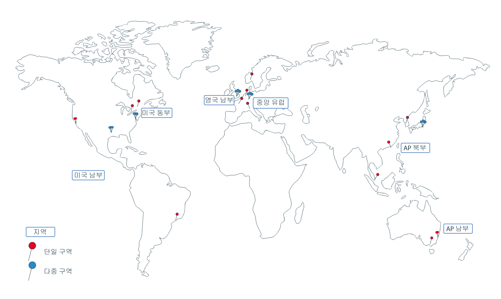

---

copyright:
  years: 2014, 2018
lastupdated: "2018-10-10"

---

{:new_window: target="_blank"}
{:shortdesc: .shortdesc}
{:screen: .screen}
{:pre: .pre}
{:table: .aria-labeledby="caption"}
{:codeblock: .codeblock}
{:tip: .tip}
{:download: .download}

# 지역 및 구역

지역(region)은 앱, 서비스 및 기타 {{site.data.keyword.Bluemix}} 리소스가 배치될 수 있는 특정한 지리적 위치입니다. [{{site.data.keyword.Bluemix_notm}} 지역](#bluemix_regions)은 [{{site.data.keyword.containerlong}} 지역](#container_regions)과 다릅니다. 지역은 서비스와 애플리케이션을 호스팅하는 컴퓨팅, 네트워크, 스토리지 리소스 및 관련 냉각 장치와 전원 장치를 호스팅하는 실제 데이터센터인 하나 이상의 구역으로 구성되어 있습니다. 구역은 서로 간에 격리되어 있으며, 이는 공유되는 단일 장애 지점이 없도록 보장합니다.
{:shortdesc}

{{site.data.keyword.Bluemix_notm}}는 전세계적으로 호스팅됩니다. {{site.data.keyword.Bluemix_notm}} 내의 서비스는 글로벌로 사용 가능하거나 특정 지역 내에서 사용 가능할 수 있습니다. {{site.data.keyword.containerlong_notm}}에서 Kubernetes 클러스터를 작성할 때 리소스는 클러스터를 배치하는 지역에 남아 있습니다.

**참고**: 지원되는 모든 {{site.data.keyword.containerlong_notm}} 지역에서 표준 클러스터를 작성할 수 있습니다. 무료 클러스터는 선택된 지역에서만 사용 가능합니다.



_{{site.data.keyword.containerlong_notm}} 지역 및 구역_

지원되는 {{site.data.keyword.containerlong_notm}} 지역은 다음과 같습니다.
* AP 북부(표준 클러스터만 해당)
* AP 남부
* 중앙 유럽
* 영국 남부
* 미국 동부(표준 클러스터만 해당)
* 미국 남부

<br />


## {{site.data.keyword.Bluemix_notm}}의 지역
{: #bluemix_regions}

{{site.data.keyword.Bluemix_notm}} 지역을 사용하여 {{site.data.keyword.Bluemix_notm}} 서비스에 걸쳐 리소스를 구성할 수 있습니다. 예를 들어, 동일한 지역의 {{site.data.keyword.registryshort_notm}}에 저장된 개인용 Docker 이미지를 사용하여 Kubernetes 클러스터를 작성할 수 있습니다.
{:shortdesc}

현재 자신이 위치한 {{site.data.keyword.Bluemix_notm}} 지역을 확인하려면 `ibmcloud info`를 실행하고 **지역** 필드를 검토하십시오.

로그인할 때 API 엔드포인트를 지정하여 {{site.data.keyword.Bluemix_notm}} 지역에 액세스할 수 있습니다. 지역을 지정하지 않으면 가장 근접한 지역에 자동으로 로그인됩니다.

예를 들어, 다음 명령을 사용하여 {{site.data.keyword.Bluemix_notm}} 지역 API 엔드포인트에 로그인할 수 있습니다.

  * 미국 남부
      ```
      ibmcloud login -a api.ng.bluemix.net
      ```
      {: pre}

  * 미국 동부
      ```
      ibmcloud login -a api.us-east.bluemix.net
      ```
      {: pre}

  * 시드니 및 도쿄
      ```
      ibmcloud login -a api.au-syd.bluemix.net
      ```
      {: pre}

  * 독일
      ```
      ibmcloud login -a api.eu-de.bluemix.net
      ```
      {: pre}

  * 영국
      ```
      ibmcloud login -a api.eu-gb.bluemix.net
      ```
      {: pre}

<br />


## {{site.data.keyword.containerlong_notm}}의 지역
{: #container_regions}

{{site.data.keyword.containerlong_notm}} 지역을 사용하여 사용자가 로그인한 {{site.data.keyword.Bluemix_notm}} 지역 이외의 지역에 Kubernetes 클러스터를 작성하거나 액세스할 수 있습니다. {{site.data.keyword.containerlong_notm}} 지역 엔드포인트는 전체적으로 {{site.data.keyword.Bluemix_notm}}가 아닌 {{site.data.keyword.containerlong_notm}}만 특정하게 참조합니다.
{:shortdesc}

**참고**: 지원되는 모든 {{site.data.keyword.containerlong_notm}} 지역에서 표준 클러스터를 작성할 수 있습니다. 무료 클러스터는 선택된 지역에서만 사용 가능합니다.

지원되는 {{site.data.keyword.containerlong_notm}} 지역:
  * AP 북부(표준 클러스터만 해당)
  * AP 남부
  * 중앙 유럽
  * 영국 남부
  * 미국 동부(표준 클러스터만 해당)
  * 미국 남부

하나의 글로벌 엔드포인트: `https://containers.bluemix.net/v1`을 통해 {{site.data.keyword.containerlong_notm}}에 액세스할 수 있습니다.
* 현재 자신이 위치한 {{site.data.keyword.containerlong_notm}} 지역을 확인하려면 `ibmcloud ks region`을 실행하십시오.
* 사용 가능한 지역과 해당 엔드포인트의 목록을 검색하려면 `ibmcloud ks regions`를 실행하십시오.

글로벌 엔드포인트가 있는 API를 사용하려면 모든 요청에서 `X-Region` 헤더에 지역 이름을 전달하십시오.
{: tip}

### 다른 {{site.data.keyword.containerlong_notm}} 지역에 로그인
{: #container_login_endpoints}

{{site.data.keyword.containerlong_notm}} CLI를 사용하여 지역을 변경할 수 있습니다.
{:shortdesc}

다음과 같은 이유로 다른 {{site.data.keyword.containerlong_notm}} 지역에 로그인할 수 있습니다.
  * 한 지역에 {{site.data.keyword.Bluemix_notm}} 서비스 또는 사설 Docker를 작성한 후 다른 지역의 {{site.data.keyword.containerlong_notm}}에서 사용하려고 합니다.
  * 로그인한 기본 {{site.data.keyword.Bluemix_notm}} 지역과 다른 지역에 있는 클러스터에 액세스하려고 합니다.

지역을 신속하게 전환하려면 [`ibmcloud ks region-set`](cs_cli_reference.html#cs_region-set)를 실행하십시오.

### {{site.data.keyword.containerlong_notm}} API 명령 사용
{: #containers_api}

{{site.data.keyword.containerlong_notm}} API와 상호작용하려면 명령 유형을 입력하고 `/v1/command`를 글로벌 엔드포인트에 추가하십시오.
{:shortdesc}

`GET /clusters` API 예제:
  ```
  GET https://containers.bluemix.net/v1/clusters
  ```
  {: codeblock}

</br>

글로벌 엔드포인트가 있는 API를 사용하려면 모든 요청에서 `X-Region` 헤더에 지역 이름을 전달하십시오. 사용 가능한 지역을 나열하려면 `ibmcloud ks regions`를 실행하십시오.
{: tip}

API 명령에 대한 문서는 [https://containers.bluemix.net/swagger-api/](https://containers.bluemix.net/swagger-api/)를 보십시오.

## {{site.data.keyword.containerlong_notm}}의 구역
{: #zones}

구역(zone)은 {{site.data.keyword.Bluemix_notm}} 지역 내에서 사용 가능한 실제 데이터센터입니다. 지역은 구역을 구성하기 위한 개념적인 도구이며, 이에는 다른 나라의 구역(데이터센터)이 포함될 수 있습니다. 다음 표에는 지역별로 사용 가능한 구역이 표시되어 있습니다.
{:shortdesc}

* **다중 구역 메트로 시티**: 다중 구역 메트로 시티에서 작성된 클러스터의 작업자 노드는 구역 간에 전개될 수 있습니다.
* **단일 구역 시티**: 단일 구역 시티에서 작성된 클러스터의 작업자 노드는 하나의 구역 내에서만 유지될 수 있습니다. 다중 구역 간에 작업자 노드를 전개할 수는 없습니다.

<table summary="표에서는 지역별로 사용 가능한 구역을 보여줍니다. 행은 왼쪽에서 오른쪽 방향으로 읽어야 하며, 지역은 1열에 있고 다중 구역 메트로 시티는 2열에 있으며 단일 구역 시티는 3열에 있습니다. ">
<caption>지역별로 사용 가능한 단일 및 다중 구역.</caption>
  <thead>
  <th>지역</th>
  <th>다중 구역 메트로 시티</th>
  <th>단일 구역 시티</th>
  </thead>
  <tbody>
    <tr>
      <td>AP 북부</td>
      <td>도쿄: tok02, tok04, tok05</td>
      <td><p>홍콩 특별행정구 : hkg02</p>
      <p>서울: seo01</p>
      <p>싱가포르: sng01</p></td>
    </tr>
    <tr>
      <td>AP 남부</td>
      <td>없음</td>
      <td><p>시드니: syd01, syd04</p>
      <p>맬버른: mel01</p></td>
    </tr>
    <tr>
      <td>중앙 유럽</td>
      <td>프랑크푸르트: fra02, fra04, fra05</td>
      <td><p>암스테르담: ams03</p>
      <p>밀라노: mil01</p>
      <p>오슬로: osl01</p>
      <p>파리: par01</p>
      </td>
    </tr>
    <tr>
      <td>영국 남부</td>
      <td>런던: lon02, lon04, lon06</td>
      <td></td>
    </tr>
    <tr>
      <td>미국 동부</td>
      <td>워싱턴 DC: wdc04, wdc06, wdc07</td>
      <td><p>몬트리올: mon01</p>
      <p>토론토: tor01</p></td>
    </tr>
    <tr>
      <td>미국 남부</td>
      <td>달라스: dal10, dal12, dal13</td>
      <td><p>산호세: sjc03, sjc04</p>
      <p>상파울루: sao01</p></td>
    </tr>
  </tbody>
</table>

### 단일 구역 클러스터
{: #single_zone}

단일 구역 클러스터에서 클러스터의 리소스는 클러스터가 배치된 영역에서 그대로 유지됩니다. 다음 이미지에서는 미국 동부의 예제 지역 내에서 단일 구역 클러스터 컴포넌트의 관계를 강조표시합니다.


_단일 구역 클러스터 리소스가 있는 위치를 파악합니다._

1.  마스터 및 작업자 노드를 포함한 클러스터의 리소스는 클러스터가 배치된 구역과 동일한 구역에 있습니다. `kubectl` 명령과 같은 로컬 컨테이너 오케스트레이션 조치를 시작하면 동일한 구역 내의 마스터와 작업자 노드 간에 정보가 교환됩니다.

2.  기타 클러스터 리소스(예: 스토리지, 네트워킹, 컴퓨팅 또는 팟(Pod)에서 실행되는 앱)를 설정하는 경우, 리소스 및 해당 데이터는 클러스터가 배치된 구역에서 그대로 유지됩니다.

3.  `ibmcloud ks` 명령 사용과 같은 클러스터 관리 조치를 시작하는 경우, 클러스터에 대한 기본 정보(예: 이름, ID, 사용자, 명령)는 지역 엔드포인트를 통해 라우팅됩니다.

### 다중 구역 클러스터
{: #multizone}

다중 구역 클러스터에서 마스터 노드는 다중 구역 가능 구역에 배치되며 클러스터의 리소스는 다중 구역 간에 전개됩니다.

1.  작업자 노드는 클러스터에 대한 추가 가용성을 제공하기 위해 한 지역의 다중 구역 간에 전개됩니다. 마스터는 클러스터가 배치된 동일한 다중 구역 가능 구역에서 그대로 유지됩니다. `kubectl` 명령과 같은 로컬 컨테이너 오케스트레이션 조치를 시작하면 지역 엔드포인트를 통해 마스터와 작업자 노드 간에 정보가 교환됩니다.

2.  기타 클러스터 리소스(예: 스토리지, 네트워킹, 컴퓨팅 또는 팟(Pod)에서 실행되는 앱)는 해당 리소스가 다중 구역 클러스터에서 구역에 배치되는 방법에 따라 다릅니다. 자세한 정보를 보려면 다음 주제를 검토하십시오.
    * 다중 구역 클러스터에서 [파일 스토리지](cs_storage_file.html#add_file) 및 [블록 스토리지](cs_storage_block.html#add_block) 설정
    * [다중 구역 클러스터에서 LoadBalancer 서비스를 사용하여 앱에 대한 공용 또는 개인용 액세스 사용](cs_loadbalancer.html#multi_zone_config)
    * [Ingress를 사용한 네트워크 트래픽 관리](cs_ingress.html#planning)
    * [앱의 가용성 향상](cs_app.html#increase_availability)

3.  [`ibmcloud ks` 명령](cs_cli_reference.html#cs_cli_reference) 사용과 같은 클러스터 관리 조치를 시작하는 경우, 클러스터에 대한 기본 정보(예: 이름, ID, 사용자, 명령)는 지역 엔드포인트를 통해 라우팅됩니다.
