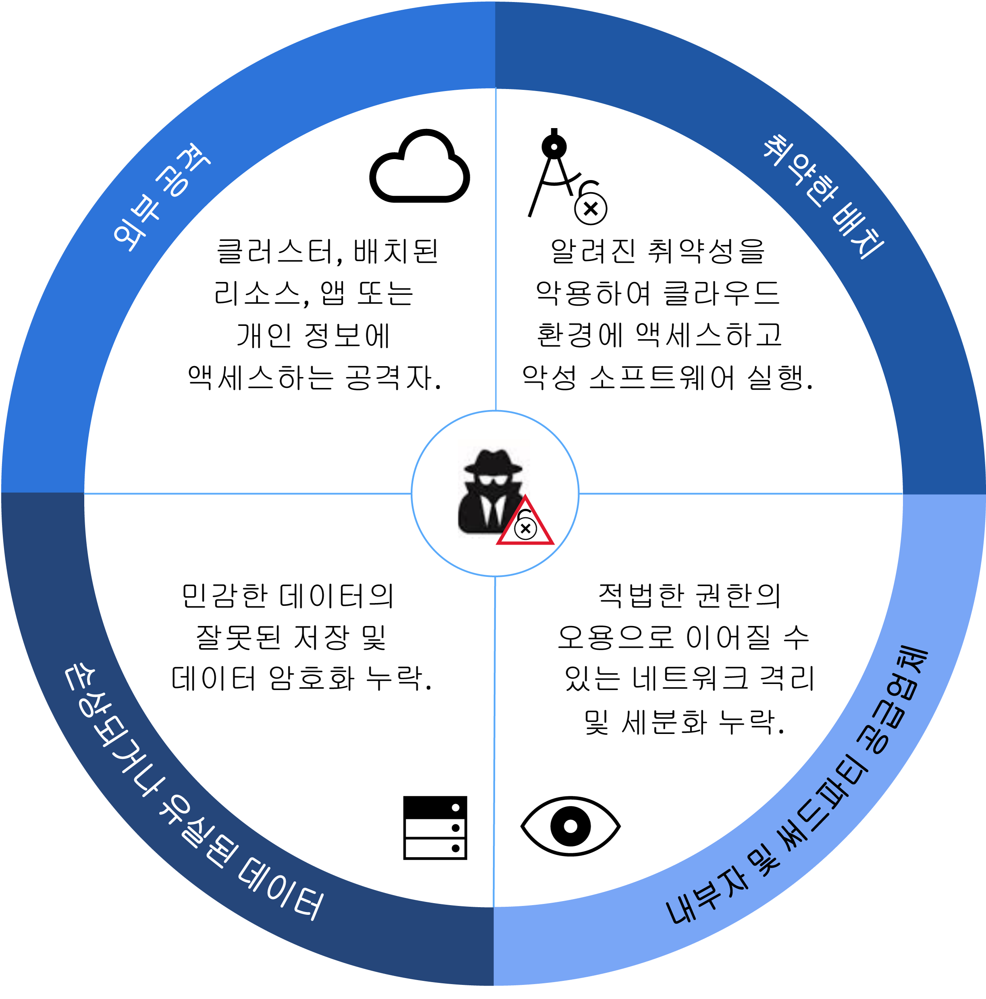
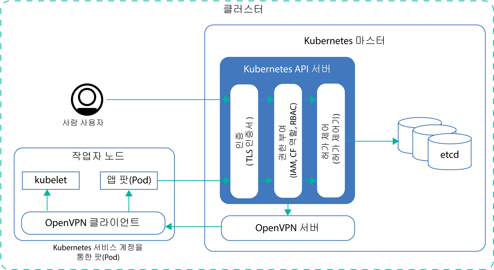
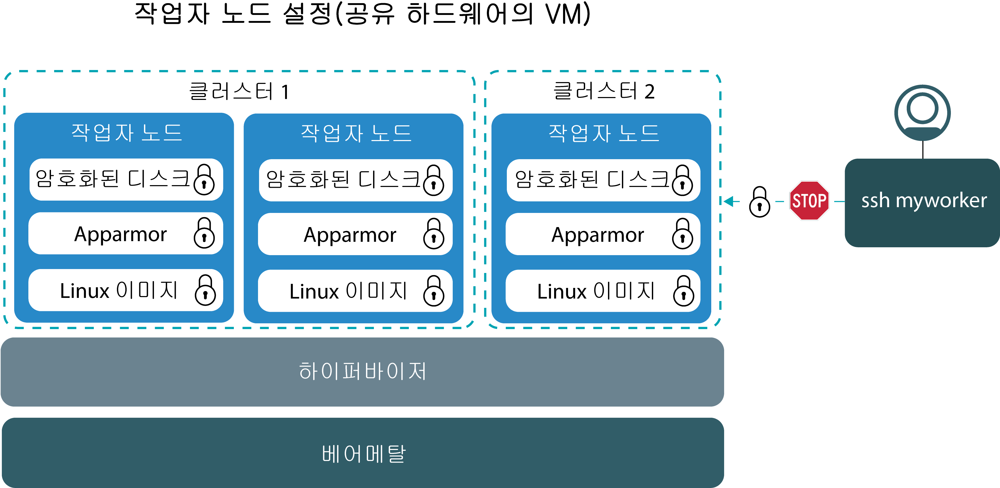
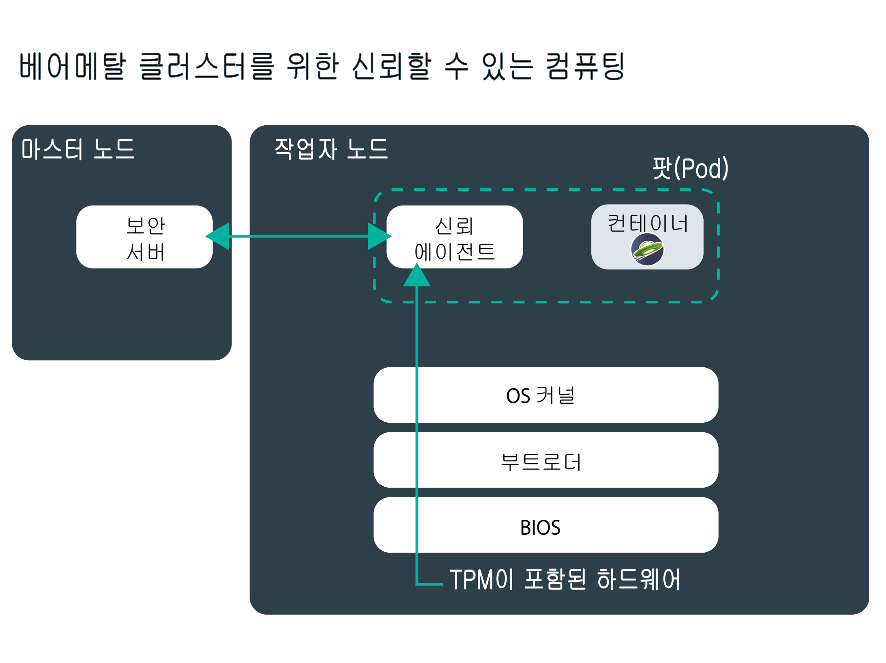
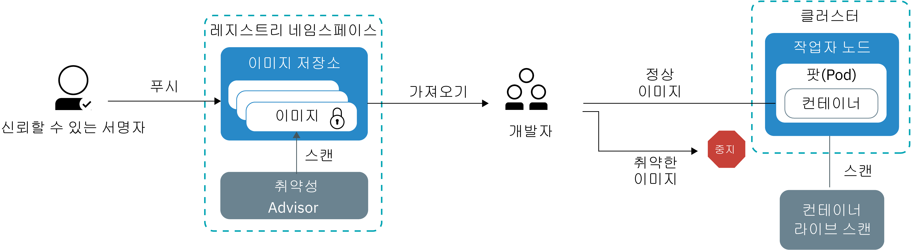
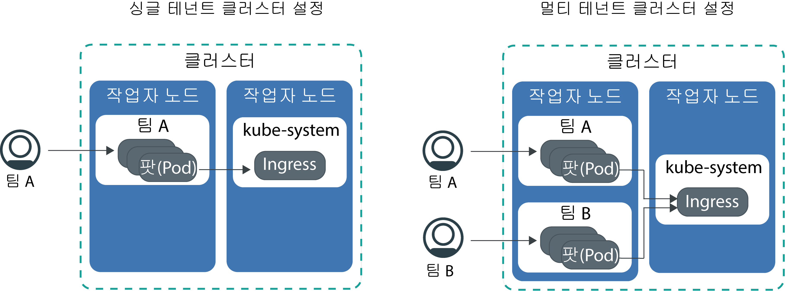

---

copyright:
  years: 2014, 2019
lastupdated: "2019-06-05"

keywords: kubernetes, iks

subcollection: containers

---

{:new_window: target="_blank"}
{:shortdesc: .shortdesc}
{:screen: .screen}
{:pre: .pre}
{:table: .aria-labeledby="caption"}
{:codeblock: .codeblock}
{:tip: .tip}
{:note: .note}
{:important: .important}
{:deprecated: .deprecated}
{:download: .download}
{:preview: .preview}

# {{site.data.keyword.containerlong_notm}}에 대한 보안
{: #security}

위험성 분석과 보안 보장을 위해 {{site.data.keyword.containerlong}}의 기본 제공 보안 기능을 사용할 수 있습니다. 이러한 기능을 사용하면 Kubernetes 클러스터 인프라 및 네트워크 통신을 보호하고 컴퓨팅 리소스를 격리하며 인프라 컴포넌트 및 컨테이너 배치에서 보안 준수를 보장하는 데 도움이 됩니다.
{: shortdesc}

## 클러스터에 대한 보안 위협 개요
{: #threats}

클러스터가 손상되지 않도록 보호하려면 클러스터에 대한 잠재적 보안 위협은 물론 가급적 취약성에 노출되지 않도록 하기 위해 수행할 수 있는 작업에 대해 이해하고 있어야 합니다.
{: shortdesc}

회사가 계속해서 자체 워크로드를 퍼블릭 클라우드로 이동함에 따라 클라우드 보안 및 공격에 대한 시스템, 인프라 및 데이터 보호가 지난 수십 년간 매우 중요해졌습니다. 클러스터는 각각 악성 공격에 대해 자체 환경을 위험에 처하게 할 수 있는 다수의 컴포넌트로 구성되어 있습니다. 이러한 보안 위협에 대해 클러스터를 보호하려면 반드시 모든 클러스터 컴포넌트에서 최신 {{site.data.keyword.containerlong_notm}} 및 Kubernetes 보안 기능과 업데이트를 적용해야 합니다.

이러한 컴포넌트에는 다음이 포함됩니다.
- [Kubernetes API 서버 및 etcd 데이터 저장소](#apiserver)
- [작업자 노드](#workernodes)
- [네트워크](#network)
- [지속적 스토리지](#storage)
- [모니터링 및 로깅](#monitoring_logging)
- [컨테이너 이미지 및 레지스트리](#images_registry)
- [컨테이너 격리 및 보안](#container)
- [개인 정보](#pi)

 

## Kubernetes API 서버 및 etcd
{: #apiserver}

Kubernetes API 서버 및 etcd는 Kubernetes 마스터에서 실행되는 가장 취약한 컴포넌트입니다. 인가되지 않은 사용자나 시스템이 Kubernetes API 서버에 액세스하는 경우, 해당 사용자나 시스템이 설정을 변경하고 클러스터를 조작 또는 통제할 수 있으므로 클러스터는 악성 공격의 위험성에 노출됩니다.
{: shortdesc}

Kubernetes API 서버와 etcd 데이터 저장소를 보호하려면 인간 사용자와 Kubernetes 서비스 계정 모두에 대해 Kubernetes API 서버에 대한 액세스를 보호하고 이를 제한해야 합니다.

**내 Kubernetes API 서버에 대한 액세스 권한은 어떻게 부여됩니까?**  
기본적으로, Kubernetes에서는 API 서버에 대한 액세스 권한이 부여되기 전에 모든 요청이 여러 단계를 거치도록 요구합니다.

<ol><li><strong>인증:</strong> 등록된 사용자 또는 서비스 계정의 ID를 유효성 검증합니다.</li><li><strong>권한 부여:</strong> 허용하고자 하는 클러스터 컴포넌트만 액세스하고 운용할 수 있도록 보장하기 위해 인증된 사용자와 서비스 계정의 권한을 제한합니다.</li><li><strong>허가 제어: </strong> Kubernetes API 서버에서 처리하기 전에 요청을 유효성 검증하거나 변형시킵니다. 많은 Kubernetes 기능에서는 올바른 작동을 위해 허가 제어기가 필요합니다.</li></ol>

**내 Kubernetes API 서버와 etcd 데이터 저장소를 보호하기 위한 {{site.data.keyword.containerlong_notm}}의 역할은 무엇입니까?**  
다음 이미지는 Kubernetes 마스터와 작업자 노드 간에 인증, 권한 부여, 허가 제어 및 보안 연결을 처리하는 기본 클러스터 보안 설정을 보여줍니다.

<table>
<caption>Kubernetes API 서버 및 etcd 보안</caption>
  <thead>
  <th>보안 기능</th>
  <th>설명</th>
  </thead>
  <tbody>
    <tr>
      <td>완전 관리되는 전용 Kubernetes 마스터</td>
      <td>
{{site.data.keyword.containerlong_notm}}의 모든 Kubernetes 클러스터는 IBM에서 IBM 소유 IBM Cloud 인프라(SoftLayer) 계정으로 관리하는 전용 Kubernetes 마스터에 의해 제어됩니다. Kubernetes 마스터는 다른 IBM 고객과 공유하지 않는 다음의 전용 컴포넌트로 설정됩니다.

        <ul><li><strong>etcd 데이터 저장소:</strong> `서비스`, `배치` 및 `팟(Pod)`과 같은, 클러스터의 모든 Kubernetes 리소스를 저장합니다. Kubernetes `ConfigMap` 및 `secret`은 팟(Pod)에서 실행되는 앱에서 사용할 수 있도록 키 값 쌍으로 저장되는 앱 데이터입니다. etcd의 데이터는 Kubernetes 마스터의 로컬 디스크에 저장되며 {{site.data.keyword.cos_full_notm}}에 백업됩니다. 데이터는 {{site.data.keyword.cos_full_notm}}로 전송 중 및 저장 중에 암호화됩니다. 클러스터에 대해 [{{site.data.keyword.keymanagementservicelong_notm}} 암호화를 사용으로 설정](/docs/containers?topic=containers-encryption#encryption)하여 Kubernetes 마스터의 로컬 디스크에서 etcd 데이터의 암호화를 사용 설정하도록 선택할 수 있습니다. 이전 버전의 Kubernetes를 실행하는 클러스터의 etcd 데이터는 IBM에서 관리하고 매일 백업하는 암호화된 디스크에 저장됩니다. etcd 데이터가 팟(Pod)에 전송될 때 데이터는 데이터 보호와 무결성을 보장하기 위해 TLS를 통해 암호화됩니다.</li>
          <li><strong>kube-apiserver:</strong> 작업자 노드에서 Kubernetes로의 모든 클러스터 관리 요청에 대한 기본 시작점 역할을 합니다. 
kube-apiserver는 요청을 유효성 검증하고 처리하며 etcd 데이터 저장소에서 읽고 쓰기가 가능합니다.</li>
          <li><strong>kube-scheduler:</strong> 용량 및 성능 요구사항, 하드웨어 및 소프트웨어 정책 제한조건, 반친화성 스펙 및 워크로드 요구사항을 고려하여 팟(Pod)을 배치할 위치를 결정합니다. 
요구사항과 일치하는 작업자 노드를 찾을 수 없으면 팟(Pod)이 클러스터에 배치되지 않습니다.</li>
          <li><strong>kube-controller-manager:</strong> 지정된 상태를 얻기 위한 대응되는 팟(Pod) 작성과 복제본 세트 모니터링을 담당합니다.</li>
          <li><strong>OpenVPN:</strong> 모든 Kubernetes 마스터와 작업자 노드 간의 통신을 위한 보안 네트워크 연결을 제공하는 {{site.data.keyword.containerlong_notm}} 특정 컴포넌트입니다. Kubernetes 마스터와 작업자 노드 간의 통신은 사용자에 의해 시작되며, 여기에는 <code>kubectl</code> 명령(예: <code>logs</code>, <code>attach</code>, <code>exec</code> 및 <code>top</code>)이 포함됩니다.</li></ul></td>
    </tr>
    <tr>
    <td>IBM 사이트 신뢰성 엔지니어(SRE)에 의한 지속적 모니터링</td>
    <td>Kubernetes 마스터(모든 마스터 컴포넌트, 컴퓨팅, 네트워킹 및 스토리지 리소스 포함)는 IBM 사이트 신뢰성 엔지니어(SRE)에 의해 지속적으로 모니터됩니다. SRE는 최신 보안 표준을 적용하고, 악성 활동을 발견하고 교정하며 {{site.data.keyword.containerlong_notm}}의 신뢰성 및 가용성을 보장하기 위해 작업을 수행합니다. </td>
    </tr>
    <tr>
      <td>TLS를 통한 보안 통신</td>
      <td>{{site.data.keyword.containerlong_notm}}를 사용하려면 인증 정보를 사용한 서비스의 인증이 필요합니다. 사용자가 인증되면 {{site.data.keyword.containerlong_notm}}는 작업자 노드와 Kubernetes 마스터 간의 엔드-투-엔드 보안 통신을 보장할 수 있도록 Kubernetes API 서버 및 etcd 데이터 저장소와의 양방향 통신을 암호화하는 TLS 인증서를 생성합니다. 이러한 인증서는 클러스터 간에 또는 Kubernetes 마스터 컴포넌트 간에 절대 공유되지 않습니다. </td>
    </tr>
    <tr>
      <td>작업자 노드에 대한 OpenVPN 연결</td>
      <td>Kubernetes가 <code>https</code> 프로토콜을 사용하여 Kubernetes 마스터 및 작업자 노드 간의 통신을 보호하지만, 기본적으로 작업자 노드에서는 인증이 제공되지 않습니다. 이 통신을 보호하기 위해 {{site.data.keyword.containerlong_notm}}는 클러스터가 작성될 때 Kubernetes 마스터 및 작업자 노드 간의 OpenVPN 연결을 자동으로 설정합니다.</td>
    </tr>
    <tr>
      <td>정밀한 액세스 제어</td>
      <td>계정 관리자인 경우에는 {{site.data.keyword.Bluemix_notm}} IAM(Identity and Access Management)을 사용하여 [{{site.data.keyword.containerlong_notm}}의 기타 사용자에 대한 액세스 권한을 부여](/docs/containers?topic=containers-users#users)할 수 있습니다. {{site.data.keyword.Bluemix_notm}} IAM은 {{site.data.keyword.Bluemix_notm}} 플랫폼, {{site.data.keyword.containerlong_notm}} 및 계정의 모든 리소스의 보안 인증을 제공합니다. 적절한 사용자 역할 및 권한 설정은 리소스에 액세스할 수 있는 사용자를 제한하고 적법한 권한이 오용될 때 사용자가 입힐 수 있는 손상을 제한하기 위한 핵심입니다.   사용자가 수행할 수 있는 조치 세트를 판별하는 다음의 사전 정의된 사용자 역할에서 선택할 수 있습니다. <ul><li>
<strong>플랫폼 역할:</strong> {{site.data.keyword.containerlong_notm}}에서 사용자가 수행할 수 있는 클러스터 및 작업자 노드 관련 조치를 판별합니다.</li><li><strong>인프라 역할:</strong> 작업자 노드, VLAN 또는 서브넷 등의 인프라 리소스를 주문, 업데이트 또는 제거하기 위한 권한을 판별합니다.</li><li><strong>Kubernetes RBAC 역할:</strong> 클러스터에 대한 액세스 권한이 부여된 경우 사용자가 실행할 수 있는 `kubectl` 명령을 결정합니다. RBAC 역할은 클러스터의 기본 네임스페이스에 대해 자동으로 설정됩니다. 기타 네임스페이스에서 동일한 RBAC 역할을 사용하려면 기본 네임스페이스에서 RBAC 역할을 복사할 수 있습니다.  </li></ul>  사전 정의된 사용자 역할을 사용하는 대신에 [인프라 권한의 사용자 정의](/docs/containers?topic=containers-users#infra_access) 또는 [자체 RBAC 역할 설정](/docs/containers?topic=containers-users#rbac)을 선택하여 보다 미세 조정된 액세스 제어를 추가할 수 있습니다. </td>
    </tr>
    <tr>
      <td>허가 제어기</td>
      <td>허가 제어기는 Kubernetes 및 {{site.data.keyword.containerlong_notm}}의 특정 기능을 위해 구현되었습니다. 허가 제어기를 사용하면 클러스터의 특정 조치가 허용되는지 여부를 판별하는 클러스터의 정책을 설정할 수 있습니다. 정책에서는 사용자가 조치를 수행할 수 없을 때의 조건을 지정할 수 있습니다(이 조치가 RBAC를 사용하여 사용자에게 지정된 일반 권한의 일부인 경우에도). 따라서 허가 제어기는 API 요청이 Kubernetes API 서버에 의해 처리되기 전에 클러스터에 대한 추가 보안 계층을 제공할 수 있습니다.   클러스터가 작성될 때 {{site.data.keyword.containerlong_notm}}는 Kubernetes 마스터에서 다음의 [Kubernetes 허가 제어기 ](https://kubernetes.io/docs/admin/admission-controllers/)를 자동으로 설치하며, 사용자는 이를 변경할 수 없습니다. <ul>
      <li>`DefaultTolerationSeconds`</li>
      <li>`DefaultStorageClass`</li>
      <li>`GenericAdmissionWebhook`</li>
      <li>`Initializers`(Kubernetes 1.13 이하)</li>
      <li>`LimitRanger`</li>
      <li>`MutatingAdmissionWebhook`</li>
      <li>`NamespaceLifecycle`</li>
      <li>`NodeRestriction`(Kubernetes 1.14 이상)</li>
      <li>`PersistentVolumeLabel`</li>
      <li>[`PodSecurityPolicy`](/docs/containers?topic=containers-psp#ibm_psp)</li>
      <li>[`Priority`](/docs/containers?topic=containers-pod_priority#pod_priority)(Kubernetes 1.11 이상)</li>
      <li>`ResourceQuota`</li>
      <li>`ServiceAccount`</li>
      <li>`StorageObjectInUseProtection`</li>
      <li>`TaintNodesByCondition`(Kubernetes 1.12 이상)</li>
      <li>`ValidatingAdmissionWebhook`</li></ul> 
            [클러스터에 자체 허가 제어기를 설치 ](https://kubernetes.io/docs/reference/access-authn-authz/extensible-admission-controllers/#admission-webhooks)하거나 {{site.data.keyword.containerlong_notm}}에서 제공하는 선택적 허가 제어기에서 선택할 수 있습니다. <ul><li><strong>[컨테이너 이미지 보안 적용기](/docs/services/Registry?topic=registry-security_enforce#security_enforce):</strong> 이 허가 제어기를 사용하여 취약한 이미지의 배치를 차단하도록 클러스터에서 Vulnerability Advisor 정책을 적용할 수 있습니다.</li></ul> 
수동으로 허가 제어기를 설치했으며 이를 더 이상 사용하지 않으려면 반드시 이를 완전히 제거해야 합니다. 허가 제어기가 완전히 제거되지 않은 경우, 이는 사용자가 클러스터에서 수행하고자 하는 모든 조치를 차단할 수 있습니다.
</td>
    </tr>
  </tbody>
</table>

**Kubernetes API 서버를 안전하게 유지하려면 그 밖에 무엇을 더 할 수 있습니까?** 

클러스터가 사설 및 공용 VLAN에 연결되어 있는 경우 {{site.data.keyword.containerlong_notm}}는 공용 서비스 엔드포인트를 통해 클러스터 마스터 및 작업자 노드 간의 보안 OpenVPN 연결을 자동으로 설정합니다. {{site.data.keyword.Bluemix_notm}} 계정에 VRF가 사용으로 설정된 경우에는 클러스터 마스터 및 작업자 노드가 개인 서비스 엔드포인트를 통해 사설 네트워크를 거쳐 통신할 수 있습니다.

서비스 엔드 포인트는 작업자 노드 및 클러스터 사용자가 클러스터 마스터에 액세스하는 방법을 판별합니다.
* 공용 서비스 엔드포인트 전용: 클러스터 마스터와 작업자 노드 간의 보안 OpenVPN 연결이 공용 네트워크를 통해 설정됩니다. 마스터는 클러스터 사용자가 공용으로 액세스할 수 있습니다.
* 공용 및 개인 서비스 엔드포인트: 통신은 개인 서비스 엔드포인트를 통한 사설 네트워크와 공용 서비스 엔드포인트를 통한 공용 네트워크 모두를 통해 설정됩니다. 공용 엔드포인트를 통한 작업자와 마스터 간의 트래픽 절반과 개인 엔드포인트를 통핸 절반을 라우팅하여 마스터와 작업자 간의 통신은 공용 또는 사설 네트워크의 잠재적인 가동 중단으로부터 보호됩니다. 마스터는 권한이 있는 클러스터 사용자가 {{site.data.keyword.Bluemix_notm}} 사설 네트워크를 사용하거나 VPN 연결을 통해 사설 네트워크에 연결되어 있는 경우 개인 서비스 엔드포인트를 통해 개인용으로 액세스할 수 있습니다. 그 외의 경우, 마스터는 권한이 부여된 클러스터 사용자가 공용 서비스 엔드포인트를 통해 공용으로 액세스할 수 있습니다.
* 개인 서비스 엔드포인트 전용: 클러스터 마스터와 작업자 노드 간의 통신이 사설 네트워크를 통해 설정됩니다. 클러스터 사용자는 {{site.data.keyword.Bluemix_notm}} 사설 네트워크를 사용하거나 VPN 연결을 통해 사설 네트워크에 연결하여 마스터에 액세스해야 합니다.

서비스 엔드포인트에 대한 자세한 정보는 [작업자와 마스터 간 및 사용자와 마스터 간 통신](/docs/containers?topic=containers-plan_clusters#workeruser-master)을 참조하십시오.

 

## 작업자 노드
{: #workernodes}

작업자 노드는 앱을 구성하는 배치와 서비스를 수행합니다. 퍼블릭 클라우드에서 워크로드를 호스팅하는 경우, 사용자는 앱이 비인가된 사용자나 소프트웨어에 의해 액세스, 변경 또는 모니터링되지 않도록 보장하고자 합니다.
{: shortdesc}

**작업자 노드의 소유자는 누구이며, 내가 이를 보호해야 합니까?**  
작업자 노드의 소유권은 작성된 클러스터의 유형에 따라 다릅니다. 무료 클러스터의 작업자 노드는 IBM이 소유하고 있는 IBM Cloud 인프라(SoftLayer) 계정에 프로비저닝됩니다. 앱을 작업자 노드에 배치할 수 있지만 설정을 변경하거나 작업자 노드에 추가 소프트웨어를 설치할 수는 없습니다. 제한된 용량과 제한된 {{site.data.keyword.containerlong_notm}} 기능 때문에, 무료 클러스터에서는 프로덕션 워크로드를 실행하지 마십시오. 프로덕션 워크로드에 대해 표준 클러스터의 사용을 고려하십시오.

표준 클러스터의 작업자 노드는 공용 또는 데디케이티드 {{site.data.keyword.Bluemix_notm}} 계정과 연관된 IBM Cloud 인프라(SoftLayer) 계정으로 프로비저닝됩니다. 작업자 노드는 사용자 계정 전용이며 사용자는 작업자 노드 OS 및 {{site.data.keyword.containerlong_notm}} 컴포넌트가 최신 보안 업데이트와 패치를 적용하도록 보장하기 위해 작업자 노드에 대한 시기 적절한 업데이트를 요청할 책임이 있습니다.

`ibmcloud ks worker-update` [명령](/docs/containers?topic=containers-cli-plugin-kubernetes-service-cli#cs_worker_update)을 주기적(예: 매월)으로 사용하여 운영 체제에 업데이트와 보안 패치를 배치하고 Kubernetes 버전을 업데이트하십시오. 업데이트가 사용 가능한 경우에는 {{site.data.keyword.Bluemix_notm}} 콘솔 또는 CLI에서 마스터 및 작업자 노드에 대한 정보를 볼 때 알림을 받습니다(예: `ibmcloud ks clusters` 또는 `ibmcloud ks workers --cluster <cluster_name>` 명령으로). 작업자 노드 업데이트는 IBM이 최신 보안 패치를 포함하는 전체 작업자 노드 이미지로 제공합니다. 업데이트를 적용하려면 새 이미지를 사용하여 작업자 노드를 다시 이미징하고 다시 로드해야 합니다. 루트 사용자의 키는 작업자 노드가 다시 로드되면 자동으로 순환됩니다.
{: important}

**내 작업자 노드 설정이 어떻게 보입니까? ** 
다음의 이미지는 악성 공격으로부터 작업자 노드를 보호하기 위해 모든 작업자 노드에 대해 설정된 컴포넌트를 보여줍니다.

이미지에는 작업자 노드와의 양방향 엔드-투-엔드 보안 통신을 보장하는 컴포넌트가 포함되지 않습니다. 자세한 정보는 [네트워크 보안](#network)을 참조하십시오.
{: note}

<table>
<caption>작업자 노드 보안 설정</caption>
  <thead>
  <th>보안 기능</th>
  <th>설명</th>
  </thead>
  <tbody>
    <tr><td>CIS 준수 Linux 이미지</td><td>모든 작업자 노드는 CIS(Center of Internet Security)에서 공개한 벤치마크를 구현하는 Ubuntu 운영 체제로 설정됩니다. Ubuntu 운영 체제는 사용자 또는 시스템 소유자에 의해 변경될 수 없습니다. 현재 Ubuntu 버전을 검토하려면 <code>kubectl get nodes -o wide</code>를 실행하십시오. IBM은 내부 및 외부 보안 자문 팀과 공동 작업하여 잠재적 보안 준수 취약점을 해결합니다. 운영 체제에 대한 보안 업데이트와 패치는 {{site.data.keyword.containerlong_notm}}를 통해 사용할 수 있으며, 작업자 노드의 보안을 유지하기 위해 사용자에 의해 설치되어야 합니다.
{{site.data.keyword.containerlong_notm}}는 작업자 노드에 Ubuntu Linux 커널을 사용합니다. {{site.data.keyword.containerlong_notm}}에서 Linux 배포판을 기반으로 컨테이너를 실행할 수 있습니다. Ubuntu Linux 커널에서 실행될 컨테이너 이미지가 지원되는 경우에는 이를 지원하는 컨테이너 이미지 공급업체를 확인하십시오.
</td></tr>
    <tr>
    <td>사이트 신뢰성 엔지니어(SRE)에 의한 지속적 모니터링 </td>
    <td>작업자 노드에 설치된 Linux 이미지는 취약성 및 보안 규제 준수 문제를 발견하기 위해 IBM 사이트 신뢰성 엔지니어(SRE)에 의해 지속적으로 모니터링됩니다. SRE는 취약성에 대처하기 위해 작업자 노드를 위한 보안 패치 및 수정팩을 작성합니다. 작업자 노드와 여기에서 실행되는 앱을 위한 안전한 환경을 보장할 수 있도록, 이러한 패치는 사용 가능해지는 즉시 적용하십시오.</td>
    </tr>
    <tr>
  <td>컴퓨팅 격리</td>
  <td>작업자 노드는 한 클러스터 전용이며, 다른 클러스터의 워크로드를 호스팅하지 않습니다. 표준 클러스터를 작성하는 경우, 사용자는 공유 또는 전용 실제 하드웨어에서 실행되는 [가상 머신 또는 실제 머신(베어메탈)](/docs/containers?topic=containers-planning_worker_nodes#planning_worker_nodes)으로서 작업자 노드를 프로비저닝하도록 선택할 수 있습니다. 무료 클러스터의 작업자 노드는 IBM 소유의 IBM Cloud 인프라(SoftLayer) 계정에서 가상, 공유 노드로서 자동으로 프로비저닝됩니다.</td>
</tr>
<tr>
<td>베어메탈 배치 옵션</td>
<td>(가상 서버 인스턴스 대신) 베어메탈 실제 서버에서 작업자 노드의 프로비저닝을 선택하는 경우에는 메모리 또는 CPU 등의 컴퓨팅 호스트에 대한 추가적인 제어 권한이 있습니다. 이 설정은 호스트에서 실행되는 가상 머신에 실제 리소스를 할당하는 가상 머신 하이퍼바이저를 제거합니다. 대신, 모든 베어메탈 머신의 리소스가 작업자 전용으로만 사용되므로 리소스를 공유하거나 성능을 저하시키는 "시끄러운 이웃(noisy neighbors)" 문제를 신경쓰지 않아도 됩니다. 베어메탈 서버는 클러스터 사용에 사용 가능한 모든 리소스를 포함하여 사용자에게만 전용으로 제공됩니다.</td>
</tr>
<tr>
  <td id="trusted_compute">신뢰할 수 있는 컴퓨팅에 대한 옵션</td>
    <td>신뢰할 수 있는 컴퓨팅을 지원하는 베어메탈에서 클러스터를 배치하는 경우에는 [신뢰를 사용](/docs/containers?topic=containers-cli-plugin-kubernetes-service-cli#cs_cluster_feature_enable)할 수 있습니다. 이 TPM(Trusted Platform Module) 칩은 신뢰할 수 있는 컴퓨팅(클러스터에 추가하는 이후 노드 포함)을 지원하는 클러스터의 각 베어메탈 작업자 노드에서 사용으로 설정됩니다. 그러므로 신뢰를 사용하도록 설정한 후에는 나중에 클러스터에 대해 이를 사용하지 않도록 설정할 수 없습니다. 신뢰 서버는 마스터 노드에 배치되고 신뢰 에이전트는 작업자 노드에 팟(Pod)으로 배치됩니다. 작업자 노드가 시작되면 신뢰 에이전트 팟(Pod)은 프로세스의 각 단계를 모니터링합니다.
하드웨어는 신뢰의 루트에 있으며, 이는 TPM을 사용하여 측정치를 전송합니다. TPM은 프로세스 전체에서 측정 데이터의 전송을 보호하는 데 사용되는 암호화 키를 생성합니다. 신뢰 에이전트는 스타트업 프로세스에서 각 컴포넌트의 측정치를 신뢰 서버로 전달합니다(TPM 하드웨어와 상호작용하는 BIOS 펌웨어에서 부트로더 및 OS 커널로). 그리고 신뢰 에이전트는 이러한 측정치를 신뢰할 수 있는 서버의 예상 값과 비교하여 스타트업의 유효성 여부를 입증합니다. 신뢰할 수 있는 컴퓨팅 프로세스는 애플리케이션과 같은 작업자 노드의 기타 팟(Pod)은 모니터링하지 않습니다.

예를 들어 권한 없는 사용자가 시스템에 대한 액세스 권한을 확보하고 데이터 수집을 위한 추가 로직으로 OS 커널을 수정하는 경우, 신뢰 에이전트는 이 변경사항을 감지하고 노드에 대해 비신뢰를 표시합니다. 신뢰할 수 있는 컴퓨팅을 사용하면 작업자 노드의 변조 여부를 확인할 수 있습니다.

    
신뢰할 수 있는 컴퓨팅은 선택된 베어메탈 머신 유형에만 사용할 수 있습니다. 예를 들어, `mgXc` GPU 특성(flavor)은 신뢰할 수 있는 컴퓨팅을 지원하지 않습니다.

    

</td>
  </tr>
    <tr>
  <td id="encrypted_disk">암호화된 디스크</td>
    <td>기본적으로 모든 작업자 노드는 2개의 로컬 SSD, AES 256비트 암호화된 데이터 파티션으로 프로비저닝됩니다. 첫 번째 파티션에는 작업자 노드의 부팅에 사용되며 암호화되지 않은 커널 이미지가 포함되어 있습니다. 두 번째 파티션은 컨테이너 파일 시스템을 보유하며 LUKS 암호화 키를 사용하여 잠금 해제됩니다. 각 Kubernetes 클러스터의 각 작업자 노드에는 {{site.data.keyword.containerlong_notm}}에 의해 관리되는 자체 고유 LUKS 암호화 키가 있습니다. 클러스터를 작성하거나 기존 클러스터에 작업자 노드를 추가하는 경우, 키를 안전하게 가져온 다음 암호화 디스크가 잠금 해제된 후에 버려집니다. 
암호화는 디스크 I/O 성능에 영향을 줄 수 있습니다. 고성능 디스크 I/O가 필요한 워크로드의 경우, 암호화를 끌지 여부를 결정하는 데 도움이 되도록 암호화가 사용된 클러스터와 사용되지 않은 클러스터를 둘 다 테스트하십시오.
</td>
      </tr>
    <tr>
      <td>Expert AppArmor 정책</td>
      <td>모든 작업자 노드는 부트스트랩 중에 작업자 노드에 로드되는 [AppArmor ](https://wiki.ubuntu.com/AppArmor) 프로파일의 적용을 받는 보안 및 액세스 정책으로 설정됩니다. AppArmor 프로파일은 사용자 또는 시스템 소유자에 의해 변경될 수 없습니다. </td>
    </tr>
    <tr>
      <td>SSH 사용 안함</td>
      <td>기본적으로, 악성 공격으로부터 클러스터를 보호하기 위해 SSH 액세스는 작업자 노드에서 사용 안함으로 설정됩니다. SSH 액세스가 사용 안함으로 설정되는 경우, 클러스터에 대한 액세스는 Kubernetes API 서버틀 통해 강제 실행됩니다. Kubernetes API 서버는 요청이 클러스터에서 실행되기 전에 인증, 권한 부여 및 허가 제어 모듈에 설정된 정책에 대해 모든 요청을 검사하도록 요구합니다.    표준 클러스터를 보유 중이며 작업자 노드에서 추가 기능을 설치하려는 경우에는 {{site.data.keyword.containerlong_notm}}에서 제공하는 추가 기능 간에 선택하거나 모든 작업자 노드에서 실행할 모든 항목에 대해 [Kubernetes 디먼 세트 ](https://kubernetes.io/docs/concepts/workloads/controllers/daemonset/)를 사용할 수 있습니다. 실행해야 하는 일회성 조치에 대해서는 [Kubernetes 작업 ](https://kubernetes.io/docs/concepts/workloads/controllers/jobs-run-to-completion/)을 사용하십시오.</td>
    </tr>
  </tbody>
  </table>

 

## 네트워크
{: #network}
회사의 네트워크를 보호하기 위한 일반적인 접근 방법은 방화벽을 설치하고 앱에 대한 원하지 않는 네트워크 트래픽을 차단하는 것입니다. 이것은 여전히 사실이지만, 연구 결과에서는 많은 악성 공격이 지정 받은 권한을 오용하는 내부자나 비인가된 사용자에 의해 이루어진다는 사실을 보여줍니다.
{: shortdesc}

네트워크에 대한 액세스 권한이 부여될 때 사용자가 입힐 수 있는 손상의 범위를 제한하고 네트워크를 보호하려면, 워크로드가 가급적 분리되어 있으며 공용으로 노출된 앱과 작업자 노드의 수에 제한이 있는지 확인해야 합니다.

**기본적으로 내 클러스터에 어떤 네트워크 트래픽이 허용됩니까?** 
모든 컨테이너는 클러스터 작성 중에 모든 작업자 노드에서 구성된 [사전 정의된 Calico 네트워크 정책 설정](/docs/containers?topic=containers-network_policies#default_policy)에 의해 보호됩니다. 기본적으로, 모든 아웃바운드 네트워크 트래픽이 모든 작업자 노드에 대해 허용됩니다. 인바운드 네트워크 트래픽은 열려 있는 일부 포트를 제외하면 차단되어 있습니다. 따라서 네트워크 트래픽이 IBM에 의해 모니터링될 수 있으며, IBM은 Kubernetes 마스터에 대한 보안 업데이트를 자동으로 설치할 수 있습니다. 작업자 노드의 kubelet에 대한 Kubernetes 마스터의 액세스는 OpenVPN 터널에 의해 보호됩니다. 자세한 정보는 [{{site.data.keyword.containerlong_notm}} 아키텍처](/docs/containers?topic=containers-ibm-cloud-kubernetes-service-technology)를 참조하십시오.

인터넷에서의 수신 네트워크 트래픽을 허용하려면 [NodePort 서비스, 네트워크 로드 밸런서(NLB) 또는 Ingress 애플리케이션 로드 밸런서(ALB)](/docs/containers?topic=containers-cs_network_planning#external)를 사용하여 앱을 노출해야 합니다.  

{: #network_segmentation}
**네트워크 세그먼트화는 무엇이며 클러스터에 대해 이를 어떻게 설정할 수 있습니까?**  
네트워크 세그먼트화는 네트워크를 다중 하위 네트워크로 분할하기 위한 접근 방식을 말합니다. 사용자는 조직의 특정 그룹이 액세스하는 앱 및 관련 데이터를 그룹화할 수 있습니다. 하나의 서브네트워크에서 실행되는 앱은 다른 서브네트워크의 앱을 보거나 이에 액세스할 수 없습니다. 또한 네트워크 세그먼트화는 내부자 또는 제3자 소프트웨어에 제공되는 액세스를 제한하고 악성 활동의 범위를 제한할 수도 있습니다.   

{{site.data.keyword.containerlong_notm}}는 작업자 노드에 대한 고품질 네트워크 성능 및 네트워크 격리를 보장하는 IBM Cloud 인프라(SoftLayer) VLAN을 제공합니다. VLAN은 동일한 실제 회선에 연결된 것처럼 작업자 노드 및 팟(Pod)의 그룹을 구성합니다. VLAN은 {{site.data.keyword.Bluemix_notm}} 계정 전용이며 IBM 고객 간에 공유되지 않습니다. 클러스터용 다중 VLAN, 동일한 VLAN의 다중 서브넷 또는 다중 구역 클러스터가 있는 경우에는 작업자 노드가 사설 네트워크에서 서로 간에 통신할 수 있도록 IBM Cloud 인프라(SoftLayer) 계정에 대해 [Virtual Router Function (VRF)](/docs/infrastructure/direct-link?topic=direct-link-overview-of-virtual-routing-and-forwarding-vrf-on-ibm-cloud#overview-of-virtual-routing-and-forwarding-vrf-on-ibm-cloud)을 사용으로 설정해야 합니다. VRF를 사용으로 설정하려면 [IBM Cloud 인프라(SoftLayer) 계정 담당자에게 문의](/docs/infrastructure/direct-link?topic=direct-link-overview-of-virtual-routing-and-forwarding-vrf-on-ibm-cloud#how-you-can-initiate-the-conversion)하십시오. VRF를 사용할 수 없거나 사용하지 않으려면 [VLAN Spanning](/docs/infrastructure/vlans?topic=vlans-vlan-spanning#vlan-spanning)을 사용으로 설정하십시오. 이 조치를 수행하려면 **네트워크 > 네트워크 VLAN Spanning 관리** [인프라 권한](/docs/containers?topic=containers-users#infra_access)이 필요합니다. 또는 이를 사용으로 설정하도록 계정 소유자에게 요청할 수 있습니다. VLAN Spanning이 이미 사용으로 설정되었는지 확인하려면 `ibmcloud ks vlan-spanning-get --region <region>` [명령](/docs/containers?topic=containers-cli-plugin-kubernetes-service-cli#cs_vlan_spanning_get)을 사용하십시오. 

계정에 대해 VRF 또는 VLAN Spanning을 사용으로 설정하면 클러스터에 대한 네트워크 세그먼트화가 제거됩니다.

사용자 계정에 대해 VRF 또는 VLAN Spanning이 사용으로 설정된 경우 네트워크 세그먼트멘테이션을 구현하는 방법에 대한 옵션을 보려면 다음 표를 검토하십시오.

|보안 기능|설명|
|-------|----------------------------------|
|Calico를 사용하여 사용자 정의 네트워크 정책 설정|기본 제공 Calico 인터페이스를 사용하여 작업자 노드에 대한 [사용자 정의 Calico 네트워크 정책을 설정](/docs/containers?topic=containers-network_policies#network_policies)할 수 있습니다. 예를 들어, 특정 팟(Pod) 또는 서비스에 대해 특정 네트워크 인터페이스에서 네트워크 트래픽을 허용하거나 차단할 수 있습니다. 사용자 정의 네트워크 정책을 설정하려면 [<code>calicoctl</code> CLI를 설치](/docs/containers?topic=containers-network_policies#cli_install)해야 합니다.|
|IBM Cloud 인프라(SoftLayer) 네트워크 방화벽에 대한 지원|{{site.data.keyword.containerlong_notm}}는 모든 [IBM Cloud 인프라(SoftLayer) 방화벽 오퍼링 ](https://www.ibm.com/cloud-computing/bluemix/network-security)과 호환 가능합니다. {{site.data.keyword.Bluemix_notm}} 퍼블릭에서 사용자는 표준 클러스터에 대한 전용 네트워크 보안을 제공하고 네트워크 침입을 발견하여 이를 해결하기 위한 사용자 정의 네트워크 정책으로 방화벽을 설정할 수 있습니다. 예를 들어, [가상 라우터 어플라이언스](/docs/infrastructure/virtual-router-appliance?topic=virtual-router-appliance-about-the-vra)가 방화벽 역할을 하여 원하지 않는 트래픽을 차단하게 설정하도록 선택할 수 있습니다. 방화벽을 설정할 때 마스터와 작업자 노드가 통신할 수 있도록 각 지역의 [필수 포트와 IP 주소도 공개해야 합니다](/docs/containers?topic=containers-firewall#firewall).|
{: caption="네트워크 세그먼트화 옵션" caption-side="top"}

**외부 공격에 노출되는 부분을 줄이려면 그 밖에 무엇을 할 수 있습니까?** 
사용자가 공용으로 노출하는 앱 또는 작업자 노드가 많을수록 외부의 악성 공격을 막기 위해 더 많은 단계를 취해야 합니다. 앱 및 작업자 노드를 개인용으로 유지하는 방법에 대한 옵션을 찾으려면 다음 표를 검토하십시오.

|보안 기능|설명|
|-------|----------------------------------|
|노출된 앱 수 제한|기본적으로, 클러스터 내에서 실행되는 앱과 서비스는 공용 인터넷을 통해 접근할 수 없습니다. 앱을 공용으로 노출하거나 앱과 서비스를 사설 네트워크에서만 접속할 수 있도록 하려는 경우에 선택할 수 있습니다. 앱과 서비스를 개인용으로 유지하면 기본 제공되는 보안 기능을 활용하여 작업자 노드와 팟(Pod) 간의 보안 통신을 보장할 수 있습니다. 서비스와 앱을 공용 인터넷에 노출하기 위해, 공용으로 안전하게 서비스를 사용할 수 있도록 [NLB 및 Ingress ALB 지원](/docs/containers?topic=containers-cs_network_planning#external)을 활용할 수 있습니다. 필요한 서비스만 노출되는지 확인하고 노출된 앱의 목록을 주기적으로 재확인하여 이들이 여전히 유효한지 확인하십시오. |
|작업자 노드를 개인용으로 유지|클러스터를 작성할 때 모든 클러스터는 자동으로 사설 VLAN에 연결됩니다. 사설 VLAN은 작업자 노드에 지정된 사설 IP 주소를 판별합니다. 작업자 노드를 사설 VLAN에만 연결하여 이를 개인용으로 유지하도록 선택할 수도 있습니다. 무료 클러스터의 사설 VLAN은 IBM에 의해 관리되며, 표준 클러스터의 사설 VLAN은 IBM Cloud 인프라(SoftLayer) 계정에서 사용자에 의해 관리됩니다.   <strong>주의:</strong> Kubernetes 마스터와의 통신 및 {{site.data.keyword.containerlong_notm}}의 적절한 작동을 위해서는 [특정 URL 및 IP 주소](/docs/containers?topic=containers-firewall#firewall_outbound)에 대한 공용 연결을 구성해야 함을 유념하십시오. 이 공용 연결을 설정하기 위해 작업자 노드 앞에 [가상 라우터 어플라이언스](/docs/infrastructure/virtual-router-appliance?topic=virtual-router-appliance-about-the-vra) 등의 방화벽을 구성하고 이러한 URL 및 IP 주소에 대한 네트워크 트래픽을 사용할 수 있습니다.|
|에지 노드와의 공용 인터넷 연결 제한|기본적으로 모든 작업자 노드는 앱 팟(Pod) 및 연관된 로드 밸런서 또는 ingress 팟(Pod)을 허용하도록 구성됩니다. 로드 밸런서와 ingress 팟(Pod)이 이러한 작업자 노드에만 배치되도록 강제하기 위해 작업자 노드의 레이블을 [에지 노드](/docs/containers?topic=containers-edge#edge)로 지정할 수 있습니다. 또한 사용자는 앱 팟(Pod)이 에지 노드로 스케줄할 수 없도록 [작업자 노드를 오염](/docs/containers?topic=containers-edge#edge_workloads)시킬 수 있습니다. 에지 노드를 사용하면 클러스터의 보다 적은 작업자 노드에서 네트워킹 워크로드를 격리시킬 수 있으며 클러스터의 기타 작업자 노드를 개인용으로 유지할 수 있습니다.|
{: caption="개인 서비스 및 작업자 노드 옵션" caption-side="top"}

**내 클러스터를 온프레미스 데이터센터에 연결하려면 어떻게 해야 합니까?** 
작업자 노드와 앱을 온프레미스 데이터센터에 연결하려면 [strongSwan 서비스, 가상 라우터 어플라이언스로 또는 Fortigate 보안 어플라이언스로 VPN IPSec 엔드포인트](/docs/containers?topic=containers-vpn#vpn)를 구성할 수 있습니다.

### LoadBalancer 및 Ingress 서비스
{: #network_lb_ingress}

네트워크 로드 밸런서(NLB) 및 Ingress 애플리케이션 로드 밸런서(ALB) 네트워킹 서비스를 사용하여 앱을 공용 인터넷 또는 외부 사설 네트워크에 연결할 수 있습니다. 백엔드 앱 보안 요구사항을 충족시키는 데 사용할 수 있는 NLB 및 ALB에 대해 다음의 선택적 설정을 검토하거나, 클러스터를 통해 이동할 때 트래픽을 암호화하십시오.
{: shortdesc}

**보안 그룹을 사용하여 내 클러스터의 네트워크 트래픽을 관리할 수 있습니까?**  
NLB 및 Ingress ALB 서비스를 사용하려면 [Calico 및 Kubernetes 정책](/docs/containers?topic=containers-network_policies)을 사용하여 클러스터의 내부 또는 외부로의 네트워크 트래픽을 관리하십시오. IBM Cloud 인프라(SoftLayer) [보안 그룹](/docs/infrastructure/security-groups?topic=security-groups-about-ibm-security-groups#about-ibm-security-groups)은 사용하지 마십시오. IBM Cloud 인프라(SoftLayer) 보안 그룹은 하이퍼바이저 레벨에서 트래픽을 필터링하기 위해 단일 가상 서버의 네트워크 인터페이스에 적용됩니다. 그러나 보안 그룹은 NLB IP 주소의 관리를 위해 {{site.data.keyword.containerlong_notm}}에서 사용하는 VRRP 프로토콜을 지원하지 않습니다. NLB IP의 관리를 위한 VRRP 프로토콜이 존재하지 않으면 NLB IP, NLB 및 Ingress ALB 서비스가 제대로 작동하지 않습니다. NLB 및 Ingress ALB 서비스를 사용하지 않으며 작업자 노드를 공용에서 완전히 분리하려면 보안 그룹을 사용할 수 있습니다.

**클러스터 내에서 소스 IP를 어떻게 보호할 수 있습니까?**  
버전 2.0 NLB에서 클라이언트 요청의 소스 IP 주소는 기본적으로 유지됩니다. 그러나 버전 1.0 NLB 및 모든 Ingress ALB에서 클라이언트 요청의 소스 IP 주소는 유지되지 않습니다. 앱에 대한 클라이언트 요청이 클러스터에 전송되는 경우, 요청은 NLB 1.0 또는 ALB에 대해 팟(Pod)으로 라우팅됩니다. 앱 팟(Pod)이 로드 밸런서 서비스 팟(Pod)과 동일한 작업자 노드에 없는 경우, NLB 또는 ALB는 다른 작업자 노드의 앱 팟(Pod)으로 요청을 전달합니다. 패키지의 소스 IP 주소는 앱 팟(Pod)이 실행 중인 작업자 노드의 공인 IP 주소로 변경됩니다.

앱 서버가 보안 및 액세스 제어 정책을 적용해야 하는 경우 등에는 클라이언트의 IP를 유지하는 것이 유용합니다. 클라이언트 요청의 원래 소스 IP 주소를 유지하기 위해 [버전 1.0 NLB](/docs/containers?topic=containers-loadbalancer#node_affinity_tolerations) 또는 [Ingress ALB](/docs/containers?topic=containers-ingress#preserve_source_ip)에 대한 소스 IP 유지를 사용할 수 있습니다.

**TLS로 트래픽을 암호화하는 방법은 무엇입니까?**  
Ingress 서비스는 트래픽 플로우의 두 지점에서 TLS 종료를 제공합니다.
* [도착 시에 패키지 복호화](/docs/containers?topic=containers-ingress#public_inside_2): 기본적으로 Ingress ALB는 클러스터의 앱에 대한 HTTP 네트워크 트래픽을 로드 밸런싱합니다. 수신 HTTPS 연결도 로드 밸런싱하려면 네트워크 트래픽을 복호화하고 클러스터에 노출된 앱으로 복호화된 요청을 전달하도록 ALB를 구성할 수 있습니다. IBM 제공 Ingress 하위 도메인을 사용하는 경우 IBM 제공 TLS 인증서를 사용할 수 있습니다. 사용자 정의 도메인을 사용하는 경우 고유 TLS 인증서를 사용하여 TLS 종료를 관리할 수 있습니다.
* [업스트림 앱으로 전달되기 전에 패키지 재암호화](/docs/containers?topic=containers-ingress_annotation#ssl-services): ALB는 트래픽을 앱으로 전달하기 전에 HTTPS 요청을 복호화합니다. HTTPS가 필요하며 해당 업스트림 앱으로 전달되기 전에 트래픽의 암호화가 필요한 앱이 있는 경우에는 `ssl-services` 어노테이션을 사용할 수 있습니다. 업스트림 앱이 TLS를 처리할 수 있는 경우에는 단방향 또는 상호 인증 TLS 시크릿에 포함된 인증서를 선택적으로 제공할 수 있습니다.

서비스 간의 통신을 보호하기 위해 [Istio의 상호 TLS 인증 ](https://istio.io/docs/concepts/security/mutual-tls/)을 사용할 수 있습니다. Istio는 Kubernetes와 같은 클라우드 오케스트레이션 플랫폼에서 서비스 메시(service mesh)로도 알려진 마이크로서비스의 네트워크에 연결하고, 보안, 관리 및 모니터링하기 위한 방법을 개발자에게 제공하는 오픈 소스 서비스입니다.

 

## 지속적 스토리지
{: #storage}

클러스터에 데이터를 저장하기 위해 지속적 스토리지를 프로비저닝하는 경우, 데이터는 파일 공유나 블록 스토리지에 저장될 때 추가 비용 없이 자동으로 암호화됩니다. 암호화에는 스냅샷 및 복제된 스토리지가 포함됩니다.
{: shortdesc}

특정 스토리지 유형에 대해 데이터가 암호화되는 방법에 대한 자세한 정보는 다음 링크를 참조하십시오.
- [NFS 파일 스토리지](/docs/infrastructure/FileStorage?topic=FileStorage-encryption#encryption)
- [블록 스토리지](/docs/infrastructure/BlockStorage?topic=BlockStorage-encryption#block-storage-encryption-at-rest)  

[{{site.data.keyword.cloudant}} NoSQL DB](/docs/services/Cloudant?topic=cloudant-getting-started#getting-started) 등의 {{site.data.keyword.Bluemix_notm}} 데이터베이스 서비스를 사용하여 클러스터 외부의 관리 데이터베이스에서 데이터를 지속시킬 수도 있습니다. 클라우드 데이터베이스 서비스에서 저장된 데이터는 클러스터, 구역 및 지역 간에 액세스가 가능합니다. IBM Cloudant NoSQL DB에 대한 보안 관련 정보는 [서비스 문서](/docs/services/Cloudant/offerings?topic=cloudant-security#security)를 참조하십시오.

 

## 모니터링 및 로깅
{: #monitoring_logging}

클러스터에서 악성 공격을 감지하는 핵심 포인트는 클러스터에서 발생하는 모든 이벤트 및 메트릭의 적절한 모니터링과 로깅입니다. 모니터링과 로깅은 작동 중지 시간으로부터 앱을 보호하기 위한 적절한 계획을 세울 수 있도록 앱에 대한 리소스의 클러스터 용량과 가용성을 파악하는 데 도움을 줄 수 있습니다.
{: shortdesc}

**IBM에서 내 클러스터를 모니터링합니까?** 
모든 Kubernetes 마스터는 프로세스 레벨 서비스 거부(DoS) 공격을 방지하고 처리하기 위해 IBM에 의해 지속적으로 모니터링됩니다. {{site.data.keyword.containerlong_notm}}는 Kubernetes 마스터가 배치된 모든 노드를 자동으로 스캔하여 Kubernetes 및 OS 특정 보안 수정사항에서 발견된 취약성을 찾습니다. 취약성이 발견된 경우 {{site.data.keyword.containerlong_notm}}에서 자동으로 수정사항을 적용하고 사용자 대신 취약성을 해결하여 마스터 노드 보호를 보장합니다.  

**어떤 정보가 로깅됩니까?** 
표준 클러스터의 경우에는 로그를 필터링하고 분석할 수 있도록 서로 다른 소스에서 {{site.data.keyword.loganalysislong_notm}} 또는 다른 외부 서버로 모든 클러스터 관련 이벤트에 대한 [로그 전달을 설정](/docs/containers?topic=containers-health#logging)할 수 있습니다. 이러한 소스에는 다음의 로그가 포함되어 있습니다.

- **컨테이너**: STDOUT 또는 STDERR에 기록되는 로그입니다.
- **앱**: 앱 내의 특정 경로에 기록되는 로그입니다.
- **작업자**: /var/log/syslog and /var/log/auth.log로 전송되는 Ubuntu 운영 체제의 로그입니다.
- **Kubernetes API 서버**: Kubernetes API 서버로 전송되는 모든 클러스터 관련 조치는 시간, 사용자 및 영향을 받는 리소스를 포함하여 감사 이유로 로깅됩니다. 자세한 정보는 [Kubernetes 감사 로그 ](https://kubernetes.io/docs/tasks/debug-application-cluster/audit/)를 참조하십시오.
- **Kubernetes 시스템 컴포넌트**: `kube-system` 네임스페이스에서 실행되는 `kubelet`, `kube-proxy` 및 기타 컴포넌트의 로그입니다.
- **Ingress**: 클러스터로 유입되는 네트워크 트래픽을 관리하는 Ingress 애플리케이션 로드 밸런서(ALB)에 대한 로그입니다.

클러스터에 대해 로깅할 이벤트와 로그가 전달될 위치를 선택할 수 있습니다. 악성 활동을 감지하고 클러스터의 상태를 확인하려면 로그를 지속적으로 분석해야 합니다.

**내 클러스터의 상태와 성능을 어떻게 모니터링할 수 있습니까?** 
클러스터 컴포넌트 및 컴퓨팅 리소스(예: CPU 및 메모리 사용)를 모니터링하여 클러스터의 용량 및 성능을 확인할 수 있습니다. {{site.data.keyword.containerlong_notm}}는 사용자가 [Grafana에서 확인하고 분석](/docs/containers?topic=containers-health#view_metrics)할 수 있도록 표준 클러스터에 대한 메트릭을 자동으로 {{site.data.keyword.monitoringlong}}에 전송합니다.

기본 제공 도구를 사용하거나(예: {{site.data.keyword.containerlong_notm}} 세부사항 페이지, Kubernetes 대시보드), [서드파티 통합을 설정](/docs/containers?topic=containers-supported_integrations#health_services)할 수도 있습니다(예: Prometheus, Sysdig, LogDNA, Weave Scope 등).

호스트 기반 침입 탐지 시스템(HIDS) 및 보안 이벤트 로그 모니터링(SELM)을 설정하려면 클러스터와 컨테이너화된 앱를 모니터링하여 침입 또는 오용을 발견하도록 디자인된 서드파티 도구(예: [Twistlock ](https://www.twistlock.com/) 또는 [Sysdig Falco 프로젝트 ](https://sysdig.com/opensource/falco/))를 설치하십시오. Sysdig Falco는 별도의 도구이며 IBM 제공 [Sysdig 추가 기능](/docs/services/Monitoring-with-Sysdig/tutorials?topic=Sysdig-kubernetes_cluster#kubernetes_cluster)을 클러스터에 설치하도록 선택한 경우에는 포함되지 않습니다.  

**내 클러스터에서 발생하는 이벤트를 어떻게 감사할 수 있습니까?** 
[{{site.data.keyword.containerlong_notm}} 클러스터에서 {{site.data.keyword.cloudaccesstraillong}}를 설정](/docs/containers?topic=containers-at_events#at_events)할 수 있습니다. 자세한 정보는 [{{site.data.keyword.cloudaccesstrailshort}} 문서](/docs/services/cloud-activity-tracker?topic=cloud-activity-tracker-activity_tracker_ov#activity_tracker_ov)를 참조하십시오.

**내 클러스터에서 신뢰를 사용하기 위한 내 옵션은 무엇입니까?**  
기본적으로 {{site.data.keyword.containerlong_notm}}에서는 사용자가 보안성이 높은 환경에 컨테이너화된 앱을 배치할 수 있도록 클러스터 컴포넌트에 대한 많은 기능을 제공합니다. 클러스터에서 의도한 대로 작업이 진행되도록 하기 위해 클러스터에 대한 신뢰 레벨을 확장하십시오. 다음 다이어그램에 표시되어 있는 바와 같이 다양한 방법으로 클러스터에 대한 신뢰를 구현할 수 있습니다.

1.  **신뢰할 수 있는 컴퓨팅의 {{site.data.keyword.containerlong_notm}}**: 베어메탈 노드에서 신뢰를 사용하도록 설정할 수 있습니다. 신뢰 에이전트는 하드웨어 스타트업 프로세스를 모니터링하며 베어메탈 작업자 노드의 변조 여부를 확인할 수 있도록 변경사항을 보고합니다. 신뢰할 수 있는 컴퓨팅을 사용하면 확인된 베어메탈 호스트에 컨테이너를 배치함으로써 워크로드를 신뢰할 수 있는 하드웨어에서 실행할 수 있습니다. GPU와 같은 일부 베어메탈 머신은 신뢰할 수 있는 컴퓨팅을 지원하지 않습니다. [신뢰할 수 있는 컴퓨팅이 어떻게 작용하는지 더 자세히 알아보십시오](#trusted_compute).

2.  **이미지에 대한 컨텐츠 신뢰**: {{site.data.keyword.registryshort_notm}}에서 컨텐츠 신뢰를 사용으로 설정하여 이미지의 무결성을 보장하십시오. 신뢰할 수 있는 컨텐츠를 사용하면 이미지를 신뢰할 수 있는 것으로 서명할 수 있는 사용자를 제어할 수 있습니다. 신뢰할 수 있는 서명자가 이미지를 레지스트리에 푸시하면, 사용자는 서명된 컨텐츠를 가져와 이미지의 소스를 확인할 수 있습니다. 자세한 정보는 [신뢰할 수 있는 컨텐츠로 이미지 서명](/docs/services/Registry?topic=registry-registry_trustedcontent#registry_trustedcontent)을 참조하십시오.

3.  **컨테이너 이미지 보안 적용(베타)**: 컨테이너 이미지를 배치하기 전에 확인할 수 있도록 사용자 정의 정책을 포함하는 허가 제어기를 작성하십시오. 컨테이너 이미지 보안 적용을 사용하면 배치되는 이미지의 소스 위치를 제어하고 이러한 이미지가 [Vulnerability Advisor](/docs/services/va?topic=va-va_index) 정책 또는 [컨텐츠 신뢰](/docs/services/Registry?topic=registry-registry_trustedcontent#registry_trustedcontent) 요구사항을 만족하도록 할 수 있습니다. 배치가 설정한 정책을 만족시키지 않는 경우에는 보안 적용 기능이 클러스터의 수정을 방지합니다. 자세한 정보는 [컨테이너 이미지 보안 적용(베타)](/docs/services/Registry?topic=registry-security_enforce#security_enforce)을 참조하십시오.

4.  **컨테이너 취약성 스캐너**: 기본적으로 Vulnerability Advisor는 {{site.data.keyword.registryshort_notm}}에 저장된 이미지를 스캔합니다. 클러스터에서 실행 중인 활성 컨테이너의 상태를 확인하려는 경우에는 컨테이너 스캐너를 설치할 수 있습니다. 자세한 정보는 [컨테이너 스캐너 설치](/docs/services/va?topic=va-va_index#va_install_container_scanner)를 참조하십시오.

5.  **Security Advisor를 사용한 네트워크 분석(미리보기)**: {{site.data.keyword.Bluemix_notm}} Security Advisor를 사용하면 Vulnerability Advisor 및 {{site.data.keyword.cloudcerts_short}} 등과 같은 {{site.data.keyword.Bluemix_notm}} 서비스로부터 제공되는 보안 인사이트를 한 곳으로 모을 수 있습니다. 클러스터에서 Security Advisor를 사용으로 설정하면 의심스러운 수신 및 발신 네트워크 트래픽에 대한 보고서를 볼 수 있습니다. 자세한 정보는 [네트워크 분석](/docs/services/security-advisor?topic=security-advisor-setup-network#setup-network)을 참조하십시오. 설치하려면 [Kubernetes 클러스터에 대한 의심스러운 클라이언트 및 서버 IP 주소의 모니터링 설정](/docs/services/security-advisor?topic=security-advisor-setup-network#setup-network)을 참조하십시오.

6.  **{{site.data.keyword.cloudcerts_long_notm}}**: [TLS를 사용하는 사용자 정의 도메인을 사용하여 앱을 노출](/docs/containers?topic=containers-ingress#ingress_expose_public)시키려는 경우에는 TLS 인증서를 {{site.data.keyword.cloudcerts_short}}에 저장할 수 있습니다. 만료되거나 만료될 예정인 인증서 또한 {{site.data.keyword.security-advisor_short}} 대시보드에서 보고될 수 있습니다. 자세한 정보는 [{{site.data.keyword.cloudcerts_short}} 시작하기](/docs/services/certificate-manager?topic=certificate-manager-getting-started#getting-started)를 참조하십시오.

 

## 이미지 및 레지스트리
{: #images_registry}

모든 배치는 앱을 실행하는 컨테이너를 스핀업하는 방법에 대한 지시사항이 포함된 이미지를 기반으로 합니다. 이러한 지시사항에는 컨테이너 내의 운영 체제와 설치하고자 하는 추가 소프트웨어가 포함됩니다. 앱을 보호하려면 이미지를 보호하고 이미지의 무결성을 보장하는 검사를 설정해야 합니다.
{: shortdesc}

**내 이미지를 저장하기 위해 공용 또는 개인용 레지스트리를 사용해야 합니까?**  
공용 레지스트리(예: Docker Hub)는 클러스터에서 첫 번째 컨테이너화된 앱을 작성하기 위해 Docker 이미지 및 Kubernetes를 시작하는 데 사용될 수 있습니다. 그러나 엔터프라이즈 애플리케이션의 경우에는 악성 이미지로부터 클러스터를 보호하기 위해 잘 모르거나 신뢰하지 않는 레지스트리를 회피할 수 있습니다. {{site.data.keyword.registryshort_notm}}에서 제공된 것과 같은 개인용 레지스트리에 이미지를 보관하고, 푸시 가능한 이미지 컨텐츠 및 레지스트리에 대한 액세스를 반드시 제어하십시오.

**취약성에 대해 이미지를 검사하는 것이 왜 중요합니까?**  
연구에 따르면 대부분의 악성 공격은 알려진 소프트웨어 취약점과 취약한 시스템 구성을 활용합니다. 이미지에서 컨테이너를 배치할 때 컨테이너는 이미지에 기술한 OS 및 추가 바이너리로 스핀업합니다. 가상 또는 실제 시스템을 보호하는 것과 마찬가지로, 인가되지 않은 사용자가 액세스하지 못하도록 앱을 보호하려면 컨테이너 내에서 사용하는 OS 및 바이너리의 알려진 취약점을 제거해야 합니다. 

앱을 보호하려면 다음 영역을 처리하는 것을 고려하십시오.

1. **빌드 프로세스 자동화 및 권한 제한**:  
소스 코드 변형 및 결함을 제거하도록 소스 코드에서 컨테이너 이미지를 빌드하는 프로세스를 자동화하십시오. 빌드 프로세스를 CI/CD 파이프라인에 통합하여 이미지가 지정한 보안 검사를 통과하는 경우에만 이미지가 스캔되고 빌드되도록 할 수 있습니다. 개발자가 민감한 이미지에 긴급 수정사항을 적용하지 않도록 하려면 빌드 프로세스에 액세스할 수 있는 조직의 사용자 수를 제한하십시오.

2. **프로덕션에 배치하기 전에 이미지 스캔:**  
이미지에서 컨테이너를 배치하기 전에 모든 이미지를 반드시 스캔하십시오. 예를 들어, {{site.data.keyword.registryshort_notm}}를 사용하는 경우 이미지를 네임스페이스에 푸시하면 모든 이미지가 자동으로 취약점에 대해 스캔됩니다. 취약성이 발견되면 해당 이미지에 대한 배치를 차단하거나 취약성을 제거하는 것을 고려하십시오. 취약성 모니터링 및 제거를 담당하는 조직의 개인 또는 팀을 찾으십시오. 조직 구조에 따라 이 사용자는 보안, 오퍼레이션 또는 배치 팀의 구성원일 수 있습니다. 허가 제어기(예: [컨테이너 이미지 보안 적용](/docs/services/Registry?topic=registry-security_enforce#security_enforce))를 사용하여 취약성 검사를 통과하지 않은 이미지의 배치를 차단하고 이미지가 컨테이너 레지스트리로 푸시되기 전에 신뢰할 수 있는 서명자의 승인을 받도록 [컨텐츠 신뢰](/docs/services/Registry?topic=registry-registry_trustedcontent#registry_trustedcontent)를 사용으로 설정하십시오.

3. **실행 중인 컨테이너의 정기적 스캔:**  
취약성 검사를 통과한 이미지에서 컨테이너를 배치한 경우에도 컨테이너에서 실행되는 운영 체제나 바이너리는 시간에 지남에 따라 취약해질 수 있습니다. 앱을 보호하려면 취약성을 감지하고 이를 수정할 수 있도록 실행 중인 컨테이너가 정기적으로 스캔되도록 해야 합니다. 앱에 따라서는 보안성을 더 추가하기 위해 취약한 컨테이너가 감지되면 이를 작동 중지하는 프로세스를 설정할 수 있습니다.

**{{site.data.keyword.registryshort_notm}}가 내 이미지와 배치 프로세스를 보호하기 위해 어떻게 내게 도움을 줄 수 있습니까?**  

<table>
<caption>이미지 및 배치에 대한 보안</caption>
  <thead>
    <th>보안 기능</th>
    <th>설명</th>
  </thead>
  <tbody>
    <tr>
      <td>{{site.data.keyword.registryshort_notm}}의 보안 Docker 개인용 이미지 저장소</td>
      <td>IBM에서 호스팅하고 관리하는 고가용성의 확장 가능한 멀티 테넌트 개인용 이미지 레지스트리에서 자체 Docker [이미지 저장소](/docs/services/Registry?topic=registry-getting-started#getting-started)를 설정하십시오. 레지스트리를 사용하여 Docker 이미지를 빌드하고 안전하게 저장하며 클러스터 사용자 간에 공유할 수 있습니다.   컨테이너 이미지에 대해 작업하는 경우 [개인 정보 보호](/docs/containers?topic=containers-security#pi)에 대해 자세히 알아보십시오.</td>
    </tr>
    <tr>
      <td>신뢰할 수 있는 컨텐츠만의 이미지 푸시</td>
      <td>이미지 저장소에서 [컨텐츠 신뢰](/docs/services/Registry?topic=registry-registry_trustedcontent#registry_trustedcontent)를 사용하여 이미지의 무결성을 확인하십시오. 신뢰할 수 있는 컨텐츠를 사용하면 신뢰 가능으로 이미지를 서명하고 이미지를 특정 레지스트리 네임스페이스에 푸시할 수 있는 사용자를 제어할 수 있습니다. 신뢰할 수 있는 서명자가 이미지를 레지스트리 네임스페이스에 푸시한 후에, 사용자는 이미지의 무결성과 게시자를 확인할 수 있도록 서명된 컨텐츠를 가져올 수 있습니다.</td>
    </tr>
    <tr>
      <td>자동 취약성 스캔</td>
      <td>{{site.data.keyword.registryshort_notm}}를 사용하는 경우에는 [Vulnerability Advisor](/docs/services/va?topic=va-va_index#va_registry_cli)에서 제공하는 기본 제공 보안 스캐닝을 활용할 수 있습니다. 레지스트리 네임스페이스에 푸시되는 모든 이미지는 알려진 CentOS, Debian, Red Hat 및 Ubuntu 문제의 데이터베이스에 대해 자동으로 취약점이 스캔됩니다. 취약점이 발견되는 경우, Vulnerability Advisor는 이미지 무결성과 보안을 보장하기 위해 이를 해결하는 방법에 대한 지시사항을 제공합니다.</td>
    </tr>
    <tr>
      <td>취약한 이미지 또는 신뢰할 수 없는 사용자의 배치 차단</td>
      <td>배치하기 전에 컨테이너 이미지를 확인할 수 있도록 사용자 정의 정책으로 허가 제어기를 작성하십시오. [컨테이너 이미지 보안 적용](/docs/services/Registry?topic=registry-security_enforce#security_enforce)을 사용하여 사용자는 이미지가 어디에서 배치되는지를 제어하고 이미지가 Vulnerability Advisor 정책이나 컨텐츠 신뢰 요구사항을 충족하도록 보장합니다. 배치가 설정된 정책을 충족하지 않는 경우, 허가 제어기는 클러스터에서 배치를 차단합니다.</td>
    </tr>
    <tr>
      <td>컨테이너의 라이브 스캔</td>
      <td>실행 중인 컨테이너의 취약성을 감지하기 위해 [ibmcloud-container-scanner](/docs/services/va?topic=va-va_index#va_install_container_scanner)를 설치할 수 있습니다. 이미지와 유사하게, 사용자는 모든 클러스터 네임스페이스의 취약점에 대해 컨테이너를 모니터링하도록 컨테이너 스캐너를 설정할 수 있습니다. 취약성이 발견되면 소스 이미지를 업데이트하고 컨테이너를 다시 배치하십시오.</td>
    </tr>
  </tbody>
  </table>

 

## 컨테이너 격리 및 보안
{: #container}

**Kubernetes 네임스페이스란 무엇이며 이를 사용해야 하는 이유는 무엇입니까?**  
Kubernetes 네임스페이스는 실제로 클러스터를 파티션하는 방법이며, 자체 워크로드를 클러스터로 이동시키려는 사용자의 그룹과 배치에 대해 격리를 제공합니다. 네임스페이스가 있으면 작업자 노드 간에는 물론 다중 구역 클러스터의 구역 간에도 리소스를 구성할 수 있습니다.  

모든 클러스터는 다음과 같은 네임스페이스로 설정되어 있습니다.
- **default:** 특정 네임스페이스를 정의하지 않는 모두가 배치되는 네임스페이스입니다. 뷰어, 편집자 또는 운영자 플랫폼 역할을 사용자에게 지정하는 경우, 사용자는 기본 네임스페이스에 액세스할 수 있지만 `kube-system`, `ibm-system` 또는 `ibm-cloud-cert` 네임스페이스는 액세스할 수 없습니다.
- **kube-system 및 ibm-system:** 이 네임스페이스에는 클러스터를 관리하기 위해 Kubernetes 및 {{site.data.keyword.containerlong_notm}}에 필요한 배치와 서비스가 보관됩니다. 클러스터 관리자는 이 네임스페이스를 사용하여 Kubernetes 리소스가 네임스페이스 간에 사용 가능하도록 할 수 있습니다.
- **ibm-cloud-cert:** 이 네임스페이스는 {{site.data.keyword.cloudcerts_long_notm}}와 관련된 리소스에 사용됩니다.
- **kube-public:** 이 네임스페이스는 클러스터에서 인증되지 않은 경우에도 모든 사용자에 의해 액세스가 가능합니다. 클러스터가 손상될 위험성에 처할 수 있으므로 이 네임스페이스에 리소스를 배치할 때는 주의가 필요합니다.

클러스터 관리는 클러스터에서 추가 네임스페이스를 설정하고 자체 요구사항에 맞게 이를 사용자 정의할 수 있습니다.

클러스터에서 보유 중인 모든 네임스페이스에 대해, 반드시 적절한 [RBAC 정책](/docs/containers?topic=containers-users#rbac)을 설정하여 이 네임스페이스에 대한 액세스를 제한하고 배치될 항목을 제어하며 적절한 [리소스 할당량 ](https://kubernetes.io/docs/concepts/policy/resource-quotas/) 및 [한계 범위 ](https://kubernetes.io/docs/tasks/administer-cluster/memory-default-namespace/)를 설정하십시오.
{: important}

**싱글 테넌트 또는 멀티 테넌트 클러스터를 설정해야 합니까?**  
싱글 테넌트 클러스터에서는 클러스터에서 워크로드를 실행해야 하는 모든 사용자 그룹에 대해 하나의 클러스터를 작성합니다. 일반적으로, 이 팀은 클러스터를 관리하고 이를 알맞게 구성하며 보호해야 할 책임을 집니다. 멀티 테넌트 클러스터는 멀티 네임스페이스를 사용하여 테넌트 및 해당 워크로드를 격리합니다.

싱글 테넌트와 멀티 테넌트 클러스터는 워크로드에 대해 동일한 격리 레벨을 제공하며 거의 동일한 비용으로 제공됩니다. 사용자에게 알맞은 옵션은 클러스터에서 워크로드를 실행해야 하는 팀의 수, 이의 서비스 요구사항 및 서비스의 크기에 따라 다릅니다.

각각 클러스터의 라이프사이클을 제어해야 하는 복잡한 서비스가 있는 많은 팀을 보유한 경우에는 싱글 테넌트 클러스터가 해당 옵션이 될 수 있습니다. 여기에는 클러스터가 업데이트되는 시점 또는 클러스터에 배치될 수 있는 리소스를 결정할 수 있는 자유가 포함됩니다. 클러스터 관리에서는 배치에 대한 클러스터 용량과 보안을 보장할 수 있도록 깊은 Kubernetes 및 인프라 지식이 요구된다는 점을 유념하십시오.  

멀티 테넌트 클러스터는 서로 다른 네임스페이스에서 동일한 서비스 이름을 사용할 수 있다는 장점을 제공하며, 이는 네임스페이스를 사용하여 프로덕션, 스테이징 및 개발 환경을 분리하고자 계획할 때 유용하게 사용될 수 있습니다. 
멀티 테넌트 클러스터에서는 일반적으로 클러스터 관리 및 운용 인력이 덜 필요하지만, 종종 다음 영역에서 복잡도가 더 추가됩니다.

- **액세스:** 다중 네임스페이스를 설정하는 경우에는 리소스 격리를 보장할 수 있도록 각 네임스페이스에 대해 알맞은 RBAC 정책을 구성해야 합니다. RBAC 정책은 복잡하며 깊은 Kubernetes 지식이 필요합니다.
- **컴퓨팅 리소스 제한사항:** 모든 팀이 클러스터에서 서비스 배치와 앱 실행에 필요한 리소스를 보유하도록 보장하려면, 모든 네임스페이스에 대해 [리소스 할당량](https://kubernetes.io/docs/concepts/policy/resource-quotas/)을 설정해야 합니다. 리소스 할당량은 네임스페이스에 대한 배치 제한조건(예: 배치 가능한 Kubernetes 리소스의 수와 해당 리소스가 이용할 수 있는 CPU 및 메모리의 양)을 판별합니다. 할당량을 설정한 후에 사용자는 자체 배치의 리소스 요청 및 한계를 포함해야 합니다.
- **공유 클러스터 리소스:** 하나의 클러스터에서 다수의 테넌트를 실행하는 경우, 일부 클러스터 리소스(예: Ingress 애플리케이션 로드 밸런서(ALB)) 또는 사용 가능한 포터블 IP 주소는 테넌트 간에 공유됩니다. 클러스터의 대형 서비스와 경쟁해야 하는 경우, 보다 소형의 서비스는 공유 리소스 사용에 어려움을 겪어야 할 수 있습니다.
- **업데이트:** 한 번에 하나의 Kubernetes API 버전만 실행할 수 있습니다. 클러스터에서 실행되는 모든 앱은 앱을 소유하는 팀과 무관하게 현재 Kubernetes API 버전을 준수해야 합니다. 클러스터를 업데이트하려면 모든 팀이 새 Kubernetes API 버전으로 전환할 준비가 되었으며 앱이 새 Kubernetes API 버전에서 작동하도록 업데이트되었는지 확인해야 합니다. 또한 이는 개별 팀에게 자신이 실행할 Kubernetes API 버전에 대한 보다 약한 제어권이 있음을 의미합니다.
- **클러스터 설정의 변경:** 클러스터 설정을 변경하거나 새 작업자 노드로 워크로드를 다시 스케줄하려는 경우에는 테넌트 간에 이러한 변경사항을 롤아웃해야 합니다. 이 롤아웃에서는 싱글 테넌트 클러스터에서보다 더 많은 조정과 테스트가 필요합니다.
- **통신 프로세스:** 멀티 테넌트를 관리하는 경우, 클러스터에서 문제가 발생하거나 해당 서비스를 위해 더 많은 리소스를 필요로 할 때 이동할 위치를 테넌트가 파악할 수 있도록 통신 프로세스를 설정하는 것을 고려하십시오. 이 통신 프로세스에는 클러스터 설정이나 계획된 업데이트의 모든 변경사항에 대해 테넌트에 알리는 것도 포함됩니다.

**내 컨테이너를 보호하기 위해 그 밖에 내가 무엇을 할 수 있습니까?**

|보안 기능|설명|
|-------|----------------------------------|
|권한 있는 컨테이너의 수 제한|컨테이너는 기타 프로세스와 격리된 컴퓨팅 호스트에서 개별 Linux 프로세스로서 실행됩니다. 컨테이너 내부에서 사용자에게는 루트 액세스 권한이 있지만, 기타 Linux 프로세스, 호스트 파일 시스템 및 호스트 디바이스를 보호할 수 있도록 컨테이너 외부에서는 이 사용자의 권한이 제한됩니다. 일부 앱에서는 올바른 실행을 위한 고급 권한 또는 호스트 파일 시스템에 대한 액세스 권한이 필요합니다. 권한 모드에서 컨테이너를 실행하면 컴퓨팅 호스트에서 실행 중인 프로세스와 동일한 액세스 권한을 컨테이너에 허용할 수 있습니다.
권한 있는 컨테이너는 손상된 경우 클러스터와 기본 컴퓨팅 호스트에 상당한 피해를 줄 수 있음을 유념하십시오. 권한 모드에서 실행되는 컨테이너의 수를 제한해 보고, 앱이 고급 권한 없이 실행될 수 있도록 앱에 대한 구성의 변경을 고려하십시오. 클러스터에서 권한 있는 컨테이너의 실행을 차단하려면 [팟(Pod) 보안 정책](/docs/containers?topic=containers-psp#customize_psp)의 설정을 고려하십시오.
|
|컨테이너에 대한 CPU 및 메모리 한계 설정|제대로 시작하고 실행을 지속하기 위해 모든 컨테이너에서는 특정 양의 CPU 및 메모리가 필요합니다. 컨테이너가 이용할 수 있는 CPU 및 메모리의 양을 제한하기 위해 컨테이너에 대한 [Kubernetes 리소스 요청 및 리소스 한계 ](https://kubernetes.io/docs/concepts/configuration/manage-compute-resources-container/)를 정의할 수 있습니다. CPU 및 메모리에 대한 한계가 설정되어 있지 않은 상태에서 컨테이너가 작동되는 경우, 컨테이너는 사용 가능한 모든 리소스를 사용합니다. 이러한 높은 리소스 이용량은 제대로 시작하거나 실행하기 위한 충분한 리소스가 없는 작업자 노드의 기타 컨테이너에 영향을 줄 수 있으며, 작업자 노드는 서비스 거부(DoS) 공격을 받을 위험성에 놓이게 됩니다.|
|팟(Pod)에 OS 보안 설정 적용|팟(Pod) 배치에 [<code>securityContext</code> 섹션 ](https://kubernetes.io/docs/tasks/configure-pod-container/security-context/)을 추가하여 팟(Pod) 또는 팟 내의 특정 컨테이너에 Linux 특정 보안 설정을 적용할 수 있습니다. 보안 설정에는 컨테이너 내의 스크립트(예: 시작점 스크립트)를 실행하는 사용자 ID 및 그룹 ID에 대한 제어나 볼륨 마운트 경로를 소유한 사용자 ID 및 그룹 IP에 대한 제어가 포함됩니다.   <strong>팁:</strong> <code>securityContext</code>를 사용하여 <code>runAsUser</code> 사용자 ID 또는 <code>fsGroup</code> 그룹 ID를 설정하려면 [지속적 스토리지를 작성](/docs/containers?topic=containers-block_storage#add_block)할 때 블록 스토리지 사용을 고려하십시오. NFS 스토리지는 <code>fsGroup</code>을 지원하지 않으며 <code>runAsUser</code>는 팟(Pod) 레벨이 아닌 컨테이너 레벨에서 설정되어야 합니다. |
|정책 기반 인증 적용|서비스 및 API에 대한 액세스를 제어할 수 있는 Ingress 어노테이션을 배치에 추가할 수 있습니다. 선언적 보안과 {{site.data.keyword.appid_short_notm}}를 사용하여 사용자 인증 및 토큰 유효성 검증을 보장할 수 있습니다. |
{: caption="기타 보안 보호" caption-side="top"}

 

## 개인 정보 저장
{: #pi}

사용자는 Kubernetes 리소스 및 컨테이너 이미지의 개인 정보에 대한 보안을 보장할 책임이 있습니다. 개인 정보에는 이름, 주소, 전화번호, 이메일 주소 또는 사용자, 고객 또는 다른 사람을 식별하거나 연락하거나 찾을 수 있는 기타 정보가 포함됩니다.
{: shortdesc}

<dl>
  <dt>Kubernetes 시크릿을 사용하여 개인 정보 저장</dt>
  <dd>개인 정보를 보유하도록 디자인된 Kubernetes 리소스에만 개인 정보를 저장하십시오. 예를 들어, Kubernetes 네임스페이스, 배치, 서비스 또는 구성 맵의 이름에 사용자 이름을 사용하지 마십시오. 적절한 보호 및 암호화를 위해 대신 <a href="/docs/containers?topic=containers-encryption#secrets">Kubernetes 시크릿</a>에 개인 정보를 저장하십시오.</dd>

  <dt>Kubernetes `imagePullSecret`을 사용하여 이미지 레지스트리 인증 정보 저장</dt>
  <dd>컨테이너 이미지 또는 레지스트리 네임스페이스에 개인 정보를 저장하지 마십시오. 적절한 보호 및 암호화를 위해 대신 <a href="/docs/containers?topic=containers-images#other">Kubernetes `imagePullSecrets`</a>에 레지스트리 인증 정보를 저장하고 <a href="/docs/containers?topic=containers-encryption#secrets">Kubernetes 시크릿</a>에 기타 개인 정보를 저장하십시오. 개인 정보가 이전 이미지 계층에 저장된 경우 이미지를 삭제하는 것만으로 이 개인 정보를 삭제하기에 충분하지 않을 수 있음을 기억하십시오.</dd>
  </dl>

secret에 대한 암호화를 설정하려는 경우에는 [{{site.data.keyword.keymanagementserviceshort}}를 사용한 Kubernetes secret 암호화](/docs/containers?topic=containers-encryption#keyprotect)를 참조하십시오.

SGX 사용 베어메탈 작업자 노드에서는 [{{site.data.keyword.datashield_short}}(베타) 서비스](/docs/services/data-shield?topic=data-shield-getting-started#getting-started)를 사용하여 사용 중인 데이터를 암호화할 수 있습니다. 저장 데이터 및 동작 중인 데이터에 대한 암호화가 작동하는 방식과 유사하게 {{site.data.keyword.datashield_short}}와 통합된 Fortanix Runtime Encryption은 외부 및 내부 위협으로부터 키, 데이터 및 앱을 보호합니다. 위협에는 악의적인 내부자, 클라우드 공급자, OS 레벨 해킹 또는 네트워크 침입자가 포함될 수 있습니다.

## Kubernetes 보안 게시판
{: #security_bulletins}

Kubernetes에서 취약성이 발견되면 Kubernetes는 보안 게시판에 CVE를 릴리스하여 사용자에게 알리고 사용자가 취약성을 해결하기 위해 수행해야 하는 조치에 대해 설명합니다. {{site.data.keyword.containerlong_notm}} 사용자 또는 {{site.data.keyword.Bluemix_notm}} 플랫폼에 영향을 미치는 Kubernetes 보안 게시판은 [{{site.data.keyword.Bluemix_notm}} 보안 게시판](https://cloud.ibm.com/status?component=containers-kubernetes&selected=security)에서 공개됩니다.

일부 CVE는 {{site.data.keyword.containerlong_notm}}의 정기 [클러스터 업데이트 프로세스](/docs/containers?topic=containers-update#update)의 파트로 설치할 수 있는 Kubernetes 버전의 최신 패치 업데이트가 필요합니다. 악성 공격으로부터 클러스터를 보호하려면 적시에 보안 패치를 적용해야 합니다. 보안 패치에 포함된 내용에 대한 정보는 [버전 변경 로그](/docs/containers?topic=containers-changelog#changelog)를 참조하십시오.
