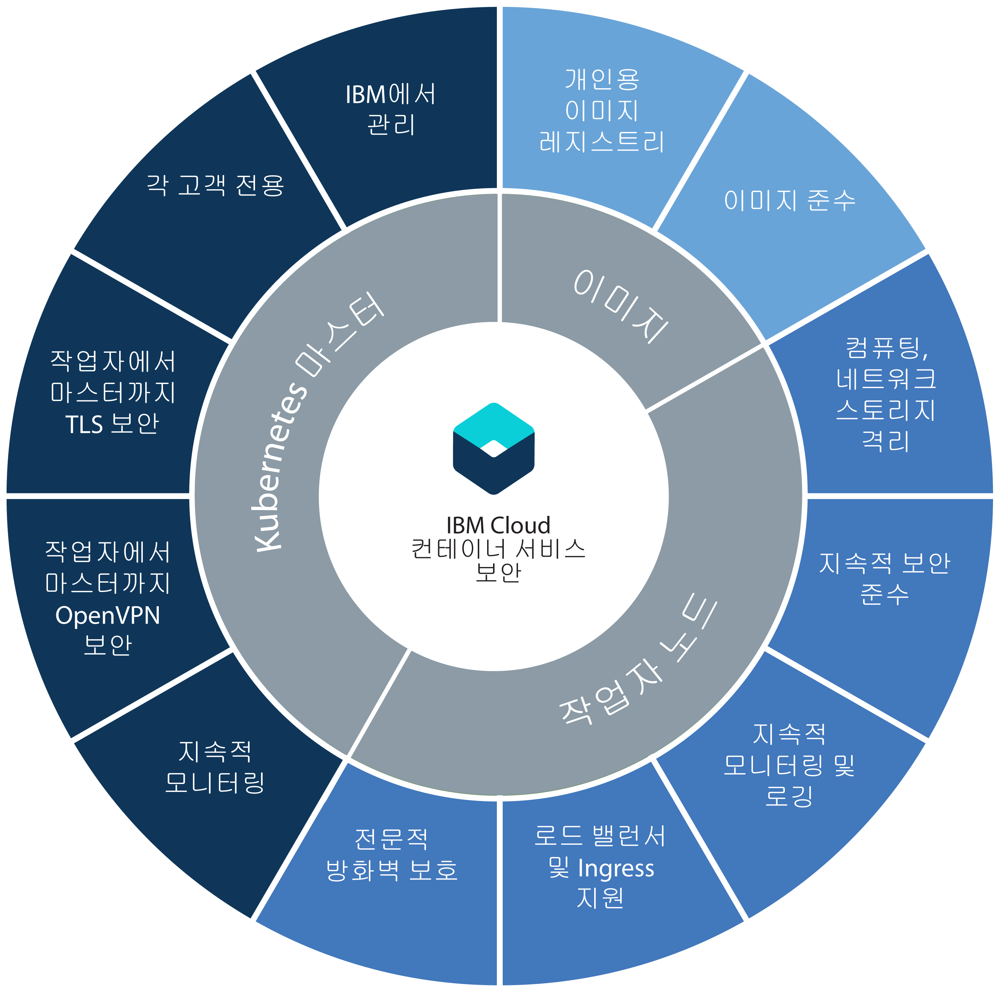

---

copyright:
  years: 2014, 2018
lastupdated: "2018-03-16"

---

{:new_window: target="_blank"}
{:shortdesc: .shortdesc}
{:screen: .screen}
{:pre: .pre}
{:table: .aria-labeledby="caption"}
{:codeblock: .codeblock}
{:tip: .tip}
{:download: .download}

# {{site.data.keyword.containerlong_notm}}에 대한 보안
{: #security}

위험성 분석과 보안 보장을 위해 {{site.data.keyword.containerlong}}의 기본 제공 보안 기능을 사용할 수 있습니다. 이러한 기능을 사용하면 Kubernetes 클러스터 인프라 및 네트워크 통신을 보호하고 컴퓨팅 리소스를 격리하며 인프라 컴포넌트 및 컨테이너 배치에서 보안 준수를 보장하는 데 도움이 됩니다.
{: shortdesc}

## 클러스터 컴포넌트에 의한 보안
{: #cluster}

각 {{site.data.keyword.containerlong_notm}} 클러스터에는 [마스터](#master) 및 [작업자](#worker) 노드에 기본 제공되는 보안 기능이 있습니다.
{: shortdesc}

방화벽이 있는 경우, 클러스터 외부에서 로드 밸런싱에 액세스해야 하는 경우 또는 회사 네트워크 정책이 공용 인터넷 엔드포인트에 대한 액세스를 방지할 때 로컬 시스템에서 `kubectl` 명령을 실행하려는 경우, [방화벽에서 포트를 여십시오](cs_firewall.html#firewall). 클러스터의 앱을 온프레미스 네트워크 또는 클러스터 외부의 기타 앱에 연결하려면 [VPN 연결을 설정](cs_vpn.html#vpn)하십시오.

다음 다이어그램에서 Kubernetes 마스터, 작업자 노드 및 컨테이너 이미지에서 그룹화된 보안 기능을 볼 수 있습니다.

  <table summary="테이블의 첫 번째 행에는 두 개의 열이 있습니다. 나머지 행은 왼쪽에서 오른쪽으로 읽어야 하며 1열에는 서버 위치, 2열에는 일치시킬 IP 주소가 있습니다.">
  <thead>
  <th colspan=2> {{site.data.keyword.containershort_notm}}의 기본 제공 클러스터 보안 설정</th>
  </thead>
  <tbody>
    <tr>
      <td>Kubernetes 마스터</td>
      <td>각 클러스터의 Kubernetes 마스터는 IBM에서 관리하고 가용성이 높습니다. 작업자 노드와의 양방향 보안 통신과 보안 준수를 보장하는 {{site.data.keyword.containershort_notm}} 보안 설정이 포함됩니다. 필요하면 IBM에 의해 업데이트가 수행됩니다. 전용 Kubernetes 마스터는 클러스터에서 모든 Kubernetes 리소스를 중앙 집중식으로 제어하고 모니터합니다. 클러스터의 용량 및 배치 요구사항에 따라 Kubernetes 마스터는 사용 가능한 작업자 노드 간에 배치하도록 컨테이너화된 앱을 자동으로 스케줄링합니다. 자세한 정보는 [Kubernetes 마스터 보안](#master)을 참조하십시오.</td>
    </tr>
    <tr>
      <td>작업자 노드</td>
      <td>컨테이너는 클러스터 전용이며 IBM 고객을 위한 컴퓨팅, 네트워크 및 스토리지 격리를 보장하는 작업자 노드에 배치됩니다. {{site.data.keyword.containershort_notm}}는 공용 및 사설 네트워크에서 작업자 노드의 보안을 유지하고 작업자 노드 보안 준수를 보장할 수 있도록 기본 제공되는 보안 기능을 제공합니다. 자세한 정보는 [작업자 노드 보안](#worker)을 참조하십시오. 또한 [Calico 네트워크 정책](cs_network_policy.html#network_policies)을 추가하여 작업자 노드의 포드에서 허용하거나 차단할 네트워크 트래픽을 구체적으로 지정할 수 있습니다.</td>
     </tr>
     <tr>
      <td>이미지</td>
      <td>클러스터 관리자인 경우에는 Docker 이미지를 저장하고 이를 클러스터 사용자 간에 공유할 수 있는 {{site.data.keyword.registryshort_notm}}의 사용자 고유의 보안 Docker 이미지 저장소를 설정할 수 있습니다. 안전한 컨테이너 배치를 보장하기 위해, 개인용 레지스트리의 모든 이미지는 Vulnerability Advisor에 의해 스캔됩니다. Vulnerability Advisor는 잠재적 취약점을 스캔하고 보안 권장사항을 작성하며 취약점 해결을 위한 지시사항을 제공하는 {{site.data.keyword.registryshort_notm}}의 컴포넌트입니다. 자세한 정보는 [{{site.data.keyword.containershort_notm}}의 이미지 보안](#images)을 참조하십시오.</td>
    </tr>
  </tbody>
</table>

 

## Kubernetes 마스터
{: #master}

Kubernetes 마스터를 보호하고 클러스터 네트워크 통신을 보호하기 위해 기본 제공되는 Kubernetes 마스터 보안 기능을 검토합니다.
{: shortdesc}

<dl>
  <dt>완전 관리되는 전용 Kubernetes 마스터</dt>
    <dd>{{site.data.keyword.containershort_notm}}의 모든 Kubernetes 클러스터는 IBM에서 IBM 소유 IBM Cloud 인프라(SoftLayer) 계정으로 관리하는 데디케이티드 Kubernetes 마스터에 의해 제어됩니다. Kubernetes 마스터는 다른 IBM 고객과 공유하지 않는 다음의 데디케이티드 컴포넌트로 설정됩니다.
    <ul><li>etcd 데이터 저장소: 서비스, 배치, 포드와 같은 클러스터의 모든 Kubernetes 리소스를 저장합니다. Kubernetes ConfigMaps 및 시크릿은 포드에서 실행되는 앱에서 사용할 수 있도록 키 값 쌍으로 저장되는 앱 데이터입니다. etcd의 데이터는 IBM에서 관리하고 매일 백업되는 암호화된 디스크에 저장됩니다. 포드에 전송될 때 데이터는 데이터 보호와 무결성을 보호하기 위해 TLS를 통해 암호화됩니다.</li>
    <li>kube-apiserver: Kubernetes 마스터에 대한 작업자 노드의 모든 요청에 대해 기본 시작점 역할을 합니다. 
kube-apiserver는 요청을 유효성 검증하고 처리하며 etcd 데이터 저장소에서 읽고 쓰기가 가능합니다.</li>
    <li>kube-scheduler: 용량 및 성능 요구사항, 하드웨어 및 소프트웨어 정책 제한조건,
연관관계 방지 스펙, 그리고 워크로드 요구사항을 고려하여 포드가 배치될 위치를 결정합니다. 
요구사항과 일치하는 작업자 노드를 찾을 수 없으면 포드가 클러스터에 배치되지 않습니다.</li>
    <li>kube-controller-manager: 원하는 상태를 얻기 위한 상대 포드의 작성과 복제본 세트의 모니터링을 담당합니다.</li>
    <li>OpenVPN: 모든 Kubernetes 마스터 대 작업자 노드 통신을 위해 보안 네트워크 연결을 제공하기 위한 {{site.data.keyword.containershort_notm}} 특정 컴포넌트.</li></ul></dd>
  <dt>모든 작업자 노드 대 Kubernetes 마스터 통신을 위한 TLS 보안 네트워크 연결</dt>
    <dd>Kubernetes 마스터에 대한 네트워크 통신을 보호하기 위해, {{site.data.keyword.containershort_notm}}는 모든 클러스터에 대한 kube-apiserver 및 etcd 데이터 저장소 컴포넌트와의 양방향 통신을 암호화하는 TLS 인증서를 생성합니다. 이러한 인증서는 클러스터 간에 또는 Kubernetes 마스터 컴포넌트 간에 절대 공유되지 않습니다.</dd>
  <dt>모든 Kubernetes 마스터 대 작업자 노드 통신을 위한 OpenVPN 보안 네트워크 연결</dt>
    <dd>Kubernetes가 `https` 프로토콜을 사용하여 Kubernetes 마스터 및 작업자 노드 간의 통신을 보호하지만, 기본적으로 작업자 노드에서는 인증이 제공되지 않습니다. 이 통신을 보호하기 위해 {{site.data.keyword.containershort_notm}}는 클러스터가 작성될 때 Kubernetes 마스터 및 작업자 노드 간의 OpenVPN 연결을 자동으로 설정합니다.</dd>
  <dt>지속적 Kubernetes 마스터 네트워크 모니터링</dt>
    <dd>모든 Kubernetes 마스터는 프로세스 레벨 서비스 거부(DoS)
        공격을 제어하고 처리하기 위해 IBM에 의해 지속적으로 모니터됩니다.</dd>
  <dt>Kubernetes 마스터 노드 보안 준수</dt>
    <dd>{{site.data.keyword.containershort_notm}}는 마스터 노드 보호를 보장하기 위해 적용이 필요한 OS 특정 보안 수정사항 및 Kubernetes에서 발견된 취약점에 대해 Kubernetes 마스터가 배치된 모든 노드를 자동으로 스캔합니다. 취약점이 발견된 경우, {{site.data.keyword.containershort_notm}}는 자동으로 수정사항을 적용하며 사용자를 위해 취약점을 해결합니다.</dd>
</dl>

 

## 작업자 노드
{: #worker}

작업자 노드 환경을 보호하고 리소스, 네트워크 및 스토리지 격리를 보장하기 위해 기본 제공되는 작업자 노드 보안 기능을 검토합니다.
{: shortdesc}

<dl>
  <dt>작업자 노드 소유권</dt>
    <dd>작업자 노드의 소유권은 작성하는 클러스터의 유형에 따라 다릅니다. 
 무료 클러스터의 작업자 노드는 IBM이 소유하고 있는 IBM Cloud 인프라(SoftLayer) 계정에 프로비저닝됩니다. 사용자가 작업자 노드에 앱을 배치할 수 있지만 설정을 변경하거나 작업자 노드에 추가 소프트웨어를 설치할 수는 없습니다.
 
표준 클러스터의 작업자 노드는 고객의 퍼블릭 또는 데디케이티드 IBM Cloud 계정과 연관된 IBM Cloud 인프라(SoftLayer) 계정에 프로비저닝됩니다. 고객이 작업자 노드를 소유하지만 IBM에서 운영 체제에 업데이트 및 보안 패치를 배치하기 위해 작업자 노드에 대한 액세스를 유지보수합니다. 고객은 IBM Cloud 컨테이너 서비스에서 제공되는 대로 보안 설정을 변경하거나 작업자 노드에 추가 소프트웨어를 설치하도록 선택할 수 있습니다.
 </dd>
  <dt>컴퓨팅, 네트워크 및 스토리지 인프라 격리</dt>
    <dd>클러스터를 작성할 때 IBM에서 IBM Cloud 인프라(SoftLayer) 포트폴리오를 사용하여 작업자 노드를 가상 머신으로 프로비저닝합니다. 작업자 노드는 클러스터 데디케이티드이며, 기타 클러스터의 워크로드를 호스팅하지 않습니다.
 모든 {{site.data.keyword.Bluemix_notm}} 계정은 작업자 노드에서 고품질 네트워크 성능과 격리를 보장할 수 있도록 IBM Cloud 인프라(SoftLayer) VLAN으로 설정됩니다. 작업자 노드를 프라이빗 VLAN에만 연결하여 작업자 노드를 프라이빗으로 지정할 수도 있습니다.
 
클러스터에서 데이터의 지속성을 위해 IBM Cloud 인프라(SoftLayer)에서 전용 NFS 기반 파일 스토리지를 프로비저닝할 수 있으며 해당 플랫폼의 기본 제공 데이터 보안 기능을 최대한 활용할 수 있습니다. 
</dd>
  <dt>안전한 작업자 노드 설정</dt>
    <dd>모든 작업자 노드는 작업자 노드 소유자가 변경할 수 없는 Ubuntu 운영 체제로 설정됩니다. 작업자 노드의 운영 체제가 Ubuntu이므로 작업자 노드에 배치되는 모든 컨테이너는 Ubuntu 커널을 사용하는 Linux 배포판을 사용해야 합니다. 다른 방법으로 커널에 연결해야 하는 Linux 배포판을 사용할 수 없습니다. 잠재적인 공격으로부터 작업자 노드의 운영 체제를 보호하기 위해 모든 작업자 노드가 Linux iptable 규칙이 적용되는 전문 방화벽 설정으로 구성됩니다.
 Kubernetes에서 실행되는 모든 컨테이너는 클러스터 작성 중에 모든 작업자 노드에서 구성되는 사전 정의된 Calico 네트워크 정책 설정에 의해 보호됩니다. 이 설정은 작업자 노드와 포드 간의 보안 네트워크 통신을 보장합니다. 컨테이너가
표준 클러스터의 작업자 노드에서 수행할 수 있는 조치를 추가로 제한하기 위해 사용자가 작업자 노드에서 [AppArmor 정책 ](https://kubernetes.io/docs/tutorials/clusters/apparmor/)을 구성하도록 선택할 수 있습니다.

 SSH 액세스는 작업자 노드에서 사용되지 않습니다. 표준 클러스터가 있고 작업자 노드에서 추가 기능을 설치하려면 모든 작업자 노드에서 실행할 모든 항목에 대해 [Kubernetes 디먼 세트 ](https://kubernetes.io/docs/concepts/workloads/controllers/daemonset)를 사용하거나 실행해야 하는 일회성 조치에 대해 [Kubernetes 작업 ](https://kubernetes.io/docs/concepts/workloads/controllers/jobs-run-to-completion/)을 사용하십시오.
</dd>
  <dt>Kubernetes 작업자 노드 보안 준수</dt>
    <dd>IBM은 내부 및 외부 보안 자문 팀과 공동 작업하여 잠재적 보안 준수 취약점을 해결합니다. IBM은 운영 체제에 업데이트 및 보안 패치를 배치하기 위해 작업자 노드에 대한 액세스를 유지합니다.
 <b>중요</b>: 자동으로 운영 체제에 배치되는 업데이트와 보안 패치가 설치될 수 있도록 정기적으로 작업자 노드를 다시 부팅하십시오. IBM에서는 작업자 노드를 다시 부팅하지 않습니다.
</dd>
  <dt>실제(베어메탈) 서버에 노드를 배치하는 옵션</dt>
  <dd>베어메탈 실제 서버(가상 서버 인스턴스 대신)에 작업자 노드를 프로비저닝하도록 선택하는 경우 메모리 또는 CPU와 같은 컴퓨팅 호스트를 통해 더 강력하게 제어할 수 있습니다. 이 설정은 호스트에서 실행되는 가상 머신에 실제 리소스를 할당하는 가상 머신 하이퍼바이저를 제거합니다. 대신, 모든 베어메탈 머신의 리소스가 작업자 전용으로만 사용되므로 리소스를 공유하거나 성능을 저하시키는 "시끄러운 이웃(noisy neighbors)" 문제를 신경쓰지 않아도 됩니다. 베어메탈 서버는 클러스터 사용에 사용 가능한 모든 리소스를 포함하여 사용자에게만 전용으로 제공됩니다.</dd>
  <dt id="trusted_compute">신뢰할 수 있는 컴퓨팅을 사용하는 {{site.data.keyword.containershort_notm}}</dt>
  <dd>
신뢰할 수 있는 컴퓨팅을 지원하는 [베어메탈에 클러스터를 배치](cs_clusters.html#clusters_ui)하는 경우 신뢰를 사용할 수 있습니다. 이 TPM(Trusted Platform Module) 칩은 신뢰할 수 있는 컴퓨팅(클러스터에 추가하는 이후 노드 포함)을 지원하는 클러스터의 각 베어메탈 작업자 노드에서 사용으로 설정됩니다. 그러므로 신뢰를 사용하도록 설정한 후에는 나중에 클러스터에 대해 이를 사용하지 않도록 설정할 수 없습니다. 신뢰 서버는 마스터 노드에 배치되고 신뢰 에이전트는 작업자 노드에 포드로 배치됩니다. 작업자 노드가 시작되면 신뢰 에이전트 포드는 프로세스의 각 단계를 모니터합니다. 

  
하드웨어는 TPM을 사용하여 측정을 전송하는 신뢰의 루트에 있습니다. TPM은 프로세스 전체에서 측정 데이터의 전송을 보호하기 위해 사용되는 암호화 키를 생성합니다. 신뢰 에이전트는 시작 프로세스에서 각 컴포넌트의 측정을 신뢰 서버에 전달합니다(TPM 하드웨어와 상호작용하는 BIOS 펌웨어에서 부트로더 및 OS 커널로). 그런 다음, 신뢰할 수 있는 에이전트는 시작이 유효한지 여부를 증명하기 위해 신뢰할 수 있는 서버에서 이 측정을 예상 값과 비교합니다. 신뢰할 수 있는 컴퓨팅 프로세스는 애플리케이션과 같은 작업자 노드의 기타 포드를 모니터하지 않습니다. 

  
예를 들어, 권한 없는 사용자가 시스템에 대한 액세스 권한을 얻고 추가 로직으로 OS 커널을 수정하여 데이터를 수집하는 경우 신뢰할 수 있는 에이전트는 이를 발견하고 노드의 신뢰할 수 있는 상태를 변경하여 사용자는 작업자가 더 이상 신뢰되지 않음을 알게 됩니다. 신뢰할 수 있는 컴퓨팅을 사용하면 베어메탈 작업자 노드를 변조와 비교하여 확인할 수 있습니다. 

  

</dd>
  <dt id="encrypted_disks">암호화된 디스크</dt>
  <dd>기본적으로 {{site.data.keyword.containershort_notm}}는 작업자 노드가 프로비저닝될 때 모든 작업자 노드에 두 개의 로컬 SSD 암호화 데이터 파티션을 제공합니다. 첫 번째 파티션은 암호화되지 않고 _/var/lib/docker_에 마운트되는 두 번째 파티션은 LUKS 암호화 키를 사용하여 잠금 해제됩니다. 각 Kubernetes 클러스터의 각 작업자는 {{site.data.keyword.containershort_notm}}에서 관리되는 고유한 LUKS 암호화 키가 있습니다. 클러스터를 작성하거나 기존 클러스터에 작업자 노드를 추가하는 경우, 키를 안전하게 가져온 다음 암호화 디스크가 잠금 해제된 후에 버려집니다.
  
<b>참고</b>: 암호화는 디스크 I/O 성능에 영향을 줄 수 있습니다. 고성능 디스크 I/O가 필요한 워크로드의 경우, 암호화를 끌지 여부를 결정하는 데 도움이 되도록 암호화가 사용된 클러스터와 사용되지 않은 클러스터를 둘 다 테스트하십시오.

  </dd>
  <dt>IBM Cloud 인프라(SoftLayer) 네트워크 방화벽에 대한 지원</dt>
    <dd>{{site.data.keyword.containershort_notm}}는 모든 [IBM Cloud 인프라(SoftLayer) 방화벽 오퍼링 ](https://www.ibm.com/cloud-computing/bluemix/network-security)과 호환 가능합니다. {{site.data.keyword.Bluemix_notm}} 퍼블릭에서 사용자는 표준 클러스터에 대한 데디케이티드 네트워크 보안을 제공하고 네트워크 침입을 발견하여 이를 해결하기 위한 사용자 정의 네트워크 정책으로 방화벽을 설정할 수 있습니다. 예를 들어, [Vyatta ](https://knowledgelayer.softlayer.com/topic/vyatta-1)가 방화벽 역할을 수행하여 원하지 않는 트래픽을 차단하게 설정하도록 선택할 수 있습니다. 방화벽을 설정할 때 마스터와 작업자 노드가 통신할 수 있도록 각 지역의 [필수 포트와 IP 주소도 개방해야 합니다](cs_firewall.html#firewall).</dd>
  <dt>서비스를 개인용으로 설정하거나 일부 서비스 및 앱을 선택적으로 공용 인터넷에 노출</dt>
    <dd>사용자는 작업자 노드와 포드 간에 보안 통신을 보장하기 위해 서비스와 앱을 개인용으로 유지하고 이 주제에서 설명하는 기본 제공 보안 기능을 최대로 활용하도록 선택할 수 있습니다. 서비스와 앱을 공용 인터넷에 노출하기 위해, 공용으로 안전하게 서비스를 사용할 수 있도록 Ingress 및 로드 밸런서 지원을 활용할 수 있습니다.</dd>
  <dt>작업자 노드와 앱을 온프레미스 데이터센터에 안전하게 연결</dt>
  <dd>온프레미스 데이터센터에 작업자 노드와 앱을 연결하려면 strongSwan 서비스, Vyatta Gateway Appliance 또는 Fortigate Appliance로 VPN IPSec 엔드포인트를 구성할 수 있습니다. <ul><li><b>strongSwan IPSec VPN 서비스</b>: Kubernetes 클러스터를 온프레미스 네트워크와 안전하게 연결하는 [strongSwan IPSec VPN 서비스 ](https://www.strongswan.org/)를 설정할 수 있습니다. strongSwan IPSec VPN 서비스는 IPsec(Industry-standard Protocol Security) 프로토콜 스위트를 기반으로 하는 인터넷을 통해 안전한 엔드-투-엔드 통신 채널을 제공합니다. 클러스터와 온프레미스 네트워크 간의 보안 연결을 설정하려면 IPsec VPN 게이트웨이가  온프레미스 데이터센터에 설치되어 있어야 합니다. 그러면 Kubernetes 포드에 [strongSwan IPSec VPN 서비스를 구성 및 배치](cs_vpn.html#vpn-setup)할 수 있습니다.</li><li><b>Vyatta Gateway Appliance 또는 Fortigate Appliance</b>: 클러스터의 규모가 더 크고 단일 VPN을 통해 비Kubernetes 리소스에 액세스하려고 하거나 단일 VPN을 통해 다중 클러스터에 액세스하려는 경우, IPSec VPN 엔드포인트를 구성하기 위해 Vyatta Gateway Appliance 또는 Fortigate Appliance를 설정하는 것이 바람직합니다. 자세한 정보는 [클러스터를 온프레미스 데이터센터에 연결 ](https://www.ibm.com/blogs/bluemix/2017/07/kubernetes-and-bluemix-container-based-workloads-part4/)의 블로그 게시물을 참조하십시오.</li></ul></dd>
  <dt>클러스터 활동의 지속적 모니터링 및 로깅</dt>
    <dd>표준 클러스터의 경우, 작업자 노드 추가, 롤링 업데이트 진행상태 또는 용량 사용 정보와 같은 모든 클러스터 관련 이벤트를 {{site.data.keyword.containershort_notm}}에서 로그하고 모니터할 수 있으며, {{site.data.keyword.loganalysislong_notm}} 및 {{site.data.keyword.monitoringlong_notm}}로 전송할 수 있습니다. 로깅 및 모니터링 설정에 대한 정보는 [클러스터 로깅 구성](/docs/containers/cs_health.html#logging) 및 [클러스터 모니터링 구성](/docs/containers/cs_health.html#monitoring)을 참조하십시오.</dd>
</dl>

 

## 이미지
{: #images}

기본 제공 보안 기능으로 이미지의 보안과 무결성을 관리합니다.
{: shortdesc}

<dl>
<dt>{{site.data.keyword.registryshort_notm}}의 보안 Docker 개인용 이미지 저장소</dt>
<dd>Docker 이미지를 빌드하고 안전하게 저장하며 이를 클러스터 사용자 간에 공유할 수 있도록 IBM이 호스팅하고 관리하는 멀티 테넌트, 고가용성 및 확장 가능한 개인용 이미지 레지스트리의 사용자 고유의 Docker 이미지 저장소를 설정할 수 있습니다.</dd>

<dt>이미지 보안 준수</dt>
<dd>{{site.data.keyword.registryshort_notm}}를 사용하는 경우에는 Vulnerability Advisor에서 제공하는 기본 제공 보안 스캐닝을 활용할 수 있습니다. 네임스페이스에 푸시되는 모든 이미지는 알려진 CentOS, Debian, Red Hat 및 Ubuntu 문제의 데이터베이스에 대한 취약점이 자동으로 스캔됩니다. 취약점이 발견되는 경우, Vulnerability Advisor는 이미지 무결성과 보안을 보장하기 위해 이를 해결하는 방법에 대한 지시사항을 제공합니다.</dd>
</dl>

이미지의 취약성 평가를 보려면 [Vulnerability Advisor 문서를 검토](/docs/services/va/va_index.html#va_registry_cli)하십시오.

 

## 클러스터 내부 네트워킹
{: #in_cluster_network}

작업자 노드와 포드 간의 보안 클러스터 내 네트워크 통신은 프라이빗 가상 근거리 통신망(VLAN)으로 실현됩니다. VLAN은 동일한 실제 회선에 연결된 것처럼 작업자 노드 및 포드의 그룹을 구성합니다.
{:shortdesc}

클러스터를 작성할 때 모든 클러스터가 자동으로 프라이빗 VLAN에 연결됩니다.  프라이빗 VLAN은 클러스터 작성 중에 작업자 노드에 지정된 사설 IP 주소를 판별합니다.

|클러스터 유형|클러스터의 프라이빗 VLAN 관리자|
|------------|-------------------------------------------|
|{{site.data.keyword.Bluemix_notm}}의 무료 클러스터|{{site.data.keyword.IBM_notm}}|
|{{site.data.keyword.Bluemix_notm}}의 표준 클러스터|IBM Cloud 인프라(SoftLayer) 계정의 사용자 
**팁:** 계정의 모든 VLAN에 액세스하려면 [VLAN Spanning](/docs/infrastructure/vlans/vlan-spanning.html#enable-or-disable-vlan-spanning)을 켜십시오.
|

작업자 노드에 배치된 모든 포드에도 사설 IP 주소가 지정됩니다. 포드에 172.30.0.0/16 사설 주소 범위에서 IP가 지정되고 작업자 노드 사이에서만 라우팅됩니다. 충돌을 피하려면 사용자의 작업자 노드와 통신할 노드에 이 IP 범위를 사용하지 마십시오. 작업자 노드 및 포드는 사설 IP 주소를 사용하여 사설 네트워크에서 안전하게 통신할 수 있습니다. 그러나 포드에 장애가 발생하거나 작업자 노드의 재작성이 필요한 경우에는 새 사설 IP 주소가 지정됩니다.

고가용성이어야 하는 앱에 대한 사설 IP 주소 변경을 추적하는 것이 어렵기 때문에 기본 제공 Kubernetes 서비스 검색 기능을 사용하고 클러스터의 사설 네트워크에서 클러스터 IP 서비스로서 앱을 노출할 수 있습니다. Kubernetes 서비스는 포드 세트를 그룹화하며, 각 포드의 실제 사설 IP 주소를 노출함이 없이 클러스터의 기타 서비스에 대해 이러한 포드로의 네트워크 연결을 제공합니다. 클러스터 IP 서비스를 작성하면 사설 IP 주소가 10.10.10.0/24 사설 주소 범위에서 그 서비스에 지정됩니다. 포드 사설 주소 범위로 사용자의 작업자 노드와 통신할 노드에 이 IP 범위를 사용하지 마십시오. 이 IP 주소는 클러스터 내에서만 액세스가 가능합니다. 사용자는 인터넷에서 이 IP 주소에 액세스할 수 없습니다. 이와 동시에 DNS 검색 항목이 서비스에 대해 작성되며, 클러스터의 kube-dns 컴포넌트에 저장됩니다. DNS 항목에는 서비스의 이름, 서비스가 작성된 네임스페이스 및 지정된 사설 클러스터 IP 주소에 대한 링크가 포함되어 있습니다.

클러스터의 앱이 클러스터 IP 서비스의 뒤에 있는 포드에 액세스해야 하는 경우, 이는 서비스에 지정된 사설 클러스터 IP 주소를 사용하거나 서비스의 이름을 사용하여 요청을 전송할 수 있습니다. 서비스의 이름을 사용하는 경우, 해당 이름은 kube-dns 컴포넌트에서 검색되며 서비스의 사설 클러스터 IP 주소로 라우팅됩니다. 요청이 서비스에 도달하는 경우, 서비스는 자체 사설 IP 주소 및 배치된 작업자 노드와는 독립적으로 모든 요청이 포드에 동일하게 전달되도록 보장합니다.

클러스터 IP 유형 서비스를 작성하는 방법에 대한 자세한 정보는 [Kubernetes 서비스 ](https://kubernetes.io/docs/concepts/services-networking/service/#publishing-services---service-types)을 참조하십시오.

Kubernetes 클러스터의 앱을 온프레미스 네트워크에 안전하게 연결하는 데 대한 정보는 [VPN 연결 설정](cs_vpn.html#vpn)을 참조하십시오. 외부 네트워크 통신을 위한 앱 노출에 대한 정보는 [외부 네트워킹 계획](cs_network_planning.html#planning)을 참조하십시오.
