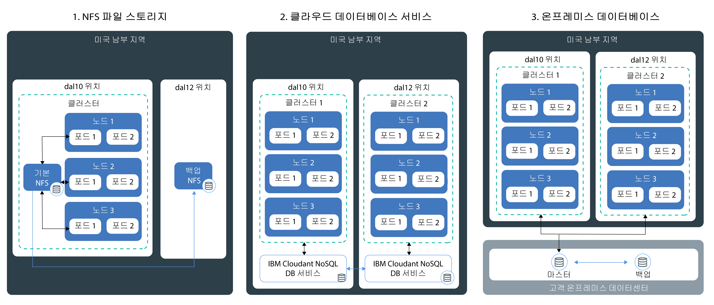

---

copyright:
  years: 2014, 2018
lastupdated: "2018-4-20"

---

{:new_window: target="_blank"}
{:shortdesc: .shortdesc}
{:screen: .screen}
{:pre: .pre}
{:table: .aria-labeledby="caption"}
{:codeblock: .codeblock}
{:tip: .tip}
{:download: .download}


# 클러스터에 데이터 저장
{: #storage}
{{site.data.keyword.containerlong}}의 데이터를 지속하여 앱 인스턴스 간의 데이터를 공유하고 Kubernetes 클러스터의 컴포넌트가 실패한 경우 유실되지 않도록 데이터를 보호할 수 있습니다.

## 고가용성 스토리지 계획
{: #planning}

{{site.data.keyword.containerlong_notm}}에서는 클러스터에서 앱 데이터를 저장하고 팟(Pod) 간에 데이터를 공유하기 위한 여러 옵션 중에서 선택할 수 있습니다. 그러나 클러스터의 컴포넌트 또는 전체 사이트가 실패한 경우 모든 스토리지 옵션이 동일한 레벨의 지속성 및 가용성을 제공하는 것은 아닙니다.
{: shortdesc}

### 비지속적 데이터 스토리지 옵션
{: #non_persistent}

데이터가 지속적으로 저장될 필요가 없는 경우 클러스터의 컴포넌트가 실패한 후 복구할 수 있도록 또는 앱 인스턴스 간에 데이터를 공유할 필요가 없는 경우에 비지속적 스토리지 옵션을 사용할 수 있습니다. 비지속적 스토리지 옵션을 사용하여 앱 컴포넌트를 단위 테스트하거나 새 기능을 사용해 볼 수도 있습니다.
{: shortdesc}

다음 이미지는 {{site.data.keyword.containerlong_notm}}에서 사용 가능한 비지속적 데이터 스토리지 옵션을 보여줍니다. 이러한 옵션은 무료 및 표준 클러스터에 사용할 수 있습니다.
<p>
</p>

<table summary="이 표는 비지속적 스토리지 옵션을 보여줍니다. 행은 왼쪽에서 오른쪽 방향으로 읽어야 하며 1열에는 옵션 번호, 2열에는 옵션 제목, 3열에는 설명이 있습니다. " style="width: 100%">
<caption>비지속적 스토리지 옵션</caption>
  <thead>
  <th>옵션</th>
  <th>설명</th>
  </thead>
  <tbody>
    <tr>
      <td>1. 컨테이너 또는 팟(Pod) 내부에</td>
      <td>컨테이너 및 팟(Pod)은 단기적으로만 지속되도록 디자인되었으며 예기치 않게 실패할 수 있습니다. 그러나 컨테이너의 라이프사이클 전체에서 컨테이너의 로컬 파일 시스템에 데이터를 기록하여 데이터를 저장할 수 있습니다. 컨테이너 내부의 데이터는 다른 컨테이너 또는 팟(Pod)과 공유될 수 없으며 컨테이너가 충돌하거나 제거된 경우 유실됩니다. 자세한 정보는 [컨테이너에 데이터 저장](https://docs.docker.com/storage/)을 참조하십시오.</td>
    </tr>
  <tr>
    <td>2. 작업자 노드에</td>
    <td>모든 작업자 노드는 사용자가 작업자 노드에 대해 선택한 머신 유형에 따라 판별되는 기본 및 보조 스토리지로 설정됩니다. 기본 스토리지는 운영 체제의 데이터를 저장하는 데 사용되며 [Kubernetes <code>hostPath</code> 볼륨 ](https://kubernetes.io/docs/concepts/storage/volumes/#hostpath)을 사용하여 액세스할 수 있습니다. 보조 스토리지는 모든 컨테이너 데이터가 기록되는 디렉토리인 <code>/var/lib/docker</code>의 데이터를 저장하는 데 사용됩니다. [Kubernetes <code>emptyDir</code> 볼륨 ](https://kubernetes.io/docs/concepts/storage/volumes/#emptydir)을 사용하여 보조 스토리지에 액세스할 수 있습니다.<br/><br/><code>hostPath</code> 볼륨이 작업자 노드 파일 시스템에서 팟(Pod)으로 파일을 마운트하는 데 사용되고, <code>emptyDir</code>은 클러스터의 팟(Pod)에 지정된 비어 있는 디렉토리를 작성합니다. 해당 팟(Pod)의 모든 컨테이너가 해당 볼륨에서 읽고 쓰기가 가능합니다. 볼륨이 하나의 특정 팟(Pod)에 지정되므로, 데이터는 복제본 세트의 기타 팟(Pod)과 공유될 수 없습니다.<br/><br/><p>다음과 같은 경우에 <code>hostPath</code> 또는 <code>/emptyDir</code> 볼륨과 해당 데이터가 제거됩니다. <ul><li>작업자 노드가 삭제되었습니다.</li><li>작업자 노드가 다시 로드되거나 업데이트되었습니다.</li><li>클러스터가 삭제되었습니다.</li><li>{{site.data.keyword.Bluemix_notm}} 계정이 일시중단된 상태에 도달했습니다. </li></ul></p><p>또한 다음과 같은 경우에 <code>emptyDir</code> 볼륨의 데이터가 제거됩니다. <ul><li>지정된 팟(Pod)이 작업자 노드에서 영구적으로 삭제되었습니다.</li><li>지정된 팟(Pod)이 다른 작업자 노드에서 스케줄되었습니다.</li></ul></p><p><strong>참고:</strong> 팟(Pod) 내의 컨테이너에 장애가 발생하는 경우, 볼륨의 데이터는 작업자 노드에서 계속 사용 가능합니다.</p></td>
    </tr>
    </tbody>
    </table>

### 고가용성을 위한 지속적 데이터 스토리지 옵션
{: persistent}

고가용성 Stateful 앱을 작성할 때 주요 과제는 여러 위치에 있는 여러 앱 인스턴스 간에 데이터를 지속하고 데이터를 항상 동기화된 상태로 유지하는 것입니다. 고가용성 데이터를 위해 여러 데이터센터 또는 여러 지역에 분산된 여러 인스턴스를 포함하는 마스터 데이터베이스가 있고 이 마스터의 데이터가 지속적으로 복제되는지 확인합니다. 클러스터의 모든 인스턴스가 이 마스터 데이터베이스에서 읽고 써야 합니다. 하나의 마스터 인스턴스가 작동 중지된 경우 앱의 가동이 중단되지 않도록 다른 인스턴스가 워크로드를 인계받을 수 있습니다.
{: shortdesc}

다음 이미지는 표준 클러스터에서 데이터의 가용성을 높이기 위한 {{site.data.keyword.containerlong_notm}}의 옵션을 보여줍니다. 사용자에게 맞는 옵션은 다음 요인에 따라 달라집니다.
  * **보유하고 있는 앱의 유형:** 예를 들어, 데이터베이스의 내부가 아닌 파일 기반으로 데이터를 저장해야 하는 앱이 있을 수 있습니다.
  * **데이터를 저장하고 라우팅할 위치에 대한 법적 요구사항:** 예를 들어, 미국에서만 데이터를 저장하고 라우팅해야 할 수 있으며 이 경우 유럽에 있는 서비스를 사용할 수 없습니다.
  * **백업 및 복원 옵션:** 모든 스토리지 옵션은 데이터를 백업하고 복원하는 기능과 함께 제공됩니다. 사용 가능한 백업 및 복원 옵션이 재해 복구 플랜의 요구사항(예: 백업 빈도 또는 기본 데이터센터 외부에 데이터를 저장하는 기능)을 충족하는지 확인하십시오.
  * **글로벌 복제:** 고가용성을 위해 전세계의 데이터센터에 분산되어 복제되는 여러 스토리지 인스턴스를 설정할 수 있습니다.

<br/>


<table summary="이 표는 지속적 스토리지 옵션을 보여줍니다. 행은 왼쪽에서 오른쪽 방향으로 읽어야 하며 1열에는 옵션 번호, 2열에는 옵션 제목, 3열에는 설명이 있습니다.">
<caption>지속적 스토리지 옵션</caption>
  <thead>
  <th>옵션</th>
  <th>설명</th>
  </thead>
  <tbody>
  <tr>
  <td>1. NFS 파일 스토리지 또는 블록 스토리지</td>
  <td>이 옵션을 사용하면 Kubernetes 지속적 볼륨을 통해 앱 및 컨테이너 데이터를 지속할 수 있습니다. 볼륨이 파일 기반으로 데이터를 저장하거나, 데이터베이스가 아닌 블록으로 데이터를 저장하는 앱에 사용할 수 있는 Endurance 및 Performance [NFS 기반 파일 스토리지 ](https://www.ibm.com/cloud/file-storage/details) 또는 [블록 스토리지 ](https://www.ibm.com/cloud/block-storage)에서 호스팅됩니다. 파일 스토리지 및 블록 스토리지는 REST에서 암호화됩니다. <p>{{site.data.keyword.containershort_notm}}는 스토리지 크기의 범위, IOPS, 삭제 정책 및 볼륨에 대한 읽기/쓰기 권한을 정의하는 사전 정의된 스토리지 클래스를 제공합니다. 파일 스토리지 또는 블록 스토리지에 대한 요청을 시작하려면 [지속적 볼륨 클레임(PVC)](cs_storage.html#create)을 작성해야 합니다. PVC를 제출하면 {{site.data.keyword.containershort_notm}}가 NFS 기반 파일 스토리지 또는 블록 스토리지에서 호스팅되는 지속적 볼륨을 동적으로 프로비저닝합니다. [PVC를 배치에 대한 볼륨으로 마운트](cs_storage.html#app_volume_mount)하여 컨테이너가 볼륨에서 읽고 쓸 수 있도록 허용할 수 있습니다. </p><p>지속적 볼륨은 작업자 노드가 있는 데이터센터에서 프로비저닝됩니다. 동일한 복제본 세트 간에 또는 동일한 클러스터 내의 다른 배치와 데이터를 공유할 수 있습니다. 클러스터가 다른 데이터센터 또는 지역에 있는 경우 클러스터 간에 데이터를 공유할 수 없습니다. </p><p>기본적으로 NFS 스토리지 및 블록 스토리지는 자동으로 백업되지 않습니다. 제공된 [백업 및 복원 메커니즘](cs_storage.html#backup_restore)을 사용하여 클러스터에 대한 주기적 백업을 설정할 수 있습니다. 컨테이너에 장애가 발생하거나 팟(Pod)이 작업자 노드에서 제거되는 경우, 데이터는 제거되지 않으며 볼륨을 마운트하는 기타 배치에 의해 계속해서 액세스될 수 있습니다. </p><p><strong>참고:</strong> 지속적 NFS 파일 공유 스토리지 및 블록 스토리지는 월별로 비용이 부과됩니다. 클러스터에 대한 지속적 스토리지를 프로비저닝하고 이를 즉시 제거하는 경우, 짧은 시간 동안만 사용했어도 지속적 스토리지에 대한 월별 비용을 계속 지불해야 합니다.</p></td>
  </tr>
  <tr id="cloud-db-service">
    <td>2. 클라우드 데이터베이스 서비스</td>
    <td>이 옵션을 사용하면 {{site.data.keyword.Bluemix_notm}} 데이터베이스 클라우드 서비스(예: [IBM Cloudant NoSQL DB](/docs/services/Cloudant/getting-started.html#getting-started-with-cloudant))를 사용하여 데이터를 지속할 수 있습니다. 여러 클러스터, 위치 및 지역에서 이 옵션을 사용하여 저장된 데이터에 액세스할 수 있습니다. <p> 모든 앱에서 액세스하는 단일 데이터베이스 인스턴스를 구성하거나 고가용성을 위해 [데이터센터에 걸쳐 여러 인스턴스를 설정하고 인스턴스 간의 복제를 설정](/docs/services/Cloudant/guides/active-active.html#configuring-cloudant-nosql-db-for-cross-region-disaster-recovery)하도록 선택할 수 있습니다. IBM Cloudant NoSQL 데이터베이스에서는 데이터가 자동으로 백업되지 않습니다. 제공된 [백업 및 복원 메커니즘](/docs/services/Cloudant/guides/backup-cookbook.html#cloudant-nosql-db-backup-and-recovery)을 사용하여 사이트 실패로부터 데이터를 보호할 수 있습니다.</p> <p> 클러스터에서 서비스를 사용하려면 클러스터의 네임스페이스에 [{{site.data.keyword.Bluemix_notm}} 서비스를 바인딩](cs_integrations.html#adding_app)해야 합니다. 서비스를 클러스터에 바인딩하면 Kubernetes 시크릿이 작성됩니다. Kubernetes 시크릿은 서비스에 대한 기밀 정보를 유지합니다(예: 서비스에 대한 URL, 사용자 이름 및 비밀번호). 시크릿을 시크릿 볼륨으로서 팟(Pod)에 마운트하고, 시크릿의 신임 정보를 사용하여 서비스에 액세스할 수 있습니다. 시크릿 볼륨을 기타 팟(Pod)에 마운트하여 팟(Pod) 간의 데이터를 공유할 수도 있습니다. 컨테이너에 장애가 발생하거나 팟(Pod)이 작업자 노드에서 제거되는 경우, 데이터는 제거되지 않으며 시크릿 볼륨을 마운트하는 기타 팟(Pod)에 의해 계속해서 액세스될 수 있습니다. <p>대부분의 {{site.data.keyword.Bluemix_notm}} 데이터베이스 서비스에서는 적은 양의 데이터를 위한 디스크 공간을 무료로 제공하므로 해당 기능을 테스트할 수 있습니다.</p></td>
  </tr>
  <tr>
    <td>3. 온프레미스 데이터베이스</td>
    <td>법적인 이유로 데이터를 현장에 저장해야 하는 경우 온프레미스 데이터베이스에 대한 [VPN 연결을 설정](cs_vpn.html#vpn)하고 데이터센터에서 기존 스토리지, 백업 및 복제 메커니즘을 사용할 수 있습니다.</td>
  </tr>
  </tbody>
  </table>

{: caption="표. Kubernetes 클러스터에서의 배치를 위한 지속적 데이터 스토리지 옵션" caption-side="top"}

<br />


## 클러스터에서 기존 NFS 파일 공유 사용
{: #existing}

Kubernetes와 함께 사용할 IBM Cloud 인프라(SoftLayer) 계정에 기존의 NFS 파일 공유가 이미 있는 경우 기존 스토리지에 대한 지속적 볼륨(PV)을 작성하여 이를 수행할 수 있습니다.
{:shortdesc}

지속적 볼륨(PV)은 데이터센터에서 프로비저닝된 실제 스토리지를 나타내는 Kubernetes 리소스입니다. 지속적 볼륨은 특정 스토리지 유형이 {{site.data.keyword.Bluemix_notm}} Storage에 의해 프로비저닝되는 방법에 대한 세부사항을 요약합니다. PV를 클러스터에 마운트하려면 지속적 볼륨 클레임(PVC)을 작성하여 팟(Pod)에 대한 지속적 스토리지를 요청해야 합니다. 다음 다이어그램은 PV와 PVC 간의 관계에 대해 설명합니다.


 다이어그램에 표시된 대로 기존 NFS 파일 공유가 Kubernetes와 함께 사용될 수 있도록 하려면 특정 크기와 액세스 모드로 PV를 작성하고 그 PV 스펙과 일치하는 PVC를 작성해야 합니다. PV와 PVC가 일치하는 경우 서로 바인딩됩니다. 바인딩된 PVC만 볼륨을 배치에 마운트하기 위해 클러스터 사용자가 사용할 수 있습니다. 이 프로세스를 지속적 스토리지의 정적 프로비저닝이라고 합니다.

시작하기 전에 PV를 작성하기 위해 사용할 수 있는 기존 NFS 파일 공유가 있는지 확인하십시오. 예를 들어, 이전에 [`retain` 스토리지 클래스 정책으로 PVC를 작성한 경우](#create) 이 새로운 PVC의 기존 NFS 파일 공유에 보존된 해당 데이터를 사용할 수 있습니다.

**참고:** 지속적 스토리지의 정적 프로비저닝은 기존 NFS 파일 공유에만 적용됩니다. 기존 NFS 파일 공유가 없는 경우, 클러스터 사용자는 PV를 추가하기 위해 [동적 프로비저닝](cs_storage.html#create) 프로세스를 사용할 수 있습니다.

PV 및 일치하는 PVC를 작성하려면 다음 단계를 수행하십시오.

1.  IBM Cloud 인프라(SoftLayer) 계정에서 PV 오브젝트를 작성할 NFS 파일 공유의 ID 및 경로를 검색하십시오. 또한 파일 스토리지에 클러스터의 서브넷에 대한 권한을 부여하십시오. 이 권한 부여는 클러스터에 스토리지에 대한 액세스 권한을 제공합니다.
    1.  IBM Cloud 인프라(SoftLayer) 계정에 로그인하십시오.
    2.  **스토리지**를 클릭하십시오.
    3.  **조치** 메뉴에서 **File Storage**를 클릭하고 **호스트에 권한 부여**를 선택하십시오.
    4.  **서브넷**을 선택하십시오.
    5.  드롭 다운 목록에서 작업자 노드가 연결된 프라이빗 VLAN 서브넷을 선택하십시오. 작업자 노드의 서브넷을 찾으려면 `bx cs workers <cluster_name>`을 실행하고 작업자 노드의 `Private IP`와 드롭 다운 목록에서 찾은 서브넷을 비교하십시오.
    6.  **제출**을 클릭하십시오.
    6.  파일 스토리지의 이름을 클릭하십시오.
    7.  **마운트 포인트** 필드를 기록해 두십시오. 이 필드는 `<server>:/<path>`로 표시됩니다.
2.  PV에 대한 스토리지 구성 파일을 작성하십시오. 파일 스토리지 **마운트 포인트** 필드의 서버 및 경로를 포함하십시오.

    ```
    apiVersion: v1
    kind: PersistentVolume
    metadata:
     name: mypv
    spec:
     capacity:
       storage: "20Gi"
     accessModes:
       - ReadWriteMany
     nfs:
       server: "nfslon0410b-fz.service.networklayer.com"
       path: "/IBM01SEV8491247_0908/data01"
    ```
    {: codeblock}

    <table>
    <thead>
    <th colspan=2> YAML 파일 컴포넌트 이해</th>
    </thead>
    <tbody>
    <tr>
    <td><code>name</code></td>
    <td>작성하려는 PV 오브젝트의 이름을 입력하십시오.</td>
    </tr>
    <tr>
    <td><code>spec/capacity/storage</code></td>
    <td>기존 NFS 파일 공유의 스토리지 크기를 입력하십시오. 스토리지 크기는 기가바이트(예: 20Gi(20GB) 또는 1000Gi(1TB))로 기록되어야 하며 그 크기는 기존 파일 공유의 크기와 일치해야 합니다.</td>
    </tr>
    <tr>
    <td><code>accessMode</code></td>
    <td>액세스 모드는 PVC가 작업자 노드에 마운트될 수 있는 방법을 정의합니다.<ul><li>ReadWriteOnce(RWO): PV가 단일 작업자 노드의 배치에만 마운트될 수 있습니다. 이 PV에 마운트된 배치의 컨테이너는 볼륨에서 읽기 및 쓰기가 가능합니다.</li><li>ReadOnlyMany(ROX): PV가 다중 작업자 노드에 호스팅된 배치에 마운트될 수 있습니다. 이 PV에 마운트된 배치는 볼륨에서 읽기만 가능합니다.</li><li>ReadWriteMany(RWX): 이 PV가 다중 작업자 노드에 호스팅된 배치에 마운트될 수 있습니다. 이 PV에 마운트된 배치는 볼륨에서 읽기 및 쓰기가 가능합니다.</li></ul></td>
    </tr>
    <tr>
    <td><code>spec/nfs/server</code></td>
    <td>NFS 파일 공유 서버 ID를 입력하십시오.</td>
    </tr>
    <tr>
    <td><code>path</code></td>
    <td>PV 오브젝트를 작성하려는 NFS 파일 공유에 대한 경로를 입력하십시오.</td>
    </tr>
    </tbody></table>

3.  클러스터에 PV 오브젝트를 작성하십시오.

    ```
    kubectl apply -f deploy/kube-config/mypv.yaml
    ```
    {: pre}

4.  PV가 작성되었는지 확인하십시오.

    ```
    kubectl get pv
    ```
    {: pre}

5.  다른 구성 파일을 작성하여 PVC를 작성하십시오. PVC가 이전에 작성한 PV 오브젝트와 일치하도록 `storage` 및 `accessMode`에 동일한 값을 선택해야 합니다. `storage-class` 필드는 비어 있어야 합니다. 이러한 필드 중에 PV와 일치하지 않는 것이 있는 경우에는 대신 새 PV가 자동으로 작성됩니다.

    ```
    kind: PersistentVolumeClaim
    apiVersion: v1
    metadata:
     name: mypvc
     annotations:
       volume.beta.kubernetes.io/storage-class: ""
    spec:
     accessModes:
       - ReadWriteMany
     resources:
       requests:
         storage: "20Gi"
    ```
    {: codeblock}

6.  PVC 사용자를 작성하십시오.

    ```
    kubectl apply -f deploy/kube-config/mypvc.yaml
    ```
    {: pre}

7.  PVC가 작성되고 PV 오브젝트에 바인딩되는지 확인하십시오. 이 프로세스는 몇 분 정도 소요됩니다.

    ```
    kubectl describe pvc mypvc
    ```
    {: pre}

    출력은 다음과 같이 표시됩니다.

    ```
    Name: mypvc
    Namespace: default
    StorageClass: ""
    Status: Bound
    Volume: pvc-0d787071-3a67-11e7-aafc-eef80dd2dea2
    Labels: <none>
    Capacity: 20Gi
    Access Modes: RWX
    Events:
      FirstSeen LastSeen Count From        SubObjectPath Type Reason Message
      --------- -------- ----- ----        ------------- -------- ------ -------
      3m 3m 1 {ibm.io/ibmc-file 31898035-3011-11e7-a6a4-7a08779efd33 } Normal Provisioning External provisioner is provisioning volume for claim "default/my-persistent-volume-claim"
      3m 1m  10 {persistentvolume-controller } Normal ExternalProvisioning cannot find provisioner "ibm.io/ibmc-file", expecting that a volume for the claim is provisioned either manually or via external software
      1m 1m 1 {ibm.io/ibmc-file 31898035-3011-11e7-a6a4-7a08779efd33 } Normal ProvisioningSucceeded Successfully provisioned volume pvc-0d787071-3a67-11e7-aafc-eef80dd2dea2
    ```
    {: screen}


PV 오브젝트를 작성했으며 PVC에 바인딩했습니다. 이제 클러스터 사용자는 자신의 배치에 [PVC를 마운트](#app_volume_mount)하고 PV 오브젝트에서 읽거나 쓰기를 시작할 수 있습니다.

<br />


## 클러스터의 기존 블록 스토리지 사용
{: #existing_block}

시작하기 전에 PV를 작성하는 데 사용할 수 있는 기존 블록 스토리지 인스턴스가 있는지 확인하십시오. 예를 들어, 이전에 [`retain` 스토리지 클래스 정책으로 PVC를 작성한 경우](#create)에는 이 새로운 PVC에 대해 기존 블록 스토리지에 보존된 해당 데이터를 사용할 수 있습니다. 

PV 및 일치하는 PVC를 작성하려면 다음 단계를 수행하십시오.

1.  IBM Cloud 인프라(SoftLayer) 계정의 API 키를 검색하거나 생성하십시오. 
    1. [IBM Cloud 인프라(SoftLayer) 포털 ](https://control.softlayer.com/)에 로그인하십시오.
    2. **계정**을 선택한 후 **사용자**, **사용자 목록**을 선택하십시오. 
    3. 자신의 사용자 ID를 찾으십시오. 
    4. **API 키** 열에서 **생성**을 클릭하여 API 키를 생성하거나 **보기**를 클릭하여 기존 API 키를 보십시오. 
2.  IBM Cloud 인프라(SoftLayer) 계정의 API 사용자 이름을 검색하십시오. 
    1. **사용자 목록** 메뉴에서 자신의 사용자 ID를 선택하십시오. 
    2. **API 액세스 정보** 섹션에서 **API 사용자 이름**을 찾으십시오. 
3.  IBM Cloud 인프라 CLI 플러그인에 로그인하십시오. 
    ```
    bx sl init
    ```
    {: pre}

4.  IBM Cloud 인프라(SoftLayer) 계정의 사용자 이름 및 API 키를 사용하여 인증하도록 선택하십시오. 
5.  이전 단계에서 검색한 사용자 이름 및 API 키를 입력하십시오. 
6.  사용 가능한 블록 스토리지 디바이스를 나열하십시오. 
    ```
    bx sl block volume-list
    ```
    {: pre}

    출력은 다음과 같습니다. 
    ```
    id         username            datacenter   storage_type              capacity_gb   bytes_used   ip_addr         lunId   active_transactions
    38642141   IBM02SEL1543159-1   dal10        endurance_block_storage   20            -            169.xx.xxx.xxx   170     0
    ```
    {: screen}

7.  클러스터에 마운트할 블록 스토리지 디바이스의 `id`, `ip_addr`, `capacity_gb` 및 `lunId`를 기록하십시오. 
8.  PV에 대한 구성 파일을 작성하십시오. 이전 단계에서 검색한 블록 스토리지 ID, IP 주소, 크기 및 LUN ID를 포함시키십시오. 

    ```
    apiVersion: v1
    kind: PersistentVolume
    metadata:
      name: mypv
    spec:
      capacity:
        storage: "<storage_size>"
      accessModes:
        - ReadWriteOnce
      flexVolume:
        driver: "ibm/ibmc-block"
        fsType: "ext4"
        options:
          "Lun": "<lun_ID>"
          "TargetPortal": "<IP_address>"
          "VolumeID": "<volume_ID>"
          "volumeName": "<volume_name>"
      ```
      {: codeblock}

    <table>
    <thead>
    <th colspan=2> YAML 파일 컴포넌트 이해</th>
    </thead>
    <tbody>
    <tr>
    <td><code>metadata/name</code></td>
    <td>작성할 PV의 이름을 입력하십시오. </td>
    </tr>
    <tr>
    <td><code>spec/capacity/storage</code></td>
    <td>이전 단계에서 <code>capacity-gb</code>로 검색한 기존 블록 스토리지의 스토리지 크기를 입력하십시오. 이 스토리지 크기는 기가바이트 단위로 기록해야 합니다(예: 20Gi(20GB) 또는 1000Gi(1TB)). </td>
    </tr>
    <tr>
    <td><code>flexVolume/options/Lun</code></td>
    <td>이전 단계에서 <code>lunId</code>로 검색한 블록 스토리지의 LUN ID를 입력하십시오. </td>
    </tr>
    <tr>
    <td><code>flexVolume/options/TargetPortal</code></td>
    <td>이전 단계에서 <code>ip_addr</code>로 검색한 블록 스토리지의 IP 주소를 입력하십시오. </td>
    </tr>
    <tr>
	    <td><code>flexVolume/options/VolumeId</code></td>
	    <td>이전 단계에서 <code>id</code>로 검색한 블록 스토리지의 ID를 입력하십시오. </td>
	    </tr>
	    <tr>
		    <td><code>flexVolume/options/volumeName</code></td>
		    <td>볼륨 이름을 입력하십시오. </td>
	    </tr>
    </tbody></table>

9.  클러스터에 PV를 작성하십시오. 
    ```
    kubectl apply -f mypv.yaml
    ```
    {: pre}

10. PV가 작성되었는지 확인하십시오.
    ```
    kubectl get pv
    ```
    {: pre}

11. 다른 구성 파일을 작성하여 PVC를 작성하십시오. PVC가 이전에 작성한 PV와 일치하려면 `storage` 및 `accessMode`에 대해 동일한 값을 선택해야 합니다. `storage-class` 필드는 비어 있어야 합니다. 이러한 필드 중에 PV와 일치하지 않는 것이 있는 경우에는 대신 새 PV가 자동으로 작성됩니다.

     ```
    kind: PersistentVolumeClaim
    apiVersion: v1
    metadata:
     name: mypvc
     annotations:
       volume.beta.kubernetes.io/storage-class: ""
     spec:
      accessModes:
        - ReadWriteOnce
      resources:
        requests:
          storage: "20Gi"
     ```
     {: codeblock}

12.  PVC 사용자를 작성하십시오.
     ```
     kubectl apply -f mypvc.yaml
     ```
     {: pre}

13.  PVC가 작성되어 이전에 작성한 PV에 바인딩되었는지 확인하십시오. 이 프로세스는 몇 분 정도 소요됩니다.
     ```
    kubectl describe pvc mypvc
     ```
     {: pre}

     출력은 다음과 같이 표시됩니다.

     ```
    Name: mypvc
    Namespace: default
    StorageClass: ""
     Status: Bound
     Volume: pvc-0d787071-3a67-11e7-aafc-eef80dd2dea2
     Labels: <none>
     Capacity: 20Gi
     Access Modes: RWO
     Events:
       FirstSeen LastSeen Count From        SubObjectPath Type Reason Message
       --------- -------- ----- ----        ------------- -------- ------ -------
       3m 3m 1 {ibm.io/ibmc-block 31898035-3011-11e7-a6a4-7a08779efd33 } Normal Provisioning External provisioner is provisioning volume  for claim "default/my-persistent-volume-claim"
       3m 1m	 10 {persistentvolume-controller } Normal ExternalProvisioning cannot find provisioner "ibm.io/ibmc-block", expecting that  a volume for the claim is provisioned either manually or via external software
       1m 1m 1 {ibm.io/ibmc-block 31898035-3011-11e7-a6a4-7a08779efd33 } Normal ProvisioningSucceeded	Successfully provisioned volume  pvc-0d787071-3a67-11e7-aafc-eef80dd2dea2
     ```
     {: screen}

PV를 작성하여 PVC에 바인딩했습니다. 이제 클러스터 사용자는 자신의 배치에 [PVC를 마운트](#app_volume_mount)하고 PV에서 읽기 또는 쓰기를 시작할 수 있습니다. 

<br />


## 앱에 NFS 파일 스토리지 또는 블록 스토리지 추가
{: #create}

클러스터를 위한 NFS 파일 스토리지 또는 블록 스토리지를 프로비저닝하는 지속적 볼륨 클레임(PVC)을 작성하십시오. 그런 다음, 팟(Pod)이 충돌하거나 종료된 경우에도 데이터를 사용할 수 있도록 이 클레임을 지속적 볼륨(PV)에 마운트합니다.
{:shortdesc}

PV를 지원하는 NFS 파일 스토리지 및 블록 스토리지는 데이터에 대한 고가용성을 제공하기 위해 IBM에 의해 클러스터됩니다. 스토리지 클래스는 사용 가능한 스토리지 오퍼링의 유형을 설명하고 PV를 작성하는 경우 데이터 보존 정책, 크기(GB) 및 IOPS와 같은 측면을 정의합니다.

시작하기 전에:
- 방화벽이 있는 경우에는 PVC를 작성할 수 있도록 클러스터가 있는 위치의 IBM Cloud 인프라(SoftLayer) IP 범위에 대해 [egress 액세스를 허용하십시오](cs_firewall.html#pvc). 
- 앱에 블록 스토리지를 마운트하려는 경우에는 먼저 [블록 스토리지를 위한 {{site.data.keyword.Bluemix_notm}} Storage 플러그인](#install_block)을 설치해야 합니다. 

지속적 스토리지를 추가하려면 다음을 수행하십시오.

1.  사용 가능한 스토리지 클래스를 검토하십시오. {{site.data.keyword.containerlong}}는 클러스터 관리자가 스토리지 클래스를 작성할 필요가 없도록 NFS 파일 스토리지 및 블록 스토리지에 대한 사전 정의된 스토리지 클래스를 제공합니다. `ibmc-file-bronze` 스토리지 클래스는 `default` 스토리지 클래스와 동일합니다.

    ```
     kubectl get storageclasses
    ```
    {: pre}

    ```
    $ kubectl get storageclasses
    NAME                         TYPE
    default                      ibm.io/ibmc-file
    ibmc-file-bronze (default)   ibm.io/ibmc-file
    ibmc-file-custom             ibm.io/ibmc-file
    ibmc-file-gold               ibm.io/ibmc-file
    ibmc-file-retain-bronze      ibm.io/ibmc-file
    ibmc-file-retain-custom      ibm.io/ibmc-file
    ibmc-file-retain-gold        ibm.io/ibmc-file
    ibmc-file-retain-silver      ibm.io/ibmc-file
    ibmc-file-silver             ibm.io/ibmc-file
    ibmc-block-custom            ibm.io/ibmc-block
    ibmc-block-bronze            ibm.io/ibmc-block
    ibmc-block-gold              ibm.io/ibmc-block
    ibmc-block-silver            ibm.io/ibmc-block
    ibmc-block-retain-bronze     ibm.io/ibmc-block
    ibmc-block-retain-silver     ibm.io/ibmc-block
    ibmc-block-retain-gold       ibm.io/ibmc-block
    ibmc-block-retain-custom     ibm.io/ibmc-block
    ```
    {: screen}

    **팁:** 기본 스토리지 클래스를 변경하려면 `kubectl patch storageclass <storageclass> -p '{"metadata": {"annotations":{"storageclass.kubernetes.io/is-default-class":"true"}}}'`를 실행하고 `<storageclass>`를 스토리지 클래스의 이름으로 대체하십시오.

2.  PVC를 삭제한 후 데이터와 NFS 파일 공유 또는 블록 스토리지를 보존할지 결정하십시오. 
    - 데이터를 보존하려면 `retain` 스토리지 클래스를 선택하십시오. PVC를 삭제하면 PV는 제거되지만 데이터는 IBM Cloud 인프라(SoftLayer) 계정에 계속 존재합니다. 나중에 클러스터에서 이 데이터에 액세스하려면 기존 [NFS 파일](#existing) 또는 [블록](#existing_block) 스토리지를 참조하는 PVC와 일치 PV를 작성하십시오. 
    - PVC를 삭제할 때 데이터 및 NFS 파일 공유 또는 블록 스토리지가 삭제되도록 하려면 `retain`이 없는 스토리지 클래스를 선택하십시오. 

3.  **브론즈, 실버 또는 골드 스토리지 클래스를 선택하는 경우**: 각 클래스에 대한 GB당 IOPS를 정의하는 [Endurance 스토리지](https://knowledgelayer.softlayer.com/topic/endurance-storage)를 가져옵니다. 그러나 사용 가능한 범위 내에서 크기를 선택하여 총 IOPS를 판별할 수 있습니다. 허용된 크기 범위(예: 20Gi, 256Gi, 11854Gi) 내에서 GB 크기의 정수를 선택할 수 있습니다. 예를 들어, GB당 4IOPS의 실버 스토리지 클래스에서 1000Gi의 파일 공유 또는 블록 스토리지 크기를 선택하는 경우 볼륨의 총 IOPS는 4000IOPS입니다. PV에 더 많은 IOPS가 있을수록 입력 및 출력 오퍼레이션을 더 빠르게 처리합니다. 다음 표는 GB당 IOPS 및 각 스토리지 클래스의 크기 범위에 대해 설명합니다.

    <table>
         <caption>스토리지 클래스 크기 범위 및 GB당 IOPS의 표</caption>
         <thead>
         <th>스토리지 클래스</th>
         <th>GB당 IOPS</th>
         <th>크기 범위(GB)</th>
         </thead>
         <tbody>
         <tr>
         <td>브론즈(기본값)</td>
         <td>2IOPS/GB</td>
         <td>20 - 12000Gi</td>
         </tr>
         <tr>
         <td>실버</td>
         <td>4IOPS/GB</td>
         <td>20 - 12000Gi</td>
         </tr>
         <tr>
         <td>골드</td>
         <td>10 IOPS/GB</td>
         <td>20 - 4000Gi</td>
         </tr>
         </tbody></table>

    <p>**스토리지 클래스의 세부사항을 표시하는 명령 예**:</p>

    <pre class="pre"><code>kubectl describe storageclasses ibmc-file-silver</code></pre>

4.  **사용자 정의 스토리지 클래스를 사용하는 경우**: [Performance 스토리지 ](https://knowledgelayer.softlayer.com/topic/performance-storage)를 가져오며 IOPS 및 크기의 조합을 선택하여 더 강력하게 제어할 수 있습니다. 예를 들어, PVC에 40Gi의 크기를 선택하면 100 - 2000IOPS 범위에 있는 100의 배수인 IOPS를 선택할 수 있습니다. 다음 표는 선택한 크기에 따라 선택할 수 있는 IOPS의 범위를 보여줍니다.

    <table>
         <caption>스토리지 클래스 크기 범위 및 IOPS의 표</caption>
         <thead>
         <th>크기 범위(GB)</th>
         <th>100의 배수로 된 IOPS 범위</th>
         </thead>
         <tbody>
         <tr>
         <td>20 - 39Gi</td>
         <td>100 - 1000IOPS</td>
         </tr>
         <tr>
         <td>40 - 79Gi</td>
         <td>100 - 2000IOPS</td>
         </tr>
         <tr>
         <td>80 - 99Gi</td>
         <td>100 - 4000IOPS</td>
         </tr>
         <tr>
         <td>100 - 499Gi</td>
         <td>100 - 6000IOPS</td>
         </tr>
         <tr>
         <td>500 - 999Gi</td>
         <td>100 - 10000IOPS</td>
         </tr>
         <tr>
         <td>1000 - 1999Gi</td>
         <td>100 - 20000IOPS</td>
         </tr>
         <tr>
         <td>2000 - 2999Gi</td>
         <td>200 - 40000IOPS</td>
         </tr>
         <tr>
         <td>3000 - 3999Gi</td>
         <td>200 - 48000IOPS</td>
         </tr>
         <tr>
         <td>4000 - 7999Gi</td>
         <td>300 - 48000IOPS</td>
         </tr>
         <tr>
         <td>8000 - 9999Gi</td>
         <td>500 - 48000IOPS</td>
         </tr>
         <tr>
         <td>10000 - 12000Gi</td>
         <td>1000 - 48000IOPS</td>
         </tr>
         </tbody></table>

    <p>**사용자 정의 스토리지 클래스의 세부사항을 표시하는 명령 예**:</p>

    <pre class="pre"><code>    kubectl describe storageclasses ibmc-file-retain-custom</code></pre>

5.  청구 주기를 시간별 또는 월별 기준으로 선택하십시오. 기본적으로 월별로 비용이 청구됩니다.

6.  구성 파일을 작성하여 PVC를 정의하고 구성을 `.yaml` 파일로 저장하십시오.

    -  **브론즈, 실버, 골드 스토리지 클래스의 예**:
       다음 `.yaml` 파일은 `"ibmc-file-silver"` 스토리지 클래스의 `mypvc`로 이름이 지정되고 `"hourly"`로 청구되며 `24Gi`의 GB 크기로 된 클레임을 작성합니다. 클러스터에 블록 스토리지를 마운트하기 위해 PVC를 작성하려는 경우에는 `accessModes` 섹션에 `ReadWriteOnce`를 입력해야 합니다. 

       ```
       apiVersion: v1
       kind: PersistentVolumeClaim
       metadata:
         name: mypvc
         annotations:
           volume.beta.kubernetes.io/storage-class: "ibmc-file-silver"
         labels:
           billingType: "hourly"
       spec:
         accessModes:
           - ReadWriteMany
         resources:
           requests:
             storage: 24Gi
        ```
        {: codeblock}

    -  **사용자 정의 스토리지 클래스의 예**:
       다음 `.yaml` 파일은 스토리지 클래스 `ibmc-file-retain-custom`의 `mypvc`로 이름이 지정되고 기본 주기인 `"monthly"`로 청구되며 `45Gi`의 GB 크기와 `"300"`의 IOPS로 된 클레임을 작성합니다. 클러스터에 블록 스토리지를 마운트하기 위해 PVC를 작성하려는 경우에는 `accessModes` 섹션에 `ReadWriteOnce`를 입력해야 합니다. 

       ```
       apiVersion: v1
       kind: PersistentVolumeClaim
       metadata:
         name: mypvc
         annotations:
           volume.beta.kubernetes.io/storage-class: "ibmc-file-retain-custom"
         labels:
           billingType: "monthly"
       spec:
         accessModes:
           - ReadWriteMany
         resources:
           requests:
             storage: 45Gi
             iops: "300"
        ```
        {: codeblock}

        <table>
        <thead>
        <th colspan=2> YAML 파일 컴포넌트 이해</th>
        </thead>
        <tbody>
        <tr>
        <td><code>metadata/name</code></td>
        <td>PVC의 이름을 입력하십시오.</td>
        </tr>
        <tr>
        <td><code>metadata/annotations</code></td>
        <td>PV에 대한 스토리지 클래스를 정의하십시오.
          <ul>
          <li>ibmc-file-bronze/ibmc-file-retain-bronze: GB당 2IOPS</li>
          <li>ibmc-file-silver/ibmc-file-retain-silver: GB당 4IOPS</li>
          <li>ibmc-file-gold/ibmc-file-retain-gold: GB당 10IOPS</li>
          <li>ibmc-file-custom/ibmc-file-retain-custom: 다중 IOPS 값이 사용 가능합니다.</li>
          <li>ibmc-block-bronze/ibmc-block-retain-bronze: GB당 2IOPS</li>
          <li>ibmc-block-silver/ibmc-block-retain-silver: GB당 4IOPS</li>
          <li>ibmc-block-gold/ibmc-block-retain-gold: GB당 10IOPS</li>
          <li>ibmc-block-custom/ibmc-block-retain-custom: 여러 IOPS 값이 사용 가능합니다. </li></ul>
          <p>스토리지 클래스를 지정하지 않으면 기본 스토리지 클래스로 PV가 작성됩니다.</p><p>**팁:** 기본 스토리지 클래스를 변경하려면 <code>kubectl patch storageclass &lt;storageclass&gt; -p '{"metadata": {"annotations":{"storageclass.kubernetes.io/is-default-class":"true"}}}'</code>를 실행하고 <code>&lt;storageclass&gt;</code>를 스토리지 클래스의 이름으로 대체하십시오.</p></td>
        </tr>
        <tr>
          <td><code>metadata/labels/billingType</code></td>
          <td>스토리지 요금이 계산되는 빈도를 "월별" 또는 "시간별"로 지정하십시오. 기본값은 "월별"입니다.</td>
        </tr>
        <tr>
        <td><code>spec/resources/requests/storage</code></td>
        <td>파일 스토리지의 크기를 GB(Gi)로 입력하십시오. 허용 가능한 크기 범위 내에서 정수를 선택하십시오. </br></br><strong>참고:</strong> 스토리지가 프로비저닝된 후에는 NFC 파일 공유 또는 스토리지 블록의 크기를 변경할 수 없습니다. 저장할 데이터의 크기와 일치하도록 크기를 지정해야 합니다. </td>
        </tr>
        <tr>
        <td><code>spec/resources/requests/iops</code></td>
        <td>이 옵션은 사용자 정의 스토리지 클래스(`ibmc-file-custom/ibmc-file-retain-custom/ibmc-block-custom/ibmc-block-retain-custom`) 전용입니다. 허용 가능한 범위 내에서 100의 배수를 선택하여 스토리지에 대한 총 IOPS를 지정하십시오. 모든 옵션을 보려면 `kubectl describe storageclasses <storageclass>`를 실행하십시오. 나열된 것과 이외의 IOPS를 선택하면 IOPS가 올림됩니다.</td>
        </tr>
        </tbody></table>

7.  PVC를 작성하십시오.

    ```
    kubectl apply -f mypvc.yaml
    ```
    {: pre}

8.  PVC가 작성되고 PV에 바인딩되는지 확인하십시오. 이 프로세스는 몇 분 정도 소요됩니다.

    ```
    kubectl describe pvc mypvc
    ```
    {: pre}

    출력 예:

    ```
    Name: mypvc
    Namespace: default
    StorageClass: ""
    Status:  Bound
    Volume:  pvc-0d787071-3a67-11e7-aafc-eef80dd2dea2
    Labels:  <none>
    Capacity: 20Gi
    Access Modes: RWX
    Events:
      FirstSeen LastSeen Count From        SubObjectPath Type  Reason   Message
      --------- -------- ----- ----        ------------- -------- ------   -------
      3m  3m  1 {ibm.io/ibmc-file 31898035-3011-11e7-a6a4-7a08779efd33 }   Normal  Provisioning  External provisioner is provisioning volume for claim "default/my-persistent-volume-claim"
      3m  1m  10 {persistentvolume-controller }       Normal  ExternalProvisioning cannot find provisioner "ibm.io/ibmc-file", expecting that a volume for the claim is provisioned either manually or via external software
      1m  1m  1 {ibm.io/ibmc-file 31898035-3011-11e7-a6a4-7a08779efd33 }   Normal  ProvisioningSucceeded Successfully provisioned volume pvc-0d787071-3a67-11e7-aafc-eef80dd2dea2

    ```
    {: screen}

9.  {: #app_volume_mount}PVC를 배치에 마운트하려면 구성 `.yaml` 파일을 작성하십시오.

    ```
    apiVersion: apps/v1beta1
    kind: Deployment
    metadata:
      name: <deployment_name>
      labels:
        app: <deployment_label>
    spec:
      selector:
        matchLabels:
          app: <app_name>
      template:
        metadata:
          labels:
            app: <app_name>
        spec:
          containers:
          - image: <image_name>
            name: <container_name>
            volumeMounts:
            - name: <volume_name>
              mountPath: /<file_path>
          volumes:
          - name: <volume_name>
            persistentVolumeClaim:
              claimName: <pvc_name>
    ```
    {: codeblock}

    <table>
    <thead>
    <th colspan=2> YAML 파일 컴포넌트 이해</th>
    </thead>
    <tbody>
        <tr>
    <td><code>metadata/labels/app</code></td>
    <td>배치의 레이블입니다.</td>
      </tr>
      <tr>
        <td><code>spec/selector/matchLabels/app</code> <br/> <code>spec/template/metadata/labels/app</code></td>
        <td>앱의 레이블입니다.</td>
      </tr>
    <tr>
    <td><code>template/metadata/labels/app</code></td>
    <td>배치의 레이블입니다.</td>
      </tr>
    <tr>
    <td><code>spec/containers/image</code></td>
    <td>사용하려는 이미지의 이름입니다. {{site.data.keyword.registryshort_notm}} 계정에서 사용 가능한 이미지를 나열하려면 `bx cr image-list`를 실행하십시오.</td>
    </tr>
    <tr>
    <td><code>spec/containers/name</code></td>
    <td>클러스터에 배치하려는 컨테이너의 이름입니다.</td>
    </tr>
    <tr>
    <td><code>spec/containers/volumeMounts/mountPath</code></td>
    <td>컨테이너 내에서 볼륨이 마운트되는 디렉토리의 절대 경로입니다.</td>
    </tr>
    <tr>
    <td><code>spec/containers/volumeMounts/name</code></td>
    <td>팟(Pod)에 마운트할 볼륨의 이름입니다.</td>
    </tr>
    <tr>
    <td><code>volumes/name</code></td>
    <td>팟(Pod)에 마운트할 볼륨의 이름입니다. 일반적으로 이 이름은 <code>volumeMounts/name</code>과 동일합니다.</td>
    </tr>
    <tr>
    <td><code>volumes/persistentVolumeClaim/claimName</code></td>
    <td>볼륨으로 사용할 PVC의 이름입니다. 볼륨을 팟(Pod)에 마운트하는 경우, Kubernetes는 PVC에 바인딩된 PV를 식별하며 사용자가 PV에서 읽고 쓸 수 있도록 합니다.</td>
    </tr>
    </tbody></table>

10.  배치를 작성하고 PVC를 마운트하십시오.
     ```
    kubectl apply -f <local_yaml_path>
     ```
     {: pre}

11.  볼륨이 성공적으로 마운트되었는지 확인하십시오.

     ```
    kubectl describe deployment <deployment_name>
     ```
     {: pre}

     마운트 지점은 **볼륨 마운트** 필드에 있고 볼륨은 **볼륨** 필드에 있습니다.

     ```
     Volume Mounts:
          /var/run/secrets/kubernetes.io/serviceaccount from default-token-tqp61 (ro)
          /volumemount from myvol (rw)
     ...
     Volumes:
      myvol:
        Type: PersistentVolumeClaim (a reference to a PersistentVolumeClaim in the same namespace)
        ClaimName: mypvc
        ReadOnly: false
     ```
     {: screen}

{: #nonroot}
{: #enabling_root_permission}

**NFS 권한**: NFS 비루트 권한의 사용 설정에 대한 문서를 찾고 계십니까? [NFS 파일 스토리지에 루트가 아닌 사용자 액세스 권한 추가](cs_troubleshoot_storage.html#nonroot)를 참조하십시오. 

<br />


## 클러스터에 {{site.data.keyword.Bluemix_notm}} Block Storage 플러그인 설치
{: #install_block}

{{site.data.keyword.Bluemix_notm}} Block Storage 플러그인을 Helm 차트와 함께 설치하여 블록 스토리지를 위한 사전 정의된 스토리지 클래스를 설정하십시오. 이러한 스토리지 클래스를 사용하여 앱을 위한 블록 스토리지를 프로비저닝하는 데 필요한 PVC를 작성할 수 있습니다.
{: shortdesc}

시작하기 전에 {{site.data.keyword.Bluemix_notm}} Block Storage 플러그인을 설치할 클러스터를 [CLI의 대상으로 지정](cs_cli_install.html#cs_cli_configure)하십시오. 

1. {{site.data.keyword.Bluemix_notm}} Block Storage 플러그인을 사용할 클러스터에 [Helm](cs_integrations.html#helm)을 설치하십시오. 
2. Helm 저장소를 업데이트하여 이 저장소에 있는 모든 Helm 차트의 최신 버전을 가져오십시오. 
   ```
        helm repo update
   ```
   {: pre}

3. {{site.data.keyword.Bluemix_notm}} Block Storage 플러그인을 설치하십시오. 플러그인을 설치하면 사전 정의된 블록 스토리지 클래스가 클러스터에 추가됩니다. 
   ```
   helm install ibm/ibmcloud-block-storage-plugin
   ```
   {: pre}

   출력 예:
   ```
   NAME:   bald-olm
   LAST DEPLOYED: Wed Apr 18 10:02:55 2018
   NAMESPACE: default
   STATUS: DEPLOYED

   RESOURCES:
   ==> v1beta1/DaemonSet
   NAME                           DESIRED  CURRENT  READY  UP-TO-DATE  AVAILABLE  NODE SELECTOR  AGE
   ibmcloud-block-storage-driver  0        0        0      0           0          <none>         0s

   ==> v1beta1/Deployment
   NAME                           DESIRED  CURRENT  UP-TO-DATE  AVAILABLE  AGE
   ibmcloud-block-storage-plugin  1        0        0           0          0s

   ==> v1/StorageClass
   NAME                      PROVISIONER        AGE
   ibmc-block-bronze         ibm.io/ibmc-block  0s
   ibmc-block-custom         ibm.io/ibmc-block  0s
   ibmc-block-gold           ibm.io/ibmc-block  0s
   ibmc-block-retain-bronze  ibm.io/ibmc-block  0s
   ibmc-block-retain-custom  ibm.io/ibmc-block  0s
   ibmc-block-retain-gold    ibm.io/ibmc-block  0s
   ibmc-block-retain-silver  ibm.io/ibmc-block  0s
   ibmc-block-silver         ibm.io/ibmc-block  0s

   ==> v1/ServiceAccount
   NAME                           SECRETS  AGE
   ibmcloud-block-storage-plugin  1        0s

   ==> v1beta1/ClusterRole
   NAME                           AGE
   ibmcloud-block-storage-plugin  0s

   ==> v1beta1/ClusterRoleBinding
   NAME                           AGE
   ibmcloud-block-storage-plugin  0s

   NOTES:
   Thank you for installing: ibmcloud-block-storage-plugin.   Your release is named: bald-olm
   ```
   {: screen}

4. 설치가 완료되었는지 확인하십시오. 
   ```
   kubectl get pod -n kube-system | grep ibmcloud-block-storage-plugin
   ```
   {: pre}

   출력 예:
   ```
   ibmcloud-block-storage-plugin-58c5f9dc86-js6fd                    1/1       Running   0          4m
   ```
   {: screen}

5. 블록 스토리지를 위한 스토리지 클래스가 클러스터에 추가되었는지 확인하십시오. 
   ```
   kubectl get storageclasses | grep block
   ```
   {: pre}

   출력 예:
   ```
   ibmc-block-bronze            ibm.io/ibmc-block
   ibmc-block-custom            ibm.io/ibmc-block
   ibmc-block-gold              ibm.io/ibmc-block
   ibmc-block-retain-bronze     ibm.io/ibmc-block
   ibmc-block-retain-custom     ibm.io/ibmc-block
   ibmc-block-retain-gold       ibm.io/ibmc-block
   ibmc-block-retain-silver     ibm.io/ibmc-block
   ibmc-block-silver            ibm.io/ibmc-block
   ```
   {: screen}

6. 블록 스토리지를 프로비저닝할 모든 클러스터에 대해 이러한 단계를 반복하십시오. 

이제 앱을 위한 블록 스토리지를 프로비저닝하는 데 필요한 [PVC의 작성](#create)을 진행할 수 있습니다. 

<br />


### {{site.data.keyword.Bluemix_notm}} Block Storage 플러그인 업데이트
기존 {{site.data.keyword.Bluemix_notm}} Block Storage 플러그인을 최신 버전으로 업그레이드할 수 있습니다.
{: shortdesc}

시작하기 전에 클러스터를 [CLI의 대상으로 지정](cs_cli_install.html#cs_cli_configure)하십시오. 

1. 클러스터에 설치한 블록 스토리지 Helm 차트의 이름을 찾으십시오. 
   ```
   helm ls | grep ibmcloud-block-storage-plugin
   ```
   {: pre}

   출력 예:
   ```
   myhelmchart 	1       	Mon Sep 18 15:31:40 2017	DEPLOYED	ibmcloud-block-storage-plugin-0.1.0	default
   ```
   {: screen}

2. {{site.data.keyword.Bluemix_notm}} Block Storage 플러그인을 최신 버전으로 업그레이드하십시오. 
   ```
   helm upgrade --force --recreate-pods <helm_chart_name>  ibm/ibmcloud-block-storage-plugin
   ```
   {: pre}

<br />


### {{site.data.keyword.Bluemix_notm}} Block Storage 플러그인 제거
클러스터에 대해 {{site.data.keyword.Bluemix_notm}} Block Storage를 프로비저닝하여 사용하지 않으려는 경우에는 Helm 차트를 설치 제거할 수 있습니다.
{: shortdesc}

**참고:** 이 플러그인을 제거해도 기존 PVC, PV 또는 데이터는 제거되지 않습니다. 플러그인을 제거할 때는 모든 관련 팟(Pod) 및 디먼 세트만 클러스터에서 제거됩니다. 플러그인을 제거한 후에는 클러스터에 대해 새 블록 스토리지를 프로비저닝하거나, 기존 블록 스토리지 PVC 및 PV를 사용할 수 없습니다. 

시작하기 전에 클러스터를 [CLI의 대상으로 지정](cs_cli_install.html#cs_cli_configure)하고, 클러스터에 블록 스토리지를 사용하는 PVC 또는 PV가 없는지 확인하십시오. 

1. 클러스터에 설치한 블록 스토리지 Helm 차트의 이름을 찾으십시오. 
   ```
   helm ls | grep ibmcloud-block-storage-plugin
   ```
   {: pre}

   출력 예:
   ```
   myhelmchart 	1       	Mon Sep 18 15:31:40 2017	DEPLOYED	ibmcloud-block-storage-plugin-0.1.0	default
   ```
   {: screen}

2. {{site.data.keyword.Bluemix_notm}} Block Storage 플러그인을 삭제하십시오. 
   ```
   helm delete <helm_chart_name>
   ```
   {: pre}

3. 블록 스토리지 팟(Pod)이 제거되었는지 확인하십시오. 
   ```
   kubectl get pod -n kube-system | grep ibmcloud-block-storage-plugin
   ```
   {: pre}
   CLI 출력에 팟(Pod)이 표시되지 않으면 팟(Pod) 제거가 성공한 것입니다. 

4. 블록 스토리지 스토리지 클래스가 제거되었는지 확인하십시오. 
   ```
   kubectl get storageclasses | grep block
   ```
   {: pre}
   CLI 출력에 스토리지 클래스가 표시되지 않으면 스토리지 클래스 제거가 성공한 것입니다. 

<br />


## NFS 파일 공유 및 블록 스토리지에 대한 백업 및 복원 솔루션 설정
{: #backup_restore}

파일 공유 및 블록 스토리지는 클러스터와 동일한 위치에 프로비저닝될 수 있습니다. 이 스토리지는 서버가 작동을 중지하는 경우 가용성을 제공하기 위해 {{site.data.keyword.IBM_notm}}에 의해 클러스터된 서버에서 호스팅됩니다. 그러나 파일 공유 및 블록 스토리지는 자동으로 백업되지 않으며 전체 위치에서 장애가 발생하는 경우에는 액세스할 수 없습니다. 데이터가 유실되거나 손상되지 않도록 하기 위해, 필요한 경우 데이터를 복원하는 데 사용할 수 있는 주기적 백업을 설정할 수 있습니다.
{: shortdesc}

NFS 파일 공유 및 블록 스토리지에 대한 다음 백업 및 복원 옵션을 검토하십시오. 

<dl>
  <dt>주기적 스냅샷 설정</dt>
  <dd><p>NFS 파일 공유 또는 블록 스토리지의 [주기적 스냅샷](/docs/infrastructure/FileStorage/snapshots.html)(특정 시점의 인스턴스 상태를 캡처하는 읽기 전용 이미지)을 설정할 수 있습니다. 스냅샷은 동일한 위치의 동일한 파일 공유 또는 블록 스토리지에 저장됩니다. 사용자가 실수로 볼륨에서 중요한 데이터를 제거한 경우 스냅샷에서 데이터를 복원할 수 있습니다.</p>
  <p>자세한 정보는 다음 항목을 참조하십시오. <ul><li>[NFS 주기적 스냅샷](/docs/infrastructure/FileStorage/snapshots.html)</li><li>[블록 주기적 스냅샷](/docs/infrastructure/BlockStorage/snapshots.html#snapshots)</li></ul></p></dd>
  <dt>스냅샷을 다른 위치로 복제</dt>
 <dd><p>위치 장애로부터 데이터를 보호하기 위해 다른 위치에 설정된 NFS 파일 공유 또는 블록 스토리지 인스턴스에 [스냅샷을 복제](/docs/infrastructure/FileStorage/replication.html#working-with-replication)할 수 있습니다. 데이터는 기본 스토리지에서 백업 스토리지로만 복제할 수 있습니다. 복제된 NFS 파일 공유 또는 블록 스토리지 인스턴스를 클러스터에 마운트할 수는 없습니다. 기본 스토리지에서 장애가 발생하는 경우에는 복제된 백업 스토리지가 기본 스토리지가 되도록 수동으로 설정할 수 있습니다. 그런 다음 클러스터에 이를 추가할 수 있습니다. 기본 스토리지가 복원되고 나면 백업 스토리지로부터 데이터를 복원할 수 있습니다. </p>
 <p>자세한 정보는 다음 항목을 참조하십시오. <ul><li>[NFS 복제 스냅샷](/docs/infrastructure/FileStorage/replication.html#working-with-replication)</li><li>[블록 복제 스냅샷](/docs/infrastructure/BlockStorage/replication.html#working-with-replication)</li></ul></p></dd>
 <dt>스토리지 복제(duplicate)</dt>
 <dd><p>NFS 파일 공유 또는 블록 스토리지 인스턴스를 원본 스토리지 인스턴스와 동일한 위치에 복제(duplicate)할 수 있습니다. 복제본(duplicate)에는 복제본(duplicate)을 작성한 시점의 원본 스토리지 인스턴스와 동일한 데이터가 저장되어 있습니다. 복제본과 달리, 복제본(duplicate)은 원본과 완전히 별개인 스토리지 인스턴스로 사용할 수 있습니다. 복제(duplicate)하려면 먼저 볼륨의 스냅샷을 설정하십시오. </p>
 <p>자세한 정보는 다음 항목을 참조하십시오. <ul><li>[NFS 복제(duplicate) 스냅샷](/docs/infrastructure/FileStorage/how-to-create-duplicate-volume.html#creating-a-duplicate-file-storage)</li><li>[블록 복제(duplicate) 스냅샷](/docs/infrastructure/BlockStorage/how-to-create-duplicate-volume.html#creating-a-duplicate-block-volume)</li></ul></p></dd>
  <dt>데이터를 Object Storage에 백업</dt>
  <dd><p>[**ibm-backup-restore 이미지**](/docs/services/RegistryImages/ibm-backup-restore/index.html#ibmbackup_restore_starter)를 사용하여 클러스터에서 백업을 회전하고 팟(Pod)을 복원할 수 있습니다. 이 팟(Pod)에는 클러스터의 지속적 볼륨 클레임(PVC)에 대한 일회성 또는 주기적 백업을 실행하는 스크립트가 포함되어 있습니다. 데이터는 위치에 설정한 {{site.data.keyword.objectstoragefull}} 인스턴스에 저장됩니다.</p>
  <p>데이터의 가용성을 이전보다 높이고 위치 실패로부터 앱을 보호하려면 위치의 두 번째 {{site.data.keyword.objectstoragefull}} 인스턴스와 복제 데이터를 설정하십시오. {{site.data.keyword.objectstoragefull}} 인스턴스에서 데이터를 복원해야 하는 경우 이미지와 함께 제공된 복원 스크립트를 사용하십시오.</p></dd>
<dt>팟(Pod) 및 컨테이너에서 데이터 복사</dt>
<dd><p>`kubectl cp` [명령 ](https://kubernetes.io/docs/reference/generated/kubectl/kubectl-commands#cp)을 사용하여 클러스터의 팟(Pod) 또는 특정 컨테이너에서 파일 및 디렉토리를 복사할 수 있습니다. </p>
<p>시작하기 전에 사용할 클러스터를 [Kubernetes CLI의 대상으로 지정](cs_cli_install.html#cs_cli_configure)하십시오. <code>-c</code>를 사용하여 컨테이너를 지정하지 않는 경우 이 명령은 팟(Pod)의 사용 가능한 첫 번째 컨테이너를 사용합니다. </p>
<p>이 명령은 다양한 방식으로 사용할 수 있습니다. </p>
<ul>
<li>로컬 머신에서 클러스터의 팟(Pod)으로 데이터 복사: <code>kubectl cp <var>&lt;local_filepath&gt;/&lt;filename&gt;</var> <var>&lt;namespace&gt;/&lt;pod&gt;:&lt;pod_filepath&gt;</var></code></li>
<li>클러스터의 팟(Pod)에서 로컬 머신으로 데이터 복사: <code>kubectl cp <var>&lt;namespace&gt;/&lt;pod&gt;:&lt;pod_filepath&gt;/&lt;filename&gt;</var> <var>&lt;local_filepath&gt;/&lt;filename&gt;</var></code></li>
<li>클러스터의 팟(Pod)에서 다른 팟(Pod)의 특정 컨테이너로 데이터 복사: <code>kubectl cp <var>&lt;namespace&gt;/&lt;pod&gt;:&lt;pod_filepath&gt;</var> <var>&lt;namespace&gt;/&lt;other_pod&gt;:&lt;pod_filepath&gt;</var> -c <var>&lt;container></var></code></li>
</ul>
</dd>
  </dl>

