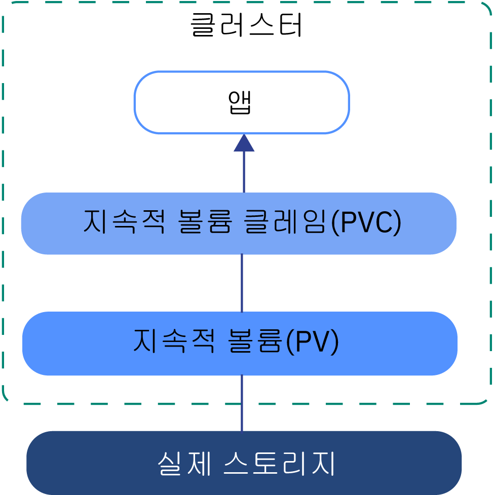
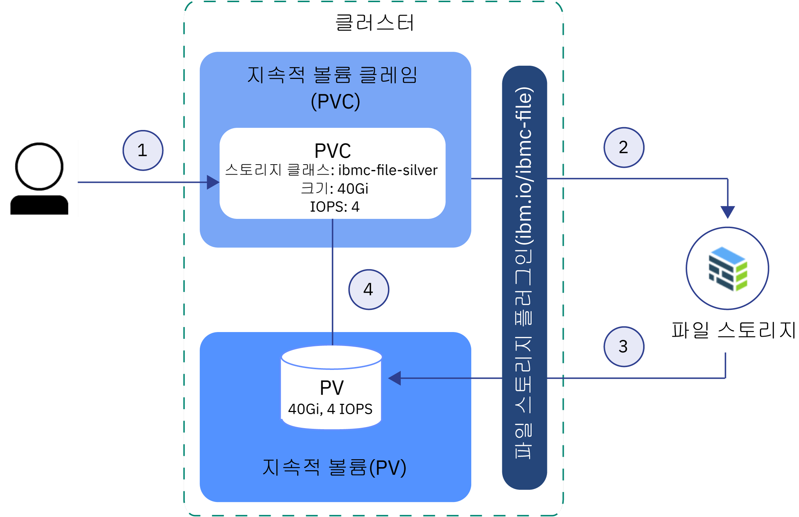
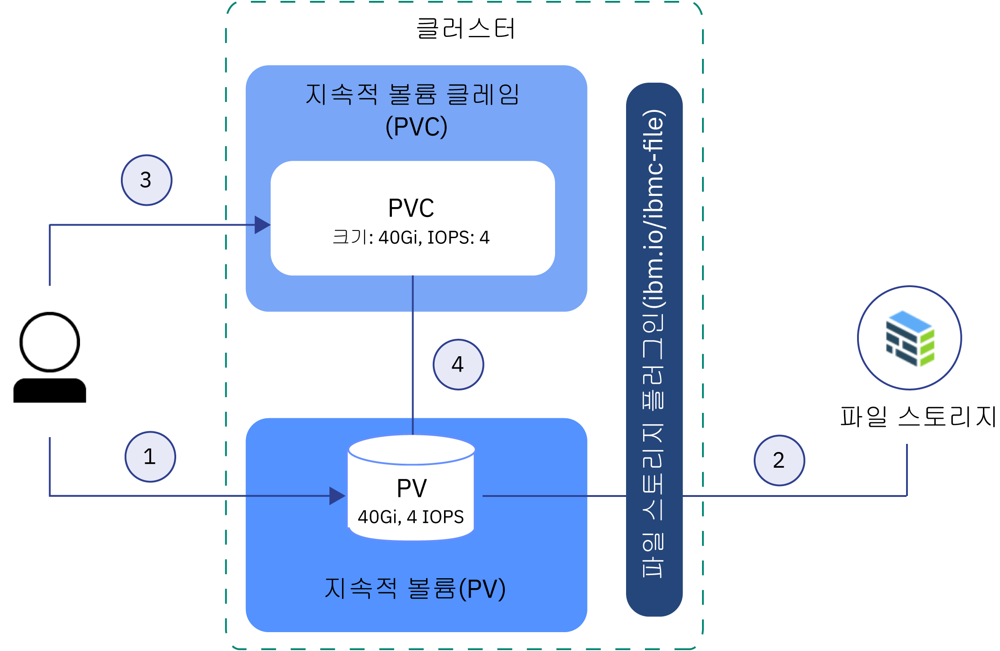

---

copyright:
  years: 2014, 2019
lastupdated: "2019-05-31"

keywords: kubernetes, iks

subcollection: containers

---

{:new_window: target="_blank"}
{:shortdesc: .shortdesc}
{:screen: .screen}
{:pre: .pre}
{:table: .aria-labeledby="caption"} 
{:codeblock: .codeblock}
{:tip: .tip}
{:note: .note}
{:important: .important}
{:deprecated: .deprecated}
{:download: .download}
{:preview: .preview}


# Kubernetes 스토리지 기본사항 이해
{: #kube_concepts}

## 지속적 볼륨(PV) 및 지속적 볼륨 클레임(PVC)
{: #pvc_pv}

스토리지의 프로비저닝을 시작하기 전에, 우선 지속적 볼륨(PV) 및 지속적 볼륨 클레임(PVC)이라는 Kubernetes 개념과 클러스터에서 이들의 상호 작동 방법을 파악하는 것이 중요합니다.
{: shortdesc}

아래의 이미지는 Kubernetes 클러스터의 스토리지 컴포넌트를 보여줍니다.



- **클러스터**</br> 기본적으로 모든 클러스터는 [파일 스토리지를 프로비저닝](/docs/containers?topic=containers-file_storage#add_file)하기 위한 플러그인으로 설정되어 있습니다. 사용자는 기타 추가 기능(예: [블록 스토리지](/docs/containers?topic=containers-block_storage)용 추가 기능) 설치를 선택할 수 있습니다. 클러스터에서 스토리지를 사용하려면 지속적 볼륨 클레임, 지속적 볼륨 및 실제 스토리지 인스턴스를 작성해야 합니다. 클러스터를 삭제할 때는 관련 스토리지 인스턴스를 삭제하는 옵션이 있습니다.
- **앱**</br> 스토리지 인스턴스에서 읽고 쓰려면 지속적 볼륨 클레임(PVC)을 앱에 마운트해야 합니다. 서로 다른 스토리지 유형마다 서로 다른 읽기/쓰기 규칙이 있습니다. 예를 들어, 파일 스토리지의 경우 동일한 PVC에 다수의 팟(Pod)을 마운트할 수 있습니다. 블록 스토리지가 RWO(ReadWriteOnce) 액세스 모드로 제공되므로, 사용자는 오직 하나의 팟(Pod)에만 스토리지를 마운트할 수 있습니다.
- **지속적 볼륨 클레임(PVC)** </br> PVC는 특정 유형과 구성으로 지속적 스토리지를 프로비저닝하는 요청입니다. 원하는 지속적 스토리지 특성을 지정하려면 [Kubernetes 스토리지 클래스](#storageclasses)를 사용하십시오. 클러스터 관리자가 스토리지 클래스를 정의할 수 있습니다. 또는 사용자가 {{site.data.keyword.containerlong_notm}}에서 사전 정의된 스토리지 클래스 중 하나를 선택할 수 있습니다. PVC를 작성하면 요청이 {{site.data.keyword.Bluemix}} 스토리지 제공자에게 전송됩니다. 스토리지 클래스에서 정의된 구성에 따라 실제 스토리지 디바이스가 주문되어 IBM Cloud 인프라(SoftLayer) 계정으로 프로비저닝됩니다. 요청된 구성이 존재하지 않으면 스토리지가 작성되지 않습니다.
- **지속적 볼륨(PV)** </br> PV는 클러스터에 볼륨으로서 추가되는 가상 스토리지 인스턴스입니다. PV는 IBM Cloud 인프라(SoftLayer) 계정의 실제 스토리지 디바이스를 지시하며 스토리지 디바이스와 통신하는 데 사용되는 API를 추상화합니다. PV를 앱에 마운트하려면 일치하는 PVC가 있어야 합니다. 마운트된 PV는 컨테이너의 파일 시스템 내에서 폴더처럼 보입니다.
- **실제 스토리지** </br> 데이터의 지속성 유지에 사용할 수 있는 실제 스토리지 인스턴스입니다. {{site.data.keyword.Bluemix_notm}}의 실제 스토리지의 예에는 [파일 스토리지](/docs/containers?topic=containers-file_storage#file_storage), [블록 스토리지](/docs/containers?topic=containers-block_storage#block_storage), [오브젝트 스토리지](/docs/containers?topic=containers-object_storage#object_storage) 및 [Portworx](/docs/containers?topic=containers-portworx#portworx)를 사용하여 SDS 스토리지로 사용할 수 있는 로컬 작업자 노드 스토리지가 포함됩니다. {{site.data.keyword.Bluemix_notm}}는 실제 스토리지 인스턴스에 대해 고가용성을 제공합니다. 그러나 실제 스토리지 인스턴스에 저장된 데이터는 자동으로 백업되지 않습니다. 사용 중인 스토리지의 유형에 따라 백업을 설정하고 솔루션을 복원하는 다양한 방법이 존재합니다.

PVC, PV 및 실제 스토리지 디바이스를 작성하고 사용하는 방법에 대한 자세한 정보는 다음을 참조하십시오.
- [동적 프로비저닝](#dynamic_provisioning)
- [정적 프로비저닝](#static_provisioning)

## 동적 프로비저닝
{: #dynamic_provisioning}

개발자가 필요하면 언제든지 스토리지를 프로비저닝할 수 있도록 허용하려면 동적 프로비저닝을 사용하십시오.
{: shortdesc}

**작동 방식**</br>

동적 프로비저닝은 Kubernetes에 고유한 기능이며, 클러스터 개발자는 이 기능을 사용하여 실제 스토리지 디바이스를 프로비저닝하는 방법에 대한 모든 세부사항을 몰라도 사전 정의된 유형과 구성의 스토리지를 주문할 수 있습니다. 특정 스토리지 유형에 대한 세부사항을 추상화하기 위해, 클러스터 관리자는 개발자가 사용할 수 있는 [스토리지 클래스](#storageclasses)를 작성하거나 {{site.data.keyword.Bluemix}} 스토리지 플러그인에서 제공하는 스토리지 클래스를 사용해야 합니다.

스토리지를 주문하려면 PVC를 작성해야 합니다. PVC는 프로비저닝하고자 하는 스토리지의 스펙을 결정합니다. PVC가 작성되면 스토리지 디바이스와 PV가 사용자를 위해 자동으로 작성됩니다.  

다음 이미지는 파일 스토리지가 클러스터에서 동적으로 프로비저닝되는 방법을 보여줍니다. 이 샘플 플로우는 블록 스토리지 등의 기타 스토리지 유형과 유사하게 작동됩니다.

**사전 정의된 실버 스토리지 클래스의 파일 스토리지를 동적으로 프로비저닝하는 샘플 플로우**



1. 사용자는 스토리지 유형, 스토리지 클래스, 크기(기가바이트), IOPS 수 및 청구 유형을 지정하는 지속적 볼륨 클레임(PVC)을 작성합니다. 스토리지 클래스는 프로비저닝된 스토리지의 유형과 함께 크기 및 IOPS의 허용 범위를 판별합니다. 클러스터에서 PVC를 작성하면 요청된 유형의 스토리지에 대한 스토리지 플러그인이 자동으로 트리거되어 제공된 스펙의 스토리지를 프로비저닝합니다.
2. 스토리지 디바이스는 자동으로 주문되어 IBM Cloud 인프라(SoftLayer) 계정으로 프로비저닝됩니다. 스토리지 디바이스의 비용 청구 주기가 시작됩니다.
3. 스토리지 플러그인은 IBM Cloud 인프라(SoftLayer) 계정의 실제 스토리지 디바이스를 지시하는 가상 스토리지 디바이스, 클러스터의 지속적 볼륨(PV)을 자동으로 작성합니다.
4. PVC 및 PV는 자동으로 서로 간에 연결됩니다. PVC 및 PV의 상태가 `Bound`로 변경됩니다. 이제 PVC를 사용하여 지속적 스토리지를 앱에 마운트할 수 있습니다. PVC를 삭제하면 PV 및 이와 관련된 스토리지 인스턴스도 삭제됩니다.</br>

**동적 프로비저닝은 언제 사용합니까?**</br>

동적 프로비저닝에 대한 다음의 공통 유스 케이스를 검토하십시오.
1. **필요 시에 스토리지 프로비저닝:** 개발자를 위해 지속적 스토리지를 사전 제공하고 사용된 스토리지에 대한 비용을 지불하는 대신, 개발자가 필요할 때 언제든지 스토리지를 프로비저닝하도록 허용할 수 있습니다. 개발자가 프로비저닝할 수 있는 스토리지 유형을 판별하기 위해 [스토리지 클래스](#storageclasses)를 정의할 수 있습니다.
2. **PVC, PV 및 스토리지 디바이스 작성의 자동화:** 사용자가 클러스터 관리자의 수동 개입 없이 스토리지의 자동 프로비저닝 및 디프로비저닝을 원합니다.
3. **자주 스토리지 작성 및 삭제:** 사용자가 앱을 보유 중이거나 주기적으로 스토리지를 작성하고 제거하는 지속적 딜리버리 파이프라인을 설정합니다. 비-보유(non-retain) 스토리지 클래스로 동적으로 프로비저닝되는 지속적 스토리지는 PVC를 삭제하여 제거될 수 있습니다.

지속적 스토리지를 동적으로 프로비저닝하는 방법에 대한 자세한 정보는 다음을 참조하십시오.
- [파일 스토리지](/docs/containers?topic=containers-file_storage#add_file)
- [블록 스토리지](/docs/containers?topic=containers-block_storage#add_block)

## 정적 프로비저닝
{: #static_provisioning}

IBM Cloud 인프라(SoftLayer) 계정의 기존 지속적 스토리지 디바이스가 있으면 정적 프로비저닝을 사용하여 클러스터가 스토리지 인스턴스를 사용할 수 있도록 할 수 있습니다.
{: shortdesc}

**작동 방식**</br>

정적 프로비저닝은 Kubernetes에 고유한 기능이며, 클러스터 관리자는 이 기능을 사용하여 클러스터가 기존 스토리지 디바이스를 사용할 수 있도록 할 수 있습니다. 클러스터 관리자인 경우에는 스토리지 디바이스의 세부사항, 지원되는 구성 및 마운트 옵션을 알아야 합니다.  

클러스터 사용자가 기존 스토리지를 사용할 수 있도록 하려면 스토리지 디바이스, PV 및 PVC를 수동으로 작성해야 합니다.  

다음 이미지는 클러스터에서 파일 스토리지를 정적으로 프로비저닝하는 방법을 보여줍니다. 이 샘플 플로우는 블록 스토리지 등의 기타 스토리지 유형과 유사하게 작동됩니다.

**파일 스토리지의 정적 프로비저닝을 위한 샘플 플로우**



1. 클러스터 관리자는 기존 스토리지 디바이스에 대한 모든 세부사항을 수집하고 클러스터에서 지속적 볼륨(PV)을 작성합니다.
2. PV의 스토리지 세부사항에 따라, 스토리지 플러그인은 PV를 IBM Cloud 인프라(SoftLayer) 계정의 스토리지 디바이스와 연결합니다.
3. 클러스터 관리자 또는 개발자는 PVC를 작성합니다. PV 및 스토리지 디바이스가 이미 존재하므로 스토리지 클래스는 PVC에 지정되어 있지 않습니다.
4. PVC가 작성되면 스토리지 플러그인이 PVC를 기존 PV와 일치시키려고 시도합니다. PVC 및 PV는 크기, IOPS 및 액세스 모드에 대한 동일한 값이 PVC 및 PV에서 사용될 때 일치합니다. PVC 및 PV가 일치하면 PVC 및 PV의 상태가 `Bound`로 변경됩니다. 이제 PVC를 사용하여 지속적 스토리지를 앱에 마운트할 수 있습니다. PVC를 삭제하는 경우, PV 및 실제 스토리지 인스턴스는 제거되지 않습니다. PVC, PV 및 스토리지 인스턴스를 별도로 제거해야 합니다.</br>

**정적 프로비저닝은 언제 사용합니까?**</br>

지속적 스토리지의 정적 프로비저닝에 대한 다음의 공통 유스 케이스를 검토하십시오.
1. **보유 중인 데이터를 클러스터에서 사용할 수 있도록 함:** 동적 프로비저닝을 사용하여 보유 중인 스토리지 클래스의 지속적 스토리지를 프로비저닝했습니다. PVC는 제거했지만 PV, IBM Cloud 인프라(SoftLayer)의 실제 스토리지 및 데이터는 여전히 존재합니다. 사용자는 클러스터의 앱에서 보관된 데이터에 액세스하고자 합니다.
2. **기존 스토리지 디바이스 사용:** IBM Cloud 인프라(SoftLayer) 계정에서 직접 지속적 스토리지를 프로비저닝했으며 클러스터에서 이 스토리지 디바이스를 사용하고자 합니다.
3. **동일 구역의 클러스터 간에 지속적 스토리지 공유:** 클러스터에 대한 지속적 스토리지를 프로비저닝했습니다. 동일 구역의 기타 클러스터와 동일한 지속적 스토리지 인스턴스를 함께 공유하려면 기타 클러스터에서 PV 및 일치하는 PVC를 수동으로 작성해야 합니다. **참고:** 클러스터 간의 지속적 스토리지 공유는 클러스터와 스토리지 인스턴스가 동일 구역에 존재하는 경우에만 사용 가능합니다.
4. **동일 클러스터의 네임스페이스 간에 지속적 스토리지 공유:** 클러스터의 네임스페이스에서 지속적 스토리지를 프로비저닝했습니다. 클러스터의 다른 네임스페이스에 배치된 앱 팟(Pod)에 대해 동일한 스토리지 인스턴스를 사용하고자 합니다.

스토리지를 정적으로 프로비저닝하는 방법에 대한 자세한 정보는 다음을 참조하십시오.
- [파일 스토리지](/docs/containers?topic=containers-file_storage#file_predefined_storageclass)
- [블록 스토리지](/docs/containers?topic=containers-block_storage#block_predefined_storageclass)

## 스토리지 클래스
{: #storageclasses}

지속적 스토리지를 동적으로 프로비저닝하려면 원하는 스토리지의 유형과 구성을 정의해야 합니다.
{: shortdesc}

클러스터에서 지속적 스토리지를 성공적으로 프로비저닝하기 위해 지원되는 크기, IOPS 또는 보유 정책에 대한 세부사항을 사용자가 알 필요가 없도록 [Kubernetes 스토리지 클래스 ](https://kubernetes.io/docs/concepts/storage/storage-classes/)를 사용하여 {{site.data.keyword.Bluemix_notm}}에서 지원되는 기본 스토리지 플랫폼을 추상화할 수 있습니다. {{site.data.keyword.containerlong_notm}}는 지원되는 모든 스토리지 유형에 대해 사전 정의된 스토리지 클래스를 제공합니다. 각 스토리지 클래스는 사용자가 원하는 크기, IOPS 및 보유 정책에 대해 결정하기 위한 선택사항을 제공하면서도 지원되는 스토리지 티어를 추상화하도록 디자인되어 있습니다.

사전 정의된 스토리지 클래스 스펙에 대해서는 다음을 참조하십시오.
- [파일 스토리지](/docs/containers?topic=containers-file_storage#file_storageclass_reference)
- [블록 스토리지](/docs/containers?topic=containers-block_storage#block_storageclass_reference)

원하는 내용을 찾을 수 없습니까? 자체 사용자 정의된 스토리지 클래스를 작성하여 원하는 스토리지 유형을 프로비저닝할 수도 있습니다.
{: tip}

### 스토리지 클래스의 사용자 정의
{: #customized_storageclass}

제공된 스토리지 클래스 중 하나를 사용할 수 없는 경우에는 자체 사용자 정의된 스토리지 클래스를 작성할 수 있습니다. 스토리지 클래스를 사용자 정의하여 구역, 파일 시스템 유형, 서버 유형 또는 [볼륨 바인딩 모드](https://kubernetes.io/docs/concepts/storage/storage-classes/#volume-binding-mode) 옵션(블록 스토리지에만)과 같은 구성을 지정할 수 있습니다.
{: shortdesc}

1. 사용자 정의된 스토리지 클래스를 작성하십시오. 사전 정의된 스토리지 클래스 중 하나를 사용하여 시작하거나 사용자 정의된 샘플 스토리지 클래스를 체크아웃할 수 있습니다.
   - 사전 정의된 스토리지 클래스:
     - [파일 스토리지](/docs/containers?topic=containers-file_storage#file_storageclass_reference)
     - [블록 스토리지](/docs/containers?topic=containers-block_storage#block_storageclass_reference)
   - 사용자 정의된 샘플 스토리지 클래스:
     - [파일 스토리지](/docs/containers?topic=containers-file_storage#file_custom_storageclass)
     - [블록 스토리지](/docs/containers?topic=containers-block_storage#block_custom_storageclass)

2. 사용자 정의된 스토리지 클래스를 작성하십시오.
   ```
    kubectl apply -f <local_file_path>
   ```
   {: pre}

3.  사용자 정의된 스토리지 클래스가 작성되었는지 확인하십시오.
    ```
kubectl get storageclasses                                                        
    ```
    {: pre}

4. 지속적 볼륨 클레임(PVC)을 작성하여 사용자 정의된 스토리지 클래스로 스토리지를 동적으로 프로비저닝하십시오.
   - [파일 스토리지](/docs/containers?topic=containers-file_storage#add_file)
   - [블록 스토리지](/docs/containers?topic=containers-block_storage#add_block)

5. PVC가 작성되었으며 지속적 볼륨(PV)에 바인드되었는지 확인하십시오. 이 프로세스는 완료하는 데 몇 분 정도 소요될 수 있습니다.
   ```
kubectl get pvc
   ```
   {: pre}

### 다른 스토리지 클래스로 변경 또는 업데이트
{: #update_storageclass}

스토리지 클래스를 사용하여 지속적 스토리지를 동적으로 프로비저닝하는 경우, 사용자는 특정 구성으로 지속적 스토리지를 프로비저닝합니다. 프로비저닝한 스토리지의 유형이나 스토리지 클래스의 이름은 변경할 수 없습니다. 그러나 다음 표에 표시된 대로 스토리지를 스케일링하는 옵션이 있습니다.
{: shortdesc}

<table>
<caption>{{site.data.keyword.containerlong_notm}} 스토리지 솔루션에 대한 스케일링 옵션의 개요</caption>
<thead>
<th>스토리지 솔루션</th>
<th>스케일링 옵션</th>
</thead>
<tbody>
<tr>
<td>파일 스토리지</td>
<td>[기존 볼륨을 수정](/docs/containers?topic=containers-file_storage#file_change_storage_configuration)하여 스토리지 크기와 지정된 IOPS를 늘릴 수 있습니다. </td>
</tr>
<tr>
<td>블록 스토리지</td>
<td>[기존 볼륨을 수정](/docs/containers?topic=containers-block_storage#block_change_storage_configuration)하여 스토리지 크기와 지정된 IOPS를 늘릴 수 있습니다. </td>
</tr>
<tr>
<td>오브젝트 스토리지</td>
<td>볼륨은 크기가 자동으로 스케일링되며 실제 이용량에 따라 비용이 부과됩니다. 그러나 볼륨의 성능 속성은 {{site.data.keyword.cos_full_notm}}에서 버킷 작성에 사용된 스토리지 클래스에 정의되어 있으므로 이를 변경할 수 없습니다. 다른 스토리지 클래스로 변경하려면 원하는 스토리지 클래스를 사용하여 새 버킷을 프로비저닝해야 합니다. 그리고 이전 버킷에서 새 버킷으로 데이터를 복사하십시오. </td>
</tr>
</tbody>
</table>


## Kubernetes 레이블로 다중 구역 사용을 위한 기존 스토리지 준비
{: #storage_multizone}

단일 구역에서 다중 구역 클러스터로 클러스터를 업데이트했으며 기존 지속적 볼륨(PV)을 보유하는 경우에는 Kubernetes 구역 및 지역 레이블을 PV에 추가하십시오. 이 레이블은 이 스토리지를 마운트하는 팟(Pod)이 지속적 스토리지가 존재하는 구역에 배치되도록 보장합니다.
{:shortdesc}

이러한 단계는 다중 구역 기능이 사용 가능하기 전에 작성된 기존 PVC를 보유한 경우에만 필요합니다. 다중 구역이 사용 가능하게 된 이후에 작성된 PV에는 Kubernetes 지역 및 구역 라벨이 이미 포함되어 있습니다.
{: note}

스크립트를 사용하여 클러스터의 모든 PV를 찾고 Kubernetes `failure-domain.beta.kubernetes.io/region` 및 `failure-domain.beta.kubernetes.io/zone` 레이블을 적용하십시오. PV에 이미 레이블이 있으면 스크립트가 기존 값을 겹쳐쓰지 않습니다.

시작하기 전에:
- [클러스터에 Kubernetes CLI를 대상으로 지정](/docs/containers?topic=containers-cs_cli_install#cs_cli_configure)하십시오.
- 클러스터용 다중 VLAN, 동일한 VLAN의 다중 서브넷 또는 다중 구역 클러스터가 있는 경우에는 작업자 노드가 사설 네트워크에서 서로 간에 통신할 수 있도록 IBM Cloud 인프라(SoftLayer) 계정에 대해 [Virtual Router Function (VRF)](/docs/infrastructure/direct-link?topic=direct-link-overview-of-virtual-routing-and-forwarding-vrf-on-ibm-cloud#overview-of-virtual-routing-and-forwarding-vrf-on-ibm-cloud)을 사용으로 설정해야 합니다. VRF를 사용으로 설정하려면 [IBM Cloud 인프라(SoftLayer) 계정 담당자에게 문의](/docs/infrastructure/direct-link?topic=direct-link-overview-of-virtual-routing-and-forwarding-vrf-on-ibm-cloud#how-you-can-initiate-the-conversion)하십시오. VRF를 사용할 수 없거나 사용하지 않으려면 [VLAN Spanning](/docs/infrastructure/vlans?topic=vlans-vlan-spanning#vlan-spanning)을 사용으로 설정하십시오. 이 조치를 수행하려면 **네트워크 > 네트워크 VLAN Spanning 관리** [인프라 권한](/docs/containers?topic=containers-users#infra_access)이 필요합니다. 또는 이를 사용으로 설정하도록 계정 소유자에게 요청할 수 있습니다. VLAN Spanning이 이미 사용으로 설정되었는지 확인하려면 `ibmcloud ks vlan-spanning-get --region <region>` [명령](/docs/containers?topic=containers-cs_cli_reference#cs_vlan_spanning_get)을 사용하십시오. 

기존 PV를 업데이트하려면 다음을 수행하십시오.

1.  스크립트를 실행하여 다중 구역 레이블을 PV에 적용하십시오.  `<mycluster>`를 클러스터의 이름으로 바꾸십시오. 프롬프트가 표시되면 PV의 업데이트를 확인하십시오.

    ```
    bash <(curl -Ls https://raw.githubusercontent.com/IBM-Cloud/kube-samples/master/file-pv-labels/apply_pv_labels.sh) <mycluster>
    ```
    {: pre}

    **출력 예**:

    ```
    Retrieving cluster storage...
    OK

    Name:			mycluster
    ID:			  myclusterID1234
    State:			normal
    ...
    Addons
    Name                   Enabled
    storage-watcher-pod    true
    basic-ingress-v2       true
    customer-storage-pod   true
    us-south
    kube-config-dal10-storage.yml
    storage.yml
    dal10\n
    The persistent volumes which do not have region and zone labels will be updated with REGION=
    us-south and ZONE=dal10. Are you sure to continue (y/n)?y
    persistentvolume "pvc-ID-123456" labeled
    persistentvolume "pvc-ID-789101" labeled
    ['failure-domain.beta.kubernetes.io/region' already has a value (us-south), and --overwrite is false, 'failure-domain.beta.kubernetes.io/zone' already has a value (dal10), and --overwrite is false]
    ['failure-domain.beta.kubernetes.io/region' already has a value (us-south), and --overwrite is false, 'failure-domain.beta.kubernetes.io/zone' already has a value (dal10), and --overwrite is false]
    \nSuccessfully applied labels to persistent volumes which did not have region and zone labels.
    ```
    {: screen}

2.  레이블이 PV에 적용되었는지 확인하십시오.

    1.  레이블 지정된 PV의 ID에 대해 이전 명령의 출력을 살펴보십시오.

        ```
        persistentvolume "pvc-ID-123456" labeled
        persistentvolume "pvc-ID-789101" labeled
        ```
        {: screen}

    2.  PV에 대한 지역 및 구역 레이블을 검토하십시오.

        ```
        kubectl describe pv pvc-ID-123456
        ```
        {: pre}

        **출력 예**:
        ```
        Name:		pvc-ID-123456
        Labels:		CapacityGb=4
        		Datacenter=dal10
            ...
        		failure-domain.beta.kubernetes.io/region=us-south
        		failure-domain.beta.kubernetes.io/zone=dal10
            ...
        ```
        {: screen}

**다음에 수행할 작업**

이제 기존 PV의 레이블이 지정되었으므로 PV를 다중 구역 클러스터에 마운트할 수 있습니다. 자세한 정보는 다음 링크를 참조하십시오.
- [기존 NFS 파일 스토리지](/docs/containers?topic=containers-file_storage#existing_file) 사용
- [기존 블록 스토리지](/docs/containers?topic=containers-block_storage#existing_block) 사용
