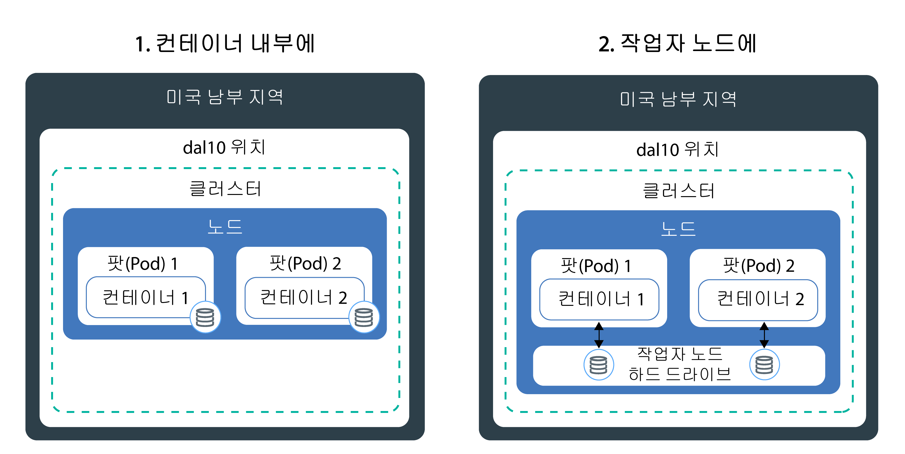
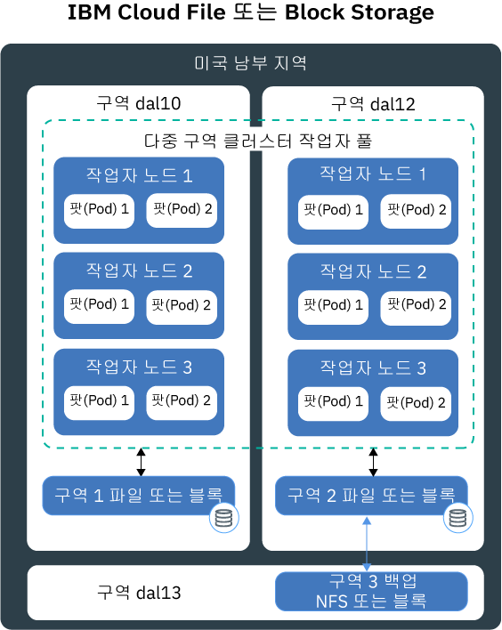
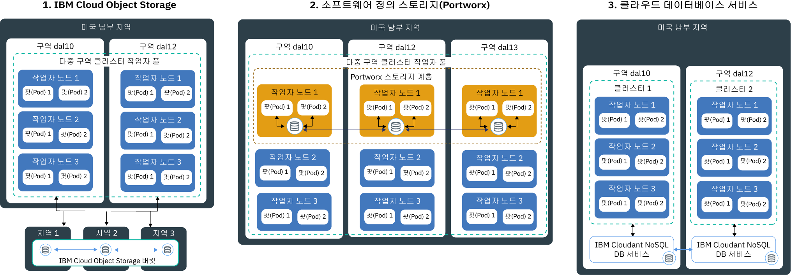

---

copyright:
  years: 2014, 2019
lastupdated: "2019-06-11"

keywords: kubernetes, iks

subcollection: containers

---

{:new_window: target="_blank"}
{:shortdesc: .shortdesc}
{:screen: .screen}
{:pre: .pre}
{:table: .aria-labeledby="caption"}
{:codeblock: .codeblock}
{:tip: .tip}
{:note: .note}
{:important: .important}
{:deprecated: .deprecated}
{:download: .download}
{:preview: .preview}

# 고가용성 지속적 스토리지 계획
{: #storage_planning}

## 스토리지 솔루션 선택
{: #choose_storage_solution}

어떤 스토리지 유형이 사용자에게 적합한 솔루션인지 결정하려면 우선 앱 요구사항, 저장할 데이터의 유형 및 이 데이터에 액세스하는 빈도를 파악해야 합니다.
{: shortdesc}

1. 데이터를 영구 저장해야 하는지 또는 언제든지 데이터를 제거할 수 있는지 여부를 결정하십시오.
   - **지속적 스토리지:** 컨테이너, 작업자 노드 또는 클러스터가 제거되어도 데이터를 여전히 사용할 수 있어야 합니다. 다음 시나리오에서 지속적 스토리지를 사용하십시오.
       - Stateful 앱
       - 핵심 비즈니스 데이터
       - 규정된 보존 기간 등의 법적 요구사항 때문에 사용 가능해야 하는 데이터
       - 감사
       - 앱 인스턴스 간에 액세스 및 공유되어야 하는 데이터
   - **비지속적 스토리지:** 컨테이너, 작업자 노드 또는 클러스터가 제거될 때 데이터가 제거될 수 있습니다. 비지속적 스토리지는 일반적으로 정보 로깅(예: 시스템 로그 또는 컨테이너 로그, 개발 테스트)에 또는 호스트의 파일 시스템에서 데이터에 액세스하고자 할 때 사용됩니다. 사용 가능한 비지속적 스토리지 옵션에 대한 개요를 찾으려면 [비지속적 스토리지 옵션 비교](#non_persistent_overview)를 참조하십시오.

2. 데이터 지속성이 필요한 경우에는 앱에서 특정 스토리지 유형이 필요한지 여부를 분석하십시오. 기존 앱을 사용하는 경우, 앱은 다음 방법 중 하나로 데이터를 저장하도록 디자인될 수 있습니다.  
   - **파일 시스템에서:** 데이터가 디렉토리에 파일로서 저장될 수 있습니다. 예를 들어, 로컬 하드 디스크에 이 파일을 저장할 수 있습니다. 일부 앱에서는 데이터 저장소를 최적화하고 성능 목표를 달성하기 위해 데이터가 특정 파일 시스템(`nfs` 또는 `ext4`)에 저장되도록 요구합니다.
   - **데이터베이스에서:** 데이터가 특정 스키마를 따르는 데이터베이스에 저장되어야 합니다. 일부 앱은 데이터 저장에 사용할 수 있는 데이터베이스 인터페이스와 함께 제공됩니다. 예를 들어, WordPress는 MySQL 데이터베이스에 데이터를 저장하도록 최적화되어 있습니다. 이 경우에는 스토리지 유형이 사용자를 위해 선택됩니다.

3. 사용해야 할 스토리지 유형에 대한 제한사항이 앱에 없는 경우에는 저장할 데이터 유형을 판별하십시오.
   - **구조화된 데이터:** 열과 행이 있는 테이블이 있는 관계형 데이터베이스에 저장할 수 있는 데이터입니다. 테이블의 데이터는 키를 사용하여 연결될 수 있으며, 일반적으로 사전 정의된 데이터 모델로 인해 손쉽게 액세스가 가능합니다. 예: 전화번호, 계좌번호, 주민등록번호 또는 우편번호
   - **반-구조화된 데이터:** 관계형 데이터베이스에는 맞지 않지만 해당 데이터를 보다 쉽게 읽고 분석하는 데 사용할 수 있는 일부 구조적 특성과 함께 제공되는 데이터입니다. 마크업 언어 파일(예: CSV, XML 또는 JSON)을 예로 들 수 있습니다.  
   - **구조화되지 않은 데이터:** 구조적 패턴을 따르지 않으며 너무 복잡해서 사전 정의된 데이터 모델의 관계형 데이터베이스에 저장할 수 없는 데이터입니다. 이 데이터에 액세스하려면 고급 도구와 소프트웨어가 필요합니다. 이메일 메시지. 동영상, 사진, 오디오 파일, 프레젠테이션, 소셜 미디어 데이터 또는 웹 페이지를 예로 들 수 있습니다.

   구조화된 데이터 및 구조화되지 않은 데이터가 있는 경우, 각 데이터 유형을 이 데이터 유형에 맞게 디자인된 스토리지 솔루션에 개별적으로 저장해 보십시오. 데이터 유형에 대해 적절한 스토리지 솔루션을 사용하면 데이터에 대한 액세스가 보다 용이해지며 성능, 확장성, 내구성 및 일관성 등의 이점이 제공됩니다.
   {: tip}

4. 데이터에 액세스하고자 하는 방법을 분석하십시오. 스토리지 솔루션은 일반적으로 읽기 또는 쓰기 오퍼레이션을 지원하도록 디자인 및 최적화되어 있습니다.  
   - **읽기 전용:** 데이터가 읽기 전용입니다. 사용자가 데이터 쓰기 또는 변경을 원하지 않습니다.
   - **읽기 및 쓰기:** 사용자가 데이터 읽기, 쓰기 및 변경을 원합니다. 읽거나 쓴 데이터의 경우에는 오퍼레이션이 읽기 집약적인지, 쓰기 집약적인지 또는 둘 간에 밸런스가 유지되는지 파악하는 것이 중요합니다.

4. 데이터 액세스 빈도를 판별하십시오. 데이터 액세스 빈도를 파악하면 스토리지에 필요한 성능을 파악하는 데 도움이 될 수 있습니다. 예를 들어, 자주 액세스되는 데이터는 일반적으로 빠른 스토리지에 상주합니다.
   - **핫(hot) 데이터:** 자주 액세스되는 데이터입니다. 일반적인 유스 케이스는 웹 또는 모바일 앱입니다.
   - **쿨(cool) 또는 웜(warm) 데이터:** 자주 액세스되지 않는 데이터입니다(예: 1개월에 1회 미만). 일반적인 유스 케이스는 아카이브, 단기 데이터 보관 또는 재해 복구입니다.
   - **콜드(cold) 데이터:** 거의 액세스되지 않는 데이터입니다. 일반적인 유스 케이스는 아카이브, 장기 백업, 히스토리 데이터입니다.
   - **고정(frozen) 데이터:** 전혀 액세스되지 않으며 법적 이유 때문에 보관이 필요한 데이터입니다.

   빈도 예측이 불가능하거나 빈도가 엄격한 패턴을 따르지 않는 경우에는 워크로드가 읽기 집약적인지, 쓰기 집약적인지 또는 둘 간의 밸런스가 유지되는지 판별하십시오. 그리고 워크로드에 알맞는 스토리지 옵션을 찾아보고 어떤 스토리지 티어가 사용자에게 필요한 유연성을 제공하는지 조사하십시오. 예를 들어, {{site.data.keyword.cos_full_notm}}는 데이터가 한 달에 얼마나 자주 액세스되는지를 고려하고 이 측정치를 고려하여 매월 요금 청구를 최적화하는 `flex` 스토리지 클래스를 제공합니다.
   {: tip}

5. 여러 앱 인스턴스, 구역 또는 지역 간에 데이터 공유가 필요한지 조사하십시오.
   - **팟(Pod) 간의 액세스:** Kubernetes 지속적 볼륨을 사용하여 스토리지에 액세스할 때 동시에 볼륨을 마운트할 수 있는 팟(Pod)의 수를 결정할 수 있습니다. 블록 스토리지와 같은 일부 스토리지 솔루션은 한 번에 하나의 팟(Pod)에서만 액세스가 가능합니다. 다른 스토리지 솔루션을 사용하여 다중 팟(Pod)에서 볼륨을 공유할 수 있습니다. 
   - **구역 및 지역 간의 액세스:** 구역 및 지역 간의 데이터 액세스가 필요할 수 있습니다. 파일 및 블록 스토리지와 같은 일부 스토리지 솔루션은 데이터센터에 특정하며, 다중 구역 클러스터 설정에서 구역 간에 공유될 수 없습니다.

   구역 또는 지역 간에 데이터가 액세스 가능하도록 하려면 법무부에 문의하여 데이터가 다중 구역이나 다른 국가에 저장될 수 있는지 확인하십시오.
   {: note}

6. 선택에 영향을 주는 기타 스토리지 특성을 파악하십시오.
   - **일관성:** 읽기 오퍼레이션이 최신 파일 버전을 리턴하도록 보장합니다. 스토리지 솔루션은 `strong consistency`(항상 최신 파일 버전의 수신을 보장하는 경우) 또는 `eventual consistency`(읽기 오퍼레이션이 최신 버전을 리턴하지 않을 수 있는 경우)를 제공할 수 있습니다. 최종 일관성은 쓰기 오퍼레이션이 우선 모든 인스턴스 간에 복제되어야 하는 지리적으로 분산된 시스템에서 종종 발견됩니다.
   - **성능:** 읽기 또는 쓰기 오퍼레이션을 완료하는 데 걸리는 시간입니다.
   - **내구성:** 기가바이트 또는 테라바이트 단위의 데이터가 동시에 스토리지에 쓰여지는 경우에도 스토리지에 커미트된 쓰기 오퍼레이션이 영구적으로 존속하며 손상되거나 유실되지 않음을 보장합니다.
   - **복원성:** 하드웨어 또는 소프트웨어 컴포넌트에서 장애가 발생해도 가동 중단에서 복구되어 오퍼레이션을 계속 실행하는 기능입니다. 예를 들어, 실제 스토리지에 정전, 네트워크 가동 중단이 발생하거나 해당 스토리지가 자연 재해 중에 파괴됩니다.
   - **가용성:** 데이터센터 또는 지역이 사용 불가능한 경우에도 데이터에 대한 액세스를 제공하는 기능입니다. 데이터에 대한 가용성은 일반적으로 중복성을 추가하고 장애 복구 메커니즘을 설정하여 달성될 수 있습니다.
   - **확장성:** 용량을 확장하고 필요에 따라 성능을 사용자 정의할 수 있는 기능입니다.
   - **암호화:** 권한 없는 사용자가 데이터에 액세스할 때 가시성을 차단하기 위해 데이터를 마스크 처리합니다.

7. [사용 가능한 지속적 스토리지 솔루션을 검토](#persistent_storage_overview)하고 앱 및 데이터 요구사항에 가장 적합한 솔루션을 선택하십시오.

## 비지속적 스토리지 옵션 비교
{: #non_persistent_overview}

데이터의 지속적 저장이 필요 없거나 앱 컴포넌트의 단위 테스트를 원하는 경우에는 비지속적 스토리지 옵션을 사용할 수 있습니다.
{: shortdesc}

다음 이미지는 {{site.data.keyword.containerlong_notm}}에서 사용 가능한 비지속적 데이터 스토리지 옵션을 보여줍니다. 이러한 옵션은 무료 및 표준 클러스터에 사용할 수 있습니다.

<table>
<thead>
<th style="text-align:left">특성</th>
<th style="text-align:left">컨테이너 내부에</th>
<th style="text-align:left">작업자 노드의 기본 또는 보조 디스크에</th>
</thead>
<tbody>
<tr>
<td style="text-align:left">다중 구역 가능</td>
<td style="text-align:left">아니오</td>
<td style="text-align:left">아니오</td>
</tr>
<tr>
<td style="text-align:left">데이터 유형</td>
<td style="text-align:left">모두</td>
<td style="text-align:left">모두</td>
</tr>
<tr>
<td style="text-align:left">용량</td>
<td style="text-align:left">작업자 노드의 사용 가능한 보조 디스크로 제한됩니다. 팟(Pod)에서 이용하는 보조 스토리지의 양을 제한하려면 [임시 스토리지 ](https://kubernetes.io/docs/concepts/configuration/manage-compute-resources-container/#local-ephemeral-storage)에 대한 리소스 요청 및 제한사항을 사용하십시오.</td>
<td style="text-align:left">기본(`hostPath`) 또는 보조 디스크(`emptyDir`)에서 작업자 노드의 사용 가능한 공간으로 제한됩니다. 팟(Pod)에서 이용하는 보조 스토리지의 양을 제한하려면 [임시 스토리지 ](https://kubernetes.io/docs/concepts/configuration/manage-compute-resources-container/#local-ephemeral-storage)에 대한 리소스 요청 및 제한사항을 사용하십시오.</td>
</tr>
<tr>
<td style="text-align:left">데이터 액세스 패턴</td>
<td style="text-align:left">임의 빈도의 읽기 및 쓰기 오퍼레이션</td>
<td style="text-align:left">임의 빈도의 읽기 및 쓰기 오퍼레이션</td>
</tr>
<tr>
<td style="text-align:left">액세스</td>
<td style="text-align:left">컨테이너의 로컬 파일 시스템을 통해</td>
<td style="text-align:left"><ul style="margin:0px 0px 0px 20px; padding:0px"><li style="margin:0px; padding:0px">작업자 노드 기본 스토리지에 대한 액세스를 위해 [Kubernetes <code>hostPath</code> 볼륨 ](https://kubernetes.io/docs/concepts/storage/volumes/#hostpath)을 통해. </li><li style="margin:0px; padding:0px">작업자 노드 보조 스토리지에 대한 액세스를 위해 [Kubernetes <code>emptyDir</code> 볼륨 ](https://kubernetes.io/docs/concepts/storage/volumes/#emptydir)을 통해.</li></ul></td>
</tr>
<tr>
<td style="text-align:left">성능</td>
<td style="text-align:left">높음</td>
<td style="text-align:left">SSD 사용 시 낮은 대기 시간으로 높음</td>
</tr>
<tr>
<td style="text-align:left">일관성</td>
<td style="text-align:left">강함</td>
<td style="text-align:left">강함</td>
</tr>
<tr>
<td style="text-align:left">복원성</td>
<td style="text-align:left">낮음</td>
<td style="text-align:left">낮음</td>
</tr>
<tr>
<td style="text-align:left">가용성</td>
<td style="text-align:left">컨테이너에 특정함</td>
<td style="text-align:left">작업자 노드에 특정함</td>
</tr>
<tr>
<td style="text-align:left">확장성</td>
<td style="text-align:left">작업자 노드의 보조 디스크 용량으로 제한되므로 확장이 어려움</td>
<td style="text-align:left">작업자 노드의 기본 및 보조 디스크 용량으로 제한되므로 확장이 어려움</td>
</tr>
<tr>
<td style="text-align:left">내구성</td>
<td style="text-align:left">컨테이너가 손상되거나 제거될 때 데이터가 유실됩니다. </td>
<td style="text-align:left"><code>hostPath</code> 또는 <code>emptyDir</code> 볼륨의 데이터가 유실되는 경우: <ul><li>작업자 노드가 삭제되었습니다.</li><li>작업자 노드가 다시 로드되거나 업데이트되었습니다.</li><li>클러스터가 삭제되었습니다.</li><li>{{site.data.keyword.Bluemix_notm}} 계정이 일시중단된 상태에 도달했습니다. </li></ul>

또한 다음과 같은 경우에 <code>emptyDir</code> 볼륨의 데이터가 제거됩니다. <ul><li>지정된 팟(Pod)이 작업자 노드에서 영구적으로 삭제되었습니다.</li><li>지정된 팟(Pod)이 다른 작업자 노드에서 스케줄되었습니다.</li></ul>
</tr>
<tr>
<td style="text-align:left">일반적인 유스 케이스</td>
<td style="text-align:left"><ul style="margin:0px 0px 0px 20px; padding:0px"><li style="margin:0px; padding:0px">로컬 이미지 캐시</li><li style="margin:0px; padding:0px">컨테이너 로그</li></ul></td>
<td style="text-align:left"><ul style="margin:0px 0px 0px 20px; padding:0px"><li style="margin:0px; padding:0px">고성능 로컬 캐시</li><li style="margin:0px; padding:0px">작업자 노드 파일 시스템에서 파일에 액세스</li><li style="margin:0px; padding:0px">단위 테스트</li></ul></td>
</tr>
<tr>
<td style="text-align:left">비이상적인 유스 케이스</td>
<td style="text-align:left"><ul style="margin:0px 0px 0px 20px; padding:0px"><li style="margin:0px; padding:0px">지속적 데이터 스토리지</li><li style="margin:0px; padding:0px">컨테이너 간에 데이터 공유</li></ul></td>
<td style="text-align:left"><ul style="margin:0px 0px 0px 20px; padding:0px"><li style="margin:0px; padding:0px">지속적 데이터 스토리지</li></ul></td>
</tr>
</tbody>
</table>

## 단일 구역 클러스터에 대한 지속적 스토리지 옵션 비교
{: #single_zone_persistent_storage}

단일 구역 클러스터가 있는 경우, 데이터에 대한 빠른 액세스를 제공하는 {{site.data.keyword.containerlong_notm}}의 다음 옵션 중에서 선택할 수 있습니다. 고가용성의 경우, [지리적으로 분산된 데이터](#persistent_storage_overview)용으로 디자인된 스토리지 옵션을 사용하고 요구사항에 맞게 가능한 경우 다중 구역 클러스터를 작성하십시오.
{: shortdesc}

지속적 데이터 스토리지 옵션은 표준 클러스터에만 사용할 수 있습니다.
{: note}

다음 이미지는 단일 클러스터에서 데이터를 영구 저장하기 위한 {{site.data.keyword.containerlong_notm}}에서의 옵션을 보여줍니다.

<table>
<thead>
<th style="text-align:left">특성</th>
<th style="text-align:left">파일</th>
<th style="text-align:left">블록</th>
</thead>
<tbody>
<tr>
<td style="text-align:left">다중 구역 가능</td>
<td style="text-align:left">아니오, 데이터센터에 따라 다릅니다. 자체 데이터 복제를 구현하지 않는 한 데이터가 구역 간에 공유될 수 없습니다.</td>
<td style="text-align:left">아니오, 데이터센터에 따라 다릅니다. 자체 데이터 복제를 구현하지 않는 한 데이터가 구역 간에 공유될 수 없습니다.</td>
</tr>
<tr>
<td style="text-align:left">이상적인 데이터 유형</td>
<td style="text-align:left">모두</td>
<td style="text-align:left">모두</td>
</tr>
<tr>
<td style="text-align:left">데이터 사용 패턴</td>
<td style="text-align:left"><ul style="margin:0px 0px 0px 20px; padding:0px"><li style="margin:0px; padding:0px">랜덤 읽기/쓰기 오퍼레이션</li><li style="margin:0px; padding:0px">순차 읽기/쓰기 오퍼레이션</li></ul></td>
<td style="text-align:left"><ul style="margin:0px 0px 0px 20px; padding:0px"><li style="margin:0px; padding:0px">랜덤 읽기/쓰기 오퍼레이션</li><li style="margin:0px; padding:0px">쓰기 집약적 워크로드</li></ul></td>
</tr>
<tr>
<td style="text-align:left">액세스</td>
<td style="text-align:left">마운트된 볼륨의 파일 시스템을 통해</td>
<td style="text-align:left">마운트된 볼륨의 파일 시스템을 통해</td>
</tr>
<tr>
<td style="text-align:left">지원되는 Kubernetes 액세스 쓰기</td>
<td style="text-align:left"><ul style="margin:0px 0px 0px 20px; padding:0px"><li style="margin:0px; padding:0px">ReadWriteMany(RWX)</li><li style="margin:0px; padding:0px"> ReadOnlyMany(ROX)</li><li style="margin:0px; padding:0px">ReadWriteOnce(RWO)</li></ul></td>
<td style="text-align:left"><ul style="margin:0px 0px 0px 20px; padding:0px"><li style="margin:0px; padding:0px">ReadWriteOnce(RWO)</li></ul></td>
</tr>
<tr>
<td style="text-align:left">성능</td>
<td style="text-align:left">지정된 IOPS 및 크기로 인해 예측 가능합니다. IOPS가 볼륨에 액세스하는 팟(Pod) 간에 공유됩니다.</td>
<td style="text-align:left">지정된 IOPS 및 크기로 인해 예측 가능합니다. IOPS가 팟(Pod) 간에 공유되지 않습니다. </td>
</tr>
<tr>
<td style="text-align:left">일관성</td>
<td style="text-align:left">강함</td>
<td style="text-align:left">강함</td>
</tr>
<tr>
<td style="text-align:left">내구성</td>
<td style="text-align:left">높음</td>
<td style="text-align:left">높음</td>
</tr>
<tr>
<td style="text-align:left">복원성</td>
<td style="text-align:left">데이터센터에 특정하므로 중간입니다. 파일 스토리지 서버는 중복 네트워킹으로 IBM에 의해 클러스터링됩니다.</td>
<td style="text-align:left">데이터센터에 특정하므로 중간입니다. 블록 스토리지 서버는 중복 네트워킹으로 IBM에 의해 클러스터링됩니다.</td>
</tr>
<tr>
<td style="text-align:left">가용성</td>
<td style="text-align:left">데이터센터에 특정하므로 중간입니다.</td>
<td style="text-align:left">데이터센터에 특정하므로 중간입니다.</td>
</tr>
<tr>
<td style="text-align:left">확장성</td>
<td style="text-align:left">데이터센터를 벗어나서 확장할 수 없습니다. 기존 스토리지 티어를 변경할 수 없습니다. </td>
<td style="text-align:left">데이터센터를 벗어나서 확장할 수 없습니다. 기존 스토리지 티어를 변경할 수 없습니다.</td>
</tr>
<tr>
<td style="text-align:left">암호화</td>
<td style="text-align:left">고정</td>
<td style="text-align:left">고정</td>
</tr>
<tr>
<td style="text-align:left">일반적인 유스 케이스</td>
<td style="text-align:left"><ul style="margin:0px 0px 0px 20px; padding:0px"><li style="margin:0px; padding:0px">대용량 또는 단일 파일 스토리지</li><li style="margin:0px; padding:0px">단일 구역 클러스터 간의 파일 공유</li></ul></td>
<td style="text-align:left"><ul style="margin:0px 0px 0px 20px; padding:0px"><li style="margin:0px; padding:0px">Stateful 세트</li><li style="margin:0px; padding:0px">자체 데이터베이스 실행 시에 스토리지 백킹</li><li style="margin:0px; padding:0px">단일 팟(Pod)에 대한 고성능 액세스</li></ul></td>
</tr>
<tr>
<td style="text-align:left">비이상적인 유스 케이스</td>
<td style="text-align:left"><ul style="margin:0px 0px 0px 20px; padding:0px"><li style="margin:0px; padding:0px">다중 구역 클러스터</li><li style="margin:0px; padding:0px">지리적으로 분산된 데이터</li></ul></td>
<td style="text-align:left"><ul style="margin:0px 0px 0px 20px; padding:0px"><li style="margin:0px; padding:0px">다중 구역 클러스터</li><li style="margin:0px; padding:0px">지리적으로 분산된 데이터</li><li style="margin:0px; padding:0px">여러 앱 인스턴스 간에 데이터 공유</li></ul></td>
</tr>
</tbody>
</table>

## 다중 구역 클러스터에 대한 지속적 스토리지 옵션 비교
{: #persistent_storage_overview}

다중 구역 클러스터가 있는 경우, 영역에 분산되어 있는 작업자 노드에서 데이터에 액세스하려면 다음과 같은 지속적 스토리지 옵션 중에서 선택합니다.
{: shortdesc}

지속적 데이터 스토리지 옵션은 표준 클러스터에만 사용할 수 있습니다.

클러스터를 대신 온프레미스 데이터베이스에 연결하는 것을 고려 중입니까? [클러스터에 대한 VPN 연결 설정](/docs/containers?topic=containers-vpn#vpn)을 참조하십시오.
{: tip}

다음 이미지는 다중 구역 클러스터에서 데이터를 영구 저장하고 데이터의 고가용성을 위한 {{site.data.keyword.containerlong_notm}}에서의 옵션을 보여줍니다. 단일 구역 클러스터에서 이러한 옵션을 사용할 수 있지만 앱에 필요한 고가용성 이점은 얻지 못할 수도 있습니다.

<table>
<thead>
<th style="text-align:left">특성</th>
<th style="text-align:left">오브젝트</th>
<th style="text-align:left">SDS(Portworx)</th>
<th style="text-align:left">{{site.data.keyword.Bluemix_notm}} 데이터베이스</th>
</thead>
<tbody>
<tr>
<td style="text-align:left">다중 구역 가능</td>
<td style="text-align:left">예</td>
<td style="text-align:left">예</td>
<td style="text-align:left">예</td>
</tr>
<tr>
<td style="text-align:left">이상적인 데이터 유형</td>
<td style="text-align:left">반-구조화된 데이터 및 구조화되지 않은 데이터</td>
<td style="text-align:left">모두</td>
<td style="text-align:left">DBaaS에 의존함</td>
</tr>
<tr>
<td style="text-align:left">데이터 사용 패턴</td>
<td style="text-align:left"><ul style="margin:0px 0px 0px 20px; padding:0px"><li style="margin:0px; padding:0px">읽기 집약적 워크로드</li><li style="margin:0px; padding:0px">쓰기 오퍼레이션이 거의 없거나 아예 없음</li></ul></td>
<td style="text-align:left"><ul style="margin:0px 0px 0px 20px; padding:0px"><li style="margin:0px; padding:0px">쓰기 집약적 워크로드</li><li style="margin:0px; padding:0px">랜덤 읽기 및 쓰기 오퍼레이션</li><li style="margin:0px; padding:0px">순차 읽기 및 쓰기 오퍼레이션</li></ul></td>
<td style="text-align:left"><ul style="margin:0px 0px 0px 20px; padding:0px"><li style="margin:0px; padding:0px">읽기-쓰기 집약적 워크로드</li></ul></td>
</tr>
<tr>
<td style="text-align:left">액세스</td>
<td style="text-align:left">마운트된 볼륨의 파일 시스템을 통해(플러그인) 또는 앱의 REST API를 통해</td>
<td style="text-align:left">마운트된 볼륨의 파일 시스템 또는 볼륨에 대한 NFS 클라이언트 액세스를 통해</td>
<td style="text-align:left">앱의 REST API를 통해</td>
</tr>
<tr>
<td style="text-align:left">지원되는 Kubernetes 액세스 쓰기</td>
<td style="text-align:left"><ul style="margin:0px 0px 0px 20px; padding:0px"><li style="margin:0px; padding:0px">ReadWriteMany(RWX)</li><li style="margin:0px; padding:0px"> ReadOnlyMany(ROX)</li><li style="margin:0px; padding:0px">ReadWriteOnce(RWO)</li></ul></td>
<td style="text-align:left">모두</td>
<td style="text-align:left"><ul style="margin:0px 0px 0px 20px; padding:0px"><li style="margin:0px; padding:0px">앱에서 직접 액세스되므로 해당사항 없음</li></ul></td>
</tr>
<tr>
<td style="text-align:left">성능</td>
<td style="text-align:left">읽기 오퍼레이션의 경우 높습니다. 비 SDS 시스템을 사용하는 경우 지정된 IOPS 및 크기로 인해 예측 가능합니다.</td>
<td style="text-align:left"><ul style="margin:0px 0px 0px 20px; padding:0px"><li style="margin:0px; padding:0px">SDS 시스템을 사용하는 경우 순차 읽기 및 쓰기 오퍼레이션에 해당하는 베어메탈 성능을 거의 그대로 유지합니다. </li><li style="margin:0px; padding:0px">고성능 데이터베이스를 실행하기 위한 [프로파일 ](https://docs.portworx.com/portworx-install-with-kubernetes/storage-operations/create-pvcs/dynamic-provisioning/#using-dynamic-provisioning) 제공</li><li style="margin:0px; padding:0px">앱에서 선택할 수 있는 서로 다른 성능 프로파일을 사용하여 스토리지 계층을 작성할 수 있습니다.</li></ul> </td>
<td style="text-align:left">앱과 동일한 데이터센터에 배치되는 경우 높습니다.</td>
</tr>
<tr>
<td style="text-align:left">일관성</td>
<td style="text-align:left">최종</td>
<td style="text-align:left">강함</td>
<td style="text-align:left">DBaaS에 의존함</td>
</tr>
<tr>
<td style="text-align:left">내구성</td>
<td style="text-align:left">데이터 슬라이스가 스토리지 노드 클러스터 전체에 분산되므로 매우
높습니다. 모든 노드는 데이터의 일부만을 저장합니다. </td>
<td style="text-align:left">항상 3개의 데이터 사본이 유지보수되므로 매우 높습니다.</td>
<td style="text-align:left">높음</td>
</tr>
<tr>
<td style="text-align:left">복원성</td>
<td style="text-align:left">데이터 슬라이스가 세 개의 구역 또는 지역에 분산되므로 높습니다. 하나의 구역에서만 설정된 경우에는 중간입니다.</td>
<td style="text-align:left">세 개의 구역에서 복제를 사용하여 설정하는 경우에 높습니다. 하나의 구역에서만 데이터를 저장하는 경우에는 중간입니다.</td>
<td style="text-align:left">DBaaS 및 사용자 설정에 따라 다릅니다. </td>
</tr>
<tr>
<td style="text-align:left">가용성</td>
<td style="text-align:left">구역 또는 지역 간에 분산되므로 높습니다. </td>
<td style="text-align:left">서로 다른 구역에서 세 개의 작업자 노드 간에 데이터를 복제하는 경우에는 높습니다.</td>
<td style="text-align:left">다중 인스턴스를 설정한 경우 높습니다. </td>
</tr>
<tr>
<td style="text-align:left">확장성</td>
<td style="text-align:left">자동으로 확장</td>
<td style="text-align:left">볼륨 크기를 조정하여 볼륨 용량을 늘립니다. 전체 스토리지 계층 용량을 늘리려면 작업자 노드 또는 원격 블록 스토리지를 추가해야 합니다. 두 시나리오 모두 사용자에 의한 용량 모니터링이 필요합니다. </td>
<td style="text-align:left">자동으로 확장</td>
</tr>
<tr>
<td style="text-align:left">암호화</td>
<td style="text-align:left">전송 중 및 저장 중</td>
<td style="text-align:left">사용자 고유 키를 가져와 전송 중인 데이터 및 저장 데이터를 {{site.data.keyword.keymanagementservicelong_notm}}를 사용하여 보호합니다. </td>
<td style="text-align:left">고정</td>
</tr>
<tr>
<td style="text-align:left">일반적인 유스 케이스</td>
<td style="text-align:left"><ul style="margin:0px 0px 0px 20px; padding:0px"><li style="margin:0px; padding:0px">다중 구역 클러스터</li><li style="margin:0px; padding:0px">지리적으로 분산된 데이터</li><li style="margin:0px; padding:0px">정적 빅데이터</li><li style="margin:0px; padding:0px">정적 멀티미디어 컨텐츠</li><li style="margin:0px; padding:0px">웹 앱</li><li style="margin:0px; padding:0px">백업</li><li style="margin:0px; padding:0px">아카이브</li></ul></td>
<td style="text-align:left"><ul style="margin:0px 0px 0px 20px; padding:0px"><li style="margin:0px; padding:0px">Stateful 세트</li><li style="margin:0px; padding:0px">지리적으로 분산된 데이터</li><li style="margin:0px; padding:0px">여러 클라우드 제공자 간에 앱 실행 시 공통 스토리지 솔루션</li><li style="margin:0px; padding:0px">자체 데이터베이스 실행 시에 스토리지 백킹</li><li style="margin:0px; padding:0px">단일 팟(Pod)에 대한 고성능 액세스</li><li style="margin:0px; padding:0px">복수의 팟(Pod) 및 작업자 노드 간의 공유 스토리지 액세스</li></ul></td>
<td style="text-align:left"><ul style="margin:0px 0px 0px 20px; padding:0px"><li style="margin:0px; padding:0px">다중 구역 클러스터</li><li style="margin:0px; padding:0px">관계형 및 비관계형 데이터베이스</li><li style="margin:0px; padding:0px">지리적으로 분산된 데이터</li></ul></td>
</tr>
<tr>
<td style="text-align:left">비이상적인 유스 케이스</td>
<td style="text-align:left"><ul style="margin:0px 0px 0px 20px; padding:0px"><li style="margin:0px; padding:0px">쓰기 집약적 워크로드</li><li style="margin:0px; padding:0px">랜덤 쓰기 오퍼레이션</li><li style="margin:0px; padding:0px">증분식 데이터 업데이트</li><li style="margin:0px; padding:0px">트랜잭션 데이터베이스</li></ul></td>
<td style="text-align:left">해당사항 없음</td>
<td style="text-align:left"><ul style="margin:0px 0px 0px 20px; padding:0px"><li style="margin:0px; padding:0px">파일 시스템에 쓰도록 디자인된 앱</li></ul></td>
</tr>
</tbody>
</table>
