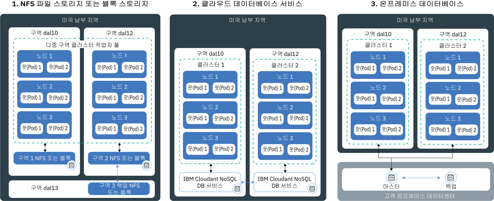

---

copyright:
  years: 2014, 2018
lastupdated: "2018-08-06"

---

{:new_window: target="_blank"}
{:shortdesc: .shortdesc}
{:screen: .screen}
{:pre: .pre}
{:table: .aria-labeledby="caption"}
{:codeblock: .codeblock}
{:tip: .tip}
{:download: .download}

# 고가용성 지속적 스토리지 계획
{: #storage_planning}

## 비지속적 데이터 스토리지 옵션
{: #non_persistent}

데이터가 지속적으로 저장될 필요가 없거나 앱 인스턴스 간에 데이터를 공유할 필요가 없는 경우에 비지속적 스토리지 옵션을 사용할 수 있습니다. 비지속적 스토리지 옵션을 사용하여 앱 컴포넌트를 단위 테스트하거나 새 기능을 사용해 볼 수도 있습니다.
{: shortdesc}

다음 이미지는 {{site.data.keyword.containerlong_notm}}에서 사용 가능한 비지속적 데이터 스토리지 옵션을 보여줍니다. 이러한 옵션은 무료 및 표준 클러스터에 사용할 수 있습니다.

<table summary="이 표는 비지속적 스토리지 옵션을 보여줍니다. 행은 왼쪽에서 오른쪽 방향으로 읽어야 하며 1열에는 옵션 번호, 2열에는 옵션 제목, 3열에는 설명이 있습니다. " style="width: 100%">
<caption>비지속적 스토리지 옵션</caption>
  <thead>
  <th>옵션</th>
  <th>설명</th>
  </thead>
  <tbody>
    <tr>
      <td>1. 컨테이너 또는 팟(Pod) 내부에</td>
      <td>컨테이너 및 팟(Pod)은 단기적으로만 지속되도록 디자인되었으며 예기치 않게 실패할 수 있습니다. 그러나 컨테이너의 라이프사이클 전체에서 컨테이너의 로컬 파일 시스템에 데이터를 기록하여 데이터를 저장할 수 있습니다. 컨테이너 내부의 데이터는 다른 컨테이너 또는 팟(Pod)과 공유될 수 없으며 컨테이너가 충돌하거나 제거된 경우 유실됩니다. 자세한 정보는 [컨테이너에 데이터 저장](https://docs.docker.com/storage/)을 참조하십시오.</td>
    </tr>
  <tr>
    <td>2. 작업자 노드에</td>
    <td>모든 작업자 노드는 사용자가 작업자 노드에 대해 선택한 머신 유형에 따라 판별되는 기본 및 보조 스토리지로 설정됩니다. 기본 스토리지는 운영 체제의 데이터를 저장하는 데 사용되며 [Kubernetes <code>hostPath</code> 볼륨 ](https://kubernetes.io/docs/concepts/storage/volumes/#hostpath)을 사용하여 액세스할 수 있습니다. 보조 스토리지는 `kubelet` 및 컨테이너 런타임 엔진의 데이터를 저장하는 데 사용됩니다. [Kubernetes <code>emptyDir</code> 볼륨 ](https://kubernetes.io/docs/concepts/storage/volumes/#emptydir)을 사용하여 보조 스토리지에 액세스할 수 있습니다.  <code>hostPath</code> 볼륨이 작업자 노드 파일 시스템에서 팟(Pod)으로 파일을 마운트하는 데 사용되고, <code>emptyDir</code>은 클러스터의 팟(Pod)에 지정된 비어 있는 디렉토리를 작성합니다. 해당 팟(Pod)의 모든 컨테이너가 해당 볼륨에서 읽고 쓰기가 가능합니다. 볼륨이 하나의 특정 팟(Pod)에 지정되므로, 데이터는 복제본 세트의 기타 팟(Pod)과 공유될 수 없습니다.  
다음과 같은 경우에 <code>hostPath</code> 또는 <code>/emptyDir</code> 볼륨과 해당 데이터가 제거됩니다. <ul><li>작업자 노드가 삭제되었습니다.</li><li>작업자 노드가 다시 로드되거나 업데이트되었습니다.</li><li>클러스터가 삭제되었습니다.</li><li>{{site.data.keyword.Bluemix_notm}} 계정이 일시중단된 상태에 도달했습니다. </li></ul>

또한 다음과 같은 경우에 <code>emptyDir</code> 볼륨의 데이터가 제거됩니다. <ul><li>지정된 팟(Pod)이 작업자 노드에서 영구적으로 삭제되었습니다.</li><li>지정된 팟(Pod)이 다른 작업자 노드에서 스케줄되었습니다.</li></ul>

<strong>참고:</strong> 팟(Pod) 내의 컨테이너에 장애가 발생하는 경우, 볼륨의 데이터는 작업자 노드에서 계속 사용 가능합니다.
</td>
    </tr>
    </tbody>
    </table>

## 고가용성을 위한 지속적 데이터 스토리지 옵션
{: #persistent}

고가용성 Stateful 앱을 작성할 때 해결해야 할 기본 과제는 다중 구역의 여러 앱 인스턴스 간에 데이터의 지속성을 유지하고 항상 데이터를 동기화하는 것입니다. 고가용성 데이터를 위해 여러 데이터센터 또는 여러 지역에 분산된 여러 인스턴스를 포함하는 마스터 데이터베이스가 있는지 확인하려고 합니다. 
실제 단일 소스를 유지하려면 이 마스터 데이터베이스가 지속적으로 복제되어야 합니다. 클러스터의 모든 인스턴스가 이 마스터 데이터베이스에서 읽고 써야 합니다. 하나의 마스터 인스턴스가 작동 중지된 경우 앱의 가동이 중단되지 않도록 다른 인스턴스가 워크로드를 인계받습니다.
{: shortdesc}

다음 이미지는 표준 클러스터에서 데이터의 가용성을 높이기 위한 {{site.data.keyword.containerlong_notm}}의 옵션을 보여줍니다. 사용자에게 맞는 옵션은 다음 요인에 따라 달라집니다.
  * **보유하고 있는 앱의 유형:** 예를 들어, 데이터베이스의 내부가 아닌 파일 기반으로 데이터를 저장해야 하는 앱이 있을 수 있습니다.
  * **데이터를 저장하고 라우팅할 위치에 대한 법적 요구사항:** 예를 들어, 미국에서만 데이터를 저장하고 라우팅해야 할 수 있으며 이 경우 유럽에 있는 서비스를 사용할 수 없습니다.
  * **백업 및 복원 옵션:** 모든 스토리지 옵션은 데이터를 백업하고 복원하는 기능과 함께 제공됩니다. 사용 가능한 백업 및 복원 옵션이 재해 복구 플랜의 요구사항(예: 백업 빈도 또는 기본 데이터센터 외부에 데이터를 저장하는 기능)을 충족하는지 확인하십시오.
  * **글로벌 복제:** 고가용성을 위해 전세계의 데이터센터에 분산되어 복제되는 여러 스토리지 인스턴스를 설정할 수 있습니다.

 

<table summary="표에서는 지속적 스토리지 옵션을 보여줍니다. 행은 왼쪽에서 오른쪽 방향으로 읽어야 하며, 옵션의 번호는 1열에 있고 옵션의 제목은 2열에 있으며 열의 설명은 3열에 있습니다. " style="width: 100%">
<caption>지속적 스토리지 옵션</caption>
  <thead>
  <th>옵션</th>
  <th>설명</th>
  </thead>
  <tbody>
  <tr>
  <td>1. NFS 또는 블록 스토리지</td>
  <td>이 옵션을 사용하면 Kubernetes 지속적 볼륨을 사용하여 동일한 구역 내에서 앱 및 컨테이너 데이터의 지속성을 유지할 수 있습니다.   <strong>파일 또는 블록 스토리지를 프로비저닝하는 방법은 무엇입니까?</strong> 클러스터에서 파일 스토리지 및 블록 스토리지를 프로비저닝하려면 [지속적 볼륨(PV) 및 지속적 볼륨 클레임(PVC)을 사용](cs_storage_basics.html#pvc_pv)하십시오. PVC 및 PV는 실제 파일이나 블록 스토리지 디바이스를 프로비저닝하기 위해 API를 추상화하는 Kubernetes 개념입니다. [동적](cs_storage_basics.html#dynamic_provisioning) 또는 [정적](cs_storage_basics.html#static_provisioning) 프로비저닝을 사용하여 PVC 및 PV를 작성할 수 있습니다.   <strong>다중 구역 클러스터에서 파일 또는 블록 스토리지를 사용할 수 있습니까?</strong>  파일 및 블록 스토리지 디바이스는 구역에 특정하며 구역 또는 지역 간에 공유될 수 없습니다. 클러스터에서 이 유형의 스토리지를 사용하려면 스토리지와 동일한 구역에 최소한 하나의 작업자 노드가 있어야 합니다.   여러 영역에 걸쳐 있는 클러스터에서 파일 및 블록 스토리지를 [동적으로 프로비저닝](cs_storage_basics.html#dynamic_provisioning)하는 경우, 스토리지는 라운드 로빈 기반으로 선택된 오직 1개의 구역에서만 프로비저닝됩니다. 다중 구역 클러스터의 모든 구역에서 지속적 스토리지를 프로비저닝하려면 각 구역에 대해 동적 스토리지를 프로비저닝하는 단계를 반복하십시오. 예를 들어, 클러스터가 `dal10`, `dal12` 및 `dal13` 구역에 걸쳐 있는 경우에 사용자가 처음으로 지속적 스토리지를 동적으로 프로비저닝하면 `dal10`의 스토리지가 프로비저닝됩니다. `dal12` 및 `dal13`을 처리하려면 추가로 2개의 PVC를 작성하십시오.   <strong>구역 간에 데이터를 공유하려면 어떻게 합니까?</strong> 구역 간에 데이터를 공유하려면 [{{site.data.keyword.cloudant_short_notm}}](/docs/services/Cloudant/getting-started.html#getting-started-with-cloudant) 또는 [{{site.data.keyword.cos_full_notm}}](/docs/services/cloud-object-storage/about-cos.html#about-ibm-cloud-object-storage) 등의 클라우드 데이터베이스 서비스를 사용하십시오. </td>
  </tr>
  <tr id="cloud-db-service">
    <td>2. 클라우드 데이터베이스 서비스</td>
    <td>이 옵션을 사용하면 [IBM Cloudant NoSQL DB](/docs/services/Cloudant/getting-started.html#getting-started-with-cloudant) 등의 {{site.data.keyword.Bluemix_notm}} 데이터베이스 서비스를 사용하여 데이터의 지속성을 유지할 수 있습니다.   <strong>내 다중 구역 클러스터에 대해 클라우드 데이터베이스 서비스를 사용할 수 있습니까?</strong> 클라우드 데이터베이스 서비스를 사용하면 데이터가 지정된 서비스 인스턴스의 클러스터 외부에 저장됩니다. 서비스 인스턴스는 하나의 구역으로 프로비저닝됩니다. 그러나 모든 서비스 인스턴스는 데이터에 액세스하는 데 사용할 수 있는 외부 인터페이스와 함께 제공됩니다. 다중 구역 클러스터에 데이터베이스 서비스를 사용하면 클러스터, 구역 및 지역 간에 데이터를 공유할 수 있습니다. 서비스 인스턴스의 가용성을 높이기 위해 고가용성을 위한 인스턴스 간 복제와 구역 간의 다중 인스턴스 설정을 선택할 수 있습니다.   <strong>내 클러스터에 클라우드 데이터베이스 서비스를 추가하는 방법은 무엇입니까?</strong> 클러스터에서 서비스를 사용하려면 클러스터의 네임스페이스에 [{{site.data.keyword.Bluemix_notm}} 서비스를 바인딩](cs_integrations.html#adding_app)해야 합니다. 서비스를 클러스터에 바인딩하면 Kubernetes 시크릿이 작성됩니다. Kubernetes 시크릿은 서비스에 대한 기밀 정보를 유지합니다(예: 서비스에 대한 URL, 사용자 이름 및 비밀번호). 시크릿을 시크릿 볼륨으로서 팟(Pod)에 마운트하고, 시크릿의 신임 정보를 사용하여 서비스에 액세스할 수 있습니다. 시크릿 볼륨을 기타 팟(Pod)에 마운트하여 팟(Pod) 간의 데이터를 공유할 수도 있습니다. 컨테이너에 장애가 발생하거나 팟(Pod)이 작업자 노드에서 제거되는 경우, 데이터는 제거되지 않으며 시크릿 볼륨을 마운트하는 기타 팟(Pod)에 의해 계속해서 액세스될 수 있습니다.   대부분의 {{site.data.keyword.Bluemix_notm}} 데이터베이스 서비스에서는 적은 양의 데이터를 위한 디스크 공간을 무료로 제공하므로 해당 기능을 테스트할 수 있습니다.
</td>
  </tr>
  <tr>
    <td>3. 온프레미스 데이터베이스</td>
    <td>법적인 이유로 데이터를 현장에 저장해야 하는 경우 온프레미스 데이터베이스에 대한 [VPN 연결을 설정](cs_vpn.html#vpn)하고 데이터센터에서 기존 스토리지, 백업 및 복제 메커니즘을 사용할 수 있습니다.</td>
  </tr>
  </tbody>
  </table>

{: caption="표. Kubernetes 클러스터에서의 배치를 위한 지속적 데이터 스토리지 옵션" caption-side="top"}
