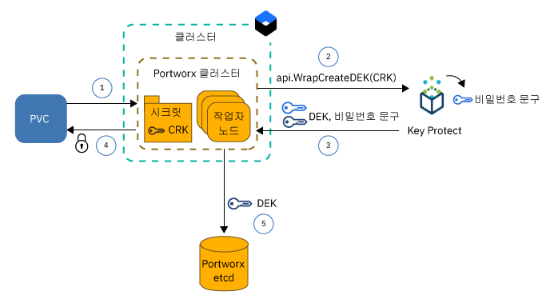
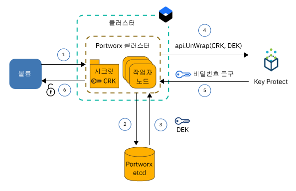

---

copyright:
  years: 2014, 2019
lastupdated: "2019-05-31"

keywords: kubernetes, iks, local persistent storage

subcollection: containers

---

{:new_window: target="_blank"}
{:shortdesc: .shortdesc}
{:screen: .screen}
{:pre: .pre}
{:table: .aria-labeledby="caption"}
{:codeblock: .codeblock}
{:tip: .tip}
{:note: .note}
{:important: .important}
{:deprecated: .deprecated}
{:download: .download}
{:preview: .preview}


# Portworx를 사용하는 소프트웨어 정의 스토리지(SDS)에 데이터 저장
{: #portworx}

[Portworx ](https://portworx.com/products/introduction/)는 컨테이너화된 데이터베이스 및 기타 Stateful 앱의 로컬 지속적 스토리지를 관리하거나, 여러 구역의 팟(Pod) 간에 데이터를 공유하는 데 사용할 수 있는 고가용성 소프트웨어 정의 스토리지 솔루션입니다.
{: shortdesc}

**소프트웨어 정의 스토리지(SDS)는 무엇입니까?** </br>
SDS 솔루션은 클러스터의 작업자 노드에 연결된 다양한 유형, 크기 또는 서로 다른 벤터의 스토리지 디바이스를 추출합니다. 하드 디스크에서 사용 가능한 스토리지가 있는 작업자 노드가 스토리지 클러스터에 노드로 추가됩니다. 이 클러스터에서 실제 스토리지가 가상화되며 사용자에게 가상 스토리지 풀로 표시됩니다. 스토리지 클러스터는 SDS 소프트웨어에 의해 관리됩니다. 데이터가 스토리지 클러스터에 저장되어야 하는 경우, SDS 소프트웨어는 고가용성을 위해 데이터를 저장할 위치를 결정합니다. 가상 스토리지는 실제 기본 스토리지 아키텍처에 관계없이 활용할 수 있는 기능과 서비스의 공통 세트를 제공합니다.

**Portworx는 어떻게 작동합니까?** </br>
Portworx는 작업자 노드에 연결된 사용 가능한 스토리지를 모으고 컨테이너화된 데이터베이스 또는 클러스터에서 실행하려는 기타 Stateful 앱에 대한 통합된 지속적 스토리지 계층을 작성합니다. Portworx는 다중 작업자 노드에서 각 컨테이너 레벨 볼륨의 볼륨 복제를 사용하여 구역 간 데이터 지속성 및 데이터 접근성을 보장합니다.

또한 볼륨 스냅샷, 볼륨 암호화, 격리 및 통합된 Stork(Storage Orchestrator for Kubernetes)와 같은 stateful 앱에 사용할 수 있는 추가 기능도 제공하여 클러스터에 볼륨을 최적으로 배치할 수 있습니다. 자세한 정보는 [Portworx 문서 ](https://docs.portworx.com/)를 참조하십시오.

**Portworx에 적합한 {{site.data.keyword.containerlong_notm}}의 작업자 노드 특성은 무엇입니까?** </br>
{{site.data.keyword.containerlong_notm}}는 [소프트웨어 정의 스토리지(SDS) 사용](/docs/containers?topic=containers-planning_worker_nodes#sds)에 최적화되고 Portworx 스토리지 계층에 사용할 수 있는 하나 이상의 원시, 포맷되지 않은 그리고 마운트 해제된 로컬 디스크로 제공되는 베어메탈 작업자 노드 특성을 제공합니다. Portworx는 10Gbps 네트워크 속도로 제공되는 SDS 작업자 노드 시스템을 사용할 때 최상의 성능을 제공합니다.

**비 SDS 작업자 노드에서 Portworx를 실행하려면 어떻게 해야 합니까?** </br>
비 SDS 작업자 노드 특성에 Portworx를 설치할 수 있지만 앱에 필요한 성능 이점은 얻지 못할 수도 있습니다. 비 SDS 작업자 노드는 가상 또는 베어메탈일 수 있습니다. 가상 머신을 사용하려면 `b2c.16x64` 또는 더 나은 작업자 노드 특성을 사용하십시오. `b3c.4x16` 또는 `u3c.2x4` 특성이 있는 가상 머신은 Portworx가 제대로 작동하기 위한 필수 리소스를 제공하지 않습니다. 가상 머신에는 Portworx의 이상적인 성능을 위해 충분하지 않은 1000Mbps가 제공됩니다. 베어메탈 머신은 Portworx에 필요한 충분한 컴퓨팅 리소스와 네트워크 속도를 제공하지만 이러한 머신을 사용하기 전에 [원시, 포맷되지 않은 그리고 마운트 해제된 블록 스토리지를 추가](#create_block_storage)해야 합니다.

**내 데이터가 고가용성으로 저장되었는지 어떻게 확인할 수 있습니까?** </br>
Portworx에서 노드 간 데이터를 복제할 수 있도록 Portworx 클러스터에는 3개 이상의 작업자 노드가 필요합니다. 작업자 노드 간 데이터를 복제함으로써 Portworx는 데이터를 유실하지 않고 장애가 발생하는 경우에도 Stateful 앱이 다른 작업자 노드로 다시 스케줄될 수 있도록 보장합니다. 보다 높은 가용성을 위해 [다중 구역 클러스터](/docs/containers?topic=containers-ha_clusters#multizone)를 사용하여 3개 이상의 구역에서 SDS 작업자 노드 간 볼륨을 복제합니다.

**내 팟(Pod)에 최상의 성능을 제공하는 볼륨 토폴로지는 무엇입니까?** </br>
클러스터에서 Stateful 앱을 실행할 때 가장 큰 문제 중 하나는 컨테이너 또는 전체 호스트에 장애가 발생한 경우 컨테이너를 다른 호스트로 다시 스케줄할 수 있는지 확인하는 것입니다. Docker에서는 컨테이너를 다른 호스트로 다시 스케줄해야 하는 경우 볼륨은 새 호스트로 이동하지 않습니다. Portworx는 `hyper-converged`를 실행하여 컴퓨팅 리소스 및 스토리지가 항상 동일한 작업자 노드에 배치되도록 구성될 수 있습니다. 앱을 다시 스케줄해야 하는 경우, Portworx는 앱을 볼륨 복제본 중 하나가 상주하는 작업자 노드로 이동하여 로컬 디스크 액세스 속도와 Stateful 앱에 대한 최상의 성능을 보장합니다. `hyper-converged`를 실행하면 팟(Pod)에 최상의 성능을 제공하지만, 클러스터에 있는 모든 작업자 노드에서 스토리지를 사용할 수 있어야 합니다.

또한 Portworx 스토리지 계층에 대한 작업자 노드의 서브세트만 사용하도록 선택할 수도 있습니다. 예를 들어, 로컬 원시 블록 스토리지로 제공되는 SDS 작업자 노드가 포함된 작업자 풀과 로컬 스토리지로 제공되지 않는 가상 작업자 노드가 있는 다른 작업자 풀이 있을 수 있습니다. Portworx를 설치할 때 Portworx 팟(Pod)은 디몬 세트의 파트로 클러스터의 모든 작업자 노드에 스케줄됩니다. SDS 작업자 노드에 로컬 스토리지가 있으므로 이러한 작업자 노드는 Portworx 스토리지 계층에만 포함됩니다. 로컬 스토리지가 누락되어 가상 작업자 노드가 스토리지 노드로 포함되지 않습니다. 그러나 가상 작업자 노드에 앱 팟(Pod)을 배치하는 경우, 이 팟(Pod)은 Portworx 디먼 세트 팟(Pod)을 사용하여 실제로 SDS 작업자 노드에 저장된 데이터에 계속 액세스할 수 있습니다. 가상 작업자 노드가 데이터를 액세스하기 위해 사설 네트워크를 통해 SDS 작업자 노드와 통신해야 하므로 이 설정은 `storage-heavy`라고 하며 `hyper-converged` 설정보다 약간 더 느린 성능을 제공합니다.

**Portworx를 프로비저닝하려면 어떻게 해야 합니까?** </br>
{{site.data.keyword.containerlong}}에서는 데이터를 저장하는 데 사용할 수 있는 하나 이상의 원시, 포맷되지 않은, 마운트 해제된 로컬 디스크로 제공되는 SDS 사용에 최적화된 작업자 노드 특성을 제공합니다. Portworx는 10Gbps 네트워크 속도로 제공되는 [SDS 작업자 노드 시스템](/docs/containers?topic=containers-planning_worker_nodes#sds)을 사용할 때 최고의 성능을 제공합니다. 그러나 비 SDS 작업자 노드 특성에 Portworx를 설치할 수 있지만 앱에 필요한 성능 이점은 얻지 못할 수도 있습니다. Portworx를 정상적으로 실행하기 위한 작업자 노드의 최소 요구사항은 다음과 같습니다.
- 4개의 CPU 코어
- 4GB 메모리
- 128GB의 포맷되지 않은 원시 스토리지
- 10Gbps 네트워크 속도

**어떤 제한사항에 대해 계획해야 합니까?** </br>
Portworx는 공용 네트워크 연결로 설정되는 표준 클러스터에 사용할 수 있습니다. 클러스터가 방화벽으로 보호되는 사설 클러스터 또는 개인 서비스 엔드포인트가 사용으로 설정된 클러스터와 같이 공용 네트워크에 액세스할 수 없는 경우, TCP 포트 443에서 모든 engress 네트워크 트래픽을 열거나 공용 서비스 엔드포인트를 사용으로 설정하지 않는 한 클러스터에서 Portworx를 사용할 수 없습니다.


준비되셨습니까? [3개 이상의 작업자 노드로 구성된 SDS 작업자 풀이 있는 클러스터 작성](/docs/containers?topic=containers-clusters#clusters_ui)부터 시작하십시오. 비 SDS 작업자 노드를 Portworx 클러스터에 포함하려면 각 작업자 노드에 [원시 블록 스토리지를 추가](#create_block_storage)하십시오. 클러스터가 준비되면 클러스터에 [Portworx Helm 차트를 설치](#install_portworx)하고 첫 번째 하이퍼컨버지드 스토리지 클러스터를 작성하십시오.  

## 비 SDS 작업자 노드에 대한 원시, 포맷되지 않은 그리고 마운트 해제된 블록 스토리지 작성
{: #create_block_storage}

Portworx는 [소프트웨어 정의 스토리지(SDS) 사용](/docs/containers?topic=containers-planning_worker_nodes#sds)에 최적화된 작업자 노드 특성을 사용하는 경우에 최상으로 실행됩니다. 하지만 SDS 작업자 노드를 사용할 수 없거나 사용하지 않으려는 경우, 비 SDS의 작업자 노드 특성에 포틀릿을 설치하도록 선택할 수 있습니다. 비 SDS 작업자 노드는 Portworx에 대해 최적화되지 않고 앱에 필요한 성능 이점을 제공하지 않음을 유념하십시오.
{: shortdesc}

비 SDS 작업자 노드를 Portworx 클러스터에 포함하려면 {{site.data.keyword.Bluemix_notm}} Block Volume Attacher 플러그인을 사용하여 작업자 노드에 원시, 포맷되지 않은 그리고 마운트 해제된 블록 스토리지 디바이스를 추가해야 합니다. 원시 블록 스토리지는 블록 스토리지 디바이스가  {{site.data.keyword.containerlong_notm}}에 의해 자동으로 포맷되므로 Kubernetes 지속적 볼륨 클레임(PVC)을 사용하여 프로비저닝할 수 없습니다. Portworx는 블록 스토리지만 지원합니다. 파일 또는 오브젝트 스토리지를 마운트하는 비 SDS 작업자 노드는 Portworx 데이터 계층에 사용될 수 없습니다.

클러스터에 SDS 작업자 노드 특성이 있고 이러한 작업자 노드를 사용하여 Portworx 스토리지 계층을 작성하려는 경우에만 이 단계를 완전히 건너뛰고 [Portworx 데이터베이스 설정](#portworx_database)을 계속할 수 있습니다.
{: note}

1. [{{site.data.keyword.Bluemix_notm}} Block Volume Attacher 플러그인을 설치](/docs/containers?topic=containers-utilities#block_storage_attacher)하십시오.
2. 모든 작업자 노드에 동일한 구성으로 블록 스토리지를 추가하려면 {{site.data.keyword.Bluemix_notm}} Block Volume Attacher 플러그인을 사용하여 [자동으로 블록 스토리지를 추가](/docs/containers?topic=containers-utilities#automatic_block)하십시오. 다른 구성을 사용하여 블록 스토리지를 추가하려면, 블록 스토리지를 작업자 노드의 서브세트에만 추가하거나 프로비저닝 프로세스를 보다 더 제어할 수 있도록 [수동으로 블록 스토리지를 추가](/docs/containers?topic=containers-utilities#manual_block)하십시오.
3. 작업자 노드에 [블록 스토리지를 연결](/docs/containers?topic=containers-utilities#attach_block)하십시오.

## Portworx 라이센스 가져오기
{: #portworx_license}

[Helm 차트를 사용하여 Portworx를 설치](#install_portworx)하는 경우 Portworx `px-enterprise` 에디션을 평가판으로 사용합니다. 평가판은 30일 동안 테스트할 수 있는 전체 Portworx 기능을 제공합니다. 평가판이 만료된 후 Portworx 클러스터를 계속 사용하려면 Portworx 라이센스를 구입해야 합니다.
{: shortdesc}

사용 가능한 라이센스 유형 및 평가판 라이센스 업그레이드 방법에 대한 자세한 정보는 [Portworx 라이센싱 ](https://docs.portworx.com/reference/knowledge-base/px-licensing/)을 참조하십시오. IBM 직원은 [이 프로세스](https://github.ibm.com/alchemy-containers/armada-storage/blob/master/portworx/px-license.md)를 따라 Portworx 라이센스를 주문해야 합니다.

## Portworx 메타데이터용 데이터베이스 설정
{: #portworx_database}

{{site.data.keyword.Bluemix_notm}} 데이터베이스 서비스(예: [etcd용 데이터베이스](#databaseetcd) 또는 [{{site.data.keyword.composeForEtcd}}](#compose))를 설정하여 Portworx 클러스터 메타데이터용 키-값 저장소를 작성합니다.
{: shortdesc}

Portworx 키-값 저장소는 Portworx 클러스터에 대한 SSOT(Single Source of Truth) 역할을 합니다. 키-값 저장소를 사용할 수 없는 경우에는 데이터에 액세스하거나 데이터를 저장하기 위해 포틀릿 클러스터로 작업할 수 없습니다. Portworx 데이터베이스를 사용할 수 없는 경우 기존 데이터가 변경되거나 제거되지 않습니다.

### etcd 서비스 인스턴스용 데이터베이스 설정
{: #databaseetcd}

etcd용 데이터베이스는 세 개의 저장소 인스턴스 간 데이터를 안전하게 저장하고 복제하여 데이터에 대한 고가용성과 복원성을 제공하는 관리되는 etcd 서비스입니다. 자세한 정보는 [etcd용 데이터베이스 시작하기 튜토리얼](/docs/services/databases-for-etcd?topic=databases-for-etcd-getting-started#getting-started)을 참조하십시오.

다음 단계에서는 Portworx에 대해 etcd 서비스 인스턴스용 데이터베이스를 프로비저닝하고 설정하는 방법을 보여줍니다.

1. etcd 서비스용 데이터베이스에 필요한 [`Administrator` 플랫폼 액세스 역할이 {{site.data.keyword.Bluemix_notm}} IAM(Identity and Access Management)](/docs/iam?topic=iam-iammanidaccser#iammanidaccser)에 있는지 확인하십시오.  

2. etcd 서비스 인스턴스용 데이터베이스를 프로비저닝하십시오.
   1. [etcd용 데이터베이스 카탈로그 페이지](https://cloud.ibm.com/catalog/services/databases-for-etcd)를 여십시오.
   2. 서비스 인스턴스의 이름(예: `px-etcd`)을 입력하십시오.
   3. 서비스 인스턴스를 배치하려는 지역을 선택하십시오. 최적의 성능을 위해 클러스터가 있는 지역을 선택하십시오.
   4. 클러스터가 있는 동일한 리소스 그룹을 선택하십시오.
   5. 초기 메모리 및 디스크 할당에 대해 기본 설정을 사용하십시오.
   6. 기본 {{site.data.keyword.keymanagementserviceshort}} 서비스 인스턴스를 사용할지 아니면 사용자 고유의 서비스 인스턴스를 사용할지 선택하십시오.
   5. 가격 플랜을 검토하십시오.
   6. **작성**을 클릭하여 서비스 인스턴스 설정을 시작하십시오. 설정을 완료하는 데 몇 분 정도 소요될 수 있습니다.
3. etcd용 데이터베이스 서비스 인스턴스에 대한 서비스 인증 정보를 작성하십시오.
   1. 서비스 세부사항 페이지의 탐색에서 **서비스 인증 정보**를 클릭하십시오.
   2. **새 인증 정보**를 클릭하십시오.
   3. 서비스 인증 정보의 이름을 입력하고 **추가**를 클릭하십시오.
4. {: #databases_credentials}서비스 인증 정보 및 인증서를 검색합니다.
   1. 서비스 인증 정보 표의 **조치** 열에서 **인증 정보 보기**를 클릭하십시오.
   2. 서비스 인증 정보의 `grp.authentication` 섹션을 찾아 **`username`**과 **`password`**를 기록해 두십시오.
      사용자 이름 및 비밀번호의 예제 출력:
      ```
      "grpc": {
      "authentication": {
        "method": "direct",
        "password": "123a4567ab89cde09876vaa543a2bc2a10a123456bcd123456f0a7895aab1de",
        "username": "ibm_cloud_1abd2e3f_g12h_3bc4_1234_5a6bc7890ab"
      }
      ```
      {: screen}
   3. 서비스 인증 정보의 `composed` 섹션을 찾아 etcd **`--endpoints`**를 기록해 두십시오.  
      `--endpoints`의 예제 출력:
      ```
      --endpoints=https://1ab234c5-12a1-1234-a123-123abc45cde1.123456ab78cd9ab1234a456740ab123c.databases.appdomain.cloud:32059
      ```
      {: screen}

   4. 서비스 인증 정보의 `certificate` 섹션을 찾아 **`certificate_base64`**를 기록해 두십시오.
      `certificate`의 예제 출력
      ```
      "certificate": {
        "certificate_base64": "AB0cAB1CDEaABcCEFABCDEF1ACB3ABCD1ab2AB0cAB1CDEaABcCEFABCDEF1ACB3ABCD1ab2AB0cAB1CDEaABcCEFABCDEF1ACB3ABCD1ab2..."
      ```
      {: screen}

5. 인증서의 Kubernetes 시크릿을 작성하십시오.
   1. 시크릿에 대한 구성 파일을 작성하십시오.
      ```
      apiVersion: v1
      kind: Secret
      metadata:
        name: px-etcd-certs
        namespace: kube-system
      type: Opaque
      data:
        ca.pem: <certificate_base64>
        client-key.pem: ""
        client.pem: ""
      ```
      {: codeblock}

   2. 클러스터의 시크릿을 작성하십시오.
      ```
      kubectl apply -f secret.yaml
      ```

6. [클러스터에 Portworx를 설치](#install_portworx)하십시오.


### etcd 서비스 인스턴스용 Compose 설정
{: #compose}

{{site.data.keyword.composeForEtcd}} 옵션을 사용하면 구역 장애가 발생할 경우 고가용성과 복원성을 제공하는 클라우드 스토리지 클러스터의 파트로 데이터베이스를 설정합니다. 자세한 정보는 {{site.data.keyword.composeForEtcd}} [시작하기 튜토리얼](/docs/services/ComposeForEtcd?topic=compose-for-etcd-getting-started-tutorial#getting-started-tutorial)을 참조하십시오.
{: shortdesc}

다음 단계에서는 Portworx용 {{site.data.keyword.composeForEtcd}} 데이터베이스 서비스를 프로비저닝하고 설정하는 방법을 보여줍니다.

1. {{site.data.keyword.composeForEtcd}} 데이터베이스 서비스를 작성하려는 영역에 [`Developer` Cloud Foundry 역할](/docs/iam?topic=iam-mngcf#mngcf)이 있는지 확인하십시오.

2. {{site.data.keyword.composeForEtcd}} 서비스 인스턴스를 프로비저닝하십시오.
   1. [{{site.data.keyword.composeForEtcd}} 카탈로그 페이지](https://cloud.ibm.com/catalog/services/compose-for-etcd)를 여십시오.
   2. 서비스 인스턴스의 이름(예: `px-etcd`)을 입력하십시오.
   3. 서비스 인스턴스를 배치하려는 지역을 선택하십시오. 최적의 성능을 위해 클러스터가 있는 지역을 선택하십시오.
   4. Cloud Foundry 조직 및 영역을 선택하십시오.
   5. 가격 플랜을 검토하고 필요한 플랜을 선택하십시오.
   6. **작성**을 클릭하여 서비스 인스턴스 설정을 시작하십시오. 설정이 완료되면 서비스 세부사항 페이지가 열립니다.
3. {: #etcd_credentials}{{site.data.keyword.composeForEtcd}} 서비스 인증 정보를 검색하십시오.
   1. 서비스 세부사항 페이지의 탐색에서 **관리**를 클릭하십시오.
   2. **개요** 탭을 클릭하십시오.
   3. **연결 문자열** 섹션에서 **명령행**을 선택하십시오.
   4. `--endpoints` 및 `--user` 매개변수 값을 기록해 두십시오.
      `--endpoints`의 예제 출력:
      ```
      --endpoints=https://portal-ssl123-34.bmix-dal-yp-12a23b5c-123a-12ab-a1b2-1a2bc3d34567.1234567890.composedb.com:12345,https://portal-ssl123-35.bmix-dal-yp-12a23b5c-123a-12ab-a1b2-1a2bc3d34567.1234567890.composedb.com:12345
      ```
      {: screen}

      `--user`의 예제 출력:
      ```
      --user=root:ABCDEFGHIJKLMNOP
      ```
      {: screen}
   5. [클러스터에 Portworx를 설치](#install_portworx)할 때 이러한 서비스 인증 정보를 사용하십시오.


## 클러스터에 Portworx 설치
{: #install_portworx}

Helm 차트를 사용하여 Portworx를 설치합니다. Helm 차트는 30일 동안 사용할 수 있는 Portworx 엔터프라이즈 에디션 `px-enterprise`의 평가판을 배치합니다. 또한 [Stork ](https://docs.portworx.com/portworx-install-with-kubernetes/storage-operations/stork/)도 Kubernetes 클러스터에 설치됩니다. Stork는 Portworx 스토리지 스케줄러이며 데이터와 팟(Pod)을 함께 배치하고 Portworx 볼륨의 스냅샷을 작성하고 복원할 수 있습니다.
{: shortdesc}

Portworx의 업데이트 또는 제거 방법에 대한 지시사항을 찾으십니까? [Portworx 업데이트](#update_portworx) 및 [Portworx 제거](#remove_portworx)를 참조하십시오.
{: tip}

시작하기 전에:
- [기존 클러스터를 작성 또는 사용](/docs/containers?topic=containers-clusters#clusters_ui)하십시오.
- Portworx 스토리지 계층에 비 SDS 작업자 노드를 사용하려는 경우 [비 SDS 작업자 노드에 포맷되지 않은 블록 스토리지 디바이스를 추가](#create_block_storage)하십시오.
- [{{site.data.keyword.composeForEtcd}} 서비스 인스턴스](#portworx_database)를 작성하여 Portworx 구성 및 메타데이터를 저장하십시오.
- {{site.data.keyword.keymanagementservicelong_notm}}를 사용하여 Portworx 볼륨을 암호화할지 여부를 결정하십시오. 볼륨을 암호화하려면 [{{site.data.keyword.keymanagementservicelong_notm}} 서비스 인스턴스를 설정하고 Kubernetes 시크릿에 서비스 정보를 저장](#encrypt_volumes)해야 합니다.
- [계정에 로그인하십시오. 해당되는 경우, 적절한 리소스 그룹을 대상으로 지정하십시오. 클러스터의 컨텍스트를 설정하십시오.](/docs/containers?topic=containers-cs_cli_install#cs_cli_configure)

Portworx를 설치하려면 다음을 수행하십시오.

1.  [지시사항에 따라](/docs/containers?topic=containers-helm#public_helm_install) 로컬 시스템에 Helm 클라이언트를 설치하고 클러스터에 서비스 계정이 있는 Helm 서버(tiller)를 설치하십시오.

2.  Tiller가 서비스 계정으로 설치되어 있는지 확인하십시오.

    ```
    kubectl get serviceaccount -n kube-system tiller
    ```
    {: pre}

    출력 예:

    ```
    NAME                                 SECRETS   AGE
    tiller                               1         2m
    ```
    {: screen}

3. 이전에 설정한 Portworx 데이터베이스의 etcd 엔드포인트, 사용자 이름 및 비밀번호를 검색하십시오. 사용한 데이터베이스 서비스 유형에 따라 [{{site.data.keyword.composeForEtcd}}](#etcd_credentials) 또는 [etcd용 데이터베이스](#databases_credentials)를 참조하십시오.

4. Portworx Helm 차트를 다운로드하십시오.
   ```
   git clone https://github.com/portworx/helm.git
   ```
   {: pre}

5. 선호하는 편집기로 `values.yaml` 파일을 여십시오. 이 예에서는 `nano` 편집기를 사용합니다.
   ```
   nano helm/charts/portworx/values.yaml
   ```
   {: pre}

6. 다음 값을 업데이트하고 변경사항을 저장하십시오.
   - **`etcdEndPoint`**: 이전에 검색한 {{site.data.keyword.composeForEtcd}} 서비스 인스턴스의 엔드포인트를 `"etcd:<etcd_endpoint1>;etcd:<etcd_endpoint2>"` 형식으로 추가하십시오. 두 개 이상의 엔드포인트가 있으면 모든 엔드포인트를 포함하고 세미콜론(`;`)으로 구분하십시오.
    - **`imageVersion`**: Portworx Helm 차트의 최신 버전을 입력하십시오. 최신 버전을 찾으려면 Portworx [릴리스 정보 ](https://docs.portworx.com/reference/release-notes/)를 참조하십시오.
   - **`clusterName`**: Portworx를 설치할 클러스터의 이름을 입력하십시오.
   - **`usedrivesAndPartitions`**: `true`를 입력하여 Portworx가 마운트 해제된 하드 드라이브와 파티션을 찾도록 하십시오.
   - **`usefileSystemDrive`**: `true`를 입력하여 Portworx가 마운트 해제된 하드 드라이브와 파티션을 포맷되어 있는 경우에도 찾도록 하십시오.
   - **`drives`**: `none`을 입력하여 Portworx가 마운트 해제되고 포맷되지 않은 하드 드라이브를 찾도록 하십시오.
   - **`etcd.credentials`**: 이전에 검색한 {{site.data.keyword.composeForEtcd}} 서비스 인스턴스의 사용자 이름과 비밀번호를 `<user_name>:<password>` 형식으로 입력하십시오.
   - **`etcd.certPath`**: 데이터베이스 서비스 인스턴스의 인증서가 저장된 경로를 입력하십시오. etcd 서비스 인스턴스용 데이터베이스를 설정하는 경우 `/etc/pwx/etcdcerts`를 입력하십시오. {{site.data.keyword.composeForEtcd}}의 경우 `none`을 입력하십시오.
   - **`etcd.ca`**: CA(Certificte Authority) 파일의 경로를 입력하십시오. etcd 서비스 인스턴스용 데이터베이스를 설정하는 경우 `/etc/pwx/etcdcerts/ca.pem`을 입력하십시오. {{site.data.keyword.composeForEtcd}}의 경우 `none`을 입력하십시오.

   지원되는 매개변수의 전체 목록은 [Portworx Helm 차트 문서 ](https://github.com/portworx/helm/blob/master/charts/portworx/README.md#configuration)를 참조하십시오.

   etcd용 데이터베이스의 예제 `values.yaml` 파일:
   ```
   # Please uncomment and specify values for these options as per your requirements.

   deploymentType: oci                     # accepts "oci" or "docker"
   imageType: none                         #
   imageVersion: 2.0.2                   # Version of the PX Image.

   openshiftInstall: false                 # Defaults to false for installing Portworx on Openshift .
   isTargetOSCoreOS: false                 # Is your target OS CoreOS? Defaults to false.
   pksInstall: false                       # installation on PKS (Pivotal Container Service)
   AKSorEKSInstall: false                  # installation on AKS or EKS.
   etcdEndPoint: "etcd:<etcd_endpoint1>;etcd:<etcd_endpoint2>"
                                         # the default value is empty since it requires to be explicity set using either the --set option of -f values.yaml.
   clusterName: <cluster_name>                # This is the default. please change it to your cluster name.
   usefileSystemDrive: true             # true/false Instructs PX to use an unmounted Drive even if it has a file system.
   usedrivesAndPartitions: true          # Defaults to false. Change to true and PX will use unmounted drives and partitions.
   secretType: none                      # Defaults to None, but can be AWS / KVDB / Vault.
   drives: none                          # NOTE: This is a ";" seperated list of drives. For eg: "/dev/sda;/dev/sdb;/dev/sdc" Defaults to use -A switch.
   dataInterface: none                   # Name of the interface <ethX>
   managementInterface: none             # Name of the interface <ethX>
   envVars: none                         # NOTE: This is a ";" seperated list of environment variables. For eg: MYENV1=myvalue1;MYENV2=myvalue2

   stork: true                           # Use Stork https://docs.portworx.com/portworx-install-with-kubernetes/storage-operations/stork/ for hyperconvergence.
   storkVersion: 1.1.3

   customRegistryURL:
   registrySecret:

   lighthouse: false
   lighthouseVersion: 1.4.0

   journalDevice:

   deployOnMaster:  false                # For POC only
   csi: false                            # Enable CSI

   internalKVDB: false                   # internal KVDB
   etcd:
     credentials: <username>:<password>  # Username and password for ETCD authentication in the form user:password
     certPath: /etc/pwx/etcdcerts                      # Base path where the certificates are placed. (example: if the certificates ca,crt and the key are in /etc/pwx/etcdcerts the value should be provided as /etc/pwx/$
     ca: /etc/pwx/etcdcerts/ca.pem                            # Location of CA file for ETCD authentication. Should be /path/to/server.ca
     cert: none                          # Location of certificate for ETCD authentication. Should be /path/to/server.crt
     key: none                           # Location of certificate key for ETCD authentication Should be /path/to/servery.key
   consul:
     token: none                           # ACL token value used for Consul authentication. (example: 398073a8-5091-4d9c-871a-bbbeb030d1f6)

   serviceAccount:
     hook:
       create: true
       name:
   ```
   {: codeblock}

7. Portworx Helm 차트를 설치하십시오.
   ```
   helm install ./helm/charts/portworx/ --debug --name portworx
   ```
   {: pre}

   출력 예:
   ```
   LAST DEPLOYED: Mon Sep 17 16:33:01 2018
   NAMESPACE: default
   STATUS: DEPLOYED

   RESOURCES:
   ==> v1/Pod(related)
   NAME                             READY  STATUS             RESTARTS  AGE
   portworx-594rw                   0/1    ContainerCreating  0         1s
   portworx-rn6wk                   0/1    ContainerCreating  0         1s
   portworx-rx9vf                   0/1    ContainerCreating  0         1s
   stork-6b99cf5579-5q6x4           0/1    ContainerCreating  0         1s
   stork-6b99cf5579-slqlr           0/1    ContainerCreating  0         1s
   stork-6b99cf5579-vz9j4           0/1    ContainerCreating  0         1s
   stork-scheduler-7dd8799cc-bl75b  0/1    ContainerCreating  0         1s
   stork-scheduler-7dd8799cc-j4rc9  0/1    ContainerCreating  0         1s
   stork-scheduler-7dd8799cc-knjwt  0/1    ContainerCreating  0         1s

   ==> v1/ConfigMap
   NAME          DATA  AGE
   stork-config  1     1s

   ==> v1/ClusterRoleBinding
   NAME                          AGE
   node-role-binding             1s
   stork-scheduler-role-binding  1s
   stork-role-binding            1s

   ==> v1/ServiceAccount
   NAME                     SECRETS  AGE
   px-account               1        1s
   stork-account            1        1s
   stork-scheduler-account  1        1s

   ==> v1/ClusterRole
   NAME                    AGE
   node-get-put-list-role  1s
   stork-scheduler-role    1s
   stork-role              1s

   ==> v1/Service
   NAME              TYPE       CLUSTER-IP     EXTERNAL-IP  PORT(S)   AGE
   portworx-service  ClusterIP  172.21.50.26   <none>       9001/TCP  1s
   stork-service     ClusterIP  172.21.132.84  <none>       8099/TCP  1s

   ==> v1beta1/DaemonSet
   NAME      DESIRED  CURRENT  READY  UP-TO-DATE  AVAILABLE  NODE SELECTOR  AGE
   portworx  3        3        0      3           0          <none>         1s

   ==> v1beta1/Deployment
   NAME             DESIRED  CURRENT  UP-TO-DATE  AVAILABLE  AGE
   stork            3        3        3           0          1s
   stork-scheduler  3        3        3           0          1s

   ==> v1/StorageClass
   NAME                                    PROVISIONER                    AGE
   px-sc-repl3-iodb-512blk-snap60-15snaps  kubernetes.io/portworx-volume  1s
   px-sc-repl3-iodb-snap60-15snaps         kubernetes.io/portworx-volume  1s

   ==> v1/StorageClass
   stork-snapshot-sc  stork-snapshot  1s

   NOTES:

   Your Release is named "portworx"
   Portworx Pods should be running on each node in your cluster.

   Portworx would create a unified pool of the disks attached to your Kubernetes nodes.
   No further action should be required and you are ready to consume Portworx Volumes as part of your application data requirements.

   For further information on usage of the Portworx in creating Volumes please refer
       https://docs.portworx.com/scheduler/kubernetes/preprovisioned-volumes.html

   For dynamically provisioning volumes for your Stateful applications as they run on Kubernetes please refer
       https://docs.portworx.com/scheduler/kubernetes/dynamic-provisioning.html

   Want to use Storage Orchestration for hyperconvergence, Please look at STork here. (NOTE: This isnt currently deployed as part of the Helm chart)
       https://docs.portworx.com/portworx-install-with-kubernetes/storage-operations/stork/

   Refer application solutions such as Cassandra, Kafka etcetera.
       https://docs.portworx.com/portworx-install-with-kubernetes/application-install-with-kubernetes/cassandra/
       https://docs.portworx.com/portworx-install-with-kubernetes/application-install-with-kubernetes/kafka-with-zookeeper/

   For options that you could provide while installing Portworx on your cluster head over to the README.md
   ```
   {: screen}

8. Portworx이 설치되었는지 확인하십시오.
   1. `kube-system` 네임스페이스에 Portworx 팟(Pod)을 나열하십시오.
      ```
      kubectl get pods -n kube-system | grep 'portworx\|stork'
      ```
      {: pre}

      출력 예:
      ```
      portworx-594rw                          1/1       Running     0          20h
      portworx-rn6wk                          1/1       Running     0          20h
      portworx-rx9vf                          1/1       Running     0          20h
      stork-6b99cf5579-5q6x4                  1/1       Running     0          20h
      stork-6b99cf5579-slqlr                  1/1       Running     0          20h
      stork-6b99cf5579-vz9j4                  1/1       Running     0          20h
      stork-scheduler-7dd8799cc-bl75b         1/1       Running     0          20h
      stork-scheduler-7dd8799cc-j4rc9         1/1       Running     0          20h
      stork-scheduler-7dd8799cc-knjwt         1/1       Running     0          20h
      ```
      {: screen}

      하나 이상의 `portworx`, `stork` 및 `stork-scheduler` 팟(Pod)이 표시되면 설치에 성공한 것입니다. `portworx`, `stork` 및 `stork-scheduler` 팟(Pod)의 수가 Portworx 클러스터에 포함된 작업자 노드의 수와 같습니다. 모든 팟(Pod)이 **실행 중(Running)** 상태여야 합니다.

9. Portworx 클러스터가 올바르게 설정되었는지 확인하십시오.      
   1. `portworx` 팟(Pod) 중 하나에 로그인하고 Portworx 클러스터의 상태를 나열하십시오.
      ```
      kubectl exec <portworx_pod> -it -n kube-system -- /opt/pwx/bin/pxctl status
      ```
      {: pre}

      출력 예:
      ```
      Status: PX is operational
      License: Trial (expires in 30 days)
      Node ID: 10.176.48.67
	      IP: 10.176.48.67
 	      Local Storage Pool: 1 pool
	      POOL	IO_PRIORITY	RAID_LEVEL	USABLE	USED	STATUS	ZONE	REGION
      	0	LOW		raid0		20 GiB	3.0 GiB	Online	dal10	us-south
      	Local Storage Devices: 1 device
      	Device	Path						Media Type		Size		Last-Scan
       	0:1	/dev/mapper/3600a09803830445455244c4a38754c66	STORAGE_MEDIUM_MAGNETIC	20 GiB		17 Sep 18 20:36 UTC
      	total							-			20 GiB
      Cluster Summary
	      Cluster ID: multizone
	      Cluster UUID: a0d287ba-be82-4aac-b81c-7e22ac49faf5
	      Scheduler: kubernetes
	      Nodes: 2 node(s) with storage (2 online), 1 node(s) without storage (1 online)
	      IP		ID		StorageNode	Used	Capacity	Status	StorageStatus	Version		Kernel			OS
	      10.184.58.11	10.184.58.11	Yes		3.0 GiB	20 GiB		Online	Up		1.5.0.0-bc1c580	4.4.0-133-generic	Ubuntu 16.04.5 LTS
	      10.176.48.67	10.176.48.67	Yes		3.0 GiB	20 GiB		Online	Up (This node)	1.5.0.0-bc1c580	4.4.0-133-generic	Ubuntu 16.04.5 LTS
	      10.176.48.83	10.176.48.83	No		0 B	0 B		Online	No Storage	1.5.0.0-bc1c580	4.4.0-133-generic	Ubuntu 16.04.5 LTS
      Global Storage Pool
	      Total Used    	:  6.0 GiB
	      Total Capacity	:  40 GiB
      ```
      {: screen}

   2. CLI 출력의 **클러스터 요약** 섹션에 있는 **`StorageNode`** 열을 검토하여 포함하려는 모든 작업자 노드가 Portworx 클러스터에 포함되어 있는지 확인하십시오. 작업자 노드가 Portworx 클러스터에 스토리지 노드로 포함되어 있으면 이 작업자 노드는 **`StorageNode`** 열에 **Yes**로 표시됩니다. 작업자 노드가 Portworx 클러스터에 포함되어 있지 않으면 Portworx에서 작업자 노드에 연결된 원시 및 포맷되지 않은 블록 스토리지 디바이스를 찾을 수 없습니다.

      Portworx는 클러스터에 설정된 디몬으로 실행되므로 클러스터에 추가하는 새 작업자 노드가 원시 블록 스토리지에 대해 자동으로 검사되고 Portworx 데이터 계층에 추가됩니다.
      {: note}

   3. CLI 출력의 **클러스터 요약** 섹션에 있는 **용량** 열을 검토하여 각 스토리지 노드가 정확한 원시 블록 스토리지 용량과 함께 나열되는지 확인하십시오.

   4. Portworx 클러스터의 파트인 디스크에 지정된 Portworx I/O 분류를 검토하십시오. Portworx 클러스터를 설정하는 동안 모든 디스크를 검사하여 디바이스의 성능 프로파일을 판별합니다. 프로파일 분류는 작업자 노드가 연결된 네트워크 속도 및 사용자가 보유한 스토리지 디바이스의 유형에 따라 다릅니다. SDS 작업자 노드의 디스크는 `high`로 분류됩니다. 가상 작업자 노드에 디스크를 수동으로 연결하는 경우 가상 작업자 노드에 제공되는 낮은 네트워크 속도로 인해 이러한 디스크는 `low`로 분류됩니다.

      ```
      kubectl exec -it <portworx_pod> -n kube-system -- /opt/pwx/bin/pxctl cluster provision-status
      ```
      {: pre}

      출력 예:
      ```
      NODE		NODE STATUS	POOL	POOL STATUS	IO_PRIORITY	SIZE	AVAILABLE	USED	PROVISIONED	RESERVEFACTOR	ZONE	REGION		RACK
      10.184.58.11	Up		0	Online		LOW		20 GiB	17 GiB		3.0 GiB	0 B		0		dal12	us-south	default
      10.176.48.67	Up		0	Online		LOW		20 GiB	17 GiB		3.0 GiB	0 B		0		dal10	us-south	default
      10.176.48.83	Up		0	Online		HIGH		3.5 TiB	3.5 TiB		10 GiB	0 B		0		dal10	us-south	default
      ```
      {: screen}

좋습니다! 이제 Portworx 클러스터를 설정했으므로 [스토리지를 클러스터에서 앱에 추가](#add_portworx_storage)할 수 있습니다.

### 클러스터에서 Portworx 업데이트
{: #update_portworx}

Portworx를 최신 버전으로 업그레이드할 수 있습니다.
{: shortdesc}

1. [클러스터에 Portworx 설치](#install_portworx)의 2 - 4단계를 따르십시오

2. Portworx Helm 차트의 설치 이름을 찾으십시오.
   ```
   helm list | grep portworx
   ```
   {: pre}

   출력 예:
   ```
   <helm_chart_name>            1       	Mon Sep 17 16:33:01 2018	DEPLOYED	portworx-1.0.0     default     
   ```
   {: screen}

3. Portworx Helm 차트를 업데이트하십시오.
   ```
   helm upgrade <helm_chart_name> ./helm/charts/portworx/
   ```
   {: pre}

### 클러스터에서 Portworx 제거
{: #remove_portworx}

클러스터에서 Portworx를 사용하지 않으려는 경우, Helm 차트를 설치 제거할 수 있습니다.
{: shortdesc}

1. Portworx Helm 차트의 설치 이름을 찾으십시오.
   ```
   helm list | grep portworx
   ```
   {: pre}

   출력 예:
   ```
   <helm_chart_name>            1       	Mon Sep 17 16:33:01 2018	DEPLOYED	portworx-1.0.0     default     
   ```
   {: screen}

2. Helm 차트를 제거하여 Portworx를 삭제하십시오.
   ```
   helm delete --purge <helm_chart_name>
   ```
   {: pre}

3. Portworx 팟(Pod)이 제거되었는지 확인하십시오.
   ```
   kubectl get pod -n kube-system | grep 'portworx\|stork'
   ```
   {: pre}

      CLI 출력에 팟(Pod)이 표시되지 않으면 팟(Pod) 제거가 성공한 것입니다.

## {{site.data.keyword.keymanagementservicelong_notm}}를 사용하여 Portworx 볼륨 암호화
{: #encrypt_volumes}

Portworx 볼륨에서 데이터를 보호하기 위해 볼륨을 {{site.data.keyword.keymanagementservicelong_notm}}를 사용하여 보호하도록 선택할 수 있습니다.
{: shortdesc}

{{site.data.keyword.keymanagementservicelong_notm}}는 FIPS 140-2 레벨 2로 인증된 클라우드 기반 하드웨어 보안 모듈(HSM)에 의해 보호되는 암호화된 키를 프로비저닝하는 데 도움이 됩니다. 이 키를 사용하여 권한 없는 사용자로부터 데이터를 안전하게 보호할 수 있습니다. 하나의 암호화 키를 사용하여 클러스터의 모든 볼륨을 암호화하거나 각 볼륨마다 하나의 암호화 키를 사용할 수 있습니다. Portworx는 이 키를 사용하여 저장 데이터를 암호화하며 데이터를 다른 작업자 노드로 전송할 때 전환되는 동안 데이터를 암호화합니다. 자세한 정보는 [볼륨 암호화 ](https://docs.portworx.com/portworx-install-with-kubernetes/storage-operations/create-pvcs/create-encrypted-pvcs/#volume-encryption)를 참조하십시오. 보안을 강화하려면 볼륨별 암호화를 설정하십시오.

다음 정보를 검토하십시오.
- 볼륨별 암호화를 위해 {{site.data.keyword.keymanagementservicelong_notm}}를 사용하는 [Portworx 볼륨 암호화 워크플로우](#px_encryption)의 개요
- 볼륨별 암호화를 위해 {{site.data.keyword.keymanagementservicelong_notm}}를 사용하는 [Portworx 볼륨 복호화 워크플로우](#decryption)의 개요
- Portworx 볼륨에 대한 [볼륨별 암호화 설정](#setup_encryption).

### Portworx 볼륨별 암호화 워크플로우
{: #px_encryption}

다음 이미지는 볼륨별 암호화를 설정할 때 {{site.data.keyword.keymanagementservicelong_notm}}를 사용한 Portworx에서의 암호화 워크플로우를 설명합니다.
{: shortdesc}

를 사용한 Portworx 볼륨 암호화

1. 사용자는 Portworx 스토리지 클래스로 PVC를 작성하고 스토리지를 암호화하도록 요청합니다.
2. Portworx는 Portworx 시크릿에 저장된 고객 루트 키(CRK)를 사용하여 비밀번호 문구를 작성하기 위해 {{site.data.keyword.keymanagementservicelong_notm}} API `WrapCreateDEK`를 호출합니다.
3. {{site.data.keyword.keymanagementservicelong_notm}} 서비스 인스턴스에서는 256비트 비밀번호 문구를 생성하고 DEK로 비밀번호 문구를 랩핑합니다. DEK가 Portworx 클러스터로 리턴됩니다.
4. Portworx 클러스터에서는 비밀번호 문구를 사용하여 볼륨을 암호화합니다.
5. Portworx 클러스터에서는 DEK를 Portworx etcd 데이터베이스에서 일반 텍스트로 저장하고, 볼륨 ID를 DEK와 연관시키고, 메모리에서 비밀번호 문구를 제거합니다.

### Portworx 볼륨별 복호화 워크플로우
{: #decryption}

다음 이미지는 볼륨별 암호화를 설정할 때 {{site.data.keyword.keymanagementservicelong_notm}}를 사용한 Portworx에서의 복호화 워크플로우를 설명합니다.

를 사용하여 Portworx 볼륨 복호화

1. Kubernetes는 암호화된 볼륨을 복호화하기 위한 요청을 보냅니다.
2. Portworx는 Portworx etcd 데이터베이스에서 볼륨에 대한 DEK를 요청합니다.
3. Portworx etcd는 DEK를 검색하여 Portworx 클러스터로 DEK를 리턴합니다.
4. Portworx 클러스터는 Portworx 시크릿에 저장된 DEK 및 루트 키(CRK)를 제공하여 {{site.data.keyword.keymanagementservicelong_notm}} API `UnWrapDEK`를 호출합니다.
5. {{site.data.keyword.keymanagementservicelong_notm}}에서는 DEK를 랩핑 해제하여 비밀번호 문구를 추출하고 비밀번호 문구를 Portworx 클러스터로 리턴합니다.
6. Portworx 클러스터에서는 비밀번호 문구를 사용하여 볼륨을 복호화합니다. 볼륨이 복호화되면 비밀번호 문구가 Portworx 클러스터에서 제거됩니다.  

### Portworx 볼륨에 볼륨별 암호화 설정
{: #setup_encryption}

다음 단계를 수행하여 {{site.data.keyword.keymanagementservicelong_notm}}를 사용하여 Portworx 볼륨에 대한 암호화를 설정합니다.
{: shortdesc}

1. {{site.data.keyword.keymanagementservicelong_notm}}에 대해 {{site.data.keyword.Bluemix_notm}} Identity and Access Management에 [`Editor` 플랫폼 액세스 역할과 `Writer` 서비스 역할이 지정](/docs/services/key-protect?topic=key-protect-manage-access#manage-access)되어 있는지 확인하십시오.

2. {{site.data.keyword.keymanagementservicelong_notm}} 서비스 인스턴스를 작성하십시오.
   1. [{{site.data.keyword.keymanagementservicelong_notm}} 카탈로그 페이지](https://cloud.ibm.com/catalog/services/key-protect)를 여십시오.
   2. **서비스 이름** 필드에 서비스 인스턴스의 이름을 입력하십시오.
   3. 서비스 인스턴스를 배치하려는 지역을 선택하십시오. 최적의 성능을 위해 클러스터가 있는 지역을 선택하십시오.
   4. 클러스터가 있는 리소스 그룹을 선택하십시오.
   5. 가격 플랜을 검토하십시오.
   6. **작성**을 클릭하여 서비스 인스턴스를 작성하십시오. 작성이 완료되면, 서비스 세부사항 페이지가 열립니다.

3. {{site.data.keyword.keymanagementservicelong_notm}} 루트 키를 작성하십시오.
   1. 서비스 세부사항 페이지에서 **관리**를 선택하십시오.
   2. **키 추가**를 클릭하십시오.
   3. 키의 **이름**을 입력하고 ** 유형** 드롭 다운 목록에서 **루트 키**를 선택하십시오.
   4. **키 작성**을 클릭하십시오.
   5. 작성한 루트 키의 ID를 기록해 두십시오.

4. 서비스 인스턴스의 **GUID**를 검색하십시오.
   ```
   ibmcloud resource service-instance <service_instance_name_or_ID>
   ```
   {: pre}

   출력 예:
   ```
   Retrieving service instance portworx in resource group default under account IBM as nspies@us.ibm.com...
   OK

   Name:                  portworx   
   ID:                    crn:v1:bluemix:public:kms:us-south:a/1ab123ab3c456789cde1f1234ab1cd123:a1a2b345-1d12-12ab-a12a-1abc2d3e1234::   
   GUID:                  a1a2b345-1d12-12ab-a12a-1abc2d3e1234  
   Location:              us-south   
   Service Name:          kms   
   Service Plan Name:     tiered-pricing   
   Resource Group Name:   default   
   State:                 active   
   Type:                  service_instance   
   Sub Type:                 
   Tags:                     
   Created at:            2018-10-30T20:24:54Z   
   Updated at:            2018-10-30T20:24:54Z  
   ```
   {: screen}

5. [계정의 서비스 ID를 작성](/docs/iam?topic=iam-serviceids#serviceids)하십시오.  

6. {{site.data.keyword.keymanagementservicelong_notm}} 서비스 인스턴스에 [서비스 ID 권한을 지정](/docs/iam?topic=iam-serviceidpolicy#serviceidpolicy)하십시오.

7. [서비스 ID의 API 키를 작성](/docs/iam?topic=iam-serviceidapikeys#serviceidapikeys)하십시오. 이 API 키는 Portworx에서 {{site.data.keyword.keymanagementservicelong_notm}} API에 액세스하는 데 사용됩니다.

8. 서비스 인스턴스를 작성한 지역에 대한 [{{site.data.keyword.keymanagementservicelong_notm}} API 엔드포인트를 검색](/docs/services/key-protect?topic=key-protect-regions#regions)하십시오. API 엔드포인트를 다음 형식으로 기록해 두어야 합니다. `https://<api_endpoint>`

9. {{site.data.keyword.keymanagementservicelong_notm}} GUID, API 키, 루트 키 및 {{site.data.keyword.keymanagementservicelong_notm}} API 엔드포인트를 base64로 인코딩하고 base64 인코딩된 값을 모두 기록해 두십시오. 각 매개변수에 대해 이 명령을 반복하여 base64 인코딩된 값을 검색하십시오.
   ```
   echo -n "<value>" | base64
   ```
   {: pre}

10. 클러스터에 `portworx`라는 네임스페이스를 작성하고 Portworx가 이 네임스페이스에 저장된 모든 Kubernetes 시크릿에 액세스하도록 하십시오.
    ```
    apiVersion: v1
    kind: Namespace
    metadata:
      name: portworx
    ---
    # Role to access Kubernetes secrets in the portworx namespace only
    kind: Role
    apiVersion: rbac.authorization.k8s.io/v1
    metadata:
      name: px-role
      namespace: portworx
    rules:
    - apiGroups: [""]
      resources: ["secrets"]
      verbs: ["get", "list", "create", "update", "patch"]
    ---
    # Allow portworx service account to access the secrets in the portworx namespace
    kind: RoleBinding
    apiVersion: rbac.authorization.k8s.io/v1
    metadata:
      name: px-role-binding
      namespace: portworx
    subjects:
    - kind: ServiceAccount
      name: px-account
      namespace: kube-system
    roleRef:
      kind: Role
      name: px-role
      apiGroup: rbac.authorization.k8s.io
    ```
    {: codeblock}

11. 클러스터의 `portworx`에 `px-ibm`이라는 Kubernetes 시크릿을 작성하여 {{site.data.keyword.keymanagementservicelong_notm}} 정보를 저장하십시오.
   1. 다음 컨텐츠를 사용하여 Kubernetes 시크릿에 대한 구성 파일을 작성하십시오.
      ```
      apiVersion: v1
      kind: Secret
      metadata:
        name: px-ibm
        namespace: portworx
      type: Opaque
      data:
        IBM_SERVICE_API_KEY: <base64_apikey>
        IBM_INSTANCE_ID: <base64_guid>
        IBM_CUSTOMER_ROOT_KEY: <base64_rootkey>
	    IBM_BASE_URL: <base64_kp_api_endpoint>
      ```
      {: codeblock}

      <table>
      <caption>YAML 파일 컴포넌트 이해</caption>
      <thead>
      <th colspan=2> YAML 파일 컴포넌트 이해</th>
      </thead>
      <tbody>
      <tr>
      <td><code>metadata.name</code></td>
      <td><code>px-ibm</code>을 Kubernetes 시크릿의 이름으로 입력하십시오. 다른 이름을 사용하는 경우 Portworx는 설치 중에 시크릿을 인식하지 않습니다. </td>
      </tr>
      <tr>
      <td><code>data.IBM_SERVICE_API_KEY</code></td>
      <td>이전에 검색한 base64 인코딩된 {{site.data.keyword.keymanagementservicelong_notm}} API 키를 입력하십시오. </td>
      </tr>
      <tr>
      <td><code>data.IBM_INSTANCE_ID</code></td>
      <td>이전에 검색한 base64 인코딩된 {{site.data.keyword.keymanagementservicelong_notm}} GUID를 입력하십시오. </td>
      </tr>
      <tr>
      <td><code>data.IBM_CUSTOMER_ROOT_KEY</code></td>
      <td>이전에 검색한 base64 인코딩된 {{site.data.keyword.keymanagementservicelong_notm}} 루트 키를 입력하십시오. </td>
      </tr>
      <tr>
      <td><code>data.IBM_BASE_URL</code></td>
      <td>{{site.data.keyword.keymanagementservicelong_notm}} 서비스 인스턴스의 base64 인코딩된 API 엔드포인트를 입력하십시오. </td>
      </tr>
      </tbody>
      </table>

   2. 클러스터의 `portworx` 네임스페이스에 시크릿을 작성하십시오.
      ```
      kubectl apply -f secret.yaml
      ```
      {: pre}

   3. 시크릿이 작성되었는지 확인하십시오.
      ```
      kubectl get secrets -n portworx
      ```
      {: pre}

12. Portworx를 설치하기 전에 암호화를 설정하는 경우, 이제 [클러스터에 Portworx를 설치](#add_portworx_storage)할 수 있습니다. Portworx를 설치한 후 클러스터에 암호화를 추가하려면, Portworx 디몬 세트를 업데이트하여 Portworx 컨테이너 정의에 대한 추가 인수로 `"-secret_type"` 및 `"ibm-kp"`를 추가하십시오.
   1. Portworx 디먼 세트를 업데이트하십시오.
      ```
      kubectl edit daemonset portworx -n kube-system
      ```
      {: pre}

      업데이트된 디먼 세트 예:
      ```
      containers:
       - args:
       - -c
       - testclusterid
       - -s
       - /dev/sdb
       - -x
       - kubernetes
       - -secret_type
       - ibm-kp
       name: portworx
      ```
      {: codeblock}

      디먼 세트를 편집하면 Portworx 팟(Pod)이 재시작되고 변경사항을 반영하기 위해 작업자 노드의 `config.json` 파일을 자동으로 업데이트합니다.

   2. `kube-system` 네임스페이스에 Portworx 팟(Pod)을 나열하십시오.
      ```
      kubectl get pods -n kube-system | grep portworx
      ```
      {: pre}

   3. Portworx 팟(Pod) 중 하나에 로그인하십시오.
      ```
      kubectl exec -it <pod_name> -it -n kube-system
      ```
      {: pre}

   4. `pwx` 디렉토리로 이동하십시오.
      ```
      cd etc/pwx
      ```
      {: pre}

   5. `config.json` 파일을 검토하여 `"secret_type": "ibm-kp"`가 CLI 출력의 **secret** 섹션에 추가되었는지 확인하십시오.
      ```
      cat config.json
      ```
      {: pre}

      출력 예:
      ```
      {
      "alertingurl": "",
      "clusterid": "px-kp-test",
      "dataiface": "",
      "kvdb": [
          "etcd:https://portal-ssl748-34.bmix-dal-yp-12a2312v5-123a-44ac-b8f7-5d8ce1d123456.123456789.composedb.com:56963",
          "etcd:https://portal-ssl735-35.bmix-dal-yp-12a2312v5-123a-44ac-b8f7-5d8ce1d123456.12345678.composedb.com:56963"
      ],
      "mgtiface": "",
      "password": "ABCDEFGHIJK",
      "scheduler": "kubernetes",
      "secret": {
         "cluster_secret_key": "",
         "secret_type": "ibm-kp"
      },
      "storage": {
        "devices": [
         "/dev/sdc1"
        ],
        "journal_dev": "",
        "max_storage_nodes_per_zone": 0,
        "system_metadata_dev": ""
      },
      "username": "root",
      "version": "1.0"
      }
      ```
      {: screen}

   6. 팟(Pod)을 종료하십시오.

Portworx 스토리지 클러스터에 {{site.data.keyword.keymanagementserviceshort}} CRK를 저장했던 시크릿을 포함하여 [Kubernetes 클러스터에서 시크릿을 암호화](/docs/containers?topic=containers-encryption#keyprotect)하는 방법을 살펴보십시오.
{: tip}

## 스토리지를 Portworx 클러스터에서 앱에 추가
{: #add_portworx_storage}

이제 Portworx 클러스터가 모두 설정되었으므로 [Kubernetes 동적 프로비저닝](/docs/containers?topic=containers-kube_concepts#dynamic_provisioning)을 사용하여 Portworx 볼륨 작성을 시작할 수 있습니다.
{: shortdesc}

### 1단계: PVC용 기존 스토리지 클래스 작성 또는 사용
{: #create_storageclass}

Portworx 클러스터에서 스토리지를 요청하여 스토리지를 앱에서 사용하려면 먼저 Portworx 볼륨을 프로비저닝하는 데 사용할 수 있는 스토리지 클래스를 생성하거나 찾아야 합니다.
{: shortdesc}

1. 클러스터에서 사용 가능한 스토리지 클래스를 나열하여 기존 Portworx 스토리지 클래스를 사용할 수 있는지 확인하십시오. Portworx에는 데이터베이스 사용에 최적화된 기본 스토리지 클래스 세트가 포함되어 있어 팟(Pod) 간의 데이터를 공유할 수 있습니다.
   ```
   kubectl get storageclasses | grep portworx
   ```
   {: pre}

   스토리지 클래스의 세부사항을 보려면 `kubectl describe storageclass <storageclass_name>`을 실행하십시오.
   {: tip}

2. 기존 스토리지 클래스를 사용하지 않으려면 새 스토리지 클래스에 대한 구성 파일을 작성하십시오.

   스토리지 클래스에 지정할 수 있는 지원되는 옵션의 전체 목록은 [동적 프로비저닝 사용 ](https://docs.portworx.com/portworx-install-with-kubernetes/storage-operations/create-pvcs/dynamic-provisioning/#using-dynamic-provisioning)을 참조하십시오.

   ```
   kind: StorageClass
   apiVersion: storage.k8s.io/v1
   metadata:
       name: <storageclass_name>
   provisioner: kubernetes.io/portworx-volume
   parameters:
      repl: "<replication_factor>"
      secure: "<true_or_false>"
      priority_io: "<io_priority>"
      shared: "<true_or_false>"
   ```
   {: codeblock}

   <table>
   <caption>YAML 파일 컴포넌트 이해</caption>
   <thead>
   <th colspan=2> YAML 파일 컴포넌트 이해</th>
   </thead>
   <tbody>
   <tr>
   <td><code>metadata.name</code></td>
   <td>스토리지 클래스의 이름을 입력하십시오. </td>
   </tr>
   <tr>
   <td><code>parameters.repl</code></td>
   <td>다른 작업자 노드에 저장하려는 데이터의 복제본 수를 입력하십시오. 허용되는 수는 `1`,`2` 또는 `3`입니다. 예를 들어, `3`을 입력하면 데이터가 Portworx 클러스터에 있는 서로 다른 세 개의 작업자 노드에 걸쳐 복제됩니다. 데이터를 고가용성으로 저장하려면 다중 구역 클러스터를 사용하고 다른 구역의 3개의 작업자 노드에 데이터를 복제하십시오. <strong>참고: </strong>복제 요구사항을 충족하려면 충분한 작업자 노드가 있어야 합니다. 예를 들어, 두 개의 작업자 노드가 있지만 세 개의 복제본을 지정하는 경우 스토리지 클래스를 사용하는 PVC 작성에 실패합니다. </td>
   </tr>
   <tr>
   <td><code>parameters.secure</code></td>
   <td>{{site.data.keyword.keymanagementservicelong_notm}}를 사용하여 볼륨의 데이터를 암호화할지 여부를 지정합니다. 다음 선택사항 중 하나를 선택하십시오. <ul><li><strong>true</strong>: Portworx 볼륨에 암호화를 사용으로 설정하려면 <code>true</code>를 입력하십시오. 볼륨을 암호화하려면 {{site.data.keyword.keymanagementservicelong_notm}} 서비스 인스턴스와 고객 루트 키를 보유하는 Kubernetes 시크릿이 있어야 합니다. Portworx 볼륨에 대한 암호화 설정 방법에 대한 자세한 정보는 [Portworx 볼륨 암호화](#encrypt_volumes)를 참조하십시오. </li><li><strong>false</strong>: <code>false</code>를 입력하면 Portworx 볼륨이 암호화되지 않습니다. </li></ul> 이 옵션을 지정하지 않으면 기본적으로 Portworx 볼륨이 암호화되지 않습니다. <strong>참고:</strong> 스토리지 클래스에서 암호화를 사용 안함으로 설정한 경우에도 PVC에서 볼륨 암호화를 사용으로 설정하도록 선택할 수 있습니다. PVC에서 작성한 설정이 스토리지 클래스의 설정보다 우선합니다.  </td>
   </tr>
   <tr>
   <td><code>parameters.priority_io</code></td>
   <td>데이터를 요청할 Portworx I/O 우선순위를 입력하십시오. 사용 가능한 옵션은 `high`, `medium` 및 `low`입니다. Portworx 클러스터를 설정하는 동안 모든 디스크를 검사하여 디바이스의 성능 프로파일을 판별합니다. 프로파일 분류는 작업자 노드의 네트워크 대역폭과 사용자가 보유한 스토리지 디바이스의 유형에 따라 다릅니다. SDS 작업자 노드의 디스크는 `high`로 분류됩니다. 가상 작업자 노드에 디스크를 수동으로 연결하는 경우 가상 작업자 노드에 제공되는 낮은 네트워크 속도로 인해 이러한 디스크는 `low`로 분류됩니다.</br><br> 스토리지 클래스로 PVC를 작성하면 <code>parameters/repl</code>에 지정한 복제본 수가 I/O 우선순위보다 우선합니다. 예를 들어, 고속 디스크에 저장할 3개의 복제본을 지정하지만 클러스터에 고속 디스크를 사용하는 하나의 작업자 노드만 있는 경우에도 PVC 작성에 성공합니다. 데이터는 고속 디스크 및 저속 디스크 모두에서 복제됩니다. </td>
   </tr>
   <tr>
   <td><code>parameters.shared</code></td>
   <td>여러 개의 팟(Pod)이 동일한 볼륨에 액세스하도록 허용할지 여부를 정의합니다. 다음 선택사항 중 하나를 선택하십시오. <ul><li><strong>True: </strong>이 옵션을 <code>true</code>로 설정하면 다른 구역의 작업자 노드 간에 분산되어 있는 여러 개의 팟(Pod)으로 동일한 볼륨에 액세스할 수 있습니다. </li><li><strong>False: </strong>이 옵션을 <code>false</code>로 설정하면 팟(Pod)이 볼륨을 백업하는 물리적 디스크를 연결하는 작업자 노드에 배치된 경우에만 여러 개의 팟(Pod)에서 볼륨에 액세스할 수 있습니다. 팟(Pod)이 다른 작업자 노드에 배치되면 팟(Pod)에서 볼륨에 액세스할 수 없습니다.</li></ul></td>
   </tr>
   </tbody>
   </table>

3. 스토리지 클래스를 작성하십시오.
   ```
   kubectl apply -f storageclass.yaml
   ```
   {: pre}

4. 스토리지 클래스가 작성되었는지 확인하십시오.
   ```
   kubectl get storageclasses
   ```
   {: pre}

### 2단계: 지속적 볼륨 클레임(PVC) 작성
{: #create_dynamic_pvc}

이전에 작성한 스토리지 클래스를 지정하여 PVC를 작성하는 경우 Portworx 클러스터의 디스크에 있는 영역을 차단하는 지속적 볼륨(PV)과 Portworx 볼륨을 동적으로 프로비저닝합니다.
{: shortdesc}

1. PVC에 대한 구성 파일을 작성하십시오.
   ```
   kind: PersistentVolumeClaim
   apiVersion: v1
   metadata:
      name: mypvc
   spec:
      accessModes:
        - <access_mode>
      resources:
        requests:
          storage: <size>
      storageClassName: portworx-shared-sc
    ```
    {: codeblock}

    <table>
    <caption>YAML 파일 컴포넌트 이해</caption>
    <thead>
    <th colspan=2> YAML 파일 컴포넌트 이해</th>
    </thead>
    <tbody>
    <tr>
    <td><code>metadata.name</code></td>
    <td>PVC의 이름(예: <code>mypvc</code>)을 입력하십시오. </td>
    </tr>
    <tr>
    <td><code>spec.accessModes</code></td>
    <td>사용할 [Kubernetes 액세스 모드 ](https://kubernetes.io/docs/concepts/storage/persistent-volumes/#access-modes)를 입력하십시오. </td>
    </tr>
    <tr>
    <td><code>resources.requests.storage</code></td>
    <td>Portworx 클러스터에서 지정하려는 스토리지 용량을 기가바이트 단위로 입력합니다. 예를 들어, Portworx 클러스터에서 2기가바이트를 지정하려면 `2Gi`를 입력합니다. 지정할 수 있는 스토리지의 용량은 Portworx 클러스터에서 사용할 수 있는 스토리지의 용량에 따라 제한됩니다. 1보다 큰 [스토리지 클래스](#create_storageclass)에 복제 요인을 지정한 경우 PVC에 지정하는 스토리지의 용량이 여러 개의 작업자 노드에 예약됩니다.   </td>
    </tr>
    <tr>
    <td><code>spec.storageClassName</code></td>
    <td>이전에 선택했거나 이전에 작성하고 PV를 프로비저닝하는 데 사용하려는 스토리지 클래스의 이름을 입력합니다. 예제 YAML 파일에서는 <code>portworx-shared-sc</code> 스토리지 클래스를 사용합니다. </td>
    </tr>
    </tbody>
    </table>

2. PVC 사용자를 작성하십시오.
   ```
   kubectl apply -f pvc.yaml
   ```
   {: pre}

3. PVC가 작성되었으며 지속적 볼륨(PV)에 바인드되었는지 확인하십시오. 이 프로세스에는 몇 분 정도 소요될 수 있습니다.
   ```
   kubectl get pvc
   ```
   {: pre}

### 3단계: 앱에 PVC 마운트
{: #mount_pvc}

앱에서 스토리지에 액세스하려면 앱에 PVC를 마운트해야 합니다.
{: shortdesc}

1. PVC를 마운트하는 배치를 위한 구성 파일을 작성합니다.

   Portworx로 Stateful 세트를 배치하는 방법에 대한 팁은 [Stateful 세트 ](https://docs.portworx.com/portworx-install-with-kubernetes/application-install-with-kubernetes/cassandra/)를 참조하십시오. Portworx 문서에도 [Cassandra ](https://docs.portworx.com/portworx-install-with-kubernetes/application-install-with-kubernetes/cassandra/), [Kafka ](https://docs.portworx.com/portworx-install-with-kubernetes/application-install-with-kubernetes/kafka-with-zookeeper/), [Kibana를 사용한 ElasticSearch ](https://docs.portworx.com/portworx-install-with-kubernetes/application-install-with-kubernetes/elastic-search-and-kibana/) 및 [MySQL을 사용하는 WordPress ](https://docs.portworx.com/portworx-install-with-kubernetes/application-install-with-kubernetes/wordpress/)를 배치하는 방법에 대한 예제가 포함되어 있습니다.
   {: tip}

   ```
   apiVersion: apps/v1
   kind: Deployment
   metadata:
     name: <deployment_name>
     labels:
       app: <deployment_label>
   spec:
     selector:
       matchLabels:
         app: <app_name>
     template:
       metadata:
         labels:
           app: <app_name>
       spec:
         schedulerName: stork
         containers:
         - image: <image_name>
           name: <container_name>
	   securityContext:
             fsGroup: <group_ID>
           volumeMounts:
           - name: <volume_name>
             mountPath: /<file_path>
         volumes:
         - name: <volume_name>
           persistentVolumeClaim:
             claimName: <pvc_name>
   ```
   {: codeblock}

   <table>
    <caption>YAML 파일 컴포넌트 이해</caption>
    <thead>
    <th colspan=2> YAML 파일 컴포넌트 이해</th>
    </thead>
    <tbody>
        <tr>
    <td><code>metadata.labels.app</code></td>
    <td>배치의 레이블입니다.</td>
      </tr>
      <tr>
        <td><code>spec.selector.matchLabels.app</code> <br/> <code>spec.template.metadata.labels.app</code></td>
        <td>앱의 레이블입니다.</td>
      </tr>
    <tr>
    <td><code>template.metadata.labels.app</code></td>
    <td>배치의 레이블입니다.</td>
      </tr>
    <tr>
    <td><code>spec.schedulerName</code></td>
    <td>[Stork ](https://docs.portworx.com/portworx-install-with-kubernetes/storage-operations/stork/)를 Portworx 클러스터의 스케줄러로 사용합니다. Stork를 사용하면 팟(Pod)을 데이터와 함께 배치하고 스토리지 오류 발생 시 팟(Pod)의 원활한 마이그레이션을 제공하며 Portworx 볼륨의 스냅샷을 용이하게 작성 및 복원할 수 있습니다. </td>
    </tr>
    <tr>
    <td><code>spec.containers.image</code></td>
    <td>사용하려는 이미지의 이름입니다. {{site.data.keyword.registryshort_notm}} 계정에서 사용 가능한 이미지를 나열하려면 <code>ibmcloud cr image-list</code>를 실행하십시오.</td>
    </tr>
    <tr>
    <td><code>spec.containers.name</code></td>
    <td>클러스터에 배치하려는 컨테이너의 이름입니다.</td>
    </tr>
    <tr>
    <td><code>spec.containers.securityContext.fsGroup</code></td>
    <td>선택사항: 비루트 사용자로 스토리지에 액세스하려면 팟(Pod)에 [보안 컨텍스트 ](https://kubernetes.io/docs/tasks/configure-pod-container/security-context/)를 지정하고 배치 YAML의 `fsGroup` 섹션에서 액세스 권한을 부여하려는 사용자 세트를 정의합니다. 자세한 정보는 [비루트 사용자로 Portworx 볼륨 액세스 ](https://docs.portworx.com/portworx-install-with-kubernetes/storage-operations/create-pvcs/access-via-non-root-users/)를 참조하십시오. </td>
    </tr>
    <tr>
    <td><code>spec.containers.volumeMounts.mountPath</code></td>
    <td>컨테이너 내에서 볼륨이 마운트되는 디렉토리의 절대 경로입니다. 다른 앱 간에 볼륨을 공유하려는 경우 각각의 앱에 대해 [볼륨 하위 경로](https://kubernetes.io/docs/concepts/storage/volumes/#using-subpath)를 지정할 수 있습니다.</td>
    </tr>
    <tr>
    <td><code>spec.containers.volumeMounts.name</code></td>
    <td>팟(Pod)에 마운트할 볼륨의 이름입니다.</td>
    </tr>
    <tr>
    <td><code>volumes.name</code></td>
    <td>팟(Pod)에 마운트할 볼륨의 이름입니다. 일반적으로 이 이름은 <code>volumeMounts/name</code>과 동일합니다.</td>
    </tr>
    <tr>
    <td><code>volumes.persistentVolumeClaim.claimName</code></td>
    <td>사용하려는 PV를 바인드하는 PVC의 이름입니다. </td>
    </tr>
    </tbody></table>

2. 배치를 작성하십시오.
   ```
   kubectl apply -f deployment.yaml
   ```
   {: pre}

3. PV가 앱에 마운트되었는지 확인하십시오.

   ```
    kubectl describe deployment <deployment_name>
   ```
   {: pre}

   마운트 지점은 **Volume Mounts** 필드에 있고 볼륨은 **Volumes** 필드에 있습니다.

   ```
    Volume Mounts:
         /var/run/secrets/kubernetes.io/serviceaccount from default-token-tqp61 (ro)
         /volumemount from myvol (rw)
   ...
   Volumes:
     myvol:
       Type:	PersistentVolumeClaim (a reference to a PersistentVolumeClaim in the same namespace)
       ClaimName:	mypvc
       ReadOnly:	false
   ```
   {: screen}

4. Portworx 클러스터에 데이터를 쓸 수 있는지 확인하십시오.
   1. PV를 마운트하는 팟(Pod)에 로그인하십시오.
      ```
      kubectl exec <pod_name> -it bash
      ```
      {: pre}

   2. 앱 배치에서 정의한 볼륨 마운트 경로로 이동하십시오.
   3. 텍스트 파일을 작성하십시오.
      ```
      echo "This is a test" > test.txt
      ```
      {: pre}

   4. 작성한 파일을 읽으십시오.
      ```
      cat test.txt
      ```
      {: pre}


## 기타 Portworx 기능 탐색
{: #features}

<dl>
<dt>기존 Portworx 볼륨 사용</dt>
<dd>수동으로 작성한 기존 Portworx 볼륨이 있거나 PVC를 삭제할 때 자동으로 삭제되지 않은 기존 Portworx 볼륨이 있는 경우 해당 PV 및 PVC를 정적으로 프로비저닝하고 앱에 이 볼륨을 사용할 수 있습니다. 자세한 정보는 [기존 볼륨 사용 ](https://docs.portworx.com/portworx-install-with-kubernetes/storage-operations/create-pvcs/using-preprovisioned-volumes/#using-the-portworx-volume)을 참조하십시오. </dd>
<dt>Portworx에서 Stateful 세트 실행</dt>
<dd>클러스터에 Stateful 세트로 배치하려는 Stateful 앱이 있는 경우 Portworx 클러스터에서 스토리지를 사용하도록 Stateful 세트를 설정할 수 있습니다. 자세한 정보는 [MySQL StatefulSet 작성 ](https://docs.portworx.com/portworx-install-with-kubernetes/application-install-with-kubernetes/cassandra/#create-a-mysql-statefulset)을 참조하십시오. </dd>
<dt>하이퍼컨버지드 팟(Pod) 실행</dt>
<dd>팟(Pod)의 볼륨이 상주하는 동일한 작업자 노드에서 팟(Pod)을 스케줄하도록 Portworx 클러스터를 구성할 수 있습니다. 이 설정은 `hyperconverged`라고도 하며 데이터 스토리지 성능을 향상시킬 수 있습니다. 자세한 정보는 [동일한 호스트의 팟(Pod)을 볼륨으로 실행 ](https://docs.portworx.com/portworx-install-with-kubernetes/storage-operations/hyperconvergence/)을 참조하십시오.</dd>
<dt>Portworx 볼륨의 스냅샷 작성</dt>
<dd>Portworx 스냅샷을 작성하여 볼륨의 현재 상태와 데이터를 저장할 수 있습니다. 스냅샷은 로컬 Portworx 클러스터 또는 클라우드에 저장할 수 있습니다. 자세한 정보는 [로컬 스냅샷 작성 및 사용 ](https://docs.portworx.com/portworx-install-with-kubernetes/storage-operations/create-snapshots/)을 참조하십시오. </dd>
	<dt>LightHouse로 Portworx 클러스터 모니터링 및 관리</dt>
	<dd>[Lighthouse ](https://docs.portworx.com/reference/lighthouse/)는 Portworx 클러스터 및 볼륨 스냅샷을 관리하고 모니터링하는 데 도움이 되는 직관적인 그래픽 도구입니다. Lighthouse를 사용하여 사용 가능한 스토리지 노드 수, 볼륨 및 사용 가능한 용량을 포함하여 Portworx 클러스터의 상태를 확인하고 Prometheus, Grafana 또는 Kibana에서 데이터를 분석할 수 있습니다. </dd>
</dl>

## Portworx 볼륨 및 클러스터 정리
{: #portworx_cleanup}

더 이상 필요하지 않은 경우 [Portworx 볼륨](#remove_pvc), [스토리지 노드](#remove_storage_node_cluster) 또는 [전체 Portworx 클러스터](#remove_storage_node_cluster)를 제거합니다.
{: shortdesc}

### 앱에서 Portworx 볼륨 제거
{: #remove_pvc}

Portworx 클러스터에서 앱에 스토리지를 추가하는 경우 다음과 같은 세 가지 기본 컴포넌트가 있습니다. 스토리지를 요청한 Kubernetes 지속적 볼륨 클레임(PVC), 팟(Pod)에 마운트되고 PVC에서 설명되는 Kubernetes 지속적 볼륨(PV) 및 Portworx 클러스터의 물리적 디스크에서 영역을 차단하는 Portworx 볼륨입니다. 앱에서 스토리지를 제거하려면 모든 컴포넌트를 제거해야 합니다.
{: shortdesc}

1. 클러스터의 PVC를 나열하고 PVC의 **NAME**과 PVC에 바인드되고 **VOLUME**표시되는 PV의 이름을 기록해 두십시오.
    ```
    kubectl get pvc
    ```
    {: pre}

    출력 예:
    ```
    NAME                  STATUS    VOLUME                                     CAPACITY   ACCESSMODES   STORAGECLASS            AGE
    px-pvc		  Bound     pvc-06886b77-102b-11e8-968a-f6612bb731fb   20Gi       RWO           px-high                 78d
    ```
    {: screen}

2. 스토리지 클래스에 대한 **`ReclaimPolicy`**를 검토하십시오.
   ```
   kubectl describe storageclass <storageclass_name>
   ```
   {: pre}

   재확보 정책에서 `Delete`를 표시하는 경우에는 PVC를 제거할 때 Portworx 클러스터의 실제 스토리지에 있는 PV 및 데이터가 제거됩니다. 재확보 정책에서 `Retain`을 표시하거나 사용자가 스토리지 클래스 없이 스토리지를 프로비저닝한 경우에는 PVC를 제거할 때 PV 및 데이터가 제거되지 않습니다. PVC, PV 및 데이터를 별도로 제거해야 합니다.

3. PVC를 마운트하는 팟(Pod)을 제거하십시오.
   1. PVC를 마운트하는 팟(Pod)을 나열하십시오.
      ```
      kubectl get pods --all-namespaces -o=jsonpath='{range .items[*]}{"\n"}{.metadata.name}{":\t"}{range .spec.volumes[*]}{.persistentVolumeClaim.claimName}{" "}{end}{end}' | grep "<pvc_name>"
      ```
      {: pre}

      출력 예:
      ```
      blockdepl-12345-prz7b:	claim1-block-bronze  
      ```
      {: screen}

      팟(Pod)이 CLI 출력에서 리턴되지 않으면 PVC를 사용하는 팟(Pod)이 없는 것입니다.

   2. PVC를 사용하는 팟(Pod)을 제거하십시오.

      팟(Pod)이 배치의 일부인 경우에는 배치를 제거하십시오.
      {: tip}

      ```
      kubectl delete pod <pod_name>
      ```
      {: pre}

   3. 팟(Pod)이 제거되었는지 확인하십시오.
      ```
      kubectl get pods
      ```
      {: pre}

4. PVC를 제거하십시오.
   ```
   kubectl delete pvc <pvc_name>
   ```
   {: pre}

5. PV의 상태를 검토하십시오. 이전에 검색한 PV의 이름을 **VOLUME**으로 사용하십시오.
   ```
   kubectl get pv <pv_name>
   ```
   {: pre}

   PVC를 제거하면 PVC에 바인딩된 PV가 릴리스됩니다. 스토리지를 프로비저닝하는 방법에 따라, PV는 `Deleting` 상태(PV가 자동 삭제되는 경우) 또는 `Released` 상태(PV를 수동 삭제해야 하는 경우)가 됩니다. **참고**: 자동 삭제되는 PV의 경우에는 삭제되기 전에 상태가 잠시 `Released`로 표시될 수 있습니다. 잠시 후에 명령을 다시 실행하면 PV가 제거되었는지 여부를 볼 수 있습니다.

6. PV가 삭제되지 않은 경우에는 PV를 수동으로 제거하십시오.
   ```
   kubectl delete pv <pv_name>
   ```
   {: pre}

7. PV가 제거되었는지 확인하십시오.
   ```
   kubectl get pv
   ```
   {: pre}

8. Portworx 볼륨이 제거되었는지 확인하십시오. 클러스터의 Portworx 팟(Pod) 중 하나에 로그인하여 볼륨을 나열하십시오. 사용 가능한 Portworx 팟(Pod)을 찾으려면 `kubectl get pods -n kube-system | grep portworx`를 실행하십시오.
   ```
   kubectl exec <portworx-pod>  -it -n kube-system -- /opt/pwx/bin/pxctl volume list
   ```
   {: pre}

9. Portworx 볼륨이 제거되지 않으면 수동으로 볼륨을 제거하십시오.
   ```
   kubectl exec <portworx-pod>  -it -n kube-system -- /opt/pwx/bin/pxctl volume delete <volume_ID>
   ```
   {: pre}

### Portworx 클러스터 또는 전체 Portworx 클러스터에서 작업자 노드 제거
{: #remove_storage_node_cluster}

Portworx를 더 이상 사용하지 않으려는 경우 Portworx 클러스터에서 작업자 노드를 제외하거나 전체 Portworx 클러스터를 제거할 수 있습니다.
{: shortdesc}

Portworx 클러스터를 제거하면 Portworx 클러스터의 모든 데이터가 제거됩니다. [데이터의 스냅샷을 작성하고 이 스냅샷을 클라우드에 저장 ](https://docs.portworx.com/portworx-install-with-kubernetes/storage-operations/create-snapshots/)하십시오.
{: important}

- **Portworx 클러스터에서 작업자 노드 제거:** Portworx를 실행하고 Portworx 클러스터에 데이터를 저장하는 작업자 노드를 제거하려면 기존 팟(Pod)을 나머지 작업자 노드로 마이그레이션 한 후 노드에서 Portworx를 설치 제거해야 합니다. 자세한 정보는 [Kubernetes에서 Portworx 노드 해제 ](https://docs.portworx.com/portworx-install-with-kubernetes/operate-and-maintain-on-kubernetes/uninstall/decommission-a-node/)를 참조하십시오.
- **전체 Portworx 클러스터 제거:** [`kubectl exec <portworx-pod>  -it -n kube-system -- /opt/pwx/bin/pxctl cluster-delete` 명령 ](https://docs.portworx.com/reference/cli/#pxctl-cluster-delete)을 사용하거나 [Portworx Helm 차트를 설치 제거](#remove_portworx)하여 Portworx 클러스터를 제거할 수 있습니다.

## 도움 및 지원 받기
{: #portworx_help}

Portworx를 사용하여 문제가 발생하거나 특정 유스 케이스의 Portworx 구성에 대해 대화하려면 [{{site.data.keyword.containerlong_notm}} Slack ](https://ibm-container-service.slack.com/)의 `portworx-on-iks` 채널에 질문을 게시하십시오. IBM ID를 사용하여 Slack에 로그인하십시오. {{site.data.keyword.Bluemix_notm}} 계정에 IBM ID를 사용하지 않는 경우 [이 Slack에 대한 초대 요청 ](https://bxcs-slack-invite.mybluemix.net/)을 참조하십시오.
