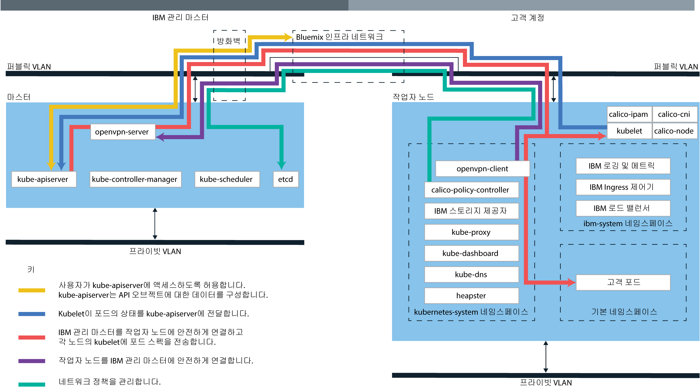

---

copyright:
  years: 2014, 2018
lastupdated: "2018-03-16"

---

{:new_window: target="_blank"}
{:shortdesc: .shortdesc}
{:screen: .screen}
{:pre: .pre}
{:table: .aria-labeledby="caption"}
{:codeblock: .codeblock}
{:tip: .tip}
{:download: .download}

# {{site.data.keyword.containerlong_notm}} 기술

{{site.data.keyword.containerlong}}의 기술에 대해 자세히 알아보십시오.
{:shortdesc}

## Docker 컨테이너
{: #docker_containers}

기존 Linux 컨테이너 기술(LXC)을 기반으로 빌드된 Docker라는 오픈 소스 프로젝트는 신속하게 빌드하고 테스트하고 배치하고 스케일링하는 데 필요한 소프트웨어 플랫폼이 되었습니다. Docker는 앱 실행에 필요한 모든 요소를 포함하는 소프트웨어(컨테이너라고 함)를 표준화된 단위로 패키징합니다.
{:shortdesc}

일부 기본 Docker 개념에 대한 학습:

<dl>
<dt>이미지</dt>
<dd>Docker 이미지는 이미지를 빌드하는 방법 및 포함할 빌드 아티팩트(예: 앱, 앱의 구성 및 종속 항목)를 정의하는 텍스트 파일인 Dockerfile에서 빌드됩니다. 이미지는 항상 다른 이미지로부터 빌드되어 빠르게 구성할 수 있습니다. 다른 사람이 대부분의 작업을 수행한 이미지를 자신의 용도에 맞게 변경할 수 있습니다.</dd>
<dt>레지스트리</dt>
<dd>이미지 레지스트리는 Docker 이미지를 저장, 검색 및 공유하는 장소입니다. 레지스트리에 저장된 이미지는 공용으로 사용 가능하거나(공용 레지스트리) 소규모 사용자 그룹이 액세스할 수 있습니다(개인용 레지스트리). {{site.data.keyword.containershort_notm}}는 첫 번째 컨테이너화된 앱을 작성하는 데 사용할 수 있는 공용 이미지(예: ibmliberty)를 제공합니다. 엔터프라이즈 애플리케이션인 경우에는 {{site.data.keyword.Bluemix_notm}}에 제공된 레지스트리와 같은 개인용 레지스트리를 사용하여 권한 없는 사용자가 사용하지 못하도록 이미지를 보호하십시오.
</dd>
<dt>컨테이너</dt>
<dd>모든 컨테이너는 이미지로부터 작성됩니다. 컨테이너는 환경 간에 앱을 이동하고 변경사항 없이 앱을 실행할 수 있도록 모든 종속 항목과 함께 패키징된 앱입니다. 가상 머신과 달리 컨테이너는 디바이스, 그 운영 체제 및 기본 하드웨어를 가상화하지 않습니다. 앱 코드, 런타임, 시스템 도구, 라이브러리 및 설정만 컨테이너 내부에 패키징됩니다. 컨테이너는 Ubuntu 컴퓨팅 호스트에서 격리된 프로세스로 실행되고 호스트 운영 체제와 그 하드웨어 리소스를 공유합니다. 이 접근 방식으로 인해 컨테이너가 가상 머신보다 경량으로 유지되어
이식성이 높아지고 효율적이게 됩니다.</dd>
</dl>

### 컨테이너 사용의 주요 이점
{: #container_benefits}

<dl>
<dt>컨테이너는 민첩합니다.</dt>
<dd>컨테이너는 개발 및 프로덕션 배치를 위한 표준화된 환경을 제공함으로써 시스템 관리를 단순화합니다. 경량 런타임을 사용하면 배치를 신속하게 확장 및 축소할 수 있습니다. 컨테이너를 사용하여 여러 운영 체제 플랫폼과 해당 기본 인프라 관리의 복잡도를 제거하면 임의의 인프라에서 임의의 앱을 신속하고 확실하게 배치하고 실행하는 데 도움이 됩니다.</dd>
<dt>컨테이너는 크기가 작습니다.</dt>
<dd>하나의 가상 머신에 필요한 크기의 공간에 많은 컨테이너를 배치할 수 있습니다.</dd>
<dt>컨테이너는 이식 가능합니다.</dt>
<dd><ul>
  <li>이미지 조각을 재사용하여 컨테이너 빌드 </li>
  <li>스테이징에서 프로덕션 환경으로 앱 코드를 신속하게 이동</li>
  <li>지속적인 전달 도구를 사용하여 프로세스 자동화</li> </ul></dd>
</dl>

 

## Kubernetes 기본
{: #kubernetes_basics}

Kubernetes라는 오픈 소스 프로젝트는 컨테이너화된 인프라의 실행을 프로덕션 워크로드, 오픈 소스 컨트리뷰션 및 Docker 컨테이너 관리 도구와 결합합니다. Kubernetes는 이식성과 확장성이 뛰어나고 장애 복구 시에 자체 회복되는 컨테이너 관리를 위한 격리된 보안 앱 플랫폼을 제공합니다.
{:shortdesc}

다음 다이어그램에 나타낸 것처럼 일부 기본 Kubernetes 개념에 대해 학습하십시오.

<dl>
<dt>계정</dt>
<dd>계정은 {{site.data.keyword.Bluemix_notm}} 계정을 나타냅니다.</dd>

<dt>클러스터</dt>
<dd>Kubernetes 클러스터는 작업자 노드라는 하나 이상의 컴퓨팅 호스트로 구성됩니다. 작업자 노드는 클러스터의 모든 Kubernetes 리소스를 중앙에서 제어하고 모니터하는
Kubernetes 마스터에서 관리합니다. 그러므로 컨테이너화된 앱을 위한 리소스를 배치하는 경우 Kubernetes 마스터는 클러스터에서 사용 가능한 용량과 배치 요구사항을 고려하여 해당 리소스를 배치할 작업자 노드를 결정합니다. Kubernetes 리소스에는 서비스, 배치 및 포드가 포함됩니다.</dd>

<dt>서비스</dt>
<dd>서비스는 포드 세트를 그룹화하고 각 포드의 실제 사설 IP 주소를 노출하지 않고 이러한 포드에 대한 네트워크 연결을 제공하는 Kubernetes 리소스입니다. 서비스를 사용하여 클러스터 내에서 또는 공용 인터넷에 앱을 사용 가능하게 할 수 있습니다.
</dd>

<dt>배치</dt>
<dd>배치는 서비스, 지속적 스토리지 또는 어노테이션과 같이 앱을 실행하는 데 필요한 다른 리소스 또는 기능에 대한 정보를 지정하는 Kubernetes 리소스입니다. 구성 YAML 파일에 배치를 문서화한 다음 클러스터에 적용합니다. Kubernetes 마스터는 리소스를 구성하고 사용 가능한 용량이 있는 작업자 노드의 포드에 컨테이너를 배치합니다.
  
롤링 업데이트 중에 추가할 포드의 수와 한 번에 사용 불가능한 포드의 수를 포함하여 앱에 대한 업데이트 전략을 정의하십시오. 롤링 업데이트를 수행할 때 배치는 업데이트가 작동 중인지 여부를 확인하며 장애가 발견되면 롤아웃을 중지합니다.</dd>

<dt>포드</dt>
<dd>클러스터에 배치된 모든 컨테이너화된 앱은 포드라는 Kubernetes 리소스가 배치, 실행 및 관리합니다. 포드는 Kubernetes 클러스터의 작은 배치 가능 단위를 나타내며, 단일 단위로 처리되어야 하는 컨테이너를 그룹화하는 데 사용됩니다. 대부분의 경우, 각 컨테이너는 고유의 포드에 배치됩니다. 그러나 해당 컨테이너가 동일한 사설 IP 주소를 사용하여 주소 지정될 수 있도록, 앱에서는 하나의 포드에 배치되는 컨테이너 및 기타 헬퍼 컨테이너가 필요할 수 있습니다.</dd>

<dt>앱</dt>
<dd>앱은 전체 앱 또는 앱의 컴포넌트를 참조할 수 있습니다. 별도의 포드 또는 별도의 작업자 노드에 앱의 컴포넌트를 배치할 수 있습니다.
  
Kubernetes 용어를 자세히 보려면 <a href="cs_tutorials.html#cs_cluster_tutorial" target="_blank">튜토리얼</a>을 확인하십시오.</dd>

</dl>

 

## 서비스 아키텍처
{: #architecture}

{{site.data.keyword.containershort_notm}}에서 실행되는 Kubernetes 클러스터에서 컨테이너화된 앱은 작업자 노드라고 하는 컴퓨팅 호스트에서 호스팅됩니다. 좀 더 구체적으로 설명하면, 컨테이너화된 앱은 작업자 노드에서 호스팅된 포드에서 실행됩니다. 작업자 노드는 Kubernetes 마스터가 관리합니다. Kubernetes 마스터 및 작업자 노드는 보안 TLS 인증서 및 openVPN 연결을 통해 서로 통신하여 클러스터 구성을 조정합니다.
{: shortdesc}

Kubernetes 마스터와 작업자 노드 간의 차이점은 무엇입니까? 질문해 주셔서 감사합니다. 

<dl>
  <dt>Kubernetes 마스터</dt>
    <dd>Kubernetes 마스터는 클러스터에서 모든 컴퓨팅, 네트워크 및 스토리지 리소스를 관리하는 역할을 합니다. Kubernetes 마스터를 사용하면 컨테이너화된 앱 및 서비스가 클러스터의 작업자 노드에 동일하게 배치됩니다. 앱 및 서비스의 구성 방식에 따라 마스터는 앱의 요구사항을 충족시키는 데 충분한 리소스가 있는 작업자 노드를 판별합니다. </dd>
  <dt>작업자 노드</dt>
    <dd>각 작업자 노드는 실제 하드웨어에서 실행되는 실제 머신(베어메탈) 또는 가상 머신으로, 클라우드 환경에서 관리됩니다. 작업자 노드를 프로비저닝하는 경우 해당 작업자 노드에 호스팅되는 컨테이너에 사용 가능한 리소스를 판별합니다. 기본적으로, 작업자 노드는 {{site.data.keyword.IBM_notm}} 관리 Docker Engine, 개별 컴퓨팅 리소스, 네트워킹 및 볼륨 서비스로 설정됩니다. 기본 제공 보안 기능은 격리, 리소스 관리 기능 및 작업자 노드 보안 준수를 제공합니다. </dd>
</dl>

그림. {{site.data.keyword.containershort_notm}} 아키텍처

 

