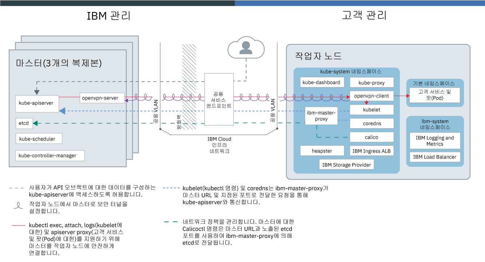
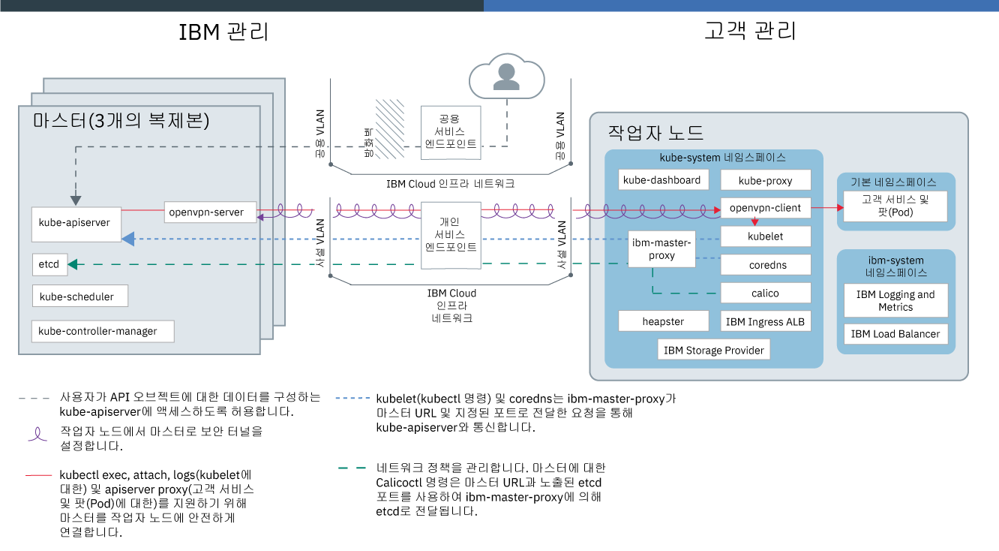

---

copyright:
  years: 2014, 2019
lastupdated: "2019-06-12"

keywords: kubernetes, iks, docker

subcollection: containers

---

{:new_window: target="_blank"}
{:shortdesc: .shortdesc}
{:screen: .screen}
{:pre: .pre}
{:table: .aria-labeledby="caption"}
{:codeblock: .codeblock}
{:tip: .tip}
{:note: .note}
{:important: .important}
{:deprecated: .deprecated}
{:download: .download}
{:preview: .preview}

# {{site.data.keyword.containerlong_notm}} 기술

{{site.data.keyword.containerlong}}의 기술에 대해 자세히 알아보십시오.
{:shortdesc}

## Docker 컨테이너
{: #docker_containers}

기존 Linux 컨테이너 기술(LXC)에서 빌드된 Docker라고 하는 오픈 소스 프로젝트는 앱이 실행해야 하는 모든 요소가 포함된 컨테이너라고 하는 표준화된 단위로 소프트웨어를 패키징하는 방법에 대한 템플리트를 정의했습니다. {{site.data.keyword.containerlong_notm}}는 `containerd`를 클러스터에 Docker 컨테이너 이미지의 컨테이너를 배치하기 위한 컨테이너 런타임으로 사용합니다.
{:shortdesc}

일부 기본 Docker 개념에 대한 학습:

<dl>
<dt>이미지</dt>
<dd>컨테이너 이미지는 실행하고자 하는 모든 컨테이너의 기반입니다. 컨테이너 이미지는 이미지를 빌드하는 방법과 그 안에 포함할 빌드 아티팩트(예: 앱, 앱 구성 및 이의 종속 항목)를 정의하는 텍스트 파일인 Dockerfile에서 빌드됩니다. 이미지는 항상 다른 이미지로부터 빌드되어 빠르게 구성할 수 있습니다. 다른 사람이 대부분의 작업을 수행한 이미지를 자신의 용도에 맞게 변경할 수 있습니다.</dd>
<dt>레지스트리</dt>
<dd>이미지 레지스트리는 컨테이너 이미지를 저장, 검색 및 공유하는 위치입니다. 레지스트리에 저장된 이미지는 공용으로 사용 가능하거나(공용 레지스트리) 소규모 사용자 그룹이 액세스할 수 있습니다(개인용 레지스트리). {{site.data.keyword.containerlong_notm}}는 첫 번째 컨테이너화된 앱을 작성하는 데 사용할 수 있는 공용 이미지(예: ibmliberty)를 제공합니다. 엔터프라이즈 애플리케이션인 경우에는 {{site.data.keyword.Bluemix_notm}}에 제공된 레지스트리와 같은 개인용 레지스트리를 사용하여 권한 없는 사용자가 사용하지 못하도록 이미지를 보호하십시오.
</dd>
<dt>컨테이너</dt>
<dd>모든 컨테이너는 이미지로부터 작성됩니다. 컨테이너는 환경 간에 앱을 이동하고 변경사항 없이 앱을 실행할 수 있도록 모든 종속 항목과 함께 패키징된 앱입니다. 가상 머신과 달리 컨테이너는 디바이스, 그 운영 체제 및 기본 하드웨어를 가상화하지 않습니다. 앱 코드, 런타임, 시스템 도구, 라이브러리 및 설정만 컨테이너 내부에 패키징됩니다. 컨테이너는 Ubuntu 컴퓨팅 호스트에서 격리된 프로세스로 실행되고 호스트 운영 체제와 그 하드웨어 리소스를 공유합니다. 이 접근 방식으로 인해 컨테이너가 가상 머신보다 경량으로 유지되어
이식성이 높아지고 효율적이게 됩니다.</dd>
</dl>

### 컨테이너 사용의 주요 이점
{: #container_benefits}

<dl>
<dt>컨테이너는 Agile 방식입니다.</dt>
<dd>컨테이너는 개발 및 프로덕션 배치를 위한 표준화된 환경을 제공함으로써 시스템 관리를 단순화합니다. 경량 런타임을 사용하면 배치를 신속하게 확장 및 축소할 수 있습니다. 컨테이너를 사용하여 여러 운영 체제 플랫폼과 해당 기본 인프라 관리의 복잡도를 제거하면 임의의 인프라에서 임의의 앱을 신속하고 확실하게 배치하고 실행하는 데 도움이 됩니다.</dd>
<dt>컨테이너는 크기가 작습니다.</dt>
<dd>하나의 가상 머신에 필요한 크기의 공간에 많은 컨테이너를 배치할 수 있습니다.</dd>
<dt>컨테이너는 이식 가능합니다.</dt>
<dd>
<ul>
  <li>이미지 조각을 재사용하여 컨테이너 빌드 </li>
  <li>스테이징에서 프로덕션 환경으로 앱 코드를 신속하게 이동</li>
  <li>지속적 딜리버리 도구를 사용하여 프로세스 자동화</li>
  </ul>
  </dd>

컨테이너 이미지에 대해 작업하는 경우 [개인 정보 보호](/docs/containers?topic=containers-security#pi)에 대해 자세히 알아보십시오.

Docker에 대해 더 자세히 알아볼 준비가 되셨습니까? <a href="https://developer.ibm.com/courses/all/docker-essentials-a-developer-introduction/" target="_blank">이 과정을 완료하여 Docker와 {{site.data.keyword.containerlong_notm}}가 어떻게 함께 작동하는지 알아보십시오</a>.

</dl>

 

## Kubernetes 클러스터
{: #kubernetes_basics}

Kubernetes라는 오픈 소스 프로젝트는 컨테이너화된 인프라의 실행을 프로덕션 워크로드, 오픈 소스 기여 및 Docker 컨테이너 관리 도구와 결합합니다. Kubernetes는 이식성과 확장성이 뛰어나고 장애 복구 시에 자체 회복되는 컨테이너 관리를 위한 격리된 보안 앱 플랫폼을 제공합니다.
{:shortdesc}

다음 다이어그램에 나타낸 것처럼 일부 기본 Kubernetes 개념에 대해 학습하십시오.

<dl>
<dt>계정</dt>
<dd>계정은 {{site.data.keyword.Bluemix_notm}} 계정을 나타냅니다.</dd>

<dt>클러스터</dt>
<dd>Kubernetes 클러스터는 작업자 노드라는 하나 이상의 컴퓨팅 호스트로 구성됩니다. 작업자 노드는 클러스터의 모든 Kubernetes 리소스를 중앙에서 제어하고 모니터링하는
Kubernetes 마스터에서 관리합니다. 그러므로 컨테이너화된 앱을 위한 리소스를 배치하는 경우 Kubernetes 마스터는 클러스터에서 사용 가능한 용량과 배치 요구사항을 고려하여 해당 리소스를 배치할 작업자 노드를 결정합니다. Kubernetes 리소스에는 서비스, 배치 및 팟(Pod)이 포함됩니다.</dd>

<dt>서비스</dt>
<dd>서비스는 팟(Pod) 세트를 그룹화하고 각 팟(Pod)의 실제 사설 IP 주소를 노출하지 않고 이러한 팟(Pod)에 대한 네트워크 연결을 제공하는 Kubernetes 리소스입니다. 서비스를 사용하여 클러스터 내에서 또는 공용 인터넷에 앱을 사용 가능하게 할 수 있습니다.
</dd>

<dt>배치</dt>
<dd>배치는 서비스, 지속적 스토리지 또는 어노테이션과 같이 앱을 실행하는 데 필요한 다른 리소스 또는 기능에 대한 정보를 지정하는 Kubernetes 리소스입니다. 구성 YAML 파일에 배치를 문서화한 다음 클러스터에 적용합니다. Kubernetes 마스터는 리소스를 구성하고 사용 가능한 용량이 있는 작업자 노드의 팟(Pod)에 컨테이너를 배치합니다.
  
롤링 업데이트 중에 추가할 팟(Pod)의 수와 한 번에 사용 불가능한 팟(Pod)의 수를 포함하여 앱에 대한 업데이트 전략을 정의하십시오. 롤링 업데이트를 수행할 때 배치는 업데이트가 작동 중인지 여부를 확인하며 장애가 발견되면 롤아웃을 중지합니다.</dd>

<dt>팟(Pod)</dt>
<dd>클러스터에 배치된 모든 컨테이너화된 앱은 팟(Pod)이라는 Kubernetes 리소스가 배치, 실행 및 관리합니다. 팟(Pod)은 Kubernetes 클러스터의 작은 배치 가능 단위를 나타내며, 단일 단위로 처리되어야 하는 컨테이너를 그룹화하는 데 사용됩니다. 대부분의 경우, 각 컨테이너는 고유의 팟(Pod)에 배치됩니다. 그러나 해당 컨테이너가 동일한 사설 IP 주소를 사용하여 주소 지정될 수 있도록, 앱에서는 하나의 팟(Pod)에 배치되는 컨테이너 및 기타 헬퍼 컨테이너가 필요할 수 있습니다.</dd>

<dt>앱</dt>
<dd>앱은 전체 앱 또는 앱의 컴포넌트를 참조할 수 있습니다. 별도의 팟(Pod) 또는 별도의 작업자 노드에 앱의 컴포넌트를 배치할 수 있습니다.</dd>

Kubernetes 리소스에 대해 작업할 때 [개인 정보 보호](/docs/containers?topic=containers-security#pi)에 대해 자세히 알아보십시오.

Kubernetes에 대해 더 자세히 알아볼 준비가 되셨습니까?

<ul><li><a href="/docs/containers?topic=containers-cs_cluster_tutorial#cs_cluster_tutorial" target="_blank">클러스터 작성 튜토리얼을 통해 용어에 대한 지식을 넓히십시오</a>.</li>
<li><a href="https://developer.ibm.com/courses/all/container-kubernetes-essentials-with-ibm-cloud/" target="_blank">이 과정을 완료하여 Kubernetes와 {{site.data.keyword.containerlong_notm}}가 어떻게 함께 작동하는지 알아보십시오</a>.</li></ul>

</dl>

 

## 서비스 아키텍처
{: #architecture}

{{site.data.keyword.containerlong_notm}}에서 실행되는 Kubernetes 클러스터에서 컨테이너화된 앱은 작업자 노드라고 하는 컴퓨팅 호스트에서 호스팅됩니다. 좀 더 구체적으로 설명하면, 앱은 작업자 노드에서 호스팅되는 팟(Pod)에서 실행됩니다. 작업자 노드는 Kubernetes 마스터가 관리합니다. Kubernetes 마스터와 작업자 노드 간의 통신 설정은 공용 클라우드 엔드 포인트를 사용하는 계정 또는 공용 및 개인 서비스 엔드 포인트를 사용하는 VRF 사용 계정의 IBM Cloud 인프라 (SoftLayer) 네트워크를 설정하는 방법에 따라 다릅니다.
{: shortdesc}

다음 이미지는 [공용 서비스 엔드포인트만 사용으로 설정](/docs/containers?topic=containers-plan_clusters#workeruser-master)된 경우 클러스터의 컴포넌트와 계정에서 클러스터의 컴포넌트가 상호작용하는 방법을 표시합니다.

<figure>
 
 <figcaption>공용 서비스 엔드포인트만 사용으로 설정된 경우 {{site.data.keyword.containerlong_notm}} 아키텍처</figcaption>
</figure>

다음 이미지는 [공용 및 개인 서비스 엔드포인트가 사용으로 설정](/docs/containers?topic=containers-plan_clusters#workeruser-master)된 경우 클러스터 컴포넌트와 VRF 사용 계정에서 클러스터의 컴포넌트가 상호작용하는 방법을 표시합니다.

<figure>
 
 <figcaption>공용 및 개인 서비스 엔드포인트가 사용으로 설정된 경우 {{site.data.keyword.containerlong_notm}} 아키텍처</figcaption>
</figure>

Kubernetes 마스터와 작업자 노드 간의 차이점은 무엇입니까? 질문해 주셔서 감사합니다.

<dl>
  <dt>Kubernetes 마스터</dt>
    <dd>Kubernetes 마스터는 클러스터에서 모든 컴퓨팅, 네트워크 및 스토리지 리소스를 관리하는 역할을 합니다. Kubernetes 마스터를 사용하면 컨테이너화된 앱 및 서비스가 클러스터의 작업자 노드에 동일하게 배치됩니다. 앱 및 서비스의 구성 방식에 따라 마스터는 앱의 요구사항을 충족시키는 데 충분한 리소스가 있는 작업자 노드를 판별합니다.  다음 표에서는 Kubernetes 마스터의 컴포넌트에 대해 설명합니다.
    <table>
    <caption>Kubernetes 마스터의 컴포넌트</caption>
    <thead>
    <th>마스터 컴포넌트</th>
    <th>설명</th>
    </thead>
    <tbody>
    <tr>
    <td>kube-apiserver</td>
    <td>Kubernetes API 서버는 작업자 노드에서 Kubernetes 마스터로의 모든 클러스터 관리 요청에 대한 기본 시작점 역할을 수행합니다. Kubernetes API 서버는 팟(Pod) 또는 서비스 등의 Kubernetes 리소스의 상태를 변경하는 요청을 유효성 검증하고 처리하며, 이 상태를 etcd에 저장합니다.</td>
    </tr>
    <tr>
    <td>openvpn-server</td>
    <td>OpenVPN 서버는 OpenVPN 클라이언트와 함께 작업하여 마스터를 작업자 노드에 안전하게 연결합니다. 이 연결은 팟(Pod) 및 서비스에 대한 `apiserver proxy` 호출과 kubelet에 대한 `kubectl exec`, `attach` 및 `logs` 호출을 지원합니다.</td>
    </tr>
    <tr>
    <td>etcd</td>
    <td>etcd는 서비스, 배치 및 팟(Pod) 등 클러스터의 모든 Kubernetes 리소스의 상태를 저장하는 고가용성의 키 값 저장소입니다. etcd의 데이터는 IBM이 관리하는 암호화된 스토리지 인스턴스에 백업됩니다.</td>
    </tr>
    <tr>
    <td>kube-scheduler</td>
    <td>Kubernetes 스케줄러는 새로 작성된 팟(Pod)을 감시하고 용량, 성능 요구사항, 정책 제한조건, 반친화성 스펙 및 워크로드 요구사항을 기반으로 이를 배치할 위치를 결정합니다. 
요구사항과 일치하는 작업자 노드를 찾을 수 없으면 팟(Pod)이 클러스터에 배치되지 않습니다.</td>
    </tr>
    <tr>
    <td>kube-controller-manager</td>
    <td>Kubernetes 제어기 관리자는 복제본 세트 등의 클러스터 리소스의 상태를 감시하는 디먼입니다. 리소스의 상태가 변경되는 경우(예: 복제본 세트의 팟(Pod)이 작동 중지됨), 제어기 관리자는 정정 조치를 시작하여 필수 상태를 얻습니다.</td>
    </tr>
    </tbody></table></dd>
  <dt>작업자 노드</dt>
    <dd>각 작업자 노드는 클라우드 환경의 실제 머신(베어메탈), 또는 실제 하드웨어에서 실행되는 가상 머신입니다. 작업자 노드를 프로비저닝할 때 해당 작업자 노드에서 호스팅되는 컨테이너에 사용 가능한 리소스를 판별합니다. 기본적으로, 작업자 노드는 {{site.data.keyword.IBM_notm}} 관리 Docker Engine, 개별 컴퓨팅 리소스, 네트워킹 및 볼륨 서비스로 설정됩니다. 기본 제공 보안 기능은 격리, 리소스 관리 기능 및 작업자 노드 보안 준수를 제공합니다.  
`kubelet`와 같은 기본 작업자 노드 컴포넌트를 수정하는 것은 지원되지 않으며 예기치 않은 결과가 발생할 수 있습니다.
다음 표에서는 작업자 노드의 컴포넌트에 대해 설명합니다.
    <table>
    <caption>작업자 노드의 컴포넌트</caption>
    <thead>
    <th>작업자 컴포넌트</th>
    <th>네임스페이스</th>
    <th>설명</th>
    </thead>
    <tbody>
    <tr>
    <td>`ibm-master-proxy`</td>
    <td>kube-system</td>
    <td>`ibm-master-proxy`는 작업자 노드의 요청을 고가용성 마스터 복제본의 IP 주소로 전달합니다. 단일 구역 클러스터에서 마스터에는 하나의 마스터 IP 주소와 도메인 이름을 지닌 별도 호스트의 3개 복제본이 있습니다. 다중 구역 가능 구역에 있는 클러스터의 경우, 마스터에는 구역 간에 전개된 3개의 복제본이 있습니다. 따라서 각각의 마스터에는 전체 클러스터 마스터에 대해 하나의 도메인 이름을 지닌 DNS에 등록된 자체 IP 주소가 있습니다.</td>
    </tr>
    <tr>
    <td>`openvpn-client`</td>
    <td>kube-system</td>
    <td>OpenVPN 클라이언트는 OpenVPN 서버와 함께 작업하여 마스터를 작업자 노드에 안전하게 연결합니다. 이 연결은 팟(Pod) 및 서비스에 대한 `apiserver proxy` 호출과 kubelet에 대한 `kubectl exec`, `attach` 및 `logs` 호출을 지원합니다.</td>
    </tr>
    <tr>
    <td>`kubelet`</td>
    <td>kube-system</td>
    <td>kubelet는 모든 작업자 노드에서 실행되는 팟(Pod)이며, 작업자 노드에서 실행되는 팟(Pod)의 상태를 모니터링하고 Kubernetes API 서버가 전송하는 이벤트를 감시하는 역할을 담당합니다. 이벤트를 기반으로, kubelet는 팟(Pod)을 작성 또는 제거하고 활동 상태 및 준비 상태 프로브를 보장하며 팟(Pod)의 상태를 다시 Kubernetes API 서버에 보고합니다.</td>
    </tr>
    <tr>
    <td>`coredns`</td>
    <td>kube-system</td>
    <td>기본적으로, Kubernetes는 클러스터에서 CoreDNS 팟(Pod)(또는 버전 1.12 이하에서 KubeDNS)과 서비스를 스케줄합니다. 컨테이너는 자동으로 DNS 서비스의 IP를 사용하여 기타 팟(Pod) 및 서비스에 대한 자체 검색에서 DNS 이름을 분석합니다.</td>
    </tr>
    <tr>
    <td>`calico`</td>
    <td>kube-system</td>
    <td>Calico는 클러스터에 대한 네트워크 정책을 관리하고 다음과 같은 일부 컴포넌트를 구성합니다.
    <ul>
    <li>**`calico-cni`**: Calico 컨테이너 네트워크 인터페이스(CNI)는 컨테이너의 네트워크 연결을 관리하며 컨테이너가 삭제될 때 할당된 리소스를 제거합니다.</li>
    <li>**`calico-ipam`**: Calico IPAM은 컨테이너에 대한 IP 주소 할당을 관리합니다.</li>
    <li>**`calico-node`**: Calico 노드는 컨테이너를 Calico와 네트워크로 연결하는 데 필요한 다양한 컴포넌트를 함께 번들링하는 컨테이너입니다.</li>
    <li>**`calico-policy-controller`**: Calico 정책 제어기는 설정된 네트워크 정책을 준수하기 위해 인바운드 및 아웃바운드 네트워크 트래픽을 감시합니다. 트래픽이 클러스터에서 허용되지 않으면 클러스터에 대한 액세스가 차단됩니다. Calico 정책 제어기는 클러스터에 대한 네트워크 정책을 작성하고 설정하는 데도 사용됩니다.</li></ul></td>
    </tr>
    <tr>
    <td>`kube-proxy`</td>
    <td>kube-system</td>
    <td>Kubernetes 네트워크 프록시는 모든 작업자 노드에서 실행되며 클러스터에서 실행되는 서비스의 TCP 및 UDP 네트워크 트래픽을 전달하거나 로드 밸런싱하는 디먼입니다.</td>
    </tr>
    <tr>
    <td>`kube-dashboard`</td>
    <td>kube-system</td>
    <td>Kubernetes 대시보드는 사용자가 클러스터에서 실행 중인 애플리케이션과 클러스터를 관리하고 해당 문제점을 해결할 수 있도록 허용하는 웹 기반 GUI입니다.</td>
    </tr>
    <tr>
    <td>`heapster`</td>
    <td>kube-system</td>
    <td>Heapster는 모니터링 및 이벤트 데이터의 클러스터 전체 집계기입니다. Heapster 팟(Pod)은 클러스터의 모든 노드를 검색하고 각 노드의 kubelet에서 사용 정보를 조회합니다. Kubernetes 대시보드에서 이용 그래프를 찾을 수 있습니다.</td>
    </tr>
    <tr>
    <td>Ingress ALB</td>
    <td>kube-system</td>
    <td>Ingress는 공용 또는 개인용 요청을 클러스터의 여러 앱에 전달함으로써 클러스터 내에서 네트워크 트래픽 워크로드의 밸런스를 유지하는 데 사용될 수 있는 Kubernetes 서비스입니다. 공용 또는 사설 네트워크를 통해 앱을 노출하려면 Ingress 리소스를 작성하여 Ingress 애플리케이션 로드 밸런서(ALB)에 앱을 등록해야 합니다. 그러면 단일 URL 또는 IP 주소를 사용하여 여러 앱에 액세스할 수 있습니다.</td>
    </tr>
    <tr>
    <td>스토리지 제공자</td>
    <td>kube-system</td>
    <td>모든 클러스터는 파일 스토리지를 프로비저닝하는 플러그인으로 설정되어 있습니다. 사용자는 기타 추가 기능(예: 블록 스토리지)의 설치를 선택할 수 있습니다.</td>
    </tr>
    <tr>
    <td>로깅 및 메트릭</td>
    <td>ibm-system</td>
    <td>통합 {{site.data.keyword.loganalysislong_notm}} 및 {{site.data.keyword.monitoringlong_notm}} 서비스를 사용하여 로그 및 메트릭 관련 작업을 수행할 때 콜렉션 및 보유 기능을 확장할 수 있습니다.</td>
    </tr>
    <tr>
    <td>로드 밸런서</td>
    <td>ibm-system</td>
    <td>로드 밸런서는 공용 또는 개인용 요청을 앱에 전달하여 클러스터에서 네트워크 트래픽 워크로드의 밸런스를 유지하는 데 사용될 수 있는 Kubernetes 서비스입니다.</td>
    </tr>
    <tr>
    <td>앱 팟(Pod) 및 서비스</td>
    <td>default</td>
    <td><code>default</code> 네임스페이스나 사용자가 작성한 네임스페이스에서는 팟(Pod) 및 서비스에 앱을 배치하여 해당 팟(Pod)과 통신할 수 있습니다.</td>
    </tr>
    </tbody></table></dd>
</dl>

{{site.data.keyword.containerlong_notm}}를 다른 제품 및 서비스와 함께 사용하는 방법을 알아보시겠습니까? 몇 가지 [통합](/docs/containers?topic=containers-supported_integrations#supported_integrations)을 참고해 보십시오.
{: tip}

## 서비스 제한사항
{: #tech_limits}

{{site.data.keyword.containerlong_notm}} 및 Kubernetes 오픈 소스 프로젝트는 보안, 편의성 및 기본 기능을 보장하도록 기본 서비스 설정 및 제한사항이 함께 제공됩니다. 명시된 일부 제한사항을 변경할 수 있습니다. 다음 {{site.data.keyword.containerlong_notm}} 제한사항에 도달할 것으로 예상하는 경우 먼저 [내부 ](https://ibm-argonauts.slack.com/messages/C4S4NUCB1) 또는 [외부 Slack ](https://ibm-container-service.slack.com)을 통해 IBM 팀에 문의하십시오.
{: shortdesc}

<table summary="이 표에는 {{site.data.keyword.containerlong_notm}} 제한사항에 대한 정보가 포함되어 있습니다. 열은 왼쪽에서 오른쪽 방향으로 읽어야 합니다. 첫 번째 열에는 제한사항의 유형, 두 번째 열에는 제한사항에 대한 설명이 있습니다.">
<caption>{{site.data.keyword.containerlong_notm}} 제한사항</caption>
<thead>
  <tr>
    <th>유형</th>
    <th>설명</th>
  </tr>
</thead>
<tbody>
  <tr>
    <td>API 제한 비율</td>
    <td>각 고유 소스 IP 주소마다 {{site.data.keyword.containerlong_notm}} API에 대한 10초당 100개의 요청</td>
  </tr>
  <tr>
    <td>작업자 노드 용량</td>
    <td>작업자 노드는 컴퓨팅 리소스의 [특성 선택](/docs/containers?topic=containers-planning_worker_nodes#shared_dedicated_node)에서 사용 가능합니다. </td>
  </tr>
  <tr>
    <td>작업자 노드 호스트 액세스</td>
    <td>보안을 위해 작업자 노드 컴퓨팅 호스트에 SSH를 실행할 수 없습니다. </td>
  </tr>
  <tr>
    <td>최대 작업자 노드 수</td>
    <td>클러스터당 900개를 초과할 경우 먼저 [내부 ](https://ibm-argonauts.slack.com/messages/C4S4NUCB1) 또는 [외부 Slack ](https://ibm-container-service.slack.com)을 통해 IBM 팀에 문의하십시오.   매월 주문되는 인스턴스 수 또는 데이터 센터당 인스턴스 수에 대한 IBM Cloud 인프라(SoftLayer) 용량 제한이 표시되면 IBM Cloud 인프라(SoftLayer) 담당자에게 문의하십시오.</td>
  </tr>
  <tr>
    <td>최대 팟(Pod) 수</td>
    <td>작업자 노드당 110개  팟(Pod) 수에는 작업자 노드에서 실행되는 `kube-system` 및 `ibm-system` 팟(Pod)이 포함됩니다. 성능 향상을 위해, 작업자 노드를 과도하게 사용하지 않도록 컴퓨팅 코어당 실행하는 팟(Pod)의 수를 제한할 것을 고려해보십시오. 예를 들어, `b3c.4x16` 특성이 있는 작업자 노드에서 총 작업자 노드 용량의 75% 이하를 사용하는 코어당 10개의 팟(Pod)을 실행할 수 있습니다. </td>
  </tr>
  <tr>
    <td>최소 Kubernetes 서비스 수</td>
    <td>클러스터 내 Kubernetes 서비스에 지정할 수 있는 172.21.0.0/16 범위로 된 클러스터당 65,000개의 IP</td>
  </tr>
  <tr>
    <td>Ingress 애플리케이션 로드 밸런서(ALB) 트래픽</td>
    <td>초당 32,768개의 연결  유입 트래픽이 이 수를 초과하면 클러스터에서 [ALB 복제본의 수를 스케일링 업](/docs/containers?topic=containers-ingress#scale_albs)하십시오. </td>
  </tr>
  <tr>
    <td>스토리지 볼륨</td>
    <td>계정당 IBM Cloud 인프라(SoftLayer)의 파일 및 블록 스토리지 인스턴스의 결합된 총 250개의 볼륨  이보다 더 많은 양을 마운트하는 경우 지속적 볼륨을 프로비저닝하면 "용량 부족" 메시지가 표시될 수 있으며, 이때 IBM Cloud 인프라(SoftLayer) 담당자에게 문의해야 할 수 있습니다. 더 많은 FAQ는 [파일](/docs/infrastructure/FileStorage?topic=FileStorage-file-storage-faqs#how-many-volumes-can-i-provision-) 및 [블록](/docs/infrastructure/BlockStorage?topic=BlockStorage-block-storage-faqs#how-many-instances-can-share-the-use-of-a-block-storage-volume-) 스토리지 문서를 참조하십시오.</td>
  </tr>
</tbody>
</table>
