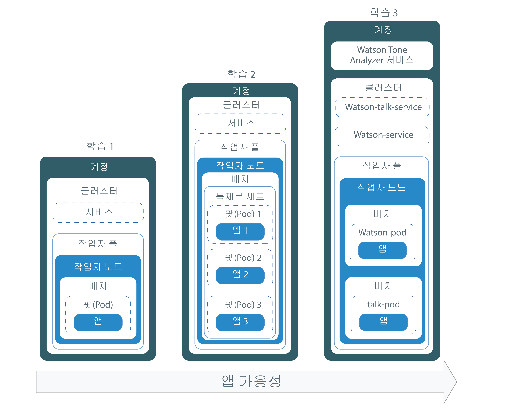
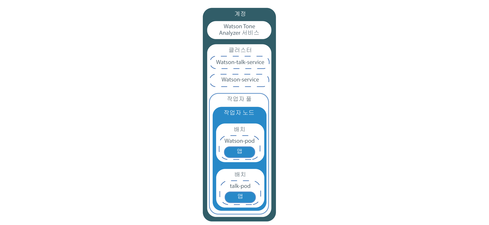

---

copyright:
  years: 2014, 2019
lastupdated: "2019-05-31"

keywords: kubernetes, iks

subcollection: containers

---

{:new_window: target="_blank"}
{:shortdesc: .shortdesc}
{:screen: .screen}
{:pre: .pre}
{:table: .aria-labeledby="caption"}
{:codeblock: .codeblock}
{:tip: .tip}
{:note: .note}
{:important: .important}
{:deprecated: .deprecated}
{:download: .download}
{:preview: .preview}


# 튜토리얼: Kubernetes 클러스터에 앱 배치
{: #cs_apps_tutorial}

{{site.data.keyword.containerlong}}를 사용하여 {{site.data.keyword.watson}} {{site.data.keyword.toneanalyzershort}}를 활용하는 컨테이너화된 앱을 배치하는 방법을 학습할 수 있습니다.
{: shortdesc}

이 시나리오에서는 가상의 PR 회사가 {{site.data.keyword.Bluemix_notm}} 서비스를 사용하여 보도 자료를 분석하고 메시지의 논조에 대한 피드백을 받습니다.

PR 회사의 앱 개발자가 지난 튜토리얼에서 작성된 Kubernetes 클러스터를 사용하여 앱의 Hello World 버전을 배치합니다. 앱 개발자는 이 튜토리얼의 각 학습을 기반으로 동일한 앱의 더 복잡한 버전을 점진적으로 배치합니다. 다음 다이어그램은 학습별 각 배치의 컴포넌트를 보여줍니다.



다이어그램에 표시된 것처럼 Kubernetes는 여러 다양한 유형의 리소스를 사용하여 클러스터에서 앱을 시작하고 실행합니다. Kubernetes에서는 배치와 서비스가 함께 작동합니다. 배치에는 앱에 대한 정의가 포함됩니다. 예를 들어, 컨테이너에 사용할 이미지와 앱용으로 노출되어야 하는 포트입니다. 배치를 작성할 때 배치에서 정의한 각 컨테이너마다 Kubernetes 팟(Pod)이 작성됩니다. 앱의 복원성을 높이기 위해, 배치에서 동일 앱의 다중 인스턴스를 정의하고 Kubernetes가 사용자를 위해 복제본 세트를 자동 작성하도록 허용할 수 있습니다. 복제본 세트는 팟(Pod)을 모니터링하며 항상 지정된 수의 팟(Pod)이 시작되어 실행되도록 보장합니다. 팟(Pod) 중 하나가 응답하지 않으면 팟(Pod)이 자동으로 다시 작성됩니다.

서비스는 팟(Pod) 세트를 그룹화하며, 각 팟(Pod)의 실제 사설 IP 주소를 노출함이 없이 클러스터의 기타 서비스에 대해 이러한 팟(Pod)으로의 네트워크 연결을 제공합니다. Kubernetes 서비스를 사용하면 클러스터 내의 기타 팟(Pod)이 앱을 사용할 수 있도록 하거나 인터넷에 앱을 노출할 수 있습니다. 이 튜토리얼에서는 Kubernetes 서비스를 사용하여 공용 포트 및 작업자 노드에 자동으로 지정되는 공인 IP 주소를 사용하여 인터넷에서 실행 중인 앱에 액세스할 수 있습니다.

앱의 가용성을 보다 더 높이기 위해, 표준 클러스터에서 앱의 추가 복제본을 실행하도록 각 구역에서 작업자 노드의 다중 구역에 전개된 작업자 풀을 작성할 수 있습니다. 이 튜토리얼에서는 이 태스크를 다루지 않지만 앱의 가용성에 대한 추후 개선을 위해서는 이 개념을 유념하십시오.

학습 중 오직 하나에서만 앱에서 {{site.data.keyword.Bluemix_notm}} 서비스를 통합하는 내용을 포함하지만, 단순하거나 복잡한 앱에서 원하는 대로 이를 사용할 수 있습니다.

## 목표
{: #apps_objectives}

* 기본 Kubernetes 용어 이해
* {{site.data.keyword.registryshort_notm}}의 레지스트리 네임스페이스에 이미지 푸시
* 앱에 공용으로 액세스할 수 있도록 설정
* Kubernetes 명령 및 스크립트를 사용하여 클러스터에서 앱의 단일 인스턴스 배치
* 상태 검사 중에 재작성된 컨테이너에서 앱의 다중 인스턴스 배치
* {{site.data.keyword.Bluemix_notm}} 서비스의 기능을 사용하는 앱 배치

## 소요 시간
{: #apps_time}

40분

## 대상
{: #apps_audience}

처음으로 Kubernetes 클러스터에 앱을 배치하는 소프트웨어 개발자와 네트워크 관리자.

## 전제조건
{: #apps_prereqs}

[튜토리얼: Kubernetes 클러스터 작성](/docs/containers?topic=containers-cs_cluster_tutorial#cs_cluster_tutorial)


## 학습 1: Kubernetes 클러스터에 단일 인스턴스 앱 배치
{: #cs_apps_tutorial_lesson1}

이전 튜토리얼에서는 하나의 작업자 노드가 있는 클러스터를 작성했습니다. 이 학습에서는 배치를 구성하고 작업자 노드 내의 Kubernetes 팟(Pod)에 단일 앱 인스턴스를 배치합니다.
{:shortdesc}

이 학습을 완료하여 배치하는 컴포넌트가 다음 다이어그램에 표시됩니다.


앱을 배치하려면 다음을 수행하십시오.

1.  [Hello world 앱 ](https://github.com/IBM/container-service-getting-started-wt)의 소스 코드를 사용자 홈 디렉토리에 복제하십시오. 저장소에는 각각 `Lab`으로 시작하는 유사한 앱의 여러 버전이 폴더에 포함되어 있습니다. 각 버전에는 다음 파일이 포함되어 있습니다.
    * `Dockerfile`: 이미지의 빌드 정의
    * `app.js`: Hello world 앱
    * `package.json`: 앱에 대한 메타데이터

    ```
git clone https://github.com/IBM/container-service-getting-started-wt.git
    ```
    {: pre}

2.  `Lab 1` 디렉토리로 이동하십시오.

    ```
    cd 'container-service-getting-started-wt/Lab 1'
    ```
    {: pre}

3. [계정에 로그인하십시오. 해당되는 경우, 적절한 리소스 그룹을 대상으로 지정하십시오. 클러스터의 컨텍스트를 설정하십시오.](/docs/containers?topic=containers-cs_cli_install#cs_cli_configure)

5.  {{site.data.keyword.registryshort_notm}} CLI에 로그인하십시오.

    ```
    ibmcloud cr login
    ```
    {: pre}
    -   {{site.data.keyword.registryshort_notm}}의 네임스페이스를 잊은 경우에는 다음 명령을 실행하십시오.

        ```
        ibmcloud cr namespace-list
        ```
        {: pre}

6.  `Lab 1` 디렉토리의 앱 파일이 포함된 Docker 이미지를 빌드하고, 해당 이미지를 이전 튜토리얼에서 작성한 {{site.data.keyword.registryshort_notm}} 네임스페이스로 푸시하십시오. 향후 앱을 변경해야 하는 경우에는 다음 단계를 반복하여 이미지의 다른 버전을 작성하십시오. 
**참고**: 컨테이너 이미지에 대해 작업하는 경우에는 [개인 정보 보호](/docs/containers?topic=containers-security#pi)에 대해 자세히 알아보십시오.

    이미지 이름에서는 소문자 영숫자 문자나 밑줄(`_`)만 사용하십시오. 명령의 끝에는 반드시 마침표(`.`)를 사용하십시오. 마침표는 이미지를 빌드하기 위한
빌드 아티팩트 및 Dockerfile을 현재 디렉토리 내에서 찾도록 Docker에 지시합니다. 현재 자신이 위치한 레지스트리 지역을 가져오려면 `ibmcloud cr region`을 실행하십시오.

    ```
    ibmcloud cr build -t <region>.icr.io/<namespace>/hello-world:1 .
    ```
    {: pre}

    빌드가 완료되면 다음과 같은 성공 메시지가 표시되는지 확인하십시오.

    ```
    Successfully built <image_ID>
    Successfully tagged <region>.icr.io/<namespace>/hello-world:1
    The push refers to a repository [<region>.icr.io/<namespace>/hello-world]
    29042bc0b00c: Pushed
    f31d9ee9db57: Pushed
    33c64488a635: Pushed
    0804854a4553: Layer already exists
    6bd4a62f5178: Layer already exists
    9dfa40a0da3b: Layer already exists
    1: digest: sha256:f824e99435a29e55c25eea2ffcbb84be4b01345e0a3efbd7d9f238880d63d4a5 size: 1576
    ```
    {: screen}

7.  배치는 팟(Pod)을 관리하는 데 사용되며, 여기에는 컨테이너화된 앱의 인스턴스가 포함됩니다. 다음 명령은 단일 팟(Pod)에 앱을 배치합니다. 이 튜토리얼을 위해 배치의 이름은 **hello-world-deployment**로 지정되었지만, 원하는 이름을 배치에 지정할 수 있습니다.

    ```
    kubectl create deployment hello-world-deployment --image=<region>.icr.io/<namespace>/hello-world:1
    ```
    {: pre}

    출력 예:

    ```
    deployment "hello-world-deployment" created
    ```
    {: screen}

    Kubernetes 리소스에 대해 작업할 때 [개인 정보 보호](/docs/containers?topic=containers-security#pi)에 대해 자세히 알아보십시오.

8.  NodePort 서비스로서 배치를 노출하여 외부에서 앱에 액세스할 수 있도록 하십시오. Cloud Foundry 앱에 대한 포트를 노출하는 것과 같이 노출하는 NodePort는 작업자 노드가 트래픽을 청취하는 포트입니다.

    ```
    kubectl expose deployment/hello-world-deployment --type=NodePort --port=8080 --name=hello-world-service --target-port=8080
    ```
    {: pre}

    출력 예:

    ```
    service "hello-world-service" exposed
    ```
    {: screen}

    <table summary=“Information about the expose command parameters.”>
    <caption>expose 매개변수에 대한 자세한 정보</caption>
    <thead>
    <th colspan=2> expose 매개변수에 대한 자세한 정보</th>
    </thead>
    <tbody>
    <tr>
    <td><code>expose</code></td>
    <td>리소스를 Kubernetes 서비스로서 노출하고 이를 사용자가 공용으로 사용할 수 있도록 합니다.</td>
    </tr>
    <tr>
    <td><code>deployment/<em>&lt;hello-world-deployment&gt;</em></code></td>
    <td>이 서비스에서 노출할 리소스의 리소스 유형 및 이름입니다.</td>
    </tr>
    <tr>
    <td><code>--name=<em>&lt;hello-world-service&gt;</em></code></td>
    <td>서비스의 이름입니다.</td>
    </tr>
    <tr>
    <td><code>--port=<em>&lt;8080&gt;</em></code></td>
    <td>서비스가 제공하는 포트입니다.</td>
    </tr>
    <tr>
    <td><code>--type=NodePort</code></td>
    <td>작성할 서비스 유형입니다.</td>
    </tr>
    <tr>
    <td><code>--target-port=<em>&lt;8080&gt;</em></code></td>
    <td>서비스가 트래픽을 지정하는 대상 포트입니다. 이 경우에는 target-port가 port와 동일하지만 사용자가 작성하는 기타 앱의 경우에는 서로 다를 수 있습니다.</td>
    </tr>
    </tbody></table>

9. 이제 모든 배치 작업이 완료되었으므로 브라우저에서 앱을 테스트할 수 있습니다. URL을 형성하기 위한 세부사항을 가져오십시오.
    1.  서비스에 대한 정보를 가져와서 지정된 NodePort를 확인하십시오.

        ```
        kubectl describe service hello-world-service
        ```
        {: pre}

        출력 예:

        ```
        Name:                   hello-world-service
        Namespace:              default
        Labels:                 run=hello-world-deployment
        Selector:               run=hello-world-deployment
        Type:                   NodePort
        IP:                     10.xxx.xx.xxx
        Port:                   <unset> 8080/TCP
        NodePort:               <unset> 30872/TCP
        Endpoints:              172.30.xxx.xxx:8080
        Session Affinity:       None
        No events.
        ```
        {: screen}

        `expose` 명령으로 생성될 때 NodePort는 랜덤으로 지정되지만, 범위는 30000-32767 사이입니다. 이 예에서 NodePort는 30872입니다.

    2.  클러스터의 작업자 노드에 대한 공인 IP 주소를 가져오십시오.

        ```
   ibmcloud ks workers --cluster <cluster_name_or_ID>
        ```
        {: pre}

        출력 예:

        ```
        ibmcloud ks workers --cluster pr_firm_cluster
        Listing cluster workers...
        OK
        ID                                                 Public IP       Private IP       Machine Type   State    Status   Zone   Version
        kube-mil01-pa10c8f571c84d4ac3b52acbf50fd11788-w1   169.xx.xxx.xxx  10.xxx.xx.xxx    free           normal   Ready    mil01      1.13.6
        ```
        {: screen}

10. 브라우저를 열고 `http://<IP_address>:<NodePort>` URL로 앱을 확인하십시오. 예의 값을 사용하면 이 URL은 `http://169.xx.xxx.xxx:30872`입니다. 브라우저에서 해당 URL을 입력하면 다음 텍스트가 나타납니다.

    ```
     Hello world! Your app is up and running in a cluster!
    ```
    {: screen}

    앱이 공용으로 사용 가능한지 확인하려면 휴대전화에서 브라우저에 앱을 입력해 보십시오.
    {: tip}

11. [Kubernetes 대시보드를 실행](/docs/containers?topic=containers-app#cli_dashboard)하십시오.

    [{{site.data.keyword.Bluemix_notm}} 콘솔](https://cloud.ibm.com/)에서 클러스터를 선택하는 경우, **Kubernetes 대시보드** 단추를 사용하여 한 번의 클릭으로 대시보드를 실행할 수 있습니다.
    {: tip}

12. **워크로드** 탭에서, 작성된 리소스를 볼 수 있습니다.

수고하셨습니다! 앱의 첫 번째 버전이 배치되었습니다.

이 학습에서 너무 많은 명령이 사용되었다고 생각하십니까? 맞습니다. 사용자를 대신하여 일부 작업을 수행하도록 구성 스크립트를 사용해 보시는 건 어떻습니까? 앱의 두 번째 버전에 대한 구성 스크립트를 사용하고 해당 앱의 다중 인스턴스를 배치하여 보다 높은 가용성을 만들려면 다음 학습을 계속하십시오.

<br />


## 학습 2: 보다 높은 가용성의 앱 배치 및 업데이트
{: #cs_apps_tutorial_lesson2}

이 학습에서는 앱의 첫 번째 버전보다 높은 가용성을 위해 클러스터에 Hello World 앱의 세 인스턴스를 배치합니다.
{:shortdesc}

고가용성이란 사용자 액세스가 세 개의 인스턴스로 분리됨을 의미합니다. 너무 많은 사용자가 동일한 앱 인스턴스에 액세스하려고 시도하는 경우, 사용자는 응답 시간이 느려짐을 감지할 수 있습니다. 다중 인스턴스는 사용자에 대한 보다 빠른 응답 시간을 의미할 수 있습니다. 이 학습에서는 Kubernetes에서 상태 검사와 배치 업데이트가 작동하는 방법도 알아봅니다. 다음 다이어그램에는 이 학습을 완료하여 배치한 컴포넌트가 포함됩니다.


이전 튜토리얼에서 사용자 계정 및 하나의 작업자 노드가 있는 클러스터를 작성했습니다. 이 학습에서는 배치를 구성하고 Hello World 앱의 세 개의 인스턴스를 배치합니다. 각 인스턴스는 작업자 노드의 복제본 세트의 파트로 Kubernetes 팟(Pod)에 배치됩니다. 또한 공용으로 사용 가능하게 하려면 Kubernetes 서비스를 작성합니다.

구성 스크립트에 정의된 대로, Kubernetes는 가용성 검사를 사용하여 팟(Pod)의 컨테이너가 실행 중인지 여부를 확인할 수 있습니다. 예를 들어, 이러한 검사를 통해 교착 상태(앱이 실행 중이지만 진행할 수 없는 상태)를 발견할 수 있습니다. 이 상태에 있는 컨테이너를 다시 시작하면 버그에도 불구하고 앱의 가용성을 높이는 데 도움이 됩니다. 그런 다음, Kubernetes는 준비성 검사를 사용하여 컨테이너가 트래픽 재승인을 시작할 준비가 된 시점을 알 수 있습니다. 해당 컨테이너가 준비되면 팟(Pod)이 준비된 것으로 간주됩니다. 팟(Pod)이 준비되면 이는 다시 시작됩니다. 이 버전의 앱에서는 매 15초마다 제한시간이 초과됩니다. 구성 스크립트에서 상태 검사가 구성된 경우, 컨테이너는 상태 검사에서 앱의 문제를 발견할 때 재작성됩니다.

1.  CLI에서 `Lab 2` 디렉토리로 이동하십시오.

  ```
  cd 'container-service-getting-started-wt/Lab 2'
  ```
  {: pre}

2.  새 CLI 세션을 시작한 경우 로그인하여 클러스터 컨텍스트를 설정하십시오.

3.  이미지로서 앱을 빌드하고 태그를 지정한 후에 {{site.data.keyword.registryshort_notm}}의 네임스페이스로 이를 푸시하십시오.  역시 명령의 끝에는 반드시 마침표(`.`)를 사용하십시오.

    ```
    ibmcloud cr build -t <region>.icr.io/<namespace>/hello-world:2 .
      ```
    {: pre}

    성공 메시지가 표시되는지 확인하십시오.

    ```
    Successfully built <image_ID>
    Successfully tagged <region>.icr.io/<namespace>/hello-world:1
    The push refers to a repository [<region>.icr.io/<namespace>/hello-world]
    29042bc0b00c: Pushed
    f31d9ee9db57: Pushed
    33c64488a635: Pushed
    0804854a4553: Layer already exists
    6bd4a62f5178: Layer already exists
    9dfa40a0da3b: Layer already exists
    1: digest: sha256:f824e99435a29e55c25eea2ffcbb84be4b01345e0a3efbd7d9f238880d63d4a5 size: 1576
    ```
    {: screen}

4.  텍스트 편집기를 사용하여 `Lab 2` 디렉토리에서 `healthcheck.yml` 파일을 여십시오. 이 구성 스크립트는 이전 학습의 일부 단계를 결합하여 배치와 서비스를 동시에 작성합니다. PR 회사의 앱 개발자는 팟(Pod)을 재작성하여 문제를 해결하기 위해 또는 업데이트가 작성될 때 이러한 스크립트를 사용할 수 있습니다.
    1. 개인용 레지스트리 네임스페이스에서 이미지에 대한 세부사항을 업데이트하십시오.

        ```
        image: "<region>.icr.io/<namespace>/hello-world:2"
        ```
        {: codeblock}

    2.  **배치** 섹션에서 `replicas`에 주목하십시오. 복제본은 앱의 숫자 인스턴스입니다. 3개의 인스턴스를 실행하면 단지 하나의 인스턴스보다는 앱의 가용성이 더 높아집니다.

        ```
        replicas: 3
        ```
        {: codeblock}

    3.  5초마다 컨테이너의 상태를 검사하는 HTTP 활성 상태(liveness) 프로브에 주목하십시오.

        ```
        livenessProbe:
                    httpGet:
                      path: /healthz
                      port: 8080
                    initialDelaySeconds: 5
                    periodSeconds: 5
        ```
        {: codeblock}

    4.  **서비스** 섹션에서 `NodePort`에 주목하십시오. 이전 학습처럼 랜덤 NodePort를 생성하는 대신, 30000 - 32767 범위의 포트를 지정할 수 있습니다. 이 예에서는 30072를 사용합니다.

5.  클러스터 컨텍스트를 설정하는 데 사용한 CLI로 전환하여 구성 스크립트를 실행하십시오. 배치와 서비스가 작성되면, PR 회사의 사용자가 볼 수 있도록 앱이 사용 가능합니다.

  ```
  kubectl apply -f healthcheck.yml
  ```
  {: pre}

  출력 예:

  ```
  deployment "hw-demo-deployment" created
  service "hw-demo-service" created
  ```
  {: screen}

6.  이제 배치 작업이 완료되었으므로 브라우저를 열고 앱을 체크아웃할 수 있습니다. URL을 형성하려면 이전 학습에서 작업자 노드에 대해 사용한 것과 동일한 공인 IP 주소를 가져와서 구성 스크립트에 지정된 NodePort와 결합하십시오. 작업자 노드의 공인 IP 주소를 가져오려면 다음을 수행하십시오.

  ```
   ibmcloud ks workers --cluster <cluster_name_or_ID>
  ```
  {: pre}

  예의 값을 사용하면 이 URL은 `http://169.xx.xxx.xxx:30072`입니다. 브라우저에서 다음 텍스트를 볼 수 있습니다. 이 텍스트가 보이지 않아도 염려하지 마십시오. 이 앱은 위아래로 이동 가능합니다.

  ```
  Hello world! Great job getting the second stage up and running!
  ```
  {: screen}

  `http://169.xx.xxx.xxx:30072/healthz`에서 상태를 확인할 수도 있습니다.

  처음 10 - 15초 동안 200개의 메시지가 리턴됩니다. 따라서 앱이 정상적으로 실행 중임을 알 수 있습니다. 이 15초 이후에는 제한시간 초과 메시지가 표시됩니다. 이는 예상 동작입니다.

  ```
  {
    "error": "Timeout, Health check error!"
  }
  ```
  {: screen}

7.  팟(Pod) 상태를 검사하여 Kubernetes에서 앱의 상태를 모니터링하십시오. CLI 또는 Kubernetes 대시보드에서 상태를 확인할 수 있습니다.

    *  **CLI에서**: 상태가 변경될 때 팟(Pod)에 무슨 일이 발생하는지 지켜보십시오.
       ```
       kubectl get pods -o wide -w
       ```
       {: pre}

    *  **Kubernetes 대시보드에서**:

       1.  [Kubernetes 대시보드를 실행](/docs/containers?topic=containers-app#cli_dashboard)하십시오.
       2.  **워크로드** 탭에서, 작성된 리소스를 볼 수 있습니다. 이 탭에서 새로 고치기를 계속 수행하여 상태 검사가 작동 중인지 볼 수 있습니다. **팟(Pod)** 섹션에서는 내부의 컨테이너가 재작성될 때 팟(Pod)이 다시 시작되는 횟수를 볼 수 있습니다. 대시보드에서 다음 오류를 발견하는 경우, 이 메시지는 상태 검사에서 문제점을 발견했음을 표시합니다. 잠시 기다린 후에 새로 고치기를 다시 수행하십시오. 각 팟(Pod)마다 재시작 횟수가 변경됨을 볼 수 있습니다.

       ```
    Liveness probe failed: HTTP probe failed with statuscode: 500
    Back-off restarting failed docker container
    Error syncing pod, skipping: failed to "StartContainer" for "hw-container" with CrashLoopBackOff: "Back-off 1m20s restarting failed container=hw-container pod=hw-demo-deployment-3090568676-3s8v1_default(458320e7-059b-11e7-8941-56171be20503)"
       ```
       {: screen}

수고하셨습니다! 앱의 두 번째 버전을 배치했습니다. 보다 적은 명령을 사용해야 했고, 상태 검사의 작동 방법을 알았으며, 배치를 편집했습니다. 대단합니다! Hello world 앱이 PR 회사의 테스트를 통과했습니다. 이제 PR 회사가 보도 자료의 분석을 시작하도록 보다 유용한 앱을 배치할 수 있습니다.

계속하기 전에 작성한 내용을 삭제할 준비가 되었습니까? 지금 동일한 구성 스크립트를 사용하여 작성된 두 리소스를 모두 삭제할 수 있습니다.

  ```
  kubectl delete -f healthcheck.yml
  ```
  {: pre}

  출력 예:

  ```
deployment "hw-demo-deployment" deleted
service "hw-demo-service" deleted
  ```
  {: screen}

<br />


## 학습 3: Watson Tone Analyzer 앱의 배치 및 업데이트
{: #cs_apps_tutorial_lesson3}

이전 학습에서 앱은 단일 작업자 노드의 단일 컴포넌트로서 배치되었습니다. 이 학습에서는{{site.data.keyword.watson}} {{site.data.keyword.toneanalyzershort}} 서비스를 사용하는 두 개의 앱 컴포넌트를 클러스터에 배치할 수 있습니다.
{:shortdesc}

컴포넌트를 서로 다른 컨테이너로 분리하면 다른 쪽에 영향을 주지 않고 하나를 업데이트할 수 있습니다. 그런 다음, 더 많은 복제본으로 앱을 확장하여 가용성을 높이도록 앱을 업데이트합니다. 다음 다이어그램에는 이 학습을 완료하여 배치한 컴포넌트가 포함됩니다.



이전 학습서에서 사용한 계정 및 하나의 작업자 노드가 있는 클러스터가 있습니다. 이 학습에서는 {{site.data.keyword.Bluemix_notm}} 계정에서 {{site.data.keyword.watson}} {{site.data.keyword.toneanalyzershort}} 서비스의 인스턴스를 작성하고 두 개의 배치(앱의 각 컴포넌트마다 하나씩)를 구성합니다. 각 컴포넌트는 작업자 노드의 Kubernetes 팟(Pod)에 배치됩니다. 또한 해당 컴포넌트를 둘 다 공용으로 사용 가능하게 하려면 각 컴포넌트에 대해 하나의 Kubernetes 서비스를 작성합니다.


### 학습 3a: {{site.data.keyword.watson}} {{site.data.keyword.toneanalyzershort}} 앱 배치
{: #lesson3a}

1.  CLI에서 `Lab 3` 디렉토리로 이동하십시오.

  ```
  cd 'container-service-getting-started-wt/Lab 3'
  ```
  {: pre}

2.  새 CLI 세션을 시작한 경우 로그인하여 클러스터 컨텍스트를 설정하십시오.

3.  첫 번째 {{site.data.keyword.watson}} 이미지를 빌드하십시오.

    1.  `watson` 디렉토리로 이동하십시오.

        ```
        cd watson
        ```
        {: pre}

    2.  이미지로서 `watson` 앱을 빌드하고 태그를 지정한 후에 {{site.data.keyword.registryshort_notm}}의 네임스페이스로 이를 푸시하십시오. 역시 명령의 끝에는 반드시 마침표(`.`)를 사용하십시오.

        ```
        ibmcloud cr build -t <region>.icr.io/<namespace>/watson .
        ```
        {: pre}

        성공 메시지가 표시되는지 확인하십시오.

        ```
        Successfully built <image_id>
        ```
        {: screen}

4.  {{site.data.keyword.watson}}-talk 이미지를 빌드하십시오.

    1.  `watson-talk` 디렉토리로 이동하십시오.

        ```
        cd 'container-service-getting-started-wt/Lab 3/watson-talk'
        ```
        {: pre}

    2.  이미지로서 `watson-talk` 앱을 빌드하고 태그를 지정한 후에 {{site.data.keyword.registryshort_notm}}의 네임스페이스로 이를 푸시하십시오. 역시 명령의 끝에는 반드시 마침표(`.`)를 사용하십시오.

        ```
        ibmcloud cr build -t <region>.icr.io/<namespace>/watson-talk .
        ```
        {: pre}

        성공 메시지가 표시되는지 확인하십시오.

        ```
        Successfully built <image_id>
        ```
        {: screen}

5.  이미지가 레지스트리 네임스페이스에 정상적으로 추가되었는지 확인하십시오.

    ```
    ibmcloud cr images
    ```
    {: pre}

    출력 예:

    ```
Listing images...

    REPOSITORY                        NAMESPACE  TAG      DIGEST         CREATED         SIZE     VULNERABILITY STATUS
    us.icr.io/namespace/hello-world   namespace  1        0d90cb732881   40 minutes ago  264 MB   OK
    us.icr.io/namespace/hello-world   namespace  2        c3b506bdf33e   20 minutes ago  264 MB   OK
    us.icr.io/namespace/watson        namespace  latest   fedbe587e174   3 minutes ago   274 MB   OK
    us.icr.io/namespace/watson-talk   namespace  latest   fedbe587e174   2 minutes ago   274 MB   OK
    ```
    {: screen}

6.  텍스트 편집기를 사용하여 `Lab 3` 디렉토리에서 `watson-deployment.yml` 파일을 여십시오. 이 구성 스크립트에는 앱의 `watson` 및 `watson-talk` 컴포넌트 둘 다에 대한 배치와 서비스가 포함되어 있습니다.

    1.  두 배치 모두에 대해 레지스트리 네임스페이스의 이미지에 대한 세부사항을 업데이트하십시오.

        watson:

        ```
        image: "<region>.icr.io/namespace/watson"
        ```
        {: codeblock}

        watson-talk:

        ```
        image: "<region>.icr.io/namespace/watson-talk"
        ```
        {: codeblock}

    2.  `watson-pod` 배치의 볼륨 섹션에서, 이전 [Kubernetes 클러스터 작성 튜토리얼](/docs/containers?topic=containers-cs_cluster_tutorial#cs_cluster_tutorial_lesson4)에서 작성한 {{site.data.keyword.watson}} {{site.data.keyword.toneanalyzershort}} 시크릿의 이름을 업데이트하십시오. 배치에 볼륨으로서 Kubernetes 시크릿을 마운트하면 팟(Pod)에서 실행 중인 컨테이너가 {{site.data.keyword.Bluemix_notm}} IAM(Identity and Access Management) API 키를 사용할 수 있습니다. 이 튜토리얼의 {{site.data.keyword.watson}} 앱 컴포넌트는 볼륨 마운트 경로를 사용하여 API 키를 찾도록 구성되어 있습니다.

        ```
volumes:
                - name: service-bind-volume
                  secret:
                    defaultMode: 420
                    secretName: binding-mytoneanalyzer
        ```
        {: codeblock}

        시크릿에 지정한 이름을 잊은 경우에는 다음 명령을 실행하십시오.

        ```
        kubectl get secrets --namespace=default
        ```
        {: pre}

    3.  watson-talk 서비스 섹션에서, `NodePort`에 대해 설정된 값에 주목하십시오. 이 예에서는 30080을 사용합니다.

7.  구성 스크립트를 실행하십시오.

  ```
  kubectl apply -f watson-deployment.yml
  ```
  {: pre}

8.  선택사항: {{site.data.keyword.watson}} {{site.data.keyword.toneanalyzershort}} 시크릿이 팟(Pod)에 대한 볼륨으로 마운트되었는지 확인하십시오.

    1.  Watson 팟(Pod)의 이름을 가져오려면 다음 명령을 실행하십시오.

        ```
            kubectl get pods
        ```
        {: pre}

        출력 예:

        ```
        NAME                                 READY     STATUS    RESTARTS  AGE
        watson-pod-4255222204-rdl2f          1/1       Running   0         13h
        watson-talk-pod-956939399-zlx5t      1/1       Running   0         13h
        ```
        {: screen}

    2.  팟(Pod)에 대한 세부사항을 가져오고 시크릿 이름을 찾으십시오.

        ```
        kubectl describe pod <pod_name>
        ```
        {: pre}

        출력 예:

        ```
        Volumes:
          service-bind-volume:
            Type:       Secret (a volume populated by a Secret)
            SecretName: binding-mytoneanalyzer
          default-token-j9mgd:
            Type:       Secret (a volume populated by a Secret)
            SecretName: default-token-j9mgd
        ```
        {: codeblock}

9.  브라우저를 열고 일부 텍스트를 분석하십시오. URL의 형식은 `http://<worker_node_IP_address>:<watson-talk-nodeport>/analyze/"<text_to_analyze>"`입니다.

    예:

    ```
    http://169.xx.xxx.xxx:30080/analyze/"Today is a beautiful day"
    ```
    {: screen}

    브라우저에서 사용자는 입력한 텍스트의 JSON 응답을 볼 수 있습니다.

10. [Kubernetes 대시보드를 실행](/docs/containers?topic=containers-app#cli_dashboard)하십시오.

11. **워크로드** 탭에서, 작성된 리소스를 볼 수 있습니다.

### 학습 3b. 실행 중인 Watson Tone Analyzer 배치 업데이트
{: #lesson3b}

배치가 실행 중인 동안에 팟(Pod) 템플리트에서 배치를 편집하여 값을 변경할 수 있습니다. 이 학습에는 사용된 이미지 업데이트가 포함됩니다. PR 회사는 배치에서 앱을 변경하려고 합니다.
{: shortdesc}

이미지의 이름을 변경하십시오.

1.  실행 중인 배치의 구성 세부사항을 여십시오.

    ```
        kubectl edit deployment/watson-talk-pod
    ```
    {: pre}

    운영 체제에 따라, vi 편집기가 열리거나 텍스트 편집기가 열립니다.

2.  이미지의 이름을 ibmliberty 이미지로 변경하십시오.

    ```
    spec:
          containers:
          - image: <region>.icr.io/ibmliberty:latest
    ```
    {: codeblock}

3.  변경사항을 저장하고 편집기를 종료하십시오.

4.  실행 중인 배치에 변경사항을 적용하십시오.

    ```
        kubectl rollout status deployment/watson-talk-pod
    ```
    {: pre}

    롤아웃이 완료되었음이 확인될 때까지 기다리십시오.

    ```
        deployment "watson-talk-pod" successfully rolled out
    ```
    {: screen}

    롤아웃을 변경하면 다른 팟(Pod)이 작성되고 Kubernetes에서 테스트합니다. 테스트를 통과하면 이전 팟(Pod)은 제거됩니다.

[배운 내용을 테스트하고 퀴즈를 풀어보십시오! ](https://ibmcloud-quizzes.mybluemix.net/containers/apps_tutorial/quiz.php)

수고하셨습니다! {{site.data.keyword.watson}} {{site.data.keyword.toneanalyzershort}} 앱을 배치했습니다. PR 회사가 이 배치를 사용하여 보도 자료의 분석을 시작할 수 있습니다.

작성한 내용을 삭제할 준비가 되었습니까? 구성 스크립트를 사용하여 작성한 리소스를 삭제할 수 있습니다.

  ```
  kubectl delete -f watson-deployment.yml
  ```
  {: pre}

  출력 예:

  ```
deployment "watson-pod" deleted
deployment "watson-talk-pod" deleted
service "watson-service" deleted
service "watson-talk-service" deleted
  ```
  {: screen}

  클러스터를 유지하기를 원하지 않으면 삭제할 수도 있습니다.

  ```
  ibmcloud ks cluster-rm --cluster <cluster_name_or_ID>
  ```
  {: pre}

## 다음에 수행할 작업
{: #apps_next}

이제 기본사항을 습득했으므로 고급 활동으로 이동할 수 있습니다. 다음 중 하나를 시도해 보십시오.

- 저장소에서 [더 복잡한 실험 ](https://github.com/IBM/container-service-getting-started-wt#lab-overview) 수행
- {{site.data.keyword.containerlong_notm}}를 사용하여 [자동으로 앱 스케일링](/docs/containers?topic=containers-app#app_scaling)
- [IBM 개발자 ](https://developer.ibm.com/technologies/containers/)에서 컨테이너 오케스트레이션 코드 패턴 탐색
