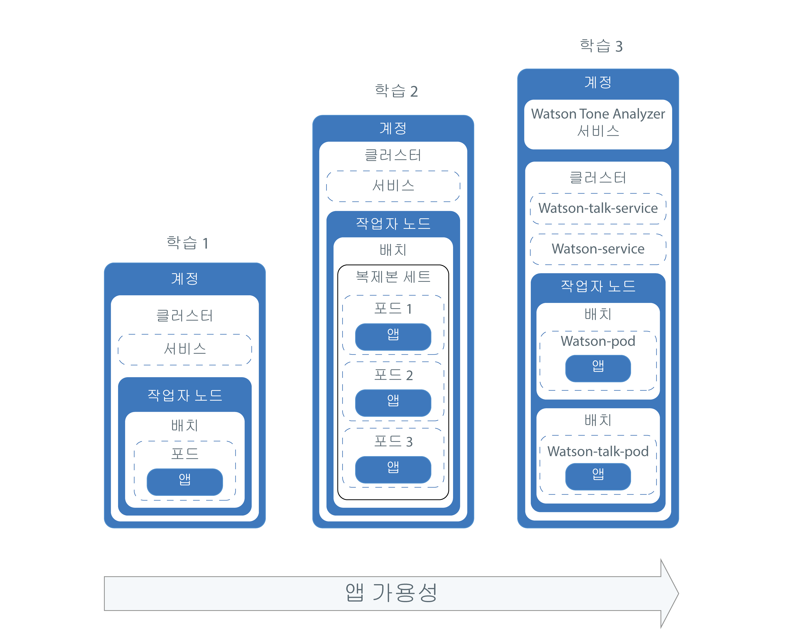
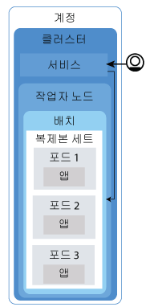
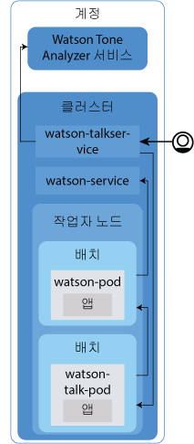

---

copyright:
  years: 2014, 2017
lastupdated: "2017-10-20"

---

{:new_window: target="blank"}
{:shortdesc: .shortdesc}
{:screen: .screen}
{:pre: .pre}
{:table: .aria-labeledby="caption"}
{:codeblock: .codeblock}
{:tip: .tip}
{:download: .download}


# 튜토리얼: 클러스터에 앱 배치
{: #cs_apps_tutorial}

이 두 번째 튜토리얼에서는 Kubernetes를 사용하여 {{site.data.keyword.watson}} {{site.data.keyword.toneanalyzershort}} {{site.data.keyword.Bluemix_notm}} 서비스를 활용하는 컨테이너화된 앱을 배치하는 방법에 대해 계속 진행합니다. 가상의 PR 회사는 {{site.data.keyword.watson}}을 사용하여 보도 자료를 분석하고 메시지의 논조에 대한 피드백을 받습니다. {:shortdesc}

이 시나리오에서 PR 회사의 앱 개발자는 앱의 Hello World 버전을 네트워크 관리자가 [첫 번째 튜토리얼](cs_tutorials.html#cs_cluster_tutorial)에서 작성한 Kubernetes 클러스터에 배치합니다. 

각각의 학습에서는 동일한 앱의 보다 복잡한 버전을 점진적으로 배치하는 방법을 사용자에게 알려줍니다. 네 번째 파트는 예외로 하고, 다이어그램은 튜토리얼의 앱 배치 컴포넌트를 보여줍니다. 

<a href="https://console.bluemix.net/docs/api/content/containers/images/cs_app_tutorial_roadmap.png"></a>

Kubernetes는 여러 다양한 유형의 리소스를 사용하여 클러스터에서 앱을 시작하고 실행합니다. Kubernetes에서는 배치와 서비스가 함께 작동합니다. 배치에는 앱에 대한 정의가 포함됩니다(예: 컨테이너에 사용할 이미지 및 앱용으로 노출해야 하는 포트). 배치를 작성하면 배치에 정의된 각 컨테이너마다 Kubernetes 포드가 작성됩니다. 앱의 복원성을 높이기 위해, 배치에서 동일 앱의 다중 인스턴스를 정의하고 Kubernetes가 사용자를 위해 복제본 세트를 자동 작성하도록 허용할 수 있습니다. 복제본 세트는 포드를 모니터하며, 항상 원하는 수의 포드가 시작되어 실행되도록 보장합니다. 포드 중 하나가 응답하지 않으면 포드가 자동으로 다시 작성됩니다. 

서비스는 포드 세트를 그룹화하며, 각 포드의 실제 사설 IP 주소를 노출함이 없이 클러스터의 기타 서비스에 대해 이러한 포드로의 네트워크 연결을 제공합니다. Kubernetes 서비스를 사용하면 클러스터 내의 기타 포드가 앱을 사용할 수 있도록 하거나 인터넷에 앱을 노출할 수 있습니다. 이 튜토리얼에서는 Kubernetes 서비스를 사용함으로써 공용 포트 및 작업자 노드에 자동 지정된 공인 IP 주소를 사용하여 인터넷에서 실행 중인 앱에 액세스할 수 있습니다. 

앱의 가용성을 한층 더 높이기 위해 표준 클러스터에서 앱의 복제본을 더 실행하도록 다중 작업자 노드를 작성할 수 있습니다. 이 튜토리얼에서는 이 태스크를 다루지 않지만 앱의 가용성에 대한 추후 개선을 위해서는 이 개념을 유념하십시오. 

학습 중 오직 하나에서만 앱에서 {{site.data.keyword.Bluemix_notm}} 서비스를 통합하는 내용을 포함하지만, 단순하거나 복잡한 앱 모두에서 원하는 대로 이를 사용할 수 있습니다. 

## 목표

* 기본 Kubernetes 용어 이해
* {{site.data.keyword.registryshort_notm}}의 레지스트리 네임스페이스에 이미지 푸시
* 앱에 공용으로 액세스하도록 설정
* Kubernetes 명령 및 스크립트를 사용하여 클러스터에서 앱의 단일 인스턴스 배치
* 상태 검사 중에 재작성된 컨테이너에서 앱의 다중 인스턴스 배치
* {{site.data.keyword.Bluemix_notm}} 서비스의 기능을 사용하는 앱 배치

## 소요 시간

40분

## 대상

이전에 Kubernetes 클러스터에서 앱을 배치해 본 적이 없는 소프트웨어 개발자 및 네트워크 관리자. 

## 전제조건

[튜토리얼: {{site.data.keyword.containershort_notm}}](cs_tutorials.html#cs_cluster_tutorial)에 Kubernetes 클러스터 작성.

## 학습 1: Kubernetes 클러스터에 단일 인스턴스 앱 배치
{: #cs_apps_tutorial_lesson1}

이 학습에서는 Hello World 앱의 단일 인스턴스를 클러스터에 배치합니다. 

<a href="https://console.bluemix.net/docs/api/content/containers/images/cs_app_tutorial_components1.png"></a>


1.  {{site.data.keyword.Bluemix_notm}} CLI에 로그인하십시오. 프롬프트가 표시되면
{{site.data.keyword.Bluemix_notm}} 신임 정보를 입력하십시오. {{site.data.keyword.Bluemix_notm}} 지역을 지정하려면 [API 엔드포인트를 포함](cs_regions.html#bluemix_regions)하십시오.

    ```
           bx login
          ```
    {: pre}

    **참고:** 연합 ID가 있는 경우 `bx login --sso`를 사용하여 {{site.data.keyword.Bluemix_notm}} CLI에 로그인하십시오. 사용자 이름을 입력하고 CLI 출력에서 제공된 URL을 사용하여 일회성 패스코드를 검색하십시오. `--sso`가 없으면 로그인에 실패하고 `--sso` 옵션을 사용하면 성공하는 경우에는 연합 ID를 보유 중임을 알 수 있습니다. 

2.  CLI에서 클러스터의 컨텍스트를 설정하십시오. 
    1.  환경 변수를 설정하기 위한 명령을 가져오고 Kubernetes 구성 파일을 다운로드하십시오. 

        ```
        bx cs cluster-config <pr_firm_cluster>
        ```
        {: pre}

        구성 파일 다운로드가 완료되면 환경 변수로서 경로를 로컬 Kubernetes 구성 파일로 설정하는 데 사용할 수 있는 명령이 표시됩니다. 

        OS X에 대한 예:

        ```
        export KUBECONFIG=/Users/<user_name>/.bluemix/plugins/container-service/clusters/<pr_firm_cluster>/kube-config-prod-dal10-pr_firm_cluster.yml
        ```
        {: screen}

    2.  `KUBECONFIG` 환경 변수를 설정하려면 터미널에 표시되는 명령을 복사하고 붙여넣기하십시오. 
    3.  `KUBECONFIG` 환경 변수가 올바르게 설정되었는지 확인하십시오. 

        OS X에 대한 예:

        ```
        echo $KUBECONFIG
        ```
        {: pre}

        출력:

        ```
        /Users/<user_name>/.bluemix/plugins/container-service/clusters/<pr_firm_cluster>/kube-config-prod-dal10-pr_firm_cluster.yml
        ```
        {: screen}

    4.  Kubernetes CLI 서버 버전을 확인하여 `kubectl` 명령이 올바르게 실행되는지 확인하십시오. 

        ```
        kubectl version  --short
        ```
        {: pre}

        출력 예: 

        ```
        Client Version: v1.7.4
        Server Version: v1.7.4
        ```
        {: screen}

3.  Docker를 시작하십시오.
    * Docker CE를 사용 중인 경우에는 조치가 필요하지 않습니다. 
    * Linux를 사용 중인 경우에는 [Docker 문서](https://docs.docker.com/engine/admin/)를 따라 사용하는 Linux 배포판에 따라 Docker를 시작하는 방법에 대한 지시사항을 찾으십시오.
    * Windows 또는 OSX에서 Docker Toolbox를 사용 중인 경우에는 사용자를 위해 Docker를 시작하는 Docker Quickstart Terminal을 사용할 수 있습니다. 다음의 일부 단계에 대해 Docker Quickstart Terminal을 사용하여 Docker 명령을 실행한 후에 사용자가 `KUBECONFIG` 세션 변수를 설정하는 CLI로 다시 전환하십시오. 
        * Docker QuickStart Terminal을 사용 중인 경우에는 {{site.data.keyword.Bluemix_notm}} CLI 로그인 명령을 다시 실행하십시오. 

          ```
           bx login
          ```
          {: pre}

4.  {{site.data.keyword.registryshort_notm}} CLI에 로그인하십시오. **참고:** 컨테이너 레지스트리 플러그인이 [설치](/docs/services/Registry/index.html#registry_cli_install)되어 있는지 확인하십시오.

    ```
    bx cr login
    ```
    {: pre}

    -   {{site.data.keyword.registryshort_notm}}의 네임스페이스를 잊은 경우에는 다음 명령을 실행하십시오. 

        ```
         bx cr namespace-list
        ```
        {: pre}

5.  [Hello world 앱 ](https://github.com/IBM/container-service-getting-started-wt)의 소스 코드를 사용자 홈 디렉토리에 복제하거나 다운로드하십시오.

    ```
    git clone https://github.com/IBM/container-service-getting-started-wt.git
    ```
    {: pre}

    저장소를 다운로드한 경우에는 압축된 파일의 압축을 푸십시오.


    예:

    * Windows: `C:Users\<my_username>\container-service-getting-started-wt`
    * OS X: `/Users/<my_username>/container-service-getting-started-wt`

    저장소에는 이름이 `Stage1`, `Stage2` 및 `Stage3`인 폴더에 유사한 앱의 세 버전이 포함되어 있습니다. 각 버전에는 다음 파일이 포함되어 있습니다. 
    * `Dockerfile`: 이미지의 빌드 정의
    * `app.js`: Hello world 앱
    * `package.json`: 앱에 대한 메타데이터

6.  첫 번째 앱 디렉토리인 `Stage1`로 이동하십시오. 

    ```
     cd <username_home_directory>/container-service-getting-started-wt/Stage1
    ```
    {: pre}

7.  `Stage1` 디렉토리의 앱 파일을 포함하는 Docker 이미지를 빌드하십시오. 향후 앱을 변경해야 하는 경우에는 다음 단계를 반복하여 이미지의 다른 버전을 작성하십시오. 

    1.  로컬로 이미지를 빌드한 후에 사용하고자 하는 이름과 태그 및 이전 튜토리얼의 {{site.data.keyword.registryshort_notm}}에서 작성된 네임스페이스로 해당 태그를 지정하십시오. 네임스페이스 정보로 이미지의 태그를 지정하면 나중 단계에서 이미지를 푸시할 위치를 Docker에게 알려줍니다. 이미지 이름에서는 소문자 영숫자 문자나 밑줄(`_`)만 사용하십시오. 명령의 끝에는 반드시 마침표(`.`)를 사용하십시오. 마침표는 이미지를 빌드하기 위한 빌드 아티팩트 및 Dockerfile을 현재 디렉토리 내에서 찾도록 Docker에 지시합니다. 

        ```
        docker build -t registry.<region>.bluemix.net/<namespace>/hello-world:1 .
        ```
        {: pre}

        빌드가 완료되면 성공 메시지가 나타나는지 확인하십시오. 

        ```
        Successfully built <image_id>
        ```
        {: screen}

    2.  이미지를 레지스트리 네임스페이스로 푸시하십시오. 

        ```
        docker push registry.<region>.bluemix.net/<namespace>/hello-world:1
        ```
        {: pre}

        출력:

        ```
        The push refers to a repository [registry.<region>.bluemix.net/<namespace>/hello-world]
        ea2ded433ac8: Pushed
        894eb973f4d3: Pushed
        788906ca2c7e: Pushed
        381c97ba7dc3: Pushed
        604c78617f34: Pushed
        fa18e5ffd316: Pushed
        0a5e2b2ddeaa: Pushed
        53c779688d06: Pushed
        60a0858edcd5: Pushed
        b6ca02dfe5e6: Pushed
        1: digest: sha256:0d90cb73288113bde441ae9b8901204c212c8980d6283fbc2ae5d7cf652405
        43 size: 2398
        ```
        {: screen}

        다음 단계를 계속하기 전에 이미지가 푸시되기를 기다리십시오. 

    3.  Docker Quickstart Terminal을 사용 중인 경우에는 `KUBECONFIG` 세션 변수의 설정에 사용된 CLI로 다시 전환하십시오. 

    4.  이미지가 네임스페이스에 정상적으로 추가되었는지 확인하십시오. 

        ```
        bx cr images
        ```
        {: pre}

        출력:

        ```
        Listing images...

        REPOSITORY                                  NAMESPACE   TAG       DIGEST         CREATED        SIZE     VULNERABILITY STATUS
        registry.<region>.bluemix.net/<namespace>/hello-world   <namespace>   1   0d90cb732881   1 minute ago   264 MB   OK
        ```
        {: screen}

8.  클러스터의 포드에 앱을 배치할 수 있도록 이름이 _hello-world-deployment_인 Kubernetes 배치를 작성하십시오. 배치는 포드를 관리하는 데 사용되며, 여기에는 컨테이너화된 앱의 인스턴스가 포함됩니다. 다음 배치에서는 단일 포드에서 앱을 배치합니다. 

    ```
    kubectl run hello-world-deployment --image=registry.<region>.bluemix.net/<namespace>/hello-world:1
    ```
    {: pre}

    출력:

    ```
    deployment "hello-world-deployment" created
    ```
    {: screen}

    이 배치에서 앱의 단일 인스턴스만 작성하므로, 앱의 둘 이상의 인스턴스가 작성되는 나중 학습에서 수행하는 것보다는 배치가 더 빠르게 작성됩니다. 

9.  NodePort 서비스로서 배치를 노출하여 외부에서 앱에 액세스할 수 있도록 하십시오. 서비스는 앱에 대한 네트워킹을 적용합니다. 클러스터에 여럿이 아닌 하나의 작업자 노드만 있으므로, 작업자 노드 간의 로드 밸런싱은 필요하지 않습니다. 따라서 NodePort를 사용하여 사용자에게 앱에 대한 외부 액세스를 제공할 수 있습니다. Cloud Foundry 앱에 대한 포트의 노출과 마찬가지로, 노출되는 NodePort는 작업자 노드가 트래픽을 청취하는 포트입니다. 나중 단계에서 사용자는 서비스에 랜덤하게 지정된 NodePort를 보게 됩니다. 

    ```
    kubectl expose deployment/hello-world-deployment --type=NodePort --port=8080 --name=hello-world-service --target-port=8080
    ```
    {: pre}

    출력:

    ```
    service "hello-world-service" exposed
    ```
    {: screen}

    <table>
    <table summary=“Information about the expose command parameters.”>
    <caption>표 1. 명령어 매개변수</caption>
    <thead>
    <th colspan=2> expose 매개변수에 대한 자세한 정보</th>
    </thead>
    <tbody>
    <tr>
    <td><code>expose</code></td>
    <td>리소스를 Kubernetes 서비스로서 노출하고 이를 사용자가 공용으로 사용할 수 있도록 합니다. </td>
    </tr>
    <tr>
    <td><code>deployment/<em>&lt;hello-world-deployment&gt;</em></code></td>
    <td>이 서비스에서 노출할 리소스의 리소스 유형 및 이름입니다. </td>
    </tr>
    <tr>
    <td><code>--name=<em>&lt;hello-world-service&gt;</em></code></td>
    <td>서비스의 이름입니다. </td>
    </tr>
    <tr>
    <td><code>--port=<em>&lt;8080&gt;</em></code></td>
    <td>서비스를 제공해야 하는 포트입니다.</td>
    </tr>
    <tr>
    <td><code>--type=NodePort</code></td>
    <td>작성할 서비스 유형입니다. </td>
    </tr>
    <tr>
    <td><code>--target-port=<em>&lt;8080&gt;</em></code></td>
    <td>서비스가 트래픽을 지정하는 대상 포트입니다. 이 경우에는 target-port가 port와 동일하지만 사용자가 작성하는 기타 앱의 경우에는 서로 다를 수 있습니다. </td>
    </tr>
    </tbody></table>

    이제 모든 배치 작업이 완료되었으므로, 모든 결과를 보고 확인할 수 있습니다. 

10. 브라우저에서 앱을 테스트하려면 URL 구성을 위한 세부사항을 가져오십시오. 
    1.  서비스에 대한 정보를 가져와서 지정된 NodePort를 확인하십시오. 

        ```
        kubectl describe service <hello-world-service>
        ```
        {: pre}

        출력:

        ```
        Name:                   hello-world-service
        Namespace:              default
        Labels:                 run=hello-world-deployment
        Selector:               run=hello-world-deployment
        Type:                   NodePort
        IP:                     10.10.10.8
        Port:                   <unset> 8080/TCP
        NodePort:               <unset> 30872/TCP
        Endpoints:              172.30.171.87:8080
        Session Affinity:       None
        No events.
        ```
        {: screen}

        `expose` 명령으로 생성될 때 NodePort는 랜덤으로 지정되지만, 범위는 30000-32767 사이입니다. 이 예에서 NodePort는 30872입니다. 

    2.  클러스터의 작업자 노드에 대한 공인 IP 주소를 가져오십시오. 

        ```
        bx cs workers <pr_firm_cluster>
        ```
        {: pre}

        출력:

        ```
        Listing cluster workers...
        OK
        ID                                            Public IP        Private IP      Machine Type   State      Status
        dal10-pa10c8f571c84d4ac3b52acbf50fd11788-w1   169.47.227.138   10.171.53.188   free           normal    Ready
        ```
        {: screen}

11. 브라우저를 열고 `http://<IP_address>:<NodePort>` URL로 앱을 확인하십시오. 예제 값에서 URL은 `http://169.47.227.138:30872`입니다. 브라우저에서 해당 URL을 입력하면 다음 텍스트가 나타납니다.


    ```
     Hello world! Your app is up and running in a cluster!
    ```
    {: screen}

    Hello World 앱이 실제로 공용으로 사용 가능한지 확인하려면 동료에게 이 URL에 접속해 보도록 요청하거나 자신의 휴대전화 브라우저를 통해 이 주소에 접속해 볼 수 있습니다. 

12. 기본 포트 8001로 Kubernetes 대시보드를 실행하십시오. 
    1.  기본 포트 번호로 프록시를 설정하십시오. 

        ```
        kubectl proxy
        ```
         {: pre}

        ```
        Starting to serve on 127.0.0.1:8001
       ```
        {: screen}

    2.  웹 브라우저에서 다음 URL을 열어서 Kubernetes 대시보드를 보십시오. 

        ```
        http://localhost:8001/ui
        ```
         {: pre}

13. **워크로드** 탭에서, 작성된 리소스를 볼 수 있습니다. Kubernetes 대시보드의 탐색이 완료되면 CTRL+C를 사용하여 `proxy` 명령을 종료하십시오. 

축하합니다! 앱의 첫 번째 버전이 배치되었습니다. 

이 학습에서 너무 많은 명령이 사용되었다고 생각하십니까? 맞습니다. 사용자를 대신하여 일부 작업을 수행하도록 구성 스크립트를 사용해 보시는 건 어떻습니까? 앱의 두 번째 버전에 대한 구성 스크립트를 사용하고 해당 앱의 다중 인스턴스를 배치하여 보다 높은 가용성을 만들려면 다음 학습을 계속하십시오. 

## 학습 2: 보다 높은 가용성의 앱 배치 및 업데이트
{: #cs_apps_tutorial_lesson2}

이 학습에서는 앱의 첫 번째 버전보다 높은 가용성을 위해 클러스터에 Hello World 앱의 세 인스턴스를 배치합니다. 보다 높은 가용성이란 사용자 액세스가 세 인스턴스 간에 분리됨을 의미합니다. 너무 많은 사용자가 동일한 앱 인스턴스에 액세스하려고 시도하는 경우, 사용자는 응답 시간이 느려짐을 감지할 수 있습니다. 다중 인스턴스는 사용자에 대한 보다 빠른 응답 시간을 의미할 수 있습니다. 이 학습에서는 Kubernetes에서 상태 검사와 배치 업데이트가 작동하는 방법도 알아봅니다. 


<a href="https://console.bluemix.net/docs/api/content/containers/images/cs_app_tutorial_components2.png"></a>


구성 스크립트에 정의된 대로, Kubernetes는 가용성 검사를 사용하여 포드의 컨테이너가 실행 중인지 여부를 확인할 수 있습니다. 예를 들어, 이러한 검사를 통해 교착 상태(앱이 실행 중이지만 더 이상 진행할 수 없는 상태)를 발견할 수 있습니다. 이 상태에 있는 컨테이너를 다시 시작하면 버그에도 불구하고 앱의 가용성을 높이는 데 도움이 됩니다. 그리고 Kubernetes는 준비성 검사를 사용하여 컨테이너가 트래픽 재승인을 시작할 준비가 된 시점을 알 수 있습니다. 해당 컨테이너가 준비되면 포드가 준비된 것으로 간주됩니다. 포드가 준비되면 이는 다시 시작됩니다. Stage2 앱에서는 매 15초마다 앱의 제한시간이 초과됩니다. 구성 스크립트에서 상태 검사가 구성된 경우, 컨테이너는 상태 검사에서 앱의 문제를 발견할 때 재작성됩니다. 

1.  CLI에서, 두 번째 앱 디렉토리인 `Stage2`로 이동하십시오. Windows 또는 OS X용 Docker Toolbox를 사용 중인 경우에는 Docker Quickstart Terminal을 사용하십시오. 

  ```
  cd <username_home_directory>/container-service-getting-started-wt/Stage2
  ```
  {: pre}

2.  이미지로서 로컬로 앱의 두 번째 버전을 빌드하고 태그를 지정하십시오. 역시 명령의 끝에는 반드시 마침표(`.`)를 사용하십시오. 

  ```
  docker build -t registry.<region>.bluemix.net/<namespace>/hello-world:2 .
  ```
  {: pre}

  성공 메시지가 표시되는지 확인하십시오. 

  ```
  Successfully built <image_id>
  ```
  {: screen}

3.  레지스트리 네임스페이스에서 이미지의 두 번째 버전을 푸시하십시오. 다음 단계를 계속하기 전에 이미지가 푸시되기를 기다리십시오. 

  ```
  docker push registry.<region>.bluemix.net/<namespace>/hello-world:2
  ```
  {: pre}

  출력:

  ```
  The push refers to a repository [registry.<region>.bluemix.net/<namespace>/hello-world]
  ea2ded433ac8: Pushed
  894eb973f4d3: Pushed
  788906ca2c7e: Pushed
  381c97ba7dc3: Pushed
  604c78617f34: Pushed
  fa18e5ffd316: Pushed
  0a5e2b2ddeaa: Pushed
  53c779688d06: Pushed
  60a0858edcd5: Pushed
  b6ca02dfe5e6: Pushed
  1: digest: sha256:0d90cb73288113bde441ae9b8901204c212c8980d6283fbc2ae5d7cf652405
  43 size: 2398
  ```
  {: screen}

4.  Docker Quickstart Terminal을 사용 중인 경우에는 `KUBECONFIG` 세션 변수의 설정에 사용된 CLI로 다시 전환하십시오. 
5.  이미지가 레지스트리 네임스페이스에 정상적으로 추가되었는지 확인하십시오. 

    ```
    bx cr images
    ```
     {: pre}

    출력:

    ```
    Listing images...

    REPOSITORY                                 NAMESPACE  TAG  DIGEST        CREATED        SIZE     VULNERABILITY STATUS
    registry.<region>.bluemix.net/<namespace>/hello-world  <namespace>  1    0d90cb732881  30 minutes ago 264 MB   OK
    registry.<region>.bluemix.net/<namespace>/hello-world  <namespace>  2    c3b506bdf33e  1 minute ago   264 MB   OK
    ```
    {: screen}

6.  텍스트 편집기로 `<username_home_directory>/container-service-getting-started-wt/Stage2/healthcheck.yml` 파일을 여십시오. 이 구성 스크립트는 이전 학습의 일부 단계를 결합하여 배치와 서비스를 동시에 작성합니다. PR 회사의 앱 개발자는 포드를 재작성하여 문제를 해결하기 위해 또는 업데이트가 작성될 때 이러한 스크립트를 사용할 수 있습니다. 

    1.  **배치** 섹션에서 `replicas`에 주목하십시오. 복제본은 앱의 숫자 인스턴스입니다. 3개의 인스턴스를 실행하면 단지 하나의 인스턴스보다는 앱의 가용성이 더 높아집니다. 

        ```
        replicas: 3
        ```
        {: pre}

    2.  개인용 레지스트리 네임스페이스에서 이미지에 대한 세부사항을 업데이트하십시오. 

        ```
        image: "registry.<region>.bluemix.net/<namespace>/hello-world:2"
        ```
        {: pre}

    3.  매 5초마다 컨테이너의 상태를 검사하는 HTTP 활성 상태(liveness) 프로브에 주목하십시오. 

        ```
        livenessProbe:
                    httpGet:
                      path: /healthz
                      port: 8080
                    initialDelaySeconds: 5
                    periodSeconds: 5
        ```
        {: codeblock}

    4.  **서비스** 섹션에서 `NodePort`에 주목하십시오. 이전 학습처럼 랜덤 NodePort를 생성하는 대신, 30000 - 32767 범위의 포트를 지정할 수 있습니다. 이 예에서는 30072를 사용합니다. 

7.  클러스터에서 구성 스크립트를 실행하십시오. 배치와 서비스가 작성되면, PR 회사의 사용자가 볼 수 있도록 앱이 사용 가능합니다. 

  ```
  kubectl apply -f <username_home_directory>/container-service-getting-started-wt/Stage2/healthcheck.yml
  ```
  {: pre}

  출력:

  ```
  deployment "hw-demo-deployment" created
  service "hw-demo-service" created
  ```
  {: screen}

  이제 모든 배치가 완료되었으므로, 모든 결과를 확인하십시오. 추가 인스턴스가 실행 중이므로 사용자는 속도가 다소 느려짐을 감지할 수 있습니다. 

8.  브라우저를 열고 앱을 확인하십시오. URL을 구성하려면, 작업자 노드에 대해 이전 학습에서 사용한 것과 동일한 공인 IP 주소를 가져와서 이를 구성 스크립트에 지정된 NodePort와 결합하십시오. 작업자 노드의 공인 IP 주소를 가져오려면 다음을 수행하십시오. 

  ```
  bx cs workers <pr_firm_cluster>
  ```
  {: pre}

  예제 값에서 URL은 `http://169.47.227.138:30072`입니다. 브라우저에서 다음 텍스트를 볼 수 있습니다. 이 텍스트가 보이지 않아도 염려하지 마십시오. 이 앱은 위아래로 이동 가능합니다. 

  ```
  Hello world! Great job getting the second stage up and running!
  ```
  {: screen}

  `http://169.47.227.138:30072/healthz`에서 상태도 확인할 수 있습니다.

  처음 10 - 15초 동안 200개의 메시지가 리턴됩니다. 따라서 앱이 정상적으로 실행 중임을 알 수 있습니다. 이 15초 이후에는 앱에서 설계된 대로 제한시간 초과 메시지가 표시됩니다.


  ```
  {
    "error": "Timeout, Health check error!"
  }
  ```
  {: screen}

9.  기본 포트 8001로 Kubernetes 대시보드를 실행하십시오. 
    1.  기본 포트 번호로 프록시를 설정하십시오. 

        ```
        kubectl proxy
        ```
        {: pre}

        출력:

        ```
        Starting to serve on 127.0.0.1:8001
       ```
        {: screen}

    2.  웹 브라우저에서 다음 URL을 열어서 Kubernetes 대시보드를 보십시오. 

        ```
        http://localhost:8001/ui
        ```
        {: codeblock}

10. **워크로드** 탭에서, 작성된 리소스를 볼 수 있습니다. 이 탭에서 새로 고치기를 계속 수행하여 상태 검사가 작동 중인지 볼 수 있습니다. **y포드** 섹션에서는 내부의 컨테이너가 재작성될 때 포드가 다시 시작되는 횟수를 볼 수 있습니다. 대시보드에서 다음 오류를 발견하는 경우, 이 메시지는 상태 검사에서 문제점을 발견했음을 표시합니다. 잠시 기다린 후에 새로 고치기를 다시 수행하십시오. 각 포드마다 재시작 횟수가 변경됨을 볼 수 있습니다. 

    ```
    Liveness probe failed: HTTP probe failed with statuscode: 500
    Back-off restarting failed docker container
    Error syncing pod, skipping: failed to "StartContainer" for "hw-container" with CrashLoopBackOff: "Back-off 1m20s restarting failed container=hw-container pod=hw-demo-deployment-3090568676-3s8v1_default(458320e7-059b-11e7-8941-56171be20503)"
    ```
    {: screen}

    Kubernetes 대시보드의 탐색이 완료되면, CLI에서 CTRL+C를 입력하여 `proxy` 명령을 종료하십시오. 


축하합니다! 앱의 두 번째 버전을 배치했습니다. 보다 적은 명령을 사용해야 했고, 상태 검사의 작동 방법을 알았으며, 배치를 편집했습니다. 대단합니다! Hello world 앱이 PR 회사의 테스트를 통과했습니다. 이제 PR 회사가 보도 자료의 분석을 시작하도록 보다 유용한 앱을 배치할 수 있습니다. 

계속하기 전에 작성한 내용을 삭제할 준비가 되었습니까? 지금은 동일한 구성 스크립트를 사용하여 작성된 두 리소스를 모두 삭제할 수 있습니다. 

```
kubectl delete -f <username_home_directory>/container-service-getting-started-wt/Stage2/healthcheck.yml
```
{: pre}

출력:

```
deployment "hw-demo-deployment" deleted
service "hw-demo-service" deleted
```
{: screen}

## 학습 3: Watson Tone Analyzer 앱의 배치 및 업데이트
{: #cs_apps_tutorial_lesson3}

이전 학습에서 앱은 단일 작업자 노드의 단일 컴포넌트로서 배치되었습니다. 이 학습에서는 이전 튜토리얼에서 클러스터에 추가한 Watson Tone Analyzer 서비스를 사용하는 클러스터에 앱의 2개 컴포넌트를 배치합니다. 컴포넌트를 서로 다른 컨테이너로 분리하면 다른 쪽에 영향을 주지 않고 하나를 업데이트할 수 있습니다. 그리고 사용자는 보다 높은 가용성을 구축하기 위해 추가 복제본으로 확장되도록 앱을 업데이트합니다. 

<a href="https://console.bluemix.net/docs/api/content/containers/images/cs_app_tutorial_components3.png"></a>


### 학습 3a: Watson Tone Analyzer 앱 배치
{: #lesson3a}

1.  CLI에서, 세 번째 앱 디렉토리인 `Stage3`으로 이동하십시오. Windows 또는 OS X용 Docker Toolbox를 사용 중인 경우에는 Docker Quickstart Terminal을 사용하십시오. 

  ```
  cd <username_home_directory>/container-service-getting-started-wt/Stage3
  ```
  {: pre}

2.  첫 번째 {{site.data.keyword.watson}} 이미지를 빌드하십시오.

    1.  `watson` 디렉토리로 이동하십시오. 

        ```
        cd watson
        ```
        {: pre}

    2.  이미지로서 로컬로 앱의 첫 번째 버전을 빌드하고 태그를 지정하십시오. 역시 명령의 끝에는 반드시 마침표(`.`)를 사용하십시오. 

        ```
        docker build -t registry.<region>.bluemix.net/<namespace>/watson .
        ```
        {: pre}

        성공 메시지가 표시되는지 확인하십시오. 

        ```
        Successfully built <image_id>
        ```
        {: screen}

    3.  개인용 레지스트리 네임스페이스에서 이미지로서 앱의 첫 번째 파트를 푸시하십시오. 다음 단계를 계속하기 전에 이미지가 푸시되기를 기다리십시오. 

        ```
        docker push registry.<region>.bluemix.net/<namespace>/watson
        ```
        {: pre}

3.  두 번째 {{site.data.keyword.watson}}-talk 이미지를 빌드하십시오.

    1.  `watson-talk` 디렉토리로 이동하십시오. 

        ```
        cd <username_home_directory>/container-service-getting-started-wt/Stage3/watson-talk
        ```
        {: pre}

    2.  이미지로서 로컬로 앱의 두 번째 파트를 빌드하고 태그를 지정하십시오. 역시 명령의 끝에는 반드시 마침표(`.`)를 사용하십시오. 

        ```
        docker build -t registry.<region>.bluemix.net/<namespace>/watson-talk .
        ```
        {: pre}

        성공 메시지가 표시되는지 확인하십시오. 

        ```
        Successfully built <image_id>
        ```
        {: screen}

    3.  개인용 레지스트리 네임스페이스에 앱의 두 번째 파트를 푸시하십시오. 다음 단계를 계속하기 전에 이미지가 푸시되기를 기다리십시오. 

        ```
        docker push registry.<region>.bluemix.net/<namespace>/watson-talk
        ```
        {: pre}

4.  Docker Quickstart Terminal을 사용 중인 경우에는 `KUBECONFIG` 세션 변수의 설정에 사용된 CLI로 다시 전환하십시오. 

5.  이미지가 레지스트리 네임스페이스에 정상적으로 추가되었는지 확인하십시오. 

    ```
    bx cr images
    ```
    {: pre}

    출력:

    ```
    Listing images...

    REPOSITORY                                  NAMESPACE  TAG            DIGEST         CREATED         SIZE     VULNERABILITY STATUS
    registry.<region>.bluemix.net/namespace/hello-world   namespace  1              0d90cb732881   40 minutes ago  264 MB   OK
    registry.<region>.bluemix.net/namespace/hello-world   namespace  2              c3b506bdf33e   20 minutes ago  264 MB   OK
    registry.<region>.bluemix.net/namespace/watson        namespace  latest         fedbe587e174   3 minutes ago   274 MB   OK
    registry.<region>.bluemix.net/namespace/watson-talk   namespace  latest         fedbe587e174   2 minutes ago   274 MB   OK
    ```
    {: screen}

6.  텍스트 편집기로 `<username_home_directory>/container-service-getting-started-wt/Stage3/watson-deployment.yml` 파일을 여십시오. 이 구성 스크립트에는 앱의 watson 및 watson-talk 컴포넌트 둘 다에 대한 배치와 서비스가 포함되어 있습니다. 

    1.  두 배치 모두에 대해 레지스트리 네임스페이스의 이미지에 대한 세부사항을 업데이트하십시오. 

        watson:


        ```
        image: "registry.<region>.bluemix.net/namespace/watson"
        ```
        {: codeblock}

        watson-talk:


        ```
        image: "registry.<region>.bluemix.net/namespace/watson-talk"
        ```
        {: codeblock}

    2.  Watson 배치의 볼륨 섹션에서, 이전 튜토리얼에서 작성한 {{site.data.keyword.watson}} {{site.data.keyword.toneanalyzershort}} 시크릿의 이름을 업데이트하십시오. 배치에 대한 볼륨으로 Kubernetes 시크릿을 마운트하면 포드에서 실행 중인 컨테이너에서 {{site.data.keyword.Bluemix_notm}} 서비스 신임 정보를 사용할 수 있습니다. 이 튜토리얼의 {{site.data.keyword.watson}} 앱 컴포넌트는 볼륨 마운트 경로를 사용하여 서비스 신임 정보를 찾도록 구성되어 있습니다. 

        ```
        volumes:
                - name: service-bind-volume
                  secret:
                    defaultMode: 420
                    secretName: binding-<mytoneanalyzer>
        ```
        {: codeblock}

        시크릿에 지정한 이름을 잊은 경우에는 다음 명령을 실행하십시오. 

        ```
        kubectl get secrets --namespace=default
        ```
        {: pre}

    3.  watson-talk 서비스 섹션에서, `NodePort`에 대해 설정된 값에 주목하십시오. 이 예에서는 30080을 사용합니다. 

7.  구성 스크립트를 실행하십시오.

  ```
  kubectl apply -f <username_home_directory>/container-service-getting-started-wt/Stage3/watson-deployment.yml
  ```
  {: pre}

8.  선택사항: {{site.data.keyword.watson}} {{site.data.keyword.toneanalyzershort}} 시크릿이 포드에 대한 볼륨으로 마운트되었는지 확인하십시오. 

    1.  Watson 포드의 이름을 가져오려면 다음 명령을 실행하십시오. 

        ```
            kubectl get pods
            ```
        {: pre}

        출력:

        ```
        NAME                                 READY     STATUS    RESTARTS  AGE
        watson-pod-4255222204-rdl2f          1/1       Running   0         13h
        watson-talk-pod-956939399-zlx5t      1/1       Running   0         13h
        ```
        {: screen}

    2.  포드에 대한 세부사항을 가져오고 시크릿 이름을 찾으십시오. 

        ```
        kubectl describe pod <pod_name>
        ```
        {: pre}

        출력:

        ```
        Volumes:
          service-bind-volume:
            Type:       Secret (a volume populated by a Secret)
            SecretName: binding-mytoneanalyzer
          default-token-j9mgd:
            Type:       Secret (a volume populated by a Secret)
            SecretName: default-token-j9mgd
        ```
        {: codeblock}

9.  브라우저를 열고 일부 텍스트를 분석하십시오. IP 주소의 예에서 URL의 형식은 `http://<worker_node_IP_address>:<watson-talk-nodeport>/analyze/"<text_to_analyze>"`입니다. 예:

    ```
    http://169.47.227.138:30080/analyze/"Today is a beautiful day"
    ```
    {: codeblock}

    브라우저에서 사용자는 입력한 텍스트의 JSON 응답을 볼 수 있습니다. 

10. 기본 포트 8001로 Kubernetes 대시보드를 실행하십시오. 

    1.  기본 포트 번호로 프록시를 설정하십시오. 

        ```
        kubectl proxy
        ```
        {: pre}

        ```
        Starting to serve on 127.0.0.1:8001
       ```
        {: screen}

    2.  웹 브라우저에서 다음 URL을 열어서 Kubernetes 대시보드를 보십시오. 

        ```
        http://localhost:8001/ui
        ```
        {: codeblock}

11. **워크로드** 탭에서, 작성된 리소스를 볼 수 있습니다. Kubernetes 대시보드의 탐색이 완료되면 CTRL+C를 사용하여 `proxy` 명령을 종료하십시오. 

### 학습 3b. 실행 중인 Watson Tone Analyzer 배치 업데이트
{: #lesson3b}

배치가 실행 중인 동안에 포드 템플리트에서 배치를 편집하여 값을 변경할 수 있습니다. 이 학습에는 사용된 이미지 업데이트가 포함됩니다. 

1.  이미지의 이름을 변경하십시오. PR 회사는 같은 배치에서 다른 앱을 사용해 보려고 하지만 새 앱에서 문제가 발견되면 롤백하기 원합니다. 

    1.  실행 중인 배치에 대한 구성 스크립트를 여십시오. 

        ```
        kubectl edit deployment/watson-talk-pod
        ```
        {: pre}

        운영 체제에 따라, vi 편집기가 열리거나 텍스트 편집기가 열립니다. 

    2.  이미지의 이름을 ibmliberty 이미지로 변경하십시오. 

        ```
        spec:
              containers:
              - image: registry.<region>.bluemix.net/ibmliberty:latest
        ```
        {: codeblock}

    3.  변경사항을 저장하고 편집기를 종료하십시오.

    4.  구성 스크립트의 변경사항을 실행 중인 배치에 적용하십시오. 

        ```
        kubectl rollout status deployment/watson-talk-pod
        ```
        {: pre}

        롤아웃이 완료되었음이 확인될 때까지 기다리십시오. 

        ```
        deployment "watson-talk-pod" successfully rolled out
        ```
        {: screen}

        롤아웃을 변경하면 다른 포드가 작성되고 Kubernetes에서 테스트합니다. 테스트를 통과하면 이전 포드는 제거됩니다. 

    5.  변경사항이 예상한 대로 나타나지 않으면 변경사항을 롤백할 수 있습니다. PR 회사의 직원이 앱 변경에서 실수를 범했을 수 있으며, 이전 배치로 되돌아가야 합니다. 

        1.  이전 배치의 번호를 식별하려면 개정 버전 번호를 보십시오. 가장 높은 번호가 최신 개정입니다. 이 예에서는 개정 1이 원래 배치이고 개정 2가 이전 단계에서 만든 이미지 변경입니다. 

            ```
            kubectl rollout history deployment/watson-talk-pod
            ```
            {: pre}

            출력:

            ```
            deployments "watson-talk-pod"
            REVISION CHANGE-CAUSE
            1          <none>
            2          <none>

            ```
            {: screen}

        2.  다음 명령을 실행하여 배치를 이전 개정으로 되돌리십시오. 다시 다른 포드가 작성되고 Kubernetes에서 테스트합니다. 테스트를 통과하면 이전 포드는 제거됩니다. 

            ```
            kubectl rollout undo deployment/watson-talk-pod --to-revision=1
            ```
            {: pre}

            출력:

            ```
            deployment "watson-talk-pod" rolled back
            ```
            {: screen}

        3.  다음 단계에서 사용할 포드의 이름을 가져오십시오. 

            ```
            kubectl get pods
            ```
            {: pre}

            출력:

            ```
            NAME                              READY     STATUS    RESTARTS   AGE
            watson-talk-pod-2511517105-6tckg  1/1       Running   0          2m
            ```
            {: screen}

        4.  포드의 세부사항을 보고 이미지가 롤백되었는지 확인하십시오. 

            ```
            kubectl describe pod <pod_name>
            ```
            {: pre}

            출력:

            ```
            Image: registry.<region>.bluemix.net/namespace/watson-talk
            ```
            {: screen}

2.  선택사항: watson-pod 배치에 대해 변경을 반복하십시오. 

[배운 내용을 테스트하고 퀴즈를 풀어보십시오! ](https://bluemix-quizzes.mybluemix.net/containers/apps_tutorial/quiz.php)

축하합니다! Watson Tone Analyzer 앱이 배치되었습니다. PR 회사가 확실히 해당 보도 자료의 분석을 시작하기 위해 앱의 이 배치를 사용하기 시작할 수 있습니다. 

작성한 내용을 삭제할 준비가 되었습니까? 구성 스크립트를 사용하여 작성한 리소스를 삭제할 수 있습니다. 

```
kubectl delete -f <username_home_directory>/container-service-getting-started-wt/Stage3/watson-deployment.yml
```
{: pre}

출력:

```
deployment "watson-pod" deleted
deployment "watson-talk-pod" deleted
service "watson-service" deleted
service "watson-talk-service" deleted
```
{: screen}

클러스터를 유지하기를 원하지 않으면 삭제할 수도 있습니다. 

```
bx cs cluster-rm <pr_firm_cluster>
```
{: pre}

## 다음 단계

[developerWorks ](https://developer.ibm.com/code/journey/category/container-orchestration/)에서 컨테이너 오케스트레이션 과정을 알아보십시오.
