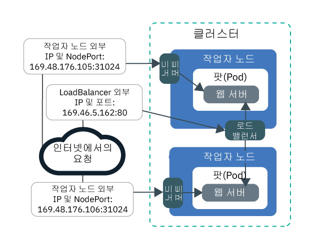
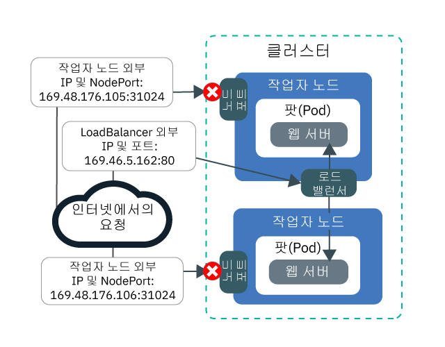
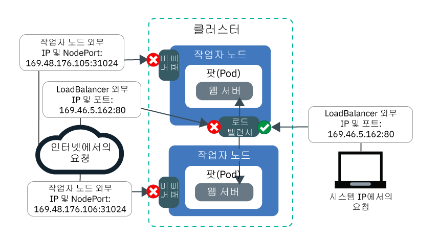
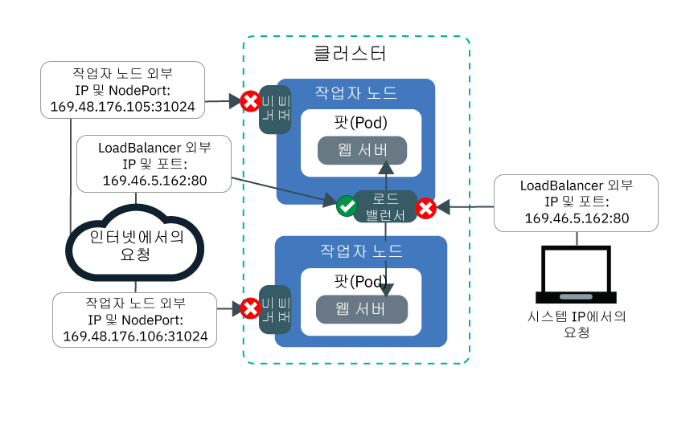

---

copyright:
  years: 2014, 2019
lastupdated: "2019-06-11"

keywords: kubernetes, iks

subcollection: containers

---

{:new_window: target="_blank"}
{:shortdesc: .shortdesc}
{:screen: .screen}
{:pre: .pre}
{:table: .aria-labeledby="caption"}
{:codeblock: .codeblock}
{:tip: .tip}
{:note: .note}
{:important: .important}
{:deprecated: .deprecated}
{:download: .download}
{:preview: .preview}


# 튜토리얼: Calico 네트워크 정책을 사용한 트래픽 차단
{: #policy_tutorial}

기본적으로 Kubernetes NodePort, LoadBalancer 및 Ingress 서비스는 모든 공용 및 사설 클러스터 네트워크 인터페이스에서 앱을 사용할 수 있도록 합니다. `allow-node-port-dnat` 기본 Calico 정책은 NodePort, 네트워크 로드 밸런서(NLB) 및 Ingress 애플리케이션 로드 밸런서(ALB) 서비스로부터 해당 서비스가 노출하는 앱 팟(Pod)으로의 수신 트래픽을 허용합니다. Kubernetes는 대상 네트워크 주소 변환(DNAT)을 사용하여 서비스 요청을 올바른 팟(Pod)으로 전달합니다.
{: shortdesc}

그러나 보안상의 이유 때문에 사용자는 특정 소스 IP 주소에서 네트워킹 서비스로의 트래픽만 허용해야 할 수 있습니다. [Calico 사전-DNAT 정책 ](https://docs.projectcalico.org/v3.1/getting-started/bare-metal/policy/pre-dnat)을 사용하여 특정 IP 주소와의 양방향 트래픽을 화이트리스트 또는 블랙리스트에 추가할 수 있습니다. Kubernetes가 일반 DNAT를 사용하여 트래픽을 팟(Pod)에 전달하기 전에 적용되므로, 사전-DNAT 정책은 특정 트래픽이 앱에 도달하지 못하도록 차단합니다. Calico 사전-DNAT 정책을 작성하는 경우, 사용자는 소스 IP 주소를 화이트리스트 또는 블랙리스트에 추가하는지 여부를 선택합니다. 알려지고 허용된 소스 IP 주소의 트래픽을 제외한 모든 트래픽이 차단되므로, 대부분의 시나리오에서는 화이트리스트 작성이 가장 안전한 구성을 제공합니다. 블랙리스트 작성은 일반적으로 소규모 IP 주소 세트의 공격 방지 등의 시나리오에만 유용합니다.

이 시나리오에서 사용자는 PR 회사의 네트워킹 관리자 역할을 수행하고 앱에 도달하는 일부 비정상적인 트래픽을 감지합니다. 이 튜토리얼의 학습에서는 샘플 웹 서버 앱 작성, 네트워크 로드 밸런서(NLB) 서비스를 사용한 앱 노출, 그리고 화이트리스트 및 블랙리스트 Calico 정책을 모두 사용한, 원치 않는 비정상 트래픽으로부터의 앱 보호 과정을 안내합니다.

## 목표
{: #policies_objectives}

- 상위 사전-DNAT 정책을 작성하여 모든 노드 포트로의 모든 수신 트래픽을 차단하는 방법을 알아봅니다.
- 하위 사전-DNAT 정책을 작성하여 화이트리스트 지정된 소스 IP 주소가 NLB 공인 IP 및 포트에 액세스할 수 있도록 하는 방법을 알아봅니다. 하위 정책은 상위 정책을 대체합니다.
- 하위 사전-DNAT 정책을 작성하여 블랙리스트 지정된 소스 IP 주소가 NLB 공인 IP 및 포트에 액세스하지 못하도록 차단하는 방법을 알아봅니다.

## 소요 시간
{: #policies_time}

1시간

## 대상
{: #policies_audience}

이 튜토리얼은 앱에 대한 네트워크 트래픽을 관리하고자 하는 네트워크 관리자와 소프트웨어 개발자용으로 작성되었습니다.

## 전제조건
{: #policies_prereqs}

- [클러스터를 작성](/docs/containers?topic=containers-clusters#clusters_ui)하십시오.
- [CLI에 클러스터를 대상으로 지정](/docs/containers?topic=containers-cs_cli_install#cs_cli_configure)하십시오.
- [Calico CLI를 설치하고 구성](/docs/containers?topic=containers-network_policies#cli_install)하십시오.
- {{site.data.keyword.containerlong_notm}}에 대해 다음의 {{site.data.keyword.Bluemix_notm}} IAM 액세스 정책이 있는지 확인하십시오.
    - [임의의 플랫폼 역할](/docs/containers?topic=containers-users#platform)
    - [**작성자** 또는 **관리자** 서비스 역할](/docs/containers?topic=containers-users#platform)

<br />


## 학습 1: 앱을 배치하고 NLB를 사용하여 이를 노출
{: #lesson1}

첫 번째 학습에서는 다중 IP 주소와 포트에서 앱이 노출되는 방법과 트래픽이 클러스터로 유입되는 위치를 보여줍니다.
{: shortdesc}

튜토리얼 전체에서 사용할 샘플 웹 서버 앱을 배치하여 시작하십시오. `echoserver` 웹 서버는 클라이언트에서 클러스터로 설정된 연결에 대한 데이터를 보여주며, PR 회사의 클러스터에 대한 액세스를 테스트할 수 있습니다. 그런 다음, 네트워크 로드 밸런서(NLB) 1.0 서비스를 작성하여 앱을 노출하십시오. NLB 1.0 서비스는 NLB 서비스 IP 주소 및 작업자 노드의 노드 포트 모두에서 앱이 사용 가능하도록 합니다.

Ingress 애플리케이션 로드 밸런서(ALB)를 대신 사용하시겠습니까? 3단계와 4단계에서 NLB를 작성하는 대신 [웹 서버의 서비스를 작성](/docs/containers?topic=containers-ingress#public_inside_1)하고 [웹 서버 앱의 Ingress 리소스를 작성](/docs/containers?topic=containers-ingress#public_inside_4)하십시오. 그런 다음 `ibmcloud ks albs --cluster <cluster_name>`를 실행하여 ALB의 공용 IP를 가져오고 튜토리얼 전체에서 `<loadbalancer_IP> 대신 이러한 IP를 사용하십시오.`
{: tip}

다음 이미지는 학습 1의 끝에서 공용 노드 포트 및 공용 NLB에 의해 웹 서버 앱이 인터넷에 노출되는 방법을 보여줍니다.



1. 샘플 웹 서버 앱을 배치하십시오. 웹 서버 앱에 연결되면 앱이 연결에서 수신된 HTTP 헤더로 응답합니다.
    ```
    kubectl run webserver --image=k8s.gcr.io/echoserver:1.10 --replicas=3
    ```
    {: pre}

2. 웹 서버 앱 팟(Pod)의 **상태**가 `Running`인지 확인하십시오.
    ```
    kubectl get pods -o wide
    ```
    {: pre}

    출력 예:
    ```
    NAME                         READY     STATUS    RESTARTS   AGE       IP               NODE
    webserver-855556f688-6dbsn   1/1       Running   0          1m        172.30.xxx.xxx   10.176.48.78
    webserver-855556f688-76rkp   1/1       Running   0          1m        172.30.xxx.xxx   10.176.48.78
    webserver-855556f688-xd849   1/1       Running   0          1m        172.30.xxx.xxx   10.176.48.78
    ```
    {: screen}

3. 앱을 공용 인터넷에 노출하려면 텍스트 편집기에서 `webserver-lb.yaml`이라고 하는 NLB 1.0 서비스 구성 파일을 작성하십시오.
    ```
    apiVersion: v1
    kind: Service
    metadata:
      labels:
        run: webserver
      name: webserver-lb
    spec:
      type: LoadBalancer
      selector:
        run: webserver
      ports:
      - name: webserver-port
        port: 80
        protocol: TCP
        targetPort: 8080
    ```
    {: codeblock}

4. NLB를 배치하십시오.
    ```
    kubectl apply -f filepath/webserver-lb.yaml
    ```
    {: pre}

5. 컴퓨터에서 NLB에 의해 노출된 앱에 공용으로 액세스할 수 있는지 확인하십시오.

    1. NLB의 공인 **EXTERNAL-IP** 주소를 가져오십시오.
        ```
        kubectl get svc -o wide
        ```
        {: pre}

        출력 예:
        ```
        NAME           CLUSTER-IP       EXTERNAL-IP        PORT(S)        AGE       SELECTOR
        webserver-lb   172.21.xxx.xxx   169.xx.xxx.xxx     80:31024/TCP   2m        run=webserver
        ```
        {: screen}

    2. 치트 시트 텍스트 파일을 작성하고 이 텍스트 파일에 NLB IP를 복사하십시오. 치트 시트는 향후 학습에서 값을 보다 빨리 사용할 수 있도록 도움을 줍니다.

    3. NLB에 대한 외부 IP에 공용으로 액세스할 수 있는지 확인하십시오.
        ```
        curl --connect-timeout 10 <loadbalancer_IP>:80
        ```
        {: pre}

        다음 출력 예에서는 NLB가 `169.1.1.1` 공인 NLB IP 주소에 앱을 노출함을 확인합니다. `webserver-855556f688-76rkp` 앱 팟(Pod)에서 curl 요청을 수신했습니다.
        ```
        Hostname: webserver-855556f688-76rkp
        Pod Information:
            -no pod information available-
        Server values:
            server_version=nginx: 1.13.3 - lua: 10008
        Request Information:
            client_address=1.1.1.1
            method=GET
            real path=/
            query=
            request_version=1.1
            request_scheme=http
            request_uri=http://169.1.1.1:8080/
        Request Headers:
            accept=*/*
            host=169.1.1.1
            user-agent=curl/7.54.0
        Request Body:
            -no body in request-
        ```
        {: screen}

6. 컴퓨터에서 노드 포트에 의해 노출된 앱에 공용으로 액세스할 수 있는지 확인하십시오. NLB 서비스는 NLB 서비스 IP 주소 및 작업자 노드의 노드 포트 모두에서 앱이 사용 가능하도록 합니다.

    1. NLB가 작업자 노드에 지정한 노드 포트를 가져오십시오. 노드 포트는 30000 - 32767 범위에 있습니다.
        ```
        kubectl get svc -o wide
        ```
        {: pre}

        다음의 출력 예에서 노드 포트는 `31024`입니다.
        ```
        NAME           CLUSTER-IP       EXTERNAL-IP        PORT(S)        AGE       SELECTOR
        webserver-lb   172.21.xxx.xxx   169.xx.xxx.xxx     80:31024/TCP   2m        run=webserver
        ```
        {: screen}  

    2. 작업자 노드의 **공인 IP** 주소를 가져오십시오.
        ```
        ibmcloud ks workers --cluster <cluster_name>
        ```
        {: pre}

        출력 예:
        ```
        ID                                                 Public IP        Private IP     Machine Type        State    Status   Zone    Version   
        kube-dal10-cr18e61e63c6e94b658596ca93d087eed9-w1   169.xx.xxx.xxx   10.176.48.67   u3c.2x4.encrypted   normal   Ready    dal10   1.13.6_1513*   
        kube-dal10-cr18e61e63c6e94b658596ca93d087eed9-w2   169.xx.xxx.xxx   10.176.48.79   u3c.2x4.encrypted   normal   Ready    dal10   1.13.6_1513*   
        kube-dal10-cr18e61e63c6e94b658596ca93d087eed9-w3   169.xx.xxx.xxx   10.176.48.78   u3c.2x4.encrypted   normal   Ready    dal10   1.13.6_1513*   
        ```
        {: screen}

    3. 뒷부분의 학습에서 사용하기 위해 작업자 노드 및 노드 포트의 공인 IP를 텍스트 치트 시트에 복사하십시오.

    4. 노드 포트를 통해 작업자 노드의 공인 IP 주소에 액세스할 수 있는지 확인하십시오.
        ```
        curl  --connect-timeout 10 <worker_IP>:<NodePort>
        ```
        {: pre}

        다음 출력 예는 앱에 대한 요청이 작업자 노드에 대한 사설 IP 주소 `10.1.1.1` 및 `31024` 노드 포트를 통해 수신됨을 확인합니다. `webserver-855556f688-xd849` 앱 팟(Pod)에서 curl 요청을 수신했습니다.
        ```
        Hostname: webserver-855556f688-xd849
        Pod Information:
            -no pod information available-
        Server values:
            server_version=nginx: 1.13.3 - lua: 10008
        Request Information:
            client_address=1.1.1.1
            method=GET
            real path=/
            query=
            request_version=1.1
            request_scheme=http
            request_uri=http://10.1.1.1:8080/
        Request Headers:
            accept=*/*
            host=10.1.1.1:31024
            user-agent=curl/7.60.0
        Request Body:
            -no body in request-
        ```
        {: screen}

이 시점에서 앱은 다중 IP 주소 및 포트에서 노출됩니다. 이러한 IP 중 대부분은 클러스터에 대해 내부적이며 사설 네트워크를 통해만 액세스가 가능합니다. 공용 노드 포트 및 공용 NLB 포트만 공용 인터넷에 노출됩니다.

그 다음에는 공용 트래픽을 차단하는 Calico 정책의 작성과 적용을 시작할 수 있습니다.

## 학습 2: 모든 노드 포트로의 모든 수신 트래픽 차단
{: #lesson2}

PR 회사의 클러스터를 보호하려면 앱을 노출 중인 NLB 서비스와 노드 포트에 대한 공용 액세스를 모두 차단해야 합니다. 노드 포트에 대한 액세스 차단부터 시작하십시오.
{: shortdesc}

다음 이미지는 학습 2의 끝에서 NLB로의 트래픽은 허용하지만 노드 포트로의 트래픽은 허용하지 않는 방법을 보여줍니다.



1. 텍스트 편집기에서, 임의의 소스 IP에서 모든 노드 포트로의 수신 TCP 및 UDP 트래픽을 거부하는 `deny-nodeports.yaml`이라고 하는 상위 사전-DNAT 정책을 작성하십시오.
    ```
    apiVersion: projectcalico.org/v3
    kind: GlobalNetworkPolicy
    metadata:
      name: deny-nodeports
    spec:
      applyOnForward: true
      preDNAT: true
      ingress:
      - action: Deny
        destination:
          ports:
          - 30000:32767
        protocol: TCP
        source: {}
      - action: Deny
        destination:
          ports:
          - 30000:32767
        protocol: UDP
        source: {}
      selector: ibm.role=='worker_public'
      order: 1100
      types:
      - Ingress
    ```
    {: codeblock}

2. 정책을 적용하십시오.
    - Linux:

      ```
      calicoctl apply -f filepath/deny-nodeports.yaml
      ```
      {: pre}

    - Windows 및 OS X:

      ```
      calicoctl apply -f filepath/deny-nodeports.yaml --config=filepath/calicoctl.cfg
      ```
      {: pre}
  출력 예:
  ```
  Successfully applied 1 'GlobalNetworkPolicy' resource(s)
  ```
  {: screen}

3. 치트 시트의 값을 사용하여 작업자 노드 공인 IP 주소 및 노드 포트에 공용으로 액세스할 수 없는지 확인하십시오.
    ```
    curl  --connect-timeout 10 <worker_IP>:<NodePort>
    ```
    {: pre}

    작성한 Calico 정책이 노드 포트로의 트래픽을 차단하므로 연결 제한시간이 초과됩니다.
    ```
    curl: (28) Connection timed out after 10016 milliseconds
    ```
    {: screen}

4. 이전 학습에서 작성한 LoadBalancer의 externalTrafficPolicy를 `Cluster`에서 `Local`로 변경하십시오. `Local`은 다음 단계에서 LoadBalancer의 외부 IP 주소를 curl할 때 시스템의 소스 IP가 유지되도록 합니다.
    ```
    kubectl patch svc webserver -p '{"spec":{"externalTrafficPolicy":"Local"}}'
    ```
    {: pre}

5. 치트 시트의 값을 사용하여 NLB 외부 IP 주소에 여전히 공용으로 액세스할 수 있는지 확인하십시오.
    ```
    curl --connect-timeout 10 <loadbalancer_IP>:80
    ```
    {: pre}

    출력 예:
    ```
    Hostname: webserver-855556f688-76rkp
    Pod Information:
        -no pod information available-
    Server values:
        server_version=nginx: 1.13.3 - lua: 10008
    Request Information:
        client_address=1.1.1.1
        method=GET
        real path=/
        query=
        request_version=1.1
        request_scheme=http
        request_uri=http://<loadbalancer_IP>:8080/
    Request Headers:
        accept=*/*
        host=<loadbalancer_IP>
        user-agent=curl/7.54.0
    Request Body:
        -no body in request-
    ```
    {: screen}
    출력의 `Request Information` 섹션에서 소스 IP 주소의 예로 `client_address=1.1.1.1`을 들 수 있습니다. 소스 IP 주소는 curl을 실행하기 위해 사용 중인 시스템의 공인 IP입니다. 혹은 프록시나 VPN을 통해 인터넷에 연결 중인 경우, 프록시나 VPN은 시스템의 실제 IP 주소를 숨길 수 있습니다. 두 경우 모두 NLB는 시스템의 소스 IP 주소를 클라이언트 IP 주소로 인식합니다.

6. 시스템의 소스 IP 주소(이전 단계 출력의 `client_address=1.1.1.1`)를 향후 학습에서 사용할 치트 시트에 복사하십시오.

좋습니다! 이 시점에서 앱은 공용 NLB 포트에서만 공용 인터넷에 노출됩니다. 공용 노드 포트로의 트래픽은 차단되어 있습니다. 클러스터가 원하지 않는 트래픽으로부터 클러스터가 일부 잠금 상태입니다.

그 다음에는 특정 소스 IP의 트래픽을 화이트리스트에 추가하는 Calico 정책을 작성하고 적용할 수 있습니다.

## 학습 3: 화이트리스트 지정된 IP에서 NLB로 수신 트래픽 허용
{: #lesson3}

이제 PR 회사의 클러스터에 대한 트래픽을 완전 차단하고 자체 컴퓨터의 IP 주소만 화이트리스트에 추가하여 액세스를 테스트하기로 결정합니다.
{: shortdesc}

먼저, 노드 포트 외에 앱을 노출 중인 NLB로의 모든 수신 트래픽을 차단해야 합니다. 그리고 시스템의 IP 주소를 화이트리스트에 추가하는 정책을 작성할 수 있습니다. 학습 3의 끝에서 공용 노드 포트 및 NLB로의 모든 트래픽은 차단되며 화이트리스트 지정된 시스템 IP의 트래픽만 허용됩니다.



1. 텍스트 편집기에서, 임의의 소스 IP에서 NLB IP 주소 및 포트로의 모든 수신 TCP 및 UDP 트래픽을 거부하는 `deny-lb-port-80.yaml`이라고 하는 상위 사전-DNAT 정책을 작성하십시오. `<loadbalancer_IP>`를 치트 시트의 NLB 공용 IP 주소로 대체하십시오.

    ```
    apiVersion: projectcalico.org/v3
    kind: GlobalNetworkPolicy
    metadata:
      name: deny-lb-port-80
    spec:
      applyOnForward: true
      preDNAT: true
      ingress:
      - action: Deny
        destination:
          nets:
          - <loadbalancer_IP>/32
          ports:
          - 80
        protocol: TCP
        source: {}
      - action: Deny
        destination:
          nets:
          - <loadbalancer_IP>/32
          ports:
          - 80
        protocol: UDP
        source: {}
      selector: ibm.role=='worker_public'
      order: 800
      types:
      - Ingress
    ```
    {: codeblock}

2. 정책을 적용하십시오.
    - Linux:

      ```
      calicoctl apply -f filepath/deny-lb-port-80.yaml
      ```
      {: pre}

    - Windows 및 OS X:

      ```
      calicoctl apply -f filepath/deny-lb-port-80.yaml --config=filepath/calicoctl.cfg
      ```
      {: pre}

3. 치트 시트의 값을 사용하여, 이제 공용 NLB IP 주소에 액세스할 수 없는지 확인하십시오. 작성한 Calico 정책이 NLB로의 트래픽을 차단하므로 연결 제한시간이 초과됩니다.
    ```
    curl --connect-timeout 10 <loadbalancer_IP>:80
    ```
    {: pre}

4. 텍스트 편집기에서, 사용자 시스템의 IP에서 NLB IP 주소 및 포트로의 트래픽을 허용하는 `whitelist.yaml`이라고 하는 하위 사전-DNAT 정책을 작성하십시오. 치트 시트의 값을 사용하여 `<loadbalancer_IP>`를 NLB의 공용 IP 주소로 대체하고 `<client_address>`를 시스템 소스 IP의 공용 IP 주소로 대체하십시오. 시스템 IP가 기억나지 않으면 `curl ifconfig.co`를 실행할 수 있습니다.
    ```
    apiVersion: projectcalico.org/v3
    kind: GlobalNetworkPolicy
    metadata:
      name: whitelist
    spec:
      applyOnForward: true
      preDNAT: true
      ingress:
      - action: Allow
        destination:
          nets:
          - <loadbalancer_IP>/32
          ports:
          - 80
        protocol: TCP
        source:
          nets:
          - <client_address>/32
      selector: ibm.role=='worker_public'
      order: 500
      types:
      - Ingress
    ```
    {: codeblock}

5. 정책을 적용하십시오.
    - Linux:

      ```
      calicoctl apply -f filepath/whitelist.yaml
      ```
      {: pre}

    - Windows 및 OS X:

      ```
      calicoctl apply -f filepath/whitelist.yaml --config=filepath/calicoctl.cfg
      ```
      {: pre}
  시스템의 IP 주소가 이제 화이트리스트에 추가되었습니다.

6. 치트 시트의 값을 사용하여, 이제 공용 NLB IP 주소에 액세스할 수 있는지 확인하십시오.
    ```
    curl --connect-timeout 10 <loadbalancer_IP>:80
    ```
    {: pre}

7. 다른 IP 주소가 있는 다른 시스템에 대한 액세스 권한이 있는 경우에는 해당 시스템에서 NLB로의 액세스를 시도하십시오.
    ```
    curl --connect-timeout 10 <loadbalancer_IP>:80
    ```
    {: pre}
    시스템의 IP 주소가 화이트리스트에 없으므로 연결 제한시간이 초과됩니다.

이 시점에서 공용 노드 포트 및 NLB로의 모든 트래픽은 차단됩니다. 화이트리스트에 있는 시스템 IP의 트래픽만 허용됩니다.

## 학습 4: 블랙리스트 지정된 IP에서 NLB로의 수신 트래픽 거부
{: #lesson4}

이전 학습에서는 모든 트래픽과 화이트리스트의 일부 IP만 차단했습니다. 해당 시나리오는 일부 제어된 소스 IP 주소에 대해서만 액세스를 제한하고자 할 때 테스트 용도로 적합합니다. 그러나 PR 회사에는 공용으로 널리 사용 가능해야 하는 앱이 있습니다. 사용자는 일부 IP 주소에서 보이는 비정상적인 트래픽을 제외한 모든 트래픽이 허용되도록 보장해야 합니다. 소규모 IP 주소 세트의 공격 방지에 도움이 될 수 있으므로, 블랙리스트 작성은 이와 같은 시나리오에 유용합니다.
{: shortdesc}

이 학습에서 사용자는 시스템의 소스 IP 주소의 트래픽을 차단하여 블랙리스트를 테스트합니다. 학습 4의 끝에서 공용 노드 포트로의 모든 트래픽은 차단되며 공용 NLB로의 모든 트래픽은 허용됩니다. 블랙리스트 지정된 사용자 시스템 IP에서 NLB로의 트래픽만 차단됩니다.



1. 이전 학습에서 작성된 화이트리스트 정책을 정리하십시오.
    - Linux:
      ```
      calicoctl delete GlobalNetworkPolicy deny-lb-port-80
      ```
      {: pre}
      ```
      calicoctl delete GlobalNetworkPolicy whitelist
      ```
      {: pre}

    - Windows 및 OS X:
      ```
      calicoctl delete GlobalNetworkPolicy deny-lb-port-80 --config=filepath/calicoctl.cfg
      ```
      {: pre}
      ```
      calicoctl delete GlobalNetworkPolicy whitelist --config=filepath/calicoctl.cfg
      ```
      {: pre}

    이제 임의의 소스 IP에서 NLB IP 주소 및 포트로의 모든 수신 TCP 및 UDP 트래픽이 다시 허용됩니다.

2. 사용자 시스템의 소스 IP 주소에서 NLB IP 주소 및 포트로의 모든 수신 TCP 및 UDP 트래픽을 거부하려면 텍스트 편집기에서 `blacklist.yaml`이라고 하는 하위 사전-DNAT 정책을 작성하십시오. 치트 시트의 값을 사용하여 `<loadbalancer_IP>`를 NLB의 공용 IP 주소로 대체하고 `<client_address>`를 시스템 소스 IP의 공용 IP 주소로 대체하십시오.
  ```
  apiVersion: projectcalico.org/v3
  kind: GlobalNetworkPolicy
  metadata:
    name: blacklist
  spec:
    applyOnForward: true
    preDNAT: true
    ingress:
    - action: Deny
      destination:
        nets:
        - <loadbalancer_IP>/32
        ports:
        - 80
      protocol: TCP
      source:
        nets:
        - <client_address>/32
    - action: Deny
      destination:
        nets:
        - <loadbalancer_IP>/32
        ports:
        - 80
      protocol: UDP
      source:
        nets:
        - <client_address>/32
    selector: ibm.role=='worker_public'
    order: 500
    types:
    - Ingress
  ```
  {: codeblock}

3. 정책을 적용하십시오.
    - Linux:

      ```
      calicoctl apply -f filepath/blacklist.yaml
      ```
      {: pre}

    - Windows 및 OS X:

      ```
      calicoctl apply -f filepath/blacklist.yaml --config=filepath/calicoctl.cfg
      ```
      {: pre}
  시스템의 IP 주소가 이제 블랙리스트에 추가되었습니다.

4. 치트 시트의 값을 사용하여, 사용자 시스템의 IP가 블랙리스트로 지정되어 사용자 시스템에서 NLB IP에 액세스할 수 없음을 확인하십시오.
    ```
    curl --connect-timeout 10 <loadbalancer_IP>:80
    ```
    {: pre}
    이 시점에서 공용 노드 포트로의 모든 트래픽은 차단되며 공용 NLB로의 모든 트래픽은 허용됩니다. 블랙리스트 지정된 사용자 시스템 IP에서 NLB로의 트래픽만 차단됩니다.

수고하셨습니다! 소스 IP를 블랙리스트에 추가하는 Calico 사전-DNAT 정책을 사용하여 앱으로 유입되는 트래픽을 성공적으로 제어했습니다.

## 학습 5: 블랙리스트 지정된 IP에서 NLB로의 블랙리스트 지정된 트래픽 로깅
{: #lesson5}

이전 학습에서는 시스템 IP에서 NLB로의 트래픽을 블랙리스트로 지정했습니다. 이 학습에서 거부된 트래픽 요청을 로깅하는 방법을 알아볼 수 있습니다.
{: shortdesc}

시나리오 예에서 사용자가 근무하는 PR 회사에서는 사용자가 네트워크 정책 중 하나에 의해 지속적으로 거부되는 일부 비정상적인 트래픽에 대한 로깅 추적을 설정하기를 원합니다. 잠재적인 보안 위협을 모니터링하기 위해, 사용자는 정책이 NLB IP에 대해 시도된 조치를 거부할 때마다 기록하도록 로깅을 설정합니다.

1. `log-denied-packets`라고 하는 Calico NetworkPolicy를 작성하십시오. 이 로그 정책은 이 정책을 Calico Iptables 규칙 체인에 추가하는 `blacklist` 정책과 동일한 선택기를 사용합니다. 보다 낮은 순서 번호(예: `300`)를 사용하여 블랙리스트 정책 전에 이 규칙이 Iptables 규칙 체인에 추가되도록 보장할 수 있습니다. IP의 패킷은 `blacklist` 정책 규칙을 일치시키려고 시도하기 전에 이 정책으로 로깅되고 거부됩니다.
  ```
  apiVersion: projectcalico.org/v3
  kind: GlobalNetworkPolicy
  metadata:
    name: log-denied-packets
  spec:
    applyOnForward: true
    preDNAT: true
    ingress:
    - action: Log
      destination:
        nets:
        - <loadbalancer_IP>/32
        ports:
        - 80
      protocol: TCP
      source:
        nets:
        - <client_address>/32
    - action: Deny
      destination:
        nets:
        - <loadbalancer_IP>/32
        ports:
        - 80
      protocol: UDP
      source:
        nets:
        - <client_address>/32
    selector: ibm.role=='worker_public'
    order: 300
    types:
    - Ingress
  ```
  {: codeblock}

2. 정책을 적용하십시오.
  ```
  calicoctl apply -f log-denied-packets.yaml --config=<filepath>/calicoctl.cfg
  ```
  {: pre}

3. 시스템 IP의 요청을 NLB IP로 전송하여 로그 항목을 생성하십시오. 이 요청 패킷은 거부되기 전에 로깅됩니다.
  ```
  curl --connect-timeout 10 <loadbalancer_IP>:80
  ```
  {: pre}

4. `/var/log/syslog` 경로에 작성된 로그 항목을 확인하십시오. 로그 항목이 다음과 유사하게 나타납니다.
  ```
  Sep 5 14:34:40 <worker_hostname> kernel: [158271.044316] calico-packet: IN=eth1 OUT= MAC=08:00:27:d5:4e:57:0a:00:27:00:00:00:08:00 SRC=192.XXX.XX.X DST=192.XXX.XX.XX LEN=60 TOS=0x00 PREC=0x00 TTL=64 ID=52866 DF PROTO=TCP SPT=42962 DPT=22 WINDOW=29200 RES=0x00 SYN URGP=0
  ```
  {: screen}

좋습니다! 블랙리스트 지정된 트래픽을 더욱 쉽게 모니터할 수 있도록 로깅을 설정했습니다.

블랙리스트 및 로그 정책을 정리하려면 다음을 수행하십시오.
1. 블랙리스트 정책을 정리하십시오.
    - Linux:
      ```
      calicoctl delete GlobalNetworkPolicy blacklist
      ```
      {: pre}

    - Windows 및 OS X:
      ```
      calicoctl delete GlobalNetworkPolicy blacklist --config=filepath/calicoctl.cfg
      ```
      {: pre}

2. 로그 정책을 정리하십시오.
    - Linux:
      ```
      calicoctl delete GlobalNetworkPolicy log-denied-packets
      ```
      {: pre}

    - Windows 및 OS X:
      ```
      calicoctl delete GlobalNetworkPolicy log-denied-packets --config=filepath/calicoctl.cfg
      ```
      {: pre}

## 다음에 수행할 작업
{: #whats_next}

* [네트워크 정책으로 트래픽 제어](/docs/containers?topic=containers-network_policies)에 대해 자세히 읽으십시오.
* 클러스터와의 양방향 트래픽을 제어하는 추가적인 예제 Calico 네트워크 정책을 보려면 [스타 정책 데모 ](https://docs.projectcalico.org/v3.1/getting-started/kubernetes/tutorials/stars-policy/) 및 [고급 네트워크 정책 ](https://docs.projectcalico.org/v3.1/getting-started/kubernetes/tutorials/advanced-policy)을 체크아웃할 수 있습니다.
