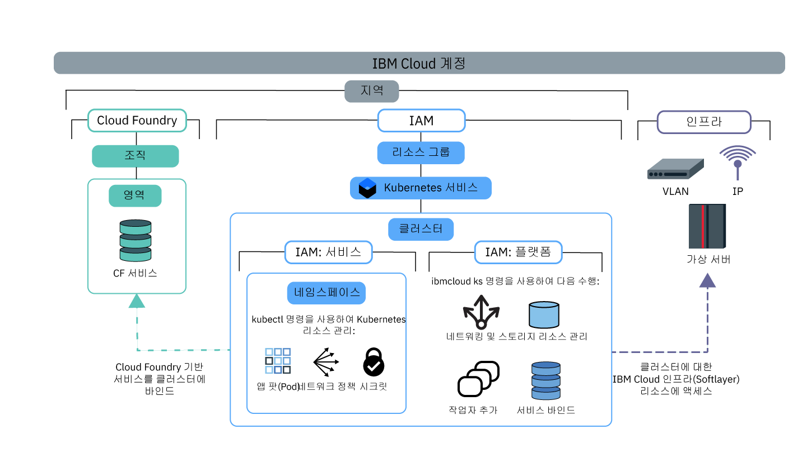

---

copyright:
  years: 2014, 2019
lastupdated: "2019-06-12"

keywords: kubernetes, iks

subcollection: containers

---

{:new_window: target="blank"}
{:shortdesc: .shortdesc}
{:screen: .screen}
{:pre: .pre}
{:table: .aria-labeledby="caption"}
{:codeblock: .codeblock}
{:tip: .tip}
{:note: .note}
{:important: .important}
{:deprecated: .deprecated}
{:download: .download}
{:preview: .preview}


# 클러스터 액세스 지정
{: #users}

클러스터 관리자는 {{site.data.keyword.containerlong}} 클러스터에 대한 액세스 정책을 정의하여 다양한 사용자에 대해 서로 다른 액세스 레벨을 작성할 수 있습니다. 예를 들어, 특정 사용자는 클러스터 인프라 리소스에 대해 작업할 수 있도록 하고 다른 사용자는 컨테이너만 배치할 수 있도록 권한 부여할 수 있습니다.
{: shortdesc}

2019년 1월 30일부터 {{site.data.keyword.containerlong_notm}}는 {{site.data.keyword.Bluemix_notm}} IAM([서비스 액세스 역할](/docs/containers?topic=containers-access_reference#service))으로 사용자에게 권한을 부여하는 새로운 방법을 제공합니다. 이러한 서비스 역할은 클러스터 내의 리소스(예: Kubernetes 네임스페이스)에 대한 액세스 권한을 부여하는 데 사용됩니다. 자세한 정보는 블로그, [클러스터 액세스를 보다 세밀하게 제어하기 위한 IAM의 서비스 역할 및 네임스페이스 소개 ](https://www.ibm.com/blogs/bluemix/2019/02/introducing-service-roles-and-namespaces-in-iam-for-more-granular-control-of-cluster-access/)를 확인하십시오.
{: note}

## 액세스 정책 및 역할 이해
{: #access_policies}

액세스 정책은 {{site.data.keyword.Bluemix_notm}} 계정의 사용자가 {{site.data.keyword.Bluemix_notm}} 플랫폼에서 리소스에 대해 갖는 액세스 권한 레벨을 결정합니다. 정책은 사용자에게 하나의 서비스, 또는 서비스와 리소스의 세트로 구성된 리소스 그룹에 대한 액세스 권한 범위를 정의하는 역할을 하나 이상 지정합니다. {{site.data.keyword.Bluemix_notm}}의 각 서비스는 자체 액세스 정책 세트를 필요로 할 수 있습니다.
{: shortdesc}

사용자 액세스 권한을 관리할 계획을 수립할 때는 다음과 같은 일반적인 단계를 고려하십시오.
1.  [사용자에게 적합한 액세스 정책 및 역할 선택](#access_roles)
2.  [{{site.data.keyword.Bluemix_notm}} IAM에서 개별 사용자 또는 사용자 그룹에 액세스 역할 지정](#iam_individuals_groups)
3.  [사용자 액세스 권한을 클러스터 인스턴스, Kubernetes 네임스페이스 또는 리소스 그룹으로 범위 지정](#resource_groups)

계정 내 역할, 사용자 및 리소스의 관리 방법을 이해한 후에는 [클러스터에 대한 액세스 권한 설정](#access-checklist)에서 액세스 권한 구성 방법에 대한 체크리스트를 확인하십시오.

### 사용자에게 적합한 액세스 정책 및 역할 선택
{: #access_roles}

{{site.data.keyword.containerlong_notm}}에 대해 작업하는 모든 사용자에 대해 액세스 정책을 정의해야 합니다. 액세스 정책의 범위는 사용자가 수행할 수 있는 조치를 결정하는, 사용자에게 정의된 역할을 기반으로 합니다. 일부 정책은 사전 정의되어 있으나, 그 외의 정책은 사용자 정의할 수 있습니다. IBM Cloud 인프라(SoftLayer)에서 조치가 완료되는 경우에도 사용자가 {{site.data.keyword.containerlong_notm}} 콘솔 또는 CLI를 통해 요청을 수행하는지에 관계없이 동일한 정책이 적용됩니다.
{: shortdesc}

다음 이미지는 다양한 권한 및 역할의 유형, 어떤 역할이 어떤 종류의 조치를 수행할 수 있는지, 역할이 서로 어떻게 관련되어 있는지를 표시합니다.



구체적인 각 역할별 {{site.data.keyword.containerlong_notm}} 권한을 보려면 [사용자 액세스 권한](/docs/containers?topic=containers-access_reference) 참조 주제를 참조하십시오.
{: tip}

<dl>
<dt><a href="#platform">{{site.data.keyword.Bluemix_notm}} IAM 플랫폼 및 서비스 역할</a></dt>
<dd>{{site.data.keyword.containerlong_notm}}는 {{site.data.keyword.Bluemix_notm}} Identity and Access Management(IAM) 플랫폼 및 서비스 역할을 사용하여 클러스터에 대한 사용자 액세스 권한을 부여합니다.
<ul><li>**플랫폼**: 플랫폼 역할은 사용자가 {{site.data.keyword.containerlong_notm}} API, 콘솔 및 CLI(`ibmcloud ks`)를 사용하여 클러스터 인프라에서 사용자가 수행할 수 있는 조치를 판별합니다. 플랫폼 역할은 Kubernetes API에 대한 액세스를 부여하지 않습니다. 이러한 역할에 대한 정책은 리소스 그룹, 지역 또는 클러스터 인스턴스별로 설정할 수 있습니다. IAM 플랫폼 역할은 사용자에게 클러스터에 대해 인프라 조치를 수행할 수 있도록 권한 부여하지만 IBM Cloud 인프라(SoftLayer) 리소스에 대한 액세스 권한은 부여하지 않습니다. IBM Cloud 인프라(SoftLayer) 리소스에 대한 액세스 권한은 [지역에 대해 설정된 API 키](#api_key)가 결정합니다. 플랫폼 역할에 의해 허용되는 조치에 대한 예로는 클러스터 작성 또는 제거, 클러스터에 서비스 바인딩, 네트워킹 및 스토리지 리소스 관리, 추가 작업자 노드 추가 등이 있습니다.<br><br>사용자에게 플랫폼 역할만 지정하면 클러스터 내의 Kubernetes 리소스와 상호작용할 수 없습니다. 그러나 `ibmcloud ks cluster-config` [명령](/docs/containers?topic=containers-cli-plugin-kubernetes-service-cli#cs_cluster_config)을 계속 수행할 수 있습니다. 그러면 [사용자 정의 RBAC 정책](/docs/containers?topic=containers-users#role-binding)을 사용하여 Kubernetes 선택 조치를 수행할 수 있는 권한을 사용자에게 부여할 수 있습니다. 현재 조직이 사용자 정의 RBAC 정책을 사용하여 Kubernetes 액세스를 제어하고 서비스 역할 대신 사용자 정의 RBAC를 계속 사용할 계획이면 이 작업을 수행할 수 있습니다.</li>
<li>**서비스**: 서비스 역할은 사용자가 클러스터 내에서 제공하는 해당 Kubernetes RBAC 정책을 부여합니다. 이와 같이, 서비스 역할은 Kubernetes API, 대시보드, CLI(`kubectl`)에 대한 액세스를 부여합니다. 서비스 역할에 대한 정책은 리소스 그룹, 지역 또는 클러스터 인스턴스별로 범위 지정할 수 있습니다. 또한 모두, 개별 또는 지역 전체 클러스터에 있는 Kubernetes 네임스페이스에 대한 서비스 역할을 범위 지정할 수도 있습니다. 서비스 역할을 네임스페이스로 범위 지정하는 경우, 정책을 리소스 그룹에 적용하거나 플랫폼 역할을 동시에 지정할 수 없습니다. 서비스 역할에 의해 허용되는 조치의 예를 들면 앱 배치 작성, 네임스페이스 추가 또는 configmap 설정 등이 있습니다.<br><br>사용자에게 서비스 역할만 지정하면 임의의 {{site.data.keyword.containerlong_notm}} 리소스를 보거나 상호작용할 수 없습니다. 사용자가 클러스터에 액세스하고 클러스터의 Kubernetes 리소스를 사용하려면 `ibmcloud ks cluster-config` [명령](/docs/containers?topic=containers-cli-plugin-kubernetes-service-cli#cs_cluster_config)을 수행한 다음 [CLI에서 Kubernetes 대시보드를 시작](/docs/containers?topic=containers-app#db_cli)할 수 있도록 사용자에게 클러스터 이름과 ID를 제공해야 합니다. 이러한 사용자가 계속 {{site.data.keyword.containerlong_notm}} 클러스터 콘솔에 액세스하고 클러스터와 기타 인프라 자원을 CLI에서 나열할 수 있도록 하려면 사용자에게 플랫폼 **뷰어** 역할을 제공하십시오.</li></ul></dd>
<dt><a href="#role-binding">RBAC</a></dt>
<dd>Kubernetes에서 역할 기반 액세스 제어(RBAC)는 클러스터 내의 리소스를 보호하는 방법입니다. RBAC 역할은 사용자가 리소스에 대해 수행할 수 있는 Kubernetes 조치를 결정합니다. 서비스 역할이 지정된 사용자에게는 해당 RBAC 클러스터 역할이 자동으로 지정됩니다. 이 RBAC 클러스터 역할은 네임스페이스에 대한 정책의 범위를 지정하는지 여부에 따라 특정 네임스페이스 또는 모든 네임스페이스에 적용됩니다.</br></br>
RBAC 역할에 의해 허용되는 조치의 예를 들면 팟(Pod)과 같은 오브젝트의 작성, 팟(Pod) 로그 읽기 등이 있습니다.</dd>
<dt><a href="#api_key">인프라</a></dt>
<dd>인프라 역할은 IBM Cloud 인프라(SoftLayer) 리소스에 액세스할 수 있도록 합니다. 특정 사용자에게 **수퍼유저** 인프라 역할을 설정하고 이 사용자의 인프라 인증 정보를 API 키에 저장하십시오. 그 후, 클러스터를 작성할 각 지역에 해당 API 키를 설정하십시오. API 키를 설정하고 나면 해당 API 키를 지역 내 모든 사용자가 공유하므로 {{site.data.keyword.containerlong_notm}}에 대해 액세스 권한이 부여되는 다른 사용자에게 인프라 역할이 필요하지 않습니다. 대신 {{site.data.keyword.Bluemix_notm}} IAM 플랫폼 역할이 사용자가 수행할 수 있도록 허용되는 인프라 조치를 결정합니다. 전체 <strong>수퍼유저</strong> 인프라 역할로 API 키를 설정하지 않거나 사용자에게 특정 디바이스에 대한 액세스 권한을 부여해야 하는 경우에는 [인프라 권한을 사용자 정의](#infra_access)할 수 있습니다.</br></br>
인프라 역할에 의해 허용되는 조치의 예를 들면 클러스터 작업자 노드의 세부사항 보기, 네트워킹 및 스토리지 리소스 편집 등이 있습니다.</dd>
<dt>Cloud Foundry</dt>
<dd>{{site.data.keyword.Bluemix_notm}} IAM으로 관리할 수 없는 서비스도 있습니다. 이러한 서비스 중 하나를 사용하고 있는 경우에는 Cloud Foundry 사용자 역할을 계속 사용하여 해당 서비스에 대한 액세스를 제어할 수 있습니다. Cloud Foundry 역할은 계정 내 조직 및 영역에 대한 액세스 권한을 부여합니다. {{site.data.keyword.Bluemix_notm}}에 있는 Cloud Foundry 기반 서비스의 목록을 보려면 <code>ibmcloud service list</code>를 실행하십시오.</br></br>
Cloud Foundry 역할에 의해 허용되는 조치의 예를 들면 새 Cloud Foundry 서비스 인스턴스 작성, 클러스터에 Cloud Foundry 서비스 인스턴스 바인딩 등이 있습니다. 더 자세히 알아보려면 {{site.data.keyword.Bluemix_notm}} IAM 문서에서 사용 가능한 [조직 및 영역 역할](/docs/iam?topic=iam-cfaccess)을 참조하거나 [Cloud Foundry 액세스 권한 관리](/docs/iam?topic=iam-mngcf) 단계를 참조하십시오.</dd>
</dl>

### {{site.data.keyword.Bluemix_notm}} IAM에서 개별 사용자 또는 사용자 그룹에 액세스 역할 지정
{: #iam_individuals_groups}

{{site.data.keyword.Bluemix_notm}} IAM 정책을 설정하면 개별 사용자 또는 사용자 그룹에 역할을 지정할 수 있습니다.
{: shortdesc}

<dl>
<dt>개별 사용자</dt>
<dd>팀의 나머지 구성원보다 더 많거나 적은 권한이 필요한 특정 사용자가 있을 수 있습니다. 각 사용자가 자신의 태스크를 완료하는 데 필요한 권한을 보유할 수 있도록 개인별로 권한을 사용자 정의할 수 있습니다. 각 사용자에게는 둘 이상의 {{site.data.keyword.Bluemix_notm}} IAM 역할을 지정할 수 있습니다.</dd>
<dt>액세스 그룹의 여러 사용자</dt>
<dd>사용자 그룹을 작성하고 해당 그룹에 권한을 지정할 수 있습니다. 예를 들면, 모든 팀 리더를 그룹화하고 해당 그룹에 관리자 액세스 권한을 지정할 수 있습니다. 그 후에는 모든 개발자를 그룹화하고 해당 그룹에 쓰기 액세스 권한만 지정할 수 있습니다. 각 액세스 그룹에는 둘 이상의 {{site.data.keyword.Bluemix_notm}} IAM 역할을 지정할 수 있습니다. 그룹에 권한을 지정하면 해당 그룹에서 추가되거나 제거되는 모든 사용자가 영향을 받습니다. 그룹에 사용자를 추가하는 경우, 해당 사용자는 추가 액세스 권한도 보유합니다. 이를 제거하면 해당 액세스 권한이 취소됩니다.</dd>
</dl>

{{site.data.keyword.Bluemix_notm}} IAM 역할은 서비스 계정에 지정할 수 없습니다. 대신 직접 [서비스 계정에 RBAC 역할을 지정](#rbac)할 수 있습니다.
{: tip}

사용자가 액세스 권한을 갖는 계정 내 항목의 범위(한 리소스 그룹 내의 한 클러스터, 한 리소스 그룹 내의 모든 클러스터, 모든 리소스 그룹 내의 모든 클러스터) 또한 지정해야 합니다.

### 사용자 액세스 권한을 클러스터 인스턴스, 네임스페이스 또는 리소스 그룹으로 범위 지정
{: #resource_groups}

{{site.data.keyword.Bluemix_notm}} IAM에서는 리소스 인스턴스, Kubernetes 네임스페이스 또는 리소스 그룹에 사용자 액세스 역할을 지정할 수 있습니다.
{: shortdesc}

{{site.data.keyword.Bluemix_notm}} 계정을 작성하면 기본 리소스 그룹이 자동으로 작성됩니다. 리소스를 작성할 때 리소스 그룹을 지정하지 않으면 리소스 인스턴스(클러스터)가 기본 리소스 그룹에 속하게 됩니다. {{site.data.keyword.Bluemix_notm}} IAM에서는 Kubernetes 네임스페이스가 리소스 인스턴스(클러스터)의 리소스 유형입니다. 계정에 리소스 그룹을 추가하려는 경우에는 [계정 설정에 대한 우수 사례](/docs/account?topic=account-account_setup) 및 [리소스 그룹 설정](/docs/resources?topic=resources-bp_resourcegroups#setuprgs)을 참조하십시오.

<dl>
<dt>리소스 인스턴스</dt>
  <dd><p>계정 내의 각 {{site.data.keyword.Bluemix_notm}} 서비스는 인스턴스를 보유하는 리소스입니다. 인스턴스는 서비스에 따라 다릅니다. 예를 들면, {{site.data.keyword.containerlong_notm}}에서는 인스턴스가 클러스터이지만, {{site.data.keyword.cloudcerts_long_notm}}에서는 인스턴스가 인증서입니다. 기본적으로 리소스는 계정의 기본 리소스 그룹에도 속합니다. 다음 시나리오의 경우에는 사용자에게 리소스 인스턴스에 대한 액세스 역할을 지정할 수 있습니다.
  <ul><li>{{site.data.keyword.containerlong_notm}}의 모든 클러스터와 {{site.data.keyword.registrylong_notm}}의 이미지를 포함한 계정 내 모든 {{site.data.keyword.Bluemix_notm}} IAM 서비스</li>
  <li>{{site.data.keyword.containerlong_notm}}의 모든 클러스터와 같은, 특정 서비스 내의 모든 인스턴스.</li>
  <li>{{site.data.keyword.containerlong_notm}}의 **미국 남부** 지역에 있는 모든 클러스터와 같은, 특정 서비스의 특정 지역 내에 있는 모든 인스턴스.</li>
  <li>하나의 클러스터와 같은 개별 인스턴스.</li></ul></dd>
<dt>Kubernetes 네임스페이스</dt>
  <dd><p>{{site.data.keyword.Bluemix_notm}} IAM에서 클러스터 리소스 인스턴스의 파트로 서비스 액세스 역할이 있는 사용자를 클러스터 내의 Kubernetes 네임스페이스에 지정할 수 있습니다.</p>
  <p>네임스페이스에 대한 액세스를 지정하면 권한을 부여하는 모든 클러스터에서 네임스페이스의 모든 현재 및 향후 인스턴스에 정책이 적용됩니다. 예를 들어, 사용자의 `dev` 그룹에서 AP 북부에 있는 모든 사용자 클러스터의 `test` 네임스페이스에 Kubernetes 리소스를 배치할 수 있도록 한다고 가정합니다. `default` 리소스 그룹 내 AP 북부 지역의 모든 클러스터에 있는 Kubernetes 네임스페이스 test에 대한 **작성자** 서비스 액세스 역할을 `dev` 액세스 그룹에 지정하면 `dev` 그룹은 현재 네임스페이스가 있거나 궁극적으로 test 네임스페이스가 있는 `default` 리소스 그룹에 있는 AP 북부 클러스터의 `test` 네임스페이스에 액세스할 수 있습니다.</p>
  <p class="important">서비스 역할을 네임스페이스로 범위 지정하면 정책을 리소스 그룹에 적용하거나 플랫폼 역할을 동시에 지정할 수 없습니다.</p></dd>
<dt>리소스 그룹</dt>
  <dd><p>개별 사용자 또는 사용자 그룹에 한 번에 둘 이상의 리소스에 대한 액세스 권한을 신속하게 지정할 수 있도록 계정 리소스를 사용자 정의할 수 있는 그룹으로 구성할 수 있습니다. 리소스 그룹은 운영자 및 관리자가 리소스를 해당 용도별로 보고, 문제를 해결하고, 팀을 관리하기 위해 리소스를 필터링하는 데 도움을 줍니다.</p>
  <p class="important">클러스터는 하나의 리소스 그룹에서만 작성할 수 있으며 이후에는 변경할 수 없습니다. 클러스터를 잘못된 리소스 그룹에 작성한 경우에는 해당 클러스터를 삭제하고 올바른 리소스 그룹에서 다시 작성해야 합니다. 또한 `ibmcloud ks cluster-service-bind` [명령](/docs/containers-cli-plugin?topic=containers-cli-plugin-kubernetes-service-cli#cs_cluster_service_bind)을 사용하여 [{{site.data.keyword.Bluemix_notm}} 서비스와 통합](/docs/containers?topic=containers-service-binding#bind-services)해야 하는 경우 해당 서비스는 클러스터와 동일한 리소스 그룹에 있어야 합니다. 리소스 그룹(예: {{site.data.keyword.registrylong_notm}})을 사용하지 않거나 서비스 바인딩(예: {{site.data.keyword.la_full_notm}})이 필요하지 않은 서비스는 클러스터가 다른 리소스 그룹에 있는 경우에도 작동합니다.</p>
  <p>[메트릭에 대해 {{site.data.keyword.monitoringlong_notm}}](/docs/containers?topic=containers-health#view_metrics)을 사용하려는 경우에는 메트릭 이름 충돌을 방지하기 위해 계정 내 리소스 그룹 및 지역 전체에서 클러스터에 고유한 이름을 지정하는 것을 고려하십시오. 클러스터의 이름은 바꿀 수 없습니다.</p>
  <p>다음 시나리오의 경우에는 사용자에게 리소스 그룹에 대한 액세스 역할을 지정할 수 있습니다. 리소스 인스턴스와 달리, 특정 리소스 그룹 내의 개별 인스턴스에 대해 액세스 권한을 부여할 수는 없다는 점을 유의하십시오.</p>
  <ul><li>{{site.data.keyword.containerlong_notm}}의 모든 클러스터와 {{site.data.keyword.registrylong_notm}}의 이미지를 포함한 리소스 그룹 내 모든 {{site.data.keyword.Bluemix_notm}} IAM 서비스</li>
  <li>{{site.data.keyword.containerlong_notm}}의 모든 클러스터와 같은, 리소스 그룹 내 특정 서비스에 속한 모든 인스턴스.</li>
  <li>{{site.data.keyword.containerlong_notm}}의 **미국 남부** 지역에 있는 모든 클러스터와 같은, 리소스 그룹 내 특정 서비스의 특정 지역에 속한 모든 인스턴스.</li></ul></dd>
</dl>

<br />


## 클러스터에 대한 액세스 권한 설정
{: #access-checklist}

[계정 내 역할, 사용자 및 리소스의 관리 방법을 이해](#access_policies)한 후에는 다음 체크리스트를 사용하여 클러스터 내의 사용자 액세스 권한을 구성하십시오.
{: shortdesc}

<p class="tip">서비스 역할과 동일한 시간에 {{site.data.keyword.Bluemix_notm}} IAM platform 역할을 지정하지 마십시오. 플랫폼 및 서비스 역할을 별도로 지정해야 합니다.</p>

1. 클러스터를 작성할 모든 지역 및 리소스 그룹에 대해 [API 키를 설정](#api_key)하십시오.
2. 사용자를 계정으로 초대하고 {{site.data.keyword.containerlong_notm}}에 대한 [{{site.data.keyword.Bluemix_notm}} IAM 역할을 이들에게 지정](#platform)하십시오. 
3. 사용자가 클러스터에 서비스를 바인드하거나 클러스터 로깅 구성으로부터 전달된 로그를 볼 수 있도록 허용하려면 서비스가 배치되거나 로그가 수집된 조직 및 영역에 대해 [사용자에게 Cloud Foundry 역할을 부여](/docs/iam?topic=iam-mngcf)하십시오.
4. 클러스터 내 리소스를 격리하기 위해 Kubernetes 네임스페이스를 사용하는 경우에는 [네임스페이스에 대한 {{site.data.keyword.Bluemix_notm}} IAM 서비스 역할을 사용자에게 지정](#platform)하여 네임스페이스에 대한 액세스를 부여하십시오.
5. CI/CD 파이프라인과 같은 자동화 도구의 경우에는 서비스 계정을 설정하고 [서비스 계정 Kubernetes RBAC 권한을 지정](#rbac)하십시오.
6. 팟(Pod) 레벨에서 클러스터 리소스에 대한 액세스를 제어하기 위한 기타 고급 구성에 대해서는 [팟(Pod) 보안 구성](/docs/containers?topic=containers-psp)을 참조하십시오.

</br>

계정 및 리소스를 설정하는 데 대한 자세한 정보를 얻으려면 [사용자, 팀 및 애플리케이션 구성에 대한 우수 사례](/docs/tutorials?topic=solution-tutorials-users-teams-applications)와 관련된 튜토리얼을 수행해 보십시오.
{: tip}

<br />


## 인프라 포트폴리오에 대한 액세스를 가능하게 하기 위한 API 키 설정
{: #api_key}

클러스터를 프로비저닝하고 이에 대해 작업하려면 {{site.data.keyword.Bluemix_notm}} 계정이 클러스터가 위치한 각 리소스 그룹 및 지역의 IBM Cloud 인프라(SoftLayer) 포트폴리오에 액세스할 수 있도록 올바르게 설정되었는지 확인해야 합니다.
{: shortdesc}

**대부분의 경우**: 사용자의 {{site.data.keyword.Bluemix_notm}} 종량과금제 계정에는 이미 IBM Cloud 인프라(SoftLayer) 포트폴리오에 대한 액세스 권한이 있습니다. 이 포트폴리오에 액세스할 수 있도록 {{site.data.keyword.containerlong_notm}}를 설정하려면 **계정 소유자**가 지역 및 리소스 그룹에 대해 API 키를 설정해야 합니다.

1. 터미널에 계정 소유자로서 로그인하십시오.
    ```
    ibmcloud login [--sso]
    ```
    {: pre}

2. API 키를 설정할 리소스 그룹을 대상으로 지정하십시오. 리소스 그룹을 대상으로 지정하지 않으면 API 키가 기본 리소스 그룹에 대해 설정됩니다. 사용 가능한 리소스 그룹을 나열하려면 `ibmcloud resource groups`을 실행하십시오.
    ```
    ibmcloud target -g <resource_group_name>
    ```
    {:pre}

3. 지역 및 리소스 그룹에 대해 API 키를 설정하십시오.
    ```
    ibmcloud ks api-key-reset --region <region>
    ```
    {: pre}    

4. API 키가 설정되었는지 확인하십시오.
    ```
    ibmcloud ks api-key-info --cluster <cluster_name_or_ID>
    ```
    {: pre}

5. 클러스터를 작성할 각 지역 및 리소스 그룹에 대해 작업을 반복하십시오.

**대체 방법 및 자세한 정보**: IBM Cloud 인프라(SoftLayer) 포트폴리오에 액세스하는 다른 방법은 다음 섹션을 참조하십시오.
* 계정의 IBM Cloud 인프라(SoftLayer) 포트폴리오에 대한 액세스 권한 유무를 모르는 경우에는 [IBM Cloud 인프라(SoftLayer) 포트폴리오에 대한 액세스 이해](#understand_infra)를 참조하십시오.
* 계정 소유자가 API 키를 설정하지 않는 경우에는 [API 키를 설정하는 사용자에게 올바른 권한이 있는지 확인](#owner_permissions)하십시오.
* API 키를 설정하기 위해 기본 계정을 사용하는 데 대한 자세한 정보는 [기본 {{site.data.keyword.Bluemix_notm}} 종량과금제 계정을 사용하여 인프라 포트폴리오에 액세스](#default_account)를 참조하십시오.
* 기본 종량과금제 계정이 없거나 다른 IBM Cloud 인프라(SoftLayer) 계정을 사용해야 하는 경우에는 [다른 IBM Cloud 인프라(SoftLayer) 계정에 액세스](#credentials)를 참조하십시오.

### IBM Cloud 인프라(SoftLayer) 포트폴리오에 대한 액세스 이해
{: #understand_infra}

계정에 IBM Cloud 인프라(SoftLayer) 포트폴리오에 대한 액세스 권한이 있는지 판별하고, {{site.data.keyword.containerlong_notm}}가 어떻게 API 키를 사용하여 이 포트폴리오에 액세스하는지 알아보십시오.
{: shortdesc}

**내 계정에 IBM Cloud 인프라(SoftLayer) 포트폴리오에 대한 액세스 권한이 있습니까?**</br>

IBM Cloud 인프라(SoftLayer) 포트폴리오에 액세스하는 데는 {{site.data.keyword.Bluemix_notm}} 종량과금제 계정을 사용합니다. 다른 유형의 계정이 있는 경우에는 다음 표에 있는 선택사항을 보십시오.

<table summary="표에서는 계정 유형별로 표준 클러스터 작성 옵션을 보여줍니다. 행은 왼쪽에서 오른쪽 방향으로 읽어야 하며, 계정 설명은 1열에 있고 표준 클러스터 작성을 위한 옵션은 2열에 있습니다.">
<caption>계정 유형별 표준 클러스터 작성 옵션</caption>
  <thead>
  <th>계정 설명</th>
  <th>표준 클러스터를 작성하기 위한 옵션</th>
  </thead>
  <tbody>
    <tr>
      <td>**Lite 계정**은 클러스터를 프로비저닝할 수 없습니다.</td>
      <td>[Lite 계정을 {{site.data.keyword.Bluemix_notm}} 종량과금제 계정으로 업그레이드](/docs/account?topic=account-accounts#paygo)하십시오.</td>
    </tr>
    <tr>
      <td>**종량과금제** 계정에는 인프라 포트폴리오에 대한 액세스 권한이 함께 제공됩니다.</td>
      <td>표준 클러스터를 작성할 수 있습니다. API 키를 사용하여 클러스터의 인프라 권한을 설정하십시오.</td>
    </tr>
    <tr>
      <td>**구독 계정**은 IBM Cloud 인프라(SoftLayer) 포트폴리오에 대한 액세스 권한으로 설정되어 있지 않습니다.</td>
      <td><p><strong>옵션 1:</strong> IBM Cloud 인프라(SoftLayer) 포트폴리오에 대한 액세스 권한으로 설정된 [새 종량과금제 계정을 작성](/docs/account?topic=account-accounts#paygo)합니다. 이 옵션을 선택하는 경우에는 두 개의 별도 {{site.data.keyword.Bluemix_notm}} 계정과 비용 청구가 있습니다.</p><p>계속해서 구독 계정을 사용하려는 경우 새 종량과금제 계정을 사용하여 IBM Cloud 인프라(SoftLayer)에 API 키를 생성할 수 있습니다. 그리고 구독 계정에 대한 IBM Cloud 인프라(SoftLayer) API 키를 수동으로 설정해야 합니다. IBM Cloud 인프라(SoftLayer) 리소스가 새 종량과금제 계정을 통해 비용 청구된다는 점을 유념하십시오.</p><p><strong>옵션 2:</strong> 사용하고자 하는 기존 IBM Cloud 인프라(SoftLayer) 계정을 이미 보유 중인 경우에는 {{site.data.keyword.Bluemix_notm}} 계정에 대한 IBM Cloud 인프라(SoftLayer) 인증 정보를 수동으로 설정할 수 있습니다.</p><p class="note">IBM Cloud 인프라(SoftLayer) 계정에 수동으로 연결하는 경우 인증 정보가 {{site.data.keyword.Bluemix_notm}} 계정의 모든 IBM Cloud 인프라(SoftLayer) 특정 조치에 사용됩니다. 사용자가 클러스터를 작성하고 작업할 수 있도록 설정한 API 키에 [충분한 인프라 권한](/docs/containers?topic=containers-users#infra_access)이 있는지 확인해야 합니다.</p></td>
    </tr>
    <tr>
      <td>**IBM Cloud 인프라(SoftLayer) 계정**({{site.data.keyword.Bluemix_notm}} 계정이 아님)</td>
      <td><p>[{{site.data.keyword.Bluemix_notm}} 종량과금제 계정을 작성](/docs/account?topic=account-accounts#paygo)하십시오. 두 개의 별도 IBM Cloud 인프라(SoftLayer) 계정과 비용 청구가 있습니다.</p><p>기본적으로 새 {{site.data.keyword.Bluemix_notm}} 계정은 새 인프라 계정을 사용합니다. 이전 인프라 계정을 계속 사용하려면 인증 정보를 수동으로 설정하십시오.</p></td>
    </tr>
  </tbody>
  </table>

**내 인프라 포트폴리오가 설정된 상태에서, {{site.data.keyword.containerlong_notm}}는 이 포트폴리오에 어떻게 액세스합니까?**</br>

{{site.data.keyword.containerlong_notm}}는 API 키를 사용하여 IBM Cloud 인프라(SoftLayer) 포트폴리오에 액세스합니다. 이 API 키는 IBM Cloud 인프라(SoftLayer) 계정에 대한 액세스 권한이 있는 사용자의 인증 정보를 저장합니다. API 키는 리소스 그룹 내에서 지역별로 설정되며, 해당 지역의 사용자는 이를 공유합니다.
 
모든 사용자가 IBM Cloud 인프라(SoftLayer) 포트폴리오에 액세스할 수 있도록 하려면 API 키에 인증 정보가 저장되어 있는 사용자가 {{site.data.keyword.Bluemix_notm}} 계정에서 [{{site.data.keyword.containerlong_notm}} 및 {{site.data.keyword.registryshort_notm}}에 대한 **수퍼유저** 인프라 역할 및 **관리자** 플랫폼 역할을 보유하고 있어야 합니다](#owner_permissions).그런 다음 해당 사용자가 지역 및 리소스 그룹에서 첫 번째 관리 조치를 수행하도록 하십시오. 이 사용자의 인프라 인증 정보는 해당 지역 및 리소스 그룹에 대한 API 키에 저장됩니다.

계정의 다른 사용자는 이 API 키를 공유하여 인프라에 액세스합니다. 사용자가 {{site.data.keyword.Bluemix_notm}} 계정에 로그인하면 API 키를 기반으로 하는 {{site.data.keyword.Bluemix_notm}} IAM 토큰이 CLI 세션에 대해 생성되어 인프라 관련 명령을 클러스터에서 실행할 수 있습니다.

CLI 세션용 {{site.data.keyword.Bluemix_notm}} IAM 토큰을 보려면 `ibmcloud iam oauth-tokens`를 실행하십시오. {{site.data.keyword.Bluemix_notm}} IAM 토큰은 [{{site.data.keyword.containerlong_notm}} API를 직접 호출](/docs/containers?topic=containers-cs_cli_install#cs_api)하는 데도 사용할 수 있습니다.
{: tip}

**사용자가 {{site.data.keyword.Bluemix_notm}} IAM 토큰을 통해 포트폴리오에 액세스할 수 있는 경우 사용자가 실행할 수 있는 명령을 어떻게 제한합니까?**

계정 내 사용자에 대해 포트폴리오 액세스 권한을 설정한 후에는 적절한 [플랫폼 역할](#platform)을 지정하여 사용자가 수행할 수 있는 인프라 조치를 제어할 수 있습니다. {{site.data.keyword.Bluemix_notm}} IAM 역할을 사용자에게 지정하면 사용자가 클러스터에 대해 실행할 수 있는 명령이 제한됩니다. 예를 들어 API 키 소유자는 **수퍼유저** 인프라 역할을 보유하고 있으므로 클러스터에서 인프라 관련 명령을 모두 실행할 수 있습니다. 그러나 사용자에게 지정된 {{site.data.keyword.Bluemix_notm}} IAM 역할에 따라 사용자는 이러한 인프라 관련 명령 중 일부만 실행할 수 있습니다.

예를 들어, 새 지역에 클러스터를 작성하려는 경우에는 계정 소유자와 같이 **수퍼유저** 인프라 역할이 있는 사용자가 첫 번째 클러스터를 작성하도록 하십시오. 그 후에는 특정 지역의 개별 사용자 또는 {{site.data.keyword.Bluemix_notm}} IAM 액세스 그룹의 사용자에 대해 플랫폼 관리 정책을 설정하여 이들을 해당 지역으로 초대할 수 있습니다. **뷰어** 플랫폼 역할을 보유한 사용자는 작업자 노드를 추가할 수 없습니다. 따라서 API 키에 올바른 인프라 권한이 있어도 `worker-add` 조치가 실패합니다. 사용자의 플랫폼 역할을 **운영자**로 변경하면 이 사용자는 작업자 노드를 추가할 수 있습니다. 사용자에게 권한이 부여되고 API 키가 올바로 설정되었으므로 `worker-add` 조치가 성공합니다. 이 사용자의 IBM Cloud 인프라(SoftLayer) 권한을 편집할 필요는 없습니다.

계정 내의 사용자가 실행할 수 있는 조치를 감사하려는 경우 [{{site.data.keyword.cloudaccesstrailshort}}](/docs/containers?topic=containers-at_events)를 사용하여 클러스터 관련 이벤트를 모두 볼 수 있습니다.
{: tip}

**API 키 소유자 또는 인증 정보 소유자에게 수퍼유저 인프라 역할을 지정하지 않으면 어떻게 됩니까?**</br>

규제 준수, 보안 또는 비용 청구 관련 이유로 인해 API 키를 설정하는 사용자 또는 `ibmcloud ks credential-set` 명령으로 인증 정보가 설정되어 있는 사용자에게 **수퍼유저** 인프라 역할을 부여하지 않으려 하는 경우가 있습니다. 그러나 이 사용자에게 **수퍼유저** 역할이 없으면 클러스터 작성 또는 작업자 노드 다시 로드와 같은 인프라 관련 조치가 실패할 수 있습니다. 이 경우에는 {{site.data.keyword.Bluemix_notm}} IAM 플랫폼 역할을 사용하여 사용자의 인프라 액세스를 제어하는 대신, 사용자에 대해 [특정 IBM Cloud 인프라(SoftLayer) 권한을 설정](#infra_access)해야 합니다.

**지역 및 리소스 그룹에 대한 API 키를 설정하는 사용자가 퇴사하면 어떻게 됩니까?**

사용자가 퇴사할 경우 {{site.data.keyword.Bluemix_notm}} 계정 소유자가 해당 사용자의 권한을 제거할 수 있습니다. 그러나 사용자의 특정 액세스 권한을 제거하거나 계정에서 사용자를 완전히 제거하기 전에 다른 사용자의 인프라 인증 정보를 사용하여 API 키를 재설정해야 합니다. 그렇지 않으면 계정 내의 다른 사용자가 IBM Cloud 인프라(SoftLayer) 포털에 액세스할 수 없게 되고 인프라 관련 명령이 실패할 수 있습니다. 자세한 정보는 [사용자 권한 제거](#removing)를 참조하십시오.

**내 API 키가 손상된 경우 내 클러스터를 잠글 수 있는 방법은 무엇입니까?**

클러스터에서 지역 및 리소스 그룹에 대해 설정된 API 키가 손상된 경우 해당 키를 인증으로 사용하여 호출이 이루어질 수 없도록 [ API 키를 삭제](/docs/iam?topic=iam-userapikey#delete_user_key)하십시오. Kubernetes API 서버에 대한 액세스 보안 설정에 대한 자세한 정보는 [Kubernetes API 서버 및 etcd](/docs/containers?topic=containers-security#apiserver) 보안 주제를 참조하십시오.

**클러스터에 대해 API 키를 설정하는 방법은 무엇입니까?**</br>

이는 IBM Cloud 인프라(SoftLayer) 포트폴리오에 액세스하는 데 사용하는 계정의 유형에 따라 달라집니다.
* [기본 {{site.data.keyword.Bluemix_notm}} 종량과금제 계정](#default_account)
* [기본 {{site.data.keyword.Bluemix_notm}} 종량과금제 계정과 연결되지 않은, 다른 IBM Cloud 인프라(SoftLayer) 계정](#credentials)

### API 키 또는 인프라 인증 정보 소유자의 올바른 권한 보유 확인
{: #owner_permissions}

클러스터에서 모든 인프라 관련 조치를 완료할 수 있도록 하려면 API 키에 대해 인증 정보가 설정되는 사용자에게 적절한 권한이 있어야 합니다.
{: shortdesc}

1. [{{site.data.keyword.Bluemix_notm}} 콘솔](https://cloud.ibm.com/)에 로그인하십시오.

2. 모든 계정 관련 조치가 성공적으로 수행될 수 있도록 하려면 사용자에게 올바른 {{site.data.keyword.Bluemix_notm}} IAM 플랫폼 역할이 있는지 확인하십시오.
    1. 메뉴 표시줄에서 **관리 > 액세스(IAM)**를 선택한 후 **사용자** 페이지를 클릭하십시오.
    2. API 키를 설정할 사용자 또는 API 키에 대해 인증 정보를 설정할 사용자의 이름을 클릭한 후 **액세스 정책** 탭을 클릭하십시오.
    3. 해당 사용자에게 모든 지역의 모든 {{site.data.keyword.containerlong_notm}} 클러스터에 대한 **관리자** 플랫폼 역할이 없는 경우에는 [이 사용자에게 해당 플랫폼 역할을 지정](#platform)하십시오.
    4. 해당 사용자에게 API 키를 설정할 리소스 그룹에 대한 **뷰어** 플랫폼 역할도 없는 경우에는 [이 사용자에게 해당 리소스 그룹 역할을 지정](#platform)하십시오.
    5. 클러스터를 작성하려면 계정 레벨에서 {{site.data.keyword.registrylong_notm}}에 대한 **Administrator** 플랫폼 역할도 이 사용자에게 필요합니다. {{site.data.keyword.registryshort_notm}}에 대한 정책을 리소스 그룹 레벨로 제한하지 마십시오.

3. 클러스터 내의 모든 인프라 관련 조치가 성공적으로 수행될 수 있도록 하려면 사용자에게 올바른 인프라 액세스 정책이 있는지 확인하십시오.
    1.  메뉴 표시줄에서 **관리 > 액세스(IAM)**를 선택하십시오.
    2.  **사용자** 탭을 선택하고 사용자를 클릭하십시오.
    3. **API 키** 분할창에서 사용자에게 **클래식 인프라 API 키**가 있는지 확인하거나 **IBM Cloud API 키 작성**을 클릭하십시오. 자세한 정보는 [클래식 인프라 API 키 관리](/docs/iam?topic=iam-classic_keys#classic_keys)를 참조하십시오.
    4. **클래식 인프라** 탭을 클릭한 후 **권한** 탭을 클릭하십시오.
    5. 사용자가 각 카테고리를 선택하지 않은 경우 **권한 세트** 드롭 다운 목록을 사용하여 **수퍼유저** 역할을 지정할 수 있습니다. 또는 각 카테고리를 펼쳐 사용자에게 필요한 [인프라 권한](/docs/containers?topic=containers-access_reference#infra)을 제공할 수도 있습니다.

### 기본 {{site.data.keyword.Bluemix_notm}} 종량과금제 계정을 사용하여 인프라 포트폴리오에 액세스
{: #default_account}

{{site.data.keyword.Bluemix_notm}} 종량과금제 계정이 있는 경우에는 연결된 IBM Cloud 인프라(SoftLayer) 포트폴리오에 대한 액세스 권한이 기본적으로 제공됩니다. API 키는 이 IBM Cloud 인프라(SoftLayer) 포트폴리오에서 새 작업자 노드 또는 VLAN과 같은 인프라 리소스를 주문하는 데 사용됩니다.
{: shortdec}

[`ibmcloud ks api-key-info --cluster <cluster>`](/docs/containers?topic=containers-cli-plugin-kubernetes-service-cli#cs_api_key_info)를 실행하여 현재 API 키 소유자를 찾을 수 있습니다. 지역에 대해 저장된 API 키를 업데이트해야 한다고 판별된 경우에는 [`ibmcloud ks api-key-reset --region `](/docs/containers?topic=containers-cli-plugin-kubernetes-service-cli#cs_api_key_reset) 명령을 실행하여 이를 수행할 수 있습니다. 이 명령은 {{site.data.keyword.containerlong_notm}} 관리자 액세스 정책이 필요하고 계정에서 이 명령을 실행하는 사용자의 API 키를 저장합니다.

키를 재설정할지 확인하고, 이 작업이 앱에 미치는 영향을 파악하십시오. 키는 여러 다른 위치에서 사용되며 이를 불필요하게 변경하면 기타 컴포넌트에 영향을 줄 수 있는 변경사항(breaking changes)이 발생할 수 있습니다.
{: note}

**시작하기 전에**:
- 계정 소유자가 API 키를 설정하지 않는 경우에는 [API 키를 설정하는 사용자에게 올바른 권한이 있는지 확인](#owner_permissions)하십시오.
- [계정에 로그인하십시오. 해당되는 경우, 적절한 리소스 그룹을 대상으로 지정하십시오. 클러스터의 컨텍스트를 설정하십시오.](/docs/containers?topic=containers-cs_cli_install#cs_cli_configure)

IBM Cloud 인프라(SoftLayer) 포트폴리오에 액세스하기 위해 API 키를 설정하려면 다음을 수행하십시오.

1.  클러스터가 속한 지역 및 리소스 그룹에 대한 API 키를 설정하십시오.
    1.  사용하고자 하는 인프라 권한이 있는 사용자로 터미널에 로그인하십시오.
    2.  API 키를 설정할 리소스 그룹을 대상으로 지정하십시오. 리소스 그룹을 대상으로 지정하지 않으면 API 키가 기본 리소스 그룹에 대해 설정됩니다.
        ```
        ibmcloud target -g <resource_group_name>
        ```
        {:pre}
    4.  지역에 대한 사용자의 API 키를 설정하십시오.
        ```
        ibmcloud ks api-key-reset --region <region>
        ```
        {: pre}    
    5.  API 키가 설정되었는지 확인하십시오.
        ```
        ibmcloud ks api-key-info --cluster <cluster_name_or_ID>
        ```
        {: pre}

2. [클러스터를 작성](/docs/containers?topic=containers-clusters)하십시오. 클러스터를 작성하는 데는 지역 및 리소스 그룹에 대해 설정한 API 키 인증 정보가 사용됩니다.

### 다른 IBM Cloud 인프라(SoftLayer) 계정에 액세스
{: #credentials}

지역 내 클러스터를 위한 인프라를 주문하는 데 IBM Cloud 인프라(SoftLayer) 계정을 사용하는 대신, 이미 보유하고 있는 다른 IBM Cloud 인프라(SoftLayer) 계정을 사용하려 하는 경우가 있습니다. [`ibmcloud ks credential-set`](/docs/containers?topic=containers-cli-plugin-kubernetes-service-cli#cs_credentials_set) 명령을 사용하여 이 인프라 계정을 {{site.data.keyword.Bluemix_notm}} 계정에 연결할 수 있습니다. 지역에 대해 저장된 기본 종량과금제 계정의 인증 정보 대신 이 IBM Cloud 인프라(SoftLayer) 인증 정보가 사용됩니다.
{: shortdesc}

`ibmcloud ks credential-set` 명령으로 설정된 IBM Cloud 인프라(SoftLayer) 인증 정보는 세션이 종료된 후에도 지속됩니다. [`ibmcloud ks credential-unset --region `](/docs/containers?topic=containers-cli-plugin-kubernetes-service-cli#cs_credentials_unset) 명령을 사용하여 수동으로 설정한 IBM Cloud 인프라(SoftLayer) 인증 정보를 제거하면 기본 종량과금제 계정 인증 정보가 사용됩니다. 그러나 이 인프라 계정 인증 정보 변경은 [고아 클러스터](/docs/containers?topic=containers-cs_troubleshoot_clusters#orphaned)를 발생시킬 수 있습니다.
{: important}

**시작하기 전에**:
- 계정 소유자의 인증 정보를 사용하고 있지 않은 경우에는 [API 키에 대해 인증 정보를 설정할 사용자에게 올바른 권한이 있는지 확인](#owner_permissions)하십시오.
- [계정에 로그인하십시오. 해당되는 경우, 적절한 리소스 그룹을 대상으로 지정하십시오. 클러스터의 컨텍스트를 설정하십시오.](/docs/containers?topic=containers-cs_cli_install#cs_cli_configure)

IBM Cloud 인프라(SoftLayer) 포트폴리오에 액세스하기 위해 인프라 계정 인증 정보를 설정하려면 다음을 수행하십시오.

1. IBM Cloud 인프라(SoftLayer) 포트폴리오에 액세스하는 데 사용할 인프라 계정을 가져오십시오. [현재 계정 유형](#understand_infra)에 따라 여러 선택사항이 있습니다.

2.  올바른 계정의 사용자로 인프라 API 인증 정보를 설정하십시오.

    1.  사용자의 인프라 API 인증 정보를 가져오십시오. 인증 정보는 IBM ID와 다릅니다.

        1.  [{{site.data.keyword.Bluemix_notm}} ](https://cloud.ibm.com/) 콘솔에서 **관리** > **액세스(IAM)** > **사용자** 테이블을 선택하고 사용자 이름을 클릭하십시오

        2.  **API 키 ** 섹션에서 클래식 인프라 API 키를 찾거나 작성하십시오.   

    2.  사용할 인프라 API 인증 정보를 설정하십시오.   
        ```
        ibmcloud ks credential-set --infrastructure-username <infrastructure_API_username> --infrastructure-api-key <infrastructure_API_authentication_key> --region <region>
        ```
        {: pre}

    3. 올바른 인증 정보가 설정되었는지 확인하십시오.
        ```
        ibmcloud ks credential-get --region <region>
        ```
        출력 예:
        ```
        Infrastructure credentials for user name user@email.com set for resource group default.
        ```
        {: screen}

3. [클러스터를 작성](/docs/containers?topic=containers-clusters)하십시오. 클러스터를 작성하는 데는 지역 및 리소스 그룹에 대해 설정한 인프라 인증 정보가 사용됩니다.

4. 자신이 설정한 인프라 계정 인증 정보를 클러스터가 사용하는지 확인하십시오.
  1. [{{site.data.keyword.containerlong_notm}} 콘솔 ](https://cloud.ibm.com/kubernetes/clusters)을 열고 클러스터를 선택하십시오.
  2. 개요 탭에서 **인프라 사용자** 필드를 찾으십시오.
  3. 해당 필드가 나타나는 경우에는 이 지역에서 종량과금제 계정과 함께 제공되는 기본 인프라 인증 정보를 사용하지 않는 것입니다. 대신, 이 지역은 사용자가 설정한 것과 다른 인프라 계정 인증 정보를 사용하도록 설정되어 있습니다.

<br />


## {{site.data.keyword.Bluemix_notm}} IAM을 통해 클러스터에 대한 사용자 액세스 권한 부여
{: #platform}

사용자가 {{site.data.keyword.containerlong_notm}} 내의 클러스터에 대해 작업할 수 있도록 [{{site.data.keyword.Bluemix_notm}} 콘솔](#add_users) 또는 [CLI](#add_users_cli)에서 {{site.data.keyword.Bluemix_notm}} IAM 플랫폼 관리 및 서비스 액세스 정책을 설정하십시오. 시작하기 전에, [액세스 정책 및 역할 이해](#access_policies)를 참조하여 어떤 정책이 있는지, 정책을 누구에게 지정할 수 있는지, 어떤 리소스에 정책을 부여할 수 있는지 검토하십시오.
{: shortdesc}

{{site.data.keyword.Bluemix_notm}} IAM 역할은 서비스 계정에 지정할 수 없습니다. 대신 직접 [서비스 계정에 RBAC 역할을 지정](#rbac)할 수 있습니다.
{: tip}

### 콘솔을 사용하여 {{site.data.keyword.Bluemix_notm}} IAM 역할 지정
{: #add_users}

{{site.data.keyword.Bluemix_notm}} 콘솔에서 {{site.data.keyword.Bluemix_notm}} IAM 플랫폼 관리 및 서비스 액세스 역할을 지정하여 클러스터에 대한 액세스 권한을 사용자에게 부여하십시오.
{: shortdesc}

<p class="tip">서비스 역할과 동일한 시간에 플랫폼 역할을 지정하지 마십시오. 플랫폼 및 서비스 역할을 별도로 지정해야 합니다.</p>

시작하기 전에, 작업 중인 {{site.data.keyword.Bluemix_notm}} 계정에 대한 **관리자** 플랫폼 역할이 사용자에게 지정되었는지 확인하십시오.

1. [{{site.data.keyword.Bluemix_notm}} 콘솔](https://cloud.ibm.com/)에 로그인하십시오. 메뉴 표시줄에서 **관리 > 액세스(IAM)**를 선택하십시오.

2. 사용자를 개별적으로 선택하거나 사용자의 액세스 그룹을 작성하십시오.
    * **개별 사용자에게 역할을 지정하려면 다음을 수행하십시오**.
      1. 왼쪽 탐색에서 **사용자** 페이지를 클릭한 후 권한을 설정할 사용자의 이름을 클릭하십시오. 사용자가 표시되지 않으면 **사용자 초대**를 클릭하여 사용자를 계정에 추가하십시오.
      2. **액세스 정책** 탭을 클릭한 후 **액세스 지정**을 클릭하십시오.
    * **액세스 그룹 내의 여러 사용자에게 역할을 지정하려면 다음을 수행하십시오**.
      1. 왼쪽 탐색에서 **액세스 그룹** 페이지를 클릭하십시오.
      2. **작성**을 클릭하고 그룹에 **이름** 및 **설명**을 부여하십시오. **작성**을 클릭하십시오.
      3. **사용자 추가**를 클릭하여 사용자를 액세스 그룹에 추가하십시오. 계정에 대한 액세스 권한이 있는 모든 사용자가 표시됩니다.
      4. 그룹에 추가할 사용자 옆의 상자를 선택하십시오. 대화 상자가 표시됩니다.
      5. **그룹에 추가**를 클릭하십시오.
      6. **액세스 정책** 탭을 클릭하십시오.
      7. **액세스 권한 지정**을 클릭하십시오.

3. 리소스 그룹 또는 리소스 인스턴스에 대한 정책을 지정하십시오. 네임스페이스에 대한 정책의 범위를 지정하려면 리소스 인스턴스(리소스 그룹이 아님)에 정책을 지정해야 합니다.
  * **리소스 그룹의 경우**:
    1. **한 리소스 그룹 내의 액세스 권한 지정**을 클릭하십시오.
    2. 리소스 그룹 이름을 선택하십시오.
    3. **리소스 그룹에 액세스 권한 지정** 드롭 다운 목록에서 리소스 그룹 자체(그룹 내 리소스 아님)에 사용자에게 부여할 권한 레벨을 선택하십시오. 예를 들어,사용자가 여러 개의 리소스 그룹에 대한 액세스 권한이 있는 클러스터를 볼 수 있도록 하려면 각 리소스 그룹에 대해 **뷰어** 역할을 부여하십시오.
    4. **서비스** 목록에서 **{{site.data.keyword.containershort_notm}}**를 선택하십시오.
    5. **지역** 목록에서 한 지역 또는 모든 지역을 선택하십시오.
    6. 정책에 대한 역할을 선택하십시오.
       * **플랫폼 액세스 역할**: 사용자가 클러스터, 작업자 노드, 작업자 풀, Ingress 애플리케이션 로드 밸런서 및 스토리지와 같은 인프라 자원을 관리할 수 있도록 {{site.data.keyword.containerlong_notm}}에 대한 액세스를 부여합니다. 각 역할에 대해 지원되는 조치의 목록을 찾으려면 [플랫폼 역할 참조 페이지](/docs/containers?topic=containers-access_reference#iam_platform)를 참조하십시오.
       * **서비스 액세스 역할**: 사용자가 팟(Pod), 배치, 서비스 및 네임스페이스와 같은 Kubernetes 리소스를 관리할 수 있도록 클러스터 내에서의 액세스로 Kubernetes에 대한 액세스를 부여합니다. 각 역할에 대해 지원되는 조치의 목록을 찾으려면 [서비스 역할 참조 페이지](/docs/containers?topic=containers-access_reference#service)를 참조하십시오.<p class="note">리소스 그룹 레벨에서 역할을 지정하는 경우 서비스 액세스 역할은 네임스페이스로 범위 지정할 수 없습니다. 대신 리소스 인스턴스에 대한 액세스를 지정하십시오. 또한 서비스 역할을 지정하는 동일한 시간에 플랫폼 역할을 지정하지 마십시오.</p>
    7. **지정**을 클릭하십시오.
    8. **선택사항**: 사용자에게 서비스 역할만 지정한 경우, 사용자가 클러스터에 액세스하고 클러스터의 Kubernetes 리소스를 사용하려면 `ibmcloud ks cluster-config` [명령](/docs/containers?topic=containers-cli-plugin-kubernetes-service-cli#cs_cluster_config)을 수행한 다음 [CLI에서 Kubernetes 대시보드를 시작](/docs/containers?topic=containers-app#db_cli)하거나 Kubernetes API와 상호작용할 수 있도록 사용자에게 클러스터 이름과 ID를 제공해야 합니다. 이러한 사용자가 계속 {{site.data.keyword.containerlong_notm}} 클러스터 콘솔에 액세스하고 클러스터와 기타 인프라 자원을 CLI에서 나열할 수 있도록 하려면 이 단계를 반복하여 사용자에게 플랫폼 **뷰어** 역할을 제공하십시오.
  * **리소스 그룹 내부 또는 전체 리소스 인스턴스의 경우**:
    1. **리소스에 대한 액세스 권한 지정**을 클릭하십시오.
    2. **서비스** 목록에서 **{{site.data.keyword.containershort_notm}}**를 선택하십시오.
    3. **지역** 목록에서 한 지역 또는 모든 지역을 선택하십시오.
    4. **클러스터** 목록에서 하나 또는 모든 클러스터 인스턴스를 선택하십시오.
    5. **네임스페이스** 필드에 _서비스 액세스_ 정책의 범위를 지정할 Kubernetes 네임스페이스의 이름을 입력하십시오. 네임스페이스에 _플랫폼 액세스_ 정책의 범위를 지정할 수 없습니다. 정책은 이전에 선택한 모든 클러스터(예: 지역 내 모든 클러스터)에 네임스페이스에 대한 액세스를 부여합니다. 모든 네임스페이스에 대한 액세스를 부여하기 위해 네임스페이스 필드를 공백으로 둘 수 있습니다.
    6. 정책에 대한 역할을 선택하십시오.
       *  **플랫폼 액세스 역할**: 사용자가 클러스터, 작업자 노드, 작업자 풀, Ingress 애플리케이션 로드 밸런서 및 스토리지와 같은 인프라 자원을 관리할 수 있도록 {{site.data.keyword.containerlong_notm}}에 대한 액세스를 부여합니다. 각 역할에 대해 지원되는 조치의 목록을 찾으려면 [플랫폼 역할 참조 페이지](/docs/containers?topic=containers-access_reference#iam_platform)를 참조하십시오.
          * 하나의 클러스터에 대한 **관리자** 플랫폼 역할만 사용자에게 지정한 경우에는 리소스 그룹의 해당 지역에 속한 모든 클러스터에 대한 **뷰어** 플랫폼 역할도 이 사용자에게 지정해야 합니다.
          * 네임스페이스에 대한 정책을 범위 지정한 경우에는 플랫폼 역할을 동시에 지정할 수도 없습니다. 사용자가 플랫폼 역할을 보유하도록 하려면 이러한 단계를 반복하여 네임스페이스 필드를 공백으로 두고 플랫폼 역할만 지정하십시오(서비스 액세스 역할을 다시 지정하지 않음).
       * **서비스 액세스 역할**: 사용자가 팟(Pod), 배치, 서비스 및 네임스페이스와 같은 Kubernetes 리소스를 관리할 수 있도록 클러스터 내에서 액세스될 때 Kubernetes에 대한 액세스를 부여합니다. 각 역할에 대해 지원되는 조치의 목록을 찾으려면 [서비스 역할 참조 페이지](/docs/containers?topic=containers-access_reference#service)를 참조하십시오.
    7. **지정**을 클릭하십시오.
    8. **선택사항**: 사용자에게 서비스 역할만 지정한 경우, 사용자가 클러스터에 액세스하고 클러스터의 Kubernetes 리소스를 사용하려면 `ibmcloud ks cluster-config` [명령](/docs/containers?topic=containers-cli-plugin-kubernetes-service-cli#cs_cluster_config)을 수행한 다음 [CLI에서 Kubernetes 대시보드를 시작](/docs/containers?topic=containers-app#db_cli)하거나 Kubernetes API와 상호작용할 수 있도록 사용자에게 클러스터 이름과 ID를 제공해야 합니다. 이러한 사용자가 계속 {{site.data.keyword.containerlong_notm}} 클러스터 콘솔에 액세스하고 클러스터와 기타 인프라 자원을 CLI에서 나열할 수 있도록 하려면 이 단계를 반복하여 사용자에게 플랫폼 **뷰어** 역할을 제공하십시오.

4.  선택사항: 사용자가 기본 외의 리소스 그룹에 속한 클러스터에 대해 작업할 수 있도록 하려는 경우 이러한 사용자에게는 클러스터가 속한 리소스 그룹에 대한 추가 액세스 권한이 필요합니다. 이전에 권한을 지정하지 않은 경우, 이러한 사용자에게는 최소한 리소스 그룹에 대한 **뷰어** 플랫폼 역할을 지정할 수 있습니다.
    1.  **한 리소스 그룹 내의 액세스 권한 지정**을 클릭하십시오.
    2.  리소스 그룹 이름을 선택하십시오.
    3.  **한 리소스 그룹에 대한 액세스 권한 지정** 목록에서 **Viewer** 역할을 선택하십시오. 이 역할은 사용자가 해당 리소스 그룹 자체에 액세스하는 것은 허용하지만, 이 그룹 내의 리소스에 액세스하는 것은 허용하지 않습니다.
    4.  **지정**을 클릭하십시오.

5.  사용자를 추가하려면 RBAC 권한을 클러스터와 동기화해야 합니다. 액세스가 부여된 사용자는 [Kubernetes 대시보드를 실행](/docs/containers?topic=containers-app#db_gui)하여 동기화를 시작해야 합니다. RBAC 권한이 캐시되므로 동기화가 즉각적이지 않을 수 있습니다.

### CLI를 사용하여 {{site.data.keyword.Bluemix_notm}} IAM 역할 지정
{: #add_users_cli}

CLI에서 {{site.data.keyword.Bluemix_notm}} IAM 플랫폼 관리 및 서비스 액세스 역할을 지정하여 클러스터에 대한 액세스 권한을 사용자에게 부여하십시오.
{: shortdesc}

**시작하기 전에**:

- 사용자에게 작업 중인 {{site.data.keyword.Bluemix_notm}} 계정에 대한 `cluster-admin` {{site.data.keyword.Bluemix_notm}} IAM 플랫폼 역할이 지정되었는지 확인하십시오.
- 사용자가 계정에 추가되었는지 확인하십시오. 사용자가 계정에 추가되지 않은 경우에는 `ibmcloud account user-invite <user@email.com>`를 실행하여 사용자를 계정에 초대하십시오.
- [계정에 로그인하십시오. 해당되는 경우, 적절한 리소스 그룹을 대상으로 지정하십시오. 클러스터의 컨텍스트를 설정하십시오.](/docs/containers?topic=containers-cs_cli_install#cs_cli_configure)
- [플랫폼 또는 서비스 액세스](/docs/containers?topic=containers-users#access_policies) 역할 지정 여부를 결정하십시오. CLI 단계는 지정할 액세스 역할에 따라 달라집니다.
  * [CLI에서 플랫폼 역할 지정](#add_users_cli_platform)
  * [CLI에서 서비스 역할 지정](#add_users_cli_service)

**CLI에서 {{site.data.keyword.Bluemix_notm}} IAM _플랫폼_ 역할을 지정하려면 다음을 수행하십시오.**
{: #add_users_cli_platform}

1.  {{site.data.keyword.containerlong_notm}}(**`--service-name containers-kubernetes`**)에 대한 권한을 설정할 {{site.data.keyword.Bluemix_notm}} IAM 액세스 정책을 작성하십시오. 액세스를 지정할 대상에 따라 액세스 정책의 범위를 지정하십시오.

    <table summary="이 표는 CLI 플래그를 사용하여 정책을 범위 지정할 수 있는 액세스 영역에 대해 설명합니다. 행은 왼쪽에서 오른쪽으로 읽어야 하며, 1열에는 범위, 2열에는 CLI 플래그, 3열에는 설명이 있습니다.">
    <caption>액세스 정책 범위를 지정하기 위한 옵션</caption>
      <thead>
      <th>범위</th>
      <th>CLI 플래그</th>
      <th>설명</th>
      </thead>
      <tbody>
        <tr>
        <td>사용자</td>
        <td>해당사항 없음</td>
        <td>개인 또는 사용자 그룹에 정책을 지정할 수 있습니다. 이 위치 인수는 명령 바로 뒤에 배치하십시오.
        <ul><li>**개별 사용자**: 사용자의 이메일 주소를 입력하십시오.</li>
        <li>**액세스 그룹**: 사용자의 액세스 그룹 이름을 입력하십시오. `ibmcloud iam access-group-create` 명령으로 액세스 그룹을 작성할 수 있습니다. 사용 가능한 액세스 그룹을 나열하려면 `ibmcloud iam access-groups`을 실행하십시오. 액세스 그룹에 사용자를 추가하려면 `ibmcloud iam access-group-user-add <access_group_name> <user_email>`을 실행하십시오.</li></ul></td>
        </tr>
        <tr>
        <td>리소스 그룹</td>
        <td>`--resource-group-name`</td>
        <td>리소스 그룹에 대한 정책을 부여할 수 있습니다. 리소스 그룹 또는 특정 클러스터 ID를 지정하지 않으면 정책은 모든 리소스 그룹의 모든 클러스터에 적용됩니다. 사용 가능한 리소스 그룹을 나열하려면 `ibmcloud resource groups`을 실행하십시오.</td>
        </tr>
        <tr>
        <td>클러스터</td>
        <td>`--service-instance`</td>
        <td>정책을 단일 클러스터로 제한할 수 있습니다. 클러스터 ID를 나열하려면 `ibmcloud ks clusters`를 실행하십시오. **참고**: 하나의 클러스터에 대한 **관리자** 플랫폼 역할만 사용자에게 지정한 경우에는 리소스 그룹의 해당 지역에 속한 모든 클러스터에 대한 **뷰어** 플랫폼 역할도 이 사용자에게 지정해야 합니다.</td>
        </tr>
        <tr>
        <td>지역</td>
        <td>`--region`</td>
        <td>특정 지역 내의 클러스터로 정책을 범위 지정할 수 있습니다. 지역 또는 특정 클러스터 ID를 지정하지 않으면 정책은 모든 지역의 모든 클러스터에 적용됩니다. 사용 가능한 지역을 나열하려면 `ibmcloud ks regions`를 실행하고 **지역 별명** 열의 값을 사용하십시오.</td>
        </tr>
        <tr>
        <td>역할</td>
        <td>`--role`</td>
        <td>지정할 [플랫폼 역할](/docs/containers?topic=containers-access_reference#iam_platform)을 선택하십시오. 가능한 값은 다음과 같습니다. `Administrator`, `Operator`, `Editor` 또는 `Viewer`.</td>
        </tr>
      </tbody>
      </table>

    **예제 명령**:

    *  다음과 같이 개별 사용자가 기본 리소스 그룹 및 미국 동부 지역의 하나의 클러스터에 대한 **뷰어** 플랫폼 역할을 지정합니다.
       ```
       ibmcloud iam user-policy-create user@email.com --resource-group-name default --service-name containers-kubernetes --region us-east --service-instance clusterID-1111aa2b2bb22bb3333c3c4444dd4ee5 --roles Viewer
       ```
       {: pre}

    *  다음과 같이 개별 사용자 **관리자** 플랫폼 액세스 권한을 `HR` 리소스 그룹의 모든 클러스터에 지정합니다.
       ```
       ibmcloud iam user-policy-create user@email.com --resource-group-name HR --service-name containers-kubernetes [--region <region>] --roles Administrator
       ```
       {: pre}

    *  다음과 같이 `auditors` 그룹 사용자에게 리소스 그룹의 모든 클러스터에 대한 **뷰어** 플랫폼 역할을 지정합니다.
       ```
       ibmcloud iam access-group-policy-create auditors --service-name containers-kubernetes --roles Viewer
       ```
       {: pre}

2. 사용자가 기본 외의 리소스 그룹에 속한 클러스터에 대해 작업할 수 있도록 하려는 경우 이러한 사용자에게는 클러스터가 속한 리소스 그룹에 대한 추가 액세스 권한이 필요합니다. 이러한 사용자에게는 리소스 그룹에 대한 **Viewer** 이상의 역할을 지정할 수 있습니다. `ibmcloud resource group <resource_group_name> --id`를 실행하여 리소스 그룹 ID를 찾을 수 있습니다.
    *   개별 사용자의 경우:
        ```
        ibmcloud iam user-policy-create <user@email.com> --resource-type resource-group --resource <resource_group_ID> --roles Viewer
        ```
        {: pre}
    *   액세스 그룹의 경우:
        ```
        ibmcloud iam access-group-policy-create <access_group> --resource-type resource-group --resource <resource_group_ID> --roles Viewer
        ```
        {: pre}

3.  사용자 또는 액세스 그룹에 지정된 플랫폼 역할이 있는지 확인하십시오.
    *   개별 사용자의 경우:
        ```
        ibmcloud iam user-policies <user@email.com>
        ```
        {: pre}
    *   액세스 그룹의 경우:
        ```
        ibmcloud iam access-group-policies <access_group>
        ```
        {: pre}

<br>
<br>

**CLI에서 {{site.data.keyword.Bluemix_notm}} IAM _서비스_ 역할을 지정하려면 다음을 수행하십시오.**
{: #add_users_cli_service}

1.  서비스 역할을 지정할 개별 사용자 또는 액세스 그룹에 대한 사용자 정보를 가져오십시오.

    1.  **계정 ID**를 가져오십시오.
        ```
        ibmcloud account show
        ```
        {: pre}
    2.  개별 사용자의 경우 사용자의 **userID** 및 **ibmUniqueId**를 가져오십시오.
        ```
        ibmcloud account users --account-id <account_ID> --output JSON
        ```
        {: pre}
    3.  액세스 그룹의 경우 **이름** 및 **ID**를 가져오십시오.
        ```
        ibmcloud iam access-groups
        ```
        {: pre}

2.  클러스터에서 Kubernetes 네임스페이스로 서비스 액세스 역할 범위를 지정하는 `policy.json` 파일을 작성하십시오.

    ```
    {
        "subjects": [
            {
                "attributes": [
                    {
                        "name": "(iam_id|access_group_id)",
                        "value": "<user_or_group_ID>"
                    }
                ]
            }
        ],
        "roles": [
            {
                "role_id": "crn:v1:bluemix:public:iam::::serviceRole:<(Manager|Writer|Reader)>"
            }
        ],
        "resources": [
            {
                "attributes": [
                    {
                        "name": "accountId",
                        "value": "<account_ID>"
                    },
                    {
                        "name": "serviceName",
                        "value": "containers-kubernetes"
                    },
                    {
                        "name": "serviceInstance",
                        "value": "<cluster_ID1,cluster_ID2>"
                    },
                    {
                        "name": "namespace",
                        "value": "<namespace_name>"
                    }
                ]
            }
        ]
    }
    ```
    {: codeblock}

    <table summary="이 표에서는 JSON 파일에 대해 채울 필드에 대해 설명합니다. 행은 왼쪽에서 오른쪽으로 읽어야 하며, 1열에는 범위, 2열에는 CLI 플래그, 3열에는 설명이 있습니다.">
    <caption>JSON 파일 컴포넌트 이해</caption>
      <thead>
      <th colspan=2>JSON 파일 컴포넌트 이해</th>
      </thead>
      <tbody>
        <tr>
        <td>`subjects.attributes`</td>
        <td>이전에 검색한 개별 사용자 또는 액세스 그룹에 대한 {{site.data.keyword.Bluemix_notm}} IAM 세부사항을 입력하십시오.
        <ul><li>개별 사용자의 경우 `name` 필드에 대해 `iam_id`를 설정하십시오. `value` 필드에 대해 이전에 검색한 **ibmUniqueId**를 입력하십시오.</li>
        <li>액세스 그룹의 경우 `name` 필드에 대해 `iam_id`를 설정하십시오. `value` 필드에 대해 이전에 검색한 **ID**를 입력하십시오.</li></ul></td>
        </tr>
        <tr>
        <td>`roles.role_id`</td>
        <td>지정할 [IAM 서비스 액세스 역할](/docs/containers?topic=containers-access_reference#service)을 선택하십시오. 가능한 값은 다음과 같습니다.
        <ul><li>`crn:v1:bluemix:public:iam::::serviceRole:Manager`</li>
        <li>`crn:v1:bluemix:public:iam::::serviceRole:Writer`</li>
        <li>`crn:v1:bluemix:public:iam::::serviceRole:Reader`</li></ul></td>
        </tr>
        <tr>
        <td>`resources.attributes`</td>
        <td>계정, 클러스터 및 네임스페이스에 대한 정책의 범위를 구성하십시오. `"name"` 필드를 예에서 제공된 상태로 유지하고 특정 `"value"` 필드를 다음과 같이 입력하십시오.
        <ul><li>**`"accountId"`**: 이전에 검색한 {{site.data.keyword.Bluemix_notm}} 계정 ID를 입력하십시오.</li>
        <li>**`"serviceName"`**: 서비스 이름을 `containers-kubernetes`와 같이 제공된 상태로 유지하십시오.</li>
        <li>**`"serviceInstance"`**: 클러스터 ID를 입력하십시오. 다중 클러스터의 경우 쉼표로 구분하십시오. 클러스터 ID를 가져오려면 `ibmcloud ks clusters`를 실행하십시오.</li>
        <li>**`"namespace"`**: 클러스터에서 Kubernetes 네임스페이스를 입력하십시오. 클러스터의 네임스페이스를 나열하려면 <code>kubectl get namespaces</code>를 실행하십시오. <p class="note">액세스 정책을 클러스터의 모든 네임스페이스에 지정하려면 전체 `{"name": "namespace", "value": "<namespace_name"}` 항목을 제거하십시오.</p></li></td>
        </tr>
      </tbody>
      </table>

3.  {{site.data.keyword.Bluemix_notm}} IAM 정책을 개별 사용자 또는 액세스 그룹에 적용하십시오.
    *   개별 사용자의 경우:
        ```
        ibmcloud iam user-policy-create <user@email.com> --file <filepath>/policy.json
        ```
        {: pre}
    *   액세스 그룹의 경우:
        ```
        ibmcloud iam access-group-policy-create <access_group> --file <filepath>/policy.json
        ```
        {: pre}

4.  사용자에게 서비스 역할만 지정한 경우, 사용자가 클러스터에 액세스하고 클러스터의 Kubernetes 리소스를 사용하려면 `ibmcloud ks cluster-config` [명령](/docs/containers?topic=containers-cli-plugin-kubernetes-service-cli#cs_cluster_config)을 수행한 다음 [CLI에서 Kubernetes 대시보드를 시작](/docs/containers?topic=containers-app#db_cli)하거나 Kubernetes API와 상호작용할 수 있도록 사용자에게 클러스터 이름과 ID를 제공해야 합니다. 이러한 사용자가 계속 {{site.data.keyword.containerlong_notm}} 클러스터 콘솔에 액세스하고 클러스터와 기타 인프라 자원을 CLI에서 나열할 수 있도록 하려면 [사용자에게 플랫폼 **뷰어** 역할을 제공](#add_users_cli_platform)하십시오.

5.  변경사항을 적용하려면 액세스가 부여된 사용자가 클러스터 구성을 새로 고쳐야 합니다. 사용자는 동시에 여러 사용자를 추가한 경우에도 클러스터 구성을 개별적으로 새로 고칠 때까지 역할 바인딩에 추가되지 않습니다. 또한 사용자에게 더 높은 레벨의 권한이 있는 경우 사용자는 역할 바인딩에 추가되지 않습니다. 예를 들어, 사용자가 클러스터 역할을 갖고 있고 클러스터 역할 바인딩에 있는 경우 사용자는 각 개별 네임스페이스 역할 바인딩에도 추가되지 않습니다.
    ```
    ibmcloud ks cluster-config --cluster <cluster_name_or_id>
    ```
    {: pre}

6.  **선택사항**: 사용자가 해당 [RBAC 역할 바인딩 또는 클러스터 역할 바인딩](#role-binding)에 추가되었는지 확인하십시오. 역할 바인딩 및 클러스터 역할 바인딩을 확인하려면 클러스터 관리자(모든 네임스페이스의 **관리자** 서비스 역할)이어야 합니다.
    역할에 대한 역할 바인딩 또는 클러스터 역할 바인딩을 확인하십시오.
    *   독자:
        ```
        kubectl get rolebinding ibm-view -o yaml -n <namespace>
        ```
        {: pre}
    *   작성자:
        ```
        kubectl get rolebinding ibm-edit -o yaml -n <namespace>
        ```
        {: pre}
    *   관리자, 네임스페이스로 범위 지정됨:
        ```
        kubectl get rolebinding ibm-operate -o yaml -n <namespace>
        ```
        {: pre}
    *   관리자, 모든 네임스페이스:
        ```
        kubectl get clusterrolebinding ibm-admin -o yaml
        ```
        {: pre}

    **출력 예**: 사용자 `user@email.com`을 지정하고 그룹 `team1`에 **Reader** 서비스 역할을 지정한 후 `kubectl get rolebinding ibm-view -o yaml -n default`를 실행하는 경 다음 출력 예가 표시됩니다. 

    ```
    apiVersion: rbac.authorization.k8s.io/v1
    kind: RoleBinding
    metadata:
      creationTimestamp: 2018-05-23T14:34:24Z
      name: ibm-view
      namespace: default
      resourceVersion: "8192510"
      selfLink: /apis/rbac.authorization.k8s.io/v1/namespaces/default/rolebindings/ibm-view
      uid: 63f62887-5e96-11e8-8a75-b229c11ba64a
    roleRef:
      apiGroup: rbac.authorization.k8s.io
      kind: ClusterRole
      name: view
    subjects:
    - apiGroup: rbac.authorization.k8s.io
      kind: User
      name: IAM#user@email.com
    - apiGroup: rbac.authorization.k8s.io
      kind: group
      name: team1
    ```
    {: screen}

<br />


## RBAC 권한 지정
{: #role-binding}

사용자가 클러스터 내의 Kubernetes 리소스에 대해 작업할 때 수행할 수 있는 조치를 정의하려면 RBAC 역할을 사용하십시오.
{: shortdesc}

**RBAC 역할과 클러스터 역할은 무엇입니까?**</br>
RBAC 역할 및 클러스터 역할은 사용자가 클러스터에 있는 Kubernetes 리소스와 상호작용할 수 있는 방식에 대한 권한 세트를 정의합니다. 역할의 범위는 배치와 같은 특정 네임스페이스 내의 리소스로 지정됩니다. 클러스터 역할의 범위는 작업자 노드와 같은 클러스터 전체 리소스, 또는 팟(Pod)과 같이 각 네임스페이스에서 찾을 수 있는 네임스페이스 범위 리소스로 지정됩니다.

**RBAC 역할 바인딩과 클러스터 역할 바인딩은 무엇입니까?**</br>
역할 바인딩은 RBAC 역할 또는 클러스터 역할을 특정 네임스페이스에 적용합니다. 역할을 적용하기 위해 역할 바인딩을 사용하면 사용자에게 특정 네임스페이스의 특정 리소스에 대한 액세스 권한을 부여하게 됩니다. 클러스터 역할을 적용하기 위해 역할 바인딩을 사용하면 사용자에게 특정 네임스페이스 한정으로, 각 네임스페이스에서 찾을 수 있는 네임스페이스 범위 리소스(팟(Pod) 등)에 대한 액세스 권한을 부여하게 됩니다.

클러스터 역할 바인딩은 클러스터의 모든 네임스페이스에 RBAC 클러스터 역할을 적용합니다. 클러스터 역할을 적용하기 위해 클러스터 역할 바인딩을 사용하면 사용자에게 클러스터 전체 리소스(작업자 노드 등) 또는 모든 네임스페이스의 네임스페이스 범위 리소스(팟(Pod) 등)에 대한 액세스 권한을 부여하게 됩니다.

**이러한 역할은 내 클러스터에서 어떻게 보입니까?**</br>
사용자가 클러스터 내에서 쿠버넷 리소스와 상호작용할 수 있도록 하려면 하나 이상의 네임스페이스에 대한 사용자 액세스를 [{{site.data.keyword.Bluemix_notm}} IAM 서비스 역할](#platform)을 통해 지정해야 합니다. 서비스 역할이 지정된 사용자에게는 해당 RBAC 클러스터 역할이 자동으로 지정됩니다. 이러한 RBAC 클러스터 역할은 사전 정의되며 사용자가 클러스터 내의 Kubernetes 리소스와 상호작용할 수 있도록 해 줍니다. 또한, 역할 바인딩은 특정 네임스페이스에 클러스터 역할을 적용하기 위해 작성되고, 클러스터 역할 바인딩은 모든 네임스페이스에 클러스터 역할을 적용하기 위해 작성됩니다.

각 RBAC 역할에 허용되는 조치에 대해 자세히 알아보려면 [{{site.data.keyword.Bluemix_notm}} IAM 서비스 역할](/docs/containers?topic=containers-access_reference#service) 참조 주제를 참조하십시오. 개별 Kubernetes 리소스에 각 RBAC 역할에 의해 부여된 권한을 보려면 [RBAC 역할별 Kubernetes 리소스 권한](/docs/containers?topic=containers-access_reference#rbac_ref)을 확인하십시오.
{: tip}

**사용자 정의 역할 또는 클러스터 역할을 작성할 수 있습니까?**
`view`, `edit`, `admin` 및 `cluster-admin` 클러스터 역할은 해당 {{site.data.keyword.Bluemix_notm}} IAM 서비스 역할을 사용자에게 지정하면 자동으로 작성되는 사전 정의된 역할입니다. 그 외의 Kubernetes 권한을 부여하려는 경우에는 [사용자 정의 RBAC 권한을 작성](#rbac)할 수 있습니다. 사용자 정의 RBAC 역할이 추가되어 서비스 액세스 역할로 지정한 RBAC 역할을 변경하거나 대체하지 않습니다. 사용자 정의 RBAC 권한을 작성하려면 `cluster-admin` Kubernetes RBAC 역할을 제공하는 **관리자** 서비스 액세스 역할이 있어야 합니다. 그러나, 사용자가 자신의 사용자 정의 Kubernetes RBAC 역할을 관리하는 경우 다른 사용자는 IAM 서비스 액세스 역할이 필요하지 않습니다.

사용자 고유의 사용자 정의 RBAC 정책을 작성하시겠습니까? 클러스터에 있는 기존 IBM 역할 바인딩을 편집하거나 동일한 이름으로 새 역할 바인딩 이름을 지정하지 마십시오. IBM 제공 RBAC 역할 바인딩에 대한 변경사항은 주기적으로 겹쳐쓰기됩니다. 대신 사용자 고유의 역할 바인딩을 작성하십시오.
{: tip}

**내가 설정한, {{site.data.keyword.Bluemix_notm}} IAM 권한과 연결되어 있지 않은 클러스터 역할 바인딩 및 역할 바인딩은 언제 사용해야 합니까?**
클러스터에서 팟(Pod)을 작성하고 업데이트할 수 있도록 사용자에게 권한을 부여하고자 하는 경우가 있을 수 있습니다. [팟(Pod) 보안 정책](/docs/containers?topic=containers-psp#psp)을 사용하면 클러스터와 함께 제공된 기존 클러스터 역할 바인딩을 사용하거나 고유한 클러스터 역할 바인딩을 작성할 수 있습니다.

클러스터에 추가 기능을 통합하려는 경우도 있을 수 있습니다. 예를 들어, [클러스터에 Helm을 설정](/docs/containers?topic=containers-helm#public_helm_install)한 경우에는 `kube-system` 네임스페이스에 Tiller에 대한 서비스 계정을 작성하고 `tiller-deploy` 팟(Pod)에 대한 Kubernetes RBAC 클러스터 역할 바인딩을 작성해야 합니다.

### 사용자, 그룹 또는 서비스 계정에 대한 사용자 정의 RBAC 권한 작성
{: #rbac}

`view`, `edit`, `admin` 및 `cluster-admin` 클러스터 역할은 해당 {{site.data.keyword.Bluemix_notm}} IAM 서비스 역할을 지정하면 자동으로 작성됩니다. 클러스터 액세스 정책이 이러한 사전 정의된 권한보다 더 세부적으로 권한을 부여하도록 하려 하십니까? 걱정하지 마십시오! 이러한 경우에는 사용자 정의 RBAC 역할 및 클러스터 역할을 작성할 수 있습니다.
{: shortdesc}

사용자는 사용자 정의 RBAC 역할 및 클러스터 역할을 개별 사용자, 사용자 그룹(Kubernetes v1.11 이상을 실행하는 클러스터의) 또는 서비스 계정에 지정할 수 있습니다. 그룹에 대해 바인딩이 작성되면 이는 해당 그룹에서 추가 또는 제거된 사용자에게 영향을 줍니다. 사용자를 그룹에 추가하면 이들은 자신에게 부여된 개별 액세스 권한 외에 해당 그룹의 액세스 권한 또한 얻습니다. 이를 제거하면 해당 액세스 권한이 취소됩니다. 액세스 그룹에 서비스 계정을 추가할 수 없습니다.

지속적 딜리버리 도구 체인과 같이 팟(Pod)에서 실행되는 프로세스에 대한 액세스 권한을 지정하려는 경우에는 [Kubernetes `ServiceAccounts` ](https://kubernetes.io/docs/reference/access-authn-authz/service-accounts-admin/)를 사용할 수 있습니다. Travis 및 Jenkins용 서비스 계정을 설정하는 방법을 보여주는 튜토리얼을 수행하고 서비스 계정에 사용자 정의 RBAC 역할을 지정하려는 경우에는 블로그 게시물 [Kubernetes `ServiceAccounts` for use in automated systems ](https://medium.com/@jakekitchener/kubernetes-serviceaccounts-for-use-in-automated-systems-515297974982)를 참조하십시오.

기타 컴포넌트에 영향을 줄 수 있는 변경사항(breaking changes)을 방지하기 위해, 사전 정의된 `view`, `edit`, `admin` 및 `cluster-admin` 클러스터 역할을 변경하지 마십시오. 사용자 정의 RBAC 역할이 추가되어 {{site.data.keyword.Bluemix_notm}} IAM 서비스 액세스 역할로 지정한 RBAC 역할을 변경하거나 대체하지 않습니다. .
{: important}

**역할 또는 클러스터 역할 중 어느 것을 작성해야 합니까? 이는 역할 바인딩 또는 클러스터 역할 바인딩 중 어느 것을 사용하여 적용해야 합니까?**

* **네임스페이스 액세스**: 사용자, 액세스 그룹 또는 서비스 계정이 특정 네임스페이스 내의 리소스에 액세스할 수 있도록 하려는 경우에는 다음 조합 중 하나를 선택하십시오.
  * 역할을 작성하고 역할 바인딩을 사용하여 이를 적용합니다. 이 선택사항은 앱 배치와 같이 하나의 네임스페이스만 있는 고유 리소스에 대한 액세스를 제어하는 데 유용합니다.
  * 클러스터 역할을 작성하고 역할 바인딩을 사용하여 이를 적용합니다. 이 선택사항은 팟(Pod)과 같이 하나의 네임스페이스에 있는 일반 리소스에 대한 액세스를 제어하는 데 유용합니다.
* **클러스터 전체 액세스**: 사용자 또는 액세스 그룹이 클러스터 전체 리소스 또는 모든 네임스페이스의 리소스에 액세스할 수 있도록 하려는 경우에는 클러스터 역할을 작성하고 클러스터 역할 바인딩을 사용하여 이를 적용하십시오. 이 선택사항은 작업자 노드와 같이 네임스페이스보다 범위가 큰 리소스, 또는 각 네임스페이스에 있는 팟(Pod)과 같이 클러스터의 모든 네임스페이스에 있는 리소스에 대한 액세스를 제어하는 데 유용합니다.

**시작하기 전에**:

- 클러스터를 [Kubernetes CLI](/docs/containers?topic=containers-cs_cli_install#cs_cli_configure)의 대상으로 지정하십시오.
- 모든 네임스페이스에 대해 [**관리자** {{site.data.keyword.Bluemix_notm}} IAM 서비스 역할](/docs/containers?topic=containers-users#platform)이 있는지 확인하십시오.
- 개별 사용자 또는 액세스 그룹의 사용자에게 액세스 권한을 지정하려는 경우에는 {{site.data.keyword.containerlong_notm}} 서비스 레벨에서 해당 사용자 또는 그룹에 하나 이상의 [{{site.data.keyword.Bluemix_notm}}IAM 플랫폼 역할](#platform)이 지정되지 않았는지 확인하십시오.

**사용자 정의 RBAC 권한을 작성하려면 다음을 수행하십시오**.

1. 지정할 액세스 권한을 가진 역할 또는 클러스터 역할을 작성하십시오.

    1. `.yaml` 파일을 작성하여 역할 또는 클러스터 역할을 정의하십시오.

        ```
        kind: Role
        apiVersion: rbac.authorization.k8s.io/v1
        metadata:
          namespace: default
          name: my_role
        rules:
        - apiGroups: [""]
          resources: ["pods"]
          verbs: ["get", "watch", "list"]
        - apiGroups: ["apps", "extensions"]
          resources: ["daemonsets", "deployments"]
          verbs: ["get", "list", "watch", "create", "update", "patch", "delete"]
        ```
        {: codeblock}

        <table>
        <caption>YAML 컴포넌트 이해</caption>
          <thead>
            <th colspan=2> YAML 컴포넌트 이해</th>
          </thead>
          <tbody>
            <tr>
              <td><code>kind</code></td>
              <td>특정 네임스페이스 내의 리소스에 대한 액세스 권한을 부여하려면 `Role`을 사용하십시오. 작업자 노드와 같은 클러스터 전체 리소스, 또는 모든 네임스페이스의 팟(Pod)과 같은 네임스페이스 범위 리소스에 대한 액세스 권한을 부여하려면 `ClusterRole`을 사용하십시오.</td>
            </tr>
            <tr>
              <td><code>apiVersion</code></td>
              <td><ul><li>Kubernetes 1.8 이상을 실행하는 클러스터의 경우 `rbac.authorization.k8s.io/v1`을 사용하십시오. </li><li>이전 버전의 경우 `apiVersion: rbac.authorization.k8s.io/v1beta1`을 사용하십시오.</li></ul></td>
            </tr>
            <tr>
              <td><code>metadata.namespace</code></td>
              <td>`Role` 유형 한정: 액세스 권한이 부여되는 Kubernetes 네임스페이스를 지정하십시오.</td>
            </tr>
            <tr>
              <td><code>metadata.name</code></td>
              <td>역할 또는 클러스터 역할의 이름입니다.</td>
            </tr>
            <tr>
              <td><code>rules.apiGroups</code></td>
              <td>`"apps"`, `"batch"` 또는 `"extensions"`와 같이 사용자가 상호작용할 수 있도록 할 Kubernetes [API 그룹 ](https://kubernetes.io/docs/reference/using-api/api-overview/#api-groups)을 지정하십시오. REST 경로 `api/v1`의 코어 API 그룹에 액세스하려면 그룹을 `[""]`와 같이 공백으로 두십시오.</td>
            </tr>
            <tr>
              <td><code>rules.resources</code></td>
              <td>`"daemonsets"`, `"deployments"`, `"events"` 또는 `"ingresses"`와 같이 액세스 권한을 부여할 Kubernetes [리소스 유형 ](https://kubernetes.io/docs/reference/kubectl/cheatsheet/)을 지정하십시오. `"nodes"`를 지정하는 경우 유형은 `ClusterRole`이어야 합니다.</td>
            </tr>
            <tr>
              <td><code>rules.verbs</code></td>
              <td>`"get"`, `"list"`, `"describe"`, `"create"` 또는 `"delete"`와 같이 사용자가 수행할 수 있도록 할 [조치 ](https://kubectl.docs.kubernetes.io/)의 유형을 지정하십시오.</td>
            </tr>
          </tbody>
        </table>

    2. 클러스터에 역할 또는 클러스터 역할을 작성하십시오.

        ```
        kubectl apply -f my_role.yaml
        ```
        {: pre}

    3. 역할 또는 클러스터 역할이 작성되었는지 확인하십시오.
      * 역할:
          ```
          kubectl get roles -n <namespace>
          ```
          {: pre}

      * 클러스터 역할:
          ```
          kubectl get clusterroles
          ```
          {: pre}

2. 사용자를 역할 또는 클러스터 역할에 바인드하십시오.

    1. `.yaml` 파일을 작성하여 사용자를 역할 또는 클러스터 역할에 바인드하십시오. 각 주제의 이름에 사용할 고유한 URL을 기록해 두십시오.

        ```
        kind: RoleBinding
        apiVersion: rbac.authorization.k8s.io/v1
        metadata:
          name: my_role_binding
          namespace: default
        subjects:
        - kind: User
          name: IAM#user1@example.com
          apiGroup: rbac.authorization.k8s.io
        - kind: Group
          name: team1
          apiGroup: rbac.authorization.k8s.io
        - kind: ServiceAccount
          name: <service_account_name>
          namespace: <kubernetes_namespace>
        roleRef:
          kind: Role
          name: my_role
          apiGroup: rbac.authorization.k8s.io
        ```
        {: codeblock}

        <table>
        <caption>YAML 컴포넌트 이해</caption>
          <thead>
            <th colspan=2> YAML 컴포넌트 이해</th>
          </thead>
          <tbody>
            <tr>
              <td><code>kind</code></td>
              <td><ul><li>네임스페이스 고유 `Role` 또는 `ClusterRole`에 대해 `RoleBinding`을 지정하십시오.</li><li>클러스터 전체 `ClusterRole`에 대해 `ClusterRoleBinding`을 지정하십시오.</li></ul></td>
            </tr>
            <tr>
              <td><code>apiVersion</code></td>
              <td><ul><li>Kubernetes 1.8 이상을 실행하는 클러스터의 경우 `rbac.authorization.k8s.io/v1`을 사용하십시오. </li><li>이전 버전의 경우 `apiVersion: rbac.authorization.k8s.io/v1beta1`을 사용하십시오.</li></ul></td>
            </tr>
            <tr>
              <td><code>metadata.namespace</code></td>
              <td><ul><li>`RoleBinding` 유형의 경우: 액세스 권한이 부여되는 Kubernetes 네임스페이스를 지정하십시오.</li><li>`ClusterRoleBinding` 유형의 경우: `namespace` 필드를 사용하지 마십시오.</li></ul></td>
            </tr>
            <tr>
              <td><code>metadata.name</code></td>
              <td>역할 바인딩 또는 클러스터 역할 바인딩의 이름을 지정하십시오.</td>
            </tr>
            <tr>
              <td><code>subjects.kind</code></td>
              <td>유형을 다음 중 하나로 지정하십시오.
              <ul><li>`User`: RBAC 역할 또는 클러스터 역할을 계정 내의 개별 사용자에 바인드하십시오.</li>
              <li>`Group`: Kubernetes 1.11 이상을 실행하는 클러스터의 경우, RBAC 역할 또는 클러스터 역할을 계정 내의 [{{site.data.keyword.Bluemix_notm}}IAM 액세스 그룹](/docs/iam?topic=iam-groups#groups)에 바인드하십시오.</li>
              <li>`ServiceAccount`: RBAC 역할 또는 클러스터 역할을 클러스터 내의 네임스페이스에 있는 서비스 계정에 바인드하십시오.</li></ul></td>
            </tr>
            <tr>
              <td><code>subjects.name</code></td>
              <td><ul><li>`User`의 경우: <code>IAM#user@email.com</code>과 같이 개별 사용자의 이메일 주소를 `IAM#`에 추가하십시오.</li>
              <li>`Group`: Kubernetes 1.11 이상을 실행하는 클러스터의 경우, 계정에 있는 [{{site.data.keyword.Bluemix_notm}}IAM 액세스 그룹](/docs/iam?topic=iam-groups#groups)의 이름을 지정하십시오.</li>
              <li>`ServiceAccount`의 경우: 서비스 계정 이름을 지정하십시오.</li></ul></td>
            </tr>
            <tr>
              <td><code>subjects.apiGroup</code></td>
              <td><ul><li>`User` 또는 `Group`의 경우: `rbac.authorization.k8s.io`를 사용하십시오.</li>
              <li>`ServiceAccount`의 경우: 이 필드를 포함하지 마십시오.</li></ul></td>
            </tr>
            <tr>
              <td><code>subjects.namespace</code></td>
              <td>`ServiceAccount` 한정: 서비스 계정이 배치되는 Kubernetes 네임스페이스의 이름을 지정하십시오.</td>
            </tr>
            <tr>
              <td><code>roleRef.kind</code></td>
              <td>역할 `.yaml` 파일(`Role` 또는 `ClusterRole`)에서 `kind`와 동일한 값을 입력하십시오.</td>
            </tr>
            <tr>
              <td><code>roleRef.name</code></td>
              <td>역할 `.yaml` 파일의 이름을 입력하십시오.</td>
            </tr>
            <tr>
              <td><code>roleRef.apiGroup</code></td>
              <td>`rbac.authorization.k8s.io`를 사용하십시오.</td>
            </tr>
          </tbody>
        </table>

    2. 클러스터에 역할 바인딩 또는 클러스터 역할 바인딩 리소스를 작성하십시오.

        ```
        kubectl apply -f my_role_binding.yaml
        ```
        {: pre}

    3.  바인딩이 작성되었는지 확인하십시오.

        ```
        kubectl get rolebinding -n <namespace>
        ```
        {: pre}

3. 선택사항: 다른 네임스페이스에서 동일한 사용자 액세스 권한 레벨을 적용하려는 경우에는 해당 역할 또는 클러스터 역할에 대한 역할 바인딩을 다른 네임스페이스로 복사할 수 있습니다.
    1. 역할 바인딩을 한 네임스페이스에서 다른 네임스페이스로 복사하십시오.
        ```
        kubectl get rolebinding <role_binding_name> -o yaml | sed 's/<namespace_1>/<namespace_2>/g' | kubectl -n <namespace_2> create -f -
        ```
        {: pre}

        예를 들어, `custom-role` 역할 바인딩을 `default` 네임스페이스에서 `testns` 네임스페이스로 복사하려면 다음 명령을 실행하십시오.
        ```
        kubectl get rolebinding custom-role -o yaml | sed 's/default/testns/g' | kubectl -n testns create -f -
        ```
        {: pre}

    2. 역할 바인딩이 복사되었는지 확인하십시오. {{site.data.keyword.Bluemix_notm}} IAM 액세스 그룹을 역할 바인딩에 추가한 경우 해당 그룹의 각 사용자는 액세스 그룹 ID로 추가되는 것이 아니라 개별적으로 추가됩니다.
        ```
        kubectl get rolebinding -n <namespace_2>
        ```
        {: pre}

사용자 정의 Kubernetes RBAC 역할 또는 클러스터 역할의 작성 및 바인드가 완료되었습니다. 사용자에게 후속 조치를 취하십시오. 팟(Pod) 삭제와 같은 역할로 인해 완료할 권한이 있는 조치를 테스트하도록 사용자에게 요청하십시오.

### 클러스터 역할을 집계하여 기존 권한 확장 
{: #rbac_aggregate}

다른 클러스터 역할과 클러스터 역할을 결합하거나 집계하여 사용자의 기존 권한을 확장할 수 있습니다. 사용자에게 {{site.data.keyword.Bluemix_notm}} 서비스 역할을 지정하면 사용자는 [해당 Kubernetes RBAC 클러스터 역할](/docs/containers?topic=containers-access_reference#service)에 추가됩니다. 그러나 특정 사용자가 추가 오퍼레이션을 수행하도록 허용할 수 있습니다.
{: shortdesc}

예를 들어, 네임스페이스 범위 `admin` 클러스터 역할로는 `kubectl top pods` 명령을 사용하여 네임스페이스의 모든 팟(Pod)에 대한 팟(Pod) 메트릭을 볼 수 없습니다. `admin` 클러스터 역할의 사용자에게 `top pods` 명령을 실행할 수 있는 권한이 부여되도록 클러스터 역할을 집계할 수 있습니다. 자세한 정보는 [Kubernetes 문서를 참조](https://kubernetes.io/docs/reference/access-authn-authz/rbac/#aggregated-clusterroles)하십시오.

**기본 클러스터 역할에 맞게 권한을 확장하려고 하는 몇 가지 공통 오퍼레이션은 무엇입니까?**<br>
[각 기본 RBAC 클러스터 역할에서 허용되는 오퍼레이션](/docs/containers?topic=containers-access_reference#rbac_ref)을 검토하여 사용자가 수행할 수 있는 오퍼레이션을 파악한 후 허용된 오퍼레이션과 수행 가능한 오퍼레이션을 비교하십시오. 

동일한 클러스터 역할의 사용자에게 동일한 유형의 오퍼레이션에 대해 다음과 유사한 오류가 발생하는 경우 이 오퍼레이션을 포함하도록 클러스터 역할을 확장하려고 할 수 있습니다.

```
Error from server (Forbidden): pods.metrics.k8s.io is forbidden: User "IAM#myname@example.com" cannot list resource "pods" in API group "metrics.k8s.io" in the namespace "mynamespace"
```
{: screen}

**클러스터 역할을 집계하려면 다음을 수행하십시오.**

시작하기 전에: [계정에 로그인하십시오. 해당되는 경우, 적절한 리소스 그룹을 대상으로 지정하십시오. 클러스터의 컨텍스트를 설정하십시오.](/docs/containers?topic=containers-cs_cli_install#cs_cli_configure)

1.  클러스터 역할 YAML 파일을 작성하십시오. `labels` 섹션에서 권한을 집계할 기존 클러스터 역할을 지정하십시오. 다음 예에서는 사용자가 `kubectl top pods`를 실행할 수 있도록 사전 지정된 `admin` 클러스터 역할을 확장합니다. 더 많은 예를 보려면 [Kubernetes 문서를 참조](https://kubernetes.io/docs/reference/access-authn-authz/rbac/#aggregated-clusterroles)하십시오.
    ```
    apiVersion: rbac.authorization.k8s.io/v1
    kind: ClusterRole
    metadata:
      name: view-pod-metrics
      labels:
        rbac.authorization.k8s.io/aggregate-to-admin: "true"
    rules:
    - apiGroups:
      - "metrics.k8s.io"
      resources:
      - pods
      verbs:
      - list
    ```
    {: codeblock}
    
    <table>
    <caption>YAML 컴포넌트 이해</caption>
      <thead>
        <th colspan=2> YAML 컴포넌트 이해</th>
      </thead>
      <tbody>
        <tr>
          <td><code>metadata.name</code></td>
          <td>클러스터 역할의 이름을 입력하십시오. 사전 지정된 클러스터 역할 이름 즉, `view`, `edit`, `admin` 및 `cluster-admin`을 사용하지 **마십시오**. </td>
        </tr>
        <tr>
          <td><code>metadata.labels</code></td>
          <td>집계할 클러스터 역할과 일치하는 `rbac.authorization.k8s.io/aggregate-to-<cluster_role>: "true"` 형식의 레이블을 추가하십시오. 사전 정의된 클러스터 역할의 레이블은 다음과 같습니다. <ul>
          <li>네임스페이스로 범위 지정된 IAM **관리자** 서비스 역할: `rbac.authorization.k8s.io/aggregate-to-admin: "true"`</li>
          <li>IAM **작성자** 서비스 역할: `rbac.authorization.k8s.io/aggregate-to-edit: "true"`</li>
          <li>IAM **독자** 서비스 역할: `rbac.authorization.k8s.io/aggregate-to-view: "true"`</li></ul></td>
        </tr>
        <tr>
          <td><code>rules.apiGroups</code></td>
          <td>`"apps"`, `"batch"` 또는 `"extensions"`와 같이 사용자가 상호작용할 수 있도록 할 Kubernetes [API 그룹 ](https://kubernetes.io/docs/reference/using-api/api-overview/#api-groups)을 지정하십시오. REST 경로 `api/v1`의 코어 API 그룹에 액세스하려면 그룹을 `[""]`와 같이 공백으로 두십시오.</td>
        </tr>
        <tr>
          <td><code>rules.resources</code></td>
          <td>`"daemonsets"`, `"deployments"`, `"events"` 또는 `"ingresses"`와 같이 액세스 권한을 부여할 Kubernetes [리소스 유형 ](https://kubernetes.io/docs/reference/kubectl/cheatsheet/)을 지정하십시오.</td>
        </tr>
        <tr>
          <td><code>rules.verbs</code></td>
          <td>`"get"`, `"list"`, `"describe"`, `"create"` 또는 `"delete"`와 같이 사용자가 수행할 수 있도록 할 [조치 ](https://kubectl.docs.kubernetes.io/)의 유형을 지정하십시오.</td>
        </tr>
      </tbody>
    </table>
2.  클러스터에서 클러스터 역할을 작성하십시오. `admin` 클러스터 역할에 대한 역할 바인딩이 있는 모든 사용자에게 이제 `view-pod-metrics` 클러스터 역할로부터 추가 권한이 제공됩니다.
    ```
    kubectl apply -f <cluster_role_file.yaml>
    ```
    {: pre}
3.  `admin` 클러스터 역할이 있는 사용자에게 알리십시오. 해당 사용자에게 [클러스터 구성을 새로 고치고](/docs/containers?topic=containers-cs_cli_install#cs_cli_configure) `kubectl top pods`와 같은 조치를 테스트하도록 요청하십시오. 


<br />


## 인프라 권한 사용자 정의
{: #infra_access}

API 키를 설정하는 관리자 또는 인프라 인증 정보 설정에 사용되는 관리자에게 **수퍼유저** 인프라 역할을 지정하면 계정 내의 다른 사용자들이 인프라 조치를 수행하기 위해 해당 API 키 또는 인증 정보를 공유합니다. 이 경우에는 적절한 [{{site.data.keyword.Bluemix_notm}}IAM 플랫폼 역할](#platform)을 지정함으로써 사용자가 수행할 수 있는 인프라 조치를 제어할 수 있습니다. 이 사용자의 IBM Cloud 인프라(SoftLayer) 권한을 편집할 필요는 없습니다.
{: shortdesc}

규제 준수, 보안 또는 비용 청구 관련 이유로 인해 API 키를 설정하는 사용자 또는 `ibmcloud ks credential-set` 명령으로 인증 정보가 설정되어 있는 사용자에게 **수퍼유저** 인프라 역할을 부여하지 않으려 하는 경우가 있습니다. 그러나 이 사용자에게 **수퍼유저** 역할이 없으면 클러스터 작성 또는 작업자 노드 다시 로드와 같은 인프라 관련 조치가 실패할 수 있습니다. 이 경우에는 {{site.data.keyword.Bluemix_notm}} IAM 플랫폼 역할을 사용하여 사용자의 인프라 액세스를 제어하는 대신, 사용자에 대해 특정 IBM Cloud 인프라(SoftLayer) 권한을 설정해야 합니다.

예를 들어, 계정이 VRF 사용 계정이 아닌 경우 IBM Cloud 인프라(SoftLayer) 계정 사용자는 VLAN Spanning을 설정해야 합니다. 사용자가 VLAN Spanning을 사용으로 설정할 수 있도록 계정 소유자가 사용자에게 **네트워크 > 네트워크 VLAN Spanning 관리** 권한을 지정할 수도 있습니다. 자세한 정보는 [교차 VLAN 통신을 위한 VLAN Spanning](/docs/containers?topic=containers-subnets#basics_segmentation)을 참조하십시오.

<p class="tip">`ibmcloud ks credential-set` 명령을 사용하여 인프라 인증 정보를 이미 설정했습니까? [`ibmcloud ks infra-permissions-get --region <region>` 명령](/docs/containers?topic=containers-cli-plugin-kubernetes-service-cli#infra_permissions_get)을 실행하여 인증 정보에 제안되거나 필요한 인프라 권한이 없는지 확인할 수 있습니다. 출력에서 제한되거나 필요한 권한이 없으면 이 절의 단계를 사용하여 필요한 액세스 권한을 지정할 수 있습니다. </p>

시작하기 전에, 자신이 계정 소유자이거나 자신에게 **수퍼유저** 및 모든 디바이스 액세스 권한이 있는지 확인하십시오. 자신에게 없는 액세스 권한을 다른 사용자에게 부여할 수는 없습니다.

1. [{{site.data.keyword.Bluemix_notm}} 콘솔](https://cloud.ibm.com)에 로그인하십시오. 메뉴 표시줄에서 **관리 > 액세스(IAM)**를 선택하십시오.

2. **사용자** 페이지를 클릭한 후 권한을 설정할 사용자의 이름을 클릭하십시오.

3. **클래식 인프라** 탭을 클릭한 후 **권한** 탭을 클릭하십시오.

4. 사용자의 액세스 권한을 사용자 정의하십시오. 사용자에게 필요한 권한은 이들이 사용해야 하는 인프라 리소스에 따라 달라집니다. 액세스 권한 지정에는 두 가지 선택사항이 있습니다.
    * 다음 사전 정의된 역할 중 하나를 지정하려면 **권한 세트** 드롭 다운 목록을 사용하십시오. 역할을 선택한 후 **설정**을 클릭하십시오.
        * **보기 전용**은 사용자에게 인프라 세부사항을 볼 수 있는 권한만 제공합니다.
        * **기본 사용자**는 사용자에게 인프라 권한을 일부 부여합니다.
        * **수퍼유저**는 사용자에게 모든 인프라 권한을 부여합니다.
    * 각 카테고리에 대한 개별 권한을 선택하십시오. {{site.data.keyword.containerlong_notm}}에서 일반적인 태스크를 수행하는 데 필요한 권한을 검토하려면 [사용자 액세스 권한](/docs/containers?topic=containers-access_reference#infra)을 참조하십시오.

5.  **저장**을 클릭하십시오.

6.  **디바이스** 탭에서 액세스 권한을 부여할 디바이스를 선택하십시오.

    * **유형 선택** 그룹에서 모든 [작업자 노드의 시스템 유형](/docs/containers?topic=containers-planning_worker_nodes#planning_worker_nodes)을 사용하여 작업할 수 있도록 모든 베어메탈, 데디케이티드 및 Virtual Server에 대한 액세스를 권한 부여할 수 있습니다.
    * **향후 액세스 사용** 그룹에서 향후의 모든 베어메탈, 데디케이티드 및 Virtual Server에 대한 사용자 액세스를 권한 부여할 수 있습니다.
    * 디바이스 테이블에서 적절한 디바이스가 선택되었는지 확인하십시오.

7. 변경사항을 저장하려면 **설정**을 클릭하십시오.

8. **중요**: 사용자가 클러스터 및 작업자 노드를 관리할 수 있도록 권한을 지정하는 경우 지원 케이스 관련 작업을 수행하도록 사용자 액세스 권한을 지정해야 합니다.
  1. **액세스 정책** 탭을 클릭한 후 **액세스 지정**을 클릭하십시오.
  2. **계정 관리 서비스에 액세스 권한 지정** 카드를 클릭하십시오.
  3. **지원 센터**를 선택하십시오.
  4. 사용자가 지원 케이스를 보고, 추가하고, 편집할 수 있도록 **관리자**를 선택하십시오.
  5. **지정**을 클릭하십시오.

권한을 다운그레이드하고 계십니까? 이 조치는 완료하는 데 몇 분 정도 소요될 수 있습니다.
{: tip}

<br />


## 사용자 권한 제거
{: #removing}

사용자에게 더 이상 특정 액세스 권한이 필요하지 않거나 사용자가 퇴사할 경우 {{site.data.keyword.Bluemix_notm}} 계정 소유자가 해당 사용자의 권한을 제거할 수 있습니다.
{: shortdesc}

사용자의 특정 액세스 권한을 제거하거나 계정에서 사용자를 완전히 제거하기 전에 해당 사용자의 인프라 인증 정보가 API 키를 설정하는 데 사용되거나 `ibmcloud ks credential-set` 명령에 사용되지 않았는지 확인하십시오. 그렇지 않으면 계정 내의 다른 사용자가 IBM Cloud 인프라(SoftLayer) 포털에 액세스할 수 없게 되고 인프라 관련 명령이 실패할 수 있습니다.
{: important}

1. CLI 컨텍스트의 대상을 클러스터가 있는 지역 및 리소스 그룹으로 설정하십시오.
    ```
    ibmcloud target -g <resource_group_name> -r <region>
    ```
    {: pre}

2. 해당 지역 및 리소스 그룹에 대해 설정된 API 키 또는 인프라 인증 정보의 소유자를 확인하십시오.
    * [API 키를 사용하여 IBM Cloud 인프라(SoftLayer) 포트폴리오에 액세스](#default_account)하려는 경우:
        ```
        ibmcloud ks api-key-info --cluster <cluster_name_or_id>
        ```
        {: pre}
    * [인프라 인증 정보를 설정하여 IBM Cloud 인프라(SoftLayer) 포트폴리오에 액세스](#credentials)하려는 경우:
        ```
        ibmcloud ks credential-get --region <region>
        ```
        {: pre}

3. 사용자의 사용자 이름이 리턴될 경우 다른 사용자의 인증 정보를 사용하여 API 키 또는 인프라 인증 정보를 설정하십시오.

  계정 소유자가 API 키를 설정하지 않은 경우 또는 계정 소유자의 인프라 인증 정보를 설정하지 않은 경우 [API 키를 설정하는 사용자 또는 설정한 인증 정보를 사용하는 사용자에게 올바른 권한이 있는지 확인](#owner_permissions)하십시오.
  {: note}

    * API 키 재설정:
        ```
        ibmcloud ks api-key-reset --region <region>
        ```
        {: pre}
    * 인프라 인증 정보 재설정:
        ```
        ibmcloud ks credential-set --infrastructure-username <infrastructure_API_username> --infrastructure-api-key <infrastructure_API_authentication_key> --region <region>
        ```
        {: pre}

4. 클러스터가 있는 리소스 그룹 및 지역의 각 조합에 대해 이 단계를 반복하십시오.

### 계정에서 사용자 제거
{: #remove_user}

계정 내 사용자가 퇴사할 경우 고아 상태의 클러스터 또는 다른 리소스가 발생하지 않도록 해당 사용자에 대한 권한을 신중하게 제거해야 합니다. 그런 다음 {{site.data.keyword.Bluemix_notm}} 계정에서 사용자를 제거할 수 있습니다.
{: shortdesc}

시작하기 전에:
- [사용자의 인프라 인증 정보가 API 키를 설정하는 데 사용되거나 `ibmcloud ks credential-set` 명령에 사용되지 않았는지 확인](#removing)하십시오.
- 사용자가 프로비저닝한 {{site.data.keyword.Bluemix_notm}} 계정에 다른 서비스 인스턴스가 있을 경우 해당 서비스에 대한 문서에서 사용자를 계정에서 제거하기 전에 완료해야 하는 단계를 확인하십시오.

사용자가 퇴사하기 전에 {{site.data.keyword.Bluemix_notm}} 계정 소유자는 {{site.data.keyword.containerlong_notm}}에서 중요한 사항이 변경되지 않도록 다음 단계를 완료해야 합니다.

1. 사용자가 작성한 클러스터를 판별하십시오.
    1.  [{{site.data.keyword.containerlong_notm}} 콘솔](https://cloud.ibm.com/kubernetes/clusters)에 로그인하십시오.
    2.  테이블에서 클러스터를 선택하십시오.
    3.  **개요** 탭에서 **소유자** 필드를 찾으십시오.

2. 사용자가 작성한 클러스터마다 다음 단계를 수행하십시오.
    1. 사용자가 클러스터를 프로비저닝하는 데 사용한 인프라 계정을 확인하십시오.
        1.  **작업자 노드** 탭에서 작업자 노드를 선택하고 해당 **ID**를 기록하십시오.
        2.  메뉴 를 열고 **클래식 인프라**를 클릭하십시오.
        3.  인프라 탐색 분할창에서 **디바이스 > 디바이스 목록**을 클릭하십시오.
        4.  이전에 기록한 작업자 노드 ID를 검색하십시오.
        5.  해당 작업자 노드 ID를 찾을 수 없는 경우에는 이 작업자 노드가 이 인프라 계정에 프로비저닝되지 않은 것입니다. 다른 인프라 계정으로 전환하고 다시 시도하십시오.
    2. 사용자가 퇴사한 후 사용자가 클러스터를 프로비저닝하는 데 사용한 인프라 계정이 어떻게 처리되는지 판별하십시오.
        * 사용자가 인프라 계정을 소유하지 않은 경우 다른 사용자가 해당 인프라 계정에 대한 액세스 권한을 갖고 있으므로 퇴사 후에도 해당 계정이 유지됩니다. 해당 계정에서 이러한 클러스터에 대해 계속 작업할 수 있습니다. 적어도 한 명의 다른 사용자가 클러스터에 대해 [**관리자** 플랫폼 역할](#platform)을 갖고 있는지 확인하십시오.
        * 사용자가 인프라 계정을 소유하고 있는 사용자가 퇴사면 인프라 계정이 삭제됩니다. 이러한 클러스터에 대해 계속 작업할 수 없습니다. 고아 클러스터가 발생하지 않도록 사용자가 퇴사하기 전에 클러스터를 삭제해야 합니다. 사용자가 퇴사했지만 클러스터가 삭제되지 않은 경우 `ibmcloud ks credential-set` 명령을 사용하여 인프라 인증 정보를 클러스터 작업자 노드가 프로비저닝된 계정으로 변경한 후 클러스터를 삭제해야 합니다. 자세한 정보는 [고아 상태의 클러스터에 있는 인프라를 수정하거나 삭제할 수 없음](/docs/containers?topic=containers-cs_troubleshoot_clusters#orphaned)을 참조하십시오.

3. {{site.data.keyword.Bluemix_notm}} 계정에서 사용자를 제거하십시오.
    1. 메뉴 표시줄에서 **관리 > 액세스(IAM)**를 선택하십시오. 그런 다음, **사용자** 페이지를 클릭하십시오.
    2. 사용자의 사용자 이름을 클릭하십시오.
    3. 사용자에 대한 테이블 항목에서 **조치 메뉴**  **> 사용자 제거**를 클릭하십시오. 사용자를 제거하면 사용자에게 지정된 {{site.data.keyword.Bluemix_notm}} IAM 플랫폼 역할, Cloud Foundry 역할 및 IBM Cloud 인프라(SoftLayer) 역할도 자동으로 제거됩니다.

4.  {{site.data.keyword.Bluemix_notm}} IAM 플랫폼 권한이 제거되면 사용자의 권한도 연관된 사전 정의된 RBAC 역할에서 자동으로 제거됩니다. 그러나 사용자 정의 RBAC 역할 또는 클러스터 역할을 작성한 경우 [해당 RBAC 역할 바인딩 또는 클러스터 역할 바인딩에서 사용자를 제거](#remove_custom_rbac)하십시오.<p class="note">{{site.data.keyword.Bluemix_notm}} IAM 권한 제거 프로세스는 비동기식이며 완료하는 데 약간의 시간이 소요될 수 있습니다.</p>


### 특정 권한 제거
{: #remove_permissions}

사용자에 대한 특정 권한을 제거하려는 경우 사용자에게 지정된 개별 액세스 정책을 제거할 수 있습니다.
{: shortdesc}

시작하기 전에 [사용자의 인프라 인증 정보가 API 키를 설정하는 데 사용되거나 `ibmcloud ks credential-set` 명령에 사용되지 않았는지 확인](#removing)하십시오. 그런 후 다음을 제거할 수 있습니다.
* [액세스 그룹의 사용자](#remove_access_group)
* [사용자의 {{site.data.keyword.Bluemix_notm}} IAM 플랫폼 권한 및 연관된 RBAC 권한](#remove_iam_rbac)
* [사용자의 사용자 정의 RBAC 권한](#remove_custom_rbac)
* [사용자의 Cloud Foundry 권한](#remove_cloud_foundry)
* [사용자의 인프라 권한](#remove_infra)

#### 액세스 그룹에서 사용자 제거
{: #remove_access_group}

1. [{{site.data.keyword.Bluemix_notm}} 콘솔 ](https://cloud.ibm.com/)에 로그인하십시오. 메뉴 표시줄에서 **관리 > 액세스(IAM)**를 선택하십시오.
2. **사용자** 페이지를 클릭한 후 권한을 제거할 사용자의 이름을 클릭하십시오.
3. **액세스 그룹** 탭을 클릭하십시오.
4. 액세스 그룹에 대한 테이블 항목에서 **조치 메뉴**  **> 사용자 제거**를 클릭하십시오. 사용자가 제거되면 액세스 그룹에 지정된 역할도 사용자로부터 제거됩니다.

#### {{site.data.keyword.Bluemix_notm}} IAM 플랫폼 권한 및 연관된 사전 정의된 RBAC 권한 제거
{: #remove_iam_rbac}

1. [{{site.data.keyword.Bluemix_notm}} 콘솔](https://cloud.ibm.com/)에 로그인하십시오. 메뉴 표시줄에서 **관리 > 액세스(IAM)**를 선택하십시오.
2. **사용자** 페이지를 클릭한 후 권한을 제거할 사용자의 이름을 클릭하십시오.
3. 사용자에 대한 테이블 항목에서 **조치 메뉴**  **> 사용자 제거**를 클릭하십시오.
5. {{site.data.keyword.Bluemix_notm}} IAM 플랫폼 권한이 제거되면 사용자의 권한도 연관된 사전 정의된 RBAC 역할에서 자동으로 제거됩니다. 변경사항이 적용되도록 RBAC 역할을 업데이트하려면 `ibmcloud ks cluster-config`를 실행하십시오. 그러나 [사용자 정의 RBAC 역할 또는 클러스터 역할](#rbac)을 작성한 경우 해당 RBAC 역할 바인딩 또는 클러스터 역할 바인딩에 대한 `.yaml` 파일에서 사용자를 제거해야 합니다. 사용자 정의 RBAC 권한을 제거하려면 아래의 단계를 참조하십시오.

#### 사용자 정의 RBAC 권한 제거
{: #remove_custom_rbac}

사용자 정의 RBAC 권한이 더 이상 필요하지 않은 경우 제거할 수 있습니다.
{: shortdesc}

1. 작성한 역할 바인딩 또는 클러스터 역할 바인딩에 대한 `.yaml` 파일을 여십시오.
2. `subjects` 섹션에서 사용자에 대한 섹션을 제거하십시오.
3. 파일을 저장하십시오.
4. 역할 바인딩 또는 클러스터 역할 바인딩 리소스의 변경사항을 클러스터에 적용하십시오.
    ```
    kubectl apply -f my_role_binding.yaml
    ```
    {: pre}

#### Cloud Foundry 권한 제거
{: #remove_cloud_foundry}

사용자의 Cloud Foundry 권한을 모두 제거하기 위해 사용자의 조직 역할을 제거할 수 있습니다. 서비스를 클러스터에 바인딩하는 사용자의 권한만 제거하려는 경우에는 사용자의 영역 역할만 제거하십시오.
{: shortdesc}

1. [{{site.data.keyword.Bluemix_notm}} 콘솔](https://cloud.ibm.com/)에 로그인하십시오. 메뉴 표시줄에서 **관리 > 액세스(IAM)**를 선택하십시오.
2. **사용자** 페이지를 클릭한 후 권한을 제거할 사용자의 이름을 클릭하십시오.
3. **Cloud Foundry 액세스** 탭을 클릭하십시오.
    * 사용자의 영역 역할을 제거하려면 다음을 수행하십시오.
        1. 영역이 있는 조직에 대한 테이블 항목을 펼치십시오.
        2. 영역 역할에 대한 테이블 항목에서 조치 메뉴를 클릭하고 **영역 역할 편집**을 선택하십시오.
        3. 닫기 단추를 클릭하여 역할을 삭제하십시오.
        4. 영역 역할을 모두 제거하려면 드롭 다운 목록에서 **영역 역할 없음**을 선택하십시오.
        5. **역할 저장**을 클릭하십시오.
    * 사용자의 조직 역할을 제거하려면 다음을 수행하십시오.
        1. 조직 역할에 대한 테이블 항목에서 조치 메뉴를 클릭하고 **조직 역할 편집**을 선택하십시오.
        3. 닫기 단추를 클릭하여 역할을 삭제하십시오.
        4. 조직 역할을 모두 제거하려면 드롭 다운 목록에서 **조직 역할 없음**을 선택하십시오.
        5. **역할 저장**을 클릭하십시오.

#### IBM Cloud 인프라(SoftLayer) 권한 제거
{: #remove_infra}

{{site.data.keyword.Bluemix_notm}} 콘솔을 사용하여 사용자의 IBM Cloud 인프라(SoftLayer) 권한을 제거할 수 있습니다.
{: shortdesc}

1. [{{site.data.keyword.Bluemix_notm}} 콘솔](https://cloud.ibm.com/)에 로그인하십시오. 메뉴 표시줄에서 **관리 > 액세스(IAM)**를 선택하십시오.
2. **사용자** 페이지를 클릭한 후 권한을 제거할 사용자의 이름을 클릭하십시오.
4. **클래식 인프라** 탭을 클릭한 후 **권한, 디바이스 또는 VPN 서브넷** 탭을 클릭하십시오.
5. 각 탭에서 특정 권한을 선택 취소하십시오.
6. 변경사항을 저장하려면 **설정** 및 **저장**을 클릭하십시오. 잠시 후 권한이 다운그레이드됩니다.
