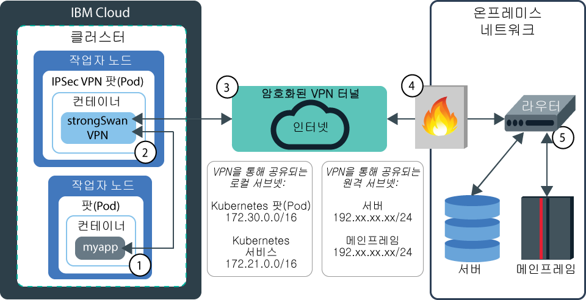

---

copyright:
  years: 2014, 2018
lastupdated: "2018-08-06"

---

{:new_window: target="_blank"}
{:shortdesc: .shortdesc}
{:screen: .screen}
{:pre: .pre}
{:table: .aria-labeledby="caption"}
{:codeblock: .codeblock}
{:tip: .tip}
{:download: .download}


# VPN 연결 설정
{: #vpn}

VPN 연결을 사용하면 {{site.data.keyword.containerlong}}에서 Kubernetes 클러스터의 앱을 온프레미스 네트워크에 안전하게 연결할 수 있습니다. 클러스터 내에서 실행 중인 앱에 클러스터 외부의 앱을 연결할 수도 있습니다.
{:shortdesc}

작업자 노드 및 앱을 온프레미스 데이터센터에 연결하려면 다음 옵션 중 하나를 구성할 수 있습니다.

- **strongSwan IPSec VPN 서비스**: Kubernetes 클러스터를 온프레미스 네트워크와 안전하게 연결하는 [strongSwan IPSec VPN 서비스 ](https://www.strongswan.org/about.html)를 설정할 수 있습니다. strongSwan IPSec VPN 서비스는 업계 표준 IPSec(Internet Protocol Security) 프로토콜 스위트를 기반으로 하는 인터넷 상의 엔드-투-엔드 보안 통신 채널을 제공합니다. 클러스터와 온프레미스 네트워크 간의 보안 연결을 설정하려면 클러스터 내의 팟(Pod)에 직접 [strongSwan IPSec VPN 서비스를 구성하고 배치](#vpn-setup)하십시오.

- **가상 라우터 어플라이언스(VRA) 또는 Fortigate 보안 어플라이언스(FSA)**: [VRA](/docs/infrastructure/virtual-router-appliance/about.html) 또는 [FSA](/docs/infrastructure/fortigate-10g/about.html)를 설정하여 IPSec VPN 엔드포인트를 구성하도록 선택할 수 있습니다. 이 옵션은 대규모 클러스터가 있으며 단일 VPN 에서 다중 클러스터에 액세스하려는 경우 또는 라우트 기반 VPN이 필요한 경우에 유용합니다. VRA를 구성하려면 [VRA를 사용하여 VPN 연결 설정](#vyatta)을 참조하십시오.

## strongSwan IPSec VPN 서비스 Helm 차트 사용
{: #vpn-setup}

Helm 차트를 사용하여 Kubernetes 팟(Pod) 내부에 strongSwan IPSec VPN 서비스를 구성 및 배치하십시오.
{:shortdesc}

strongSwan은 클러스터와 통합되어 있으므로 외부 게이트웨이 디바이스가 필요하지 않습니다. VPN 연결이 설정되면 클러스터 내의 모든 작업자 노드에서 라우트가 자동으로 구성됩니다. 이러한 라우트는 작업자 노드와 원격 시스템 간에 VPN 터널을 통한 양방향 연결을 설정할 수 있게 해 줍니다. 예를 들면, 다음 다이어그램은 {{site.data.keyword.containershort_notm}}의 앱이 strongSwan VPN 연결을 통해 온프레미스 서버와 통신할 수 있는 방법을 보여줍니다.



1. 클러스터 내의 앱 `myapp`이 Ingress 또는 LoadBalancer 서비스로부터 요청을 수신하여 온프레미스 네트워크의 데이터와 안전하게 연결해야 합니다.

2. 온프레미스 데이터센터에 대한 요청이 IPSec strongSwan VPN 팟(Pod)에 전달됩니다. 대상 IP 주소는 IPSec strongSwan VPN 팟(Pod)에 전송할 네트워크 패킷을 판별하는 데 사용됩니다.

3. 요청이 암호화되어 VPN 터널을 통해 온프레미스 데이터센터에 전송됩니다.

4. 수신 요청이 온프레미스 방화벽을 통과해 VPN 터널 엔드포인트(라우터)에 전달되어 여기서 복호화됩니다.

5. VPN 터널 엔드포인트(라우터)는 2단계에서 지정된 대상 IP 주소에 따라 요청을 온프레미스 서버 또는 메인프레임에 전달합니다. 필요한 데이터는 동일한 프로세스를 거쳐 VPN 연결을 통해 `myapp`에 다시 전송됩니다.

## strongSwan VPN 서비스 고려사항
{: strongswan_limitations}

strongSwan Helm 차트를 사용하기 전에 다음 고려사항 및 제한사항을 검토하십시오. 

* strongSwan Helm 차트에서는 NAT 순회가 원격 VPN 엔드포인트에 의해 사용되어야 함을 요구합니다. NAT 순회에서는 500의 기본 IPSec UDP 포트 외에도 UDP 포트 4500이 필요합니다. 두 UDP 포트 모두는 구성된 방화벽을 통해 허용되어야 합니다. 
* strongSwan Helm 차트는 라우트 기반 IPSec VPN을 지원하지 않습니다. 
* strongSwan Helm 차트는 사전 공유된 키를 사용하는 IPSec VPN은 지원하지만 인증서가 필요한 IPSec VPN은 지원하지 않습니다. 
* strongSwan Helm 차트는 다중 클러스터 및 기타 IaaS 리소스의 단일 VPN 연결 공유를 허용하지 않습니다. 
* strongSwan Helm 차트는 클러스터 내의 Kubernetes 팟(Pod)으로서 실행됩니다. VPN 성능은 Kubernetes 및 클러스터에 실행 중인 기타 팟(Pod)의 메모리와 네트워크 사용에 따라 영향을 받습니다. 성능이 중요한 환경을 보유 중이면 전용 하드웨어의 클러스터 외부에서 실행되는 VPN 솔루션의 사용을 고려하십시오. 
* strongSwan Helm 차트는 IPSec 터널 엔드포인트로서 단일 VPN 팟(Pod)을 실행합니다. 팟(Pod)이 실패하면 클러스터가 팟(Pod)을 다시 시작합니다. 그러나 새 팟(Pod)이 시작되고 VPN 연결이 다시 설정되는 동안에는 짧은 작동 중지 시간이 발생할 수 있습니다. 보다 빠른 오류 복구 또는 보다 정교한 고가용성 솔루션이 필요한 경우에는 전용 하드웨어의 클러스터 외부에서 실행되는 VPN 솔루션의 사용을 고려하십시오. 
* strongSwan Helm 차트는 VPN 연결을 통해 전달되는 네트워크 트래픽의 메트릭 또는 모니터링을 제공하지 않습니다. 지원되는 모니터링 도구의 목록은 [로깅 및 모니터링 서비스](cs_integrations.html#health_services)를 참조하십시오. 

## strongSwan Helm 차트 구성
{: #vpn_configure}

시작하기 전에:
* [온프레미스 데이터센터에 IPSec VPN 게이트웨이를 설치](/docs/infrastructure/iaas-vpn/set-up-ipsec-vpn.html#setting-up-an-ipsec-connection)하십시오.
* [표준 클러스터를 작성](cs_clusters.html#clusters_cli)하십시오.
* [클러스터에 Kubernetes CLI를 대상으로 지정](cs_cli_install.html#cs_cli_configure)하십시오.

### 1단계: strongSwan Helm 차트 가져오기
{: #strongswan_1}

1. [클러스터를 위해 Helm을 설치하고 {{site.data.keyword.Bluemix_notm}} 저장소를 Helm 인스턴스에 추가](cs_integrations.html#helm)하십시오.

2. strongSwan Helm 차트를 위한 기본 구성 설정을 로컬 YAML 파일에 저장하십시오.

    ```
    helm inspect values ibm/strongswan > config.yaml
    ```
    {: pre}

3. `config.yaml` 파일을 여십시오. 

### 2단계: 기본 IPSec 설정 구성
{: #strongswan_2}

VPN 연결의 설정을 제어하려면 다음의 기본 IPSec 설정을 수정하십시오. 

각 설정에 대한 자세한 정보를 보려면 Helm 차트에 대한 `config.yaml` 파일 내에서 제공된 문서를 읽으십시오.
{: tip}

1. 온프레미스 VPN 터널 엔드포인트가 연결 초기화를 위한 프로토콜로 `ikev2`를 지원하지 않는 경우에는 `ipsec.keyexchange`의 값을 `ikev1` 또는 `ike`로 변경하십시오. 
2. `ipsec.esp`를 온프레미스 VPN 터널 엔드포인트가 연결에 사용하는 ESP 암호화 및 인증 알고리즘의 목록으로 설정하십시오. 
    * `ipsec.keyexchange`가 `ikev1`로 설정된 경우에는 이 설정을 지정해야 합니다.
    * `ipsec.keyexchange`가 `ikev2`로 설정된 경우 이 설정은 선택사항입니다.
    * 이 설정을 공백으로 두면 기본 strongSwan 알고리즘 `aes128-sha1,3des-sha1`이 연결에 사용됩니다.
3. `ipsec.ike`를 온프레미스 VPN 터널 엔드포인트가 연결에 사용하는 IKE/ISAKMP SA 암호화 및 인증 알고리즘의 목록으로 설정하십시오. 알고리즘은 `encryption-integrity[-prf]-dhgroup` 형식으로 특정해야 합니다. 
    * `ipsec.keyexchange`가 `ikev1`로 설정된 경우에는 이 설정을 지정해야 합니다.
    * `ipsec.keyexchange`가 `ikev2`로 설정된 경우 이 설정은 선택사항입니다.
    * 이 설정을 공백으로 두면 기본 strongSwan 알고리즘 `aes128-sha1-modp2048,3des-sha1-modp1536`이 연결에 사용됩니다.
4. `local.id`의 값을 VPN 터널 엔드포인트가 사용하는 로컬 Kubernetes 클러스터 측을 식별하는 데 사용할 문자열로 변경하십시오. 기본값은 `ibm-cloud`입니다. 일부 VPN 구현에서는 로컬 엔드포인트에 대해 공인 IP 주소를 사용하도록 요구합니다. 
5. `remote.id`의 값을 VPN 터널 엔드포인트가 사용하는 원격 온프레미스 측을 식별하는 데 사용할 문자열로 변경하십시오. 기본값은 `on-prem`입니다. 일부 VPN 구현에서는 원격 엔드포인트에 대해 공인 IP 주소를 사용하도록 요구합니다. 
6. `preshared.secret`의 값을 온프레미스 VPN 터널 엔드포인트 게이트웨이가 연결에 사용하는 사전 공유된 시크릿으로 변경하십시오. 이 값은 `ipsec.secrets`에 저장됩니다.
7. 선택사항: Helm 연결 유효성 검증 테스트의 일부로서 ping을 실행할 수 있도록 `remote.privateIPtoPing`을 원격 서브넷의 사설 IP 주소로 설정하십시오. 

### 3단계: 인바운드 및 아웃바운드 VPN 연결 선택
{: #strongswan_3}

strongSwan VPN 연결을 구성하는 경우, 사용자는 VPN 연결이 클러스터에 인바운드인지 또는 클러스터에서 아웃바운드인지 여부를 선택합니다.
{: shortdesc}

<dl>
<dt>인바운드</dt>
<dd>원격 네트워크의 온프레미스 VPN 엔드포인트는 VPN 연결을 시작하고 클러스터는 연결을 청취합니다. </dd>
<dt>아웃바운드</dt>
<dd>클러스터는 VPN 연결을 시작하고 원격 네트워크의 온프레미스 VPN 엔드포인트는 연결을 청취합니다. </dd>
</dl>

인바운드 VPN 연결을 설정하려면 다음 설정을 수정하십시오. 
1. `ipsec.auto`가 `add`로 설정되었는지 확인하십시오. 
2. 선택사항: `loadBalancerIP`를 strongSwan VPN 서비스에 대한 포터블 공인 IP 주소로 설정하십시오. 온프레미스 방화벽을 통과할 수 있는 IP 주소를 지정해야 하는 경우와 같이 고정 IP 주소가 필요한 경우에는 IP 주소를 지정하는 것이 유용합니다. 클러스터에는 하나 이상의 사용 가능한 공인 로드 밸런서 IP 주소가 있어야 합니다. [사용 가능한 공인 IP 주소를 볼 수 있는지 확인](cs_subnets.html#review_ip)하거나 [사용된 IP 주소를 해제](cs_subnets.html#free)할 수 있습니다.<br>**참고**:
    * 이 설정을 공백으로 두면 사용 가능한 포터블 공인 IP 주소 중 하나가 사용됩니다. 
    * 사용자는 온프레미스 VPN 엔드포인트에서 클러스터 VPN 엔드포인트에 지정된 공인 IP 주소 또는 자신이 선택하는 공인 IP 주소도 구성해야 합니다. 

아웃바운드 VPN 연결을 설정하려면 다음 설정을 수정하십시오. 
1. `ipsec.auto`를 `start`로 변경하십시오. 
2. `remote.gateway`를 원격 네트워크의 온프레미스 VPN 게이트웨이에 대한 공인 IP 주소로 설정하십시오. 
3. 클러스터 VPN 엔드포인트의 IP 주소에 대해 다음 옵션 중 하나를 선택하십시오. 
    * **클러스터의 사설 게이트웨이의 공인 IP 주소**: 작업자 노드가 사설 VLAN에만 연결되어 있는 경우, 아웃바운드 VPN 요청은 인터넷에 도달하기 위해 사설 게이트웨이를 통해 라우팅됩니다. 사설 게이트웨이의 공인 IP 주소는 VPN 연결에 사용됩니다. 
    * **strongSwan 팟(Pod)이 실행 중인 작업자 노드의 공인 IP 주소**: strongSwan 팟(Pod)이 실행 중인 작업자 노드가 공용 VLAN에 연결되어 있으면 작업자 노드의 공인 IP 주소가 VPN 연결에 사용됩니다.
        <br>**참고**:
        * strongSwan 팟(Pod)이 삭제되었으며 클러스터의 다른 작업자 노드로 다시 스케줄된 경우에는 VPN의 공인 IP 주소가 변경됩니다. 원격 네트워크의 온프레미스 VPN 엔드포인트는 VPN 연결이 클러스터 작업자 노드의 공인 IP 주소에서 설정되도록 허용해야 합니다. 
        * 원격 VPN 엔드포인트가 여러 공인 IP 주소의 VPN 연결을 처리할 수 없는 경우에는 strongSwan VPN 팟(Pod)이 배치되는 노드를 제한하십시오. `nodeSelector`를 작업자 노드 레이블 또는 특정 작업자 노드의 IP 주소로 설정하십시오. 예를 들어, `kubernetes.io/hostname: 10.232.xx.xx` 값은 VPN 팟(Pod)이 해당 작업자 노드에만 배치되도록 허용합니다. 값 `strongswan: vpn`은 VPN 팟(Pod)을 해당 레이블과 함께 모든 작업자 노드에서 실행하도록 제한합니다. 임의의 작업자 노드 레이블을 사용할 수 있습니다. 서로 다른 작업자 노드가 서로 다른 helm 차트 배치에서 사용될 수 있도록 허용하려면 `strongswan: <release_name>`을 사용하십시오. 고가용성을 위해서는 최소한 2개의 작업자 노드를 선택하십시오. 
    * **strongSwan 서비스의 공인 IP 주소**: strongSwan VPN 서비스의 공인 IP 주소를 사용하여 연결을 설정하려면 `connectUsingLoadBalancerIP`를 `true`로 설정하십시오. strongSwan 서비스 IP 주소는 `loadBalancerIP` 설정에서 지정할 수 있는 포터블 공인 IP 주소이거나 서비스에 자동으로 지정되는 사용 가능한 포터블 공인 IP 주소입니다.
        <br>**참고**:
        * `loadBalancerIP` 설정을 사용한 IP 주소 선정을 선택하는 경우, 클러스터에는 최소한 1개의 사용 가능한 공용 로드 밸런서 IP 주소가 있어야 합니다. [사용 가능한 공인 IP 주소를 볼 수 있는지 확인](cs_subnets.html#review_ip)하거나 [사용된 IP 주소를 해제](cs_subnets.html#free)할 수 있습니다.
        * 모든 클러스터 작업자 노드는 동일한 공용 VLAN에 있어야 합니다. 그렇지 않은 경우에는 `nodeSelector` 설정을 사용하여 VPN 팟(Pod)이 `loadBalancerIP`와 동일한 사설 VLAN의 작업자 노드에 배치되도록 해야 합니다.
        * `connectUsingLoadBalancerIP`가 `true`로 설정되었으며 `ipsec.keyexchange`가 `ikev1`로 설정된 경우에는 `enableServiceSourceIP`를 `true`로 설정해야 합니다. 

### 단계 4: VPN 연결을 통한 클러스터 리소스 액세스
{: #strongswan_4}

VPN 연결을 통해 원격 네트워크가 액세스할 수 있어야 하는 클러스터 리소스를 판별하십시오.
{: shortdesc}

1. 하나 이상의 클러스터 서브넷의 CIDR을 `local.subnet` 설정에 추가하십시오. 사용자는 온프레미스 VPN 엔드포인트에서 로컬 서브넷 CIDR을 구성해야 합니다. 이 목록은 다음 서브넷을 포함할 수 있습니다.  
    * Kubernetes 팟(Pod) 서브넷 CIDR: `172.30.0.0/16`. 양방향 통신은 `remote.subnet` 설정에서 나열된 원격 네트워크 서브넷의 임의의 호스트와 모든 클러스터 팟(Pod) 간에 사용됩니다. 보안상의 이유 때문에 `remote.subnet` 호스트가 클러스터 팟(Pod)에 액세스하지 못하도록 차단하는 경우에는 Kubernetes 팟(Pod) 서브넷을 `local.subnet` 설정에 추가하지 마십시오. 
    * Kubernetes 서비스 서브넷 CIDR: `172.21.0.0/16`. 서비스 IP 주소는 단일 IP 뒤의 여러 작업자 노드에 배치된 다중 앱 팟(Pod)을 노출하는 방법을 제공합니다. 
    * 사설 Ingress ALB 또는 사설 네트워크의 NodePort 서비스에서 앱을 노출한 경우에는 작업자 노드의 사설 서브넷 CIDR을 추가하십시오. `ibmcloud ks worker <cluster_name>`을 실행하여 작업자의 사설 IP 주소의 처음 세 옥텟을 검색하십시오. 예를 들어, 주소가 `10.176.48.xx`인 경우에는 `10.176.48`을 기록하십시오. 그리고  `ibmcloud sl subnet list | grep <xxx.yyy.zzz>` 명령을 실행하여 작업자 사설 서브넷 CIDR을 가져오되, 명령에서 `<xxx.yyy.zz>`를 이전에 검색한 옥텟으로 대체하십시오. <br>**참고**: 작업자 노드가 새 사설 서브넷에서 추가된 경우에는 새 사설 서브넷 CIDR을 온프레미스 VPN 엔드포인트 및 `local.subnet` 설정에 추가해야 합니다. 그리고 VPN 연결을 다시 시작해야 합니다. 
    * 사설 네트워크에서 LoadBalancer 서비스가 노출한 앱이 있는 경우에는 클러스터의 사설 사용자 관리 서브넷 CIDR을 추가하십시오. 이러한 값을 찾으려면 `ibmcloud ks cluster-get <cluster_name> --showResources`를 실행하십시오. **VLANS** 섹션에서 **Public** 값이 `false`인 CIDR을 찾으십시오.<br>
    **참고**: `ipsec.keyexchange`가 `ikev1`로 설정된 경우에는 하나의 서브넷만 지정할 수 있습니다. 그러나 사용자는 `localSubnetNAT` 설정을 사용하여 다중 클러스터 서브넷을 단일 서브네트로 결합할 수 있습니다. 

2. 선택사항: `localSubnetNAT` 설정을 사용하여 클러스터 서브넷을 다시 맵핑하십시오. 서브넷에 대한 NAT(Network Address Translation)는 클러스터 네트워크 및 온프레미스 원격 네트워크 간의 서브넷 충돌에 대한 임시 해결책을 제공합니다. NAT를 사용하여 클러스터의 사설 로컬 IP 서브넷, 팟(Pod) 서브넷(172.30.0.0/16) 또는 팟(Pod) 서비스 서브넷(172.21.0.0/16)을 다른 사설 서브넷에 다시 맵핑할 수 있습니다. VPN 터널에서 원래의 서브넷 대신 다시 맵핑된 IP 서브넷을 확인합니다. VPN을 통해 패킷을 전송하기 전과 VPN 터널에서 패킷이 도달된 후에 다시 맵핑이 발생합니다. VPN을 통해 동시에 다시 맵핑되고 다시 맵핑되지 않은 서브넷을 모두 노출할 수 있습니다. NAT를 사용하려면 전체 서브넷 또는 개별 IP 주소를 추가할 수 있습니다.
    * `10.171.42.0/24=10.10.10.0/24` 형식의 전체 서브넷을 추가하는 경우, 리맵핑(remapping)은 1 대 1입니다. 내부 네트워크 서브넷의 모든 IP 주소가 외부 네트워크 서브넷으로 맵핑되며, 반대의 경우도 마찬가지입니다. 
    * `10.171.42.17/32=10.10.10.2/32,10.171.42.29/32=10.10.10.3/32` 형식의 개별 IP 주소를 추가하는 경우에는 해당되는 IP 주소만 지정된 외부 IP 주소로 맵핑됩니다. 

3. 버전 2.2.0 이상 strongSwan Helm 차트에 대한 선택사항: `enableSingleSourceIP`를 `true`로 설정하여 모든 클러스터 IP 주소를 단일 IP 주소 뒤에 숨기십시오. 원격 네트워크에서 다시 클러스터로 연결이 허용되지 않으므로, 이 옵션은 VPN 연결에 대한 가장 안전한 구성 중 하나를 제공합니다.
    <br>**참고**:
    * 이 설정에서는 클러스터에서 또는 원격 네트워크에서 VPN 연결이 설정되었는지 여부에 관계없이 VPN 연결 상의 모든 데이터 플로우가 아웃바운드여야 함을 요구합니다. 
    * `local.subnet`은 오직 하나의 /32 서브넷으로 설정되어야 합니다. 

4. 버전 2.2.0 이상 strongSwan Helm 차트에 대한 선택사항: `localNonClusterSubnet` 설정을 사용하여 원격 네트워크의 수신 요청을 클러스터 외부에 존재하는 서비스로 라우팅하는 strongSwan 서비스를 사용하십시오.
    <br>**참고**:
    * 비-클러스터 서비스는 동일한 사설 네트워크에 또는 작업자 노드가 접근할 수 있는 사설 네트워크에 존재해야 합니다. 
    * 비-클러스터 작업자 노드는 VPN 연결을 통해 원격 네트워크에 대한 트래픽을 시작할 수 없지만, 비-클러스터 노드는 원격 네트워크의 수신 요청의 대상이 될 수 있습니다. 
    * 사용자는 `local.subnet` 설정에서 비-클러스터 서브넷의 CIDR을 나열해야 합니다. 

### 5단계: VPN 연결을 통한 원격 네트워크 리소스 액세스
{: #strongswan_5}

VPN 연결을 통해 클러스터가 액세스할 수 있어야 하는 원격 네트워크 리소스를 판별하십시오.
{: shortdesc}

1. 하나 이상의 온프레미스 사설 서브넷의 CIDR을 `remote.subnet` 설정에 추가하십시오.
    <br>**참고**: `ipsec.keyexchange`가 `ikev1`로 설정된 경우에는 하나의 서브넷만 지정할 수 있습니다.
2. 버전 2.2.0 이상 strongSwan Helm 차트의 선택사항: `remoteSubnetNAT` 설정을 사용하여 원격 네트워크 서브넷을 재맵핑하십시오. 서브넷에 대한 NAT(Network Address Translation)는 클러스터 네트워크 및 온프레미스 원격 네트워크 간의 서브넷 충돌에 대한 임시 해결책을 제공합니다. NAT를 사용하여 원격 네트워크의 IP 서브넷을 다른 사설 서브넷에 재맵핑할 수 있습니다. VPN 터널에서 원래의 서브넷 대신 다시 맵핑된 IP 서브넷을 확인합니다. VPN을 통해 패킷을 전송하기 전과 VPN 터널에서 패킷이 도달된 후에 다시 맵핑이 발생합니다. VPN을 통해 동시에 다시 맵핑되고 다시 맵핑되지 않은 서브넷을 모두 노출할 수 있습니다.

### 6단계: Helm 차트 배치
{: #strongswan_6}

1. 보다 고급 설정을 구성해야 하는 경우에는 Helm 차트의 각 설정에 대해 제공된 문서를 따르십시오. 

2. **중요**: Helm 차트의 설정이 필요하지 않으면 앞에 `#`을 지정하여 해당 특성을 주석 처리하십시오. 

3. 업데이트된 `config.yaml` 파일을 저장하십시오.

4. 업데이트된 `config.yaml` 파일로 Helm 차트를 클러스터에 설치하십시오. 업데이트된 특성은 차트의 configmap에 저장됩니다.

    **참고**: 단일 클러스터에 다중 VPN 배치가 있는 경우 이름 지정 충돌을 방지할 수 있고 `vpn` 이외의 좀 더 구체적인 릴리스 이름을 선택하여 배치를 구별할 수 있습니다. 릴리스 이름이 잘리지 않으려면 릴리스 이름을 35자 미만으로 제한하십시오.

    ```
    helm install -f config.yaml --name=vpn ibm/strongswan
    ```
    {: pre}

5. 차트 배치 상태를 확인하십시오. 차트가 준비 상태인 경우, 출력의 맨 위 근처에 있는 **STATUS** 필드의 값은 `DEPLOYED`입니다.

    ```
    helm status vpn
    ```
    {: pre}

6. 차트가 배치된 후 `config.yaml` 파일에서 업데이트된 설정이 사용되었는지 확인하십시오.

    ```
    helm get values vpn
    ```
    {: pre}

## strongSwan VPN 연결 테스트 및 확인
{: #vpn_test}

Helm 차트를 배치한 후 VPN 연결을 테스트하십시오.
{:shortdesc}

1. 온프레미스 게이트웨이에서 VPN이 활성이 아닌 경우 VPN을 시작하십시오.

2. `STRONGSWAN_POD` 환경 변수를 설정하십시오.

    ```
    export STRONGSWAN_POD=$(kubectl get pod -l app=strongswan,release=vpn -o jsonpath='{ .items[0].metadata.name }')
    ```
    {: pre}

3. VPN의 상태를 확인하십시오. `ESTABLISHED` 상태는 VPN 연결이 성공임을 의미합니다.

    ```
    kubectl exec $STRONGSWAN_POD -- ipsec status
    ```
    {: pre}

    출력 예:

    ```
    Security Associations (1 up, 0 connecting):
    k8s-conn[1]: ESTABLISHED 17 minutes ago, 172.30.xxx.xxx[ibm-cloud]...192.xxx.xxx.xxx[on-premises]
    k8s-conn{2}: INSTALLED, TUNNEL, reqid 12, ESP in UDP SPIs: c78cb6b1_i c5d0d1c3_o
    k8s-conn{2}: 172.21.0.0/16 172.30.0.0/16 === 10.91.152.xxx/26
    ```
    {: screen}

    **참고**:

    <ul>
    <li>strongSwan Helm 차트를 사용하여 VPN 연결을 설정하려는 경우 처음에 VPN 상태는 `ESTABLISHED`가 아닐 수 있습니다. 연결이 성공하기 전에 온프레미스 VPN 엔드포인트 설정을 확인하고 구성 파일을 여러 번 변경해야 할 수도 있습니다. <ol><li>`helm delete --purge <release_name>`을 실행하십시오.</li><li>구성 파일에서 올바르지 않은 값을 수정하십시오.</li><li>`helm install -f config.yaml --name=<release_name> ibm/strongswan`을 실행하십시오.</li></ol>다음 단계에서 추가 확인을 실행할 수도 있습니다.</li>
    <li>VPN 팟(Pod)이 `ERROR` 상태이거나 계속 충돌하고 다시 시작되는 경우, 차트의 configmap에 있는 `ipsec.conf` 설정의 매개변수 유효성 검증 때문일 수 있습니다.<ol><li>`kubectl logs -n $STRONGSWAN_POD`를 실행하여 strongSwan 팟(Pod) 로그에서 유효성 검증 오류가 있는지 확인하십시오.</li><li>유효성 검증 오류가 있는 경우 `helm delete --purge <release_name>`을 실행하십시오.<li>구성 파일에서 올바르지 않은 값을 수정하십시오.</li><li>`helm install -f config.yaml --name=<release_name> ibm/strongswan`을 실행하십시오.</li></ol>클러스터에 많은 수의 작업자 로드가 있는 경우에는 `helm delete` 및 `helm install`을 실행하는 대신 `helm upgrade`를 사용하여 변경사항을 더 빠르게 적용할 수도 있습니다.</li>
    </ul>

4. strongSwan 차트 정의에 포함된 5회의 Helm 테스트를 실행하여 VPN 연결을 추가로 테스트할 수 있습니다.

    ```
    helm test vpn
    ```
    {: pre}

    * 모든 테스트에 통과하면 strongSwan VPN 연결이 설정됩니다.

    * 테스트에 실패한 경우 다음 단계로 진행하십시오.

5. 테스트 팟(Pod)의 로그를 확인하여 실패한 테스트의 출력을 보십시오.

    ```
    kubectl logs <test_program>
    ```
    {: pre}

    **참고**: 일부 테스트에는 VPN 구성에서 선택적 설정인 요구사항이 포함됩니다. 일부 테스트가 실패하는 경우 실패는 선택적 설정의 지정 여부에 따라 허용될 수 있습니다. 각 테스트에 대한 자세한 정보와 실패 이유는 다음 표를 참조하십시오.

    {: #vpn_tests_table}
    <table>
    <caption>Helm VPN 연결 테스트 이해</caption>
    <thead>
    <th colspan=2> Helm VPN 연결 테스트 이해</th>
    </thead>
    <tbody>
    <tr>
    <td><code>vpn-strongswan-check-config</code></td>
    <td><code>config.yaml</code> 파일에서 생성된 <code>ipsec.conf</code> 파일의 구문을 유효성 검증하십시오. 이 테스트는 <code>config.yaml</code> 파일의 올바르지 않은 값으로 인해 실패할 수 있습니다.</td>
    </tr>
    <tr>
    <td><code>vpn-strongswan-check-state</code></td>
    <td>VPN 연결이 <code>ESTABLISHED</code> 상태인지 확인합니다. 다음과 같은 이유로 인해 이 테스트가 실패할 수 있습니다.<ul><li><code>config.yaml</code> 파일의 값 및 온프레미스 VPN 엔드포인트 설정 간에 차이점이 있습니다.</li><li>클러스터가 "청취" 모드에 있는 경우(<code>ipsec.auto</code>가 <code>add</code>로 설정됨) 연결이 온프레미스 측에 설정되지 않습니다.</li></ul></td>
    </tr>
    <tr>
    <td><code>vpn-strongswan-ping-remote-gw</code></td>
    <td><code>config.yaml</code> 파일에 구성한 <code>remote.gateway</code> 공인 IP 주소에 대해 ping을 실행합니다. 다음과 같은 이유로 인해 이 테스트가 실패할 수 있습니다.<ul><li>온프레미스 VPN 게이트웨이 IP 주소를 지정하지 않았습니다. <code>ipsec.auto</code>가 <code>start</code>로 설정된 경우 <code>remote.gateway</code> IP 주소가 필수입니다.</li><li>VPN 연결이 <code>ESTABLISHED</code> 상태가 아닙니다. 자세한 정보는 <code>vpn-strongswan-check-state</code>를 참조하십시오.</li><li>VPN 연결 상태는 <code>ESTABLISHED</code>이지만 ICMP 패킷이 방화벽으로 차단됩니다.</li></ul></td>
    </tr>
    <tr>
    <td><code>vpn-strongswan-ping-remote-ip-1</code></td>
    <td>클러스터의 VPN 팟(Pod)에서 온프레미스 VPN 게이트웨이의 <code>remote.privateIPtoPing</code> 게이트웨이 IP 주소에 대해 ping을 실행합니다. 다음과 같은 이유로 인해 이 테스트가 실패할 수 있습니다.<ul><li><code>remote.privateIPtoPing</code> IP 주소를 지정하지 않았습니다. 의도적으로 IP 주소를 지정하지 않은 경우 이 실패는 허용됩니다.</li><li><code>local.subnet</code> 목록에 있는 클러스터 팟(Pod) 서브넷 CIDR인 <code>172.30.0.0/16</code>을 지정하지 않았습니다.</li></ul></td>
    </tr>
    <tr>
    <td><code>vpn-strongswan-ping-remote-ip-2</code></td>
    <td>클러스터의 작업자 노드에서 온프레미스 VPN 게이트웨이의 <code>remote.privateIPtoPing</code> 게이트웨이 IP 주소에 대해 ping을 실행합니다. 다음과 같은 이유로 인해 이 테스트가 실패할 수 있습니다.<ul><li><code>remote.privateIPtoPing</code> IP 주소를 지정하지 않았습니다. 의도적으로 IP 주소를 지정하지 않은 경우 이 실패는 허용됩니다.</li><li><code>local.subnet</code> 목록에 있는 클러스터 작업자 노드 사설 서브넷 CIDR을 지정하지 않았습니다.</li></ul></td>
    </tr>
    </tbody></table>

6. 현재 Helm 차트를 삭제하십시오.

    ```
    helm delete --purge vpn
    ```
    {: pre}

7. `config.yaml` 파일을 열고 올바르지 않은 값을 수정하십시오.

8. 업데이트된 `config.yaml` 파일을 저장하십시오.

9. 업데이트된 `config.yaml` 파일로 Helm 차트를 클러스터에 설치하십시오. 업데이트된 특성은 차트의 configmap에 저장됩니다.

    ```
    helm install -f config.yaml --name=<release_name> ibm/strongswan
    ```
    {: pre}

10. 차트 배치 상태를 확인하십시오. 차트가 준비 상태인 경우, 출력의 맨 위 근처에 있는 **STATUS** 필드의 값은 `DEPLOYED`입니다.

    ```
    helm status vpn
    ```
    {: pre}

11. 차트가 배치된 후 `config.yaml` 파일에서 업데이트된 설정이 사용되었는지 확인하십시오.

    ```
    helm get values vpn
    ```
    {: pre}

12. 현재 테스트 팟(Pod)을 정리하십시오.

    ```
    kubectl get pods -a -l app=strongswan-test
    ```
    {: pre}

    ```
    kubectl delete pods -l app=strongswan-test
    ```
    {: pre}

13. 테스트를 다시 실행하십시오.

    ```
    helm test vpn
    ```
    {: pre}

<br />


## strongSwan Helm 차트 업그레이드
{: #vpn_upgrade}

strongSwan Helm 차트를 업그레이드하여 최신 상태인지 확인하십시오.
{:shortdesc}

strongSwan Helm 차트를 최신 버전으로 업그레이드하려면 다음을 수행하십시오.

  ```
  helm upgrade -f config.yaml <release_name> ibm/strongswan
  ```
  {: pre}

**중요**: strongSwan 2.0.0 Helm 차트는 Calico v3 또는 Kubernetes 1.10에서 작동하지 않습니다. 
[클러스터를 1.10으로 업데이트](cs_versions.html#cs_v110)하기 전에, Calico 2.6 및 Kubernetes 1.8 및 1.9와 역호환이 가능한 2.2.0 Helm 차트로 strongSwan을 업데이트하십시오. 

클러스터를 Kubernetes 1.10으로 업데이트 중이십니까? 우선 반드시 strongSwan Helm 차트를 삭제하십시오. 그리고 업데이트 후에 이를 다시 설치하십시오.
{:tip}

### 버전 1.0.0에서 업그레이드
{: #vpn_upgrade_1.0.0}

버전 1.0.0 Helm 차트에 사용된 일부 설정으로 인해 `helm upgrade`를 사용하여 1.0.0에서 최신 버전으로 업데이트할 수 없습니다.
{:shortdesc}

버전 1.0.0에서 업그레이드하려면 1.0.0 차트를 삭제하고 최신 버전을 설치해야 합니다.

1. 1.0.0 Helm 차트를 삭제하십시오.

    ```
    helm delete --purge <release_name>
    ```
    {: pre}

2. 최신 버전의 strongSwan Helm 차트를 위한 기본 구성 설정을 로컬 YAML 파일에 저장하십시오.

    ```
    helm inspect values ibm/strongswan > config.yaml
    ```
    {: pre}

3. 구성 파일을 업데이트하고 변경사항을 포함하여 파일을 저장하십시오.

4. 업데이트된 `config.yaml` 파일로 Helm 차트를 클러스터에 설치하십시오.

    ```
    helm install -f config.yaml --name=<release_name> ibm/strongswan
    ```
    {: pre}

또한 1.0.0에서 하드 코딩된 특정 `ipsec.conf` 제한시간 설정은 이후 버전에서 구성 가능한 특성으로 노출됩니다. 일부 구성 가능한 `ipsec.conf` 제한시간 설정의 이름 및 기본값도 strongSwan 표준과 좀 더 일치하도록 변경되었습니다. 1.0.0에서 Helm 차트를 업그레이드하는 중이고 제한시간 설정의 1.0.0 버전 기본값을 보존하려면 이전 기본값을 사용하여 새 설정을 차트 구성 파일에 추가하십시오.


  <table>
  <caption>버전 1.0.0과 최신 버전 간의 ipsec.conf 설정 차이점</caption>
  <thead>
  <th>1.0.0 설정 이름</th>
  <th>1.0.0 기본값</th>
  <th>최신 버전 설정 이름</th>
  <th>최신 버전 기본값</th>
  </thead>
  <tbody>
  <tr>
  <td><code>ikelifetime</code></td>
  <td>60m</td>
  <td><code>ikelifetime</code></td>
  <td>3h</td>
  </tr>
  <tr>
  <td><code>keylife</code></td>
  <td>20m</td>
  <td><code>lifetime</code></td>
  <td>1h</td>
  </tr>
  <tr>
  <td><code>rekeymargin</code></td>
  <td>3m</td>
  <td><code>margintime</code></td>
  <td>9m</td>
  </tr>
  </tbody></table>


## strongSwan IPSec VPN 서비스 사용 안함
{: vpn_disable}

Helm 차트를 삭제하여 VPN 연결을 사용 안함으로 설정할 수 있습니다.
{:shortdesc}

  ```
  helm delete --purge <release_name>
  ```
  {: pre}

<br />


## 가상 라우터 어플라이언스 사용
{: #vyatta}

[가상 라우터 어플라이언스(VRA)](/docs/infrastructure/virtual-router-appliance/about.html)는 x86 베어메탈 서버에 대한 최신 Vyatta 5600 운영 체제를 제공합니다. VRA를 VPN 게이트웨이로 사용하여 온프레미스 네트워크에 안전하게 연결할 수 있습니다.
{:shortdesc}

클러스터 VLAN에 들어오거나 나가는 모든 공용 및 사설 네트워크 트래픽은 VRA를 통해 라우팅됩니다. VRA를 VPN 엔드포인트로 사용하여 IBM Cloud 인프라(SoftLayer)의 서버와 온프레미스 리소스 간에 암호화된 IPSec 터널을 작성할 수 있습니다. 예를 들어, 다음 다이어그램은 {{site.data.keyword.containershort_notm}}에 있는 개인 전용 작업자 노드의 앱이 VRA VPN 연결을 통해 온프레미스 서버와 통신할 수 있는 방법을 보여줍니다.


1. 클러스터 내의 앱 `myapp2`가 Ingress 또는 LoadBalancer 서비스로부터 요청을 수신하여 온프레미스 네트워크의 데이터와 안전하게 연결해야 합니다.

2. `myapp2`는 사설 VLAN 전용의 작업자 노드에 있으므로 VRA는 작업자 노드와 온프레미스 네트워크 간의 보안 연결 역할을 수행합니다. VRA는 대상 IP 주소를 사용하여 온프레미스 네트워크에 전송할 네트워크 패킷을 판별합니다.

3. 요청이 암호화되어 VPN 터널을 통해 온프레미스 데이터센터에 전송됩니다.

4. 수신 요청이 온프레미스 방화벽을 통과해 VPN 터널 엔드포인트(라우터)에 전달되어 여기서 복호화됩니다.

5. VPN 터널 엔드포인트(라우터)는 2단계에서 지정된 대상 IP 주소에 따라 요청을 온프레미스 서버 또는 메인프레임에 전달합니다. 필요한 데이터는 동일한 프로세스를 거쳐 VPN 연결을 통해 `myapp2`에 다시 전송됩니다.

가상 라우터 어플라이언스를 설정하려면 다음을 수행하시시오.

1. [VRA를 주문](/docs/infrastructure/virtual-router-appliance/getting-started.html)하십시오.

2. [VRA에서 사설 VLAN을 구성](/docs/infrastructure/virtual-router-appliance/manage-vlans.html)하십시오.

3. VRA를 사용하여 VPN 연결을 사용으로 설정하려면 [VRA에서 VRRP를 구성](/docs/infrastructure/virtual-router-appliance/vrrp.html#high-availability-vpn-with-vrrp)하십시오.

**참고**: 기존 라우터 어플라이언스가 있으며 클러스터를 추가하는 경우, 클러스터에 대해 주문된 새 포터블 서브넷은 라우터 어플라이언스에서 구성되지 않습니다. 네트워크 서비스를 사용하려면 [VLAN Spanning을 사용으로 설정](cs_subnets.html#subnet-routing)하여 동일한 VLAN의 서브넷 간에 라우팅을 사용하도록 설정해야 합니다. 
